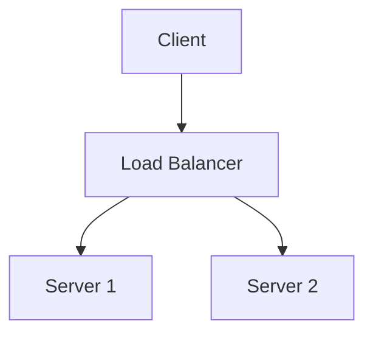

# Diagram Guidelines

Guidelines for creating and managing diagrams on sujeet.pro using [diagramkit](https://github.com/nicholasgriffintn/diagramkit).

## Supported Formats

| Format     | Extensions                       | Best For                                                   |
| ---------- | -------------------------------- | ---------------------------------------------------------- |
| Mermaid    | `.mermaid`, `.mmd`               | Flowcharts, sequence diagrams, state machines, ER diagrams |
| Excalidraw | `.excalidraw`                    | Hand-drawn style, conceptual diagrams                      |
| Draw.io    | `.drawio`, `.drawio.xml`, `.dio` | Complex architecture diagrams                              |
| Graphviz   | `.dot`, `.gv`, `.graphviz`       | Graph layouts, dependency trees                            |

**Prefer Mermaid** for most diagrams. Use Excalidraw for conceptual/hand-drawn style. Use Draw.io for complex multi-layer architecture.

## File Organization

Place diagram source files in a sibling `diagrams/` directory:

```
content/articles/<slug>/
  README.md
  diagrams/
    flow.mermaid              # Source file (committed)
    flow-light.svg            # Generated output (gitignored)
    flow-dark.svg             # Generated output (gitignored)
```

## Naming

- Use descriptive names: `request-lifecycle.mermaid`, not `diagram1.mermaid`
- One concept per diagram — keep focused
- Name reflects what the diagram shows, not where it appears

## Rendering

```bash
npm run diagrams               # Render changed diagrams only (manifest-cached)
npm run diagrams:force         # Re-render all diagrams
npm run diagrams:watch         # Watch for changes and re-render
```

diagramkit generates `<name>-light.svg` and `<name>-dark.svg` in the same folder as the source file. Config is in `diagramkit.config.json5` at project root.

## Referencing in Markdown

Use a `<picture>` tag with a `<source>` for dark mode:

```html
<picture>
  <source media="(prefers-color-scheme: dark)" srcset="./diagrams/name-dark.svg" />
  
</picture>
```

For diagrams with a caption:

```html
<figure>
  <picture>
    <source media="(prefers-color-scheme: dark)" srcset="./diagrams/name-dark.svg" />
    
  </picture>
  <figcaption>Caption describing the diagram</figcaption>
</figure>
```

## Key Rules

1. **Never generate SVG directly.** Write source files and run `npm run diagrams`.
2. **Every diagram must have alt text** that describes what it shows (accessibility).
3. **Always generate both light and dark variants** (diagramkit does this by default with `theme: "both"`).
4. **Keep diagrams focused** — one concept per file. Split complex diagrams into multiple files.
5. **Update diagrams when content changes.** If the concept a diagram illustrates changes, update the source file.
6. **Delete unused diagrams.** When removing a diagram reference from markdown:
   - Delete the source file (`.mermaid`, `.excalidraw`, etc.)
   - Delete the rendered SVGs (`*-light.svg`, `*-dark.svg`)
   - Remove the `<picture>` tag from markdown
   - Clean up manifest entries if present

## When to Add Diagrams

Add a diagram when the content describes:

- System architecture or component relationships
- Request/data flows through a system
- State machines or lifecycle transitions
- Sequence of interactions between components
- Decision trees or branching logic
- Comparison of approaches (as a visual summary)

Do NOT add diagrams for:

- Simple concepts that prose explains clearly
- Code-level details better shown as code blocks
- Lists or enumerations (use markdown lists instead)

## Mermaid Tips



- Use `graph TD` (top-down) or `graph LR` (left-right) based on flow direction
- Keep node labels short and clear
- Use subgraphs for logical grouping
- Avoid more than ~15 nodes in a single diagram

## diagramkit Configuration

Project config at `diagramkit.config.json5`:

```json5
{
  outputDir: ".diagramkit",
  defaultFormats: ["svg"],
  defaultTheme: "both",
  sameFolder: true,
  useManifest: true,
}
```

For full CLI options and API: `node_modules/diagramkit/llms.txt`
