# Accessibility Testing and Tooling Workflow

Most accessibility regressions ship not because tools are missing, but because teams treat one tool as the whole stack. Static lint rules catch the wrong half of issues to gate a deploy on; runtime engines like axe-core do the heavy lifting on rendered DOM but ignore questions of meaning; manual passes find what nothing else can but are too expensive to run on every PR. This article lays out a layered workflow — IDE → component → end-to-end → URL audit → manual — and is opinionated about which engine to put at each layer, how to wire it into CI without flakes, and which residue must always be tested by hand.

The reader profile is a senior engineer or accessibility lead deciding what to instrument, not a beginner learning what an `aria-label` is. The success bar is that after one read you can: pick the right runner per layer, justify the choice with rule-coverage data, write a CI gate that fails only on real violations, and explain what manual testing is still buying you.




## Mental model: three coverage axes that do not collapse

Before picking tools, separate three axes that conversations routinely conflate.

1. **Criteria coverage** — what fraction of [WCAG 2.2's 86 success criteria](https://www.w3.org/TR/WCAG22/) any tool can give a definite pass/fail on. This number is small. [Accessible.org's analysis](https://accessible.org/automated-scans-wcag/) of WCAG 2.2 AA puts it at roughly 13% reliably testable, 45% partially testable, and 42% not automatable at all.
2. **Issue volume** — what fraction of the _bugs that actually exist on real pages_ a tool catches. This is what the [Deque coverage report](https://www.deque.com/automated-accessibility-coverage-report/) measures: across 13,000+ pages and ~300,000 issues, axe-core flagged 57.38% of them.[^1]
3. **Engineering pipeline phase** — IDE, component test, E2E test, full-page audit, manual pass. Each phase has different blast radius and different latency budgets.

Treating "57%" and "13%" as contradictory is the most common confusion: they answer different questions. A small number of high-frequency rules (contrast, missing labels, duplicate IDs) generate most of the volume in the wild — so a low fraction of criteria can still cover a high fraction of bugs.

> [!IMPORTANT]
> The 57% figure measures issue volume on a real corpus, not WCAG criteria coverage. Quoting it as "57% of WCAG" is wrong, and it is the misquote that gets product owners to over-trust automation.

| Layer of coverage                             | Catches                                                              | Notes                                                                                                                                                                                                                                                            |
| --------------------------------------------- | -------------------------------------------------------------------- | ---------------------------------------------------------------------------------------------------------------------------------------------------------------------------------------------------------------------------------------------------------------- |
| **Static analysis** (eslint-plugin-jsx-a11y)  | Missing alt attributes, invalid ARIA roles/props, JSX semantic slips | 36 active rules in the v6.10 line (3 more deprecated), [`recommended` config](https://github.com/jsx-eslint/eslint-plugin-jsx-a11y); zero runtime cost.                                                                                                         |
| **Runtime automation** (axe-core, Pa11y)      | Contrast ratios, duplicate IDs, missing labels, ARIA state validity  | Engines test the rendered DOM. axe-core is built around the [_zero false positives_ manifesto](https://github.com/dequelabs/axe-core?tab=readme-ov-file#about-axe), so it is safe to gate CI on. Pa11y can run axe-core, HTML CodeSniffer, or both side by side. |
| **Manual testing** (keyboard, screen readers) | Focus order logic, content meaning, navigation consistency           | Roughly 42% of WCAG 2.2 AA criteria cannot be automated[^2]; focus order and alt-text quality are the canonical examples.                                                                                                                                        |

## What automation actually catches

The Deque corpus measures what tools _flag_, not what tools _understand_. When Accessible.org slices the same problem by criterion, the picture sharpens:[^2]

| Detectability | Share of WCAG 2.2 AA | Examples                                                  | What "detection" means                                                                |
| ------------- | -------------------- | --------------------------------------------------------- | ------------------------------------------------------------------------------------- |
| **High**      | ~13%                 | Color contrast ratios, duplicate IDs, missing form labels | Objective technical thresholds; deterministic pass/fail. Safe for CI gates.           |
| **Partial**   | ~45%                 | Heading hierarchy, link purpose, error identification     | Tools detect _presence_ but not _semantic correctness_. Useful as a triage signal.    |
| **None**      | ~42%                 | Alt-text accuracy, focus-order logic, caption timing      | Require human judgement about purpose and context. No algorithm can substitute. |

Two concrete examples make this tangible:

- [WCAG 1.4.3 Contrast (Minimum)](https://www.w3.org/TR/WCAG22/#contrast-minimum) requires 4.5:1 for normal text and 3:1 for large text (≥18pt, or ≥14pt bold). The math is closed-form, so axe-core gives a reliable answer.
- [WCAG 2.4.3 Focus Order](https://www.w3.org/TR/WCAG22/#focus-order) requires the tab sequence to "preserve meaning and operability." That demands knowing what the page _means_, which no engine can answer.

### Why axe-core's design makes it CI-safe

axe-core is opinionated about its error budget. From the project's manifesto:

> Returns zero false positives (bugs notwithstanding). [^3]

Combined with the engineering team's stated mantra that "we will treat false positives as bugs"[^4], this is what makes the engine fit-for-purpose as a deploy gate: builds will not fail for phantom issues. The flip side is that anything axe-core is _unsure_ about lands in an `incomplete` bucket — and `incomplete` is routinely ignored in CI pipelines, which is where most teams leave coverage on the table.

A defensible WCAG 2.2 AA configuration looks like this:

```js title="axe-config.js"
const axeConfig = {
  runOnly: {
    type: "tag",
    values: ["wcag2a", "wcag2aa", "wcag21a", "wcag21aa", "wcag22aa"],
  },
  rules: {
    "color-contrast": { enabled: true },
    region: { enabled: true },
  },
}
```

The `runOnly` tag list filters by union, not by inheritance — `wcag22aa` only enables the rules tagged `wcag22aa` (the criteria added in 2.2 AA). Explicitly listing every prior level you care about (`wcag2a`, `wcag2aa`, `wcag21a`, `wcag21aa`) is required to get full WCAG 2.2 AA coverage.

## Tool deep-dive: axe-core

axe-core ([v4.11.x as of early 2026](https://github.com/dequelabs/axe-core/releases)) ships around one hundred rules across three categories: WCAG-mapped rules, best-practice rules, and experimental rules. Rule set is queryable with `axe.getRules()` because it changes per release.

### Integration surface

**Playwright** uses [`@axe-core/playwright`](https://playwright.dev/docs/accessibility-testing) and a chainable builder:

```js title="checkout.spec.ts"
import { test, expect } from "@playwright/test"
import AxeBuilder from "@axe-core/playwright"

test("checkout flow accessibility", async ({ page }) => {
  await page.goto("/checkout")

  const results = await new AxeBuilder({ page })
    .withTags(["wcag2a", "wcag2aa", "wcag22aa"])
    .exclude(".third-party-widget")
    .analyze()

  expect(results.violations).toEqual([])

  if (results.incomplete.length > 0) {
    console.log("Manual review needed:", results.incomplete)
  }
})
```

**Cypress** has two distinct paths today, and confusing them is a frequent source of "why are my a11y reports different in Cloud?" tickets:

- [`cypress-axe`](https://github.com/component-driven/cypress-axe) — community plugin, in-test, exposes `cy.injectAxe()` / `cy.checkA11y()`. Free, runs on every test, adds latency.
- [Cypress Accessibility](https://docs.cypress.io/accessibility/get-started/introduction) — first-party Cypress Cloud product, out-of-test, runs axe against captured DOM snapshots after the fact. Paid, no in-test cost, separate dashboards.

```js title="contact-form.cy.ts"
describe("Contact form a11y", () => {
  beforeEach(() => {
    cy.visit("/contact")
    cy.injectAxe()
  })

  it("meets WCAG 2.2 AA", () => {
    cy.checkA11y(null, {
      runOnly: { type: "tag", values: ["wcag22aa"] },
    })
  })

  it("error states stay accessible", () => {
    cy.get("#email").type("invalid")
    cy.get("form").submit()
    cy.checkA11y()
  })
})
```

**React** can run axe in development with `@axe-core/react`. Keep it gated on `process.env.NODE_ENV !== "production"` so it never ships:

```jsx title="src/main.jsx"
import React from "react"
import ReactDOM from "react-dom/client"
import App from "./App"

if (process.env.NODE_ENV !== "production") {
  import("@axe-core/react").then((axe) => {
    axe.default(React, ReactDOM, 1000)
  })
}

ReactDOM.createRoot(document.getElementById("root")).render(<App />)
```

### Result categories — and the trap

axe-core returns four buckets, and a CI integration that only consumes `violations` is leaving signal on the floor.




| Category         | Meaning                                | Recommended CI action                       |
| ---------------- | -------------------------------------- | ------------------------------------------- |
| **violations**   | Definite failures                      | Fail build.                                 |
| **passes**       | Definite passes                        | None (useful as a coverage telemetry).      |
| **incomplete**   | Heuristics fired, needs human review   | Annotate PR, queue for next manual pass.    |
| **inapplicable** | Rule did not match anything on page    | None (telemetry that the rule was wired).   |

> [!TIP]
> Pipe `incomplete` results into a tracker (Linear / Jira label, or a Slack digest) instead of dropping them. These are exactly the items axe-core thinks _might_ be wrong; they are the highest-value queue for manual triage.

## Tool deep-dive: Pa11y and HTML CodeSniffer

[Pa11y 9](https://github.com/pa11y/pa11y) and [Pa11y-CI 4](https://github.com/pa11y/pa11y-ci) (current minor lines as of early 2026) sit beside axe-core rather than replacing it. Pa11y's value comes from being able to run two independent rule engines side by side: HTML CodeSniffer (its historical default) and axe-core. Pa11y-CI 4 requires Node.js ≥ 20 and embeds Pa11y 9, which itself ships axe-core 4.10+.[^5]

### Why run two engines

| Aspect          | Pa11y default (HTMLCS)             | axe-core                                                 |
| --------------- | ---------------------------------- | -------------------------------------------------------- |
| Result model    | Violations only                    | Violations + passes + incomplete + inapplicable          |
| Philosophy      | Conservative, definite issues      | Zero-false-positive doctrine, surfaces uncertainty       |
| Rule overlap    | ~70 checks, partial overlap with axe | ~100 rules, partial overlap with HTMLCS                  |
| False positives | Moderate                           | Very low (tracked as bugs)                               |

The two engines disagree on real pages — different rule implementations, different heuristics for ARIA state, different opinions on landmarks. Running `runners: ['axe', 'htmlcs']` recovers the union, and is the configuration the Pa11y maintainers explicitly support.

### Pa11y-CI as a deploy-time gate

```jsonc title=".pa11yci.json"
{
  "defaults": {
    "runners": ["axe", "htmlcs"],
    "standard": "WCAG2AA",
    "timeout": 30000,
    "wait": 1000
  },
  "urls": [
    "http://localhost:3000/",
    "http://localhost:3000/contact",
    "http://localhost:3000/checkout"
  ]
}
```

A minimal GitHub Actions wiring:

```yaml title=".github/workflows/a11y.yml"
name: Accessibility
on: [push, pull_request]

jobs:
  a11y:
    runs-on: ubuntu-latest
    steps:
      - uses: actions/checkout@v4
      - uses: actions/setup-node@v4
        with:
          node-version: "22"
      - run: npm ci
      - run: npm run build
      - run: npm run preview &
      - run: npx wait-on http://localhost:4321

      - name: Pa11y CI
        run: npx pa11y-ci

      - name: Upload results
        if: failure()
        uses: actions/upload-artifact@v4
        with:
          name: pa11y-report
          path: pa11y-ci-results.json
```

Pa11y scans rendered DOM, so the page must be ready before the first assertion. Use `wait` for static delays or `actions` to drive the page to a meaningful state:

```jsonc title=".pa11yci.json"
{
  "urls": [
    {
      "url": "http://localhost:3000/login",
      "actions": [
        "set field #email to test@example.com",
        "set field #password to password123",
        "click element #submit",
        "wait for element #dashboard to be visible"
      ]
    }
  ]
}
```

## Static analysis: eslint-plugin-jsx-a11y

[`eslint-plugin-jsx-a11y`](https://github.com/jsx-eslint/eslint-plugin-jsx-a11y) (36 active rules in the current 6.10 line, plus three deprecated ones — `accessible-emoji`, `label-has-for`, `no-onchange`) walks the JSX AST at lint time and catches the obvious mistakes _before_ they reach the test runner. Zero runtime cost, sub-second feedback in the editor. It is the cheapest part of the pipeline and easy to under-configure.

The recommended config buckets the rules:

| Bucket           | Representative rules                                                                                                                  |
| ---------------- | ------------------------------------------------------------------------------------------------------------------------------------- |
| Alternative text | `alt-text`, `img-redundant-alt`                                                                                                       |
| ARIA validity    | `aria-props`, `aria-proptypes`, `aria-role`, `aria-unsupported-elements`, `role-has-required-aria-props`, `role-supports-aria-props`  |
| Semantic HTML    | `anchor-has-content`, `anchor-is-valid`, `heading-has-content`                                                                        |
| Interaction      | `click-events-have-key-events`, `no-static-element-interactions`, `interactive-supports-focus`                                        |
| Labels           | `label-has-associated-control`, `control-has-associated-label`                                                                        |

A working config that handles the two most common framework footguns (router `Link` components, controlled `div role="button"` widgets):

```jsonc title=".eslintrc.json"
{
  "extends": ["eslint:recommended", "plugin:react/recommended", "plugin:jsx-a11y/recommended"],
  "plugins": ["jsx-a11y"],
  "rules": {
    "jsx-a11y/anchor-is-valid": [
      "error",
      { "components": ["Link"], "specialLink": ["to"] }
    ],
    "jsx-a11y/no-static-element-interactions": [
      "error",
      { "allowExpressionValues": true, "handlers": ["onClick"] }
    ]
  }
}
```

### What lint cannot see

Static analysis works on _what is written_, not on _what renders_. The systematic blind spots are:

- **Runtime focus management** — focus moved by an effect, returned on close, trapped in modals.
- **Live-region behaviour** — `aria-live` polite-vs-assertive at runtime.
- **Dynamic content quality** — `alt={user.bio}` is correct lint-wise but semantically empty if `user.bio === ""`.
- **Cross-component label associations** — `<Field label={...}/>` where the `for/id` wiring lives in another file.
- **Third-party components** — anything that renders outside JSX you control.

Treat lint as the _floor_, not the ceiling. Its job is to keep developers from spending CI cycles on issues caught at keystroke.

## Browser extensions: WAVE and axe DevTools

Browser extensions are interactive tools for humans, not pipeline components.

### WAVE

- Runs entirely client-side — safe for intranets, behind-auth pages, and offline assets.
- Visual overlay annotates issues directly on the page, useful for non-engineering stakeholders.
- Higher false-positive rate than axe-core; not appropriate for CI.
- Best use: developer education and walking PMs / designers through real issues on their own pages.

### axe DevTools (browser extension)

- Same engine as `@axe-core/playwright`, so results match CI exactly.
- "Intelligent Guided Tests" (IGT) walk you through semi-automated checks for `incomplete` items — colour-meaning use, link-purpose, focus-order. This is how Deque [demonstrates ~80% issue coverage](https://www.deque.com/axe/devtools/) when you combine the engine with guided manual review.
- Best use: triaging an `incomplete` from CI, debugging a specific violation in context.

## Lighthouse: useful, not authoritative

Lighthouse uses axe-core under the hood but only ships a subset of its rules — somewhere around 50–60 audits as of early 2026[^6] — and weights them with axe's user-impact ratings. That makes Lighthouse a fast health check, not a compliance signal.

| Lighthouse reports        | Full axe-core also catches          |
| ------------------------- | ----------------------------------- |
| Common contrast issues    | All contrast permutations           |
| Missing form labels       | Label association edge cases        |
| Alt text presence         | Alt text in SVGs, custom components |
| Basic ARIA validity       | Complex ARIA widget patterns        |
| Document language         | Per-region language overrides       |

Use Lighthouse for the dev-loop "is this page in the ballpark" question and as a Lighthouse-CI assertion bundle (see the Quality Gates section). Use axe-core directly when you need to trust the result.

## Manual testing: the irreducible ~42%

Roughly 42% of WCAG 2.2 AA criteria cannot be automated[^2]; the partially detectable bucket (~45%) still needs human judgement to interpret. Two passes carry most of the weight: keyboard navigation and screen readers.

### Keyboard navigation pass

Engines cannot tell you whether a tab order makes _sense_. The protocol is mechanical and short.

**Keys to exercise:**

- `Tab` / `Shift+Tab` — forward and backward through interactive elements.
- `Enter` / `Space` — activate buttons and links.
- Arrow keys — within widgets (menus, tabs, listbox, autocomplete).
- `Escape` — close modals, dropdowns, dismiss popovers.

**What to verify on every page:**

1. **Coverage** — every action you can complete with a mouse you can also complete with a keyboard.
2. **Order** — tab sequence follows visual layout (top-to-bottom, left-to-right in LTR).
3. **Visible indicator** — every focusable element has a visible focus style. The presence requirement is [WCAG 2.4.7 Focus Visible](https://www.w3.org/WAI/WCAG22/Understanding/focus-visible.html) (Level AA); shape and contrast thresholds (≥2 CSS-px equivalent perimeter, ≥3:1 contrast) live in [WCAG 2.4.13 Focus Appearance](https://www.w3.org/WAI/WCAG22/Understanding/focus-appearance.html) (Level AAA).
4. **Not entirely obscured** — sticky headers, cookie banners, and bottom sheets must not completely cover the focused element. This is [WCAG 2.4.11 Focus Not Obscured (Minimum)](https://www.w3.org/WAI/WCAG22/Understanding/focus-not-obscured-minimum.html), new in WCAG 2.2 at Level AA.
5. **No traps** — `Tab` always escapes; the [WCAG 2.1.2 No Keyboard Trap](https://www.w3.org/WAI/WCAG22/Understanding/no-keyboard-trap.html) bar.
6. **Modal focus** — focus moves into the modal on open, is trapped inside until close, returns to the trigger on close.

> [!CAUTION]
> The most common single bug in SPAs: route changes leave focus on the link that was clicked. Users hear nothing announced and must `Tab` through the entire previous page to reach new content. Move focus to the new view's main heading or main element after every navigation.

```js title="spa-route-focus.js"
function handleRouteChange() {
  const main = document.querySelector("main")
  if (!main) return
  main.setAttribute("tabindex", "-1")
  main.focus()
  main.addEventListener("blur", () => main.removeAttribute("tabindex"), { once: true })
}
```

### Screen reader pass

Screen readers reveal everything that the accessibility tree exposes — mislabelled fields, broken associations, missing live-region announcements. The matrix is platform-pinned.

| Surface | Screen reader | Primary share (WebAIM #10, 2024) | When to test                                                            |
| ------- | ------------- | -------------------------------: | ----------------------------------------------------------------------- |
| Windows | JAWS          | 40.5%                            | Required — largest desktop share, especially in regulated enterprises. |
| Windows | NVDA          | 37.7%                            | Required — strict DOM follower, exposes structural defects.            |
| macOS   | VoiceOver     |  9.7%                            | Required for Apple-skewed audiences; default on macOS.                 |
| iOS     | VoiceOver     | 70.6% (mobile)                   | Required for any consumer mobile flow.                                  |
| Android | TalkBack      | 34.7% (mobile)                   | Required for any consumer mobile flow.                                  |

Source: [WebAIM Screen Reader User Survey #10](https://webaim.org/projects/screenreadersurvey10/) (January 2024). Note the desktop trio (JAWS / NVDA / VoiceOver) and mobile pair (VoiceOver iOS / TalkBack) are reported on different bases — respondents could pick a primary on each surface.

> [!NOTE]
> NVDA strictly follows the DOM and accessibility tree. JAWS uses heuristics to infer missing information — which often masks defects in production but improves real-world usability. Test on both: NVDA reveals the structural problem, JAWS tells you whether your users are noticing it yet.

**Per-page protocol:**

1. Read the entire page in browse / reading mode (not just interactive elements).
2. Walk the primary user flow with the screen reader on (forms, checkout, search).
3. Verify dynamic content announces — live regions, error states, "loading" / "loaded" transitions.
4. Force errors and verify recovery: can the user understand the error and fix it without sighted help?

### Content quality assessment

These are the criteria where automation gives you nothing usable.

- **Alternative text** ([1.1.1](https://www.w3.org/WAI/WCAG22/Understanding/non-text-content.html)) — does the alt convey the image's _purpose in context_? "Graph" passes lint. "Sales rose 25% from Q1 to Q3" actually communicates.
- **Meaningful sequence** ([1.3.2](https://www.w3.org/WAI/WCAG22/Understanding/meaningful-sequence.html)) — when CSS positioning is ignored, is the DOM order still coherent? Screen readers follow DOM, not visual layout.
- **Link purpose** ([2.4.4](https://www.w3.org/WAI/WCAG22/Understanding/link-purpose-in-context.html)) — can a user understand each link out of context? "Click here" fails; "Download annual report (PDF, 2.4 MB)" succeeds.
- **Error suggestions** ([3.3.3](https://www.w3.org/WAI/WCAG22/Understanding/error-suggestion.html)) — does the error tell the user how to recover? "Invalid input" fails; "Email must contain @" succeeds.

## Triage and prioritisation

Not all violations are equal. The two axes that matter operationally are **user impact** and **WCAG conformance level**.

### Severity framework

| Severity     | Definition                                  | Examples                                                                | Response         |
| ------------ | ------------------------------------------- | ----------------------------------------------------------------------- | ---------------- |
| **Critical** | Complete barrier — task cannot be completed | No keyboard access to submit, missing form labels, keyboard trap        | Fix immediately  |
| **Serious**  | Major difficulty — task very hard          | Poor contrast, confusing focus order, missing error identification      | Fix this sprint  |
| **Moderate** | Inconvenience — task is harder              | Redundant alt, minor contrast issues, verbose labels                    | Fix this quarter |
| **Minor**    | Best practice — not a barrier               | Missing landmark roles, suboptimal heading levels                       | Backlog          |

axe-core attaches its own `impact` field (`minor` → `critical`); it is a defensible default seed for triage. Map it to the table above; do not invent a parallel severity scheme.

### WCAG level mapping

| WCAG level       | User impact                                | Legal exposure (typical)            |
| ---------------- | ------------------------------------------ | ----------------------------------- |
| **Level A**      | Complete barriers — assistive tech fails   | High; baseline conformance.         |
| **Level AA**     | Significant barriers — tasks very hard     | High; the regulatory target most jurisdictions adopt (EAA, ADA case law, Section 508 by reference). |
| **Level AAA**    | Maximum accessibility — specialised        | Low; not universally required.      |

### Issue documentation

Track issues with enough context that a developer can fix without re-running the audit:

```markdown
## Issue: Missing label on email input

**Severity**: Critical (axe impact: critical)
**WCAG**: 1.3.1 Info and Relationships (Level A)
**Page**: /checkout
**Tool**: axe-core (violations[0])

### Description

Email input field has no programmatic label. Screen-reader users cannot identify the field's purpose.

### Current markup

`<input type="email" name="email" placeholder="Email">`

### Recommended fix

`<label for="checkout-email">Email address</label>`
`<input type="email" id="checkout-email" name="email">`

### Verification

- [ ] axe-core passes
- [ ] NVDA announces "Email address, edit"
- [ ] Label visible and associated
```

## CI/CD pipeline architecture

The shape that holds up in practice is a three-stage funnel. Each stage runs only what makes sense for its latency budget.




### Stage 1 — pre-commit (development time)

```jsonc title="package.json"
{
  "lint-staged": {
    "*.{js,jsx,ts,tsx}": ["eslint --fix"]
  },
  "husky": {
    "hooks": {
      "pre-commit": "lint-staged"
    }
  }
}
```

eslint-plugin-jsx-a11y catches static violations before code enters the repo. Pre-commit must finish in seconds, so this is the only a11y check that fits.

### Stage 2 — pull request (automated tests)

```yaml title=".github/workflows/pr.yml"
name: PR Checks
on: pull_request

jobs:
  test:
    runs-on: ubuntu-latest
    steps:
      - uses: actions/checkout@v4
      - uses: actions/setup-node@v4
        with:
          node-version: "22"
      - run: npm ci

      - name: Lint (includes a11y rules)
        run: npm run lint

      - name: Component + unit tests (jest-axe)
        run: npm test

      - name: E2E tests (Playwright + axe-core)
        run: npx playwright test
```

PR-time runs axe-core on the rendered DOM that your tests already exercise. This is where most regressions get caught. Keep the suite small enough that every PR runs it; expand only when you can hold it under the team's "PR feels fast" threshold.

### Stage 3 — pre-deploy (full audit)

```yaml title=".github/workflows/deploy.yml"
name: Deploy
on:
  push:
    branches: [main]

jobs:
  audit:
    runs-on: ubuntu-latest
    steps:
      - uses: actions/checkout@v4
      - uses: actions/setup-node@v4
        with:
          node-version: "22"
      - run: npm ci
      - run: npm run build
      - run: npm run preview &
      - run: npx wait-on http://localhost:4321

      - name: Pa11y-CI (dual runner)
        run: npx pa11y-ci

      - name: Lighthouse CI
        run: npx lhci autorun

  deploy:
    needs: audit
    runs-on: ubuntu-latest
    steps:
      - name: Deploy to production
        run: ./deploy.sh
```

Pa11y-CI's dual-runner pass and Lighthouse-CI's accessibility category catch what unit-level axe-core invocations missed because their fixtures didn't exercise that path. This is also the natural place to archive the JSON reports for audit trail.

### Quality gates

Set thresholds that prevent regressions without forcing a perfection-or-block stance.

```js title="lighthouserc.js"
module.exports = {
  ci: {
    assert: {
      assertions: {
        "categories:accessibility": ["error", { minScore: 0.9 }],
        "color-contrast": "error",
        "document-title": "error",
        "html-has-lang": "error",
        "meta-viewport": "error",
      },
    },
  },
}
```

Pa11y-CI's `threshold` works the same way — the issue count it tolerates per URL.

```jsonc title=".pa11yci.json"
{
  "defaults": {
    "threshold": 0
  }
}
```

Zero is the right target for new codebases. For legacy ones, snapshot today's count and ratchet down:

```jsonc
{
  "defaults": {
    "threshold": 15
  }
}
```

Drop the threshold by one every time you fix a violation; never raise it.

## Practical takeaways

- Treat the four numbers — Deque's 57% issue volume, Accessible.org's 13/45/42% criterion split, axe-core's ~100 rules, Lighthouse's ~57 audits — as a vocabulary, not interchangeable claims.
- Use `eslint-plugin-jsx-a11y` as the floor. It is free in latency and catches the obvious mistakes that should never burn CI cycles.
- Use axe-core as the spine. Gate PR builds on `violations`, but pipe `incomplete` somewhere a human will read it.
- Use Pa11y-CI's dual-runner mode pre-deploy to recover the union of axe + HTMLCS coverage.
- Use Lighthouse for fast feedback and as a Lighthouse-CI score floor; do not treat it as compliance evidence.
- Manual keyboard and screen-reader passes are non-negotiable for every release. Define them as a checklist, time-box them, and assign them.
- Test JAWS, NVDA, and VoiceOver on desktop; VoiceOver and TalkBack on mobile. The market splits roughly 4:4:1 on desktop and 7:3 on mobile. [^7]

## Appendix

### Prerequisites

- Familiarity with the WCAG 2.2 success-criterion structure (Level A / AA / AAA).
- Comfort with at least one JS test runner (Jest, Vitest, Playwright, Cypress).
- Working understanding of assistive-technology categories (screen reader, switch device, voice control).
- Basic CI/CD pipeline literacy (GitHub Actions or equivalent).

### Terminology

- **axe-core** — open-source accessibility engine maintained by Deque; powers most modern integrations.
- **HTML CodeSniffer (HTMLCS)** — alternative rule engine, default runner inside Pa11y.
- **AST (Abstract Syntax Tree)** — code representation that `eslint-plugin-jsx-a11y` walks.
- **incomplete (axe-core)** — verdict for cases where heuristics fired but cannot be sure; not a definite violation.
- **shift-left** — moving a quality check earlier in the pipeline (lint catches it before runtime does).
- **quality gate** — automated check that blocks progression (merge, deploy) when a threshold is breached.

### Summary

- **57% is volume, not coverage.** The Deque corpus measures _which bugs_ tools flag, not _which criteria_ they cover.
- **~13% of WCAG 2.2 AA is reliably automatable, ~45% partial, ~42% manual.** That is the ceiling, not a number you can engineer your way past.
- **axe-core's "zero false positives" doctrine is what makes it CI-safe.** Its `incomplete` bucket is the highest-value queue for manual triage.
- **Pa11y-CI 4 + dual runners** recovers axe / HTMLCS overlap.
- **`eslint-plugin-jsx-a11y` 6.10 ships 36 active rules** (+ 3 deprecated). Cheapest layer; do not skip it.
- **Manual testing is irreducible.** Keyboard pass + screen-reader pass on every release.
- **Screen-reader matrix** — JAWS and NVDA are roughly tied on desktop (40.5% / 37.7%); VoiceOver dominates mobile (70.6%) with TalkBack a sizeable second (34.7%).
- **Triage by user impact and WCAG level**, not by tool category.

### References

**Specifications**

- [WCAG 2.2 W3C Recommendation](https://www.w3.org/TR/WCAG22/) — normative success criteria.
- [Understanding WCAG 2.2](https://www.w3.org/WAI/WCAG22/Understanding/) — techniques and intent for each criterion.
- [W3C ACT Rules](https://www.w3.org/WAI/standards-guidelines/act/rules/) — Accessibility Conformance Testing rule format.
- [What's New in WCAG 2.2](https://www.w3.org/WAI/standards-guidelines/wcag/new-in-22/) — the 9 new criteria, the 4.1.1 removal.

**Official documentation**

- [axe-core GitHub repository](https://github.com/dequelabs/axe-core) — source, manifesto, release notes.
- [axe-core rule descriptions](https://dequeuniversity.com/rules/axe/html) — current rule list.
- [axe-core API documentation](https://www.deque.com/axe/core-documentation/api-documentation/) — `axe.run`, `getRules`, configuration shape.
- [Pa11y documentation](https://github.com/pa11y/pa11y) — runners, configuration, actions.
- [Pa11y-CI repository](https://github.com/pa11y/pa11y-ci) — CI integration and migration notes.
- [eslint-plugin-jsx-a11y repository](https://github.com/jsx-eslint/eslint-plugin-jsx-a11y) — rule list and configs.
- [Playwright accessibility testing](https://playwright.dev/docs/accessibility-testing) — `@axe-core/playwright`.
- [Cypress Accessibility documentation](https://docs.cypress.io/accessibility/get-started/introduction) — Cloud product.
- [Lighthouse accessibility scoring](https://developer.chrome.com/docs/lighthouse/accessibility/scoring) — weighting model.

**Research**

- [Deque: Automated Testing Identifies 57% of Issues](https://www.deque.com/blog/automated-testing-study-identifies-57-percent-of-digital-accessibility-issues/) — methodology and headline.
- [The Automated Accessibility Coverage Report (Deque)](https://accessibility.deque.com/hubfs/Accessibility-Coverage-Report.pdf) — full report.
- [Accessible.org: What Percentage of WCAG Can Be Automated?](https://accessible.org/automated-scans-wcag/) — criteria-level analysis.
- [WebAIM Screen Reader User Survey #10](https://webaim.org/projects/screenreadersurvey10/) — 2024 market share data.
- [WebAIM Million](https://webaim.org/projects/million/) — annual analysis of homepage accessibility.

**Tools**

- [axe DevTools browser extension](https://www.deque.com/axe/devtools/) — interactive testing, IGT.
- [WAVE Evaluation Tool](https://wave.webaim.org/) — visual overlay extension.
- [NVDA](https://www.nvaccess.org/) — free Windows screen reader.
- [JAWS](https://www.freedomscientific.com/products/software/jaws/) — commercial Windows screen reader.

[^1]: The full report — *The Automated Accessibility Coverage Report* — analyzes anonymized audit data from 2,000+ audits across 13,000+ pages and ~300,000 issues, with axe-core as the engine. The headline figure is 57.38% of issues by volume. [Deque (2021)](https://accessibility.deque.com/hubfs/Accessibility-Coverage-Report.pdf).

[^2]: [Accessible.org's analysis](https://accessible.org/automated-scans-wcag/) of WCAG 2.2 AA's 55 success criteria splits 7 (~13%) reliably automatable, 25 (~45%) partially detectable, and 23 (~42%) not detectable by automation.

[^3]: [axe-core README — About Axe (manifesto)](https://github.com/dequelabs/axe-core?tab=readme-ov-file#about-axe). The manifesto states the engine "returns zero false positives (bugs notwithstanding)".

[^4]: [Deque: axe-core 4.1 release notes](https://www.deque.com/blog/deque-releases-axe-core-4-1/). The team's stated mantra is that "we will treat false positives as bugs."

[^5]: [Pa11y-CI v4 migration notes](https://github.com/pa11y/pa11y-ci/blob/main/MIGRATION.md). v4 requires Node ≥ 20 and embeds Pa11y 9, which itself ships axe-core 4.10+.

[^6]: [DebugBear — Understanding Lighthouse accessibility audit reports](https://www.debugbear.com/blog/lighthouse-accessibility) and [Chrome for Developers — Lighthouse accessibility scoring](https://developer.chrome.com/docs/lighthouse/accessibility/scoring) show Lighthouse uses axe-core with a curated subset (around 50–60 audits, version-dependent) and weights them by axe's user-impact ratings.

[^7]: [WebAIM Screen Reader User Survey #10 (January 2024)](https://webaim.org/projects/screenreadersurvey10/). Desktop primary screen reader: JAWS 40.5%, NVDA 37.7%, VoiceOver 9.7%. Mobile screen reader: VoiceOver 70.6%, TalkBack 34.7%.
