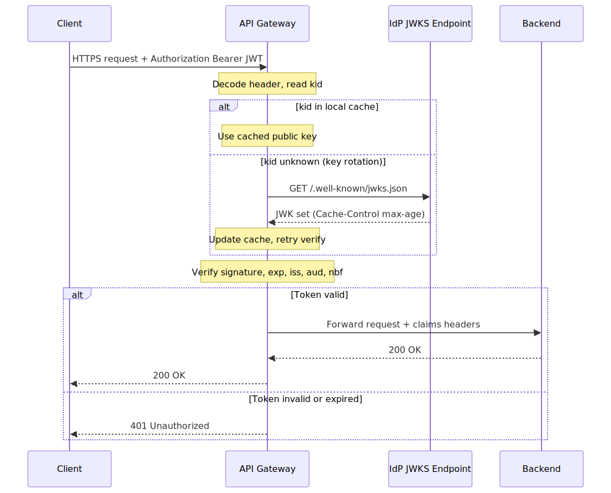
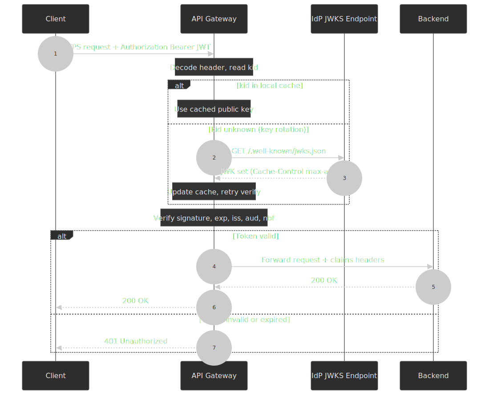

# API Gateway Patterns: Routing, Auth, and Policies

An API gateway concentrates the cross-cutting policies that every microservice would otherwise reimplement: TLS termination, authentication, rate limiting, routing, transformation, caching, and observability. Centralization is the value, and centralization is the risk: the gateway becomes a load-bearing piece of infrastructure whose failure modes are global. This article walks a senior engineer through the choices that decide whether the gateway is a resilience layer or a single point of failure, with citations and worked examples from Netflix Zuul, Envoy, Kong, AWS API Gateway, Apigee, and the [Canva 2024-11-12 outage](https://www.canva.dev/blog/engineering/canva-incident-report-api-gateway-outage/).




## Mental model

The gateway is a programmable reverse proxy with strong opinions about policy. Read the [microservices.io API Gateway pattern](https://microservices.io/patterns/apigateway.html) for the canonical statement: it solves the *N×M problem* (N client types speaking to M services) by centralizing what would otherwise be duplicated client-side or service-side. The core trade-off is **centralization vs coupling**: a single enforcement point simplifies clients and standardizes policy but turns the gateway into shared fate.

| Concern        | Gateway responsibility                | Why at the gateway                                |
| -------------- | ------------------------------------- | ------------------------------------------------- |
| Authentication | JWT verification, API key lookup      | Reject unauthorized requests before backend load  |
| Rate limiting  | Token bucket, sliding window          | Protect backends from abuse at the edge           |
| Routing        | Path/header-based dispatch            | Decouple client URLs from service topology        |
| Transformation | Protocol translation, payload shaping | Adapt external formats to internal contracts      |
| Observability  | Trace initiation, access logs         | Capture full request context at a single entry    |

There are three deployment shapes the rest of the article keeps coming back to:

- **Edge gateway** for north-south traffic from the public internet.
- **Internal gateway / service mesh** for east-west service-to-service traffic.
- **Backend for Frontend (BFF)** as a per-client gateway tier, [popularized by Sam Newman](https://samnewman.io/patterns/architectural/bff/) and the SoundCloud team.

## Gateway responsibilities

### Request routing

Gateways decouple client-facing URLs from backend service topology. Clients call `/api/users` regardless of which service, version, or zone handles the request.

**Path-based routing** (most common):

```text
/api/v1/users/* → user-service-v1
/api/v2/users/* → user-service-v2
/api/orders/*   → order-service
/static/*       → CDN origin
```

**Header-based routing**:

```text
Stripe-Version: 2026-03-25 → service-v2026-03-25
X-Client-Type: mobile      → mobile-optimized-backend
X-Tenant-ID: acme          → tenant-acme-cluster
```

**Weighted traffic splitting** for canary releases:

```yaml title="canary-route.yaml"
routes:
  - match: /api/users
    backends:
      - service: user-service-v2
        weight: 5
      - service: user-service-v1
        weight: 95
```

**Trade-off**: path-based versioning (`/v1/`, `/v2/`) is explicit and discoverable but pollutes URLs and makes evolving identifiers painful. Header-based versioning keeps URLs stable but requires client cooperation. Stripe's public API uses [date-based version headers](https://docs.stripe.com/api/versioning) (`Stripe-Version: 2026-03-25`), with each account *pinned* to a specific version on first use and per-request override available. This lets old SDKs run unchanged for years while new clients opt in to fresh behavior.

### Authentication and authorization

Gateways verify credentials before requests reach backends, rejecting unauthorized traffic at the edge so it does not consume backend capacity.

**JWT verification (stateless).** A JWT is a signed JSON envelope defined by [RFC 7519](https://datatracker.ietf.org/doc/html/rfc7519); the OAuth profile for it as a bearer access token is [RFC 9068](https://datatracker.ietf.org/doc/html/rfc9068). The gateway:

1. Reads the token from the `Authorization: Bearer <token>` header.
2. Decodes the JOSE header, looks up the `kid` against a cached [JWKS](https://datatracker.ietf.org/doc/html/rfc7517) (`/.well-known/jwks.json`).
3. Verifies the signature using the IdP's public key.
4. Validates the registered claims (`exp`, `iat`, `nbf`, `iss`, `aud`).
5. Forwards the validated claims to the backend as immutable headers.




> [!IMPORTANT]
> Two JWT footguns the gateway must handle correctly. First, **never accept `alg: none`** — reject the token before signature verification if the header advertises a non-allow-listed algorithm. Second, when a token arrives with a `kid` not in the JWKS cache, refetch the JWKS once before rejecting: this is how key rotation propagates without client downtime. Use the JWKS endpoint's `Cache-Control` headers and a minimum refetch interval (5–10 min) to avoid abuse.

**Token introspection (stateful).** [RFC 7662](https://datatracker.ietf.org/doc/html/rfc7662) defines a synchronous lookup against the authorization server for opaque tokens or revocation enforcement. Cost: a network round trip per request (typically tens of ms). Use it when immediate revocation matters more than latency.

**API key lookup.** A pre-shared secret keyed against a fast store (Redis, local cache) that returns the associated tenant, rate-limit bucket, and permissions. Cheaper than JWT for partner APIs where keys are long-lived and revocation is administrative.

**Authorization layering.** Coarse-grained checks at the gateway (route-level: *can this principal call this endpoint?*); fine-grained checks at the service (resource-level: *can this principal access this specific record?*). The gateway should never need to read application data to make an auth decision.

### Rate limiting and quotas

Rate limiting protects backends from abuse and shares capacity fairly across clients.

**Token bucket** is the workhorse. The parameter set appears in IETF traffic-control work as far back as the [RFC 1363 flow specification](https://datatracker.ietf.org/doc/html/rfc1363) (`Token Bucket Rate`, `Token Bucket Size`) and is documented in the Diffserv informal management model ([RFC 3290](https://www.rfc-editor.org/rfc/rfc3290.html), token-bucket meter and shaper). It parameterizes a flow as a refill rate `R` and a burst size `B`. Each request consumes one token; idle clients accumulate up to `B` tokens and can burst, then drain back to the steady-state `R`.

**Leaky bucket** (RFC 3290, shaper section) is the dual: requests queue and depart at a constant rate, smoothing bursts into a steady stream. Use it when the constraint is *downstream throughput*, not *fairness*.

**Sliding window log** stores the timestamp of every request inside the window and counts entries. Most accurate, highest memory.

**Sliding window counter** is the practical compromise: combine the current window's count with a weighted slice of the previous window's. If the current minute is 40s in with 50 requests and the previous minute had 100, the weighted count is `50 + 100 × (60 − 40)/60 ≈ 83`. Bounded memory, near-sliding accuracy, no per-request log.

**Distributed accuracy.** With multiple gateway instances, a local counter undercounts because each instance only sees a slice of traffic. The Kong rate-limiting plugin documents [three policies for this exact problem](https://developer.konghq.com/plugins/rate-limiting/):

| Policy | Storage | Accuracy | Latency cost | When |
| --- | --- | --- | --- | --- |
| `local`   | In-memory per node                  | Approximate (drifts with node count) | Lowest  | High throughput, slight overrun acceptable |
| `cluster` | Kong data store (e.g., Postgres)    | Accurate                             | Highest (DB round trip per request); not supported in Konnect/hybrid | Small clusters, audit-strict limits |
| `redis`   | Shared Redis                        | Accurate                             | Medium (≈1 ms per request)            | Default for distributed enforcement |

Kong's [rate-limiting-advanced plugin](https://developer.konghq.com/plugins/rate-limiting-advanced/) adds true sliding-window semantics and a `sync_rate` knob that controls how often local counters are flushed to Redis (`0` = synchronous, highest accuracy and cost; `>0` = async, lower cost, brief overrun possible). Pair Redis with a consistent-hashing front load balancer to bias each client to the same node and reduce the distributed drift before it ever hits the shared store.

**Real numbers from public APIs:**

- **Stripe (live mode):** [100 ops/sec global limit per account](https://docs.stripe.com/rate-limits), with stricter per-resource limits (e.g., 1,000 updates/hour per `PaymentIntent`). Sandbox mode is 25 ops/sec.
- **GitHub REST API:** [60 req/hr unauthenticated per IP, 5,000 req/hr per authenticated user/OAuth app, 15,000 req/hr for GHEC org-owned apps](https://docs.github.com/en/rest/using-the-rest-api/rate-limits-for-the-rest-api). Status surfaced via `x-ratelimit-*` headers.

### Request and response transformation

Gateways adapt external API contracts to internal service contracts so backends can evolve without breaking clients.

**Header transformation:**

```yaml title="header-transform.yaml"
request:
  add:
    X-Request-ID: ${uuid()}
    X-Forwarded-For: ${client_ip}
  remove:
    - X-Internal-Debug
response:
  remove:
    - X-Powered-By
    - Server
```

**Protocol translation:** REST↔gRPC bridging is the most common case (gateway accepts JSON, forwards Protobuf to a gRPC service); GraphQL federation composes a unified schema across services; SOAP↔REST bridges legacy estates.

**Payload transformation:** field renaming (`user_id` → `userId`), filtering of internal fields, and lightweight aggregation.

> [!CAUTION]
> Payload transformation belongs at the gateway only when it is *purely structural*. The moment the transformation depends on business rules ("if the user is a Plus member, hide field X"), move it to a BFF or a domain service. Conditional logic in the gateway turns the gateway into a deployment bottleneck and a testing nightmare.

### Caching at the edge

Gateway caching reduces backend load and tail latency for cacheable responses.

```text
Client → CDN (seconds–years) → Gateway cache (seconds–minutes) → Backend
```

The cache key is normally `hash(method, path, sorted(query_params), vary_headers)`. Suggested TTLs:

| Content                | TTL           | Rationale                              |
| ---------------------- | ------------- | -------------------------------------- |
| Versioned static asset | 1 week+       | Hashed URL doubles as cache key        |
| User profile           | 5–15 min      | Balance freshness vs load              |
| Search results         | 30–60 s       | Volatile but extremely high read load  |
| Real-time data         | No cache      | Freshness is the product               |

[AWS API Gateway REST APIs](https://docs.aws.amazon.com/apigateway/latest/developerguide/api-gateway-execution-service-limits-table.html) expose cache TTL with default 300 s and maximum 3,600 s; HTTP APIs do not natively support response caching, only the cheaper proxying model. AWS API Gateway carries a [99.95% monthly uptime SLA](https://aws.amazon.com/api-gateway/sla/) per region.

> [!WARNING]
> Caching authenticated responses requires the cache key to include user identity (or any header that varies the response). Forgetting this leaks user A's data to user B. The standard guards: include the principal in the key, honor backend `Cache-Control: private`, and never cache `Authorization`-bearing responses without an explicit policy.

### Observability

The gateway is the natural origin for distributed traces because it sees every request before it fans out. The minimum it must do:

1. Generate a trace ID, or honor an incoming W3C `traceparent` header.
2. Inject trace context into downstream calls.
3. Emit a gateway span with timing, routing decision, and auth result.

A useful access-log shape:

```json title="access.log"
{
  "timestamp": "2026-04-21T10:30:00Z",
  "trace_id": "abc123",
  "client_ip": "203.0.113.42",
  "method": "POST",
  "path": "/api/orders",
  "status": 201,
  "latency_ms": 142,
  "backend": "order-service",
  "rate_limit_remaining": 97
}
```

Capture **request rate by endpoint and client**, **latency p50/p95/p99 per route**, **error class** (4xx vs 5xx vs timeout), **rate-limit rejections by client**, and **cache hit ratio**. Modern gateways (Kong, Envoy, Apigee, AWS API Gateway) emit OpenTelemetry-compatible traces and metrics; standardize on OTel so the gateway data joins the rest of the trace pipeline.

## Architecture patterns

### Edge gateway vs internal gateway

**Edge gateway** (north-south): public-facing, terminates TLS, enforces strict auth, runs WAF and DDoS controls, applies global rate limits, and globally distributes endpoints for latency.

**Internal gateway** (east-west): service-to-service inside the cluster, lighter auth (typically mTLS / [SPIFFE](https://spiffe.io/) identities), focused on routing, retries, and circuit breaking. In Kubernetes shops this role is increasingly played by a **service mesh** (Istio, Linkerd, Consul Connect) rather than a discrete gateway.

Most production systems run both, layered:




The [Kubernetes Gateway API](https://gateway-api.sigs.k8s.io/) standardizes the resource model across both planes: `Gateway` / `HTTPRoute` for ingress, and the [GAMMA initiative](https://gateway-api.sigs.k8s.io/geps/gep-1324/) extends the same shapes to mesh east-west. Treating north-south and east-west as the same routing primitive lets one team reason about both.

| Aspect            | API gateway              | Service mesh             |
| ----------------- | ------------------------ | ------------------------ |
| Traffic direction | North-south (external)   | East-west (internal)     |
| Deployment        | Centralized edge cluster | Sidecar per service      |
| Auth focus        | External credentials     | Service identity (mTLS)  |
| Protocol          | HTTP/REST/GraphQL        | Any (TCP, gRPC, HTTP)    |
| Routing           | Content-based            | Service discovery        |
| Rate limiting     | Per client / API key     | Per service              |
| Observability     | Request-level            | Connection-level         |

[Christian Posta's "Do I Need an API Gateway if I Have a Service Mesh?"](https://blog.christianposta.com/microservices/do-i-need-an-api-gateway-if-i-have-a-service-mesh/) is the canonical write-up of why the answer is usually "yes, both". Mesh handles transport-level concerns transparently; gateway handles API-level concerns (versioning, payload shaping, partner contracts) explicitly.

### Backend for Frontend (BFF)

The BFF pattern is a dedicated gateway *per client type*, owned by the client team. [Sam Newman's pattern article](https://samnewman.io/patterns/architectural/bff/) traces the design back to the SoundCloud team (Phil Calçado, Lukasz Plotnicki) who needed a way to evolve the mobile and web APIs at the speed of the respective product teams without coordinating each release with platform.




A BFF lets the mobile team strip payload to the bytes that fit a phone screen, the web team aggregate richer data for SSR, and the partner team expose a slow-moving, contractually stable surface — all without one shared schema fighting three sets of constraints. The cost is operational: N client types means N services to deploy, monitor, and on-call. Worth it once client divergence is real; premature otherwise.

### Per-domain gateways vs one shared gateway

A single global gateway is the easiest to operate until it isn't. Once the gateway is the chokepoint for unrelated business domains, a single bug — a memory leak in a logging library, say — takes everything down at once. The pragmatic split is **per business domain**:

- ✅ Failure isolation (orders' gateway down ≠ payments' gateway down).
- ✅ Independent scaling per traffic profile.
- ✅ Domain teams own their gateway as part of their product.
- ❌ Policy duplication (auth/rate limit config must stay in sync).
- ❌ More infrastructure to operate.

The Canva incident below is the canonical cautionary tale of one gateway plane carrying every business domain.

## Design choices and trade-offs

### Stateless vs stateful gateway

A **stateless** gateway treats every instance as identical: configuration comes from etcd / Consul / Kubernetes, hot data (rate-limit counters, JWKS) is cached locally with TTL or push-based invalidation. Any instance can serve any request; horizontal scaling is just "add a replica". This is the default for every modern gateway.

A **stateful** gateway holds session affinity, in-process rate-limit counters, or local connection state that another instance does not have. It can be faster (no external lookups) but turns scaling into a state-migration problem and makes deploys risky.

In practice you want **stateless with caches**: configuration is external, hot data is cached locally with bounded staleness, and *exactness* (where you need it) is delegated to a shared store like Redis.

### Custom vs managed gateways

| Open-source gateway | Strengths | Trade-offs |
| ------------------- | --------- | ---------- |
| Kong            | [Plugin ecosystem](https://docs.konghq.com/), Lua and Go plugins      | Operational complexity at scale |
| Envoy           | High-performance L7 proxy, dynamic config via xDS, used by Istio/Consul/AWS App Mesh | Configuration is verbose; needs a control plane |
| NGINX (+OSS)    | Mature, predictable, ubiquitous                                       | Limited gateway features without paid module / Kong on top |
| Apache APISIX   | Modern, good dashboard, [extensible plugin model](https://apisix.apache.org/) | Smaller community than Kong/Envoy |

| Managed service             | Strengths | Trade-offs |
| --------------------------- | --------- | ---------- |
| AWS API Gateway         | Serverless, autoscaling, [99.95% SLA](https://aws.amazon.com/api-gateway/sla/) | Lambda cold starts; AWS-shaped pricing |
| Google Apigee           | [Federated API governance, analytics](https://docs.cloud.google.com/apigee/docs/api-platform/architecture/overview) | Pricing complexity; steep learning curve |
| Azure API Management    | First-class Azure integration, hybrid deployment | Azure-shaped pricing and runtime |

| Factor                  | Choose managed       | Choose self-hosted       |
| ----------------------- | -------------------- | ------------------------ |
| Team ops capacity       | Limited              | Dedicated platform team  |
| Scale                   | < ~1B requests/month | Cost-sensitive at scale  |
| Customization           | Standard patterns    | Unique requirements      |
| Compliance              | Cloud-native apps    | On-prem / data residency |
| Latency requirements    | < 10 ms acceptable   | Sub-millisecond critical |

The cost crossover for managed gateways usually appears between 1B and 10B requests/month — above that, request-priced services start to dominate the bill and a self-hosted Envoy or Kong on platform infrastructure becomes cheaper *if* you have the platform team to operate it.

### Synchronous vs asynchronous

Most gateway traffic is synchronous: client → gateway → service → gateway → client, with the client blocked on the response. For long-running operations the gateway can return `202 Accepted` with a status URL; the client polls or receives a webhook callback. A common hybrid: try sync up to a budget (say 30 s); on timeout, hand the request to a queue and return 202 with the status URL.

## Real-world implementations

### Netflix Zuul (Zuul 1) and Zuul 2

[Netflix's "Open Sourcing Zuul 2"](https://netflixtechblog.com/open-sourcing-zuul-2-82ea476cb2b3) reports that Netflix runs **80+ Zuul 2 clusters routing more than 1 million requests per second** to roughly 100 backend service clusters.

Zuul 1's filter pipeline (PRE / ROUTE / POST / ERROR) was implemented on top of a thread-per-request model. [Zuul 2](http://techblog.netflix.com/2016/09/zuul-2-netflix-journey-to-asynchronous.html) rebuilt the pipeline on Netty with an event-loop-per-core, async/non-blocking design — better suited to the high-connection-count workloads that came with persistent push channels and HTTP/2. The Zuul 2 [filter taxonomy](https://github.com/Netflix/zuul/wiki/How-It-Works-2.0) becomes Inbound, Endpoint, and Outbound, with sync and async variants; the cardinal rule for engineers writing filters is *never block the event loop* — offload anything blocking to a worker thread pool via async filters.

```text
Zuul 2 request path
  ┌─ Inbound filters (auth, rate limit, decorate)
  │
  └─ Endpoint filter (origin selection, load balance)
                         │
  ┌─ Outbound filters (decorate response, capture metrics)
  │
  └─ Response written back to client
```

Two design choices worth borrowing:

1. **Service-discovery-driven routing.** Zuul queries Eureka for healthy instances rather than holding a static config. Coupled with [zone-aware load balancing](https://medium.com/netflix-techblog/netflix-edge-load-balancing-695308b5548c), the gateway shifts traffic away from a degraded availability zone before SREs notice.
2. **Push-based filter deployment.** Filters are loaded dynamically (originally as Groovy, now Java); a new auth mechanism is a new filter, not a Zuul deploy.

### Amazon API Gateway

Three variants, three sweet spots:

| Variant     | Use case             | Notable features                                   |
| ----------- | -------------------- | -------------------------------------------------- |
| HTTP API    | Simple proxy         | Lower latency and cost, JWT authorizers, OIDC      |
| REST API    | Full features        | Request validation, response caching, WAF, Usage Plans |
| WebSocket   | Bi-directional       | Connection management, route selection             |

Caching is REST-API-only, [default 300 s, configurable 0–3,600 s](https://docs.aws.amazon.com/apigateway/latest/developerguide/api-gateway-execution-service-limits-table.html). Account-level throttling defaults to 10,000 req/s with a 5,000 burst per region in major regions; newer / smaller regions default to 2,500 / 1,250. The [99.95% monthly SLA](https://aws.amazon.com/api-gateway/sla/) implies up to ~22 minutes/month of allowed downtime per region.

Lambda-backed routes inherit Lambda's cold-start envelope. As of 2026:

| Mitigation | Effect | Cost shape |
| ---------- | ------ | ---------- |
| Default on-demand | Python/Node typically 200–400 ms; Java/.NET 500–2,000+ ms | Pay-per-invoke, no idle |
| [Provisioned Concurrency](https://aws.amazon.com/blogs/compute/new-for-aws-lambda-predictable-start-up-times-with-provisioned-concurrency/) | Eliminates cold start; double-digit-ms response times | Pay for pre-warmed concurrency, idle or not |
| [SnapStart (Java/.NET/Python)](https://aws.amazon.com/blogs/compute/reducing-java-cold-starts-on-aws-lambda-functions-with-snapstart/) | Restores from a pre-initialized snapshot; ~10× faster Java cold starts (≈2 s → ≈200 ms) | Negligible incremental cost |

VPC-attached Lambda cold starts used to add 3–10 s for ENI attach; that was [largely eliminated by Hyperplane ENIs in 2019](https://aws.amazon.com/blogs/compute/announcing-improved-vpc-networking-for-aws-lambda-functions/), so legacy "VPC adds 10 s" advice is stale.

### Kong

Kong's design philosophy is "small core, everything is a plugin." The plugin pipeline runs in a deterministic order per phase (certificate → rewrite → access → header transformation → response → log), with rate limiting and auth living in the access phase.

Rate-limiting policies, as documented in the [official plugin reference](https://developer.konghq.com/plugins/rate-limiting/):

| Policy   | Storage                        | Accuracy | Cost   | Notes |
| -------- | ------------------------------ | -------- | ------ | ----- |
| `local`  | In-memory per node             | Approx.  | Lowest | Pair with consistent-hash LB to bias clients to the same node |
| `cluster`| Kong data store (e.g., Postgres) | Exact   | Highest (DB hit per request); not supported in hybrid/Konnect | OK for small tightly-controlled clusters |
| `redis`  | Shared Redis                   | Exact   | Medium | Most common production choice; `sync_rate` controls async flushing |

Custom plugins are written in Lua, Go, JavaScript, or Python via the Kong PDK.

### Envoy

[Envoy's official FAQ on performance](https://www.envoyproxy.io/docs/envoy/latest/faq/performance/how_fast_is_envoy) is unusually candid: the project does *not* publish a canonical latency or throughput number because the answer depends entirely on filter chain, TLS posture, observability budget, and hardware. The [benchmarking guidance](https://www.envoyproxy.io/docs/envoy/latest/faq/performance/how_to_benchmark_envoy) prescribes release builds, `-c opt`, disabling stats and `generate_request_id` for baseline measurements, open-loop generators (Nighthawk), and *not* measuring at saturation.

What you can rely on:

- **Native xDS dynamic configuration**: control plane (Istio, Consul Connect, AWS App Mesh, Envoy Gateway) pushes routing/cluster/listener config without restarts.
- **L7 policy primitives**: retries, timeouts, [circuit breaking via concurrency thresholds](https://www.envoyproxy.io/docs/envoy/latest/intro/arch_overview/upstream/circuit_breaking) (max connections, max pending requests, max requests, max active retries — per upstream cluster).
- **Observability**: native OpenTelemetry tracing, Prometheus stats, structured access logs.
- **Load balancing**: round robin, least request, ring hash, Maglev consistent hash.

> [!NOTE]
> Envoy's circuit breakers are **threshold-based load shedders**, not the classical three-state Nygard breaker. They count outstanding work against a per-cluster limit and reject the next request when the limit is exceeded — there is no half-open probe phase. If you need true closed/open/half-open semantics, layer a [classic circuit breaker](https://martinfowler.com/bliki/CircuitBreaker.html) library in the application.

### Google Apigee

[Apigee's architecture](https://docs.cloud.google.com/apigee/docs/hybrid/v1.16/what-is-hybrid) splits cleanly into two planes:

- **Management plane** — Google-hosted: API lifecycle, policy authoring, analytics, developer portal.
- **Runtime plane** — request processing. Customer-deployed in Apigee hybrid (Kubernetes in your VPC); Google-managed in Apigee X.

The runtime plane is itself a few services: **Message Processors** that execute proxies and policies; a **Synchronizer** that pulls config from the management plane and writes it to local disk so the runtime survives a management-plane outage; **Cassandra** for runtime state (KVMs, quotas, OAuth tokens); and **MART** for management-plane↔runtime data plane access. Three deployment shapes today: **Apigee X** (full SaaS), **Apigee hybrid** (customer runtime, Google management), and **Apigee Edge** (legacy).

Apigee's distinctive feature is its analytics surface — traffic patterns, error rates, latency distributions, developer adoption — which makes it the default choice for teams running APIs as a product.

## Common pitfalls

### 1. Gateway as a single point of failure

**The mistake.** All traffic funnels through one gateway plane, every business domain shares the same fate.

**Real incident — Canva, 2024-11-12 (~52 minutes).** From the [Canva engineering post-mortem](https://www.canva.dev/blog/engineering/canva-incident-report-api-gateway-outage/):

1. A Cloudflare network event briefly stalled requests for a critical JavaScript asset; over 270k client requests for that asset queued up.
2. When Cloudflare recovered, those queued requests completed almost simultaneously — a classic *thundering herd*. The API gateway saw **~1.5 million requests/second, roughly 3× peak**.
3. A recently-deployed telemetry library re-registered metrics under a lock inside a third-party library on every request. Lock contention serialized work on the gateway's event loop, throttling effective throughput.
4. As tasks fell behind, the load balancer opened more connections to already-overloaded instances. Off-heap memory grew until the **Linux OOM killer** terminated containers within ~2 minutes — faster than autoscaling could replace them. Cascading failure followed.

The fixes the report calls out are the textbook ones: failure-domain isolation between business domains, circuit breakers between gateway and backends, graceful degradation paths (cached/static content during gateway issues), and load shedding before complete failure. The deeper lesson is that the gateway's event-loop budget is finite — *anything* that locks it (telemetry, sync logging, blocking auth lookups) becomes an outage vector.

### 2. Business logic in the gateway

The gateway's position makes it tempting to add "just one more thing." Over time you find yourself routing on customer tier, computing pricing, or feature-flagging in the gateway. The tax: every product change becomes a gateway deploy (high blast radius), every test environment needs a full gateway, the gateway team becomes the bottleneck, and the gateway becomes a monolith with global access.

The fix: gateway does **auth, rate limiting, routing, transformation, observability**. Aggregation belongs in a BFF. Feature flags belong in a feature-flag service. Business decisions belong in the domain service.

### 3. Over-caching at the edge

Caching is a footgun if you forget that "personalized" responses must include identity in the cache key. Symptoms: stale data after writes, cache stampedes when many keys expire together, cross-user data leaks. Mitigations: include the principal (or `Vary` header set) in the key, honor backend `Cache-Control`, stagger TTLs (jitter), and prefer event-driven invalidation for high-write resources. Treat a *suspiciously high* cache hit ratio as a signal that the cache is masking missing freshness.

### 4. Lying health checks

A `/health` that returns 200 only because the process is running tells the gateway nothing useful: traffic still routes to a backend that fails every request. The fix is the standard liveness/readiness split, with the readiness probe checking critical dependencies (DB ping, cache ping, queue connectivity), but cheaply.

```go title="health.go"
func ReadinessHandler(deps Deps) http.HandlerFunc {
    return func(w http.ResponseWriter, r *http.Request) {
        ctx, cancel := context.WithTimeout(r.Context(), 250*time.Millisecond)
        defer cancel()

        if err := deps.DB.PingContext(ctx); err != nil {
            http.Error(w, "db unavailable", http.StatusServiceUnavailable)
            return
        }
        if err := deps.Cache.Ping(ctx).Err(); err != nil {
            http.Error(w, "cache unavailable", http.StatusServiceUnavailable)
            return
        }
        w.WriteHeader(http.StatusOK)
    }
}
```

### 5. Ignoring connection draining

Terminating a backend or gateway instance immediately during deploy returns `502/503` to in-flight requests. The fix is connection draining (also called *deregistration delay* on AWS ELBs, default 300 s): the gateway stops sending *new* requests to the draining instance, lets in-flight ones complete (or time out), then terminates. Set the drain timeout above your longest expected request duration.

## Performance

### Latency budget

Treat the gateway's latency contribution as a budget you spend on policy. Rough envelopes from production reports and vendor docs (cited individually elsewhere):

| Component               | Typical latency |
| ----------------------- | --------------- |
| Network hop             | 0.1–1 ms        |
| TLS termination         | 0.5–2 ms        |
| JWT verification (cached JWKS) | 0.1–1 ms |
| Rate-limit check (local)       | < 0.1 ms |
| Rate-limit check (Redis)       | 1–5 ms   |
| Routing decision               | < 0.1 ms |
| Baseline overhead, well-tuned  | 1–5 ms   |

Things that blow the budget: **token introspection** (RFC 7662 lookup adds a network round trip — tens of ms); **complex transformations** (a few ms each); **custom plugins** (varies wildly with what they do); **Lambda cold starts** (hundreds of ms to multiple seconds). Always measure under realistic load (50–80% capacity), never at peak — latency is non-linear near saturation.

### Connection pooling

Opening a new TCP+TLS connection per request burns 2–4 round trips. Gateways maintain pools to backends:

```yaml title="upstream-pool.yaml"
upstream backend:
  max_connections: 100         # Total to all instances
  max_connections_per_host: 10 # Per backend instance
  idle_timeout: 60s            # Reap idle connections
  connect_timeout: 5s          # Fail fast on connect
```

HTTP/2 multiplexing flips the equation: one connection carries many concurrent streams. Gateway-to-backend H2 cuts the connection count by one or two orders of magnitude while preserving throughput. Netflix's Zuul team [describes the connection-churn savings explicitly](https://netflixtechblog.com/curbing-connection-churn-in-zuul-2feb273a3598).

### Cold-start mitigation (serverless)

See the [AWS API Gateway](#amazon-api-gateway) table above for the current Lambda numbers. Two takeaways: SnapStart is the cheapest fix for JVM/.NET cold starts; Provisioned Concurrency is the only mitigation that *guarantees* warm capacity at the cost of paying for idle. "Keep-warm pings" are unreliable — Lambda recycles environments aggressively and ping-driven warmth is non-contractual.

### Circuit breaker integration

The classic [Nygard](https://pragprog.com/titles/mnee2/release-it-second-edition/) / [Fowler](https://martinfowler.com/bliki/CircuitBreaker.html) circuit breaker has three states:




Sample knobs:

```yaml title="breaker.yaml"
circuit_breaker:
  failure_threshold: 5         # consecutive failures to open
  success_threshold: 3         # consecutive probes to close
  open_timeout: 30s            # cool-off in open state
  failure_rate_threshold: 50%  # alternative: percentage trip
```

Gateway-side fallbacks when the breaker is open: serve a cached response, return a degraded payload, route to a backup service, or return an error with explicit retry guidance (`Retry-After`).

> [!IMPORTANT]
> A Nygard-style breaker and Envoy's per-cluster concurrency thresholds are **complementary**, not equivalent. Envoy sheds excess load instantly under overload but never enters a half-open probing state; a true breaker reacts to failure *patterns* over time. Run both: Envoy as the always-on shedder, an application-layer breaker as the recovery probe.

## API versioning

### Path-based versioning

```text
/v1/users → user-service-v1
/v2/users → user-service-v2
```

Pros: explicit, browser-testable, easy in logs. Cons: URL pollution and a permanent commitment to never re-using the same path.

### Header-based versioning

```text
GET /users
Accept: application/vnd.myapi.v2+json
```

or the simpler:

```text
GET /users
Stripe-Version: 2026-03-25
```

Pros: clean URLs, flexible versioning schemes, RESTful. Cons: invisible to a casual `curl`, harder to reason about in CDN configs and logs.

### Gateway implementation

```yaml title="versioned-routes.yaml"
routes:
  - match: { path_prefix: /v1/ }
    route: { cluster: api-v1 }
  - match: { path_prefix: /v2/ }
    route: { cluster: api-v2 }
  - match:
      headers:
        - { name: API-Version, exact_match: "2026-01" }
    route: { cluster: api-2026-01 }
```

### Backward compatibility

Safe additive changes: new optional fields in responses, new endpoints, new optional query parameters or headers. Breaking changes that need a new version: removing a field, changing a field's type, restructuring a URL, changing required parameters.

Stripe's playbook ([blog post](https://stripe.com/blog/api-versioning), [API reference](https://docs.stripe.com/api/versioning)) is the public reference implementation: date-stamped versions, accounts pinned at first use, request-level overrides via `Stripe-Version`, and a long support window. Internally Stripe runs *version change modules* in reverse chronological order to transform a modern internal response into the shape an older account expects — a useful pattern for any team that promises long compatibility windows.

## Practical takeaways

- **Centralize policies, not business logic.** Auth, rate limiting, routing, observability — yes. Pricing, feature flags, aggregation logic — no.
- **Plan for failure-domain isolation.** Per-domain gateways beat one global gateway once two unrelated outages can no longer share blast radius. The Canva post-mortem makes the case more vividly than any architecture review.
- **Pick the rate-limit storage strategy by accuracy budget.** Local for hot paths where a small overrun is acceptable; Redis (with `sync_rate` tuned to your accuracy/latency budget) for everything else; cluster mode only when you genuinely need exact accounting and can afford a DB hit per request.
- **Choose architecture by team and scale.** Small teams: a managed gateway (AWS API Gateway, Apigee). Large teams with platform engineering capacity: Kong or Envoy for flexibility, cost, and customization.
- **Measure what matters.** Gateway latency overhead, cache hit ratio, rate-limit rejection rate, error rate by route. These four numbers tell you whether the gateway is helping or hurting.
- **Treat gateway code as load-bearing.** Anything that locks the event loop (sync logging, in-band auth lookups, badly-instrumented telemetry) is an outage vector. The Canva incident shows how a benign-looking telemetry library can be enough.

The recurring pattern across Netflix, AWS, Apigee, and Canva is consistent: *gateways are infrastructure, not application logic*. They enforce policies and route traffic. The moment business logic creeps in, the gateway becomes a bottleneck for both performance and organizational velocity.

## Appendix

### Prerequisites

- HTTP/HTTPS basics; TLS handshake.
- Microservices and load-balancing fundamentals.
- Familiarity with at least one of: Kong, Envoy, AWS API Gateway, NGINX.

### Summary

- Gateways centralize cross-cutting concerns (auth, rate limiting, routing, observability) at a single enforcement point — that is both the value and the risk.
- Edge gateways handle north-south traffic with strict security; service meshes handle east-west traffic with mTLS, retries, and circuit breaking.
- BFF gives each client team a per-client gateway shaped to their device and team boundaries.
- Stateless-with-caches is the default scaling shape; rate limit accuracy lives on a `local | redis | cluster` continuum with corresponding latency.
- The Canva 2024 outage illustrates what happens when a single shared gateway plane absorbs a thundering herd while a telemetry deployment locks the event loop.
- AWS API Gateway: 99.95% SLA, REST cache TTL default 300 s / max 3,600 s, HTTP API has no native cache.
- Stripe's date-based versioning with account pinning is the canonical long-compatibility-window playbook.

### References

- [API Gateway pattern — microservices.io](https://microservices.io/patterns/apigateway.html) — Chris Richardson's canonical pattern statement.
- [Open Sourcing Zuul 2 — Netflix Tech Blog](https://netflixtechblog.com/open-sourcing-zuul-2-82ea476cb2b3) — Netflix scale, async/non-blocking design.
- [Zuul 2: The Netflix Journey to Asynchronous, Non-Blocking Systems](http://techblog.netflix.com/2016/09/zuul-2-netflix-journey-to-asynchronous.html) — pre-open-source design retrospective.
- [Curbing Connection Churn in Zuul](https://netflixtechblog.com/curbing-connection-churn-in-zuul-2feb273a3598) — connection pool design notes.
- [Kong Rate Limiting plugin](https://developer.konghq.com/plugins/rate-limiting/) and [Rate Limiting Advanced](https://developer.konghq.com/plugins/rate-limiting-advanced/) — `local | cluster | redis` semantics.
- [Envoy "How fast is Envoy?" FAQ](https://www.envoyproxy.io/docs/envoy/latest/faq/performance/how_fast_is_envoy) and [benchmarking FAQ](https://www.envoyproxy.io/docs/envoy/latest/faq/performance/how_to_benchmark_envoy).
- [Envoy circuit breaking](https://www.envoyproxy.io/docs/envoy/latest/intro/arch_overview/upstream/circuit_breaking).
- [AWS API Gateway SLA](https://aws.amazon.com/api-gateway/sla/) and [REST quotas](https://docs.aws.amazon.com/apigateway/latest/developerguide/api-gateway-execution-service-limits-table.html).
- [AWS Lambda SnapStart](https://aws.amazon.com/blogs/compute/reducing-java-cold-starts-on-aws-lambda-functions-with-snapstart/) and [Provisioned Concurrency](https://aws.amazon.com/blogs/compute/new-for-aws-lambda-predictable-start-up-times-with-provisioned-concurrency/).
- [Apigee architecture overview](https://docs.cloud.google.com/apigee/docs/api-platform/architecture/overview) and [Apigee hybrid](https://docs.cloud.google.com/apigee/docs/hybrid/v1.16/what-is-hybrid).
- [Stripe API versioning](https://docs.stripe.com/api/versioning), [APIs as infrastructure](https://stripe.com/blog/api-versioning), and [Stripe rate limits](https://docs.stripe.com/rate-limits).
- [GitHub REST API rate limits](https://docs.github.com/en/rest/using-the-rest-api/rate-limits-for-the-rest-api).
- [Sam Newman: Backends For Frontends](https://samnewman.io/patterns/architectural/bff/).
- [Christian Posta: Do I Need an API Gateway if I Have a Service Mesh?](https://blog.christianposta.com/microservices/do-i-need-an-api-gateway-if-i-have-a-service-mesh/).
- [Kubernetes Gateway API](https://gateway-api.sigs.k8s.io/) and [GAMMA initiative](https://gateway-api.sigs.k8s.io/geps/gep-1324/).
- [Canva incident report: API Gateway outage](https://www.canva.dev/blog/engineering/canva-incident-report-api-gateway-outage/) — November 12, 2024 post-mortem.
- [Martin Fowler: Circuit Breaker](https://martinfowler.com/bliki/CircuitBreaker.html) and Michael Nygard, *Release It!* (2nd ed.).
- [RFC 7519](https://datatracker.ietf.org/doc/html/rfc7519) — JSON Web Token (JWT).
- [RFC 7517](https://datatracker.ietf.org/doc/html/rfc7517) — JSON Web Key (JWK).
- [RFC 9068](https://datatracker.ietf.org/doc/html/rfc9068) — JWT profile for OAuth 2.0 access tokens.
- [RFC 7662](https://datatracker.ietf.org/doc/html/rfc7662) — OAuth 2.0 Token Introspection.
- [OAuth 2.1 draft (draft-ietf-oauth-v2-1)](https://datatracker.ietf.org/doc/draft-ietf-oauth-v2-1/).
- [RFC 1363](https://datatracker.ietf.org/doc/html/rfc1363) and [RFC 3290 §4.4](https://www.rfc-editor.org/rfc/rfc3290.html) — token bucket / leaky bucket parameters.
