# Arrays and Hash Maps: Engine Internals and Performance Reality

Theoretical complexity hides the real story. Dense JavaScript arrays usually deliver fast indexed access, but a single sparse write can push V8 into slower dictionary-style storage with very different constants. `Map` and plain objects both promise average-case O(1) lookups until collisions, resizing, or shape pollution dominate the hot path. This article walks through V8's internal representations — [elements kinds](https://v8.dev/blog/elements-kinds) for arrays, [hidden classes](https://v8.dev/blog/fast-properties) for objects, and Tyler Close's [ordered hash tables](https://chromium.googlesource.com/v8/v8/+/main/src/objects/ordered-hash-table.h) for `Map`/`Set` — so you can predict when these structures actually deliver their advertised performance and when they collapse to slow modes.




## Abstract

Memory layout often dominates algorithmic complexity in real-world performance. Arrays exploit CPU cache lines through contiguous allocation — accessing adjacent elements is nearly free when they share a 64-byte cache line on x86 and most ARM cores. Hash tables trade memory for constant-time lookups, but their load factor and collision strategy decide whether `Map.get` is a couple of memory loads or a long chain walk.

V8 maintains multiple internal representations for both structures. Arrays transition through [21 "elements kinds"](https://v8.dev/blog/elements-kinds) — from `PACKED_SMI_ELEMENTS` (fastest) to `DICTIONARY_ELEMENTS` (slowest) — and those transitions are essentially one-way. Objects use [hidden classes](https://v8.dev/blog/fast-properties) that enable monomorphic inline caches; adding properties dynamically or deleting them forces costly shape transitions. `Map` and `Set` use [Tyler Close's deterministic hash table](https://chromium.googlesource.com/v8/v8/+/main/src/objects/ordered-hash-table.h)[^close] to satisfy the [ECMA-262 insertion-order iteration requirement](https://tc39.es/ecma262/#sec-map.prototype.foreach) — a hash table for lookup chained against a data table for iteration order.

The critical insight: writing `arr[1000] = x` on an empty array, deleting object properties, or creating polymorphic call sites permanently degrades performance. Understanding those transitions matters more than memorizing Big O notation.

[^close]: Tyler Close, [_A deterministic hash table_](https://web.archive.org/web/20240811130212/http://wiki.ecmascript.org/lib/exe/fetch.php?id=harmony%3Acollections&cache=cache&media=harmony:hashtable.pdf) (the algorithm V8 attributes its `OrderedHashTable` implementation to).

## V8 Array Internals: Elements Kinds

V8 currently distinguishes [21 elements kinds](https://v8.dev/blog/elements-kinds) based on what an array can hold and whether it has gaps. The engine emits specialized machine code per kind, and transitions move only "downward" through a lattice from specific to more general. Once an array becomes `HOLEY_*` or `PACKED_DOUBLE_*` it stays there for its lifetime — `Array.prototype.fill` does not re-pack a holey array, even when called over the entire range, because V8 deliberately lets representations stabilize rather than flip-flopping[^v8devfill].

[^v8devfill]: jmrk (V8 team), [_"Does JavaScript's `Array.prototype.fill()` always create a packed array?"_, Stack Overflow](https://stackoverflow.com/questions/79289807/does-javascripts-array-prototype-fill-always-create-a-packed-array) — accepted answer from a V8 developer: "The current state of things is that `A.p.fill()` never changes the holeyness/packedness of the array it operates on."


### The Elements Kind Hierarchy

The most common kinds, ordered from fastest to slowest:

| Elements Kind          | Contents                            | Access Pattern              |
| ---------------------- | ----------------------------------- | --------------------------- |
| PACKED_SMI_ELEMENTS    | Small integers only (-2³¹ to 2³¹-1) | Direct memory offset        |
| PACKED_DOUBLE_ELEMENTS | Floating-point numbers              | Unboxed 64-bit doubles      |
| PACKED_ELEMENTS        | Any values (mixed)                  | Boxed elements, type checks |
| HOLEY_SMI_ELEMENTS     | Small ints with gaps                | Hole check on every access  |
| HOLEY_DOUBLE_ELEMENTS  | Doubles with gaps                   | Hole check + unboxing       |
| HOLEY_ELEMENTS         | Mixed with gaps                     | Hole check + type check     |
| DICTIONARY_ELEMENTS    | Sparse indices                      | Hash table lookup           |

```js title="Elements kind transitions" collapse={1-2}
// Illustrating irreversible transitions

const arr = [1, 2, 3] // PACKED_SMI_ELEMENTS (optimal)
arr.push(4.5) // → PACKED_DOUBLE_ELEMENTS (still good)
arr.push("string") // → PACKED_ELEMENTS (boxed, slower)
arr[100] = "x" // → HOLEY_ELEMENTS (permanent hole)
// Cannot revert to PACKED_* even if you fill indices 4-99
```

### Why Holes Are Expensive

Holes force every read to first check the elements store for V8's internal `the_hole` sentinel and, if it matches, walk the prototype chain looking for a real binding. The V8 team is explicit that "operations on holey arrays require additional checks and expensive lookups on the prototype chain"[^holey]. Reading past `array.length` triggers the same out-of-bounds prototype walk and permanently demotes the load site — fixing one off-by-one in a hot loop has been measured at **6× faster** in V8 micro-benchmarks[^holey].

[^holey]: Mathias Bynens, [_Elements kinds in V8_](https://v8.dev/blog/elements-kinds) — see "Avoid reading beyond the length of the array" and "PACKED vs. HOLEY kinds".

```js title="Hole check overhead" collapse={1-2}
// Demonstrating the prototype chain lookup cost

const arr = [1, , 3] // HOLEY_SMI_ELEMENTS

// Accessing arr[1] requires:
// 1. Probe arr's elements store at index 1 → finds the_hole sentinel
// 2. Walk Array.prototype, Object.prototype looking for index 1
// 3. Return undefined

// Contrast with packed array:
const packed = [1, 2, 3]
// Accessing packed[1]:
// 1. Direct memory read at (base + 1 * element_size)
// 2. Return value
```

### Dictionary Mode: When Arrays Become Hash Maps

Sparse arrays — those with large gaps between indices — switch to dictionary-mode elements, sometimes called slow elements in the V8 source. The exact heuristic is not part of the public contract, but in practice V8 falls back when allocating a dense backing store would waste too much memory relative to occupied slots[^fastprops].

[^fastprops]: Camillo Bruni, [_Fast properties in V8_](https://v8.dev/blog/fast-properties) — "Fast or Dictionary Elements".

```js title="Triggering dictionary mode" collapse={1-2}
// Sparse assignment forces hash table storage

const arr = []
arr[0] = "first"
arr[1000000] = "sparse" // DICTIONARY_ELEMENTS

// Now arr[0] access requires:
// 1. Hash the key "0"
// 2. Probe the hash table
// 3. Return value if found

// Memory comparison (approximate):
// Dense arr[0..999999]: ~8MB (1M × 8 bytes)
// Sparse with 2 elements: ~140 bytes (hash table overhead)
```

Dictionary mode makes sense for genuinely sparse data. The trade-off: random access degrades from O(1) direct indexing to O(1) average hash lookup with potential O(n) worst-case on collision chains.

## V8 Object Internals: Hidden Classes and Shapes

Objects in V8 use [hidden classes](https://v8.dev/blog/fast-properties) (also called "shapes" or, internally, "maps" — not to be confused with the JavaScript `Map` data structure). A hidden class describes an object's memory layout: which named properties exist and at what offset, the object's prototype, and a transition tree linking related shapes.

### Shape Transitions and Inline Caching

When V8 first sees a property access like `obj.x`, it doesn't know where `x` is stored. After the first access, it caches the property's offset for that shape. Subsequent accesses to objects with the same shape use this "inline cache" for direct memory access.




```js title="Hidden class optimization" collapse={1-2}
// Demonstrating shape-based optimization

// All objects with same property order share a hidden class
function createPoint(x, y) {
  const p = {}
  p.x = x // Transition: {} → {x}
  p.y = y // Transition: {x} → {x, y}
  return p
}

const p1 = createPoint(1, 2)
const p2 = createPoint(3, 4)
// p1 and p2 share the same hidden class

function getX(point) {
  return point.x // After first call: inline cached
}

getX(p1) // Misses cache, caches offset for shape {x,y}
getX(p2) // Hits cache! Direct memory read at cached offset
```

### Polymorphism Kills Performance

When a function receives objects with different shapes, V8's inline cache becomes "polymorphic" (2-4 shapes) or "megamorphic" (many shapes). Megamorphic sites abandon caching entirely.




```js title="Polymorphism degradation" collapse={1-2}
// Demonstrating inline cache pollution

function getX(obj) {
  return obj.x
}

// Creating objects with different shapes
const a = { x: 1 } // Shape: {x}
const b = { y: 2, x: 3 } // Shape: {y, x} — different!
const c = { x: 4, y: 5 } // Shape: {x, y} — also different!
const d = { z: 6, x: 7 } // Shape: {z, x}
const e = { x: 8, z: 9 } // Shape: {x, z}

// Calling with many shapes forces megamorphic
;[a, b, c, d, e].forEach(getX)
// getX is now megamorphic — falls back to dictionary lookup
```

### Delete Destroys Optimization

The `delete` operator is particularly expensive. It typically forces the object into slow / dictionary properties[^fastprops], an in-object representation that drops the descriptor array and disables inline caches for that object.

```js title="Delete operator consequences" collapse={1-2}
// Why delete is slow

const obj = { a: 1, b: 2, c: 3 }
// obj uses fast properties (hidden class)

delete obj.b
// obj transitions to dictionary mode
// All subsequent property accesses use hash lookups

// Preferred alternative:
const obj2 = { a: 1, b: 2, c: 3 }
obj2.b = undefined // Maintains shape, just clears value
// obj2 keeps fast properties
```

## Hash Map Internals: V8's Deterministic Hash Tables

JavaScript's `Map` and `Set` must iterate in insertion order — `Map.prototype.forEach` is specified to visit each `[[MapData]]` record "in original key insertion order"[^mapspec]. A textbook open-addressed hash table reorders keys on every rehash, so V8 implements `Map`/`Set` with an [`OrderedHashTable`](https://chromium.googlesource.com/v8/v8/+/main/src/objects/ordered-hash-table.h) modelled on Tyler Close's deterministic hash table[^close][^pechkurov].

[^mapspec]: TC39, [_ECMA-262, §24.1.3.5 Map.prototype.forEach_](https://tc39.es/ecma262/#sec-map.prototype.foreach).
[^pechkurov]: Andrey Pechkurov, [_V8 Deep Dives: Understanding Map Internals_](https://itnext.io/v8-deep-dives-understanding-map-internals-45eb94a183df) — annotated walk-through of `OrderedHashTable`, including capacity = `2 × numBuckets` and the per-entry `chain` slot.

### Dual Data Structure Design

V8's `OrderedHashTable` keeps two cooperating regions in a single backing store:

1. **Hash table** — `numBuckets` head-of-chain indices, sized to a power of two.
2. **Data table** — entry records appended strictly in insertion order; each record carries a key, value(s), and a `chain` field linking to the next entry in the same bucket.




Lookup: hash the key → mask to a bucket → follow the bucket's head index into the data table → walk the chain via per-entry `next` indices.
Iteration: walk the data table from index 0 to `NumberOfElements + NumberOfDeletedElements`, skipping tombstones. This is O(n) overall and O(1) per element.

### Hash Code Computation

V8 computes hash codes differently by key type:

| Key Type              | Hash Strategy                                                                                | Storage                                                  |
| --------------------- | -------------------------------------------------------------------------------------------- | -------------------------------------------------------- |
| Small integers (Smis) | Bit-mix of the value                                                                         | Recomputed on access                                     |
| Heap numbers          | Bit-mix of the underlying double bits                                                        | Recomputed on access                                     |
| Strings               | Seeded `rapidhash` for regular strings; encoded value for array-index strings[^hashdosmar26] | Cached in `raw_hash_field` of `v8::internal::Name`       |
| Symbols               | Random per-symbol value                                                                      | Cached in the symbol's hash field                        |
| Objects               | Random per-object value, generated on first use                                              | Hidden in the properties backing store (see below)[^hidehash] |

The per-object value is just a random number, independent of the object's contents — V8 cannot recompute it later, so it must store it[^hidehash]. Random per-object hashes prevent attackers from predicting which object keys will collide (with the caveat that string-keyed maps remain exposed via the string-table CVEs above).

### Memory Optimization: Hash Code Hiding

When a JavaScript object is used as a `Map`/`WeakMap` key, V8 needs to remember a per-object hash code. Storing it as a private symbol used to trigger a hidden-class transition on the key, polluting unrelated property accesses. V8 6.3 moved the hash code into the object's own properties backing store[^hidehash]:

- **Empty properties store** — write the hash code directly into that slot on the `JSObject`.
- **Array-backed properties store** — that array is capped at 1022 entries, so its length only needs 10 of the 31 Smi bits. V8 packs the 21 spare bits with the hash code.
- **Dictionary-backed properties store** — add one extra slot at the head of the dictionary for the hash code; the relative cost is low because dictionaries are already large.

This change yielded a ~500% improvement on the SixSpeed Map/Set benchmark and a ~5% improvement on ARES-6 Basic[^hidehash]. It is an optimisation about **how object keys are hashed**, not about `Map`'s own size; a `Map` itself can hold many more than 1022 entries.

[^hidehash]: Sathya Gunasekaran, [_Optimizing hash tables: hiding the hash code_](https://v8.dev/blog/hash-code) — V8 v6.3.

## Collision Resolution and HashDoS

V8 does not use one collision strategy for every internal hash table. The two most relevant for application-level performance are:

| Table                                          | Collision strategy                                       | Used by                                              |
| ---------------------------------------------- | -------------------------------------------------------- | ---------------------------------------------------- |
| `OrderedHashTable`                             | Separate chaining (per-entry next-index)                 | `Map`, `Set`, `WeakMap`, `WeakSet`                   |
| `OffHeapHashTable` / property dictionaries     | Open addressing with quadratic probing                   | String table (string interning), `NameDictionary` for slow-mode object properties |

For an `OrderedHashTable`, every collision walks the chain via the per-entry `chain` slot. With pathological inputs an attacker can force every key into one bucket, degrading lookup and insertion to O(n) per operation and O(n²) for a batch insert. The string table is similarly vulnerable: its quadratic probe sequence becomes a linear walk if every key lands on the same first-probe slot[^hashdosmar26].

 versus open addressing with quadratic probing (used by V8's string table and `NameDictionary`). Adversarial keys collapse both schemes to a linear walk through one bucket or one probe chain.")


[^hashdosmar26]: Joyee Cheung, [_Developing a minimally HashDoS resistant, yet quickly reversible integer hash for V8_](https://nodejs.org/en/blog/vulnerability/march-2026-hashdos) — covers V8 string-table layout, quadratic probing, and the integer-index hash.

### Recent HashDoS CVEs in Node.js

> [!WARNING]
> Both of these issues were classified as DoS by the V8 team but treated as security releases by Node.js because a single malicious request can stall the event loop for tens of seconds[^july2025rel][^hashdosmar26].

- **[CVE-2025-27209](https://nvd.nist.gov/vuln/detail/CVE-2025-27209)** — V8's switch to the [`rapidhash`](https://github.com/Nicoshev/rapidhash) string hash in Node.js v24.0.0 left the algorithm constants hard-coded instead of seeded. An attacker who could feed strings into the server (JSON keys, query parameters, header names) could pre-compute colliding inputs without knowing any runtime secret. Affects only the **24.x** release line; fixed in **Node.js v24.4.1** by reverting to a seeded hash and later wiring up rapidhash's seed-generation routine[^july2025rel][^hashdosmar26].
- **[CVE-2026-21717](https://cve.mitre.org/cgi-bin/cvename.cgi?name=CVE-2026-21717)** — V8 stores the hash of an "array-index string" (a decimal-integer string whose value fits in 24 bits) directly as `(length << 24) | value`. Because that hash was deterministic and unseeded, a remote attacker could use a 2 MB JSON payload to wedge `JSON.parse` for ~30 seconds on a fast laptop. Mitigated in the [March 2026 Node.js security release](https://nodejs.org/en/blog/vulnerability/march-2026-security-releases) with a new seeded, efficiently invertible permutation hash for integer-index strings[^hashdosmar26].

[^july2025rel]: Node.js Project, [_Tuesday, July 15, 2025 Security Releases_](https://nodejs.org/en/blog/vulnerability/july-2025-security-releases) — explicitly: "This vulnerability affects Node.js v24.x users."

```js title="HashDoS impact pattern" collapse={1-2}
// Illustrative pattern — do not adapt for attacks.

// If an attacker can choose keys that collide on the same bucket
// (string table) or the same Map bucket (OrderedHashTable):
const map = new Map()
for (const k of attackerControlledKeys) map.set(k, 1) // O(n) per insert
// Total: O(n²); with ~2 MB payload this stalls the event loop for tens of seconds.

// Mitigations: keep Node.js patched, JSON-schema-validate untrusted input,
// cap request size and key cardinality, and avoid using attacker-controlled
// strings as Map keys without normalization.
```

### Load Factor and Resizing

V8's `OrderedHashTable` uses a load-factor constant of **2 entries per bucket**: capacity = `numBuckets × 2`, both always powers of two[^pechkurov]. An empty `Map` starts with 2 buckets and capacity 4. When inserting would exceed `capacity` (counting present + tombstoned entries), V8 rehashes:

1. Allocate a new table, doubling `numBuckets` and rounding to a power of two.
2. Re-mask each live key into its new bucket.
3. Copy live entries to the new data table in their current insertion order.
4. Discard tombstones.

The same routine compacts the table (without growing it) when the deleted-element count dominates. Rehashing is O(n) per event but amortises to O(1) per insertion; in latency-sensitive code paths the spike still matters and is worth pre-sizing around when the working-set size is known.


## Map vs Object vs Array: When to Use Each

| Criterion               | Array                  | Object                   | Map                          |
| ----------------------- | ---------------------- | ------------------------ | ---------------------------- |
| Sequential dense data   | ✅ Optimal             | ❌ Wrong tool            | ❌ Wrong tool                |
| Keyed lookups (strings) | ❌                     | ✅ Good                  | ✅ Best for frequent updates |
| Non-string keys         | ❌                     | ❌ Coerces to string     | ✅ Any key type              |
| Insertion order         | ✅ Numeric index order | ⚠️ Complex rules         | ✅ Guaranteed                |
| Frequent add/delete     | ⚠️ End operations only | ❌ Delete is slow        | ✅ Designed for this         |
| Iteration performance   | ✅ Cache-friendly      | ⚠️ Property enumeration  | ✅ Sequential data table     |
| Memory efficiency       | ✅ Best when dense     | ⚠️ Hidden class overhead | ⚠️ Hash table overhead       |

### Benchmark Reality

Microbenchmarks often show `Map` outperforming `Object` for dynamic keyed workloads, especially when inserts and deletes dominate. The exact ratios vary heavily with engine version, key distribution, object shape stability, and whether the benchmark accidentally rewards monomorphic property access. Treat benchmark tables as workload-specific evidence, not universal multipliers.

Objects still win when the shape is stable and properties are accessed through monomorphic call sites. For dynamic keyed collections, `Map` is usually the safer default.

## Cache Locality: Why Memory Layout Matters

Modern CPUs fetch memory in cache lines — 64 bytes on x86_64 and most ARMv8 cores, 128 bytes on Apple Silicon performance cores. Accessing one element loads adjacent bytes for free, so contiguous traversal of a `Float64Array` reads roughly one cache line per eight elements while a sparse hash-table walk often pays one cache miss per lookup.

### Array Contiguous Advantage

```js title="Cache-friendly vs cache-hostile" collapse={1-2}
// Demonstrating cache effects

// Cache-friendly: sequential access
const arr = new Array(1000000).fill(0)
for (let i = 0; i < arr.length; i++) {
  arr[i] += 1 // Adjacent memory, cache hits
}

// Cache-hostile: random access
const indices = [...Array(1000000).keys()].sort(() => Math.random() - 0.5)
for (let i = 0; i < indices.length; i++) {
  arr[indices[i]] += 1 // Random jumps, cache misses
}

// On commodity hardware sequential access is typically several times
// faster than random access on the same data, driven almost entirely
// by L1/L2 hit rate. The exact multiplier depends on working-set size,
// CPU prefetcher, and DRAM latency — measure before quoting numbers.
```

### Typed Arrays: Maximum Cache Efficiency

For numeric data, [TypedArrays](https://tc39.es/ecma262/#sec-typedarray-objects) are the only structure the spec guarantees is backed by an `ArrayBuffer` with a fixed element width and contiguous bytes:

```js title="TypedArray memory layout" collapse={1-2}
// TypedArrays for performance-critical numeric work

const floats = new Float64Array(1000000)
// Guaranteed: 1000000 × 8 bytes = 8MB contiguous

// Regular array equivalent:
const regular = new Array(1000000).fill(0.0)
// V8 may optimize to contiguous doubles, or may not
// Adding a string element forces reallocation

// TypedArrays: fixed size, fixed type, maximum cache efficiency
// Regular arrays: flexible, but optimization is fragile
```

## Practical Recommendations

### For Arrays

1. **Pre-allocate when size is known**: `new Array(n).fill(defaultValue)` creates a packed array
2. **Avoid holes**: Never skip indices or use `delete arr[i]`
3. **Keep types homogeneous**: Mixing integers and floats transitions to PACKED_DOUBLE; adding strings transitions to PACKED_ELEMENTS
4. **Use TypedArrays for numeric data**: Guarantees contiguous memory and type stability

### For Objects

1. **Initialize all properties in constructors**: Establishes stable shape early
2. **Add properties in consistent order**: Objects with properties added in same order share hidden classes
3. **Never use `delete`**: Set to `undefined` or `null` instead
4. **Avoid dynamic property names in hot paths**: Use Map instead

### For Maps

1. **Default choice for dynamic keyed collections**: Designed for frequent add/remove
2. **Use when keys aren't strings**: Objects coerce keys; Maps preserve type
3. **Use when insertion order matters**: Guaranteed iteration order
4. **Consider memory overhead for small collections**: Object may be more efficient for <10 fixed keys

## Conclusion

Big O notation describes algorithmic bounds, not real-world performance. V8's internal representations — elements kinds for arrays, hidden classes for objects, ordered hash tables for `Map`/`Set` — determine actual execution speed, and most of the bad news is one-way: a single sparse write, an out-of-bounds read, a `delete`, or a megamorphic call site can demote a hot path for the lifetime of that data structure.

Three practical heuristics carry most of the weight:

1. Keep arrays dense, homogeneous, and inside `length`. If they're fundamentally numeric, prefer a `TypedArray`.
2. Initialize object properties in the same order in every constructor; never `delete`. Set to `undefined` if you need to clear.
3. Reach for `Map` (or `Set`) the moment your collection is dynamic, has non-string keys, or needs guaranteed iteration order — and pre-size it when you know the working-set size, to avoid mid-request rehash spikes.

For untrusted input, also keep your Node.js patched against the most recent string-table CVEs and validate / size-cap any payload that becomes hash-table keys.

## Appendix

### Prerequisites

- Big O notation and amortized analysis
- Basic understanding of hash tables and collision resolution
- JavaScript object and array fundamentals

### Terminology

- **Elements kind**: V8's internal classification of array contents determining storage and access strategy
- **Hidden class / Shape**: V8's internal description of an object's property layout enabling inline caching
- **Inline cache (IC)**: Cached property offset enabling direct memory access without property lookup
- **Monomorphic**: Call site that always sees one shape; optimal for inline caching
- **Polymorphic**: Call site seeing 2-4 shapes; uses polymorphic inline cache
- **Megamorphic**: Call site seeing many shapes; abandons inline caching
- **Dictionary mode**: Fallback to hash table storage when fast properties aren't possible
- **Load factor**: Ratio of entries to buckets in a hash table; affects collision probability
- **HashDoS**: Denial-of-service attack exploiting hash collisions to degrade O(1) to O(n)

### Summary

- V8 arrays have 21 elements kinds; transitions from packed to holey/dictionary are permanent
- V8 objects use hidden classes; maintaining consistent shapes enables inline caching
- `delete` forces dictionary mode on objects—set to `undefined` instead
- Maps use deterministic hash tables: hash table for lookup, data table for insertion-order iteration
- Cache locality often matters more than algorithmic complexity—contiguous beats sparse
- HashDoS attacks can degrade hash table operations from O(1) to O(n)

### References

- [ECMA-262, latest editor's draft](https://tc39.es/ecma262/) — ECMAScript Language Specification, including `Map`/`Set` insertion-order requirements and TypedArray semantics.
- [Elements kinds in V8](https://v8.dev/blog/elements-kinds) — V8 blog on array internal representations and the lattice of transitions.
- [Fast properties in V8](https://v8.dev/blog/fast-properties) — V8 blog on hidden classes, in-object / fast / slow properties, and hole semantics.
- [Optimizing hash tables: hiding the hash code](https://v8.dev/blog/hash-code) — V8 blog on storing object hash codes inside the properties backing store.
- [V8 source — `src/objects/ordered-hash-table.h`](https://chromium.googlesource.com/v8/v8/+/main/src/objects/ordered-hash-table.h) — primary source for `Map`/`Set` internals (load factor, chain layout).
- [V8 Deep Dives: Understanding Map Internals](https://itnext.io/v8-deep-dives-understanding-map-internals-45eb94a183df) — annotated walk-through of `OrderedHashTable`.
- [Node.js — July 2025 security releases (CVE-2025-27209)](https://nodejs.org/en/blog/vulnerability/july-2025-security-releases) — official advisory for the rapidhash HashDoS.
- [Node.js — Developing a HashDoS-resistant integer hash for V8 (March 2026)](https://nodejs.org/en/blog/vulnerability/march-2026-hashdos) — design write-up for the CVE-2026-21717 mitigation.
- [A tour of V8: object representation](https://jayconrod.com/posts/52/a-tour-of-v8-object-representation) — older but still useful deep dive into V8 object internals.
