# Async Queue Pattern in JavaScript

Async queues solve a recurring tension in a single-threaded runtime: how to maximise throughput while respecting downstream limits, surviving worker crashes, and keeping the event loop responsive. This article walks the design space from in-memory concurrency control with [`p-queue`](https://github.com/sindresorhus/p-queue) and [`fastq`](https://github.com/mcollina/fastq), through Redis-backed distributed processing with [BullMQ](https://docs.bullmq.io/), to the durable cross-system patterns (transactional outbox, saga, event sourcing) that production Node.js services lean on once the queue spans more than one process.


## Mental model

Every queue, in-process or distributed, is the same five-part loop: producers enqueue, a buffer holds work, consumers dequeue under a concurrency cap, failure handling decides what to do on error, and backpressure feeds the producer rate back so the buffer cannot grow without bound.

| Decision               | In-memory queue (single process)         | Distributed queue (multi-process / multi-node)  |
| ---------------------- | ---------------------------------------- | ----------------------------------------------- |
| **Persistence**        | None — process crash loses all jobs      | Redis or DB-backed; survives restarts           |
| **Scalability**        | Single process only                      | Competing consumers across nodes                |
| **Failure handling**   | Caller's responsibility                  | Built-in retries, DLQ, stalled detection        |
| **Delivery guarantee** | In-process — at-most-once on crash       | At-least-once[^bullmq-stalled]                  |
| **When to use**        | Local concurrency / rate limiting        | Cross-process coordination, durability required |

The four resilience primitives that show up at every layer:

- **Idempotency** — design consumers so duplicate delivery is safe. At-least-once delivery makes this non-negotiable.
- **Backpressure** — bound queue size, then either block the producer or shed load. Unbounded queues turn slow consumers into out-of-memory crashes.
- **Exponential backoff with jitter** — desynchronise retries so a transient downstream blip does not turn into a thundering herd[^aws-jitter].
- **Dead letter queue (DLQ)** — isolate poison messages after retries are exhausted so the main queue keeps draining.

## Part 1: The single-process foundation

### 1.1 The event loop and in-process concurrency

Node.js runs JavaScript on a single thread driven by an event loop[^node-eventloop]. The loop iterates through six phases — timers → pending callbacks → idle/prepare → poll → check → close callbacks — and drains microtasks (`process.nextTick` queue first, then the Promise microtask queue) between phases. `nextTick` callbacks always run before promise continuations; promise continuations always run before any macrotask such as `setTimeout` or `setImmediate`.

 drain between phases.")

> [!NOTE]
> **Node.js 20 / libuv 1.45.0 timer change.** Earlier libuv versions could process the timer queue both before and after the poll phase within a single iteration. As of libuv 1.45.0 (shipped with Node.js 20), timers are evaluated only after the poll phase, which subtly shifts `setTimeout` / `setImmediate` interleaving under saturated polls[^node-eventloop].

For a queue processor, the consequence is direct: any synchronous CPU work inside a job handler starves the loop, prevents Promise continuations, and — in distributed queues — blocks lock renewal so the worker is declared stalled even though it is technically alive. Yield with `await`, `setImmediate`, or move CPU work off-thread.

### 1.2 In-memory queues: controlling local concurrency

In-memory queues throttle async operations within a single process — typical uses are rate-limiting a third-party API client, capping concurrent database connections, or fanning out a batch without N at once. They have no persistence, no horizontal scaling, and no built-in failure handling beyond what the caller wires up.

**Library landscape (as of 2026-Q2):**

| Library             | Latest   | Weekly downloads (npm) | Design focus                        | Concurrency control                    |
| ------------------- | -------- | ---------------------- | ----------------------------------- | -------------------------------------- |
| **fastq**           | 1.20.x   | ~60M                   | Raw performance, minimal overhead   | Single concurrency cap                 |
| **p-queue**         | 9.1.x    | ~10M                   | Feature-rich, priority + intervals  | Concurrency cap + sliding-window rate  |

`fastq` is built around object pooling via [`reusify`](https://github.com/mcollina/reusify) and avoids per-task allocations — the README is explicit that this is the source of its throughput edge[^fastq-readme]. `p-queue` trades a slice of that throughput for richer scheduling (priority, per-operation timeouts, sliding-window rate limiting, and, importantly here, queue-size signals like `onSizeLessThan`).

The naive shape — useful only as a mental model, not as production code — is a few dozen lines:

```ts title="naive-async-queue.ts" showLineNumbers
type Task<T> = () => Promise<T>

export class AsyncQueue {
  private active = 0
  private waiting: Array<() => void> = []

  constructor(private readonly concurrency: number) {}

  async run<T>(task: Task<T>): Promise<T> {
    if (this.active >= this.concurrency) {
      // Park the producer until a slot frees up.
      await new Promise<void>((resolve) => this.waiting.push(resolve))
    }
    this.active++
    try {
      return await task()
    } finally {
      this.active--
      const next = this.waiting.shift()
      if (next) next()
    }
  }
}
```

Real libraries add the things this skips: cancellation, timeouts, priority, FIFO/LIFO ordering, accurate rate windows, observability hooks, and zero-allocation hot paths. Reach for them by default.

> [!TIP]
> The same shape on modern runtimes can use [`Promise.withResolvers()`](https://developer.mozilla.org/en-US/docs/Web/JavaScript/Reference/Global_Objects/Promise/withResolvers) (Baseline 2024 across Chrome 119+, Firefox 121+, Safari 17.4+, and Node.js since v22) to avoid the explicit `new Promise` capture.

**Critical limitations of in-memory queues:**

| Limitation                     | Impact                              | Mitigation                                          |
| ------------------------------ | ----------------------------------- | --------------------------------------------------- |
| **No persistence**             | Process crash loses all queued jobs | Use a distributed queue for durability              |
| **Single process**             | Cannot scale horizontally           | Distributed queue with competing consumers          |
| **No backpressure by default** | Unbounded memory growth under load  | Watch queue size; block or shed when saturated      |
| **Caller handles errors**      | Silent failures if not awaited      | Always handle the returned promise; instrument it   |

`p-queue` exposes the queue-depth signal you need to apply real backpressure[^pqueue-readme]:

```ts title="backpressure.ts" showLineNumbers
import PQueue from "p-queue"

const queue = new PQueue({ concurrency: 10 })
const HIGH_WATER = 100
const LOW_WATER = 50

export async function addWithBackpressure<T>(task: () => Promise<T>): Promise<T> {
  if (queue.size > HIGH_WATER) {
    // Park the producer until the buffer drains below LOW_WATER.
    await queue.onSizeLessThan(LOW_WATER)
  }
  return queue.add(task) as Promise<T>
}
```

Two-watermark backpressure (start blocking at `HIGH_WATER`, resume at `LOW_WATER`) avoids producer/consumer thrashing at a single threshold.

## Part 2: Distributed task queues

Once durability, multi-process coordination, or independent scaling matter, the queue has to live outside the producer process. The architecture stays the same; the buffer, locks, and failure tracking move into a broker.

### 2.1 Architecture components


| Component        | Responsibility                                                                                       |
| ---------------- | ---------------------------------------------------------------------------------------------------- |
| **Producers**    | Enqueue jobs with payload, priority, delay, and retry policy                                         |
| **Broker**       | Persistent store providing at-least-once delivery (Redis for BullMQ; PostgreSQL/MySQL for Temporal)  |
| **Workers**      | Competing consumers — multiple workers per queue increase throughput                                 |
| **DLQ**          | Captures jobs that exhausted retries so the live queue keeps draining                                |

Why Redis under BullMQ specifically: Redis offers atomic command sequences via `MULTI`/`EXEC`, sorted sets that BullMQ uses to schedule delayed and stalled jobs, and pub/sub for low-latency worker coordination[^redis-tx][^redis-zset]. The whole atomic state-transition vocabulary BullMQ needs (move job from `wait` → `active` → `completed`/`failed`, renew lock, reschedule delayed) maps cleanly onto these primitives, with sub-millisecond latency.

### 2.2 Node.js distributed queue libraries

| Library          | Backend          | Design philosophy                              | Best for                                      |
| ---------------- | ---------------- | ---------------------------------------------- | --------------------------------------------- |
| **BullMQ**       | Redis            | Modern, feature-rich, Lua-based atomic ops     | Most general-purpose distributed queue needs  |
| **Agenda**       | MongoDB          | Cron-style scheduling                          | Recurring jobs with complex schedules         |
| **Temporal**     | PostgreSQL/MySQL | Workflow orchestration with state machines    | Long-running, multi-step workflows w/ saga    |
| **Apache Kafka** | Kafka brokers    | Append-only log, partitioned, replayable      | Event streaming, event sourcing, fan-out      |

Rough rule of thumb: BullMQ for "I need durable jobs with retries on a small Redis", Temporal for "this is a workflow with many steps and compensating actions", Kafka for "this is an event log many independent consumers replay".

### 2.3 BullMQ deep dive

BullMQ (5.x) is the de-facto Node.js distributed queue. The mechanics worth understanding:

**Stalled-job detection.** Each worker, when it picks up a job, holds a lock with a TTL of `lockDuration` (default 30 s). The worker renews this lock periodically while the handler runs; if the lock expires before renewal — typically because the worker crashed, lost its Redis connection, or starved its event loop with synchronous CPU work — BullMQ promotes the job back to `wait`. After `maxStalledCount` such recoveries (default 1) the job is moved to `failed` with the message `job stalled more than allowable limit`[^bullmq-stalled]. The implication: stalled does not mean "the worker died", it means "the lock was not renewed in time", and the recovery is a re-pickup that you must handle idempotently.

```ts title="producer.ts" showLineNumbers
import { Queue } from "bullmq"

const connection = { host: "localhost", port: 6379 }
const emailQueue = new Queue("email-processing", { connection })

await emailQueue.add(
  "send-email",
  { userId, template },
  {
    attempts: 5,
    backoff: { type: "exponential", delay: 1000 },
    removeOnComplete: { count: 1000 },     // keep last 1000 completed jobs
    removeOnFail: { age: 7 * 24 * 3600 },  // keep failed jobs for 7 days
  },
)
```

```ts title="worker.ts" showLineNumbers
import { Worker } from "bullmq"

const emailWorker = new Worker(
  "email-processing",
  async (job) => {
    const { userId, template } = job.data
    await sendEmail(userId, template)
  },
  {
    connection: { host: "localhost", port: 6379 },
    concurrency: 100,
    lockDuration: 30_000,
  },
)
```

**Concurrency tuning.** The right concurrency depends on whether the handler is I/O-bound or CPU-bound[^bullmq-concurrency]:

| Workload                          | Starting concurrency        | Why                                                                                       |
| --------------------------------- | --------------------------- | ----------------------------------------------------------------------------------------- |
| I/O-bound (HTTP, DB, S3, mail)    | Hundreds; tune by p99       | Node.js event loop sleeps on I/O; the bottleneck is downstream rate or open sockets       |
| CPU-bound                         | Low (1–4) inside a sandbox  | Concurrency > 1 in-process just queues callbacks; CPU work blocks the loop and stalls jobs |
| Mixed                             | Start low, measure, raise   | Watch stalled count; if it drifts non-zero you are over-subscribed                         |

These are starting points, not absolutes — measure stalled count, queue depth, and event-loop lag before raising further.

**Sandboxed processors.** When jobs are CPU-bound, run the handler outside the worker's event loop. BullMQ supports two sandbox modes[^bullmq-sandbox]:

| Sandbox        | Setting                          | Memory model                | Cost                  | When to use                              |
| -------------- | -------------------------------- | --------------------------- | --------------------- | ---------------------------------------- |
| Child process  | Default when given a file path   | Separate V8 heap & libuv    | Higher per worker     | Heaviest CPU jobs; strongest isolation   |
| Worker thread  | `useWorkerThreads: true` (3.13+) | Separate V8 heap, same proc | Lighter than process  | CPU jobs where process overhead is too much |

```ts title="sandboxed-worker.ts" showLineNumbers
import { Worker } from "bullmq"
import path from "node:path"

const worker = new Worker(
  "cpu-intensive",
  path.join(__dirname, "processor.js"),  // file path triggers sandboxing
  { connection, useWorkerThreads: true },
)
```

```ts title="processor.js"
export default async function (job) {
  // Runs in a Worker Thread; CPU work here does not block the main process.
  return heavyComputation(job.data)
}
```

**Job flows** for parent/child dependencies — the parent sits in `waiting-children` until every child completes:

```ts title="flow.ts" showLineNumbers
import { FlowProducer } from "bullmq"

const flowProducer = new FlowProducer({ connection })

await flowProducer.add({
  name: "process-order",
  queueName: "orders",
  data: { orderId: "123" },
  children: [
    { name: "validate", queueName: "validation", data: { orderId: "123" } },
    { name: "reserve",  queueName: "inventory",  data: { orderId: "123" } },
    { name: "charge",   queueName: "payments",   data: { orderId: "123" } },
  ],
})
```

**Rate limiting** is global across all workers attached to the queue, not per-worker[^bullmq-rate]:

```ts title="rate-limited-worker.ts"
const worker = new Worker("api-calls", processor, {
  connection,
  limiter: {
    max: 10,        // 10 jobs
    duration: 1000, // per second, across all workers
  },
})
```

## Part 3: Engineering for failure

### 3.1 Retries with exponential backoff and jitter

Naive immediate retries cause a thundering herd: every job that failed at the same time retries at the same time, often into a dependency that is just trying to come back up. Exponential backoff alone is not enough — without randomisation, retries stay phase-locked. Adding jitter desynchronises them.


The AWS Architecture Blog's canonical analysis evaluates three jitter strategies[^aws-jitter]:

| Strategy           | Formula                                                  | Notes                                                                 |
| ------------------ | -------------------------------------------------------- | --------------------------------------------------------------------- |
| No jitter          | `sleep = min(cap, base * 2^attempt)`                     | Phase-locked retries — worst behaviour under contention               |
| Equal jitter       | `sleep = (b/2) + random(0, b/2)`, `b = min(cap, base*2^a)` | Keeps a floor; AWS calls this the "loser" — slower with no clear win  |
| **Full jitter**    | `sleep = random(0, min(cap, base * 2^attempt))`          | AWS's default recommendation: lowest server contention, fastest done  |
| Decorrelated jitter | `sleep = min(cap, random(base, prev*3))`                 | Slightly faster than full jitter; useful when client work matters     |

Full jitter is the boring right answer for most clients. BullMQ's built-in `exponential` backoff is the no-jitter formula `delay * 2^(attempts-1)`. As of BullMQ 5.x it also accepts a `jitter` option in `[0, 1]` that randomises the delay between `(1 - jitter) * base` and `base`; setting `jitter: 1` is the AWS "full jitter" formula and is what most callers want[^bullmq-retry]:

```ts title="retry-config-builtin-jitter.ts" showLineNumbers
import { Queue } from "bullmq"

const queue = new Queue("api-call", { connection })

await queue.add("call", payload, {
  attempts: 5,
  backoff: {
    type: "exponential",
    delay: 1_000,
    jitter: 1, // full jitter: random in [0, 2^(attempt-1) * delay]
  },
})
```

For non-standard curves (decorrelated jitter, capped exponential with a per-error policy, etc.) define a custom `backoffStrategy` — note that it lives on the **Worker** `settings`, not the Queue, and the job opts in with `backoff: { type: "custom" }`[^bullmq-retry]:

```ts title="retry-config-custom.ts" showLineNumbers
import { Worker } from "bullmq"

const worker = new Worker("api-call", processor, {
  connection,
  settings: {
    backoffStrategy: (attemptsMade) => {
      const cap = 30_000
      const base = 1_000
      const ceiling = Math.min(cap, base * 2 ** (attemptsMade - 1))
      return Math.floor(Math.random() * ceiling) // Full Jitter
    },
  },
})

await queue.add("call", payload, {
  attempts: 5,
  backoff: { type: "custom" },
})
```

### 3.2 Dead letter queue pattern

Some failures are not transient: malformed payloads, missing required dependencies, bugs in the handler itself. These "poison messages" never succeed no matter how many times you retry, and left in the main queue they consume worker slots indefinitely. The DLQ pattern moves them aside.


BullMQ does not ship a separate DLQ data type — once `attempts` is exceeded the job moves to the `failed` set, which acts as your DLQ. Inspect, classify, and replay from there:

```ts title="dlq-inspection.ts" showLineNumbers
const failedJobs = await queue.getFailed(0, 100)
for (const job of failedJobs) {
  console.log(`Job ${job.id} failed: ${job.failedReason}`)
  // After fixing the underlying issue, replay:
  await job.retry()
}
```

If you need a hard separation — for example so a downstream alerting/triage service can subscribe to a different queue name — wire an `on('failed')` listener that re-enqueues the payload onto an explicit `email-processing-dlq` queue.

### 3.3 Idempotent consumers

BullMQ, like every at-least-once broker, can deliver the same job twice — most often when a stalled job is re-picked up by another worker after lock expiry[^bullmq-stalled]. Consumers must be safe under that. Three strategies, in roughly increasing complexity[^stripe-idempotency][^aws-idempotency]:

| Strategy              | Mechanism                                                | Trade-off                                                  |
| --------------------- | -------------------------------------------------------- | ---------------------------------------------------------- |
| **Unique constraint** | DB unique index keyed on the natural identity            | Simplest; relies on the database to reject duplicates      |
| **Idempotency key**   | Store processed keys (e.g., `job.id`) in Redis/DB w/ TTL | Allows explicit short-circuit; costs an extra round-trip   |
| **Conditional write** | `UPDATE … WHERE version = ?` or CAS                      | Handles concurrent execution and out-of-order delivery     |

```ts title="idempotent-consumer.ts" showLineNumbers
import { Worker } from "bullmq"
import { db } from "./database"

const worker = new Worker("user-registration", async (job) => {
  const { userId, userData } = job.data

  // Idempotency-key short circuit.
  const existing = await db.processedJobs.findByPk(job.id)
  if (existing) return

  // Atomic: create user + mark job processed in one transaction.
  await db.transaction(async (t) => {
    await db.users.create(userData, { transaction: t })
    await db.processedJobs.create(
      { jobId: job.id, processedAt: new Date() },
      { transaction: t },
    )
  })
})
```

> [!IMPORTANT]
> The idempotency key must be deterministic from the **business** identity of the operation (e.g. `payment_intent_id`), not the BullMQ `job.id`, if the same logical work can be re-enqueued under a new `job.id` (retry from the application, manual replay, deduplication of producer events). `job.id`-based idempotency only protects against in-broker re-delivery.

### 3.4 Observability — what to actually watch

Queues fail loudly when you measure them and silently when you do not. The minimum dashboard:

| Signal                              | Why it matters                                                | Alert when                                              |
| ----------------------------------- | ------------------------------------------------------------- | ------------------------------------------------------- |
| **Queue depth (`waiting`)**          | Producer/consumer mismatch; unbounded memory or Redis growth  | Sustained growth with flat consumer rate                |
| **Active count**                    | How saturated the worker pool is                              | Pinned at concurrency limit for long stretches          |
| **Job latency p50 / p95 / p99**     | Tail behaviour of downstream calls inside the handler         | p99 doubles vs. baseline                                |
| **Failure rate / retries per job** | Transient downstream issues                                   | Retry rate > a few percent of completes                 |
| **Stalled count**                   | Worker process or event-loop health                           | Non-zero — every stalled job indicates a missed renewal |
| **DLQ size / failed-set size**      | Poison-message accumulation                                   | Any growth that's not zeroed by a triage process        |
| **Event-loop lag** (`perf_hooks`)   | The cause of most "stalled but alive" worker incidents        | p95 lag > 50–100 ms inside a worker                     |

BullMQ exposes these counts via `Queue.getJobCounts()` and `Queue.getMetrics()`; pair with `monitorEventLoopDelay` from `node:perf_hooks` for the lag side of the picture.

## Part 4: Cross-system patterns

Once a queue spans services and durable state, the durability question moves up a level: how do you keep a database and a message broker consistent without two-phase commit?

### 4.1 Transactional outbox

The problem: you want to atomically update a database and publish an event. Publish first and the DB write fails — you've sent an invalid event. Write first and the publish fails — the event is lost. There is no two-phase commit between Postgres and Redis (or Kafka, or BullMQ) that you actually want to take in production.


The pattern, due to Chris Richardson[^outbox]: write the event to an `outbox` table inside the same DB transaction as the business write. A separate relay process polls (or tails the WAL via change data capture) and publishes to the broker.

```ts title="transactional-outbox.ts" showLineNumbers
async function createUserWithEvent(userData: UserData) {
  return db.transaction(async (t) => {
    const user = await db.users.create(userData, { transaction: t })

    await db.outbox.create(
      {
        eventType: "USER_CREATED",
        aggregateId: user.id,
        payload: JSON.stringify({ userId: user.id, ...userData }),
        status: "PENDING",
      },
      { transaction: t },
    )

    return user
  })
}

async function relayOutboxEvents() {
  const pending = await db.outbox.findAll({ where: { status: "PENDING" }, limit: 100 })
  for (const event of pending) {
    await messageBroker.publish(event.eventType, JSON.parse(event.payload))
    await event.update({ status: "SENT" })
  }
}
```

| Pros                                                              | Cons                                                                    |
| ----------------------------------------------------------------- | ----------------------------------------------------------------------- |
| DB and event stream stay consistent without distributed txn      | Adds latency (polling interval)                                         |
| Survives broker outages — the relay catches up when broker recovers | Requires a separate relay process and an outbox table to maintain      |
| Works with any broker, no special semantics needed               | Eventual consistency only — consumers see the event after the relay run |

> [!TIP]
> Prefer change-data-capture (Debezium, `wal2json`) over polling once the outbox row rate exceeds a few hundred per second; CDC removes the polling-interval latency and the polling load on the DB.

### 4.2 Saga pattern for distributed transactions

When a business operation spans services with their own databases, ACID transactions don't apply. The Saga pattern coordinates a sequence of **local** transactions, each of which has a **compensating action** that semantically (not atomically) undoes it[^saga].


There are two flavours:

| Aspect            | Choreography                                  | Orchestration                            |
| ----------------- | --------------------------------------------- | ---------------------------------------- |
| **Coordination**  | Services react to events autonomously         | Central orchestrator drives each step    |
| **Coupling**      | Loose — no service knows the whole flow       | Tighter — orchestrator knows every step  |
| **Debugging**     | Harder — flow is implicit across services     | Easier — single point of visibility      |
| **Failure point** | Distributed                                   | Orchestrator itself (must be HA)         |

Choreography reads cleaner at small scale; orchestration scales better as the flow grows because there is one place to read the state machine. Temporal, Step Functions, and Camunda are essentially "orchestrators as a service".

```ts title="saga-orchestrator.ts" showLineNumbers collapse={20-26}
class OrderSagaOrchestrator {
  async execute(orderData: OrderData) {
    const steps: SagaStep[] = [
      { action: () => this.reserveInventory(orderData), compensate: () => this.releaseInventory(orderData) },
      { action: () => this.chargePayment(orderData),    compensate: () => this.refundPayment(orderData) },
      { action: () => this.createShipment(orderData),   compensate: () => this.cancelShipment(orderData) },
    ]

    const completed: SagaStep[] = []
    try {
      for (const step of steps) {
        await step.action()
        completed.push(step)
      }
    } catch (error) {
      // Compensate in reverse order so each undo sees the world its do() created.
      for (const step of completed.reverse()) {
        await step.compensate()
      }
      throw error
    }
  }

  private async reserveInventory(order: OrderData) { /* ... */ }
  private async releaseInventory(order: OrderData) { /* ... */ }
  // ... other steps
}
```

Two non-obvious operational hazards:

- **Compensations must themselves be idempotent.** If the orchestrator crashes mid-rollback, recovery will re-run compensating actions; running `refundPayment` twice for one charge is a real outage.
- **Some actions are not compensatable.** Sending an email is the canonical example. If a step has no real undo, push it to the end of the saga and accept that earlier failures cannot be rolled back past it.

### 4.3 Event sourcing with message queues

Event Sourcing stores state as an immutable, append-only sequence of domain events; current state is the fold of those events[^fowler-es]. Queues distribute the events to consumers that build read models — the standard CQRS shape[^fowler-cqrs][^ms-cqrs].


Why a queue rather than direct DB access on the read side:

- **Decoupling** — read models do not poll the event store; new read models can be added without touching the write side.
- **Independent scaling** — each consumer group scales on its own latency / throughput characteristics.
- **Replay** — a new or rebuilt read model replays the event log from the beginning to build its own state.

Kafka is the common substrate because the topic *is* the event log. The non-obvious part is retention[^kafka-compaction]:

> [!WARNING]
> **Log compaction is not the right setting for the event store.** Compaction (`cleanup.policy=compact`) keeps only the latest record per key — exactly what you want for a materialised state snapshot, exactly what you do **not** want for full replay, because intermediate events are dropped. The standard pattern is two topics: an **event log** with `cleanup.policy=delete` and a long retention window for replay, and a **state topic** with `cleanup.policy=compact` for fast hydration of current state. Mixing the two on one topic loses history.

## When to reach for what

| If you need…                                                | Use                                                      |
| ----------------------------------------------------------- | -------------------------------------------------------- |
| Throttle a few hundred outbound API calls in one process    | `p-queue` or `fastq`                                    |
| Apply backpressure to an HTTP handler-driven workload       | `p-queue` with `onSizeLessThan` watermarks              |
| Durable jobs surviving restarts; multi-worker scaling       | BullMQ on Redis                                          |
| Cron-like recurring schedules in a Node/Mongo stack         | Agenda                                                   |
| Long-running, multi-step workflows with state machines      | Temporal                                                 |
| Append-only event log with many independent consumers       | Kafka (delete policy + long retention) — not BullMQ      |
| Atomic DB write + event publish                             | Transactional outbox (polling or CDC)                    |
| Cross-service business operation with rollback semantics    | Saga (choreography small, orchestration large)           |

## Operating heuristics

- **Bound every queue.** `concurrency`, `maxSize` (or watermarks), `attempts`, `lockDuration`, retention — every one has a default that is wrong for somebody. Make them explicit.
- **Design for at-least-once.** Idempotency on the natural business key, not the broker's job id.
- **Never starve the loop.** Sandbox CPU work; otherwise you'll see "stalled but alive" workers and confusing duplicate delivery.
- **Use full jitter by default.** It's the boring, correct retry policy.
- **Measure stalled count and event-loop lag.** Alert before users feel them.
- **Treat the DLQ as a triage queue, not a graveyard.** Anything sitting there is unowned work.

## Appendix

### Prerequisites

- Node.js event loop fundamentals (phases, microtask queue)
- JavaScript Promises and `async`/`await`
- Redis basics (for the BullMQ sections)
- Database transactions (for the outbox section)

### Glossary

- **Backpressure** — feedback that slows producers when consumers can't keep up.
- **Competing consumers** — multiple workers pulling from the same queue.
- **DLQ** — queue (or just a "failed" set) that captures messages exhausted by retries.
- **Idempotency** — repeated execution of an operation produces the same result as one execution.
- **Jitter** — random component added to a retry delay to desynchronise retries.
- **Stalled job** — job whose lock expired without being renewed; will be re-picked up.

### References

[^node-eventloop]: [Node.js — The Event Loop, Timers, and `process.nextTick()`](https://nodejs.org/learn/asynchronous-work/event-loop-timers-and-nexttick) — phase order, microtask precedence, libuv 1.45.0 timer-phase change in Node.js 20.
[^fastq-readme]: [`fastq` README](https://github.com/mcollina/fastq#readme) — design notes on `reusify` and per-task allocation avoidance.
[^pqueue-readme]: [`p-queue` README — `onSizeLessThan(limit)`](https://github.com/sindresorhus/p-queue#onsizelessthanlimit) — promise that resolves when `queue.size < limit`.
[^bullmq-stalled]: [BullMQ — Stalled Jobs](https://docs.bullmq.io/guide/jobs/stalled) — `lockDuration` 30 s default, `maxStalledCount` 1, at-least-once consequence.
[^bullmq-concurrency]: [BullMQ — Concurrency](https://docs.bullmq.io/guide/workers/concurrency) — per-worker and queue-level concurrency.
[^bullmq-sandbox]: [BullMQ — Sandboxed Processors](https://docs.bullmq.io/guide/workers/sandboxed-processors) — child-process default, `useWorkerThreads` opt-in (3.13+).
[^bullmq-rate]: [BullMQ — Rate Limiting](https://docs.bullmq.io/guide/rate-limiting) — global across all workers attached to the queue.
[^bullmq-retry]: [BullMQ — Retrying Failing Jobs](https://docs.bullmq.io/guide/retrying-failing-jobs) — built-in `exponential` backoff is no-jitter; custom strategies for jitter.
[^aws-jitter]: [Marc Brooker, AWS Architecture Blog — Exponential Backoff and Jitter](https://aws.amazon.com/blogs/architecture/exponential-backoff-and-jitter/) — comparison of full / equal / decorrelated jitter; full jitter as default recommendation.
[^stripe-idempotency]: [Stripe — Idempotent requests](https://docs.stripe.com/api/idempotent_requests) — practical idempotency-key contract.
[^aws-idempotency]: [Amazon Builders' Library — Making retries safe with idempotent APIs](https://aws.amazon.com/builders-library/making-retries-safe-with-idempotent-APIs/) — design hierarchy from natural keys to client-supplied keys.
[^outbox]: [Chris Richardson — Transactional Outbox](https://microservices.io/patterns/data/transactional-outbox.html) — original pattern statement and CDC variants.
[^saga]: [Chris Richardson — Saga](https://microservices.io/patterns/data/saga.html) — choreography vs orchestration, compensation semantics.
[^fowler-es]: [Martin Fowler — Event Sourcing](https://martinfowler.com/eaaDev/EventSourcing.html) — foundational definition.
[^fowler-cqrs]: [Martin Fowler — CQRS](https://martinfowler.com/bliki/CQRS.html) — command/query separation.
[^ms-cqrs]: [Microsoft Azure Architecture Center — CQRS pattern](https://learn.microsoft.com/en-us/azure/architecture/patterns/cqrs) — implementation guidance.
[^kafka-compaction]: [Confluent — Kafka Log Compaction](https://docs.confluent.io/kafka/design/log_compaction.html) — compaction semantics; why it is wrong for full event-sourcing replay.
[^redis-tx]: [Redis — Transactions (`MULTI`/`EXEC`)](https://redis.io/docs/latest/develop/interact/transactions/) — atomic command sequences.
[^redis-zset]: [Redis — Sorted Sets](https://redis.io/docs/latest/develop/data-types/sorted-sets/) — used by BullMQ to schedule delayed and stalled jobs.
