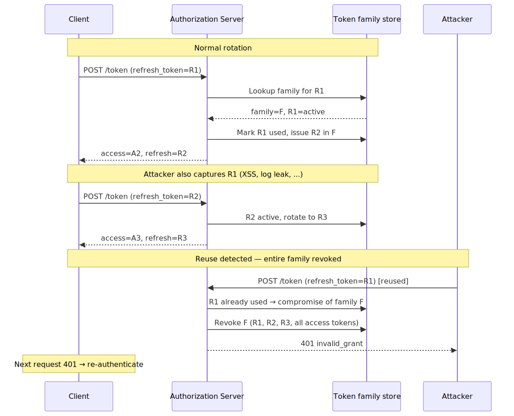
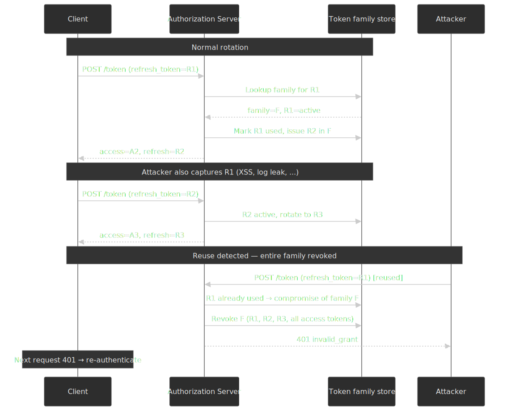
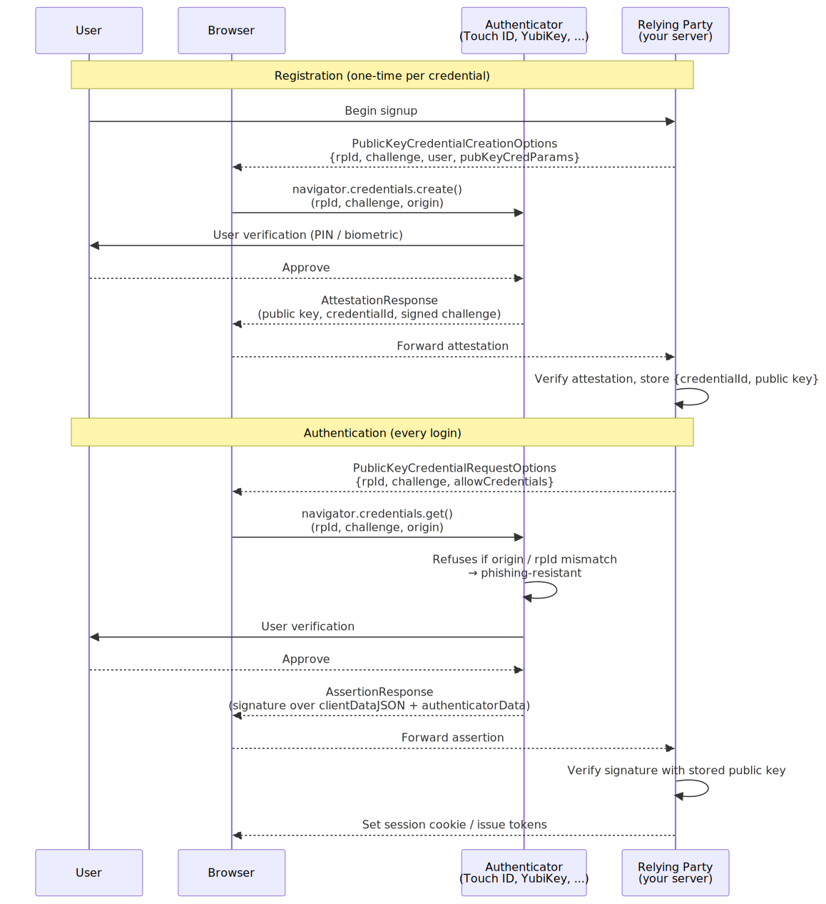
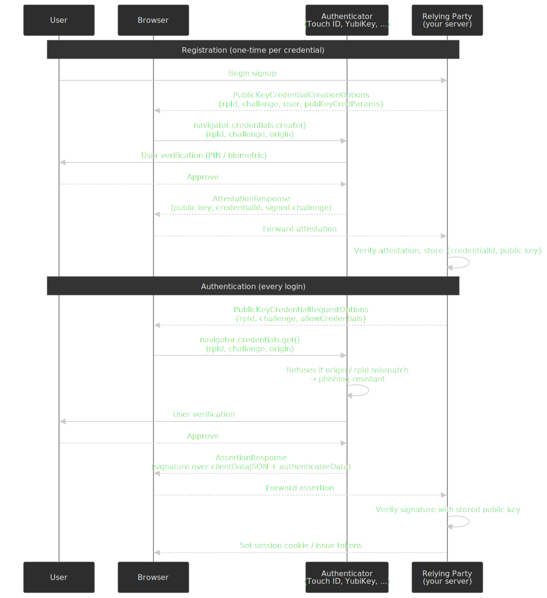

# Authentication Foundations: Sessions, Tokens, and Trust

Authentication is mostly a series of trade-offs you cannot postpone: server-side session vs. self-contained token, password vs. passkey, RBAC vs. ABAC, immediate revocation vs. horizontal scale. This article gives a senior engineer the smallest mental model that lets you make those calls deliberately, the current 2026 source-of-truth parameters for the cryptographic and protocol pieces, and pointers to the deeper sibling articles in the Web Security & Authentication series — [OAuth & OIDC Flow Guide](../oauth-oidc-flow-guide/README.md), [CSRF and CORS Defense](../csrf-and-cors-defense/README.md), [Web App Security Architecture](../web-app-security-architecture/README.md), and the [OWASP Top 10 Guide](../owasp-top-10-guide/README.md) — that cover the broader threat model.




## Mental model

Three orthogonal questions, asked in order on every protected request:

1. **Authentication (AuthN)** — who is the calling principal? Verified via a credential the caller proves they hold (password + factor, possession of a private key, a previously issued session/token).
2. **Authorization (AuthZ)** — what is that principal allowed to do on this resource right now? Decided by a policy that consumes identity claims, resource attributes, and environment.
3. **Accounting** — what did the principal actually do? An immutable audit trail that feeds anomaly detection, incident response, and compliance.

Two invariants worth holding in your head before you read further:

- **Sessions vs. tokens is an architectural choice, not a security ranking.** Either can be secure; they fail in different ways and scale through different mechanisms.
- **Bearer tokens (JWT, OAuth access tokens, opaque session IDs) cannot be truly revoked without infrastructure.** You either accept short lifetimes, run a revocation list, or sender-constrain the token to a key the client holds ([RFC 9700, §4.13–4.14](https://datatracker.ietf.org/doc/html/rfc9700#section-4.13)).

Common terms used throughout, defined exactly once:

| Term | Definition |
| :--- | :--- |
| **Principal** | The authenticated subject — typically a user, but can be a service account or device. |
| **Credential** | What the principal presents to prove identity (password, private key, passkey, prior session). |
| **Bearer token** | A token whose holder is treated as the principal (e.g., JWT, opaque session ID). Lose it, lose the account. |
| **Sender-constrained token** | A token cryptographically bound to a key the client proves possession of (DPoP, mTLS). Stealing the token alone is useless. |
| **Relying Party (RP)** | The application performing the authentication decision. Borrowed from WebAuthn / OIDC vocabulary. |
| **Authorization Server (AS)** | The component that issues access/refresh tokens (your own service, or Auth0 / Okta / Cognito / Entra ID). |

## Sessions vs. tokens

Server-side sessions and self-contained tokens both move bytes between client and server on every request; what differs is **where the trust state lives** and **what the server has to do to evaluate it**.




### How each one actually works

**Session cookies.** The server generates a high-entropy opaque ID, persists `{sid → {userId, roles, expiresAt}}` in a session store (Redis, Postgres, Memcached), and sets the ID in a cookie scoped to the application's origin. Each request carries the cookie; the server reads the store, applies an idle-timeout check, and rolls the expiry. Logout deletes the row, killing every device using that session. Cookies are managed by the browser and are subject to the [`SameSite`, `Secure`, `HttpOnly`, and `Partitioned` attributes](https://datatracker.ietf.org/doc/html/draft-ietf-httpbis-rfc6265bis-22) — see [`csrf-and-cors-defense`](../csrf-and-cors-defense/README.md) for the cross-site attack surface.

**JWT (or any self-contained token).** The authorization server signs a JSON payload containing the user's identity claims and an expiry. Anyone who holds the issuer's verification key (symmetric secret or, more commonly, a public key fetched from a JWKS endpoint) can validate the token without I/O. The token is opaque to the client but readable to anyone who base64-decodes it; never put secrets in JWT claims ([RFC 7519, §10.1](https://datatracker.ietf.org/doc/html/rfc7519#section-10.1)).

### Trade-off matrix

| Aspect | Server session | Self-contained token (JWT) |
| :--- | :--- | :--- |
| State lives on | Server (shared store) | Client (the token itself) |
| Per-request cost | Network round-trip to session store | Signature verification (cheap once JWKS is cached) |
| Revocation | Immediate — delete the row | Wait for expiry, run a denylist, or rotate signing keys |
| Cross-domain | Cookie scoping is awkward; needs care with `SameSite=None; Secure; Partitioned` | Native — `Authorization: Bearer …` works anywhere CORS does |
| Mobile / native clients | Awkward (no cookie jar without a webview) | Native — bearer header in any HTTP client |
| Token size on the wire | ~30–60 bytes (opaque ID) | ~500 bytes – several KB (claims + signature) |
| Compromise blast radius | Attacker holds session ID until logout | Attacker holds full claims until token expires |
| Session store dependency | Hard requirement; outage = global logout | None for verification (issuer outage only blocks new logins) |
| Multi-region scale | Needs replicated store or sticky routing | Stateless verification at every edge |

### When to pick what

Choose **server sessions** when:

- You can tolerate the session-store dependency (it's almost always a single point of failure for auth — design accordingly).
- You need **immediate, reliable revocation** — banking, healthcare, internal admin tools.
- The frontend and backend share an origin and `SameSite=Lax` does the CSRF heavy lifting for you.
- You want to be able to introspect a live session ("kill all sessions for user X", "show me all devices logged in as Y").

Choose **self-contained tokens** when:

- You're crossing origins or boundaries between independently deployed services (typical SPA/microservices/mobile).
- Per-request session-store latency is unacceptable (high-fan-out APIs, edge functions).
- You can live with revocation being eventual, and you're prepared to run refresh-token rotation (below).

The de facto pattern for modern web SPAs is the **hybrid**: a short-lived JWT access token kept in JavaScript memory, plus a refresh token in an `HttpOnly; Secure; SameSite=Strict` cookie. Memory storage means XSS cannot exfiltrate the access token from disk; `HttpOnly` keeps the refresh token completely out of JavaScript's reach. Backed by refresh-token rotation, this gives you JWT scalability with most of the revocation properties of a session.

> [!WARNING]
> "Just store the JWT in `localStorage`" is a recurring footgun. Any XSS on your origin lifts every token from `localStorage` — there is no equivalent of `HttpOnly` for it. Treat `localStorage` as world-readable from your own origin.

### Refresh-token rotation, the right way

Long-lived refresh tokens are the single biggest revocation gap in JWT-based auth. [RFC 9700](https://datatracker.ietf.org/doc/html/rfc9700#section-4.14) (the OAuth 2.0 Security Best Current Practice, January 2025) requires that refresh tokens for public clients are either **sender-constrained** (DPoP from [RFC 9449](https://datatracker.ietf.org/doc/html/rfc9449), or mutual-TLS from [RFC 8705](https://datatracker.ietf.org/doc/html/rfc8705)) **or rotated on every use with reuse detection**.

The rotation pattern, with a "token family" tracked server-side:




The non-obvious part is **reuse detection**. The legitimate client only ever holds the latest refresh token; if the previous one is presented, you have observed a clone. The correct response is to revoke every token in the family — including currently valid access tokens — and force re-authentication. Auth0, Okta, Descope, and most modern auth services implement exactly this.[^rt-rotation]

[^rt-rotation]: [Auth0 — Refresh Token Rotation](https://auth0.com/docs/secure/tokens/refresh-tokens/refresh-token-rotation) and [Descope — Refresh token rotation](https://www.descope.com/blog/post/refresh-token-rotation) both implement the family-revocation semantics from [RFC 9700 §4.14.2](https://datatracker.ietf.org/doc/html/rfc9700#section-4.14.2).

> [!IMPORTANT]
> Race conditions are the failure mode you actually hit in production. If two parallel requests both refresh with the same token (mobile background sync, double-clicks, retry storms), naive rotation flags the second one as reuse and logs the user out. Either serialize per-token-family with a short distributed lock, or implement a small grace window (e.g. accept the previous token for ~30 s if the new one was issued from the same IP/device fingerprint).

## Credentials

### Password storage

If you must accept passwords, the storage choice is settled. The current [OWASP Password Storage Cheat Sheet](https://cheatsheetseries.owasp.org/cheatsheets/Password_Storage_Cheat_Sheet.html) ranks algorithms in this order, with these minimum parameters:

| Algorithm | Minimum parameters | Use when |
| :--- | :--- | :--- |
| **Argon2id** | `m = 19 MiB, t = 2, p = 1` (or `m = 46 MiB, t = 1, p = 1`; `m = 12 MiB, t = 3, p = 1`; `m = 9 MiB, t = 4, p = 1`; `m = 7 MiB, t = 5, p = 1`) | Default for any new system. Memory-hardness is the only practical defence against modern GPU and ASIC cracking. |
| **scrypt** | `N = 2^17 (128 MiB), r = 8, p = 1` | Argon2 unavailable in your runtime. |
| **bcrypt** | Cost factor ≥ 10; **enforce 72-byte input limit**. | Legacy systems; FIPS not required. |
| **PBKDF2-HMAC-SHA256** | 600,000 iterations | FIPS-140 compliance is mandatory. |

The tuning rule is **target 200–500 ms per hash on the production hardware that does login traffic**, then re-tune annually as hardware improves. Below 100 ms is too cheap; above ~1 s and authentication latency starts to dominate user perception and you have effectively built a self-DoS amplifier on `/login`.

```ts title="password.ts"
import argon2 from "argon2"

const ARGON2_OPTIONS = {
  type: argon2.argon2id,
  memoryCost: 19 * 1024,
  timeCost: 2,
  parallelism: 1,
} as const

export async function hashPassword(plain: string): Promise<string> {
  return argon2.hash(plain, ARGON2_OPTIONS)
}

export async function verifyPassword(plain: string, hash: string): Promise<boolean> {
  const ok = await argon2.verify(hash, plain)
  if (ok && argon2.needsRehash(hash, ARGON2_OPTIONS)) {
    // Lazy migration after a parameter bump: re-hash in the same login request
    // and write the new digest back to the database.
  }
  return ok
}
```

A few non-obvious notes:

- **bcrypt's 72-byte input limit is a real footgun.** If you let users paste a passphrase, every byte after the 72nd is silently ignored — and worse, two different long passphrases that share a 72-byte prefix collide. The OWASP-recommended workaround is to pre-hash with HMAC-SHA-256 and Base64-encode before bcrypt, keeping the result under 72 bytes.[^bcrypt-72]
- **Stop enforcing composition rules.** [NIST SP 800-63B-4](https://pages.nist.gov/800-63-4/sp800-63b.html) (Digital Identity Guidelines: Authentication and Authenticator Management, July 2025) explicitly bans mandatory composition rules and arbitrary periodic rotation, formalising guidance that has been in the document since the 2017 SP 800-63B Rev. 3. Enforce a long minimum (the new floor is **15 characters** when the password is the sole authenticator), screen against a [breached-password](https://haveibeenpwned.com/Passwords) corpus, and otherwise let users choose.
- **"Pepper" if you can.** A server-side secret prepended to the password before hashing protects you against database-only compromise (the attacker has the digests but not the pepper). Trade-off: rotating the pepper means a forced password reset across the user base, so tie it to the same secret-rotation cadence as your signing keys.

[^bcrypt-72]: [OWASP Password Storage Cheat Sheet — bcrypt](https://cheatsheetseries.owasp.org/cheatsheets/Password_Storage_Cheat_Sheet.html#bcrypt) describes the 72-byte truncation and the HMAC-SHA-256 + Base64 pre-hash workaround.

### Multi-factor authentication

A *factor* is meant to come from a different category than the others: knowledge (password), possession (a device or hardware key), or inherence (biometric). Two passwords are not two factors.

The practical hierarchy from worst to best, as of 2026:

| Factor | Phishing-resistant? | SIM-swap-resistant? | Notes |
| :--- | :---: | :---: | :--- |
| SMS OTP | No | **No** | Documented account-takeover vector via SIM-swap and SS7 interception. Acceptable only as a last-resort fallback. |
| Email OTP / magic link | No | n/a | Inherits the security of the email account. |
| TOTP ([RFC 6238](https://datatracker.ietf.org/doc/html/rfc6238)) | No (phishable) | Yes | Shared secret in user's authenticator app; 30-second window; `window=±1` for clock drift is the conventional setting. |
| Push notification (out-of-band) | Partially | Yes | Vulnerable to "MFA fatigue" / push-bombing attacks unless you require number-matching. |
| **WebAuthn / passkey** | **Yes — origin-bound** | Yes | Phishing-resistant by construction; see below. |
| Hardware security key (FIDO2 device-bound) | **Yes** | Yes | Strongest assurance; the AAL3 option in [NIST SP 800-63B-4](https://pages.nist.gov/800-63-4/sp800-63b.html). |

If you only ship one factor beyond a password, ship a passkey.

### WebAuthn and passkeys

[WebAuthn](https://www.w3.org/TR/webauthn-3/) is a public-key credential protocol standardised by the W3C and FIDO Alliance. The authenticator (Touch ID, Windows Hello, a YubiKey, an Android secure enclave) holds the private key; the relying party stores only the public key. The authenticator signs an origin-bound challenge — and that origin binding is the entire reason passkeys defeat phishing.




The mechanism: when the browser calls `navigator.credentials.create()` or `.get()`, it includes the *current top-level origin* in the `clientDataJSON` blob the authenticator signs. The authenticator additionally checks that the call's `rpId` is the registered Relying Party. A credential registered for `bank.com` cannot be exercised on `bank.com.evil.example` — the authenticator simply refuses.[^webauthn-origin] No amount of social engineering changes that.

[^webauthn-origin]: [WebAuthn Level 3, §5.1.3 (Create) and §5.1.4 (Get)](https://www.w3.org/TR/webauthn-3/#sctn-createCredential) describe the rpId / origin checks the authenticator performs before signing.

**Status as of 2026-Q2:**

- [WebAuthn Level 3 is a W3C Candidate Recommendation Snapshot](https://www.w3.org/TR/webauthn-3/), published 2026-01-13. New in L3: client capability discovery, supplemental public keys, cross-origin authentication via `<iframe>` with explicit RP opt-in, and explicit signaling for credential backup state.
- **Synced passkeys** (Apple iCloud Keychain, Google Password Manager, Microsoft account, plus third-party managers like 1Password and Bitwarden) roam credentials across the user's devices in a single ecosystem; the credential is the same key material everywhere.
- **Cross-ecosystem portability** (e.g. Apple → Google) is not yet generally available. The [FIDO Alliance Credential Exchange Format (CXF)](https://fidoalliance.org/specifications-credential-exchange-specifications/) — Proposed Standard, August 2025 — defines *what* gets moved; the Credential Exchange Protocol (CXP), still in working draft, defines *how*. Apple's iOS/macOS 26 ships a same-device CXF-based transfer flow; full cross-provider exchange is an in-progress story for late 2026.[^cxf]

[^cxf]: [FIDO Alliance — Credential Exchange Specifications](https://fidoalliance.org/specifications-credential-exchange-specifications/); see also the [1Password explainer on CXF/CXP](https://www.1password.community/blog/developer-blog/portability-without-compromise-1password-helps-author-a-new-standard-for-secure-/163208) for a current implementer's view of the gap between same-device export and cross-platform sync.

> [!TIP]
> When you launch passkeys, design for the *recovery* path before you design the *enrolment* path. A user who loses their only passkey and only device needs a route back into their account that does not silently degrade your assurance to "what's in their email". Common patterns: enforce two passkeys at enrolment (one platform, one cross-platform), allow a passkey-protected recovery code, or require a video-verified IDV step for high-value accounts.

## JWT mechanics and security

If you're using JWTs, the failure modes you have to design against are nearly all in the verification path.

### Anatomy

A JWT is three base64url-encoded segments joined with dots: `header.payload.signature`. The header declares the algorithm (`alg`) and key id (`kid`); the payload carries the claims; the signature covers `header.payload`.

The standard registered claims you should always set and always verify:

| Claim | Purpose |
| :--- | :--- |
| `iss` | Issuer. The audience must check this matches the expected AS. |
| `sub` | Subject — the principal's stable identifier (NOT email). |
| `aud` | Audience — the resource server(s) this token is for. Wrong `aud` = reject. |
| `exp` | Expiry (epoch seconds). Past `exp` = reject. |
| `nbf` | Not-before (optional). |
| `iat` | Issued-at, useful for max-age policy. |
| `jti` | Unique token ID, used for replay-protection and denylists. |

### Algorithm selection

Pick the algorithm based on whether the verifier can hold the signing secret.

| Algorithm | Type | When to use |
| :--- | :--- | :--- |
| **EdDSA (Ed25519)** | Asymmetric | First choice for new systems. ~30× faster signing than RSA-2048; small (32-byte) public keys.[^eddsa-perf] |
| **ES256** (ECDSA P-256) | Asymmetric | Mature; supported everywhere; the default in OpenID Connect. |
| **RS256** (RSA-2048+) | Asymmetric | Slow signing, very fast verification (`e=65537`); useful when verifiers are many and signers are few. |
| **HS256** (HMAC-SHA-256) | Symmetric | Only when the issuer and the verifier are the same trust boundary. Sharing an HMAC secret across services is the classic key-sprawl mistake. |

[^eddsa-perf]: Practitioner benchmarks on commodity hardware put Ed25519 signing roughly 30× faster than RSA-2048 signing, with RSA verification still measurably faster than Ed25519 verification ([asecuritysite.com OpenSSL benchmark](https://asecuritysite.com/openssl/openssl3_b2)).

### The four JWT footguns you must defend against

1. **`alg: none`.** [RFC 7519 §6.1](https://datatracker.ietf.org/doc/html/rfc7519#section-6.1) defines an "unsecured" JWT with no signature. Some libraries accept it by default. Strip the signature, set `alg` to `none`, and a vulnerable verifier passes the token. **Defence:** never verify with the algorithm taken from the token's header — pin the algorithm in the call.
2. **Algorithm confusion (RS256 → HS256).** A library that accepts both asymmetric and symmetric algorithms can be tricked into using the *public* key as if it were an HMAC secret. Since the public key is, by design, public (often via JWKS), the attacker forges valid HMAC signatures.[^jwt-confusion] **Defence:** explicit allowlist of expected algorithms in `jwt.verify(token, key, { algorithms: ["EdDSA"] })`.
3. **`kid` injection.** The `kid` header tells the verifier which key to look up. If the verifier reads `kid` as a filesystem path or SQL fragment, you have a path-traversal / SQL-injection bug feeding into your trust root. **Defence:** treat `kid` as an opaque string keyed into a map populated from your trusted JWKS; never as a file path.
4. **Missing `aud` / `iss` checks.** A token issued by your IdP for service A is happily accepted by service B if B does not check `aud`. **Defence:** every verifier validates `iss`, `aud`, and `exp` *every time*, in addition to the signature.

[^jwt-confusion]: [PortSwigger Web Security Academy — JWT algorithm confusion attacks](https://portswigger.net/web-security/jwt/algorithm-confusion) walks through a working RS256 → HS256 forgery against a public-key endpoint.

```ts title="jwt-verify.ts"
import jwt, { type JwtPayload } from "jsonwebtoken"
import { JwksClient } from "jwks-rsa"

const jwks = new JwksClient({
  jwksUri: process.env.JWKS_URI!,
  cache: true,
  rateLimit: true,
})

const ALLOWED_ALGS = ["EdDSA"] as const

export async function verifyAccessToken(token: string): Promise<JwtPayload> {
  return new Promise((resolve, reject) => {
    jwt.verify(
      token,
      (header, cb) => {
        jwks
          .getSigningKey(header.kid)
          .then((key) => cb(null, key.getPublicKey()))
          .catch(cb)
      },
      {
        algorithms: ALLOWED_ALGS,
        issuer: process.env.JWT_ISSUER,
        audience: process.env.JWT_AUDIENCE,
      },
      (err, decoded) => (err ? reject(err) : resolve(decoded as JwtPayload)),
    )
  })
}
```

### Revoking JWTs

Strictly, you cannot. The token is a signed self-describing claim; once it's out, anyone can verify it until `exp`. The four production patterns:

- **Short access-token TTL + refresh rotation.** The cheapest, most common pattern. 5–15 min for sensitive APIs, 15–30 min for general use. Compromise window equals the access-token TTL.
- **Denylist by `jti`.** A per-`jti` "revoked until exp" entry in Redis or a Bloom filter at the API gateway. Cheap if the denylist is small; turns into a hot path if you revoke aggressively.
- **Sender-constrained tokens (DPoP / mTLS).** The token is bound to a client-held key. Stealing the token alone is useless because the verifier requires a fresh proof-of-possession on each request ([RFC 9449](https://datatracker.ietf.org/doc/html/rfc9449), [RFC 8705](https://datatracker.ietf.org/doc/html/rfc8705)).
- **Key rotation as panic button.** Rotate the signing key and invalidate the JWKS entry to revoke *every* token in one action. Useful for "we have been breached, log everyone out" — destructive, so reserve it for incidents.

## Authorization: RBAC, ABAC, and ReBAC

Once authentication has produced an identity, authorization decides *what they can do*. The three families you will hit in real systems:

### RBAC — Role-Based Access Control

Permissions attach to roles; users are assigned roles. The model is formalised in [NIST INCITS 359 (RBAC)](https://csrc.nist.gov/projects/role-based-access-control). It works because most real-world permission requirements track *job function*, not individual users.

RBAC's failure mode is **role explosion**. The moment a permission depends on the resource ("only your own documents") or context ("only during business hours"), pure RBAC starts spawning roles like `editor-team-A-monday-thru-friday-9-to-5`. When you find yourself doing that, you've outgrown RBAC.

```ts title="rbac.ts" mark={20-22}
type Permission = `${string}:${"create" | "read" | "update" | "delete"}`

const rolePermissions = new Map<string, Set<Permission>>([
  ["admin", new Set(["user:create", "user:read", "user:update", "user:delete"])],
  ["editor", new Set(["user:read", "user:update"])],
  ["viewer", new Set(["user:read"])],
])

export function userHasPermission(roles: string[], permission: Permission): boolean {
  return roles.some((r) => rolePermissions.get(r)?.has(permission) ?? false)
}

export function requirePermission(permission: Permission) {
  return (req, res, next) => {
    if (!req.user) return res.status(401).json({ error: "unauthenticated" })
    if (!userHasPermission(req.user.roles, permission)) {
      return res.status(403).json({ error: "forbidden" })
    }
    next()
  }
}
```

### ABAC — Attribute-Based Access Control

Decisions are computed from attributes of `subject`, `resource`, `action`, and `environment`. The reference is [NIST SP 800-162](https://csrc.nist.gov/publications/detail/sp/800-162/final). ABAC handles the contextual cases RBAC chokes on ("a doctor can read a chart only if assigned to that patient and they are on shift"), at the cost of a real policy engine you have to author, version, and reason about.

The standard production options:

- **OPA / Rego.** Open Policy Agent runs as a sidecar or library; policies are decoupled from application code. Best when many services share the same policy.
- **AWS Cedar / Amazon Verified Permissions.** Cedar is a typed, formally analysable policy language; Verified Permissions is the managed evaluator. Strong if you're already on AWS.
- **In-process policy code.** Fine for small surface areas; sets up a future refactor into a real engine.

> [!CAUTION]
> Always default-deny. ABAC engines are designed so an exception during evaluation, an unmatched policy, or a missing attribute resolves to **deny**, never to *permit*. If a policy returns `undefined`, that is not "allow" — that is a bug.

### ReBAC — Relationship-Based Access Control

When permissions are graph-shaped — "you can read a document if you are in any group that has been granted access, transitively" — RBAC and ABAC both struggle. The dominant ReBAC implementations ([SpiceDB](https://authzed.com/), [OpenFGA](https://openfga.dev/), Google's internal Zanzibar) model authorization as a relationship graph and answer "can `user:alice` perform `read` on `document:42`?" by traversing it. Useful for collaboration products (Drive, Notion, Figma) where the permission *is* the relationship.

### Choosing

| You have… | Start with |
| :--- | :--- |
| A small, mostly static set of roles tied to job function | RBAC |
| Contextual rules on top of roles ("own documents only", "business hours") | RBAC + a small ABAC overlay |
| Genuinely graph-shaped permissions (sharing, teams, transitive grants) | ReBAC |
| A regulated environment with explicit policy governance | ABAC with OPA / Cedar |

The pragmatic path is *RBAC first, ABAC where it actually pays for itself, ReBAC only if your domain is genuinely a permission graph*. Migrating from RBAC to ABAC later is straightforward; ripping a misapplied ReBAC out of a product that didn't need it is not.

## Cookie security primer

If you ship sessions or refresh tokens via cookies, the attribute set is doing the heavy lifting. The current 2026 defaults:

| Attribute | Setting | Why |
| :--- | :--- | :--- |
| `HttpOnly` | always on for auth cookies | Cookie is invisible to JavaScript — XSS can't read it. |
| `Secure` | always on | Cookie only sent over TLS. Required for `SameSite=None` and for `Partitioned`. |
| `SameSite` | `Lax` (default), `Strict` for high-value actions, `None` only when cross-site is required | The browser default since Chrome 80 (Feb 2020) is `Lax`; explicit `Strict` blocks cross-site `GET` too.[^samesite] |
| `Domain` / `Path` | scope as narrowly as possible | Domain widening is a one-way upgrade you'll regret. |
| `Partitioned` | when cookie is set in a third-party context (embedded widgets, OAuth pop-ups) | [CHIPS](https://developer.mozilla.org/en-US/docs/Web/Privacy/Guides/Privacy_sandbox/Partitioned_cookies) double-keys the cookie by top-level site, allowing legitimate third-party state without enabling cross-site tracking. Required as third-party cookies are phased out. |
| `__Host-` prefix | for cookies that should be locked to a single origin | Forces `Secure`, no `Domain`, `Path=/`. The browser refuses to set the cookie if any of those are violated. |

[^samesite]: [PortSwigger — Bypassing SameSite cookie restrictions](https://portswigger.net/web-security/csrf/bypassing-samesite-restrictions) covers default behaviour and the standard bypasses. The attribute itself is normatively defined in [`draft-ietf-httpbis-rfc6265bis-22`](https://datatracker.ietf.org/doc/html/draft-ietf-httpbis-rfc6265bis-22), currently in the RFC Editor queue (December 2025) as the successor to RFC 6265.

The deeper CSRF / CORS story — how `SameSite` interacts with `OPTIONS` preflights, when you still need a CSRF token, the `Origin`-header strategy — lives in [`csrf-and-cors-defense`](../csrf-and-cors-defense/README.md).

## Operational guardrails

Authentication is one of the few subsystems where the failure mode is "user account silently taken over weeks ago." Treat the operational pieces as load-bearing.

- **Rate-limit `/login`, `/refresh`, `/reset` per identity *and* per IP.** Per-identity catches credential-stuffing against a single user; per-IP catches a botnet hitting many users. Exponential back-off plus a temporary lockout after ~5–10 failures is standard. Always return a constant-time *and* constant-shape response — never reveal whether the email exists.
- **Detect anomalies in real time.** Impossible-travel (login from two countries inside a token's TTL), new-device sign-in, MFA-fatigue patterns (lots of denied push prompts), and refresh-token reuse should each trigger an account-level signal that can step-up authentication or alert security ops.
- **Audit every auth event with an immutable, queryable trail.** Login success/failure, token issue/refresh/revoke, MFA enrolment changes, password change, recovery flow — log them with `userId`, `sessionId`, `jti`, IP, user-agent, and a stable correlation id. The audit log is what you'll wish you had when you're the one writing the breach disclosure.
- **Plan the incident response *before* the incident.** The runbooks you need: revoke a single user's tokens, rotate a signing key (and what breaks when you do), purge a session-store partition, force MFA re-enrolment across a tenant.
- **Recovery is the auth surface.** A passkey-protected account whose recovery is "click a link in your email" inherits the security of email. Recovery flows must equal the assurance of the strongest enrolment factor — that usually means a second passkey, a recovery code locked at registration, or a verified-identity step.
- **Re-tune your hashing cost annually.** Hardware moves; what was 250 ms on 2023 hardware may be 80 ms today. Use `argon2.needsRehash()` (or the bcrypt/scrypt equivalent) on every successful login and lazily migrate to current parameters.

## Where this fits in the rest of the series

This article deliberately stops short of OAuth/OIDC mechanics, the full CSRF/CORS attack surface, and the broader application threat model. Continue with:

- [`oauth-oidc-flow-guide`](../oauth-oidc-flow-guide/README.md) — Authorization Code with PKCE, OIDC discovery, ID-token vs access-token semantics.
- [`csrf-and-cors-defense`](../csrf-and-cors-defense/README.md) — `SameSite`, CSRF tokens, the `Origin` header, CORS preflights.
- [`web-app-security-architecture`](../web-app-security-architecture/README.md) — CSP, security headers, threat-modelling the front end.
- [`csp-violation-reporting-pipeline`](../csp-violation-reporting-pipeline/README.md) — operationalising CSP at scale.
- [`owasp-top-10-guide`](../owasp-top-10-guide/README.md) — the broader risk catalogue this article assumes you'll layer on top.

A note on **Zero Trust**: ["never trust, always verify"](https://csrc.nist.gov/publications/detail/sp/800-207/final) ([NIST SP 800-207](https://csrc.nist.gov/publications/detail/sp/800-207/final)) is an architectural posture for the whole network and identity plane, not an authentication primitive. The pieces in this article — short-lived tokens, sender-constraining, continuous verification via reuse detection and anomaly signals, default-deny ABAC — are how you implement Zero Trust at the application layer. The framework deserves its own deep dive elsewhere.

## References

**Specifications and standards**

- [`draft-ietf-httpbis-rfc6265bis-22`](https://datatracker.ietf.org/doc/html/draft-ietf-httpbis-rfc6265bis-22) — current cookie semantics including `SameSite`, `Secure`, `HttpOnly`, `Partitioned` (RFC Editor queue, Dec 2025).
- [RFC 6238](https://datatracker.ietf.org/doc/html/rfc6238) — TOTP.
- [RFC 6749](https://datatracker.ietf.org/doc/html/rfc6749) — OAuth 2.0 Authorization Framework.
- [RFC 6750](https://datatracker.ietf.org/doc/html/rfc6750) — Bearer Token Usage.
- [RFC 7519](https://datatracker.ietf.org/doc/html/rfc7519) — JSON Web Token.
- [RFC 7636](https://datatracker.ietf.org/doc/html/rfc7636) — OAuth PKCE.
- [RFC 8252](https://datatracker.ietf.org/doc/html/rfc8252) — OAuth 2.0 for Native Apps.
- [RFC 8628](https://datatracker.ietf.org/doc/html/rfc8628) — OAuth 2.0 Device Authorization Grant.
- [RFC 8705](https://datatracker.ietf.org/doc/html/rfc8705) — Mutual-TLS sender-constrained tokens.
- [RFC 9068](https://datatracker.ietf.org/doc/html/rfc9068) — JWT profile for OAuth 2.0 access tokens.
- [RFC 9449](https://datatracker.ietf.org/doc/html/rfc9449) — DPoP.
- [RFC 9700](https://datatracker.ietf.org/doc/html/rfc9700) — OAuth 2.0 Security BCP (January 2025).
- [`draft-ietf-oauth-v2-1-15`](https://datatracker.ietf.org/doc/html/draft-ietf-oauth-v2-1-15) — OAuth 2.1 (Working Group document, March 2026; not yet submitted to the IESG).
- [WebAuthn Level 3](https://www.w3.org/TR/webauthn-3/) — W3C Candidate Recommendation Snapshot, 2026-01-13.
- [OpenID Connect Core 1.0](https://openid.net/specs/openid-connect-core-1_0.html).

**NIST**

- [SP 800-63-4 / 800-63B-4](https://pages.nist.gov/800-63-4/) — Digital Identity Guidelines, authentication assurance levels (final, July 2025; supersedes SP 800-63-3).
- [SP 800-162](https://csrc.nist.gov/publications/detail/sp/800-162/final) — ABAC.
- [SP 800-207](https://csrc.nist.gov/publications/detail/sp/800-207/final) — Zero Trust Architecture.
- [INCITS 359 — RBAC](https://csrc.nist.gov/projects/role-based-access-control).

**OWASP**

- [Password Storage Cheat Sheet](https://cheatsheetseries.owasp.org/cheatsheets/Password_Storage_Cheat_Sheet.html).
- [Authentication Cheat Sheet](https://cheatsheetseries.owasp.org/cheatsheets/Authentication_Cheat_Sheet.html).
- [Authorization Cheat Sheet](https://cheatsheetseries.owasp.org/cheatsheets/Authorization_Cheat_Sheet.html).

**Practitioner references**

- [Auth0 — Refresh Token Rotation](https://auth0.com/docs/secure/tokens/refresh-tokens/refresh-token-rotation).
- [PortSwigger Web Security Academy — JWT attacks](https://portswigger.net/web-security/jwt).
- [FIDO Alliance — Credential Exchange Specifications](https://fidoalliance.org/specifications-credential-exchange-specifications/).
- [MDN — Partitioned cookies (CHIPS)](https://developer.mozilla.org/en-US/docs/Web/Privacy/Guides/Privacy_sandbox/Partitioned_cookies).
