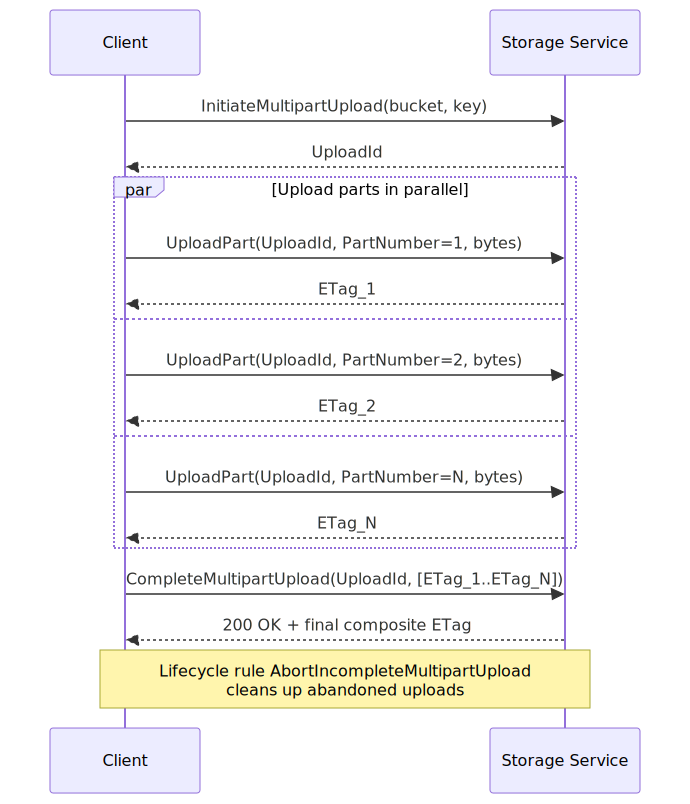
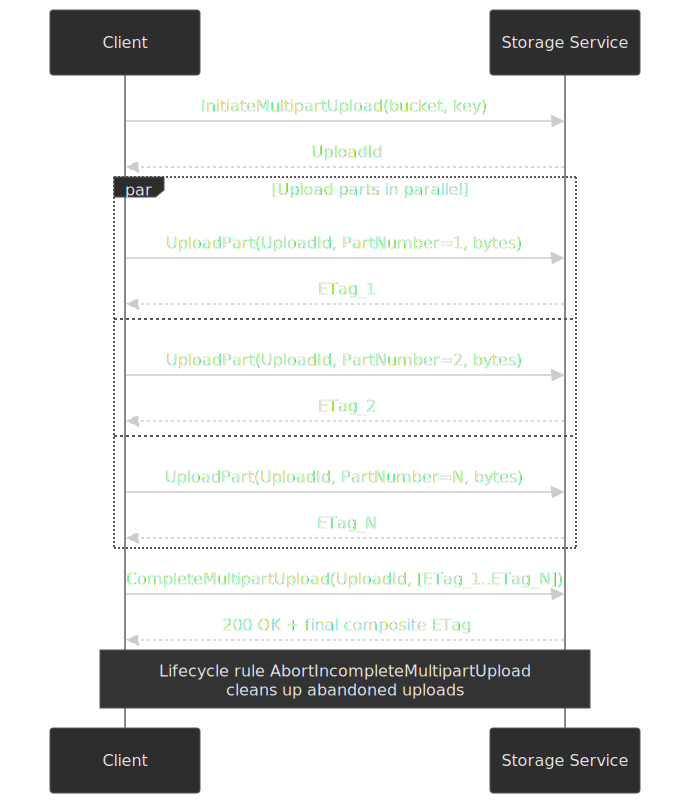

# Blob Storage Design

Object stores look deceptively simple from the outside — `PUT`, `GET`, `DELETE` against a flat namespace — but underneath they are some of the largest distributed systems on Earth. Amazon S3 alone holds over 500 trillion objects across hundreds of exabytes and serves 200+ million requests per second at peak[^s3-scale]. This article unpacks how a system like that is actually built: how it chunks data, where it deduplicates, how metadata and data scale on different axes, when 3-way replication wins over erasure coding (and when it doesn't), how Local Reconstruction Codes change the repair math, and which lifecycle behaviours decide whether the bill is sane. The goal is a mental model strong enough to design, review, or operate a storage system at meaningful scale.

## Thesis

Blob storage trades complexity for scale by treating large files as collections of immutable, content-addressed chunks. Five decisions dominate the design space:

- **Chunking** — fixed-size is cheap and predictable; content-defined chunking (CDC) tolerates edits and unlocks meaningful deduplication for backup-shaped workloads.
- **Deduplication** — file-level is coarse but cheap; block-level maximises savings but the index grows linearly with chunk count and becomes the system's bottleneck.
- **Metadata–data separation** — metadata is IOPS-bound and consistency-sensitive; data is throughput-bound and append-friendly. Putting them in the same store is the single most expensive mistake you can make at scale.
- **Redundancy** — 3-way replication is fast to read and trivial to repair but costs 3×; Reed-Solomon and LRC drop the overhead to ~1.3× at the cost of CPU and repair-traffic complexity.
- **Tiering** — most data is written once and read rarely; pricing it as if it were hot is the single biggest source of waste.

The fundamental tension is **storage overhead vs durability vs access latency**. You cannot dominate all three at once; you choose two and engineer around the third.

## Object vs block vs file storage

Object stores aren't a strictly better filesystem — they made specific design choices that simplify distribution at the cost of features that block and file storage retain.

| Characteristic   | Object Storage                                | Block Storage                          | File Storage                           |
| ---------------- | --------------------------------------------- | -------------------------------------- | -------------------------------------- |
| **Data model**   | Objects (key → bytes + metadata)              | Fixed-size blocks addressed by LBA     | Hierarchical files and directories     |
| **Access**       | HTTP REST (S3, Azure Blob, GCS)               | iSCSI, NVMe-oF, Fibre Channel          | NFS, SMB                               |
| **Namespace**    | Flat (bucket + key)                           | Volume + offset                        | Directory tree                         |
| **Best for**     | Unstructured data, backups, media, analytics  | Databases, VMs, transactional logs     | Shared filesystems, content management |
| **Latency**      | Tens of ms first byte                         | Sub-millisecond                        | Single-digit ms                        |
| **Scalability**  | Exabytes per region                           | Petabytes per array                    | Petabytes per cluster                  |
| **Modification** | Replace whole object (no in-place edits)      | In-place LBA writes                    | In-place file writes                   |

The flat namespace and immutable objects are not a limitation — they are the design. Without directory hierarchies there is no tree-consistency problem to coordinate across thousands of nodes. Without in-place updates writes are append-only, which eliminates write conflicts, removes the need for fine-grained locks, and lets the system cache aggressively on read.

### The object model

An object has four moving parts:

1. **Key** — a unique string within a bucket, e.g. `photos/2024/vacation.jpg`.
2. **Data** — opaque bytes from a few B up to 48.8 TiB ("50 TB") on S3 since December 2025[^s3-50tb].
3. **Metadata** — system-generated (size, ETag, timestamps, storage class) plus user key-value pairs.
4. **Version ID** — optional, populated on versioned buckets.

The `/` in keys is not a directory separator. The flat namespace is real — there is no tree to traverse — but `LIST` operations with a `prefix` and `delimiter=/` simulate directory listing for tooling. Buckets give you the policy boundary (IAM, encryption defaults, lifecycle rules, versioning, replication) but cost nothing per-bucket; a single account can hold trillions of objects across millions of buckets.

## Chunking strategies

Files are too big and varied to be a single unit at the storage layer. Chunking exists for three reasons: parallel transfer, parallel placement (so a single object can be spread across many disks), and deduplication. The chunking algorithm decides how well the last of these works.

### Fixed-size chunking

Split the file at every N-byte boundary, hash each chunk (typically SHA-256), use the hash as the chunk identifier.

- ✅ Trivial to implement, deterministic, low CPU.
- ✅ Predictable chunk count for capacity and concurrency planning.
- ❌ A single-byte insertion at the front shifts every subsequent boundary, so every chunk hash changes. Deduplication against the pre-edit version is effectively zero.
- ❌ Chunk size becomes a hard trade-off between metadata overhead and dedup granularity.

The original Google File System used 64 MiB chunks specifically because the master held all chunk metadata in memory and a larger chunk size kept the master's working set tiny — under 64 bytes per 64 MiB chunk[^gfs]. The cost was internal fragmentation for small files and hot-spotting on popular small chunks.

| Chunk size       | Metadata overhead | Dedup potential | Network efficiency                     | Typical use case |
| ---------------- | ----------------- | --------------- | -------------------------------------- | ---------------- |
| 4 KiB            | Very high         | Maximum         | Poor (per-request overhead dominates)  | Filesystem-like  |
| 64 KiB – 1 MiB   | Moderate          | High            | Good                                   | General object   |
| 4 – 8 MiB        | Low               | Moderate        | Good for large objects                 | Backups, media   |
| 64 MiB           | Very low          | Low             | Best raw throughput                    | Analytics, logs  |

### Content-defined chunking (CDC)

Slide a rolling hash across the byte stream; declare a boundary whenever the hash matches a target pattern (e.g., the low N bits are zero). Boundaries are derived from content, not position, so an insertion at byte 0 only changes the chunks that contain the insertion — everything downstream still hashes the same.

- ✅ Edits to the middle of a file only invalidate the chunks containing the edit.
- ✅ Cross-file deduplication (think VM images, container layers, source trees) lands properly.
- ❌ Variable chunk sizes complicate placement and capacity planning.
- ❌ Higher CPU per byte than fixed-size; rolling-hash performance is the dominant cost.

The dominant CDC families are Rabin fingerprinting, Gear-based hashing, and FastCDC. FastCDC[^fastcdc] (USENIX ATC 2016) reports ~10× higher chunking throughput than open-source Rabin and ~3× higher than Gear/AE, while keeping deduplication ratios within a few percent of Rabin. Three techniques get it there:

1. **Simplified hash judgment** — a single AND against a precomputed mask instead of polynomial division.
2. **Sub-minimum cut-point skipping** — never declare a boundary inside the first `min_size` bytes of a chunk; you skip the rolling-hash work for that range entirely.
3. **Normalized chunking** — switch between a "small mask" (more `1` bits, harder to match) below the target size and a "large mask" (fewer `1` bits, easier to match) above it, so the chunk-size distribution clusters around the target instead of being heavy-tailed.

> [!NOTE]
> A common myth is that Dropbox uses CDC. Per the Magic Pocket design notes, Dropbox stores fixed 4 MiB blocks and relies on content addressing on top of that fixed boundary[^dropbox]. Delta-sync (rsync-style) is a separate concern from chunk boundaries.

### Picking a chunk size

- 4 – 8 MiB is the right default for general-purpose object storage. It keeps per-object metadata bounded and is comfortably above the cost of a typical TCP/QUIC round trip.
- 64 KiB – 1 MiB is the right range when deduplication is load-bearing and the workload is dedup-heavy (backup, container layers, code).
- 64 MiB is the right size when you are write-once / read-sequentially (analytics, logs) and you want to minimise object count.

> [!TIP]
> Always profile dedup ratio at multiple chunk sizes against representative data before committing. Smaller chunks are not strictly better — at 4 KiB and 1 PiB of data you would track ~250 billion chunks. Index memory, not raw storage, becomes your scaling cliff long before disk does.

## Deduplication

Deduplication exists in two granularities and along an inline / post-process axis. Each combination has a different RAM bill, write-latency cost, and operational profile.

### File-level vs block-level

File-level dedup hashes the whole file. Two files with the same hash share storage; any modification produces a fresh file with no dedup benefit against its predecessor. The index is small (one entry per file) and the implementation is trivial — the catch is that the dedup ratio is also tiny outside narrow workloads (mass-mailed attachments, golden-image VMs).

Block-level dedup hashes each chunk. Different files share common chunks; the dedup ratio is dramatically higher on container layers, repeated VM images, and backup deltas. The cost is the index: one entry per chunk, with each entry holding at minimum the chunk hash plus a reference (location, refcount). ZFS, the most-studied production block-dedup system, stores 150–400 bytes per block in-core (Oracle reports ~320 bytes per entry) and recommends 1–5 GiB of RAM per TiB of unique data as a planning rule[^zfs-ddt].

The break-even depends almost entirely on **chunk count vs file count**. Block-dedup wins when chunks are coarser than files (large objects, big backups). It loses when files are tiny — a million 1 KiB files create more chunks under fine-grained block dedup than under file dedup, and the index dominates.

### Inline vs post-process

- **Inline** — hash and look up on the write path. Duplicates are never written. Storage savings are immediate; write latency includes an index lookup that may miss memory and hit disk.
- **Post-process** — write everything, run a background scanner that merges duplicates afterwards. Write latency stays clean. You pay for transient storage and a steady-state background workload that competes with reads.

The right answer is usually a hybrid: keep a hot dedup index in memory for the recent / popular working set (handled inline), and let the cold tail drift into a background sweep. The biggest production failure mode is treating the dedup index as if it were a database — once it spills out of memory, write latency becomes I/O-bound and P99 latency goes off a cliff.

### Bloom-filter front line

Most dedup systems put a Bloom filter in front of the on-disk index. Bloom filters give a probabilistic "possibly seen" / "definitely new" answer in O(1) memory per chunk. False positives cost a wasted disk lookup; false negatives are impossible, so a "definitely new" answer can short-circuit straight to a write. With 99%+ of chunks being net-new in a fresh ingestion, the Bloom layer absorbs the overwhelming majority of the work before the index is even consulted.

ZFS's deduplication table (DDT) is the canonical reference implementation: 256-bit checksums (SHA-256, Skein, or BLAKE3) indexed in an AVL tree, with the in-core entry holding the checksum, refcount, and on-disk pointer[^zfs-ddt]. It makes the trade-off concrete: every block costs hundreds of bytes of RAM, so the only way to keep the system honest is to use coarser blocks or accept a special metadata vdev on SSD.

## Metadata management

Object data wants throughput. Object metadata wants IOPS. Putting them on the same storage substrate guarantees that one starves the other.

| Characteristic       | Metadata                                | Data                                  |
| -------------------- | --------------------------------------- | ------------------------------------- |
| Access pattern       | Random, point lookups, IOPS-bound       | Sequential, large transfers           |
| Operation size       | Tens of bytes – KiB                     | KiB – MiB                             |
| Consistency          | Strong (must reflect the latest write)  | Append-only on immutable chunks       |
| Update rate          | High (LIST, HEAD, stat, refcount)       | Low (write-once, then immutable)      |
| Scaling axis         | IOPS, fan-out, transactions             | Bandwidth, capacity, parallelism      |

Decoupling them — different stores, different replication policies, different hardware — is non-negotiable above a few PiB.

### Single-master metadata: the GFS pattern

The original Google File System parked the entire namespace in a single master process — file→chunk mapping, chunk locations, leases, refcounts, the lot[^gfs]. Master memory was the binding scaling axis: at <64 bytes per 64 MiB chunk, a 4 GiB master could index a few PB of data. Persistence was a checkpoint (the namespace image) plus a write-ahead log; restart replayed the log against the checkpoint.

This model is wonderfully simple. It is also the model that pushed Google to build Colossus, GFS's successor, because the master's memory footprint became the file-count ceiling — practical limits sat around 100 million files long before storage capacity was an issue, and the master was a hot spot for every metadata RPC[^colossus].

### Distributed metadata: Colossus and Azure

Colossus replaces the single master with a sharded metadata service backed by Bigtable, fronted by stateless "curators" that handle metadata RPCs and "custodians" that drive recovery and rebalancing[^colossus]. Google reports Colossus clusters operating roughly 100× larger than the largest GFS clusters, and the service underlies YouTube, Gmail, BigQuery, and Google Cloud Storage.

Azure Storage[^azure-was] uses a three-layer split that has held up since the 2011 SOSP paper:

1. **Front-End Layer** — stateless API gateway: auth, request routing, throttling.
2. **Partition Layer** — provides Blob/Table/Queue semantics, transaction ordering, and **strong consistency**. Each partition is owned by a single partition server; the partition map is itself a partitioned data structure.
3. **Stream Layer** — append-only distributed storage of large immutable extents, replicated and (later) erasure-coded with LRC.

Distributed metadata trades operational simplicity for headroom. You gain horizontal scale and remove the single-failure point, but you inherit the full distributed-consistency surface — partition migration, consensus on the metadata shard, fan-out for `LIST`, hot-shard mitigation. None of these are accidental complexity; they are the price of not having a master.

### Consistency model

| System               | Model                                           | What it guarantees                                                          |
| -------------------- | ----------------------------------------------- | --------------------------------------------------------------------------- |
| AWS S3               | Strong read-after-write for **all** operations  | Every `GET`, `LIST`, and `HEAD` reflects the latest successful `PUT`/`DELETE` (since 2020-12)[^s3-strong] |
| Azure Blob           | Strong consistency                              | Same — write becomes visible to all readers on success                       |
| Google Cloud Storage | Strong consistency                              | Same — visible after the success response                                    |

S3 famously shipped weak consistency for overwrites and deletes for over a decade and then turned on strong consistency for everything — without raising prices or noticeably hurting latency — in December 2020[^s3-strong]. That is the new baseline; if your design assumes "S3 is eventually consistent for overwrites" you are reading stale advice.

## Replication and durability

You can spend storage to buy durability or you can spend CPU and repair bandwidth. Both work; both have failure modes.

### 3-way replication

Store three byte-identical copies on three storage units chosen for failure independence.

- ✅ Reads can come from any replica; latency is bounded by the closest healthy copy.
- ✅ Repair is a copy: pick a surviving replica, stream its bytes to a new disk.
- ✅ Decoding is free (`memcpy`).
- ❌ 3× storage overhead. At PB-scale this is the difference between a profitable service and a budget item.

The default HDFS placement policy[^hdfs-placement] is the canonical reference for "failure independence" with three copies:

- **Replica 1**: the writer's node if it is a DataNode, otherwise a random node.
- **Replica 2**: a node on a **different** rack from replica 1.
- **Replica 3**: a different node on the **same rack as replica 2**.

The two-racks-of-three design is a deliberate compromise: surviving any single node failure costs nothing (one replica per node); surviving any single rack failure costs nothing (replicas on at least two racks); but you save the inter-rack bandwidth of the third copy by colocating it with the second.

> [!CAUTION]
> Two replicas is not enough at scale. With thousands of disks, the probability of a second failure landing on the surviving replica before re-replication completes is meaningfully greater than zero. The repair window — first detection to fully re-replicated — is the danger zone, and three copies provide the margin you need to survive a coincident failure in that window.

### Erasure coding

Split each object into `k` data fragments and compute `m` parity fragments. Any `k` of the `k + m` fragments can rebuild the original. Storage overhead is `(k + m) / k`.

A widely used Reed-Solomon configuration is RS(10, 4): 10 data fragments + 4 parity = 14 fragments, 1.4× overhead, tolerant of any 4 simultaneous fragment losses[^rs-overhead]. Compared to 3× replication that is 53% less storage for comparable durability — at the cost of CPU on read/write and a far worse repair profile.

- ✅ 1.2 – 1.5× overhead vs 3× — a transformative cost difference at scale.
- ✅ Durability is configurable: bump `m` to survive more concurrent losses.
- ❌ Reading after a fragment loss requires reconstruction: fetch `k` other fragments and decode.
- ❌ Repairing a single failed fragment under classic Reed-Solomon also requires reading `k` fragments — for RS(12, 4) that is 12 reads to rebuild 1 lost fragment. With many concurrent failures, repair traffic can saturate the network and trigger cascading failures.

### Local Reconstruction Codes

Microsoft's Local Reconstruction Codes (LRC), introduced in the Azure Storage erasure-coding paper at USENIX ATC 2012[^azure-lrc], reshape the repair math while keeping overhead competitive with classic Reed-Solomon. The production scheme is **LRC(12, 2, 2)**: 12 data fragments split into two local groups of 6, one local parity per group, plus 2 global parities. 16 fragments total, 1.33× overhead — the same as RS(12, 4).

The win shows up under the most common failure case — a single fragment loss — where LRC reads only the 6 fragments inside the affected local group instead of pulling 12 from across the cluster.

 reads 12 surviving fragments; LRC (12, 2, 2) reads only 6 from inside the affected local group.")

In a system where single-fragment failures are by far the dominant failure mode, that 50% reduction in repair I/O is the difference between an erasure-coded fleet that can keep up with disk failure rates and one that can't.

### How "11 nines" actually happens

AWS quotes 11 nines (99.999999999%) of annual durability for Standard storage[^s3-durability]. That number is a model output, not a measured rate; you cannot observe 1-in-100-billion events in a year. The model assumes:

1. **Erasure-coded redundancy** distributed across many independent failure domains.
2. **Multi-AZ placement** — fragments span Availability Zones, so an entire AZ outage cannot lose an object.
3. **Per-fragment checksums** verified on every read; corruption is detected, not silently returned.
4. **Continuous background scrubbing** that re-reads cold data and verifies checksums even when no client is reading.
5. **Automatic, prioritised repair** — when a fragment is lost, a new one is reconstructed before the next failure can land on the same object.

The probability of losing all `k + m` placements before repair completes is astronomically small **only if failures are independent and repair is fast**. The places systems break the model in practice are correlated failures (firmware bug across a fleet, simultaneous power loss, software bug in the placement engine) and slow repair (because the operator turned down repair bandwidth to protect read latency).

## Garbage collection

Object delete is cheap; chunk delete is the hard problem. Once you deduplicate, a chunk may be referenced by many objects, may be in flight inside an unfinished multipart upload, or may be referenced by a snapshot. Reclaiming storage without losing data is a steady-state engineering problem, not an afterthought.

### Reference counting

Maintain a counter per chunk. Every object that references the chunk bumps it; every delete decrements it. When the counter hits zero, the chunk becomes a deletion candidate.

- ✅ Reclamation is incremental — no GC pause.
- ✅ Granular: any individual chunk can be freed as soon as it goes unreferenced.
- ❌ Counter updates are now on the write path; they must be persistent and atomic.
- ❌ Counter drift due to crashes, partial writes, or buggy clients is the most common production-incident class for refcount-based GC. Most production systems pair refcounting with a periodic mark-and-sweep audit.

### Mark-and-sweep

Pause world (or take a snapshot of the metadata), walk every object, mark every chunk it references, then sweep all chunks not marked.

- ✅ Tolerates refcount drift; occasionally rebuilds ground truth.
- ✅ Off-peak by design.
- ❌ Scales with total chunk count, not delta. At PB scale the sweep takes hours and competes with foreground I/O.
- ❌ Concurrent writes during the sweep need a "do not delete chunks newer than T" guard or you risk deleting in-flight uploads.

In practice production systems run a hybrid: lazy, refcount-based reclamation for the steady state, plus a periodic mark-and-sweep audit (often per-shard, snapshot-isolated) to recover from drift.

### Lifecycle policies

Object stores expose lifecycle rules that handle the common cases declaratively: "delete objects after N days", "transition to Glacier after 90 days", "abort incomplete multipart uploads after 7 days". `AbortIncompleteMultipartUpload` is the rule everyone forgets, which is why orphaned multipart parts are one of the most common silent cost leaks in production S3 buckets.

## Multipart uploads

Single-stream uploads of large objects fail catastrophically: a network blip restarts the whole transfer, you cannot parallelise, you have to buffer the whole object somewhere, and the request is large enough to time out at every layer of the stack. Multipart uploads exist to solve all of those at once.

The S3 contract is the de facto industry standard[^s3-multipart]:

- **Parts**: 5 MiB minimum (the last part is exempt), 5 GiB maximum, 10,000 parts maximum per upload[^s3-multipart-limits].
- **Object cap**: a single `PUT` is capped at 5 GiB; multipart uploads support objects up to 48.8 TiB — marketed as "50 TB", raised from 5 TB on 2025-12-02[^s3-50tb]. At the 5 GiB part-size cap and 10,000 parts that ceiling is exactly `10,000 × 5 GiB = 48.83 TiB`; AWS rounds to 50 TB in the announcement and 48.8 TiB in the technical limits page.
- **Per-part integrity**: each `UploadPart` returns an `ETag` (the MD5 of the part). `CompleteMultipartUpload` requires the full ordered list of `(PartNumber, ETag)` pairs — the client proves it received an acknowledgement for every part.
- **Final ETag**: the completed object's ETag is `"<MD5-of-concatenated-part-MD5s>-<part-count>"`, not the MD5 of the object. If you want a content hash, use the `Checksum*` headers (SHA-256, CRC32C, etc.) instead.
- **Failure containment**: a failed part is retried in isolation; an abandoned upload leaves parts on disk that you pay for until lifecycle policy reaps them.

> [!WARNING]
> Always configure `AbortIncompleteMultipartUpload` (e.g., 7 days) on every bucket that takes uploads. Without it, every interrupted upload anywhere in your fleet keeps paying for storage until someone notices the bill.

## Tiered storage

The single largest TCO lever in object storage is matching media to access pattern. Most data is written once, read for a few weeks, and then sits forever. Pricing it as if it were hot is the easiest way to spend an order of magnitude more than necessary.

| Tier        | Access cadence | First-byte latency | Storage cost | Retrieval cost | Typical use            |
| ----------- | -------------- | ------------------ | ------------ | -------------- | ---------------------- |
| **Hot**     | Frequent       | Tens of ms         | $$$          | Free           | Active datasets        |
| **Warm**    | Monthly        | Tens of ms         | $$           | $              | Quarterly reports      |
| **Cold**    | Quarterly      | Minutes            | $            | $$             | Compliance archives    |
| **Archive** | Yearly         | Hours              | ¢            | $$$            | Legal holds, deep WORM |

S3's automatic tiering, **S3 Intelligent-Tiering**, walks objects through tiers based on observed access[^s3-it]:

- **Frequent Access**: default.
- **Infrequent Access**: 30 days without access. ~40% lower per-GB price than Standard.
- **Archive Instant Access**: 90 days without access. ~68% lower per-GB price; still millisecond first-byte.
- **Archive Access** (opt-in): 90 – 730 days without access. Asynchronous retrieval, 3 – 5 hour first byte.
- **Deep Archive Access** (opt-in): 180 – 730 days. Asynchronous retrieval, up to 12 hours.
- Objects smaller than 128 KiB are not eligible for automatic tiering and stay in Frequent Access — the per-object monitoring overhead would dwarf the savings.

> [!TIP]
> Intelligent-Tiering is a pure win for unpredictable access. For predictable patterns ("logs go cold after 30 days, archive at 90"), explicit lifecycle rules avoid the per-object monitoring fee and give you bill-explainable behaviour.

## Real-world architectures

### Amazon S3

Public footprint: 500+ trillion objects, hundreds of EB, 200M+ requests/s peak[^s3-scale]. The public technical material describes:

- Stateless front-end fleet behind an enormous request router; per-account throttling at the front-end.
- Metadata in a sharded, partitioned key-value store with per-key strong consistency.
- Data on **ShardStore**, an LSM-tree-based storage node software stack[^shardstore], with per-fragment checksums and continuous scrubbing.
- Erasure-coded placement spanning multiple Availability Zones for Standard durability.

The four design principles that make it possible: a flat namespace (no tree to coordinate), strict metadata-data separation, commodity hardware with fail-in-place semantics (failed disks are not replaced; they are abandoned and the fleet repairs around them), and aggressive automatic sharding and rebalancing.

### Azure Blob Storage

Three-layer design from the original 2011 SOSP paper[^azure-was]:

1. **Front-End Layer** — gateway, auth, routing, throttling.
2. **Partition Layer** — Blob/Table/Queue semantics, partition leasing, transaction ordering, **strong consistency** at the partition level.
3. **Stream Layer** — append-only distributed storage of large immutable extents; uses 3-way replication for hot data and **LRC(12, 2, 2)** erasure coding for sealed extents[^azure-lrc].

The headline trade-off: strong consistency at the partition layer simplifies application logic enormously (no read-your-writes workarounds) and the stream layer's LRC saves ~50% repair bandwidth on the dominant single-failure case.

### Ceph RADOS

- **OSDs** (Object Storage Daemons) hold the data, handle replication and recovery peer-to-peer.
- **Monitors** maintain the cluster map via Paxos. Critically, monitors are **off the data path** — they coordinate, they do not proxy.
- **CRUSH**: a deterministic, hash-based placement algorithm[^ceph]. Every client and OSD holds the cluster map and computes object→placement-group→OSD mappings independently. There is no central placement lookup, and adding capacity does not require touching a metadata service.

CRUSH is the design choice that makes Ceph distinctive: by collapsing the placement service into a function that any client can evaluate, Ceph removes a tier of infrastructure that GFS-style and S3-style designs cannot avoid.

### Facebook Haystack and f4

Facebook's BLOB stack is the clearest published example of segregating workloads by temperature. **Haystack**[^haystack] (OSDI 2010) is the hot tier for photos: each storage machine appends "needles" (per-photo records: header, key, alternate key, flags, data, footer, checksum) into 100 GiB volume files, and keeps an in-memory `(photo id → volume, offset, size)` index so a read costs at most one disk seek. Geo-replicated 3× plus RAID-6 inside the host gives an effective replication factor of 3.6×.

**f4**[^f4] (OSDI 2014) is the warm tier objects migrate to once their access rate decays. f4 swaps Haystack's full replication for **Reed-Solomon (10, 4)** within a data center (1.4× overhead, tolerates 4 fragment losses) plus cross-DC XOR coding, dropping the effective replication factor to 2.1×. The temperature split — and the fact that >80% of bytes were warm enough to migrate — is the single biggest cost reduction in the published Facebook BLOB literature.

The pattern generalises: separate hot and warm tiers, replicate hot for latency, erasure-code warm for cost, and let access pattern (not file age) drive the migration.

### MinIO

S3-compatible, on-prem-friendly object store with embedded erasure coding[^minio]. Per the current docs:

- Minimum 4 **drives** for erasure coding (not 4 nodes — a single host with 4 drives is enough to start).
- Default erasure set 2 – 16 drives, configurable.
- Default parity per set: `EC:4` for sets of 8 – 16 drives; e.g. a 12-drive erasure set defaults to 8 data + 4 parity (1.5× overhead, tolerates 4 drive failures).
- Maximum parity is half the set size (`EC:set/2`); at that maximum, the write quorum is `K+1` rather than `K` to avoid split-brain on a clean partition.
- Metadata is co-located with data — no separate metadata service. This is a deliberate choice to keep small/medium clusters operationally simple.

## Common pitfalls

### 1. Under-sizing chunks for "more dedup"

The intuition that smaller chunks always deduplicate better is correct in isolation and disastrous in practice. At 4 KiB chunks and 1 PiB of data, you are tracking ~250 billion chunks; at ZFS-like ~320 bytes per in-core entry that is ~80 TiB of index RAM[^zfs-ddt]. Long before disk capacity becomes a problem, the index spills out of memory and write throughput collapses to disk-IOPS limits. Profile dedup ratio at multiple chunk sizes before you commit; for most workloads 256 KiB – 1 MiB delivers most of the dedup benefit at an order of magnitude less metadata.

### 2. Ignoring repair bandwidth in erasure coding

Tuning erasure coding for "more parity = more durability" forgets that repair traffic scales with `k` for classic Reed-Solomon. With thousands of disks failing at typical rates, the repair fleet has to read `k` fragments across the network for every lost fragment. Once repair traffic competes with foreground reads, P99 latency degrades and a single fleet event can cascade into a hot-spot brownout. Consider LRC, lower `m`, or rack-aware placement that lets the local group resolve most repairs without crossing the spine.

### 3. Synchronous deduplication on the hot path

Inline dedup that blocks every write on a memory-bound index is fine until the index outgrows memory. Then write latency starts including disk-IOPS-bound lookups and P99 goes off a cliff that you cannot recover from at the same throughput. Pair an inline hot index with a post-process sweep for the cold tail, or accept temporary duplication in exchange for predictable latency.

### 4. Leaked multipart uploads

Failed uploads abandon their parts. Without an `AbortIncompleteMultipartUpload` lifecycle rule, those parts sit on disk indefinitely — paying for storage but invisible to `LIST` because they are not yet committed objects. On a busy ingest pipeline this turns into 10%+ silent overhead within months. Always configure the lifecycle rule and audit `ListMultipartUploads` periodically.

### 5. Hot-tiering everything

The default of leaving every new object in the hot tier is an anti-default for almost every workload. Most data is read heavily for days or weeks and then never again. A simple "transition to a cheaper tier after 30 / 90 days" lifecycle rule typically saves 60%+ on storage cost for archival-shaped workloads. Intelligent-Tiering handles the unpredictable cases at a small per-object monitoring fee.

## Practical takeaways

1. **Choose chunking for the workload, not the brochure.** Fixed-size for write-once analytics; CDC for backup-shaped, edit-heavy, dedup-critical workloads. Profile before committing.
2. **Separate metadata from data above a few PiB.** They scale on different axes and starve each other when colocated.
3. **Match redundancy to access pattern.** 3-way replication for hot data where read latency dominates; erasure coding (LRC where available) for cold data where storage cost dominates.
4. **Treat repair, GC, and orphan cleanup as steady-state work.** At scale they are not edge cases — they are the dominant failure modes of bad designs.
5. **Tier aggressively from day one.** Most data is write-once, read-rarely; price it that way.

The best object store is the one whose architecture makes the bill obvious, the failure modes survivable, and the repair latency bounded. Almost every operational disaster in this space comes from a design that was correct at 1 PB and broke at 100 PB.

## Appendix

### Prerequisites

- Cryptographic and rolling hash basics (SHA-256, Rabin/Gear).
- Distributed-systems fundamentals: replication, consensus, consistency models.
- Storage media characteristics: HDD vs SSD vs NVMe, IOPS vs throughput.

### Summary

- **Chunking** decouples files from disks. CDC is the right default whenever editing or cross-file dedup matters; FastCDC made it cheap enough to be a default.
- **Deduplication** is gated by index memory, not raw storage. Block-level wins on coarse chunks; the Bloom-filter front line is what makes it tractable.
- **Metadata–data separation** is the dividing line between systems that scale to PB and systems that don't.
- **Replication vs erasure coding** is a CPU-and-bandwidth-vs-storage trade-off; LRC is what makes erasure coding operationally viable at scale.
- **Tiering and lifecycle policies** are the single biggest TCO lever; defaulting everything to hot is the most expensive mistake on most production buckets.
- **Multipart uploads** are mandatory above a few hundred MiB; the per-part ETag is integrity proof; `AbortIncompleteMultipartUpload` is mandatory configuration.

### References

[^s3-scale]: AWS News Blog — [Twenty years of Amazon S3 and building what's next (2026-03)](https://aws.amazon.com/blogs/aws/twenty-years-of-amazon-s3-and-building-whats-next/).
[^s3-50tb]: AWS What's New — [Amazon S3 increases the maximum object size to 50 TB (2025-12-02)](https://aws.amazon.com/about-aws/whats-new/2025/12/amazon-s3-maximum-object-size-50-tb/).
[^s3-strong]: AWS News Blog — [Amazon S3 Update – Strong Read-After-Write Consistency (2020-12-01)](https://aws.amazon.com/blogs/aws/amazon-s3-update-strong-read-after-write-consistency/) and [Amazon S3 Strong Consistency](https://aws.amazon.com/s3/consistency/).
[^s3-durability]: AWS S3 docs — [Amazon S3 data durability](https://docs.aws.amazon.com/AmazonS3/latest/userguide/DataDurability.html).
[^s3-multipart]: AWS S3 docs — [Uploading and copying objects using multipart upload](https://docs.aws.amazon.com/AmazonS3/latest/userguide/mpuoverview.html).
[^s3-multipart-limits]: AWS S3 docs — [Amazon S3 multipart upload limits](https://docs.aws.amazon.com/AmazonS3/latest/userguide/qfacts.html). Maximum object size is documented as 48.8 TiB; part size 5 MiB to 5 GiB; 10,000 parts per upload.
[^s3-it]: AWS S3 docs — [How S3 Intelligent-Tiering works](https://docs.aws.amazon.com/AmazonS3/latest/userguide/intelligent-tiering-overview.html).
[^shardstore]: AWS — [Using lightweight formal methods to validate a key-value storage node in Amazon S3 (SOSP 2021)](https://www.amazon.science/publications/using-lightweight-formal-methods-to-validate-a-key-value-storage-node-in-amazon-s3) introduces the ShardStore design.
[^azure-was]: Calder et al. — [Windows Azure Storage: A Highly Available Cloud Storage Service with Strong Consistency, SOSP 2011](https://www.cs.purdue.edu/homes/csjgwang/CloudNativeDB/AzureStorageSOSP11.pdf).
[^azure-lrc]: Huang et al. — [Erasure Coding in Windows Azure Storage, USENIX ATC 2012](https://www.usenix.org/system/files/conference/atc12/atc12-final181_0.pdf). Production scheme is LRC(12, 2, 2).
[^gfs]: Ghemawat, Gobioff, Leung — [The Google File System, SOSP 2003](https://research.google.com/archive/gfs-sosp2003.pdf).
[^colossus]: Google Cloud Blog — [A peek behind Colossus, Google's file system](https://cloud.google.com/blog/products/storage-data-transfer/a-peek-behind-colossus-googles-file-system).
[^fastcdc]: Xia et al. — [FastCDC: A Fast and Efficient Content-Defined Chunking Approach for Data Deduplication, USENIX ATC 2016](https://www.usenix.org/system/files/conference/atc16/atc16-paper-xia.pdf).
[^dropbox]: Dropbox Tech Blog — [Inside the Magic Pocket](https://dropbox.tech/infrastructure/inside-the-magic-pocket).
[^zfs-ddt]: Oracle — [How To Size Main Memory for ZFS Deduplication](https://www.oracle.com/technical-resources/articles/it-infrastructure/admin-o11-113-size-zfs-dedup.html); TrueNAS — [ZFS Deduplication](https://www.truenas.com/docs/references/zfsdeduplication/).
[^hdfs-placement]: Apache Hadoop docs — [HDFS Architecture: Replica Placement](https://hadoop.apache.org/docs/stable/hadoop-project-dist/hadoop-hdfs/HdfsDesign.html#Replica_Placement:_The_First_Baby_Steps).
[^rs-overhead]: General reference — Reed-Solomon overhead is `(k+m)/k`; e.g. RS(10, 4) gives 1.4×. See [Erasure code, Wikipedia](https://en.wikipedia.org/wiki/Erasure_code).
[^ceph]: Ceph docs — [Architecture](https://docs.ceph.com/en/reef/architecture/) and Weil et al., [RADOS: A Scalable, Reliable Storage Service for Petabyte-scale Storage Clusters](https://ceph.io/assets/pdfs/weil-rados-pdsw07.pdf).
[^minio]: MinIO AIStor docs — [Erasure Coding](https://docs.min.io/enterprise/aistor-object-store/operations/core-concepts/erasure-coding/).
[^haystack]: Beaver et al. — [Finding a Needle in Haystack: Facebook's Photo Storage, OSDI 2010](https://www.usenix.org/legacy/event/osdi10/tech/full_papers/Beaver.pdf).
[^f4]: Muralidhar et al. — [f4: Facebook's Warm BLOB Storage System, OSDI 2014](https://www.usenix.org/system/files/conference/osdi14/osdi14-paper-muralidhar.pdf).
