# Build Pipelines and CI/CD Architecture

Continuous integration and delivery are not “a Jenkins server” or “some GitHub Actions YAML.” They are a **feedback and promotion system**: turn source revisions into verified, immutable release candidates, move those candidates through environments with increasing realism, and only then expose them to production traffic—with enough telemetry and guardrails to detect mistakes before they become incidents.

This article stays inside that system: **pipeline shape**, **caching and reproducibility**, **verification gates**, **deployment mechanics**, **observability**, and **trade-offs**. It assumes you already know what a container image is; it focuses on the decisions that separate fragile pipelines from ones teams can trust for years.

## Mental model: one pipeline, many environments

Treat **build** (compile, package, image layers) and **promotion** (which artifact is running where) as related but distinct concerns. A single logical pipeline usually produces **one immutable artifact set per revision** (images, packages, static assets, generated SBOMs) and then **selects** which artifact is bound to staging, canary, and production—rather than rebuilding different “flavors” per environment.

The ordering above is deliberate: **fail fast** on lint, types, and unit tests; **build once** after those pass; run **deeper security and integration checks** against artifacts you intend to ship; only then spend time on **environment-specific** work like smoke tests and progressive rollout.

## Pipeline stages: what belongs where

| Stage | Primary goal | Common failure if skipped or reordered |
| ----- | ------------ | -------------------------------------- |
| **Trigger discipline** | Every production change maps to a revision and a pipeline run | Untracked hotfixes, unrepeatable prod |
| **Static verification** | Catch deterministic mistakes in seconds | Flaky red builds masking real defects |
| **Fast tests** | Guard core invariants cheaply | Slow PR feedback, batching risky merges |
| **Build and package** | Produce bit-for-bit identifiable outputs | “Works on CI runner” binaries |
| **Artifact publication** | Central store keyed by digest | Ad-hoc SCP artifacts, unknown provenance |
| **Security and policy gates** | Block known-bad patterns before merge or promotion | Late discovery in prod |
| **Non-production deploy** | Exercise real config, network, data fakes | Green CI, red prod |
| **Production rollout** | Limit blast radius while validating SLOs | Big-bang releases |

**Pull request pipelines** should optimize for **latency and signal**: small matrices, aggressive caching, and checks that correlate with defects. **Mainline (post-merge) pipelines** can afford heavier work—broader suites, performance baselines, multi-architecture builds—because they gate **release candidates**, not every keystroke.

For high-velocity teams, **merge queues** (or equivalent “tests must pass on the intended merge result” flows) reduce the classic problem where `main` was green on isolated PRs but breaks once commits interleave. GitHub documents merge queues as a first-class branch protection feature ([Merge queue](https://docs.github.com/en/repositories/configuring-branches-and-merges-in-your-repository/configuring-merge-queue)).

## Caching, artifacts, and reproducibility

Remote build caches and dependency caches are how pipelines stay economically viable. They are also where **subtle nondeterminism** hides: restored state that does not match what a cold build would produce, or cache keys that omit important inputs.

**Practical rules:**

1. **Key caches on everything that affects outputs**—lockfiles, toolchain versions, CPU architecture, compiler flags, and relevant repository paths—not only on “the branch name.” CI systems document cache semantics and eviction ([Caching dependencies](https://docs.github.com/en/actions/using-workflows/caching-dependencies-to-speed-up-workflows); GitLab’s [Cache](https://docs.gitlab.com/ee/ci/caching/) behaves differently—read the platform you actually use).

2. **Treat artifacts as immutable** once they represent a release candidate. Container workflows should reference images by **digest**, not only by mutable tags. The OCI Image Format Specification defines the digest-centric content model ([OCI Image Spec](https://github.com/opencontainers/image-spec/blob/main/spec.md)).

3. **Separate “build cache” from “artifact store.”** Caches are best-effort; object storage or a registry is authoritative. Losing a cache should slow builds; losing an artifact store should trigger an incident.

4. **Reproducibility is a spectrum.** Fully hermetic builds (toolchains vendored, network fetches disabled) are expensive; “good enough” reproducibility for many services means lockfiles, pinned base images, and deterministic dependency resolution. The Reproducible Builds project catalogs techniques and trade-offs ([Reproducible Builds](https://reproducible-builds.org/docs/)).

5. **Provenance and SBOMs** bridge the gap between “we built something” and “we can explain what it contains under audit.” SPDX is a maintained SBOM interchange format ([SPDX](https://spdx.dev/)); SLSA describes escalating integrity levels for supply-chain defenses ([SLSA](https://slsa.dev/spec/)).

> **NOTE:** Signing and attestation (for example via Sigstore’s [Cosign](https://docs.sigstore.dev/cosign/overview/)) are increasingly default expectations for images and binaries—not because every team faces nation-state attackers, but because **policy engines and registries** can then enforce “only signed artifacts from pipeline X may reach cluster Y.”

## Test gates: what to run when

Think in **layers of evidence**, not a single “test job”:

- **Unit tests** validate pure logic and small modules with minimal I/O. They should be parallel, shardable, and fast enough that developers run them locally without dread.
- **Integration tests** validate boundaries: databases, queues, HTTP APIs, with real processes but controlled fixtures. They belong after the artifact exists when the artifact is what production will run.
- **End-to-end tests** are the most expensive and brittle; reserve them for **critical user journeys** and **deployment smoke checks**, not exhaustive coverage of every edge case.

**Flaky tests are a pipeline design bug.** Quarantining, auto-retrying without attribution, or “merge on yellow” trains the organization to ignore red builds—which is worse than no CI. Treat flake rate as a product metric: track per-test instability, disable or fix aggressively, and never let mainline trend toward stochastic green.

For services with contracts, **consumer-driven contract tests** often outperform giant e2e matrices: they fail with clearer blame boundaries and run faster than full-browser flows.

## Security gates: minimum viable rigor

Security scanning in CI is not a substitute for secure design, but it **closes the easy holes** before they ship.

| Gate | What it catches | Representative maintainer or spec docs |
| ---- | --------------- | --------------------------------------- |
| **Secret scanning** | Accidentally committed tokens | GitHub [secret scanning](https://docs.github.com/en/code-security/secret-scanning/about-secret-scanning) |
| **Dependency review / SCA** | Known-vulnerable libraries | OWASP [Dependency-Check](https://owasp.org/www-project-dependency-check/) or vendor-native SCA |
| **SAST** | Injection, unsafe APIs, misconfigurations | Bandit (Python), ESLint security plugins, Semgrep rulesets—pick tools aligned to your languages |
| **License policy** | Copyleft or banned licenses in transitive deps | SPDX [license expressions](https://spdx.github.io/spdx-spec/v3.0.1/annexes/spdx-license-expressions/) |

Shift **policy decisions** left: which CVE severities block merges, which CWE classes fail builds, and which findings only warn. Ambiguous policy causes either paralysis or rubber-stamping.

## Deployment strategies: blast radius versus complexity

Kubernetes documents controller-level rollout mechanics for Deployments, including **rolling updates** and revision history ([Deployments](https://kubernetes.io/docs/concepts/workloads/controllers/deployment/)). The names below match how operators usually discuss traffic management on top of those primitives:

| Strategy | Mechanism | Strength | Cost |
| -------- | --------- | -------- | ---- |
| **Rolling replace** | Gradually replace instances with the new version | Simple, works with long-lived connections if drained carefully | Mixed versions during rollout; harder instant rollback unless you keep old replicas |
| **Blue/green** | Standby stack receives release; traffic flips atomically at the edge | Fast rollback by pointer flip; clear binary state | Double capacity or cold standby; schema migrations need care |
| **Canary / progressive** | Small slice of traffic on candidate; expand if healthy | Best blast-radius control for risky changes | Requires metrics, automation, and discipline on abort criteria |

**Database migrations** interact badly with naive rolling deploys: expand/contract patterns and backward-compatible schema changes remain the default safe approach; coupling schema breaking changes with binary flips is a top source of production outages.

**Feature flags** are orthogonal to CI/CD mechanics but change rollout economics: you can ship **dark** code frequently while keeping **behavior** gated—reducing the pressure to merge gigantic, risky PRs. The [OpenFeature](https://openfeature.dev/) CNCF initiative standardizes feature-flag evaluation APIs across providers.

**When to prefer which strategy** is mostly a question of **rollback latency** versus **capacity and tooling cost**:

- Prefer **rolling** when the workload tolerates mixed versions for a short window (stateless HTTP workers with compatible APIs) and you want minimal extra infrastructure.
- Prefer **blue/green** when you need **instant rollback** or a hard cutover window (payments cutover, large config flips) and can afford duplicate stacks or rapid scale-to-zero on the idle color.
- Prefer **canary** when customer traffic heterogeneity means “works in staging” is insufficient and you need **SLO-driven** promotion—error rate, tail latency, or business metrics on a small slice before full exposure.

Whatever the strategy, define **abort conditions** before the rollout starts: which metrics, which comparison window, and who can override automation. Rollouts without predeclared abort rules tend to become emotional debates in incident channels.

## Runners, isolation, and parallelism

**Managed runners** (GitHub-hosted, GitLab SaaS, Cloud Build) optimize for “zero to pipeline” time and patch cadence; **self-hosted** runners optimize for **artifact locality**, **special hardware**, or **strict network egress** rules. The security contract differs: a self-hosted runner is a **persistent pet** inside your trust boundary—harden it like any build server, rotate credentials, and never reuse the same VM for untrusted forks unless you fully wipe ephemeral state between jobs. GitHub documents isolation models and forked workflow risks in [About GitHub-hosted runners](https://docs.github.com/en/actions/using-github-hosted-runners/about-github-hosted-runners) and related security guides.

**Parallelism** is how you buy wall-clock time back after adding gates. Useful patterns:

- **Sharding** long test suites by file or timing data (slowest tests first in each shard).
- **Fan-out** independent jobs (lint, unit, security pre-checks) instead of one serial mega-job.
- **Matrices** only when each cell adds real coverage—duplicate work across ten Node versions “because YAML allows it” is a tax on every PR.

The failure mode here is **queue starvation**: dozens of lightweight PRs blocked behind a few heavy mainline builds. Mitigations include **concurrency groups** (serialize expensive paths while keeping PR checks parallel), **separate pools** for release versus PR workloads, and **right-sizing** machines so integration tests are not artificially serialized on undersized CPUs.

## Observability and pipeline metrics

Production observability (RED/USE, distributed traces, logs) is table stakes. Pipelines also deserve **first-class telemetry**:

- **Lead time for changes** and **deployment frequency** (two of the [DORA metrics](https://dora.dev/research/)) are directly controlled by pipeline and branching design—not vanity agile scores, but proxies for batch size and incident risk.
- **Change failure rate** and **failed deployment recovery time** measure whether rollbacks and fixes are practiced or theoretical.
- **Per-stage duration and cache hit rate** tell you where to invest: faster machines, better parallelism, or narrower work.

Instrument **each gate** with stable labels (`stage=unit`, `stage=integration`, `app=payments`) so regressions in duration map to engineering work, not vague “CI is slow” complaints.

**Secrets** deserve explicit mention: inject short-lived credentials at runtime (OIDC to cloud roles where possible), never echo secrets into logs, and avoid long-lived PATs checked into repos. GitHub’s [Using secrets in GitHub Actions](https://docs.github.com/en/actions/security-guides/using-secrets-in-github-actions) and GitLab’s [CI/CD variables](https://docs.gitlab.com/ee/ci/variables/) document platform primitives; your job is to ensure **fork PRs** cannot exfiltrate production credentials through creative workflow expressions.

## Failure modes and trade-offs

| Failure mode | Symptom | Mitigation |
| ------------ | ------- | ---------- |
| **Cache poisoning or staleness** | Nondeterministic failures only on CI | Narrow cache keys, periodic cold builds, `cache: clear` playbooks |
| **Environment drift** | Staging passes, prod fails on same artifact | Infrastructure as code, parity checks, synthetic probes |
| **Unbounded blast radius** | Single failed step takes down all checks | Fan-out jobs, timeouts, circuit breakers on shared services |
| **Manual promotion without audit** | Who shipped what, when, and why? | Immutable artifacts + signed attestations + deployment audit logs |
| **“Green security scans,” vulnerable prod** | Scans run on wrong artifact or skipped on hotfix path | Enforce scans on digest, not tag; block emergency bypass without postmortem |
| **Flaky gates** | Random red builds | Quarantine tests, ownership, and removal—not endless retry |
| **Thundering herd on shared services** | CI spikes take down artifact registry or npm mirror | Client-side backoff, pull-through caches, rate limits, regional mirrors |
| **Unscoped workflow permissions** | A compromised dependency runs arbitrary CI with secrets | Default least privilege, OIDC federation, restricted `GITHUB_TOKEN` scopes |

**Trade-off summary:** faster feedback pushes work earlier and shrinks batch size, which improves quality and MTTR—but requires investment in **hermetic-ish builds**, **good caches**, and **ruthless test hygiene**. Heavier gates improve safety but lengthen feedback loops; the right balance depends on blast radius (payments vs internal admin UI) and regulatory posture.

### Anti-patterns worth naming

- **“Re-run until green”** as a team policy—masks infrastructure limits and real defects.
- **Production-only config** that never appears in lower environments—guarantees surprises.
- **Skipping gates for heroes** without a tracked exception—creates a two-tier reliability story.
- **Giant PRs** justified by “CI is slow”—treat that as a pipeline design debt, not a moral failure of reviewers.

## References and further reading

Official and primary sources cited above are consolidated here for quick follow-up: [DORA research](https://dora.dev/research/), [GitHub Actions caching](https://docs.github.com/en/actions/using-workflows/caching-dependencies-to-speed-up-workflows), [GitHub merge queue](https://docs.github.com/en/repositories/configuring-branches-and-merges-in-your-repository/configuring-merge-queue), [OCI Image Spec](https://github.com/opencontainers/image-spec/blob/main/spec.md), [SLSA](https://slsa.dev/spec/), [SPDX](https://spdx.dev/), [Kubernetes Deployments](https://kubernetes.io/docs/concepts/workloads/controllers/deployment/), and [Reproducible Builds](https://reproducible-builds.org/docs/).

## Practical heuristics

1. **Build once, promote many**—rebuild per environment only when you truly need different compilation flags; otherwise you lose the guarantee that “what we tested is what we shipped.”
2. **Order gates by cost**—cheap checks first; expensive checks run on artifacts you are willing to ship.
3. **Measure flake and fix it** like production defects.
4. **Digest-pin immutable artifacts**; treat tags as UX, not security boundaries.
5. **Practice rollbacks** until they are boring; if rollback is novel during an outage, you have already lost time.

If you remember nothing else: a pipeline is **risk routing**. Design each stage to answer a narrower question about the release candidate, and design promotions so that answering “should this reach customers?” is a **measured decision**, not a ceremony.
