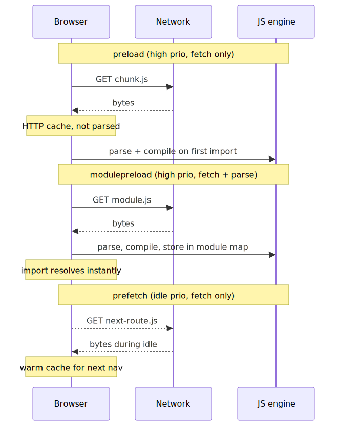
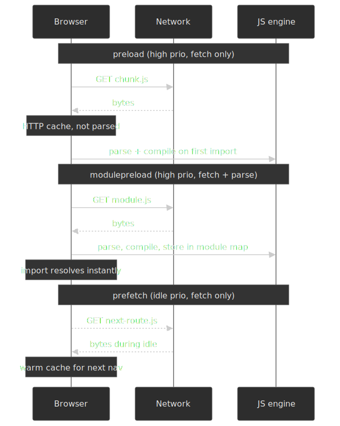

# Bundle Splitting Strategies

Modern JavaScript applications ship megabytes of code by default. Without bundle splitting, users download, parse, and execute the entire application before seeing anything interactive — regardless of which features they will actually use. Bundle splitting transforms monolithic builds into targeted delivery: load the code for the current route immediately, defer everything else until needed. The payoff is substantial — a 30–60% reduction in initial bundle size cuts main-thread blocking time and improves [Core Web Vitals](https://web.dev/articles/vitals), most directly [Largest Contentful Paint (LCP)](https://web.dev/articles/lcp) and [Interaction to Next Paint (INP)](https://web.dev/articles/inp).




## Mental Model

Bundle splitting is a **build-time partitioning** that turns one giant request into several smaller, independently cacheable ones. The core insight: users access one route at a time, so they should only pay the download, parse, and compile cost for that route's code.

Three fundamental strategies exist, each addressing a different optimization goal:

1. **Entry splitting** — separate bundles per entry point (multi-page apps, micro-frontends). Each entry gets independent dependency resolution.
2. **Route/component splitting** — use dynamic [`import()`](https://tc39.es/proposal-dynamic-import/) to load code when users navigate or interact. The dominant pattern for SPAs.
3. **Vendor splitting** — isolate `node_modules` into stable chunks. Dependencies change less frequently than application code, so separate chunks raise cache hit rates across deployments.

Four constraints shape every real implementation:

- **Static analysis** — bundlers must determine chunk boundaries at build time. A fully dynamic import path (`import(userInput)`) can't be split.
- **HTTP/2 sweet spot** — 10–30 chunks balance caching benefits against connection overhead. Too few = poor cache utilization; too many = HTTP/2 stream saturation and runtime-resolution overhead.
- **Compression effectiveness** — smaller chunks compress less efficiently than larger ones. A 10KB chunk may only compress 50%; a 100KB chunk often hits 70%+.
- **Prefetch/preload timing** — splitting without intelligent loading creates waterfalls. Prefetching predicted routes and preloading critical resources recovers most of the latency cost.

Build tools sit on a spectrum: Webpack's [SplitChunksPlugin](https://webpack.js.org/plugins/split-chunks-plugin/) offers granular control at the cost of configuration; Vite/Rollup favor convention over configuration with sensible defaults; esbuild prioritizes speed with [deliberately simpler splitting semantics](https://esbuild.github.io/api/#splitting).

## The Challenge

### Browser Constraints

JavaScript execution blocks the main thread. Large bundles create measurable user-experience degradation:

**Parse time** — on a representative mid-tier mobile device (Moto G4-class hardware), parsing roughly 1MB of source JavaScript takes about a second of main-thread time before any code can execute. [^cost-of-js] V8 parses lazily and offloads compilation to background threads, but the dominant cost is still proportional to the bytes you ship.

**Execution time** — module initialization (top-level code, class definitions, side effects) runs synchronously on the main thread. Heavy initialization chains delay interactivity even when the parse itself is cheap.

**Memory pressure** — each loaded module consumes memory for its AST, compiled bytecode, and runtime objects. On memory-constrained mobile devices, unused code competes with application state for the limited V8 heap.

[^cost-of-js]: Addy Osmani, [The Cost of JavaScript in 2019](https://v8.dev/blog/cost-of-javascript-2019), V8 blog. Cloudflare's [BinaryAST proposal](https://blog.cloudflare.com/binary-ast/) gives a useful order-of-magnitude calibration for low-end Android.

### Performance Targets

| Metric                          | Good threshold (75th pct) | Bundle impact                                                    |
| ------------------------------- | ------------------------- | ---------------------------------------------------------------- |
| [LCP](https://web.dev/articles/lcp)  (Largest Contentful Paint)  | ≤ 2.5s                    | A render-blocking JS bundle delays paint; smaller initial JS = faster LCP. |
| [INP](https://web.dev/articles/inp)  (Interaction to Next Paint) | ≤ 200ms                   | Long tasks from oversized chunks block input handling; INP replaced FID as a Core Web Vital on 2024-03-12. |
| [TBT](https://web.dev/articles/tbt) (Total Blocking Time, lab)   | ≤ 200ms                   | Lab proxy for INP; tracks total ms of long tasks during load. Use instead of TTI, which was [removed from Lighthouse 10](https://developer.chrome.com/blog/lighthouse-10-0). |

**Rule of thumb**: keep initial JavaScript under ~100KB gzipped for mobile-first applications. Each additional 100KB adds roughly a second of CPU time on slow 4G + low-end Android, per the [Cost of JavaScript benchmarks](https://v8.dev/blog/cost-of-javascript-2019).

### Scale Factors

| Application Type | Without Splitting | With Splitting | Reduction |
| ---------------- | ----------------- | -------------- | --------- |
| Marketing site   | 50-100KB          | 20-40KB        | 40-60%    |
| Dashboard SPA    | 500KB-1MB         | 100-200KB      | 60-80%    |
| E-commerce       | 1-2MB             | 200-400KB      | 70-80%    |
| Complex SaaS     | 2-5MB             | 300-600KB      | 80-90%    |

## Design Paths

### Path 1: Route-Based Code Splitting

**How it works:**

Each route in the application becomes a separate chunk. When users navigate, the router triggers a dynamic import that loads the route's code on demand.

```typescript title="route-based-splitting.tsx" collapse={1-4,35-45}
import { lazy, Suspense } from 'react';
import { createBrowserRouter, RouterProvider } from 'react-router-dom';

// Dynamic imports create separate chunks at build time
// Webpack names chunks based on the file path or magic comments
const Home = lazy(() => import('./pages/Home'));
const Dashboard = lazy(() => import('./pages/Dashboard'));
const Settings = lazy(() => import('./pages/Settings'));
const Analytics = lazy(() =>
  import(/* webpackChunkName: "analytics" */ './pages/Analytics')
);

const router = createBrowserRouter([
  {
    path: '/',
    element: (
      <Suspense fallback={<PageSkeleton />}>
        <Home />
      </Suspense>
    ),
  },
  {
    path: '/dashboard',
    element: (
      <Suspense fallback={<PageSkeleton />}>
        <Dashboard />
      </Suspense>
    ),
  },
  // Additional routes...
]);

function App() {
  return <RouterProvider router={router} />;
}
```

**Why this works:**

- Dynamic [`import()`](https://tc39.es/proposal-dynamic-import/) returns a Promise that resolves to the module namespace.
- Bundlers perform static analysis on the import expression to identify chunk boundaries.
- Each `import()` call becomes a separate chunk in the build output (or is merged into a shared chunk by `splitChunks`).
- React's [`lazy()`](https://react.dev/reference/react/lazy) integrates that Promise with `<Suspense>` boundaries; pair it with an Error Boundary so a failed chunk fetch (network blip, deploy that invalidated old hashes) doesn't crash the route silently.

**Framework implementations:**

| Framework    | Mechanism                      | Configuration                              |
| ------------ | ------------------------------ | ------------------------------------------ |
| Next.js      | Automatic per-page splitting   | Zero config; each `pages/*.tsx` is a chunk |
| React Router | `lazy()` + `Suspense`          | Manual setup per route                     |
| Vue Router   | `() => import('./Page.vue')`   | Built into router config                   |
| Angular      | `loadChildren` in route config | Built into router module                   |
| SvelteKit    | `+page.svelte` convention      | Automatic per-route                        |

**Performance characteristics:**

| Metric             | Value                        |
| ------------------ | ---------------------------- |
| Typical reduction  | 30-60% of initial bundle     |
| Chunk count        | 1 per route + shared chunks  |
| Navigation latency | 50-200ms for chunk fetch     |
| Caching            | Unchanged routes stay cached |

**Best for:**

- SPAs with distinct route boundaries
- Applications where users typically access a subset of features
- Progressive disclosure patterns (landing → dashboard → settings)

**Trade-offs:**

- Navigation delay for first visit to each route
- Requires Suspense boundaries for loading states
- Shared dependencies across routes need vendor splitting

**Real-world example:**

Airbnb's [frontend rearchitecture](https://medium.com/airbnb-engineering/rearchitecting-airbnbs-frontend-5e213efc24d2) moved from a Rails-served, page-by-page model to a client-routed React shell with dynamic-import boundaries per route. The team reports about **5× faster route transitions** and a goal of shipping "the bare minimum JavaScript required to make the page interactive," with the rest pulled in proactively during browser idle time. Concrete bundle-size deltas vary by surface (search vs. booking vs. host dashboard); treat the 30–60% range above as the realistic envelope, not a guarantee.

### Path 2: Component-Level Code Splitting

**How it works:**

Heavy components within a route are split and loaded on demand—triggered by user interaction or visibility rather than navigation.

```typescript title="component-splitting.tsx" collapse={1-3,28-35}
import { lazy, Suspense, useState } from 'react';

// Heavy visualization library only loads when chart is rendered
const AnalyticsChart = lazy(() =>
  import(/* webpackChunkName: "chart" */ './AnalyticsChart')
);

// Rich text editor loads when user clicks "Edit"
const RichTextEditor = lazy(() =>
  import(/* webpackChunkName: "editor" */ './RichTextEditor')
);

function Dashboard() {
  const [showChart, setShowChart] = useState(false);
  const [editing, setEditing] = useState(false);

  return (
    <div>
      <button onClick={() => setShowChart(true)}>Show Analytics</button>

      {showChart && (
        <Suspense fallback={<ChartSkeleton />}>
          <AnalyticsChart data={analyticsData} />
        </Suspense>
      )}

      <button onClick={() => setEditing(true)}>Edit Content</button>

      {editing && (
        <Suspense fallback={<EditorSkeleton />}>
          <RichTextEditor content={content} />
        </Suspense>
      )}
    </div>
  );
}
```

**Typical candidates for component splitting:**

| Component Type    | Example Libraries      | Typical Size |
| ----------------- | ---------------------- | ------------ |
| Rich text editors | Slate, TipTap, Quill   | 100-300KB    |
| Charting          | D3, Chart.js, Recharts | 50-200KB     |
| Code editors      | Monaco, CodeMirror     | 500KB-2MB    |
| PDF viewers       | pdf.js                 | 400-600KB    |
| Maps              | Mapbox, Google Maps    | 100-500KB    |
| Markdown          | marked + highlight.js  | 50-150KB     |

**Trigger strategies:**

1. **User interaction**: Load when user clicks a button or tab
2. **Intersection Observer**: Load when component scrolls into viewport
3. **Hover intent**: Prefetch on hover, load on click
4. **Idle callback**: Load during browser idle time

```typescript title="intersection-observer-loading.tsx" collapse={1-5,25-30}
import { lazy, Suspense, useEffect, useRef, useState } from 'react';

const HeavyComponent = lazy(() => import('./HeavyComponent'));

function LazyOnVisible({ children }: { children: React.ReactNode }) {
  const ref = useRef<HTMLDivElement>(null);
  const [isVisible, setIsVisible] = useState(false);

  useEffect(() => {
    const observer = new IntersectionObserver(
      ([entry]) => {
        if (entry.isIntersecting) {
          setIsVisible(true);
          observer.disconnect();
        }
      },
      { rootMargin: '200px' } // Start loading 200px before visible
    );

    if (ref.current) observer.observe(ref.current);
    return () => observer.disconnect();
  }, []);

  return (
    <div ref={ref}>
      {isVisible ? children : <Placeholder />}
    </div>
  );
}
```

**Trade-offs:**

- Additional network requests on user interaction
- Requires careful loading state design
- Can feel slow without prefetching

### Path 3: Vendor Splitting

**How it works:**

Third-party dependencies (`node_modules`) are extracted into separate chunks. Application code changes frequently; dependencies don't. Separate chunks maximize cache efficiency.

```javascript title="webpack.config.js - vendor splitting" collapse={1-8,30-40}
// webpack.config.js
module.exports = {
  optimization: {
    splitChunks: {
      chunks: "all",
      cacheGroups: {
        // Framework chunks (React, Vue, etc.) - very stable
        framework: {
          test: /[\\/]node_modules[\\/](react|react-dom|scheduler)[\\/]/,
          name: "framework",
          priority: 40,
          enforce: true,
        },
        // Large libraries get their own chunks
        vendors: {
          test: /[\\/]node_modules[\\/]/,
          name(module) {
            // Get library name for chunk naming
            const match = module.context.match(/[\\/]node_modules[\\/](.*?)([\\/]|$)/)
            const packageName = match ? match[1] : "vendors"
            return `vendor-${packageName.replace("@", "")}`
          },
          priority: 20,
          minSize: 50000, // Only split if > 50KB
        },
        // Shared application code
        commons: {
          name: "commons",
          minChunks: 2, // Used by at least 2 chunks
          priority: 10,
        },
      },
    },
  },
}
```

**Webpack SplitChunksPlugin defaults (v5):** [^split-chunks]

| Option               | Default   | Effect                                                    |
| -------------------- | --------- | --------------------------------------------------------- |
| `chunks`             | `'async'` | Only split async imports; set to `'all'` to also split sync ones. |
| `minSize`            | 20000     | Only create chunks larger than 20KB.                      |
| `maxSize`            | 0         | No upper limit (set a value to force a max chunk size).   |
| `minChunks`          | 1         | A module must be shared by N chunks to be split out.      |
| `maxAsyncRequests`   | 30        | Max parallel requests for on-demand loads.                |
| `maxInitialRequests` | 30        | Max parallel requests for an entry point.                 |

[^split-chunks]: [SplitChunksPlugin — webpack documentation](https://webpack.js.org/plugins/split-chunks-plugin/). The `maxAsyncRequests` / `maxInitialRequests` defaults were raised from `5` / `3` (v4) to `30` / `30` in [Webpack 5](https://webpack.js.org/blog/2020-10-10-webpack-5-release/), reflecting HTTP/2's lower per-request overhead.

**Vite/Rollup approach:**

```javascript title="vite.config.js - manual chunks"
// vite.config.js
export default {
  build: {
    rollupOptions: {
      output: {
        manualChunks: {
          // Group related dependencies
          "vendor-react": ["react", "react-dom", "react-router-dom"],
          "vendor-ui": ["@radix-ui/react-dialog", "@radix-ui/react-dropdown-menu"],
          "vendor-utils": ["lodash-es", "date-fns"],
        },
      },
    },
  },
}
```

**Cache efficiency math:**

Assume weekly deployments where application code changes every release but the vendor graph is touched roughly monthly:

| Strategy        | Cache hit rate (per deploy)        | Bandwidth saved on repeat visits |
| --------------- | ---------------------------------- | -------------------------------- |
| Single bundle   | 0% (any change invalidates)        | 0%                               |
| App + vendors   | ~70% (vendors rarely change)       | 40–60%                           |
| Granular chunks | ~85% (only changed chunks re-load) | 60–80%                           |

The mechanism is content-hash naming: webpack's `[contenthash]` (or Vite's default chunk hashing) keeps a chunk's filename stable as long as its bytes are stable, so the browser cache hits across deploys that didn't change those bytes.




**Trade-offs:**

- More HTTP requests (mitigated by HTTP/2)
- Configuration complexity
- Chunk naming affects cache keys

### Path 4: Dynamic Entry Points (Module Federation)

**How it works:**

Multiple applications share code at runtime. Each application builds independently but can consume modules from other builds dynamically.

```javascript title="webpack.config.js - module federation" collapse={1-5,25-35}
// Host application webpack.config.js
const { ModuleFederationPlugin } = require("webpack").container

module.exports = {
  plugins: [
    new ModuleFederationPlugin({
      name: "host",
      remotes: {
        // Load dashboard app's exposed modules at runtime
        dashboard: "dashboard@https://dashboard.example.com/remoteEntry.js",
        analytics: "analytics@https://analytics.example.com/remoteEntry.js",
      },
      shared: {
        react: { singleton: true, requiredVersion: "^18.0.0" },
        "react-dom": { singleton: true, requiredVersion: "^18.0.0" },
      },
    }),
  ],
}

// Remote application webpack.config.js
module.exports = {
  plugins: [
    new ModuleFederationPlugin({
      name: "dashboard",
      filename: "remoteEntry.js",
      exposes: {
        "./DashboardWidget": "./src/DashboardWidget",
      },
      shared: {
        react: { singleton: true },
        "react-dom": { singleton: true },
      },
    }),
  ],
}
```

**Use cases:**

- Micro-frontends with independent deployment
- Platform teams providing shared components
- A/B testing different component versions
- White-label applications with customizable modules

**Trade-offs:**

- Runtime dependency resolution adds latency
- Version conflicts require careful management
- Build configuration complexity
- Debugging across federated boundaries is harder

**Real-world example:**

Spotify's web player uses a micro-frontend architecture where different squads own different features (playlists, search, player controls). Module Federation enables independent deployments while sharing React and design system components.

### Decision Matrix

| Factor               | Route Splitting | Component Splitting | Vendor Splitting | Module Federation |
| -------------------- | --------------- | ------------------- | ---------------- | ----------------- |
| Setup complexity     | Low             | Low                 | Medium           | High              |
| Build config changes | Minimal         | Minimal             | Moderate         | Significant       |
| Runtime overhead     | Low             | Low                 | None             | Medium            |
| Cache benefits       | Medium          | Medium              | High             | High              |
| Team scalability     | Good            | Good                | Good             | Excellent         |
| Best for             | SPAs            | Heavy components    | All apps         | Micro-frontends   |

### Decision Framework

, then by app shape (SPA → route splitting), then layer vendor splitting on top to recover cache efficiency.")


## Resource Hints: Prefetch, Preload, Modulepreload, and Early Hints

Splitting code creates smaller initial bundles but introduces latency when loading subsequent chunks. Resource hints recover this latency by warming caches and the module map before the chunks are imported. Four mechanisms matter for splitting strategies; pick by where in the lifecycle you can act.

### Prefetch vs Preload vs Modulepreload vs Early Hints

| Hint            | Where it lives                                  | Priority | What the browser does                                                                 | Use case                                          |
| --------------- | ----------------------------------------------- | -------- | ------------------------------------------------------------------------------------- | ------------------------------------------------- |
| [`prefetch`](https://developer.mozilla.org/en-US/docs/Web/HTML/Reference/Attributes/rel/prefetch)      | `<link>` in HTML                                | Lowest   | Fetch during idle time, store in HTTP cache.                                          | Next navigation, predicted routes.                |
| [`preload`](https://developer.mozilla.org/en-US/docs/Web/HTML/Reference/Attributes/rel/preload)       | `<link>` in HTML or `Link:` HTTP header         | High     | Fetch immediately at the declared priority; **does not parse or execute**.            | Current page critical resources discovered late.  |
| [`modulepreload`](https://developer.mozilla.org/en-US/docs/Web/HTML/Reference/Attributes/rel/modulepreload) | `<link>` in HTML                                | High     | Fetch, parse, compile, and store in the document's module map.                        | ES modules that will be imported soon.            |
| [Early Hints (HTTP `103`)](https://datatracker.ietf.org/doc/html/rfc8297) | `Link:` headers in an interim `103` response    | High     | Treats the `Link:` header as `preload` / `preconnect` *before* the final response arrives. | Server think-time during DB / template work.      |

```html title="resource-hints.html"
<!-- Prefetch: load during idle for predicted next navigation -->
<link rel="prefetch" href="/chunks/dashboard-abc123.js" />

<!-- Preload: critical for current page, load immediately -->
<link rel="preload" href="/chunks/hero-image.js" as="script" />

<!-- Modulepreload: ES module — fetched, parsed, compiled, kept in the module map -->
<link rel="modulepreload" href="/chunks/analytics-module.js" />
```

**Key difference**: `modulepreload` is the only hint that performs parse + compile and stores the result in the module map, so a later `import()` resolves synchronously from memory. `preload` only warms the HTTP cache; the module is still parsed on first import. [^modulepreload]

[^modulepreload]: MDN, [`<link rel="modulepreload">`](https://developer.mozilla.org/en-US/docs/Web/HTML/Reference/Attributes/rel/modulepreload); web.dev, [Preload modules](https://web.dev/articles/modulepreload). The behavior is normative in the [HTML Living Standard](https://html.spec.whatwg.org/multipage/links.html#link-type-modulepreload).




### Early Hints (HTTP 103) and the death of HTTP/2 push

Early Hints, defined in [RFC 8297](https://datatracker.ietf.org/doc/html/rfc8297), let the server emit an interim `103 Early Hints` response carrying `Link:` headers (`rel=preload`, `rel=preconnect`, etc.) **before** it has produced the final `200 OK`. The browser treats those headers exactly as if they had appeared at the top of the eventual document, but the network transfer starts during what would otherwise be wasted server think-time (database queries, template rendering, edge-to-origin round-trips). [^early-hints]

This matters for splitting because the *route's* critical chunks — the framework chunk, the route bundle, fonts — can begin downloading before the HTML even reaches the browser, eliminating a discovery round-trip without resorting to `<link rel="preload">` injected into a server-rendered shell.

```http title="103 Early Hints (illustrative)"
HTTP/2 103 Early Hints
Link: </assets/framework.HASH.js>; rel=preload; as=script; crossorigin
Link: </assets/route-dashboard.HASH.js>; rel=modulepreload
Link: <https://fonts.gstatic.com>; rel=preconnect

HTTP/2 200 OK
Content-Type: text/html
...
```

Production status (2026-04):

- Chrome and Edge ship Early Hints by default; Firefox supports it; Safari only honors `preconnect` hints from `103` responses, ignoring `preload` / `modulepreload`.
- Cloudflare, Fastly, and CloudFront emit `103` at the edge and synthesize hints from the final response's `Link:` headers, which is the cheapest way to adopt without origin changes.
- Keep the hint set small — 3 to 8 truly critical chunks. The browser still has to fetch them on a cold connection, and oversized hint sets crowd out the HTML itself.

> [!IMPORTANT]
> Early Hints are the recommended replacement for HTTP/2 server push, which Chrome disabled by default in [Chrome 106 (September 2022)](https://developer.chrome.com/blog/removing-push) after measuring net-negative real-world performance. Push lost the race because the server could not know what was already in the client's HTTP cache; Early Hints sidesteps that by letting the *client* decide what to fetch.

[^early-hints]: [RFC 8297 — An HTTP Status Code for Indicating Hints](https://datatracker.ietf.org/doc/html/rfc8297); MDN, [`103 Early Hints`](https://developer.mozilla.org/en-US/docs/Web/HTTP/Reference/Status/103); Cloudflare, [Early Hints: How Cloudflare can improve website load times by 30%](https://blog.cloudflare.com/early-hints/). HTTP/2 push removal context: [Removing HTTP/2 Server Push from Chrome](https://developer.chrome.com/blog/removing-push).

### Webpack Magic Comments

Webpack uses special comments to control chunk behavior:

```typescript title="webpack-magic-comments.ts"
// Named chunk for better cache keys and debugging
import(/* webpackChunkName: "dashboard" */ "./Dashboard")

// Prefetch: load during idle (for predicted navigation)
import(/* webpackPrefetch: true */ "./Settings")

// Preload: load in parallel with current chunk (rare)
import(/* webpackPreload: true */ "./CriticalModal")

// Combined
import(
  /* webpackChunkName: "analytics" */
  /* webpackPrefetch: true */
  "./Analytics"
)

// Specify loading mode
import(/* webpackMode: "lazy" */ "./LazyModule") // Default
import(/* webpackMode: "eager" */ "./EagerModule") // No separate chunk
```

**Prefetch behavior**: webpack injects `<link rel="prefetch">` tags into `<head>` *after the parent chunk has finished loading*; the browser then fetches at lowest priority during idle time. [^webpack-prefetch]

**Preload behavior**: webpack injects `<link rel="preload">` tags alongside the parent chunk request, racing the resource at high priority. Use sparingly — preloading non-critical resources competes with the actually-critical ones for bandwidth and main-thread attention.

[^webpack-prefetch]: Webpack's [Prefetching/Preloading modules](https://webpack.js.org/guides/code-splitting/#prefetchingpreloading-modules) guide covers the injection rules; `webpackPreload` only takes effect for chunks reachable from a non-entry parent.

### Framework-Specific Prefetching

**Next.js** (automatic):

```typescript title="next-prefetch.tsx"
import Link from 'next/link';

// Prefetch is automatic on viewport intersection (production only)
<Link href="/dashboard">Dashboard</Link>

// Disable prefetch for rarely-used links
<Link href="/admin" prefetch={false}>Admin</Link>

// Programmatic prefetch
import { useRouter } from 'next/navigation';
const router = useRouter();
router.prefetch('/dashboard');
```

**React Router** (manual):

```typescript title="react-router-prefetch.tsx" collapse={1-5,25-35}
import { useEffect } from 'react';
import { Link, useLocation } from 'react-router-dom';

// Prefetch on hover
function PrefetchLink({ to, children }: { to: string; children: React.ReactNode }) {
  const prefetch = () => {
    // Trigger the dynamic import without rendering
    if (to === '/dashboard') {
      import('./pages/Dashboard');
    } else if (to === '/settings') {
      import('./pages/Settings');
    }
  };

  return (
    <Link to={to} onMouseEnter={prefetch} onFocus={prefetch}>
      {children}
    </Link>
  );
}

// Prefetch likely next routes based on current route
function usePrefetchPredicted() {
  const location = useLocation();

  useEffect(() => {
    if (location.pathname === '/') {
      // Users on home often go to dashboard
      import('./pages/Dashboard');
    } else if (location.pathname === '/dashboard') {
      // Dashboard users often check settings
      import('./pages/Settings');
    }
  }, [location.pathname]);
}
```

### Intersection Observer Prefetching

Prefetch chunks when their trigger elements become visible:

```typescript title="intersection-prefetch.ts" collapse={1-3}
function prefetchOnVisible(selector: string, importFn: () => Promise<unknown>) {
  const elements = document.querySelectorAll(selector)

  const observer = new IntersectionObserver(
    (entries) => {
      entries.forEach((entry) => {
        if (entry.isIntersecting) {
          importFn().catch(() => {}) // Prefetch, ignore errors
          observer.unobserve(entry.target)
        }
      })
    },
    { rootMargin: "200px" },
  )

  elements.forEach((el) => observer.observe(el))
  return () => observer.disconnect()
}

// Usage: prefetch analytics chunk when link is visible
prefetchOnVisible('[href="/analytics"]', () => import("./pages/Analytics"))
```

### Prefetch Strategy Comparison

| Strategy            | Latency Improvement | Bandwidth Cost            | Implementation       |
| ------------------- | ------------------- | ------------------------- | -------------------- |
| No prefetch         | 0ms                 | 0                         | -                    |
| Hover prefetch      | 100-300ms           | Low (on interaction)      | Manual               |
| Viewport prefetch   | 200-500ms           | Medium (visible links)    | IntersectionObserver |
| Predictive prefetch | 300-1000ms          | Higher (predicted routes) | Analytics-driven     |
| Aggressive prefetch | Full (no latency)   | Highest (all routes)      | Simple but wasteful  |

## Bundle Analysis

### Identifying Optimization Opportunities

Before optimizing, measure. Bundle analyzers visualize chunk contents, revealing:

- Unexpectedly large dependencies
- Duplicate modules across chunks
- Unused exports (tree-shaking failures)
- Missing code splitting opportunities

### webpack-bundle-analyzer

```javascript title="webpack.config.js - bundle analyzer" collapse={1-3}
const BundleAnalyzerPlugin = require("webpack-bundle-analyzer").BundleAnalyzerPlugin

module.exports = {
  plugins: [
    new BundleAnalyzerPlugin({
      analyzerMode: "static", // Generate HTML file
      reportFilename: "bundle-report.html",
      openAnalyzer: false,
      generateStatsFile: true,
      statsFilename: "bundle-stats.json",
    }),
  ],
}
```

**What to look for:**

| Pattern           | Problem                   | Solution                           |
| ----------------- | ------------------------- | ---------------------------------- |
| Single huge chunk | No splitting              | Add route/component splitting      |
| Moment.js (500KB) | Full library with locales | Replace with date-fns or dayjs     |
| Lodash (70KB)     | Full library              | Use lodash-es with tree shaking    |
| Duplicated React  | Multiple versions         | Resolve alias in config            |
| Large polyfills   | Targeting old browsers    | Adjust browserslist, use core-js 3 |

### Vite/Rollup Analysis

```javascript title="vite.config.js - bundle visualization"
import { visualizer } from "rollup-plugin-visualizer"

export default {
  plugins: [
    visualizer({
      filename: "bundle-analysis.html",
      gzipSize: true,
      brotliSize: true,
    }),
  ],
}
```

### Chrome DevTools Coverage

**How to use:**

1. Open DevTools → More Tools → Coverage
2. Click reload button to start instrumenting
3. Interact with the page
4. Review unused JavaScript percentage

**Interpreting results:**

- Red = unused code (candidate for splitting or removal)
- Green = executed code

**Caveat**: Coverage shows runtime usage for one session. Code that handles edge cases or error states may appear "unused" but is still necessary.

### Budget Enforcement

Set bundle size budgets that fail builds when exceeded:

```javascript title="webpack.config.js - performance budgets"
module.exports = {
  performance: {
    maxAssetSize: 250000, // 250KB per chunk
    maxEntrypointSize: 400000, // 400KB for entry points
    hints: "error", // Fail build on violation
  },
}
```

**Recommended budgets:**

| Application Type | Entry Point | Per Chunk  |
| ---------------- | ----------- | ---------- |
| Marketing site   | 100KB gzip  | 50KB gzip  |
| SPA              | 150KB gzip  | 75KB gzip  |
| Complex app      | 250KB gzip  | 100KB gzip |

## Build Tool Configuration

### Webpack 5

```javascript title="webpack.config.js - complete splitting setup" collapse={1-10,55-65}
const path = require("path")

module.exports = {
  mode: "production",
  entry: {
    main: "./src/index.tsx",
  },
  output: {
    filename: "[name].[contenthash].js",
    chunkFilename: "[name].[contenthash].chunk.js",
    path: path.resolve(__dirname, "dist"),
    clean: true,
  },
  optimization: {
    splitChunks: {
      chunks: "all",
      maxInitialRequests: 25,
      minSize: 20000,
      cacheGroups: {
        // React ecosystem - very stable
        framework: {
          test: /[\\/]node_modules[\\/](react|react-dom|react-router|react-router-dom|scheduler)[\\/]/,
          name: "framework",
          chunks: "all",
          priority: 40,
        },
        // UI libraries
        ui: {
          test: /[\\/]node_modules[\\/](@radix-ui|@headlessui|framer-motion)[\\/]/,
          name: "vendor-ui",
          chunks: "all",
          priority: 30,
        },
        // Remaining node_modules
        vendors: {
          test: /[\\/]node_modules[\\/]/,
          name: "vendors",
          chunks: "all",
          priority: 20,
        },
        // Shared app code
        common: {
          name: "common",
          minChunks: 2,
          priority: 10,
          reuseExistingChunk: true,
        },
      },
    },
    // Extract webpack runtime for better caching
    runtimeChunk: "single",
  },
}
```

### Vite 5/6

```typescript title="vite.config.ts - complete splitting setup" collapse={1-5,35-45}
import { defineConfig } from "vite"
import react from "@vitejs/plugin-react"

export default defineConfig({
  plugins: [react()],
  build: {
    target: "es2020",
    rollupOptions: {
      output: {
        manualChunks: (id) => {
          // Framework chunk
          if (id.includes("node_modules/react")) {
            return "framework"
          }
          // UI library chunk
          if (id.includes("node_modules/@radix-ui") || id.includes("node_modules/@headlessui")) {
            return "vendor-ui"
          }
          // Utility libraries
          if (id.includes("node_modules/lodash") || id.includes("node_modules/date-fns")) {
            return "vendor-utils"
          }
          // Let Rollup handle remaining splitting
        },
        // Consistent chunk naming
        chunkFileNames: "assets/[name]-[hash].js",
        entryFileNames: "assets/[name]-[hash].js",
      },
    },
    // Enable CSS code splitting
    cssCodeSplit: true,
  },
})
```

### esbuild

```typescript title="esbuild.config.ts" collapse={1-5,20-25}
import * as esbuild from "esbuild"

await esbuild.build({
  entryPoints: ["src/index.tsx"],
  bundle: true,
  // Required for code splitting
  splitting: true,
  format: "esm", // Required when splitting is enabled
  outdir: "dist",
  // Chunk naming
  chunkNames: "chunks/[name]-[hash]",
  entryNames: "[name]-[hash]",
  // Minimize output
  minify: true,
  // Target modern browsers
  target: ["es2020", "chrome90", "firefox90", "safari14"],
})
```

**esbuild limitations:** [^esbuild-splitting]

- Code splitting **requires** `format: 'esm'`; CJS / IIFE outputs cannot be split.
- The feature is officially "work in progress"; expect occasional missing optimizations and treat it as production-suitable only after measuring on your build.
- No equivalent to webpack's `splitChunks` cache groups; chunk boundaries are inferred automatically and not directly tunable.
- Each dynamic `import()` target becomes an additional entry point, which can produce many small chunks for highly granular dynamic imports.

[^esbuild-splitting]: [esbuild API — splitting](https://esbuild.github.io/api/#splitting). The `esm`-only requirement and "work in progress" labeling are still current as of esbuild 0.25.x.

### Turbopack (Next.js 15+)

Turbopack handles splitting automatically in Next.js:

```typescript title="next.config.ts"
import type { NextConfig } from "next"

const nextConfig: NextConfig = {
  // Turbopack is default in Next.js 15+
  // No explicit code splitting config needed
  experimental: {
    // Fine-tune package imports for tree shaking
    optimizePackageImports: ["lodash-es", "@icons-pack/react-simple-icons"],
  },
}

export default nextConfig
```

**Automatic optimizations:**

- Page-level code splitting (each route = separate chunk)
- Shared chunks for common dependencies
- Automatic prefetching for `<Link>` components
- React Server Components reduce client bundle size

## Edge Cases and Gotchas

### Dynamic Import Static Analysis

Bundlers analyze import paths at build time. Fully dynamic paths prevent splitting:

```typescript title="dynamic-import-analysis.ts"
// WORKS: Bundler creates chunk for each page
const pages = {
  home: () => import("./pages/Home"),
  about: () => import("./pages/About"),
  contact: () => import("./pages/Contact"),
}

// WORKS: Template literal with static prefix
// Creates chunks for all files matching the pattern
const loadPage = (name: string) => import(`./pages/${name}.tsx`)

// DOES NOT WORK: Fully dynamic path
const userPath = getUserInput()
import(userPath) // Bundler cannot analyze at build time
```

**Webpack behavior with template literals:**

When using ``import(`./pages/${name}.tsx`)``, Webpack creates a chunk for every file matching `./pages/*.tsx`. This is called a [context module](https://webpack.js.org/guides/dependency-management/#requirecontext) — the bundler statically enumerates the matching files at build time.

### Circular Dependencies

Circular dependencies can prevent proper chunk splitting:

```typescript title="circular-dependency-problem.ts"
// moduleA.ts
import { helperB } from "./moduleB"
export const helperA = () => helperB()

// moduleB.ts
import { helperA } from "./moduleA"
export const helperB = () => helperA()

// Bundler may merge these into single chunk to resolve cycle
```

**Detection**: Use `madge` or `dpdm` to identify circular dependencies:

```bash
npx madge --circular src/
```

### Tree Shaking Interaction

Code splitting and tree shaking work together, but order matters:

1. Tree shaking removes unused exports
2. Code splitting divides remaining code into chunks

**Gotcha**: Side effects can prevent tree shaking:

```typescript title="side-effects-problem.ts"
// This module has side effects (modifies global state on import)
import "./analytics-init" // Always included even if unused

// Mark as side-effect-free in package.json
// "sideEffects": false
// Or list specific files with side effects
// "sideEffects": ["./src/analytics-init.ts"]
```

### CSS-in-JS and Code Splitting

CSS-in-JS libraries (styled-components, Emotion) may extract CSS that doesn't split with the component:

```typescript title="css-in-js-splitting.tsx" collapse={1-3}
import styled from "styled-components"

// These styles may not code-split with the component
const StyledButton = styled.button`
  background: blue;
  color: white;
`

// Lazy load the component - but CSS may be in main bundle
const LazyComponent = lazy(() => import("./StyledComponent"))
```

**Solution**: Configure SSR extraction or use CSS Modules for components that need reliable code splitting.

### SSR Hydration Mismatches

Server-rendered HTML must match client-rendered output. Code-split components that render different content based on browser APIs cause mismatches:

```typescript title="ssr-mismatch.tsx" collapse={1-3}
import { lazy, Suspense } from 'react';

// Problem: window is undefined on server
const ClientOnlyChart = lazy(() => import('./Chart'));

function Dashboard() {
  // This causes hydration mismatch
  return (
    <Suspense fallback={<div>Loading...</div>}>
      {typeof window !== 'undefined' && <ClientOnlyChart />}
    </Suspense>
  );
}

// Solution: Use useEffect for client-only rendering
function SafeDashboard() {
  const [mounted, setMounted] = useState(false);

  useEffect(() => {
    setMounted(true);
  }, []);

  return (
    <Suspense fallback={<div>Loading...</div>}>
      {mounted && <ClientOnlyChart />}
    </Suspense>
  );
}
```

### HTTP/2 and Chunk Count

HTTP/2 multiplexes requests over a single connection, but the per-connection stream cap is negotiated, not browser-fixed. The limit is the *server's* `SETTINGS_MAX_CONCURRENT_STREAMS` value advertised in the SETTINGS frame; [RFC 9113 §6.5.2](https://datatracker.ietf.org/doc/html/rfc9113#section-6.5.2) recommends a minimum of 100 but does not impose a maximum. [^h2-streams]

| Source                              | Typical limit                          | Notes                                                                                              |
| ----------------------------------- | -------------------------------------- | -------------------------------------------------------------------------------------------------- |
| RFC 9113 recommendation             | ≥ 100                                  | Lower bound for "endpoints that intend to participate in true multiplexing".                       |
| nginx default                       | 128                                    | `http2_max_concurrent_streams` directive.                                                          |
| Server defaults across the wild     | 100–1000                               | Cloudflare, AWS ALB, and most CDNs land in this range.                                             |
| Chrome client-side internal cap     | 256                                    | Even when a server advertises higher, Chrome stalls beyond 256 concurrent streams per connection.  |
| Firefox / Safari                    | Honor server SETTINGS                  | No tight client-side override beyond honoring server SETTINGS.                                     |

[^h2-streams]: See [RFC 9113 §6.5.2 SETTINGS_MAX_CONCURRENT_STREAMS](https://datatracker.ietf.org/doc/html/rfc9113#section-6.5.2). Chrome's 256-stream client-side cap is documented in the [Chromium net stack discussion](https://groups.google.com/a/chromium.org/g/chromium-discuss/c/I9eB4ajAXIw).

**Recommendation**: keep the **initial-load** chunk count in the 10–30 range. That balances:

- **Cache granularity** — more chunks = finer-grained cache hits across deploys.
- **Connection overhead** — every chunk costs a round-trip's worth of HEADERS, runtime registration, and module-graph wiring even on HTTP/2.
- **Compression efficiency** — smaller chunks compress less efficiently because Brotli/Gzip dictionaries amortize over more bytes.

### Content Hash Stability

Chunk content hashes should only change when content changes. Common pitfalls:

```javascript title="hash-stability.js"
// Problem: Import order affects hash
import { a } from "./a" // Hash changes if this moves
import { b } from "./b"

// Problem: Absolute paths in source
__dirname // Different on different machines

// Solution: Use deterministic module IDs
module.exports = {
  optimization: {
    moduleIds: "deterministic",
    chunkIds: "deterministic",
  },
}
```

## Real-World Implementations

### Vercel / Next.js: Zero-Config Splitting

**Challenge**: make code splitting accessible without configuration.

**Architecture**:

- Each file in `pages/` or `app/` becomes a route chunk automatically.
- Shared dependencies extracted into a common chunk; framework code (React, Next.js runtime) lives in its own chunk for cache stability.
- Automatic prefetching via the [`<Link>`](https://nextjs.org/docs/app/api-reference/components/link) component on viewport intersection (production only).
- React Server Components in the App Router push more rendering to the server, shrinking the client bundle further.

**Trade-off**: convention removes a class of footguns but also removes the escape hatch — if your splitting need doesn't fit the file-system convention, you fall back to dynamic imports inside route segments.

### Shopify Hydrogen: Commerce-Optimized Splitting

**Challenge**: e-commerce pages have unusual constraints — product data is hot, cart logic is interactive but not initial, checkout is high-stakes.

**Architecture** (per the [Hydrogen engineering post](https://shopify.engineering/high-performance-hydrogen-powered-storefronts) and [Hydrogen docs](https://shopify.dev/docs/storefronts/headless/hydrogen/fundamentals)):

- Route-based splitting for pages, on a React Router 7 + streaming SSR foundation.
- Streaming server-side rendering with React `<Suspense>` so the HTML shell flushes before all data resolves; loading states fall in via Suspense fallbacks.
- Edge-rendered cart with a `CartProvider` abstraction that hides client/server state synchronization; cart UI typically loads on interaction rather than initial paint.

**Key insight**: most users browse products before adding to cart, so deferring cart logic until first interaction is a clear win on first-paint metrics. Exact byte savings depend on which cart components you defer; treat the strategy, not a specific KB number, as the takeaway.

### Differential Loading: `module` / `nomodule`

**Challenge**: support old browsers without penalizing modern ones.

**Architecture**:

- Two builds: a modern ES bundle (e.g. ES2020 baseline) and a transpiled legacy bundle.
- `<script type="module">` loads the modern bundle in module-aware browsers.
- `<script nomodule>` loads the legacy bundle in browsers that don't understand modules — historically just IE11.

```html title="differential-loading.html"
<script type="module" src="/main-modern.js"></script>
<script nomodule src="/main-legacy.js"></script>
```

**Status check (2026)**: modern bundles are commonly 20–40% smaller because they skip transforms for `class`, `async`/`await`, optional chaining, and similar already-baseline syntax. With IE11 fully retired, most teams now ship a single ES2020+ bundle and skip the `nomodule` build entirely; reach for differential loading only if you have a measured need to support an explicitly old client surface.

### Predictive Prefetching

**Challenge**: users navigate unpredictably; aggressive prefetching wastes bandwidth, conservative prefetching defeats the point.

**Pattern**:

- Collect navigation patterns via analytics.
- Predict the next route from the current route — a simple Markov model is usually enough; ML is overkill for most apps.
- Prefetch the top-K predictions during idle time.
- Use a confidence threshold so you don't prefetch low-probability routes on data-saver clients.

[Quicklink](https://github.com/GoogleChromeLabs/quicklink) packages this: it observes in-viewport links, respects `Save-Data` and `Network Information API` hints, and prefetches only high-likelihood candidates.

## Compression Considerations

### Compression vs Chunk Size Trade-off

Smaller chunks compress less efficiently:

| Chunk Size | Gzip Reduction | Brotli Reduction |
| ---------- | -------------- | ---------------- |
| 5KB        | 30-40%         | 35-45%           |
| 20KB       | 50-60%         | 55-65%           |
| 100KB      | 65-70%         | 70-75%           |
| 500KB      | 70-75%         | 75-80%           |

**Implication**: Don't over-split. A 5KB chunk that could be 2KB gzipped might not be worth the additional HTTP request.

### Brotli vs Gzip

| Aspect            | Gzip          | Brotli          |
| ----------------- | ------------- | --------------- |
| Compression ratio | Good (65–70%) | Better (70–75%) |
| Compression speed | Fast          | Slower (3–10× at level 11) |
| Browser support   | ~99% global   | ~97% global ([caniuse](https://caniuse.com/brotli)) |
| Recommendation    | Fallback      | Primary         |

**Best practice**: pre-compress assets at build time with Brotli (level 11 — the slow CPU cost is paid once at build, not per request). Serve Brotli to supporting browsers and gzip to the rest via standard `Accept-Encoding` content negotiation.

```javascript title="compression-plugin.js"
// webpack-compression-plugin or vite-plugin-compression
{
  algorithm: 'brotliCompress',
  compressionOptions: { level: 11 },
  filename: '[path][base].br',
}
```

## Practical Takeaways

Bundle splitting turns delivery from "all or nothing" into "what you need, when you need it." The strategies layer cleanly: start with route-based splitting for the largest wins, add vendor splitting for cache efficiency across deploys, then apply component splitting only for the heavy UI elements that are not on the initial render path.

Operating heuristics:

1. **Measure first.** Run a bundle analyzer (`webpack-bundle-analyzer`, `rollup-plugin-visualizer`, `next/bundle-analyzer`) before and after every change. Optimize against numbers, not intuition.
2. **Route splitting is table stakes.** Every non-trivial SPA should split per route; it's the single highest-ROI knob.
3. **Vendor chunks maximize caching.** Dependencies churn slower than application code, so isolating them protects your repeat-visit cache.
4. **Prefetch covers the cost of splitting.** Splitting without `prefetch` / `modulepreload` just trades initial latency for navigation latency.
5. **HTTP/2 changes the math, but not infinitely.** 10–30 initial chunks is the sweet spot; beyond that, runtime registration and compression loss eat the gains.
6. **Don't over-split.** A 5KB chunk that compresses to 2KB rarely beats merging it into a slightly larger neighbor.
7. **Pick the tool that matches your team's tolerance for config.** Next.js and Vite hand you sensible defaults; webpack hands you levers and the responsibility to use them well; esbuild gives you speed at the cost of granular control.

## Appendix

### Prerequisites

- JavaScript module systems (ESM, CommonJS)
- Build tool fundamentals (bundling, minification)
- Browser network fundamentals (HTTP/2, caching)

### Terminology

| Term           | Definition                                              |
| -------------- | ------------------------------------------------------- |
| Chunk          | A bundle file produced by the build process             |
| Entry point    | Initial file that starts application execution          |
| Dynamic import | `import()` syntax that loads modules on demand          |
| Code splitting | Dividing code into chunks loaded separately             |
| Tree shaking   | Removing unused exports from bundles                    |
| Vendor chunk   | Chunk containing third-party dependencies               |
| Magic comment  | Build-tool-specific comment affecting bundling behavior |
| Prefetch       | Low-priority fetch for predicted future needs           |
| Preload        | High-priority fetch for current page needs              |

### References

**Specs and standards**

- [RFC 9113 — HTTP/2 (SETTINGS_MAX_CONCURRENT_STREAMS §6.5.2)](https://datatracker.ietf.org/doc/html/rfc9113#section-6.5.2)
- [RFC 8297 — An HTTP Status Code for Indicating Hints (Early Hints / `103`)](https://datatracker.ietf.org/doc/html/rfc8297)
- [HTML Living Standard — Link types: `modulepreload`](https://html.spec.whatwg.org/multipage/links.html#link-type-modulepreload)
- [TC39 — Dynamic `import()` proposal](https://tc39.es/proposal-dynamic-import/)

**First-party documentation**

- [Webpack — Code Splitting guide](https://webpack.js.org/guides/code-splitting/) and [SplitChunksPlugin](https://webpack.js.org/plugins/split-chunks-plugin/)
- [Webpack — Module Federation](https://webpack.js.org/concepts/module-federation/)
- [Vite — Build options](https://vite.dev/config/build-options.html) / [Rollup `output.manualChunks`](https://rollupjs.org/configuration-options/#output-manualchunks)
- [esbuild — splitting](https://esbuild.github.io/api/#splitting)
- [React — `lazy()` reference](https://react.dev/reference/react/lazy)
- [Next.js — Loading UI and Streaming](https://nextjs.org/docs/app/building-your-application/routing/loading-ui-and-streaming) and [`optimizePackageImports`](https://nextjs.org/docs/app/api-reference/config/next-config-js/optimizePackageImports)

**Web platform references**

- [MDN — `<link rel="preload">`](https://developer.mozilla.org/en-US/docs/Web/HTML/Reference/Attributes/rel/preload), [`<link rel="prefetch">`](https://developer.mozilla.org/en-US/docs/Web/HTML/Reference/Attributes/rel/prefetch), [`<link rel="modulepreload">`](https://developer.mozilla.org/en-US/docs/Web/HTML/Reference/Attributes/rel/modulepreload)
- [MDN — `103 Early Hints`](https://developer.mozilla.org/en-US/docs/Web/HTTP/Reference/Status/103)
- [web.dev — Reduce JavaScript payloads with code splitting](https://web.dev/articles/reduce-javascript-payloads-with-code-splitting)
- [web.dev — Preload modules](https://web.dev/articles/modulepreload), [LCP](https://web.dev/articles/lcp), [INP](https://web.dev/articles/inp), [TBT](https://web.dev/articles/tbt)
- [Chrome for Developers — Removing HTTP/2 Server Push](https://developer.chrome.com/blog/removing-push)
- [Cloudflare — Early Hints: How Cloudflare can improve website load times by 30%](https://blog.cloudflare.com/early-hints/)
- [V8 blog — The Cost of JavaScript in 2019](https://v8.dev/blog/cost-of-javascript-2019)

**Practitioner write-ups**

- [Airbnb Engineering — Rearchitecting Airbnb's Frontend](https://medium.com/airbnb-engineering/rearchitecting-airbnbs-frontend-5e213efc24d2)
- [Shopify Engineering — High-Performance Hydrogen-powered Storefronts](https://shopify.engineering/high-performance-hydrogen-powered-storefronts)
- [GoogleChromeLabs — Quicklink (predictive prefetching)](https://github.com/GoogleChromeLabs/quicklink)

**Tooling**

- [`webpack-bundle-analyzer`](https://github.com/webpack-contrib/webpack-bundle-analyzer)
- [`rollup-plugin-visualizer`](https://github.com/btd/rollup-plugin-visualizer)
- [`madge`](https://github.com/pahen/madge) — circular dependency detection
