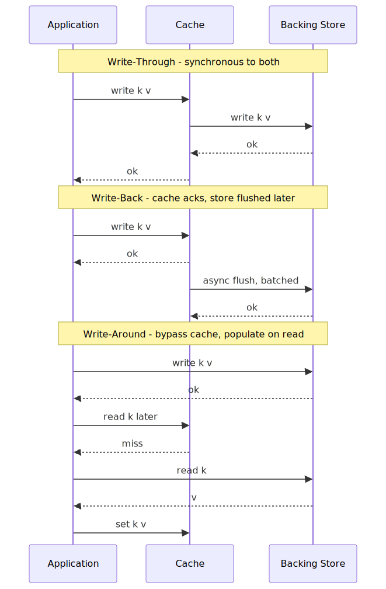
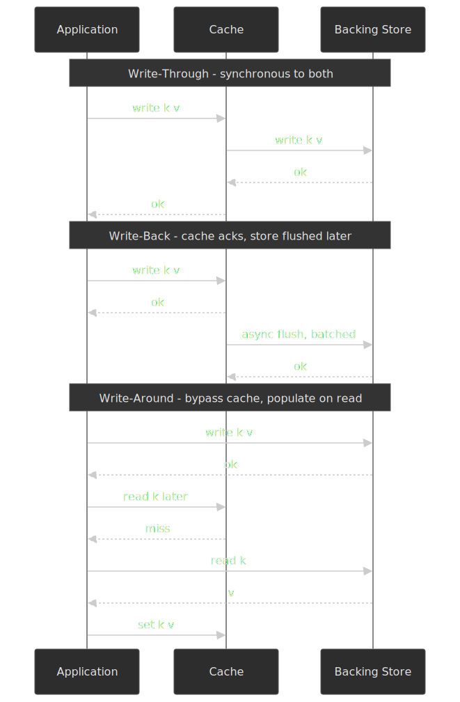

# Caching Fundamentals and Strategies

Caching is how engineers paper over the speed gap between a consumer of data and its source — CPU vs. DRAM (nanoseconds), application vs. database (milliseconds), client vs. origin (hundreds of milliseconds). The mechanism is always the same: insert a smaller, faster store closer to the consumer that exploits **locality of reference**. This article walks through the five design axes that decide whether a cache helps or hurts — read pattern, write policy, invalidation strategy, replacement algorithm, and topology — and grounds each one in production behavior at Netflix, Salesforce, and Facebook scale.




## Mental model

Every cache trades **consistency for speed**. You cannot escape that trade — you can only choose where to spend it. The five questions that decide every cache design:

1. **Read pattern** — does the application talk to the cache or the data store first? *(Cache-aside, read-through, or refresh-ahead.)*
2. **Write policy** — does a write update the cache, the store, both, or neither? *(Write-through, write-back, write-around.)*
3. **Invalidation** — how does stale data leave the cache? *(TTL, event-driven, probabilistic early refresh.)*
4. **Replacement** — when the cache is full, what gets evicted? *(LRU, LFU, 2Q, ARC, clock-sweep.)*
5. **Topology** — where does the cache live relative to the application and the store? *(In-process, distributed, tiered.)*

Get any of these wrong at scale and you reach for a database that's already on fire. Netflix runs ~400 M cache ops/sec across ~22,000 servers; Salesforce sustains 1.5 M RPS at sub-millisecond P50 latency. The difference between those numbers and a cache stampede is the choices below.[^netflix-evcache][^sf-redis]

## Why caching works: the principle of locality

Caching is only useful when access patterns are predictable. Two flavours of locality, both observed empirically since the 1960s, do that work:[^kilburn]

- **Temporal locality** — recently accessed data is likely to be accessed again. The variable inside a hot loop, the current user's session, the trending video.
- **Spatial locality** — data near a recently accessed location is likely accessed soon. Sequential instruction execution, contiguous array iteration, related rows on the same database page.

Caches exploit both: keep recent items in fast storage (temporal) and pull data in contiguous blocks (spatial). The same principle drives every layer below.

### The memory hierarchy

The processor–memory gap is what drove cache invention in the first place. CPU operations run in single-digit nanoseconds; DRAM access takes tens to hundreds. The [IBM System/360 Model 85](https://en.wikipedia.org/wiki/IBM_System/360_Model_85), announced in January 1968, was the first commercial computer with a hardware cache — IBM called it "high-speed buffer storage."

| Level | Typical Size | Latency      | Scope                    |
| ----- | ------------ | ------------ | ------------------------ |
| L1    | 32–64 KB     | ~1 ns        | Per core, split I/D      |
| L2    | 256 KB–1 MB  | ~3–10 ns     | Per core or per pair     |
| L3    | 8–64 MB      | ~10–40 ns    | Shared across cores      |
| DRAM  | 16–512 GB    | ~50–100 ns   | System memory            |
| SSD   | 0.1–10 TB    | ~10–100 µs   | Persistent block storage |
| Network RTT (same DC) | — | ~0.5–1 ms | Distributed cache        |
| Network RTT (CDN edge) | — | ~10–50 ms | Internet-scale           |

The "smaller and faster, closer to the consumer" pattern repeats at every distributed-systems layer below. The numbers move; the structure does not.

## Read patterns

The first decision — and the one that's usually made implicitly, then regretted — is which side of the cache the application talks to.

### Cache-aside (look-aside)

The application code owns the cache: read from cache; on miss, read from the store and write the result back into the cache.

```ts title="cache-aside.ts"
async function getUser(id: string): Promise<User> {
  const cached = await cache.get(`user:${id}`);
  if (cached) return cached;
  const user = await db.users.findById(id);
  await cache.set(`user:${id}`, user, { ttlSec: 300 });
  return user;
}
```

This is the default at most companies, including Facebook's classic memcached deployment.[^facebook-memcache] It's simple, makes failures obvious (cache down ⇒ slower, never wrong), and lets the cache and store evolve independently.

The footgun is the **inconsistency window between write and invalidation**: a careless `db.write(); cache.delete()` ordering can leave a stale entry in the cache forever. Facebook addressed this with leases — a token from the cache that gates which write may repopulate a key — to suppress thundering herds and stale sets after concurrent updates.[^facebook-memcache]

### Read-through

The cache itself owns the read path. The application only ever calls `cache.get(key)`; on a miss the cache calls a registered loader against the store.

This is the model implemented by most caching libraries (Caffeine's `LoadingCache`, Guava's `CacheLoader`, AWS DAX in front of DynamoDB). It centralises the loader and keeps the call site clean, but it couples the cache to the data layer and makes failure modes less obvious — a misbehaving loader stalls every miss.

### Refresh-ahead

The cache proactively reloads entries before they expire, so reads never see a miss for hot keys. This is what Facebook's leases, the [stale-while-revalidate](https://www.rfc-editor.org/rfc/rfc5861.html) HTTP directive, and the XFetch algorithm (below) all converge on. It is essential at high request rates — a synchronous miss on a hot key under load is the standard recipe for a stampede.

## Design choices: write policies

How writes flow through the cache decides its consistency guarantees and write-path latency.




### Write-through

**Mechanism:** every write goes synchronously to both the cache and the backing store. The write completes only when both succeed.

| Trait              | Detail                                                            |
| ------------------ | ----------------------------------------------------------------- |
| Best when          | Read-heavy workload, correctness non-negotiable.                  |
| Strength           | Cache and store are always consistent; no data loss on cache fail.|
| Weakness           | Write latency includes the store; every write hits the database.  |
| Real-world         | Payment processors, transaction records, credentials.             |

### Write-back (write-behind)

**Mechanism:** writes go to the cache only; the cache flushes to the store asynchronously, often batched.

| Trait              | Detail                                                            |
| ------------------ | ----------------------------------------------------------------- |
| Best when          | Write-heavy workload; bounded data loss is tolerable.             |
| Strength           | Cache-speed write latency; coalesces multiple writes per key.     |
| Weakness           | Cache failure between write and flush loses data; eventual.       |
| Real-world         | View counts, engagement counters, analytics ingest.               |

Netflix uses write-back semantics for viewing history and similar analytics paths — losing a few view counts on a node failure is acceptable; blocking playback to durably persist them is not.[^netflix-evcache]

### Write-around

**Mechanism:** writes bypass the cache and go straight to the store. The cache is populated only by reads.

| Trait              | Detail                                                            |
| ------------------ | ----------------------------------------------------------------- |
| Best when          | Bulk imports / ETL where written data is not immediately re-read. |
| Strength           | Avoids polluting the cache with one-time writes.                  |
| Weakness           | First read after write always misses.                             |
| Real-world         | Photo imports, log ingest, batch jobs.                            |

### Decision matrix: write policies

| Factor          | Write-Through             | Write-Back                    | Write-Around     |
| --------------- | ------------------------- | ----------------------------- | ---------------- |
| Consistency     | Strong                    | Eventual                      | Strong           |
| Write latency   | High (store-bound)        | Low (cache-speed)             | Low (store only) |
| Data-loss risk  | None                      | Cache failure loses data      | None             |
| Cache pollution | Possible                  | Possible                      | Avoided          |
| Best fit        | Read-heavy, critical data | Write-heavy, loss-tolerant    | Bulk writes, ETL |

## Design choices: invalidation

> "There are only two hard things in Computer Science: cache invalidation and naming things." — Phil Karlton[^karlton]

### TTL-based invalidation

Every entry carries a Time-To-Live; on expiry it is either evicted or marked stale. TTL-based invalidation is the workhorse — it requires no coordination with the data source and provides a hard staleness bound. It is also how RFC 9111 defines HTTP cache freshness via the `Cache-Control: max-age` and `s-maxage` directives.[^rfc9111]

Two practical refinements that prevent self-inflicted incidents:

- **TTL jitter** — add 10–20 % randomness to each TTL so a fleet that warmed at the same instant doesn't expire at the same instant.
- **Stale-while-revalidate** — serve the stale entry while one request refreshes it in the background. Defined for HTTP in [RFC 5861](https://www.rfc-editor.org/rfc/rfc5861.html); applies equally well to application caches.

#### HTTP cache directives at a glance

The browser, CDN, and reverse-proxy layers all share the same vocabulary, governed by RFC 9111 (which obsoletes RFC 7234) and RFC 5861.[^rfc9111][^rfc5861] Every senior engineer should be able to read a `Cache-Control` header without a reference card:

| Directive                  | Where it applies          | What it actually does                                                                                       |
| :------------------------- | :------------------------ | :---------------------------------------------------------------------------------------------------------- |
| `max-age=N`                | All caches                | Fresh for `N` seconds. Origin must use a clock-monotonic value, not wall-clock time.                        |
| `s-maxage=N`               | Shared caches only        | Overrides `max-age` for CDNs and reverse proxies; private/browser caches ignore it.                         |
| `public`                   | All caches                | Cacheable by shared caches even when the request is authenticated.                                          |
| `private`                  | Browser only              | Cacheable only in the user's browser; CDN must not store it.                                                |
| `no-cache`                 | All caches                | Cacheable, but **must revalidate** on every use (conditional `If-None-Match` / `If-Modified-Since`).        |
| `no-store`                 | All caches                | Do not write to disk or memory at any tier. The only directive that actually means "do not cache".          |
| `must-revalidate`          | All caches                | Once stale, the cache **must** revalidate; serving stale on origin error is forbidden.                      |
| `immutable`                | Browser                   | The body will not change for the lifetime of the URL; skip revalidation entirely. Pair with content-hashed asset URLs. |
| `stale-while-revalidate=N` | Shared caches and browser | Serve the stale entry for `N` more seconds while one async fetch refreshes it. (RFC 5861.)                  |
| `stale-if-error=N`         | Shared caches and browser | Serve the stale entry for `N` seconds if the origin returns 5xx or is unreachable. (RFC 5861.)              |
| `Expires: <HTTP-date>`     | All caches                | Legacy absolute timestamp; **ignored** when `Cache-Control: max-age` is present. Avoid for new code.        |

> [!IMPORTANT]
> `no-cache` is not "do not cache" — it permits caching but mandates revalidation. The directive that prevents storage is `no-store`. Serving auth tokens with `no-cache` instead of `no-store` is one of the more common security regressions.

For invalidation, validators (`ETag`, `Last-Modified`) let the origin answer a conditional GET with `304 Not Modified` — bytes saved on the wire, freshness reset on the cache. CDN-level **surrogate keys** (Fastly[^fastly-keys]) and **cache tags** (Varnish[^varnish-bans], Cloudflare[^cf-tags]) generalise this to "purge every URL associated with product 42" without enumerating those URLs at the origin.

### Event-driven invalidation

When source data changes, an event (publish-on-write from the writer, CDC streaming from the database, or webhook from an upstream system) actively invalidates the cache. Fastly's surrogate keys and Varnish's tag-based purges target this pattern.

Strengths: near-immediate invalidation; only changed keys are touched. Weaknesses: requires reliable event infrastructure (Kafka, pub/sub, CDC); event-delivery failures silently leave stale data.

### Probabilistic early refresh (XFetch)

A scan-style mitigation for cache stampedes: each request to a soon-to-expire key has a small, time-dependent probability of triggering a refresh ahead of TTL.

The XFetch algorithm of Vattani, Chierichetti, and Lowenstein (VLDB 2015)[^xfetch] expresses this as:

```text
refresh_now := (now − delta · beta · ln(rand())) ≥ expiry
```

where `delta` is the cost (time) to recompute the value, `rand()` is uniform in (0, 1], and `beta` is a tunable knob — the paper recommends `beta = 1.0` as the default, which provably minimises both stale-serve probability and excess recomputation. `beta > 1` refreshes earlier (favouring freshness over load); `beta < 1` refreshes later (favouring load over freshness).

Combined with TTL jitter, probabilistic early refresh converts a thundering herd at expiry into a smooth distribution of single-flight refreshes spread across the lifetime of the entry — the difference between a survivable hot key and a 60-second outage.

### Decision matrix: invalidation strategies

| Factor         | TTL-Based               | Event-Driven           | Probabilistic Early        |
| -------------- | ----------------------- | ---------------------- | -------------------------- |
| Staleness      | Bounded by TTL          | Near-zero              | Bounded; pre-refreshed     |
| Complexity     | Low                     | High                   | Medium                     |
| Origin load    | Spiky at expiry         | Event-rate driven      | Smooth                     |
| Infrastructure | None                    | Message bus / CDC      | None                       |
| Stampede risk  | High without mitigation | Low                    | Eliminated                 |

## Design choices: replacement algorithms

When the cache is full, which entry gets evicted? The right answer depends on the workload's access distribution.

### LRU (Least Recently Used)

Evict the entry untouched for the longest. The textbook implementation is a hash map plus doubly-linked list, all O(1).

LRU is simple and well-understood, with good hit ratios on workloads that have strong temporal locality. Its known weakness is **scan pollution**: a single sequential scan over data larger than the cache will evict every hot entry. Browser caches and ad-hoc application caches mostly use LRU; database buffer pools mostly do not.

### LFU (Least Frequently Used)

Track an access counter per entry; evict the entry with the lowest count. Strong on workloads with stable popularity (CDN-cached company logos, jQuery), but vulnerable to two failure modes: new entries cannot displace once-popular but now-cold entries, and historical popularity sticks around forever. Modern variants (TinyLFU, W-TinyLFU) age the counter and front-load it with a small admission filter — Caffeine, the de-facto JVM in-process cache, uses W-TinyLFU.

### 2Q (Two Queue)

Items must prove "hotness" before entering the main cache. The classic implementation uses three structures:

- **A1in** — small FIFO for first-time accesses.
- **A1out** — ghost queue tracking recently evicted A1in entries.
- **Am** — main LRU for entries seen more than once.

A scan loads A1in but never reaches Am, so the hot working set survives. 2Q gives you most of the scan resistance of ARC at a fraction of the implementation cost, which is why it remains a popular choice for application-level caches.

### ARC (Adaptive Replacement Cache)

A self-tuning policy from IBM Research (FAST 2003) that balances recency and frequency by maintaining four lists — `T1` (recently seen once), `T2` (recently seen multiple times), and ghost lists `B1` and `B2` that track recent eviction history. The algorithm shifts the T1/T2 boundary toward whichever ghost list sees more hits, so the policy adapts to changing workloads without manual tuning.

> [!NOTE]
> IBM held patents on ARC for over two decades. The primary patent (US 6,996,676) expired on 22 February 2024, removing the long-standing legal constraint that kept ARC out of the Linux page cache and many open-source projects.[^arc-patent]

OpenZFS uses an ARC variant as its in-memory data cache. IBM's own DS8000 storage arrays use it for disk caching.

### Clock-Sweep — what database buffer pools actually use

A common myth (which earlier versions of this article repeated) is that PostgreSQL uses 2Q. It does not. PostgreSQL replaced its 2Q implementation with **clock-sweep** in version 8.1 (2005)[^pg-buffer]. Each buffer carries a `usage_count` that is incremented on access and decremented every time the clock hand passes; the first unpinned buffer with `usage_count = 0` is evicted. To prevent `VACUUM` and large sequential scans from evicting the hot working set, PostgreSQL uses dedicated 256 KB ring buffers for those operations.[^pg-buffer]

MySQL InnoDB takes a different approach to scan resistance: a **midpoint-insertion LRU**. The buffer pool is split into a "young" sublist (5/8 by default) and an "old" sublist (3/8, controlled by `innodb_old_blocks_pct = 37`).[^mysql-innodb] Newly read pages enter at the head of the *old* sublist; they are only promoted to the young sublist if accessed again after `innodb_old_blocks_time` milliseconds (1000 ms by default). A `SELECT *` table scan loads the old sublist, ages out, and never displaces the indexes serving production traffic.

### Decision matrix: replacement algorithms

| Factor          | LRU     | LFU / W-TinyLFU   | 2Q        | ARC             | Clock-sweep      |
| --------------- | ------- | ----------------- | --------- | --------------- | ---------------- |
| Scan resistance | Poor    | Good              | Excellent | Excellent       | Good (with rings)|
| Adaptation      | None    | Recency + admit   | None      | Automatic       | None             |
| Overhead        | Low     | Medium            | Low       | Medium          | Low              |
| Implementation  | Simple  | Medium            | Medium    | Complex         | Simple           |
| Best fit        | General | High-hit caches   | Apps      | Mixed workloads | DB buffer pools  |

## Design choices: distributed cache topology

### Consistent hashing

Simple modulo hashing (`hash(key) % N`) collapses when `N` changes — adding one node remaps almost every key, which in a cache means a synchronised wave of misses. Karger et al. (1997) introduced **consistent hashing** to bound the disturbance: nodes and keys are mapped onto a circular hash space, and each key is owned by the next node clockwise from its position. Adding or removing a single node moves only ~`1/N` of the keys.[^karger]

In practice, plain consistent hashing produces very uneven load — random node placement leaves large gaps. The fix is **virtual nodes** (vnodes): each physical node is registered at many positions on the ring (often 100–500) so the law of large numbers smooths the distribution. Discord's open-source [`ex_hash_ring`](https://github.com/discord/ex_hash_ring) library, used in their Elixir services, is a representative implementation; DynamoDB and Cassandra use the same idea.

### Redis vs. Memcached

Both are in-memory key-value stores with a persistent place in production stacks. They optimise for different things.

| Factor          | Redis                                                 | Memcached                              |
| --------------- | ----------------------------------------------------- | -------------------------------------- |
| Data structures | Strings, lists, sets, hashes, sorted sets, streams    | Strings only                           |
| Threading       | Single-threaded commands; multi-threaded I/O (6.0+)[^redis-6] | Multi-threaded (default 4 worker threads)[^memcached-threads] |
| Clustering      | Built-in (Redis Cluster)                              | Client-side sharding                   |
| Persistence     | RDB snapshots, AOF                                    | None                                   |
| Pub/Sub         | Built-in                                              | None                                   |
| Transactions    | `MULTI`/`EXEC`                                        | None                                   |
| Typical ops/sec | ~100 K/thread; ~500 K with pipelining                 | Higher per-node throughput on many cores |

Reach for **Redis** when you need data structures beyond key-value, pub/sub, streams, or persistence; for ad-hoc state that is awkward in SQL (rate limits, leaderboards, queues); or for cluster mode out of the box.

Reach for **Memcached** when caching is genuinely just `get`/`set`/`delete` of small blobs; when memory efficiency matters more than features (Memcached's slab allocator is famously tight); or when the operational simplicity of a stateless, multi-threaded server with no persistence is the point.

### In-process vs. distributed vs. tiered

| Topology       | Strength                          | Weakness                                       |
| -------------- | --------------------------------- | ---------------------------------------------- |
| In-process     | No network hop, no serialization  | Per-instance duplication; lost on restart      |
| Distributed    | Shared state; survives restarts   | ~0.5–1 ms RTT; serialization cost              |
| Tiered (both)  | Hot keys at memory speed          | Two-layer invalidation; potential inconsistency |

Tiered (also called near-cache or L1/L2) is the standard answer above ~100 K RPS per shard. Salesforce's Marketing Cloud uses a near-cache in front of Redis specifically so hot keys never reach the Redis shard that would otherwise saturate.[^sf-redis]

## Failure modes (plan for these)

### Cache stampede (thundering herd)

A popular entry expires; in the millisecond before one request can repopulate it, thousands of concurrent requests all see a miss and all hit the store. The store is sized for the cache-hit path, not the cache-miss path, and it falls over. The system can lock into a failure spiral where the cache never repopulates because the store can no longer respond fast enough to serve the misses.




> [!WARNING]
> A stampede on a hot key is the most common cache-induced outage. If you take only one operational pattern from this article: combine TTL jitter with stale-while-revalidate or probabilistic early refresh on every key whose miss cost is non-trivial.

The fixes, in increasing complexity:

1. **TTL jitter** — eliminates the "all entries expire at once" failure on its own.
2. **Single-flight / request coalescing** — only one in-flight request per key fetches; the rest await its result. Trivial to implement in-process (Go's [`singleflight`](https://pkg.go.dev/golang.org/x/sync/singleflight); Caffeine's `LoadingCache`).
3. **Distributed lock** — across nodes, only one process holds a lock to refresh a key; the rest serve stale or wait briefly.
4. **Stale-while-revalidate** — serve the stale entry, refresh in the background.
5. **Probabilistic early refresh (XFetch)** — refresh before expiry with growing probability.

### Hot key saturation

Consistent hashing assigns a key to one primary; a viral tweet or flash-sale item drives all that traffic to one shard. The shard saturates, P99 latency for everything it owns spikes, and the rest of the fleet is idle.

Mitigations:

- **Key sharding** — split `counter:item123` into `counter:item123:0..N` and aggregate on read.
- **Near-cache** — short-TTL (1–5 s) in-process cache absorbs the burst on hot keys; the distributed cache only sees one refresh per process per window.
- **Replicated reads** — multiple replicas of the hot shard, with reads load-balanced across them.
- **Proactive detection** — sample key access frequencies and surface hot keys before they cause damage. Salesforce uses a Count-Min Sketch in their data-access layer to identify hot keys at line rate before routing them through a near-cache.[^sf-redis]

### Cache pollution

Caching data that is never re-read evicts data that would have been re-read. Common causes are bulk operations, sequential scans, and write-through caches that ingest write-only data.

Mitigations: scan-resistant replacement (2Q, ARC, midpoint-insertion LRU); write-around for bulk ingest; separate cache pools for analytics vs. user-facing reads; admission filters (W-TinyLFU's TinyLFU front).

### Inconsistency-window blindness

TTL-based invalidation is stale until expiry. Event-driven has delivery delay. Write-back has flush delay. Write-back caches in particular create read-after-write surprises: a user changes their email, then sees the old one because their request hit a replica that the write hasn't propagated to yet.

Mitigations: document the maximum staleness per cache and design UX accordingly; version keys (`user:${id}:v${updatedAt}`) so updates produce new keys; route reads-after-writes for the same actor to the primary or bypass the cache for a short window; never cache security-critical data (auth tokens, permissions checks).

## Production examples

### Netflix EVCache: global cache at planetary scale

- ~22,000 Memcached servers across 200+ clusters in 4 AWS regions.
- ~400 M operations per second; ~14.3 PB of cached data; ~30 M cross-region replication events/sec.[^netflix-evcache]

Three architectural choices make those numbers possible:

1. **Eventual consistency by default.** Netflix tolerates stale data "as long as the difference doesn't hurt browsing or streaming experience." Cross-region strong consistency would add ≥100 ms to every request.
2. **Async replication.** Regional writes propagate asynchronously to other regions for disaster recovery; the writer doesn't wait.
3. **Write-back for analytics.** View counts and playback positions accept loss on a node failure to keep the hot path latency-bounded.

The trade-off: during a regional failover, users may briefly see slightly different recommendations. Netflix decided this beats either cross-region latency on every request or unavailability during failures.

### Salesforce Marketing Cloud: 1.5 M RPS, zero downtime

Salesforce migrated their Marketing Cloud caching tier from Memcached to Redis Cluster at 1.5 M RPS without downtime. The migration sustained ~1 ms P50 and ~20 ms P99 throughout.[^sf-redis] Three components made it work:

- **Dynamic Cache Router (DCR)** — a percentage-based traffic splitter inside the data-access layer that shifted reads and writes from Memcached to Redis without redeploys.
- **Double-writes during warmup** — long-lived keys were written to both stores until Redis had a viable working set.
- **Hot-key detection via Count-Min Sketch** — identified hot keys at line rate so they could be routed through a near-cache before hitting any single Redis shard.

### Facebook gutter pool: bounded blast radius for memcached failures

When a memcached server fails in Facebook's fleet, a naive client would either rehash (creating new hot keys on every remaining node — a guaranteed cascade) or hammer the database (also a guaranteed cascade). Their fix is the **gutter pool**: ~1 % of the fleet sized as a fallback that any client can fall back to when its primary goes silent.[^facebook-memcache]

Key design properties:

- Gutter entries carry **short TTLs** (seconds, not minutes) so the gutter never accumulates stale state.
- The pool reduces client-visible failures by ~99 %; gutter hit rates climb past 35 % within 4 minutes of an outage.[^facebook-memcache]
- Operationally the trade-off is over-provisioning gutter capacity to absorb any single server's worst-case load.

## How to choose

Start with the workload, then pick the policies that match. The questions in order:

1. **What's the consistency requirement?** User-facing mutable data → short TTL, consider event-driven. Recommendation scores, analytics → long TTL, eventual.
2. **What's the access pattern?** Read-heavy → cache-aside or write-through. Write-heavy with bounded loss tolerance → write-back. Bulk write, deferred read → write-around.
3. **What's the traffic shape?** Uniform → simple consistent hashing. Hot-key-prone → near-cache + sharding + detection. Spiky → probabilistic refresh + over-provision.
4. **What's the failure mode?** Cache down ⇒ degraded latency only? Standard. Cache down ⇒ system down? You've over-leaned on the cache; add a gutter pool, replicas, or accept higher origin capacity.

### Scale thresholds (rough guide)

| Ops/sec    | Recommendation                                     |
| ---------- | -------------------------------------------------- |
| < 10 K     | Single Redis or Memcached node; in-process cache may suffice |
| 10 K – 100 K | Redis with replication + connection pooling      |
| 100 K – 1 M | Redis Cluster, Memcached fleet, or near-cache + distributed |
| > 1 M      | Tiered (in-process + distributed); custom hot-key handling   |

### Common patterns by use case

| Use case            | Read pattern  | Write policy  | Invalidation                 | Topology          |
| ------------------- | ------------- | ------------- | ---------------------------- | ----------------- |
| Session storage     | Cache-aside   | Write-through | TTL (session length)         | Distributed       |
| Product catalog     | Cache-aside   | Write-around  | Event + TTL                  | CDN + distributed |
| View counters       | —             | Write-back    | None (append-only)           | Distributed       |
| User authentication | Bypass cache  | —             | —                            | Database only     |
| API responses       | Read-through  | —             | TTL + stale-while-revalidate | CDN edge          |

## Practical takeaways

1. **Choose the consistency point explicitly.** Every layer of cache moves you off "strong" by some amount. Document where each cache sits and what staleness is acceptable.
2. **Plan the failure modes first.** Stampede, hot key, pollution, inconsistency window — every cache will hit at least one in production. The right time to design for them is before you deploy, not during the incident.
3. **TTL + jitter + stale-while-revalidate is the boring default that survives.** Reach for event-driven invalidation only when bounded staleness genuinely doesn't fit the requirement.
4. **Match the replacement algorithm to the workload.** General application caches: LRU or W-TinyLFU. Database buffer pools: clock-sweep (Postgres) or midpoint LRU (InnoDB). Mixed workloads where you can't tune: ARC.
5. **Tier when one layer can't carry the load.** A near-cache in front of Redis is what saves the hot key. A CDN in front of the application is what saves the origin.

## Appendix

### Terminology

- **Cache-hit ratio** — fraction of requests served from cache.
- **TTL** — duration an entry is considered fresh.
- **Cache stampede** — burst of simultaneous misses overwhelming the origin.
- **Hot key** — single key receiving disproportionate traffic.
- **Scan pollution** — sequential access evicting random-access hot data.
- **Consistent hashing** — key-to-node mapping that minimises remapping when the node set changes.
- **Single-flight / request coalescing** — deduplicate concurrent fetches for the same key.

### References

[^kilburn]: Kilburn, T., Edwards, D. B. G., Lanigan, M. J., & Sumner, F. H. (1962). [One-Level Storage System](https://doi.org/10.1109/TEC.1962.5219356). *IRE Transactions on Electronic Computers*. The original paper proposing automatically-managed multi-level memory hierarchies.

[^netflix-evcache]: Anand, S., Lynch, J. *et al.* [Building a Global Caching System at Netflix: a Deep Dive to Global Replication](https://www.infoq.com/articles/netflix-global-cache/). InfoQ feature on Netflix's EVCache. Netflix Tech Blog: [Announcing EVCache](https://netflixtechblog.com/announcing-evcache-distributed-in-memory-datastore-for-cloud-c26a698c27f7).

[^sf-redis]: Paladi, S. M. *et al.* [Migration at Scale: Moving Marketing Cloud Caching from Memcached to Redis at 1.5M RPS Without Downtime](https://engineering.salesforce.com/migration-at-scale-moving-marketing-cloud-caching-from-memcached-to-redis-at-1-5m-rps-without-downtime/). Salesforce Engineering Blog.

[^facebook-memcache]: Nishtala, R. *et al.* (2013). [Scaling Memcache at Facebook](https://www.usenix.org/system/files/conference/nsdi13/nsdi13-final170_update.pdf). USENIX NSDI '13. Defines leases, gutter pools, regional replication, and the broader Facebook memcache architecture.

[^karlton]: Attribution via Martin Fowler, [TwoHardThings](https://martinfowler.com/bliki/TwoHardThings.html). Karlton was a Netscape engineer; the line is widely quoted with no documented original source beyond second-hand attestations.

[^rfc9111]: Fielding, R., Nottingham, M., & Reschke, J. (Eds.). (2022). [RFC 9111 — HTTP Caching](https://www.rfc-editor.org/rfc/rfc9111.html). IETF. Defines `Cache-Control`, `s-maxage`, freshness, validation, and related semantics; obsoletes [RFC 7234](https://www.rfc-editor.org/rfc/rfc7234.html).

[^rfc5861]: Nottingham, M. (2010). [RFC 5861 — HTTP Cache-Control Extensions for Stale Content](https://www.rfc-editor.org/rfc/rfc5861.html). IETF. Defines `stale-while-revalidate` and `stale-if-error`.

[^fastly-keys]: Fastly. [Working with surrogate keys](https://www.fastly.com/documentation/guides/full-site-delivery/purging/working-with-surrogate-keys/). Tag-based purge model used in production at scale.

[^varnish-bans]: Varnish Software. [Bans — Varnish Cache](https://varnish-cache.org/docs/trunk/users-guide/purging.html#bans). Regex/tag invalidation primitive used by Varnish.

[^cf-tags]: Cloudflare. [Cache tags (Enterprise)](https://developers.cloudflare.com/cache/how-to/purge-cache/purge-by-tags/). Tag-based purge across the Cloudflare edge.

[^xfetch]: Vattani, A., Chierichetti, F., & Lowenstein, K. (2015). [Optimal Probabilistic Cache Stampede Prevention](http://www.vldb.org/pvldb/vol8/p886-vattani.pdf). *PVLDB* 8(8). Source for the XFetch formula and the analysis behind `beta = 1.0` as the default.

[^arc-patent]: USPTO. [US 6,996,676 B2 — System and method for implementing an adaptive replacement cache policy](https://patents.google.com/patent/US6996676B2/en). Filed 2002; expired 22 Feb 2024 (with patent-term adjustment).

[^pg-buffer]: Hironobu Suzuki, [The Internals of PostgreSQL — Buffer Manager](https://www.interdb.jp/pg/pgsql08/04.html). PostgreSQL Wiki, [Source: src/backend/storage/buffer/freelist.c](https://github.com/postgres/postgres/blob/master/src/backend/storage/buffer/freelist.c). Describes the clock-sweep algorithm and the small ring buffers used for sequential scans and `VACUUM`.

[^mysql-innodb]: Oracle. [MySQL 8.4 Reference Manual §17.5.1 — Buffer Pool](https://dev.mysql.com/doc/refman/8.4/en/innodb-buffer-pool.html) and [§17.8.3.3 — Making the Buffer Pool Scan Resistant](https://dev.mysql.com/doc/refman/8.4/en/innodb-performance-midpoint_insertion.html). Defines `innodb_old_blocks_pct` (default 37) and `innodb_old_blocks_time` (default 1000 ms).

[^karger]: Karger, D. *et al.* (1997). [Consistent Hashing and Random Trees: Distributed Caching Protocols for Relieving Hot Spots on the World Wide Web](https://www.cs.princeton.edu/courses/archive/fall09/cos518/papers/chash.pdf). STOC '97.

[^redis-6]: Redis Inc. [Diving Into Redis 6.0](https://redis.io/blog/diving-into-redis-6/). Describes the I/O thread offload introduced in 6.0 while keeping command execution single-threaded.

[^memcached-threads]: Memcached Project. [Configuring — Threads](https://docs.memcached.org/serverguide/configuring/) and [Hardware](https://github.com/memcached/memcached/wiki/Hardware). Default `-t 4`; recommended ≤ number of CPU cores.

#### Further reading

- Megiddo, N., & Modha, D. (2003). [ARC: A Self-Tuning, Low Overhead Replacement Cache](https://www.usenix.org/conference/fast-03/arc-self-tuning-low-overhead-replacement-cache). USENIX FAST '03.
- Jiang, S., & Zhang, X. (2002). [LIRS: An Efficient Low Inter-reference Recency Set Replacement Policy](https://dl.acm.org/doi/10.1145/511399.511340). SIGMETRICS '02.
- O'Neil, E. J., O'Neil, P. E., & Weikum, G. (1993). [The LRU-K Page Replacement Algorithm For Database Disk Buffering](https://www.cs.cmu.edu/~natassa/courses/15-721/papers/p297-o_neil.pdf).
- Einziger, G., Friedman, R., & Manes, B. (2017). [TinyLFU: A Highly Efficient Cache Admission Policy](https://arxiv.org/abs/1512.00727). The basis for Caffeine's W-TinyLFU.
- AWS. [Caching Best Practices — DAX](https://docs.aws.amazon.com/amazondynamodb/latest/developerguide/DAX.html); [Cloudflare Cache documentation](https://developers.cloudflare.com/cache/); [MDN — HTTP caching](https://developer.mozilla.org/en-US/docs/Web/HTTP/Caching).
