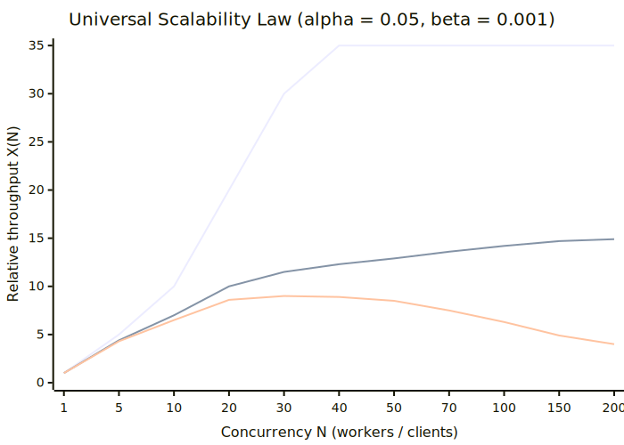
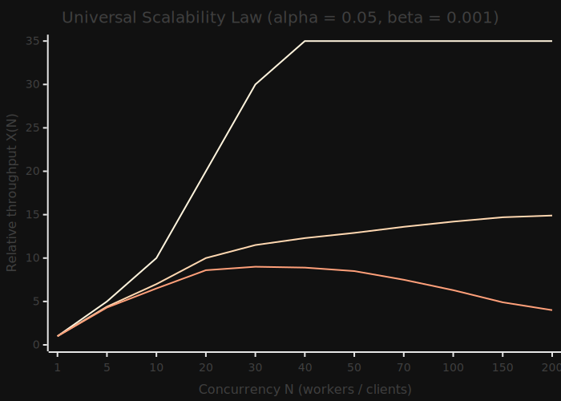
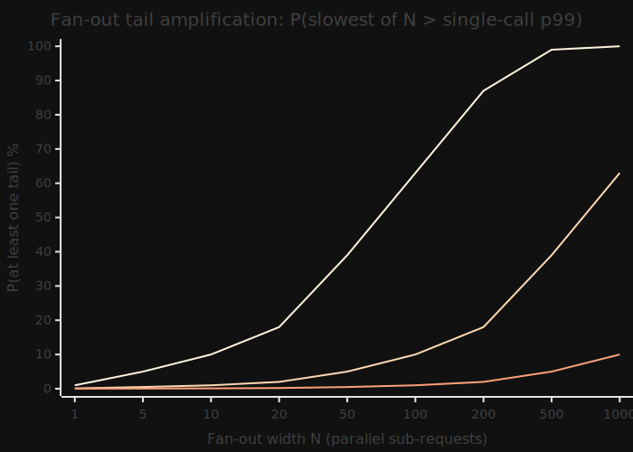

# Capacity Planning and Back-of-the-Envelope Estimates

Capacity planning is the cheapest way to invalidate a design. Two hours of multiplication on a whiteboard catches order-of-magnitude mistakes that would otherwise burn weeks of engineering and a six-figure cloud bill. This article codifies the reference numbers, calculation patterns, and reality adjustments that turn "we need to handle millions of users" into a defensible plan for QPS, storage, bandwidth, server count, and headroom.




## Mental Model

Back-of-the-envelope (BOTE) estimates are fast, deliberately approximate calculations whose only job is to reject infeasible designs and surface the dominant cost. The output of a BOTE estimate is a *range*, not a number, and the value is the explicit assumption ledger that produces it.

Almost every estimate decomposes into two patterns:

1. **Rate estimation**: $\text{QPS}_{\text{avg}} = \dfrac{\text{daily volume}}{86{,}400}$, then multiply by a peak factor.
2. **Resource estimation**: $\text{resource} = \text{users} \times \text{actions} \times \text{size} \times \text{retention}$, then multiply by a replication factor.

The mental shortcut: **1 million per day ≈ 12 per second** ($10^6 / 86{,}400 \approx 11.6$). If you are doing this on a whiteboard, divide by $10^5$ instead of 86,400 — the answer comes out about 16 % low, which is fine when the input itself is a guess. Three numbers usually drive the design:

- **QPS** sets the application-server fleet and the database topology.
- **Storage growth rate** sets the sharding horizon and the storage tier.
- **Bandwidth** sets the CDN strategy and the egress bill.

Three reality factors then multiply onto the raw estimates:

- **Peak factor 2–10×** — social and event-driven workloads spike well above their daily average ([SRE Workbook: managing demand](https://sre.google/workbook/managing-load/)).
- **Replication factor ~3×** — durability defaults across HDFS, Cassandra, and the original Dynamo paper sit at three copies ([Dynamo: Amazon's Highly Available Key-value Store, Section 4](https://www.allthingsdistributed.com/files/amazon-dynamo-sosp2007.pdf)).
- **N+2 redundancy** — Google SRE's default: if you need *N* tasks at peak, run *N+2* so a planned upgrade and an unplanned failure do not eat your headroom simultaneously ([Google SRE Book: Production environment](https://sre.google/sre-book/production-environment/)).

The 80/20 heuristic — 20 % of data serves 80 % of requests — is also useful enough to bake into your default cache sizing, with the caveat that it is a heuristic, not a law ([Wikipedia: Pareto principle](https://en.wikipedia.org/wiki/Pareto_principle)).

> [!IMPORTANT]
> A BOTE estimate without an explicit assumption ledger is worthless. The number changes; the assumptions are what you defend in review.

## Reference Numbers Every Engineer Should Know

These numbers form the foundation of capacity estimates. Memorize the ones in **bold**; keep the rest bookmarked.

### Powers of Two and the KB / KiB Distinction

| Power | Exact value      | Approximation  | IEC name |
| ----- | ---------------- | -------------- | -------- |
| 2¹⁰   | 1,024            | ~1 thousand    | 1 KiB    |
| 2²⁰   | 1,048,576        | ~1 million     | 1 MiB    |
| 2³⁰   | 1,073,741,824    | ~1 billion     | 1 GiB    |
| 2⁴⁰   | ~1.10 × 10¹²     | ~1 trillion    | 1 TiB    |
| 2⁵⁰   | ~1.13 × 10¹⁵     | ~1 quadrillion | 1 PiB    |

Strictly, [IEC 80000-13](https://www.iso.org/standard/31898.html) reserves the prefixes KB, MB, GB for base-10 (10³, 10⁶, 10⁹) and KiB, MiB, GiB for base-2. Most storage marketing uses base-10, most operating-system disk-usage tools use base-2, and the gap grows: 1 TB on a drive label is about 7 % smaller than the 1 TiB the OS reports. For BOTE work, treat them as interchangeable and round; for any contract or quota, name the prefix explicitly.

**Practical shortcuts:**

- 1 KB ≈ 10³ bytes
- 1 MB ≈ 10⁶ bytes ≈ 1,000 KB
- 1 GB ≈ 10⁹ bytes ≈ 1,000 MB
- 1 TB ≈ 10¹² bytes ≈ 1,000 GB

### Latency Numbers (Jeff Dean's List)

The classic table comes from Jeff Dean's 2009-2012 talks ([gist mirror](https://gist.github.com/jboner/2841832)) and has not been refreshed by Dean himself. The "modern reality" column shows where hardware has moved enough to matter, drawn from current vendor datasheets and [Colin Scott's interactive extrapolation](https://colin-scott.github.io/personal_website/research/interactive_latency.html). Treat the modern column as model-or-datasheet, not measurement on your machine.

| Operation                            | Jeff Dean (~2010) | Modern reality (~2025)               |
| ------------------------------------ | ----------------- | ------------------------------------ |
| L1 cache reference                   | 0.5 ns            | ~1 ns                                |
| Branch mispredict                    | 5 ns              | ~3-5 ns                              |
| L2 cache reference                   | 7 ns              | ~4 ns                                |
| Mutex lock/unlock                    | 100 ns            | ~17 ns (uncontended)                 |
| Main memory reference                | 100 ns            | ~80-100 ns                           |
| Compress 1 KB with Snappy            | 10 μs             | ~4 μs (Snappy ≈ 250 MB/s)            |
| Send 1 KB over 1 Gbps network        | 10 μs             | unchanged                            |
| Read 1 MB sequentially from memory   | 250 μs            | ~10-40 μs (DDR4/5 ≥ 25 GB/s)         |
| SSD random read (4 KB)               | 150 μs            | 20-100 μs (NVMe)                     |
| Read 1 MB sequentially from SSD      | 1 ms              | ~50-200 μs (NVMe)                    |
| Datacenter round trip                | 500 μs            | 250-500 μs                           |
| Disk seek (HDD)                      | 10 ms             | 8-15 ms (still mechanical)           |
| Read 1 MB sequentially from network  | 10 ms             | unchanged at 1 Gbps                  |
| Read 1 MB sequentially from disk     | 30 ms             | 5-10 ms                              |
| Send packet CA → Netherlands → CA    | 150 ms            | 130-160 ms (speed-of-light bound)    |

> [!NOTE]
> The Snappy throughput is from Google's [google/snappy README](https://github.com/google/snappy/blob/main/README.md); the NVMe figures track current consumer-NVMe datasheet ranges (e.g. [Samsung 990 PRO datasheet](https://semiconductor.samsung.com/consumer-storage/internal-ssd/990pro/)). Cross-continent latency is bounded by the speed of light in fiber (≈ 200,000 km/s), not by routing.

**Key takeaways:**

- Main memory is roughly **1,000× faster than an NVMe random read** and **100,000× faster than an HDD seek**. Working set in RAM is the single largest performance lever.
- An intra-datacenter network round trip (~0.5 ms) costs ~5,000 main-memory references. Talking to another service is never free.
- Cross-continent round trips (~150 ms) are unavoidable without edge caching; that one number is why CDNs exist.

### Time Conversions for Capacity Planning

| Period   | Seconds      | Useful for                    |
| -------- | ------------ | ----------------------------- |
| 1 minute | 60           |                               |
| 1 hour   | 3,600        |                               |
| 1 day    | **86,400**   | daily → per-second conversion |
| 1 month  | ~2.6 × 10⁶   | monthly quotas, billing       |
| 1 year   | ~31.5 × 10⁶  | annual storage growth         |

**The 86,400 rule:** to convert daily volume to QPS, divide by ~10⁵. The answer is ~16 % low (since $86{,}400 / 10^5 = 0.864$), which is exactly the kind of error a BOTE tolerates. So 1 billion daily requests ≈ 10,000 QPS average; the precise answer is 11,574 QPS, which rounds to the same provisioning decision.

### Availability and Downtime

| Availability         | Downtime/year | Downtime/month | Downtime/day  |
| -------------------- | ------------- | -------------- | ------------- |
| 99% (two nines)      | 3.65 days     | 7.30 hours     | 14.4 minutes  |
| 99.9% (three nines)  | 8.76 hours    | 43.8 minutes   | 1.44 minutes  |
| 99.99% (four nines)  | 52.6 minutes  | 4.38 minutes   | 8.64 seconds  |
| 99.999% (five nines) | 5.26 minutes  | 26.3 seconds   | 0.86 seconds  |

These are direct multiplications of the period by $(1 - \text{availability})$ and match the standard tables on [uptime.is](https://uptime.is/).

**The exponential cost of nines:** going from 99.9 % to 99.99 % cuts downtime by 10×, and removing the next 10× of downtime requires roughly 10× the engineering investment in redundancy, observability, and runbook automation. This 10×-per-nine ratio is folklore, not a theorem — but every team that has actually walked the path agrees it is at least the right order of magnitude. The Google SRE book frames the decision as an explicit error-budget conversation rather than a target to chase ([Google SRE Book: Embracing Risk](https://sre.google/sre-book/embracing-risk/)).

### Single-Server Benchmarks (Order-of-Magnitude)

| Component           | Typical capacity   | Notes                                      |
| ------------------- | ------------------ | ------------------------------------------ |
| Web server (NGINX)  | 10,000-100,000 QPS | Static content, keep-alive enabled         |
| Application server  | 1,000-10,000 QPS   | Depends on request complexity              |
| MySQL (read-heavy)  | 10,000-50,000 QPS  | Simple queries, indexed lookups            |
| MySQL (write-heavy) | 1,000-10,000 QPS   | Depends on durability settings             |
| Redis               | 100,000+ QPS       | In-memory, simple operations               |
| PostgreSQL          | 10,000-30,000 QPS  | Varies significantly with query complexity |

> [!CAUTION]
> These are rough order-of-magnitude bands, not benchmarks. Real numbers vary by 10× with query shape, payload size, hardware, and configuration. PlanetScale's [One Million QPS with MySQL](https://planetscale.com/blog/one-million-queries-per-second-with-mysql) is a useful upper-bound demonstration; your workload will sit somewhere different. Always load test the actual query mix before committing to a topology.

### Network Bandwidth

| Medium              | Bandwidth         | Time to transfer 1 GB |
| ------------------- | ----------------- | --------------------- |
| 1 Gbps Ethernet     | 125 MB/s          | 8 seconds             |
| 10 Gbps Ethernet    | 1.25 GB/s         | 0.8 seconds           |
| 100 Gbps Ethernet   | 12.5 GB/s         | 0.08 seconds          |
| SSD sequential read | 0.5-7 GB/s        | 0.14-2 seconds        |
| HDD sequential read | 100-200 MB/s      | 5-10 seconds          |

## Core Estimation Techniques

### QPS (Queries Per Second) Estimation

$$
\text{QPS}_{\text{avg}} = \frac{\text{DAU} \times \text{actions per user}}{86{,}400}
\qquad
\text{QPS}_{\text{peak}} = \text{QPS}_{\text{avg}} \times \text{peak factor}
$$

**Example: social media feed service**

Assumptions:

- 500 million DAU
- Each user refreshes feed 10 times/day
- Peak traffic is 3× average

```text
Daily requests = 500M × 10            = 5 billion
Average QPS    = 5B / 86,400          ≈ 58,000 QPS
Peak QPS       = 58,000 × 3           ≈ 174,000 QPS
```

**Read vs. write ratio matters.** Most user-facing systems run 10:1 to 100:1 read-heavy ([DDIA, ch. 5](https://dataintensive.net/)). Split the estimate:

```text
Read QPS  = 174,000 × 0.9             ≈ 157,000
Write QPS = 174,000 × 0.1             ≈ 17,400
```

The split drives architecture: reads scale horizontally with replicas and caches; writes need partitioning, and write throughput is what eventually forces sharding.

### Storage Estimation

$$
\text{daily storage} = \text{users} \times \text{actions} \times \text{average size}
\qquad
\text{annual storage} = \text{daily storage} \times 365 \times \text{replication factor}
$$

**Example: photo-sharing service**

Assumptions:

- 500 million users
- 2 photos uploaded per active user per day, 10 % of users active
- Average photo size: 2 MB
- Replication factor: 3

```text
Daily uploads  = 500M × 0.1 × 2       = 100 million photos
Daily storage  = 100M × 2 MB          = 200 TB/day
Annual storage = 200 TB × 365 × 3     = 219 PB/year
```

**Always include metadata.** Photos carry thumbnails, EXIF data, and DB rows. Add 10-20 % overhead, and remember that lifecycle tiering (hot → warm → cold → archive) usually cuts the long-tail cost by another order of magnitude on top.

### Bandwidth Estimation

$$
\text{ingress} = \text{write QPS} \times \text{request size}
\qquad
\text{egress}  = \text{read QPS}  \times \text{response size}
$$

**Example: video streaming service**

Assumptions:

- 10 million concurrent viewers
- Average bitrate: 3 Mbps

```text
Egress bandwidth = 10M × 3 Mbps       = 30 Tbps
```

This is why Netflix runs its own CDN ([Open Connect](https://openconnect.netflix.com/en/)) and peers directly with ISPs — close to 90 % of Netflix traffic globally is served from those direct connections, with embedded Open Connect Appliances (OCAs) inside ISP networks doing most of the work ([Netflix: How Netflix Works With ISPs Around the Globe](https://about.netflix.com/news/how-netflix-works-with-isps-around-the-globe-to-deliver-a-great-viewing-experience)). At 30 Tbps you are buying transit-level capacity that no public-internet path can sustain economically.

### Server Count Estimation

$$
\text{servers} = \frac{\text{peak QPS}}{\text{QPS per server}} + \text{redundancy}
$$

**Example: API service**

Assumptions:

- Peak QPS: 100,000
- Each server handles 5,000 QPS at the **target** utilization, not at maximum capacity (see [Saturation, Utilization, and the Queueing Knee](#saturation-utilization-and-the-queueing-knee))
- N+2 redundancy

```text
Minimum servers       = 100,000 / 5,000     = 20
With N+2 redundancy   = 20 + 2              = 22 servers
```

The Google SRE book frames N+2 as the canonical default: provision enough capacity that a planned drain (rolling deploy, kernel upgrade) and a single unplanned failure can co-occur without breaching the SLO ([Google SRE Book: Production environment](https://sre.google/sre-book/production-environment/), [SRE Best Practices for Capacity Management](https://sre.google/static/pdf/login_winter20_10_torres.pdf)). N+1 is acceptable in regions where the cost of a brief redirect is cheaper than the extra capacity.

### Little's Law for Concurrency

$$
L = \lambda \cdot W
$$

- $L$ — average number of items in the system (concurrent requests, work-in-progress)
- $\lambda$ — long-term average arrival rate
- $W$ — average time an item spends in the system (latency)

Little's Law was published by John D. C. Little in 1961 ([*A Proof for the Queuing Formula: L = λW*, Operations Research 9(3)](https://www.jstor.org/stable/167570)) and is independent of the arrival or service distribution — it holds for any stationary system. That generality is what makes it the single most useful formula in capacity planning.

**Example: database connection-pool sizing**

Assumptions:

- 10,000 QPS to database
- Average query time: 5 ms

```text
Concurrent connections = 10,000 × 0.005 = 50 connections
```

With a 2× safety margin, target ~100 connections from the application tier to the database. If you have 10 application servers, each pool only needs to hold ~10 connections.

> [!TIP]
> Little's Law is also how you size queue depths, thread pools, goroutine fan-out, and the "in flight" work counter in any rate limiter. Whenever you have an arrival rate and a per-item time, $L$ is what you need to provision.

### Saturation, Utilization, and the Queueing Knee

Servers do not behave linearly as you push them toward 100 % utilization. For a single-resource queue (the M/M/1 model), the average response time is

$$
R = \frac{S}{1 - \rho}
$$

where $S$ is the average service time and $\rho$ is utilization. At $\rho = 0.5$, response time is $2S$; at $\rho = 0.9$, it is $10S$; at $\rho = 0.99$, it is $100S$. The curve has a sharp knee around $\rho \approx 0.7\text{-}0.8$ — past that point, latency goes asymptotic for relatively small additional load.




This is the quantitative reason that "QPS per server" must be measured at your target utilization, not at the saturation point. Doubling traffic on a fleet that is already at 70 % utilization is *not* the same as doubling the fleet at 35 %: the available headroom is only 30 %, so the new arrival rate $1.4 C$ exceeds the existing capacity $C$ outright. Restoring the 70 % target requires roughly $1.4C / 0.7 = 2C$ — exactly double — and any team that wants additional safety against bursts or correlated failure typically lands at $2.5\text{-}3\times$ rather than $2\times$. The lesson is the same: the closer you operate to saturation, the less linear the math becomes.

Real-world arrivals are bursty and service times are variable, which makes M/M/1 optimistic. Two refinements matter in practice:

- **Pollaczek-Khinchine** generalises wait time for M/G/1 (Poisson arrivals, *general* service distribution): $W_q = \dfrac{\rho \cdot S \cdot (1 + C_s^2)}{2(1 - \rho)}$, where $C_s$ is the coefficient of variation of service time ([Wikipedia: Pollaczek-Khinchine formula](https://en.wikipedia.org/wiki/Pollaczek%E2%80%93Khinchine_formula)). When service is exponential ($C_s = 1$) it collapses back to M/M/1; when it is deterministic ($C_s = 0$) wait time halves.
- **Kingman's formula** approximates G/G/1 (general arrivals *and* general service): $W_q \approx \dfrac{\rho}{1 - \rho} \cdot \dfrac{C_a^2 + C_s^2}{2} \cdot S$ ([Kingman, 1961, *The single server queue in heavy traffic*](https://www.cambridge.org/core/journals/mathematical-proceedings-of-the-cambridge-philosophical-society/article/abs/single-server-queue-in-heavy-traffic/F8FCA70E3DF2C0E9DA9E20E81B91D14E)). Bursty arrivals ($C_a > 1$, common for retries and thundering-herd events) inflate wait time linearly in $C_a^2$, which is why retry storms turn a healthy fleet into a queueing fire.

For multi-core or multi-node coordination, see Neil Gunther's Universal Scalability Law: $X(N) = \dfrac{\gamma N}{1 + \alpha (N-1) + \beta N (N-1)}$. The contention term $\alpha$ models serialization (Amdahl-style locks, single-writer paths); the coherency term $\beta$ models the cost of keeping nodes in sync (cache invalidation, gossip, two-phase commit). USL has a peak at $N^{*} = \sqrt{(1 - \alpha)/\beta}$; past that point, throughput *decreases* as you add capacity — a regime that linear thinking entirely misses ([Gunther, *Guerrilla Capacity Planning*, ch. 4-5](https://www.perfdynamics.com/Manifesto/USLscalability.pdf)).




> [!TIP]
> Fit USL to your own load-test data with two well-spaced points: $\alpha$ is the slope of the inverse-throughput curve at low $N$, and $\beta$ governs where the curve bends back. Two regression points are usually enough to forecast the ceiling within ~20 %.

### Tail Latency and Fan-out Amplification

The single most under-appreciated rule in capacity planning is that *percentiles do not average*. There is no meaningful operation that turns the p99 of service A and the p99 of service B into the p99 of "A then B". For a serial pipeline you can only sum the relevant percentiles per stage if they are perfectly correlated; for parallel fan-out, the tail of the *slowest* sub-request dominates the response.

Assume $N$ independent sub-requests with the same single-call latency distribution, and let $p$ be the probability that any one call exceeds threshold $t$. The probability that *at least one* call in the fan-out exceeds $t$ is:

$$
P(\text{slowest} > t) = 1 - (1 - p)^{N}
$$

Plugging in $p = 0.01$ (the single-call p99) for a fan-out of $N = 100$ gives $1 - 0.99^{100} \approx 0.634$. **A request that fans out to 100 backends has a 63 % chance of seeing at least one p99-or-worse sub-call**, even when every backend is meeting its own p99 SLO. To preserve a 1 % overall tail under fan-out $N$, the per-call distribution must satisfy $(1 - p)^{N} \geq 0.99$, i.e. $p \leq 1 - 0.99^{1/N}$. For $N = 100$ that demands a single-call p99.99 — two extra nines per backend, just to keep the aggregate at p99. This is the central result of Dean & Barroso's [*The Tail at Scale* (CACM 2013)](https://research.google/pubs/the-tail-at-scale/).

 becomes a 63 % aggregate tail at fan-out N=100. Pushing per-backend tails to p99.99 keeps the aggregate near 1 %.")


Mitigations from Dean & Barroso, in increasing operational cost:

- **Hedged requests** — issue a duplicate after the per-call p95, cancel the loser. Cuts p99 by ~5× with < 5 % extra load.
- **Tied requests** — issue both immediately, have them cancel each other on first acknowledgement. Stronger but doubles backend work in the worst case.
- **Backup workers / micro-batching** — when one stage is consistently the long-pole, reissue rather than waiting on the straggler.
- **Partition + parallel-fan-in budgeting** — design the fan-out width so that even pessimistic per-call tails compose to an SLO you can defend.

The cleanest defence is *not adding a percentile budget you cannot afford to spend*: every additional fan-out hop, retry layer, and chained microservice call multiplies the probability of hitting some backend's tail.

## Worked Examples

### Example 1: Twitter-like Service

**Requirements:**

- 500 million MAU, 50 million DAU
- Users post 2 tweets/day, read 100 tweets/day
- Average tweet: 500 bytes (text + metadata)
- 20 % of tweets include media (average 200 KB)

**QPS:**

```text
Writes (tweets posted):
  Daily   = 50M × 2          = 100M tweets
  Average = 100M / 86,400    ≈ 1,157 QPS
  Peak 3× ≈ 3,500 QPS

Reads (timeline loads):
  Daily   = 50M × 100        = 5B requests
  Average = 5B / 86,400      ≈ 58,000 QPS
  Peak 3× ≈ 174,000 QPS

Read:write ratio ≈ 50:1
```

**Storage:**

```text
Tweet text per day:
  100M × 500 B               = 50 GB/day

Media per day:
  100M × 0.2 × 200 KB        = 4 TB/day

Annual (3× replication):
  Text  = 50 GB  × 365 × 3   ≈ 55 TB/year
  Media = 4 TB   × 365 × 3   ≈ 4.4 PB/year
```

**Bandwidth:**

```text
Ingress (uploads):
  Media: 4 TB/day            ≈ 370 Mbps avg, ~1.1 Gbps peak

Egress (reads, assume 10% include media):
  Text  = 174,000 × 500 B    ≈ 87 MB/s
  Media = 17,400 × 200 KB    ≈ 3.5 GB/s
  Total peak                 ≈ 28 Gbps
```

The architectural conclusion: text writes are trivial (3.5 K QPS), media egress dominates the bandwidth budget, and the 50:1 read:write ratio strongly motivates a fan-out-on-write timeline cache. This is essentially the path Twitter walked — the *Fail Whale* era was driven less by raw QPS than by a Ruby-on-Rails monolith colliding with a single MySQL instance under a fan-out-on-write workload, which is why Twitter eventually moved to JVM services and a custom storage layer ([How Twitter Slayed the Fail Whale, TIME 2013](https://business.time.com/2013/11/06/how-twitter-slayed-the-fail-whale/)).

### Example 2: URL Shortener

**Requirements:**

- 100 million new URLs per month
- Read:write ratio of 100:1
- URLs stored for 5 years

**QPS:**

```text
Write QPS:
  100M / (30 × 86,400)       ≈ 39 QPS average
  Peak 3×                    ≈ 120 QPS

Read QPS:
  39 × 100                   ≈ 3,900 QPS average
  Peak 3×                    ≈ 12,000 QPS
```

**Storage:**

```text
URL entry: ~500 bytes (short code + long URL + metadata)
Per month: 100M × 500 B      = 50 GB
5 years (3× replication):    = 50 GB × 60 × 3 ≈ 9 TB total
```

**Conclusion:** this is a small-scale system. A single well-provisioned PostgreSQL instance with read replicas and a Redis cache on the hot 20 % handles this indefinitely. The interesting engineering problem is not capacity — it is collision-free key generation and cache-stampede protection on viral links.

### Example 3: Video Streaming Platform

**Requirements:**

- 200 million MAU, 100 million DAU
- Average watch time: 60 minutes/day
- Average bitrate: 4 Mbps
- 500,000 videos uploaded per day
- Average video length: 5 minutes

**Concurrent viewers (peak):**

```text
At any instant assume 20% of DAU watching:
  100M × 0.2                 = 20M concurrent

Major event peak (2×):       = 40M concurrent
```

**Bandwidth:**

```text
Egress = 40M × 4 Mbps        = 160 Tbps
```

This number is the entire reason CDNs exist. Netflix's Open Connect serves close to 90 % of its traffic from ISP-embedded appliances precisely because moving 160 Tbps across public-internet transit is economically infeasible ([Netflix corporate post, 2024](https://about.netflix.com/news/how-netflix-works-with-isps-around-the-globe-to-deliver-a-great-viewing-experience)).

**Storage:**

```text
Raw upload per day:
  500K × 5 min × 4 Mbps      ≈ 750 TB/day raw

Transcoded (10 quality levels):
  750 TB × 10                ≈ 7.5 PB/day

Annual                       ≈ 7.5 PB × 365 ≈ 2.7 EB/year
```

This assumes no deduplication and no tiering. In practice, aggressive content-defined chunking, deduplication, and hot/cold tiering — plus dropping unwatched long-tail uploads to archive class — reduce the durable footprint by 5-10×.

## Design Choices: When Estimates Drive Architecture

The decision tree below summarizes the most common breakpoints. The thresholds are conservative defaults; your workload may move them in either direction.




### Single Server vs. Distributed

| Factor                   | Single-server threshold | When to distribute         |
| ------------------------ | ----------------------- | -------------------------- |
| Read QPS                 | < 10,000                | > 10,000 (add replicas)    |
| Storage                  | < 1 TB                  | > 1 TB (consider sharding) |
| Write QPS                | < 5,000                 | > 5,000 (shard writes)     |
| Availability requirement | < 99.9 %                | > 99.9 % (add redundancy)  |

**Modern hardware is much bigger than most engineers assume.** WhatsApp engineering reported handling more than 2 million concurrent TCP connections per server using Erlang on FreeBSD as far back as 2012, with kernel-tuning on FreeBSD's socket and file-descriptor limits ([WhatsApp blog: 1 million is so 2011](https://blog.whatsapp.com/1-million-is-so-2011)). The C10K problem (10,000 concurrent connections), originally posed by Dan Kegel in 1999 ([The C10K problem](http://www.kegel.com/c10k.html)), has been solved at the OS level for decades. Distribution should be a deliberate trade-off, not a default.

### Caching Strategy from Estimates

The 80/20 heuristic: if 20 % of your data serves 80 % of requests, cache that 20 %.

```text
Cache size = total data × hot fraction
           = 10 TB × 0.2          = 2 TB
```

**Cache hit-rate impact:**

```text
With 80% cache hit rate:
  DB QPS = total QPS × 0.2        = 20% of original load

Going from 0% → 80% hit rate gives 5× database headroom.
Going from 80% → 95% gives another 4× on top.
```

The marginal value of every additional percentage point of cache hit rate grows non-linearly as the hit rate approaches 100 %. This is why CDNs and database caches are typically designed for ≥ 95 % hit rate, not 80 %.

### Sharding Trigger Points

| Signal                  | Threshold          | Action                     |
| ----------------------- | ------------------ | -------------------------- |
| Single-table row count  | > 100 million rows | Consider partitioning      |
| Single-database size    | > 1 TB             | Consider sharding          |
| Sustained write QPS     | > 5,000            | Shard by write key         |
| Replication lag         | > 1 second         | Shard to reduce write load |

**Sharding multiplies operational complexity.** Delay it until the estimate shows the single-node ceiling is actually close. Instagram ran on a single PostgreSQL instance, then on logical shards within PostgreSQL schemas, before moving to physical sharding — and they wrote about the design and the Snowflake-style ID scheme they used to get there ([Instagram Engineering: Sharding & IDs at Instagram](https://instagram-engineering.com/sharding-ids-at-instagram-1cf5a71e5a5c)).

## Common Pitfalls

### 1. Forgetting Peak Traffic

**The mistake:** designing for average traffic.

**Why it happens:** averages are easier to calculate and seem reasonable.

**The consequence:** the system falls over during peak hours, product launches, or viral events. Every infamous scaling outage in the last fifteen years has a peak-traffic component.

**The fix:** always multiply average by a peak factor — 2-3× for steady-state web traffic, 10× or more for event-driven workloads (e-commerce flash sales, sports streaming, breaking news). Design for peak, not average.

### 2. Ignoring Replication and Redundancy

**The mistake:** estimating raw storage without replication.

**Why it happens:** replication feels like overhead rather than a requirement.

**The consequence:** you provision a third of the needed storage. Or you discover at failure time that you have no redundancy.

**The fix:** multiply storage by replication factor (3 is the durable-by-default value across HDFS, Cassandra, and the original Dynamo paper). Add N+2 to server counts.

### 3. Conflating Throughput and Latency

**The mistake:** assuming high throughput means low latency.

**Why it happens:** they feel related — faster systems handle more requests.

**The consequence:** a system might handle 100,000 QPS with a 500 ms tail latency. Users experience poor performance despite "high capacity".

**The fix:** estimate both independently. Use Little's Law: if you need 100 ms latency at 10,000 QPS, you need capacity for $L = 10{,}000 \times 0.1 = 1{,}000$ concurrent in-flight requests. Tail latency (p99, p999) usually matters more than average throughput; track them separately, and remember that the tail compounds on fan-out (see [Tail Latency and Fan-out Amplification](#tail-latency-and-fan-out-amplification)).

### 4. Doing Arithmetic on Percentiles

**The mistake:** averaging p99s across hosts, summing p99s across hops, or computing "fleet p99" from per-host p99s.

**Why it happens:** percentiles look like numbers, and numbers feel additive.

**The consequence:** you under-budget tail latency, miss SLO breaches that show up at the edge, and waste investigation time on the wrong subsystem.

**The fix:** percentiles are properties of distributions, not samples. Aggregate the *raw* histogram (or t-digest / HDR sketch) and recompute the percentile from the merged distribution. For composition: serial pipelines need the per-stage *distribution*, not its p99; parallel fan-outs follow $1 - (1 - p)^N$ from the section above.

### 5. Linear Extrapolation of Growth

**The mistake:** assuming traffic will grow linearly.

**Why it happens:** linear projections are simple.

**The consequence:** exponential growth — common in successful products — exhausts capacity faster than expected.

**The fix:** model growth curves explicitly. For successful products, expect 2-3× year-over-year growth. Include "hockey stick" scenarios for viral features; the SRE workbook's [demand forecasting](https://sre.google/workbook/managing-load/) chapter is a good template.

### 6. Precision Theater

**The mistake:** calculating estimates to 4 significant figures.

**Why it happens:** more precision feels more accurate.

**The consequence:** false confidence. BOTE estimates are accurate to perhaps 2-5×. Claiming "we need exactly 147 servers" implies false precision.

**The fix:** round aggressively. Use powers of 10. "We need 100-200 servers" is more honest than "147 servers".

### 7. Treating Peak QPS as Provisioning QPS

**The mistake:** sizing the fleet at exactly peak QPS / max-per-server QPS.

**Why it happens:** it looks like the simplest calculation.

**The consequence:** the fleet runs at 100 % utilization at peak, which the queueing knee guarantees will tip into latency collapse.

**The fix:** divide by *target* QPS per server, where the target is at most 70 % of measured maximum. Then add the N+2 buffer on top.

## Communicating Estimates

### Document Assumptions

Every estimate requires explicit assumptions. Without them, numbers are meaningless.

```markdown title="capacity-estimate.md"
## Capacity Estimate: <System Name>

### Assumptions
- DAU: 50 million
- Actions per user per day: 10
- Average request size: 2 KB
- Average response size: 10 KB
- Peak multiplier: 3×
- Read:write ratio: 10:1
- Replication factor: 3
- Target server utilization: 70%

### Derived Estimates
- Average QPS: <calculation>
- Peak QPS: <calculation>
- Storage/year: <calculation>
- Bandwidth: <calculation>
- Server count (with N+2): <calculation>

### Confidence Level
- High confidence: <which estimates>
- Medium confidence: <which estimates>
- Requires validation: <which estimates>
```

### Present Ranges, Not Points

- Good: *"We need 50-100 servers to handle peak load."*
- Bad: *"We need 73 servers."*

Ranges communicate uncertainty honestly. Point estimates imply false confidence and tend to attract pushback on the wrong significant figure.

### Update Estimates with Reality

Estimates are hypotheses. Validate them with three complementary signals:

- **Pre-launch load tests.** Drive the system past the projected peak with a realistic mix (read/write ratio, payload sizes, retry behaviour, cold-cache vs warm-cache scenarios). Watch for the queueing knee and for the USL plateau or roll-off. The Google SRE workbook's [load-shedding chapter](https://sre.google/workbook/managing-load/) is the canonical playbook for what to test.
- **USE method on every resource** ([Brendan Gregg, USE method](https://www.brendangregg.com/usemethod.html)) — for each host, container, queue, disk, or NIC: check **U**tilization, **S**aturation, and **E**rrors. This catches resource exhaustion that latency dashboards hide.
- **RED method on every service** ([Tom Wilkie, RED method](https://www.weave.works/blog/the-red-method-key-metrics-for-microservices-architecture/)) — **R**equest rate, **E**rror rate, **D**uration. RED is the user-visible signal; USE explains why RED moved.

The AWS Well-Architected Performance Efficiency pillar makes the same point in operational language: design measurement into the system before the load hits, then revisit the design as the workload evolves ([AWS Well-Architected: Performance Efficiency](https://docs.aws.amazon.com/wellarchitected/latest/performance-efficiency-pillar/welcome.html)).

When reality diverges from your estimate by more than 2×, treat that as a signal to investigate — the assumptions changed, the workload mix shifted, the model was wrong, or (most often) you are living in a different operating regime than the one you modelled (steady-state vs cold-start, average vs peak hour, batch vs interactive).

## What This Article Doesn't Cover

BOTE estimates are the entry point, not the whole craft. For deeper work you also need:

- **Erlang B / Erlang C** for sizing systems with explicit blocking probabilities (call centers, connection pools with timeouts).
- **Full tail-latency budgeting across a request DAG** — composing distributions per stage rather than per percentile, often with histogram-merge sketches (HDR, t-digest, DDSketch). [The Tail at Scale (Dean & Barroso, CACM 2013)](https://research.google/pubs/the-tail-at-scale/) is the entry text; this article only covers the closed-form fan-out case.
- **Cost modeling** — translating capacity to TCO across reserved, spot, and on-demand pricing tiers.
- **Workload characterisation** — fitting arrival processes (MMPP, self-similar bursts) and service-time distributions (lognormal, heavy-tailed) when the M/M/1 / M/G/1 abstractions are too coarse.
- **Capacity testing** — chaos engineering, load shedding, and load-testing strategy as living validation of the assumptions in your ledger.

## Conclusion

Capacity planning is hypothesis generation. You make educated guesses about future load, then validate them with progressively more accurate data — first BOTE math, then load tests, then production metrics.

The core technique is simple: convert user-level assumptions (DAU, actions, sizes) into system-level metrics (QPS, storage, bandwidth, server count). Apply reality adjustments (peak factor, replication factor, N+2 redundancy, headroom for the queueing knee). Document assumptions so others can validate your reasoning.

The numbers in this article are starting points, not answers. A URL shortener and a video platform have radically different capacity profiles at the same user count. The skill is knowing which numbers matter for your specific system and how to derive them from first principles — and then knowing the moment when the BOTE result stops being good enough and you need a real load test.

## Appendix

### Prerequisites

- Comfort with exponential notation and powers of two
- Familiarity with distributed-system components (databases, caches, load balancers, CDNs)
- A working mental model of read vs. write paths in a typical web application

### Terminology

- **QPS (Queries Per Second):** request-rate metric; used interchangeably with RPS (Requests Per Second) in API contexts.
- **DAU (Daily Active Users):** users who interact with the system at least once per day.
- **MAU (Monthly Active Users):** users who interact at least once per month; typically 2-3× DAU.
- **Peak multiplier:** ratio of peak traffic to average traffic.
- **Replication factor:** number of copies of data stored for durability (typically 3).
- **N+2 redundancy:** provisioning N servers plus 2 spares so a planned drain plus an unplanned failure can co-occur.
- **Little's Law:** $L = \lambda W$; relates concurrent items in a system to arrival rate and processing time.
- **Pollaczek-Khinchine formula:** wait time for M/G/1; shows that variable service time inflates queueing wait by $(1 + C_s^2)/2$.
- **Kingman's formula:** heavy-traffic approximation for G/G/1; both arrival burstiness and service variability appear as $(C_a^2 + C_s^2)/2$.
- **Universal Scalability Law (USL):** Gunther's model for throughput as concurrency grows, accounting for contention $\alpha$ and coherency $\beta$. Throughput peaks at $N^* = \sqrt{(1-\alpha)/\beta}$.
- **Queueing knee:** the utilization point (~70-80 % for M/M/1) past which latency grows hyperbolically.
- **Tail amplification:** the inflation of aggregate tail latency under fan-out; for $N$ independent sub-requests with single-call tail $p$, $P(\text{slowest tail}) = 1 - (1-p)^N$.
- **USE method:** for every resource, monitor Utilization, Saturation, and Errors.
- **RED method:** for every service, monitor Request rate, Error rate, and Duration.

### Summary

- Convert daily volumes to QPS using the 86,400 rule (or approximate by dividing by 10⁵).
- Memorize the order-of-magnitude latency numbers — memory vs. SSD vs. disk vs. network shapes every design.
- Always apply a peak multiplier (2-3× steady-state, 10×+ for event-driven) and a replication factor (typically 3).
- Use Little's Law for connection pools, queue depths, and concurrency ceilings.
- Provision against the queueing knee, not against measured maximum throughput; account for service-time variability with Pollaczek-Khinchine and arrival burstiness with Kingman.
- Budget tail latency explicitly — fan-out turns a 1 % per-call tail into a 63 % aggregate tail at $N=100$.
- Treat USL as the ceiling, not Amdahl: throughput can roll off, not just plateau.
- Round aggressively — BOTE estimates are accurate to 2-5×.
- Document assumptions explicitly; estimates without assumptions are meaningless.
- Validate estimates with load tests before launch and USE/RED metrics after.

### References

- [Google SRE Book: Production environment](https://sre.google/sre-book/production-environment/) — N+2 redundancy and demand forecasting
- [Google SRE Workbook: Managing load](https://sre.google/workbook/managing-load/) — load shedding, graceful degradation, demand modeling
- [Google SRE Book: Embracing Risk](https://sre.google/sre-book/embracing-risk/) — error-budget framing for the cost of additional nines
- [SRE Best Practices for Capacity Management (PDF)](https://sre.google/static/pdf/login_winter20_10_torres.pdf) — intent-based capacity planning
- [AWS Well-Architected: Performance Efficiency pillar](https://docs.aws.amazon.com/wellarchitected/latest/performance-efficiency-pillar/welcome.html) — measurement, monitoring, and trade-off practices for capacity
- [Brendan Gregg, USE method](https://www.brendangregg.com/usemethod.html) — utilization, saturation, errors per resource
- [Tom Wilkie, RED method](https://www.weave.works/blog/the-red-method-key-metrics-for-microservices-architecture/) — request rate, error rate, duration per service
- [Latency Numbers Every Programmer Should Know (interactive)](https://colin-scott.github.io/personal_website/research/interactive_latency.html) — Colin Scott's modeled extrapolation of Jeff Dean's numbers
- [Jeff Dean's "Numbers Everyone Should Know" gist](https://gist.github.com/jboner/2841832) — canonical reference table
- [John D. C. Little, *A Proof for the Queuing Formula: L = λW*, Operations Research 9(3), 1961](https://www.jstor.org/stable/167570) — Little's Law original paper
- [Pollaczek-Khinchine formula (Wikipedia)](https://en.wikipedia.org/wiki/Pollaczek%E2%80%93Khinchine_formula) — M/G/1 wait time with general service distributions
- [Kingman, *The single server queue in heavy traffic*, 1961](https://www.cambridge.org/core/journals/mathematical-proceedings-of-the-cambridge-philosophical-society/article/abs/single-server-queue-in-heavy-traffic/F8FCA70E3DF2C0E9DA9E20E81B91D14E) — G/G/1 heavy-traffic approximation
- [Neil Gunther, *Universal Scalability Law* synopsis (PDF)](https://www.perfdynamics.com/Manifesto/USLscalability.pdf) — contention and coherency in scalable systems
- [Dean & Barroso, *The Tail at Scale*, CACM 2013](https://research.google/pubs/the-tail-at-scale/) — fan-out and the tail-latency budget
- [Dynamo: Amazon's Highly Available Key-value Store (SOSP 2007)](https://www.allthingsdistributed.com/files/amazon-dynamo-sosp2007.pdf) — origin of the 3× replication default
- [WhatsApp blog: 1 million is so 2011](https://blog.whatsapp.com/1-million-is-so-2011) — 2M+ TCP connections per server
- [Dan Kegel, The C10K problem](http://www.kegel.com/c10k.html) — historical context on connection handling
- [Instagram Engineering: Sharding & IDs at Instagram](https://instagram-engineering.com/sharding-ids-at-instagram-1cf5a71e5a5c) — pre-sharding PostgreSQL history
- [Netflix Open Connect](https://openconnect.netflix.com/en/) — CDN architecture for streaming at scale
- [PlanetScale: One Million QPS with MySQL](https://planetscale.com/blog/one-million-queries-per-second-with-mysql) — single-database upper-bound demonstration
- [Uptime calculator (uptime.is)](https://uptime.is/) — availability nines to downtime
- [ByteByteGo: Back-of-the-Envelope Estimation](https://bytebytego.com/courses/system-design-interview/back-of-the-envelope-estimation) — system-design-interview framing
