# CDN Architecture and Edge Caching

How Content Delivery Networks reduce latency, protect origins, and scale global traffic distribution. This article covers request routing mechanisms, cache key design, invalidation strategies, tiered caching architectures, and edge compute—with explicit trade-offs for each design choice.


## Mental Model

A CDN (Content Delivery Network) is a geographically distributed cache layer that intercepts requests before they reach the origin. Every architectural choice trades against three tensions:

- **Freshness vs. latency.** Longer TTLs raise the cache hit ratio but widen the window in which cached content can disagree with origin.
- **Granularity vs. efficiency.** More cache key dimensions (host, query string, headers, cookies) enable personalisation but split a single hot object into many cold ones.
- **Origin protection vs. complexity.** Tiered caches, request collapsing, and `stale-while-revalidate` shield the origin, but each layer adds a place where freshness, failover, and observability can drift.

A concrete way to think about it: cache key design determines what gets deduplicated, the [`Cache-Control` directives in RFC 9111](https://www.rfc-editor.org/rfc/rfc9111.html#section-5.2) (and the extensions in [RFC 5861](https://datatracker.ietf.org/doc/html/rfc5861)) determine how long cached content stays usable, and the tier topology determines how many of the remaining requests survive to hit origin. The rest of the article walks each layer in turn.

## Request Routing Mechanisms

CDNs route users to the nearest edge Point of Presence (PoP) through one of three mechanisms, each with distinct trade-offs.

### DNS-Based Routing

The authoritative DNS server returns different IP addresses based on the resolver's location. When a user in Tokyo queries `cdn.example.com`, the DNS server returns the IP of the Tokyo PoP.

**How it works:**

1. User's recursive resolver queries authoritative DNS
2. DNS server determines resolver location (via IP geolocation)
3. Returns IP of nearest PoP with shortest TTL (30-60 seconds typical)

**Trade-offs:**

- ✅ Simple to implement, works with any HTTP client
- ✅ Granular control over routing decisions
- ❌ Resolver location ≠ user location (corporate networks, public DNS)
- ❌ DNS TTL limits failover speed (30-60 second propagation)

**Real-world:** Amazon CloudFront uses DNS-based routing across [750+ Points of Presence in 100+ cities, plus 1,140+ embedded PoPs inside ISP networks and 15 Regional Edge Caches](https://aws.amazon.com/cloudfront/features/) (figures as of 2025). Route 53 latency-based routing returns the endpoint with the lowest measured latency to the recursive resolver's network, not the user's network — see [Route 53 routing policies](https://docs.aws.amazon.com/Route53/latest/DeveloperGuide/routing-policy-latency.html).

### Anycast Routing

A single IP address is announced from multiple PoPs via Border Gateway Protocol (BGP). Network routers automatically forward packets to the topologically nearest PoP.

**How it works:**

1. All edge PoPs announce the same IP prefix
2. BGP routing tables propagate across the internet
3. Each router forwards to the "nearest" AS (Autonomous System)

**Trade-offs:**

- ✅ Sub-second failover (BGP convergence, not DNS TTL)
- ✅ DDoS traffic absorbed by nearest PoP, never reaches origin
- ✅ No resolver-location mismatch
- ❌ "Nearest" is network hops, not geographic distance
- ❌ BGP route flapping can cause connection resets

**Real-world:** Cloudflare's entire HTTP network (330+ cities across 125+ countries, [500+ Tbps of capacity as of April 2026](https://blog.cloudflare.com/500-tbps-of-capacity/)) is Anycast end-to-end, including its [1.1.1.1 public resolver](https://www.cloudflare.com/learning/dns/what-is-1.1.1.1/). Independent measurements rank 1.1.1.1 among the fastest recursive resolvers globally because the query terminates at whichever PoP is topologically nearest, not at a centralised resolver pool.


### HTTP Redirect Routing

Initial request goes to a central router that returns a 302 redirect to the optimal PoP. Rarely used for CDN edge routing but common for internal tier selection.

**Trade-offs:**

- ✅ Application-layer routing decisions (user agent, cookies, etc.)
- ❌ Additional round-trip (redirect latency)
- ❌ Requires client to follow redirects

### Decision Matrix: Routing Mechanisms

| Factor                 | DNS-Based        | Anycast                | HTTP Redirect |
| ---------------------- | ---------------- | ---------------------- | ------------- |
| Failover speed         | 30-60s (DNS TTL) | < 1s (BGP)             | < 1s          |
| DDoS absorption        | Per-PoP          | Automatic distribution | N/A           |
| Implementation         | Simple           | Requires BGP/ASN       | Simple        |
| User location accuracy | Moderate         | High                   | High          |
| Connection persistence | Good             | BGP flaps can reset    | Good          |

### Inside the PoP: L4 Load Balancing and Connection Persistence

Anycast picks *which* PoP a packet lands at; once inside the PoP, a layer-4 load balancer must steer it to a specific cache server *and* keep every packet of an existing TCP/QUIC flow on the same backend, even as backends and LBs come and go. The canonical design is Google's [**Maglev**](https://research.google/pubs/maglev-a-fast-and-reliable-software-network-load-balancer/) (NSDI 2016): each LB independently computes a Maglev hashing lookup table from the backend set, then picks a backend by hashing the packet's 5-tuple. Because every LB derives the same table from the same view of backends, no shared state is needed for connection persistence — only minor connection-tracking for the brief window when the backend set changes.

Cloudflare runs an open-sourced Maglev variant ([Unimog](https://blog.cloudflare.com/high-availability-load-balancers-with-maglev/)) for the same job: 5-tuple hashing, stateless LBs, transparent backend drains.


> [!NOTE]
> Maglev's consistent hashing also bounds the blast radius of a backend swap: removing one of `N` backends remaps roughly `1/N` of flows, not all of them — critical for graceful drains during deploys and host failures.

## Cache Key Design

The cache key determines which requests share the same cached response. Every request generates a cache key; identical keys serve the same cached content.

### Default Cache Key Components

Most CDNs construct the default cache key from:

```text
{protocol}://{host}{path}?{query_string}
```

Two requests to `https://example.com/logo.png` and `https://cdn.example.com/logo.png` create **separate cache entries** despite serving identical content. Host normalization eliminates this duplication.

### Cache Key Customization Options

| Component    | Include                              | Exclude                             | Use Case                           |
| ------------ | ------------------------------------ | ----------------------------------- | ---------------------------------- |
| Host         | Multiple domains, different content  | Multiple domains, same content      | Multi-tenant vs. mirror domains    |
| Protocol     | HTTP/HTTPS serve different content   | Protocol-agnostic content           | Legacy HTTP support vs. HTTPS-only |
| Query string | Pagination, filters                  | Tracking params (`utm_*`, `fbclid`) | Dynamic vs. marketing URLs         |
| Headers      | `Accept-Encoding`, `Accept-Language` | Non-varying headers                 | Content negotiation vs. hit ratio  |
| Cookies      | Session-based content                | Non-personalized content            | Auth state vs. public content      |

### Query String Strategies

**Include all (default):**
`/products?id=123&utm_source=twitter` and `/products?id=123&utm_source=email` are cached separately.

**Allowlist approach:**
Include only `id`, `page`, `sort`. Marketing parameters excluded.

**Denylist approach:**
Exclude `utm_*`, `fbclid`, `gclid`. Everything else included.

**Warning:** Changing cache key configuration can cause 50%+ cache hit ratio drop. New requests use different keys than existing cache entries. Plan migrations during low-traffic windows.

### Header-Based Variation (Vary)

The `Vary` header instructs caches to store separate versions based on request header values.

```http
Vary: Accept-Encoding
```

This creates separate cache entries for:

- `Accept-Encoding: gzip`
- `Accept-Encoding: br`
- `Accept-Encoding: identity`

**Trade-offs:**

- Serves optimal content per client capability
- Cache fragmentation reduces hit ratio
- [`Vary: *`](https://www.rfc-editor.org/rfc/rfc9110#section-12.5.5) effectively disables shared caching

> [!CAUTION]
> `Vary: User-Agent` creates a separate cache entry per UA string — easily thousands of variants and a near-zero hit ratio. Use `Vary: Accept-Encoding` (or `Sec-CH-UA-Mobile`) and normalise the variation dimension at the edge — for example, [Cloudflare's `Vary for Images`](https://developers.cloudflare.com/images/polish/) reduces UA variation to a small set of device classes.

## TTL Strategies and Trade-offs

Time-to-Live (TTL) determines how long cached content remains fresh. The fundamental tension: longer TTLs improve hit ratio but increase staleness risk.

### TTL Directive Hierarchy

[RFC 9111 §4.2.1](https://www.rfc-editor.org/rfc/rfc9111.html#section-4.2.1) defines the order in which a cache calculates a response's freshness lifetime (highest priority first):

1. `s-maxage` — shared-cache override; only honoured by shared caches (CDNs, reverse proxies). [`max-age` and `Expires` MUST be ignored when `s-maxage` is present in a shared cache](https://www.rfc-editor.org/rfc/rfc9111.html#section-5.2.2.10).
2. `max-age` — overrides `Expires` for any cache that supports `Cache-Control`.
3. `Expires` — absolute expiration time, computed as `Expires - Date`.
4. Heuristic — when no explicit lifetime is set, [§4.2.2](https://www.rfc-editor.org/rfc/rfc9111.html#section-4.2.2) suggests a fraction of the `Last-Modified` age (10% is a common default).

```http
Cache-Control: max-age=300, s-maxage=3600
```

Browser caches for 5 minutes. CDN caches for 1 hour. CDN serves stale-to-browser content while maintaining higher hit ratio at edge.

### TTL Selection by Content Type

| Content Type            | Recommended TTL | Invalidation Strategy           |
| ----------------------- | --------------- | ------------------------------- |
| Static assets (JS, CSS) | 1 year          | Versioned URLs (fingerprinting) |
| Images                  | 1-7 days        | Versioned URLs or soft purge    |
| HTML pages              | 5 min - 1 hour  | Stale-while-revalidate          |
| API responses           | 0-60 seconds    | Short TTL + cache tags          |
| User-specific content   | 0 (private)     | No CDN caching                  |

### Layered TTL Strategy

Different TTLs per cache layer optimize for different concerns:

```http
Cache-Control: max-age=60, s-maxage=3600, stale-while-revalidate=86400
```

- **Browser (max-age=60):** Revalidates every minute, sees fresh content
- **CDN (s-maxage=3600):** Caches for 1 hour, fewer origin requests
- **Stale grace (86400):** Serves stale up to 1 day during revalidation

**Design rationale:** Browsers are single-user caches—frequent revalidation is cheap. CDN serves millions of users—longer TTL dramatically reduces origin load.

### Real-World TTL Example: Netflix

Netflix encodes content to multiple bitrates and stores each as separate files with content-addressable names. TTL is effectively infinite (1 year) because the filename changes when content changes. No invalidation needed—new content = new URL.

## Cache Invalidation Strategies

Invalidation removes or marks cached content as stale. The classic aphorism: "There are only two hard things in computer science: cache invalidation and naming things."

### Hard Purge

Immediately removes content from cache. Next request fetches from origin.

**Mechanism:**

```bash
curl -X PURGE https://cdn.example.com/product/123
```

**Trade-offs:**

- ✅ Immediate freshness guarantee
- ❌ Thundering herd: if cache hit ratio was 98%, purge causes 50× origin load spike
- ❌ Propagation delay across global PoPs (seconds to minutes)

**When to use:** Security incidents (leaked content), legal takedowns, critical errors.

### Soft Purge

Marks content as stale but continues serving while fetching fresh copy.

**Mechanism:**

1. Soft purge marks object stale
2. First request after purge receives stale response
3. CDN asynchronously fetches fresh copy from origin
4. Subsequent requests get fresh content

**Trade-offs:**

- ✅ No origin spike (single revalidation request)
- ✅ Users never see cache miss latency
- ❌ First user after purge sees stale content
- ❌ 30-second to 5-minute staleness window

**When to use:** Routine content updates, non-critical freshness requirements.

**Real-world:** Fastly's soft purge is the default recommendation. Hard purge reserved for emergencies.

> [!NOTE]
> Fastly's purge plane (codename **Powderhorn**) is a decentralised gossip protocol — a variant of [Bimodal Multicast](https://www.fastly.com/blog/building-fast-and-reliable-purging-system) — not a centrally fanned-out RPC. Any PoP can ingest a purge; UDP broadcasts (double-delivered to ≥ 2 nodes per PoP for "internet weather") fan out to the rest of the fleet, and an anti-entropy gossip layer repairs anything dropped. There are no per-message ACKs, which is what keeps the [median global propagation under 150 ms — bounded mostly by the speed of light, not the protocol](https://www.fastly.com/blog/fastly-instant-purge-under-150ms-for-over-a-decade). `purge_all` is intentionally different: it bumps a per-service "cache generation" counter so previous-generation objects become unreachable and are reclaimed by normal eviction; it can take up to a minute.

### Versioned URLs (Cache Busting)

Include version identifier in URL. Content changes = new URL = new cache entry.

```text
/assets/main.a1b2c3d4.js   # Hash of file contents
/assets/main.v2.js         # Manual version number
```

**Trade-offs:**

- ✅ No invalidation needed—old and new versions coexist
- ✅ Atomic deploys: all assets update simultaneously
- ✅ Infinite TTL possible (content never changes at same URL)
- ❌ Requires build pipeline integration
- ❌ HTML must update to reference new URLs

**When to use:** Static assets (JS, CSS, images). Industry standard for production deployments.

### Stale-While-Revalidate (RFC 5861)

Serve stale content while asynchronously revalidating in background. [RFC 5861](https://datatracker.ietf.org/doc/html/rfc5861) is still Informational and was *not* folded into [RFC 9111](https://www.rfc-editor.org/rfc/rfc9111.html); it lives on as an extension that caches are free to ignore (per [RFC 9111 §5.2.3](https://www.rfc-editor.org/rfc/rfc9111.html#section-5.2.3)).

```http
Cache-Control: max-age=60, stale-while-revalidate=86400
```

**Behavior:**

- 0-60 seconds: Fresh content served, no revalidation
- 60-86460 seconds: Stale content served, background revalidation triggered
- > 86460 seconds: Cache miss, synchronous fetch from origin

**Trade-offs:**

- Users always see a fast response (cached content)
- Content eventually consistent with origin
- Not all CDNs support truly async revalidation; some only revalidate on the *next* request after the SWR window opens
- First request after `max-age` may still pay latency on some implementations

**CDN support:** [CloudFront](https://docs.aws.amazon.com/AmazonCloudFront/latest/DeveloperGuide/Expiration.html), [Cloudflare](https://developers.cloudflare.com/cache/concepts/cache-behavior/#cdn-cache-control-with-stale-while-revalidate), [Fastly](https://www.fastly.com/blog/stale-while-revalidate-stale-if-error-available-today), and Azure Front Door all advertise `stale-while-revalidate`. Browser-side support varies — see [caniuse: stale-while-revalidate](https://caniuse.com/?search=stale-while-revalidate) and [web.dev's primer](https://web.dev/articles/stale-while-revalidate). Test the actual behaviour in your CDN.

### Stale-If-Error

Serve stale content when origin returns error.

```http
Cache-Control: max-age=60, stale-if-error=86400
```

**Behavior:** If origin returns 5xx or is unreachable, serve stale content up to 86400 seconds old.

**Critical for:** Origin protection during outages. Users see stale content instead of errors.

### Cache Tags (Surrogate Keys)

Tag cached objects with logical identifiers for group invalidation.

```http
Surrogate-Key: product-123 category-electronics featured
```

Purge all objects tagged `category-electronics` with a single API call:

```bash
curl -X POST -H "Fastly-Key: $TOKEN" \
  https://api.fastly.com/service/$SERVICE_ID/purge/category-electronics
```

> [!IMPORTANT]
> `Surrogate-Key` and its sibling `Surrogate-Control` come from the [W3C Edge Architecture Note (2001)](https://www.w3.org/TR/edge-arch) authored by Akamai and Oracle. They have **never been standardised as RFCs** — there is no IETF "Surrogate-Control" RFC. Fastly, Akamai, and others implement them as vendor-stable headers; Cloudflare uses [Cache-Tag](https://developers.cloudflare.com/cache/how-to/purge-cache/purge-by-tags/) for the same job, AWS CloudFront uses invalidation paths plus [Function-set custom headers](https://docs.aws.amazon.com/AmazonCloudFront/latest/DeveloperGuide/Invalidation.html). Treat the surrogate-key model as a *de facto* edge contract, not a portable wire format. The IETF [CDNI working group](https://datatracker.ietf.org/wg/cdni/) is closer to this space — RFC 8006 (metadata), RFC 8007/`8007bis` (control triggers), [RFC 9808 (capacity capability advertisement, July 2025)](https://datatracker.ietf.org/wg/cdni/), `draft-ietf-cdni-edge-control-metadata` — but it standardises CDN-to-CDN interconnect, not the customer-facing purge header.

**Trade-offs:**

- ✅ Invalidate logical groups without knowing URLs
- ✅ Single product update invalidates all related pages
- ❌ Tag management complexity
- ❌ Over-tagging leads to cascading purges

**Real-world:** E-commerce sites tag product pages with product ID, category IDs, brand ID. Product price change purges all pages showing that product.

, and median global propagation lands under 150 ms.")
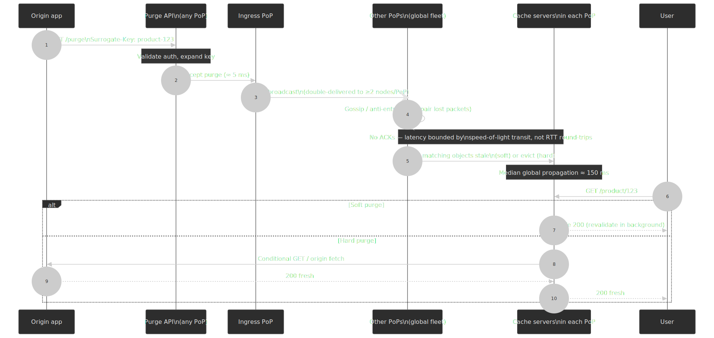

### Decision Matrix: Invalidation Strategies

| Strategy               | Freshness | Origin Protection | Complexity | Use Case                      |
| ---------------------- | --------- | ----------------- | ---------- | ----------------------------- |
| Hard purge             | Immediate | Poor              | Low        | Security incidents            |
| Soft purge             | 30s-5min  | Excellent         | Low        | Routine updates               |
| Versioned URLs         | Instant   | Excellent         | Medium     | Static assets                 |
| Stale-while-revalidate | Eventual  | Good              | Low        | HTML, API responses           |
| Cache tags             | Variable  | Variable          | High       | Complex content relationships |

## Origin Shielding and Tiered Caching

Origin shielding adds an intermediate cache layer between edge PoPs and origin. The goal: reduce origin load by consolidating cache misses.

### How Tiered Caching Works

Without shielding (2-tier):

```text
User → Edge PoP → Origin
```

100 PoPs × 100 misses = 10,000 origin requests.

With shielding (3-tier):

```text
User → Edge PoP → Origin Shield → Origin
```

100 PoPs × 100 misses → 1 shield request → 1 origin request.

**Design rationale:** Cache misses from multiple edge PoPs converge at a single shield PoP. The shield absorbs duplicate requests before they reach origin.


### Request Collapsing

Multiple simultaneous requests for the same uncached object are collapsed into a single origin request.

**Without collapsing:**
20 users request `/video/intro.mp4` simultaneously → 20 origin requests

**With collapsing:**
20 users request `/video/intro.mp4` simultaneously → 1 origin request, 19 users wait

**Interaction with shielding:** Up to 4 levels of request consolidation:

1. Browser cache (single user)
2. Edge PoP collapsing (per-PoP)
3. Shield collapsing (across PoPs)
4. Origin-level caching

### Real-World Tiered Architecture: Cloudflare

[Cloudflare's Regional Tiered Cache](https://developers.cloudflare.com/cache/how-to/tiered-cache/):

- Lower tier: User-facing edge PoPs (330+ cities)
- Upper tier: Regional shield PoPs (fewer locations, higher cache capacity, configurable per zone)
- Origin: Customer infrastructure

[Cache Reserve](https://developers.cloudflare.com/cache/advanced-configuration/cache-reserve/) sits behind the upper tier and provides persistent disk storage backed by R2 for long-tail content. RAM-cache eviction at the edge does not mean an origin fetch — Cache Reserve gives the object a second chance from disk.

### Google Media CDN Three-Layer Model

[Google's Media CDN](https://cloud.google.com/media-cdn/docs/overview) is structured for streaming workloads with extremely long-tail catalogues:

| Layer           | Location            | Purpose                                   |
| --------------- | ------------------- | ----------------------------------------- |
| Deep edge       | ISP networks        | Majority of traffic (popular content)     |
| Peering edge    | Google network edge | Mid-tier, connected to thousands of ISPs  |
| Long-tail cache | Google data centers | Origin shield for rarely-accessed content |

### Shield Location Selection

**Geographic proximity to origin:**

- Lower shield-to-origin latency
- Faster cache fills

**Network topology:**

- Shield in same region as majority of users
- Reduces inter-region traffic costs

**Trade-offs:**

- ✅ Shield in origin region: faster fills, simpler networking
- ✅ Shield in user region: better hit ratio for regional traffic patterns
- ❌ Single shield: single point of failure, capacity bottleneck

**Common pattern:** Multiple shields in different regions, edge PoPs route to nearest shield.

## Edge Compute

Edge compute executes custom logic at CDN PoPs, enabling personalization and security enforcement without origin round-trips.


### Platform Comparison

| Characteristic | Cloudflare Workers                                                                                                          | Lambda@Edge                                                                                                                                            | Fastly Compute                                                                                                  |
| -------------- | --------------------------------------------------------------------------------------------------------------------------- | ------------------------------------------------------------------------------------------------------------------------------------------------------ | --------------------------------------------------------------------------------------------------------------- |
| Runtime        | V8 isolates                                                                                                                 | Node.js / Python on AWS Lambda                                                                                                                         | WebAssembly via Wasmtime                                                                                        |
| Cold start     | Effectively 0 ms (pre-warmed during the TLS handshake; cold isolate creation is single-digit ms)[^cf-cold]                   | No traditional cold start at viewer triggers; pre-warmed at edge locations[^lambda-edge-restrictions]                                                  | Sub-millisecond Wasm instantiation per request[^fastly-cold]                                                    |
| Global PoPs    | 330+ cities[^cf-network]                                                                                                    | 750+ CloudFront PoPs (subset run Lambda@Edge)[^cf-feat]                                                                                                | ~80 PoPs[^fastly-net]                                                                                           |
| Memory limit   | 128 MB per isolate[^cf-limits]                                                                                              | 128 MB (viewer), up to 10,240 MB (origin)[^lambda-edge-restrictions]                                                                                   | 128 MB heap, 1 MB stack[^fastly-limits]                                                                         |
| Execution time | 30 s default, up to 5 min CPU per request on paid plans (I/O excluded)[^cf-limits]                                          | 5 s (viewer), 30 s (origin)[^lambda-edge-restrictions]                                                                                                 | 50 ms CPU per request, 2 min wall clock[^fastly-limits]                                                         |
| Languages      | JavaScript / TypeScript, plus anything compiled to Wasm[^cf-langs]                                                          | Node.js and Python only — Lambda@Edge does **not** support every Lambda runtime[^lambda-edge-restrictions]                                             | Officially Rust, JavaScript, Go SDKs; any WASI-compatible Wasm module[^fastly-sdk]                              |

### Cold Start Implications

**Cloudflare Workers** run as V8 isolates inside a shared process per PoP. The runtime [pre-warms the isolate during the TLS handshake](https://blog.cloudflare.com/eliminating-cold-starts-with-cloudflare-workers/) using the SNI from `ClientHello`, so the first request observes effectively zero cold-start latency; the underlying isolate creation itself is in the single-digit-ms range. Memory overhead per isolate is roughly an order of magnitude smaller than a full Node.js process[^cf-isolates].

**Lambda@Edge** runs on the same Lambda fleet but with [strict per-trigger limits](https://docs.aws.amazon.com/AmazonCloudFront/latest/DeveloperGuide/lambda-at-edge-function-restrictions.html): viewer-side functions get 128 MB / 5 s and 1 MB deployment package; origin-side functions get up to 10 GB / 30 s and 50 MB. Functions deploy from `us-east-1` and replicate out to PoPs that support Lambda@Edge — not every CloudFront PoP runs them. Plan for a non-trivial replication delay after deploys.

**Fastly Compute** instantiates a fresh WebAssembly sandbox per request via [Wasmtime](https://wasmtime.dev/). Sub-millisecond instantiation makes per-request isolation cheap; the security model is one-shot — no shared mutable state between requests unless you opt into Fastly's reusable-sandbox mode.

### Edge Compute Use Cases

**A/B testing at edge:**

```javascript
// Cloudflare Worker
addEventListener("fetch", (event) => {
  const bucket = Math.random() < 0.5 ? "A" : "B"
  const url = new URL(event.request.url)
  url.pathname = `/${bucket}${url.pathname}`
  event.respondWith(fetch(url))
})
```

No origin involvement—experiment assignment happens at edge.

**Personalization:**

- Geo-based content (currency, language)
- Device-based optimization (image sizing)
- User segment targeting (from cookie/header)

**Security:**

- Bot detection before origin
- Request validation/sanitization
- Rate limiting per client

### Trade-offs: Edge Compute vs. Origin Logic

| Factor       | Edge Compute                  | Origin Logic            |
| ------------ | ----------------------------- | ----------------------- |
| Latency      | 10-30ms                       | 100-400ms               |
| State access | Limited (KV, Durable Objects) | Full database access    |
| Debugging    | More complex (distributed)    | Standard tooling        |
| Cost         | Per-request pricing           | Per-compute pricing     |
| Capabilities | Constrained runtime           | Full language/framework |

**Decision guidance:**

- Edge: Request routing, simple transformations, caching decisions
- Origin: Business logic, database transactions, complex computations

## Signed URLs and Signed Cookies

Signed URLs and signed cookies move *authorisation* to the edge: the origin builds a short-lived, cryptographically signed token; the CDN verifies it on every request and rejects invalid or expired ones before any cache lookup or origin fetch. This is the standard pattern for paid video, large downloads, and any private object served from a CDN.

[CloudFront](https://docs.aws.amazon.com/AmazonCloudFront/latest/DeveloperGuide/private-content-signed-urls.html) supports **RSA-2048** and **ECDSA P-256** key pairs and, [as of April 2026](https://aws.amazon.com/about-aws/whats-new/2026/04/amazon-cloudfront-sha-256-signed-urls/), **SHA-256** as the signature hash (selected via `&Hash-Algorithm=SHA256`); SHA-1 remains the legacy default. Public keys live in **trusted key groups** (up to 4 groups per distribution, 5 keys per group) so that rotation is an IAM operation, not a distribution edit. Fastly uses [URL signing tokens](https://developers.fastly.com/reference/vcl/functions/cryptographic/digest-validate-token/) verified inside VCL or Compute@Edge; Cloudflare uses [signed exchanges and Workers `crypto.subtle`](https://developers.cloudflare.com/workers/examples/signed-request/) for the equivalent flow.

A signed-URL policy typically encodes:

- The exact resource (path or path prefix).
- An expiry timestamp.
- Optional client-IP CIDR restrictions.
- A key identifier (`Key-Pair-Id`) selecting which public key to verify against.

```http
GET /watch/123/segment-42.m4s
  ?Policy=<base64url(json)>
  &Signature=<base64url(rsa_sha256_sign(privkey, policy))>
  &Key-Pair-Id=K3D5EWEUDCCXON
```

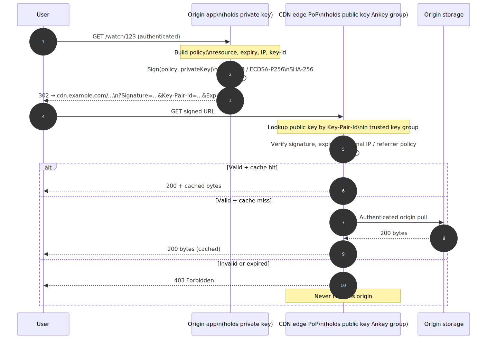
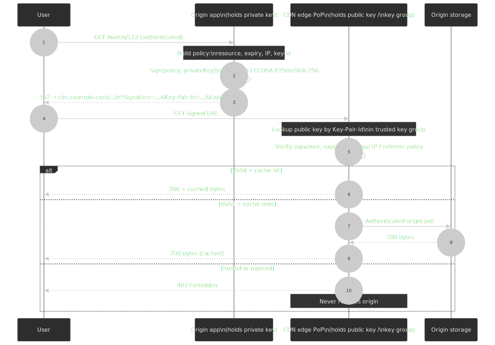

> [!CAUTION]
> Signed URLs **become part of the cache key by default**. A unique `Signature` per user fragments the cache and effectively defeats edge caching. Either:
>
> 1. Strip signing parameters from the cache key (CloudFront: `Cached HTTP query strings` allowlist; Cloudflare: `Custom Cache Key` config) so multiple users share a cached object.
> 2. Use signed cookies instead of signed URLs for long-lived sessions across many objects (one signature, many requests).
> 3. Combine: short-expiry signed cookies for the *session*, content-addressable URLs (`segment-42-<hash>.m4s`) for the *objects*.

## Transport: HTTP/3, TLS 1.3, and Edge Compression

Caching is only half the latency story; how bytes leave the PoP matters just as much.

**HTTP/3 over QUIC ([RFC 9114](https://www.rfc-editor.org/rfc/rfc9114), [RFC 9000](https://www.rfc-editor.org/rfc/rfc9000)).** QUIC removes head-of-line blocking at the transport layer, integrates TLS 1.3 into the handshake (1-RTT, optional 0-RTT for resumption), and survives IP/network changes via connection IDs — useful on mobile. Cloudflare, CloudFront, Fastly, and Akamai all terminate HTTP/3 at the edge and downgrade to HTTP/1.1 or HTTP/2 toward origin if origin lags. The edge gets the QUIC win even when origin doesn't.

**TLS 1.3 ([RFC 8446](https://www.rfc-editor.org/rfc/rfc8446)).** A full handshake is one round trip; a resumed session via PSK is 0-RTT. Anycast helps here twice — the handshake terminates at the closest PoP, and resumption tickets are PoP-affine, so a returning user usually re-lands on a PoP that already has their session.

**Brotli vs Zstandard at the edge.** Both [RFC 7932 (Brotli)](https://www.rfc-editor.org/rfc/rfc7932) and [RFC 8478 (Zstandard)](https://www.rfc-editor.org/rfc/rfc8478) are negotiated via `Accept-Encoding`. As of 2026, every Chromium-based browser and Firefox advertise `zstd`, and Cloudflare, Akamai, and Fastly negotiate it on the user-facing leg ([Cloudflare blog](https://blog.cloudflare.com/new-standards/), [Cloudflare docs](https://developers.cloudflare.com/speed/optimization/content/compression/)).

| Algorithm | Best at                              | Cost                       | Typical use at the edge                                                  |
| --------- | ------------------------------------ | -------------------------- | ------------------------------------------------------------------------ |
| `gzip`    | Universal compatibility              | Modest CPU                 | Fallback for ancient clients, origin-to-edge for legacy origins.         |
| `br`      | Best ratio on text (HTML, JS, CSS)   | High CPU at level 11       | Pre-compressed static assets at build time, served verbatim from cache.  |
| `zstd`    | Best speed-for-ratio, dictionaries   | Low CPU, fast decompress   | Dynamic responses, JSON APIs, edge-compressed-on-the-fly content.        |

Negotiation order matters: serve `br` for cache-eligible static text where the asset is pre-compressed at build time, `zstd` for dynamic responses compressed at the edge, and `gzip` only as a fallback. Both `br` and `zstd` support **shared / custom dictionaries** ([Compression Dictionary Transport draft](https://datatracker.ietf.org/doc/draft-ietf-httpbis-compression-dictionary/)) which, for repetitive payloads like JSON APIs or versioned bundles, can [reduce wire size by an order of magnitude](https://httptoolkit.com/blog/dictionary-compression-performance-zstd-brotli/).

> [!WARNING]
> If you `Vary: Accept-Encoding`, every distinct `Accept-Encoding` string fragments your cache. Normalise the header at the edge — collapse `gzip, deflate, br, zstd` into one of `{br, zstd, gzip, identity}` *before* it becomes part of the cache key.

## Video and Large-Object Caching

Streaming traffic dominates global CDN bytes (Netflix, YouTube, TikTok, live sports), and segment-based protocols like [HLS](https://datatracker.ietf.org/doc/html/rfc8216) and [MPEG-DASH](https://www.iso.org/standard/79329.html) interact with the cache layer in non-obvious ways.

- **Manifest vs segment TTLs differ by an order of magnitude.** The `.m3u8` / `.mpd` manifest in a live stream is rewritten every few seconds and must be cached for `1`–`5` s with `stale-while-revalidate`; segments are content-addressable and can be cached for hours or days. Caching the manifest as long as the segments breaks live latency.
- **Per-bitrate fan-out multiplies cache footprint.** A single title at 5 ABR ladders × 3 codecs × 2 audio tracks is 30 distinct objects per segment. Tier-2 shielding pays here because most viewers cluster on 2–3 popular ladders, but the long-tail ladders still need a place to live — Cloudflare's Cache Reserve and Google Media CDN's long-tail tier exist for exactly this.
- **Range requests must be supported end-to-end.** Players seek mid-segment using HTTP `Range`. CDNs cache by `(URL, Range)` or split objects into fixed-size chunks (Cloudflare's [`cf-cache-status: HIT (range)`](https://developers.cloudflare.com/cache/concepts/cache-responses/), Fastly's segmented caching) so that a seek doesn't refetch the whole segment.
- **DRM-licensed segments are still cacheable.** The license is fetched once per session from a license server (not the CDN); the encrypted segments themselves are byte-identical across users and cache normally.
- **Origin shielding amplifies value for sports / VOD launches.** A new episode drop or kick-off triggers a synchronised stampede; tiered caching plus request collapsing at the shield is the difference between origin surviving and origin melting.

## Multi-CDN Strategies

Multi-CDN distributes traffic across multiple CDN providers for availability, performance, and vendor diversification.

### Architecture Patterns

**Primary/Backup:**

```text
Traffic → Primary CDN (100%) → Origin
                ↓ (on failure)
         Backup CDN (failover)
```

**Active-Active:**

```text
Traffic → Load Balancer → CDN A (50%)  → Origin
                       → CDN B (50%)
```

**Performance-Based:**

```text
Traffic → DNS/Traffic Manager → Fastest CDN for user region → Origin
```

### Health Checking Strategy

Multi-level health checks required:

1. **DNS resolution:** Can we resolve the CDN endpoint?
2. **Network connectivity:** Can we reach the PoP?
3. **HTTP response:** Is the CDN returning expected status codes?
4. **Content integrity:** Is the response content correct (hash check)?
5. **Performance:** Is latency within acceptable bounds?

**Check frequency:** Every 10-30 seconds from multiple geographic locations.

### Failover Timing

| Check Type        | Failure Detection       | Full Failover |
| ----------------- | ----------------------- | ------------- |
| DNS-based         | 30-60s (DNS TTL)        | 1-5 minutes   |
| Anycast           | <1s (BGP)               | 10-30 seconds |
| Active monitoring | 10-30s (check interval) | 30-60 seconds |

### Trade-offs

- ✅ 99.999% availability (single CDN: 99.9% typical)
- ✅ Performance optimization per region
- ✅ Vendor negotiation leverage
- ❌ Cache fragmentation (content split across CDNs)
- ❌ Operational complexity (multiple dashboards, APIs, configs)
- ❌ Cost overhead (management layer + multiple CDN contracts)

**Real-world:** Major streaming platforms (Disney+, HBO Max) use multi-CDN with intelligent traffic steering. Fallback happens within seconds of degradation detection.

## Failure Modes and Edge Cases

### Cache Stampede (Thundering Herd)

**Scenario:** A popular cache entry expires. Thousands of simultaneous requests all see a cache miss and hit the origin in parallel. The classic literature traces back to Facebook's 2010 [memcache leases work](https://research.facebook.com/publications/scaling-memcache-at-facebook/) (USENIX NSDI 2013) and the [`probabilistic-early-recomputation` algorithm](https://cseweb.ucsd.edu/~avattani/papers/cache_stampede.pdf) by Vattani et al.

**Worked example.** Suppose a homepage fragment normally has a 98 % cache hit ratio at 1 M requests/min. Origin sees ~20 k requests/min. The fragment expires globally at the same instant; the next minute every request is a miss until the new copy is cached. Origin sees ~50× its baseline load, often enough to push it past its tail-latency cliff.

**Mitigations:**

1. **Request collapsing.** The CDN coalesces identical concurrent misses into a single origin request — see Fastly's [request collapsing](https://www.fastly.com/documentation/guides/concepts/edge-state/cache/request-collapsing/) and Cloudflare's [origin coalescing](https://developers.cloudflare.com/cache/concepts/cache-behavior/#concurrent-streaming-acceleration).
2. **Probabilistic early expiration.** Refresh a fraction of requests *before* the TTL fires; the [XFetch algorithm](https://cseweb.ucsd.edu/~avattani/papers/cache_stampede.pdf) is the canonical formulation.
3. **Stale-while-revalidate.** Serve stale during background refresh.
4. **Origin headroom.** Provision enough origin capacity to absorb the miss spike, or rate-limit at the CDN with a custom error page.

### Cache Poisoning

**Attack vector:**

1. Attacker sends a request with malicious headers or parameters.
2. Origin returns an error or malformed response based on that input.
3. CDN caches the poisoned response.
4. All subsequent users receive the poisoned content.

**Cache-Poisoned Denial of Service (CPDoS).** Introduced by [Nguyen, Lo Iacono, and Federrath at CCS 2019](https://dl.acm.org/doi/10.1145/3319535.3354215) (project page: [cpdos.org](https://cpdos.org/)). The paper identified three families:

- **HTTP Header Oversize (HHO)** — exceed origin's max header size while staying inside the cache's limit.
- **HTTP Meta Character (HMC)** — slip `\n`, `\r`, or `\0` past the cache so the origin rejects the request.
- **HTTP Method Override (HMO)** — coerce the origin into a method it cannot handle via `X-HTTP-Method-Override` and friends.

In each case the origin's error page (e.g. 400 / 403 / 500) gets cached against the original benign URL. [Cloudflare's response post](https://blog.cloudflare.com/cloudflare-response-to-cpdos-exploits/) describes how its WAF mitigates HHO and HMO.

**Prevention:**

1. Normalize cache keys: strip unexpected headers and params before caching.
2. Do not cache errors: `Cache-Control: no-store` on 4xx/5xx, or restrict cacheable status codes to 200/203/204/206/300/301/404 per RFC 9111.
3. Constrain `Vary`: never vary on attacker-controllable inputs (`User-Agent`, arbitrary custom headers).
4. Use a WAF or edge worker to reject malformed requests before they reach the cache layer.

### Origin Overload During Purge

**Scenario:** Global purge of popular content. All PoPs simultaneously request fresh content.

**If normal cache hit ratio is 98%:**

- 1,000,000 requests/minute normally
- 20,000 reach origin (2% miss rate)
- After purge: 1,000,000 requests hit origin
- 50× load spike

**Mitigations:**

1. **Soft purge:** Serve stale while one request refreshes
2. **Regional rollout:** Purge one region at a time
3. **Warm cache first:** Pre-populate cache before purge propagates
4. **Origin autoscaling:** Prepare for post-purge spike

### BGP Route Flapping (Anycast)

**Scenario:** BGP route oscillates between PoPs. User connections reset on each flip.

**Impact:**

- TCP connections interrupted
- TLS sessions terminated
- Long-lived connections (WebSocket, streaming) fail

**Mitigations:**

1. **BGP dampening:** Suppress unstable routes
2. **Session persistence:** Use DNS-based routing for stateful connections
3. **Anycast for UDP:** DNS, some video streaming
4. **Unicast for TCP:** Long-lived connections

## Real-World CDN Implementations

### Netflix Open Connect

**Scale:** [18,000+ Open Connect Appliances (OCAs) deployed across 175 locations and 1,000+ ISPs globally](https://openconnect.netflix.com/Open-Connect-Briefing-Paper.pdf).

**Architecture:**

- **Control plane:** runs in AWS (metadata, routing decisions, manifest generation).
- **Data plane:** OCAs sit inside ISP networks and serve the content bytes.

**Key design decisions:**

1. **Push model with predictive fill.** Catalogue placement is decided ahead of viewing demand. Popular titles are pre-positioned to OCAs during off-peak fill windows so peak-hour requests serve from the closest cache. See the [Open Connect overview](https://openconnect.netflix.com/Open-Connect-Overview.pdf).

2. **ISP embedding.** OCAs are physically deployed inside ISP networks (and at IXPs as a fallback), so streaming traffic stays on the ISP's own network and never traverses paid peering or transit.

3. **Content-addressable storage.** Each encode is a separate file with a content-derived name, so TTLs are effectively infinite — a new encode is a new URL. No invalidation needed.

**Outcome:** A 2022 [Analysys Mason report commissioned by Netflix](https://www.analysysmason.com/consulting/reports/netflix-open-connect/) estimated that Open Connect plus codec efficiency improvements saved ISPs **over $1 billion globally in 2021**. Netflix's own [Briefing Paper](https://openconnect.netflix.com/Open-Connect-Briefing-Paper.pdf) cites $1.2 B in 2020.

### Cloudflare

**Scale:** [330+ cities across 125+ countries](https://www.cloudflare.com/network/), [500+ Tbps of network capacity (Apr 2026)](https://blog.cloudflare.com/500-tbps-of-capacity/), 95% of the internet-connected population within ~50 ms of a Cloudflare data centre[^cf-investor].

**Architecture:**

1. **Full Anycast.** Every PoP announces the same IP ranges. No single point of failure; DDoS traffic is absorbed at the nearest PoP rather than concentrated.

2. **Tiered cache with Cache Reserve:**
   - L1: edge PoP RAM cache (hot content)
   - L2: regional upper-tier cache (consolidates misses)
   - L3: [Cache Reserve](https://developers.cloudflare.com/cache/advanced-configuration/cache-reserve/) on R2 (long-tail persistence)

3. **Workers at every PoP.** Edge compute runs on the same servers as caching, so the compute-to-cache hop is zero network distance.

**Design rationale:** Cloudflare optimises for developer experience (Workers, KV, Durable Objects) and security (DDoS absorbed by Anycast). Caching is the foundation but no longer the only value prop.

### Akamai

**Scale:** [4,400+ edge PoPs across 130+ countries, 1,200+ networks, 1+ Pbps of edge capacity](https://www.akamai.com/why-akamai/global-infrastructure).

**Architecture:**

1. **Deep ISP embedding:** Servers deployed inside ISP networks, not just at peering points. 1-2 network hops from end users.

2. **Dynamic Site Acceleration:** Not just static caching—TCP optimization, route optimization, prefetching for dynamic content.

3. **EdgeWorkers:** JavaScript at edge for personalization without origin round-trips.

**Design rationale:** Akamai prioritizes latency above all. Deep ISP deployment means lower hop counts than competitors, critical for real-time applications (gaming, financial services).

### Comparison Summary

| Aspect               | Netflix Open Connect    | Cloudflare              | Akamai              |
| -------------------- | ----------------------- | ----------------------- | ------------------- |
| Deployment model     | ISP-embedded appliances | Anycast PoPs            | ISP-embedded + PoPs |
| Primary optimization | Bandwidth cost          | Security + developer UX | Latency             |
| Caching model        | Push (predictive)       | Pull + tiered           | Pull + DSA          |
| Edge compute         | N/A                     | Workers (V8)            | EdgeWorkers (JS)    |
| Content type         | Video (single tenant)   | General purpose         | General purpose     |

## Monitoring and Observability

### Key Metrics

**Cache Hit Ratio (CHR):**

```text
CHR = (Cache Hits) / (Cache Hits + Cache Misses) × 100
```

**Target ranges:**

- Static-heavy sites: 85-95%
- Dynamic sites: 50-70%
- API endpoints: 30-60% (if cacheable at all)

**Warning:** "CHR" can be misleading. Clarify:

- Edge hit ratio vs. shield hit ratio vs. origin hit ratio
- Bytes vs. requests
- Cacheable vs. all traffic

**Time to First Byte (TTFB):**

| Source           | Typical Range | Target |
| ---------------- | ------------- | ------ |
| Edge cache hit   | 10-50ms       | <50ms  |
| Shield cache hit | 50-150ms      | <100ms |
| Origin fetch     | 200-500ms     | <300ms |

**Bandwidth Offload:**

```text
Offload = (Bytes served from cache) / (Total bytes served) × 100
```

Different from CHR—a single large video hit offloads more bandwidth than thousands of small image hits.

### Alerting Thresholds

| Metric             | Warning      | Critical      |
| ------------------ | ------------ | ------------- |
| CHR drop           | >5% decrease | >15% decrease |
| Origin 5xx rate    | >0.1%        | >1%           |
| Edge latency p95   | >100ms       | >500ms        |
| Origin latency p95 | >500ms       | >2s           |

### Cache Key Debugging

When hit ratio drops unexpectedly:

1. **Check Vary headers:** New `Vary` header = cache fragmentation
2. **Query string changes:** New tracking params in URLs?
3. **Cache key config changes:** Host normalization removed?
4. **Content changes:** More dynamic content being served?
5. **Traffic pattern shift:** New geography, different popular content?

## Conclusion

CDN architecture centers on three fundamental trade-offs — freshness vs. latency (TTL selection), granularity vs. efficiency (cache key design), and origin protection vs. complexity (tiered caching) — but the surface area is larger than caching alone. The same PoPs terminate TLS 1.3 / HTTP/3, run Maglev-style L4 hashing for connection persistence, negotiate Brotli or Zstandard, verify signed URLs, gossip purges in under 150 ms, and execute edge compute in the gap left by the TLS handshake.

For static assets, use versioned URLs with long TTLs — invalidation becomes a non-problem. For dynamic content, layer `stale-while-revalidate` with short `s-maxage` to balance freshness with origin protection. For private content, sign at origin and verify at the edge, but normalise signing parameters out of the cache key. Always enable request collapsing and consider origin shielding when operating at scale.

The real-world implementations from Netflix, Cloudflare, and Akamai demonstrate that architectural choices depend heavily on what you're optimising for: bandwidth cost (Netflix's push model), security and developer experience (Cloudflare's Anycast + Workers), or raw latency (Akamai's deep ISP embedding).

## Appendix

### Prerequisites

- HTTP caching fundamentals (Cache-Control headers, ETags)
- DNS resolution basics
- TCP/IP networking concepts
- Basic understanding of distributed systems

### Summary

- **Request routing:** Anycast for fast failover and DDoS absorption; DNS-based for granular policy. Inside the PoP, Maglev-style consistent hashing keeps flows on the same backend without shared state.
- **Cache keys:** Normalize aggressively, vary minimally — every variation fragments cache. Strip signing parameters from the key for signed URLs.
- **TTL strategy:** Layer browser and CDN TTLs; use `stale-while-revalidate` for HTML. Manifest TTLs ≪ segment TTLs for video.
- **Invalidation:** Versioned URLs for assets, soft purge for content, cache tags / surrogate keys for relationships. Surrogate-Key/Control are vendor headers, not RFCs.
- **Origin protection:** Tiered caching + request collapsing can reduce origin load 10–100×; Cache Reserve / long-tail tiers prevent eviction-induced misses from reaching origin.
- **Edge compute:** Use for routing, personalisation, security — not business logic. Isolates / Wasm sandboxes warm up inside the TLS handshake, so cold start is effectively zero.
- **Transport:** HTTP/3 + TLS 1.3 at the edge regardless of origin support; negotiate `zstd` for dynamic, pre-compressed `br` for static.

### References

- [RFC 9111: HTTP Caching](https://www.rfc-editor.org/rfc/rfc9111) — authoritative HTTP caching specification.
- [RFC 5861: HTTP Cache-Control Extensions for Stale Content](https://datatracker.ietf.org/doc/html/rfc5861) — `stale-while-revalidate`, `stale-if-error`.
- [RFC 9114: HTTP/3](https://www.rfc-editor.org/rfc/rfc9114) and [RFC 9000: QUIC](https://www.rfc-editor.org/rfc/rfc9000) — modern transport for edge delivery.
- [RFC 8446: TLS 1.3](https://www.rfc-editor.org/rfc/rfc8446) — handshake, 0-RTT resumption used by edge terminators.
- [RFC 7932: Brotli](https://www.rfc-editor.org/rfc/rfc7932) and [RFC 8478: Zstandard](https://www.rfc-editor.org/rfc/rfc8478) — content-encoding negotiated at the edge.
- [W3C Edge Architecture Note (2001)](https://www.w3.org/TR/edge-arch) — origin of `Surrogate-Key` and `Surrogate-Control` (never standardised as RFCs).
- [IETF CDNI working group](https://datatracker.ietf.org/wg/cdni/) — RFC 7336 framework, RFC 8006 metadata, RFC 8007/`8007bis` triggers, RFC 9808 capacity advertisement, edge-control-metadata draft.
- [Eisenbud et al. — Maglev: A Fast and Reliable Software Network Load Balancer (NSDI '16)](https://research.google/pubs/maglev-a-fast-and-reliable-software-network-load-balancer/) — consistent hashing for L4 load balancing.
- [Cloudflare — Unimog: Cloudflare's edge load balancer (Maglev variant)](https://blog.cloudflare.com/high-availability-load-balancers-with-maglev/) — production-scale Maglev implementation.
- [Cloudflare CDN Reference Architecture](https://developers.cloudflare.com/reference-architecture/architectures/cdn/) — tiered caching, Cache Reserve design.
- [Fastly — Building a Fast and Reliable Purging System (Powderhorn)](https://www.fastly.com/blog/building-fast-and-reliable-purging-system) and [Instant Purge: under 150 ms for over a decade](https://www.fastly.com/blog/fastly-instant-purge-under-150ms-for-over-a-decade).
- [Fastly Caching Documentation](https://www.fastly.com/documentation/guides/concepts/edge-state/cache/) — request collapsing, surrogate keys.
- [Netflix Open Connect Overview](https://openconnect.netflix.com/Open-Connect-Overview.pdf) — ISP embedding, predictive fill.
- [Nguyen, Lo Iacono, Federrath — *Your Cache Has Fallen* (CCS '19)](https://dl.acm.org/doi/10.1145/3319535.3354215) — original CPDoS paper.
- [Vattani et al. — Optimal Probabilistic Cache Stampede Prevention](https://cseweb.ucsd.edu/~avattani/papers/cache_stampede.pdf) — XFetch algorithm.
- [CloudFront signed URLs / cookies](https://docs.aws.amazon.com/AmazonCloudFront/latest/DeveloperGuide/private-content-signed-urls.html) and [trusted key groups](https://docs.aws.amazon.com/AmazonCloudFront/latest/DeveloperGuide/private-content-trusted-signers.html).
- [Web Caching Explained (web.dev)](https://web.dev/articles/http-cache) — browser caching interaction with CDN.

### Footnotes

[^cf-cold]: Cloudflare blog: [*Eliminating cold starts with Cloudflare Workers*](https://blog.cloudflare.com/eliminating-cold-starts-with-cloudflare-workers/). The runtime decodes the SNI from `ClientHello` and starts the isolate while the TLS handshake completes, so the first request observes effectively zero cold-start latency.
[^cf-isolates]: Cloudflare developer docs: [*How Workers works*](https://developers.cloudflare.com/workers/reference/how-workers-works/) on V8 isolates and per-isolate memory characteristics.
[^cf-network]: [Cloudflare network page](https://www.cloudflare.com/network/) and [the 2025 Radar Year in Review](https://blog.cloudflare.com/radar-2025-year-in-review/).
[^cf-feat]: [Amazon CloudFront features](https://aws.amazon.com/cloudfront/features/) and [AWS Global Infrastructure](https://aws.amazon.com/about-aws/global-infrastructure/).
[^cf-limits]: Cloudflare developer docs: [*Workers Platform Limits*](https://developers.cloudflare.com/workers/platform/limits/).
[^cf-langs]: Cloudflare developer docs: [*Languages*](https://developers.cloudflare.com/workers/languages/) (JavaScript, TypeScript, plus Wasm modules from Rust, C, C++, Go).
[^cf-investor]: Cloudflare [Q3 2025 Investor Presentation](https://cloudflare.net/files/doc_financials/2025/q3/Q3-2025-NET-Investor-Presentation.pdf).
[^lambda-edge-restrictions]: AWS docs: [*Restrictions on Lambda@Edge*](https://docs.aws.amazon.com/AmazonCloudFront/latest/DeveloperGuide/lambda-at-edge-function-restrictions.html) and the linked [CloudFront and Lambda@Edge quotas](https://docs.aws.amazon.com/AmazonCloudFront/latest/DeveloperGuide/cloudfront-limits.html#limits-lambda-at-edge).
[^fastly-cold]: Fastly blog: [*How Compute is tackling serverless cold starts*](https://www.fastly.com/blog/how-compute-edge-is-tackling-the-most-frustrating-aspects-of-serverless).
[^fastly-net]: [Fastly network map](https://www.fastly.com/network-map).
[^fastly-limits]: Fastly docs: [*Compute resource limits*](https://docs.fastly.com/products/compute-resource-limits).
[^fastly-sdk]: Fastly docs: [*Compute language SDKs*](https://www.fastly.com/documentation/reference/compute/sdks/) — officially Rust, JavaScript, and Go; any WASI-compatible Wasm module also runs.

### Terminology

- **PoP (Point of Presence):** Physical location with CDN servers.
- **CHR (Cache Hit Ratio):** Percentage of requests served from cache.
- **TTL (Time to Live):** Duration content remains fresh in cache.
- **Origin Shield / Tiered Cache:** Intermediate cache layer that consolidates edge misses before origin.
- **Anycast:** Routing technique where a single IP is announced from multiple locations and BGP picks the topologically nearest.
- **BGP (Border Gateway Protocol):** Protocol for routing between autonomous systems.
- **Maglev hashing:** Consistent-hash scheme used by L4 load balancers for connection persistence without shared state.
- **Surrogate Key / Surrogate-Control:** Vendor headers (Edge Architecture, W3C 2001) for group cache invalidation; not IETF RFCs.
- **CDNI:** IETF Content Delivery Networks Interconnection working group, defining CDN-to-CDN metadata, control, and footprint exchange.
- **HLS / MPEG-DASH:** Segment-based adaptive bitrate streaming protocols whose manifest and segment caching policies must differ.
