# Circuit Breaker Patterns for Resilient Systems

A circuit breaker wraps every dependency call so that a slow or failing dependency stops being able to consume the caller's resources. The point is mechanical: convert slow failures into fast failures so caller threads, sockets, and connection pool slots are returned promptly. This article works through the state machine, the detection and isolation choices, the configuration math behind production incidents (Shopify Semian, Netflix Hystrix), and the modern critique — from Marc Brooker and the AWS Builders' Library — that argues the pattern is the wrong answer for most cell-based and sharded architectures and should be replaced by adaptive concurrency control.




## Why the pattern exists

Without a circuit breaker, a slow dependency cascades upward. The mechanism is easy to derive from Little's Law (\(L = \lambda W\)): if requested-arrival-rate \(\lambda\) holds steady but per-request hold-time \(W\) jumps, the in-flight count \(L\) grows until the caller exhausts threads, file descriptors, or connection-pool slots. The caller becomes slow, which makes *its* callers slow, and so on.

```text
Database degrades to 10s response time

Service A
├─ Pool: 100 worker threads
├─ Per-request hold time was 50 ms, now 10 s (200×)
└─ New steady-state capacity: 100 threads / 10 s ≈ 10 req/s
   (down from ~2,000 req/s before)

Service A's callers now wait on Service A → cascade upstream.
```

Naive retries make the picture worse. A 3× retry budget triples load on a dependency that is already failing under its current load, deepening the failure[^aws-retries]:

```text
Healthy: 100 req/s offered, 100 req/s succeed
Failing: 100 req/s offered × 3 retries = 300 req/s offered
         → more failures → more retries → metastable failure mode
```

The standard reference for that metastable feedback loop is Marc Brooker's [_Metastability and Distributed Systems_](https://brooker.co.za/blog/2021/05/24/metastable.html). Circuit breakers are one mechanism for breaking the loop; token-bucketed retry throttling is another, and the two compose.

## State machine

The breaker is a finite state machine. The three normal states — Closed, Open, Half-Open — were introduced in Michael Nygard's _Release It!_[^nygard], which remains the canonical software reference for the pattern (Nygard adapted it from electrical fuse design). Resilience4j adds three operational overrides on top — `METRICS_ONLY`, `DISABLED`, `FORCED_OPEN` — that are convenience hooks for ops, not part of the steady-state machine[^r4j-docs]. Older libraries usually stop at the three normal states.

### Closed

Requests pass through. Each outcome is recorded in a sliding window. The breaker only evaluates the failure rate when the window has accumulated `minimumNumberOfCalls` outcomes — Resilience4j defaults this to 100, which prevents a cold breaker from tripping on the first one or two failures during warm-up[^r4j-docs].

```ts title="closed-state.ts"
type WindowedStats = {
  failures: number
  total: number
}

function recordOutcome(stats: WindowedStats, success: boolean): WindowedStats {
  return {
    failures: stats.failures + (success ? 0 : 1),
    total: stats.total + 1,
  }
}

function shouldTrip(stats: WindowedStats, minCalls: number, threshold: number): boolean {
  if (stats.total < minCalls) return false
  return stats.failures / stats.total >= threshold
}
```

Volume threshold matters operationally. A breaker that can open on 2-of-2 failures will flap on every blip — both Hystrix and Resilience4j ship a minimum-volume gate by default.

### Open

Every call is rejected without touching the dependency. Resilience4j throws `CallNotPermittedException`; Hystrix routes to the fallback. The point is to (a) preserve caller resources while the dependency is unhealthy and (b) give the dependency time to recover without retry-storm pressure.

The breaker stays Open for `waitDurationInOpenState` (Resilience4j defaults to 60 s; Hystrix to 5 s; tune for the dependency's typical recovery time)[^r4j-docs][^hystrix-config].

### Half-Open

After the wait expires, the breaker admits a bounded number of probe requests. The classic Hystrix design admitted a single probe; Resilience4j admits `permittedNumberOfCallsInHalfOpenState` (default 10) and re-evaluates the failure rate on that probe set[^r4j-docs].

A single probe is a noisy signal — one network blip and the breaker re-trips for another full wait window. Multiple probes give a small but useful statistical sample.

> [!IMPORTANT]
> Probe timeouts must be much shorter than normal request timeouts. This is the single most common circuit-breaker misconfiguration; the next section walks through Shopify's worked example.

## Per-request flow

The runtime view of the breaker. Every call passes through the admission decision (state + permit), then either invokes the dependency and updates the window or skips straight to the fallback.

 with a bulkhead permit; the post-call branch updates the window and may trip the breaker for the next request.")


## Detection strategies

### Count-based sliding window

Track outcomes from the last `N` calls in a circular array. Resilience4j stores three integers per measurement (failed / slow / total counts) and one long for total duration, and maintains a pre-aggregated total so snapshot retrieval is O(1)[^r4j-docs].

```text
Window size: 10
Failure threshold: 50%
Outcomes: [✓ ✗ ✓ ✗ ✗ ✗ ✓ ✗ ✗ ✓]   →  6/10 failures = 60%   →  trip
```

Best when call rate is roughly steady. A risk: under low traffic the window can span minutes or hours, so old failures keep voting on the present.

### Time-based sliding window

Aggregate per-second buckets covering the last `N` seconds. Memory is O(window seconds) regardless of call volume; per-call work is O(1)[^r4j-docs].

```text
Window: 10s   Threshold: 50%
Calls in window: 100   Failures: 60   →  60% → trip
```

Best when traffic is bursty or follows a daily curve. The minimum-call gate still applies, otherwise a low-traffic minute can trip the breaker on a 1-of-2 sample.




### Resilience4j configuration in one place

```java title="CircuitBreakerConfig.java"
CircuitBreakerConfig config = CircuitBreakerConfig.custom()
    .slidingWindowType(SlidingWindowType.COUNT_BASED)  // or TIME_BASED
    .slidingWindowSize(100)                            // default 100
    .minimumNumberOfCalls(20)                          // default 100; lower for low-traffic paths
    .failureRateThreshold(50)                          // default 50%
    .slowCallRateThreshold(50)                         // default 100%
    .slowCallDurationThreshold(Duration.ofSeconds(2))  // default 60s
    .waitDurationInOpenState(Duration.ofSeconds(30))   // default 60s
    .permittedNumberOfCallsInHalfOpenState(10)         // default 10
    .automaticTransitionFromOpenToHalfOpenEnabled(true)
    .recordExceptions(IOException.class, TimeoutException.class)
    .ignoreExceptions(BusinessException.class)
    .build();
```

Defaults sourced from the [Resilience4j CircuitBreaker config table](https://resilience4j.readme.io/docs/circuitbreaker)[^r4j-docs]. Note that defaults are tuned for high-traffic services; for low-traffic paths you almost always want `minimumNumberOfCalls` well below 100.

### Slow-call detection

Resilience4j can trip on the rate of slow calls before they fail outright. A database under load typically responds slowly before timing out, so opening on slowness preserves caller resources earlier in the failure curve[^r4j-docs].

## Isolation models

Isolation determines whether a slow dependency can hold the caller's threads.

### Thread-pool isolation (Hystrix default)

Each `HystrixCommand` ran on a dedicated `ThreadPoolExecutor`. Calls were submitted as `Future`s and the parent thread blocked on `Future.get(timeout)`, so timeouts could be enforced even when the underlying client library ignored interrupts[^hystrix-howitworks].

The cost, measured by Netflix on a single API instance running one command at 60 rps:

| Percentile | Overhead vs. direct call |
| ---------: | :----------------------- |
| p50 (and lower) | 0 ms (no measurable cost) |
| p90 | ~3 ms |
| p99 | ~9 ms |

> "Netflix, in designing this system, decided to accept the cost of this overhead in exchange for the benefits it provides and deemed it minor enough to not have major cost or performance impact."
> — [Hystrix Wiki: How it Works](https://github.com/Netflix/Hystrix/wiki/How-it-Works)

Netflix ran each API instance with 40+ thread pools at 5–20 threads each (mostly 10), and that instance shape served ~10 billion `HystrixCommand` invocations per day[^hystrix-howitworks]. The trade-offs:

- Strong isolation — slow dependency A can't steal threads earmarked for B.
- Hard timeout enforcement — `Future.get(timeout)` interrupts the wait even if the client library doesn't cooperate (the underlying thread may still be hot, but the caller is freed).
- Concurrency cap — the pool size doubles as a per-dependency bulkhead.

…against:

- ~3–9 ms overhead at p90/p99.
- Pool sizing becomes an operational discipline, not a config detail.
- Memory: O(pools × pool size) threads.

### Semaphore isolation

A counter limits concurrency; the call runs on the caller's thread.

```ts title="semaphore-isolation.ts"
class Semaphore {
  private permits: number
  constructor(maxConcurrent: number) {
    this.permits = maxConcurrent
  }

  async execute<T>(fn: () => Promise<T>): Promise<T> {
    if (this.permits <= 0) throw new Error("CallNotPermitted")
    this.permits--
    try {
      return await fn()
    } finally {
      this.permits++
    }
  }
}
```

Pros: no handoff cost, sub-millisecond overhead, trivial to reason about. Cons: no enforced timeout — if the call hangs, the calling thread hangs with it; an upstream `Thread.interrupt()` is the only escape, and most HTTP clients don't honour it[^hystrix-howitworks].

Hystrix exposes both via `execution.isolation.strategy=THREAD|SEMAPHORE`. Netflix recommends thread isolation by default and semaphores only for "extremely high-volume" calls — typically in-memory caches that return in sub-millisecond times — where the per-call thread cost dominates the call itself[^hystrix-howitworks].

### When to pick which

| Factor                   | Thread pool                  | Semaphore                            |
| :----------------------- | :--------------------------- | :----------------------------------- |
| Dependency reliability   | Unreliable; may hang         | Reliable; predictable latency        |
| Timeout enforcement      | Required                     | Network-layer timeout is sufficient  |
| Per-call latency budget  | Can absorb 3–9 ms            | Sub-millisecond required             |
| Volume per dependency    | < 1k req/s/instance          | > 1k req/s/instance                  |
| Call type                | Network I/O                  | In-process / in-memory               |

### Bulkhead vs. circuit breaker

These are separate roles that compose:

- **Bulkhead** — caps concurrent calls (a thread pool, a semaphore, a connection pool). Limits the *blast radius* when one dependency goes wrong.
- **Circuit breaker** — measures dependency health and decides when to *stop calling*.

A bulkhead alone won't stop the slow dependency from filling its 20 reserved threads with hung requests; a circuit breaker alone won't stop a healthy dependency from monopolising a shared pool. The combination — a per-dependency bulkhead inside a per-dependency breaker — is the standard production layout.

## Scoping: per-service or per-host?

### Per-service (one breaker per logical dependency)

Simple and easy to reason about. The drawback shows up under client-side load balancing: one bad backend instance is diluted by the healthy ones, so the global failure rate may stay below the threshold even when ~33% of requests are failing.

```text
3 backend instances, 1 unhealthy
Per-service breaker observes: ~33% failures (below typical 50% threshold)
Result: breaker stays Closed, 33% of requests fail continuously
```

### Per-host (one breaker per backend instance)

Each instance carries its own breaker, fed by per-instance metrics. A single bad host trips its own breaker; traffic shifts to the healthy hosts via the load balancer.

The cost is operational: more breaker state to manage, tighter coupling with service discovery, and per-host health to surface in dashboards. Most production systems combine the two — per-host breakers for instance-level failures and a per-service breaker as a backstop for service-wide outages.

> [!TIP]
> If your service mesh (Envoy, Istio, Linkerd) already does outlier detection and per-endpoint ejection, that mechanism is closer to a per-host breaker than to anything in the application library. Don't double up; pick the layer.

## The Shopify Semian case study

Shopify's [_Your Circuit Breaker is Misconfigured_](https://shopify.engineering/circuit-breaker-misconfigured) (Feb 2020) is the canonical worked example of how a "correct-looking" circuit-breaker config can keep your service in a permanent oscillation. Semian has been running in Shopify production since October 2014[^semian-readme]; this post is the operational lesson learned along the way.

The setup: a single Rails worker with **2 threads**, talking to **42 Redis instances** each protected by its own circuit. Initial config:

```ruby
Semian.register(
  :redis_cache,
  bulkhead: true,
  circuit_breaker: true,
  error_threshold: 3,                # 3 errors in window → Open
  error_timeout: 2,                  # 2 s in Open before Half-Open
  success_threshold: 2,              # 2 consecutive Half-Open successes → Close
  half_open_resource_timeout: 0.25,  # same as service timeout
)
```

When all 42 Redis instances are unhealthy, the worker spends most of its time waiting for the per-call 250 ms timeout. Plugging the parameters into [the Circuit Breaker Equation](https://shopify.engineering/circuit-breaker-misconfigured) — which models steady-state utilization for the half-open / open oscillation — the worker needs **263% extra utilization** to keep up. That's impossible (a worker only has 100% to give), so the system enters permanent overload[^shopify].

The fix is two parameters:

```diff
- half_open_resource_timeout: 0.25
+ half_open_resource_timeout: 0.050  # p99 of healthy Redis is 50 ms
- error_timeout: 2
+ error_timeout: 30                  # spend more time Open per cycle
```

Required additional utilization drops from **263% to 4%**[^shopify].

The general lesson, in [Simon Eskildsen](https://sirupsen.com/napkin/problem-11-circuit-breakers)'s words:

> "When we started introducing circuit breakers (and bulkheads, another resiliency concept) to production at Shopify in 2014 we severely underestimated how difficult they are to configure."

Concretely:

1. **Half-open probe timeout must be much shorter than the normal call timeout.** Set it from the dependency's healthy p99, not from the user-facing SLA. Hystrix has no equivalent knob[^shopify].
2. **`success_threshold` ≥ 2** prevents a single lucky probe from re-closing a still-broken circuit during partial outages.
3. **Don't share `error_timeout` and `half_open_resource_timeout` defaults across all dependencies.** A 50 ms p99 cache and a 2 s p99 third-party API need different numbers.

## Real-world implementations

### Hystrix (Netflix; deprecated)

Hystrix shipped the patterns most modern libraries copy: command wrapping, thread-pool isolation, request collapsing, request caching. Defaults still worth knowing[^hystrix-config]:

| Property | Default |
| :------- | :------ |
| `circuitBreaker.requestVolumeThreshold` | 20 |
| `circuitBreaker.errorThresholdPercentage` | 50 |
| `circuitBreaker.sleepWindowInMilliseconds` | 5,000 |
| `metrics.rollingStats.timeInMilliseconds` | 10,000 |

Hystrix went into maintenance mode in November 2018; the [project README](https://github.com/Netflix/Hystrix) recommends Resilience4j for new code, and Spring Cloud removed the Hystrix Dashboard in 3.1. Netflix continues to run it inside existing services but invests in adaptive approaches (see "Adaptive concurrency", below) for new work.

### Resilience4j (current JVM standard)

Lightweight, decorator-based, designed for Java 8 functional composition. Six states (`CLOSED`, `OPEN`, `HALF_OPEN`, `METRICS_ONLY`, `DISABLED`, `FORCED_OPEN`) with the special states reserved for operational overrides (toggles, force-open during deploys, etc.)[^r4j-docs].

Key improvements over Hystrix:

- Configurable half-open probe count (Hystrix only allowed one).
- Slow-call detection — the breaker can open on the *latency* curve, not just the error curve.
- No mandatory thread pool — pair with a Resilience4j `Bulkhead` if you want one.
- First-class reactive operators (Reactor, RxJava).

A worked example with `slowCallRateThreshold` is in the detection-strategies section above.

### Polly (.NET)

Polly v8 reorganised the library around a `ResiliencePipeline`, with `CircuitBreakerStrategyOptions` taking `FailureRatio`, `SamplingDuration`, `MinimumThroughput`, and `BreakDuration`[^polly]. Microsoft's [resilience extensions](https://learn.microsoft.com/en-us/dotnet/core/resilience/) (`Microsoft.Extensions.Resilience` and `Microsoft.Extensions.Http.Resilience`) wrap Polly v8 as the standard `IHttpClientFactory` integration; the older `Microsoft.Extensions.Http.Polly` is deprecated.

```csharp title="ResiliencePipeline.cs"
var options = new CircuitBreakerStrategyOptions<HttpResponseMessage>
{
    FailureRatio = 0.5,
    SamplingDuration = TimeSpan.FromSeconds(30),
    MinimumThroughput = 20,
    BreakDuration = TimeSpan.FromSeconds(15),
    BreakDurationGenerator = static args =>
        ValueTask.FromResult(TimeSpan.FromSeconds(Math.Min(60, 5 * args.FailureCount))),
};
```

`BreakDurationGenerator` is a useful addition — it lets the open-state duration grow with consecutive failures, which is closer to TCP-style exponential backoff than to a fixed `sleepWindow`.

### Sony gobreaker (Go)

A small, idiomatic Go library. The `Settings` struct in v2[^gobreaker]:

```go title="gobreaker.go"
settings := gobreaker.Settings{
    Name:         "external-service",
    MaxRequests:  3,                  // permitted half-open probes (default 1)
    Interval:     10 * time.Second,   // closed-state count reset cycle
    Timeout:      30 * time.Second,   // open-state duration (default 60s)
    ReadyToTrip: func(counts gobreaker.Counts) bool {
        return counts.Requests >= 3 &&
            float64(counts.TotalFailures)/float64(counts.Requests) >= 0.6
    },
    OnStateChange: func(name string, from, to gobreaker.State) {
        log.Printf("breaker %s: %s -> %s", name, from, to)
    },
}

cb := gobreaker.NewCircuitBreaker[ResponseT](settings)
result, err := cb.Execute(func() (ResponseT, error) {
    return callExternalService()
})
```

Two design choices worth noting: `ReadyToTrip` is a callback (you author the trip predicate), and v2 uses generics so `Execute` returns the concrete result type instead of `interface{}`.

### Shopify Semian (Ruby)

Already covered in the case-study section above. The two distinguishing features are `half_open_resource_timeout` (per-half-open call timeout, separate from the normal service timeout) and `success_threshold` (consecutive successes required to re-close), both of which Hystrix lacks[^shopify].

### Akka / Pekko (JVM, actor-model)

Apache Pekko (the post-fork continuation of Akka) ships a `CircuitBreaker` whose surface is deliberately small: `maxFailures`, `callTimeout`, and `resetTimeout`[^pekko]. Both raised exceptions and calls that exceed `callTimeout` count as failures. Half-Open admits **a single probe** — closer to Hystrix's original design than to Resilience4j — so it carries the same noisy-signal risk discussed earlier. Use it when you are already inside Pekko (the integration with `Future` / actor semantics is the value); reach for Resilience4j on the JVM when you need slow-call detection or a multi-probe Half-Open.

### Service-mesh data plane (Envoy, Istio, Linkerd)

Envoy implements two independent mechanisms that are usually grouped under "circuit breaking" in mesh docs:

- **`circuit_breakers`** — hard concurrency limits per upstream cluster (and per `RoutingPriority`). Defaults: `max_connections`, `max_pending_requests`, and `max_requests` are 1024; `max_retries` is 3. Excess requests are rejected and counted in `upstream_cx_overflow` / `upstream_rq_pending_overflow`[^envoy-cb]. This is closer to a bulkhead than to a Hystrix-style breaker — there is no error-rate trip and no Half-Open phase.
- **`outlier_detection`** — passive per-host health checking. The default `consecutive_5xx` is 5, the analysis `interval` is 10 s, `base_ejection_time` is 30 s, and `max_ejection_percent` is 10%[^envoy-od]. Hosts that breach the threshold are ejected from the load-balancing pool for `base_ejection_time × consecutive_ejection_count`. This *is* a per-host breaker — implemented at the proxy rather than the application library.

Istio exposes both through `DestinationRule.trafficPolicy` (`connectionPool`, `outlierDetection`); Linkerd's outlier detection is on by default for retryable failures. The practical implication is the same one called out earlier: if the data plane already runs outlier detection, do not also run a per-host application breaker on the same hop — pick one layer or you will trip on every transient blip and confuse runbooks.

## Limitations: where circuit breakers fall short

Circuit breakers were specified for an architecture where "the dependency" is a single thing that is either up or down. Modern services almost never look like that — they are sharded, cell-based, or partitioned, and partial failure is the *expected* operating mode.




[Marc Brooker's _Will circuit breakers solve my problems?_](https://brooker.co.za/blog/2022/02/16/circuit-breakers.html) puts the problem precisely:

> "Modern distributed systems are designed to partially fail, continuing to provide service to some clients even if they can't please everybody. Circuit breakers are designed to turn partial failures into complete failures."

The same point shows up in the AWS Builders' Library entry on [_Timeouts, retries and backoff with jitter_](https://aws.amazon.com/builders-library/timeouts-retries-and-backoff-with-jitter/), which warns that circuit breakers introduce *modal* behaviour — distinct "retrying" and "not retrying" states — that is hard to test and that can substantially extend recovery time once the dependency is healthy again.

There are three reasonable responses, none of them magic:

1. **Tighter coupling** — make the client aware of the service's sharding so it can run a per-shard breaker. Trades a layering violation for an accurate trip decision.
2. **Server-side feedback** — the service tells the client which subset is overloaded (e.g. via `Retry-After`, gRPC `RESOURCE_EXHAUSTED` with a partition tag, or 503 with a token bucket). Now the client can flip a much more localised mini-breaker.
3. **Use circuit breakers only on the retry path.** Brooker's preferred shape: leave first-try traffic alone (it already has minimum amplification) and use the breaker to gate the *retries*, which are the actual amplification source[^brooker-retries].

The honest framing is: a global circuit breaker is correct for a single-tenant, non-sharded dependency (a database master, a third-party API, a leader election service). It is at best a coarse approximation for anything sharded.

## Modern alternative: adaptive concurrency control

Static thresholds — "trip at 50% errors over 100 calls" — assume the operator can predict the right number. They drift as traffic patterns change. The newer line of work, started inside Netflix, replaces the static knob with a feedback loop modelled on TCP congestion control.

[Netflix's _Performance Under Load_](https://netflixtechblog.medium.com/performance-under-load-3e6fa9a60581) describes the approach implemented in [`Netflix/concurrency-limits`](https://github.com/Netflix/concurrency-limits). The library treats a service's concurrent-request limit the same way TCP treats its congestion window: probe upward when latency is stable, contract aggressively when latency rises. Three algorithms ship in the box:

| Algorithm | Inspired by | Behaviour |
| :-------- | :---------- | :-------- |
| `VegasLimit` | TCP Vegas | Compares `sampleRTT` to `minRTT`; the ratio estimates queue depth. Stable, low-latency-friendly. |
| `Gradient2Limit` | TCP Gradient | Tracks the *change* in RTT; corrects for measurement bias and drift. Default for new deployments. |
| `AIMDLimit` | Classic TCP | Additive increase, multiplicative decrease. Simple and predictable. |

The result is a *load-shedding* mechanism rather than a binary trip. Excess traffic is rejected at the edge with `429 Too Many Requests`; the limit auto-tunes so the service runs near the saturation knee instead of either floor or ceiling. Netflix uses it for [prioritised load shedding](https://netflixtechblog.com/enhancing-netflix-reliability-with-service-level-prioritized-load-shedding-e735e6ce8f7d) (live requests preempt prefetch).

> [!TIP]
> If you are choosing today and your dependencies are inside your own organisation, look at adaptive concurrency before reaching for a circuit breaker. They solve overlapping problems, but the adaptive approach has fewer parameters to misconfigure and degrades gracefully under partial failure.

## Configuration guidance

### Tuning parameters

| Parameter | Too low → | Too high → | Useful starting point |
| :-------- | :-------- | :--------- | :-------------------- |
| Failure-rate threshold | Flapping on transient blips | Slow detection of real failures | 40–60% for typical services; lower for critical paths |
| Minimum-call volume | Trips on small samples | Late detection on low-traffic paths | 10–20 for low-traffic; 100 (Resilience4j default) for high-traffic |
| Wait-in-open duration | Probes during ongoing failure | Slow recovery | 5–60 s, sized to the dependency's expected recovery time |
| Half-open probe count | Single noisy signal can re-trip | Real load on a recovering dependency | 3–10 |
| Half-open call timeout | False negatives from network jitter | Worker time wasted on probes | Healthy p99 of the dependency, not the SLA timeout |

### Error classification

Not every exception is a dependency failure:

| Error type | Count as failure? | Why |
| :--------- | :---------------- | :-- |
| 5xx server error | Yes | Dependency-side fault |
| Timeout / connection refused | Yes | Dependency unresponsive |
| 4xx client error | No | Caller-side fault — counting it lets bad clients trip the breaker for everyone |
| `CallNotPermittedException` from a downstream breaker | No | Already handled; counting it creates a feedback loop |
| Domain "expected" exceptions (e.g. `NotFoundException` in a search path) | No | Business logic, not infrastructure failure |

Resilience4j models this as `recordExceptions` / `ignoreExceptions` plus optional `recordFailurePredicate` and `ignoreExceptionPredicate`[^r4j-docs]:

```java title="error-classification.java"
CircuitBreakerConfig.custom()
    .recordExceptions(IOException.class, TimeoutException.class)
    .ignoreExceptions(BusinessException.class)
    .recordFailurePredicate(t -> t instanceof HttpException h && h.statusCode() >= 500)
    .build();
```

### Fallback strategies

When the breaker is Open, the caller still has to return *something*:

| Strategy | Best for | Caveat |
| :------- | :------- | :----- |
| Cached / stale read | Read paths, idempotent, non-critical data | The cache and the dependency must not share the same failure domain |
| Default value | Feature flags, configuration, soft preferences | Must be safe to under-serve |
| Degraded UI | Optional features (recommendations, related items) | Must be designed end-to-end, not just at the call site |
| Alternative service | Read replicas, secondary regions | Must verify the alternative is on a different failure domain |
| Fail fast (return 503) | Operations where stale or default data is dangerous (payments, balances) | Caller must handle the 503; surface it cleanly |

> [!CAUTION]
> A fallback that depends on the same failure mode as the primary is worse than no fallback at all — it adds latency to the inevitable failure and hides the real signal. If your "fallback" reads from the same database cluster as the primary, it isn't a fallback.

The AWS Builders' Library essay [_Avoiding fallback in distributed systems_](https://aws.amazon.com/builders-library/avoiding-fallback-in-distributed-systems/) goes further: at AWS scale, most fallbacks Jacob Gabrielson reviewed turned out to be net-negative. They almost always run a code path that has *less* test coverage and *more* dependencies than the primary, they hide the failure from monitoring, and the fallback path itself fails under the same load conditions that triggered the primary failure. The default should be "fail fast and surface the error"; a fallback is only justified when its dependency graph is provably disjoint from the primary's and the fallback path is exercised under load in pre-production[^aws-fallback].

## Composition with retries, bulkheads, hedging, and load shedding

The composition order is not cosmetic — it determines what each policy sees and counts.




### With retries

Order matters. The idiomatic ordering is `circuit breaker → retry → timeout → call`:

```ts title="resilience-pipeline.ts"
async function callWithResilience<T>(fn: () => Promise<T>): Promise<T> {
  return circuitBreaker.execute(() =>
    retry.execute(() => timeout.execute(fn, 5_000), {
      maxAttempts: 3,
      backoff: { type: "exponential", base: 100, jitter: "full" },
    }),
  )
}
```

Why this order:

- The breaker sees the *final* outcome — n retries that all fail count as one failure, not n. That keeps the failure-rate threshold meaningful.
- The retry observes timeouts, not breaker rejections — it would otherwise hammer an open breaker.
- Use [full jitter](https://aws.amazon.com/builders-library/timeouts-retries-and-backoff-with-jitter/) on the retry backoff so a fleet of clients that all opened their circuits at once doesn't synchronously probe the recovering dependency[^aws-retries].

### With bulkheads

A per-dependency bulkhead inside a per-dependency breaker is the standard production layout:

```text
Caller → [Bulkhead permit] → [Circuit breaker] → Dependency
              ↓                       ↓
         caps concurrent          stops trying when
         calls to N               recent failure rate
                                  exceeds threshold
```

Without the bulkhead, an Open breaker still leaks: the *first* batch of slow requests before the breaker opens can saturate the caller's thread pool. Without the breaker, the bulkhead just queues requests against an unhealthy dependency until the queue itself becomes the failure surface.

### With hedging

Hedging — the technique from Dean and Barroso's [_The Tail at Scale_](https://research.google/pubs/the-tail-at-scale/) — sends a second request to a different replica after the original has been outstanding longer than (typically) the healthy p95, then takes whichever response arrives first[^tail-at-scale]. gRPC supports it as a built-in retry policy variant[^grpc-hedge]. It is *not* a substitute for a circuit breaker; the two solve different problems and need different rules of engagement:

| Mechanism | Trigger | Goal | Amplification |
| :-------- | :------ | :--- | :------------ |
| Retry | Failure (timeout, 5xx) | Recover from transient errors | Up to N×, concentrated on already-failing dependency |
| Hedge | Slow response (e.g. > p95) | Mask tail-latency outliers | Bounded by the hedge fraction (typically ≤ 5%) |
| Circuit breaker | Recent failure / slow rate | Stop calling an unhealthy dependency | Reduces amplification by short-circuiting |

Hedging belongs *inside* the breaker (don't hedge into an Open dependency) and *outside* the per-attempt timeout (each leg has its own deadline). Tied requests — the variant where the duplicates can cancel each other server-side — are the production-safe form when the work is expensive[^tail-at-scale]. Skip hedging for non-idempotent operations; skip it for any path where the second attempt could double-charge, double-publish, or otherwise have side effects.

### With load shedding

Three different roles, three different layers:

- **Rate limiter** — protects against caller abuse. Lives at the edge.
- **Circuit breaker / adaptive concurrency** — protects the *caller* from a slow callee. Lives near the dependency client.
- **Load shedder** — protects the *callee* from caller overload. Lives inside the service. Google SRE's [_Addressing cascading failures_](https://sre.google/sre-book/addressing-cascading-failures/) is the reference treatment — the breaker's job ends at "stop calling"; the callee still has to actively shed traffic and prefer fast 503s over deep queueing[^sre-cascading].

They compose; they don't substitute.

## Observability

### Metrics worth shipping

| Metric | Description | Alert threshold |
| :----- | :---------- | :-------------- |
| `circuit_state` (gauge by name) | Closed / Open / Half-Open | Alert on Open ≥ N minutes |
| `circuit_failure_rate` | Rolling failure rate | Warn at 30%, page at 50% |
| `circuit_slow_call_rate` | Rolling slow-call rate | Tied to dependency SLA |
| `circuit_state_transitions_total` (counter) | Transition events | Alert on transition rate, not just state |
| `circuit_calls_in_half_open` | Probes admitted this window | Reflects recovery testing |
| `circuit_buffered_calls` | Calls queued at the bulkhead | Alert on growing queue |

Resilience4j exposes these via Micrometer; Hystrix had its own dashboard; Polly v8 emits them through `Microsoft.Extensions.Resilience` enrichment.

### Alert on transitions, not just state

Multiple `Closed → Open → Closed` transitions per minute are the classic flapping signal — either the threshold sits right on top of the steady-state failure rate, or there's an intermittent issue that the breaker is partially masking. Alert on the transition rate, not just on `state == Open`.

### Sample alert payload

```text
Alert: payments-service circuit breaker opened
Failure rate: 62%   threshold: 50%
Window: 100 calls / 60s
Previous Closed duration: 4h32m
Probable cause: payments-service degraded (see Grafana link)
Runbook: https://wiki/runbooks/payments-circuit-open
```

## Common pitfalls

### 1. The breaker that never opens

The volume threshold is set high (Resilience4j's default `minimumNumberOfCalls=100`) and the path traffic is low. The breaker is theoretical — it cannot accumulate enough samples to evaluate. Fix: tune `minimumNumberOfCalls` per path, or switch to a time-based window with a small minimum.

### 2. Half-open thundering herd

Many instances opened their breakers at roughly the same time. When `waitDurationInOpenState` expires, they all probe the recovering dependency simultaneously and re-trip. Fix: jitter the wait duration:

```java
Duration baseWait = Duration.ofSeconds(30);
long jitterMs = ThreadLocalRandom.current().nextLong(0, 5_000);
Duration actualWait = baseWait.plus(Duration.ofMillis(jitterMs));
```

This is the same logic as [exponential backoff with full jitter](https://aws.amazon.com/builders-library/timeouts-retries-and-backoff-with-jitter/) for retries — and for the same reason[^aws-retries].

### 3. Cascading "fast failure" looks like success

When breaker A is Open and returns a 50 ms `CallNotPermitted` to its caller, the caller sees a *fast* response. If the caller's own breaker counts only timeouts and 5xx as failures, the upstream breaker stays Closed and keeps offering load that A keeps fast-failing. Fix: propagate a distinct error class (`UpstreamCircuitOpen`) or a header so callers can decide whether to count it.

### 4. Sunny-day-only testing

The breaker only matters during failure. The cheapest way to validate it is `FORCED_OPEN` (Resilience4j) or a chaos hook that injects timeouts in staging:

```java
circuitBreaker.transitionToForcedOpenState();
assertThat(callWithFallback().isFromFallback()).isTrue();
assertThat(meterRegistry.counter("circuit.calls", "kind", "not_permitted").count()).isPositive();
```

### 5. Cold-start trip

A breaker with no history opens on its first failures. Fix: `minimumNumberOfCalls` ≥ 10 (much higher than 1) and let the application warm before exposing to traffic.

### 6. Sharing one breaker across read and write paths

The Azure pattern documentation explicitly recommends [separate breakers per operation type](https://learn.microsoft.com/en-us/azure/architecture/patterns/circuit-breaker). A failing write endpoint shouldn't take read traffic offline; conversely, slow analytical reads shouldn't open the breaker for hot transactional writes.

### 7. A breaker without a per-call timeout

A breaker measures *outcomes*. If the underlying call has no enforced timeout — semaphore isolation with an HTTP client that ignores `Thread.interrupt()`, or an async call whose cancellation is cooperative and never honoured — the breaker has no failures to count. Calls hang, threads accumulate, and the breaker stays Closed because nothing has formally failed yet. Always pair the breaker with a per-call deadline (Resilience4j's `slowCallDurationThreshold`, an HTTP client timeout, a gRPC deadline). The failure must be observable to the breaker, not just to the human reading the dashboard.

### 8. A fallback that hides the failure

Counted-as-success fallback paths suppress the very signal the breaker exists to surface. If your fallback returns `cachedRecommendations` and the call is recorded as success, your breaker — and your dashboards — will say the dependency is fine while users see stale data. Either record the fallback invocation distinctly (`circuit_fallback_total` counter, separate from `success`), or design the fallback to fail visibly when the staleness budget is exhausted. AWS's [_Avoiding fallback_](https://aws.amazon.com/builders-library/avoiding-fallback-in-distributed-systems/) is the long-form treatment of this anti-pattern[^aws-fallback].

## Practical takeaways

- The pattern fixes one specific problem: callers waiting on slow callees. If your problem is anything else (overload, retry storms, tail latency), the breaker is at best adjacent.
- Pick the *thinnest* implementation that gives you a per-dependency probe count, slow-call detection, and per-half-open timeout. Today that means Resilience4j on the JVM, Polly v8 on .NET, gobreaker on Go.
- Set the half-open call timeout from the dependency's healthy p99, never from the user-facing SLA. Shopify's 263% → 4% example is the reference data point.
- Chain it: `breaker → retry → timeout → call`, with a per-dependency bulkhead behind the breaker.
- For sharded or cell-based services, default to per-host or per-shard breakers; a global breaker on a sharded service either misses the failure or amplifies it.
- For new internal services, evaluate adaptive concurrency (Netflix `concurrency-limits`, Polly's rate-limiter strategy, or Envoy's adaptive concurrency filter) before adding a static-threshold breaker. They compose, but the adaptive approach has fewer dials to get wrong.

## Appendix

### Prerequisites

- Distributed-systems fundamentals: cascading failure, metastability, queue dynamics.
- Concurrency primitives: thread pools, semaphores, futures, interrupts.
- Familiarity with retry / backoff and idempotency.

### Glossary

- **Breaker** — the circuit-breaker object or library instance.
- **Trip** — Closed → Open transition.
- **Half-open probe** — request admitted while the breaker is testing recovery.
- **Sliding window** — count- or time-based view of recent outcomes.
- **Bulkhead** — concurrency cap that bounds blast radius.
- **Adaptive concurrency** — feedback-driven concurrency limit, replaces static thresholds.

### References

- Brooker, Marc. [Will circuit breakers solve my problems?](https://brooker.co.za/blog/2022/02/16/circuit-breakers.html) — the cell-based / sharded critique.
- Brooker, Marc. [Fixing retries with token buckets and circuit breakers](https://brooker.co.za/blog/2022/02/28/retries.html) — using the breaker only on the retry path.
- Brooker, Marc. [Metastability and Distributed Systems](https://brooker.co.za/blog/2021/05/24/metastable.html) — the feedback-loop problem the breaker is meant to interrupt.
- AWS Builders' Library. [Timeouts, retries and backoff with jitter](https://aws.amazon.com/builders-library/timeouts-retries-and-backoff-with-jitter/).
- AWS Builders' Library. [Avoiding fallback in distributed systems](https://aws.amazon.com/builders-library/avoiding-fallback-in-distributed-systems/) (Jacob Gabrielson).
- Azure Architecture Center. [Circuit Breaker pattern](https://learn.microsoft.com/en-us/azure/architecture/patterns/circuit-breaker).
- Dean, Jeffrey and Barroso, Luiz André. [_The Tail at Scale_](https://research.google/pubs/the-tail-at-scale/), CACM 2013 — hedged and tied requests.
- Envoy Proxy. [Circuit breakers](https://www.envoyproxy.io/docs/envoy/latest/api-v3/config/cluster/v3/circuit_breaker.proto) and [Outlier detection](https://www.envoyproxy.io/docs/envoy/latest/intro/arch_overview/upstream/outlier).
- Google SRE Book. [Addressing cascading failures](https://sre.google/sre-book/addressing-cascading-failures/) (Ch. 22).
- gRPC. [Request hedging](https://grpc.io/docs/guides/request-hedging/).
- Eskildsen, Simon. [Napkin Problem 11 — Circuit Breakers](https://sirupsen.com/napkin/problem-11-circuit-breakers).
- Fowler, Martin. [Circuit Breaker](https://martinfowler.com/bliki/CircuitBreaker.html).
- Netflix. [Hystrix Wiki — How it Works](https://github.com/Netflix/Hystrix/wiki/How-it-Works) and [Configuration](https://github.com/netflix/hystrix/wiki/configuration).
- Netflix. [Performance Under Load](https://netflixtechblog.medium.com/performance-under-load-3e6fa9a60581) and [`concurrency-limits`](https://github.com/Netflix/concurrency-limits).
- Nygard, Michael. *Release It! Design and Deploy Production-Ready Software* (Pragmatic Bookshelf, 1st ed. 2007; 2nd ed. 2018) — origin of the circuit-breaker pattern in software.
- Pekko (Akka). [Circuit Breaker](https://pekko.apache.org/docs/pekko/current/common/circuitbreaker.html).
- Polly project. [Circuit breaker resilience strategy](https://www.pollydocs.org/strategies/circuit-breaker.html).
- Resilience4j. [CircuitBreaker documentation](https://resilience4j.readme.io/docs/circuitbreaker).
- Shopify Engineering. [Your Circuit Breaker is Misconfigured](https://shopify.engineering/circuit-breaker-misconfigured).
- Shopify. [Semian on GitHub](https://github.com/Shopify/semian).
- Sony. [gobreaker on GitHub](https://github.com/sony/gobreaker).

[^aws-retries]: AWS Builders' Library, [_Timeouts, retries and backoff with jitter_](https://aws.amazon.com/builders-library/timeouts-retries-and-backoff-with-jitter/) (Marc Brooker).
[^r4j-docs]: Resilience4j, [_CircuitBreaker_ docs](https://resilience4j.readme.io/docs/circuitbreaker). All quoted defaults are from the configuration table on that page.
[^hystrix-howitworks]: Netflix, [_Hystrix Wiki — How it Works_](https://github.com/Netflix/Hystrix/wiki/How-it-Works).
[^hystrix-config]: Netflix, [_Hystrix Wiki — Configuration_](https://github.com/netflix/hystrix/wiki/configuration).
[^shopify]: Shopify Engineering, [_Your Circuit Breaker is Misconfigured_](https://shopify.engineering/circuit-breaker-misconfigured), Feb 18 2020.
[^semian-readme]: Shopify, [Semian README](https://github.com/Shopify/semian) — "running in production at Shopify since October 2014".
[^polly]: [Polly v8 — Circuit breaker resilience strategy](https://www.pollydocs.org/strategies/circuit-breaker.html).
[^gobreaker]: [Sony/gobreaker — `Settings` struct](https://github.com/sony/gobreaker).
[^brooker-retries]: Brooker, [_Fixing retries with token buckets and circuit breakers_](https://brooker.co.za/blog/2022/02/28/retries.html).
[^pekko]: Apache Pekko, [_Circuit Breaker_](https://pekko.apache.org/docs/pekko/current/common/circuitbreaker.html). The same API surface (`maxFailures`, `callTimeout`, `resetTimeout`) is mirrored in Akka and Akka.NET.
[^envoy-cb]: Envoy Proxy, [_Circuit breakers_ (cluster v3 API)](https://www.envoyproxy.io/docs/envoy/latest/api-v3/config/cluster/v3/circuit_breaker.proto).
[^envoy-od]: Envoy Proxy, [_Outlier detection_ architecture overview](https://www.envoyproxy.io/docs/envoy/latest/intro/arch_overview/upstream/outlier).
[^tail-at-scale]: Dean, J. and Barroso, L. A., [_The Tail at Scale_](https://research.google/pubs/the-tail-at-scale/), Communications of the ACM, Feb 2013.
[^grpc-hedge]: gRPC, [_Request hedging_](https://grpc.io/docs/guides/request-hedging/).
[^sre-cascading]: Google SRE Book, [_Addressing cascading failures_ (Ch. 22)](https://sre.google/sre-book/addressing-cascading-failures/).
[^aws-fallback]: Gabrielson, J., AWS Builders' Library, [_Avoiding fallback in distributed systems_](https://aws.amazon.com/builders-library/avoiding-fallback-in-distributed-systems/).
[^nygard]: Nygard, M., _Release It! Design and Deploy Production-Ready Software_, Pragmatic Bookshelf — 1st ed. 2007 (Ch. 5, "Stability Patterns") and 2nd ed. 2018.
