# Client State Management

"State" is not one thing. Server state needs caching, deduplication, and background sync. UI state needs fast updates and component isolation. Form state needs validation and dirty tracking. URL state needs to be shareable and SSR-able. Conflating these categories — putting API data in Redux, lifting modal flags into Zustand, or making React Hook Form responsible for filter chips — is the root cause of most "our state management is a mess" complaints. This article catalogues the categories, the tools that match them, the trade-offs that show up in production, and the patterns four well-documented engineering teams (Figma, Notion, Linear, Discord) settled on after they outgrew off-the-shelf libraries.



## Abstract

Client state management reduces to one principle: **match the tool to the state category**.

- **Server state** (API data) → Use TanStack Query or SWR. These handle caching, deduplication, background refetch, and optimistic updates. Trying to manage server state with Redux or Context creates cache invalidation nightmares.
- **UI state** → Start with `useState`. Escalate to Context for cross-component sharing, Zustand for module-level state, or Jotai for fine-grained reactivity. Global state libraries are overkill for most UI state.
- **Form state** → Use React Hook Form for performance-critical forms (uncontrolled inputs, minimal re-renders). Built-in browser validation covers most cases.
- **URL state** → Store filters, pagination, and view modes in query parameters. Makes state shareable and survives refresh.
- **Derived state** → Compute, don't store. Use selectors with memoization to avoid stale data and reduce state surface area.

The 2026 consensus: push server state to specialised libraries, keep global state minimal, and let URLs carry shareable state.

## Mental Model: Five Buckets, One Rule

Every value the UI reads is exactly one of:

1. **Server state** — owned by an HTTP API or socket; cacheable, async, eventually stale.
2. **UI state** — owned by the component tree; synchronous, ephemeral, scoped.
3. **Form state** — owned by a form; needs dirty/validation/submission lifecycle.
4. **URL state** — owned by the browser address bar; shareable and SSR-safe.
5. **Persistent state** — owned by browser storage; survives reload, must be read carefully across the hydration boundary.

A sixth category — **derived state** — is *meta*: it is computed, not stored. The single rule that prevents most bugs is "match the tool to the bucket". Conflations break in predictable ways: API arrays in Redux create cache-invalidation work that no reducer should be doing; modal flags in a global store create coupling and re-renders that no UI needs; filter chips in `useState` create unsharable URLs.

> [!IMPORTANT]
> "Bucket first, library second." Decide the category before reaching for a tool. The decision matrix later in the article fixes the mapping; this section fixes the taxonomy.

## State Categories

Not all state is equal. Each category has distinct characteristics that dictate the right management approach.

### Server State

Data fetched from APIs. Characteristics:

| Property       | Implication                        |
| -------------- | ---------------------------------- |
| Asynchronous   | Needs loading/error states         |
| Shared         | Multiple components read same data |
| Cacheable      | Avoid redundant fetches            |
| Stale          | Data can become outdated           |
| Owned remotely | Server is source of truth          |

**Why specialized tools exist:** Managing server state with `useState` or Redux requires manually handling caching, deduplication, background refetch, cache invalidation, and optimistic updates. TanStack Query and SWR solve these problems out of the box.

### UI State

Local, synchronous state for user interactions:

- Modal open/closed
- Dropdown selections
- Accordion expansion
- Animation states
- Component-specific flags

**Design principle:** UI state should live as close to where it's used as possible. Lifting state to global stores creates unnecessary coupling and re-renders.

### Form State

Specialized category with unique requirements:

| Requirement      | Why It Matters               |
| ---------------- | ---------------------------- |
| Dirty tracking   | Show unsaved changes warning |
| Validation       | Field-level and form-level   |
| Submission state | Disable button, show loading |
| Error mapping    | Associate errors with fields |
| Array fields     | Dynamic add/remove rows      |

**Why form libraries exist:** Native form handling with `useState` creates excessive re-renders (every keystroke triggers render). Libraries like React Hook Form use uncontrolled inputs to batch updates.

### URL State

Query parameters and path segments that represent application state:

```text
/products?category=electronics&sort=price&page=2
```

**Why URL state matters:**

1. **Shareable** — Users can share filtered views
2. **Bookmarkable** — Browser back/forward works correctly
3. **Server-renderable** — Initial state from URL, no hydration mismatch
4. **Debuggable** — State visible in address bar

### Persistent State

State that survives page refresh or browser close. Capacity numbers are typical caps — the [Browser Constraints](#storage-quotas) section below documents the exact per-engine policy and Safari's 7-day idle eviction.

| Storage          | Typical capacity                               | Persistence  | Use case                                   |
| ---------------- | ---------------------------------------------- | ------------ | ------------------------------------------ |
| `localStorage`   | ~5 MB per origin                               | Permanent    | Preferences, non-sensitive tokens          |
| `sessionStorage` | ~5 MB per origin                               | Tab lifetime | Wizard / multi-step flow state             |
| IndexedDB        | Browser-managed; up to ~60% of disk per origin | Permanent    | Large datasets, offline-first apps         |
| Cache API        | Same group quota as IndexedDB                  | Permanent    | Service-worker fetch caches                |
| Cookies          | ~4 KB per cookie (RFC 6265)                    | Configurable | `HttpOnly` auth tokens, server-readable IDs |

## Server State Management

### The Stale-While-Revalidate Pattern

SWR (the library) is named after the [`stale-while-revalidate`](https://datatracker.ietf.org/doc/html/rfc5861) HTTP `Cache-Control` extension defined in RFC 5861. The pattern:

1. Return cached (potentially stale) data immediately.
2. Revalidate in the background.
3. Update the UI when fresh data arrives.

**Why this design:** Users see instant responses while data freshness is maintained. The alternative — blocking on the network — creates perceived slowness even on fast connections. The same directive [propagated into HTTP/CDN caches](https://web.dev/articles/stale-while-revalidate) before client libraries adopted the name.

### TanStack Query Deep Dive

As of TanStack Query v5, the core caching model uses two time-based controls — both documented in the [Important Defaults](https://tanstack.com/query/v5/docs/framework/react/guides/important-defaults) page:

| Setting     | Default | Purpose                                                   |
| ----------- | ------- | --------------------------------------------------------- |
| `staleTime` | `0`     | How long fetched data is considered fresh                 |
| `gcTime`    | 5 min   | How long **inactive** queries stay in the cache before GC |

> [!NOTE]
> `gcTime` is the v5 rename of `cacheTime`. The [migration guide](https://tanstack.com/query/v5/docs/framework/react/guides/migrating-to-v5) makes the swap, because `cacheTime` was routinely misread as "how long the cache lives" rather than "how long an inactive query survives before garbage collection".

**Critical relationship:** `gcTime` should be ≥ `staleTime`. If the inactive query is garbage-collected before its `staleTime` would have triggered a refetch, the next mount starts cold.

The lifecycle below shows how a query moves through fresh → stale → inactive → GC, and which transitions trigger a network call.


```ts title="query-config.ts" collapse={1-2,12-20}
import { QueryClient } from "@tanstack/react-query"

// Aggressive refetching (default): always revalidate
const defaultConfig = {
  staleTime: 0, // Data immediately stale
  gcTime: 5 * 60_000, // Keep in cache 5 minutes
}

// Conservative refetching: stable data
const stableDataConfig = {
  staleTime: 15 * 60_000, // Fresh for 15 minutes
  gcTime: 30 * 60_000, // Cache for 30 minutes
}

const queryClient = new QueryClient({
  defaultOptions: {
    queries: defaultConfig,
  },
})
```

**When staleTime > 0 makes sense:**

- User profile data (changes infrequently)
- Configuration/feature flags
- Reference data (countries, currencies)
- Data with explicit invalidation triggers

**Design rationale behind staleTime: 0 default:** TanStack Query chose safety over efficiency. Stale data causes bugs that are hard to trace; extra network requests are visible and debuggable.

### Automatic Refetch Triggers

TanStack Query refetches stale queries on the [following triggers](https://tanstack.com/query/v5/docs/framework/react/guides/important-defaults), all defaulted on:

| Trigger                | Default | Rationale                            |
| ---------------------- | ------- | ------------------------------------ |
| `refetchOnMount`       | `true`  | Component might show stale data      |
| `refetchOnWindowFocus` | `true`  | User returned, data may have changed |
| `refetchOnReconnect`   | `true`  | Network was down, data may be stale  |

**Production consideration:** Disable `refetchOnWindowFocus` for data that rarely changes or where refetch is expensive:

```ts collapse={1-3}
import { useQuery } from "@tanstack/react-query"

useQuery({
  queryKey: ["analytics", "dashboard"],
  queryFn: fetchDashboard,
  refetchOnWindowFocus: false, // Heavy query, explicit refresh only
  staleTime: 5 * 60_000,
})
```

### Request Deduplication

TanStack Query automatically deduplicates in-flight requests:

```ts collapse={1-4}
// Both components mount simultaneously
// Only ONE network request is made

// Component A
const { data } = useQuery({ queryKey: ["user", 1], queryFn: fetchUser })

// Component B (mounts at same time)
const { data } = useQuery({ queryKey: ["user", 1], queryFn: fetchUser })
// ↑ Shares the in-flight request from Component A
```

**How it works:** Query keys are serialized and compared. If a request for that key is already pending, subsequent calls wait for the same Promise.

### Cache Invalidation Strategies

Invalidation marks queries as stale, triggering refetch if they're currently rendered.

```ts title="invalidation-patterns.ts" collapse={1-3,25-30}
import { useQueryClient } from "@tanstack/react-query"

const queryClient = useQueryClient()

// Invalidate all queries starting with 'todos'
queryClient.invalidateQueries({ queryKey: ["todos"] })

// Invalidate exact key only
queryClient.invalidateQueries({
  queryKey: ["todos", "list"],
  exact: true,
})

// Predicate-based invalidation
queryClient.invalidateQueries({
  predicate: (query) => query.queryKey[0] === "todos" && query.state.data?.some((todo) => todo.assignee === userId),
})

// Invalidate and refetch immediately (don't wait for render)
queryClient.invalidateQueries({
  queryKey: ["todos"],
  refetchType: "all", // Also refetch inactive queries
})
```

**Design decision:** Invalidation is separate from refetching. `invalidateQueries` only marks as stale—actual refetch happens when the query is rendered. Use `refetchQueries` for immediate network call regardless of render state.

### Optimistic Updates

Update the UI immediately, roll back on error. The lifecycle is the same regardless of which library you use — the four observable steps are: snapshot, optimistic write, server round-trip, and either reconcile or roll back.

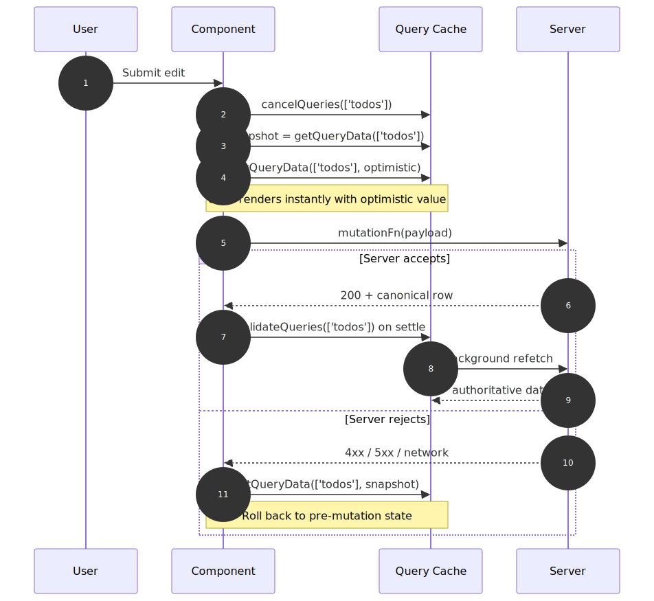
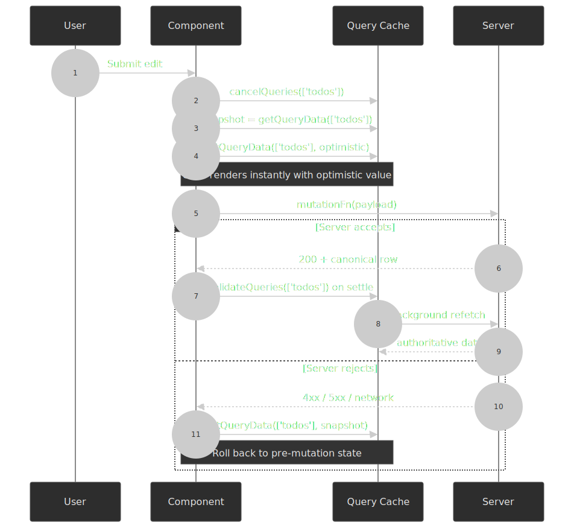


```ts title="optimistic-update.ts" collapse={1-5,35-45}
import { useMutation, useQueryClient } from "@tanstack/react-query"

interface Todo {
  id: string
  title: string
  completed: boolean
}

const queryClient = useQueryClient()

const mutation = useMutation({
  mutationFn: updateTodo,
  onMutate: async (newTodo) => {
    // Cancel outgoing refetches (they'd overwrite optimistic update)
    await queryClient.cancelQueries({ queryKey: ["todos"] })

    // Snapshot previous value
    const previous = queryClient.getQueryData<Todo[]>(["todos"])

    // Optimistically update
    queryClient.setQueryData<Todo[]>(["todos"], (old) => old?.map((t) => (t.id === newTodo.id ? newTodo : t)))

    // Return snapshot for rollback
    return { previous }
  },
  onError: (err, newTodo, context) => {
    // Roll back on error
    queryClient.setQueryData(["todos"], context?.previous)
  },
  onSettled: () => {
    // Refetch to ensure server state
    queryClient.invalidateQueries({ queryKey: ["todos"] })
  },
})
```

**Why `onSettled` invalidation:** Even on success, the server might have modified the data (timestamps, computed fields). Invalidation ensures the cache matches server state.

#### React 19 `useOptimistic` for action-driven UI

For mutations that go through a Server Action or any async handler — not a TanStack mutation — React 19 ships [`useOptimistic`](https://react.dev/reference/react/useOptimistic). It expects a base state plus a reducer-like updater, and React automatically reverts the optimistic value when the surrounding action settles:

```tsx title="optimistic-action.tsx" collapse={1-3}
import { useOptimistic, useTransition } from "react"

function Likes({ count, like }: { count: number; like: () => Promise<void> }) {
  const [isPending, startTransition] = useTransition()
  const [optimisticCount, addOptimistic] = useOptimistic(count, (n: number, delta: number) => n + delta)

  return (
    <button
      disabled={isPending}
      onClick={() => {
        addOptimistic(1)
        startTransition(async () => {
          await like()
        })
      }}
    >
      {optimisticCount} likes
    </button>
  )
}
```

Use `useOptimistic` for transient UI affordances tied to a single action (a like, a vote, an inline edit) and use TanStack Query's `onMutate` snapshot/rollback when the same data lives in a shared cache that other components read. The two patterns compose: a `useOptimistic` value can wrap a `useQuery`'s `data` while a `useMutation` reconciles the server state in the background.

### SWR Comparison

[SWR](https://swr.vercel.app/) takes a more minimal approach:

| Feature               | TanStack Query     | SWR                   |
| --------------------- | ------------------ | --------------------- |
| Devtools              | Built-in           | Community             |
| Mutations             | `useMutation` hook | Manual with `mutate`  |
| Infinite queries      | `useInfiniteQuery` | `useSWRInfinite`      |
| Optimistic updates    | Via `onMutate`     | Via `optimisticData`  |
| Request deduplication | Automatic          | Configurable interval |
| Bundle size (gzip)    | ~13 KB[^bundles]   | ~5 KB[^bundles]       |

**When to choose SWR:** simpler apps where bundle size matters, or where you prefer the smaller API surface. SWR's `mutate` function covers most write paths without dedicated mutation hooks. TanStack Query wins when you need rich cache APIs (predicates, fine-grained invalidation), built-in devtools, or first-class mutation lifecycles.

[^bundles]: Bundle sizes are minified + gzipped from [Bundlephobia](https://bundlephobia.com/package/@tanstack/react-query) for `@tanstack/react-query` v5 and [Bundlephobia](https://bundlephobia.com/package/swr) for `swr` v2; numbers shift slightly between releases and depend on which sub-modules you import.

## Server Components, Suspense, and Hydration

React 19 finalised the [Server Components model](https://react.dev/reference/rsc/server-components): components run only on the server, ship no JavaScript, and cannot use `useState`, `useReducer`, `useEffect`, `useContext`, or any browser API. Anything that owns *client* state — including every store discussed in this article — must live behind a `'use client'` boundary. RSC does not eliminate client state libraries; it sharpens the boundary between what is fetched-and-rendered and what is interactive.


### The Five Buckets Across the Boundary

| Bucket           | Where it lives in an RSC app                                                                                              |
| :--------------- | :------------------------------------------------------------------------------------------------------------------------ |
| Server state     | Fetched in a Server Component or prefetched into a `QueryClient`, then dehydrated through `<HydrationBoundary>` to a client `useQuery` / `useSuspenseQuery`. |
| UI state         | Client Components only (`'use client'` + `useState` / Zustand / Jotai). Cannot be shared into a Server Component.          |
| Form state       | `useActionState` + Server Actions for the submission contract; React Hook Form for rich client-side validation.           |
| URL state        | Read on both sides: Server Components read `searchParams`; Client Components read `useSearchParams` (Next App Router).    |
| Persistent state | Client only. **Never** read `localStorage` during render — it does not exist on the server and will mismatch on hydration. |

### Suspense and `useSuspenseQuery`

TanStack Query v5 ships dedicated Suspense hooks ([`useSuspenseQuery`, `useSuspenseQueries`, `useSuspenseInfiniteQuery`](https://tanstack.com/query/v5/docs/framework/react/guides/suspense)) that integrate with `<Suspense>` and `<ErrorBoundary>`. Two consequences worth internalising:

- `data` is **always defined** when the component renders — no `data?.foo` ceremony, no separate loading branch.
- Errors throw to the nearest error boundary; the `throwOnError` option is implicit. The legacy `suspense: true` flag on `useQuery` was removed in v5.

Pair `useSuspenseQuery` with server-side prefetching to avoid a client waterfall:

```tsx title="ssr-prefetch.tsx"
import { dehydrate, HydrationBoundary, QueryClient } from "@tanstack/react-query"

export default async function Page() {
  const queryClient = new QueryClient()
  await queryClient.prefetchQuery({ queryKey: ["user", 1], queryFn: fetchUser })

  return (
    <HydrationBoundary state={dehydrate(queryClient)}>
      <UserCard id={1} />
    </HydrationBoundary>
  )
}
```

The `Page` is a Server Component; `UserCard` is a `'use client'` component that calls `useSuspenseQuery({ queryKey: ["user", 1], queryFn: fetchUser })` and reads from the warm cache without a network round-trip. The [advanced-SSR guide](https://tanstack.com/query/v5/docs/framework/react/guides/advanced-ssr) documents the streaming variant via `@tanstack/react-query-next-experimental`, which lets prefetches be `await`-free and stream as React resolves promises.

> [!WARNING]
> Create the `QueryClient` **inside the request handler** (or via a per-render factory). A module-scoped client leaks cache across requests in a Node server, leading to user-A data showing up for user-B until eviction.

### Hydration Timeline and Where It Goes Wrong

Hydration is the moment React turns server-rendered HTML into an interactive client tree. Anything the client renders must match the server-rendered HTML byte-for-byte, or React 19 [logs a hydration mismatch with a diff](https://react.dev/blog/2024/12/05/react-19#improvements-in-react-19) and re-renders the affected subtree on the client.

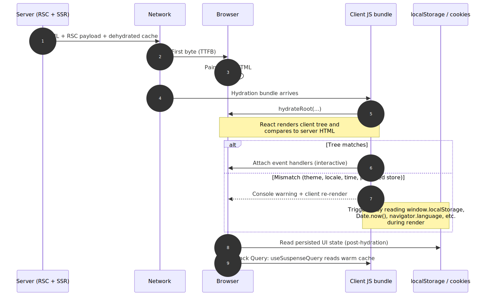
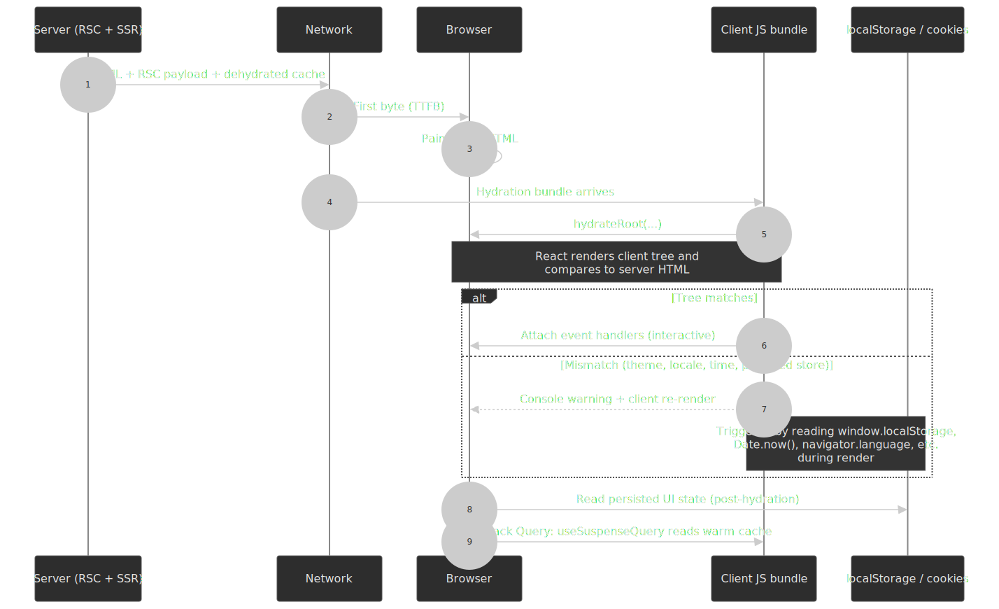

Common state-driven causes of mismatches:

| Cause                                                  | Why it mismatches                                                                                | Fix                                                                                            |
| :----------------------------------------------------- | :----------------------------------------------------------------------------------------------- | :--------------------------------------------------------------------------------------------- |
| Reading `localStorage` / `sessionStorage` during render | Storage is unavailable on the server; the server renders the default, the client renders the persisted value. | Render the default on first paint; read storage in `useEffect` and re-render. Or stash the value in a cookie that both sides can read. |
| Reading `Date.now()` / `Math.random()` during render    | Different values on server vs. client.                                                           | Compute server-side or in an effect; mark the rendered text `suppressHydrationWarning` only as a last resort. |
| Reading `window.matchMedia('(prefers-color-scheme: dark)')` for theme | Server has no `window`.                                                                          | Hydrate from a cookie or a tiny inline script that sets a `class` on `<html>` before React boots. |
| `useQuery` running a fetch on mount because the cache is empty | Prefetch was missed or `staleTime: 0` invalidated immediately.                                   | Prefetch on the server inside `<HydrationBoundary>` and set `staleTime` ≥ a few seconds.       |
| `gcTime: 0` with per-request `QueryClient`              | Client cache evicts before hydration completes.                                                  | Keep `gcTime` at its default (5 min) or higher.                                                |

> [!CAUTION]
> Persistent client stores (Zustand `persist` middleware, Jotai `atomWithStorage`, Redux Persist) are the most common source of mismatches. Either gate the hydration-sensitive subtree behind a "mounted" flag, or move the persisted value into a cookie so the server can render the same output.

## Global UI State

### When Global State Is Necessary

Global state is appropriate when:

1. **Multiple unrelated components** need the same data
2. **No common ancestor** can reasonably hold the state
3. **State persists** across route changes

Common legitimate cases:

- Authentication state
- Theme/appearance settings
- Feature flags
- Toast/notification queue
- Modal registry

### When to Avoid Global State

**Server state does not belong in global stores.** This was the primary mistake of early Redux applications. Patterns like "fetch in an action creator, store the array in Redux" create:

- Manual cache invalidation logic.
- No request deduplication.
- No background refetch.
- Complex loading-state management bolted on top of every reducer.

[Kent C. Dodds](https://kentcdodds.com/blog/application-state-management-with-react) makes the editorial argument well: most "I need a state library" instincts are really "I need to colocate state with the component that owns it, then use hooks to share it where it crosses boundaries". The remaining cases — auth, theme, toast queues — are small, low-frequency, and a perfect fit for a single Context or a tiny external store.

### React Context Limitations

Context is not optimized for frequent updates:

```ts title="context-problem.tsx" collapse={1-3}
import { createContext, useContext, useState } from 'react'

interface AppState {
  user: User
  theme: 'light' | 'dark'
  notifications: Notification[]
}

const AppContext = createContext<AppState | null>(null)

function App() {
  const [state, setState] = useState<AppState>(/* ... */)

  return (
    <AppContext.Provider value={state}>
      <Header />      {/* Re-renders when notifications change */}
      <Sidebar />     {/* Re-renders when theme changes */}
      <NotificationBell />  {/* The only component that needs notifications */}
    </AppContext.Provider>
  )
}
```

**Problem:** every consumer re-renders when _any_ part of the provider value changes, because [`useContext` always re-runs](https://react.dev/reference/react/useContext) when the provider's `value` is no longer `Object.is`-equal to the previous one. `React.memo` cannot bail out of a context update.

**Solutions:**

1. **Split contexts** — one context per concern (theme, auth, notifications).
2. **Memoize values** — `useMemo` so the provider's `value` reference is stable when the underlying data hasn't changed.
3. **External stores** — Zustand or Jotai with selective subscriptions.

The fan-out difference between a context provider and a selector-based external store on a single state update:


### Zustand: Module-First State

Zustand is genuinely tiny — about [1.1 KB minified + gzipped](https://bundlephobia.com/package/zustand) for the v5 core — and provides a minimal API with selective subscriptions:

```ts title="store.ts" collapse={1-2}
import { create } from 'zustand'

interface BearStore {
  bears: number
  fish: number
  increasePopulation: () => void
  eatFish: () => void
}

const useBearStore = create<BearStore>((set) => ({
  bears: 0,
  fish: 10,
  increasePopulation: () => set((state) => ({ bears: state.bears + 1 })),
  eatFish: () => set((state) => ({ fish: state.fish - 1 })),
}))

// Selective subscription — only re-renders when bears changes
function BearCounter() {
  const bears = useBearStore((state) => state.bears)
  return <h1>{bears} bears</h1>
}

// Different subscription — only re-renders when fish changes
function FishCounter() {
  const fish = useBearStore((state) => state.fish)
  return <h1>{fish} fish</h1>
}
```

**Design rationale:** Zustand wraps React's [`useSyncExternalStore`](https://react.dev/reference/react/useSyncExternalStore) (specifically the `with-selector` shim) so selectors subscribe to a specific slice, which both avoids the Context re-render problem and stays tearing-free under concurrent rendering.

### Jotai: Atomic State

Jotai (bottom-up) vs Zustand (top-down):

```ts title="atoms.ts" collapse={1-2}
import { atom, useAtom, useAtomValue, useSetAtom } from 'jotai'

// Primitive atoms
const countAtom = atom(0)
const doubledAtom = atom((get) => get(countAtom) * 2)  // Derived

// Component only subscribes to what it reads
function Counter() {
  const [count, setCount] = useAtom(countAtom)
  return <button onClick={() => setCount(c => c + 1)}>{count}</button>
}

// Read-only subscription (no setter in bundle)
function Display() {
  const doubled = useAtomValue(doubledAtom)
  return <span>{doubled}</span>
}

// Write-only (no subscription, no re-render on change)
function ResetButton() {
  const setCount = useSetAtom(countAtom)
  return <button onClick={() => setCount(0)}>Reset</button>
}
```

**When Jotai over Zustand:**

- Fine-grained reactivity needed (many independent pieces)
- Derived state with complex dependency graphs
- Preference for bottom-up composition

### Redux Toolkit: When Scale Demands It

Redux remains appropriate for:

- Large teams needing strict patterns
- Complex middleware requirements (sagas, thunks)
- Time-travel debugging critical
- Existing Redux investment

**Modern Redux ≠ boilerplate Redux.** RTK (Redux Toolkit) eliminates most ceremony:

```ts title="slice.ts" collapse={1-3}
import { createSlice, PayloadAction } from "@reduxjs/toolkit"

interface CounterState {
  value: number
}

const counterSlice = createSlice({
  name: "counter",
  initialState: { value: 0 } as CounterState,
  reducers: {
    increment: (state) => {
      state.value += 1
    }, // Immer handles immutability
    incrementByAmount: (state, action: PayloadAction<number>) => {
      state.value += action.payload
    },
  },
})

export const { increment, incrementByAmount } = counterSlice.actions
export default counterSlice.reducer
```

### Decision Matrix

| Scenario                    | Recommended Tool        |
| --------------------------- | ----------------------- |
| Server data                 | TanStack Query / SWR    |
| Theme, auth                 | Context (low frequency) |
| Module state (single store) | Zustand                 |
| Fine-grained atoms          | Jotai                   |
| Large team, middleware      | Redux Toolkit           |
| Complex workflows           | XState                  |

## Form State Management

### Why Form Libraries Exist

Native controlled inputs re-render on every keystroke:

```ts collapse={1-2}
// Every character typed re-renders the entire component
function NaiveForm() {
  const [values, setValues] = useState({ email: '', password: '' })

  return (
    <form>
      <input
        value={values.email}
        onChange={(e) => setValues(v => ({ ...v, email: e.target.value }))}
      />
      {/* Form re-renders on every keystroke */}
    </form>
  )
}
```

With 10+ fields and validation, this creates noticeable lag on lower-end devices.

### React Hook Form

[React Hook Form](https://react-hook-form.com/) (about [12 KB minified + gzipped](https://bundlephobia.com/package/react-hook-form)) uses uncontrolled inputs backed by refs:

```ts title="form.tsx" collapse={1-4,30-35}
import { useForm } from 'react-hook-form'
import { zodResolver } from '@hookform/resolvers/zod'
import { z } from 'zod'

const schema = z.object({
  email: z.string().email(),
  password: z.string().min(8),
})

type FormData = z.infer<typeof schema>

function LoginForm() {
  const {
    register,
    handleSubmit,
    formState: { errors, isSubmitting }
  } = useForm<FormData>({
    resolver: zodResolver(schema),
  })

  const onSubmit = async (data: FormData) => {
    await login(data)
  }

  return (
    <form onSubmit={handleSubmit(onSubmit)}>
      <input {...register('email')} />
      {errors.email && <span>{errors.email.message}</span>}

      <input type="password" {...register('password')} />
      {errors.password && <span>{errors.password.message}</span>}

      <button disabled={isSubmitting}>Submit</button>
    </form>
  )
}
```

**Performance model:** Inputs are uncontrolled (DOM holds value). Re-renders only happen when:

- `formState` properties you're subscribed to change
- Explicit `watch()` calls
- Validation errors change

### When to Use Native Forms

React Hook Form is overkill for:

- Login forms (2-3 fields)
- Search inputs
- Simple settings toggles

Native HTML validation covers basic cases:

```html
<input type="email" required minlength="3" pattern="[a-z]+" />
```

## Derived State and Selectors

### Compute, Don't Store

Storing derived data creates synchronization bugs:

```ts
// ❌ Storing derived state
interface State {
  items: Item[]
  completedItems: Item[] // Derived from items
  completedCount: number // Derived from completedItems
}

// ✅ Computing derived state
interface State {
  items: Item[]
}

const completedItems = items.filter((i) => i.completed)
const completedCount = completedItems.length
```

**Why computation is better:**

1. Single source of truth (no sync bugs)
2. Less state to manage
3. Automatic consistency

### Memoized Selectors

For expensive computations, memoize with Reselect or `useMemo`:

```ts title="selectors.ts" collapse={1-3}
import { createSelector } from "reselect"

const selectItems = (state: State) => state.items

const selectCompletedItems = createSelector([selectItems], (items) => items.filter((i) => i.completed))

const selectCompletedCount = createSelector([selectCompletedItems], (completed) => completed.length)

// Reselect memoizes by reference equality
// If items hasn't changed, cached result is returned
```

**How Reselect works:** input selectors run first. If their results are referentially equal (`===`) to the previous call, the output selector is skipped and the cached result returned[^reselect-cache].

[^reselect-cache]: The default `createSelector` only memoises the **most recent argument set** (cache size 1). If the same selector is called with multiple distinct argument tuples in the same frame — e.g. one call per row in a list — the cache thrashes. Use `createSelectorCreator` with `lruMemoize`, factor each row into its own selector instance, or move the per-row computation into `useMemo` inside the row component. See [Deriving Data with Selectors](https://redux.js.org/usage/deriving-data-selectors).

### Zustand Selectors

```ts collapse={1-2}
import { useStore } from "./store"

// Component re-renders only when filtered result changes
function CompletedList() {
  const completed = useStore((state) => state.items.filter((i) => i.completed))
  // ⚠️ Creates new array every time — need memoization
}

// Better: external memoized selector
import { createSelector } from "reselect"

const selectCompleted = createSelector(
  (state: State) => state.items,
  (items) => items.filter((i) => i.completed),
)

function CompletedList() {
  const completed = useStore(selectCompleted) // Stable reference
}
```

## State Machines with XState

### When State Machines Are Necessary

State machines excel when:

1. **States have impossible combinations** — `isLoading && hasError && hasData` shouldn't all be true
2. **Transitions matter** — Can only go from `idle` → `loading`, not `idle` → `success`
3. **Complex sequences** — Multi-step wizards, checkout flows
4. **Parallel states** — Audio playing while video loading

### XState v5 Example

The [`setup()` API](https://stately.ai/docs/machines) makes actors, guards, and actions strongly typed against your `context` and `events`:

```ts title="fetch-machine.ts" collapse={1-3}
import { setup, assign, fromPromise } from "xstate"

interface Context {
  data: User | null
  error: Error | null
}

const fetchMachine = setup({
  types: {} as {
    context: Context
    events: { type: "FETCH"; id: string } | { type: "RETRY" }
  },
  actors: {
    fetchUser: fromPromise(async ({ input }: { input: { id: string } }) => {
      const response = await fetch(`/api/users/${input.id}`)
      if (!response.ok) throw new Error("Failed")
      return response.json()
    }),
  },
}).createMachine({
  id: "fetch",
  initial: "idle",
  context: { data: null, error: null },
  states: {
    idle: {
      on: { FETCH: "loading" },
    },
    loading: {
      invoke: {
        src: "fetchUser",
        input: ({ event }) => ({ id: event.id }),
        onDone: {
          target: "success",
          actions: assign({ data: ({ event }) => event.output }),
        },
        onError: {
          target: "failure",
          actions: assign({ error: ({ event }) => event.error }),
        },
      },
    },
    success: {
      on: { FETCH: "loading" },
    },
    failure: {
      on: { RETRY: "loading" },
    },
  },
})
```

The same machine drawn as a state diagram — note that `success → loading` and `failure → loading` are the only ways back into `loading`, which makes the impossible-state argument visual:


**What XState provides:**

- **Type-safe transitions** — TypeScript enforces valid state/event combinations.
- **Visualization** — export to a state diagram (the diagram above is a 1:1 mirror of the code).
- **Testing** — [model-based testing](https://stately.ai/docs/model-based-testing) generates traversals from the machine.
- **Impossible states eliminated** — you cannot be `loading` and `failure` simultaneously.

### When State Machines Are Overkill

- Simple toggles (open/closed)
- Linear forms without complex validation
- CRUD operations (TanStack Query handles state)

**Rule of thumb:** If you can express it clearly with `useState` + a few conditionals, don't add XState's complexity.

## Real-World Implementations

These examples are not endorsements of a specific library — they are evidence that **state architecture is a problem you grow into**. Each team picked tools that survived their specific scaling pressure.

### Figma: C++/Wasm canvas + React chrome

**Challenge:** millions of vector objects on an infinite canvas with multiplayer editing.

**Approach** — documented across the [Figma engineering blog](https://www.figma.com/blog/section/engineering/):

- Editor core is C++ compiled to WebAssembly via Emscripten; the canvas renders through [WebGPU (and WebGL as a fallback)](https://www.figma.com/blog/figma-rendering-powered-by-webgpu/), bypassing the DOM entirely.
- The UI chrome (panels, menus, toolbars) is React + TypeScript, glued to the Wasm engine through a generated bindings layer.
- The document is a tree of `(ObjectID, Property, Value)` tuples. [Figma's multiplayer engine](https://www.figma.com/blog/how-figmas-multiplayer-technology-works/) merges concurrent edits with a CRDT-inspired model whose conflict unit is the property-value pair.
- Server-side, each open document runs in a dedicated Rust process that brokers WebSocket updates between clients.

**Key insight:** at Figma's scale, "client state" splits into a high-frequency canvas state living in C++ and a conventional React UI state living in TS. Off-the-shelf React state libraries do not touch the canvas state at all.

### Notion: block-based state, sharded Postgres

**Challenge:** documents with tens of thousands of blocks, with real-time collaboration and granular permissions.

**Approach** — documented in [The data model behind Notion's flexibility](https://www.notion.com/blog/data-model-behind-notion):

- Every unit (a paragraph, an image, a database row, a page) is a **block** — a Postgres row with `id`, `type`, `properties`, `content` (ordered child IDs), and `parent`.
- Blocks are sharded across Postgres by **workspace ID**; as of [Notion's data-lake post](https://www.notion.com/blog/building-and-scaling-notions-data-lake), the production fleet runs ~96 physical Postgres instances times 5 logical shards each (~480 logical shards).
- Concurrent edits are merged with operation-based sync (transactions of block-level operations) and propagated over WebSockets.

> [!IMPORTANT]
> Notion's [Kafka + Hudi + Spark pipeline](https://www.notion.com/blog/building-and-scaling-notions-data-lake) feeds an S3-backed **data lake** for offline analytics, AI features, and permission-tree recomputation — not real-time block propagation between collaborators. Live propagation rides Postgres + WebSockets.

**Local update pattern:**

1. User edits a block.
2. Edit is grouped into a transaction (a list of block ops).
3. Optimistic update is applied to the local block tree.
4. Transaction is sent to the server, which writes Postgres and broadcasts to other clients on the same workspace shard.

### Linear: MobX-backed sync engine

**Challenge:** real-time project management with offline support and instant UI.

**Approach** — Linear's CTO has [endorsed a community reverse-engineering write-up](https://github.com/wzhudev/reverse-linear-sync-engine) of the architecture, and there is a [public talk on scaling it](https://www.youtube.com/watch?v=Wo2m3jaJixU):

- An in-memory **object pool** (issues, teams, comments — keyed by UUID) is the source of truth for the UI; MobX makes the models observable so views re-render when fields change.
- Local data is persisted to **IndexedDB**; the app bootstraps from disk first, then syncs deltas.
- The server pushes **delta packets** of `SyncAction` records over WebSockets, each tagged with a monotonic sync ID; clients apply them in order to the object pool and IndexedDB.
- Most fields use last-writer-wins; a few high-conflict fields (notably issue descriptions) [use CRDTs](https://www.fujimon.com/blog/linear-sync-engine).

**Why MobX:** observable reactivity keeps the UI in lockstep with the object graph without explicit selector wiring — the trade-off is that you opt into a specific reactivity model for the entire client.

### Discord: Cassandra → ScyllaDB + Rust data services

**Challenge:** [trillions of stored messages](https://discord.com/blog/how-discord-stores-trillions-of-messages), spiky read/write patterns, and unpredictable hot partitions for high-traffic channels.

**Architecture evolution:**

1. **MongoDB** — initial store; scaling and operational toil pushed Discord off it early.
2. **Apache Cassandra** — scaled to ~177 nodes but suffered JVM GC pauses, "gossip dance" maintenance, and hot-partition latency on busy channels.
3. **ScyllaDB** (May 2022) — C++ rewrite of the Cassandra wire protocol with a shard-per-core model; Discord migrated trillions of messages and ended up on ~72 nodes with steady ~15 ms p99 read latency.

**The state-architecture lesson** sits in front of the database, not in it:

- Discord wrote a **Rust data-services layer** that fronts the database with **consistent-hash routing** and **request coalescing** — multiple in-flight reads for the same key dedupe into one DB query, very similar in spirit to TanStack Query's request deduplication, just at the service tier.
- The migration itself used a custom Rust migrator that read Cassandra token ranges and double-wrote to ScyllaDB at ~3.2 M messages/second, completing in ~9 days.

The takeaway for client architecture: **deduplication and coalescing are valuable at every layer**, not just in the React tree. The patterns TanStack Query applies to component renders apply just as well to a service tier in front of a database.

## Performance Optimization

### Re-render Prevention

| Technique                   | When to Use                    | Effort |
| --------------------------- | ------------------------------ | ------ |
| Selector functions          | Always with Zustand/Redux      | Low    |
| `useAtomValue`/`useSetAtom` | Jotai read/write separation    | Low    |
| `React.memo`                | Expensive child components     | Medium |
| Context splitting           | Multiple independent concerns  | Medium |
| State collocation           | State used by single component | Low    |

### State Normalization

For relational data, normalize to avoid duplication:

```ts
// ❌ Denormalized (data duplication)
interface State {
  posts: Array<{
    id: string
    author: { id: string; name: string } // Duplicated across posts
    content: string
  }>
}

// ✅ Normalized (single source of truth)
interface State {
  users: Record<string, User>
  posts: Record<string, { id: string; authorId: string; content: string }>
}
```

**Benefits:**

- O(1) lookup by ID
- Single place to update user name
- Smaller state size (no duplication)

### Mobile Considerations

Mobile devices have tighter constraints:

| Constraint | Desktop    | Mobile             | Mitigation                |
| ---------- | ---------- | ------------------ | ------------------------- |
| Memory     | 500MB–1GB  | 50–200MB           | Aggressive cache eviction |
| CPU        | Multi-core | Thermal throttling | Reduce computation        |
| Network    | Stable     | Intermittent       | Offline-first patterns    |
| Battery    | N/A        | Critical           | Reduce background sync    |

**Offline-first pattern:**

1. Store critical data in IndexedDB
2. Queue mutations when offline
3. Sync when connection restored
4. Resolve conflicts (last-write-wins or merge)

## Browser Constraints

### Storage Quotas

Quotas are quirky and version-dependent — these are the current numbers as of 2026, with sources inline:

| Storage              | Chromium / Firefox                                                                                                  | Safari (WebKit 17+)                                                                                                                                                                                                       |
| -------------------- | ------------------------------------------------------------------------------------------------------------------- | ------------------------------------------------------------------------------------------------------------------------------------------------------------------------------------------------------------------------- |
| `localStorage`       | ~5 MB per origin[^storage-mdn]                                                                                      | ~5 MB per origin[^storage-mdn]                                                                                                                                                                                            |
| IndexedDB / Cache API (combined Storage Standard quota) | Up to ~60% of disk for the whole group, ~10% per origin (Chromium); Firefox uses similar group/origin caps[^storage-mdn] | Up to **60% of disk per origin** for browser apps (and home-screen web apps), ~80% of disk in total; **15% / 20%** for non-browser apps (third-party WebViews)[^webkit-storage] |
| Cookies              | ~4 KB per cookie (RFC 6265 SHOULD, ~4096 bytes for name+value+attributes)[^rfc6265]                                 | Same                                                                                                                                                                                                                      |

> [!IMPORTANT]
> The widely-cited "Safari caps IndexedDB at 1 GB and the Cache API at 50 MB" figures are **legacy**. Since the [Safari 17 storage policy update](https://webkit.org/blog/14403/updates-to-storage-policy/), WebKit uses a percentage-of-disk model that matches the [Storage Standard](https://storage.spec.whatwg.org/). What still bites is **eviction**: WebKit evicts site data after **7 days without user interaction**, regardless of quota.

[^storage-mdn]: [MDN — Storage quotas and eviction criteria](https://developer.mozilla.org/en-US/docs/Web/API/Storage_API/Storage_quotas_and_eviction_criteria) and [web.dev — Storage for the web](https://web.dev/articles/storage-for-the-web).
[^webkit-storage]: [WebKit — Updates to Storage Policy](https://webkit.org/blog/14403/updates-to-storage-policy/), September 2023.
[^rfc6265]: [RFC 6265 §6.1](https://datatracker.ietf.org/doc/html/rfc6265#section-6.1) sets the 4096-byte target; [RFC 6265bis](https://chromestatus.com/feature/4946713618939904) clarifies that browsers count name + value (and cap each attribute at ~1024 bytes).

**Practical rule:** treat 5 MB of `localStorage`, ~50 MB of IndexedDB on the smallest device you target, and a **7-day idle-eviction window on Safari** as the binding constraints — anything larger needs an explicit data-warming or re-fetch strategy.

### Main Thread Budget

60fps = 16ms per frame. State updates compete with:

- Layout calculation
- Paint
- JavaScript execution
- Garbage collection

**Mitigation strategies:**

1. **Web Workers** — Heavy computation off main thread
2. **`requestIdleCallback`** — Non-critical state updates
3. **Chunked updates** — Split large state changes across frames

## Failure Modes and Operational Implications

Each bucket fails in characteristic ways. The mitigations below are the ones worth wiring into your standards doc.

| Bucket           | Failure mode                                                                                | Operational signal                                       | Mitigation                                                                                          |
| :--------------- | :------------------------------------------------------------------------------------------ | :------------------------------------------------------- | :-------------------------------------------------------------------------------------------------- |
| Server state     | Stale-after-mutation: UI shows pre-mutation data because invalidation was forgotten.        | User reports "I saved but it didn't update".             | Always pair `useMutation` with `invalidateQueries` in `onSettled`; codify it in a wrapper hook.     |
| Server state     | Cache stampede on focus refetch (every tab refetches at once).                              | Backend p95 spike correlated with tab focus.             | Raise `staleTime`; disable `refetchOnWindowFocus` for heavy queries; use `select` to narrow payloads. |
| Server state     | Per-request `QueryClient` leaks across requests in a Node server.                           | User-A data appearing for user-B in logs.                | Construct the client inside the request handler / per-render factory.                               |
| UI state         | Context "god provider" re-rendering the entire tree on every change.                        | Profiler shows wide commit ranges on trivial updates.    | Split contexts; memoise the value; or move to a selector-based store.                               |
| Form state       | Controlled-input lag on long forms.                                                          | Input latency >100 ms in DevTools.                        | Switch to React Hook Form (uncontrolled); avoid `useState` per field on >5 fields.                  |
| URL state        | Filters lost on navigation because they live in component state.                             | Users complain that back/forward "loses" their work.     | Move filters/pagination/sort to query params; SSR them.                                             |
| Persistent state | Hydration mismatch from `localStorage` reads during render.                                  | Console warnings; brief flash of wrong content.          | Cookie-backed value, or two-pass render with a `mounted` flag.                                      |
| Persistent state | Safari evicts data after 7 days idle.                                                        | Loss of offline state for inactive users.                | Re-fetch on first online interaction; treat IndexedDB as a cache, not a database.                   |
| Optimistic       | Snapshot rollback restores a value the server has since changed elsewhere.                  | Brief flash of stale data on reconciliation.              | `onSettled` invalidate, do not just rollback; clarify with `refetchQueries`.                        |

## Conclusion

By 2026 the hard problems in client state are solved — the engineering challenge is selecting the right solution for each category:

1. **Server state → TanStack Query / SWR.** Stop managing caches manually.
2. **UI state → keep it local.** `useState` handles most cases.
3. **Shared UI state → Zustand or Jotai.** Reach for Redux only when you need its middleware ecosystem or strict patterns for a large team.
4. **Form state → React Hook Form.** Performance matters at scale; native forms are fine for two-field cases.
5. **Shareable state → URL params.** Users can bookmark and share, and SSR works without hydration mismatch.
6. **Complex workflows → XState.** When the transitions themselves are the artifact worth modelling.
7. **RSC apps → push fetching server-side, prefetch into a `QueryClient`, hydrate through `<HydrationBoundary>`, render with `useSuspenseQuery`.** Treat `'use client'` as the line where every store, effect, and storage read begins.

The pattern across successful products is the same: minimise global state, specialise tools by category, push server data to purpose-built libraries — at the database tier (Discord), the document tier (Notion, Linear), or the canvas tier (Figma) — and keep the hydration boundary honest by never rendering values the server cannot produce.

## Appendix

### Prerequisites

- React hooks (`useState`, `useReducer`, `useContext`, `useMemo`)
- Async JavaScript (Promises, async/await)
- REST API patterns
- Basic understanding of caching concepts

### Terminology

| Term                   | Definition                                                       |
| ---------------------- | ---------------------------------------------------------------- |
| **Stale data**         | Cached data that may no longer match the server                  |
| **Cache invalidation** | Marking cached data as stale, triggering refetch                 |
| **Optimistic update**  | Updating UI before server confirms, rolling back on error        |
| **Derived state**      | State computed from other state, not stored independently        |
| **Normalized state**   | Flat structure with entities keyed by ID, references by ID       |
| **Selector**           | Function that extracts/computes a slice of state                 |
| **Atom**               | Minimal unit of state in atomic state management (Jotai, Recoil) |

### Summary

- **Match tool to category:** Server state needs TanStack Query/SWR, not Redux
- **Server state libraries handle:** Caching, deduplication, background refetch, optimistic updates
- **Context re-renders all consumers:** Split contexts or use external stores for frequent updates
- **Zustand for modules, Jotai for atoms:** Choose based on state granularity needs
- **Compute derived state:** Don't store what you can calculate
- **URL state is shareable state:** Filters, pagination, view modes belong in query params

### References

Server-state libraries:

- [TanStack Query — Important Defaults](https://tanstack.com/query/v5/docs/framework/react/guides/important-defaults) — `staleTime`, `gcTime`, refetch triggers.
- [TanStack Query — Migrating to v5](https://tanstack.com/query/v5/docs/framework/react/guides/migrating-to-v5) — `cacheTime` → `gcTime` rename and other breaking changes.
- [TanStack Query — Suspense](https://tanstack.com/query/v5/docs/framework/react/guides/suspense) — `useSuspenseQuery`, error boundary contract.
- [TanStack Query — Server Rendering & Hydration](https://tanstack.com/query/v5/docs/framework/react/guides/ssr) and [Advanced Server Rendering](https://tanstack.com/query/v5/docs/framework/react/guides/advanced-ssr) — `dehydrate` / `<HydrationBoundary>` for SSR and RSC.
- [SWR](https://swr.vercel.app/) — stale-while-revalidate React data fetching.
- [RFC 5861 — HTTP Cache-Control Extensions for Stale Content](https://datatracker.ietf.org/doc/html/rfc5861) — origin of `stale-while-revalidate`.
- [web.dev — Keeping things fresh with stale-while-revalidate](https://web.dev/articles/stale-while-revalidate) — HTTP/CDN side of the same pattern.

UI-state libraries:

- [Zustand](https://zustand.docs.pmnd.rs/) — module-first store with selective subscriptions.
- [Jotai](https://jotai.org/) — atomic, bottom-up state.
- [Redux Toolkit](https://redux-toolkit.js.org/) — modern Redux with Immer + slices.
- [React — `useContext`](https://react.dev/reference/react/useContext) and [`useSyncExternalStore`](https://react.dev/reference/react/useSyncExternalStore) — the React primitives every store ultimately wraps.
- [React — `useOptimistic`](https://react.dev/reference/react/useOptimistic) and [`useTransition`](https://react.dev/reference/react/useTransition) — action-driven optimistic UI.
- [React — Server Components](https://react.dev/reference/rsc/server-components) and [React 19 release notes](https://react.dev/blog/2024/12/05/react-19) — RSC model and hydration-mismatch reporting.

Forms, machines, and selectors:

- [React Hook Form](https://react-hook-form.com/) — performant form handling.
- [XState v5 — `setup()` and machines](https://stately.ai/docs/machines) and [Actors](https://stately.ai/docs/actors).
- [Reselect — Deriving Data with Selectors](https://redux.js.org/usage/deriving-data-selectors) — memoised selector design.

Browser storage:

- [MDN — Storage quotas and eviction criteria](https://developer.mozilla.org/en-US/docs/Web/API/Storage_API/Storage_quotas_and_eviction_criteria).
- [WebKit — Updates to Storage Policy](https://webkit.org/blog/14403/updates-to-storage-policy/) — current Safari quota model.
- [web.dev — Storage for the web](https://web.dev/articles/storage-for-the-web).
- [RFC 6265 — HTTP State Management Mechanism](https://datatracker.ietf.org/doc/html/rfc6265) — cookie size and lifetime.

Editorial and case studies:

- [Kent C. Dodds — Application State Management with React](https://kentcdodds.com/blog/application-state-management-with-react).
- [Redux — Normalizing State Shape](https://redux.js.org/usage/structuring-reducers/normalizing-state-shape).
- [Figma — How Figma's multiplayer technology works](https://www.figma.com/blog/how-figmas-multiplayer-technology-works/) and [Rendering Powered by WebGPU](https://www.figma.com/blog/figma-rendering-powered-by-webgpu/).
- [Notion — The data model behind Notion's flexibility](https://www.notion.com/blog/data-model-behind-notion) and [Building and scaling Notion's data lake](https://www.notion.com/blog/building-and-scaling-notions-data-lake).
- [Linear sync engine reverse-engineering write-up](https://github.com/wzhudev/reverse-linear-sync-engine) (endorsed by Linear's CTO) and [Scaling the Linear Sync Engine](https://www.youtube.com/watch?v=Wo2m3jaJixU).
- [Discord — How Discord Stores Trillions of Messages](https://discord.com/blog/how-discord-stores-trillions-of-messages).
