# Component Architecture Blueprint for Scalable UI

This article is a complete blueprint for a layered React frontend that survives multi-team growth and framework migration. The shape is: a thin _SDK layer_ wraps all framework- and platform-specific APIs behind plain TypeScript interfaces; a strictly layered _Primitives → Blocks → Widgets_ stack composes UI from those interfaces; `eslint-plugin-boundaries` makes the layering a CI failure rather than a code-review debate; and tests inject mocked SDK implementations through React Context instead of mocking framework internals. The cost is roughly 15% more boilerplate and one extra mental layer for new contributors. The payoff is that business logic stays portable across Next.js, Remix, or Vite, and components remain testable without `jest.mock("next/navigation")` whack-a-mole.


## Mental model


Three orthogonal ideas hold the architecture together. Read them in this order — every later section is an instance of one of these.

1. **Inversion of Control via Context.** Components declare _what_ they need (typed SDK interfaces) and let an outer provider decide _how_ to satisfy it. React's [`createContext`](https://react.dev/reference/react/createContext) is the wiring; the test wrapper and the production app shell are two implementations of the same contract.
2. **Layered boundaries.** Each layer (Primitives, Blocks, Widgets, Registries, Layout) only imports from layers strictly below it. The rule is enforced by [`eslint-plugin-boundaries`](https://github.com/javierbrea/eslint-plugin-boundaries) (v5.x introduced ESLint 9 flat-config support; v6.x is the current major), so a pull request that violates the diagram fails CI.
3. **Framework isolation.** Business logic never imports `next/navigation`, `@remix-run/react`, or `react-router-dom` directly. Those imports are quarantined to a single `app/providers.tsx` file that builds the SDK implementation. A framework swap becomes a re-implementation of the SDK, not a rewrite of the components.

The architecture answers three concrete questions:

1. **How do I test components without mocking framework internals?** Inject all external dependencies via Context; tests provide a mock implementation through `TestSdkProvider`.
2. **How do I prevent "spaghetti" imports across layers?** Express the layers as boundary elements and let `eslint-plugin-boundaries` reject illegal imports at lint time.
3. **How do I migrate between frameworks?** Replace the SDK implementation in the application shell. Component code does not change.

> [!IMPORTANT]
> When this pattern pays off: multi-team apps, component libraries shared across apps, or codebases that expect framework migration. For single-team apps with no migration plans and no shared component library, the indirection is likely overkill — adopt the SDK abstraction only for the dependencies you actually mock most often (usually routing or HTTP) and skip the rest.

---

## Design Principles

### 1. Framework Agnosticism

Components should not directly depend on meta-framework APIs (Next.js, Remix, etc.). Instead, framework-specific functionality is accessed through SDK abstractions.

**Why this design choice?**

The constraint stems from framework churn—Next.js App Router (2023), Remix v2 (2023), and React Server Components changed routing and data-fetching APIs significantly. Direct coupling means rewriting business logic with each migration.

The SDK abstraction trades initial velocity for portability: ~15% more boilerplate upfront, but framework migration becomes implementation swaps rather than component rewrites.

**Example:**

```typescript
// ❌ Bad: Direct framework dependency
import { useRouter } from "next/navigation"
const router = useRouter()
router.push("/products")

// ✅ Good: SDK abstraction
import { useAppRouter } from "@sdk/router"
const router = useAppRouter()
router.push("/products")
```

### 2. Boundary Control

Each architectural layer has explicit rules about what it can import. These rules are enforced through tooling, not just documentation.

**Why this design choice?**

Documentation-only boundaries fail at scale. Without enforcement, developers under deadline pressure take shortcuts ("just import this one widget"). Over months, the architecture diagram diverges from reality.

Using `eslint-plugin-boundaries` (5.x+) makes boundary violations CI failures, not code review debates. The cost: stricter lint rules and occasional refactoring to move shared code to the correct layer.

### 3. Testability First

All external dependencies (HTTP clients, analytics, state management) are injected via providers, making components easy to test in isolation.

**Why this design choice?**

Framework mocking is brittle. Mocking `next/navigation` or `@remix-run/react` couples tests to framework internals that change between versions. When Next.js 13 changed from `useRouter` (pages) to `useRouter` (app router) with different APIs, tests using direct mocks broke.

Injecting dependencies via Context inverts the control: tests provide mock implementations, components remain agnostic. The trade-off is an additional provider layer in the component tree.

### 4. Single Responsibility

Each layer has one clear purpose:

- **Primitives**: Visual presentation
- **Blocks**: Business logic + UI composition
- **Widgets**: Backend contract interpretation + page composition
- **SDKs**: Cross-cutting concerns abstraction

### 5. Explicit Public APIs

Every module exposes its public API through a barrel file (`index.ts`). Internal implementation details are not importable from outside the module.

**Why this design choice?**

Without explicit exports, any file can import any internal function. Over time, internal helpers get used externally, making refactoring break consumers. Barrel files create a contract: only exported symbols are public API.

> [!WARNING]
> **Barrel files and dev-mode performance**
>
> Barrel files preserve a public API surface, but they have well-documented dev-mode costs:
>
> - **Vite dev** does not tree-shake on demand — its dev server transforms files on request and only Rollup tree-shakes during the production build ([Vite performance guide](https://vite.dev/guide/performance)). A deep barrel forces the dev server to chain through every re-exported module, and practitioners regularly report multi-second HMR penalties on barrels of any non-trivial size ([vite#16100](https://github.com/vitejs/vite/issues/16100), [TkDodo: Please Stop Using Barrel Files](https://tkdodo.eu/blog/please-stop-using-barrel-files)).
> - **Production builds** with Rollup, esbuild, Webpack 5, or Turbopack tree-shake barrels correctly when the package declares `"sideEffects": false`. The bundle penalty is usually zero.
>
> Mitigations, in order of preference:
>
> 1. For SDK / internal packages imported once at the app root, a single shallow barrel is fine.
> 2. For shared component libraries, prefer the `package.json` [`exports`](https://nodejs.org/api/packages.html#package-entry-points) field with multiple entry points (e.g. `@blocks/product-card`) instead of one mega-barrel.
> 3. On Next.js, enable [`optimizePackageImports`](https://nextjs.org/docs/app/api-reference/config/next-config-js/optimizePackageImports) (introduced in Next.js 13.5; many common packages such as `lucide-react`, `lodash-es`, `@mui/icons-material`, and `react-icons/*` are already in the auto-optimised default list).
> 4. Keep an automated guardrail: lint barrel-only re-exports out of hot paths with `eslint-plugin-barrel-files` or the equivalent Biome / Oxlint rule.

---

## Architecture Overview

### Allowed dependency flow

The dependency arrow always points from a more general layer to a more specific one. Primitives know nothing about your domain. Blocks compose Primitives and consume SDK hooks. Widgets compose Blocks. Registries are the only place that knows about Widgets. Pages know about Registries through the Layout Engine. SDKs are the one orthogonal axis: they are injected via Context and may be consumed at any layer that does work.


### Import rules matrix

| Source Layer                    | Can Import                                    | Cannot Import                                   |
| ------------------------------- | --------------------------------------------- | ----------------------------------------------- |
| **@sdk/\***                     | External libraries only                       | @blocks, @widgets, @registries                  |
| **@company-name/design-system** | Nothing from app                              | Everything in app                               |
| **@blocks/\***                  | Design system, @sdk/_, sibling @blocks/_      | @widgets/_, @registries/_                       |
| **@widgets/\***                 | Design system, @sdk/_, @blocks/_              | @registries/_, sibling @widgets/_ (discouraged) |
| **@registries/\***              | @widgets/\* (lazy imports only)               | @blocks/\* directly                             |
| **@layout/\***                  | Design system, @registries/\*, @widgets/types | @blocks/\*                                      |

---

## Layer Definitions

### Layer 0: SDKs (Cross-Cutting Concerns)

**Purpose:** Provide framework-agnostic abstractions for horizontal concerns.

**Characteristics:**

- Define TypeScript interfaces (contracts)
- Expose React hooks for consumption
- Implementations provided at application level
- No direct dependencies on application code

**Examples:**

- `@sdk/analytics` - Event tracking, page views, user identification
- `@sdk/experiments` - Feature flags, A/B testing
- `@sdk/router` - Navigation, URL parameters
- `@sdk/http` - API client abstraction
- `@sdk/state` - Global state management

### Layer 1: Primitives (Design System)

**Purpose:** Provide generic, reusable UI components.

**Characteristics:**

- No business logic
- No side effects
- No domain-specific assumptions
- Fully accessible and themeable
- Lives in a separate repository/package

**Examples:**

- Button, Input, Select, Checkbox
- Card, Modal, Drawer, Tooltip
- Typography, Grid, Stack, Divider
- Icons, Animations, Transitions

### Layer 2: Blocks (Business Components)

**Purpose:** Compose Primitives with business logic to create reusable domain components.

**Characteristics:**

- Business-aware but not page-specific
- Reusable across multiple widgets
- Can perform side effects via SDK hooks
- Contains domain validation and formatting
- Includes analytics and tracking

**Examples:**

- ProductCard, ProductPrice, ProductRating
- AddToCartButton, WishlistButton
- UserAvatar, UserMenu
- SearchInput, FilterChip

**When to Create a Block:**

- Component is used in 2+ widgets
- Component has business logic (not just styling)
- Component needs analytics/tracking
- Component interacts with global state

### Layer 3: Widgets (Page Sections)

**Purpose:** Implement BFF widget contracts and compose the page.

**Characteristics:**

- 1:1 mapping with BFF widget types
- Receives payload from backend
- Composes Blocks to render complete features
- Handles widget-level concerns (pagination, error states)
- Registered in page-specific registries

**Examples:**

- HeroBannerWidget, ProductCarouselWidget
- ProductGridWidget, FilterPanelWidget
- RecommendationsWidget, RecentlyViewedWidget
- ReviewsWidget, FAQWidget

### Layer 4: Registries (Widget Mapping)

**Purpose:** Map BFF widget types to component implementations per page type.

**Characteristics:**

- Page-specific (different widgets on different pages)
- Lazy-loaded components for code splitting
- Configurable error boundaries and loading states
- Simple `Record<string, WidgetConfig>` structure

---

## Composition primitives

Layers describe _where_ code lives. Composition primitives describe _how_ a single component exposes itself to its consumer. The same five or six primitives keep recurring at every layer; picking the wrong one is the most common source of "this component is impossible to reuse" pain. The map below decides between them.


### Composition over inheritance

React has no inheritance story for components — the docs explicitly recommend composition through `props.children` and explicit prop forwarding instead ([Passing JSX as children — react.dev](https://react.dev/learn/passing-props-to-a-component#passing-jsx-as-children); [legacy "Composition vs Inheritance" — legacy.reactjs.org](https://legacy.reactjs.org/docs/composition-vs-inheritance.html)). Two practical rules fall out of this:

1. **Take a `children` slot before you take a render-content prop.** A `Card` with `children` composes anything; a `Card` with `<Card title="…" body="…" />` composes nothing else.
2. **Forward unknown props to the underlying primitive when you wrap it.** `Button` should spread `…rest` onto its `<button>` so `aria-*`, `data-*`, `id`, and event handlers all keep working without you re-declaring each one.

The legacy "Container / Presentational" split (Dan Abramov, 2015) was a manual, HOC-era version of this. Abramov [retired the recommendation in 2019](https://medium.com/@dan_abramov/smart-and-dumb-components-7ca2f9a7c7d0): hooks make the split mechanical — the `.hooks.ts` files in the [Block Implementation Example](#block-implementation-example) above are the modern replacement, and the `.view.tsx` is the still-useful presentational half.

### Controlled vs. uncontrolled

Form-like primitives (`Input`, `Select`, `Combobox`, `Slider`, `Checkbox`) have to choose where the value lives. React's [forms guide](https://react.dev/reference/react-dom/components/input#controlling-an-input-with-a-state-variable) draws the line precisely: a value is _controlled_ when React state is the source of truth and the DOM is a reflection; it is _uncontrolled_ when the DOM is the source of truth and React only reads it on submit (via `name` + `defaultValue` + `FormData`, or a `ref`).


| Concern                                        | Controlled                                          | Uncontrolled                                                                                |
| :--------------------------------------------- | :-------------------------------------------------- | :------------------------------------------------------------------------------------------ |
| Source of truth                                | React state                                         | DOM                                                                                         |
| Cost per keystroke                             | One re-render of the owning component               | None                                                                                        |
| Validate / format / mask while typing          | Trivial                                             | Hard (need refs + manual DOM writes)                                                        |
| Sync with external state (URL, store, server)  | Trivial                                             | Awkward                                                                                     |
| Plain HTML form submit                         | Need to mirror state into hidden inputs             | Native — pair `name` + `defaultValue` with `<form action={…}>` (React 19 [`useActionState`](https://react.dev/reference/react/useActionState) collects `FormData`) |
| File inputs (`<input type="file">`)            | Always uncontrolled                                 | Default                                                                                     |

> [!TIP]
> Build the **primitive** to support both modes (`value` _or_ `defaultValue`, `onChange` _or_ `onValueChange`) — Radix UI and React Aria do this for every form primitive. Build the **block** above it as controlled when it needs derived UI, uncontrolled when it just needs to ship the value to a server action.

### Compound components

When one parent owns shared state and several related children need to read or mutate it, expose the children as static properties of the parent and share state through a private `Context`. This is how Radix Primitives, React Aria Components, Headless UI, and Reach UI all model `Tabs`, `Menu`, `Select`, `Combobox`, `Dialog`, and `Accordion` — and it's the structure the [WAI-ARIA Authoring Practices Guide](https://www.w3.org/WAI/ARIA/apg/patterns/) describes for every compound widget.


```typescript title="src/primitives/tabs/tabs.tsx" showLineNumbers
import { createContext, useContext, useId, useState, type FC, type PropsWithChildren } from 'react';

interface TabsContextValue {
  activeId: string;
  setActiveId: (id: string) => void;
  rootId: string;
}

const TabsContext = createContext<TabsContextValue | null>(null);
const useTabs = (): TabsContextValue => {
  const ctx = useContext(TabsContext);
  if (!ctx) throw new Error('Tabs.* must be rendered inside <Tabs>.');
  return ctx;
};

interface TabsProps extends PropsWithChildren {
  defaultActiveId: string;
  value?: string;
  onValueChange?: (id: string) => void;
}

const TabsRoot: FC<TabsProps> = ({ defaultActiveId, value, onValueChange, children }) => {
  const [internal, setInternal] = useState(defaultActiveId);
  const activeId = value ?? internal;
  const setActiveId = (id: string): void => {
    if (value === undefined) setInternal(id);
    onValueChange?.(id);
  };
  return (
    <TabsContext.Provider value={{ activeId, setActiveId, rootId: useId() }}>
      {children}
    </TabsContext.Provider>
  );
};

const List: FC<PropsWithChildren> = ({ children }) => (
  <div role="tablist">{children}</div>
);

const Trigger: FC<PropsWithChildren<{ id: string }>> = ({ id, children }) => {
  const { activeId, setActiveId, rootId } = useTabs();
  const selected = activeId === id;
  return (
    <button
      role="tab"
      id={`${rootId}-trigger-${id}`}
      aria-selected={selected}
      aria-controls={`${rootId}-panel-${id}`}
      tabIndex={selected ? 0 : -1}
      onClick={() => setActiveId(id)}
    >
      {children}
    </button>
  );
};

const Panel: FC<PropsWithChildren<{ id: string }>> = ({ id, children }) => {
  const { activeId, rootId } = useTabs();
  if (activeId !== id) return null;
  return (
    <div
      role="tabpanel"
      id={`${rootId}-panel-${id}`}
      aria-labelledby={`${rootId}-trigger-${id}`}
    >
      {children}
    </div>
  );
};

export const Tabs = Object.assign(TabsRoot, { List, Trigger, Panel });
```

The two non-obvious bits:

1. **The component is dual-mode** — pass `value` to make it controlled, omit it to make it uncontrolled. Three lines of code (the `value ?? internal` resolution and the `if (value === undefined)` guard) avoid forcing every consumer to manage state.
2. **Roving tabindex and `Arrow` / `Home` / `End` / `Enter` keyboard handling** belong in `Tabs.List` for full APG conformance ([Tabs pattern — APG](https://www.w3.org/WAI/ARIA/apg/patterns/tabs/)). The example above omits them for brevity; in production, prefer Radix `Tabs` or React Aria `Tabs` rather than re-implementing.

### Render props vs. hooks vs. context — a decision matrix

The same "give consumers behaviour, let them control rendering" goal can be met three different ways. Pick the lightest one that satisfies the reuse story.

| Mechanism                    | Best for                                                   | Strengths                                                          | Weaknesses                                                                                              |
| :--------------------------- | :--------------------------------------------------------- | :----------------------------------------------------------------- | :------------------------------------------------------------------------------------------------------ |
| **Hook** (`useThing()`)      | Headless behaviour with no required JSX shape              | Composes naturally; testable in isolation; no wrapper component    | Caller must wire up the JSX; can't carry implicit children                                              |
| **Render prop / FaC**        | Headless behaviour where the library needs to control _when_ to render (e.g. virtualised list, error boundary fallback) | Inversion of control over rendering                                | Extra wrapper component in the tree; nested render props get hard to read; partly superseded by hooks   |
| **Context provider**         | Cross-cutting service (DI, theme, auth) shared by many components in a subtree  | Decouples consumer from provider; one source of truth per subtree  | Wrong tool for component _state_ that doesn't need to be shared — re-renders every consumer on change   |
| **Compound components**      | A parent + a small set of named children that share state  | Natural API surface; ARIA roles map cleanly; state stays private   | More files; harder to discover by autocomplete than a single component                                  |
| **Higher-order component**   | Almost never in 2026 — kept for legacy code or framework wrappers     | Wrap behaviour around an existing component without changing it    | Static composition; obscures props; mostly superseded by hooks ([HOCs vs hooks — react.dev](https://react.dev/learn/reusing-logic-with-custom-hooks)) |

The historical arc: React 0.14 had mixins → React 16.3 had HOCs and render props → React 16.8 introduced hooks, which made most HOCs and most render props redundant. Render props survive in libraries that need to control rendering (TanStack Virtual, React Hook Form's `Controller`, error boundary fallbacks); HOCs survive in framework adapters (`React.forwardRef`-wrapping legacy code, `next/dynamic`).

### Headless components and accessibility hooks

A "headless" library exposes _behaviour_ — state machines, ARIA wiring, keyboard handlers, focus management — and lets you bring your own DOM and styling. In a layered architecture, headless libraries sit at the **Primitives** layer; you compose them into your design-system primitives and never re-implement the keyboard logic.

| Library                                                                                                                              | Surface                                                                                  | When to reach for it                                                                                                                       |
| :----------------------------------------------------------------------------------------------------------------------------------- | :--------------------------------------------------------------------------------------- | :----------------------------------------------------------------------------------------------------------------------------------------- |
| [Radix Primitives](https://www.radix-ui.com/primitives)                                                                              | Compound components (`Dialog.Root`, `Tabs.Trigger`, …) with built-in ARIA + focus        | You want fully styled-from-scratch UI, JSX-shaped APIs, and good defaults for the common WAI-ARIA APG patterns.                            |
| [React Aria / React Aria Components (Adobe)](https://react-spectrum.adobe.com/react-aria/)                                           | Hooks (`useButton`, `useComboBox`, `useFocusRing`, …) and a parallel component layer     | You need the broadest accessibility coverage (RTL, mobile screen readers, locale-aware date/number components) and tight control over DOM. |
| [Headless UI (Tailwind Labs)](https://headlessui.com/)                                                                               | Compound components for the most common widgets, originally designed to pair with Tailwind | You're standardising on Tailwind and want a small, focused set of compound primitives.                                                     |
| [Reach UI](https://reach.tech/)                                                                                                      | Compound components (older, predates Radix)                                              | Legacy projects only — Reach UI is in maintenance mode; new work should pick Radix or React Aria.                                          |
| [TanStack Form / Combobox / Virtual](https://tanstack.com/)                                                                          | Hooks for behaviour that's awkward to express as JSX (form state, virtualisation)        | Anything where JSX-shaped APIs would force the library to control rendering you actually want to own.                                      |

The accessibility primitives every primitive eventually needs:

- **Focus management** — modern projects should reach for the [Focus Trap APIs in React Aria's `useFocusManager` / `FocusScope`](https://react-spectrum.adobe.com/react-aria/FocusScope.html) or Radix's `<FocusScope>` rather than hand-rolling. The classic standalone `focus-trap` and `focus-trap-react` libraries (originally by David Clark, now maintained by `focus-trap`) are still the canonical implementation if you can't take a heavier dep.
- **Keyboard handling** — defer to APG patterns. For roving tabindex, follow the [APG roving tabindex guidance](https://www.w3.org/WAI/ARIA/apg/practices/keyboard-interface/#kbd_roving_tabindex); for `Escape`/`Enter`/`Space`/arrow keys per widget, the [APG Patterns index](https://www.w3.org/WAI/ARIA/apg/patterns/) is the canonical map.
- **ARIA roles, names, and relationships** — `aria-labelledby` over `aria-label` when a visible label exists; `aria-controls` over `aria-owns` for connecting a control to the popup it opens (per the [APG Combobox pattern](https://www.w3.org/WAI/ARIA/apg/patterns/combobox/)); `aria-live="polite"` for the kind of error region the [`AddToCartButtonView`](#block-implementation-example) above uses.
- **`prefers-reduced-motion`** — gate any non-trivial animation, including [View Transitions](https://developer.mozilla.org/en-US/docs/Web/API/View_Transition_API), behind a media-query check. View Transitions for same-document SPAs reached Baseline Newly Available in [October 2025](https://web.dev/blog/same-document-view-transitions-are-now-baseline-newly-available); cross-document transitions are still Chromium + Safari 18.2 only.

> [!IMPORTANT]
> Treat WCAG 2.2 AA + APG conformance as a build-time constraint at the Primitives layer. If `Button`, `Combobox`, `Dialog`, and `Tabs` are correct, every Block above them inherits the keyboard and screen-reader behaviour for free. Auditing 200 Blocks is intractable; auditing 20 Primitives is a one-week sprint.

### State locality vs. lifting

Three rules cover 90% of "where should this state live?" decisions:

1. **Default to local.** A primitive that owns its own value (an open/closed state for a `Disclosure`, a hover state for a `Tooltip`) starts with `useState` inside the component.
2. **Lift only when two siblings need to read it.** [React's "Sharing State Between Components"](https://react.dev/learn/sharing-state-between-components) is the canonical guide — promote the state up to the lowest common ancestor.
3. **Reach for Context only when many descendants need the same value, _and_ that value changes infrequently.** Mark Erikson's ["Context is not a state-management tool"](https://blog.isquaredsoftware.com/2021/01/blogged-answers-why-react-context-is-not-a-state-management-tool-and-why-it-doesnt-replace-redux/) is still the best argument for this — every consumer of a context re-renders when the value identity changes, which is fine for SDK services (stable for the app's lifetime) but disastrous for "active tab" or "current cart contents".

The SDK pattern in the [Internal SDKs](#internal-sdks) section is the steady-state Context use case: services are constructed once at app boot, the object identity is stable, no consumer re-renders unnecessarily. Treating that as a precedent for storing _data_ in Context — current user, cart contents, theme — is the most common failure mode and explains why teams who try it usually end up reaching for Redux, Zustand, Jotai, or TanStack Query within the year.

---

## Internal SDKs

SDKs are the key to framework agnosticism. They define **what** your components need, while the application shell provides **how** it's implemented.

> [!NOTE]
> **Version context (React 16.3 → 19)**
>
> The current Context API was introduced in [React 16.3 (March 2018)](https://legacy.reactjs.org/blog/2018/03/29/react-v-16-3.html); before that, prop drilling or third-party DI containers (InversifyJS, tsyringe) were the workaround. As of [React 19 (released 2024-12-05)](https://react.dev/blog/2024/12/05/react-19), Context is still the recommended way to inject _services_ (per the API reference for [`createContext`](https://react.dev/reference/react/createContext); see also Mark Erikson's [Context is not a state management tool](https://blog.isquaredsoftware.com/2021/01/blogged-answers-why-react-context-is-not-a-state-management-tool-and-why-it-doesnt-replace-redux/)). React 19 also lets you render `<MyContext value={…}>` directly without `.Provider`, which can simplify the wrappers shown below — the `.Provider` form still works on React 18.
>
> The [React Compiler](https://react.dev/learn/react-compiler) shipped its 1.0 release in October 2025 and is now a stable opt-in (Babel plugin / framework-specific flag); it can auto-memoise hook return values and narrow Context subscriptions ([reactwg/react-compiler #6](https://github.com/reactwg/react-compiler/discussions/6)), so the explicit `useMemo` around the SDK services object becomes redundant under the compiler. On React 18 without the compiler, keep the `useMemo` to avoid re-broadcasting a fresh services object on every render.

### SDK Structure

```
src/sdk/
├── index.ts                     # Re-exports all SDK hooks
├── core/
│   ├── sdk.types.ts             # Combined SDK interface
│   ├── sdk.provider.tsx         # Root provider
│   └── sdk.context.ts           # Shared context utilities
├── analytics/
│   ├── analytics.types.ts       # Interface definition
│   ├── analytics.provider.tsx   # Context provider
│   ├── analytics.hooks.ts       # useAnalytics() hook
│   └── index.ts                 # Public exports
├── experiments/
│   ├── experiments.types.ts
│   ├── experiments.provider.tsx
│   ├── experiments.hooks.ts
│   └── index.ts
├── router/
│   ├── router.types.ts
│   ├── router.provider.tsx
│   ├── router.hooks.ts
│   └── index.ts
├── http/
│   ├── http.types.ts
│   ├── http.provider.tsx
│   ├── http.hooks.ts
│   └── index.ts
├── state/
│   ├── state.types.ts
│   ├── state.provider.tsx
│   ├── state.hooks.ts
│   └── index.ts
└── testing/
    ├── test-sdk.provider.tsx    # Test wrapper
    ├── create-mock-sdk.ts       # Mock factory
    └── index.ts
```

### SDK Interface Definitions

```typescript
// src/sdk/core/sdk.types.ts

export interface SdkServices {
  analytics: AnalyticsSdk
  experiments: ExperimentsSdk
  router: RouterSdk
  http: HttpSdk
  state: StateSdk
}
```

```typescript
// src/sdk/analytics/analytics.types.ts

export interface AnalyticsSdk {
  /**
   * Track a custom event
   */
  track(event: string, properties?: Record<string, unknown>): void

  /**
   * Track a page view
   */
  trackPageView(page: string, properties?: Record<string, unknown>): void

  /**
   * Track component impression (visibility)
   */
  trackImpression(componentId: string, properties?: Record<string, unknown>): void

  /**
   * Identify a user for analytics
   */
  identify(userId: string, traits?: Record<string, unknown>): void
}
```

```typescript
// src/sdk/experiments/experiments.types.ts

export interface ExperimentsSdk {
  /**
   * Get the variant for an experiment
   * @returns variant name or null if not enrolled
   */
  getVariant(experimentId: string): string | null

  /**
   * Check if a feature flag is enabled
   */
  isFeatureEnabled(featureFlag: string): boolean

  /**
   * Track that user was exposed to an experiment
   */
  trackExposure(experimentId: string, variant: string): void
}
```

```typescript
// src/sdk/router/router.types.ts

export interface RouterSdk {
  /**
   * Navigate to a new URL (adds to history)
   */
  push(path: string): void

  /**
   * Replace current URL (no history entry)
   */
  replace(path: string): void

  /**
   * Go back in history
   */
  back(): void

  /**
   * Prefetch a route for faster navigation
   */
  prefetch(path: string): void

  /**
   * Current pathname
   */
  pathname: string

  /**
   * Current query parameters
   */
  query: Record<string, string | string[]>
}
```

```typescript
// src/sdk/http/http.types.ts

export interface HttpSdk {
  get<T>(url: string, options?: RequestOptions): Promise<T>
  post<T>(url: string, body: unknown, options?: RequestOptions): Promise<T>
  put<T>(url: string, body: unknown, options?: RequestOptions): Promise<T>
  delete<T>(url: string, options?: RequestOptions): Promise<T>
}

export interface RequestOptions {
  headers?: Record<string, string>
  signal?: AbortSignal
  cache?: RequestCache
}
```

```typescript
// src/sdk/state/state.types.ts

export interface StateSdk {
  /**
   * Get current state for a key
   */
  getState<T>(key: string): T | undefined

  /**
   * Set state for a key
   */
  setState<T>(key: string, value: T): void

  /**
   * Subscribe to state changes
   * @returns unsubscribe function
   */
  subscribe<T>(key: string, callback: (value: T) => void): () => void
}
```

### SDK Provider Implementation

```typescript title="src/sdk/core/sdk.provider.tsx" collapse={1-6, 16-19}
// src/sdk/core/sdk.provider.tsx

import { createContext, useContext, type FC, type PropsWithChildren } from 'react';
import type { SdkServices } from './sdk.types';

const SdkContext = createContext<SdkServices | null>(null);

// Key pattern: useSdk hook with runtime validation
export const useSdk = (): SdkServices => {
  const ctx = useContext(SdkContext);
  if (!ctx) {
    throw new Error('useSdk must be used within SdkProvider');
  }
  return ctx;
};

export interface SdkProviderProps {
  services: SdkServices;
}

// Provider wraps application, injecting services
export const SdkProvider: FC<PropsWithChildren<SdkProviderProps>> = ({
  children,
  services,
}) => (
  <SdkContext.Provider value={services}>
    {children}
  </SdkContext.Provider>
);
```

### SDK Hook Examples

```typescript
// src/sdk/analytics/analytics.hooks.ts

import { useSdk } from "../core/sdk.provider"
import type { AnalyticsSdk } from "./analytics.types"

export const useAnalytics = (): AnalyticsSdk => {
  const sdk = useSdk()
  return sdk.analytics
}
```

```typescript title="src/sdk/experiments/experiments.hooks.ts" collapse={1-4}
// src/sdk/experiments/experiments.hooks.ts

import { useEffect } from "react"
import { useSdk } from "../core/sdk.provider"

export const useExperiment = (experimentId: string): string | null => {
  const { experiments } = useSdk()
  const variant = experiments.getVariant(experimentId)

  useEffect(() => {
    if (variant !== null) {
      experiments.trackExposure(experimentId, variant)
    }
  }, [experimentId, variant, experiments])

  return variant
}

export const useFeatureFlag = (flagName: string): boolean => {
  const { experiments } = useSdk()
  return experiments.isFeatureEnabled(flagName)
}
```

### Application-Level SDK Implementation

The application shell provides concrete implementations:

```typescript title="app/providers.tsx" collapse={1-8, 15-42, 53-80}
// app/providers.tsx (framework-specific, outside src/)

'use client'; // Next.js specific

import { useMemo, type FC, type PropsWithChildren } from 'react';
import { useRouter, usePathname, useSearchParams } from 'next/navigation'; // Framework import OK here
import { SdkProvider, type SdkServices } from '@sdk/core';

/**
 * Creates SDK service implementations using framework-specific APIs.
 * This is the ONLY place where framework imports are allowed.
 */
const createSdkServices = (): SdkServices => ({
  analytics: {
    track: (event, props) => {
      // Integrate with your analytics provider
      // e.g., segment.track(event, props)
      console.log('[Analytics] Track:', event, props);
    },
    trackPageView: (page, props) => {
      console.log('[Analytics] Page View:', page, props);
    },
    trackImpression: (id, props) => {
      console.log('[Analytics] Impression:', id, props);
    },
    identify: (userId, traits) => {
      console.log('[Analytics] Identify:', userId, traits);
    },
  },

  experiments: {
    getVariant: (experimentId) => {
      // Integrate with your experimentation platform
      // e.g., return optimizely.getVariant(experimentId);
      return null;
    },
    isFeatureEnabled: (flag) => {
      // e.g., return launchDarkly.isEnabled(flag);
      return false;
    },
    trackExposure: (experimentId, variant) => {
      console.log('[Experiments] Exposure:', experimentId, variant);
    },
  },

  // Key pattern: Router abstraction hides Next.js/Remix differences
  router: {
    push: (path) => window.location.href = path, // Simplified; use framework router
    replace: (path) => window.location.replace(path),
    back: () => window.history.back(),
    prefetch: (path) => { /* Framework-specific prefetch */ },
    pathname: typeof window !== 'undefined' ? window.location.pathname : '/',
    query: {},
  },

  http: {
    get: async (url, opts) => {
      const res = await fetch(url, { ...opts, method: 'GET' });
      return res.json();
    },
    post: async (url, body, opts) => {
      const res = await fetch(url, {
        ...opts,
        method: 'POST',
        headers: { 'Content-Type': 'application/json', ...opts?.headers },
        body: JSON.stringify(body),
      });
      return res.json();
    },
    put: async (url, body, opts) => {
      const res = await fetch(url, {
        ...opts,
        method: 'PUT',
        headers: { 'Content-Type': 'application/json', ...opts?.headers },
        body: JSON.stringify(body),
      });
      return res.json();
    },
    delete: async (url, opts) => {
      const res = await fetch(url, { ...opts, method: 'DELETE' });
      return res.json();
    },
  },

  state: createStateAdapter(), // Implement against your state library (Zustand, Jotai, Redux, …)
});

// Application root wires up concrete implementations
export const AppProviders: FC<PropsWithChildren> = ({ children }) => {
  const services = useMemo(() => createSdkServices(), []);

  return (
    <SdkProvider services={services}>
      {children}
    </SdkProvider>
  );
};
```

---

## Folder Structure

### Complete Structure

```txt
src/
├── sdk/                                    # Internal SDKs
│   ├── index.ts                            # Public barrel: all SDK hooks
│   ├── core/
│   │   ├── sdk.types.ts
│   │   ├── sdk.provider.tsx
│   │   └── index.ts
│   ├── analytics/
│   │   ├── analytics.types.ts
│   │   ├── analytics.provider.tsx
│   │   ├── analytics.hooks.ts
│   │   └── index.ts
│   ├── experiments/
│   │   ├── experiments.types.ts
│   │   ├── experiments.provider.tsx
│   │   ├── experiments.hooks.ts
│   │   └── index.ts
│   ├── router/
│   │   ├── router.types.ts
│   │   ├── router.provider.tsx
│   │   ├── router.hooks.ts
│   │   └── index.ts
│   ├── http/
│   │   ├── http.types.ts
│   │   ├── http.provider.tsx
│   │   ├── http.hooks.ts
│   │   └── index.ts
│   ├── state/
│   │   ├── state.types.ts
│   │   ├── state.provider.tsx
│   │   ├── state.hooks.ts
│   │   └── index.ts
│   └── testing/
│       ├── test-sdk.provider.tsx
│       ├── create-mock-sdk.ts
│       └── index.ts
│
├── blocks/                                 # Business-aware building blocks
│   ├── index.ts                            # Public barrel
│   ├── blocks.types.ts                     # Shared Block types
│   │
│   ├── providers/                          # Block-level providers (if needed)
│   │   ├── blocks.provider.tsx
│   │   └── index.ts
│   │
│   ├── testing/                            # Block test utilities
│   │   ├── test-blocks.provider.tsx
│   │   ├── render-block.tsx
│   │   └── index.ts
│   │
│   ├── product-card/
│   │   ├── product-card.component.tsx      # Container
│   │   ├── product-card.view.tsx           # Pure render
│   │   ├── product-card.hooks.ts           # Side effects
│   │   ├── product-card.types.ts           # Types
│   │   ├── product-card.test.tsx           # Tests
│   │   └── index.ts                        # Public API
│   │
│   ├── add-to-cart-button/
│   │   ├── add-to-cart-button.component.tsx
│   │   ├── add-to-cart-button.view.tsx
│   │   ├── add-to-cart-button.hooks.ts
│   │   ├── add-to-cart-button.types.ts
│   │   ├── add-to-cart-button.test.tsx
│   │   └── index.ts
│   │
│   └── [other-blocks]/
│
├── widgets/                                # BFF-driven widgets
│   ├── index.ts                            # Public barrel
│   │
│   ├── types/                              # Shared widget types
│   │   ├── widget.types.ts
│   │   ├── payload.types.ts
│   │   └── index.ts
│   │
│   ├── hero-banner/
│   │   ├── hero-banner.widget.tsx          # Widget container
│   │   ├── hero-banner.view.tsx            # Pure render
│   │   ├── hero-banner.hooks.ts            # Widget logic
│   │   ├── hero-banner.types.ts            # Payload types
│   │   ├── hero-banner.test.tsx
│   │   └── index.ts
│   │
│   ├── product-carousel/
│   │   ├── product-carousel.widget.tsx
│   │   ├── product-carousel.view.tsx
│   │   ├── product-carousel.hooks.ts
│   │   ├── product-carousel.types.ts
│   │   └── index.ts
│   │
│   └── [other-widgets]/
│
├── registries/                             # Page-specific widget registries
│   ├── index.ts
│   ├── registry.types.ts                   # Registry type definitions
│   ├── home.registry.ts                    # Home page widgets
│   ├── pdp.registry.ts                     # Product detail page widgets
│   ├── plp.registry.ts                     # Product listing page widgets
│   ├── cart.registry.ts                    # Cart page widgets
│   └── checkout.registry.ts                # Checkout page widgets
│
├── layout-engine/                          # BFF layout composition
│   ├── index.ts
│   ├── layout-renderer.component.tsx
│   ├── widget-renderer.component.tsx
│   ├── layout.types.ts
│   └── layout.hooks.ts
│
└── shared/                                 # Non-UI utilities
    ├── types/
    │   └── common.types.ts
    └── utils/
        ├── format.utils.ts
        └── validation.utils.ts
```

### File Naming Convention

| File Type             | Pattern                | Example                      |
| --------------------- | ---------------------- | ---------------------------- |
| Component (container) | `{name}.component.tsx` | `product-card.component.tsx` |
| View (pure render)    | `{name}.view.tsx`      | `product-card.view.tsx`      |
| Widget container      | `{name}.widget.tsx`    | `hero-banner.widget.tsx`     |
| Hooks                 | `{name}.hooks.ts`      | `product-card.hooks.ts`      |
| Types                 | `{name}.types.ts`      | `product-card.types.ts`      |
| Provider              | `{name}.provider.tsx`  | `sdk.provider.tsx`           |
| Registry              | `{name}.registry.ts`   | `home.registry.ts`           |
| Tests                 | `{name}.test.tsx`      | `product-card.test.tsx`      |
| Utilities             | `{name}.utils.ts`      | `format.utils.ts`            |
| Barrel export         | `index.ts`             | `index.ts`                   |

---

## Implementation Patterns

### Type Definitions

#### Block Types

```typescript title="src/blocks/blocks.types.ts" collapse={1-3}
// src/blocks/blocks.types.ts

import type { FC, PropsWithChildren } from "react"

/**
 * A Block component - business-aware building block
 */
export type BlockComponent<TProps = object> = FC<TProps>

/**
 * A Block View - pure presentational, no side effects
 */
export type BlockView<TProps = object> = FC<TProps>

/**
 * Block with children
 */
export type BlockWithChildren<TProps = object> = FC<PropsWithChildren<TProps>>

/**
 * Standard hook result for data-fetching blocks
 */
export interface BlockHookResult<TData, TActions = object> {
  data: TData | null
  isLoading: boolean
  error: Error | null
  actions: TActions
}

/**
 * Props for analytics tracking (optional on all blocks)
 */
export interface TrackingProps {
  /** Unique identifier for analytics */
  trackingId?: string
  /** Additional tracking data */
  trackingData?: Record<string, unknown>
}
```

#### Widget Types

```typescript title="src/widgets/types/widget.types.ts" collapse={1-3}
// src/widgets/types/widget.types.ts

import type { ComponentType, ReactNode } from "react"

/**
 * Base BFF widget payload structure
 */
export interface WidgetPayload<TData = unknown> {
  /** Unique widget instance ID */
  id: string
  /** Widget type identifier (matches registry key) */
  type: string
  /** Widget-specific data from BFF */
  data: TData
  /** Optional pagination info */
  pagination?: WidgetPagination
}

export interface WidgetPagination {
  cursor: string | null
  hasMore: boolean
  pageSize: number
}

/**
 * Widget component type
 */
export type WidgetComponent<TData = unknown> = ComponentType<{
  payload: WidgetPayload<TData>
}>

/**
 * Widget view - pure render layer
 */
export type WidgetView<TProps = object> = ComponentType<TProps>

/**
 * Widget hook result with pagination support
 */
export interface WidgetHookResult<TData> {
  data: TData | null
  isLoading: boolean
  error: Error | null
  pagination: {
    loadMore: () => Promise<void>
    hasMore: boolean
    isLoadingMore: boolean
  } | null
}
```

#### Registry Types

```typescript title="src/registries/registry.types.ts" collapse={1-4}
// src/registries/registry.types.ts

import type { ComponentType, ReactNode } from "react"
import type { WidgetPayload } from "@widgets/types"

/**
 * Configuration for a registered widget
 */
export interface WidgetConfig {
  /** The widget component to render */
  component: ComponentType<{ payload: WidgetPayload }>

  /** Optional custom error boundary */
  errorBoundary?: ComponentType<{
    children: ReactNode
    fallback?: ReactNode
    onError?: (error: Error) => void
  }>

  /** Optional suspense fallback (loading state) */
  suspenseFallback?: ReactNode

  /** Optional skeleton component for loading */
  skeleton?: ComponentType

  /** Whether to wrap in error boundary (default: true) */
  withErrorBoundary?: boolean

  /** Whether to wrap in suspense (default: true) */
  withSuspense?: boolean
}

/**
 * Widget registry - maps widget type IDs to configurations
 */
export type WidgetRegistry = Record<string, WidgetConfig>
```

### Block Implementation Example

```typescript title="src/blocks/add-to-cart-button/add-to-cart-button.types.ts" collapse={1-3}
// src/blocks/add-to-cart-button/add-to-cart-button.types.ts

import type { TrackingProps, BlockHookResult } from "../blocks.types"

export interface AddToCartButtonProps extends TrackingProps {
  sku: string
  quantity?: number
  variant?: "primary" | "secondary" | "ghost"
  size?: "sm" | "md" | "lg"
  disabled?: boolean
  onSuccess?: () => void
  onError?: (error: Error) => void
}

export interface AddToCartViewProps {
  onAdd: () => void
  isLoading: boolean
  error: string | null
  variant: "primary" | "secondary" | "ghost"
  size: "sm" | "md" | "lg"
  disabled: boolean
}

export interface AddToCartActions {
  addToCart: () => Promise<void>
  reset: () => void
}

export type UseAddToCartResult = BlockHookResult<{ cartId: string }, AddToCartActions>
```

```typescript title="src/blocks/add-to-cart-button/add-to-cart-button.hooks.ts" collapse={1-5, 14-18, 40-52}
// src/blocks/add-to-cart-button/add-to-cart-button.hooks.ts

import { useState, useCallback } from "react"
import { useAnalytics, useHttpClient } from "@sdk"
import type { UseAddToCartResult } from "./add-to-cart-button.types"

export const useAddToCart = (
  sku: string,
  quantity: number = 1,
  callbacks?: { onSuccess?: () => void; onError?: (error: Error) => void },
): UseAddToCartResult => {
  const analytics = useAnalytics()
  const http = useHttpClient()

  const [isLoading, setIsLoading] = useState(false)
  const [error, setError] = useState<Error | null>(null)
  const [data, setData] = useState<{ cartId: string } | null>(null)

  // Key pattern: Business logic uses SDK abstractions, not framework APIs
  const addToCart = useCallback(async (): Promise<void> => {
    setIsLoading(true)
    setError(null)

    try {
      const response = await http.post<{ cartId: string }>("/api/cart/add", {
        sku,
        quantity,
      })

      setData(response)
      analytics.track("add_to_cart", { sku, quantity, cartId: response.cartId })
      callbacks?.onSuccess?.()
    } catch (e) {
      const error = e instanceof Error ? e : new Error("Failed to add to cart")
      setError(error)
      analytics.track("add_to_cart_error", { sku, error: error.message })
      callbacks?.onError?.(error)
      throw error
    } finally {
      setIsLoading(false)
    }
  }, [sku, quantity, http, analytics, callbacks])

  const reset = useCallback((): void => {
    setError(null)
    setData(null)
  }, [])

  return {
    data,
    isLoading,
    error,
    actions: { addToCart, reset },
  }
}
```

```typescript title="src/blocks/add-to-cart-button/add-to-cart-button.view.tsx" collapse={1-5}
// src/blocks/add-to-cart-button/add-to-cart-button.view.tsx

import type { FC } from 'react';
import { Button, Spinner, Text, Stack } from '@company-name/design-system';
import type { AddToCartViewProps } from './add-to-cart-button.types';

export const AddToCartButtonView: FC<AddToCartViewProps> = ({
  onAdd,
  isLoading,
  error,
  variant,
  size,
  disabled,
}) => (
  <Stack gap="xs">
    <Button
      variant={variant}
      size={size}
      onClick={onAdd}
      disabled={disabled || isLoading}
      aria-busy={isLoading}
      aria-describedby={error ? 'add-to-cart-error' : undefined}
    >
      {isLoading ? (
        <>
          <Spinner size="sm" aria-hidden />
          <span>Adding...</span>
        </>
      ) : (
        'Add to Cart'
      )}
    </Button>

    {error && (
      <Text id="add-to-cart-error" color="error" size="sm" role="alert">
        {error}
      </Text>
    )}
  </Stack>
);
```

```typescript title="src/blocks/add-to-cart-button/add-to-cart-button.component.tsx" collapse={1-6}
// src/blocks/add-to-cart-button/add-to-cart-button.component.tsx

import type { FC } from 'react';
import { useAddToCart } from './add-to-cart-button.hooks';
import { AddToCartButtonView } from './add-to-cart-button.view';
import type { AddToCartButtonProps } from './add-to-cart-button.types';

export const AddToCartButton: FC<AddToCartButtonProps> = ({
  sku,
  quantity = 1,
  variant = 'primary',
  size = 'md',
  disabled = false,
  onSuccess,
  onError,
}) => {
  const { isLoading, error, actions } = useAddToCart(sku, quantity, {
    onSuccess,
    onError
  });

  return (
    <AddToCartButtonView
      onAdd={actions.addToCart}
      isLoading={isLoading}
      error={error?.message ?? null}
      variant={variant}
      size={size}
      disabled={disabled}
    />
  );
};
```

```typescript
// src/blocks/add-to-cart-button/index.ts

export { AddToCartButton } from "./add-to-cart-button.component"
export { AddToCartButtonView } from "./add-to-cart-button.view"
export { useAddToCart } from "./add-to-cart-button.hooks"
export type { AddToCartButtonProps, AddToCartViewProps } from "./add-to-cart-button.types"
```

### Widget Implementation Example

```typescript title="src/widgets/product-carousel/product-carousel.types.ts" collapse={1-3}
// src/widgets/product-carousel/product-carousel.types.ts

import type { WidgetPayload, WidgetHookResult } from "../types"

export interface ProductCarouselData {
  title: string
  subtitle?: string
  products: ProductItem[]
}

export interface ProductItem {
  id: string
  sku: string
  name: string
  price: number
  originalPrice?: number
  imageUrl: string
  rating?: number
  reviewCount?: number
}

export type ProductCarouselPayload = WidgetPayload<ProductCarouselData>

export interface ProductCarouselViewProps {
  title: string
  subtitle?: string
  products: ProductItem[]
  onLoadMore?: () => void
  hasMore: boolean
  isLoadingMore: boolean
}

export type UseProductCarouselResult = WidgetHookResult<ProductCarouselData>
```

```typescript title="src/widgets/product-carousel/product-carousel.hooks.ts" collapse={1-5, 11-17, 52-61}
// src/widgets/product-carousel/product-carousel.hooks.ts

import { useState, useCallback, useEffect } from "react"
import { useAnalytics, useHttpClient } from "@sdk"
import type { ProductCarouselPayload, UseProductCarouselResult } from "./product-carousel.types"

export const useProductCarousel = (payload: ProductCarouselPayload): UseProductCarouselResult => {
  const analytics = useAnalytics()
  const http = useHttpClient()

  const [data, setData] = useState(payload.data)
  const [isLoading, setIsLoading] = useState(false)
  const [isLoadingMore, setIsLoadingMore] = useState(false)
  const [error, setError] = useState<Error | null>(null)
  const [cursor, setCursor] = useState(payload.pagination?.cursor ?? null)
  const [hasMore, setHasMore] = useState(payload.pagination?.hasMore ?? false)

  // Track impression when widget becomes visible
  useEffect(() => {
    analytics.trackImpression(payload.id, {
      widgetType: payload.type,
      productCount: data.products.length,
    })
  }, [payload.id, payload.type, analytics, data.products.length])

  // Key pattern: Widget handles pagination via SDK http abstraction
  const loadMore = useCallback(async (): Promise<void> => {
    if (!hasMore || isLoadingMore) return

    setIsLoadingMore(true)

    try {
      const response = await http.get<{
        products: ProductItem[]
        cursor: string | null
        hasMore: boolean
      }>(`/api/widgets/${payload.id}/paginate?cursor=${cursor}`)

      setData((prev) => ({
        ...prev,
        products: [...prev.products, ...response.products],
      }))
      setCursor(response.cursor)
      setHasMore(response.hasMore)

      analytics.track("widget_load_more", {
        widgetId: payload.id,
        itemsLoaded: response.products.length,
      })
    } catch (e) {
      setError(e instanceof Error ? e : new Error("Failed to load more"))
    } finally {
      setIsLoadingMore(false)
    }
  }, [payload.id, cursor, hasMore, isLoadingMore, http, analytics])

  return {
    data,
    isLoading,
    error,
    pagination: payload.pagination ? { loadMore, hasMore, isLoadingMore } : null,
  }
}
```

```typescript title="src/widgets/product-carousel/product-carousel.view.tsx" collapse={1-6}
// src/widgets/product-carousel/product-carousel.view.tsx

import type { FC } from 'react';
import { Section, Carousel, Button, Skeleton } from '@company-name/design-system';
import { ProductCard } from '@blocks/product-card';
import type { ProductCarouselViewProps } from './product-carousel.types';

export const ProductCarouselView: FC<ProductCarouselViewProps> = ({
  title,
  subtitle,
  products,
  onLoadMore,
  hasMore,
  isLoadingMore,
}) => (
  <Section>
    <Section.Header>
      <Section.Title>{title}</Section.Title>
      {subtitle && <Section.Subtitle>{subtitle}</Section.Subtitle>}
    </Section.Header>

    <Carousel itemsPerView={{ base: 2, md: 3, lg: 4 }}>
      {products.map((product) => (
        <Carousel.Item key={product.id}>
          <ProductCard
            productId={product.id}
            sku={product.sku}
            name={product.name}
            price={product.price}
            originalPrice={product.originalPrice}
            imageUrl={product.imageUrl}
            rating={product.rating}
            reviewCount={product.reviewCount}
          />
        </Carousel.Item>
      ))}

      {isLoadingMore && (
        <Carousel.Item>
          <Skeleton variant="product-card" />
        </Carousel.Item>
      )}
    </Carousel>

    {hasMore && onLoadMore && (
      <Section.Footer>
        <Button
          variant="ghost"
          onClick={onLoadMore}
          loading={isLoadingMore}
        >
          Load More
        </Button>
      </Section.Footer>
    )}
  </Section>
);
```

```typescript title="src/widgets/product-carousel/product-carousel.widget.tsx" collapse={1-6}
// src/widgets/product-carousel/product-carousel.widget.tsx

import type { FC } from 'react';
import { useProductCarousel } from './product-carousel.hooks';
import { ProductCarouselView } from './product-carousel.view';
import type { ProductCarouselPayload } from './product-carousel.types';

interface ProductCarouselWidgetProps {
  payload: ProductCarouselPayload;
}

export const ProductCarouselWidget: FC<ProductCarouselWidgetProps> = ({ payload }) => {
  const { data, error, pagination } = useProductCarousel(payload);

  if (error) {
    // Let error boundary handle this
    throw error;
  }

  if (!data) {
    return null;
  }

  return (
    <ProductCarouselView
      title={data.title}
      subtitle={data.subtitle}
      products={data.products}
      onLoadMore={pagination?.loadMore}
      hasMore={pagination?.hasMore ?? false}
      isLoadingMore={pagination?.isLoadingMore ?? false}
    />
  );
};
```

### Registry Implementation

> [!NOTE]
> **Version context (`React.lazy` vs `use`)**
>
> [`React.lazy`](https://react.dev/reference/react/lazy) with dynamic imports remains the standard pattern for component-level code splitting in React 19. React 19 also introduces [`use(promise)`](https://react.dev/reference/react/use) for suspending on arbitrary promises, but it is not a drop-in replacement for `lazy` at the component boundary — use `lazy` for splitting and `use` inside a component when you need to await per-render data.

```typescript title="src/registries/home.registry.ts" collapse={1-4}
// src/registries/home.registry.ts

import { lazy } from "react"
import type { WidgetRegistry } from "./registry.types"

export const homeRegistry: WidgetRegistry = {
  HERO_BANNER: {
    component: lazy(() => import("@widgets/hero-banner").then((m) => ({ default: m.HeroBannerWidget }))),
    withErrorBoundary: true,
    withSuspense: true,
  },

  PRODUCT_CAROUSEL: {
    component: lazy(() => import("@widgets/product-carousel").then((m) => ({ default: m.ProductCarouselWidget }))),
    withErrorBoundary: true,
    withSuspense: true,
  },

  CATEGORY_GRID: {
    component: lazy(() => import("@widgets/category-grid").then((m) => ({ default: m.CategoryGridWidget }))),
  },

  PROMOTIONAL_BANNER: {
    component: lazy(() => import("@widgets/promotional-banner").then((m) => ({ default: m.PromotionalBannerWidget }))),
  },

  NEWSLETTER_SIGNUP: {
    component: lazy(() => import("@widgets/newsletter-signup").then((m) => ({ default: m.NewsletterSignupWidget }))),
    withErrorBoundary: false, // Non-critical widget
  },
}
```

```typescript title="src/registries/index.ts" collapse={1-11}
// src/registries/index.ts

import type { WidgetRegistry } from "./registry.types"

export { homeRegistry } from "./home.registry"
export { pdpRegistry } from "./pdp.registry"
export { plpRegistry } from "./plp.registry"
export { cartRegistry } from "./cart.registry"
export { checkoutRegistry } from "./checkout.registry"

export type { WidgetRegistry, WidgetConfig } from "./registry.types"

/**
 * Get registry by page type identifier
 */
export const getRegistryByPageType = (pageType: string): WidgetRegistry => {
  const registries: Record<string, () => Promise<{ default: WidgetRegistry }>> = {
    home: () => import("./home.registry").then((m) => ({ default: m.homeRegistry })),
    pdp: () => import("./pdp.registry").then((m) => ({ default: m.pdpRegistry })),
    plp: () => import("./plp.registry").then((m) => ({ default: m.plpRegistry })),
    cart: () => import("./cart.registry").then((m) => ({ default: m.cartRegistry })),
    checkout: () => import("./checkout.registry").then((m) => ({ default: m.checkoutRegistry })),
  }

  // For synchronous access, import directly
  // For async/code-split access, use the loader above
  const syncRegistries: Record<string, WidgetRegistry> = {}

  return syncRegistries[pageType] ?? {}
}
```

---

## Boundary Control & Enforcement

### ESLint Configuration

> [!NOTE]
> **Version context (ESLint 9 + `eslint-plugin-boundaries` 5.x / 6.x)**
>
> This configuration uses ESLint's flat config format (`eslint.config.js`), the default since [ESLint v9.0.0 (released 2024-04-05)](https://eslint.org/blog/2024/04/eslint-v9.0.0-released/). Legacy `.eslintrc.*` files still work but are deprecated and slated for removal in ESLint 10. `eslint-plugin-boundaries` added flat-config support in v5.0; v6.x is the current major and is what new projects should pin to ([npm](https://www.npmjs.com/package/eslint-plugin-boundaries)). Both versions accept the rule shape shown below.

```javascript title="eslint.config.js" collapse={1-5, 49-74, 95-120, 123-162}
// eslint.config.js

import boundaries from "eslint-plugin-boundaries"
import tseslint from "typescript-eslint"

export default [
  ...tseslint.configs.strictTypeChecked,

  // Key pattern: Define architectural layers as boundary elements
  {
    plugins: { boundaries },
    settings: {
      "boundaries/elements": [
        { type: "sdk", pattern: "src/sdk/*" },
        { type: "blocks", pattern: "src/blocks/*" },
        { type: "widgets", pattern: "src/widgets/*" },
        { type: "registries", pattern: "src/registries/*" },
        { type: "layout", pattern: "src/layout-engine/*" },
        { type: "shared", pattern: "src/shared/*" },
        { type: "primitives", pattern: "node_modules/@company-name/design-system/*" },
      ],
      "boundaries/ignore": ["**/*.test.tsx", "**/*.test.ts", "**/*.spec.tsx", "**/*.spec.ts"],
    },
    rules: {
      // Enforces dependency rules between layers
      "boundaries/element-types": [
        "error",
        {
          default: "disallow",
          rules: [
            // SDK: no internal dependencies
            { from: "sdk", allow: [] },

            // Blocks: primitives, sdk, sibling blocks, shared
            { from: "blocks", allow: ["primitives", "sdk", "blocks", "shared"] },

            // Widgets: primitives, sdk, blocks, shared
            { from: "widgets", allow: ["primitives", "sdk", "blocks", "shared"] },

            // Registries: widgets only (lazy imports)
            { from: "registries", allow: ["widgets"] },

            // Layout: primitives, registries, shared
            { from: "layout", allow: ["primitives", "registries", "shared"] },

            // Shared: primitives only
            { from: "shared", allow: ["primitives"] },
          ],
        },
      ],
    },
  },

  // Enforce barrel exports (no deep imports)
  {
    rules: {
      "no-restricted-imports": [
        "error",
        {
          patterns: [
            {
              group: ["@blocks/*/*"],
              message: "Import from @blocks/{name} only, not internal files",
            },
            {
              group: ["@widgets/*/*", "!@widgets/types", "!@widgets/types/*"],
              message: "Import from @widgets/{name} only, not internal files",
            },
            {
              group: ["@sdk/*/*"],
              message: "Import from @sdk or @sdk/{name} only, not internal files",
            },
          ],
        },
      ],
    },
  },

  // Block framework imports in components
  {
    files: ["src/blocks/**/*", "src/widgets/**/*", "src/sdk/**/*"],
    rules: {
      "no-restricted-imports": [
        "error",
        {
          patterns: [
            {
              group: ["next/*", "next"],
              message: "Use @sdk abstractions instead of Next.js imports",
            },
            {
              group: ["@remix-run/*"],
              message: "Use @sdk abstractions instead of Remix imports",
            },
            {
              group: ["react-router", "react-router-dom"],
              message: "Use @sdk/router instead of react-router",
            },
          ],
        },
      ],
    },
  },

  // Blocks cannot import widgets
  {
    files: ["src/blocks/**/*"],
    rules: {
      "no-restricted-imports": [
        "error",
        {
          patterns: [
            { group: ["@widgets", "@widgets/*"], message: "Blocks cannot import widgets" },
            { group: ["@registries", "@registries/*"], message: "Blocks cannot import registries" },
            { group: ["@layout", "@layout/*"], message: "Blocks cannot import layout-engine" },
          ],
        },
      ],
    },
  },

  // Widget-to-widget imports are discouraged
  {
    files: ["src/widgets/**/*"],
    rules: {
      "no-restricted-imports": [
        "warn",
        {
          patterns: [
            {
              group: ["@widgets/*", "!@widgets/types", "!@widgets/types/*"],
              message: "Widget-to-widget imports are discouraged. Extract shared logic to @blocks.",
            },
          ],
        },
      ],
    },
  },

  // Strict TypeScript for SDK, Blocks, and Widgets
  {
    files: [
      "src/sdk/**/*.ts",
      "src/sdk/**/*.tsx",
      "src/blocks/**/*.ts",
      "src/blocks/**/*.tsx",
      "src/widgets/**/*.ts",
      "src/widgets/**/*.tsx",
    ],
    languageOptions: {
      parserOptions: {
        project: "./tsconfig.json",
      },
    },
    rules: {
      "@typescript-eslint/explicit-function-return-type": "error",
      "@typescript-eslint/no-explicit-any": "error",
      "@typescript-eslint/strict-boolean-expressions": "error",
      "@typescript-eslint/no-floating-promises": "error",
      "@typescript-eslint/no-unsafe-assignment": "error",
      "@typescript-eslint/no-unsafe-member-access": "error",
      "@typescript-eslint/no-unsafe-call": "error",
      "@typescript-eslint/no-unsafe-return": "error",
      "@typescript-eslint/prefer-nullish-coalescing": "error",
      "@typescript-eslint/prefer-optional-chain": "error",
      "@typescript-eslint/no-unnecessary-condition": "error",
    },
  },
]
```

---

## React Server Components and the architecture

[React Server Components](https://react.dev/reference/rsc/server-components) reshape what each layer does, but they do not invalidate the layering. The single rule that matters: the [`'use client'`](https://react.dev/reference/rsc/use-client) directive marks the boundary where the bundler stops tree-shaking server-only code and starts shipping JavaScript. Every transitive import from a `'use client'` file is a Client Component — so the directive's _placement_ becomes the most important architectural decision the team makes.

| Layer        | Default rendering mode                | When it has to be a Client Component (`'use client'`)                                                                                                                |
| :----------- | :------------------------------------ | :----------------------------------------------------------------------------------------------------------------------------------------------------------------- |
| Primitives   | Mixed — split per primitive           | Anything that uses state, effects, refs, browser APIs, or event handlers (`Dialog`, `Tabs`, `Combobox`, `Carousel`). Stateless primitives (`Card`, `Stack`, `Text`) stay server. |
| SDKs         | Client (almost always)                | The whole `SdkProvider` is necessarily client-side — Context lives in the React tree, and most SDK methods (router, analytics, http) only work in the browser.       |
| Blocks       | Mostly Client                          | Anything that calls `useSdk()` or any state hook is client. _Pure_ blocks (a static `ProductPriceLabel` that just formats a number) can be Server Components if they take serialisable props. |
| Widgets      | Server-Component shell, Client islands | The widget's data fetching and serialisable rendering can be Server; the interactive parts (carousel, filters, "Add to cart" button) are Client. Pass Server Components into Client Components as `children` props to keep the seam thin. |
| Layout / page | Server                                 | The page itself orchestrates data; the registry's lazy-loaded widgets become async server components or client islands depending on the widget.                      |

Two practical consequences for this architecture:

1. **The `'use client'` boundary belongs at the highest possible layer.** Every consumer of `useSdk` must be inside a Client subtree, so `SdkProvider` lives inside the root client boundary in `app/providers.tsx`. Pages that don't need the SDK can stay as Server Components and simply not import `SdkProvider`.
2. **Blocks that need to be islands should accept `children` as a serialisable prop.** This is the [server-into-client composition pattern](https://react.dev/reference/rsc/use-client#interleaving-server-and-client-components) — a Client Component cannot import a Server Component, but it _can_ render any `children` you pass it. So a `<ProductCarousel>` (Client) renders its `<ProductCard>` children that come from a Server Component, and the cards never get bundled into the client JS.

> [!NOTE]
> The `eslint-plugin-boundaries` rules above stay correct for RSC, but you will want to add a second-axis rule that prevents Server Components from importing the `'use client'` boundary directly. Next.js's [`server-only`](https://nextjs.org/docs/app/getting-started/server-and-client-components#preventing-environment-poisoning) and [`client-only`](https://www.npmjs.com/package/client-only) packages are the standard guard.

---

## Anti-patterns and failure modes

The architecture has a small set of failure modes that surface predictably as the codebase grows. They're worth naming so reviewers can flag them by name rather than re-arguing the principle each time.

| Anti-pattern                                                              | What goes wrong                                                                                                          | Fix                                                                                                                              |
| :------------------------------------------------------------------------ | :----------------------------------------------------------------------------------------------------------------------- | :------------------------------------------------------------------------------------------------------------------------------- |
| **Framework imports leak into Blocks/Widgets**                            | `next/navigation` reappears in a Block "for one quick PR" and the SDK boundary stops being load-bearing.                 | The `no-restricted-imports` rule in the [ESLint config](#eslint-configuration) above must be `error`, not `warn`, and CI must block on it. |
| **One mega-`SdkContext` value with mutable state inside**                 | Every consumer of any SDK re-renders when any field changes; performance collapses on busy pages.                        | Keep service _identities_ stable for the app's lifetime; put per-render data in a separate Context or a state library.                |
| **Compound component reading parent state via prop drilling**             | `Tabs.Trigger` accepts a giant `parentTabsApi` prop instead of using `useTabs()`; consumers can no longer reorder children. | Always share compound state via Context; never expose internals as props.                                                          |
| **Controlled input with no `value`/`defaultValue` distinction**           | Switching from controlled to uncontrolled (or vice versa) triggers React's "A component is changing an uncontrolled input to be controlled" warning and the DOM resets unexpectedly. | Pick one mode at mount and never switch — when both `value` and `defaultValue` are accepted, treat `value === undefined` as the uncontrolled signal. |
| **Nested render-prop pyramids**                                           | `<A>{a => <B>{b => <C>{c => …}</C>}</B>}</A>` becomes unreadable; reviewers stop catching bugs.                            | Convert each render prop to a hook — that's exactly what hooks were introduced for in 16.8.                                       |
| **Ad-hoc widget registries inside page files**                            | Each page builds its own `switch (type) {}`; widgets stop being lazy-loaded; bundle size balloons.                      | Centralise registries per page-type as in [Registry Implementation](#registry-implementation); enforce via `boundaries/element-types`. |
| **Missing error / suspense boundaries around lazy widgets**               | One widget throws → the whole page errors → pixel-perfect designs become a server-rendered error page.                   | Default `withErrorBoundary: true` and `withSuspense: true` in the registry; use [error boundaries](https://react.dev/reference/react/Component#catching-rendering-errors-with-an-error-boundary) and `<Suspense>` per the docs. |
| **`'use client'` on the application root**                                | Marking `app/layout.tsx` as `'use client'` opts the entire tree out of Server Components and ships everything as JS.     | Keep `'use client'` at the smallest viable subtree; use the children-prop seam to interleave Server Components inside Client Components. |
| **Reaching into a barrel's internals (`@blocks/x/internal-helper`)**     | Dev-mode HMR collapses; refactors break consumers; the barrel stops being a contract.                                    | The `no-restricted-imports` patterns rule in the [ESLint config](#eslint-configuration) blocks `@blocks/*/*` imports.              |

The two operational failure modes worth monitoring after launch:

1. **HMR latency on Vite for any Block / Widget under active development.** Symptoms: a one-line edit takes 2–5 s to reflect. Cause: deep barrels in the dependency graph. Fix: subpath `package.json` `exports`, or `optimizePackageImports` on Next.js (see the [warning callout](#5-explicit-public-apis) above).
2. **Test files mocking framework code anyway.** Symptoms: a `vi.mock("next/navigation")` appears in PRs despite the SDK pattern being in place. Cause: a Block or Widget bypassed the SDK. Treat any such mock as a code-smell and trace it back to the import that should have gone through `useSdk()`.

---

## Testability

The whole point of the Context-based DI is that a test never has to mock framework code. A `TestSdkProvider` wraps the component under test, builds a `createMockSdk()` services object (Vitest spies by default), and feeds it to the same `SdkContext.Provider` the production app uses. The component reads from `useSdk()`, gets back the spies, and the test asserts against those spies — no `vi.mock("next/navigation")`, no JSDOM patches.

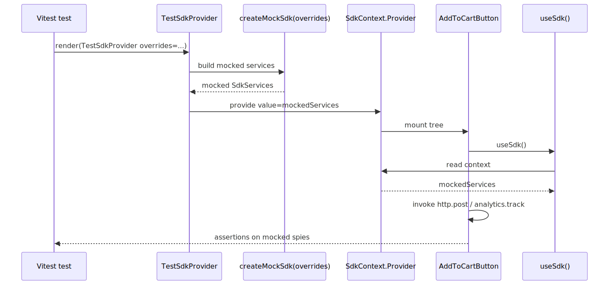
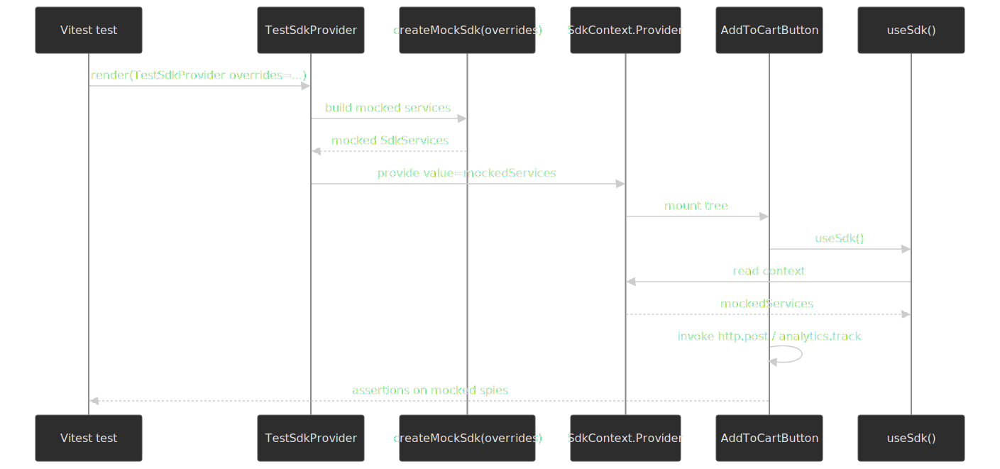

### Test SDK Provider

```typescript title="src/sdk/testing/create-mock-sdk.ts" collapse={1-4}
// src/sdk/testing/create-mock-sdk.ts

import { vi } from "vitest"
import type { SdkServices } from "../core/sdk.types"

type DeepPartial<T> = {
  [P in keyof T]?: T[P] extends object ? DeepPartial<T[P]> : T[P]
}

export const createMockSdk = (overrides: DeepPartial<SdkServices> = {}): SdkServices => ({
  analytics: {
    track: vi.fn(),
    trackPageView: vi.fn(),
    trackImpression: vi.fn(),
    identify: vi.fn(),
    ...overrides.analytics,
  },
  experiments: {
    getVariant: vi.fn().mockReturnValue(null),
    isFeatureEnabled: vi.fn().mockReturnValue(false),
    trackExposure: vi.fn(),
    ...overrides.experiments,
  },
  router: {
    push: vi.fn(),
    replace: vi.fn(),
    back: vi.fn(),
    prefetch: vi.fn(),
    pathname: "/",
    query: {},
    ...overrides.router,
  },
  http: {
    get: vi.fn().mockResolvedValue({}),
    post: vi.fn().mockResolvedValue({}),
    put: vi.fn().mockResolvedValue({}),
    delete: vi.fn().mockResolvedValue({}),
    ...overrides.http,
  },
  state: {
    getState: vi.fn().mockReturnValue(undefined),
    setState: vi.fn(),
    subscribe: vi.fn().mockReturnValue(() => {}),
    ...overrides.state,
  },
})
```

```typescript title="src/sdk/testing/test-sdk.provider.tsx" collapse={1-6, 8-14}
// src/sdk/testing/test-sdk.provider.tsx

import type { FC, PropsWithChildren } from 'react';
import { SdkProvider } from '../core/sdk.provider';
import { createMockSdk } from './create-mock-sdk';
import type { SdkServices } from '../core/sdk.types';

type DeepPartial<T> = {
  [P in keyof T]?: T[P] extends object ? DeepPartial<T[P]> : T[P];
};

interface TestSdkProviderProps {
  overrides?: DeepPartial<SdkServices>;
}

// Key pattern: Test provider wraps components with mocked SDK
export const TestSdkProvider: FC<PropsWithChildren<TestSdkProviderProps>> = ({
  children,
  overrides = {},
}) => (
  <SdkProvider services={createMockSdk(overrides)}>
    {children}
  </SdkProvider>
);
```

### Block Test Example

```typescript title="src/blocks/add-to-cart-button/add-to-cart-button.test.tsx" collapse={1-6, 8-14, 57-98}
// src/blocks/add-to-cart-button/add-to-cart-button.test.tsx

import { render, screen, fireEvent, waitFor } from '@testing-library/react';
import { vi, describe, it, expect, beforeEach } from 'vitest';
import { TestSdkProvider } from '@sdk/testing';
import { AddToCartButton } from './add-to-cart-button.component';

describe('AddToCartButton', () => {
  const mockPost = vi.fn();
  const mockTrack = vi.fn();

  beforeEach(() => {
    vi.clearAllMocks();
  });

  // Key pattern: TestSdkProvider injects mocked SDK services
  const renderComponent = (props = {}) => {
    return render(
      <TestSdkProvider
        overrides={{
          http: { post: mockPost },
          analytics: { track: mockTrack },
        }}
      >
        <AddToCartButton sku="TEST-SKU" {...props} />
      </TestSdkProvider>
    );
  };

  // Key pattern: Tests verify behavior, not implementation
  it('adds item to cart on click', async () => {
    mockPost.mockResolvedValueOnce({ cartId: 'cart-123' });

    renderComponent();

    fireEvent.click(screen.getByRole('button', { name: /add to cart/i }));

    await waitFor(() => {
      expect(mockPost).toHaveBeenCalledWith('/api/cart/add', {
        sku: 'TEST-SKU',
        quantity: 1,
      });
    });
  });

  it('tracks analytics on successful add', async () => {
    mockPost.mockResolvedValueOnce({ cartId: 'cart-123' });

    renderComponent({ quantity: 2 });

    fireEvent.click(screen.getByRole('button'));

    await waitFor(() => {
      expect(mockTrack).toHaveBeenCalledWith('add_to_cart', {
        sku: 'TEST-SKU',
        quantity: 2,
        cartId: 'cart-123',
      });
    });
  });

  it('displays error on failure', async () => {
    mockPost.mockRejectedValueOnce(new Error('Network error'));

    renderComponent();

    fireEvent.click(screen.getByRole('button'));

    await waitFor(() => {
      expect(screen.getByRole('alert')).toHaveTextContent(/network error/i);
    });
  });

  it('disables button while loading', async () => {
    mockPost.mockImplementation(() => new Promise(() => {})); // Never resolves

    renderComponent();

    fireEvent.click(screen.getByRole('button'));

    await waitFor(() => {
      expect(screen.getByRole('button')).toBeDisabled();
      expect(screen.getByRole('button')).toHaveAttribute('aria-busy', 'true');
    });
  });

  it('calls onSuccess callback', async () => {
    mockPost.mockResolvedValueOnce({ cartId: 'cart-123' });
    const onSuccess = vi.fn();

    renderComponent({ onSuccess });

    fireEvent.click(screen.getByRole('button'));

    await waitFor(() => {
      expect(onSuccess).toHaveBeenCalled();
    });
  });
});
```

---

## Configuration

### TypeScript Configuration

> [!NOTE]
> **Version context (TypeScript 6.0 makes strict the default)**
>
> All strict flags shown were the recommended baseline through the TypeScript 5.x line. As of [TypeScript 6.0 (released 2026-03-23)](https://devblogs.microsoft.com/typescript/announcing-typescript-6-0/), `"strict": true` is the default — explicitly setting it remains valid and is recommended for clarity. TypeScript 7.0 will be the new Go-based compiler ([release notes](https://www.typescriptlang.org/docs/handbook/release-notes/typescript-6-0.html)); options deprecated in 6.0 (`baseUrl`, `outFile`, `alwaysStrict: false`, …) will be removed there, so audit your `tsconfig` before upgrading past 6.0.

```jsonc
// tsconfig.json

{
  "compilerOptions": {
    // Strict mode (required)
    "strict": true,
    "noImplicitAny": true,
    "strictNullChecks": true,
    "strictFunctionTypes": true,
    "strictBindCallApply": true,
    "strictPropertyInitialization": true,
    "noImplicitThis": true,
    "alwaysStrict": true,

    // Additional checks
    "noUnusedLocals": true,
    "noUnusedParameters": true,
    "noImplicitReturns": true,
    "noFallthroughCasesInSwitch": true,
    "noUncheckedIndexedAccess": true,
    "noPropertyAccessFromIndexSignature": true,

    // Path aliases
    "baseUrl": ".",
    "paths": {
      "@company-name/design-system": ["node_modules/@company-name/design-system"],
      "@company-name/design-system/*": ["node_modules/@company-name/design-system/*"],
      "@sdk": ["src/sdk"],
      "@sdk/*": ["src/sdk/*"],
      "@blocks": ["src/blocks"],
      "@blocks/*": ["src/blocks/*"],
      "@widgets": ["src/widgets"],
      "@widgets/*": ["src/widgets/*"],
      "@registries": ["src/registries"],
      "@registries/*": ["src/registries/*"],
      "@layout": ["src/layout-engine"],
      "@layout/*": ["src/layout-engine/*"],
      "@shared": ["src/shared"],
      "@shared/*": ["src/shared/*"],
    },

    // Module resolution
    "target": "ES2020",
    "lib": ["DOM", "DOM.Iterable", "ES2020"],
    "module": "ESNext",
    "moduleResolution": "bundler",
    "resolveJsonModule": true,
    "allowJs": false,

    // React
    "jsx": "react-jsx",

    // Interop
    "esModuleInterop": true,
    "allowSyntheticDefaultImports": true,
    "forceConsistentCasingInFileNames": true,
    "isolatedModules": true,

    // Output
    "declaration": true,
    "declarationMap": true,
    "sourceMap": true,
    "skipLibCheck": true,
  },
  "include": ["src/**/*"],
  "exclude": ["node_modules", "**/*.test.ts", "**/*.test.tsx"],
}
```

### Package Scripts

```jsonc
// package.json (scripts section)

{
  "scripts": {
    "dev": "next dev",
    "build": "next build",
    "start": "next start",

    "typecheck": "tsc --noEmit",
    "typecheck:watch": "tsc --noEmit --watch",

    "lint": "eslint src/",
    "lint:fix": "eslint src/ --fix",
    "lint:strict": "eslint src/sdk src/blocks src/widgets --max-warnings 0",

    "test": "vitest",
    "test:ui": "vitest --ui",
    "test:coverage": "vitest --coverage",
    "test:ci": "vitest --run --coverage",

    "validate": "npm run typecheck && npm run lint:strict && npm run test:ci",
    "prepare": "husky install",
  },
}
```

---

## Practical takeaways

The architecture inverts control at every layer: components declare dependencies via TypeScript interfaces, the application shell provides implementations, and tests inject mocks through the same Context. The result is a codebase where business logic is portable across frameworks and testable without `jest.mock("next/navigation")` or its Remix / react-router equivalents.

The trade-offs are real and worth naming up front: an extra ~10–15% of boilerplate at the file level, a steeper learning curve for developers unfamiliar with DI patterns, and slower initial velocity for the first few features. They pay off in long-lived codebases that ship across multiple teams, share components across apps, or anticipate a framework migration in the next two to three years.

Adopt it incrementally rather than in one sweep:

1. Start with the SDK abstraction for the dependency you mock most. In our experience, routing and HTTP are the usual culprits.
2. Land the `boundaries/element-types` rule with `default: "disallow"` _before_ you start adding many widgets — adding it later means a painful one-shot refactor.
3. Wire `TestSdkProvider` into your existing test helpers; convert the tests that currently mock framework code first, since those break the most often.
4. Add the per-page Widget Registry only when you actually have a BFF or server-driven UI driving page composition. Pure-React apps with statically composed pages do not need this layer.

The full architecture emerges from solving real problems, not from upfront design.

---

## Appendix

### Prerequisites

This guide assumes familiarity with:

- React 18+ (hooks, Context API, Suspense)
- TypeScript (strict mode, generics, module systems)
- Modern bundlers (Vite or Webpack 5)
- ESLint configuration (flat config format)

Architectural context:

| Pattern                        | Description                                         | Required?   |
| ------------------------------ | --------------------------------------------------- | ----------- |
| **Design System**              | A separate library of generic UI components         | Yes         |
| **Backend-for-Frontend (BFF)** | A backend layer that serves UI-specific data        | Recommended |
| **Server-Driven UI**           | Backend defines page layout and widget composition  | Optional    |
| **Widget-Based Architecture**  | UI composed of self-contained, configurable modules | Yes         |

### Terminology

| Term                           | Definition                                                                                                                                                              |
| ------------------------------ | ----------------------------------------------------------------------------------------------------------------------------------------------------------------------- |
| **Primitive**                  | A generic, reusable UI component with no business logic (e.g., Button, Card, Modal). Lives in the design system.                                                        |
| **Block**                      | A business-aware component that composes Primitives and adds domain-specific behavior (e.g., ProductCard, AddToCartButton).                                             |
| **Widget**                     | A self-contained page section that receives configuration from the backend and composes Blocks to render a complete feature.                                            |
| **SDK**                        | An internal abstraction layer that provides framework-agnostic access to cross-cutting concerns (routing, analytics, state).                                            |
| **BFF (Backend-for-Frontend)** | A backend service layer specifically designed to serve the needs of a particular frontend. It aggregates data from multiple services and formats it for UI consumption. |
| **Layout**                     | A data structure from the BFF that defines the page structure, including SEO metadata, analytics configuration, and the list of widgets to render.                      |
| **Widget Payload**             | The data contract between the BFF and a specific widget, containing all information needed to render that widget.                                                       |
| **Widget Registry**            | A mapping of widget type identifiers to their corresponding React components.                                                                                           |
| **Boundary**                   | A defined interface between architectural layers that controls what can be imported from where.                                                                         |
| **Barrel Export**              | An `index.ts` file that explicitly defines the public API of a module.                                                                                                  |
| **Dependency Injection (DI)**  | A pattern where dependencies are provided to a component rather than created within it.                                                                                 |
| **Provider Pattern**           | Using React Context to inject dependencies at runtime, enabling easy testing and configuration.                                                                         |
| **HMR**                        | Hot Module Replacement—Vite/Webpack feature that updates modules in the browser without full page reload.                                                               |

### Summary

- **Inversion of Control via React Context** removes the need for framework mocking; tests inject a `TestSdkProvider` instead.
- **Layered boundaries** (Primitives → Blocks → Widgets → Registries → Layout) keep coupling under control; `eslint-plugin-boundaries` makes violations CI failures.
- **SDK abstractions** quarantine framework imports to a single `app/providers.tsx` so a Next.js → Remix migration is a re-implementation, not a rewrite.
- **Barrel files** are fine at the app root but penalise dev HMR if used deep in the tree; prefer subpath `exports`, `optimizePackageImports`, or a barrel-files lint rule for component libraries.
- **TypeScript strict mode** stops being a discussion in TS 6.0+ — it becomes the default; keep the flags explicit in `tsconfig.json` for forward compatibility.
- The pattern is overkill for a single-team app with no migration plans; adopt it incrementally, starting with the SDK for the dependency you mock most.

### References

Official specifications and documentation:

- [`createContext` reference — react.dev](https://react.dev/reference/react/createContext) — API contract for the DI substrate; React 19 also allows `<Context value={…}>` directly.
- [`React.lazy` reference — react.dev](https://react.dev/reference/react/lazy) — code-splitting primitive used by the registries.
- [Passing JSX as children — react.dev](https://react.dev/learn/passing-props-to-a-component#passing-jsx-as-children) — current canonical "composition over inheritance" guidance.
- [Sharing State Between Components — react.dev](https://react.dev/learn/sharing-state-between-components) — the "lift state up" pattern and when to apply it.
- [Server Components — react.dev](https://react.dev/reference/rsc/server-components) and [`'use client'` — react.dev](https://react.dev/reference/rsc/use-client) — RSC runtime semantics and the client-boundary rule.
- [`useActionState` — react.dev](https://react.dev/reference/react/useActionState) — React 19 form action hook used for the uncontrolled-input recommendation.
- [Catching rendering errors with an error boundary — react.dev](https://react.dev/reference/react/Component#catching-rendering-errors-with-an-error-boundary) — the canonical error-boundary contract used by the registry.
- [React 19 release notes — react.dev (2024-12-05)](https://react.dev/blog/2024/12/05/react-19) — current stable React reference.
- [React Compiler — react.dev](https://react.dev/learn/react-compiler) — auto-memoisation; 1.0 stable since October 2025.
- [TypeScript 6.0 release notes — typescriptlang.org](https://www.typescriptlang.org/docs/handbook/release-notes/typescript-6-0.html) — strict-by-default and deprecation list.
- [TypeScript `tsconfig` reference — typescriptlang.org](https://www.typescriptlang.org/tsconfig/) — every compiler option used above.
- [ESLint v9.0.0 release post — eslint.org (2024-04-05)](https://eslint.org/blog/2024/04/eslint-v9.0.0-released/) — flat config becomes the default.
- [Vite performance guide — vite.dev](https://vite.dev/guide/performance) — explains why dev mode is on-demand transforms, not tree-shaking.
- [Next.js `optimizePackageImports` — nextjs.org](https://nextjs.org/docs/app/api-reference/config/next-config-js/optimizePackageImports) — Next.js 13.5+ barrel-file optimisation, current default-list.

Accessibility (W3C / WAI):

- [WAI-ARIA Authoring Practices Guide — Patterns index](https://www.w3.org/WAI/ARIA/apg/patterns/) — canonical map from widget pattern to ARIA roles, states, and keyboard interaction.
- [APG: Combobox pattern](https://www.w3.org/WAI/ARIA/apg/patterns/combobox/) and [Tabs pattern](https://www.w3.org/WAI/ARIA/apg/patterns/tabs/) — the two compound widgets cited in the Composition primitives section.
- [APG: Roving tabindex guidance](https://www.w3.org/WAI/ARIA/apg/practices/keyboard-interface/#kbd_roving_tabindex) — the keyboard pattern every list-of-controls primitive needs.
- [View Transition API — MDN](https://developer.mozilla.org/en-US/docs/Web/API/View_Transition_API) and [Same-document view transitions are now Baseline Newly available — web.dev (2025-10-14)](https://web.dev/blog/same-document-view-transitions-are-now-baseline-newly-available) — current support snapshot for SPA transitions.

Headless component libraries (Primitives layer reference):

- [Radix Primitives — radix-ui.com](https://www.radix-ui.com/primitives) — compound primitives with built-in ARIA, focus, and keyboard handling.
- [React Aria / React Aria Components — react-spectrum.adobe.com](https://react-spectrum.adobe.com/react-aria/) — Adobe's accessibility hooks plus a parallel component layer; broadest screen-reader and locale coverage.
- [Headless UI — headlessui.com](https://headlessui.com/) — Tailwind Labs' compound-component set.
- [Reach UI — reach.tech](https://reach.tech/) — the predecessor to Radix; in maintenance mode.
- [`focus-trap-react` — github.com/focus-trap/focus-trap-react](https://github.com/focus-trap/focus-trap-react) — minimal focus-trap implementation when you can't take a Radix or React Aria dep.

Maintainer and primary-source practitioner content:

- [React Context is not a state management tool — Mark Erikson (Redux maintainer)](https://blog.isquaredsoftware.com/2021/01/blogged-answers-why-react-context-is-not-a-state-management-tool-and-why-it-doesnt-replace-redux/) — the canonical "Context is for DI, not state" essay.
- [Presentational and Container Components — Dan Abramov (2015 + 2019 update)](https://medium.com/@dan_abramov/smart-and-dumb-components-7ca2f9a7c7d0) — the original framing and the explicit retirement note that hooks subsume the split.
- [Please Stop Using Barrel Files — TkDodo (TanStack Query maintainer)](https://tkdodo.eu/blog/please-stop-using-barrel-files) — the barrel-files dev-cost survey cited above.
- [How we optimized package imports in Next.js — Vercel engineering blog](https://vercel.com/blog/how-we-optimized-package-imports-in-next-js) — primary source on `optimizePackageImports` (introduced in 13.5).

Tools and libraries:

- [`eslint-plugin-boundaries` — github.com/javierbrea/eslint-plugin-boundaries](https://github.com/javierbrea/eslint-plugin-boundaries) — boundary plugin used in the lint config above (v5.0+ for flat config; v6.x current major).
- [`server-only` — Next.js docs](https://nextjs.org/docs/app/getting-started/server-and-client-components#preventing-environment-poisoning) and [`client-only` — npm](https://www.npmjs.com/package/client-only) — RSC environment-poisoning guards.
- [Vitest — vitest.dev](https://vitest.dev/) — Vite-native testing framework used in the test examples.

Wider community context (treat as leads, not evidence):

- [React Context for Dependency Injection — Test Double](https://testdouble.com/insights/react-context-for-dependency-injection-not-state-management) — practitioner write-up that mirrors the framing here.
- [Dependency Injection in React — LogRocket](https://blog.logrocket.com/dependency-injection-react/) — props / Context / custom-hook variants in one place.
