# Component Library Architecture and Governance

A component library is a product with internal customers. Its success depends on API stability, contribution workflows, and operational rigor. This article covers the architectural decisions and governance models that separate thriving design systems from abandoned experiments.

The focus is on React-based systems, though most principles apply across frameworks.


## Abstract

A component library succeeds when it achieves four things: a predictable API surface that doesn't break consumers, a packaging and theming substrate that disappears into the consumer's build, a governance model that balances velocity with consistency, and operational practices that treat documentation and tooling as first-class features.

**API design** centers on composition over configuration. Compound components using React Context provide explicit state management without prop drilling. Supporting both controlled and uncontrolled modes maximizes flexibility. Polymorphic components (via `as` or `asChild` props) give consumers DOM control. Accessibility must be baked into the API layer—handled by the component, not delegated to consumers.

**Packaging** is an architectural decision, not a publishing detail. A single package with subpath exports (`@acme/ui/button`) and `"sideEffects": false` is the modern default. Per-component packages (`@atlaskit/button`) only pay for themselves when component cadences truly diverge. Whichever shape you ship, ESM + correct `sideEffects` declarations are what actually let consumers tree-shake.

**Theming** is a token pipeline, not a stylesheet. The W3C Design Tokens Community Group format ([DTCG Format Module 2025-10](https://www.designtokens.org/tr/drafts/format/), the first stable revision) is the interchange shape; [Style Dictionary](https://styledictionary.com/info/architecture/) is the reference build pipeline that fans tokens out into CSS variables, TS constants, and native platform formats.

**Versioning** follows Semantic Versioning (SemVer) strictly. Deprecation happens across release cycles with clear migration paths. Codemods automate breaking changes at scale. Per-component versioning signals maturity in large systems.

**Governance** scales through federation. A dedicated core team maintains standards while distributed contributors add domain-specific components. RFCs (Request for Comments) formalize substantial changes. Inner-source practices—visibility, pull requests, documentation—break silos and increase reuse.

**Quality gates** automate what can be automated. axe-core's own README is explicit that automated testing only catches a subset of accessibility issues, so manual audits still matter. Visual regression testing (Chromatic, Percy, or equivalent) prevents unintended changes. Performance budgets prevent library bloat.

**Adoption** requires active enablement: playbooks, champions, training. Measure contextually—who uses which components, not just download counts.

## Component API Design Principles

API design determines whether teams adopt your library or route around it. The goal is flexibility without complexity—components that handle common cases simply while enabling advanced customization.

### Composition Patterns

The compound component pattern solves the "prop explosion" problem. Instead of passing every option to a single component, related pieces compose together:

```tsx title="Dialog compound components" collapse={1-4, 18-20}
import { Dialog } from "@acme/ui"

// Usage - explicit, composable structure
function ConfirmDialog({ onConfirm, onCancel }) {
  return (
    <Dialog.Root>
      <Dialog.Trigger>Delete Item</Dialog.Trigger>
      <Dialog.Portal>
        <Dialog.Overlay />
        <Dialog.Content>
          <Dialog.Title>Confirm Deletion</Dialog.Title>
          <Dialog.Description>This action cannot be undone.</Dialog.Description>
          <Dialog.Close onClick={onCancel}>Cancel</Dialog.Close>
          <button onClick={onConfirm}>Confirm</button>
        </Dialog.Content>
      </Dialog.Portal>
    </Dialog.Root>
  )
}
```

The parent component (`Dialog.Root`) manages shared state via React Context. Child components access state through that context. This pattern provides explicit structure without prop drilling and enables consumers to omit pieces they don't need.


Radix UI, Headless UI, and Chakra UI all use this pattern. The alternative—a single `<Dialog>` component with 15+ props—creates APIs that are hard to learn, harder to type, and impossible to extend.

**Trade-offs**: Compound components require more JSX to use correctly. Simple use cases take more lines than a single-component API. The explicit structure is worth it for complex components but overkill for primitives like `Button`.

### Controlled vs Uncontrolled Components

Components should support both controlled and uncontrolled modes. Controlled components receive state externally via props:

```tsx title="Controlled input" mark={3,5}
function ControlledExample() {
  const [value, setValue] = useState("")

  return <Input value={value} onChange={(e) => setValue(e.target.value)} />
}
```

Uncontrolled components manage state internally:

```tsx title="Uncontrolled input" mark={3}
function UncontrolledExample() {
  const inputRef = useRef<HTMLInputElement>(null)

  return <Input ref={inputRef} defaultValue="" />
}
```

**Design rule**: A component must not switch between controlled and uncontrolled modes during its lifetime. React will warn if `value` changes from `undefined` to a defined value, indicating the component switched modes.

Controlled mode enables validation on every keystroke and predictable state management. Uncontrolled mode works better for non-React integrations and reduces re-renders for large forms.


### Polymorphic Components

The `as` prop allows consumers to change the rendered element:

```tsx title="Polymorphic button usage"
<Button as="a" href="/dashboard">
  Go to Dashboard
</Button>
```

This keeps styling and behavior while rendering the appropriate semantic element. MUI, Chakra UI, and Styled Components use this pattern extensively.

Radix UI takes an alternative approach with `asChild`:

```tsx title="asChild pattern"
<Dialog.Trigger asChild>
  <Button variant="outline">Open Dialog</Button>
</Dialog.Trigger>
```

When `asChild={true}`, the component clones the child element instead of rendering its default DOM element. Props and behavior pass to the child. This keeps DOM semantics explicit—consumers see exactly what renders.

**TypeScript complexity**: Polymorphic components require advanced typing to infer the correct props for the `as` target. Maintaining the inference is non-trivial — Radix's own attempt at a shared utility (`@radix-ui/react-polymorphic`) was [sunsetted in August 2022](https://github.com/radix-ui/primitives/issues/1273) in favor of `asChild`-based composition powered by [`@radix-ui/react-slot`](https://www.radix-ui.com/primitives/docs/utilities/slot). Most libraries that still ship an `as` prop now hand-roll the generics inside their own component types instead of depending on a shared package.

`asChild` sidesteps the inference problem entirely: the child element is the source of truth for the rendered tag, and `Slot` only needs to merge props, refs, and event handlers onto whatever the consumer passed in. The trade-off is shape: consumers must always pass exactly one valid React element child, and class merging or focus behavior on the wrapped child becomes the consumer's concern.

### Accessibility Built Into APIs

Accessibility implementation belongs in the component library, not consumer code. Components should handle:

- **ARIA attributes**: `aria-expanded`, `aria-controls`, `aria-labelledby`
- **Focus management**: Trapping focus in modals, restoring focus on close
- **Keyboard navigation**: Arrow keys for menus, Escape to close
- **Role semantics**: Correct `role` attributes for custom widgets

[Radix Primitives](https://www.radix-ui.com/primitives) implements [WAI-ARIA Authoring Practices](https://www.w3.org/WAI/ARIA/apg/) for all components. [React Aria](https://react-spectrum.adobe.com/react-aria/) (Adobe) provides hooks and components with built-in behavior, adaptive interactions, and internationalization (i18n). The goal is zero-cost abstractions—accessibility without forcing styling opinions. Note that React Aria deliberately does **not** ship an `asChild`-style escape hatch; its maintainers have repeatedly pointed at the layered architecture (high-level components, exported contexts, and low-level hooks) as the supported way to render custom elements without breaking event handling and aria wiring.[^react-aria-aschild]

**Why this matters**: implementing accessible dialogs, comboboxes, or disclosure widgets correctly is difficult. Getting focus management right requires handling edge cases most developers won't discover until production. Centralizing this logic in the library means fixing it once benefits everyone — and tracking the WAI-ARIA APG patterns directly is a more reliable target than individual product fixes.

[^react-aria-aschild]: Adobe maintainers have explicitly declined to add a Radix-style `asChild` to React Aria Components in [issue #5321](https://github.com/adobe/react-spectrum/issues/5321) and clarified the supported escape hatches in [issue #5476](https://github.com/adobe/react-spectrum/issues/5476).

## Packaging Topologies and Tree-Shaking

Packaging shape decides what consumers can actually leave out of their bundles. Three topologies dominate, and the right choice depends on how independently the components evolve, not on how many components exist.


### Topology 1 — single package with a barrel

The default shape. One npm package (`@acme/ui`), one `src/index.ts` re-exporting every component, one `dist/` with both ESM and CJS builds. Consumers do `import { Button } from "@acme/ui"`.

This is the lowest-friction option for both library authors and consumers. The risk is that a naive barrel + CJS build defeats tree-shaking — every component the barrel touches lands in the consumer's bundle whether or not they use it.

### Topology 2 — single package with subpath exports

Same monolithic publish, but `package.json` exposes per-component entry points via the `exports` field:

```json title="package.json (subpath exports)" mark={3,8-13}
{
  "name": "@acme/ui",
  "sideEffects": false,
  "type": "module",
  "main": "./dist/index.cjs",
  "module": "./dist/index.js",
  "types": "./dist/index.d.ts",
  "exports": {
    ".": { "import": "./dist/index.js", "require": "./dist/index.cjs", "types": "./dist/index.d.ts" },
    "./button": { "import": "./dist/button/index.js", "types": "./dist/button/index.d.ts" },
    "./dialog": { "import": "./dist/dialog/index.js", "types": "./dist/dialog/index.d.ts" },
    "./tokens.css": "./dist/tokens.css"
  }
}
```

Consumers can opt into per-component imports — `import Button from "@acme/ui/button"` — which gives them deterministic tree-shaking even when their bundler is conservative about the root barrel. Subpath exports also prevent deep imports into private internals (`@acme/ui/internal/use-controllable-state` is not in the map, so it cannot be imported).

### Topology 3 — per-component packages

Each component is its own npm package: [`@atlaskit/button`](https://atlaskit.atlassian.com/get-started), `@atlaskit/dialog`, `@atlaskit/tokens`. Atlassian ships its design system this way; Carbon ships the opposite shape (a single [`@carbon/react`](https://carbondesignsystem.com/developing/frameworks/react/) plus auxiliary packages like `@carbon/icons-react`, `@carbon/elements`, and a separate `@carbon/ibm-products` library on top).

Per-component packages buy:

- Independent SemVer cadences. A bug-fix in `@acme/button` does not force every consumer to re-test `@acme/dialog`.
- Cleaner ownership boundaries when components are owned by different sub-teams.
- Smaller install graphs for consumers that only need a handful of components.

They cost:

- Cross-component refactors become coordinated multi-package releases.
- Peer-dependency drift across packages is a permanent maintenance tax.
- Toolchain complexity goes up — you almost certainly need a monorepo and a release tool (see below).

> [!TIP]
> Start at topology 1, evolve to topology 2 the moment you ship to more than one consumer with a real bundle-size budget, and only move to topology 3 when component cadences genuinely diverge or when ownership is so distributed that one shared release train hurts more than it helps.

### Tree-shaking and the `sideEffects` flag

Tree-shaking is the bundler's job, but library authors set the rules of engagement.

| Knob                            | What it does                                                                              | Default to ship                                                                            |
| :------------------------------ | :---------------------------------------------------------------------------------------- | :----------------------------------------------------------------------------------------- |
| `"sideEffects": false`          | Tells the bundler that no module in the package mutates global state on import.[^webpack-side-effects] | Set it. List exceptions explicitly.                                                        |
| `"sideEffects": ["**/*.css", "./src/polyfill.ts"]` | Whitelists files the bundler must keep even if their exports look unused. | Use this when components inject CSS or set up a polyfill on import.                        |
| `"type": "module"` + `"exports"` | Routes ESM consumers to the ESM build.                                                    | Always; CJS is not tree-shakable.                                                          |
| Preserve module shape on build  | Output one file per source module instead of one big bundle.                              | In Rollup: `output.preserveModules: true`. In Vite library mode: `lib` config + ESM only.  |
| Avoid default-export objects    | A default export of `{ Button, Dialog }` is opaque to most bundlers; named exports are not. | Always use named exports for components.                                                   |
| `/* @__PURE__ */` annotations   | Tells the bundler that a top-level call (`createComponent(...)`) is safe to drop if unused. | Use sparingly, only for `forwardRef` / `memo` wrappers and HOCs.                            |

[^webpack-side-effects]: The semantics and tree-shaking guarantees of `sideEffects` are normative in the [webpack tree-shaking guide](https://webpack.js.org/guides/tree-shaking/); Rollup and Vite resolve the same field via `@rollup/plugin-node-resolve`.

CSS is the most common foot-gun: any component that does `import "./button.css"` for its side-effect-imported stylesheet **is** a side-effect for the bundler's purposes, and a blanket `"sideEffects": false` will silently strip those imports out of the consumer's bundle. The fix is the array form, not turning the flag off.

### Monorepo and release tooling

If the library spans more than a handful of packages or a single team, the build orchestration and release tooling stop being optional.

- **[Turborepo](https://turbo.build/)** — task graph + remote cache, minimal config. Pairs well with **[Changesets](https://github.com/changesets/changesets)** for SemVer + per-package release notes. The default for greenfield component libraries.
- **[Nx](https://nx.dev/)** — fuller-featured: code generators, module-boundary enforcement, `nx release`. Worth the ramp when you have non-trivial cross-package dependencies or want enforced architectural rules.
- **[Lerna](https://lerna.js.org/)** — historically the standard, now [maintained on top of Nx](https://lerna.js.org/docs/legacy-package-management) and pruned down to versioning + publishing (`lerna version`, `lerna publish`). Legacy `lerna bootstrap` / `lerna add` / `lerna link` were removed in favor of native pnpm / npm / yarn workspaces. Pick it specifically when its publish workflow is what you want; for build orchestration, Nx or Turborepo are the modern choices.

Whichever you pick, treat versioning as a build artifact: the release process should produce a changelog entry per package per change, not a hand-edited `CHANGELOG.md`.

## Theming and Tokens Architecture

Theming is the part of a component library that disappears when it works and goes loudly wrong when it doesn't. The architectural goal is to keep design decisions (color, spacing, typography, motion) **out** of component source and **in** a token pipeline that fans those decisions out to every consuming surface.

### Token tiers

Most mature systems organize tokens in three tiers, even when the spec doesn't formally name them:

| Tier         | Aliased to    | Examples                                              | Owned by             |
| :----------- | :------------ | :---------------------------------------------------- | :------------------- |
| Primitive    | Raw values    | `color.gray.700 = #2F2F33`, `space.4 = 16px`         | Brand / design lead  |
| Semantic     | Primitive     | `color.text.primary = {color.gray.900}`              | Design system core   |
| Component    | Semantic      | `button.primary.background = {color.background.brand}` | Component owner      |

Components depend on **component tokens**, which alias to **semantic tokens**, which alias to **primitive tokens**. Re-skinning the system means swapping the primitive layer; introducing a dark theme means swapping the semantic layer; product theming overrides land at the component layer. Adobe's [Spectrum](https://spectrum.adobe.com/page/design-tokens/) and Salesforce's [Lightning Design System](https://www.lightningdesignsystem.com/design-tokens/) are both organized around this tier split.

### The W3C DTCG format

The [Design Tokens Community Group](https://www.w3.org/community/design-tokens/) hit its first stable revision — [Format Module 2025-10](https://www.designtokens.org/tr/drafts/format/) — in October 2025. The spec defines the JSON shape (a token is `{ "$value": ..., "$type": ..., "$description": ... }`), aliasing syntax (`{group.token}`), composite types (color, dimension, shadow, typography), and groupings.

```json title="tokens.json (DTCG)" mark={3,8,12}
{
  "color": {
    "$type": "color",
    "brand": { "primary": { "$value": "#3B82F6" } },
    "text": { "primary": { "$value": "{color.brand.primary}" } }
  },
  "space": {
    "$type": "dimension",
    "4": { "$value": "16px" }
  },
  "button": {
    "primary": {
      "background": { "$value": "{color.brand.primary}", "$type": "color" }
    }
  }
}
```

The format is deliberately tooling-neutral: Figma variables, design tools (Tokens Studio, zeroheight), and build pipelines (Style Dictionary, Theo, Cobalt) consume the same JSON. Treating DTCG as the interchange format — with Figma on one side and the build pipeline on the other — avoids the historical anti-pattern of designers and engineers maintaining parallel sources of truth.

### Style Dictionary as the build pipeline

[Style Dictionary](https://styledictionary.com/info/architecture/) is the reference implementation that turns DTCG JSON into platform outputs. The pipeline is linear and configurable at every step:


The pipeline stages, from the official [Style Dictionary architecture docs](https://styledictionary.com/info/architecture/), are: parse config → load and merge token files → preprocess → transform values (color spaces, units, naming conventions) → resolve aliases → format per platform → run actions (asset copy, etc.).

The output you ship is the **artifact**, not the JSON. For a React library that usually means:

- A `tokens.css` with `:root { --color-text-primary: ...; }` and `[data-theme="dark"]` overrides for the runtime CSS variables.
- A `tokens.ts` with the same values typed as a `const` for places where the variable indirection isn't acceptable (RN, Canvas, charts).
- An optional Tailwind / Panda config so consumers using those engines pick up the token names directly.

Components reference variables, never literal values: `background: var(--color-button-primary-background)`. That single discipline is what makes runtime theming, dark mode, and per-product brand overrides possible without forking components.

## Versioning, Deprecation, and Upgrade Paths

Versioning signals stability to consumers. Get it wrong and teams will pin to old versions indefinitely rather than risk breakage.

### Semantic Versioning for Component Libraries

SemVer (Semantic Versioning) uses `MAJOR.MINOR.PATCH`:

- **Major**: Breaking changes to existing APIs
- **Minor**: New features without breaking existing functionality
- **Patch**: Bug fixes and documentation updates

This seems obvious, but the definition of "breaking change" matters. In component libraries, breaking changes include:

- Removing or renaming props
- Changing default values
- Altering event handler signatures
- Modifying DOM structure (affects selectors in tests)
- Changing TypeScript types

**Design decision**: some teams version the entire library (monolithic — all components at v3.2.1). Others version per-component (Button v2.1.0, Dialog v1.4.0). Independent package versioning raises overhead, but it can be worth it when large systems need different release cadences and clearer ownership boundaries. In a monorepo, [Changesets](https://github.com/changesets/changesets) is the most common way to drive per-package SemVer bumps from PR-attached intent files; `lerna version` and `nx release` cover the same ground inside their respective toolchains.

### Deprecation Patterns

Deprecation requires lead time. The standard flow:

1. Mark component as deprecated in code and design library
2. Issue a minor release with deprecation warnings (console warnings in development)
3. Document migration path—what replaces it, how to migrate
4. Maintain at least one minor release cycle before removal
5. Remove in the next major version

**Rolling deprecation** spreads impact over time. Instead of deprecating 10 components simultaneously, deprecate 2-3 per minor release. Teams can plan updates incrementally.


```tsx title="Deprecation warning pattern" collapse={1-2, 9-12}
import { useEffect } from "react"

function DeprecatedCard(props) {
  useEffect(() => {
    console.warn(
      "[ACME UI] Card is deprecated and will be removed in v4.0. " +
        "Use Surface instead: https://acme.design/migration/card",
    )
  }, [])

  return <Surface {...props} />
}
```

### Codemods for Automated Migration

Codemods transform code programmatically using Abstract Syntax Tree (AST) manipulation. For breaking changes, they automate what would otherwise be manual find-and-replace across codebases.

jscodeshift is the primary tool. A codemod for renaming a prop:

```js title="Codemod: rename 'size' to 'scale'" collapse={1-2}
// Run: npx jscodeshift -t rename-size-prop.js src/**/*.tsx
export default function transformer(file, api) {
  const j = api.jscodeshift

  return j(file.source)
    .find(j.JSXAttribute, { name: { name: "size" } })
    .filter((path) => {
      const parent = path.parentPath.value
      return parent.name?.name === "Button"
    })
    .forEach((path) => {
      path.node.name.name = "scale"
    })
    .toSource()
}
```

**Real-world usage**: MUI provides codemods for API updates between major versions. Next.js ships codemods for async API transformations. React 19's upgrade guide includes codemods for deprecated patterns.

Codemods reduce migration burden and accelerate major version adoption. The investment pays off at scale—writing a codemod once saves hundreds of manual changes across consuming teams.

## Contribution and Review Workflows

Governance determines who can change what, how changes are proposed, and what quality bars must be met. The model you choose affects both quality and velocity.

### RFC Process for Substantial Changes

The RFC (Request for Comments) process formalizes design consensus before implementation. Large changes—new components, API overhauls, breaking changes—go through structured review.

A typical RFC workflow:

1. **Propose**: Author submits RFC document describing the problem, proposed solution, alternatives considered, and migration impact
2. **Discuss**: Core team and stakeholders comment, request changes, raise concerns
3. **Decide**: Core team approves, requests revision, or rejects
4. **Implement**: Approved RFCs move to implementation
5. **Document**: API documentation and migration guides accompany release

Carbon Design System maintains RFCs in a dedicated repository. Each RFC has a standard template covering motivation, detailed design, drawbacks, alternatives, and adoption strategy.

**Why RFCs matter**: They create a written record of design decisions. Six months later, when someone asks "why does this API work this way?", the RFC explains the reasoning and rejected alternatives.

### Federated vs Centralized Ownership

**Centralized model**: A single team makes all decisions and builds all components. This works for early-stage systems or organizations requiring strict brand consistency. The bottleneck is capacity—requests queue behind the core team's bandwidth.

**Federated model**: Multiple teams contribute under shared guidelines. A core team maintains standards, tooling, and governance. Product teams contribute domain-specific components. In practice, this often works best when teams also maintain a champion network or designated reviewers across product areas.

**Trade-offs**:

| Aspect       | Centralized               | Federated                              |
| ------------ | ------------------------- | -------------------------------------- |
| Consistency  | High (single team vision) | Requires active governance             |
| Velocity     | Limited by core capacity  | Scales with contributors               |
| Expertise    | Deep in core team         | Distributed across org                 |
| Coordination | Minimal                   | Requires clear processes               |
| Adoption     | Push model (core decides) | Pull model (teams request what's used) |

Most mature systems land on federated with strong governance. Large organizations often pair proposal templates with designated triage councils so contribution volume can grow without turning the library into a free-for-all.


### Inner-Source Practices

Inner-source applies open-source practices within an organization. The component library becomes an internal project where any team can contribute, subject to review.

Seven key practices:

1. **Visibility**: Development happens in the open (within the org). Anyone can see PRs, issues, roadmaps
2. **Forking**: Teams can fork for experimentation before contributing upstream
3. **Pull requests**: All changes go through code review
4. **Testing**: Automated quality gates (see next section)
5. **CI/CD**: Continuous integration validates every change
6. **Documentation**: Contributing guides, architecture decision records (ADRs), API docs
7. **Issue tracking**: Public (internal) backlog for feature requests and bugs

**Benefits**: Breaks silos. Leverages expertise across the entire developer pool. Increases reuse because teams see what exists before building custom solutions. "Given enough eyeballs, all bugs are shallow"—broader review catches issues faster.

### Contribution Criteria

Clear criteria prevent scope creep. [Atlassian's design system](https://atlassian.design/contribution) is explicit that *only internal Atlassians* may contribute, and it spells out what is in scope:

- **Accepts** (from internal contributors): Fixes (code bugs, erroneous Figma components, documentation corrections) and small enhancements like adding an icon or a missing variant.
- **Does not accept**: Major enhancements (new component features, system-wide coordination changes) and brand-new components or patterns (for example, new data-visualization primitives) — those route through the core team.

External users get a feedback channel, not commit access. That is the model: the *boundary* between who can change what is itself a governance decision.

The underlying test, regardless of who is contributing, is the same: does this addition benefit multiple teams, or is it specific to one product? Components that generalize belong in the library. One-offs belong in product codebases.

## Documentation and Example Strategy

Documentation is a product feature. Undocumented components are undiscoverable. Poorly documented components generate support burden that scales with adoption.

### Storybook as Documentation

Storybook provides a UI development environment for isolated component development. It doubles as interactive documentation.

**Design tokens integration**: The `storybook-design-token` addon displays token documentation alongside components. Consumers see which tokens a component uses, enabling consistent customization.

**Story patterns**:

```tsx title="Button.stories.tsx" collapse={1-3, 10-20}
import type { Meta, StoryObj } from "@storybook/react"
import { Button } from "./Button"

const meta: Meta<typeof Button> = {
  component: Button,
  tags: ["autodocs"],
}

export default meta
type Story = StoryObj<typeof Button>

export const Primary: Story = {
  args: { variant: "primary", children: "Primary Action" },
}

export const Disabled: Story = {
  args: { variant: "primary", disabled: true, children: "Cannot Click" },
}

export const AsLink: Story = {
  args: { as: "a", href: "/dashboard", children: "Navigate" },
}
```

The `autodocs` tag generates API documentation from TypeScript props. Custom doc blocks add prose explanations, usage guidelines, and accessibility notes.

### API Documentation Generation

TypeScript definitions are documentation. Tools like `react-docgen-typescript` extract props, descriptions, and types to generate API tables.

**Best practice**: Write JSDoc comments on prop interfaces:

```tsx title="Button.types.ts"
export interface ButtonProps {
  /**
   * Visual style variant.
   * @default 'primary'
   */
  variant?: "primary" | "secondary" | "ghost"

  /**
   * Prevents interaction and applies disabled styling.
   * Sets `aria-disabled` when true.
   */
  disabled?: boolean
}
```

These comments become the documentation. No separate doc maintenance required.

### Interactive Examples

Static code examples show syntax. Interactive examples demonstrate behavior. For complex components (data tables, rich text editors), interactive playgrounds let consumers experiment before integrating.

**Pattern**: Embed simplified versions of Storybook stories in documentation sites. Or use tools like Sandpack for editable, runnable examples directly in docs.

## Quality Gates: A11y, Performance, Testing

Quality gates automate enforcement. Manual review doesn't scale; automated checks catch regressions before merge.


### Accessibility Testing

**axe-core** scans for accessibility issues based on WCAG standards. Integration with Jest via `jest-axe`:

```tsx title="Button.a11y.test.tsx" collapse={1-4, 14-16}
import { render } from "@testing-library/react"
import { axe, toHaveNoViolations } from "jest-axe"
import { Button } from "./Button"

expect.extend(toHaveNoViolations)

describe("Button accessibility", () => {
  it("has no axe violations", async () => {
    const { container } = render(<Button>Click me</Button>)
    const results = await axe(container)
    expect(results).toHaveNoViolations()
  })
})
```

**Limitation**: automated testing catches only a subset of accessibility issues. The number that gets quoted most often — [Deque's "57%"](https://www.deque.com/blog/automated-testing-study-identifies-57-percent-of-digital-accessibility-issues/), repeated in [`axe-core`'s README](https://github.com/dequelabs/axe-core) — is measured by **issue volume across audited pages**, not by WCAG Success Criterion coverage. By the criterion-coverage measure used elsewhere in the industry, automated tools usually land closer to 30%. Either way, manual audits, keyboard-only walkthroughs, and assistive-tech smoke tests remain mandatory for shipped components. Automated tests buy fast regression coverage on the issues that *can* be detected statically (color contrast, missing labels, broken ARIA references, role/required-children violations), not full WCAG conformance. Track the [WAI-ARIA APG patterns](https://www.w3.org/WAI/ARIA/apg/patterns/) for the components you ship and write tests against the keyboard interaction model the APG defines, not just against a snapshot of axe-core findings.

### Visual Regression Testing

Visual regression testing compares screenshots between builds to detect unintended changes.

**Chromatic** (by Storybook maintainers):

- Integrates directly with Storybook
- Captures screenshots of every story
- Highlights pixel differences
- Requires approval for intentional changes
- Pricing and screenshot quotas vary by plan, so verify the current commercial limits before baking them into rollout assumptions

**Percy** (by BrowserStack):

- Framework-agnostic (works beyond Storybook)
- Cross-browser screenshot comparison
- Offers heuristics to reduce noise from browser rendering differences, but teams should still tune thresholds against their own UI and browser matrix

**When to use which**: Chromatic for component-focused workflows where Storybook is the source of truth. Percy for full-page validation across browsers and devices.

### Performance Budgets

As libraries grow, bundle size creeps up. Performance budgets enforce limits:

- **Per-component size**: Alert if a component exceeds N KB
- **Tree-shaking validation**: Ensure unused components don't end up in consumer bundles
- **CSS growth rate**: Track design system CSS impact on overall page weight

**Metrics worth tracking**:

| Metric                     | What it measures                                            |
| -------------------------- | ----------------------------------------------------------- |
| Component bundle size      | JS/CSS cost of individual components                        |
| Import cost                | Size added when a consumer imports a component              |
| Time to render             | Performance impact on consuming applications                |
| Design system CSS coverage | Percentage of page styles coming from system vs custom code |

Set thresholds and fail CI when exceeded. This forces conversations about whether new features are worth the size cost.

## Operating Model and Staffing

Sustainable design systems require dedicated investment. Side-of-desk efforts produce side-of-desk results.

### Team Composition

Enterprise design system teams often include design, engineering, content, and product roles rather than only frontend developers. The exact ratio varies with scope, but documentation and enablement work need explicit ownership just as much as component implementation does.

**Core team responsibilities**:

- Strategic direction and roadmap
- Component API design and implementation
- Tooling (Storybook config, build pipelines, codemods)
- Governance (RFC reviews, contribution triage)
- Documentation and training

**Part-time contributors** from product teams add domain expertise. They build components their teams need, following core team patterns. This federated contribution scales capacity without scaling headcount.

**Design system champions** are advocates embedded in product teams. Not full-time, but engaged—they drive adoption within their teams and surface feedback to the core team.

### Adoption Measurement

Download counts measure distribution, not adoption. Better metrics:

**Code-based**:

- Dependency version freshness (how current are consumers?)
- Component import frequency (which components are actually used?)
- Custom component ratio (how much UI is system vs custom?)

**Contextual** (most valuable):

- Which teams use which components?
- What patterns correlate with successful adoption?
- Where do teams override or detach from system components?

Figma's Library Analytics tracks variable, style, and component usage across organizations. For code, tools like [Omlet](https://omlet.dev/) analyze production codebases to show actual component usage. The Pinterest Gestalt team takes this further: they pair a [`design-adoption` ratio computed from Figma file scans](https://www.figma.com/blog/how-pinterests-design-systems-team-measures-adoption/) (Gestalt-originated nodes ÷ total nodes per page) with code-adoption telemetry and bi-annual designer/engineer sentiment surveys, and treat the four together as the team's KPIs. The point is not which exact tool you use — it is that adoption is measured against actual product surfaces, not download counts.

**Success criteria to track**:

| Metric                       | Target direction |
| ---------------------------- | ---------------- |
| Designer productivity        | Increase         |
| Custom component creation    | Decrease         |
| Time to build new features   | Decrease         |
| Visual consistency score     | Increase         |
| Accessibility audit findings | Decrease         |

### Active Enablement

Adoption doesn't happen passively. Teams need:

- **Playbooks**: Step-by-step checklists for integrating the system
- **Ambassador programs**: Champions who advocate within their teams
- **Training sessions**: Workshops on component usage and contribution
- **Recognition**: Visibility for teams and individuals contributing quality components
- **Clear pathways**: How to request new components, report bugs, propose changes

Mature systems rarely rely on passive documentation alone. Playbooks, office hours, sample migrations, and champions are usually what turns a component library from "available" into "adopted."

## Conclusion

Component libraries succeed as products. API stability creates trust. Governance manages change without creating bottlenecks. Documentation and tooling reduce friction. Quality gates enforce standards automatically.

The compound component pattern, SemVer discipline, federated contribution models, and automated quality gates form a foundation that scales. The operating model—dedicated team, embedded champions, active enablement—sustains momentum.

Start with strong API conventions. Add governance when contribution volume demands it. Automate everything that can be automated. Measure what matters: not downloads, but actual adoption in shipped products.

## Appendix

### Prerequisites

- Experience building and maintaining frontend applications at scale
- Familiarity with React component patterns (hooks, context, composition)
- Understanding of SemVer and package management
- Exposure to design systems (either as consumer or contributor)

### Terminology

- **Compound Components**: Pattern where a parent component provides state via Context, and child components consume and act on that state
- **Controlled Component**: Component whose state is managed externally via props (value + onChange pattern)
- **Uncontrolled Component**: Component that manages its own internal state, accessed via refs
- **Polymorphic Component**: Component that can render as different HTML elements via an `as` prop
- **RFC (Request for Comments)**: Formal process for proposing and discussing substantial changes before implementation
- **Inner-source**: Applying open-source development practices (visibility, PRs, documentation) to internal projects
- **Codemod**: Programmatic code transformation using AST manipulation, typically via jscodeshift
- **axe-core**: Open-source JavaScript library for automated accessibility testing based on WCAG standards
- **DTCG**: Design Tokens Community Group at the W3C; defines the JSON interchange format for design tokens (`$value`, `$type`, `{group.token}` aliases)
- **Style Dictionary**: Build pipeline that fans DTCG token JSON out into platform-specific outputs (CSS variables, TS constants, native tokens)
- **Subpath exports**: `package.json` `exports` field that exposes per-entry imports (e.g. `@acme/ui/button`) instead of forcing consumers through a single root barrel
- **`sideEffects` flag**: `package.json` declaration that tells bundlers which files in a package are safe to drop when their exports are unused

### Summary

- **API design**: compound components for complex widgets, controlled/uncontrolled support, polymorphic props for DOM flexibility, accessibility baked into the API.
- **Packaging**: ESM-first, `"sideEffects": false` (with explicit CSS exceptions), subpath exports for the default tree-shake-friendly shape; per-component packages only when cadences truly diverge.
- **Theming**: DTCG JSON as source of truth, Style Dictionary as the build pipeline, three-tier tokens (primitive → semantic → component); components consume CSS variables, never literals.
- **Versioning**: strict SemVer, deprecation with lead time, codemods for automated migration, per-package SemVer via Changesets in monorepos.
- **Governance**: RFC process for substantial changes, federated model for scale, inner-source practices for transparency.
- **Quality**: automated a11y testing (catches roughly 57% of issues *by volume* per Deque, but a smaller share of WCAG Success Criteria — manual audits remain mandatory), visual regression testing, performance budgets.
- **Operations**: dedicated core team plus distributed contributors, measure adoption contextually, active enablement over passive documentation.

### References

- [WAI-ARIA Authoring Practices Guide](https://www.w3.org/WAI/ARIA/apg/) — canonical patterns for dialogs, comboboxes, menus, tabs.
- [Radix UI Primitives — Composition Guide](https://www.radix-ui.com/primitives/docs/guides/composition) — compound component patterns and `asChild`.
- [Radix Primitives Philosophy](https://github.com/radix-ui/primitives/blob/main/philosophy.md) — accessibility-first design principles.
- [`@radix-ui/react-slot`](https://www.radix-ui.com/primitives/docs/utilities/slot) — the Slot primitive that powers `asChild`.
- [React Aria Documentation](https://react-spectrum.adobe.com/react-aria/) — Adobe's accessibility hooks and components library.
- [Adobe Spectrum — Design Tokens](https://spectrum.adobe.com/page/design-tokens/) — tiered token architecture in production.
- [Headless UI](https://headlessui.com/) — Tailwind Labs' unstyled accessible components.
- [MUI API Design Guide](https://mui.com/material-ui/guides/api/) — prop spreading and polymorphic patterns.
- [Atlaskit Installation](https://atlaskit.atlassian.com/get-started) — per-component packaging in `@atlaskit/*`.
- [Carbon React Frameworks](https://carbondesignsystem.com/developing/frameworks/react/) — single-package shape of `@carbon/react`.
- [Carbon for IBM Products](https://github.com/carbon-design-system/ibm-products) — extension library on top of `@carbon/react`.
- [Salesforce Lightning Design Tokens](https://www.lightningdesignsystem.com/design-tokens/) — primitive / semantic / component tier split in production.
- [Webpack Tree Shaking guide](https://webpack.js.org/guides/tree-shaking/) — normative semantics of `"sideEffects"`.
- [Node.js `package.json` `exports` field](https://nodejs.org/api/packages.html#package-entry-points) — subpath exports specification.
- [W3C Design Tokens Community Group](https://www.w3.org/community/design-tokens/) — DTCG charter and announcements.
- [DTCG Format Module 2025-10](https://www.designtokens.org/tr/drafts/format/) — first stable revision of the token interchange format.
- [Style Dictionary Architecture](https://styledictionary.com/info/architecture/) — token build pipeline reference.
- [Turborepo](https://turbo.build/) and [Nx](https://nx.dev/) — monorepo build orchestration.
- [Changesets](https://github.com/changesets/changesets) — per-package SemVer + release notes.
- [Lerna](https://lerna.js.org/) — versioning + publishing on top of Nx.
- [Semantic Versioning Specification](https://semver.org/) — MAJOR.MINOR.PATCH semantics.
- [Versioning Design Systems](https://medium.com/eightshapes-llc/versioning-design-systems-48cceb5ace4d) — Nathan Curtis on monolithic vs per-component versioning.
- [Design System Governance Process](https://bradfrost.com/blog/post/a-design-system-governance-process/) — Brad Frost on RFC and review workflows.
- [Carbon Design System RFCs](https://github.com/carbon-design-system/rfcs) — IBM's public RFC repository.
- [Atlassian Design System Contribution](https://atlassian.design/contribution/) — acceptance criteria and federated model.
- [Team Models for Scaling a Design System](https://medium.com/eightshapes-llc/team-models-for-scaling-a-design-system-2cf9d03be6a0) — Nathan Curtis on centralized vs federated teams.
- [What is InnerSource](https://about.gitlab.com/topics/version-control/what-is-innersource/) — GitLab's guide to internal open-source practices.
- [axe-core Accessibility Engine](https://github.com/dequelabs/axe-core) — automated WCAG testing.
- [Deque "57%" study](https://www.deque.com/blog/automated-testing-study-identifies-57-percent-of-digital-accessibility-issues/) — what the often-quoted number actually measured.
- [jest-axe](https://www.npmjs.com/package/jest-axe) — Jest integration for accessibility testing.
- [Chromatic Visual Testing](https://www.chromatic.com/) — Storybook-native visual regression.
- [Percy Visual Testing](https://percy.io/) — cross-browser screenshot comparison.
- [Adopting Design Systems](https://medium.com/eightshapes-llc/adopting-design-systems-71e599ff660a) — playbooks and enablement strategies.
- [Measuring Design System Adoption](https://www.figma.com/blog/how-pinterests-design-systems-team-measures-adoption/) — Pinterest's contextual metrics approach.
