# Consistency Models and the CAP Theorem

A working mental model of consistency for senior engineers: the CAP theorem as it was actually proved, the PACELC extension that captures the trade-off you face every request, the consistency spectrum from linearizability down to eventual, and the replication / quorum mechanics that implement each level. The goal is to pick the weakest guarantee that satisfies the operation, not "CP vs AP" as a system-wide religion.


## Mental model in five lines

- **Consistency is a hierarchy**, not a binary. Linearizability sits at the top, eventual sits at the bottom, and almost every useful guarantee in between is some form of "ordering you can rely on" — sequential per-process, causal across dependencies, monotonic per-session.
- **CAP applies only during a partition.** When the network is healthy, both strong consistency and full availability are achievable; the cost just changes from "rejected requests" to "extra latency".
- **PACELC names the always-on trade-off.** Outside partitions, every coordination-bearing operation pays in latency. That cost shows up on every request, not once a quarter.
- **Per-operation tunability beats per-system religion.** Mature databases (DynamoDB, Cassandra, Cosmos DB, Spanner read-only transactions) let one application read strongly for one query and eventually for the next.
- **Session guarantees usually suffice for user-facing reads.** Read-your-writes, monotonic reads, and causal ordering remove almost all UX surprises without paying for global linearizability.

## The CAP Theorem

### Brewer's Conjecture to Formal Theorem

Eric Brewer introduced the CAP principle in his PODC 2000 keynote, ["Towards Robust Distributed Systems"](https://people.eecs.berkeley.edu/~brewer/cs262b-2004/PODC-keynote.pdf), conjecturing that a distributed system cannot simultaneously provide Consistency, Availability, and Partition Tolerance. In 2002, Seth Gilbert and Nancy Lynch [formally proved this conjecture](https://groups.csail.mit.edu/tds/papers/Gilbert/Brewer2.pdf), establishing it as a theorem.

The proof uses a simple construction: consider two nodes that cannot communicate (partitioned). If a client writes to one node and reads from the other, the system must either:

1. Return potentially stale data (sacrifice consistency for availability)
2. Block the read until partition heals (sacrifice availability for consistency)

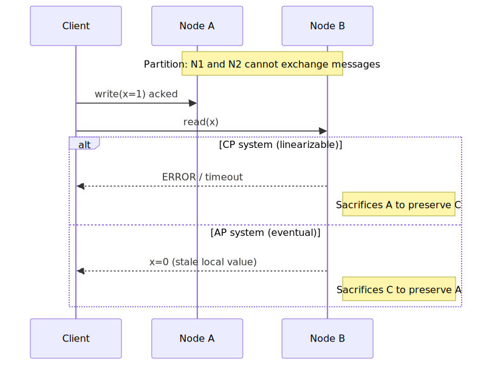
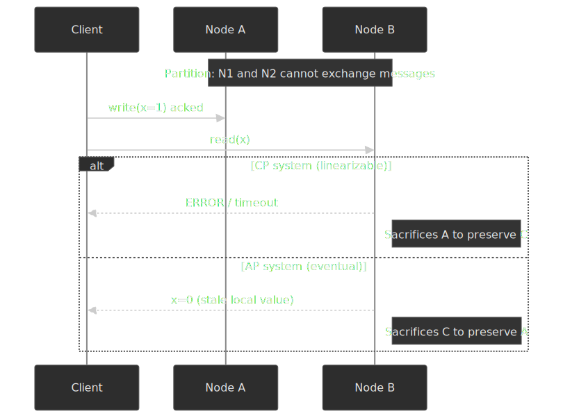

### Precise Definitions

The formal definitions from Gilbert and Lynch are more restrictive than commonly understood:

**Consistency (Linearizability):** "Any read operation that begins after a write operation completes must return that value, or the result of a later write operation." This is specifically linearizability—the strongest consistency model—not weaker models like eventual consistency.

**Availability:** "Every request received by a non-failing node in the system must result in a response." This means every non-failing node must respond, not just "most requests succeed."

**Partition Tolerance:** "The network will be allowed to lose arbitrarily many messages sent from one node to another." Any realistic distributed system must tolerate partitions—networks fail.

### What CAP Actually Says

CAP doesn't mean "pick two of three." Since partitions are unavoidable in distributed systems, the real choice is:

- **During a partition:** Choose CP (consistency, reject requests) or AP (availability, allow stale reads)
- **When no partition:** Both C and A are achievable

As Brewer clarified in his [2012 retrospective](https://www.infoq.com/articles/cap-twelve-years-later-how-the-rules-have-changed/): "The '2 of 3' formulation was always misleading because it tended to oversimplify the tensions."

### Common Misconceptions

**Misconception 1: CAP applies all the time.**
CAP only constrains behavior *during a partition*. The frequency and duration of partitions vary widely by deployment — surveys of operator data report rates from "many minutes per month inside a single rack" to "a handful of regional events per year on hyperscaler backbones" — but virtually every production network experiences at least intermittent partitions, so designing as if they will not happen is the actual mistake. See [Bailis and Kingsbury's "The Network is Reliable"](https://queue.acm.org/detail.cfm?id=2655736) for the data behind these numbers.

**Misconception 2: You must choose CP or AP globally.**
Different operations can pick different trade-offs inside the same product. A banking system can be CP for balance updates and AP for viewing transaction history; DynamoDB lets the same table serve both `ConsistentRead: true` (CP-leaning) and `ConsistentRead: false` (AP-leaning) reads side by side.

**Misconception 3: Eventual consistency means "no consistency."**
Eventual consistency is a specific [liveness](https://en.wikipedia.org/wiki/Liveness) guarantee — given no new updates, all replicas converge. It is silent on **how long** convergence takes, and on what intermediate states are visible, so the application has to reason about both.

**Misconception 4: A database is "a CP database" or "an AP database."**
Martin Kleppmann's ["Please stop calling databases CP or AP"](https://martin.kleppmann.com/2015/05/11/please-stop-calling-databases-cp-or-ap.html) (2015) makes the case explicit: most production databases satisfy neither the formal "C" (linearizability) nor the formal "A" (every non-failing node responds) once you read the Gilbert–Lynch definitions carefully. The CAP labels at best describe one operation under one configuration. Pick a per-operation guarantee instead.

### CAP and the FLP Impossibility

CAP is often confused with the older [FLP impossibility result](https://groups.csail.mit.edu/tds/papers/Lynch/jacm85.pdf) (Fischer, Lynch, Paterson, JACM 1985), which proves that in a fully **asynchronous** system with even one crash failure, no deterministic protocol can solve consensus while guaranteeing both *agreement* and *termination*. The two results are complementary:

- **FLP** rules out a deterministic, always-terminating consensus algorithm in a model where you cannot tell a slow node from a failed one. Real systems escape it by adding partial synchrony (Paxos / Raft use timeouts) or randomization.
- **CAP** is a safety statement *given* that partitions can occur; it constrains what the resulting consensus-backed system can promise to clients during a partition.

Practically: Paxos and Raft sidestep FLP by assuming bounded message delay "eventually", and they hit CAP head-on by giving up availability (`PC`) when a quorum is unreachable.

## PACELC: Beyond CAP

### The Consistency-Latency Trade-off

[Daniel Abadi formalized PACELC in 2012](https://www.cs.umd.edu/~abadi/papers/abadi-pacelc.pdf) to capture a trade-off CAP ignores: during normal operation (no partition), systems must still choose between **latency** and **consistency**.

**PACELC states:** if there is a Partition (P), choose between Availability (A) and Consistency (C); Else (E), even when operating normally, choose between Latency (L) and Consistency (C).

This explains why systems sacrifice consistency even when partitions aren't occurring — coordination takes time on the wire whether or not the network is broken.

 and for normal operation (bottom).")

### The Four PACELC Configurations

| Configuration | During Partition | Normal Operation | Example Systems                                |
| ------------- | ---------------- | ---------------- | ---------------------------------------------- |
| **PA/EL**     | Availability     | Latency          | Cassandra (default), DynamoDB (eventual reads) |
| **PA/EC**     | Availability     | Consistency      | MongoDB (default majority writes)              |
| **PC/EL**     | Consistency      | Latency          | PNUTS, Cosmos DB (bounded staleness)           |
| **PC/EC**     | Consistency      | Consistency      | Spanner, CockroachDB, classic single-leader RDBMS |

**PA/EL** systems optimize for throughput and tail latency in both scenarios, accepting weaker consistency. They dominate high-throughput, latency-sensitive workloads (feeds, sessions, telemetry).

**PC/EC** systems never compromise consistency, paying with higher commit latency and reduced availability during partitions. Financial ledgers, coordination services (etcd, ZooKeeper), and metadata stores live here.

### Why PACELC Matters More in Practice

Partitions are intermittent; coordination cost is **per request**. Even an inter-AZ Paxos round inside a single region adds 1–3 ms to every write, and a synchronous cross-region replica adds the round-trip latency of the slowest leg. Asynchronous replication acks the write locally and lets the application observe stale reads in exchange.

The two replication modes therefore set the floor for how a system slots into the PACELC table:

- **Synchronous to a quorum** → enables PC behaviour at the cost of one extra round trip per write.
- **Asynchronous to followers** → enables PA / EL behaviour at the cost of windowed staleness.

## The Consistency Spectrum

Consistency isn't binary—it's a hierarchy of models with different guarantees and costs.

### Strong Consistency Models

#### Linearizability

**Definition:** Operations appear to execute atomically at some point between their invocation and completion. All clients see the same ordering of operations.

**Definition (formal):** Defined by [Herlihy and Wing in TOPLAS 1990](https://dl.acm.org/doi/10.1145/78969.78972). Each operation appears to take effect atomically at a single point — its **linearization point** — between its invocation and its response, and that point order respects real time across all clients. If `op_a` returned before `op_b` started, no execution may order `op_b` before `op_a`.

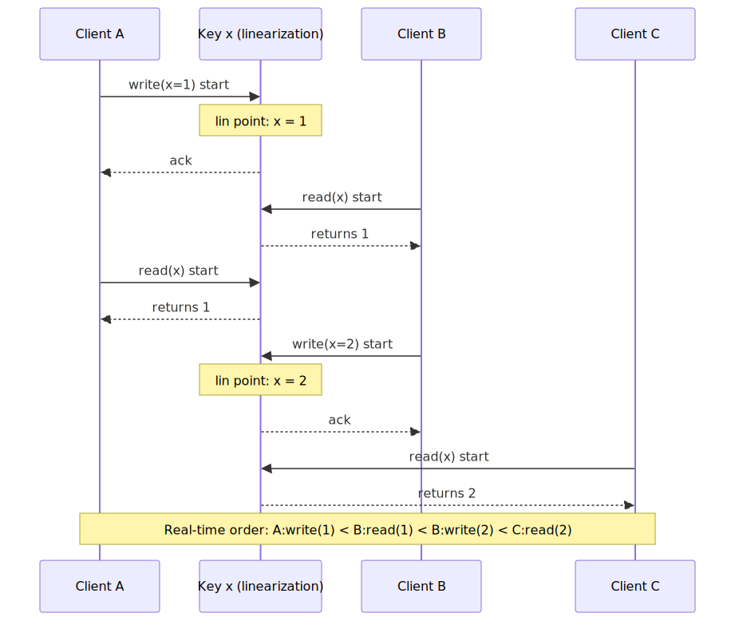
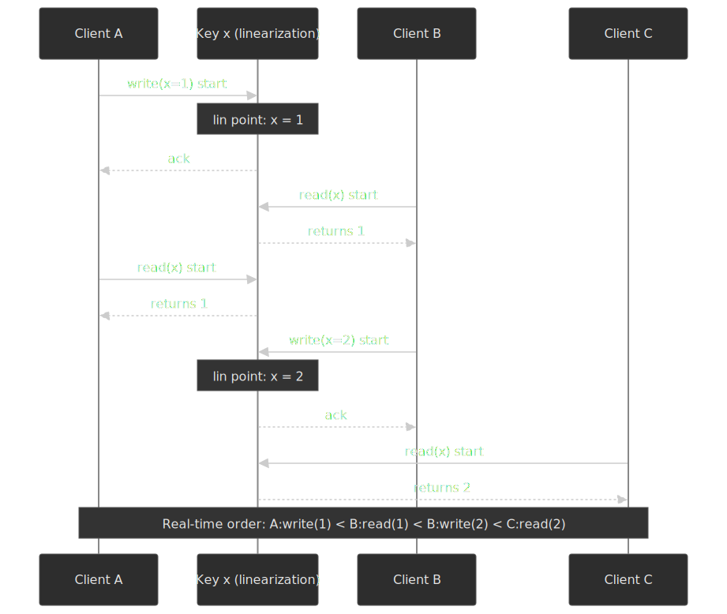

**Mechanism:** Typically requires single-leader architecture or consensus protocols (Paxos, Raft) for coordination.

**Trade-offs:**

- ✅ Simplest to reason about—behaves like a single-threaded system
- ✅ Required for distributed locks, leader election, unique constraints
- ❌ Highest latency—requires cross-replica coordination
- ❌ Reduced availability during partitions—must sacrifice A to maintain C

**Real-world:** Google Spanner achieves linearizability for transactions ("external consistency") across global datacenters using TrueTime. The [2012 Spanner paper](https://research.google.com/archive/spanner-osdi2012.pdf) reports a TrueTime uncertainty interval `ε` typically between **1 ms and 7 ms** (≈ 4 ms most of the time), produced by GPS receivers and atomic clocks at each datacenter. Spanner exploits this bound with a commit-wait mechanism: after assigning a commit timestamp `s = TT.now().latest`, the leader blocks until `TT.now().earliest > s` — at most ≈ 2 ε. The follow-up "[Spanner, TrueTime & The CAP Theorem](https://research.google.com/pubs/archive/45855.pdf)" article clarifies that external consistency is the multi-object equivalent of linearizability; Spanner is therefore CP under partition, with read-only transactions free to run at a chosen snapshot timestamp without coordination.

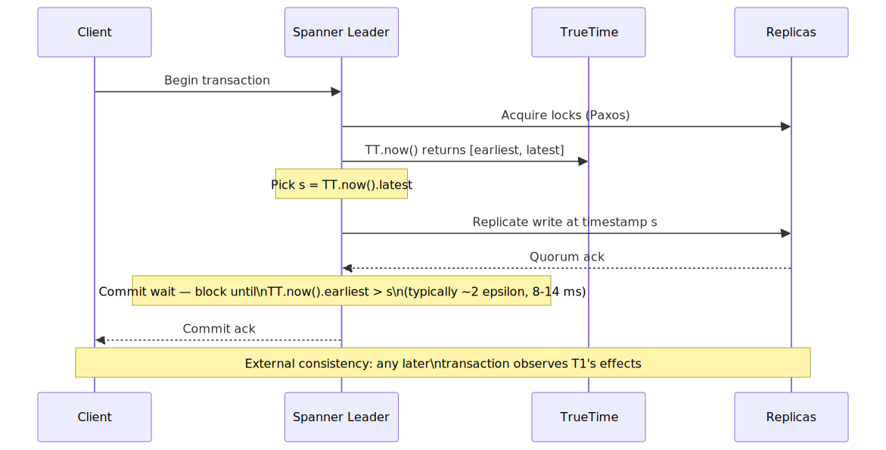
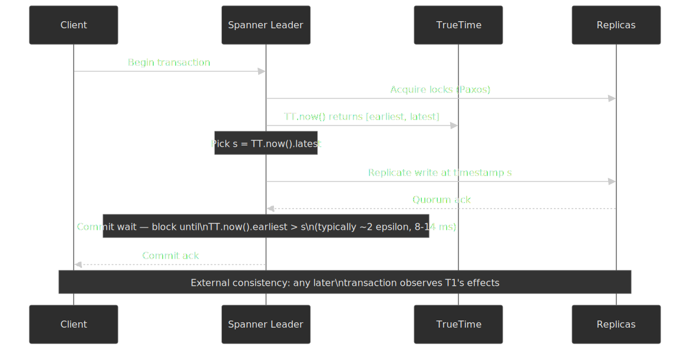

#### Sequential Consistency

**Definition:** Operations from each process appear in program order, but there's no real-time constraint on the global ordering across processes. Defined by [Lamport in 1979](https://lamport.azurewebsites.net/pubs/multi.pdf).

**Mechanism:** Maintains per-client ordering without requiring global synchronization.

**Trade-offs:**

- ✅ Lower latency than linearizability
- ✅ Preserves intuitive per-client ordering
- ❌ Different clients may observe operations in different orders
- ❌ Can't implement distributed locks correctly

**When to use:** Systems where clients care about their own operation ordering but don't need real-time guarantees about other clients' operations.

### Causal Consistency

**Definition:** Operations that are causally related must be observed by every process in the same order. Concurrent (non-causally-related) operations may be observed in different orders on different replicas. The canonical formal definition is [Ahamad, Neiger, Burns, Kohli, and Hutto's "Causal memory" (Distributed Computing, 1995)](https://link.springer.com/article/10.1007/BF01784241).

**Mechanism:** Track causal dependencies — typically with vector clocks or [hybrid logical clocks (HLCs)](https://cse.buffalo.edu/tech-reports/2014-04.pdf) — and ensure dependent operations are visible only after their predecessors.

**Trade-offs:**

- ✅ Remains available under partition, unlike linearizability ([CAP corollary](https://www.bailis.org/blog/causal-consistency-tagging-on-some-numbers/)).
- ✅ Matches programmer intuition about causality (a reply is never delivered before the message it replies to).
- ✅ Lower coordination overhead than strong consistency — only dependent ops wait.
- ❌ Concurrent writes can diverge across replicas and require an application-defined merge.
- ❌ Per-operation dependency tracking adds metadata to every message.

**Real-world:** [CockroachDB uses HLCs](https://www.cockroachlabs.com/blog/living-without-atomic-clocks/) to track causality across nodes without GPS / atomic-clock infrastructure, and MongoDB's causal-consistency sessions use a similar hybrid timestamp inside each cluster's oplog. HLCs combine a physical timestamp with a logical counter so that causal order survives even when wall-clock skew is in the tens of milliseconds.

### Session Guarantees

These are practical guarantees that provide useful consistency within a client session without requiring system-wide coordination. [Defined by Terry et al. for the Bayou system](https://www.cs.cornell.edu/courses/cs734/2000FA/cached%20papers/SessionGuaranteesPDIS_1.html) (1994). Bayou's central insight was that even on a partitioned, eventually consistent store, *per-session* ordering is enough for almost every UX requirement — and Bailis et al.'s [Highly Available Transactions](http://www.vldb.org/pvldb/vol7/p181-bailis.pdf) (VLDB 2014) later proved that read-your-writes, monotonic reads/writes, writes-follow-reads, plus several useful isolation levels (read committed, monotonic atomic view) are achievable **without** sacrificing availability or partition tolerance.

#### Read-Your-Writes

**Guarantee:** A read always reflects all prior writes from the same session.

**Use case:** User updates their profile and immediately views it—they should see their changes, not stale data.

**Implementation:** Route session to same replica, or track session's write position and ensure reads see at least that position.

#### Monotonic Reads

**Guarantee:** If a process reads value V, subsequent reads cannot return values older than V.

**Use case:** Scrolling through a feed shouldn't show older posts appearing after newer ones were already displayed.

**Implementation:** Track the latest observed timestamp/version per session; reject reads from replicas behind that point.

#### Monotonic Writes

**Guarantee:** Writes from a session are applied in order at all replicas.

**Use case:** Append-only logs, version increments, any operation where order matters.

#### Writes-Follow-Reads

**Guarantee:** A write is ordered after any reads that causally precede it in the session.

**Use case:** Reply to an email—the reply should be ordered after the message being replied to.

### Eventual Consistency

**Definition:** If no new updates occur, all replicas eventually converge to the same value. No guarantee about how long "eventually" takes or what happens during convergence.

**Mechanism:** Asynchronous replication with background anti-entropy (Merkle trees, read repair, hinted handoff).

**Trade-offs:**

- ✅ Lowest latency—return immediately after local write
- ✅ Highest availability—any replica can serve reads/writes
- ✅ Scales horizontally with minimal coordination
- ❌ Stale reads are expected and unquantified
- ❌ Concurrent writes require conflict resolution
- ❌ Application must handle inconsistency

**Real-world:** DNS is eventually consistent—TTLs control staleness bounds. [Amazon's Dynamo paper](https://www.allthingsdistributed.com/files/amazon-dynamo-sosp2007.pdf) popularized eventual consistency for shopping carts, accepting that occasional lost items were preferable to unavailability.

## Design Choices: Implementing Consistency

### Choice 1: Replication Strategy

The replication topology you pick determines the achievable consistency floor and the failure modes you have to design for.


#### Single-Leader Replication

**Mechanism:** One node accepts writes; followers replicate asynchronously or synchronously.

**When to use:**

- Need linearizable reads (if read from leader)
- Can tolerate leader failover window
- Write throughput fits on single node

**Trade-offs:**

- ✅ Simple consistency model
- ✅ Linearizable reads from leader
- ❌ Leader is write bottleneck
- ❌ Failover causes brief unavailability or potential data loss

**Real-world:** PostgreSQL streaming replication and MySQL with semi-sync replication are the canonical OLTP examples. DynamoDB uses single-leader per partition under the hood — the [USENIX ATC 2022 DynamoDB paper](https://www.usenix.org/conference/atc22/presentation/elhemali) (and the [companion engineering retrospective](https://www.amazon.science/blog/lessons-learned-from-10-years-of-dynamodb)) describe a Multi-Paxos replication group of three replicas across availability zones, with the leader serving all writes and all strongly consistent reads while the followers serve eventually consistent reads.

#### Multi-Leader Replication

**Mechanism:** Multiple nodes accept writes; changes replicate between leaders.

**When to use:**

- Multi-datacenter deployments requiring local write latency
- Offline-capable applications
- Can handle conflict resolution

**Trade-offs:**

- ✅ Lower write latency (write to local leader)
- ✅ Better availability (each datacenter independent)
- ❌ Conflicts require resolution strategy
- ❌ No linearizability across leaders

**Conflict resolution strategies:**

- **Last-write-wins (LWW):** Simple but loses data.
- **Merge:** Application-specific logic combines concurrent updates.
- **CRDTs:** [Conflict-free Replicated Data Types (Shapiro et al., INRIA 2011)](https://hal.inria.fr/inria-00609399v1/document) guarantee convergence without coordination by constraining the data type to a join-semilattice (state-based) or commutative operations (op-based). Used by Riak, Redis Enterprise CRDB, Automerge, Yjs, and Apple's Notes sync.

#### Leaderless Replication

**Mechanism:** Any node accepts reads/writes; quorums determine success.

**When to use:**

- High availability is paramount
- Eventual consistency is acceptable
- Want to avoid single points of failure

**Trade-offs:**

- ✅ No leader election, no failover
- ✅ Tunable consistency via quorum sizes
- ❌ Requires quorum math understanding
- ❌ Read repair and anti-entropy complexity

### Choice 2: Quorum Configuration

For a leaderless system with N replicas, writes require W acknowledgments and reads contact R replicas. The intersection rule is the source of strong consistency:

$$W + R > N$$

When the rule holds, every read quorum overlaps every write quorum in at least one replica, so the read sees a copy that already contains the latest acknowledged write. The same intersection idea is what Paxos and Raft majority quorums rely on for log-entry agreement.


**Typical configurations:**

| W       | R       | N   | Guarantee                   | Use Case                |
| ------- | ------- | --- | --------------------------- | ----------------------- |
| N       | 1       | N   | Write to all, read from any | Rare writes, many reads |
| ⌈(N+1)/2⌉ | ⌈(N+1)/2⌉ | N   | Majority quorum             | Balanced workload       |
| 1       | N       | N   | Write to any, read from all | Many writes, rare reads |

**Real-world:** [Cassandra's LOCAL_QUORUM](https://docs.datastax.com/en/cassandra-oss/3.0/cassandra/dml/dmlConfigConsistency.html) uses `W = R = ⌊RF/2⌋ + 1` within a datacenter. With `RF = 3`, writing to 2 replicas and reading from 2 replicas gives intra-DC strong consistency while avoiding the cross-DC round trip required by `QUORUM`.

### Choice 3: Consistency Level Selection

Modern databases offer per-operation consistency tuning:

#### DynamoDB Example

```ts title="dynamodb-read.ts"
const eventual = await dynamodb.getItem({
  TableName: 'users',
  Key: { userId: '123' },
});

const strong = await dynamodb.getItem({
  TableName: 'users',
  Key: { userId: '123' },
  ConsistentRead: true,
});
```

**Design decision:** DynamoDB defaults to eventual consistency because most reads tolerate staleness, and strongly consistent reads [cost twice as many read capacity units](https://docs.aws.amazon.com/amazondynamodb/latest/developerguide/HowItWorks.ReadConsistency.html) and may fail during a partition that isolates the leader.

#### Cassandra Example

`USING CONSISTENCY` inside a `SELECT` was deprecated in CQL 3; the supported way to set the consistency level interactively is the `cqlsh` `CONSISTENCY` command (or the `setConsistencyLevel` method on the driver's statement object).

```cql title="cqlsh"
CONSISTENCY ONE;
SELECT * FROM users WHERE user_id = '123';

CONSISTENCY LOCAL_QUORUM;
SELECT * FROM users WHERE user_id = '123';

CONSISTENCY QUORUM;
SELECT * FROM users WHERE user_id = '123';
```

### Decision Matrix: Choosing Consistency Level

| Requirement                | Consistency Level               | Rationale                                     |
| -------------------------- | ------------------------------- | --------------------------------------------- |
| Financial transactions     | Linearizable                    | Can't lose or double-count money              |
| User sees their own writes | Session/Read-your-writes        | Minimal consistency that works                |
| Analytics dashboards       | Eventual                        | Staleness measured in seconds is fine         |
| Distributed locks          | Linearizable                    | Incorrect behavior breaks coordination        |
| Social media feeds         | Causal or eventual              | Missing a post briefly is acceptable          |
| Inventory counts           | Tunable—strong for decrements   | Overselling is worse than showing stale count |
| Configuration distribution | Eventual with bounded staleness | Propagation delay acceptable                  |

## Real-World Implementations

### Google Spanner: PC/EC with TrueTime

**Problem:** Globally distributed transactions with external consistency across continents.

**Approach:** TrueTime provides bounded clock uncertainty using GPS receivers and atomic clocks at every datacenter. Spanner's commit wait ensures that any transaction `T2` starting *after* `T1` commits in real time receives a later timestamp than `T1`, giving the multi-object generalisation of linearizability the [Spanner CAP paper](https://research.google.com/pubs/archive/45855.pdf) calls **external consistency**.

**Implementation details:**

- TrueTime uncertainty `ε` is typically **1–7 ms**, around 4 ms most of the time ([Spanner OSDI 2012, §3](https://research.google.com/archive/spanner-osdi2012.pdf)).
- After choosing `s = TT.now().latest`, the leader blocks until `TT.now().earliest > s` — at most ≈ 2 ε of commit wait.
- Read-only transactions read at a chosen timestamp from any sufficiently up-to-date replica, with no commit wait and no locks.
- Writes still go through Paxos for the partition's replication group; commit wait is *added* on top of the Paxos round.

**Trade-off accepted:** A bounded extra wait on every commit (≈ 2 ε) in exchange for global serialisable transactions whose timestamps reflect real time.

**When to use:** Global financial systems, distributed transactions that span foreign keys, anywhere ACID across regions is required.

### DynamoDB: PA/EL with Tunable Reads

**Problem:** Shopping cart scale (millions of writes/second) with single-digit millisecond latency.

**Approach:** Eventually consistent by default; strongly consistent reads available per-operation.

**Implementation details:**

- Each partition has one leader and multiple followers
- Writes go to leader, replicate asynchronously
- Eventually consistent reads: any replica
- Strongly consistent reads: leader only

**Trade-off accepted:** Stale reads in exchange for lower latency and cost. Strong reads cost 2x and may fail during partitions.

**When to use:** High-throughput applications where most reads tolerate bounded staleness.

### CockroachDB: Serializable without Atomic Clocks

**Problem:** Spanner-like SQL semantics without Google's hardware.

**Approach:** [Serializable isolation backed by hybrid logical clocks](https://www.cockroachlabs.com/blog/living-without-atomic-clocks/), with an "uncertainty interval" that sits in for TrueTime's ε.

**Implementation details:**

- The **maximum clock offset** is a configured bound, not a measured one. The default is **500 ms** ([Cockroach Labs production checklist](https://www.cockroachlabs.com/docs/stable/recommended-production-settings)); Cockroach Labs recommends lowering it to **250 ms** when using multi-region SQL abstractions, while production NTP usually keeps actual skew in the single-digit-millisecond range.
- Hybrid Logical Clocks (HLC) attach a physical timestamp plus a logical counter to every transaction so causal order is preserved across clock skew.
- A **read refresh** mechanism resolves the uncertainty interval: if a read encounters a value within the uncertainty window, the transaction either restarts at a higher timestamp or refreshes its read set.
- Nodes whose clocks drift beyond 80 % of `--max-offset` against the cluster majority **self-terminate** to protect serialisability.
- The default isolation level is `SERIALIZABLE` (the strongest SQL standard level), but, unlike Spanner, CockroachDB does **not** claim global linearizability — only serialisable transactions plus per-key linearizability.

**Trade-off accepted:** Occasional transaction restarts under contention or clock skew in exchange for strong relational semantics on commodity hardware.

**When to use:** Teams that want Spanner-like SQL on a multi-cloud / on-prem footprint and can tolerate uncertainty-restart retry logic.

### Cassandra: PA/EL with Tunable Consistency

**Problem:** Multi-datacenter writes with sub-10ms latency.

**Approach:** Leaderless replication with per-query consistency levels.

**Implementation details:**

- Replication factor (RF) per keyspace
- Consistency level per query
- LOCAL_QUORUM for strong consistency within datacenter
- QUORUM for strong consistency across datacenters (higher latency)

**Strong consistency formula:** R + W > RF

**Real-world configuration:** RF=3 with LOCAL_QUORUM reads/writes provides strong consistency within each datacenter while allowing async cross-datacenter replication.

**Trade-off accepted:** Complexity of consistency level selection in exchange for flexibility to optimize per-operation.

## Common Pitfalls

### Pitfall 1: Assuming Eventual = Fast

**The mistake:** Choosing eventual consistency purely for performance without measuring.

**Why it happens:** "Eventual consistency is faster" is repeated without nuance.

**The consequence:** The actual bottleneck might be compute or network, not consistency. Synchronous replication to local replicas often adds <1ms latency.

**The fix:** Measure. Often the latency difference between eventual and strong consistency within a datacenter is negligible compared to other overheads.

### Pitfall 2: Ignoring the Consistency-Availability Trade-off in Clients

**The mistake:** Using retries with exponential backoff on a CP system during partitions.

**Why it happens:** Standard reliability patterns applied without considering CAP implications.

**The consequence:** Clients hang indefinitely during partitions waiting for a system designed to reject requests.

**The fix:** For CP systems, implement timeouts and fallback behavior. For AP systems, handle stale data gracefully.

### Pitfall 3: Read-Your-Writes Violations

**The mistake:** Writing to a leader, then reading from a follower.

**Why it happens:** Load balancer routes read to different replica than write went to.

**The consequence:** User updates their profile, refreshes, sees old data. Creates support tickets and trust issues.

**The fix:**

- Sticky sessions (route user to same replica)
- Read from leader for N seconds after write
- Include write timestamp, reject reads behind that point

### Pitfall 4: Quorum Misconfiguration

**The mistake:** Using W=1, R=1 with RF=3 expecting consistency.

**Why it happens:** Misunderstanding the W + R > RF rule.

**The consequence:** Stale reads, lost updates, split-brain scenarios.

**The fix:** Understand quorum math. For strong consistency: W + R > RF. Common pattern: W = R = (RF/2) + 1.

### Pitfall 5: Clock-Based Ordering Without Bounds

**The mistake:** Using timestamps for ordering without accounting for clock skew.

**Why it happens:** Assuming clocks are synchronized.

**The consequence:** Messages appear out of order, last-write-wins loses the actual last write.

**The fix:** Use Hybrid Logical Clocks (HLCs), or accept bounded reordering within clock skew bounds.

## How to Choose

### Step 1: Identify Consistency Requirements

**Questions to ask:**

1. What's the cost of a stale read? (User confusion? Lost money? Data corruption?)
2. What's the cost of unavailability? (Lost revenue? User frustration? Regulatory violation?)
3. What latency budget exists? (Sub-10ms? Under 100ms? Seconds acceptable?)

### Step 2: Map Requirements to Models

| If you need...                     | Consider...                                |
| ---------------------------------- | ------------------------------------------ |
| Distributed locks, leader election | Linearizability (Spanner, etcd, ZooKeeper) |
| User sees their own changes        | Session consistency / Read-your-writes     |
| Causal message ordering            | Causal consistency (HLCs)                  |
| Maximum availability               | Eventual consistency with CRDTs            |
| Per-operation flexibility          | Tunable consistency (Cassandra, DynamoDB)  |

### Step 3: Design for Failure

**For CP systems:**

- Plan what happens when system rejects requests
- Implement graceful degradation
- Consider hybrid approaches (CP for critical path, AP for others)

**For AP systems:**

- Plan conflict resolution strategy
- Design for eventual convergence
- Test with network partitions injected

### Step 4: Test Consistency Behavior

Use tools like [Jepsen](https://jepsen.io/) to verify your system actually provides claimed guarantees. Many "strongly consistent" systems have been found to violate consistency under specific failure scenarios.

## Conclusion

The CAP theorem establishes a fundamental constraint—during network partitions, distributed systems cannot provide both strong consistency and availability. However, CAP is the beginning of the discussion, not the end.

Practical systems navigate a spectrum of consistency models, each with different guarantees and costs. The PACELC extension captures the more common trade-off: even without partitions, stronger consistency requires coordination that adds latency.

The key insight is that consistency requirements vary by operation. A single system might use linearizable transactions for financial operations, causal consistency for messaging, and eventual consistency for analytics—all tuned to the actual requirements rather than a one-size-fits-all approach.

Understanding this spectrum—from the theoretical foundations of CAP through the practical considerations of PACELC to the implementation details of specific consistency models—enables informed decisions about where your system should sit on the consistency-availability-latency trade-off surface.

## Appendix

### Prerequisites

- Basic understanding of distributed systems concepts
- Familiarity with database replication terminology
- Understanding of network partitions and failure modes

### Terminology

- **Linearizability:** Operations appear to execute atomically at a single point in time, visible to all clients
- **Sequential Consistency:** Operations appear in program order per process, but no real-time guarantees
- **Causal Consistency:** Causally related operations appear in same order to all processes
- **Eventual Consistency:** All replicas converge given no new updates
- **Quorum:** Minimum number of nodes that must agree for an operation to succeed
- **Partition:** Network failure preventing communication between nodes
- **HLC:** Hybrid Logical Clock—combines physical timestamps with logical counters

### Summary

- CAP theorem constrains behavior during partitions: choose consistency or availability
- PACELC extends CAP: during normal operation, choose latency or consistency
- Consistency is a spectrum: linearizability → sequential → causal → eventual
- Session guarantees (read-your-writes, monotonic reads) often suffice for applications
- Tunable consistency (per-operation) is more useful than per-system choices
- Real systems combine multiple consistency levels for different operations

### References

#### Foundational Papers

- [Towards Robust Distributed Systems](https://people.eecs.berkeley.edu/~brewer/cs262b-2004/PODC-keynote.pdf) — Brewer, PODC 2000 keynote. The original statement of the CAP conjecture.
- [Brewer's Conjecture and the Feasibility of Consistent, Available, Partition-Tolerant Web Services](https://groups.csail.mit.edu/tds/papers/Gilbert/Brewer2.pdf) — Gilbert and Lynch, 2002. The formal proof of the CAP theorem.
- [CAP Twelve Years Later: How the "Rules" Have Changed](https://www.infoq.com/articles/cap-twelve-years-later-how-the-rules-have-changed/) — Brewer, 2012. Author's retrospective on CAP.
- [Consistency Tradeoffs in Modern Distributed Database System Design](https://www.cs.umd.edu/~abadi/papers/abadi-pacelc.pdf) — Abadi, 2012. The PACELC theorem.
- [How to Make a Multiprocessor Computer That Correctly Executes Multiprocess Programs](https://lamport.azurewebsites.net/pubs/multi.pdf) — Lamport, 1979. Defines sequential consistency.
- [Linearizability: A Correctness Condition for Concurrent Objects](https://dl.acm.org/doi/10.1145/78969.78972) — Herlihy and Wing, 1990. Defines linearizability.
- [Causal Memory: Definitions, Implementation, and Programming](https://link.springer.com/article/10.1007/BF01784241) — Ahamad, Neiger, Burns, Kohli, Hutto, 1995. Formal definition of causal consistency.
- [Session Guarantees for Weakly Consistent Replicated Data](https://www.cs.cornell.edu/courses/cs734/2000FA/cached%20papers/SessionGuaranteesPDIS_1.html) — Terry et al., 1994. Defines session consistency guarantees.
- [Logical Physical Clocks and Consistent Snapshots in Globally Distributed Databases](https://cse.buffalo.edu/tech-reports/2014-04.pdf) — Kulkarni, Demirbas et al., 2014. The HLC paper.
- [The Network is Reliable](https://queue.acm.org/detail.cfm?id=2655736) — Bailis and Kingsbury, 2014. Survey of real-world network partition rates.
- [Highly Available Transactions: Virtues and Limitations](http://www.vldb.org/pvldb/vol7/p181-bailis.pdf) — Bailis, Davidson, Fekete, Ghodsi, Hellerstein, Stoica, VLDB 2014. Maps which isolation/consistency levels can coexist with availability and partition tolerance.
- [Impossibility of Distributed Consensus with One Faulty Process](https://groups.csail.mit.edu/tds/papers/Lynch/jacm85.pdf) — Fischer, Lynch, Paterson, JACM 1985. The FLP impossibility result.
- [Conflict-free Replicated Data Types](https://hal.inria.fr/inria-00609399v1/document) — Shapiro, Preguiça, Baquero, Zawirski, INRIA RR-7687, 2011. The canonical CRDT taxonomy.
- [Please stop calling databases CP or AP](https://martin.kleppmann.com/2015/05/11/please-stop-calling-databases-cp-or-ap.html) — Kleppmann, 2015. Why CAP labels usually mislead.

#### System Papers

- [Spanner: Google's Globally-Distributed Database](https://research.google.com/archive/spanner-osdi2012.pdf) — Corbett et al., 2012. TrueTime and external consistency.
- [Spanner, TrueTime & The CAP Theorem](https://research.google.com/pubs/archive/45855.pdf) — Google's clarification on how Spanner relates to CAP.
- [Amazon DynamoDB: A Scalable, Predictably Performant, and Fully Managed NoSQL Database Service](https://www.usenix.org/conference/atc22/presentation/elhemali) — DynamoDB team, USENIX ATC 2022. Multi-Paxos, leader-based replication.
- [Dynamo: Amazon's Highly Available Key-value Store](https://www.allthingsdistributed.com/files/amazon-dynamo-sosp2007.pdf) — DeCandia et al., 2007. The original eventual-consistency design.

#### Documentation

- [DynamoDB Read Consistency](https://docs.aws.amazon.com/amazondynamodb/latest/developerguide/HowItWorks.ReadConsistency.html) — AWS documentation on consistency options.
- [Cassandra Consistency Levels](https://docs.datastax.com/en/cassandra-oss/3.0/cassandra/dml/dmlConfigConsistency.html) — DataStax documentation.
- [CockroachDB Consistency Model](https://www.cockroachlabs.com/blog/consistency-model/) — CockroachDB's approach explained.
- [Cockroach Labs Production Checklist (clock sync)](https://www.cockroachlabs.com/docs/stable/recommended-production-settings) — Default `--max-offset` and clock sync recommendations.
- [Jepsen Consistency Models](https://jepsen.io/consistency) — Visual hierarchy of consistency models, with linked Jepsen test reports.

#### Books

- [Designing Data-Intensive Applications](https://dataintensive.net/) — Kleppmann, 2017. Chapters 5 and 9 cover replication and consistency in depth.
