# Core Web Vitals Measurement: Lab vs Field Data

How to measure, interpret, and debug Core Web Vitals using lab tools, field data (Real User Monitoring), and the web-vitals library. Covers metric-specific diagnostics for LCP, INP, and CLS with implementation patterns for production RUM pipelines.




## Abstract

Core Web Vitals measurement splits into two fundamentally different contexts: **lab data** (synthetic, controlled) and **field data** (real users, variable conditions). Lab tools like Lighthouse provide reproducible diagnostics but cannot predict real-world performance — cache state, device diversity, and actual interaction patterns create systematic gaps. Field data from the [Chrome User Experience Report (CrUX)](https://developer.chrome.com/docs/crux) or custom Real User Monitoring (RUM) captures the 75th-percentile experience that determines Google's ranking signals.

Since [March 12, 2024](https://web.dev/blog/inp-cwv-march-12), the responsiveness vital is **Interaction to Next Paint (INP)**, replacing First Input Delay (FID). Throughout this article, all three vitals are measured at p75 of page loads and assessed against the [official thresholds](https://web.dev/articles/vitals): LCP good ≤ 2.5 s / poor > 4 s; INP good ≤ 200 ms / poor > 500 ms; CLS good ≤ 0.1 / poor > 0.25.

The mental model:

- **Lab data** answers "what's the best this page can do?" and "what changed in this deploy?"
- **Field data** answers "what are real users experiencing?" and "are we meeting Core Web Vitals thresholds?"
- **Attribution data** answers "why is this metric slow?" with element-level and timing-breakdown diagnostics

Each metric has distinct measurement nuances:

- **LCP** (Largest Contentful Paint): Four quantifiable subparts (Time to First Byte (TTFB), resource load delay, resource load time, element render delay) — the median origin with a *poor* LCP rating spends [≈ 1.29 s in resource load delay alone](https://web.dev/blog/common-misconceptions-lcp), >50 % of the 2.5 s budget consumed before the LCP resource even starts downloading
- **INP** (Interaction to Next Paint): Three-phase breakdown (input delay + processing time + presentation delay) with [outlier filtering](https://web.dev/articles/inp#how_inp_is_calculated) — one highest interaction is ignored per 50 interactions, approximating a high percentile (~p98) rather than the absolute worst
- **CLS** (Cumulative Layout Shift): [Session windows](https://web.dev/articles/cls#what_is_cls) (1 s gap, 5 s cap) with `hadRecentInput` exclusion — shifts within 500 ms of a discrete user input are considered expected

The [`web-vitals` library](https://github.com/GoogleChrome/web-vitals) (v5.x) is the canonical implementation for RUM collection: ~ 2 KB brotli for the standard build, ~ 3.5 KB for the attribution build (~ 1.5 KB extra) which provides the root-cause data essential for debugging. For field data at scale, CrUX provides daily page- and origin-level aggregates via the CrUX API, weekly trend data via the CrUX History API, and monthly origin-only data via the BigQuery dataset.

## Lab vs Field: Fundamental Differences

Lab and field data measure the same metrics but produce systematically different results. Understanding these differences is essential for interpreting measurements and prioritizing optimization work.

### Lab Data Characteristics

Lab tools (Lighthouse, WebPageTest, Chrome DevTools) run in controlled environments with predefined conditions:

| Parameter        | Typical Lab Setting                | Real-World Reality                     |
| ---------------- | ---------------------------------- | -------------------------------------- |
| **Network**      | 1.6 Mbps, 150ms RTT (simulated 4G) | Variable: 50 Mbps fiber to 100 Kbps 2G |
| **CPU**          | 4x throttling on fast desktop      | Low-end Android: actual 2-4 GFLOPS     |
| **Cache**        | Always cold (cleared before test)  | Often warm for returning visitors      |
| **Viewport**     | Fixed 412×823 (mobile) or 1350×940 | Diverse: 320px to 4K displays          |
| **Interactions** | None (or scripted clicks)          | Real user patterns, scroll depth       |

Lab data provides **reproducible baselines** and **regression detection** but cannot capture the diversity of real-world conditions. A Lighthouse score of 95 does not guarantee good field metrics.

### Field Data Characteristics

Field data from CrUX or custom RUM aggregates real user experiences:

- **28-day rolling window**: CrUX summarises 28 days of Chrome user data; new data lands daily but the full window only refreshes after 28 days, smoothing variance and lagging behind deploys
- **75th percentile**: The reported value means 75 % of experiences were better — this is the [threshold](https://web.dev/articles/vitals#core_web_vitals_thresholds) for "passing" Core Web Vitals
- **Traffic-weighted**: High-traffic pages dominate origin-level metrics
- **Cache-aware**: Returning visitors often have cached resources, improving LCP

> [!NOTE]
> **Design rationale for 75th percentile.** Google [chose p75](https://web.dev/articles/defining-core-web-vitals-thresholds#how_to_evaluate_a_segmentation_methods_real_world_performance) as a compromise between "most users" (median ignores the long tail) and "achievable" (p95 fails most sites on edge cases). p75 roughly corresponds to the experience of users on slower connections or devices and biases attention toward the population that struggles, not the median visitor.

### When Lab and Field Diverge

Common scenarios where lab and field metrics differ significantly:

| Scenario                    | Lab Result                     | Field Result                 | Why                                         |
| --------------------------- | ------------------------------ | ---------------------------- | ------------------------------------------- |
| **Cached resources**        | Always misses cache            | Returning visitors hit cache | Field LCP can be much faster                |
| **Lazy-loaded images**      | Fixed viewport, limited scroll | Users scroll variably        | Field CLS includes shifts from lazy content |
| **Personalization**         | Static content                 | User-specific content        | Different LCP elements per user segment     |
| **Third-party scripts**     | May load fully                 | May be blocked (ad blockers) | Field may show better or worse performance  |
| **Geographic distribution** | Single origin location         | Global user base             | Latency varies dramatically by region       |

**Practical guidance**: If you have both lab and field data for a page, prioritize field data for understanding user experience. Use lab data for debugging specific issues and validating fixes before deploy.

## Measurement APIs and the web-vitals Library

### PerformanceObserver Entry Types

The browser exposes Core Web Vitals through `PerformanceObserver` with specific entry types:

| Metric  | Entry Type                 | Key Properties                                                        |
| ------- | -------------------------- | --------------------------------------------------------------------- |
| **LCP** | `largest-contentful-paint` | `element`, `renderTime`, `loadTime`, `size`, `url`                    |
| **CLS** | `layout-shift`             | `value`, `hadRecentInput`, `sources[]`                                |
| **INP** | `event`                    | `startTime`, `processingStart`, `processingEnd`, `duration`, `target` |

Critical configuration details:

```ts title="performance-observer-setup.ts" collapse={1-2, 17-20}
// Basic LCP observation
const lcpObserver = new PerformanceObserver((list) => {
  const entries = list.getEntries()
  const lastEntry = entries[entries.length - 1]
  console.log("LCP candidate:", lastEntry.startTime, lastEntry.element)
})

// IMPORTANT: Use `type` not `entryTypes` when using buffered or durationThreshold
lcpObserver.observe({
  type: "largest-contentful-paint",
  buffered: true, // Retrieve entries from before observer was created
})

// For event timing (INP), lower threshold captures more interactions
const eventObserver = new PerformanceObserver((list) => {
  /* ... */
})
eventObserver.observe({
  type: "event",
  durationThreshold: 16, // Default is 104ms; minimum is 16ms (one frame at 60fps)
  buffered: true,
})
```

**Why `type` instead of `entryTypes`?** The `buffered` and `durationThreshold` options only work with [`type`](https://developer.mozilla.org/en-US/docs/Web/API/PerformanceObserver/observe) (single entry type). Using `entryTypes` (array) silently ignores these options — a common source of bugs in RUM implementations.

**`durationThreshold` design.** The [default 104 ms threshold](https://www.w3.org/TR/event-timing/#sec-default-duration-threshold) is the first multiple of 8 ms above 100 ms; the API rounds `duration` to 8 ms granularity to mitigate cross-origin timing attacks, so 104 ms is the smallest pre-rounded value guaranteed ≥ 100 ms. The minimum allowed threshold is 16 ms (one frame at 60 Hz). For comprehensive measurement set `durationThreshold: 16`; the [`web-vitals` library defaults `onINP` to 40 ms](https://github.com/GoogleChrome/web-vitals/issues/568) — lower than the platform default and a frequent source of "duration < 40 ms" surprises in custom code that mixes the library with raw observers.

### The web-vitals Library

Google's `web-vitals` library (v5.x, ~2KB brotli) provides the canonical implementation of metric collection:

```ts title="web-vitals-basic.ts" collapse={1-2, 15-20}
import { onLCP, onINP, onCLS, onTTFB, onFCP } from "web-vitals"

// Each callback receives a metric object with:
// - name: 'LCP' | 'INP' | 'CLS' | etc.
// - value: The metric value
// - delta: Change since last report (important for CLS)
// - id: Unique identifier for this page load
// - rating: 'good' | 'needs-improvement' | 'poor'
// - entries: Array of PerformanceEntry objects

onLCP((metric) => {
  sendToAnalytics({ name: metric.name, value: metric.value, rating: metric.rating })
})

onINP((metric) => {
  /* ... */
})
onCLS((metric) => {
  /* ... */
})
```

**The `delta` property is critical for analytics**: CLS accumulates over the session. If you send `metric.value` on every callback, your aggregate CLS will be inflated. Always use `metric.delta` for analytics systems that sum values.

### Attribution Build for Debugging

The attribution build (~3.5KB brotli) adds diagnostic data essential for root-cause analysis:

```ts title="web-vitals-attribution.ts" collapse={1-3, 20-25}
import { onLCP, onINP, onCLS } from "web-vitals/attribution"

onLCP((metric) => {
  const { attribution } = metric
  console.log("LCP Element:", attribution.element)
  console.log("LCP URL:", attribution.url) // Image/video source if applicable

  // LCP subpart breakdown (see next section)
  console.log("TTFB:", attribution.timeToFirstByte)
  console.log("Resource Load Delay:", attribution.resourceLoadDelay)
  console.log("Resource Load Time:", attribution.resourceLoadTime)
  console.log("Element Render Delay:", attribution.elementRenderDelay)
})

onINP((metric) => {
  const { attribution } = metric
  console.log("Interaction target:", attribution.interactionTarget)
  console.log("Input delay:", attribution.inputDelay)
  console.log("Processing time:", attribution.processingDuration)
  console.log("Presentation delay:", attribution.presentationDelay)
})

onCLS((metric) => {
  const { attribution } = metric
  console.log("Largest shift target:", attribution.largestShiftTarget)
  console.log("Largest shift value:", attribution.largestShiftValue)
  console.log("Largest shift time:", attribution.largestShiftTime)
})
```

## LCP Measurement and Diagnostics

### Qualifying Elements

The [W3C Largest Contentful Paint specification](https://www.w3.org/TR/largest-contentful-paint/) and the [web.dev LCP guide](https://web.dev/articles/lcp) define which elements can be LCP candidates:

- `` elements (including `` inside `<picture>`)
- `<image>` elements inside SVG
- `<video>` elements — poster image; from [Chrome 116+](https://web.dev/learn/performance/video-performance), the first painted frame also qualifies when no poster is set
- Elements with `background-image` loaded via CSS `url(...)` (gradients are excluded)
- Block-level elements containing text nodes or inline-level text children

**Exclusions** (elements that cannot be LCP):

- Elements with `opacity: 0`
- Elements that cover (roughly) the full viewport — treated as background rather than content
- [Low-entropy placeholders](https://chromium.googlesource.com/chromium/src/+/refs/heads/main/docs/speed/metrics_changelog/2023_04_lcp.md): images with **less than 0.05 bits of image data per displayed pixel** (Chrome 112+) — calculated as `encodedBodySize × 8 / (displayWidth × displayHeight)`

> [!IMPORTANT]
> Two non-obvious LCP behaviours catch teams out:
>
> 1. **Removed elements still count.** Once an element has been painted as the largest, removing it from the DOM does not retract the entry. A larger element rendered later replaces it; otherwise the original wins.
> 2. **Reporting stops at the first user interaction** (scroll, click, or keypress). Code that tries to measure LCP after a click runs into a frozen value, not "live" tracking.

### LCP Subparts Breakdown

LCP can be decomposed into four measurable subparts, each pointing to different optimization strategies:




| Subpart                  | What It Measures                              | Optimization Target                     |
| ------------------------ | --------------------------------------------- | --------------------------------------- |
| **TTFB**                 | Server response time                          | Origin speed, CDN, caching              |
| **Resource Load Delay**  | Time from TTFB to starting LCP resource fetch | Resource discoverability, preload hints |
| **Resource Load Time**   | Download duration of LCP resource             | Image optimization, CDN                 |
| **Element Render Delay** | Time from download complete to paint          | Render-blocking JS/CSS, main thread     |

**Target distribution.** [Optimize LCP](https://web.dev/articles/optimize-lcp#lcp-breakdown) recommends keeping the two delay subparts below ~10 % each on a well-tuned page; that leaves roughly 80 % split between TTFB and Resource Load Time, with the exact split dictated by origin speed vs. payload size.

**Real-world finding.** The [August 2024 Chrome team analysis](https://web.dev/blog/common-misconceptions-lcp) of CrUX field data shows the median origin with a *poor* LCP rating spends ≈ 1,290 ms in Resource Load Delay alone — over half of the 2.5 s "good" budget — and ~ 4× longer waiting to start the fetch than actually downloading. The usual root cause is late discovery: the LCP image is referenced from JavaScript, CSS `background-image`, deep DOM, or a hydration-time mount that the [preload scanner](https://web.dev/articles/preload-scanner) cannot see.

### LCP Measurement Code with Subparts

```ts title="lcp-diagnostics.ts" collapse={1-4, 25-30}
import { onLCP } from "web-vitals/attribution"

interface LCPDiagnostics {
  totalLCP: number
  ttfb: number
  resourceLoadDelay: number
  resourceLoadTime: number
  elementRenderDelay: number
  element: string
  url: string | null
}

onLCP((metric) => {
  const { attribution } = metric

  const diagnostics: LCPDiagnostics = {
    totalLCP: metric.value,
    ttfb: attribution.timeToFirstByte,
    resourceLoadDelay: attribution.resourceLoadDelay,
    resourceLoadTime: attribution.resourceLoadTime,
    elementRenderDelay: attribution.elementRenderDelay,
    element: attribution.element || "unknown",
    url: attribution.url || null,
  }

  // Identify which subpart is the bottleneck
  const subparts = [
    { name: "TTFB", value: diagnostics.ttfb },
    { name: "Resource Load Delay", value: diagnostics.resourceLoadDelay },
    { name: "Resource Load Time", value: diagnostics.resourceLoadTime },
    { name: "Element Render Delay", value: diagnostics.elementRenderDelay },
  ]

  const bottleneck = subparts.reduce((max, curr) => (curr.value > max.value ? curr : max))

  sendToAnalytics({
    ...diagnostics,
    bottleneck: bottleneck.name,
  })
})
```

## INP Measurement and Diagnostics

### The INP Processing Model

INP measures the latency of user interactions across the entire page session. Each interaction has three phases:

. The web-vitals attribution build joins them by timestamp.")


| Phase                  | What It Measures                       | Common Causes of Slowness               |
| ---------------------- | -------------------------------------- | --------------------------------------- |
| **Input Delay**        | Time from user action to handler start | Main thread blocked by other tasks      |
| **Processing Time**    | Event handler execution duration       | Expensive handler logic, forced reflows |
| **Presentation Delay** | Time from handler end to visual update | Large DOM updates, layout thrashing     |

### Interaction Grouping

Multiple events from a single user action (e.g., `keydown`, `keyup` for a keystroke; `pointerdown`, `pointerup`, `click` for a tap) are grouped into a single *interaction*. The interaction's latency is the maximum duration among its events.

The Event Timing API exposes many event types, but only events that get an [`interactionId`](https://developer.mozilla.org/en-US/docs/Web/API/PerformanceEventTiming/interactionId) contribute to INP grouping:

- **Pointer/tap/click**: `pointerdown`, `pointerup`, `click`
- **Keyboard**: `keydown`, `keyup`

**Excluded** (continuous events; no `interactionId`): `mousemove`, `pointermove`, `pointerrawupdate`, `touchmove`, `wheel`, `drag`, and `scroll` (scroll is decoupled from input events in Chromium and is [explicitly out of scope](https://web.dev/blog/better-responsiveness-metric) for INP).

### Worst Interaction Selection with Outlier Handling

INP doesn't report the absolute worst interaction — it uses [outlier filtering](https://web.dev/articles/inp#how_inp_is_calculated) to prevent random hiccups from inflating the score:

- **< 50 interactions**: INP = worst interaction latency (effectively p100)
- **≥ 50 interactions**: INP approximates a high percentile (~p98) — one highest interaction is ignored per 50 interactions

**Design rationale.** A generally responsive page with one 2-second interaction caused by a network glitch shouldn't fail INP. The filter approximates "typical worst-case" rather than "absolute worst-case."

**Implementation efficiency.** Browsers don't store all interactions; they maintain a small fixed-size list (typically ~10) of the worst-N entries, sufficient for the p98 approximation without bounded-memory concerns on long sessions.

### INP Diagnostics Code

```ts title="inp-diagnostics.ts" collapse={1-4, 30-35}
import { onINP } from "web-vitals/attribution"

interface INPDiagnostics {
  totalINP: number
  inputDelay: number
  processingTime: number
  presentationDelay: number
  interactionTarget: string
  interactionType: string
}

onINP((metric) => {
  const { attribution } = metric

  const diagnostics: INPDiagnostics = {
    totalINP: metric.value,
    inputDelay: attribution.inputDelay,
    processingTime: attribution.processingDuration,
    presentationDelay: attribution.presentationDelay,
    interactionTarget: attribution.interactionTarget || "unknown",
    interactionType: attribution.interactionType || "unknown",
  }

  // Identify the dominant phase
  const phases = [
    { name: "inputDelay", value: diagnostics.inputDelay },
    { name: "processingTime", value: diagnostics.processingTime },
    { name: "presentationDelay", value: diagnostics.presentationDelay },
  ]

  const dominant = phases.reduce((max, curr) => (curr.value > max.value ? curr : max))

  // High input delay → main thread was blocked (long task)
  // High processing time → slow event handler
  // High presentation delay → expensive layout/paint after handler

  sendToAnalytics({
    ...diagnostics,
    dominantPhase: dominant.name,
    recommendation: getRecommendation(dominant.name),
  })
})

function getRecommendation(phase: string): string {
  switch (phase) {
    case "inputDelay":
      return "Break up long tasks with scheduler.yield()"
    case "processingTime":
      return "Optimize event handler or defer work"
    case "presentationDelay":
      return "Reduce DOM mutations, avoid forced reflows"
    default:
      return ""
  }
}
```

### Script-Level Attribution via Long Animation Frames

Phase-level breakdown tells you *where* in the frame to look; it doesn't tell you *which line of which bundle* burned the time. The [Long Animation Frames API (LoAF)](https://developer.chrome.com/docs/web-platform/long-animation-frames) — stable in Chrome since version 123 — fills that gap by exposing entire animation frames that took longer than 50 ms to render, with per-script attribution.

Each `PerformanceLongAnimationFrameTiming` entry exposes:

- Frame timing: `renderStart`, `styleAndLayoutStart`, `firstUIEventTimestamp`, `blockingDuration` — distinguishing input delay, work, and rendering work inside one frame.
- A [`scripts[]`](https://developer.mozilla.org/en-US/docs/Web/API/PerformanceLongAnimationFrameTiming/scripts) array of `PerformanceScriptTiming` entries, one per script that ran ≥ 5 ms during the frame, each with:
  - [`sourceURL`](https://developer.mozilla.org/en-US/docs/Web/API/PerformanceScriptTiming/sourceURL) — the script file URL (also surfaced on `PerformanceEventTiming` entries when LoAF can be correlated).
  - `sourceCharPosition` — character offset into that script for the slow function.
  - `sourceFunctionName` — the named function (or `""` for anonymous closures).
  - `invoker` — the call site, e.g. `BUTTON#submit.onclick` or `Window.requestAnimationFrame`.
  - `invokerType` — `event-listener`, `user-callback`, `promise-resolve`, etc.
  - `forcedStyleAndLayoutDuration` — synchronous layout/style work the script forced (the canonical layout-thrashing signal).

The `web-vitals` attribution build (v4+) automatically intersects LoAF entries with each INP-qualifying interaction and exposes them as `attribution.longAnimationFrameEntries`:

```ts title="inp-loaf-attribution.ts"
import { onINP } from "web-vitals/attribution"

onINP(({ attribution, value }) => {
  const loafs = attribution.longAnimationFrameEntries ?? []
  const slowest = loafs
    .flatMap((f) => f.scripts)
    .toSorted((a, b) => b.duration - a.duration)[0]

  if (slowest) {
    sendToAnalytics({
      inp: value,
      scriptUrl: slowest.sourceURL,
      scriptFn: slowest.sourceFunctionName || "(anonymous)",
      scriptChar: slowest.sourceCharPosition,
      invoker: slowest.invoker,
      forcedLayoutMs: slowest.forcedStyleAndLayoutDuration,
    })
  }
})
```

> [!IMPORTANT]
> Script attribution is **same-origin-only**. Cross-origin scripts (third-party tags, ad SDKs) appear with `sourceURL: ""` and no character position unless they are served with `crossorigin="anonymous"` on the `<script>` tag and a permissive [`Timing-Allow-Origin`](https://developer.mozilla.org/en-US/docs/Web/HTTP/Headers/Timing-Allow-Origin) header. Web workers and cross-origin iframes get no script-level attribution at all. In RUM, expect a non-trivial bucket of "unknown third-party" interactions and segment them separately.

The LoAF buffer is capped at 200 entries, so always observe with a `PerformanceObserver` rather than calling `getEntriesByType('long-animation-frame')` after the fact.

## CLS Measurement and Diagnostics

### Session Windows

CLS doesn't sum all layout shifts — it uses [session windows](https://web.dev/blog/evolving-cls) to group related shifts:

- A **session window** starts with a layout shift and includes all subsequent shifts that occur within 1 s of the previous one
- Each window has a maximum duration of 5 s
- **CLS = maximum session window score** (not the sum of all windows)




**Design rationale.** Long-lived single-page applications (SPAs) would accumulate unbounded CLS if all shifts were summed. Session windows capture "bursts" of instability while ignoring isolated, minor shifts spread across a long session. (Even with windowing, CLS in the standard `web-vitals` library is still attributed to the initial URL of an SPA — see [SPAs and soft navigations](#spas-and-soft-navigations) below.)

### Expected vs Unexpected Shifts

The Layout Instability API marks shifts as "expected" (via [`hadRecentInput: true`](https://developer.mozilla.org/en-US/docs/Web/API/LayoutShift/hadRecentInput)) when they occur within 500 ms of a discrete user input:

```ts title="cls-filtering.ts"
new PerformanceObserver((list) => {
  for (const entry of list.getEntries()) {
    // Skip shifts caused by user interaction
    if (entry.hadRecentInput) continue

    // Only count unexpected shifts
    reportCLSShift(entry.value, entry.sources)
  }
}).observe({ type: "layout-shift", buffered: true })
```

**Qualifying inputs for `hadRecentInput`**: discrete inputs only — taps, clicks, and keypresses (the spec leaves the exact event list to the implementation; Chromium currently latches `lastInputTime` on input-driven events). [Continuous gestures — scrolls, drags, pinch-zoom — do not flag the shift](https://web.dev/articles/cls#expected_vs_unexpected_layout_shifts).

**Why 500 ms?** The window covers the typical UI lag between user action and the resulting layout change (clicking an accordion, expanding a row). Shifts outside this window are "unexpected" and count toward CLS.

### Layout Shift Sources

Each `layout-shift` entry includes `sources[]` identifying which elements moved:

```ts title="cls-sources.ts" collapse={1-2}
interface LayoutShiftSource {
  node: Node | null // The element that shifted (may be null if removed)
  previousRect: DOMRectReadOnly // Position before shift
  currentRect: DOMRectReadOnly // Position after shift
}

// The shift value is calculated from the impact region:
// (intersection of viewport with union of previous and current rects)
// divided by viewport area, weighted by distance fraction
```

### CLS Diagnostics Code

```ts title="cls-diagnostics.ts" collapse={1-4, 25-30}
import { onCLS } from "web-vitals/attribution"

interface CLSDiagnostics {
  totalCLS: number
  largestShiftTarget: string
  largestShiftValue: number
  largestShiftTime: number
  shiftCount: number
}

onCLS((metric) => {
  const { attribution } = metric

  const diagnostics: CLSDiagnostics = {
    totalCLS: metric.value,
    largestShiftTarget: attribution.largestShiftTarget || "unknown",
    largestShiftValue: attribution.largestShiftValue,
    largestShiftTime: attribution.largestShiftTime,
    shiftCount: metric.entries.length,
  }

  // Common CLS culprits by element type
  const target = diagnostics.largestShiftTarget
  let cause = "unknown"

  if (target.includes("img")) cause = "Image without dimensions"
  else if (target.includes("iframe")) cause = "Embedded content resize"
  else if (target.includes("ad") || target.includes("banner")) cause = "Ad injection"
  else if (target.includes("font") || /^(p|h[1-6]|span)$/i.test(target)) cause = "Font swap"

  sendToAnalytics({ ...diagnostics, likelyCause: cause })
})
```

## Field Data: CrUX and RUM Pipelines

### Chrome User Experience Report (CrUX)

[CrUX](https://developer.chrome.com/docs/crux) aggregates 28-day rolling samples from opted-in Chrome users and is the source of field metrics for Google Search ranking:

| Data Source            | Update Frequency                       | Data Granularity                                                | Use Case                                  |
| ---------------------- | -------------------------------------- | --------------------------------------------------------------- | ----------------------------------------- |
| **[CrUX API](https://developer.chrome.com/docs/crux/api)**           | Daily                                  | Origin or page URL                                              | Real-time monitoring, CI/CD checks        |
| **[CrUX History API](https://developer.chrome.com/docs/crux/history-api)**   | Weekly (Mondays)                       | Origin or page URL; default 25, max 40 collection periods (~10 mo) | Trend analysis, regression detection      |
| **[BigQuery](https://developer.chrome.com/docs/crux/bigquery)**           | Monthly (2nd Tuesday)                  | **Origin only**                                                 | Large-scale analysis, industry benchmarks |
| **[PageSpeed Insights](https://pagespeed.web.dev/)** | Daily (CrUX) + on-demand (Lighthouse)  | Page URL                                                        | Combined lab + field, quick checks        |

### CrUX API Usage

```ts title="crux-api.ts" collapse={1-5, 30-40}
interface CrUXResponse {
  record: {
    key: { url?: string; origin?: string }
    metrics: {
      largest_contentful_paint: MetricData
      interaction_to_next_paint: MetricData
      cumulative_layout_shift: MetricData
    }
  }
}

interface MetricData {
  histogram: Array<{ start: number; end?: number; density: number }>
  percentiles: { p75: number }
}

async function queryCrUX(urlOrOrigin: string): Promise<CrUXResponse> {
  const isOrigin = !urlOrOrigin.includes("/", urlOrOrigin.indexOf("//") + 2)

  const response = await fetch(`https://chromeuxreport.googleapis.com/v1/records:queryRecord?key=${API_KEY}`, {
    method: "POST",
    headers: { "Content-Type": "application/json" },
    body: JSON.stringify({
      [isOrigin ? "origin" : "url"]: urlOrOrigin,
      formFactor: "PHONE", // Or 'DESKTOP', 'TABLET', or omit for all
    }),
  })

  return response.json()
}

// Rate limit: 150 queries/minute per Google Cloud project
// Data coverage: Requires sufficient traffic (anonymity threshold)
```

### Building a RUM Pipeline

Production RUM requires handling edge cases the web-vitals library doesn't solve:

```ts title="rum-pipeline.ts" collapse={1-8, 45-55}
import { onLCP, onINP, onCLS, onFCP, onTTFB } from "web-vitals/attribution"

interface RUMPayload {
  sessionId: string
  pageUrl: string
  timestamp: number
  metrics: Record<string, number>
  attribution: Record<string, unknown>
  metadata: {
    deviceType: string
    connectionType: string
    viewport: { width: number; height: number }
  }
}

// Generate stable session ID
const sessionId = crypto.randomUUID()

// Collect device/connection context
function getMetadata() {
  return {
    deviceType: /Mobi|Android/i.test(navigator.userAgent) ? "mobile" : "desktop",
    connectionType:
      (navigator as Navigator & { connection?: { effectiveType: string } }).connection?.effectiveType || "unknown",
    viewport: { width: window.innerWidth, height: window.innerHeight },
  }
}

// Batch and send metrics
const metricQueue: RUMPayload[] = []

function queueMetric(metric: { name: string; value: number; delta: number; attribution?: unknown }) {
  metricQueue.push({
    sessionId,
    pageUrl: window.location.href,
    timestamp: Date.now(),
    metrics: { [metric.name]: metric.delta }, // Use delta for CLS
    attribution: (metric.attribution as Record<string, unknown>) || {},
    metadata: getMetadata(),
  })
}

function flush() {
  if (metricQueue.length === 0) return
  navigator.sendBeacon("/analytics/rum", JSON.stringify(metricQueue))
  metricQueue.length = 0
}

// Send on visibilitychange (hidden) for tab/app-switch finality,
// and on pagehide for the bfcache-friendly terminal event.
document.addEventListener("visibilitychange", () => {
  if (document.visibilityState === "hidden") flush()
})
addEventListener("pagehide", flush)

onLCP(queueMetric)
onINP(queueMetric)
onCLS(queueMetric)
onFCP(queueMetric)
onTTFB(queueMetric)
```

**Critical implementation details**:

1. **Use `delta` for CLS**: The value accumulates; sending full value inflates aggregates. The `web-vitals` library [calls back on every change](https://github.com/GoogleChrome/web-vitals#report-the-value-on-every-change) precisely so analytics can sum deltas safely.
2. **Listen to both `visibilitychange` (hidden) and `pagehide`**: [`unload` and `beforeunload` are unreliable on mobile and disqualify the page from the back/forward cache (bfcache)](https://developer.chrome.com/docs/web-platform/page-lifecycle-api). `pagehide` is bfcache-friendly; `visibilitychange→hidden` catches tab switches and app backgrounding.
3. **Use `sendBeacon`** (or `fetch(..., { keepalive: true })` as a fallback): the request is queued by the browser and survives navigation, unlike a plain `fetch`.
4. **Include session/page context**: Enables segmentation by device, connection, page.
5. **Batch requests**: Reduces beacon overhead, especially on mobile.

### Aggregation and Alerting

For Core Web Vitals pass/fail determination, aggregate to the 75th percentile:

```ts title="aggregation.ts" collapse={1-3, 25-30}
interface MetricSample {
  value: number
  timestamp: number
}

function calculateP75(samples: MetricSample[]): number {
  if (samples.length === 0) return 0

  const sorted = [...samples].map((s) => s.value).sort((a, b) => a - b)
  const index = Math.ceil(sorted.length * 0.75) - 1
  return sorted[index]
}

// Thresholds for alerting
const CWV_THRESHOLDS = {
  LCP: { good: 2500, poor: 4000 },
  INP: { good: 200, poor: 500 },
  CLS: { good: 0.1, poor: 0.25 },
}

function getRating(metric: string, p75: number): "good" | "needs-improvement" | "poor" {
  const threshold = CWV_THRESHOLDS[metric as keyof typeof CWV_THRESHOLDS]
  if (p75 <= threshold.good) return "good"
  if (p75 <= threshold.poor) return "needs-improvement"
  return "poor"
}
```

## SPAs and Soft Navigations

Core Web Vitals are scoped to a **hard navigation** — the top-level page load. The standard `web-vitals` library and CrUX both attribute every metric to the URL that was loaded first; client-side route changes ("soft navigations") do not reset CLS, do not start a new INP collection window, and do not produce a fresh LCP candidate. For SPAs that spend most of the user's session on routes after the initial mount, this means:

- The CrUX-reported LCP for `/app` may reflect only the splash screen, not the route the user actually used.
- CLS shifts caused by a soft route change are charged against the original URL.
- INP attribution surfaces the worst interaction across the whole session, not per route.

Chrome ships an experimental [Soft Navigations API](https://developer.chrome.com/docs/web-platform/soft-navigations-experiment) that detects user-initiated, History-API-driven navigations, emits a `soft-navigation` `PerformanceEntry`, and resets the LCP / INP / CLS collection windows for that route. As of April 2026, [a fresh — and intended-final — origin trial began with Chrome 147](https://developer.chrome.com/blog/new-soft-navigations-origin-trial); local testing is gated behind `chrome://flags/#enable-experimental-web-platform-features` or `--enable-features=SoftNavigationHeuristics`. The heuristic fires only when **all three** conditions are satisfied: a user-initiated event, a History API URL change, and a paint of a newly-modified DOM subtree. Programmatic `history.pushState` without an interaction is deliberately ignored.

The matching [`soft-navs` branch of `web-vitals`](https://github.com/GoogleChrome/web-vitals/tree/soft-navs) accepts `{ reportSoftNavs: true }` on each callback, emits per-navigation metrics, and exposes the originating soft navigation on `attribution.softNavigation`.

> [!WARNING]
> CrUX has **not** integrated soft navigations as of April 2026, and the Chrome team has explicitly deferred that decision until after this trial. Until then, ship both pipelines:
>
> 1. **Standard CWV per hard navigation** — what Search Console and CrUX score.
> 2. **Soft-nav-sliced metrics in your own RUM** — segmented by `navigationType` (`navigate` vs `soft-navigate`) so you can see which routes are actually slow.
>
> Do not silently replace the standard pipeline with soft-nav data; you will diverge from CrUX without noticing.

## Debugging Workflow

### Step 1: Identify the Failing Metric

Start with PageSpeed Insights or CrUX API to identify which metric fails at p75:

```bash
# Quick check via PSI API
curl "https://www.googleapis.com/pagespeedonline/v5/runPagespeed?url=https://example.com&category=performance&key=YOUR_KEY"
```

### Step 2: Check Lab vs Field Gap

If lab passes but field fails, investigate:

| Symptom             | Likely Cause                                | Investigation                           |
| ------------------- | ------------------------------------------- | --------------------------------------- |
| **LCP lab < field** | Personalization, A/B tests, dynamic content | Check CrUX by device/connection segment |
| **INP not in lab**  | Lab doesn't capture real interactions       | Add RUM with attribution build          |
| **CLS lab < field** | Lazy-loaded content, ads, async widgets     | Test with populated cache and scroll    |

### Step 3: Use Attribution Data

For the failing metric, deploy the attribution build to RUM and identify:

- **LCP**: Which subpart dominates? (TTFB, load delay, load time, render delay)
- **INP**: Which phase dominates? Then drill into `longAnimationFrameEntries[].scripts[]` for `sourceURL` + `sourceCharPosition` of the slowest function.
- **CLS**: Which element causes the largest shift? When in the page lifecycle?

### Step 4: Target Optimizations

| Metric  | Bottleneck                   | Optimization                                             |
| ------- | ---------------------------- | -------------------------------------------------------- |
| **LCP** | TTFB > 800ms                 | CDN, edge caching, server optimization                   |
| **LCP** | Resource Load Delay > 500ms  | Add `<link rel="preload">`, move image earlier in DOM    |
| **LCP** | Resource Load Time > 1s      | Image compression, responsive images, AVIF/WebP          |
| **LCP** | Element Render Delay > 200ms | Reduce render-blocking JS/CSS                            |
| **INP** | Input Delay > 100ms          | Break long tasks with `scheduler.yield()`                |
| **INP** | Processing Time > 100ms      | Optimize handler, defer non-critical work                |
| **INP** | Presentation Delay > 100ms   | Reduce DOM size, avoid layout thrashing                  |
| **CLS** | Font swap                    | Font metric overrides (`size-adjust`, `ascent-override`) |
| **CLS** | Images                       | Explicit `width`/`height` attributes, `aspect-ratio`     |
| **CLS** | Ads/embeds                   | Reserve space with CSS `min-height`                      |

## Conclusion

Core Web Vitals measurement requires understanding the fundamental difference between lab data (reproducible, diagnostic) and field data (real users, ranking signals). Lab tools cannot predict field performance due to cache state, device diversity, and actual user interaction patterns—but they're essential for debugging and regression testing.

The `web-vitals` library with attribution build provides the diagnostic detail needed to identify root causes. LCP breaks down into four subparts (TTFB, resource load delay, resource load time, element render delay), INP into three phases (input delay, processing time, presentation delay), and CLS into individual shifts with source elements.

For production monitoring, combine CrUX data (authoritative 75th percentile) with custom RUM (granular attribution data). Use CrUX for pass/fail status and trend analysis; use RUM attribution for debugging specific bottlenecks. The workflow is: identify failing metric → check lab/field gap → analyze attribution data → apply targeted optimization.

## Appendix

### Prerequisites

- Understanding of browser rendering pipeline (critical rendering path, paint, composite)
- Familiarity with PerformanceObserver API
- Basic knowledge of analytics data pipelines

### Terminology

- **CrUX**: Chrome User Experience Report—Google's public dataset of real user metrics from Chrome
- **RUM**: Real User Monitoring—collecting performance data from actual users in production
- **p75**: 75th percentile—the value below which 75% of samples fall
- **Attribution**: Diagnostic data identifying the root cause of a metric value

### Summary

- **Lab vs field**: Lab data answers "what's possible?"; field data answers "what are users experiencing?" — prioritise field data for Core Web Vitals assessment.
- **web-vitals library v5.x**: Canonical implementation; standard build ~ 2 KB brotli, attribution build ~ 3.5 KB. `onINP` defaults to a 40 ms duration threshold (lower than the 104 ms platform default).
- **LCP subparts**: TTFB, resource load delay, resource load time, element render delay — median origin with poor LCP burns ~ 1.29 s in resource load delay alone, before the LCP fetch even starts. LCP reporting freezes on first user interaction; removed elements still count.
- **INP phases**: Input delay (main thread blocked), processing time (handler execution), presentation delay (layout/paint) — outlier filter approximates p98 by ignoring 1 highest interaction per 50.
- **INP script attribution**: Long Animation Frames API (stable since Chrome 123) supplies `sourceURL`, `sourceCharPosition`, `sourceFunctionName`, `invoker`, and `forcedStyleAndLayoutDuration`. The web-vitals attribution build joins it onto each INP entry as `longAnimationFrameEntries`. Same-origin only — third-party scripts need `crossorigin="anonymous"` + `Timing-Allow-Origin`.
- **CLS session windows**: Max 5 s, group shifts within 1 s of each other; `hadRecentInput` excludes shifts within 500 ms of a discrete input.
- **CrUX data sources**: API (daily, page or origin), History API (weekly, default 25 / max 40 collection periods), BigQuery (monthly, **origin-only**).
- **SPAs**: Standard pipeline attributes everything to the hard-navigation URL. The Soft Navigations API is in a fresh origin trial as of Chrome 147 (April 2026); CrUX has not adopted it. Ship soft-nav-sliced metrics in your own RUM in parallel with the standard pipeline, not as a replacement.

### References

**Specifications**

- [W3C Largest Contentful Paint](https://www.w3.org/TR/largest-contentful-paint/) — LCP definition, qualifying elements, timing
- [WICG Layout Instability](https://wicg.github.io/layout-instability/) — CLS calculation, session windows, `hadRecentInput`
- [W3C Event Timing](https://www.w3.org/TR/event-timing/) — Event duration measurement, INP basis
- [W3C Performance Timeline](https://w3c.github.io/performance-timeline/) — `PerformanceObserver` API
- [W3C Long Animation Frames](https://w3c.github.io/long-animation-frames/) — LoAF entries, script attribution properties

**Official Documentation**

- [web.dev Core Web Vitals](https://web.dev/articles/vitals) - Thresholds and measurement guidance
- [web.dev INP](https://web.dev/articles/inp) - INP definition, interaction model, thresholds
- [web.dev Lab vs Field Data](https://web.dev/articles/lab-and-field-data-differences) - When and why measurements differ
- [Chrome Developers CrUX API](https://developer.chrome.com/docs/crux/api/) - API usage, rate limits, data structure
- [Chrome Developers CrUX BigQuery](https://developer.chrome.com/docs/crux/bigquery/) - Dataset structure, query patterns
- [Chrome Developers CrUX History API](https://developer.chrome.com/docs/crux/history-api/) - Trend data access

**Implementation References**

- [GoogleChrome/web-vitals](https://github.com/GoogleChrome/web-vitals) — Official library, v5.x documentation
- [web-vitals `onINP` durationThreshold issue #568](https://github.com/GoogleChrome/web-vitals/issues/568) — Why `web-vitals` defaults to 40 ms, not 104 ms
- [Chromium speed changelog: low-entropy LCP filter (Chrome 112)](https://chromium.googlesource.com/chromium/src/+/refs/heads/main/docs/speed/metrics_changelog/2023_04_lcp.md) — The 0.05 bpp threshold
- [web.dev: common misconceptions about how to optimize LCP](https://web.dev/blog/common-misconceptions-lcp) — Subpart breakdown for poor-LCP origins (CrUX field data)
- [web.dev: evolving the CLS metric](https://web.dev/blog/evolving-cls) — Session-window design and rationale
- [Chrome for Developers: experimenting with measuring soft navigations](https://developer.chrome.com/docs/web-platform/soft-navigations-experiment) — Soft Navigations API for SPA reporting
- [Chrome for Developers: new Soft Navigations origin trial (Chrome 147, April 2026)](https://developer.chrome.com/blog/new-soft-navigations-origin-trial) — current trial scope and CrUX status
- [Chrome for Developers: Long Animation Frames API](https://developer.chrome.com/docs/web-platform/long-animation-frames) — INP attribution successor to Long Tasks, stable since Chrome 123
- [MDN: PerformanceLongAnimationFrameTiming.scripts](https://developer.mozilla.org/en-US/docs/Web/API/PerformanceLongAnimationFrameTiming/scripts) — `sourceURL`, `sourceCharPosition`, `sourceFunctionName`, `invoker`
- [Chrome for Developers: Page Lifecycle API](https://developer.chrome.com/docs/web-platform/page-lifecycle-api) — `visibilitychange` / `pagehide` / bfcache guidance for analytics
