# CRDTs for Collaborative Systems

Conflict-free Replicated Data Types (CRDTs) are data structures whose merge function is mathematically guaranteed to converge across distributed replicas without coordination. They solve the central problem of multi-writer collaboration — concurrent updates with eventual consistency — without requiring locks, leader election, or consensus on every write.

This article is for senior engineers who already know what eventual consistency is and want to decide whether a CRDT belongs in their system, which variant to pick, and what they will pay for it operationally.


## Mental model

A CRDT is a triple `(state, update, merge)` where `merge` forms a [join-semilattice](https://en.wikipedia.org/wiki/Semilattice) on the state. Three properties of `merge` together imply convergence:

| Property    | Definition                | Why it matters                            |
| ----------- | ------------------------- | ----------------------------------------- |
| Commutative | `A ⊔ B = B ⊔ A`           | Order in which updates arrive is irrelevant |
| Associative | `(A ⊔ B) ⊔ C = A ⊔ (B ⊔ C)` | Grouping of merges is irrelevant         |
| Idempotent  | `A ⊔ A = A`               | Duplicate or replayed messages are harmless |

Updates must be **monotonic** in the lattice order: the state can only move "up". This is the precondition for the convergence proof in [Shapiro et al.'s foundational 2011 INRIA report](https://inria.hal.science/inria-00555588/document):

> Any state-based object satisfying the monotonic semilattice property is strongly eventually consistent.

The guarantee CRDTs deliver is **Strong Eventual Consistency (SEC)**: every replica that has received the same set of updates is in identical state, and every operation completes locally without blocking. SEC is stronger than vanilla eventual consistency because it pins down *what* "eventually" converges to and forbids divergence as long as deliveries are eventual.

CRDTs come in three deployment shapes that differ only in what travels over the wire:

- **State-based (CvRDT)** — replicas exchange full state and merge via the lattice join. Tolerates any delivery order, duplicates, and message loss. Cost: bandwidth scales with state size.
- **Operation-based (CmRDT)** — replicas broadcast operations only. Cost: requires reliable, exactly-once, causally ordered delivery. Bandwidth scales with operation rate.
- **Delta-state** — replicas exchange incremental state changes (deltas) that are themselves CRDTs. Best of both when the protocol can track per-peer sync points. Formalised by [Almeida, Shoker & Baquero in JPDC 2018](https://www.sciencedirect.com/science/article/abs/pii/S0743731517302332).

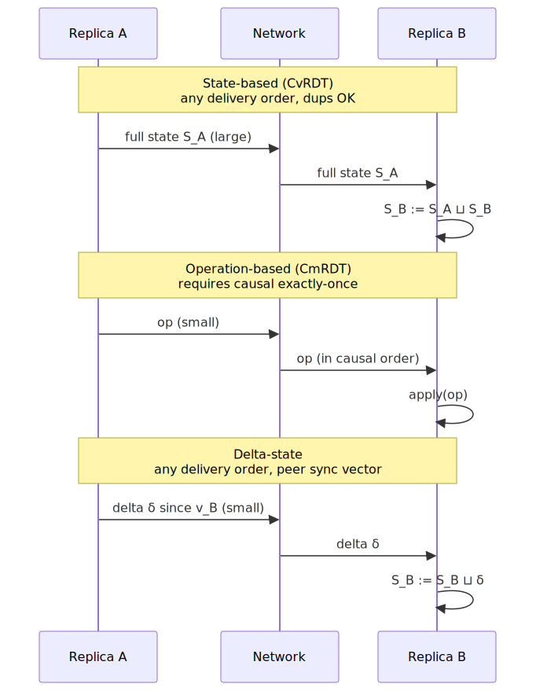
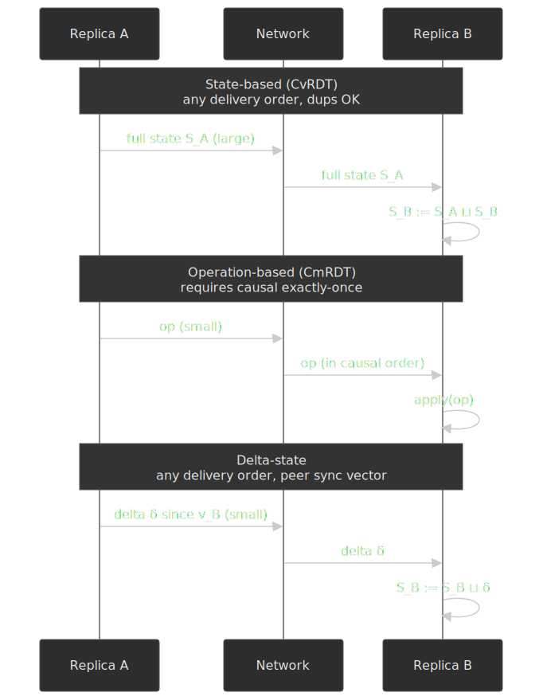

The choice between them is the same trade-off in three guises: **complexity in the merge function, complexity in the delivery layer, or complexity in delta tracking**. Production systems usually pick a hybrid — Figma uses op-based with server ordering, Yjs and Automerge use delta-state with custom encoding, Riak uses state-based with delta optimisation.

## Why naive solutions fail

Before reaching for a CRDT, it is worth being precise about what cheaper alternatives give up.

### Last-Writer-Wins on wall clocks

```typescript title="naive-lww.ts"
function merge<T>(a: { value: T; ts: number }, b: { value: T; ts: number }) {
  return a.ts > b.ts ? a : b
}
```

This is convergent in the strict mathematical sense (merge is commutative, associative, idempotent over `max`), but it loses data and behaves unpredictably:

- **Clock skew**: a node whose wall clock is 5 s ahead always wins. NTP correction can briefly make `ts` non-monotonic.
- **Lost updates**: two concurrent writes silently overwrite one another.
- **Non-determinism with ties**: equal timestamps need a deterministic tie-breaker; without one, replicas can disagree.

The pragmatic patch is to swap wall clocks for [Lamport timestamps (Lamport, 1978)](https://lamport.azurewebsites.net/pubs/time-clocks.pdf) or [Hybrid Logical Clocks (Kulkarni et al., 2014)](https://cse.buffalo.edu/tech-reports/2014-04.pdf), and to make the conflict resolution explicit (e.g. multi-value or OR-Set instead of LWW).

### Pessimistic locking

Locks make the system unavailable during partitions, add a round-trip to every write, and bring distributed deadlock detection. This is the classic reason CP databases struggle with collaborative editing.

### Consensus on every write

Paxos and Raft give linearizability but pay for it with unavailability under partition (need a majority quorum) and at least 2 RTT per write for Paxos. P2P or offline-first scenarios are off the table.

The [CAP theorem](https://groups.csail.mit.edu/tds/papers/Gilbert/Brewer2.pdf) makes the trade-off explicit: strong consistency requires coordination, and coordination forfeits availability under partitions. CRDTs sidestep CAP by making concurrent updates **commute by construction** so that no coordination is ever needed for convergence — at the cost of constraining what the data structure can express.

## CRDT variants in detail

### State-based (CvRDT)

Each replica holds the full state. Periodically — by gossip, anti-entropy, or piggy-backed sync — replicas exchange complete states and merge using the lattice join.

When to reach for this:

- The network is unreliable: messages may be lost, duplicated, or reordered.
- State size is bounded or compresses well.
- Merge is computationally cheap.
- You want a simple delivery layer.

Canonical example — the **G-Counter** (grow-only counter), where each node tracks its own increments and merge takes the pairwise maximum:

```typescript title="g-counter.ts" collapse={1-2}
type NodeId = string

interface GCounter {
  counts: Map<NodeId, number>
}

function increment(counter: GCounter, nodeId: NodeId): GCounter {
  const next = new Map(counter.counts)
  next.set(nodeId, (counter.counts.get(nodeId) ?? 0) + 1)
  return { counts: next }
}

function merge(a: GCounter, b: GCounter): GCounter {
  const merged = new Map<NodeId, number>()
  const allNodes = new Set([...a.counts.keys(), ...b.counts.keys()])
  for (const nodeId of allNodes) {
    merged.set(nodeId, Math.max(a.counts.get(nodeId) ?? 0, b.counts.get(nodeId) ?? 0))
  }
  return { counts: merged }
}

function value(counter: GCounter): number {
  return [...counter.counts.values()].reduce((sum, n) => sum + n, 0)
}
```

| Advantage                                     | Cost                                            |
| --------------------------------------------- | ----------------------------------------------- |
| Any gossip protocol works; duplicates are safe | Full state on every sync                        |
| Self-describing state; easy to debug          | State grows with the number of actor IDs / tombstones |
| Tolerates lost or out-of-order messages       | Merge runs on every sync                        |

### Operation-based (CmRDT)

Each replica applies operations locally and broadcasts them. The delivery layer must guarantee **exactly-once, causally-ordered** delivery; given that, operations need only commute when concurrent (a weaker requirement than the full lattice properties).

When to reach for this:

- A reliable causal-broadcast layer is available or buildable.
- Operations are small relative to state size.
- Low-latency propagation matters.

```typescript title="g-counter-op.ts"
type Operation = { type: "increment"; nodeId: string; amount: number }

function apply(counter: number, op: Operation): number {
  return counter + op.amount
}

```

> [!IMPORTANT]
> The delivery layer carries the burden: no duplicates, no losses, causal order. Building this is non-trivial; it is the reason most systems labelled "CmRDT" in the literature are really hybrids in production.

| Advantage                        | Cost                                       |
| -------------------------------- | ------------------------------------------ |
| Small messages — just the op     | Requires a reliable causal-broadcast layer |
| Immediate propagation possible   | Must replay or checkpoint for late joiners |
| Lower steady-state bandwidth     | More subtle to reason about                |

### Delta-state CRDTs

Delta-state CRDTs send only the *change* in state since the last sync — but the change is itself a small CRDT, so the same join operation merges it into the receiver. When the sync state with a peer is unknown (cold start, recovery), the protocol falls back to full state. This is the variant Almeida, Shoker, and Baquero formalised:

> Delta-state CRDTs combine the distributed nature of operation-based CRDTs with the uniquely simple model of state-based CRDTs.
> — Almeida, Shoker & Baquero, "Delta State Replicated Data Types", JPDC 2018.

When to reach for this:

- You want operation-based bandwidth without an exactly-once delivery layer.
- State is large but per-update changes are small.
- The protocol can track sync vectors per peer.

| Advantage                           | Cost                            |
| ----------------------------------- | ------------------------------- |
| Small messages in the common case   | Per-peer sync state to maintain |
| Works over unreliable networks      | Delta storage / GC overhead     |
| Falls back to full-state sync       | More implementation complexity  |

### Variant comparison

| Factor                      | State-based         | Operation-based      | Delta-state          |
| --------------------------- | ------------------- | -------------------- | -------------------- |
| Wire format                 | Full state          | Single operation     | Incremental delta    |
| Delivery requirement        | Any (gossip OK)     | Exactly-once, causal | Any                  |
| Late joiner handling        | Send current state  | Replay history       | Send deltas or state |
| Where the complexity lives  | Merge function      | Delivery layer       | Delta tracking       |
| Network-partition tolerance | Excellent           | Poor                 | Excellent            |
| Typical sync latency        | Higher (batched)    | Lower (immediate)    | Medium               |


## Common CRDT data structures

Most production CRDT use cases compose a handful of well-understood types.

### Counters

- **G-Counter (grow-only)** — covered above. The building block for everything else.
- **PN-Counter (positive/negative)** — two G-Counters; `value = P − N`. Merge each side independently.

```typescript title="pn-counter.ts" collapse={1-8}
interface PNCounter {
  P: GCounter
  N: GCounter
}

function increment(counter: PNCounter, nodeId: string): PNCounter {
  return { ...counter, P: GCounter.increment(counter.P, nodeId) }
}

function decrement(counter: PNCounter, nodeId: string): PNCounter {
  return { ...counter, N: GCounter.increment(counter.N, nodeId) }
}

function value(counter: PNCounter): number {
  return GCounter.value(counter.P) - GCounter.value(counter.N)
}

function merge(a: PNCounter, b: PNCounter): PNCounter {
  return {
    P: GCounter.merge(a.P, b.P),
    N: GCounter.merge(a.N, b.N),
  }
}
```

### Registers

- **LWW-Register** — a single value tagged with a logical timestamp. Highest timestamp wins, with a deterministic tie-breaker (typically `nodeId`).

```typescript title="lww-register.ts"
interface LWWRegister<T> {
  value: T
  timestamp: number
  nodeId: string
}

function merge<T>(a: LWWRegister<T>, b: LWWRegister<T>): LWWRegister<T> {
  if (a.timestamp > b.timestamp) return a
  if (b.timestamp > a.timestamp) return b
  return a.nodeId > b.nodeId ? a : b
}
```

> [!CAUTION]
> Use Lamport timestamps or HLCs as the timestamp here, never wall clocks. A single skewed node will silently win every conflict.

- **MV-Register (multi-value)** — keeps every concurrent write that has not been causally superseded. Pushes conflict resolution into the application — useful when LWW would discard meaningful work.

```typescript title="mv-register.ts" collapse={1-4}
interface MVRegister<T> {
  values: Map<VectorClock, T>
}

function write<T>(reg: MVRegister<T>, value: T, clock: VectorClock): MVRegister<T> {
  const next = new Map<VectorClock, T>()
  for (const [vc, v] of reg.values) {
    if (!clock.dominates(vc)) {
      next.set(vc, v)
    }
  }
  next.set(clock, value)
  return { values: next }
}

function read<T>(reg: MVRegister<T>): T[] {
  return [...reg.values.values()]
}
```

### Sets

- **G-Set** — add-only.
- **2P-Set** — separate add-set and remove-set. An element is present if it is in the add-set and not in the remove-set. Once removed, it can never be re-added (the article-cited limitation).
- **OR-Set (Observed-Remove)** — the practical choice. Each `add` produces a unique tag; `remove` only invalidates the tags it has observed, so a concurrent `add` always survives ("add-wins").

```typescript title="or-set.ts" collapse={1-6}
type Tag = string

interface ORSet<T> {
  elements: Map<T, Set<Tag>>
}

function add<T>(set: ORSet<T>, element: T, tag: Tag): ORSet<T> {
  const tags = new Set(set.elements.get(element) ?? [])
  tags.add(tag)
  const next = new Map(set.elements)
  next.set(element, tags)
  return { elements: next }
}

function remove<T>(set: ORSet<T>, element: T, observed: Set<Tag>): ORSet<T> {
  const next = new Map(set.elements)
  const remaining = new Set([...(set.elements.get(element) ?? [])].filter((t) => !observed.has(t)))
  if (remaining.size === 0) next.delete(element)
  else next.set(element, remaining)
  return { elements: next }
}

function merge<T>(a: ORSet<T>, b: ORSet<T>): ORSet<T> {
  const merged = new Map<T, Set<Tag>>()
  const allElements = new Set([...a.elements.keys(), ...b.elements.keys()])
  for (const element of allElements) {
    const tagsA = a.elements.get(element) ?? new Set<Tag>()
    const tagsB = b.elements.get(element) ?? new Set<Tag>()
    const union = new Set([...tagsA, ...tagsB])
    if (union.size > 0) merged.set(element, union)
  }
  return { elements: merged }
}

function has<T>(set: ORSet<T>, element: T): boolean {
  return (set.elements.get(element)?.size ?? 0) > 0
}
```

The "add-wins" semantics fall out of the algorithm: a `remove` only erases the tags it observed, so a tag created concurrently on another replica is preserved through the merge.

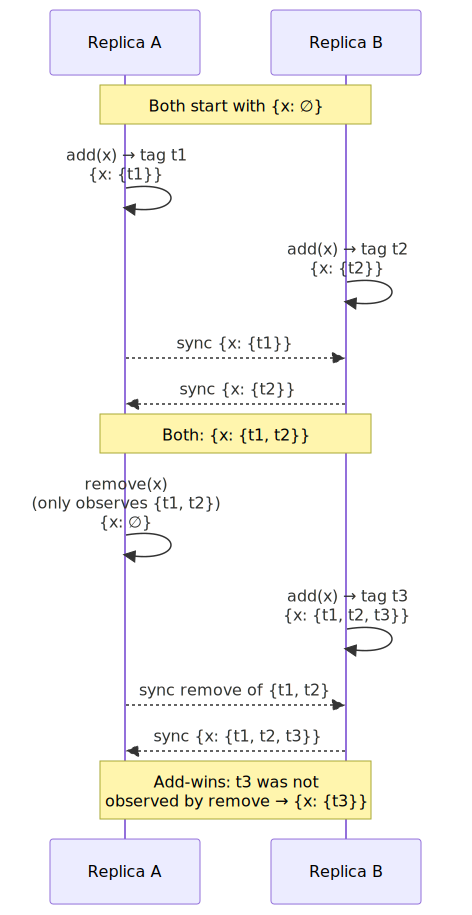
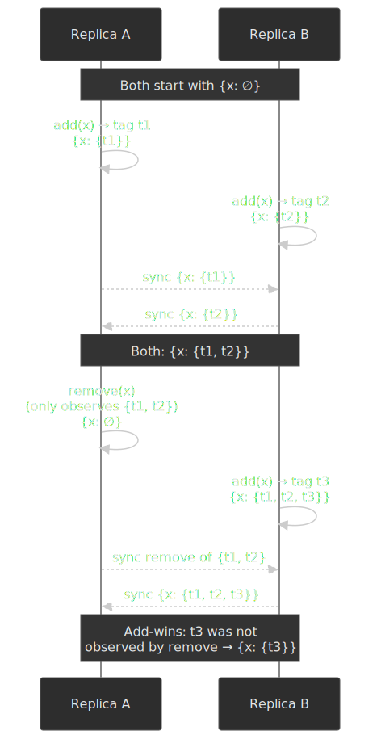

## Sequence CRDTs for collaborative text

Text editing is where CRDT design gets hard. Each character needs an identifier that is unique, totally ordered, and stable across replicas, and the algorithm has to handle concurrent inserts at the same position without producing nonsense.

### Why text is hard — RGA's tree of inserts

[RGA (Replicated Growable Array, Roh et al., JPDC 2011)](https://www.sciencedirect.com/science/article/abs/pii/S0743731510002030) models the document as a tree: each new character points at the character it was inserted *after* (its parent), and concurrent inserts at the same parent become sibling children. Read order is a depth-first walk that breaks sibling ties by `(Lamport timestamp DESC, replicaId DESC)`. This is the basis for Yjs's YATA[^yata], Automerge's text type, and the algorithms Eg-walker replays.


[^yata]: Petru Nicolaescu, Kevin Jahns, Michael Derntl & Ralf Klamma, [_Near Real-Time Peer-to-Peer Shared Editing on Extensible Data Types_](https://doi.org/10.1145/2957276.2957310), GROUP 2016. The YATA algorithm Yjs implements (with optimisations for block merging and tombstone GC).

### The interleaving problem

When two users type at the same position concurrently, the merge must keep their text *contiguous*. A naive sort by `(position, timestamp)` does not — it can interleave the characters from the two runs. RGA's tie-break rule is enough for *single-character* runs but [Kleppmann et al. show](https://martin.kleppmann.com/papers/list-move-papoc20.pdf) that it can still interleave longer concurrent runs in adversarial cases — the gap Fugue and Eg-walker close.

```text
Initial:  Hello|World
User A:   Hello|foo|World
User B:   Hello|bar|World
Naive:    Hellofboaor World     ← characters from foo and bar interleaved
Wanted:   HellofoobarWorld      or HellobarfooWorld
```


### Algorithm comparison

| Algorithm   | Approach                                | Interleaving                  | ID growth | Notes                                                |
| ----------- | --------------------------------------- | ----------------------------- | --------- | ---------------------------------------------------- |
| RGA         | Linked list + Lamport timestamps        | Possible at concurrent inserts | Linear    | Strong general performance; basis for many libraries |
| Logoot      | Fractional positions                    | Possible                      | Unbounded | Identifiers can grow without bound                   |
| LSEQ        | Adaptive fractional positions           | Possible                      | Sub-linear typical, unbounded worst case | Logoot variant with dynamic base; mitigates growth   |
| Fugue       | Tree of inserts, side-aware ordering    | Maximally non-interleaving    | Linear    | Proven minimal interleaving for any list CRDT         |
| Eg-walker   | Replays an event-graph DAG on demand    | Inherits Fugue/RGA semantics  | Linear    | Order-of-magnitude memory + load-time wins           |

[Fugue, by Weidner & Kleppmann](https://arxiv.org/abs/2305.00583) (preprint 2023; published in IEEE TPDS, Vol. 36 No. 11, November 2025), proves a *maximally strong non-interleaving* property: any two concurrent runs inserted at the same position end up with one wholly before the other, never interleaved.

> We prove that Fugue satisfies a maximally strong non-interleaving property.
> — Weidner & Kleppmann, "The Art of the Fugue".

### Eg-walker — event graph + transient CRDT

[Eg-walker (Gentle & Kleppmann, EuroSys 2025)](https://dl.acm.org/doi/10.1145/3689031.3696076) is the current state-of-the-art for collaborative text. It stores edits as a directed acyclic *event graph* on disk and keeps the document state as plain text in memory; only when a merge is needed does it walk the relevant subgraph and build a transient CRDT, which is discarded once the merge resolves.

> Eg-walker achieves order of magnitude less memory than existing CRDTs, orders of magnitude faster document loading, and orders of magnitude faster branch merging than OT — all while working P2P without a central server.
> — Gentle & Kleppmann, "Collaborative Text Editing with Eg-walker", EuroSys 2025.

This is the design that closes most of the gap between OT and CRDTs and is now being adopted in production — Loro is built on a Fugue + Eg-walker-inspired core, and [Figma adopted Eg-walker for its code-layer text in June 2025](https://www.figma.com/blog/building-figmas-code-layers/).

### Rich text — Peritext

[Peritext (Litt, Lim, Kleppmann & van Hardenberg, CSCW 2022)](https://dl.acm.org/doi/10.1145/3555644) handles inline formatting (bold, italic, links) on top of a sequence CRDT.

- **Anchor to character IDs, not offsets.** Formatting boundaries reference the same stable IDs the underlying sequence CRDT uses.
- **Marks are append-only.** "Remove bold" is a counter-mark, not a deletion of the prior "add bold" — preserving idempotence and concurrent safety.
- **Expand on edges by default.** Typing at the right edge of bold text inherits the formatting; this matches user intuition.

## Production implementations

### Figma — server-ordered ops with per-property LWW

For property-level multiplayer (positions, fills, layer ordering), Figma uses an op-based design with [server-side ordering](https://www.figma.com/blog/how-figmas-multiplayer-technology-works/). Their own engineers describe it as "CRDT-inspired" rather than a textbook CRDT; concurrent edits to *different* properties on the same object never conflict, and edits to the *same* property resolve via LWW with the server-assigned order as the timestamp.

- **Transport**: WebSocket from each client to a per-document server worker; server is authoritative for ordering and validation.
- **Conflict resolution**: per-property LWW for design properties; Eg-walker for text inside [code layers](https://www.figma.com/blog/building-figmas-code-layers/) (June 2025).
- **Persistence**: in-memory document state, transaction log in DynamoDB, periodic checkpoints to S3.


What worked: making the server authoritative collapses most conflict-resolution edge cases into "the order the server saw it". What was hard: text editing eventually outgrew the LWW approach, which is why Figma adopted Eg-walker for code layers.

### Yjs — delta-state with run-length encoding

[Yjs](https://docs.yjs.dev/) is the dominant CRDT library on npm — over 3 million weekly downloads as of 2026. Its design choices target collaborative editors and broad transport agnosticism:

- **Variant**: delta-state with a custom binary encoding; internally it is closer to op-based YATA, but the wire protocol exchanges encoded updates that merge like state.
- **Transport-agnostic**: providers in `y-websocket`, `y-webrtc`, `y-indexeddb`, etc. let the same document run P2P, client-server, or persisted-only.
- **Shared types**: `Y.Map`, `Y.Array`, `Y.Text`, `Y.XmlElement` — they look like JS data structures and produce CRDT updates under the hood.


Key optimisations are documented in the [Yrs (Rust port) architecture write-up](https://www.bartoszsypytkowski.com/yrs-architecture/):

- **Block merging** — consecutive operations from the same client collapse into a single struct.
- **V2 encoding** — run-length encoding of repeated fields (influenced by Automerge research).
- **Deleted content GC** — tombstones survive but the deleted content is dropped.

Pain points: tombstones still accumulate over a document's lifetime, and large documents need attention to memory layout.

### Automerge — local-first with verified convergence

[Automerge](https://automerge.org/) targets [local-first software](https://www.inkandswitch.com/local-first/), where the user's device is primary and the network is incidental.

- **Variant**: state-based with delta-style sync optimisations; Rust core with JS/WASM, C, and Swift bindings.
- **Convergence verified in Isabelle/HOL** — Kleppmann et al.'s [OOPSLA 2017 paper](https://martin.kleppmann.com/2017/10/25/verifying-crdt-isabelle.html) gives a machine-checked proof of strong eventual consistency for the underlying RGA, OR-Set, and counter algorithms Automerge uses.
- **Compact storage**: a custom column-oriented binary format for change history.
- **Deterministic conflict resolution**: Lamport timestamps and actor IDs make the merge reproducible.

Pain points: performance at scale was the original Achilles heel and drove the complete Rust rewrite; sync protocol design is intricate.

### Riak — CRDTs in the database

Riak was the first widely deployed key-value store to ship CRDT data types as a first-class feature — counters in [Riak 1.4 (July 2013)](https://en.wikipedia.org/wiki/Basho_Technologies) and the full set (counters, sets, maps, registers, flags) in **Riak 2.0 (September 2014)**. It uses a state-based model with delta optimisations, vector clocks for causality, and per-bucket type configuration.

The classic production case study is Riot Games' League of Legends in-game chat — [7.5 M concurrent users at 11 000 messages/second](https://highscalability.com/how-league-of-legends-scaled-chat-to-70-million-players-it-t/), built on Riak with custom application-level CRDTs for friend lists and presence (see also [Riot Games' own writeup](https://www.riotgames.com/en/news/chat-service-architecture-persistence)).

Sharp edges they hit, documented in [Brown et al. "Big(ger) Sets"](https://arxiv.org/abs/1605.06424):

- OR-Set writes degrade with cardinality because every metadata read triggers a full read-modify-write.
- Sets larger than ~500 KB hit `riak_object` storage limits; the fix is decomposed delta sets where each element keys an underlying LevelDB entry.

### Side-by-side

| Aspect          | Figma                            | Yjs              | Automerge        | Riak             |
| --------------- | -------------------------------- | ---------------- | ---------------- | ---------------- |
| Variant         | Op-based (server-ordered)        | Delta-state      | State-based      | State + delta    |
| Architecture    | Centralized                      | Any transport    | P2P / local-first | Distributed DB   |
| Offline         | Limited                          | Excellent        | Excellent        | N/A (server)     |
| Rich text       | Eg-walker (code layers)          | Native sequence  | Peritext         | N/A              |
| Maturity        | Production                       | Production       | Production       | Production       |
| Best fit        | Real-time SaaS canvas            | Editor libraries | Local-first apps | Key-value stores |

## Operational concerns

### Garbage collection

Deleted elements leave **tombstones** — markers that have to outlive every replica that might still hold the original. If A drops a tombstone for `x` while B still holds `x`, the next sync will resurrect `x`.

| Strategy         | Mechanism                                                       | Trade-off                                  |
| ---------------- | --------------------------------------------------------------- | ------------------------------------------ |
| Stability-based  | Drop when known to all replicas                                 | Needs cluster-wide knowledge               |
| Epoch-based      | Periodic version-vector boundary; compact below it              | Needs version-vector tracking              |
| Time-based       | Drop after a grace window (Cassandra: `gc_grace_seconds`)       | Late-rejoining replicas can cause resurrection |
| Consensus-based  | Paxos/2PC to agree on removal                                   | Defeats the coordination-free goal         |

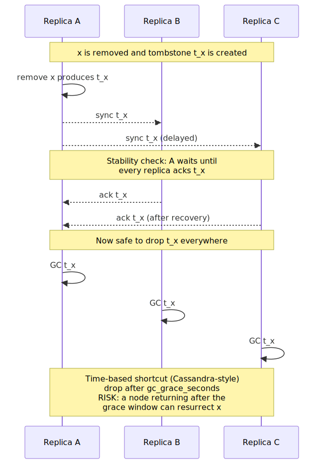
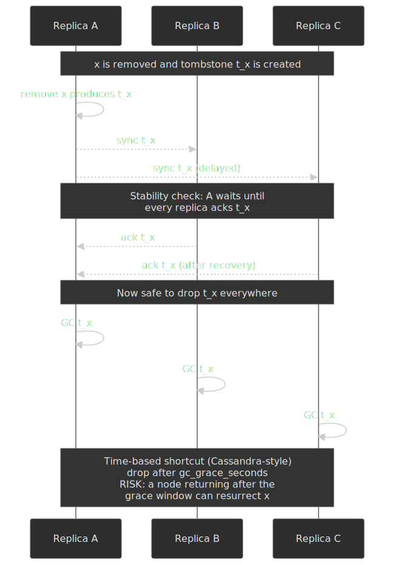

[Apache Cassandra defaults `gc_grace_seconds` to 864 000 (10 days)](https://docs.datastax.com/en/cql-oss/3.x/cql/cql_reference/cqlCreateTable.html); the value should bound the longest expected node-recovery time.

### Causality tracking

CRDTs need to know what "happened-before" what. Three options:

- [**Lamport timestamps (1978)**](https://lamport.azurewebsites.net/pubs/time-clocks.pdf) — a scalar that increments on each event and absorbs the maximum on receive. Gives a *partial* order: enough to compare two events, never enough to *detect concurrency*.
- **Vector clocks (Fidge 1988, Mattern 1989)** — one counter per node; can detect happens-before, happens-after, and concurrent. Cost is `O(N)` per timestamp, where `N` is the number of nodes that have ever participated.
- [**Dotted Version Vectors (Preguiça et al., 2010)**](https://arxiv.org/abs/1011.5808) — extend a version vector with a single "dot" identifying the specific event. Lets a server-side replica id stand in for many client writes without losing causal precision; deployed in Riak to fix sibling explosion.
- [**Hybrid Logical Clocks (Kulkarni et al. 2014)**](https://cse.buffalo.edu/tech-reports/2014-04.pdf) — combine wall clock with a logical counter; monotonic, close to physical time, fits in 64 bits, used by CockroachDB, YugabyteDB, and many CRDT systems.

```typescript title="vector-clock.ts" collapse={1-4}
type VectorClock = Map<NodeId, number>

function increment(vc: VectorClock, nodeId: NodeId): VectorClock {
  const next = new Map(vc)
  next.set(nodeId, (vc.get(nodeId) ?? 0) + 1)
  return next
}

function merge(a: VectorClock, b: VectorClock): VectorClock {
  const merged = new Map<NodeId, number>()
  const allNodes = new Set([...a.keys(), ...b.keys()])
  for (const nodeId of allNodes) {
    merged.set(nodeId, Math.max(a.get(nodeId) ?? 0, b.get(nodeId) ?? 0))
  }
  return merged
}

function happenedBefore(a: VectorClock, b: VectorClock): boolean {
  let hasLess = false
  for (const [nodeId, aTime] of a) {
    const bTime = b.get(nodeId) ?? 0
    if (aTime > bTime) return false
    if (aTime < bTime) hasLess = true
  }
  for (const [nodeId, bTime] of b) {
    if (!a.has(nodeId) && bTime > 0) hasLess = true
  }
  return hasLess
}

function concurrent(a: VectorClock, b: VectorClock): boolean {
  return !happenedBefore(a, b) && !happenedBefore(b, a)
}
```

For large `N`, look at [Dotted Version Vector Sets](https://github.com/ricardobcl/Dotted-Version-Vectors), [Interval Tree Clocks (Almeida, Baquero & Fonte, 2008)](https://gsd.di.uminho.pt/members/cbm/ps/itc2008.pdf), or HLCs to bound the metadata cost.

### Late joiners

A new replica needs enough state to participate. Three patterns:

1. **Full state transfer** — simple, costly, fits state-based CRDTs.
2. **Checkpoint + recent ops** — periodic snapshot, plus the operations since.
3. **Delta sync** — exchange version vectors, compute the delta, ship that.

Eg-walker generalises pattern 2 — the document state on disk is plain text, and the event graph is the operation history; new joiners get the current text plus the relevant subgraph.

## CRDT vs Operational Transformation

### Where they came from

- **Operational Transformation (OT)** was introduced by Ellis & Gibbs in 1989 for grouped editors and matured into the algorithm behind Google Docs (Wave / Apache Wave / ShareDB lineage). It needs a central server to transform incoming operations against the operations they missed.
- **CRDTs** start with [Oster et al.'s WOOT (CSCW 2006)](https://dl.acm.org/doi/10.1007/s00446-021-00414-6) and the [Shapiro et al. unification (2011)](https://inria.hal.science/inria-00555588/document). They were designed for decentralised and offline-first systems from the start.

### The fundamental difference

OT keeps operations interpreted in their original positions and *transforms* them against intervening operations. CRDTs sidestep transformation by giving every operation enough metadata to be applicable in any order without conflict.

```text
OT     → User A: insert("X", 5)  -- transform vs B's insert(_, 3) → insert("X", 6)
        → User B: insert("Y", 3)  -- already in transformed form     → insert("Y", 3)
CRDT   → User A: insert("X", id_a)  -- apply directly
        → User B: insert("Y", id_b)  -- apply directly
        → ordering decided by id_a vs id_b
```

| Aspect                    | OT                                            | CRDT                                                |
| ------------------------- | --------------------------------------------- | --------------------------------------------------- |
| Architecture              | Requires central server                       | Works P2P or centralized                            |
| Offline                   | Poor (server-mediated)                        | Excellent                                           |
| Intent preservation       | Strong — transformations target intent        | Algorithm-dependent                                 |
| Implementation complexity | High — transform functions are easy to get wrong | Moderate — lattice properties keep you honest       |
| Proof of correctness      | Historically hard (many published bugs)       | Mathematical proofs available; some machine-checked |

Pick OT when the system is always-online, the architecture is centralised, and you have OT infrastructure already. Pick a CRDT when offline-first, P2P, or unreliable-network operation is a requirement, or when you want a mathematical convergence guarantee.

The most useful counterweight to "use a CRDT" is Kleppmann's [_CRDTs: The Hard Parts_ (2020)](https://martin.kleppmann.com/2020/07/06/crdt-hard-parts-hydra.html), which surfaces the move, interleaving, undo, and metadata-cost problems that a textbook CRDT does not solve. Joseph Gentle's [_I was wrong. CRDTs are the future_ (2020)](https://josephg.com/blog/crdts-are-the-future/) records the same conclusion from the OT side of the debate.

### Eg-walker as the convergence

Eg-walker is best understood as the practical resolution of the OT/CRDT debate. By keeping the event graph on disk and the document state in memory, it gets:

- The wire format and centralisation flexibility of CRDTs.
- The memory footprint and load-time of OT (no permanent CRDT bookkeeping).
- A formal correctness story (it inherits Fugue's non-interleaving property).

That combination is why it is showing up in new production systems (Figma code layers, Loro) faster than most CRDT research migrates to industry.

## Common pitfalls

### Unbounded state growth

Notion-style apps that store every operation see load times grow with history length. Plan for periodic snapshots, tombstone GC with a defensible grace window, or compaction (Eg-walker on-disk event graphs are one approach).

### Assuming strong consistency

A "Undo" feature defined as "undo the last operation" breaks under concurrency: "the last" is ambiguous. Define undo as "undo *my* last operation" and use causal consistency for ordering questions.

### Wall clocks for LWW

Even one node with a 5 s skew silently wins all conflicts. Always use logical clocks or HLCs.

### Big OR-Sets

The Riak 500 KB example is the canonical lesson. Decompose large sets into multiple keys, or use a more compact CRDT type (e.g. counters or shard the set application-side).

### Ignoring merge complexity

A naive merge that is `O(n²)` works fine until the document grows. Profile with realistic sizes and prefer delta-state to bound the work per sync.

## Implementation guide

### Choosing a library


| Library                                                              | Language | Best for                          | Maturity   |
| -------------------------------------------------------------------- | -------- | --------------------------------- | ---------- |
| [Yjs](https://docs.yjs.dev/)                                         | JS / TS  | Collaborative editors             | Production |
| [Automerge](https://automerge.org/)                                  | Rust + JS / WASM | Local-first apps           | Production |
| [Loro](https://loro.dev/)                                            | Rust + JS / WASM | Rich text, movable trees   | Production |
| [Diamond Types](https://github.com/josephg/diamond-types)            | Rust     | High-performance text             | Production |
| [Akka Distributed Data](https://doc.akka.io/libraries/akka-core/current/typed/distributed-data.html) | JVM | Actor systems                  | Production |
| [riak_dt](https://github.com/basho/riak_dt)                          | Erlang   | Key-value stores                  | Production |

### Building custom — sanity checklist

Only justified when no library fits and you have CRDT expertise:

- [ ] Define merge semantics precisely *before* coding.
- [ ] Prove commutativity, associativity, and idempotence (or use an existing CRDT primitive that already has these proofs).
- [ ] Use Lamport timestamps or HLCs — never wall clocks.
- [ ] Decide tombstone GC strategy upfront.
- [ ] Test under partition (e.g. with Jepsen) and with injected latency.
- [ ] Benchmark with realistic data and operation rates.
- [ ] Consider mechanised proofs (TLA+, Isabelle/HOL) for anything safety-critical.

## When NOT to use a CRDT

CRDTs are not free. They are the wrong tool when the problem is fundamentally a coordination problem dressed up as a merge problem. Reach for something else when:

- **You need a global invariant.** "Bank balance never goes negative", "ticket inventory never oversells", "username unique across users" — these are coordination requirements. A CRDT will converge, but it cannot stop two replicas from concurrently spending the last dollar. Use a transactional store, a queue + serialised consumer, or actual consensus (Raft, Paxos, etcd, FoundationDB).
- **The data model is mostly relational with cross-row constraints.** Foreign keys, joins, secondary indexes, ACID transactions across rows — none of this is what a CRDT optimises for. CRDTs assume conflicts are merge-resolvable; relational invariants assume they are not.
- **You actually need linearizability.** Read-your-writes across all replicas, externally-observable ordering, leases — Paxos/Raft are the right primitives.
- **The conflict resolution semantics are debatable.** If "what should happen when two users edit the same field at once" has no defensible answer at the data layer, pushing it into a CRDT just hides the question. Surface it in the UI (multi-value reads, conflict prompts) or design the schema so concurrent edits target different fields.
- **Storage and bandwidth are the binding constraints.** Tombstones, vector clocks, and operation history compound. If your dataset is mostly immutable history (event sourcing), an append-only log with deterministic projections beats a CRDT on every axis.
- **One writer is realistic.** Single-leader replication with read replicas is simpler, cheaper, and more familiar. Adopt CRDTs only when multi-writer is a real product requirement (offline editing, P2P, multi-region active/active).
- **You need to delete data permanently and quickly** (right-to-be-forgotten, secrets rotation). Tombstones leak metadata about the deleted item until GC; cryptographic erasure or a coordinated purge is more honest.

> [!CAUTION]
> "We need eventual consistency" is not the same as "we need a CRDT". Plain LWW with HLCs, single-leader replication, or an event log with deterministic projections are usually simpler and good enough; CRDTs earn their complexity only when concurrent multi-writer merges are a hard requirement.

## Practical takeaways

1. **State / op / delta is a deployment choice, not a correctness one.** Pick based on what your transport, bandwidth budget, and offline story can support.
2. **Match the data structure to the application.** PN-counter for counters, OR-Set for sets, Y.Text or Loro for text, Peritext for rich text. Custom only as a last resort.
3. **Tombstones are forever — until they are not.** Plan GC and `gc_grace_seconds`-style policies on day one.
4. **Logical clocks first.** Wall clocks are a footgun in any CRDT context.
5. **Prefer Yjs, Automerge, or Loro over a custom build.** The libraries are mature; the bugs you avoid will be subtle.
6. **Watch Eg-walker.** The event-graph approach is closing the OT/CRDT gap and is already running in production at Figma and Loro.

## Appendix

### Prerequisites

- Distributed-systems fundamentals: partitions, consistency models, CAP.
- Familiarity with eventual consistency at the application layer.
- Light comfort with partial orders and lattice theory (helpful but not required).

### Terminology

| Term                  | Definition                                                                                         |
| --------------------- | -------------------------------------------------------------------------------------------------- |
| **CvRDT**             | Convergent (state-based) CRDT.                                                                     |
| **CmRDT**             | Commutative (operation-based) CRDT.                                                                |
| **Tombstone**         | Marker for a deleted element; must persist until every replica has observed it.                    |
| **Vector clock**      | Logical clock that captures full causality across nodes.                                           |
| **Lamport timestamp** | Scalar logical clock; partial ordering only.                                                       |
| **HLC**               | Hybrid Logical Clock — physical wall clock + logical counter; monotonic, fits in 64 bits.          |
| **Join-semilattice**  | Set with a `merge` operation that is commutative, associative, and idempotent.                     |
| **SEC**               | Strong Eventual Consistency — replicas in identical state once they have received the same updates. |
| **OT**                | Operational Transformation — server-mediated alternative to CRDTs.                                 |

### References

**Foundational papers:**

- [A Comprehensive Study of Convergent and Commutative Replicated Data Types](https://inria.hal.science/inria-00555588/document) — Shapiro, Preguiça, Baquero & Zawirski, INRIA RR-7506, 2011. The definitive CRDT reference.
- [Conflict-free Replicated Data Types (SSS 2011)](https://link.springer.com/chapter/10.1007/978-3-642-24550-3_29) — Shapiro et al., conference paper version.
- [Delta State Replicated Data Types](https://www.sciencedirect.com/science/article/abs/pii/S0743731517302332) — Almeida, Shoker & Baquero, JPDC Vol. 111, January 2018. ([arXiv preprint, 2016](https://arxiv.org/abs/1603.01529).)
- [Pure Operation-Based Replicated Data Types](https://arxiv.org/abs/1710.04469) — Baquero, Almeida & Shoker. Pure op-based CRDTs.
- [Verifying Strong Eventual Consistency in Distributed Systems](https://martin.kleppmann.com/2017/10/25/verifying-crdt-isabelle.html) — Gomes, Kleppmann, Mulligan & Beresford, OOPSLA 2017. Isabelle/HOL proofs for RGA, OR-Set, and Increment-Decrement Counter.

**Sequence and rich text:**

- [The Art of the Fugue: Minimizing Interleaving in Collaborative Text Editing](https://www.computer.org/csdl/journal/td/2025/11/11181220/2akrxcH1WG4) — Weidner & Kleppmann, IEEE TPDS Vol. 36 No. 11, November 2025 ([arXiv preprint, 2023](https://arxiv.org/abs/2305.00583)).
- [Collaborative Text Editing with Eg-walker: Better, Faster, Smaller](https://dl.acm.org/doi/10.1145/3689031.3696076) — Gentle & Kleppmann, EuroSys 2025.
- [Peritext: A CRDT for Collaborative Rich Text Editing](https://dl.acm.org/doi/10.1145/3555644) — Litt, Lim, Kleppmann & van Hardenberg, PACM HCI Vol. 6, CSCW2, November 2022.
- [Data consistency for P2P collaborative editing (WOOT)](https://hal.inria.fr/inria-00108523/document) — Oster, Urso, Molli & Imine, CSCW 2006. Original WOOT paper; [Karayel & Gonzàlez (Distributed Computing 2021)](https://dl.acm.org/doi/10.1007/s00446-021-00414-6) provide a machine-checked proof of strong eventual consistency.
- [Replicated abstract data types: Building blocks for collaborative applications (RGA)](https://www.sciencedirect.com/science/article/abs/pii/S0743731510002030) — Roh, Jeon, Kim & Lee, JPDC Vol. 71 No. 3, 2011.
- [Near Real-Time Peer-to-Peer Shared Editing on Extensible Data Types (YATA)](https://doi.org/10.1145/2957276.2957310) — Nicolaescu, Jahns, Derntl & Klamma, GROUP 2016. The algorithm Yjs implements.
- [Logoot: A Scalable Optimistic Replication Algorithm for Collaborative Editing on P2P Networks](https://hal.inria.fr/inria-00432368/document) — Weiss, Urso & Molli, ICDCS 2009.
- [LSEQ: an Adaptive Structure for Sequences in Distributed Collaborative Editing](https://hal.archives-ouvertes.fr/hal-00921633/document) — Nédelec, Molli, Mostefaoui & Desmontils, DocEng 2013.

**Causality and clocks:**

- [Time, Clocks, and the Ordering of Events in a Distributed System](https://lamport.azurewebsites.net/pubs/time-clocks.pdf) — Lamport, CACM 1978.
- [Dotted Version Vectors: Logical Clocks for Optimistic Replication](https://arxiv.org/abs/1011.5808) — Preguiça, Baquero, Almeida, Fonte & Gonçalves, 2010.
- [Interval Tree Clocks: A Logical Clock for Dynamic Systems](https://gsd.di.uminho.pt/members/cbm/ps/itc2008.pdf) — Almeida, Baquero & Fonte, OPODIS 2008.
- [Logical Physical Clocks and Consistent Snapshots in Globally Distributed Databases](https://cse.buffalo.edu/tech-reports/2014-04.pdf) — Kulkarni, Demirbas, Madappa, Avva & Leone, 2014. Hybrid Logical Clocks.

**Production implementations:**

- [How Figma's Multiplayer Technology Works](https://www.figma.com/blog/how-figmas-multiplayer-technology-works/) — Figma Engineering Blog.
- [Canvas, Meet Code: Building Figma's Code Layers](https://www.figma.com/blog/building-figmas-code-layers/) — Figma Engineering Blog, June 2025. Eg-walker adoption.
- [Yjs Documentation](https://docs.yjs.dev/) and the [Yrs architecture deep dive](https://www.bartoszsypytkowski.com/yrs-architecture/).
- [Automerge](https://automerge.org/).
- [Riak Data Types](https://docs.riak.com/riak/kv/2.2.3/learn/concepts/crdts/index.html); [Big(ger) Sets](https://arxiv.org/abs/1605.06424); [Riot Games chat persistence write-up](https://www.riotgames.com/en/news/chat-service-architecture-persistence); [How League of Legends Scaled Chat to 70 Million Players](https://highscalability.com/how-league-of-legends-scaled-chat-to-70-million-players-it-t/).
- [Loro](https://loro.dev/) and the [Loro Eg-walker note](https://loro.dev/docs/concepts/event_graph_walker).

**Critique and the OT/CRDT debate:**

- [CRDTs: The Hard Parts](https://martin.kleppmann.com/2020/07/06/crdt-hard-parts-hydra.html) — Kleppmann, Hydra 2020. The list-move, interleaving, undo, and metadata-cost problems still open in textbook CRDTs.
- [I was wrong. CRDTs are the future](https://josephg.com/blog/crdts-are-the-future/) — Joseph Gentle, 2020. Author of ShareJS / Wave reverses position from OT to CRDTs.
- [Making CRDTs 98% More Efficient](https://jakelazaroff.com/words/making-crdts-98-percent-more-efficient/) — Jake Lazaroff, 2023. Encoding wins for state-based CRDTs (palette tables, RLE, custom binary), inspired by the Ink & Switch and Yjs work.

**Background:**

- [crdt.tech](https://crdt.tech/) — community index of papers and implementations.
- [Local-First Software](https://www.inkandswitch.com/local-first/) — Ink & Switch's seven-property essay.
