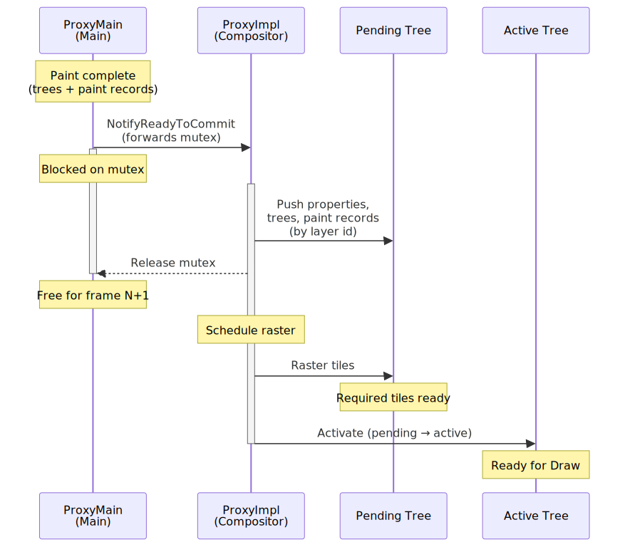
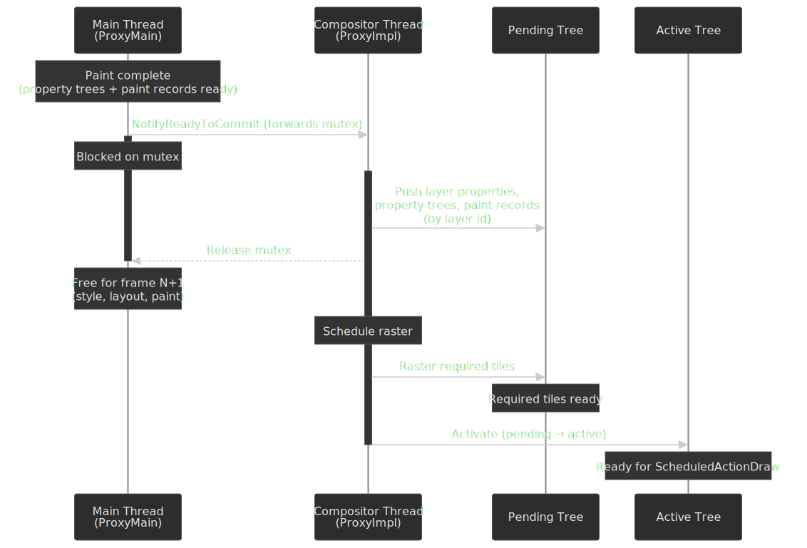
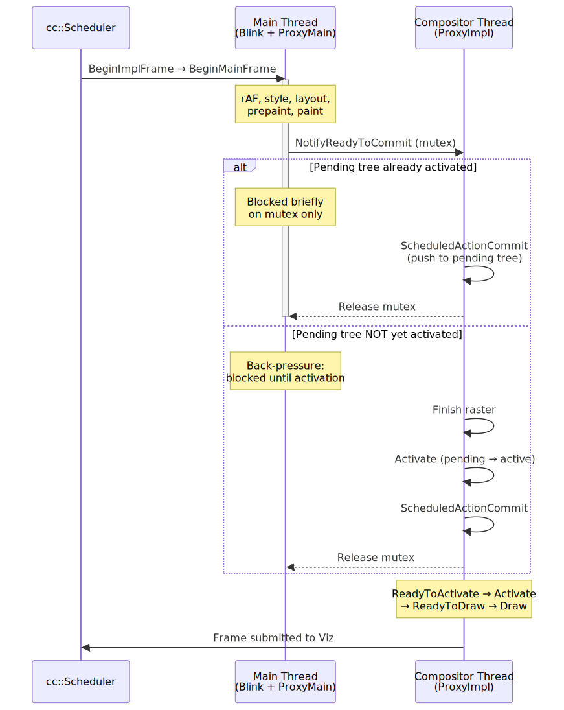
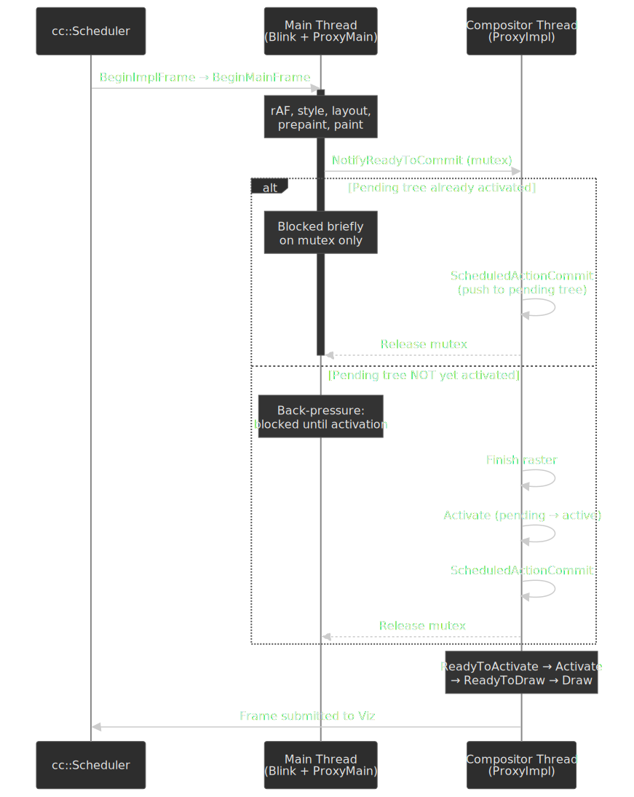

# Critical Rendering Path: Commit

Commit is the synchronization point where the renderer's main thread hands off the new frame's rendering data to the [Chrome compositor (`cc`)](https://chromium.googlesource.com/chromium/src/+/HEAD/docs/how_cc_works.md). It is implemented as a **blocking copy under a mutex**: the main thread stops, the compositor thread copies layer state, property trees, and paint records into compositor-side data structures, then releases the mutex. This single block is what lets the rest of the compositor pipeline — rasterization, activation, and draw — proceed on its own thread without ever calling back into Blink.




## Abstract

Commit sits between [Paint](../crp-paint/README.md) (which produces the paint artifact on the main thread) and [Layerize](../crp-layerize/README.md) / [Raster](../crp-raster/README.md) (which run on the compositor thread). The defining facts:

- **It is a blocking copy, not an IPC.** The main thread hands a mutex to the compositor; the compositor thread copies data while the main thread is held; the mutex is released when copy is done. This is documented as the **only** time `ProxyImpl` is allowed to touch main-thread data structures, and it is enforced with `DCHECK`s. [^how-cc-commit]
- **What is copied:** the four property trees (transform, clip, effect, scroll), the layer list / per-layer metadata, and the new frame's paint records. The compositor thread already owns its own `LayerImpl` instances; commit pushes properties from each main-thread `Layer` to the corresponding `LayerImpl` by ID. [^how-cc-trees]
- **Why blocking?** Atomicity. The Chromium docs are explicit that "if there are multiple changes to webpage content in a single Javascript callstack […] these all must be presented to the user atomically." [^how-cc-trees] A non-blocking copy would risk shipping a half-applied frame.
- **Output target is the pending tree, not the active tree.** Commit pushes into a staging tree so the active tree can keep scrolling and animating during rasterization.
- **Pipeline shape:** `BeginImplFrame → BeginMainFrame → Commit → ReadyToActivate → Activate → ReadyToDraw → Draw`. [^how-cc-scheduling]
- **Asymmetric blocking is mandatory.** The main thread can block on the compositor thread (during commit). The reverse is forbidden, which is what gives Chromium's compositor its "never blocks on Blink" guarantee. [^renderingng-arch]
- **Forward direction:** Non-Blocking Commit is the next step. The Chromium team has prototyped a model in which the main thread keeps running while the compositor copies state; this is explicitly framed as a future improvement, not the current default. [^blinkng-future]

The blocking model has lived since the original threaded compositor and is the simplest working contract; the architectural deficits that would have made a non-blocking commit dangerous (mutable, leaky data structures across phases) were the very things the [BlinkNG](https://developer.chrome.com/docs/chromium/blinkng) refactors fixed.

> [!IMPORTANT]
> **Commit is not "compositing".** The two terms collide constantly in tooling and casual writing, and conflating them is the single most common source of confusion when reading frame timelines.
>
> - **Commit** (this article) is the main-thread → compositor-thread *handoff*. It runs once per pipelined frame, blocks the main thread for the duration of the copy, and produces the pending tree.
> - **Compositing / Draw** is the much later step where the compositor turns an *active* tree into a `CompositorFrame` of render passes and quads and forwards it to Viz. It runs entirely on the compositor thread and never blocks Blink. See [CRP: Compositing](../crp-composit/README.md) and [CRP: Draw](../crp-draw/README.md).
>
> When DevTools shows a "Commit" task on the main thread, that is this stage; "Composite Layers", "Activate", or a Viz-side `Draw` are different stages on a different thread.

---

## Where commit sits in the pipeline

Commit is one node in the `cc::Scheduler` state machine. The scheduler observes BeginFrame messages from Viz and decides when to ask Blink for a new main-thread frame and when to commit, activate, and draw. The clean-pipeline ordering, taken straight from the cc docs, is: [^how-cc-scheduling]

```text title="Low-latency frame ordering"
BeginImplFrame → BeginMainFrame → Commit → ReadyToActivate → Activate → ReadyToDraw → Draw
```

If rasterization is slow, the next frame's `BeginMainFrame` may overlap with the previous frame's raster:

```text title="Pipelined ordering when raster is slow (excerpt from how_cc_works.md)"
BeginImplFrame1 → BeginMainFrame1 → Commit1 → (slow raster)
              → BeginImplFrame2 → BeginMainFrame2 → ReadyToActivate1 → Activate1
              → Commit2 → ReadyToDraw1 → Draw1
```

The detail that makes this work is a back-pressure rule: while a pending tree exists that has not yet activated, the next commit cannot start. So `BeginMainFrame2` runs concurrently with raster, but when ProxyMain calls `NotifyReadyToCommit`, it blocks until the previous frame's pending tree activates. [^how-cc-scheduling] The main thread therefore gets to do useful frame-N+1 work in parallel — at the cost of one extra frame of input latency.




## The synchronization mechanism

The commit is not a simple memcpy; it is a carefully scoped synchronization that uses Chromium's proxy pattern to enforce thread ownership.

### Proxy roles

`cc` ships with both a multi-threaded and a single-threaded compositor. The renderer process always uses the multi-threaded one; the browser process and tests can use the single-threaded fallback. [^how-cc-process]

| Component             | Thread            | Responsibilities                                                                                                                |
| :-------------------- | :---------------- | :------------------------------------------------------------------------------------------------------------------------------ |
| **ProxyMain**         | Main Thread       | Owns `LayerTreeHost`; sends `NotifyReadyToCommit` and forwards a mutex; enforces thread ownership on accessors via `DCHECK`s.   |
| **ProxyImpl**         | Compositor Thread | Owns the pending / active / recycle trees; performs the copy during commit; the only class allowed to touch both threads' data. |
| **SingleThreadProxy** | Both (fallback)   | Encompasses both roles when `cc` runs in single-threaded mode (no compositor thread, no pending tree).                          |

Two invariants make the design tractable:

1. **`ProxyImpl` only accesses main-thread data while the main thread is blocked.** That is what makes per-property locks unnecessary. [^how-cc-commit]
2. **The compositor thread never blocks waiting for the main thread.** Asymmetry in the other direction is fine; this one is forbidden, which is why the compositor thread can keep scrolling, animating, and producing frames even when Blink is jammed. [^renderingng-arch]

### Commit, step by step

The cc documentation describes the flow in detail; the steps below summarise what happens once Blink has finished its half of the rendering lifecycle. [^how-cc-commit]

1. **Blink finishes the document lifecycle.** Style, layout, prepaint, and paint complete; `LayerTreeHost` now holds the new property trees, the layer list, and the paint records.
2. **A commit is requested.** `requestAnimationFrame` and any modification of cc inputs (a transform change, a layer property change, content invalidation) call `SetNeedsAnimate`, `SetNeedsUpdate`, or `SetNeedsCommit` on `LayerTreeHost`. The scheduler responds with a `ScheduledActionBeginMainFrame`. If the rAF callback ends up doing no work, the scheduler can early-out and skip the commit entirely.
3. **`ProxyMain` calls `NotifyReadyToCommit` and blocks.** This is the synchronous point: ProxyMain forwards a mutex to the compositor thread and waits.
4. **`ProxyImpl` runs `ScheduledActionCommit`.** It pushes properties from each main-thread `Layer` to the matching `LayerImpl` on the pending tree by layer ID. New layers on the source tree are created on the destination tree; layers that no longer exist are removed.
5. **The mutex is released.** ProxyImpl signals completion. The main thread immediately returns from `NotifyReadyToCommit` and is free to begin work on the next frame — including running script, style, layout, and another paint — while the compositor schedules raster on the pending tree.

### Why block at all?

The blocking choice solves a real problem cheaply. JavaScript routinely makes several DOM mutations in a single event handler:

```javascript
element.style.transform = "translateX(100px)"
element.style.opacity = "0.5"
element.style.backgroundColor = "red"
```

The web platform contract is that all three changes appear in the next frame together. The cc docs state this requirement directly: changes "in a single Javascript callstack […] all must be presented to the user atomically." [^how-cc-trees] A non-atomic commit could ship the transform but miss the background colour, producing a torn frame. The blocking copy is the simplest way to guarantee atomicity without per-property locking.

> [!NOTE]
> The phrasing "blocking is forever" is wrong. Non-Blocking Commit is an active project that aims to let the main thread keep running during the copy by introducing a separate snapshot of the data Blink writes. As of the BlinkNG write-up, a working prototype exists; landing it requires the immutability guarantees that the BlinkNG / CompositeAfterPaint refactors introduced. [^blinkng-future]

---

## What gets copied: property trees and paint records

The bulk of commit's cost is moving the data Blink produced into compositor-thread data structures. Chromium uses **property trees** to keep the volume small and the update cost bounded.

### The four property trees

Property trees decouple visual / spatial relationships from the DOM hierarchy. Each layer references nodes by ID, so changing a single transform updates exactly one node and a few descendants — instead of walking every layer below the changed element. [^how-cc-property-trees] The full set of four trees (transform, clip, effect, scroll) is enumerated authoritatively in the RenderingNG data-structures explainer; the cc docs introduce three (transform / clip / effect) and the scroll tree appears separately because scrolling has different containment semantics from visual effects. [^renderingng-data-structures]

| Tree          | Node Type       | Represents                                  | Example CSS                                 |
| :------------ | :-------------- | :------------------------------------------ | :------------------------------------------ |
| **Transform** | `TransformNode` | 2D transform matrices, including scroll     | `transform`, `translate`, scroll containers |
| **Clip**      | `ClipNode`      | Rectangular clip regions                    | `overflow: hidden`, `clip-path`             |
| **Effect**    | `EffectNode`    | Opacity, filters, blend modes, masks        | `opacity`, `filter`, `mix-blend-mode`       |
| **Scroll**    | `ScrollNode`    | Scroll behavior and scroll-offset state     | `overflow: scroll`, scroll containers       |

Each painted element carries a **PropertyTreeState** — a 4-tuple of node IDs `(transform_id, clip_id, effect_id, scroll_id)` — that identifies its spatial / visual context.

### Why property trees made commit cheap

Before property trees, cc consumed a hierarchical layer tree where each layer encoded its position relative to its ancestors. Changing one transform forced a recursive walk to recompute every descendant's screen-space transform. The cc docs are blunt about this:

> "[Property trees] is a way around this. […] In this way, the update is **O(interesting nodes)** instead of **O(layers)**."
> — [`how_cc_works.md` § Property Trees](https://chromium.googlesource.com/chromium/src/+/HEAD/docs/how_cc_works.md#property-trees) [^how-cc-property-trees]

That bound — O(interesting nodes), not O(total layers) — is the lever. A page with 1,000 promoted layers and a transform animation on a single container updates one transform node; descendants resolve their world-space transforms lazily by walking from their referenced node up to the root.

### Paint chunks and PropertyTreeState

During the [Paint](../crp-paint/README.md) stage, Blink groups display items into **paint chunks** keyed by PropertyTreeState. Adjacent display items that share the same `(transform_id, clip_id, effect_id, scroll_id)` collapse into one chunk. Commit hands those chunks plus the cc-side property trees to the compositor; [Layerize](../crp-layerize/README.md) then groups chunks into `cc::Layer` objects.

The payoff for animations: because `transform` and `opacity` only mutate property tree nodes, the compositor can re-composite without any re-paint or re-raster on the main thread.

> [!IMPORTANT]
> "Paint chunks are committed" is a useful shorthand, but the legal flow today is paint → commit → layerize. Layerization currently still runs on the main thread inside the document lifecycle; the published RenderingNG architecture diagram already shows it on a separate thread because that is the planned destination, but at the time of writing the work has not landed. [^blinkng-future]

---

## The dual-tree architecture

Commit does not push directly to the tree being displayed. It pushes into a **pending tree** — a staging area — so that rasterization can complete before the user sees the new content.

### Pending, active, and recycle trees

The cc compositor keeps up to three layer trees alive at any time, and the recycle tree exists purely as an allocation cache: [^how-cc-trees]

| Tree             | Purpose                                                                  | Updated By |
| :--------------- | :----------------------------------------------------------------------- | :--------- |
| **Pending Tree** | Staging tree that receives commits and waits for raster to complete.     | Commit     |
| **Active Tree**  | Currently displayed tree; handles compositor animations, scroll, input.  | Activation |
| **Recycle Tree** | Cached former-pending tree; reused to avoid `LayerImpl` allocation cost. | Tree swap  |

The pending and recycle trees are **mutually exclusive** — only one of them exists at a time. Single-threaded `cc` skips the pending tree entirely and commits directly to the active tree, since there is no compositor-thread animation or scroll to keep responsive in that mode. [^how-cc-trees]




**Why two trees in the first place?** Without the pending tree, committing a new frame would immediately expose partially-rasterized content. Users would see **checkerboard artifacts** — empty rectangles where tiles have not finished rasterizing. The pending tree is the staging area where all of the new frame's tiles raster before activation makes them visible. [^how-cc-trees]

### Activation and back-pressure

Activation is the second synchronization point on the compositor thread. The `SchedulerStateMachine` tracks which tiles are required for the current viewport, whether raster has finished for those tiles, and whether a new commit is waiting. The state machine will not activate the pending tree until enough tiles are ready to draw without checkerboarding.

This is what produces back-pressure on commit: while a pending tree exists that has not yet activated, a second commit cannot start. The next `BeginMainFrame` is allowed to run — Blink can start preparing the next frame — but `NotifyReadyToCommit` will block until the previous pending tree activates: [^how-cc-scheduling]

1. Compositor thread is rastering a slow pending tree.
2. Scheduler dispatches `BeginMainFrame` for the next frame; Blink does style, layout, paint.
3. ProxyMain calls `NotifyReadyToCommit`; the main thread blocks.
4. Compositor thread finishes raster, activates the pending tree (now empty), and the scheduler triggers `ScheduledActionCommit`.
5. ProxyImpl copies the new state into the now-free pending tree slot; mutex released.

The trade-off: the main thread stays useful, but pipeline depth grows by one frame, and so does input latency. The cc scheduler also has a "high latency mode" it falls into when the main thread keeps missing deadlines — at that point it draws the previous frame again rather than waiting for a commit. [^how-cc-scheduling]

### Symptoms of back-pressure

If commits regularly stall on activation, you will see:

- "Commit" blocks in the DevTools Performance flame chart that visibly extend into "wait" time.
- Input event delays show up as INP regressions even though Blink itself is fast.
- `chrome://tracing` traces under the `cc` category show `PipelineReporter` events with long activation waits.

Common upstream causes are too many compositor layers (memory pressure on the tile cache), heavy display lists (slow raster), or GPU driver issues (slow tile uploads).

---

## Performance characteristics

Commit duration is part of the main thread's frame budget, so it directly affects responsiveness — particularly INP, which measures the gap between user input and the next paint that reflects it. [^web-dev-inp]

### What contributes to commit cost

| Phase                          | Where the time goes                                                    |
| :----------------------------- | :--------------------------------------------------------------------- |
| **Property tree sync**         | Pushing transform / clip / effect / scroll node updates per layer.     |
| **Layer metadata copy**        | Property push from `Layer` to `LayerImpl` for every committed layer.   |
| **Paint record handoff**       | Moving the new frame's `cc::PaintRecord` references to the compositor. |
| **Mutex acquisition / wait**   | Time spent if the compositor is still finishing the previous commit.   |

> [!NOTE]
> Hard "this is fine / this is bad" thresholds are workload-dependent. As a rule of thumb, on a healthy desktop page commit completes in a few milliseconds; if the commit block in DevTools is consistently taking a meaningful slice of the 16.6 ms 60 Hz frame budget (or 8.3 ms at 120 Hz), the page typically has too many compositor layers, an unusually deep paint chunk count, or persistent activation back-pressure. Measure rather than guess.

### Measurement

Three tools cover the common cases:

1. **DevTools Performance panel.** Look for "Commit" blocks in the main-thread flame chart. They sit between the end of paint and the start of the next frame's tasks. A commit block that visibly contains "Wait" or "Idle" is back-pressure.
2. **`chrome://tracing` / Perfetto** with the `cc` category enabled. The `PipelineReporter` event surfaces the full per-stage timing: `kBeginImplFrame → … → kCommit → kActivation → kDraw`. The duration of `kCommit` shows how long the main thread was blocked.
3. **Lighthouse / RUM.** Excessive commit times manifest as "Long Tasks" and INP regressions even when JavaScript itself is short.

### Failure modes

| Symptom                                    | Likely cause                                                                       | Fix                                                                                              |
| :----------------------------------------- | :--------------------------------------------------------------------------------- | :----------------------------------------------------------------------------------------------- |
| Long "Commit" blocks during animations     | Excessive compositor layers; deep / wide property trees                            | Drop unconditional `will-change: transform`; flatten DOM structure; reduce stacking contexts.    |
| Animations skip frames; INP degrades       | Long main-thread tasks delay `BeginMainFrame` and therefore commit                 | Break long tasks; use `scheduler.yield()` or `requestIdleCallback`; defer non-critical work.     |
| `Commit` block grows when raster is slow   | Back-pressure: previous pending tree has not activated yet                         | Reduce layer count and tile area; investigate GPU process under `chrome://gpu`; profile raster.  |
| High "Layer metadata copy" component time  | High layer count; many unique PropertyTreeStates → many paint chunks               | Avoid unnecessary `isolation: isolate`, `z-index`, and other stacking-context-creating styles.   |

---

## How the architecture got here

Two architectural changes did most of the work that makes today's commit cheap and predictable.

### BlinkGenPropertyTrees (M75, 2019)

Before BlinkGenPropertyTrees, Blink generated a tree of `cc::Layers`; cc then derived its own property trees from that tree using a `PropertyTreeBuilder`. With BlinkGenPropertyTrees, Blink sends a flat layer list and the final property trees directly. cc no longer rebuilds them at the boundary, removing a class of correctness bugs around scroll parents and clip parents. [^slimming-paint]

### CompositeAfterPaint (M94, 2021)

CompositeAfterPaint moved layerization to **after** paint. Before the change, layer decisions were made first, then the corresponding display lists were drawn — which created a circular dependency: paint invalidation depended on layerization, but layerization depended on style / layout / past invalidation. The pre-CAP code worked around this with `DisableCompositingQueryAsserts` and a great deal of careful glue. [^blinkng-cap]

Modern flow:

```text title="Before vs. after CompositeAfterPaint"
Legacy:   Style → Layout → Compositing → Paint
Modern:   Style → Layout → Pre-paint → Paint → Layerize → Commit → Raster
```

Because paint now produces an immutable artifact (display items + paint chunks keyed by PropertyTreeState) before any layerization decision, commit can hand a clean snapshot to the compositor and the `cc` layer tree can be derived from paint output rather than committed directly from Blink.

The umbrella project — Slimming Paint, with CompositeAfterPaint as its final phase — is what produced the often-cited Chromium numbers: **~22,000 lines of C++ removed**, **3.5%+ improvement to 99th percentile scroll update**, **2.2%+ improvement to 95th percentile input delay**, and **~1.3% reduction in total Chrome CPU usage**. [^slimming-paint]

### What ships now, what is in flight

Today's commit transfers:

1. **Property trees**: four trees, generated in Blink and copied across the boundary.
2. **Paint artifacts**: display items grouped into paint chunks by PropertyTreeState.
3. **Layer metadata**: bounds, compositing reasons, scrollability flags.

Layerization currently still runs on the main thread; the published RenderingNG diagrams show it on a worker thread because that is the planned destination once **Off-Main-Thread Compositing** lands. The intermediate step is **Non-Blocking Commit**, prototyped under crbug.com/1255972, which removes the main-thread block by snapshotting the data Blink produced so the copy can run in parallel. Both rely on the immutability guarantees BlinkNG / CompositeAfterPaint introduced. [^blinkng-future]

---

## Optimization strategies

Reducing commit cost is mostly about reducing what has to be copied and how much back-pressure raster generates.

### Reduce layer count

Every promoted layer adds metadata to copy and tile area to raster. The classic footgun is unconditional `will-change`:

```css
/* Forces layer promotion for every item, all the time */
.list-item {
  will-change: transform;
}

/* Promote only when the animation is actually about to run */
.list-item.animating {
  will-change: transform;
}
```

`will-change` is a hint to the engine that an element's listed property is about to change; the spec is explicit that it should be used judiciously and only on elements that will actually change. [^will-change]

### Flatten property tree structure

Deep stacks of effect-creating properties create long property tree paths and more unique PropertyTreeStates:

```html
<!-- Deep nesting → tall property trees, many unique PropertyTreeStates -->
<div style="transform: translate(10px)">
  <div style="opacity: 0.9">
    <div style="filter: blur(1px)">
      <div style="clip-path: circle()">
        <!-- content -->
      </div>
    </div>
  </div>
</div>

<!-- Flattened → shorter paths, fewer chunks -->
<div style="transform: translate(10px); opacity: 0.9; filter: blur(1px)">
  <!-- content with clip-path applied directly -->
</div>
```

### Don't create stacking contexts you don't need

Anything that creates a stacking context generally also creates an effect node. `z-index` on a positioned element creates a stacking context whether it does anything visible or not, so a defensive `z-index: 1` is not free — it adds an effect node that has to be carried through commit on every frame.

### Use `contain` on isolated subtrees

CSS containment tells the engine that a subtree's layout and paint do not affect anything outside it, which can short-circuit property-tree propagation and reduce invalidation surface area. The `contain` property's `layout`, `paint`, `style`, and `size` keywords each restrict a different category of side effects; `strict` enables all of them at once. [^css-contain]

```css
.widget {
  contain: strict;
}
```

---

## Practical takeaways

- **Commit is a deliberate, scoped block.** It is the only place `ProxyImpl` is allowed to touch main-thread data, and that constraint is what keeps the rest of the compositor lock-free.
- **Property trees are the lever.** Updates are O(interesting nodes), not O(total layers); animations of `transform` and `opacity` cost one node update.
- **The dual-tree architecture exists to prevent checkerboard.** Activation only happens when raster is ready, which is also why slow raster pushes back into commit.
- **Back-pressure is a feature, not a bug.** The next frame's `BeginMainFrame` runs concurrently with raster, but `NotifyReadyToCommit` blocks until activation. Pipeline depth is bounded; the cost is one frame of latency.
- **Treat commit duration as an INP signal.** If it is consistently eating a meaningful share of the frame budget, the page typically has too many layers, too-deep property trees, or unactivated pending trees stacked up behind slow raster.
- **Watch the future.** Non-Blocking Commit and Off-Main-Thread Compositing are the next two architectural changes to track; both are enabled by the BlinkNG / CompositeAfterPaint refactors.

---

## Appendix

### Prerequisites and siblings

Commit is the seventh stage of the [Critical Rendering Path](../../articles/README.md) series. The siblings, in pipeline order:

- [CRP: Pipeline Overview](../crp-rendering-pipeline-overview/README.md) — end-to-end stages and the data flow across them.
- [CRP: DOM Construction](../crp-dom-construction/README.md) — parsing HTML into the DOM.
- [CRP: CSSOM Construction](../crp-cssom-construction/README.md) — parsing CSS into the CSSOM.
- [CRP: Style Recalculation](../crp-style-recalculation/README.md) — computing styles from DOM + CSSOM.
- [CRP: Layout](../crp-layout/README.md) — the immutable fragment tree.
- [CRP: Pre-paint](../crp-prepaint/README.md) — generating Blink-side property trees.
- [CRP: Paint](../crp-paint/README.md) — display items, paint chunks, and the paint artifact (immediate predecessor).
- **CRP: Commit** — *this article*; main-thread → compositor handoff into the pending tree.
- [CRP: Layerize](../crp-layerize/README.md) — grouping paint chunks into `cc::Layer` objects.
- [CRP: Raster](../crp-raster/README.md) — tile prioritization and rasterization on the compositor thread.
- [CRP: Draw](../crp-draw/README.md) — emitting render passes and quads from the active tree.
- [CRP: Compositing](../crp-composit/README.md) — Viz aggregation and presentation.

### Terminology

| Term                                | Definition                                                                                          |
| :---------------------------------- | :-------------------------------------------------------------------------------------------------- |
| **`cc` (Chrome Compositor)**        | Chromium's compositor; runs in the renderer process (with Blink) and the browser process (for UI).  |
| **`ProxyMain`**                     | Main-thread proxy that owns `LayerTreeHost` and initiates commits.                                  |
| **`ProxyImpl`**                     | Compositor-thread proxy that owns pending / active / recycle trees and performs the commit copy.    |
| **`SingleThreadProxy`**             | Combined proxy used when `cc` runs single-threaded; commits directly to the active tree.            |
| **Property Trees**                  | Four flattened trees (transform, clip, effect, scroll) that decouple visual context from DOM.       |
| **PropertyTreeState**               | 4-tuple `(transform_id, clip_id, effect_id, scroll_id)` identifying an element's visual context.    |
| **Pending Tree**                    | Staging tree receiving commits; tiles raster here before activation.                                |
| **Active Tree**                     | Currently displayed tree; handles compositor-thread animations and input.                           |
| **Recycle Tree**                    | Cached former-pending tree; allocation reuse only.                                                  |
| **Activation**                      | Atomic swap of pending → active once required tiles are ready.                                      |
| **`SchedulerStateMachine`**         | State machine inside `cc::Scheduler` that drives commit, activate, draw, and back-pressure.         |
| **INP**                             | Interaction to Next Paint; Core Web Vital that measures input → next-paint latency.                 |
| **BlinkGenPropertyTrees**           | Architecture (M75) where Blink emits property trees and a layer list directly, not a layer tree.    |
| **CompositeAfterPaint**             | Architecture (M94) where layerization runs after paint, removing circular dependencies.             |
| **Non-Blocking Commit**             | In-progress work to remove the main-thread block during commit (crbug.com/1255972).                 |

### References

[^how-cc-commit]: [Chromium: How `cc` Works — Commit Flow](https://chromium.googlesource.com/chromium/src/+/HEAD/docs/how_cc_works.md#commit-flow). Definitive description of `NotifyReadyToCommit`, the mutex, and the `ProxyMain` / `ProxyImpl` / `SingleThreadProxy` ownership rules.
[^how-cc-trees]: [Chromium: How `cc` Works — Trees: commit / activation](https://chromium.googlesource.com/chromium/src/+/HEAD/docs/how_cc_works.md#trees-commit-activation). Pending / active / recycle trees, layer-ID matching, and the atomicity rationale.
[^how-cc-scheduling]: [Chromium: How `cc` Works — Scheduling](https://chromium.googlesource.com/chromium/src/+/HEAD/docs/how_cc_works.md#scheduling). `BeginImplFrame → BeginMainFrame → Commit → ReadyToActivate → Activate → ReadyToDraw → Draw` ordering and the back-pressure rule for slow raster.
[^how-cc-process]: [Chromium: How `cc` Works — Process / thread architecture](https://chromium.googlesource.com/chromium/src/+/HEAD/docs/how_cc_works.md#process-thread-architecture). Single-threaded vs multi-threaded `cc`.
[^how-cc-property-trees]: [Chromium: How `cc` Works — Property Trees](https://chromium.googlesource.com/chromium/src/+/HEAD/docs/how_cc_works.md#property-trees). O(interesting nodes) update bound and motivation for replacing the layer hierarchy.
[^renderingng-data-structures]: [Chrome for Developers: RenderingNG Key Data Structures — Property trees](https://developer.chrome.com/docs/chromium/renderingng-data-structures#property_trees). "Every web document has four separate property trees: transform, clip, effect, and scroll" and the rationale for splitting scroll from the other three.
[^renderingng-arch]: [Chrome for Developers: RenderingNG Architecture](https://developer.chrome.com/docs/chromium/renderingng-architecture). Process / thread structure and the asymmetric blocking guarantee.
[^blinkng-cap]: [Chrome for Developers: BlinkNG — Composite after paint](https://developer.chrome.com/docs/chromium/blinkng#composite_after_paint_pipelining_paint_and_compositing). Why pre-CAP layerization had circular dependencies and how the post-paint layerization model resolved them.
[^blinkng-future]: [Chrome for Developers: BlinkNG — Future: off-main-thread compositing](https://developer.chrome.com/docs/chromium/blinkng#future_off-main-thread_compositing_and_beyond). Non-Blocking Commit (crbug.com/1255972) and Off-Main-Thread Compositing as forward directions.
[^slimming-paint]: [Chromium: Slimming Paint project page](https://www.chromium.org/blink/slimming-paint/). Phase list (M45 → M94), -22,000 LoC, +3.5% 99th-percentile scroll update, +2.2% 95th-percentile input delay, -1.3% Chrome CPU.
[^web-dev-inp]: [web.dev: Interaction to Next Paint (INP)](https://web.dev/articles/inp). Definition and measurement of the Core Web Vital affected by commit duration.
[^will-change]: [W3C: CSS Will Change Module Level 1 — `will-change`](https://www.w3.org/TR/css-will-change-1/#will-change). Authoring guidance: use sparingly and only on elements that will actually change.
[^css-contain]: [W3C: CSS Containment Module Level 2](https://www.w3.org/TR/css-contain-2/). Layout / paint / style / size containment and the `strict` shorthand.
