# Critical Rendering Path: Compositing

How the compositor thread assembles rasterized layers into compositor frames and coordinates with the Viz process to display the final pixels on screen.


## Abstract

Compositing solves a fundamental constraint: the main thread cannot simultaneously execute JavaScript and produce visual updates. Chromium's solution is a multi-threaded architecture where the **compositor thread** (`cc`) operates independently, enabling smooth scrolling and animations even when JavaScript blocks the main thread.

**Core mental model:**

```text
Main Thread Tree (authoritative) → Commit → Pending Tree → Activate → Active Tree → Compositor Frame → Viz
       ↑                                        ↑ rasterization          ↑ drawing
       │                                        │ must complete          │ always responsive
       └── Writes only ──────────────────────── └── Never blocks ────────┘
```

The key architectural decisions:

| Decision                         | Why It Exists                                            | What It Enables                                                          |
| :------------------------------- | :------------------------------------------------------- | :----------------------------------------------------------------------- |
| **Three-tree architecture**      | Main thread edits shouldn't affect in-progress rendering | Main thread can prepare frame N+1 while compositor draws frame N         |
| **Property trees (4 types)**     | Flattened structure for O(1) lookups                     | Fast transform, clip, effect, scroll calculations without tree traversal |
| **Compositor-driven animations** | `transform`/`opacity` don't require layout               | 60fps animations independent of main thread load                         |
| **Async input routing**          | Scroll events handled before reaching main thread        | Responsive scrolling during JavaScript execution                         |

The compositor thread **never** makes blocking calls to the main thread—this one-directional dependency is what guarantees responsiveness.

---

## The Chrome Compositor (cc)

The **cc** component (Chrome Compositor, source under `//cc`) is Chromium's multi-threaded compositing library. It runs in both the renderer process — where Blink is the client — and the browser process for UI compositing[^cc-readme].

### Architecture Overview


The public API (`LayerTreeHost`, `Layer`) lives on the main thread. Embedders create layers, set properties, and request commits. The internal implementation (`LayerTreeHostImpl`, `LayerImpl`) lives on the compositor thread and owns the impl-side trees, input handling, animation ticking, and frame submission[^cc-readme].

### The Three-Tree System

Chromium maintains three layer trees to decouple content updates from display:

| Tree                 | Location          | Type                  | Purpose                                                    |
| :------------------- | :---------------- | :-------------------- | :--------------------------------------------------------- |
| **Main Thread Tree** | Main thread       | `cc::Layer`           | Authoritative source; updated by JavaScript, style, layout |
| **Pending Tree**     | Compositor thread | `cc::LayerImpl`       | Staging area for new commits; tiles rasterize here         |
| **Active Tree**      | Compositor thread | `cc::LayerImpl`       | Currently being displayed; source for compositor frames    |
| **Recycle Tree**     | Compositor thread | `cc::LayerImpl`       | Caches the previous pending tree to avoid re-allocation; mutually exclusive with the pending tree |

The recycle tree is an allocation optimization, not an extra rendering target — only one of `recycle_tree()` or `pending_tree()` is non-null at a time[^how-cc-works].

**Why three trees?** Without this separation:

- Commits would block until rasterization completes (frames would drop)
- Partially-rasterized content would be visible (checkerboard artifacts)
- Main thread couldn't prepare the next frame while the current one renders

### The Commit Operation

The [Commit](../crp-commit/README.md) synchronizes the main thread tree to the pending tree. This is a **blocking operation**: the main thread pauses while the compositor copies:

1. **Property trees** (transform, clip, effect, scroll)
2. **Layer metadata** (bounds, property tree node IDs)
3. **Display lists** (paint records for rasterization)

Once commit completes, the main thread resumes and can immediately begin preparing the next frame.

### Activation

When tiles in the pending tree are sufficiently rasterized, **activation** occurs: the pending tree becomes the new active tree. The `TileManager` gates this — activation only proceeds when `NOW` priority tiles (visible in the viewport) are ready[^how-cc-works].

> [!NOTE]
> Activation is the safety valve preventing checkerboard. If rasterization falls behind, activation delays rather than showing incomplete content. A second commit cannot start until activation completes — this back-pressure mechanism bounds pipeline depth (see [Commit](../crp-commit/README.md)).

---

## Property Trees

Property trees are the modern replacement for hierarchical layer transforms. Instead of walking the entire layer tree to compute a node's final transform, each layer stores **node IDs** pointing into separate trees.

### The Four Trees

Every DOM element has a **`PropertyTreeState`** — a 4-tuple of node IDs into these four trees — that fully describes how it is composited[^renderingng-data].


| Tree          | Contents                         | Example Properties                            |
| :------------ | :------------------------------- | :-------------------------------------------- |
| **Transform** | 2D/3D transforms, scroll offsets stored as 2D matrices | `transform`, `translate3d()`, scroll position |
| **Clip**      | Overflow clips, clip-path        | `overflow: hidden`, `clip-path`               |
| **Effect**    | Visual effects (compositing-relevant only)   | `opacity`, `filter`, `mix-blend-mode`, `mask`, backdrop filters |
| **Scroll**    | Scroll-chain metadata            | Nested scrollers, scroll bounds, latching behavior |

> [!NOTE]
> Scroll offsets live in the **transform** tree (as 2D translations) so the compositor can apply them with one matrix lookup. The **scroll** tree only carries metadata about the scroll relationships themselves — what scrolls inside what — not the live offset[^renderingng-data].

### Why Property Trees?

Consider computing the screen-space transform for a deeply nested element:

**Legacy approach (layer tree traversal):**

```text
transform = identity
for each ancestor from root to element:
    transform = transform × ancestor.localTransform
// O(depth) per element, O(depth × layers) total
```

**Property trees approach:**

```text
transformNode = propertyTrees.transform[element.transformNodeId]
transform = transformNode.cachedScreenSpaceTransform
// O(1) lookup
```

Property trees cache computed values at each node. When a transform changes, only affected nodes recompute—not the entire tree. This makes updates **O(interesting nodes)** instead of **O(total layers)**.

### Real-World Impact

A complex page with 1000+ layers (data visualization, infinite scroll) would see catastrophic commit times with layer tree traversal. Property trees keep commit times bounded regardless of layer count—critical for maintaining 60fps.

---

## Compositor Frames

The compositor thread produces **CompositorFrames**, the data structure that travels to Viz for display. A frame is not a bitmap—it's a structured description of what to draw.

### Frame Structure


```text
CompositorFrame
├── metadata { device_scale_factor, frame_token, begin_frame_ack }
├── render_pass_list[]              # back to front; dependencies appear earlier
│   └── RenderPass
│       ├── id, output_rect, damage_rect
│       ├── shared_quad_state_list[]  # transform/clip/opacity/blend batches
│       └── quad_list[]               # DrawQuads referencing an SQS index
└── resource_list                    # transferable texture references
```

The `render_pass_list` is a flattened dependency tree: when one pass references another via `RenderPassDrawQuad`, the dependency is positioned earlier in the list[^cc-readme]. Quads inside a pass share `SharedQuadState` blocks for transform, clip, opacity and blend mode so that a thousand tiles in a uniformly-transformed layer don't carry a thousand redundant matrices[^sqs].

### Draw Quads

Draw quads are the atomic drawing primitives:

| Quad Type            | Purpose                       | Example                 |
| :------------------- | :---------------------------- | :---------------------- |
| `TextureDrawQuad`    | Rasterized tile               | Layer content           |
| `SolidColorDrawQuad` | Color fill                    | Backgrounds, fallbacks  |
| `SurfaceDrawQuad`    | Reference to another surface  | Cross-origin iframe     |
| `TileDrawQuad`       | Single tile of tiled layer    | Large scrolling content |
| `VideoDrawQuad`      | Video frame                   | `<video>` element       |
| `RenderPassDrawQuad` | Output of another render pass | CSS filter result       |

Each quad carries geometry (transform, destination rect, clip), material properties (texture ID, blend mode), and layer information for z-ordering.

### Render Passes

When content requires intermediate textures, multiple **render passes** are used:

| Effect             | Why Intermediate Pass Required                                          |
| :----------------- | :---------------------------------------------------------------------- |
| `filter: blur()`   | Must render content to texture, then apply blur kernel                  |
| `opacity` on group | Children blend with each other first, then group blends with background |
| `mix-blend-mode`   | Requires reading pixels from underlying content                         |

Each additional render pass adds GPU overhead (texture allocation, state changes, draw calls). This is why `filter` and `mix-blend-mode` are more expensive than `transform` and `opacity`.

---

## Compositor Thread Responsibilities

The compositor thread (`LayerTreeHostImpl`) handles four critical functions that must remain responsive regardless of main thread state:

### 1. Input Routing

Scroll and touch events are intercepted **before** reaching the main thread. The compositor implements `InputHandler`, allowing it to:

- Apply scroll offsets immediately to the active tree's property trees
- Handle pinch-zoom by modifying viewport scale
- Route events to the main thread only when necessary (event listeners, non-composited scrollers)

**Design rationale**: If scroll events went to the main thread first, a blocked main thread would freeze scrolling. By routing input through the compositor, scrolling remains responsive during heavy JavaScript execution.

### 2. Compositor-Driven Animations

Animations targeting `transform` and `opacity` run entirely on the compositor thread; some `filter` animations qualify too, but most non-trivial filters require a per-frame intermediate render pass and lose the "no main thread, no re-raster" guarantee[^web-dev-compositor]:

```css
/* Compositor-driven: runs on compositor thread */
.smooth {
  transition:
    transform 0.3s,
    opacity 0.3s;
}

/* Main-thread required: triggers layout */
.janky {
  transition:
    left 0.3s,
    width 0.3s;
}
```

The animation system works by:

1. Main thread creates animation, marks element for promotion
2. Animation metadata copies to compositor during commit
3. Compositor thread ticks animation each frame, updating property tree values
4. GPU re-composites existing textures with new transform/opacity

No re-layout, no re-paint, no re-raster—the textures already exist.

### 3. Tile Management

A `cc::PictureLayer` is decomposed into `Tile`s and the `TileManager` orchestrates their rasterization across worker threads. Tile size is heuristic-driven: software raster uses ~256×256 tiles; GPU raster uses tiles roughly viewport-width × ¼ viewport-height to amortise GL state changes[^how-cc-works].

Tiles are binned by spatial and temporal priority:

| Priority Bin | Criteria                    | Treatment                       |
| :----------- | :-------------------------- | :------------------------------ |
| `NOW`        | Visible in viewport         | Must complete before activation |
| `SOON`       | Within ~1 viewport distance | Prevents checkerboard on scroll |
| `EVENTUALLY` | Further from viewport       | Rasterized when idle            |

Scroll velocity expands the `SOON` radius along the scroll direction so the compositor pre-rasterizes content the user is about to see[^how-cc-works].

### 4. Frame Scheduling

The `Scheduler` coordinates the rendering pipeline, managing:

- **BeginFrame** signals from Viz (VSync-aligned)
- **BeginMainFrame** requests to the main thread
- Activation timing based on tile readiness
- Frame submission deadlines

---

## Tile Upload to the GPU

Compositing is cheap because the **textures already live on the GPU** by the time the compositor builds a frame — the compositor mostly publishes references, not bytes. Two design choices make that possible:

- **GPU raster (OOPR)**: with the SkiaRenderer / out-of-process raster path, raster workers in the renderer record a Skia display list and replay it directly into a GPU-backed texture on the GPU process side, so the rasterized tile never leaves GPU memory[^renderingng-arch].
- **SharedImage / `GpuMemoryBuffer`**: tiles are allocated as cross-process GPU memory handles (mailboxes). A `TextureDrawQuad` references a tile by mailbox; transferring it to Viz transfers ownership of the handle, not pixel data[^gpu-arch].

 promote quads to hardware overlays.")

The remaining bandwidth costs are real but bounded:

- **Software raster fallback** (low-end Android, blocklisted GPUs): rasterized bitmaps are uploaded per-tile from the renderer to the GPU process each frame they change.
- **Resize / page-zoom / DPR change**: scale changes invalidate cached textures and force re-rasterization at the new resolution; promoting a layer with a transform of e.g. `scale(2)` does not re-raster on its own (the GPU resamples at draw time)[^re-raster].
- **Overlay promotion**: video and some canvas quads can bypass the GPU compositing step entirely, going straight to a hardware scanout plane on supported platforms.

---

## What Stays Responsive During Main Thread Blocks

The compositor thread handles these operations **independently**, meaning they continue during heavy JavaScript execution:

```javascript collapse={1-2}
// Example: 3-second main thread block
button.addEventListener("click", () => {
  const start = Date.now()
  while (Date.now() - start < 3000) {} // Busy loop
  console.log("Done!")
})
```

**Compositor-handled (still works):**

| Behavior                   | Why It Works                             | Caveat                                            |
| :------------------------- | :--------------------------------------- | :------------------------------------------------ |
| **Page scrolling**         | Compositor handles scroll position       | Scroll event listeners won't fire until unblocked |
| **Pinch-to-zoom**          | Compositor modifies viewport transform   | —                                                 |
| **`transform` animations** | Compositor updates transform node values | Only for promoted layers                          |
| **`opacity` animations**   | Compositor updates effect node values    | Only for promoted layers                          |
| **Video playback**         | Decoded in separate process              | Seeking may need main thread                      |
| **OffscreenCanvas**        | Rendering on worker thread               | Requires explicit setup                           |

**Main-thread-dependent (blocked):**

| Behavior                     | Why It's Blocked                             |
| :--------------------------- | :------------------------------------------- |
| Click/touch handlers         | Event dispatch runs on main thread           |
| Hover state changes          | Requires style recalculation                 |
| Layout-triggering animations | `left`, `top`, `width`, `margin` need layout |
| Text selection               | Main thread hit testing                      |
| Form input                   | Main thread event handling                   |
| `requestAnimationFrame`      | Callbacks run on main thread                 |

### Compositor-Only vs Main-Thread Animations

```css
/* ✅ Compositor-only: runs during JS execution */
.smooth-spinner {
  animation: spin 1s linear infinite;
}
@keyframes spin {
  to {
    transform: rotate(360deg);
  }
}

/* ❌ Main-thread required: freezes during JS execution */
.janky-spinner {
  animation: slide 1s linear infinite;
}
@keyframes slide {
  to {
    margin-left: 100px;
  } /* Layout property */
}
```

The `transform` animation updates a property tree node value—the compositor applies it to cached GPU textures. The `margin-left` animation requires layout recalculation, which only the main thread can perform.

---

## Compositor-to-Viz Communication

The compositor thread doesn't draw pixels directly—it produces `CompositorFrame` objects that travel to the **Viz process** (GPU process) for display.

### The Frame Sink Interface

Each compositor has a **`CompositorFrameSink`** connection to Viz, brokered via Mojo IPC. Frame production is **pull-based** — Viz sends `BeginFrame` signals aligned to VSync, and the compositor responds with at most one `SubmitCompositorFrame` per signal.

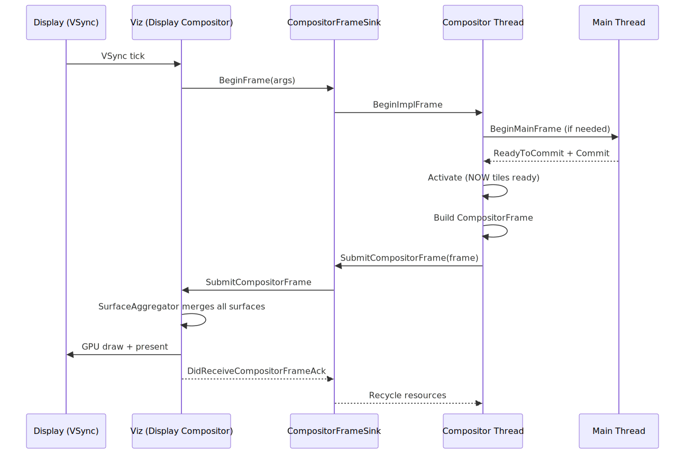
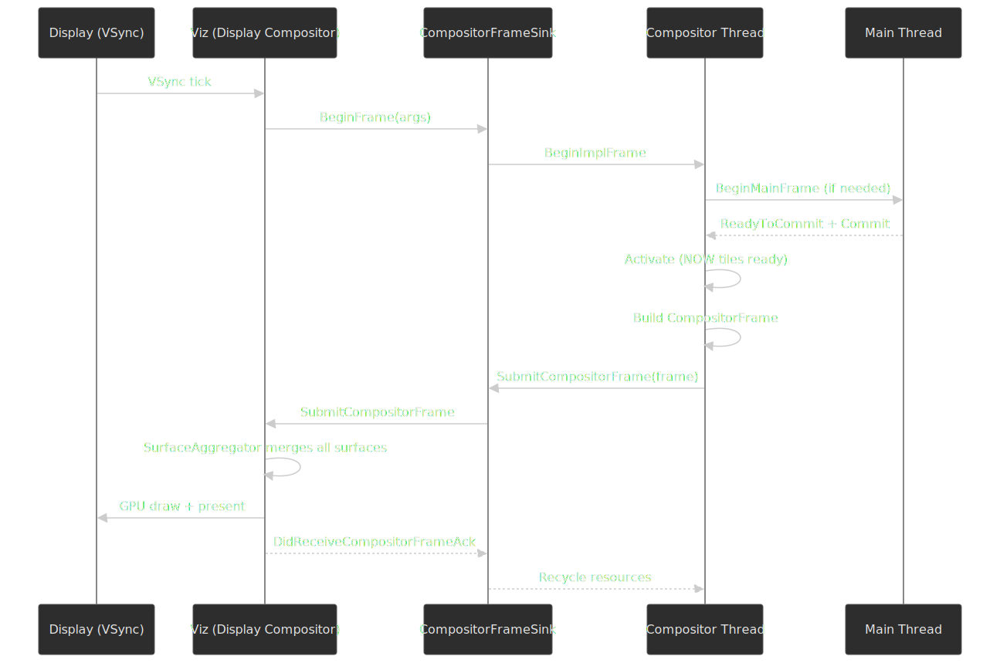

The `BeginFrameAck` returned with each submitted frame tells Viz whether new content was produced; an "empty" ack causes Viz to fall back to the previous surface for that client without stalling the rest of the page[^how-cc-works].

### Surface Aggregation

A web page often involves multiple renderer processes — site-isolated cross-origin iframes each render in their own renderer — plus the browser UI. Viz aggregates all of them into one frame for the physical display:


The `SurfaceAggregator` walks `SurfaceDrawQuad` references recursively, replaces each one with the latest `CompositorFrame` from the referenced surface, and emits a single render-pass tree to the `DirectRenderer`[^viz-readme]. If an iframe's frame hasn't arrived, Viz reuses the previous surface — one slow renderer cannot stall the rest of the page.

### Why Viz Lives in a Separate Process

**Security**: Renderer processes are sandboxed and cannot access GPU APIs directly. All GPU commands go through Viz.

**Stability**: GPU driver crashes terminate only the Viz process; renderers survive and reconnect. Users see a brief flash rather than losing their tabs.

**Resource management**: Viz controls GPU memory allocation across all tabs, preventing any single page from consuming all VRAM (Video Random Access Memory).

---

## Performance Optimization Patterns

### Promote Wisely

Layer promotion enables compositor-driven animations but costs memory. The full enumeration of triggers — what `cc::Layerize` calls **direct compositing reasons** — is covered in the [Layerize](../crp-layerize/README.md) stage; from the compositor's point of view, the relevant inputs look like this:


```css
/* Explicit promotion hint */
.will-animate {
  will-change: transform;
}

/* Implicit promotion (has side effects) */
.promoted {
  transform: translateZ(0); /* Forces own layer */
}
```

**Memory cost**: a fully-rasterized layer occupies up to `width × height × 4 bytes` (RGBA8) of GPU memory — a 1920×1080 layer ≈ 8 MB at 1× DPR, ~32 MB at 2× DPR. Actual allocation is tile-granular and depends on which tiles fall into `NOW`/`SOON` bins, but the area cost is the right back-of-envelope for "is this safe to promote on mobile?". Shared-GPU-memory devices exhaust the pool quickly when many large layers are promoted at once.

**When to promote:**

- Elements with `transform`/`opacity` animations
- Fixed/sticky positioned elements (scroll independently)
- Content with hardware video or WebGL

**When NOT to promote:**

- Static content (wastes memory)
- Thousands of small elements (layer explosion)
- Content that changes frequently (re-rasterization costs)

### Compositor-Only Animations

For 60fps animations, stick to properties the compositor can handle without main thread involvement:

| Property           | Compositor-Only? | Notes                                          |
| :----------------- | :--------------- | :--------------------------------------------- |
| `transform`        | ✅ Yes           | All transform functions                        |
| `opacity`          | ✅ Yes           | —                                              |
| `filter`           | ⚠️ Partial       | Compositor can apply, but may need render pass |
| `left`, `top`      | ❌ No            | Triggers layout                                |
| `width`, `height`  | ❌ No            | Triggers layout                                |
| `background-color` | ❌ No            | Triggers paint/raster                          |

### Avoid Forced Synchronous Layout

Reading layout properties after writes forces the browser to synchronously recalculate:

```javascript
// ❌ Forces layout thrashing
elements.forEach((el) => {
  el.style.width = `${el.offsetWidth + 10}px` // Read triggers sync layout
})

// ✅ Batch reads, then writes
const widths = elements.map((el) => el.offsetWidth) // All reads
elements.forEach((el, i) => {
  el.style.width = `${widths[i] + 10}px` // All writes
})
```

Layout thrashing on the main thread delays commits, which delays frame production.

---

## Failure Modes and Debugging

### Checkerboarding

When scrolling reveals tiles that haven't been rasterized, users see placeholder rectangles (historically a checkerboard pattern, now typically solid colors).

**Causes:**

- Scroll velocity exceeds rasterization throughput
- Memory pressure evicts pre-rasterized tiles
- Complex content (heavy SVG, many layers) slows rasterization

**Debugging:** Chrome DevTools → Performance → check for "Rasterize Paint" entries extending beyond frame budgets. The "Layers" panel shows which elements are promoted and their memory consumption.

### Layer Explosion

When too many elements are promoted, memory exhausts and performance degrades.

**Symptoms:**

- High GPU memory usage in Task Manager
- Compositor falls back to software raster
- Animations stutter despite being `transform`/`opacity` only

**Debugging:** DevTools → Layers panel → sort by memory. Look for unexpected promotions from overlap (elements stacking above promoted content force-promote).

### Commit Jank

Long commit times steal from the frame budget.

**Causes:**

- Thousands of layers (each must sync metadata)
- Complex property trees (deep nesting)
- Large display lists (many paint operations)

**Debugging:** DevTools → Performance → look for long "Commit" entries. The "Summary" tab shows time breakdown.

---

## Conclusion

Compositing is Chromium's architectural answer to a fundamental constraint: the main thread cannot execute JavaScript and produce visual updates simultaneously. By delegating frame assembly to a dedicated compositor thread with its own layer trees and property trees, the browser maintains responsive scrolling and animations regardless of main thread load.

The key insights for optimization:

1. **Promote judiciously**: Layer promotion enables compositor-driven animations but costs GPU memory
2. **Animate compositor-only properties**: `transform` and `opacity` skip the entire main-thread pipeline
3. **Understand the boundaries**: Knowing what the compositor can and cannot do prevents performance surprises
4. **Respect the frame budget**: Commit, rasterization, and Viz aggregation all compete for the 16ms window

The three-tree architecture (main → pending → active), property tree design, and one-directional dependency (main → compositor, never reverse) are the foundations enabling 60fps+ rendering on complex, multi-process web applications.

---

## Appendix

### Prerequisites

- **[Rendering Pipeline Overview](../crp-rendering-pipeline-overview/README.md)**: The end-to-end journey from HTML to pixels
- **[Paint Stage](../crp-paint/README.md)**: How display lists are recorded
- **[Rasterization](../crp-raster/README.md)**: How display lists become GPU textures
- **[Commit Stage](../crp-commit/README.md)**: The synchronization point between threads

### Terminology

| Term                       | Definition                                                                      |
| :------------------------- | :------------------------------------------------------------------------------ |
| **cc (Chrome Compositor)** | The multi-threaded compositing system in Chromium                               |
| **LayerTreeHost**          | Main thread public API for layer management                                     |
| **LayerTreeHostImpl**      | Compositor thread implementation; handles input, animations, frame production   |
| **Property Trees**         | Four separate trees (transform, clip, effect, scroll) for O(1) property lookups |
| **CompositorFrame**        | Data structure containing draw quads and render passes, sent to Viz             |
| **Draw Quad**              | Atomic drawing primitive (texture, solid color, surface reference)              |
| **Render Pass**            | Set of quads drawn to a target (screen or intermediate texture)                 |
| **Viz (Visuals)**          | Chromium's GPU process; aggregates frames and produces final display            |
| **Surface**                | Compositable unit in Viz that receives compositor frames                        |
| **Activation**             | Transition from pending tree to active tree after rasterization completes       |
| **Checkerboarding**        | Visual artifact when tiles aren't rasterized before becoming visible            |

### Summary

- **cc (Chrome Compositor)** runs on a dedicated thread, enabling responsive scrolling and animations during main thread blocks
- **Three-tree architecture** (main → pending → active) decouples content updates from display
- **Property trees** (transform, clip, effect, scroll) provide O(1) lookups instead of O(depth) traversals
- **Compositor frames** contain draw quads and render passes—abstract descriptions, not bitmaps
- **Viz process** aggregates frames from all renderer processes and browser UI into a single display output
- **Compositor-only properties** (`transform`, `opacity`) animate without main thread involvement
- **One-directional dependency**: main thread can block on compositor, but compositor never blocks on main thread

### References

- [Chromium Design Docs — How cc Works](https://chromium.googlesource.com/chromium/src/+/lkgr/docs/how_cc_works.md)
- [Chromium — `cc/` README](https://chromium.googlesource.com/chromium/src/+/HEAD/cc/README.md)
- [Chromium Design Docs — Compositor Thread Architecture](https://www.chromium.org/developers/design-documents/compositor-thread-architecture/)
- [Chrome for Developers — RenderingNG Architecture](https://developer.chrome.com/docs/chromium/renderingng-architecture)
- [Chrome for Developers — Key data structures in RenderingNG](https://developer.chrome.com/docs/chromium/renderingng-data-structures)
- [Chromium — Life of a Frame](https://chromium.googlesource.com/chromium/src/+/lkgr/docs/life_of_a_frame.md)
- [Chromium — `components/viz/` README](https://chromium.googlesource.com/chromium/src/+/main/components/viz/README.md)
- [Chromium — Surfaces design doc](https://www.chromium.org/developers/design-documents/chromium-graphics/surfaces/)
- [W3C — CSS Compositing and Blending Level 1](https://www.w3.org/TR/compositing-1/)
- [web.dev — Stick to compositor-only properties and manage layer count](https://web.dev/articles/stick-to-compositor-only-properties-and-manage-layer-count)
- [Chrome for Developers — Re-rastering composited layers on scale change](https://developer.chrome.com/blog/re-rastering-composite)
- [Chromium — GPU Accelerated Compositing in Chrome](https://www.chromium.org/developers/design-documents/gpu-accelerated-compositing-in-chrome/)
- [Chromium Graphics — design docs index](https://www.chromium.org/developers/design-documents/chromium-graphics/)

[^cc-readme]: Chromium, [`cc/README.md`](https://chromium.googlesource.com/chromium/src/+/HEAD/cc/README.md). Defines `LayerTreeHost`, `LayerTreeHostImpl`, `CompositorFrame`, `RenderPass`, `DrawQuad`, `SharedQuadState`.
[^how-cc-works]: Chromium, [How cc Works](https://chromium.googlesource.com/chromium/src/+/lkgr/docs/how_cc_works.md). Source for the three impl trees + recycle, tile size heuristics, NOW/SOON/EVENTUALLY priority binning, BeginFrame pacing, and activation gating.
[^renderingng-data]: Chrome for Developers, [Key data structures in RenderingNG](https://developer.chrome.com/docs/chromium/renderingng-data-structures). Source for the four property trees and the per-element `PropertyTreeState` 4-tuple; also describes scroll offsets being stored as 2D translations in the transform tree.
[^sqs]: Chromium source, [`components/viz/common/quads/shared_quad_state.h`](https://source.chromium.org/chromium/chromium/src/+/main:components/viz/common/quads/shared_quad_state.h). Per-pass batching of transform, clip, opacity and blend state shared by many quads.
[^viz-readme]: Chromium, [`components/viz/README.md`](https://chromium.googlesource.com/chromium/src/+/main/components/viz/README.md). Source for Surface aggregation, `SurfaceDrawQuad` resolution, and Viz process isolation.
[^web-dev-compositor]: web.dev, [Stick to compositor-only properties and manage layer count](https://web.dev/articles/stick-to-compositor-only-properties-and-manage-layer-count). Confirms `transform` and `opacity` are the universally compositor-only animatable properties; `filter` is conditional on engine and may require an intermediate render pass per frame.
[^renderingng-arch]: Chrome for Developers, [RenderingNG architecture](https://developer.chrome.com/docs/chromium/renderingng-architecture). Source for the SkiaRenderer / out-of-process raster path and the GPU-process / Viz process split.
[^gpu-arch]: Chromium, [GPU Accelerated Compositing in Chrome](https://www.chromium.org/developers/design-documents/gpu-accelerated-compositing-in-chrome/) and [GPU Architecture Roadmap](https://www.chromium.org/developers/design-documents/chromium-graphics/). Source for SharedImage / `GpuMemoryBuffer` ownership transfer and texture mailboxes.
[^re-raster]: Chrome for Developers, [Re-rastering composited layers on scale change](https://developer.chrome.com/blog/re-rastering-composite). Source for transform-only scale not forcing re-raster, while page zoom and DPR changes do.
