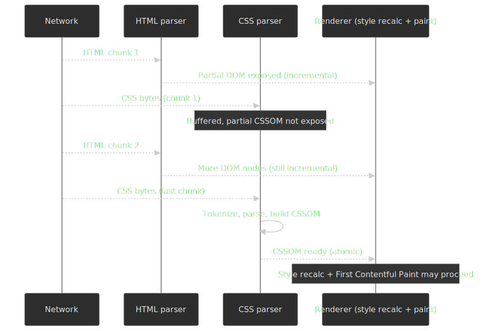
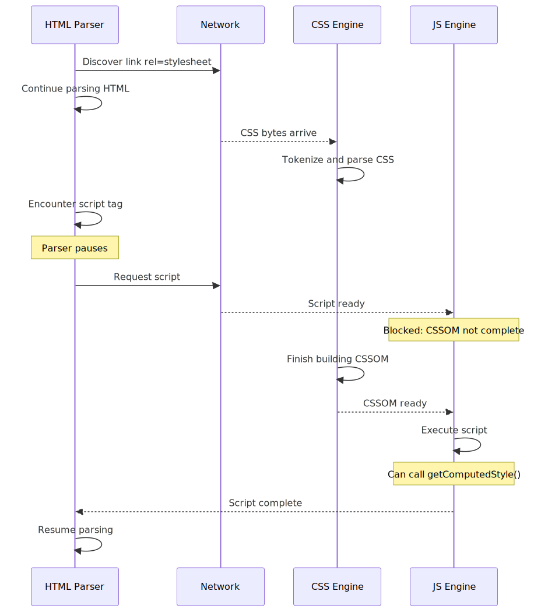
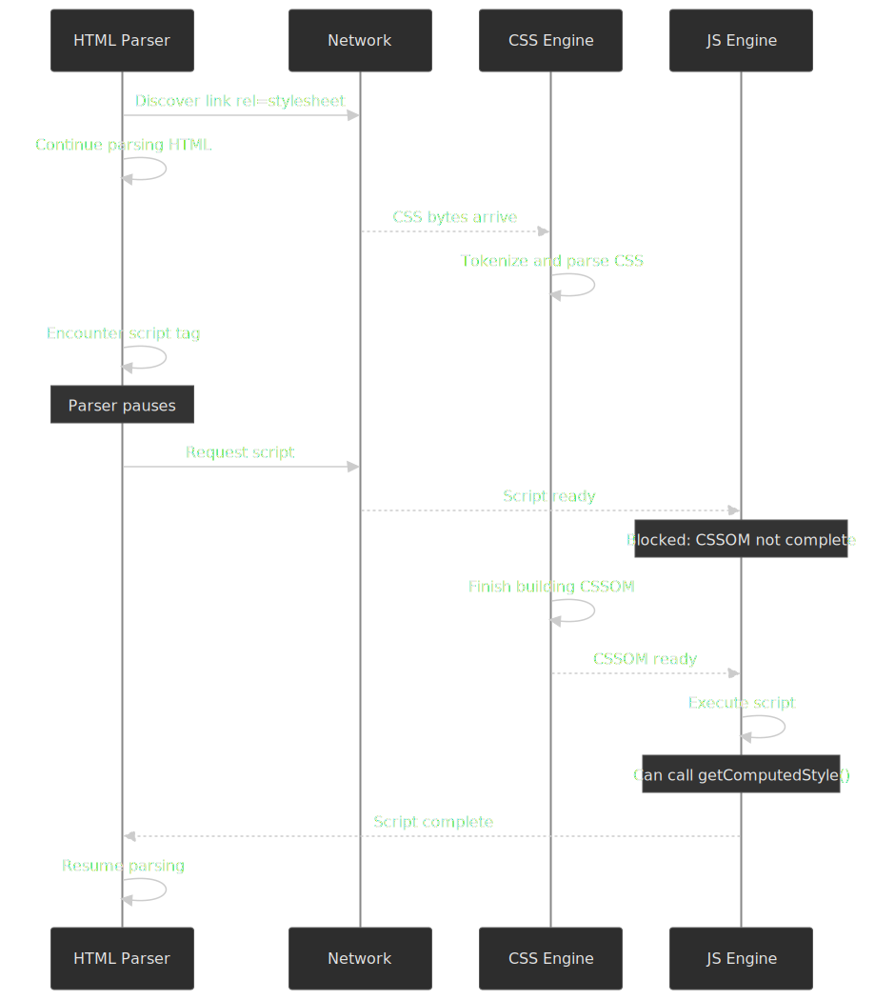

# Critical Rendering Path: CSSOM Construction

The **CSS Object Model (CSSOM)** is the browser engine's internal representation of every active stylesheet — a tree of `CSSStyleSheet` → `CSSRule` → `CSSStyleDeclaration` objects defined by the [W3C CSSOM-1 Working Draft](https://www.w3.org/TR/cssom-1/#css-object-model). Unlike [DOM construction](../crp-dom-construction/README.md), which exposes nodes incrementally, CSSOM construction is **atomic and render-blocking by default**: the [cascade sort order](https://drafts.csswg.org/css-cascade-5/#cascade-sort) requires the full rule set before a winning declaration can be chosen for any property. This article is the parallel CSS construction stage of the [Critical Rendering Path](../crp-rendering-pipeline-overview/README.md) series; the next stage — joining DOM × CSSOM into computed styles via Blink's [`StyleEngine`](https://developer.chrome.com/docs/chromium/blinkng) — is covered in [CRP: Style Recalc](../crp-style-recalculation/README.md).

 before the CSSOM is exposed; only then can style recalc and First Contentful Paint proceed.")



## Abstract

CSSOM construction transforms CSS bytes into a queryable object model through a two-stage pipeline:

1. **Tokenization** — CSS bytes become tokens (identifiers, numbers, strings, delimiters) via a state machine defined in CSS Syntax Level 3
2. **Parsing** — Tokens become a tree of `CSSStyleSheet` → `CSSRule` → declaration objects

**Why render-blocking?** The cascade algorithm requires all rules to determine the winning declaration for each property. Rendering with partial CSS would cause Flash of Unstyled Content (FOUC) as later rules override earlier ones.

**Key interactions:**

| Resource              | Blocks Parsing? | Blocks Rendering?   | Blocks JS Execution?        |
| --------------------- | --------------- | ------------------- | --------------------------- |
| CSS (default)         | No              | **Yes**             | **Yes** (if script follows) |
| CSS (`media="print"`) | No              | No                  | No                          |
| CSS (`@import`)       | No              | **Yes** (waterfall) | **Yes**                     |

**The critical constraint**: Scripts can query styles via `getComputedStyle()`, so the browser blocks script execution until pending stylesheets complete. This creates a dependency chain where CSS indirectly blocks DOM construction when scripts are involved.

## The CSS Parsing Pipeline




### Stage 1: Tokenization

The CSS tokenizer converts a stream of code points into tokens. The [W3C CSS Syntax Module Level 3](https://www.w3.org/TR/css-syntax-3/) defines this process:

> "CSS syntax describes how to correctly transform a stream of Unicode code points into a sequence of CSS tokens (tokenization)."

**Preprocessing** (before tokenization):

- CR, FF, and CR+LF sequences normalize to single LF
- NULL characters and surrogate code points become U+FFFD (replacement character)
- Encoding detected from: HTTP header → BOM → `@charset` → referrer encoding → UTF-8 default

**Token types:**

| Token                | Example                       | Purpose                  |
| -------------------- | ----------------------------- | ------------------------ |
| `<ident-token>`      | `color`, `background-image`   | Property names, keywords |
| `<function-token>`   | `rgb(`, `calc(`, `var(`       | Function calls           |
| `<at-keyword-token>` | `@media`, `@import`, `@layer` | At-rules                 |
| `<hash-token>`       | `#header`, `#fff`             | IDs and hex colors       |
| `<string-token>`     | `"Open Sans"`, `'icon.png'`   | Quoted values            |
| `<number-token>`     | `42`, `3.14`, `-1`            | Numeric values           |
| `<dimension-token>`  | `16px`, `2em`, `100vh`        | Numbers with units       |
| `<percentage-token>` | `50%`, `100%`                 | Percentage values        |

### Stage 2: Parsing

The parser transforms tokens into CSS structures following the grammar:

- **At-rules**: `@` + name + prelude + optional block (e.g., `@media screen { ... }`)
- **Qualified rules**: prelude (selector) + declaration block (e.g., `.nav { color: blue; }`)
- **Declarations**: property + `:` + value + optional `!important`

**Error recovery** is a defining characteristic:

> "When errors occur in CSS, the parser attempts to recover gracefully, throwing away only the minimum amount of content before returning to parsing as normal."

This design choice ensures forward compatibility—new CSS features are invalid syntax to older parsers, but the stylesheet continues functioning:

```css collapse={1-3,9-11}
/* Modern browser: uses container query */
/* Older browser: ignores @container, uses .card default */
@container (min-width: 400px) {
  .card {
    grid-template-columns: 1fr 2fr;
  }
}
.card {
  display: grid;
  gap: 1rem;
}
```

### The Resulting CSSOM Structure

The parser produces a tree of JavaScript-accessible objects defined in the [W3C CSSOM specification](https://www.w3.org/TR/cssom-1/):

```
document.styleSheets (StyleSheetList)
  └── CSSStyleSheet
        ├── cssRules (CSSRuleList)
        │     ├── CSSStyleRule (selector + declarations)
        │     ├── CSSMediaRule (condition + nested rules)
        │     ├── CSSImportRule (href + optional media)
        │     └── CSSLayerBlockRule (@layer + nested rules)
        ├── media (MediaList)
        └── disabled (boolean)
```

**Key interfaces:**

- `CSSStyleSheet.cssRules` — live collection of rules; modifications update the CSSOM immediately
- `CSSStyleSheet.insertRule(rule, index)` — insert rule at position
- `CSSStyleSheet.deleteRule(index)` — remove rule at position
- `CSSStyleRule.selectorText` — the selector string
- `CSSStyleRule.style` — `CSSStyleDeclaration` with property access

---

## Why CSSOM Must Be Complete Before Rendering

The design choice to make CSS render-blocking trades initial latency for visual stability. The cascade algorithm cannot produce correct results with partial input.

### The Cascade Requires All Rules

Consider this scenario:

```css
/* Rule 1: loaded first */
.button {
  background: red;
}

/* ... hundreds of rules ... */

/* Rule 2: loaded later */
.button {
  background: blue;
}
```

If the browser rendered with only Rule 1 present, the button would flash red before turning blue when Rule 2 arrives. The full cascade sort order is normative in [CSS Cascade Level 5 § 6.1](https://drafts.csswg.org/css-cascade-5/#cascade-sort), with one new step (Scope Proximity) added by [CSS Cascade Level 6 § 3.1](https://drafts.csswg.org/css-cascade-6/#cascade-sort):

1. **Origin and Importance** — Transition → important UA → important user → important author → animations → normal author → normal user → normal UA. `!important` inverts the normal-rule order, which is why important author rules can override important user rules' counterparts only when they belong to a higher-precedence origin.
2. **Encapsulation Context** — Across shadow trees: for normal rules the **outer** context wins; for important rules the **inner** context wins. This is what lets a host page restyle a custom element while still letting that element enforce hard requirements.
3. **Element-attached styles** — `style="..."` declarations beat selector-mapped declarations of the same importance.
4. **Cascade Layers** — `@layer` ordering ([Cascade L5 § 6.4.3](https://drafts.csswg.org/css-cascade-5/#layer-ordering)). For normal rules the **last** declared layer wins; for important rules the **first** layer wins. Unlayered rules sit in an implicit final layer that beats every explicit layer for normal declarations.
5. **Specificity** — `(a, b, c)` per [Selectors Level 4 § 16](https://drafts.csswg.org/selectors-4/#specificity-rules); ID > class/attribute/pseudo-class > type/pseudo-element.
6. **Scope Proximity** — Cascade L6 only: among declarations from `@scope` rules, the one whose scoping root is fewer DOM hops from the subject wins. Style rules with no scoping root are treated as infinitely far. This was added to make scoped components win against equally-specific globals without resorting to specificity hacks.
7. **Order of Appearance** — Last in document order wins. `@import`ed sheets are ordered as if substituted in place; `style` attributes sort after every stylesheet.

Without the complete rule set, none of steps 1–7 can be evaluated correctly — which is why CSSOM construction must complete before style recalc.

 is added by CSS Cascade Level 6. Each step is a tie-breaker for the previous one — the engine never falls through to specificity if origin already chose a winner.")


### Layout Stability Concerns

CSS properties like `display`, `position`, and `float` fundamentally change element geometry. Rendering with partial CSS would cause:

- **Content reflow** — Text wrapping changes as `width` constraints arrive
- **Layout shifts** — Elements repositioning as positioning rules load
- **Visual jank** — Accumulated shifts creating a poor user experience

The browser's choice: delay First Contentful Paint (FCP) until CSSOM completes rather than present an unstable initial frame.

---

## Layers, Scope, and Style-Recalc Cost

The CSSOM does not just store rules — it stores enough metadata for the [style engine](https://developer.chrome.com/docs/chromium/blinkng) to evaluate the cascade efficiently against every DOM node. Three modern features (`@layer`, `@scope`, `@container`) and one selector (`:has()`) materially change how much work that engine does on each invalidation. Authoring with their semantics in mind is the difference between sub-millisecond style recalc and visible jank.

; @scope adds a finer proximity tie-break inside a layer before specificity and source order are consulted.")


### Cascade Layers (`@layer`)

[Cascade L5 § 6.4](https://drafts.csswg.org/css-cascade-5/#layering) introduces explicit layer ordering so authors can reorder framework, theme, and component styles without selector or `!important` warfare. The non-obvious rules:

- **Layer order is fixed by first appearance.** A leading `@layer reset, base, components, utilities;` statement at-rule pins the order; later `@layer base { ... }` blocks slot rules into the existing layer without changing precedence.
- **Unlayered styles win.** Unlayered author declarations sit in an implicit final layer that **beats every explicit layer** for normal rules — a frequent source of "why is my reset losing?" bugs after a partial migration.
- **`!important` reverses layer order.** An important declaration in `@layer reset` beats an important declaration in `@layer utilities`. This preserves the override semantics of `!important` across the layer dimension.
- **`@import` can place a sheet directly into a layer**: `@import "vendor.css" layer(framework) supports(display: grid);` — see [Cascade L5 § 5](https://drafts.csswg.org/css-cascade-5/#at-import). The sheet is still subject to the `@import` waterfall (below); the layer name is recorded even if the fetch fails.
- **`revert-layer`** rolls a property back to whatever the previous layer (or origin, if there is none) would have set, without disturbing the rest of the declaration block.

### `@scope` and Scope Proximity

[Cascade L6 § 3.5](https://drafts.csswg.org/css-cascade-6/#scope-atrule) defines `@scope <root> to <limit>` (the optional `to <limit>` enables "donut scoping"). Inside a scope, the `:scope` pseudo-class matches the scoping root with zero specificity contribution, and the engine uses **scope proximity** (fewer hops from root to subject) as a cascade tie-breaker that runs **before** specificity tie-breaks. Two practical consequences:

- A scoped `.card img { … }` beats a globally-scoped `.card img { … }` of equal specificity — by proximity, not specificity, so you don't need to invent extra selector weight.
- `@scope` selectors do **not** inherit the prelude's specificity (unlike CSS Nesting), so deeply-nested scopes stay cheap to author.

### `@container` Queries

Container queries ([CSS Containment L3 § 4](https://www.w3.org/TR/css-contain-3/#container-queries)) require the queried ancestor to declare a containment context with `container-type: inline-size | size | normal`. Two cost considerations the spec is explicit about:

- Establishing `container-type: size` (or `inline-size`) imposes **layout containment** on the element, which forces it to be a formatting-context root and disables percentages-resolved-against-content for some properties. The browser then has license to skip layout work outside the container when its size changes — which is the entire performance argument for the feature.
- A `@container` rule re-evaluates only when the **nearest matching ancestor container** changes its queried axis. This is much cheaper than a viewport media query that invalidates style for the whole document, but every additional `container-type` adds an isolation point the layout pass must respect. Use it on actual reusable components, not on every `<div>`.

### `:has()` and Style Invalidation

`:has()` lets a selector subject depend on its descendants ("the subject changes when something inside changes"), which would naively require ancestor-walks on every DOM mutation. Blink avoids this with **invalidation sets** plus per-element bits. Per the [Blink style-invalidation design doc](https://chromium.googlesource.com/chromium/src/+/HEAD/third_party/blink/renderer/core/css/style-invalidation.md) and Igalia's [implementation write-up](https://blogs.igalia.com/blee/posts/2023/05/31/how-blink-invalidates-styles-when-has-in-use.html):

- When a stylesheet contains `.card:has(.is-active)`, Blink marks the `.card` element with an `AffectedBySubjectHas` bit and marks its descendants with `AncestorsAffectedBySubjectHas` during initial style resolution.
- On a DOM mutation, Blink consults the invalidation set keyed by the classes/attributes/tags inside the `:has()` argument. Mutations that touch nothing in that set are skipped without any ancestor walk.
- Mutations that match still avoid a full traversal: only ancestors whose `AncestorsAffectedBySubjectHas` bit is set get re-checked.

> [!IMPORTANT]
> The cost of `:has()` is proportional to **how often the elements inside its argument actually mutate**, not to how many `:has()` rules you author. Putting `:has(:focus-within)` on a low-traffic component is usually cheap; putting it on a body-level selector that watches a high-frequency widget is not. Use Chrome DevTools' **Performance → Recalculate Style → Selector Stats** to measure ([Chrome for Developers reference](https://developer.chrome.com/docs/devtools/performance/selector-stats)).

---

## Interaction with JavaScript

CSSOM construction creates a synchronization point between stylesheets and scripts. This happens because JavaScript can read computed styles.




### Why Scripts Wait for CSSOM

Scripts frequently query style information:

```javascript collapse={1-2,8-10}
// These all require resolved styles
const element = document.querySelector(".sidebar")
const width = element.offsetWidth // Layout property
const color = getComputedStyle(element).color // Computed style
const rect = element.getBoundingClientRect() // Geometry

// If CSSOM isn't complete, these return wrong values
```

The browser enforces a rule: **script execution is blocked while there are pending stylesheets in the document**.

This creates the blocking chain:

```
HTML Parser → <link rel="stylesheet"> → CSS download starts
           → continues parsing...
           → <script src="app.js">   → Parser pauses
                                      → Script downloads
                                      → CSS still loading? Wait.
                                      → CSS complete → CSSOM built
                                      → Script executes
                                      → Parser resumes
```

### Properties That Force Style Resolution

From [Paul Irish's comprehensive list](https://gist.github.com/paulirish/5d52fb081b3570c81e3a), these JavaScript operations require the CSSOM:

**Layout-dependent properties** (also force layout):

- `offsetLeft`, `offsetTop`, `offsetWidth`, `offsetHeight`, `offsetParent`
- `clientLeft`, `clientTop`, `clientWidth`, `clientHeight`
- `scrollWidth`, `scrollHeight`, `scrollTop`, `scrollLeft`
- `getClientRects()`, `getBoundingClientRect()`

**`getComputedStyle()`** always requires a complete CSSOM — it returns *resolved* values (per [CSSOM-1 § 6.1](https://www.w3.org/TR/cssom-1/#resolved-values)), and resolved values can only be computed after the cascade has chosen a winner for every property. When the queried property is layout-dependent (`width`, `height`, `top`, anything resolving against percentages, transforms, etc.), the call additionally forces a synchronous **layout** pass — Paul Irish's [What Forces Layout/Reflow](https://gist.github.com/paulirish/5d52fb081b3570c81e3a) catalogues the full surface.

**Recommendation**: Minimize style queries in critical-path JavaScript. Batch reads before writes within a frame to avoid layout thrashing — the engine can only coalesce a recalc/layout pass if you don't repeatedly invalidate it between reads.

---

## Media Queries and Render-Blocking Behavior

Not all stylesheets block rendering. The browser evaluates media queries at parse time and only blocks on stylesheets that could affect the current viewport. The combined picture — what blocks, what is discovered early, and how the [`blocking="render"`](https://html.spec.whatwg.org/multipage/urls-and-fetching.html#blocking-attributes) opt-in fits in — is summarized below; web.dev's [Render-blocking CSS](https://web.dev/articles/critical-rendering-path/render-blocking-css) and [Avoid render-blocking resources](https://web.dev/learn/performance/optimize-resource-loading) are the canonical secondary references.

 sit on the critical path to FCP. media=print and preload-with-onload-swap entries are discovered by the preload scanner and downloaded in parallel, but apply only after the first paint.")


### Conditional Render-Blocking

| Stylesheet                                                               | Blocks Rendering?             | Explanation                             |
| ------------------------------------------------------------------------ | ----------------------------- | --------------------------------------- |
| `<link rel="stylesheet" href="main.css">`                                | **Yes**                       | No media condition = applies everywhere |
| `<link rel="stylesheet" href="print.css" media="print">`                 | No                            | Print media doesn't match screen        |
| `<link rel="stylesheet" href="desktop.css" media="(min-width: 1024px)">` | **Only if viewport ≥ 1024px** | Evaluated against current viewport      |
| `<link rel="stylesheet" href="style.css" disabled>`                      | No                            | Disabled stylesheets are ignored        |

**The browser still downloads non-blocking stylesheets** but at lower priority. They're available for media query changes (e.g., window resize, print dialog).

### Non-Blocking CSS Loading Pattern

A common optimization loads non-critical CSS without blocking rendering:

```html collapse={1}
<head>
  <!-- Critical CSS inlined for immediate rendering -->
  <style>
    .header {
      height: 60px;
      background: #fff;
    }
    .hero {
      min-height: 400px;
    }
  </style>

  <!-- Non-critical CSS: print media initially, switch on load -->
  <link rel="stylesheet" href="full.css" media="print" onload="this.media='all'" />
  <noscript><link rel="stylesheet" href="full.css" /></noscript>
</head>
```

**How it works:**

1. `media="print"` makes the stylesheet non-render-blocking for screen
2. Browser downloads it with lower priority
3. `onload` fires when download completes, setting `media="all"`
4. Styles apply after initial paint (may cause FOUC for below-fold content)

### The `blocking="render"` Attribute

The WHATWG HTML Standard added explicit control over render-blocking:

```html
<!-- Script-inserted stylesheet that should block rendering -->
<link rel="stylesheet" href="critical.css" blocking="render" />

<!-- Script that should block rendering (even if async) -->
<script src="hydration.js" blocking="render"></script>
```

**Use case**: When a script dynamically inserts stylesheets, the browser doesn't block rendering by default. Adding `blocking="render"` to the inserted stylesheet prevents FOUC.

---

## The `@import` Problem

`@import` rules create a request waterfall that defeats browser optimizations.

### Why @import Hurts Performance

```css
/* main.css - browser must download this first */
@import url("reset.css");
@import url("components.css");
/* ... other rules ... */
```

The browser cannot discover `reset.css` and `components.css` until `main.css` downloads and parses. This creates a sequential waterfall:

```
[========= main.css =========]
                              [======= reset.css =======]
                                                         [=== components.css ===]
```

With `<link>` elements, the preload scanner discovers all stylesheets immediately:

```
[========= main.css =========]
[======= reset.css =======]    (parallel)
[=== components.css ===]       (parallel)
```

### Real-World Impact

[HTTP Archive analysis (Erwin Hofman & Paul Calvano, Nov 2024)](https://calendar.perfplanet.com/2024/the-curious-performance-case-of-css-import/) of 16.27 million mobile sites:

- 18.86% of sites use `@import` (3.06 million); 15.16% via third-party stylesheets, 5.50% via first-party
- A WooCommerce case study saw a **37.1% improvement in mobile P75 `firstByteToFCP`** (excluding Safari) after removing a single `@import` that loaded a Google Font
- Removing render-blocking `@import` from Vipio.com improved cold-load mobile **P80 FCP from 2782 ms → 1872 ms (32.7%)**

**Recommendation**: Replace `@import` with `<link rel="stylesheet">` elements. The only valid use case is dynamically loading stylesheets based on conditions the HTML cannot express.

### @import Evaluation Timing

[Cascade L5 § 5](https://drafts.csswg.org/css-cascade-5/#at-import) requires `@import` rules to precede every other rule in a stylesheet, ignoring `@charset` and *empty* `@layer` statements. The browser then:

1. Parses the parent stylesheet up to the `@import` rule.
2. Initiates the fetch for the imported stylesheet (only at this point — the preload scanner cannot see it).
3. **Blocks CSSOM completion** until that imported sheet has been fetched, parsed, and itself recursively resolved any further `@import` rules it contains.
4. Continues with the remaining parent rules.

Because the fetch for the child sheet is gated on the parent's bytes arriving, every nesting level adds at least one full round-trip to the critical path — and bypasses HTTP/2 / HTTP/3 multiplexing benefits the preload scanner would otherwise unlock for `<link>` siblings. `@import` with `layer()` and `supports()` is still subject to this same waterfall — the layer assignment is recorded synchronously, but the rule fetch is not.

---

## Developer Optimizations

### Critical CSS Inlining

Extract CSS required for above-the-fold content and inline it in the HTML:

```html collapse={1-2,14-16}
<!DOCTYPE html>
<html>
  <head>
    <style>
      /* Critical CSS: above-the-fold only */
      body {
        margin: 0;
        font-family: system-ui;
      }
      .header {
        height: 60px;
        display: flex;
        align-items: center;
      }
      .hero {
        min-height: 50vh;
        background: #f5f5f5;
      }
    </style>

    <!-- Load full CSS asynchronously -->
    <link rel="preload" href="full.css" as="style" onload="this.onload=null;this.rel='stylesheet'" />
    <noscript><link rel="stylesheet" href="full.css" /></noscript>
  </head>
</html>
```

**Target**: Keep critical CSS (and the rest of the first HTML packet) under **~14 KB on the wire**. That is the payload of TCP's initial congestion window — 10 segments × 1460-byte MSS — standardized in [RFC 6928](https://www.rfc-editor.org/rfc/rfc6928) and the basis of [Google's "first 14 KB" rule](https://web.dev/articles/extract-critical-css#why-extract-critical-css). Anything over that costs an extra round-trip before First Contentful Paint.

**Trade-off**: Inlined CSS cannot be cached separately. For repeat visits, external stylesheets (cached) may perform better.

### Preload for CSS

`<link rel="preload">` elevates resource priority and enables early discovery:

```html
<head>
  <!-- Preload: discovered immediately, highest priority -->
  <link rel="preload" href="critical.css" as="style" />

  <!-- Fonts referenced in CSS: hidden from preload scanner -->
  <link rel="preload" href="/fonts/main.woff2" as="font" type="font/woff2" crossorigin />

  <link rel="stylesheet" href="critical.css" />
</head>
```

**When to use preload for CSS**:

- Stylesheets in `@import` chains (defeats waterfall)
- Stylesheets added dynamically by JavaScript
- Stylesheets in Shadow DOM (not discoverable by parser)

**When NOT to use preload**:

- Stylesheets already in `<head>` as `<link rel="stylesheet">` — already discovered by preload scanner

### Constructable Stylesheets

Modern browsers support creating stylesheets programmatically without DOM manipulation:

```javascript collapse={1-2,10-14}
// Create and populate stylesheet
const sheet = new CSSStyleSheet()
sheet.replaceSync(`
  .component { padding: 1rem; }
  .component--active { background: #e0e0e0; }
`)

// Apply to document
document.adoptedStyleSheets = [...document.adoptedStyleSheets, sheet]

// Apply to Shadow DOM
const shadow = element.attachShadow({ mode: "open" })
shadow.adoptedStyleSheets = [sheet]
```

**Benefits**:

- **Shared styles**: One stylesheet instance across multiple shadow roots
- **No FOUC**: Styles apply synchronously after `replaceSync()`
- **No DOM nodes**: No `<style>` elements to manage
- **Efficient updates**: `replace()` for async, `replaceSync()` for sync

**Browser support**: Chrome 73+, Edge 79+, Firefox 101+, Safari 16.4+

---

## Conclusion

CSSOM construction is the synchronization gate in the Critical Rendering Path. The render-blocking behavior ensures visual stability by requiring the complete cascade input before style resolution.

**Key optimization strategies**:

1. **Minimize render-blocking CSS** — Inline critical styles, defer non-critical
2. **Avoid `@import`** — Use `<link>` elements for parallel discovery
3. **Use media queries** — Non-matching stylesheets don't block rendering
4. **Preload hidden CSS** — Fonts and `@import`ed stylesheets benefit from preload hints
5. **Batch script style queries** — Minimize forced synchronous style resolution

The CSSOM's render-blocking nature is a deliberate design trade-off: the browser delays the first frame to guarantee visual consistency. Understanding this constraint helps engineers minimize CSS in the critical path while ensuring users never see Flash of Unstyled Content.

---

## Appendix

### Prerequisites

- Understanding of the Critical Rendering Path and its stages
- Familiarity with [DOM construction](../crp-dom-construction/README.md)
- Basic knowledge of CSS cascade, specificity, and inheritance

### Terminology

| Term                  | Definition                                                                                                  |
| --------------------- | ----------------------------------------------------------------------------------------------------------- |
| **CSSOM**             | CSS Object Model — the tree of stylesheet objects, rules, and declarations                                  |
| **CSSStyleSheet**     | JavaScript interface representing a single stylesheet                                                       |
| **CSSRule**           | Base interface for all CSS rule types (style rules, at-rules)                                               |
| **Render-Blocking**   | Resource that prevents First Contentful Paint until loaded                                                  |
| **FOUC**              | Flash of Unstyled Content — visual artifact when content renders before CSS                                 |
| **Cascade**           | Algorithm determining which CSS declaration wins when multiple rules match                                  |
| **Preload Scanner**   | Secondary parser discovering resources while main parser is blocked                                         |
| **Critical CSS**      | Minimum CSS required to render above-the-fold content                                                       |
| **Cascade Layer**     | Named precedence band (`@layer`) — last layer wins for normal rules, first layer wins for `!important`      |
| **`@scope`**          | At-rule defining a scoping root and optional limit; introduces Scope Proximity as a cascade tie-break       |
| **Scope Proximity**   | Cascade L6 tie-break: fewer DOM hops between scoping root and subject wins                                  |
| **Container Context** | Element with `container-type: size \| inline-size`; required for `@container` queries against it            |
| **Invalidation Set**  | Blink data structure mapping DOM mutations to the elements whose style needs recalc                         |

### Summary

- CSS is render-blocking because the cascade — formalized in [CSS Cascade L5 § 6.1](https://drafts.csswg.org/css-cascade-5/#cascade-sort) and extended by [L6's Scope Proximity step](https://drafts.csswg.org/css-cascade-6/#cascade-sort) — requires every rule to be present before a winning declaration can be chosen
- The CSS parser uses a two-stage pipeline: tokenization (bytes → tokens) then parsing (tokens → CSSOM tree)
- The style engine joins DOM × CSSOM into immutable `ComputedStyle` objects per Blink's [BlinkNG document lifecycle](https://developer.chrome.com/docs/chromium/blinkng)
- Scripts are blocked on pending stylesheets because `getComputedStyle()` returns resolved values that depend on a complete cascade
- Media queries control render-blocking; `media="print"` plus an `onload` swap is the canonical async-CSS pattern, with `blocking="render"` as the explicit opt-in
- `@import` creates request waterfalls that defeat the preload scanner — use `<link>` (or `@import "..." layer(...)` only when layer ordering is the actual constraint)
- `@layer` rewrites the cascade in defined precedence bands; unlayered styles still beat every explicit layer for normal rules
- `@scope` adds proximity as a cascade tie-break before specificity; `@container` trades a containment cost for invalidation isolation; `:has()` is cheap when the elements inside its argument rarely mutate
- Critical CSS inlining trades cacheability for faster First Contentful Paint
- Constructable Stylesheets provide a modern API for programmatic CSSOM manipulation

### References

- [W3C CSS Object Model (CSSOM) Working Draft](https://www.w3.org/TR/cssom-1/) — `CSSStyleSheet`, `CSSRule`, resolved values
- [W3C CSS Syntax Module Level 3](https://www.w3.org/TR/css-syntax-3/) — Tokenization and parsing grammar
- [W3C CSS Cascading and Inheritance Level 5](https://www.w3.org/TR/css-cascade-5/) — Cascade sort order, layers, `@import` syntax
- [W3C CSS Cascading and Inheritance Level 6](https://drafts.csswg.org/css-cascade-6/) — `@scope` and Scope Proximity step
- [W3C CSS Selectors Level 4 § 16 Specificity](https://drafts.csswg.org/selectors-4/#specificity-rules) — Authoritative specificity rules
- [W3C CSS Containment Module Level 3](https://www.w3.org/TR/css-contain-3/) — `container-type`, `@container` semantics
- [W3C CSS Values & Units Level 4](https://www.w3.org/TR/css-values-4/) — Value computation surface (used by resolved values)
- [WHATWG HTML Standard: Blocking attributes](https://html.spec.whatwg.org/multipage/urls-and-fetching.html#blocking-attributes) — `blocking="render"` opt-in
- [web.dev: Render-Blocking CSS](https://web.dev/articles/critical-rendering-path/render-blocking-css) — Practical render-blocking guidance
- [web.dev: Avoid Render-Blocking Resources](https://web.dev/learn/performance/optimize-resource-loading) — Preload scanner and discovery
- [web.dev: Defer Non-Critical CSS](https://web.dev/articles/defer-non-critical-css) — Preload + media-swap async pattern
- [web.dev: Extract Critical CSS](https://web.dev/articles/extract-critical-css) — Above-the-fold inlining
- [web.dev: Reduce the Scope and Complexity of Style Calculations](https://web.dev/articles/reduce-the-scope-and-complexity-of-style-calculations) — Selector cost profiling
- [web.dev: Constructable Stylesheets](https://web.dev/articles/constructable-stylesheets) — Modern stylesheet API
- [Chrome for Developers: BlinkNG and the rendering pipeline](https://developer.chrome.com/docs/chromium/blinkng) — `StyleEngine`, immutable `ComputedStyle`, document lifecycle
- [Chromium source: CSS Style Invalidation in Blink](https://chromium.googlesource.com/chromium/src/+/HEAD/third_party/blink/renderer/core/css/style-invalidation.md) — Invalidation sets and pending invalidations
- [Igalia: How Blink invalidates styles when `:has()` is in use](https://blogs.igalia.com/blee/posts/2023/05/31/how-blink-invalidates-styles-when-has-in-use.html) — `AffectedBySubjectHas` flags and ancestor walks
- [Chrome DevTools: Selector Stats](https://developer.chrome.com/docs/devtools/performance/selector-stats) — Measuring style recalc cost
- [Paul Irish: What Forces Layout/Reflow](https://gist.github.com/paulirish/5d52fb081b3570c81e3a) — Forced synchronous layout catalogue
- [Web Performance Calendar: The Curious Case of CSS @import](https://calendar.perfplanet.com/2024/the-curious-performance-case-of-css-import/) — Production `@import` impact data
- [RFC 6928: Increasing TCP's Initial Window](https://www.rfc-editor.org/rfc/rfc6928) — `initcwnd = 10` underpinning the 14 KB rule
- [MDN: Critical Rendering Path](https://developer.mozilla.org/en-US/docs/Web/Performance/Critical_rendering_path) — CRP overview and CSSOM role
