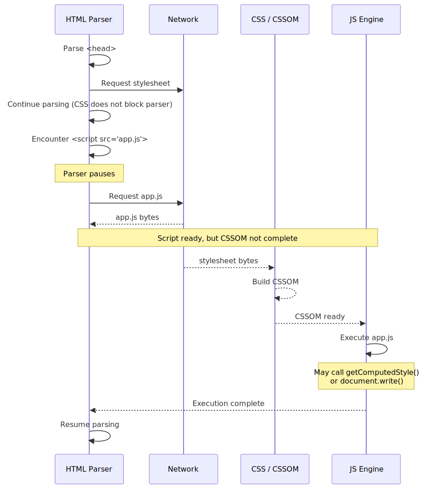
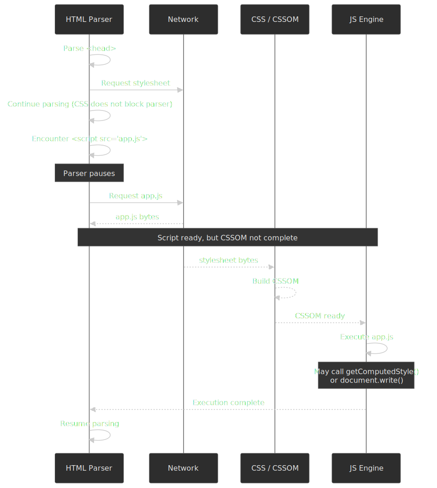
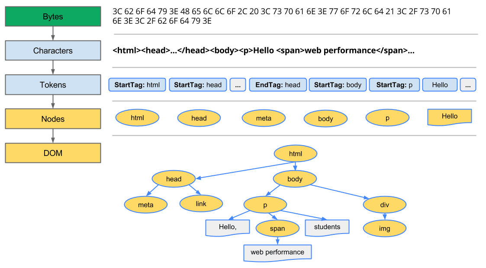
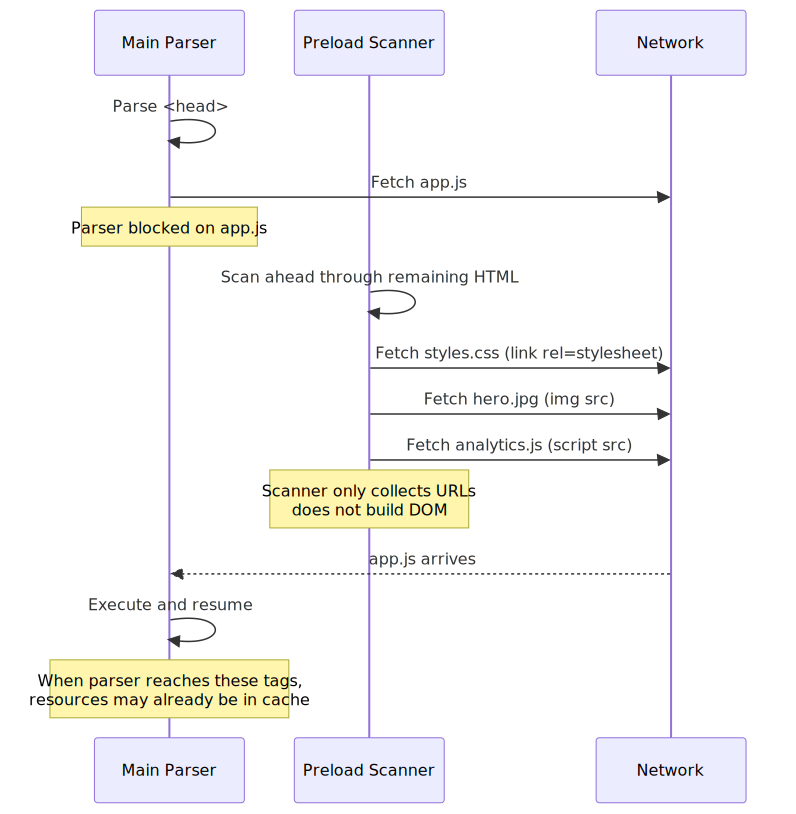
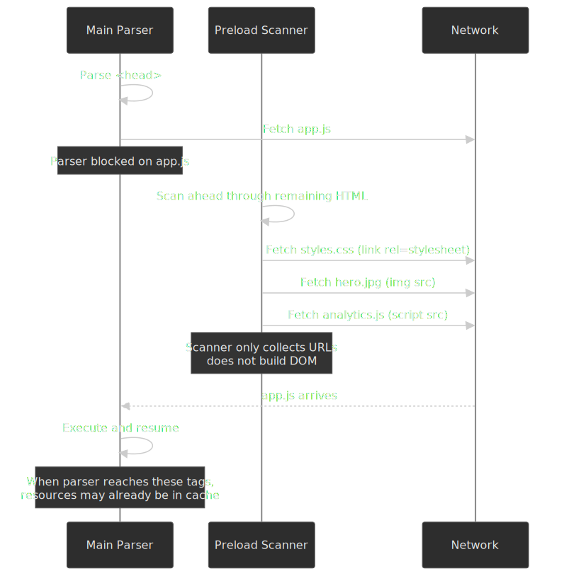

# Critical Rendering Path: DOM Construction

How browsers parse HTML bytes into a Document Object Model (DOM) tree, why JavaScript loading strategies dictate performance, and how the preload scanner mitigates the cost of parser-blocking resources. This is the first construction stage of the [Critical Rendering Path](../crp-rendering-pipeline-overview/README.md) series; the parallel CSS pipeline is covered in [CRP: CSSOM Construction](../crp-cssom-construction/README.md).




## Abstract

The HTML parser is a **state machine with error recovery**—not a traditional parser that rejects malformed input. This design choice, mandated by the HTML5 specification, ensures every document produces a DOM tree regardless of syntax errors.

**Core mental model:**

- **Two parsers, one goal**: The primary parser builds the DOM sequentially; the preload scanner races ahead to discover resources while the primary parser is blocked on scripts.
- **Scripts block because they can write**: `document.write()` can inject content into the token stream mid-parse, forcing synchronous execution. Modern attributes (`defer`, `async`, `type="module"`) opt out of this legacy behavior.
- **CSS blocks scripts, not parsing**: The parser continues building the DOM while CSS loads, but script execution waits for CSSOM completion because scripts may query computed styles.

**The blocking chain:**




The preload scanner exists because this chain is expensive. Early measurements when Mozilla, WebKit, and IE shipped speculative parsers in 2008 reported roughly **19–20% faster** page loads — Mozilla in [Bug 364315](https://bugzilla.mozilla.org/show_bug.cgi?id=364315) and Google across the Alexa top 2,000 sites, summarized in [Andy Davies' write-up](https://andydavies.me/blog/2013/10/22/how-the-browser-pre-loader-makes-pages-load-faster/).

## The Parsing Pipeline

The HTML parser transforms bytes into a DOM tree through two primary stages defined by the [WHATWG HTML specification](https://html.spec.whatwg.org/multipage/parsing.html):

### Stage 1: Tokenization

The tokenizer is a state machine with **80 distinct states** in the current Living Standard ([§13.2.5 — Tokenization](https://html.spec.whatwg.org/multipage/parsing.html#tokenization)) that processes the input character stream and emits tokens. Key state categories:

| State Category           | Purpose                      | Example Transitions                      |
| ------------------------ | ---------------------------- | ---------------------------------------- |
| **Data states**          | Normal content parsing       | Data → Tag Open → Tag Name               |
| **Tag parsing**          | Element recognition          | `<` triggers Tag Open state              |
| **Attribute handling**   | Name/value extraction        | Attribute Name → Before Attribute Value  |
| **Script data**          | Special script content rules | Handles `</script>` detection in strings |
| **RCDATA / RAWTEXT**     | Title, textarea, style, xmp  | Tags treated as text until matching end  |
| **Character references** | Entity decoding              | `&amp;` → `&`                            |

The tokenizer emits **six token types**: DOCTYPE, start tag, end tag, comment, character, and end-of-file ([§13.2.5 — Tokenization](https://html.spec.whatwg.org/multipage/parsing.html#tokenization)). Tokens are passed one-by-one to tree construction; tree construction may switch the tokenizer back into a different state (for example, the tree builder flips the tokenizer into `script data` when it sees a `<script>` start tag), which is why HTML tokenization is **not** a context-free state machine ([§13.2.6.2 — Parsing elements that contain only text](https://html.spec.whatwg.org/multipage/parsing.html#parsing-elements-that-contain-only-text)).

### Stage 2: Tree Construction

Tree construction uses **insertion modes** to determine how each token modifies the DOM. The [WHATWG specification §13.2.6.4](https://html.spec.whatwg.org/multipage/parsing.html#the-insertion-mode) defines **23 insertion modes**:

| Phase            | Modes                                                                                                              |
| ---------------- | ------------------------------------------------------------------------------------------------------------------ |
| Document prolog  | `initial`, `before html`, `before head`, `in head`, `in head noscript`, `after head`                               |
| Body content     | `in body`, `text`                                                                                                  |
| Tables           | `in table`, `in table text`, `in caption`, `in column group`, `in table body`, `in row`, `in cell`                 |
| Forms / templates| `in select`, `in select in table`, `in template`                                                                   |
| Document epilog  | `after body`, `in frameset`, `after frameset`, `after after body`, `after after frameset`                          |

A separate set of rules applies inside SVG and MathML subtrees ([§13.2.6.5 — The rules for parsing tokens in foreign content](https://html.spec.whatwg.org/multipage/parsing.html#parsing-main-inforeign)).

The parser maintains five pieces of mutable state ([§13.2.4 — Parse state](https://html.spec.whatwg.org/multipage/parsing.html#the-insertion-mode)):

1. **Insertion mode** — the current state-machine state.
2. **Original insertion mode** — saved when entering `text` mode so the parser knows where to return.
3. **Stack of open elements** — the current nesting context; `current node` is the top of this stack.
4. **List of active formatting elements** — drives the adoption agency algorithm for `<b>`, `<i>`, `<a>` across misnested tags.
5. **Stack of template insertion modes** — pushed/popped on entering/leaving each `<template>`.




```html collapse={1-5,8-12}
<!doctype html>
<html>
  <head>
    <link href="style.css" rel="stylesheet" />
  </head>
  <body>
    <p>Hello <span>web performance</span> students!</p>
  </body>
</html>
```



## HTML5 Error Recovery

Unlike XML parsers that reject malformed input, the HTML parser **always produces a DOM tree**. The specification defines exact error recovery behavior for every malformed pattern, ensuring consistent results across browsers.

### The Adoption Agency Algorithm

When formatting elements like `<b>` or `<i>` are improperly nested, the adoption agency algorithm restructures the DOM to match user intent:

```html
<!-- Input: misnested tags -->
<p>One <b>two <i>three</b> four</i> five</p>

<!-- Parsed result: algorithm "adopts" nodes to fix nesting -->
<p>One <b>two <i>three</i></b><i> four</i> five</p>
```

The algorithm earned its name because "elements change parents" — nodes are reparented to produce valid structure. The [adoption agency algorithm](https://html.spec.whatwg.org/multipage/parsing.html#adoption-agency-algorithm) was chosen over alternatives that earlier WG drafts named the "incest algorithm" and the "Heisenberg algorithm" — the spec note still acknowledges those rejected names.

### Foster Parenting

When content appears inside `<table>` where it's not allowed, the parser uses **foster parenting** to place it before the table:

```html
<!-- Input: text directly in table -->
<table>
  Some text
  <tr>
    <td>Cell</td>
  </tr>
</table>

<!-- Parsed result: text "fostered" before table -->
Some text
<table>
  <tbody>
    <tr>
      <td>Cell</td>
    </tr>
  </tbody>
</table>
```

The foster parent is typically the element before the table in the stack of open elements. This explains why stray text inside tables appears above them in the rendered output.

### Common Parse Errors

The specification defines [70+ parse-error codes](https://html.spec.whatwg.org/multipage/parsing.html#parse-errors) for conformance checkers; user agents simply recover. Common scenarios:

| Error                       | Input                 | Recovery Behavior        |
| --------------------------- | --------------------- | ------------------------ |
| `duplicate-attribute`       | `<div id="a" id="b">` | Second attribute ignored |
| `end-tag-with-attributes`   | `</div class="x">`    | Attributes ignored       |
| `missing-end-tag-name`      | `</>`                 | Treated as bogus comment |
| `unexpected-null-character` | `<div>\0</div>`       | Replaced with U+FFFD     |

---

## Why Incremental Parsing Matters

Unlike [CSSOM construction](../crp-cssom-construction/README.md), which is render-blocking and must complete before any paint, DOM construction is **streaming and incremental**. The browser starts building the tree as soon as bytes arrive and continues every time a new chunk lands. Three downstream optimizations depend on this:

- **Early resource discovery.** The preload scanner walks the byte stream ahead of tree construction to find `<link>`, `<script>`, and `` resources well before the main parser reaches them.
- **Progressive rendering.** Once the parser has emitted enough of the tree to lay out an above-the-fold region, [style recalculation](../crp-style-recalculation/README.md) and [layout](../crp-layout/README.md) can run on that subtree without waiting for `</body>`.
- **Streaming HTML.** Chunked transfer encoding (or HTTP/2/3 framing) lets the server flush partial markup; the parser consumes each chunk into the same DOM tree without re-parsing earlier bytes. Frameworks that stream SSR (React 18 `renderToPipeableStream`, Next.js App Router, SvelteKit, Remix) lean on this directly.

The single thing that breaks incremental parsing is a parser-blocking script — and that is exactly why every loading-strategy decision in this article matters.

---

## Browser Design: Why JavaScript Blocks Parsing

By default, `<script>` tags block HTML parsing because scripts can modify the document during parsing via `document.write()` ([HTML spec §13.2.6.5 — Scripts that modify the page as it is being parsed](https://html.spec.whatwg.org/multipage/parsing.html#scripts-that-modify-the-page-as-it-is-being-parsed)). This legacy API injects content directly into the parser's input stream:

```html collapse={1-2,7-8}
<head>
  <script>
    // This writes tokens directly into the parser's input stream
    document.write('<link rel="stylesheet" href="injected.css">')
  </script>
</head>
```

Because the parser cannot predict what a script will write, it must pause, execute the script, then continue with any newly injected content. This is why scripts are **parser-blocking** by default.

### The Full Blocking Chain

1. HTML parser encounters a `<script>` tag
2. Parser pauses (cannot proceed—script might call `document.write()`)
3. Script downloads (if external)
4. If CSS is still loading, execution waits for CSSOM completion
5. Script executes (may inject content via `document.write()`)
6. Any written content is tokenized and processed
7. Parser resumes from where it paused

**Critical distinction**: CSS blocks JavaScript **execution**, not **download**. The browser fetches scripts in parallel but won't run them until pending stylesheets complete. This prevents scripts from reading incorrect computed styles via `getComputedStyle()`.

### Chrome's document.write() Intervention

> [!IMPORTANT]
> Since Chrome 55 (October 2016), Chrome blocks `document.write()`-injected scripts under specific conditions to protect users on slow connections. The intervention shipped for **2G** effective connection types; the original blog post flagged future expansion to slow 3G/Wi‑Fi as a possibility, not a shipped behavior.[^docwrite]

The intervention triggers when **all** of these conditions hold simultaneously:[^docwrite]

- User's effective connection type is 2G.
- Script is in the top-level document (not an iframe).
- Script is parser-blocking (no `async` / `defer`).
- Script is cross-site (different eTLD+1 from the page).
- Script is not already in the HTTP cache.
- The page load was not triggered by a reload (reload gestures suppress the intervention).

Chrome's 28-day, 1%-of-stable field trial on 2G users showed dramatic improvements: **10% more** page loads reached First Contentful Paint, the **mean time to FCP fell 21%** (over a second faster), and the **mean time to fully parsed dropped 38%** — nearly six seconds.[^docwrite]

**Recommendation:** Never use `document.write()` for loading scripts. Use `defer`, `async`, or DOM insertion methods (`appendChild`, `insertBefore`) instead.

[^docwrite]: [Intervening against `document.write()` — Chrome for Developers](https://developer.chrome.com/blog/removing-document-write).

---

## Browser Design: Why CSS is Render-Blocking

CSS blocks rendering—not parsing—because the cascade cannot be resolved incrementally.

If browsers rendered with a partial CSSOM, users would experience a **Flash of Unstyled Content (FOUC)** or "Flash of Wrong Styles" as later rules override earlier ones. Browsers wait for a complete CSSOM to ensure visual stability and prevent layout shifts.

### When CSS Becomes Parser-Blocking

CSS becomes parser-blocking whenever **any** script — external **or** inline — follows a pending stylesheet in the document. The HTML spec is explicit: a parser-inserted classic script that does not have `async` or `defer` set is blocked on every style sheet whose `<link>` element appeared earlier in the document ([HTML spec §13.2.6 — A script that will execute when the parser resumes](https://html.spec.whatwg.org/multipage/parsing.html#a-script-that-will-execute-when-the-parser-resumes), step-by-step rules in the [Scripting section §scripting-3](https://html.spec.whatwg.org/multipage/scripting.html#a-script-that-will-execute-when-the-parser-resumes)).

```html collapse={1}
<head>
  <link rel="stylesheet" href="styles.css" />
  <!-- Stylesheet is downloading... -->

  <script src="app.js"></script>
  <!-- Parser blocks here waiting for app.js AND styles.css -->

  <script>
    // Same blocking applies to inline scripts: this <script>
    // also waits for styles.css before executing, even though
    // there is nothing to download.
    document.body.classList.add("hydrated")
  </script>
</head>
```

The browser must wait for the stylesheet to finish so it can build a complete CSSOM **before** running the script, because the script might call `getComputedStyle()` or read layout-derived properties (`offsetWidth`, `getBoundingClientRect()`) whose values depend on the cascade ([CSSOM View §extensions-to-the-window-interface](https://drafts.csswg.org/cssom-view/#extensions-to-the-window-interface)). Running the script against a partial CSSOM would return incorrect values and serialize layout bugs into application state.

The footgun: an inline script in `<head>` is often inserted "for free" by analytics snippets, A/B testing libraries, or CSP nonces, and it silently lengthens the critical path by the round-trip of every preceding stylesheet.

---

## JavaScript Loading Strategies


The semantics below are defined in [HTML spec §4.12.1 — The script element](https://html.spec.whatwg.org/multipage/scripting.html#the-script-element) (the `async`, `defer`, and `type` attributes) and in [§13.2.6 — Tree construction (script handling)](https://html.spec.whatwg.org/multipage/parsing.html#scripting).

### Default (Parser-Blocking)

```html
<script src="app.js"></script>
```

- Blocks HTML parsing until download and execution complete
- Preserves document order
- **Use for**: Legacy scripts that require `document.write()` (avoid if possible)

### Async

```html
<script src="analytics.js" async></script>
```

- Downloads in parallel with parsing
- Executes immediately upon download (interrupts parser briefly)
- **Order NOT preserved**—whichever script downloads first runs first
- **Use for**: Independent third-party scripts (analytics, ads, widgets)

**Edge case**: If an async script downloads before parsing reaches it, execution still interrupts the parser. This is why async scripts can cause unpredictable layout shifts if they modify the DOM.

### Defer

```html
<script src="app.js" defer></script>
```

- Downloads in parallel with parsing
- Executes after the DOM is fully parsed but before `DOMContentLoaded`
- **Order preserved**—scripts execute in document order regardless of download completion order
- **Use for**: Primary application scripts

**The DOMContentLoaded timing**: Deferred scripts execute in the gap between DOM completion and `DOMContentLoaded` firing. Event listeners for `DOMContentLoaded` will not run until all deferred scripts complete.

### Module Scripts

```html
<script type="module" src="app.js"></script>
```

- **Deferred by default** ([HTML spec — script type=module](https://html.spec.whatwg.org/multipage/scripting.html#attr-script-type)) — no need to add `defer`.
- Supports ES Module features: `import` / `export`, top-level `await`.
- Executes once per URL (singleton behavior) — importing the same module twice returns the same instance.
- **Strict mode always enabled** ([HTML spec — module scripts integration](https://html.spec.whatwg.org/multipage/webappapis.html#integration-with-the-javascript-module-system)).
- **CORS required** for cross-origin modules (unlike classic scripts).

Adding `async` to a module script makes it execute immediately when ready, like async classic scripts:

```html
<script type="module" async src="analytics-module.js"></script>
```

### Modulepreload

> [!NOTE]
> `<link rel="modulepreload">` reached [Baseline (widely available)](https://web-platform-dx.github.io/web-features-explorer/features/modulepreload/) on 2023-09-18 — Chrome 66 (2018), Firefox 115 (2023), Safari 17 (2023).

`<link rel="modulepreload">` preloads ES modules with parsing and compilation:

```html
<link rel="modulepreload" href="app.js" />
<link rel="modulepreload" href="utils.js" />
<script type="module" src="app.js"></script>
```

Unlike `rel="preload"`, modulepreload:

- **Parses and compiles** the module ahead of time (preload only caches bytes)
- **Uses correct credentials mode** (`omit` by default for modules)
- **Can optionally preload the dependency tree** (browser-dependent behavior)

**Best practice**: List all dependencies explicitly rather than relying on browser tree-walking, which varies by implementation.

### Summary Table

| Mode           | Parser Blocking | Order Preserved | When Executes         | Best For               |
| -------------- | --------------- | --------------- | --------------------- | ---------------------- |
| Default        | Yes             | Yes             | Immediately           | Legacy scripts (avoid) |
| `async`        | No              | No              | When downloaded       | Analytics, ads         |
| `defer`        | No              | Yes             | After DOM, before DCL | App scripts            |
| `module`       | No              | Yes             | After DOM, before DCL | Modern apps            |
| `module async` | No              | No              | When downloaded       | Independent ES modules |

### Choosing a Loading Strategy


The defaults you should reach for: `defer` for first-party application code, `type="module"` for ES Module-based applications, `async` strictly for independent third-party scripts (analytics, ads, widgets), and the bare `<script>` form only when you are loading legacy code that genuinely depends on synchronous `document.write()`.

---

## The Preload Scanner

The **preload scanner** (also called "speculative parser" or "lookahead pre-parser") is one of the most significant browser optimizations ever implemented. When Mozilla, WebKit, and IE added preload scanners in 2008, Mozilla measured a **19% improvement** in their own runs ([Bug 364315](https://bugzilla.mozilla.org/show_bug.cgi?id=364315)) and Google reported roughly 20% across the Alexa top 2,000 sites; both numbers are summarized in [Andy Davies' historical write-up](https://andydavies.me/blog/2013/10/22/how-the-browser-pre-loader-makes-pages-load-faster/) and re-explained in [Mozilla Hacks](https://hacks.mozilla.org/2017/09/building-the-dom-faster-speculative-parsing-async-defer-and-preload/).

### How It Works

When the main parser blocks on a script, a lightweight secondary parser scans ahead through the remaining HTML to discover external resources. It doesn't build a DOM — it only extracts resource URLs and initiates fetches. In Chromium it lives in [`HTMLPreloadScanner`](https://source.chromium.org/chromium/chromium/src/+/main:third_party/blink/renderer/core/html/parser/html_preload_scanner.h) and runs on a background thread alongside the main HTML parser ([Mozilla Hacks: Building the DOM faster — speculative parsing](https://hacks.mozilla.org/2017/09/building-the-dom-faster-speculative-parsing-async-defer-and-preload/)).

Two further optimizations layer on top of the scanner:

- **V8 streaming compilation.** Once the scanner discovers a `<script>` URL, V8 begins parsing and compiling the bytes off the main thread on a worker as they stream in over the network, so by the time the main parser reaches the tag and is ready to execute, the script is already compiled ([V8 blog: Background compilation](https://v8.dev/blog/background-compilation)).
- **Resource reuse.** Resources fetched speculatively land in Blink's memory cache. When the main parser reaches the same tag it adopts the in-flight or completed request rather than starting a new one, so a "speculative" preload is never wasted bandwidth in the cache-hit case.




By the time the blocking script completes and the main parser reaches these resources, they may already be downloaded or in progress.

### What It Discovers

The preload scanner examines raw HTML markup for:

- `<link rel="stylesheet" href="...">`
- `<script src="...">`
- `` and `srcset` attributes
- `<link rel="preload" href="...">`
- `<link rel="modulepreload" href="...">`
- Inline `@import` rules in `<style>` blocks — Blink/WebKit only, and historically only when the URL is **quoted** (`@import url("a.css")`); see [CSS Wizardry's deep dive](https://csswizardry.com/2018/11/css-and-network-performance/).

### What It Misses

Resources invisible to the preload scanner become performance bottlenecks:

| Pattern                            | Why It's Invisible              | Alternative                               |
| ---------------------------------- | ------------------------------- | ----------------------------------------- |
| `document.createElement('script')` | Created by JS execution         | Use declarative `<script async>`          |
| CSS `background-image`             | Inside CSS files, not HTML      | Use `<link rel="preload">`                |
| CSS `@import` in external files    | Scanner doesn't parse CSS files | Inline critical `@import` or use `<link>` |
| Lazy-loaded images (`data-src`)    | Non-standard attribute          | Use native `loading="lazy"`               |
| SPA-rendered content               | Requires JS execution           | Use SSR/SSG for critical content          |
| Font files referenced in CSS       | Inside CSS files                | Use `<link rel="preload" as="font">`      |

### Anti-Patterns That Defeat the Scanner

**Injected scripts**: Creating scripts via JavaScript delays their discovery:

```js
// ❌ Hidden from preload scanner—downloads late
const script = document.createElement("script")
script.src = "/analytics.js"
document.head.appendChild(script)
```

```html
<!-- ✅ Visible to preload scanner—downloads immediately -->
<script src="/analytics.js" async></script>
```

The declarative approach allows parallel loading with CSS; the injected approach waits for preceding resources.

**Above-the-fold lazy loading**: Using JavaScript lazy-loading on viewport-visible images defeats the scanner and delays Largest Contentful Paint (LCP):

```html
<!-- ❌ Scanner sees data-src, not a real image URL -->


<!-- ✅ Scanner discovers immediately; lazy-load below-fold images only -->

```

### When to Use `rel="preload"` Hints

Use preload hints only when resources are genuinely hidden from the scanner:

```html
<head>
  <!-- Preload font referenced in CSS -->
  <link rel="preload" href="/fonts/main.woff2" as="font" type="font/woff2" crossorigin />

  <!-- Preload hero image referenced in CSS background-image -->
  <link rel="preload" href="/hero.jpg" as="image" />

  <link rel="stylesheet" href="/styles.css" />
</head>
```

**Caution**: Overusing preload can backfire. Preloaded resources compete for bandwidth with scanner-discovered resources. Only preload what's truly critical and invisible to the scanner.

### Refining Scanner Priorities with `fetchpriority`

The preload scanner assigns each discovered resource a default priority (stylesheets and render-blocking scripts at *Highest*, in-viewport images at *Medium*, etc.). The [`fetchpriority`](https://web.dev/articles/fetch-priority) attribute (Baseline 2024) lets you nudge that decision without changing what the scanner discovers:

```html
<!-- Tell the scanner to fetch the LCP image at Highest priority. -->


<!-- Demote a non-critical above-the-fold script. -->
<script src="/widget.js" async fetchpriority="low"></script>
```

`fetchpriority` does **not** make the scanner discover a resource it cannot see — it only re-prioritizes resources the scanner (or a `<link rel="preload">` hint) already found. Use it when the scanner has the right URL but the wrong urgency.

---

## Edge Cases and Gotchas

### Script Execution Order Complexities

When mixing loading strategies, execution order can be surprising:

```html
<script defer src="a.js"></script>
<!-- Executes 2nd -->
<script async src="b.js"></script>
<!-- Executes when ready (unpredictable) -->
<script src="c.js"></script>
<!-- Executes 1st (blocks parser) -->
<script defer src="d.js"></script>
<!-- Executes 3rd -->
```

The synchronous script (`c.js`) executes first because it blocks parsing. Deferred scripts maintain their order relative to each other. Async scripts race independently.

### Inline Scripts Cannot Be Deferred

`defer` and `async` have no effect on inline scripts:

```html
<!-- ❌ defer is ignored—executes synchronously -->
<script defer>
  console.log("This runs immediately, blocking the parser")
</script>
```

Module scripts are the exception—inline modules are deferred:

```html
<!-- ✅ This is deferred even though inline -->
<script type="module">
  console.log("This runs after DOM parsing completes")
</script>
```

### DOMContentLoaded Timing

`DOMContentLoaded` fires after:

1. HTML parsing completes
2. All deferred scripts execute (in order)
3. All module scripts execute (in order)

It does **not** wait for:

- Async scripts (may fire before or after)
- Stylesheets (unless they block a script that blocks DOMContentLoaded)
- Images, iframes, or other subresources

### Parser Reentrancy

A script can call `document.write()` during parsing, which injects tokens into the current position. This creates reentrancy:

```html
<script>
  document.write("<p>Injected</p>")
  // Parser processes <p>Injected</p> NOW, before continuing
</script>
```

If the injected content includes a script, that script runs before the outer script completes. The parser maintains a **script nesting level** to handle this complexity.

### Template Element Parsing

`<template>` elements have special parsing rules ([HTML spec — the template element](https://html.spec.whatwg.org/multipage/scripting.html#the-template-element)). Their content is parsed but not rendered — it lives in a separate **template contents document fragment** owned by an inert document, so scripts never run and resources never fetch until the fragment is cloned into the live document:

```html
<template id="my-template">
  <script>
    // This script does NOT execute during page load
    console.log("Template content script")
  </script>
</template>
```

Scripts inside templates only execute when the template is cloned and inserted into the main document.

---

## Conclusion

DOM construction is a highly optimized but sensitive process. The HTML5 parser's error-tolerant design ensures every document produces a DOM, but this comes with complex algorithms like adoption agency and foster parenting that can produce surprising results from malformed markup.

Parser-blocking scripts and their indirect dependency on CSSOM remain the primary bottlenecks in the Critical Rendering Path. The preload scanner mitigates these delays by discovering resources early, but only for resources visible in the initial HTML markup.

Modern loading strategies should be the default:

- Use `defer` for application scripts that need ordered execution
- Use `type="module"` for ES Module-based applications
- Use `async` only for truly independent third-party scripts
- Avoid `document.write()` entirely—Chrome actively blocks it on slow connections

The goal is to keep the parser unblocked so DOM construction and resource discovery can proceed as quickly as possible. The DOM tree this stage produces is the input to [CSSOM construction](../crp-cssom-construction/README.md) and then to [style recalculation](../crp-style-recalculation/README.md), where the cascade resolves a `ComputedStyle` for every node.

### Series navigation

- ← Series entry: [CRP: Rendering Pipeline Overview](../crp-rendering-pipeline-overview/README.md)
- ↔ Parallel pipeline: [CRP: CSSOM Construction](../crp-cssom-construction/README.md)
- → Next stage: [CRP: Style Recalculation](../crp-style-recalculation/README.md)

---

## Appendix

### Prerequisites

- Understanding of HTTP request-response cycle
- Familiarity with the DOM and how JavaScript interacts with it
- Basic knowledge of CSS and the cascade

### Terminology

- **DOM (Document Object Model)**: Tree representation of HTML structure; nodes have properties and methods for manipulation
- **CSSOM (CSS Object Model)**: Tree representation of parsed CSS rules; required for style calculation
- **CRP (Critical Rendering Path)**: Sequence of steps from bytes to pixels: DOM → CSSOM → Style → Layout → Paint → Composite
- **FOUC (Flash of Unstyled Content)**: Visual artifact when content renders before CSS loads
- **Preload Scanner**: Secondary parser that discovers resources while the primary parser is blocked
- **Parser-Blocking**: Resource that halts HTML parsing (synchronous scripts)
- **Render-Blocking**: Resource that halts first paint (CSS)
- **Insertion Mode**: Parser state determining how tokens are processed during tree construction
- **Adoption Agency Algorithm**: Error recovery for misnested formatting elements like `<b>` and `<i>`
- **Foster Parenting**: Error recovery for content misplaced inside `<table>` elements
- **DCL (DOMContentLoaded)**: Event fired when HTML parsing and deferred scripts complete

### Summary

- The HTML parser is a state machine with 80+ tokenization states and 23 insertion modes
- Error recovery algorithms (adoption agency, foster parenting) ensure malformed HTML produces consistent DOM trees
- Scripts block parsing by default because `document.write()` can modify the token stream
- CSS blocks script execution (not parsing) to ensure correct computed style queries
- The preload scanner saved ~19–20% of page load time in early Mozilla and Google measurements
- `defer` and `type="module"` are the preferred loading strategies for application scripts
- Chrome blocks `document.write()` on 2G connections (since Chrome 55, October 2016)

### References

- [WHATWG HTML Spec: Parsing HTML documents](https://html.spec.whatwg.org/multipage/parsing.html) — canonical parsing algorithm, tokenization states, tree construction rules
- [WHATWG HTML Spec: Scripting](https://html.spec.whatwg.org/multipage/scripting.html) — script element behavior, async/defer/module semantics
- [Chrome for Developers: Intervening against `document.write()`](https://developer.chrome.com/blog/removing-document-write) — Chrome 55 intervention conditions and field-trial numbers
- [web.dev: Don't fight the browser preload scanner](https://web.dev/articles/preload-scanner) — preload scanner patterns and anti-patterns
- [web.dev: Modulepreload](https://web.dev/articles/modulepreload) — ES module preloading mechanics
- [Mozilla Hacks: Building the DOM faster — speculative parsing, async, defer and preload](https://hacks.mozilla.org/2017/09/building-the-dom-faster-speculative-parsing-async-defer-and-preload/) — engine-level view of speculative parsing
- [V8 blog: Background compilation](https://v8.dev/blog/background-compilation) — how V8 streams script parsing/compilation off the main thread
- [web.dev: Optimize resource loading with the Fetch Priority API](https://web.dev/articles/fetch-priority) — `fetchpriority` semantics and interaction with the preload scanner
- [Chromium source: `HTMLPreloadScanner`](https://source.chromium.org/chromium/chromium/src/+/main:third_party/blink/renderer/core/html/parser/html_preload_scanner.h) — implementation of the speculative parser in Blink
- [MDN: rel="modulepreload"](https://developer.mozilla.org/en-US/docs/Web/HTML/Reference/Attributes/rel/modulepreload) — modulepreload attribute reference
- [Andy Davies: How the Browser Pre-loader Makes Pages Load Faster](https://andydavies.me/blog/2013/10/22/how-the-browser-pre-loader-makes-pages-load-faster/) — historical context on preload scanner implementations
- [CSS Wizardry: CSS and Network Performance](https://csswizardry.com/2018/11/css-and-network-performance/) — practitioner deep dive on `@import` and the preload scanner
- [CRP: Rendering Pipeline Overview](../crp-rendering-pipeline-overview/README.md) — series entry point
- [CRP: CSSOM Construction](../crp-cssom-construction/README.md) — the parallel CSS pipeline this stage feeds into
