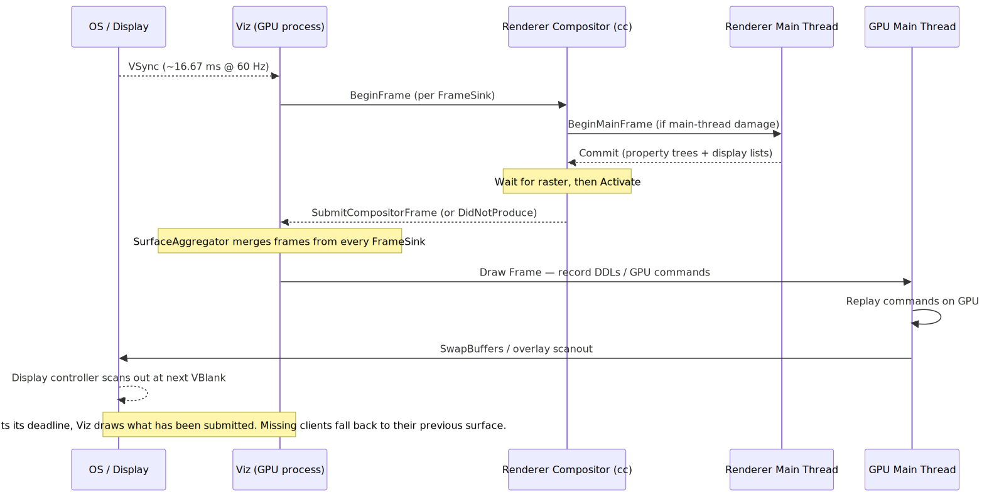
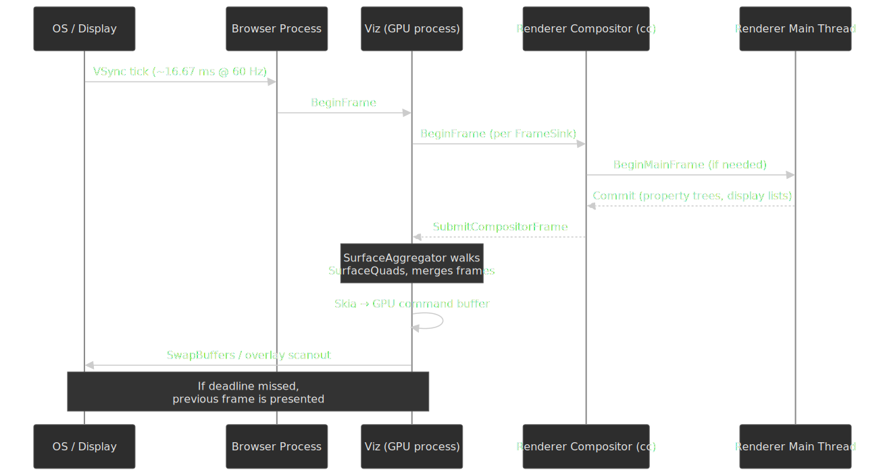

# Critical Rendering Path: Draw

The Draw stage is the final phase of the browser's rendering pipeline. After every renderer's compositor has produced a `CompositorFrame` of render passes and draw quads (see the [Compositing Stage](../crp-composit/README.md)), the **Viz** service in the GPU process aggregates those frames, records GPU draw commands via Skia, requests a swap, and hands the result to the OS compositor for **presentation** at the next VBlank[^life-of-a-frame].




## Abstract

"Draw" in Chromium has a precise meaning. It is **steps 10–17 of Life of a Frame**[^life-of-a-frame] — surface aggregation, recording draw commands in the display compositor, queueing them on the GPU main thread, executing them, requesting `SwapBuffers`, and finally letting the system compositor present the buffer. It is **not** rasterization (turning display lists into texture tiles, owned by the renderer's tile manager) and it is **not** compositing (turning the active layer tree into a `CompositorFrame`, owned by `cc` on the renderer's compositor thread).

| Stage         | Owner                              | Output                              | Where it lives           |
| ------------- | ---------------------------------- | ----------------------------------- | ------------------------ |
| **Raster**    | Renderer's tile / raster workers   | GPU texture tiles                   | Renderer process         |
| **Composite** | `cc` on the renderer compositor    | `CompositorFrame` (passes + quads)  | Renderer process         |
| **Draw**      | Viz display compositor + GPU main  | Aggregated frame → GPU cmds → Swap  | GPU (Viz) process        |
| **Present**   | OS compositor + display controller | Pixels visible at VBlank            | DWM / CoreAnimation / SF |

**Core mental model:**

- **Aggregation**: `SurfaceAggregator` recursively walks `SurfaceDrawQuad` references, replacing each with the latest `CompositorFrame` from the embedded surface and emitting one render-pass tree to the renderer[^viz-readme].
- **Translation**: `SkiaRenderer` turns those quads into `SkCanvas` calls that record a Deferred Display List (DDL); the GPU main thread later replays them into Vulkan / Metal / D3D / GL commands[^life-of-a-frame].
- **Optimization**: Overdraw removal, quad batching, damage-aware partial swaps, and hardware overlays minimize GPU and memory-bandwidth cost.
- **Timing**: `viz::DisplayScheduler` enforces a per-frame deadline anchored on the next VSync. Missed deadlines never stall — Viz draws whatever has already been submitted and falls back to each missing client's previous surface[^life-of-a-frame].

Viz runs in its own process. GPU driver crashes terminate only Viz; renderers reconnect. Renderers never touch GPU APIs directly — every command crosses the Viz IPC boundary first[^renderingng-arch].

---

## The Viz Process Architecture

Viz runs in the GPU process and serves as Chromium's central display compositor. It receives compositor frames from multiple sources and produces the final screen output.

**Two-Thread Design:**

| Thread                        | Responsibility                                                           | Why Separate                                                                                          |
| ----------------------------- | ------------------------------------------------------------------------ | ----------------------------------------------------------------------------------------------------- |
| **GPU Main Thread**           | Owns the GPU context; rasterizes tiles and replays recorded draw commands | Driver calls are not preemptible; long-running raster or WebGL must not delay presentation            |
| **Display Compositor Thread** | Runs `viz::DisplayScheduler`, `SurfaceAggregator`, and `SkiaRenderer`   | Isolates aggregation from driver stalls and from slow non-Chromium GPU code on the main thread[^renderingng-arch] |

This separation prevents a bottleneck where a slow GPU driver call or a stuck rasterization stalls frame presentation. The display compositor thread can keep aggregating and recording draw commands while the GPU main thread is busy with raster or with another tab's WebGL.

**Process Isolation Rationale:**

> [!NOTE]
> Before Viz, compositing and rasterization were tightly coupled inside the GPU process and a driver bug could destabilize the entire browser. Today, GPU driver crashes terminate only Viz; renderers survive and reconnect to a fresh `viz::FrameSinkManager`.

Modern Viz provides:

1. **Crash isolation**: GPU driver crashes terminate only Viz; renderers survive.
2. **Security boundary**: Renderers never access GPU APIs directly — all commands cross IPC into Viz.
3. **Resource management**: Viz controls GPU memory allocation across all tabs, preventing runaway consumption.

---

## Multi-Process Frame Aggregation

A single web page often comprises elements from multiple renderer processes. A page with two cross-origin iframes involves three renderer processes, each producing independent compositor frames.

### The Surface Abstraction

Viz uses **Surfaces** to manage the frame hierarchy. Each surface represents a compositable unit that can receive frames.

- **SurfaceId**: Unique identifier generated by SurfaceManager; used to issue frames or reference other surfaces for embedding
- **FrameSink**: Interface through which renderers submit compositor frames to Viz
- **LocalSurfaceId**: Monotonically increasing identifier that ensures frames are processed in order

### The Aggregation Algorithm

The Surface Aggregator implements a recursive, nearly stateless algorithm:

```text
1. Start with the most recent eligible frame from the display's root surface
2. Iterate through quads in draw order, tracking current clip and transform
3. For each quad:
   - If NOT a surface reference → output directly to aggregated frame
   - If IS a surface reference:
     a. Find the most recent eligible frame for that surface
     b. If no frame exists OR cycle detected → skip (use fallback)
     c. Otherwise → recursively apply this algorithm
4. Output the aggregated compositor frame
```

**Resilience Pattern**: If an iframe's frame hasn't arrived, Viz uses a previous frame or solid color. This prevents the entire page from stuttering due to one slow process—critical for maintaining 60fps with site-isolated iframes.

**Edge Case—Cycle Detection**: Surface references can theoretically form cycles (A embeds B embeds A). The aggregator tracks visited surfaces and breaks cycles by skipping already-visited references.

**Memory Pressure**: Under memory constraints, Viz may evict old frames from surfaces. When this happens, the surface falls back to a solid color until a new frame arrives.

---

## The Draw Quad Pipeline

A compositor frame is not a bitmap—it's a structured description of what to draw.

### Frame Structure

```text
CompositorFrame
├── RenderPass (root - drawn last)
│   ├── DrawQuad (TextureDrawQuad: rasterized tile)
│   ├── DrawQuad (SolidColorDrawQuad: background)
│   └── DrawQuad (SurfaceDrawQuad: embedded iframe)
├── RenderPass (effect pass - intermediate texture)
│   └── DrawQuad (content for blur effect)
└── metadata (device scale, damage rect, etc.)
```




### Render Passes

A **Render Pass** is a set of quads drawn into a target (the screen or an intermediate texture). Multiple passes enable layered effects:

| Use Case                | Why Intermediate Pass Required                                    |
| ----------------------- | ----------------------------------------------------------------- |
| `filter: blur()`        | Must render content to texture, then apply blur kernel            |
| `opacity` on group      | Children blend with each other, then group blends with background |
| `mix-blend-mode`        | Requires reading pixels from underlying content                   |
| Clip on rotated content | Non-axis-aligned clips require stencil/mask operations            |

**Performance Implication**: Each render pass adds GPU overhead (texture allocation, state changes, draw calls). Complex CSS effects that require intermediate passes are more expensive than compositor-only transforms.

### Draw Quad Types

| Quad Type            | Purpose                                          | Typical Source               |
| -------------------- | ------------------------------------------------ | ---------------------------- |
| `TextureDrawQuad`    | Rasterized tile with position transform          | Tiled layer content          |
| `SolidColorDrawQuad` | Color fill without texture backing               | Backgrounds, fallbacks       |
| `SurfaceDrawQuad`    | Reference to another surface by SurfaceId        | Embedded iframes, browser UI |
| `VideoDrawQuad`      | Video frame (often promoted to hardware overlay) | `<video>` elements           |
| `TileDrawQuad`       | Single tile of a tiled layer                     | Large scrolling content      |
| `RenderPassDrawQuad` | Output of another render pass                    | Effect layers                |

Each quad carries:

- **Geometry**: Transform matrix, destination rect, clip rect
- **Material properties**: Texture ID, color, blend mode
- **Layer information**: Sorting order for overlap resolution

---

## GPU Command Generation

Viz translates draw quads into GPU-native commands through Skia.

### The Translation Pipeline

```text
DrawQuad (abstract)
    ↓
Skia API calls (SkCanvas::drawRect, drawImage, etc.)
    ↓
Skia backend (Ganesh or Graphite)
    ↓
GPU command buffer (Vulkan, Metal, D3D, OpenGL)
    ↓
GPU driver
    ↓
Hardware execution
```

### Skia's Role

Skia is the cross-platform 2D graphics library used by Chrome and Android. It abstracts GPU API differences:

- **Shader management**: Compiles and caches GPU shaders
- **State optimization**: Batches state changes to minimize GPU commands
- **Resource handling**: Manages textures, buffers, and GPU memory
- **Fallback paths**: Provides software rasterization when GPU unavailable

### Graphite: The Next Generation Backend

As of 2025, Chrome is transitioning from Ganesh (Skia's aging OpenGL-centric backend) to Graphite.

**Why Graphite exists:**

Ganesh accumulated technical debt:

- Originally designed for OpenGL ES with GL-centric assumptions
- Too many specialized code paths, making it hard to leverage modern graphics APIs
- Single-threaded command recording caused bottlenecks
- Shader compilation during browsing caused "shader jank"

**Graphite's design improvements:**

| Aspect        | Ganesh                         | Graphite                                      |
| ------------- | ------------------------------ | --------------------------------------------- |
| **Threading** | Single-threaded recording      | Independent recorders across multiple threads |
| **Overdraw**  | Software occlusion culling     | Depth buffer for 2D (hardware-accelerated)    |
| **Shaders**   | Dynamic compilation            | Pre-compiled at startup; unified pipelines    |
| **APIs**      | OpenGL-first, others bolted on | Metal/Vulkan/D3D12 native from the start      |

**Performance results (mid-2025, per the [Chromium Blog](https://blog.chromium.org/2025/07/introducing-skia-graphite-chromes.html)):**

- ~15% improvement on MotionMark 1.3 on a MacBook Pro M3
- Reduced frame drops attributable to shader compilation jank
- Improved INP and LCP on real-world traffic; lower GPU-process memory

**Rollout status (as of 2025-Q3):**

- macOS, including Apple Silicon: Enabled by default
- Windows: Behind flags, using Dawn over D3D11/D3D12
- Linux and Android: Active development; not yet rolled out to stable

---

## Optimization Strategies

### Overdraw Removal

If a quad is completely obscured by another opaque quad in front of it, Viz skips drawing it entirely.

**Why this matters**: Mobile devices are memory-bandwidth constrained. Drawing pixels that will be overwritten wastes precious GPU bandwidth. A common case: a full-screen opaque background covers all content below it—drawing that underlying content is pure waste.

**Graphite enhancement**: Uses GPU depth testing for 2D rendering. Each quad gets a depth value; the GPU's depth buffer automatically rejects overdraw at the hardware level, eliminating software occlusion calculations.

### Quad Batching

Drawing 100 small quads separately is expensive due to GPU state change overhead (bind texture, set shader, draw, repeat). Batching combines similar quads into fewer draw calls.

**Batching requirements:**

- Same texture (or atlas)
- Same blend mode
- Same shader
- Compatible transforms (can be batched via instancing)

**Real-world impact**: A page with many small icons benefits dramatically from texture atlasing and batching. Without batching: 100+ draw calls. With batching: potentially 1 draw call.

### Damage Tracking

Viz tracks which screen regions changed since the last frame (the "damage rect"). Unchanged regions may skip redrawing entirely.

**Partial swap**: Some platforms support `SwapBuffersWithDamage`, presenting only the damaged region to the compositor. This reduces memory bandwidth for small updates (e.g., blinking cursor).

---

## Hardware Overlays and Direct Scanout

The most efficient drawing is no drawing at all—at least not in the traditional sense.

### Direct Scanout

Normally, the browser renders to a buffer, and the system compositor (DWM on Windows, CoreAnimation on macOS) composites it with other windows. Direct Scanout bypasses this intermediate step.

**How it works:**

1. Browser produces a buffer meeting scanout requirements
2. Viz passes the buffer handle directly to the display controller
3. Display controller reads pixels straight from browser's buffer
4. No copy through system compositor

**Requirements for Direct Scanout:**

- Content pixel-aligned with screen
- No complex CSS effects (blend modes, non-integer opacity)
- Buffer format compatible with display hardware
- Full-screen or in a compatible overlay plane

### Hardware Overlays

For specific content types, the display hardware can composite without GPU involvement.

**Video overlay path:**

```text
Platform decoder (VideoToolbox, MediaFoundation, VA-API)
    ↓
Platform-specific buffer (IOSurface, DXGI, AHardwareBuffer)
    ↓
Hardware overlay plane
    ↓
Display controller composites at scanout time
```

**Benefits:**

| Metric                       | Without Overlay                                   | With Overlay                                 |
| ---------------------------- | ------------------------------------------------- | -------------------------------------------- |
| **Power (fullscreen video)** | 100%                                              | ~50% — [VideoNG][videong] (macOS, halved)    |
| **GPU copies**               | Multiple (decode → texture → composite → present) | Zero (decode → overlay)                      |
| **Latency**                  | +1 frame (GPU composite delay)                    | Minimal (direct to display)                  |

[videong]: https://developer.chrome.com/docs/chromium/videong "Chromium VideoNG deep-dive — Dale Curtis"

**Real-world constraint**: Overlays require the content to have no CSS effects applied. A `<video>` with `filter: blur(1px)` falls back to GPU compositing.

**Format requirements**: Overlay planes accept specific pixel formats (NV12, P010 for video). Content must match, or the browser falls back to GPU conversion.

---

## VSync, BeginFrame, and the Draw Timeline

The draw stage is strictly bound by the display's refresh rate through VSync (Vertical Synchronization).

### Life of a Frame, end to end

The numbered stages below correspond directly to the steps documented in [Life of a Frame][life-of-a-frame]. Steps 1–9 belong to the renderer (covered by [Compositing](../crp-composit/README.md)); steps 10–17 are what this article calls **Draw**.

[life-of-a-frame]: https://chromium.googlesource.com/chromium/src/+/lkgr/docs/life_of_a_frame.md "Life of a frame — Chromium design docs"




The same flow viewed across processes makes the per-thread roles and the deadline behavior explicit:




**Deadline enforcement**: `viz::DisplayScheduler` sets a per-frame deadline anchored on the next VSync. When the deadline fires, Viz **draws regardless** of which renderers have submitted — it reuses each missing client's previous surface rather than waiting[^life-of-a-frame]. That is why one slow iframe cannot stall the rest of the page. The on-screen consequence of a renderer's missed deadline is a repeated frame for that surface, visible as jank only in the affected region.

### Frame Timing Budget

At 60Hz, each frame has 16.67ms. At 120Hz, 8.33ms. Real budgets are workload-dependent — the table below is an illustrative split, not a normative one.

| Stage             | Indicative budget (60Hz) |
| ----------------- | ------------------------ |
| Input handling    | 0–2 ms                   |
| JavaScript        | 0–6 ms                   |
| Style / Layout    | 0–4 ms                   |
| Paint / Composite | 2–4 ms                   |
| **Draw + Swap**   | 2–4 ms                   |
| **Headroom**      | 2–4 ms                   |

> [!TIP]
> Variable refresh-rate (VRR) displays — FreeSync, G-Sync, ProMotion — allow Viz to present frames as soon as they are ready inside a min/max VBlank window, instead of waiting for a fixed cadence. This reduces jank for content with bursty draw cost.

### Platform-Specific VSync Handling

| Platform    | VSync source                 | Notes                                                     |
| ----------- | ---------------------------- | --------------------------------------------------------- |
| **Windows** | DWM (Desktop Window Manager) | Timebase/interval queried via `IDXGIOutput::WaitForVBlank` and used to align BeginFrames |
| **macOS**   | `CVDisplayLink`              | Callback-driven; integrates with CoreAnimation            |
| **Linux**   | DRM/KMS                      | Direct kernel modesetting (Wayland/Ozone backends)        |
| **Android** | `Choreographer`              | VSync callbacks via NDK; used for BeginFrame coordination |

---

## OS Compositor Handoff and Presentation

Drawing the frame is not the end. After `RequestSwap`, Viz hands a buffer to the **system compositor**, which decides when the pixels are actually visible. The handoff path is platform-specific.

 presents. On macOS, the buffer is an IOSurface bound to CALayer.contents and presented by CoreAnimation. On Linux/ChromeOS, dma-buf surfaces flow through Ozone to Wayland or DRM/KMS. On Android, AHardwareBuffer reaches SurfaceFlinger, which can promote it to an HWC overlay plane.")


| Platform        | Buffer / channel                                | System compositor                          | Direct-scanout path                                    |
| --------------- | ----------------------------------------------- | ------------------------------------------ | ------------------------------------------------------ |
| **Windows**     | DXGI flip-model SwapChain + DirectComposition[^dxgi-flip][^dcomp] | DWM                                        | MPO direct flip / "iflip" when content is eligible[^comp-swapchain] |
| **macOS**       | IOSurface bound to `CALayer.contents`[^macos-iosurface] | CoreAnimation / WindowServer               | CALayer composited by WindowServer                     |
| **Linux**       | dma-buf via Ozone                               | Wayland compositor or X11                  | Wayland direct scanout / DRM-KMS plane assignment      |
| **ChromeOS**    | dma-buf via Ozone                               | Exo / `ash` shell                          | KMS plane assignment                                   |
| **Android**     | AHardwareBuffer + SurfaceControl                | SurfaceFlinger                             | HWC2 overlay planes                                    |

> [!IMPORTANT]
> The "presentation timestamp" Chromium reports back to Web APIs is the system compositor's best estimate of when scanout actually happened. On macOS, where no exact API exists, Chromium falls back to the swap timestamp; on platforms with a presentation feedback signal (Wayland, Android), it uses the OS-supplied time[^life-of-a-frame].

---

## Pipeline Depth and Buffering

Two distinct things control how many frames are "in flight":

1. **Pipeline depth in `cc::Scheduler`.** The compositor scheduler tracks pending vs. active trees and how many `BeginMainFrame`s have been issued. When it observes that the main thread is consistently slow, it **lowers latency** by deferring the next `BeginMainFrame` until the current commit lands; when throughput matters, it allows pipelining (a new `BeginMainFrame` can run while the previous frame is still being submitted)[^how-cc-works]. This is independent of the OS swap chain.
2. **OS swap chain buffer count.** The number of swap-chain buffers — typically 2 or 3 — is set by the platform and the swap-chain configuration (e.g. DXGI `BufferCount` and `DXGI_SWAP_EFFECT_FLIP_*`[^dxgi-flip], or the Vulkan/Metal/EGL surface). Calling them "double" vs "triple" buffering is a swap-chain property, not a Chromium-wide knob.

### Buffer roles in a 3-buffer flip-model swap chain

| Buffer | Role       | Description                                     |
| ------ | ---------- | ----------------------------------------------- |
| N      | **Front**  | Currently being scanned out by the display      |
| N+1    | **Queued** | Submitted to the OS compositor; flips at VBlank |
| N+2    | **Back**   | Currently being drawn into by Viz / the GPU     |

### Two vs. three buffers — trade-offs

| Aspect      | 2-buffer chain                              | 3-buffer chain                                  |
| ----------- | ------------------------------------------- | ----------------------------------------------- |
| Latency     | Lower (≈1 VBlank input→display, best case)  | Higher (≈2 VBlanks input→display, best case)    |
| Throughput  | Capped by the slower of GPU and display     | Decouples GPU from display; render-ahead OK     |
| Jank on miss| Often a full skipped frame at vsync         | Still presents a frame; pipeline absorbs jitter |
| Memory      | 2 × framebuffer                             | 3 × framebuffer                                 |

> [!CAUTION]
> The "+2 frames of latency" claim sometimes attached to triple buffering is a worst case, not a guarantee. With the DXGI flip model and a frame-latency-waitable swap chain, an application can hold latency close to 1 VBlank by waiting on `IDXGISwapChain2::GetFrameLatencyWaitableObject` before recording the next frame[^waitable-swapchain]. Independent flip and direct scanout shorten the path further when the buffer is eligible[^comp-swapchain].

---

## Failure Modes Specific to Draw

Draw-stage jank looks like compositing jank from the outside but has a different signature in traces.

### Delayed swap

The most common Draw-side jank: `RequestSwap` is issued, but the GPU main thread is busy with another task (rasterization, WebGL replay, another tab) and the swap is not actually flushed in time for the next VBlank. `gpu::Scheduler` is cooperative, so the display compositor's task waits in queue[^life-of-a-frame]. In a trace, this is `StartDrawToSwapStart` or `Swap` ballooning while the draw itself is short.

### Missed VSync at the OS compositor

Even if Viz hands off in time, the system compositor can decide not to flip. On Windows this happens when DWM falls back from independent flip to composed mode (e.g. a non-fullscreen window is involved or the swap chain isn't eligible)[^comp-swapchain]; on macOS it happens when CoreAnimation defers the commit; on Wayland it happens when direct scanout requirements are not met. The pixels exist but are presented one VBlank late.

### GPU contention

Heavy WebGL, video decode, or canvas raster on the same GPU main thread starves Draw. Symptoms: short Draw recording, long `ReceiveCompositorFrameToStartDraw`. Mitigations are content-side (offload to GPU compute, reduce overdraw, use overlays) — Viz does not preempt running GPU work.

### Buffering pathology

A 3-buffer flip chain that the application never waits on can grow latency without dropping frames. `DXGI_SWAP_CHAIN_FLAG_FRAME_LATENCY_WAITABLE_OBJECT` is the standard remedy on Windows[^waitable-swapchain].

### Tearing

Occurs when the display reads from a buffer while the GPU is still writing to it. VSync gates the swap to vertical blanking; direct scanout adds a fence requirement so the display controller cannot read until GPU writes are complete.

### Frame-drop detection from web pages

The dedicated W3C Frame Timing effort was abandoned ([WICG/frame-timing](https://wicg.github.io/frame-timing/)). Today, dropped frames are inferred from gaps between consecutive `requestAnimationFrame` callbacks, from the [Long Animation Frames API](https://developer.chrome.com/docs/web-platform/long-animation-frames) (`PerformanceLongAnimationFrameTiming`), and — for ground truth — from `chrome://tracing` recordings that surface Viz's own `PipelineReporter` events[^life-of-a-frame].

---

## Tools

| Tool                                                | What it tells you                                                                                            |
| --------------------------------------------------- | ------------------------------------------------------------------------------------------------------------ |
| `chrome://gpu`                                      | GPU process status, active Skia backend (Ganesh / Graphite), feature flags, hardware overlay support, current swap-chain configuration. |
| `chrome://flags`                                    | Toggle Graphite (`#enable-skia-graphite`), overlays, and direct-composition features for A/B testing.        |
| DevTools → Performance → **Frames** lane            | Per-frame status: presented, dropped, partially-presented; aligned to VSync.                                  |
| DevTools → Performance → **GPU** track              | When the GPU process is busy executing draw commands vs. idle.                                                |
| `chrome://tracing` with the `viz`, `cc`, `gpu` cats | `PipelineReporter` segments (`SubmitToReceiveCompositorFrame`, `ReceiveCompositorFrameToStartDraw`, `StartDrawToSwapStart`, `Swap`, `SwapEndToPresentationCompositorFrame`)[^life-of-a-frame]. |
| `Performance.getEntriesByType('long-animation-frame')` | In-page detection of frames whose work overran the budget (LoAF spec).                                     |

> [!TIP]
> When DevTools shows a stable 60 fps but "feels" laggy, look at `SwapEndToPresentationCompositorFrame` in `chrome://tracing` and the **Frames** lane's "presented" timestamps — that's where Draw and OS-side latency hide.

---

## Conclusion

The Draw stage is what turns "we have a `CompositorFrame`" into "the user sees pixels at the next VBlank". The architectural choices that make it work — Viz in a separate GPU process, `SurfaceAggregator` tolerating missing clients, `SkiaRenderer` recording DDLs that the GPU main thread replays, hardware overlays for video, and platform-specific OS-compositor handoff — all serve one goal: never let one slow renderer, one slow driver, or one slow tab take the display down with it.

The practical takeaways are narrow:

1. **Animate compositor-only properties** so the renderer never enters the main-thread leg of Life-of-a-Frame.
2. **Reach for overlay-eligible content** (no CSS effects on `<video>`, integer transforms, opaque backgrounds) to win direct scanout where it is supported.
3. **Read `chrome://tracing` `PipelineReporter` segments** instead of guessing — `StartDrawToSwapStart`, `Swap`, and `SwapEndToPresentationCompositorFrame` are where Draw-side jank lives, and they are not visible from the page.
4. **Treat buffer count as a swap-chain detail**, not a "feature". Latency is bounded by waiting on the swap chain, not by buffer count.

---

## Appendix

### Series navigation

This is the final stage of the **Critical Rendering Path** series.

- **Previous**: [Compositing](../crp-composit/README.md) — how `cc` builds the `CompositorFrame` Viz consumes here.
- **Series start**: [Rendering Pipeline Overview](../crp-rendering-pipeline-overview/README.md).

### Prerequisites

- **[Rendering Pipeline Overview](../crp-rendering-pipeline-overview/README.md)** — end-to-end map from HTML to pixels.
- **[Compositing](../crp-composit/README.md)** — three-tree architecture, property trees, `CompositorFrame` shape.
- **[Rasterization](../crp-raster/README.md)** — what produces the texture tiles a `TextureDrawQuad` references.
- Basic GPU concepts: shaders, textures, command buffers.

### Terminology

| Term                 | Definition                                                                      |
| -------------------- | ------------------------------------------------------------------------------- |
| **Viz (Visuals)**    | Chromium service responsible for frame aggregation and GPU display              |
| **Compositor Frame** | Unit of data submitted by a renderer to Viz, containing render passes and quads |
| **Surface**          | Compositable unit that can receive compositor frames, identified by SurfaceId   |
| **FrameSink**        | Interface through which renderers submit frames to Viz                          |
| **Draw Quad**        | Rectangular drawing primitive (e.g., texture tile, video frame, solid color)    |
| **Render Pass**      | Set of quads drawn to a target (screen or intermediate texture)                 |
| **VSync**            | Synchronization of frame presentation with monitor's refresh rate               |
| **Direct Scanout**   | Optimization where display reads directly from browser's buffer                 |
| **Hardware Overlay** | Display plane that composites at scanout without GPU involvement                |
| **Skia**             | Cross-platform 2D graphics library used by Chrome and Android                   |
| **Graphite**         | Next-generation Skia backend optimized for modern GPU APIs                      |

### Summary

- **Draw = Life-of-a-Frame steps 10–17**: aggregation, recording, GPU draw, swap, presentation. Distinct from raster and from compositing.
- **Viz** runs in the GPU process and aggregates `CompositorFrame`s from every FrameSink (renderers + browser UI) into a single render-pass tree.
- **`SurfaceAggregator`** handles missing or stale clients by reusing previous surfaces — one slow iframe never stalls the page.
- **`SkiaRenderer`** records draw commands as DDLs; the GPU main thread replays them into Vulkan/Metal/D3D/GL.
- **`viz::DisplayScheduler`** enforces a per-frame deadline anchored on the next VSync; missing the deadline draws what is available, never blocks.
- **Graphite** (2025+) replaces Ganesh with multithreaded recording, pre-compiled pipelines, and hardware depth-buffer overdraw rejection.
- **Hardware overlays + direct scanout** bypass GPU composition for eligible content; VideoNG documents roughly halved power for fullscreen video on macOS.
- **OS handoff** is platform-specific: DXGI/DComp → DWM, IOSurface → CoreAnimation, dma-buf → Wayland/KMS, AHardwareBuffer → SurfaceFlinger.
- **Pipeline depth** (`cc::Scheduler` heuristics) and **swap-chain buffer count** are independent knobs; latency is governed by both.

### References

- **Chromium Design Docs**: [`components/viz/README.md`](https://chromium.googlesource.com/chromium/src/+/main/components/viz/README.md) — authoritative Viz documentation.
- **Chromium Design Docs**: [Surfaces](https://www.chromium.org/developers/design-documents/chromium-graphics/surfaces/) — surface abstraction and aggregation.
- **Chromium Source**: [Life of a Frame](https://chromium.googlesource.com/chromium/src/+/lkgr/docs/life_of_a_frame.md) — numbered end-to-end stages used throughout this article.
- **Chromium Source**: [How cc Works](https://chromium.googlesource.com/chromium/src/+/lkgr/docs/how_cc_works.md) — compositor scheduler and pipeline-depth heuristics.
- **Chrome for Developers**: [RenderingNG Architecture](https://developer.chrome.com/docs/chromium/renderingng-architecture) — process and thread overview.
- **Chrome for Developers**: [RenderingNG Data Structures](https://developer.chrome.com/docs/chromium/renderingng-data-structures) — frame and quad structures.
- **Chrome for Developers**: [VideoNG Deep-Dive](https://developer.chrome.com/docs/chromium/videong) — hardware overlay implementation and power numbers.
- **Chromium Blog**: [Introducing Skia Graphite](https://blog.chromium.org/2025/07/introducing-skia-graphite-chromes.html) — Graphite architecture and rollout.
- **Microsoft Learn**: [DXGI flip model](https://learn.microsoft.com/en-us/windows/win32/direct3ddxgi/dxgi-flip-model) and [Composition swapchain programming guide](https://learn.microsoft.com/en-us/windows/win32/comp_swapchain/comp-swapchain) — Windows present model and direct flip.
- **Microsoft Learn**: [Reduce latency with DXGI 1.3 swap chains](https://learn.microsoft.com/en-us/windows/uwp/gaming/reduce-latency-with-dxgi-1-3-swap-chains) — frame-latency-waitable objects.
- **HTML Specification**: [Update the Rendering](https://html.spec.whatwg.org/multipage/webappapis.html#update-the-rendering) — the event-loop step that gates `rAF`, IntersectionObserver, ResizeObserver, and the rendering opportunity.
- **MDN**: [Long Animation Frames API](https://developer.mozilla.org/en-US/docs/Web/API/PerformanceLongAnimationFrameTiming) — current observability for jank, after the legacy [WICG Frame Timing](https://wicg.github.io/frame-timing/) effort was archived.

[^life-of-a-frame]: Chromium, [Life of a frame](https://chromium.googlesource.com/chromium/src/+/lkgr/docs/life_of_a_frame.md). Source for the numbered Draw stages [10]–[17] (Aggregate, Draw Frame, RequestSwap, queueing delay, GPU draw, Swap, Presentation), the `DisplayScheduler` deadline behavior, and `PipelineReporter` segments.
[^viz-readme]: Chromium, [`components/viz/README.md`](https://chromium.googlesource.com/chromium/src/+/main/components/viz/README.md). Source for `SurfaceAggregator`, `SurfaceDrawQuad` resolution, and Viz process isolation.
[^renderingng-arch]: Chrome for Developers, [RenderingNG Architecture](https://developer.chrome.com/docs/chromium/renderingng-architecture). Source for the GPU-process / Viz / display-compositor-thread structure.
[^how-cc-works]: Chromium, [How cc Works](https://chromium.googlesource.com/chromium/src/+/lkgr/docs/how_cc_works.md). Source for the compositor scheduler's low-vs-high-latency mode and pipeline-depth management.
[^dxgi-flip]: Microsoft Learn, [DXGI flip model](https://learn.microsoft.com/en-us/windows/win32/direct3ddxgi/dxgi-flip-model). Source for flip-model swap chains, `DXGI_SWAP_EFFECT_FLIP_*`, and DWM resource sharing.
[^dcomp]: Microsoft Learn, [DirectComposition overview](https://learn.microsoft.com/en-us/windows/win32/directcomp/directcomposition-portal). Source for binding swap-chain surfaces into a visual tree that DWM composes.
[^comp-swapchain]: Microsoft Learn, [Composition swapchain programming guide](https://learn.microsoft.com/en-us/windows/win32/comp_swapchain/comp-swapchain). Source for composition vs. independent flip, MPO direct flip, and direct-scanout eligibility on Windows.
[^waitable-swapchain]: Microsoft Learn, [Reduce latency with DXGI 1.3 swap chains](https://learn.microsoft.com/en-us/windows/uwp/gaming/reduce-latency-with-dxgi-1-3-swap-chains). Source for `DXGI_SWAP_CHAIN_FLAG_FRAME_LATENCY_WAITABLE_OBJECT` and bounding pipeline latency on multi-buffer flip chains.
[^macos-iosurface]: Chromium issue tracker, [`-[CALayer setContents:]` with IOSurface](https://issues.chromium.org/40429330). Confirms the IOSurface-as-CALayer-contents handoff path used by Viz on macOS.
