# Critical Rendering Path: Layerize

The Layerize stage walks the [paint artifact](https://chromium.googlesource.com/chromium/src/+/HEAD/third_party/blink/renderer/platform/graphics/paint/README.md#paint-artifact) and decides which paint chunks become independent compositor layers (`cc::Layer` objects) and which get baked into shared layers. It is the bookkeeping layer between [Paint](../crp-paint/README.md) and [Commit](../crp-commit/README.md), and it is the single largest determinant of how much GPU memory a page consumes and which animations can run on the compositor thread without re-raster.

> [!NOTE]
> Series — Critical Rendering Path. Previous: [Commit](../crp-commit/README.md). Next: [Rasterization](../crp-raster/README.md). Stage map: [Pipeline overview](../crp-rendering-pipeline-overview/README.md).




## Mental model

Layerization is a **merge-by-default** algorithm. It receives a flat, ordered list of paint chunks plus four parallel property trees (transform, clip, effect, scroll), and it emits a flat list of `cc::Layer` objects plus the compositor-side property trees consumed during [Commit](../crp-commit/README.md).

```text
Paint Chunks → PendingLayers → cc::Layers + cc::PropertyTrees
     ↑              ↑                ↑
     │              │                │
  input        intermediate      output
(per PropertyTreeState)  (merged groups)  (compositor-ready)
```

Three forces decide whether two adjacent chunks share a layer or get split apart, and the algorithm balances all three on every chunk:

| Decision                                         | Rationale                                         | Trade-off                                                |
| :----------------------------------------------- | :------------------------------------------------ | :------------------------------------------------------- |
| **Merge by default**                             | Fewer layers → less GPU memory                    | More display items per layer → larger raster surface     |
| **Separate on compositor-changeable properties** | Transform/opacity animations need isolated layers | More layers for animatable content                       |
| **Prevent merge on overlap**                     | Maintain correct paint order (z-order)            | Forces layer creation for overlapping content            |
| **Sparsity tolerance**                           | Avoid wasting GPU memory on large empty areas     | Algorithm complexity in bounds calculation               |

These rules are documented end-to-end in the [Blink compositing README](https://chromium.googlesource.com/chromium/src/+/HEAD/third_party/blink/renderer/platform/graphics/compositing/README.md) and the [platform paint README](https://chromium.googlesource.com/chromium/src/+/HEAD/third_party/blink/renderer/platform/graphics/paint/README.md#paint-artifact-compositor).

> [!NOTE]
> "Layerize" is a Chromium-internal verb. The phase appears in chrome://tracing as part of `PaintArtifactCompositor::Update`, which usually nests inside the broader "Update Layer Tree" or "Commit" rows in DevTools' performance flame chart — there is no separate "Layerize" event in the public DevTools UI.

### Why separate from Paint?

[CompositeAfterPaint](https://www.chromium.org/blink/slimming-paint/) (CAP), which shipped in Chromium **M94** in late 2021, moved layerization after paint specifically so that:

1. **Paint produces immutable output.** Layerization examines a finished paint artifact, eliminating the circular dependency that plagued the pre-CAP pipeline.[^slimming]
2. **Runtime factors inform decisions.** Memory pressure, overlap analysis, and direct compositing reasons can be evaluated against actual recorded content rather than guessed up front.
3. **The main thread completes paint recording before layerization begins**, so the algorithm operates over a stable snapshot.

### Why not on the compositor thread?

Layerization needs the paint artifact, which lives on the main thread. The compositor thread receives only the finalized `cc::Layer` list and `cc::PropertyTree` trees during [Commit](../crp-commit/README.md). Doing layerization on the compositor thread would either require shipping the entire paint artifact across the thread boundary every frame or duplicating it — both of which the architecture explicitly avoids.

[^slimming]: Per the Slimming Paint project page, CAP launch removed roughly 22,000 lines of pre-CAP compositing C++ and produced measurable wins (~1.3% lower total Chrome CPU, ~3.5% better p99 scroll-update latency, ~2.2% better p95 input delay).

### Layer list, not layer tree

Pre-2018 Blink shipped a tree of `GraphicsLayer` objects, roughly one per "composited" `RenderLayer` (which itself was at most one per CSS stacking context). The compositor thread received a hierarchy that mirrored the DOM's stacking topology, and every transform / clip / effect was inferred by walking ancestors of each layer. [BlinkGenPropertyTrees](https://groups.google.com/a/chromium.org/g/blink-dev/c/Gb_yg5MDD0s) (M75, 2019) inverted that contract: Blink started shipping a **flat list of layers plus four flat property trees** (transform, clip, effect, scroll), and the compositor began looking up visual context by node ID instead of tree walk. CompositeAfterPaint (M94, 2021) then moved the layerization decision itself to *after* paint, so the layer list is computed from paint chunks plus property tree state, not from DOM identity.[^renderingng-data]

[^renderingng-data]: See [Key data structures in RenderingNG](https://developer.chrome.com/docs/chromium/renderingng-data-structures) for the canonical description of paint chunks, property trees, and composited layers, and [RenderingNG architecture](https://developer.chrome.com/docs/chromium/renderingng-architecture) for how the stages compose.

The practical consequences of the layer-list model are worth internalising:

- **Layers are not a 1:1 reflection of the DOM.** Two DOM elements with the same `PropertyTreeState` and no overlap can share a single `cc::Layer`; one DOM element can produce multiple layers (foreground + scrollbar + composited scroll content).
- **Property trees are global, deduplicated, and flat.** Every `cc::Layer` references nodes by integer id; lookup is `O(1)` and unaffected by DOM depth.
- **"Promoting an element" is a misnomer in CAP.** What actually happens is that a paint chunk's `PropertyTreeState` carries a direct compositing reason that prevents merging into the surrounding `PendingLayer`. There is no `RenderLayer.promoted` bit any more.
- **Compositor mutations are property-tree edits.** A scroll, a `transform` animation, or a `DirectlyUpdate*` call rewrites a single property-tree node value — the layer list is untouched.




---

## The Layerization Algorithm

`PaintArtifactCompositor::LayerizeGroup` is the entry point. It walks the paint artifact's chunks in paint order and produces a list of `PendingLayer` objects, which are then converted to `cc::Layer` objects by `PaintChunksToCcLayer`.[^compositing-readme]

[^compositing-readme]: See the [Blink compositing README](https://chromium.googlesource.com/chromium/src/+/HEAD/third_party/blink/renderer/platform/graphics/compositing/README.md) and the `LayerizeGroup` declaration in [paint_artifact_compositor.h](https://chromium.googlesource.com/chromium/src/+/HEAD/third_party/blink/renderer/platform/graphics/compositing/paint_artifact_compositor.h).

The decision tree the algorithm runs for each incoming chunk is the heart of the stage:




### Phase 1: Create PendingLayers

Each paint chunk initially becomes a `PendingLayer` — an intermediate representation that may later merge with others.

```text
Paint Chunk A (transform_id=1, clip_id=1, effect_id=1) → PendingLayer A
Paint Chunk B (transform_id=1, clip_id=1, effect_id=1) → PendingLayer B
Paint Chunk C (transform_id=2, clip_id=1, effect_id=1) → PendingLayer C
```

What a PendingLayer holds:

| Field                      | Purpose                                                              |
| :------------------------- | :------------------------------------------------------------------- |
| `chunks_`                  | Paint chunk subset (display items + property tree state)             |
| `bounds_`                  | Bounding rectangle in property tree state space                      |
| `property_tree_state_`     | Transform, clip, effect node IDs                                     |
| `compositing_type_`        | Classification (scroll hit test, foreign, scrollbar, overlap, other) |
| `rect_known_to_be_opaque_` | Region guaranteed fully opaque (raster optimization)                 |
| `hit_test_opaqueness_`     | Whether hit testing can bypass the main thread                       |

### Phase 2: Merge PendingLayers

The algorithm attempts to combine PendingLayers to reduce layer count. Per the compositing README, a chunk **cannot** merge into an existing layer when:

1. **The chunk requires a foreign layer** (composited video, 2D/3D `<canvas>`, plugins).
2. **The chunk's `PropertyTreeState` carries an incompatible direct compositing reason** (see below).
3. **The chunk overlaps an earlier layer it cannot merge with**, and there is no later-drawn layer that satisfies (1) and (2) — the classic "overlap testing" cascade.

A separate **sparsity tolerance** check (`kMergeSparsityAreaTolerance`) prevents otherwise-mergeable chunks from combining when the merged bounds would waste a large fraction of the resulting layer's pixels.

When PropertyTreeStates differ but merging is still beneficial, the algorithm **flattens** the difference by emitting paired display items that adjust the chunk's state to match the target layer. This is implemented in `ConversionContext::Convert` inside [PaintChunksToCcLayer.cpp](https://chromium.googlesource.com/chromium/src/+/HEAD/third_party/blink/renderer/platform/graphics/compositing/paint_chunks_to_cc_layer.cc).

The end-to-end shape from chunks to layers — including chunks that merge cleanly and chunks that get peeled off into their own layer — looks like this:


### Direct compositing reasons

Certain property nodes carry **direct compositing reasons** that prevent merging. Chromium's [GPU Accelerated Compositing in Chrome](https://www.chromium.org/developers/design-documents/gpu-accelerated-compositing-in-chrome/) design doc enumerates the canonical set; the most commonly hit ones in production CSS:

| Reason                         | CSS / DOM trigger                                                                  | Why a separate layer is required                                  |
| :----------------------------- | :--------------------------------------------------------------------------------- | :---------------------------------------------------------------- |
| **3D / perspective transform** | `transform: rotate3d(…)`, `translate3d(…)`, `perspective: …`                       | 3D plane sorting; benefits from GPU isolation                     |
| **Compositor animation**       | `animation` / `transition` on `transform`, `opacity`, `filter`, `backdrop-filter`  | Compositor mutates property-tree nodes per frame without re-raster |
| **`will-change` hint**         | `will-change: transform`, `opacity`, `filter`, `backdrop-filter`, `transform-style` | Author signals impending change; promote eagerly                   |
| **Foreign layer**              | `<video>` (composited), `<canvas>` 2D-accel / WebGL / WebGPU, plugins              | External GPU surface or out-of-process producer                   |
| **Cross-origin / OOPIF**       | `<iframe>` rendered in a different renderer process                                | Surface embedded via `cc::SurfaceLayer` and `viz::SurfaceId`      |
| **Composited scroll**          | Scrollable content whose scroller is promoted                                      | Compositor-thread scroll without main-thread paint                 |
| **Accelerated CSS filter**     | `filter: blur(…)`, `drop-shadow(…)`, and similar GPU-implemented filters           | Filter executed against a separated render surface on the GPU      |
| **`backdrop-filter`**          | `backdrop-filter: blur(…)` etc.                                                    | Sampling the backdrop requires an isolated render surface          |
| **`position: sticky`**         | `position: sticky` on a composited scroller                                        | Compositor adjusts the sticky transform node per scroll tick       |
| **Overlap with a promoted layer** | Any element paint-ordered above a layer it cannot merge into                    | Maintains z-order without re-raster of the promoted layer          |

Chunks whose property nodes flag any of these become their own `PendingLayer` regardless of merging opportunities. The full enumeration lives in [`compositing_reasons.cc`](https://chromium.googlesource.com/chromium/src/+/HEAD/third_party/blink/renderer/platform/graphics/compositing_reasons.cc); the human-readable reason strings surface in DevTools' Layers panel and in `chrome://tracing` (category `cc`).

> [!NOTE]
> Sticky and fixed positioning are increasingly subject to *constraint-aware merging*: the layerizer can collapse adjacent sticky/fixed chunks that share the same scroll container and constraint axes into one `PendingLayer`, undoing what would historically have been a per-element promotion.[^sticky-merge]

[^sticky-merge]: Tracked under the broader [position:sticky / fixed compositing](https://issues.chromium.org/40533727) work; the merge happens inside `PaintArtifactCompositor` rather than at style-resolution time.

### Overlap testing and layer squashing

When a paint chunk overlaps content already assigned to an incompatible layer (different paint order, incompatible PropertyTreeState), it cannot merge with that layer. **Overlap testing** maintains correct visual ordering at the cost of forcing extra layers:

```text
Layer A: Element with will-change: transform (z-index: 1)
Layer B: ???

Paint Chunk X (z-index: 2, overlaps A)
  → Cannot merge with A (different PropertyTreeState — will-change)
  → Cannot merge with any earlier layer (would violate paint order)
  → Must become new Layer B
```

This cascade is the well-known **layer explosion**: one promoted element forces neighbors to promote, which forces their neighbors. Pre-CAP Chromium mitigated this with an explicit pass called [layer squashing](https://www.chromium.org/developers/design-documents/gpu-accelerated-compositing-in-chrome/), which packed multiple overlapping promoted elements into a single backing store. Under CAP the same effect falls out of the merge algorithm itself: overlapping chunks that share a compositing context end up combined inside one `PendingLayer` rather than each becoming a separate `cc::Layer`.

### Algorithm complexity

> "In the worst case, this algorithm has an O(n²) running time, where n is the number of `PaintChunks`."
> — [Chromium Blink compositing README](https://chromium.googlesource.com/chromium/src/+/HEAD/third_party/blink/renderer/platform/graphics/compositing/README.md)

The quadratic worst case occurs when every chunk must be checked against every preceding layer for overlap. Typical pages have far fewer problematic interactions, making practical complexity closer to `O(n × average_layer_count)`.

---

## From PendingLayers to cc::Layers

Once the PendingLayer list is finalized, `PaintChunksToCcLayer::Convert` materializes the actual compositor layers.

### Layer types created

The cc layer types in scope here are documented in [How `cc` Works](https://chromium.googlesource.com/chromium/src/+/lkgr/docs/how_cc_works.md):

| `cc::Layer` type    | Content source                            | Notes                                                                       |
| :------------------ | :---------------------------------------- | :-------------------------------------------------------------------------- |
| `PictureLayer`      | Painted content (`cc::PaintRecord`)       | Most common; holds display lists for raster on the compositor side          |
| `SolidColorLayer`   | Single-color regions                      | Optimization that avoids raster work entirely                                |
| `TextureLayer`      | External GPU textures (canvas, WebGL)     | Producer hands cc a ready-made texture mailbox                               |
| `SurfaceLayer`      | Cross-process content                     | Embeds another compositor frame producer via `viz::SurfaceId` (OOPIFs, video) |
| Scrollbar layers    | Scrollbar rendering                       | `SolidColorScrollbarLayer`, `PaintedScrollbarLayer`, `PaintedOverlayScrollbarLayer`[^scrollbar] |

[^scrollbar]: `ScrollbarDisplayItem` decides which scrollbar layer subclass to instantiate at layerization time, per the [platform paint README](https://chromium.googlesource.com/chromium/src/+/HEAD/third_party/blink/renderer/platform/graphics/paint/README.md#scrollbardisplayitem).

### Property tree conversion

Blink property tree nodes referenced by paint chunks are copied into equivalent compositor-side trees, as described in [RenderingNG data structures](https://developer.chrome.com/docs/chromium/renderingng-data-structures):

```text
Blink TransformNode → cc::TransformTree node
Blink ClipNode      → cc::ClipTree node
Blink EffectNode    → cc::EffectTree node
Blink ScrollNode    → cc::ScrollTree node
```

Each `cc::Layer` stores node IDs pointing into these flat trees, not hierarchical transform chains. This is what makes property lookup during compositing constant-time.

**Non-composited nodes** (those merged into layers with different PropertyTreeStates) become meta display items inside the layer's paint record, effectively baking the transform / clip / effect into the recorded drawing commands — this is the "flattening" the compositing README refers to.

### Hit-test opaqueness accumulation

During layerization, hit-test opaqueness propagates from paint chunks to layers:

```text
Paint Chunk: hit_test_opaqueness_ = OPAQUE
  ↓ accumulate
cc::Layer: hit_test_opaqueness = OPAQUE (compositor-thread hit testing)
```

This enables the compositor to handle hit testing for opaque regions without consulting the main thread — critical for responsive input during JavaScript execution. [HitTestOpaqueness](https://crbug.com/40062957) is one of the post-CAP projects explicitly enabled by the new architecture.

---

## Layerization and Memory Trade-offs

Layer decisions directly affect GPU memory consumption and rasterization cost.

### Memory cost per layer

Each composited layer reserves GPU memory proportional to its pixel area, assuming the standard uncompressed RGBA8 format:

**Formula:** `width × height × 4 bytes` (RGBA8)

| Layer size          | Memory  |
| :------------------ | :------ |
| 1920×1080 (Full HD) | ~8 MB   |
| 2560×1440 (QHD)     | ~14 MB  |
| 3840×2160 (4K)      | ~33 MB  |

Mobile devices with shared GPU memory (2–4 GB total RAM) exhaust resources quickly. Aggressive layerization can cause:

- **Checkerboarding** during scroll, when the compositor draws unrastered tiles as a placeholder pattern.
- **Fallback to software rasterization**, which is far slower and uses CPU memory.
- **Renderer crashes** under sustained GPU OOM.

### The merge vs separate trade-off

| Fewer layers (more merging)                | More layers (less merging)                  |
| :----------------------------------------- | :------------------------------------------ |
| Lower GPU memory usage                     | Higher GPU memory usage                     |
| Larger rasterization surface per layer     | Smaller, isolated rasterization surfaces    |
| Property changes require re-raster         | Property changes = compositor-only update   |
| Coarser invalidation; one item dirties all | Parallelizable raster across worker threads |




**Example.** A scrollable list with 100 items:

- **Merged approach.** One `PictureLayer` containing all items. Scrolling uses compositor offset; any content change re-rasters the whole layer.
- **Separated approach.** 100 `PictureLayer` objects. Each change re-rasters one layer, but uses roughly 100× the GPU memory.

The algorithm balances these by merging by default and separating only when content is expected to change independently.

---

## Optimization: Avoiding Full Layerization

`PaintArtifactCompositor::Update` is expensive, so Chromium implements fast paths for common scenarios. The relevant entries on [`PaintArtifactCompositor`](https://chromium.googlesource.com/chromium/src/+/HEAD/third_party/blink/renderer/platform/graphics/compositing/paint_artifact_compositor.h) are:

### Repaint-only updates

When display items change but the layer structure is stable, `UpdateRepaintedLayers` updates existing `cc::Layer` paint records in-place and skips `LayerizeGroup` entirely. **Triggers:** color changes, text updates, background tweaks that don't affect bounds or PropertyTreeState.

### Direct property updates

For `transform`, scroll-offset transform, and `opacity` changes that don't disturb layerization, `PaintArtifactCompositor` exposes three direct-update entry points:

| API                                        | Updates                                                                         |
| :----------------------------------------- | :------------------------------------------------------------------------------ |
| `DirectlyUpdateTransform`                  | A single `TransformPaintPropertyNode` value                                     |
| `DirectlyUpdateScrollOffsetTransform`      | The scroll-offset transform of a composited scroller                            |
| `DirectlyUpdateCompositedOpacityValue`     | A single `EffectPaintPropertyNode`'s opacity                                    |

Each modifies the matching `cc::PropertyTree` node and skips both layerization and the display-list update. **Triggers:** `transform` / `opacity` animations on already-promoted layers, scroll offset changes on composited scrollers.

### Raster-inducing scroll

For composited scrollers without a dedicated scroll-offset transform layer, the recently shipped [RasterInducingScroll](https://crbug.com/40517276) feature exposes a `kRasterInducingScroll` value of `PaintArtifactCompositor::UpdateType`, fed by `SetNeedsUpdateForRasterInducingScroll`. Only the scroll offset on the affected property tree node is touched; raster runs against newly-visible tiles only.

---

## Historical Evolution

### Pre-CompositeAfterPaint (before M94)

Before CAP, layerization happened **before** paint:

```text
Style → Layout → Compositing (layerization) → Paint
```

The drawbacks were significant:

1. **Circular dependency.** Paint invalidation needed current layer decisions; layer decisions needed paint output.
2. **Heuristic complexity.** The codebase carried tens of thousands of lines of C++ to guess which elements would need layers — much of it was deleted post-launch (~22,000 lines, per the [Slimming Paint project page](https://www.chromium.org/blink/slimming-paint/)).
3. **Correctness bugs.** A class of fundamental compositing correctness bugs (see [crbug/40364303](https://crbug.com/40364303)) were tied to making compositing decisions before knowing what would actually be painted.

The codebase relied on `DisableCompositingQueryAsserts` objects to suppress safety checks — a classic code smell signaling architectural problems.

### CompositeAfterPaint (M94+)

The modern pipeline inverts the order:

```text
Style → Layout → Prepaint → Paint → Layerize → Commit → Raster → Composit → Draw
```

Benefits, per the [Slimming Paint project page](https://www.chromium.org/blink/slimming-paint/):

- Paint produces immutable output before layerization examines it.
- Layer decisions are made against actual content rather than predictions.
- The simpler algorithm enabled follow-on projects: HitTestOpaqueness, RasterInducingScroll, scroll-driven animations.

### Slimming Paint timeline (2015–2021)

The broader architectural shift from a tree of `cc::Layers` (the old `GraphicsLayer` world in Blink terminology) to a global display list architecture, executed in phases:

| Phase                                  | Milestone | What changed                                                                |
| :------------------------------------- | :-------- | :-------------------------------------------------------------------------- |
| **SlimmingPaintV1**                    | M45       | Paint using display items                                                   |
| **SlimmingPaintInvalidation**          | M58       | Display-list-based paint invalidation; property trees introduced in Blink   |
| **SlimmingPaintV175**                  | M67       | Paint chunks introduced; chunks drive raster invalidation                   |
| **BlinkGenPropertyTrees**              | M75       | Blink generates property trees and ships a layer list, not a layer tree     |
| **CompositeAfterPaint**                | M94       | Compositing decisions made after paint                                      |

---

## Debugging Layerization

### Chrome DevTools

**Layers panel** ("More tools → Layers", or open the Command Menu and type "Layers")[^layers-panel]:

[^layers-panel]: See the [Layers panel docs](https://developer.chrome.com/docs/devtools/layers). Note that the panel currently displays a deprecation feedback banner — see [crbug/328948996](https://issues.chromium.org/328948996) — so treat it as a tool that may be removed; the same data is increasingly surfaced through the Performance panel's **Layers** tab and through `chrome://tracing`.

- View the (post-CAP) compositor layer **list** as a navigable tree-shaped UI.
- See the human-readable compositing reasons for each `cc::Layer`.
- Inspect memory consumption per layer.
- Paint counts and slow scroll rects.

**Performance panel:**

- Layer-tree updates appear inside "Update Layer Tree" / "Commit" rows; there is no first-class "Layerize" event in the public DevTools UI.
- The **Layers** tab inside a recorded performance trace shows the layer list at any selected frame — useful when the standalone Layers panel is unavailable.
- Layer count over time correlates with memory pressure.

### Compositor debugging flags

```bash
# Show colored borders around composited layers (also available via
# DevTools → Rendering → "Layer borders" or chrome://flags → "Composited
# layer borders").
chrome --show-composited-layer-borders
```

For richer compositing-reason dumps, prefer `chrome://tracing` with the `cc` and `viz` categories — the older `--log-compositing-reasons` switch is unreliable across recent Chromium builds. `chrome://flags` exposes additional debug surfaces (`#composited-layer-borders`, `#enable-gpu-service-logging`).

### Common issues

| Symptom                       | Likely cause                            | Investigation                                             |
| :---------------------------- | :-------------------------------------- | :-------------------------------------------------------- |
| High GPU memory               | Too many layers or oversized layers     | Layers panel → sort by memory                             |
| Unexpected layers             | Overlap forcing promotion               | Check z-index stacking; look for `will-change` on ancestors |
| Slow layerization             | Many paint chunks with complex overlaps | Reduce DOM complexity; use `contain: strict`              |
| Missing compositor animations | Element not promoted                    | Verify `will-change` or check for a direct compositing reason |

---

## Conclusion

Layerization is the decision-making phase that transforms paint output into compositor-ready structures. The algorithm balances GPU memory conservation (merge layers) against animation flexibility (separate layers).

Key takeaways:

1. **PendingLayers are intermediate.** Paint chunks first become PendingLayers, then merge into final `cc::Layer` objects.
2. **Merging is the default.** Fewer layers mean less GPU memory; separation requires an explicit reason.
3. **Direct compositing reasons prevent merging.** `will-change`, 3D transforms, accelerated animations, and foreign layers (video, canvas, OOPIFs) need isolated layers.
4. **Overlap forces layer creation.** Maintaining correct paint order can cascade into layer explosion; the merge phase contains it.
5. **CompositeAfterPaint (M94)** moved layerization after paint, removed roughly 22,000 lines of pre-CAP code, and unlocked HitTestOpaqueness and RasterInducingScroll.
6. **Fast paths exist.** `UpdateRepaintedLayers`, `DirectlyUpdateTransform`, `DirectlyUpdateScrollOffsetTransform`, and `DirectlyUpdateCompositedOpacityValue` all skip full layerization.

### Best-practice patterns for layerization

These reduce to a small number of rules; each one maps directly to a step in the layerization algorithm above.

| Pattern                                                           | Why it helps the layerizer                                                           |
| :---------------------------------------------------------------- | :----------------------------------------------------------------------------------- |
| Animate only `transform` and `opacity` (and `filter` when needed) | These are the canonical *compositor-only* properties — they mutate property-tree nodes via the `DirectlyUpdate*` fast paths and skip raster entirely.[^compositor-only] |
| Use `will-change` only on elements about to animate, then drop it | `will-change` is a direct compositing reason — leaving it on idle elements wastes a backing store and risks layer explosion.[^compositor-only] |
| Promote with `transform: translateZ(0)` only as a last resort     | Same effect as `will-change: transform` but harder to remove dynamically.            |
| Keep `backdrop-filter` regions small and few                      | Each one forces an isolated render surface and a backdrop sample on every frame it intersects. |
| Use `contain: strict` / `content-visibility` on independent widgets | Caps the overlap cascade and shrinks the search window in `LayerizeGroup`.         |
| Avoid layout thrashing (read-then-write batching, `rAF`)          | Less layout / paint churn means fewer paint chunks invalidated and fewer layer-list rebuilds.[^thrashing] |
| Watch layer count in DevTools or `chrome://tracing`               | Layer count is the cheapest proxy for GPU memory pressure on mobile.                 |

[^compositor-only]: web.dev — [Stick to compositor-only properties and manage layer count](https://web.dev/articles/stick-to-compositor-only-properties-and-manage-layer-count).

[^thrashing]: web.dev — [Avoid large, complex layouts and layout thrashing](https://web.dev/articles/avoid-large-complex-layouts-and-layout-thrashing).

---

## Appendix

### Series navigation

- Previous: [Commit](../crp-commit/README.md) — how the layer list crosses to the compositor thread.
- Next: [Rasterization](../crp-raster/README.md) — how `cc::Layer` content becomes GPU textures.
- Stage map: [Critical Rendering Path overview](../crp-rendering-pipeline-overview/README.md).

### Prerequisites and adjacent reading

- [Paint](../crp-paint/README.md) — paint chunks and display items.
- [Prepaint](../crp-prepaint/README.md) — where Blink builds the property trees that layerization keys off.
- [Compositing](../crp-composit/README.md) — how layers assemble into a `viz::CompositorFrame`.

### Terminology

| Term                          | Definition                                                                       |
| :---------------------------- | :------------------------------------------------------------------------------- |
| **Paint Chunk**               | Contiguous display items sharing identical PropertyTreeState                     |
| **PendingLayer**              | Intermediate representation during layerization; may merge with others           |
| **`cc::Layer`**               | Final compositor layer; input to rasterization                                   |
| **PaintArtifactCompositor**   | Class implementing the layerization algorithm                                    |
| **Direct compositing reason** | Property requiring a dedicated compositor layer (3D transform, will-change, etc.) |
| **Overlap testing**           | Checking whether a paint chunk interleaves with existing layers                   |
| **Layer squashing**           | Pre-CAP pass that packed overlapping promoted elements into one backing store    |
| **PropertyTreeState**         | 4-tuple `(transform_id, clip_id, effect_id, scroll_id)` identifying visual context |
| **CompositeAfterPaint (CAP)** | Architecture (M94+) where layerization runs after paint                          |
| **Hit-test opaqueness**       | Whether the compositor can handle hit testing without the main thread            |

### Summary

- **Layerization** converts paint chunks → PendingLayers → `cc::Layer` objects.
- The algorithm **merges by default** to conserve GPU memory; only foreign layers, direct compositing reasons, overlap, and sparsity force separation.
- **CompositeAfterPaint (M94, late 2021)** eliminated circular dependencies by moving layerization after paint.
- **O(n²)** worst case complexity; practical performance is much better for typical pages.
- **Fast paths** — `UpdateRepaintedLayers` plus the three `DirectlyUpdate*` entry points — skip full layerization when possible.
- **GPU memory** is the primary constraint: each layer costs roughly `width × height × 4 bytes`.

### References

- [Chromium Blink compositing README](https://chromium.googlesource.com/chromium/src/+/HEAD/third_party/blink/renderer/platform/graphics/compositing/README.md) — Layerization algorithm and PendingLayer mechanics.
- [Chromium platform paint README](https://chromium.googlesource.com/chromium/src/+/HEAD/third_party/blink/renderer/platform/graphics/paint/README.md) — Paint chunks, `PaintArtifactCompositor`, and the fast paths.
- [Chromium core paint README](https://chromium.googlesource.com/chromium/src/+/HEAD/third_party/blink/renderer/core/paint/README.md) — Paint-to-compositing workflow.
- [Chromium: How `cc` Works](https://chromium.googlesource.com/chromium/src/+/lkgr/docs/how_cc_works.md) — Compositor architecture and `cc::Layer` subclasses.
- [Chromium: RenderingNG architecture](https://developer.chrome.com/docs/chromium/renderingng-architecture) — Pipeline overview and stage responsibilities.
- [Chromium: RenderingNG data structures](https://developer.chrome.com/docs/chromium/renderingng-data-structures) — Paint chunks, property trees, composited layers.
- [Chromium: BlinkNG](https://developer.chrome.com/docs/chromium/blinkng) — CompositeAfterPaint rationale and pipeline phasing.
- [Chromium: GPU Accelerated Compositing in Chrome](https://www.chromium.org/developers/design-documents/gpu-accelerated-compositing-in-chrome/) — Compositing reasons and layer squashing.
- [Chromium: Slimming Paint](https://www.chromium.org/blink/slimming-paint/) — Historical evolution and CAP launch metrics.
- [Chrome DevTools: Layers panel](https://developer.chrome.com/docs/devtools/layers) — Inspecting cc::Layers in production.
