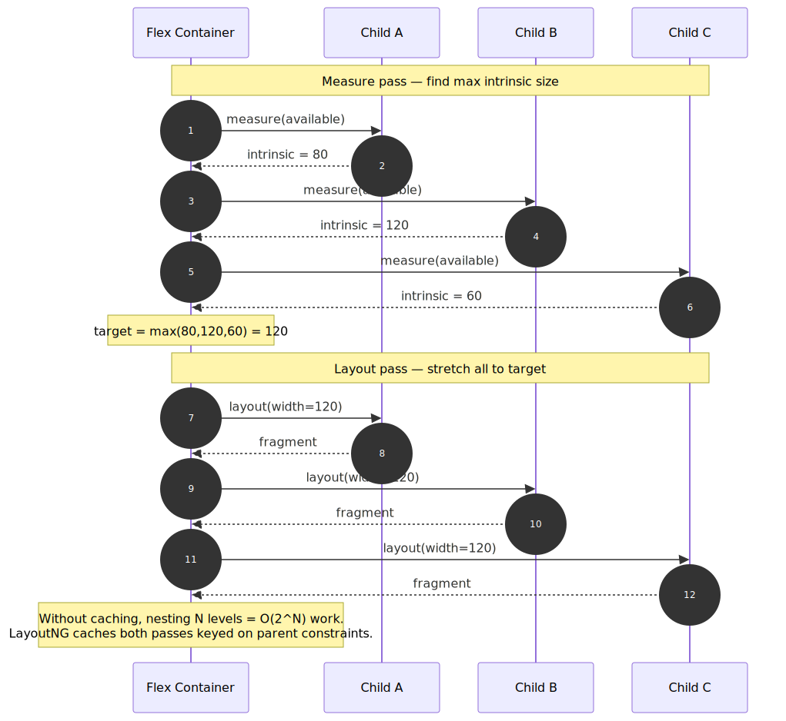
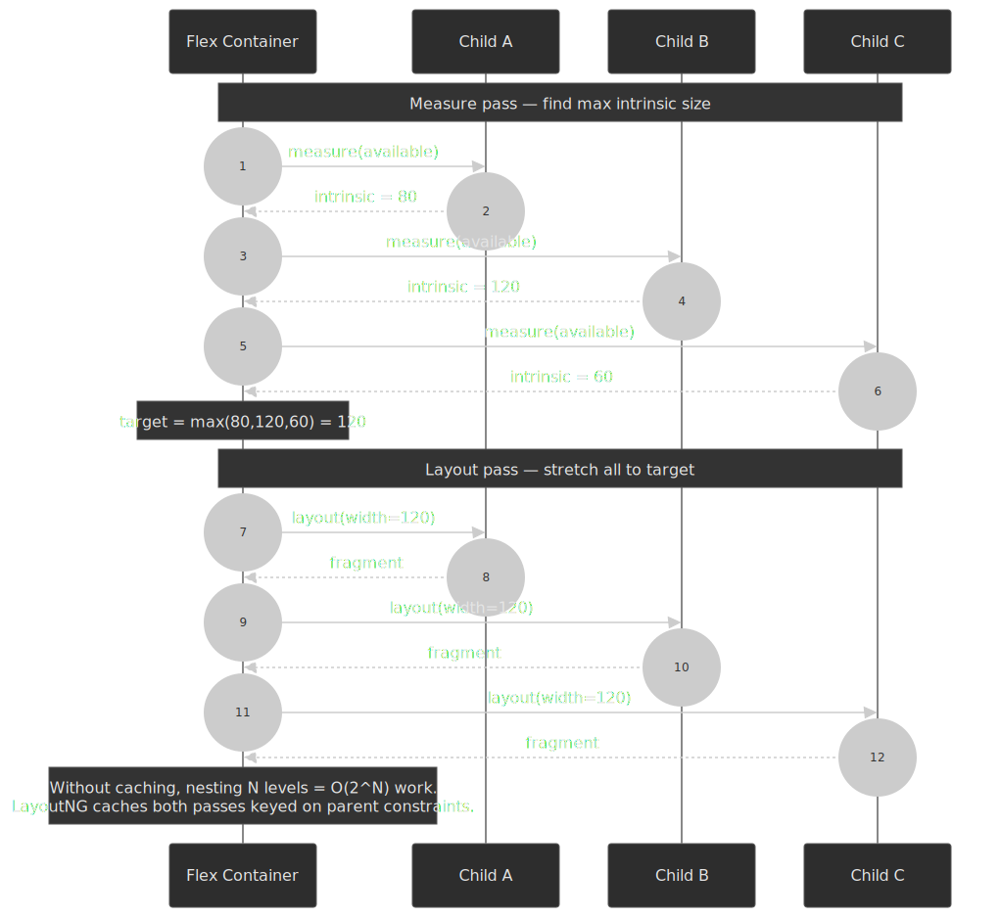
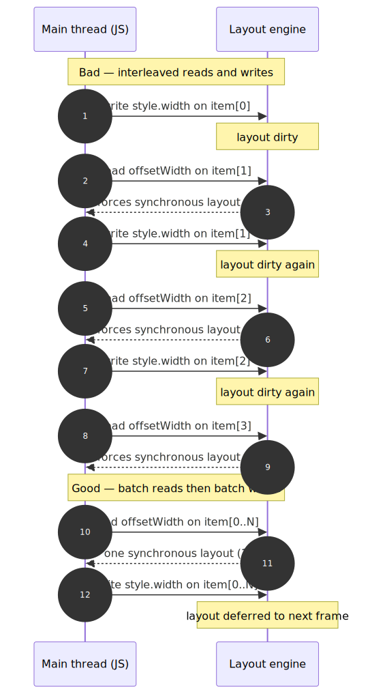
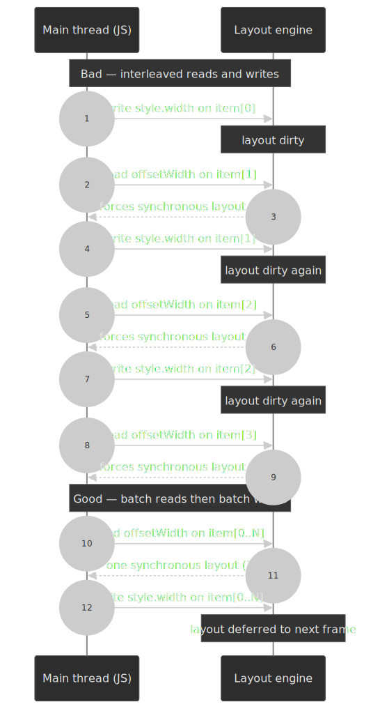

# Critical Rendering Path: Layout Stage

Layout is the rendering pipeline stage that turns styled elements into physical geometry — exact pixel positions and sizes for every visible box. In Chromium's LayoutNG architecture (enabled by default in [Chrome 77, September 2019](https://www.chromium.org/blink/layoutng/), with the legacy engine fully retired by [Chrome 108](https://developer.chrome.com/docs/chromium/renderingng-fragmentation)), this stage produces the **Fragment Tree**: an immutable data structure describing how each element is broken into one or more fragments with resolved coordinates.


## The mental model

Layout answers a single question for every box: **where does it go and how big is it?** Four ideas carry the rest of this article.

1. **Inputs and outputs are separate.** Layout reads immutable inputs (the `LayoutObject` tree, `ComputedStyle`, parent constraints) and writes an immutable Fragment Tree. Reading back from the previous output during the same pass is architecturally disallowed. ([RenderingNG: LayoutNG](https://developer.chrome.com/docs/chromium/layoutng))
2. **Constraints flow down, sizes flow up.** A parent passes "available space" downward; each child reports an intrinsic size upward. Some layout modes (flex, grid) need at least two passes — a measure pass to discover sizes, then a layout pass to place children using the result.
3. **Formatting contexts are the boundary.** Block, inline, flex, and grid formatting contexts each follow their own algorithm. Establishing a new Block Formatting Context (BFC) isolates internal layout from the outside, both for correctness (no margin collapse, no float escape) and for performance (the engine can prune the dirty subtree at the boundary).
4. **Immutability eliminates hysteresis.** Because the Fragment Tree is immutable after computation, code cannot read partially-computed state mid-layout — the bug class where the same input produced different outputs across frames.

The cost of a layout pass scales with `(dirty nodes) × (passes per node) × (constraint complexity)`. Deep nesting of two-pass layouts (flex, grid) historically exploded to O(2ⁿ) visits in the worst case; LayoutNG's pass cache restores O(n) by keying cached fragments on the parent constraints object. ([RenderingNG: LayoutNG](https://developer.chrome.com/docs/chromium/layoutng))

> [!NOTE]
> This article assumes you've read [Style Recalculation](../crp-style-recalculation/README.md) (it produces the inputs Layout consumes) and the [Rendering Pipeline Overview](../crp-rendering-pipeline-overview/README.md) (it places Layout between Style and Prepaint).

---

## From mutable tree to Fragment Tree

Pre-LayoutNG Blink stored layout as a single mutable tree. Each `LayoutObject` held both inputs (parent's available size, float positions) and outputs (final width, x/y position) in the same node, persisted between frames. According to the LayoutNG design write-up by Ian Kilpatrick (Blink layout lead), this collapsed contract bred three correlated bug families:

- **Under-invalidation** — a node was deemed clean even though parent constraints had changed, so it kept stale geometry.
- **Hysteresis** — non-idempotent layout: rerunning with the same inputs produced different outputs because intermediate state survived.
- **Over-invalidation** — fixing under-invalidation usually meant invalidating too much, and the performance cliff showed up in the wild.

LayoutNG formalises the contract by separating inputs from outputs into different data structures. The `LayoutObject` tree (built during Style Recalc) holds the inputs; the Fragment Tree holds the outputs. The previous frame's Fragment Tree is treated as an immutable source for incremental reuse, not a mutable scratchpad.

> "With LayoutNG, as we have explicit input and output data-structures, and accessing the previous state isn't allowed, we have broadly mitigated this class of bug from the layout system." — [RenderingNG: LayoutNG](https://developer.chrome.com/docs/chromium/layoutng)

| Aspect              | Pre-LayoutNG (legacy)                    | LayoutNG (Chrome 77+)                          |
| ------------------- | ---------------------------------------- | ---------------------------------------------- |
| Output structure    | Mutable `LayoutObject` tree              | Immutable Fragment Tree                        |
| State access        | Previous values readable mid-layout      | Inputs and outputs in distinct objects         |
| Invalidation        | Ad-hoc dirty flags + targeted fix-ups    | Diff parent-constraints object as cache key    |
| Two-pass complexity | Up to O(2ⁿ) for nested flex/grid         | O(n) via pass caching                          |
| Block fragmentation | Custom legacy code path                  | Unified LayoutNG fragmentation (Chrome 102+)   |

LayoutNG rolled out in stages. Inline and block layout shipped in Chrome 77 (2019); block fragmentation in Chrome 102; flex and grid fragmentation in Chrome 103; table fragmentation in Chrome 106; printing in Chrome 108 — at which point the legacy engine was no longer used for any layout. ([RenderingNG: LayoutNG block fragmentation](https://developer.chrome.com/docs/chromium/renderingng-fragmentation))

---

## The box model

Every element generates a box with four nested areas. Their interaction underpins every size computation that follows.

```plain
┌─────────────────────────────────────────┐
│                 MARGIN                  │ ← External spacing (excluded from box size)
│   ┌─────────────────────────────────┐   │
│   │             BORDER              │   │ ← Visual edge
│   │   ┌─────────────────────────┐   │   │
│   │   │         PADDING         │   │   │ ← Internal spacing
│   │   │   ┌─────────────────┐   │   │   │
│   │   │   │     CONTENT     │   │   │   │ ← Replaced or text content
│   │   │   └─────────────────┘   │   │   │
│   │   └─────────────────────────┘   │   │
│   └─────────────────────────────────┘   │
└─────────────────────────────────────────┘
```

Per [CSS Box Model Level 3 §1](https://www.w3.org/TR/css-box-3/), every CSS box has a content area, a band of padding, a border, and a margin outside the border. The interesting layout questions are: what does `width` measure, and when do margins collapse?

### `box-sizing`: which dimension does `width` control?

`box-sizing` decides what the `width` and `height` properties measure. The spec default is `content-box`. ([CSS Sizing 3 §3.3](https://www.w3.org/TR/css-sizing-3/#box-sizing))

```css title="content-box default" collapse={1, 6-7}
.element {
  box-sizing: content-box;
  width: 100px;
  padding: 10px;
  border: 5px solid;
}
/* Outer width = 5 + 10 + 100 + 10 + 5 = 130px */
```

```css title="border-box opt-in" collapse={1, 6-7}
.element {
  box-sizing: border-box;
  width: 100px;
  padding: 10px;
  border: 5px solid;
}
/* Outer width = 100px; content area shrinks to 70px */
```

`border-box` makes component sizing predictable: adding internal padding never grows the outer footprint, so a card with `width: 320px` stays 320px regardless of how much padding lives inside. With `content-box`, the outer size is `width + padding + border` — composing layouts becomes arithmetic on every change.

> [!IMPORTANT]
> CSS Sizing 3 floors the inner content size at zero: if `padding + border` exceeds the specified `border-box` width, the content area collapses to zero rather than going negative. The outer box stays at the specified size; nothing magically expands. ([CSS Sizing 3 §3.3](https://www.w3.org/TR/css-sizing-3/#box-sizing))

### Margin collapsing

Adjacent vertical margins in block flow merge into a single margin equal to the larger of the two. ([CSS2 §8.3.1](https://www.w3.org/TR/CSS2/box.html#collapsing-margins)) Collapsing applies to:

- Adjacent siblings.
- Parent and first/last child, when no padding, border, or `clear` separates them.
- Empty blocks whose top and bottom margins meet.

Without collapsing, paragraph spacing would double at every join (bottom margin of one + top margin of the next). The trade-off is the surprise factor: a child's `margin-top` can "escape" its parent and push the parent down. The fix is to introduce a **boundary** — establish a Block Formatting Context with `display: flow-root`, `overflow: hidden`, or `contain: layout`.

---

## Formatting contexts

Formatting contexts are isolated regions following a specific layout algorithm. They are the engine's mechanism for encapsulating those algorithms and bounding their blast radius.

### Block Formatting Context (BFC)

Inside a BFC, block boxes stack vertically, floats are contained, and child margins do not collapse with siblings outside the BFC. Per [CSS Display 3](https://www.w3.org/TR/css-display-3/) and the [MDN BFC reference](https://developer.mozilla.org/en-US/docs/Web/CSS/Guides/Display/Block_formatting_context), a new BFC is established by:

- The root element (`<html>`).
- `display: flow-root`, `inline-block`, `table-cell`, `table-caption`.
- `display: flex`, `inline-flex`, `grid`, `inline-grid` — these establish their own formatting contexts but contain their children like a BFC root.
- `float: left | right`, or `position: absolute | fixed`.
- `overflow` set to anything other than `visible` (or `clip`).
- `contain: layout`, `content`, `paint`, or `strict`.
- Multicol containers (`column-count` or `column-width` not `auto`), and elements with `column-span: all`.

`display: flow-root` exists specifically to opt in to a BFC without side effects. Before `flow-root` shipped (Chrome 58 and Firefox 53 in April 2017, Safari 13 in 2019 per [caniuse](https://caniuse.com/flow-root)), developers reached for `overflow: hidden` (clips overflow), the clearfix hack (adds pseudo-elements), or `display: inline-block` (changes flow). All three work, all three carry baggage; `flow-root` is the side-effect-free option.




The performance corollary: a BFC is a layout boundary. Changes inside it usually do not require relayout outside it, so the engine can prune the dirty subtree at the boundary. The same property powers `contain: layout` further down.

### Inline Formatting Context (IFC)

An IFC governs horizontal text flow. Inline boxes flow along the writing axis (left-to-right in LTR), wrap at line-box edges, and are vertically aligned via `vertical-align` (default `baseline`). The non-obvious bits:

- `width` and `height` are **ignored** on non-replaced inline elements. ([CSS2 §10.3.1](https://www.w3.org/TR/CSS2/visudet.html#inline-non-replaced))
- Top and bottom margins do **not** affect line-box height, even though they appear in the cascade. ([CSS2 §10.8](https://www.w3.org/TR/CSS2/visudet.html#line-height)) Only the inline-axis margins shift surrounding content.
- Padding and border render visually but do not affect line-box height either.

If you need an inline element to honour width / height / vertical margins, switch it to `inline-block` — that creates a block container while keeping inline-flow placement.

### Anonymous boxes

When the box tree needs structure that the markup does not provide, the engine invents anonymous boxes. ([CSS Display 3 §6](https://www.w3.org/TR/css-display-3/#anonymous))

```html
<div>
  <p>Paragraph</p>
  Loose text gets an anonymous block box
</div>
```

The loose text receives an anonymous block box so it can participate in the parent's BFC. Anonymous boxes inherit through the box tree, not the element tree, so they cannot be styled directly.

---

## The containing block

The containing block is the reference rectangle for percentage-based sizes and for positioned elements. Its identity depends on `position`. ([MDN — Layout and the containing block](https://developer.mozilla.org/en-US/docs/Web/CSS/Guides/Display/Containing_block))

| Position             | Containing block                                            |
| -------------------- | ----------------------------------------------------------- |
| `static`, `relative` | Content box of the nearest block-level ancestor             |
| `absolute`           | Padding box of the nearest ancestor with `position` ≠ `static`, **or** any ancestor that establishes a fixed/absolute containing block (see below) |
| `fixed`              | The viewport (initial containing block) — unless an ancestor establishes one (see below) |

### When `position: fixed` stops being viewport-relative

`fixed` is normally relative to the viewport. Per [CSS Positioned Layout 3](https://www.w3.org/TR/css-position-3/) and [MDN](https://developer.mozilla.org/en-US/docs/Web/CSS/Guides/Display/Containing_block), any of these properties on an ancestor make that ancestor the containing block instead — the descendant is positioned relative to the ancestor's padding box:

- `transform`, `perspective`, `rotate`, `scale`, or `translate` (any value other than `none`).
- `filter` or `backdrop-filter` (any value other than `none`).
- `contain: layout`, `paint`, `strict`, or `content`.
- `container-type` other than `normal` (CSS Container Queries).
- `content-visibility: auto` (it implies `contain: layout paint`).
- `will-change` listing a property that would itself create a containing block (e.g., `will-change: transform`).

```css
.modal-container {
  transform: translateZ(0); /* Promotes to its own layer — and creates a fixed-position CB */
}

.modal {
  position: fixed; /* Now relative to .modal-container's padding box, NOT the viewport */
  top: 0;
  left: 0;
}
```

The behaviour is intentional: a transform creates a new coordinate space, and "fixed" must be fixed *to a coordinate space*. The footgun is real — adding `transform` for a paint-perf optimisation can silently break a modal that was supposed to overlay the viewport.

> [!CAUTION]
> CSS containment, container queries, and `content-visibility: auto` all implicitly create a containing block for `position: fixed` descendants. Audit any new `contain` or container-query rule for fixed-position children before shipping.

---

## Intrinsic vs extrinsic sizing

A final size resolves through a mix of two mechanisms.

- **Extrinsic sizing** — the size comes from outside: an explicit `width: 320px`, a percentage of the containing block, or a "stretch to fill" instruction from the parent.
- **Intrinsic sizing** — the size comes from the content. CSS Sizing 3 defines three intrinsic sizes ([CSS Sizing 3 §5](https://www.w3.org/TR/css-sizing-3/#intrinsic-sizes)):

| Size          | Definition                                                                                | Use case                          |
| ------------- | ----------------------------------------------------------------------------------------- | --------------------------------- |
| `min-content` | Smallest size without overflow — every soft wrap opportunity is taken                     | Wrap text at every word           |
| `max-content` | Ideal size with infinite available space — no forced wrapping                             | Single-line text or label width   |
| `fit-content` | `min(max-content, max(min-content, stretch))` — clamps stretch into the intrinsic range   | Shrink-to-fit cards and badges    |

The constraint algorithm itself is short:

1. Parent passes **available space** as the extrinsic constraint.
2. Child computes **intrinsic sizes** from its content.
3. Final size = `clamp(min-width, computed-width, max-width)` along each axis.

For most block layout, step 2 collapses to a single pass — the parent already has enough information. Flex and grid often need an extra **measure pass** before the layout pass, because they must equalise children to the largest intrinsic size before placing anything. That extra pass is the source of the next problem.




---

## Layout performance

### The dirty-bit system

Browsers track layout validity with three bits propagated up the tree on every change:

| Flag                 | Scope            | Meaning                              |
| -------------------- | ---------------- | ------------------------------------ |
| `NeedsLayout`        | This node        | Geometry on this node changed        |
| `ChildNeedsLayout`   | Direct children  | A direct child needs layout          |
| `SubtreeNeedsLayout` | Deep descendants | Some descendant in the subtree needs |

When a node changes, it and all of its ancestors are marked. The next layout pass walks only marked paths, ignoring clean subtrees entirely.

### Layout triggers

Properties that change geometry invalidate layout:

- **Size:** `width`, `height`, `min-*`, `max-*`, `padding`, `margin`, `border`, `aspect-ratio`.
- **Content metrics:** `font-size`, `font-family`, `line-height`, text content.
- **Structure:** `appendChild()`, `removeChild()`, `innerHTML`, attribute changes that affect selectors.
- **Position / inset:** `top`, `right`, `bottom`, `left` for non-static elements.

Compositor-only properties — `transform`, `opacity`, `filter` (in most cases) — do not invalidate layout. They are picked up downstream in [Prepaint](../crp-prepaint/README.md) and applied on the compositor thread.

### Forced synchronous layout (layout thrashing)

Reading geometry from JavaScript while layout is dirty forces the engine to flush layout immediately. If reads and writes interleave inside a loop, the engine flushes once per iteration:

```javascript title="thrashing.js" collapse={1-2, 11-15}
const items = document.querySelectorAll(".item")

// Bad — layout thrashing: O(n) layout flushes
for (const item of items) {
  const width = item.offsetWidth      // READ forces layout
  item.style.width = width * 2 + "px" // WRITE invalidates layout
}

// Good — batched: 1 layout flush
const widths = Array.from(items).map((el) => el.offsetWidth) // all reads
items.forEach((el, i) => {
  el.style.width = widths[i] * 2 + "px"                      // all writes
})
```




The canonical inventory of properties and methods that force layout is [Paul Irish's "What forces layout/reflow" gist](https://gist.github.com/paulirish/5d52fb081b3570c81e3a). The high-frequency offenders:

- `offsetLeft / Top / Width / Height`, `offsetParent`.
- `clientLeft / Top / Width / Height`.
- `scrollLeft / Top / Width / Height`, `scrollBy()`, `scrollTo()`, `scrollIntoView()`, `scrollIntoViewIfNeeded()`.
- `getClientRects()`, `getBoundingClientRect()`.
- `getComputedStyle()` — for layout-dependent properties, in shadow trees, or when viewport-sensitive media queries are in play.
- `innerText` (depends on visible layout).
- `focus()` (may scroll into view).
- `window.scrollX / scrollY`, `window.innerWidth / innerHeight`, `visualViewport.*`, `document.elementFromPoint()`.

> [!TIP]
> The flush only happens if layout is currently dirty. Reads back-to-back are free; reads interleaved with writes are not. When you need both, batch in the order **read → write → read → write** at frame boundaries (e.g., inside a `requestAnimationFrame` callback that always reads first).

### CSS Containment for layout isolation

The `contain` property is the explicit way to tell the engine "do not let layout effects leak across this boundary in either direction." ([CSS Containment 2](https://www.w3.org/TR/css-contain-2/))

| Value         | Effect                                                                                                  |
| ------------- | ------------------------------------------------------------------------------------------------------- |
| `layout`      | Establishes an independent formatting context; internal layout cannot affect external layout            |
| `paint`       | Clips painting to the border box; off-screen subtrees can be skipped during paint                      |
| `size`        | Element is sized as if it had no children; intrinsic size from descendants is ignored                   |
| `inline-size` | Like `size` but only on the inline axis (used heavily by container queries)                            |
| `style`       | Scopes counters and quotes to the subtree                                                              |
| `content`     | Shorthand for `layout paint style`                                                                     |
| `strict`      | Shorthand for `size layout paint style`                                                                |

> "The contents of separate containment boxes can be laid out in parallel, as they're guaranteed not to affect each other." — [CSS Containment 2 §1](https://www.w3.org/TR/css-contain-2/)


`contain: layout` is the precise tool: it creates an independent formatting context (so floats stay in, margins do not collapse out) without forcing `size` (which can collapse the box to zero if you forget `contain-intrinsic-size`). The trade-off: a layout-contained element does not export a baseline, so flex / grid baseline alignment from outside breaks. For most independent widgets this is fine; for inline-aligned text it is not.

### `content-visibility` for deferred layout

`content-visibility: auto` lets the browser skip layout, paint, and even style for off-screen content until it approaches the viewport. ([web.dev — content-visibility](https://web.dev/articles/content-visibility))

```css
.below-fold-section {
  content-visibility: auto;
  contain-intrinsic-size: auto 500px; /* Reserve space; remember last-rendered size */
}
```

The web.dev team's travel-blog demo dropped initial render time from 232 ms to 30 ms — roughly a **7× improvement**. Facebook reported up to 250 ms faster navigation on cached views. ([web.dev — content-visibility](https://web.dev/articles/content-visibility))

`contain-intrinsic-size` is mandatory in practice: without it, off-screen sections collapse to zero height and the scrollbar jumps as the user scrolls. The `auto` keyword tells the browser to remember the last-rendered size and use it as the placeholder.

> [!WARNING]
> Calling layout-forcing APIs (`offsetWidth`, `getBoundingClientRect()`, `innerText`, …) on a `content-visibility: auto` element forces its skipped subtree to render synchronously, negating the optimisation. Chrome DevTools can surface forced renders on `content-visibility: hidden` subtrees with **Verbose** logging enabled in the Console. ([web.dev — content-visibility](https://web.dev/articles/content-visibility)) Watch for this when scripts blindly measure off-screen sections (e.g., for sticky-header height detection).

---

## LayoutNG: how the cliff was flattened

### The exponential layout problem

In a worst-case nested structure where each level is a two-pass layout (flex or grid) with one child, the engine performs the measure pass and the layout pass at every level — and without caching, the bottom level is visited 2ⁿ times.

```text
depth 1  → 2 visits
depth 2  → 4 visits
depth 3  → 8 visits
depth n  → 2ⁿ visits
```

Per the LayoutNG write-up, the pre-LayoutNG team observed cases where a single CSS property change triggered 50–100 ms layout passes — the signature of an exponential blow-up rather than raw throughput. ([RenderingNG: LayoutNG](https://developer.chrome.com/docs/chromium/layoutng))

### Pass caching as the fix

LayoutNG keys cached fragments on the **parent constraints object** — the immutable record of every input the parent passed to the child (available size, writing mode, percentage resolution sizes, etc.). The flow is:

1. Before laying out a child, snapshot the parent constraints.
2. Look up the cache: does a previous fragment exist for an equal constraints object?
3. **Hit** → reuse the cached fragment as-is.
4. **Miss** → compute, store the new fragment with its constraints object as the key.

The diff between old and new constraints is centralised, well-tested, and small — a percentage-width child only invalidates when the percentage-resolution size changes; a fixed-width child does not invalidate at all. ([RenderingNG: LayoutNG](https://developer.chrome.com/docs/chromium/layoutng))

The result is O(n) regardless of nesting depth. Per Kilpatrick:

> "When we moved flex over to the new architecture our metrics showed large improvements in very slow layout times in the wild, indicating that we clearly missed some cases which the new system caught." — [RenderingNG: LayoutNG](https://developer.chrome.com/docs/chromium/layoutng)

LayoutNG's contract — explicit inputs, immutable outputs, parent constraints as the only state that matters — is also what made [container queries](https://developer.mozilla.org/en-US/docs/Web/CSS/CSS_containment/Container_queries) tractable. Container queries depend on a strict style-layout boundary; that boundary did not exist before BlinkNG.

---

## Practical takeaways

A short list of layout heuristics worth keeping in working memory:

- **Default to `box-sizing: border-box`** in your reset. Composability matters more than the spec default.
- **Reach for `display: flow-root`** when you need a BFC root without side effects. `overflow: hidden` is a footgun (it clips).
- **Put `contain: layout` on independent widgets** (sidebars, cards, modals) — but check that you do not need their baseline for outside alignment.
- **Pair `content-visibility: auto` with `contain-intrinsic-size: auto <px>`** for any below-the-fold section. Validate that no script measures it during page load.
- **Audit ancestors before adding `transform`, `filter`, `contain`, `container-type`, or `content-visibility: auto`.** Each of them creates a containing block that can re-anchor `position: fixed` descendants.
- **Batch DOM reads before writes** in the same frame. If you cannot, isolate measurement work in a `requestAnimationFrame` whose callback reads first.
- **Investigate any "small CSS change → 50 ms layout"** — that is the exponential-layout signature, almost always a deeply-nested flex/grid that escapes LayoutNG's cache because constraints actually do change every frame.

---

## Where this fits in the pipeline

- **Previous:** [CRP — Style Recalculation](../crp-style-recalculation/README.md) produces the `LayoutObject` tree and `ComputedStyle` that Layout consumes.
- **Next:** [CRP — Prepaint](../crp-prepaint/README.md) walks the `LayoutObject` tree to build the four property trees (transform, clip, effect, scroll) and computes paint invalidations. Prepaint reads the Fragment Tree Layout produced.

---

## Appendix

### Terminology

| Term                                | Definition                                                                                     |
| :---------------------------------- | :--------------------------------------------------------------------------------------------- |
| **LayoutObject Tree**               | Mutable tree built during Style Recalc; holds the inputs Layout reads.                         |
| **Fragment Tree**                   | Immutable output of Layout; resolved positions and sizes per box / fragment.                   |
| **BFC (Block Formatting Context)**  | Layout environment where blocks stack vertically and floats / margins are contained.           |
| **IFC (Inline Formatting Context)** | Layout environment for horizontal text flow; line boxes, baselines, soft wrap.                 |
| **Containing Block**                | Reference rectangle for percentage sizing and positioning; depends on `position`.              |
| **Intrinsic size**                  | Size derived from content (`min-content`, `max-content`, `fit-content`).                       |
| **Extrinsic size**                  | Size from external constraints (explicit width, percentage, stretch).                          |
| **Layout thrashing**                | Anti-pattern: interleaved DOM reads and writes forcing repeated synchronous layout flushes.    |
| **LayoutNG**                        | Chromium's layout engine since Chrome 77 (2019); immutable Fragment Tree, parent-constraint cache. |
| **Parent constraints object**       | LayoutNG's cache key — the immutable record of every input a parent passes to a child.         |

### References

- [CSS Box Model Level 3](https://www.w3.org/TR/css-box-3/) — content/padding/border/margin.
- [CSS Display Level 3](https://www.w3.org/TR/css-display-3/) — display types and formatting contexts.
- [CSS Sizing Level 3](https://www.w3.org/TR/css-sizing-3/) — intrinsic sizes, `box-sizing`.
- [CSS Positioned Layout Level 3](https://www.w3.org/TR/css-position-3/) — containing-block resolution.
- [CSS Containment Level 2](https://www.w3.org/TR/css-contain-2/) — `contain` and `content-visibility`.
- [CSS2 §8.3.1](https://www.w3.org/TR/CSS2/box.html#collapsing-margins) — margin collapsing rules.
- [RenderingNG: LayoutNG](https://developer.chrome.com/docs/chromium/layoutng) — architecture and pass-caching rationale (Ian Kilpatrick).
- [RenderingNG: LayoutNG block fragmentation](https://developer.chrome.com/docs/chromium/renderingng-fragmentation) — staged rollout of LayoutNG fragmentation.
- [RenderingNG data structures](https://developer.chrome.com/docs/chromium/renderingng-data-structures) — Fragment Tree and immutability.
- [BlinkNG](https://developer.chrome.com/docs/chromium/blinkng) — pipeline phase boundaries.
- [LayoutNG project page](https://www.chromium.org/blink/layoutng/) — ship history per Chrome version.
- [MDN — Layout and the containing block](https://developer.mozilla.org/en-US/docs/Web/CSS/Guides/Display/Containing_block) — exhaustive containing-block table.
- [MDN — Block formatting context](https://developer.mozilla.org/en-US/docs/Web/CSS/Guides/Display/Block_formatting_context) — exhaustive BFC trigger list.
- [Paul Irish — What forces layout/reflow](https://gist.github.com/paulirish/5d52fb081b3570c81e3a) — canonical inventory of layout-forcing APIs.
- [web.dev — content-visibility](https://web.dev/articles/content-visibility) — performance measurements and best practice.
- [caniuse — display: flow-root](https://caniuse.com/flow-root) — browser support timeline.
