# Critical Rendering Path: Paint Stage

The Paint stage records drawing instructions into display lists — it does not produce pixels. Following [Prepaint](../crp-prepaint/README.md) (property tree construction and invalidation), Paint walks the layout tree and emits a sequence of low-level graphics commands packed into a **Paint Artifact**. That artifact then travels through [Commit](../crp-commit/README.md) into the compositor, where [Layerize](../crp-layerize/README.md) maps its paint chunks onto `cc::Layer` objects and [Rasterize](../crp-raster/README.md) finally turns the recorded commands into pixels.




## Mental model

Paint is a **recording** phase, not a drawing phase. The shape of the transformation is:

```text
Fragment Tree + Property Trees → Paint → Paint Artifact (Display Items + Paint Chunks)
```

Three concepts carry the rest of the article:

- **Display items** are atomic drawing commands (e.g., `DrawingDisplayItem`, `ScrollbarDisplayItem`) identified by a client pointer (which `LayoutObject` produced them) and a type enum. The `PaintController` keys its cache on `(client, type)` to reuse them across frames.[^paint-readme]
- **Paint chunks** are sequential runs of display items that share the same `PropertyTreeState` — the 4-tuple `(transform_id, clip_id, effect_id, scroll_id)` from [Prepaint](../crp-prepaint/README.md). Chunks are the unit of compositor layer assignment.[^renderingng-data]
- **Paint order** follows the CSS stacking context algorithm in [CSS 2.1 Appendix E](https://www.w3.org/TR/CSS21/zindex.html). Stacking contexts are atomic — descendants of one context never interleave with descendants of another.

> [!IMPORTANT]
> Paint and raster are distinct stages on different threads. Paint runs on the main thread and emits Skia `PaintRecord` and `PaintOp` commands into display items — no pixels exist yet. Raster runs on compositor worker threads (or the GPU process) and replays those commands into bitmap tiles. The `core/paint` README is explicit: paint "translates the layout tree into a display list … this list is later replayed and rasterized into bitmaps".[^paint-readme]

Paint records instead of drawing for three structural reasons:

1. **Resolution independence.** Display lists rasterize at any scale without quality loss (HiDPI, pinch-zoom, transformed layers).
2. **Off-main-thread rasterization.** The artifact serializes to the compositor and GPU process without blocking JavaScript.
3. **Caching.** Unchanged display items are reused; only invalidated items are re-recorded.

The current architecture is **CompositeAfterPaint** (CAP), enabled in Chromium [M94](https://issues.chromium.org/40081744) and refined since. Compositing decisions now happen _after_ paint produces a clean artifact, eliminating the circular dependency that plagued the legacy compositor and removing roughly 22,000 lines of C++ along the way.[^slimming-paint]

---

## Display items and the paint artifact

The paint artifact is the data structure Paint hands off to Commit. Everything downstream operates on it, so it is worth understanding its shape before chasing mechanism.




### Display item types

Display items are the atomic units of paint output. Each one is a small, immutable record describing a single drawing operation, attached to the `LayoutObject` that produced it.[^platform-paint]

| Type                       | What it records                              | Typical source                               |
| :------------------------- | :------------------------------------------- | :------------------------------------------- |
| `DrawingDisplayItem`       | A `PaintRecord` of Skia paint operations     | Background colors, borders, text, images     |
| `ForeignLayerDisplayItem`  | A pre-existing `cc::Layer` from outside Blink | Plugins, iframes, `<video>`, `<canvas>`     |
| `ScrollbarDisplayItem`     | Scrollbar metadata + drawing                 | Overlay and classic scrollbars               |
| `ScrollHitTestDisplayItem` | A placeholder for a scroll-hit-test layer    | Scroll containers (consumed by layerization) |

> [!NOTE]
> A `ForeignLayerDisplayItem` always gets its own paint chunk and is never squashed with neighbors. Treat it as a hard boundary in the artifact.

### PaintController and display item caching

The `PaintController` holds the previous frame's paint result as a cache and consults it as the current frame is recorded:

> "If some painter would generate results same as those of the previous painting, we'll skip the painting and reuse the display items from cache."
> — [Chromium Blink Paint README](https://chromium.googlesource.com/chromium/src/+/HEAD/third_party/blink/renderer/core/paint/README.md)

The flow is straightforward:

1. Before painting, the `PaintController` is seeded with the previous artifact.
2. During paint, each display item is matched against its cached predecessor by `(client, type)`.
3. On a match, the cached item is reused verbatim.
4. On a miss, the new item is recorded and the old one is dropped.

**Subsequence caching** extends this to entire subtrees. When `PaintLayerPainter` decides a `PaintLayer` will produce identical output to the previous frame, a `SubsequenceRecorder` records the items as a named subsequence; on the next frame, `PaintController::UseCachedSubsequenceIfPossible()` copies the whole block back without re-walking the layout tree.[^paint-controller-h] Subsequence caching is what makes a static sidebar effectively free during scroll.

### Paint chunks

Paint chunks partition the display item stream by `PropertyTreeState`. The state is a 4-tuple of property tree node ids:

```text
PropertyTreeState = (transform_id, clip_id, effect_id, scroll_id)
```

Property tree ids come from [Prepaint](../crp-prepaint/README.md), which walks the layout tree once and assigns each `LayoutObject` to a node in each of the four trees. A new chunk starts whenever any of those four ids changes between consecutive display items.

Chunks exist because layerization, which runs after [Commit](../crp-commit/README.md), needs to know which display items can share a `cc::Layer` without changing visual output. Two items with different transform nodes cannot be merged into the same layer without breaking transforms; chunks make that constraint explicit at the data-structure level.

Additional chunk-boundary triggers:

- A `ForeignLayerDisplayItem` (always its own chunk).
- An explicit hit-test region that needs its own scrolled cc::Layer.
- A pseudo-element (e.g., `::view-transition-*`) that participates in a different stacking context.

A typical real page might emit a few thousand display items grouped into a few dozen chunks. Layerization later consolidates compatible chunks into a much smaller number of `cc::Layer` objects.

---

## Paint order and stacking contexts

Paint order is fully specified by [CSS 2.1 Appendix E](https://www.w3.org/TR/CSS21/zindex.html). Getting it wrong produces visual bugs where elements appear behind content they were supposed to overlap; understanding it makes `z-index` debugging mechanical instead of mystical.




### The stacking context algorithm

For each stacking context, descendants paint in this order:[^css21-appendix-e]

1. **Background and borders** of the element forming the context.
2. **Child stacking contexts with negative z-index**, most negative first.
3. **In-flow, non-positioned, block-level descendants**, in tree order.
4. **Non-positioned floats.**
5. **In-flow, non-positioned, inline-level descendants** (text, images, inline-blocks).
6. **Positioned descendants and child stacking contexts with `z-index: auto` or `z-index: 0`**, in tree order.
7. **Child stacking contexts with positive `z-index`**, lowest first.
8. **Outlines** of the element and its descendants.

The critical property is atomicity: no descendant of one stacking context can interleave with descendants of a sibling stacking context. This is exactly why a child's `z-index` cannot escape its parent's stacking context, no matter how large.

### What creates a stacking context

The CSS 2.1 list is no longer complete. As of 2026 the practical list is:[^mdn-stacking-context]

- The root element (`<html>`).
- `position: absolute | relative` with `z-index` ≠ `auto`.
- `position: fixed | sticky` (always).
- A flex or grid item with `z-index` ≠ `auto`.
- `opacity` < `1`.
- `mix-blend-mode` ≠ `normal`.
- `transform`, `scale`, `rotate`, `translate`, `perspective`, `filter`, `backdrop-filter`, `clip-path`, `mask` (and friends) ≠ `none`.
- `isolation: isolate`.
- `will-change` on a property whose used value would itself create a stacking context (e.g., `will-change: transform`).
- `contain: paint`, `contain: layout`, `contain: strict`, `contain: content`.
- `container-type: size | inline-size`.
- An element in the [top layer](https://fullscreen.spec.whatwg.org/#top-layer) (fullscreen elements, popovers, dialog `showModal()`) and its `::backdrop`.

The unifying principle: each property listed above forces the subtree to be composed as a single unit before the effect (opacity, blend, transform, containment, top-layer promotion) is applied. That requirement is what produces a stacking context; the `z-index` rules are an editorial convention layered on top.

### Implementation in Blink

Blink implements paint order in `PaintLayerPainter` and `ObjectPainter`. `PaintLayerPainter::Paint()` walks layers in stacking order and recursively visits, in this order: negative z-index children, the layer itself (backgrounds, non-positioned content, floats, inline content), then positive z-index children.[^paint-readme]

> [!CAUTION]
> [CSS View Transitions](https://drafts.csswg.org/css-view-transitions-1/) introduce `::view-transition-*` pseudo-elements that participate in the stacking context. During a transition, snapshots of old and new content paint in an order that does not always match the live DOM order — explicit `z-index` on transitioning elements can paint unexpectedly relative to the transition pseudo-elements. When debugging transition glitches, inspect the view-transition pseudo-element tree first.

---

## The CompositeAfterPaint architecture

CompositeAfterPaint (CAP) is the structural shift that defines current Blink rendering. As of [M94](https://issues.chromium.org/40081744), paint runs **before** any compositing decision is made.




### Why the change

In the legacy pipeline, compositing had to guess which elements needed their own layers _before_ paint produced any output. That created a circular dependency:

- Compositing needed to know paint order to decide which elements overlapped.
- Paint order partially depended on which elements had been promoted to layers.

The result was years of accreted heuristics, fragile invariants, and code that was hard to reason about. CompositeAfterPaint inverts the order:

```text
Style → Layout → Prepaint → Paint → Commit → Layerize → Raster → Composite → Draw
```

Paint produces a clean artifact, [Commit](../crp-commit/README.md) hands it to the compositor thread, and [Layerize](../crp-layerize/README.md) groups paint chunks into `cc::Layer` objects against an explicit set of compositing reasons.[^renderingng-arch]

### Measurable improvements

The CAP migration delivered:[^slimming-paint] [^blinkng]

| Metric                         | Improvement         |
| :----------------------------- | :------------------ |
| Code removed                   | ~22,000 lines of C++ |
| Chrome CPU usage               | -1.3% overall       |
| 99th percentile scroll latency | improved by 3.5%+   |
| 99th percentile input delay    | improved by 2.2%+   |

These are aggregate field metrics across Chrome's stable population, not microbenchmarks.

### Paint chunk → compositor layer mapping

After paint, layerization maps chunks to `cc::Layer` objects:

1. Each paint chunk carries its `PropertyTreeState`.
2. Chunks with a direct compositing reason (`will-change: transform`, video, canvas, fixed-position with overflow, `position: sticky` in some configurations) are guaranteed their own layer.
3. Adjacent chunks with compatible state may merge into one layer to keep layer count bounded.
4. Each resulting layer references a contiguous range of paint chunks.

The separation lets the compositor optimise layer count independently of paint logic — a property the legacy architecture could not provide.

---

## Paint invalidation

Paint invalidation determines which display items must be re-recorded on the next frame. [Prepaint](../crp-prepaint/README.md) marks display item clients as dirty during its tree walk; the actual reuse-or-rerecord decision happens inside `PaintController` during paint.

### Granularity

| Level             | Triggered by                                                  | What happens                                                |
| :---------------- | :------------------------------------------------------------ | :---------------------------------------------------------- |
| Chunk-level       | `PropertyTreeState` change, display item order change         | The entire chunk's display items are re-recorded.           |
| Display-item-level | Chunk matches; individual `(client, type)` differs            | Only the changed items are re-recorded; siblings are reused. |

### Raster invalidation

After paint produces new display items, the compositor's raster invalidator computes which pixel regions must be re-rasterized:

| Invalidation type | Trigger                                  | Behaviour                                                |
| :---------------- | :--------------------------------------- | :------------------------------------------------------- |
| Full              | Layout change, `PropertyTreeState` change | Invalidates both the old and the new visual rect.        |
| Incremental       | Geometry change only                     | Invalidates only the delta between old and new rects.    |

A blinking cursor in a text field is the textbook example: only the cursor's `DrawingDisplayItem` is re-recorded, only its ~16 × 20 pixel rect is re-rasterized, and the surrounding text field's display items are reused unchanged. That is why typing does not repaint the page.

### Isolation boundaries (`contain: paint`)

`contain: paint` declares an isolation boundary that prevents paint effects inside the element from affecting anything outside it.[^css-contain]

```css
.widget {
  contain: paint;
}
```

The CSS Containment specification defines four consequences for `contain: paint`:

1. Descendants are clipped to the element's padding edge.
2. The box establishes a new stacking context.
3. The box becomes a containing block for absolute and fixed-positioned descendants.
4. The user agent may skip painting the contents entirely if the box is off-screen.

In a widget grid with 50 isolated panels, invalidating one panel's contents triggers paint only for that panel — without `contain: paint`, invalidation can propagate to siblings or ancestors through transform/clip relationships.

---

## Paint performance characteristics

Not all CSS properties paint at the same cost. The first question is _which stages a property change forces the engine to re-run_; only then does per-operation cost matter.

, paint-only (color, box-shadow, outline), and compositor-only (transform, opacity on a composited layer).")


The matrix mirrors what `CSSPropertyEquality` and the style invalidation tables encode in Blink: each property carries the set of pipeline stages it dirties.[^webdev-compositor] `background-color` and `box-shadow` are paint-affecting because they only change the recorded drawing commands — geometry is already finalized in [Layout](../crp-layout/README.md) and [Prepaint](../crp-prepaint/README.md). `width` is layout-affecting because the geometry of every box (and therefore every chunk's visual rect) must be recomputed before paint can re-record.

### Expensive paint operations

| Operation                      | Why expensive                                            |
| :----------------------------- | :------------------------------------------------------- |
| `box-shadow` with large blur   | Generates a blur shader; no hardware fast-path           |
| `border-radius` + `box-shadow` | Non-rectangular; cannot use the nine-patch optimization  |
| `filter: blur()`               | Per-pixel convolution                                    |
| `mix-blend-mode`               | Requires reading backdrop pixels                         |
| Complex gradients              | Multiple stops, radial patterns                          |
| `background-attachment: fixed` | Repainted every scroll frame (see below)                |

### Cheap paint operations

| Operation      | Why cheap                                       |
| :------------- | :---------------------------------------------- |
| Solid colors   | Single fill primitive                           |
| Simple borders | Rectangle primitives                            |
| Plain text     | Cached glyph atlas lookups                      |

### Compositor-only properties

`transform` and `opacity` (and, in many configurations, `filter`) skip paint entirely when they animate on a layer that is already composited.[^webdev-compositor] The change updates the corresponding `PropertyTreeState` node directly during commit; no new display items are recorded.

```css
.animate-position {
  animation: move 1s;
}
@keyframes move {
  to {
    left: 100px;
  }
}

.animate-transform {
  animation: slide 1s;
}
@keyframes slide {
  to {
    transform: translateX(100px);
  }
}
```

The first animation triggers the full pipeline — layout, prepaint, paint — every frame. The second animation only nudges a transform node on the compositor thread, which is why it stays smooth even when the main thread is busy.

### DevTools paint profiling

Chrome DevTools surfaces three paint signals:

1. **Performance panel** — "Paint" entries in the frame timeline expose per-frame paint cost.
2. **Rendering tab → Paint flashing** — green overlays on regions that repainted during a frame.
3. **Layers panel** — composited layers and the explicit "compositing reasons" Blink used to promote them.

Three patterns to look for:

- Large green flashes on scroll → main-thread paint, not compositor-only.
- Frequent paint events on static content → invalidation bug (often a CSS variable or class toggle on an ancestor).
- Per-frame paint > 10 ms → blowing the 16.67 ms frame budget.

---

## Edge cases and failure modes

### Hit-test data recording

Hit testing runs in paint order, and the paint system records hit-test information alongside visual data:

> "Hit testing is done in paint-order, and to preserve this information the paint system is re-used to record hit test information when painting the background."
> — [Chromium Compositor Hit Testing](https://www.chromium.org/developers/design-documents/compositor-hit-testing/)

Non-rectangular opacity, filters, or `clip-path` can produce regions where the painted alpha is below the hit-test threshold. Pointer events fall through these "holes" to elements below, even though the pixel still looks solid to a user. Debugging this usually means turning on _Layer borders_ + _Hit-test borders_ in the Rendering tab.

### `will-change` memory cost

`will-change: transform` promotes elements to compositor layers, and each layer occupies GPU memory roughly equal to `width × height × 4 bytes` (RGBA8) for its backing texture, ignoring tiling overhead.[^webdev-compositor]

```css
.list-item {
  will-change: transform;
}

.list-item.animating {
  will-change: transform;
}
```

The first rule is the anti-pattern: every `.list-item` is promoted at rest, even when nothing is animating. The second rule is the fix: toggle the `.animating` class only while the animation runs (`animationstart` / `animationend`, or for `requestAnimationFrame`-driven motion, immediately before and after the run) so the layer exists for exactly the frames that need it.

A 1920 × 1080 layer is ~8 MB. A hundred such layers are ~800 MB before tiling overhead. Symptoms of overuse:

- Checkerboarding (white rectangles) during scroll as the rasterizer falls behind.
- Browser sluggishness from GPU memory pressure.
- GPU process crashes on memory-constrained devices.

Promote on the `.animating` class (set when the animation starts, removed when it ends), not at rest.

### Image lazy-painting and decode-on-raster

Image painting is deferred in two distinct ways. `loading="lazy"` defers the network fetch until the image is near the viewport, but inside Blink there is a second, lower-level deferral: `DrawingDisplayItem` records a `cc::PaintImage` whose pixel decode is performed lazily by `cc::DecodingImageGenerator` on raster worker threads, not during paint.[^paint-image]

Two consequences for performance work:

- **Paint is cheap, raster can be expensive.** A first-paint of a large JPEG records one display item (microseconds) but may schedule tens of milliseconds of decode on a raster worker. The DevTools Performance panel shows this as a `Decode Image` task tied to the originating frame, not as paint cost.
- **Out-of-viewport images may never paint at all.** When a paint chunk falls outside the recording bounds and the element has no compositing reason, Blink skips its display items entirely (a benefit of `contain: paint` and of off-screen iframes). The `LargestContentfulPaint` algorithm waits for the candidate's display item to actually be drawn, which is why above-the-fold images dominate LCP even when below-the-fold images decode later.

The actionable rule: if `Decode Image` time dominates a slow frame, the fix is image format/size, not paint logic — the paint stage already did its part in microseconds.

### `background-attachment: fixed`

A fixed background repaints on every scroll frame because its position relative to scrolled content keeps changing.[^crbug-bgfixed]

```css
.hero {
  background-image: url(large-image.jpg);
  background-attachment: fixed;
}
```

This defeats compositor-thread scrolling. The standard fix is to render the background as a separate `position: fixed` element with `transform: translateZ(0)` to promote it to its own layer; the visual effect is identical and scrolling stays on the compositor thread.

---

## Practical takeaways

Use this as the operating manual for paint cost on a real codebase:

1. **Paint records, rasterization draws.** The artifact is data; pixels happen later, on a different thread.
2. **Stacking contexts are atomic.** When `z-index` "doesn't work", the answer is almost always that you crossed a stacking context boundary.
3. **Compositor-only animations stay smooth under load.** Animate `transform` and `opacity`, not `top` / `left` / `width`.
4. **`contain: paint` is cheap and high-leverage on widget-heavy pages.** It scopes invalidation and lets the browser skip off-screen subtrees.
5. **Promote with `will-change` only while animating.** Layer count is a budget; treat it like one.
6. **Use Paint flashing first when investigating regressions.** It tells you _what_ repaints; the Performance panel tells you _how long_.

---

## Appendix

### Prerequisites

- [CRP: Prepaint](../crp-prepaint/README.md) — property trees and paint invalidation marking.
- [CRP: Layout](../crp-layout/README.md) — fragment tree construction.
- [CSS 2.1: Appendix E — Stacking Contexts](https://www.w3.org/TR/CSS21/zindex.html) — paint order specification.
- Familiarity with the Chrome DevTools Performance and Rendering panels.

### Series navigation

- Previous: [CRP: Prepaint](../crp-prepaint/README.md)
- Next: [CRP: Commit](../crp-commit/README.md), then [CRP: Layerize](../crp-layerize/README.md), [CRP: Rasterize](../crp-raster/README.md), [CRP: Composite](../crp-composit/README.md), [CRP: Draw](../crp-draw/README.md).

### Terminology

| Term                    | Definition                                                                                |
| :---------------------- | :---------------------------------------------------------------------------------------- |
| **Display Item**        | Atomic drawing command in a paint artifact (e.g., `DrawingDisplayItem`)                   |
| **Paint Artifact**      | Output of paint stage: display items partitioned into paint chunks                        |
| **Paint Chunk**         | Sequential display items sharing identical `PropertyTreeState`                            |
| **PropertyTreeState**   | 4-tuple `(transform_id, clip_id, effect_id, scroll_id)` identifying visual effect context |
| **PaintController**     | Component managing display item recording and caching                                     |
| **Stacking Context**    | Isolated 3D rendering context for z-ordering; created by various CSS properties           |
| **CompositeAfterPaint** | Chromium M94+ architecture where paint precedes layerization                              |
| **Isolation Boundary**  | Barrier (e.g., `contain: paint`) limiting paint invalidation propagation                  |
| **Raster Invalidation** | Determining which pixel regions need re-rasterization based on paint changes              |
| **Skia**                | Open-source 2D graphics library executing the recorded display item commands              |

### References

- [CSS 2.1: Appendix E — Elaborate description of Stacking Contexts](https://www.w3.org/TR/CSS21/zindex.html)
- [CSS Containment Module Level 1](https://www.w3.org/TR/css-contain-1/)
- [HTML Specification: Update the Rendering](https://html.spec.whatwg.org/multipage/webappapis.html#update-the-rendering)
- [Chromium Blink Paint README](https://chromium.googlesource.com/chromium/src/+/HEAD/third_party/blink/renderer/core/paint/README.md)
- [Chromium Platform Paint README](https://chromium.googlesource.com/chromium/src/+/HEAD/third_party/blink/renderer/platform/graphics/paint/README.md)
- [Chromium RenderingNG Architecture](https://developer.chrome.com/docs/chromium/renderingng-architecture)
- [Chromium RenderingNG Data Structures](https://developer.chrome.com/docs/chromium/renderingng-data-structures)
- [Chromium BlinkNG](https://developer.chrome.com/docs/chromium/blinkng)
- [Chromium Slimming Paint](https://www.chromium.org/blink/slimming-paint/)
- [Chromium Compositor Hit Testing](https://www.chromium.org/developers/design-documents/compositor-hit-testing/)
- [MDN: Stacking context](https://developer.mozilla.org/en-US/docs/Web/CSS/CSS_positioned_layout/Stacking_context)
- [web.dev: Stick to compositor-only properties and manage layer count](https://web.dev/articles/stick-to-compositor-only-properties-and-manage-layer-count)
- [Chrome DevTools: Analyze rendering performance](https://developer.chrome.com/docs/devtools/performance/)

[^paint-readme]: [Chromium Blink Paint README](https://chromium.googlesource.com/chromium/src/+/HEAD/third_party/blink/renderer/core/paint/README.md) — display item caching semantics and `PaintLayerPainter` walk order.
[^platform-paint]: [Chromium Platform Paint README](https://chromium.googlesource.com/chromium/src/+/HEAD/third_party/blink/renderer/platform/graphics/paint/README.md) — display item types and paint artifact layout.
[^renderingng-data]: [Key data structures in RenderingNG](https://developer.chrome.com/docs/chromium/renderingng-data-structures) — paint chunks, property tree state, layer assignment.
[^renderingng-arch]: [Chromium RenderingNG Architecture](https://developer.chrome.com/docs/chromium/renderingng-architecture) — pipeline ordering and thread boundaries.
[^paint-controller-h]: [paint_controller.h](https://chromium.googlesource.com/chromium/src/+/HEAD/third_party/blink/renderer/platform/graphics/paint/paint_controller.h) — `SubsequenceMarkers`, `UseCachedSubsequenceIfPossible`.
[^css21-appendix-e]: [CSS 2.1 Appendix E](https://www.w3.org/TR/CSS21/zindex.html) — normative paint order specification.
[^mdn-stacking-context]: [MDN: Stacking context](https://developer.mozilla.org/en-US/docs/Web/CSS/CSS_positioned_layout/Stacking_context) — current list of triggers.
[^css-contain]: [CSS Containment Module Level 1 — Paint Containment](https://www.w3.org/TR/css-contain-1/#containment-paint) — clipping, stacking context, off-screen skip.
[^slimming-paint]: [Chromium Slimming Paint](https://www.chromium.org/blink/slimming-paint/) — 22,000 lines of C++ removed; CompositeAfterPaint background.
[^blinkng]: [Chromium BlinkNG](https://developer.chrome.com/docs/chromium/blinkng) — CPU, scroll, and input-delay improvements.
[^webdev-compositor]: [web.dev: Stick to compositor-only properties and manage layer count](https://web.dev/articles/stick-to-compositor-only-properties-and-manage-layer-count) — `transform` / `opacity` semantics and layer memory cost.
[^crbug-bgfixed]: [Chromium issue 40263175 (originally crbug 523175)](https://issues.chromium.org/issues/40263175) — `background-attachment: fixed` causing constant repaint on scroll; see also [web.dev: Stick to compositor-only properties](https://web.dev/articles/stick-to-compositor-only-properties-and-manage-layer-count).
[^paint-image]: [cc/paint/paint_image.h](https://chromium.googlesource.com/chromium/src/+/HEAD/cc/paint/paint_image.h) and [cc/paint/decoding_image_generator.h](https://chromium.googlesource.com/chromium/src/+/HEAD/cc/paint/decoding_image_generator.h) — `PaintImage` records a lazy decode that runs on raster worker threads, not during paint.
