# Critical Rendering Path: Prepaint

Prepaint is the [RenderingNG](https://developer.chrome.com/docs/chromium/renderingng) pipeline stage that performs an in-order traversal of Blink's **LayoutObject tree** to build four **property trees** and compute **paint invalidations**[^paint-readme]. It is the architectural seam between layout geometry and visual rendering: it factors visual effect state (transforms, clips, filters, scroll offsets) out of the layer tree so the compositor can update an element's on-screen position by mutating a single property tree node — without re-walking layout or paint.




## Mental model

Prepaint does two independent jobs in one tree walk[^paint-readme]:

1. **Build property trees.** `PaintPropertyTreeBuilder` constructs four sparse trees — transform, clip, effect, scroll — where each node represents a CSS property that creates a new coordinate space, clip region, or visual effect. Every `FragmentData` ends up holding a `PropertyTreeState`: a 4-tuple `(transform, clip, effect, scroll)` of pointers to its nearest ancestor nodes in each tree[^renderingng-data].
2. **Compute paint invalidation.** `PaintInvalidator` compares each visited object's current visual state against the cached state, marking any `DisplayItemClient` that needs to be re-recorded by the Paint stage[^paint-readme].

The [Layout](../crp-layout/README.md) stage already produced a `LayoutObject` tree and an immutable Fragment Tree of resolved geometry. The [Paint](../crp-paint/README.md) stage cannot start until property trees exist (because every paint chunk is grouped by `PropertyTreeState`) and until it knows which display items are stale. Prepaint sits in that gap.

| Stage         | Reads                                                | Writes                                       | Does **not** do                                         |
| :------------ | :--------------------------------------------------- | :------------------------------------------- | :------------------------------------------------------ |
| Layout        | `LayoutObject` tree, computed style                  | Fragment Tree (immutable geometry)           | No property trees, no display items.                    |
| **Prepaint**  | `LayoutObject` tree, Fragment Tree, dirty bits       | Property trees, dirty `DisplayItemClient`s   | **No geometry** computation, **no display-item** recording, **no paint chunks**. |
| Paint         | `LayoutObject` tree, property trees, dirty clients   | Display item list, paint chunks (grouped by `PropertyTreeState`) | No layerization decisions.                              |

> [!IMPORTANT]
> Prepaint walks the **LayoutObject** tree, not the Fragment Tree. Property tree topology depends on DOM containment relationships, not on the physical fragment positions produced by Layout. The Fragment Tree is read for geometry; the structural walk follows `LayoutObject` parent/child[^paint-readme].

## Why this matters: from O(layers) to O(affected nodes)

In pre-RenderingNG Chromium, visual properties were baked into a monolithic **Layer Tree**: each composited layer stored its own transform matrix, clip rect, and effect values. Computing the on-screen state of any element required multiplying matrices through every ancestor layer — an O(layers) operation on every commit.

The **Slimming Paint** project (2015–2021) incrementally replaced that model with the four property trees, in five named milestones[^slimming-paint]:

| Phase                      | Chromium | Change                                                               |
| -------------------------- | -------- | -------------------------------------------------------------------- |
| SlimmingPaintV1            | M45      | Paint via display items                                              |
| SlimmingPaintInvalidation  | M58      | Paint invalidation rewrite; **property trees first introduced** in Blink |
| SlimmingPaintV1.75         | M67      | Paint chunks; property trees drive painting; raster invalidation     |
| BlinkGenPropertyTrees      | M75      | Final property trees generated in Blink, sent to `cc` as a layer list |
| CompositeAfterPaint        | M94      | Compositing decisions moved **after** paint                          |

The aggregate result, per the Chromium project page[^slimming-paint]:

- **22,000 lines** of C++ removed.
- **−1.3%** total Chrome CPU usage.
- **+3.5%** improvement to **99th percentile** scroll-update latency.
- **+2.2%** improvement to **95th percentile** input delay.

These numbers compound across every Chromium-based browser. Prepaint is what makes them possible: by the time the compositor needs to scroll, animate, or hit-test, the only thing it has to mutate is a property tree node, not a slab of layer state.

## Property tree architecture

`PaintPropertyTreeBuilder` constructs four trees during the walk. Each tree is **sparse** — most elements share their parent's nodes. A new node is created only when CSS forces one (a transform, an `overflow` clip, an opacity below 1, a scrollable container, etc.).

The tree topology mostly mirrors the DOM, but each tree has its own scoping rules. The split into four trees exists because scrolling and visual effects do not have the same containment semantics: `position: fixed`/`absolute` descendants escape ancestor scrollers but still inherit ancestor visual effects, so scroll containment cannot share a topology with effect containment[^renderingng-data].




### Transform tree

Stores the 4×4 transformation matrices that move and reshape coordinate spaces. A node is created for any non-`none` `transform`, `translate`, `rotate`, `scale`, `perspective`, scroll offset, or fixed-position adjustment. Each node records the local transform matrix, transform origin, whether the inherited transform is flattened to 2D or preserved in 3D, and which 3D rendering context it joins[^renderingng-data].

Separating transforms into a dedicated tree is what makes off-main-thread compositor updates cheap: the compositor mutates a single node and re-multiplies lazily at draw time, instead of eagerly rebuilding inherited matrices on the main thread.

> [!WARNING]
> A non-`none` `transform` (including `transform: translateZ(0)`) creates a **containing block for `position: fixed` and `position: absolute` descendants**[^containing-block]. A `fixed` element nested inside a transformed ancestor is positioned relative to that ancestor, not the viewport. The same is true of `perspective`, `filter`, `backdrop-filter`, `contain: layout|paint|strict|content`, `container-type` ≠ `normal`, `content-visibility: auto`, and any `will-change` value that would itself create one[^containing-block].

```css
.transformed-parent {
  transform: translateZ(0); /* any transform, even identity */
}

.supposedly-fixed {
  position: fixed; /* positioned relative to .transformed-parent, not the viewport */
  top: 0;
  left: 0;
}
```

### Clip tree

Represents **overflow clips** — axis-aligned rectangles, optionally with rounded corners[^renderingng-data]. New nodes are created by `overflow: hidden|scroll|auto|clip` and by border-radius rounding on a clipping container.

Keeping clip nodes separate from transform nodes lets the compositor change a scroll offset (a transform mutation) without recomputing the clip rect that defines the visible viewport of the scroller.

> [!NOTE]
> `clip-path` does **not** live in the clip tree. Because `clip-path` can be an arbitrary path or shape (not an axis-aligned rect with rounded corners), it is represented as a node in the **effect tree**, alongside masks and filters[^renderingng-data].

> [!TIP]
> `overflow: clip` and `overflow: hidden` both clip painted content to the box, but they differ in two important ways. `hidden` allows programmatic scrolling (`element.scrollTo(...)`) and establishes a Block Formatting Context; `clip` forbids all scrolling and does **not** establish a BFC[^css-overflow-3]. Reach for `clip` when you need clipping without the side effects of BFC creation.

### Effect tree

Represents every visual effect that is not a transform and not a simple overflow clip: `opacity`, CSS `filter`, `backdrop-filter`, blend modes, masks, and `clip-path`[^renderingng-data]. Each node carries the alpha, filter list, blend mode, and an optional mask reference.

The effect tree is what enables transparency groups: an `opacity < 1` requires that the entire descendant subtree be composited together before the alpha is applied, so the compositor needs an explicit "begin/end transparency group" boundary. Without a dedicated effect tree, the compositor could not distinguish "apply opacity to this subtree" from "apply opacity to each element individually."

> [!NOTE]
> Per CSS Filter Effects 1, the rendering order inside the effect tree is fixed: **filter → clipping → masking → opacity**[^filter-effects]. Custom rendering pipelines that reorder these get the visual wrong; Blink does it for you.

> [!CAUTION]
> `filter` and `backdrop-filter` create both a stacking context **and** a containing block for fixed/absolute descendants[^containing-block]. `opacity` creates a stacking context but **does not** create a containing block. Keep this asymmetry in mind when debugging "my fixed tooltip suddenly anchors to the wrong element."

### Scroll tree

Encodes scrollable regions, their offsets, and how scrolls chain together. Each node records which axes scroll, the container size vs. content size (which determines scrollbar presence), and the parent in the scroll-chain hierarchy[^renderingng-data].

Crucially, the scroll **offset** is not stored directly in the scroll node — it lives in a paired transform-tree node[^renderingng-data]. That indirection is the unification trick: the compositor's general-purpose transform pipeline applies scroll position the same way it applies any other 2D translation, which is what makes off-main-thread scrolling work even while the main thread is blocked.

## PropertyTreeState: the per-element 4-tuple

After Prepaint, every `FragmentData` carries a `PropertyTreeState`:

```text
PropertyTreeState = (transform_node, clip_node, effect_node, scroll_node)
```

Each entry points at the nearest ancestor node in the corresponding tree[^renderingng-data]. Because the trees are sparse, most elements share their parent's tuple — a deeply nested `<span>` with no visual properties of its own simply inherits its block parent's `PropertyTreeState`. Only elements whose CSS forces a node (transform, clip-path, opacity, filter, scroll, etc.) get a new entry in any tree.

Multi-column and paginated layouts complicate this slightly: a single `LayoutObject` can have multiple `FragmentData` instances (one per column), and each fragment gets its own `PropertyTreeState`[^paint-readme].

This tuple is also what the [Paint](../crp-paint/README.md) stage uses to group display items into **paint chunks** — the unit at which the compositor decides what becomes a `cc::Layer`[^paint-readme].

## PrePaintTreeWalk

`PrePaintTreeWalk` performs an **in-order, depth-first** traversal starting at the root `FrameView` and crossing iframe boundaries. The in-order ordering matters because property tree relationships depend on DOM ancestry — specifically, on the parent containing block — and that information is cheapest to compute as you descend[^paint-readme].

For each visited `LayoutObject`:

1. **Dirty bit gate.** If `NeedsPaintPropertyUpdate`, `SubtreeNeedsPaintPropertyUpdate`, or `DescendantNeedsPaintPropertyUpdate` is unset, the subtree is skipped entirely[^paint-readme].
2. **Property tree update.** `PaintPropertyTreeBuilder` creates or refreshes the nodes that this object owns. New nodes are created only when CSS demands them (e.g. `transform`, `clip-path`, `opacity < 1`, `overflow: scroll`).
3. **FragmentData population.** Each fragment receives an `ObjectPaintProperties` pointing at its newly resolved property tree nodes. Multi-column layouts produce multiple fragments per object[^paint-readme].
4. **Paint invalidation.** `PaintInvalidator` compares current vs. cached visual state and marks any stale `DisplayItemClient`[^paint-readme].

### Dirty bits

Three flags on `LayoutObject` control how much of the tree the walk has to touch[^paint-readme]:

| Flag                                 | Scope              | Meaning                                |
| ------------------------------------ | ------------------ | -------------------------------------- |
| `NeedsPaintPropertyUpdate`           | Single node        | This node's properties changed         |
| `SubtreeNeedsPaintPropertyUpdate`    | Whole subtree      | Force-update all descendants           |
| `DescendantNeedsPaintPropertyUpdate` | Bookkeeping        | Some descendant somewhere needs update |

On a 10,000-element page where one element's background colour changed, Prepaint only visits the dirty path from the root down to that element — the rest of the subtree is gated out by these flags. Topology-changing updates are more expensive: when a transform is **added or removed**, Prepaint sets `SubtreeNeedsPaintPropertyUpdate`, walks every descendant, and reparents their transform tuple to the new node[^paint-readme]. The same is true for any property that introduces or removes a property-tree node — opacity crossing 1.0, `overflow` changing to/from `visible`, `clip-path` toggling, etc. This is exactly what `contain: paint` mitigates (next subsection).

### Isolation boundaries

`contain: paint` establishes an **isolation boundary** in all three of the transform/clip/effect trees by inserting alias nodes that act as descendant roots[^paint-readme]. The walk treats the boundary as a wall: changes outside the boundary cannot reparent nodes inside it, so a `SubtreeNeedsPaintPropertyUpdate` flag from above the boundary stops at the boundary. Large widget subtrees can be effectively excluded from most cross-document mutations this way.

The example below (adapted from the Blink paint README[^paint-readme]) walks a tree where element 3 gets a new `transform` and element 5 carries `contain: paint`:




### Quick update path

For a small but very common class of style changes — pure `transform` or `opacity` mutations with no layout consequences — Prepaint skips the full property tree builder entirely. During `PaintLayer::StyleDidChange`, qualifying changes are added to a pending list; later, in `PrePaintTreeWalk::WalkTree`, those updates are applied directly to the existing nodes without re-running the builder[^paint-readme].

 take a pending-list shortcut and skip the full tree walk; everything else falls back to the full PrePaintTreeWalk.")


The shortcut is one half of why CSS animations on `transform` and `opacity` are smooth even on a busy main thread; the other half is that those same two properties are exactly the ones the compositor can mutate on its own thread (covered below).

## Paint invalidation

The second output of Prepaint is the set of dirty display item clients that the [Paint](../crp-paint/README.md) stage will re-record. `PaintInvalidator` compares, for each visited `LayoutObject`, the current vs. cached versions of[^paint-readme]:

- computed style,
- geometry (paint offset, visual rect),
- property tree state.

Where they differ, the corresponding `DisplayItemClient` is marked dirty. Paint only re-records dirty items; everything else is reused from the `PaintController`'s cache.

Invalidation operates at two granularities[^paint-readme]:

1. **Paint chunk level.** A paint chunk groups consecutive display items that share a `PropertyTreeState`. If chunks no longer match in order, or the property tree state changed, the entire chunk is invalidated.
2. **Display item level.** When chunks still match in order and property trees are unchanged, individual display items are compared so background-only or text-only changes invalidate just the affected item.

A practical illustration: changing only an element's `background-color` invalidates a single display item and reuses the rest of its chunk. Changing only its `transform` invalidates the chunk's property tree state but typically allows the chunk's display items themselves to be reused (the chunk simply moves under a different transform node).




## Compositor-driven animations: bypassing the main thread

The architectural payoff of property trees is that animations affecting only `transform` or `opacity` can run **entirely on the compositor thread**, skipping layout, prepaint, and paint per frame[^web-animations]. The compositor's `AnimationHost` produces output values from `AnimationCurve`s and writes them directly into property tree nodes; the new transform/opacity is applied at draw time[^how-cc].

Why only `transform` and `opacity`? Because they cannot affect layout geometry or paint order. Anything else (`width`, `left`, `top`, `margin`, …) requires re-running layout — and therefore the full main-thread pipeline — every frame.

```css
/* Compositor-driven: stays smooth even when the main thread is blocked */
.smooth {
  animation: slide 1s;
}
@keyframes slide {
  to {
    transform: translateX(100px);
  }
}

/* Main-thread animation: janks whenever the main thread is busy */
.janky {
  animation: slide-left 1s;
}
@keyframes slide-left {
  to {
    left: 100px;
  }
}
```

> [!TIP]
> The same restriction applies to scrolling. Off-main-thread scrolling works because the scroll tree gives the compositor everything it needs (scroll bounds, chaining, overflow direction) to update the scroller's transform node without consulting the main thread. The moment a page registers a non-passive `wheel`/`touchmove` handler, the compositor must wait for the main thread before scrolling — which reintroduces jank.

## Edge cases worth internalising

### `will-change` is not free

`will-change: transform` (or any other compositor-promoting property) tells the engine to allocate a separate composited layer up-front, including texture memory and bookkeeping. Applying it to many elements simultaneously exhausts GPU memory and produces checkerboarding (white tiles during scroll)[^will-change].

```css
/* Memory explosion — promotes every list item to its own layer */
.list-item {
  will-change: transform;
}

/* Promote only while actually animating */
.list-item.animating {
  will-change: transform;
}
```

The general rule: add `will-change` immediately before an animation begins, remove it as soon as the animation ends.

### `contain: paint` confines `position: fixed`

`contain: paint` clips painted content to the box and prevents `position: fixed` descendants from escaping[^containing-block]:

```css
.container {
  contain: paint;
}

.tooltip {
  position: fixed; /* still positioned relative to .container */
}
```

This is exactly the isolation-boundary behaviour described earlier — useful for widget isolation, surprising for "why won't my modal escape?".

### `filter: blur(0)` still has side effects

A no-op `filter` value still creates a stacking context, a containing block, and an effect-tree node. Using `filter: blur(0)` as a "force GPU" trick has stopped helping years ago and now actively costs compositing memory and changes positioning semantics[^containing-block].

## Performance debugging

In Chrome DevTools' Performance panel, Prepaint shows up as **Pre-paint** (older traces still call it "Update Layer Tree"). What to look for:

- **Long pre-paint slices (>5 ms)** — usually a deep dirty subtree, often caused by mutating a high-up element's `transform` or by toggling `contain` on/off.
- **Repeated pre-paint every frame** — typically a `requestAnimationFrame` callback writing layout-affecting properties.

Practical levers:

- Apply `contain: layout paint` (or `contain: strict` / `content`) on widget roots. It both bounds dirty-bit propagation and creates an isolation boundary[^paint-readme].
- Batch transform/opacity mutations inside `requestAnimationFrame`; the quick-update path applies once per frame instead of once per write.
- Avoid layout-triggering animation properties (`width`, `height`, `top`, `left`, `margin`). Use `transform: translate()` and `opacity` instead.
- Use the **Layers** panel in DevTools to inspect composited layers and their reasons; excessive layers usually means too aggressive `will-change` use.

## Practical takeaways

- Prepaint is the bridge from layout geometry to paint and compositing. It is structural (build property trees) and bookkeeping (compute paint invalidation) at the same time, in one walk.
- The four trees exist because scrolling and visual effects have different containment rules. Knowing which property goes in which tree predicts which compositor optimisations apply.
- The dirty-bit system plus isolation boundaries is what keeps Prepaint cheap on real-world pages. `contain: paint` is your strongest lever for isolating widget subtrees.
- The quick-update path makes `transform` and `opacity` the only animation properties that consistently stay on the compositor thread. Design animations around that.
- Off-main-thread scrolling is a property of the scroll tree, not magic. Non-passive wheel/touch handlers throw it away.

## Appendix

### Prerequisites

- [Critical Rendering Path: Overview](../crp-rendering-pipeline-overview/README.md) — the full RenderingNG pipeline from HTML to pixels.
- [Critical Rendering Path: Style Recalculation](../crp-style-recalculation/README.md) — how the LayoutObject tree and computed styles are produced.
- [Critical Rendering Path: Layout](../crp-layout/README.md) — how the Fragment Tree is built.
- Familiarity with CSS visual effects: `transform`, `opacity`, `filter`, `overflow`, `contain`.

### Next in the series

- [Critical Rendering Path: Paint](../crp-paint/README.md) — display-item recording and paint chunks (the consumer of Prepaint's outputs).
- [Critical Rendering Path: Compositing](../crp-composit/README.md) — how `cc` mutates the property trees off the main thread to scroll and animate.

### Terminology

| Term                         | Definition                                                                                                                       |
| :--------------------------- | :------------------------------------------------------------------------------------------------------------------------------- |
| **Property Tree**            | One of four sparse trees (transform, clip, effect, scroll) storing visual-effect or scroll state independently of the DOM.       |
| **PropertyTreeState**        | A 4-tuple `(transform, clip, effect, scroll)` of pointers identifying a fragment's nearest ancestor node in each property tree.  |
| **LayoutObject Tree**        | Mutable Blink tree of objects that generate boxes; the structural backbone of the Prepaint walk.                                 |
| **Fragment Tree**            | Immutable LayoutNG tree of `PhysicalFragment`s with resolved geometry; the geometry source consulted during paint invalidation.  |
| **PrePaintTreeWalk**         | The Blink class that performs the in-order LayoutObject walk during Prepaint.                                                    |
| **PaintPropertyTreeBuilder** | The component that creates and updates property tree nodes.                                                                      |
| **PaintInvalidator**         | The component that decides which `DisplayItemClient`s need re-recording.                                                         |
| **Isolation Boundary**       | An alias node (created by `contain: paint`) that acts as a property-tree root for a subtree, blocking ancestor-driven walks.     |
| **Slimming Paint**           | The 2015–2021 Chromium project that introduced property trees and decoupled compositing from paint.                              |
| **Compositor Thread**        | The browser thread (`cc`) that handles compositing, scrolling, and transform/opacity animations without main-thread involvement. |

### Footnotes

[^paint-readme]: Blink rendering team. [`third_party/blink/renderer/core/paint/README.md`](https://chromium.googlesource.com/chromium/src/+/HEAD/third_party/blink/renderer/core/paint/README.md). The authoritative source on PrePaintTreeWalk, paint property trees, isolation boundaries, the dirty-bit system, and the quick-update path.
[^renderingng-data]: Chris Harrelson and Stefan Zager. [Key data structures in RenderingNG](https://developer.chrome.com/docs/chromium/renderingng-data-structures). Chrome for Developers. Defines the four property trees, the PropertyTreeState 4-tuple, the scope of each tree, and why scrolling uses a separate tree from visual effects.
[^slimming-paint]: Chromium project. [Slimming Paint (a.k.a. Redesigning Painting and Compositing)](https://www.chromium.org/blink/slimming-paint/). The phase table (V1 → CompositeAfterPaint), the 22,000-line code reduction, and the −1.3% CPU / +3.5% scroll-update / +2.2% input-delay numbers come from this page.
[^containing-block]: MDN Web Docs. [Layout and the containing block](https://developer.mozilla.org/en-US/docs/Web/CSS/Guides/Display/Containing_block). Lists every property that establishes a containing block for fixed and absolute descendants — including `transform`, `perspective`, `filter`, `backdrop-filter`, `contain`, `container-type`, `content-visibility: auto`, and qualifying `will-change` values. Note that `opacity` is **not** on this list.
[^css-overflow-3]: W3C. [CSS Overflow Module Level 3 — `overflow`](https://www.w3.org/TR/css-overflow-3/#overflow-control). Specifies the difference between `overflow: hidden` and `overflow: clip`, including BFC establishment and programmatic-scroll behaviour.
[^filter-effects]: W3C. [Filter Effects Module Level 1 — Compositing model](https://www.w3.org/TR/filter-effects-1/). Defines the rendering order: filter, then clipping, then masking, then opacity.
[^web-animations]: web.dev. [Animations and performance](https://web.dev/articles/animations-and-performance). Why `transform` and `opacity` are the compositor-friendly animation properties.
[^how-cc]: Chromium project. [How `cc` Works](https://chromium.googlesource.com/chromium/src/+/HEAD/docs/how_cc_works.md). Compositor architecture, including how property trees flow from Blink to `cc` and how the `AnimationHost` mutates them.
[^will-change]: MDN Web Docs. [`will-change`](https://developer.mozilla.org/en-US/docs/Web/CSS/will-change). Memory and compositing trade-offs of advance compositor promotion.
