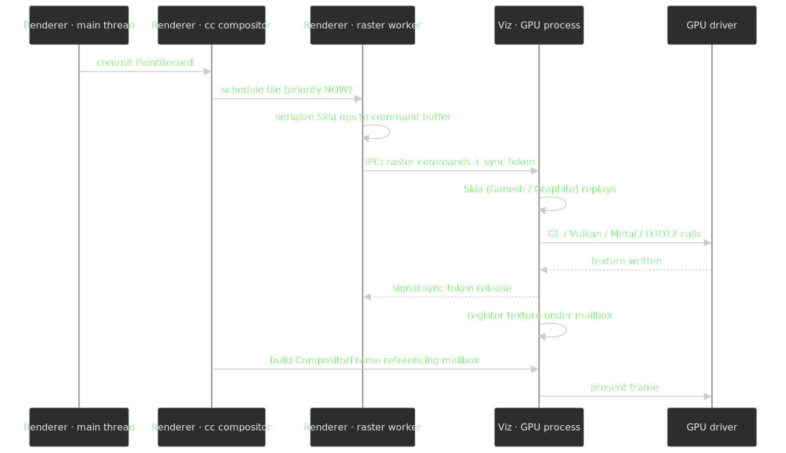

# Critical Rendering Path: Rasterization

Rasterization is where Chromium converts the [Paint](../crp-paint/README.md) stage's recorded display lists into actual pixels — bitmaps for the software path, GPU textures for the hardware path. It is the heaviest stage of the [Critical Rendering Path](../crp-rendering-pipeline-overview/README.md), and the one most aggressively engineered around three constraints: GPU memory is finite, users scroll faster than pixels can be drawn, and the main thread must stay free for JavaScript. The compositor thread (`cc`) drives the work, a worker pool executes it, and a separate process (Viz) actually owns the GPU.




## Mental model

Rasterization is shaped by four interlocking decisions:

- **Tiling** — layers are split into fixed-size tiles (~256×256 px in software; viewport-width × ¼-viewport-height in GPU mode) so memory and work scale with what's actually visible. ([How cc Works][hcw])
- **Three-tree architecture** — the compositor maintains *pending*, *active*, and *recycle* trees so a new commit can rasterize without disturbing what is currently on screen. ([How cc Works][hcw])
- **Priority binning** — every tile is classified `NOW` / `SOON` / `EVENTUALLY` based on viewport distance and scroll velocity, and the GPU memory budget is spent in that order. ([`cc/tiles/tile_priority.cc`][bins])
- **Out-of-Process Rasterization (OOP-R)** — the renderer never touches the GPU directly; it serializes Skia commands over IPC to the Viz process, which holds all GPU resources. ([RenderingNG][rng])

The current modernization story sits on top of this: Skia's GPU backend is migrating from **Ganesh** (OpenGL-shaped, single-threaded, no depth buffer) to **Graphite** (Vulkan/Metal/D3D12-shaped, multi-threaded, depth-tested). Chrome 138 enabled Graphite by default on Apple Silicon Macs in July 2025; other platforms remain Ganesh-by-default at time of writing. ([Chromium Blog][graphite])

[hcw]: https://chromium.googlesource.com/chromium/src/+/lkgr/docs/how_cc_works.md
[bins]: https://chromium.googlesource.com/chromium/src/+/refs/heads/main/cc/tiles/tile_priority.cc
[rng]: https://developer.chrome.com/docs/chromium/renderingng
[graphite]: https://blog.chromium.org/2025/07/introducing-skia-graphite-chromes.html

---

## Tiles, not layers

Once Paint produces a [`cc::PaintRecord`](https://chromium.googlesource.com/chromium/src/+/lkgr/docs/how_cc_works.md) (a serializable sequence of Skia draw operations), the compositor thread takes ownership of the layer tree. It does not rasterize a layer end-to-end. Instead, every layer is decomposed into **tiles**.

A long-scrolling page might be 50,000 px tall. Rasterizing it as one texture would exceed GPU limits (a 4K-equivalent texture is ~33 MB of VRAM (Video Random Access Memory)), block any pixel from appearing for hundreds of milliseconds, and waste memory on content the user may never scroll to. Tiling bounds memory at viewport-scale and lets the worker pool make incremental forward progress.

| Mode            | Tile dimensions                       | Why                                                                                                              |
| :-------------- | :------------------------------------ | :--------------------------------------------------------------------------------------------------------------- |
| Software raster | ~256×256 px                           | Small tiles complete quickly on a CPU worker, allowing fine-grained priority and tight memory accounting. ([How cc Works][hcw]) |
| GPU raster      | ~viewport width × ¼ viewport height   | Bigger tiles amortize per-call GPU overhead; the GPU handles large textures efficiently. ([How cc Works][hcw])    |

Tiles are managed per-layer by `PictureLayerImpl`, which holds multiple `PictureLayerTiling` objects at different scale factors. A 512×512 layer at 1× produces four 256×256 software tiles; the same layer can also have a low-resolution tiling that the compositor falls back to during fast scroll, then discards once the high-resolution tiles are ready.

> [!NOTE]
> Tile sizes are heuristics, not constants. The compositor adjusts them per device (for example, 384×384 has been used for some 1080p displays to improve CPU utilization), and several tile-size flags exist for forced overrides. ([Chromium issue 40345382](https://issues.chromium.org/40345382))

---

## The three-tree compositor

The single most consequential design decision in `cc` is that there is no single layer tree on the compositor thread. There are up to three:

- **Pending tree** — receives a commit from the main thread; tiles for new content are rasterized into this tree.
- **Active tree** — what the display compositor is currently drawing from. Animations and scroll deltas are applied here on every frame.
- **Recycle tree** — the previous pending tree's allocations, kept around so the next commit doesn't have to reallocate.




**Why three?** Without separation, every commit would immediately swap to the new tree and expose partially-rasterized content as the now-historical *checkerboarding* artifact. The three-tree design lets `TileManager` gate **activation** on whether the pending tree's `NOW` tiles are rasterized; only then does pending become active. The recycle tree is a memory micro-optimization on top of that: the prior active's tile resources are reused to back the next pending instead of being freed and re-allocated. In single-threaded mode (no compositor thread, used in some headless or test configurations), there is no pending or recycle tree — commits go straight to the active tree. ([How cc Works][hcw])

`TileManager` also drives a separate **`TreePriority`** signal — `SAME_PRIORITY_FOR_BOTH_TREES`, `SMOOTHNESS_TAKES_PRIORITY`, or `NEW_CONTENT_TAKES_PRIORITY` — that biases the budget either toward the active tree (keep the current scene smooth) or toward the pending tree (get the new commit on screen). ([`tile_priority.cc`][bins])

---

## Tile prioritization, in three (not four) bins

Tiles are placed into priority bins by viewport distance and scroll velocity. The current `TilePriority::PriorityBin` enum has exactly three values: ([`tile_priority.cc`][bins])

| Bin          | Criteria                                        | Treatment                                                |
| :----------- | :---------------------------------------------- | :------------------------------------------------------- |
| `NOW`        | Inside the visible viewport                     | Must be rasterized before activation                     |
| `SOON`       | Inside the prepaint window (~1 viewport away)   | Scheduled aggressively to absorb scroll                  |
| `EVENTUALLY` | Within the layer but outside the prepaint window | Worked on opportunistically when the raster pool is idle |

What the article-vintage "NEVER" bin used to capture is now expressed through a separate **`TileMemoryLimitPolicy`** axis — `ALLOW_NOTHING`, `ALLOW_ABSOLUTE_MINIMUM`, `ALLOW_PREPAINT_ONLY`, `ALLOW_ANYTHING` — that decides which bins are even *allowed* to consume memory under the current pressure. Under `ALLOW_NOTHING` the budget collapses and even `NOW` work is paused; under `ALLOW_PREPAINT_ONLY`, `EVENTUALLY` tiles are skipped entirely. ([`tile_priority.cc`][bins])




Scroll velocity widens the effective prepaint window — a fast fling promotes more tiles into `SOON` so they're ready by the time the user reaches them. When velocity is high enough that even an enlarged `SOON` ring can't keep up, the compositor falls back to the low-resolution tiling discussed above, which is cheaper to raster and acceptable as a transient.

---

## Software vs GPU raster

Chromium supports two raster paths. The compositor picks one per layer based on driver capability, content complexity, and a set of blocklists.

### Software raster

Worker threads execute paint commands using Skia's CPU rasterizer and produce bitmaps in shared memory. `SoftwareImageDecodeCache` runs image decode, scaling, and color correction as prerequisite tasks. Two buffer providers cover the upload step:

- **`ZeroCopyRasterBufferProvider`** — on platforms that support CPU-mappable GPU memory buffers (GMBs), the CPU rasters straight into memory the GPU can read. No CPU→GPU copy. ([Understanding One Copy Raster][onezero])
- **`OneCopyRasterBufferProvider`** — when GMBs aren't available, raster lands in shared memory and is uploaded to a GPU texture in one copy. Slower but universally available. ([Understanding One Copy Raster][onezero])

[onezero]: https://groups.google.com/a/chromium.org/g/graphics-dev/c/zXfX06v896g

Software raster remains the fallback when GPU acceleration is disabled or blocklisted, and it can be faster than GPU raster on extremely simple content where draw-call overhead dominates.

### Image decode budgeting

Image decode is a sibling task in the raster `TaskGraph`, not a side effect of raster itself. `TileManager` adds a decode dependency for every image referenced by a tile's paint record before the raster task can run. Two caches own the budget:

- **`SoftwareImageDecodeCache`** — sizes its working set to a fraction of system RAM and runs decode on raster workers in parallel with rasterization.
- **`GpuImageDecodeCache`** — tracks a separate budget for *locked* GPU images (the ones currently referenced by in-flight raster). Decode and upload are split into two tasks: decode can run on any worker, but upload requires the GL/Graphite context lock and is serialized on the raster thread that holds it. ([`cc/tiles/gpu_image_decode_cache.h`][gpuidc])

When the locked working set exceeds the budget, the cache flips to **at-raster** mode for the offending image: the standard decode/upload tasks are skipped, the image is decoded inline inside the raster task, and the cache entry is marked transient so future tasks cannot extend its lifetime. At-raster decodes block the raster worker and are the most common cause of "raster is suddenly slow" regressions on image-heavy pages. ([`gpu_image_decode_cache.h`][gpuidc])

**Checker-imaging** is the orthogonal mitigation: when a paint record references an image whose decode is expected to be expensive, `TileManager` rasterizes the tile with a placeholder (a solid color or the previous low-resolution texture) and schedules the decode off the critical path. The next commit replaces the placeholder. The visible artifact is the same checkerboard discussed under [Failure modes](#checkerboarding). ([Chromium issue 40505143](https://issues.chromium.org/issues/40505143))

[gpuidc]: https://chromium.googlesource.com/chromium/src/+/refs/heads/main/cc/tiles/gpu_image_decode_cache.h

### GPU raster (OOP-R)

Modern Chromium uses **Out-of-Process Rasterization (OOP-R)**: the renderer process does not execute GPU commands at all. The raster worker serializes Skia operations into a command buffer; the **Viz process** (the one Chromium-wide GPU process) deserializes those commands and replays them through Skia against the real driver. ([RenderingNG][rng])




Three properties motivate the cost of crossing a process boundary on every raster:

1. **Security** — renderer processes are sandboxed and cannot reach platform 3D APIs. Only Viz can. ([RenderingNG][rng])
2. **Stability** — a GPU driver crash kills Viz, not the renderer. Viz is restarted; tabs survive (with a brief flash). ([Chromium GPU fallback][gpu-fallback])
3. **Parallelism** — CPU work in the renderer overlaps GPU work in Viz across the process boundary, instead of serializing on one process's command queue.

Cross-process resource sharing is built on **mailboxes** (opaque, per-resource handles that any process can use to refer to a GPU texture) and **sync tokens** (fence-style ordering primitives that let one command buffer wait for another's work without blocking the CPU). ([Sync token internals][sync])

[gpu-fallback]: https://chromium.googlesource.com/chromium/src/+/refs/heads/main/content/browser/gpu/fallback.md
[sync]: https://chromium.googlesource.com/chromium/src/+/refs/heads/main/docs/gpu/sync_token_internals.md

---

## Skia's backend migration: Ganesh → Graphite

Inside Viz, Skia is the actual rasterizer. Skia's GPU backend has been moving for years.

**Ganesh** is the legacy backend. It was designed in the OpenGL era and still shows it: command submission is single-threaded, there is no depth buffer (overdraw is handled purely by painter's-algorithm ordering), and specialized shader pipelines are compiled lazily — which produces unpredictable hitches when a never-seen-before pipeline shows up mid-animation.

**Graphite** is the rewrite for modern explicit graphics APIs (Vulkan, Metal, D3D12). It changes three things that matter for rasterization throughput: ([Chromium Blog][graphite])

- **Multi-threaded by default** — independent `Recorder` objects produce `Recording` instances on worker threads, and recordings are submitted in parallel rather than through a single command queue.
- **Depth testing for 2D** — every draw is assigned a z-value matching its painter's-algorithm position, so opaque draws can be reordered freely while the depth buffer keeps the result correct. The net effect is much less overdraw than Ganesh.
- **Pipeline pre-compilation** — pipelines are compiled at startup (and via the [`SkiaGraphitePrecompilation`](https://chromium.googlesource.com/chromium/src/+/master/gpu/config/gpu_finch_features.cc) feature, persisted across runs), so animations don't pay the lazy-compile cost.

> [!NOTE]
> As of Chrome 138 (announced 2025-07-08), Graphite is enabled by default on Apple Silicon Macs. On other platforms it remains opt-in via `--enable-features=SkiaGraphite` (and a backend selector such as `--skia-graphite-backend=metal` or `=dawn` where applicable). ([Chromium Blog][graphite])

The Chromium team reports an almost **15% MotionMark 1.3 improvement on a MacBook Pro M3** with Graphite, alongside measurable wins in INP (Interaction to Next Paint), LCP (Largest Contentful Paint), graphics smoothness (percentage of dropped frames), and GPU process memory usage. ([Chromium Blog][graphite])

---

## Layerization is the input to rasterization

This article focuses on raster, but raster's cost is set by the previous stage: [Layerize](../crp-layerize/README.md). Layerization decides which paint chunks become their own composited layer, which is the unit raster operates on. Two heuristics matter for a senior engineer to keep in mind here.

### Promotion criteria, abridged

The compositor promotes a paint chunk to its own layer when it has a "direct compositing reason" — an explicit signal that the cost of an extra texture is worth the animation savings. ([GPU-accelerated compositing in Chrome][gpucomp])

| Trigger             | Example                                  | Why it promotes                                            |
| :------------------ | :--------------------------------------- | :--------------------------------------------------------- |
| Explicit hint       | `will-change: transform` / `opacity`     | Developer signals intent to animate; promotion is cheap insurance against a future jank. |
| 3D / `translate3d`  | `transform: translate3d(...)` etc.       | Already a GPU-native operation.                            |
| Hardware content    | `<video>`, accelerated `<canvas>`, `<iframe>` | Content is rendered by the GPU or by another process anyway. |
| Active animations   | CSS animation/transition on `transform` or `opacity` | Compositor-only properties — see below.                    |
| Overlap correction  | A non-promoted element above a promoted one | Without overlap promotion the compositor would composite layers in the wrong order. |

[gpucomp]: https://www.chromium.org/developers/design-documents/gpu-accelerated-compositing-in-chrome/

### The overlap problem and squashing

Overlap promotion is the dangerous one. A single promoted element can cascade into dozens of "promoted because they overlap a promoted thing" layers — *layer explosion*. The compositor mitigates this with **layer squashing**: multiple elements that would only be promoted for overlap reasons are merged into a shared backing texture when they share a coordinate space and the merge is correctness-safe. Squashing fails (and you pay the layer cost) when merged elements would need different blend modes, opacities, transforms, or scroll containers. ([GPU-accelerated compositing in Chrome][gpucomp])

> [!TIP]
> If you suspect layer explosion in production, open DevTools → "Show Layers" (Cmd/Ctrl+Shift+P → "Show Layers"). The Layers panel reports the exact compositing reason for each layer. Tracking that across a session is the cheapest way to spot a `will-change` that escaped its intended scope.

---

## Why layers enable 60 fps animations

The whole reason you put up with the memory cost of layers is that animating compositor-only properties on a layer **bypasses the main thread entirely**.




The two compositor-only properties — `transform` and `opacity` — are special because they can be expressed as transformations of an already-rasterized texture. ([web.dev: Stick to compositor-only properties][webdev]) On every animation tick:

1. **Main thread** — idle, or busy with whatever JS is running. Not blocked on the animation.
2. **Compositor thread** — receives the tick, mutates the property tree's transform/opacity values for the layer.
3. **GPU** — re-composites the existing textures with the new matrix/alpha.

No re-style, no re-layout, no re-paint, no re-raster. The textures already exist; only the final blend changes.

[webdev]: https://web.dev/articles/stick-to-compositor-only-properties-and-manage-layer-count

```css title="Compositor-only vs full-pipeline animation"
/* Triggers Style → Layout → Paint → Raster → Composite every frame. */
.animate-position {
  transition: top 0.2s;
}

/* Triggers only the Composite step. */
.animate-transform {
  transition: transform 0.2s;
}
```

The textbook example is a `position: fixed` header during a long scroll. The page content layer's texture is offset by the scroll delta, the header layer's texture stays put, and the display compositor blends the two at different offsets. No raster, no main-thread involvement.

---

## Failure modes

Tiling, OOP-R, and layer promotion are not free. Each has a specific failure mode worth being able to recognize.

### Memory pressure

Each composited layer consumes GPU memory roughly proportional to its pixel area at `Width × Height × 4 bytes` (RGBA — Red/Green/Blue/Alpha):

| Layer size           | Memory (RGBA) |
| :------------------- | :------------ |
| 1920×1080 (Full HD)  | ~8 MB         |
| 2560×1440 (QHD)      | ~14 MB        |
| 3840×2160 (4K)       | ~33 MB        |

Mobile devices with shared GPU memory exhaust quickly. Symptoms: the compositor switches `TileMemoryLimitPolicy` toward `ALLOW_PREPAINT_ONLY` or worse, `EVENTUALLY` tiles never get rastered, scrolling reveals checkerboard, animations stutter. In the worst case the renderer is killed by the OS for memory pressure.

### Texture upload latency

Whenever non-compositor-only content changes (`background-color`, text, image swap), the affected tiles re-raster *and* the new texture data must travel from CPU to GPU memory. On bandwidth-constrained mobile devices, uploading a single 512×512 texture can take several milliseconds — enough to drop a frame at 60 Hz. The compositor throttles uploads, but high-frequency content changes (a fast-typing input, an animated gradient on a non-promoted element) can still jank.

### Checkerboarding

When scroll velocity outruns raster throughput, the active tree has no fresh tiles to draw and the user sees the old checkerboard artifact. Mitigations are stacked:

- The `SOON` prepaint window grows with scroll velocity.
- A low-resolution tiling is rastered first as a cheap fallback.
- Image decode runs asynchronously (and via checker-imaging when expensive) so raster doesn't block on it.




These mitigations fail under flick-scroll on a content-dense page, on memory pressure that evicts pre-rastered tiles, or when paint records are unusually expensive (large SVGs, heavy filters).

### GPU process crashes

A driver bug crashes Viz, not the renderer. Chromium tracks crashes and falls back to a more stable mode after the third crash within a short window (`kGpuFallbackCrashCount`, with a per-crash forgiveness interval). The fallback stack runs roughly `HARDWARE_VULKAN → HARDWARE_GL → SWIFTSHADER → DISPLAY_COMPOSITOR`; the next startup uses the next mode. If the stack is exhausted, the browser deliberately crashes itself rather than continuing in an unsafe state. ([Chromium GPU fallback][gpu-fallback])

> [!CAUTION]
> The visible symptom of a Viz crash is a brief black flash and texture loss across all tabs. Repeated flashes during a single session are a red flag — they almost always indicate a driver-level bug worth reporting to `chrome://gpu` rather than a site-side issue.

---

## Practical takeaways

For production frontend work, the rasterization pipeline turns into four heuristics:

1. **Minimize layer count.** Each promoted element is a texture you've decided is worth the VRAM. Use `will-change` *temporarily* (toggle it on around an animation, then remove it) rather than as a permanent declaration.
2. **Animate `transform` and `opacity` only.** Anything else falls off the compositor-only path and walks the full Style → Layout → Paint → Raster → Composite chain on every frame.
3. **Keep the off-screen world cheap.** Content above and below the visible viewport is in `SOON`/`EVENTUALLY` and has to be rastered eventually; pages that put complex SVGs or heavy filters far off-screen still pay for them as the user approaches.
4. **Test on a constrained mobile device.** Desktop GPU memory hides texture-pressure problems that manifest as `EVENTUALLY` tiles never being filled on mid-tier Android.

The Ganesh-to-Graphite migration matters here because it relaxes constraint #1: depth-tested rasterization reduces overdraw on layers with many opaque-above-translucent draws, and parallel recordings reduce the latency penalty of having more layers. Graphite is not a substitute for managing layer count — it just raises the ceiling on what a sane layer count can do.

---

## Appendix

### Prerequisites

- **[Paint](../crp-paint/README.md)** — how display lists (`cc::PaintRecord`) are produced.
- **[Layerize](../crp-layerize/README.md)** — how paint chunks become composited layers; sets the unit raster works on.
- **[Composite](../crp-composit/README.md)** — how the resulting textures are assembled into a frame.
- **[Draw](../crp-draw/README.md)** — how Viz aggregates compositor frames and presents them at VBlank.
- **GPU architecture basics** — system RAM vs VRAM; the cost of texture uploads.

### Terminology

| Term                         | Definition                                                                                   |
| :--------------------------- | :------------------------------------------------------------------------------------------- |
| **OOP-R**                    | Out-of-Process Rasterization; Skia executes in the Viz (GPU) process, not the renderer.       |
| **Viz process**              | Chromium's single GPU process; owns GPU resources and runs the display compositor.            |
| **VRAM**                     | Video RAM; dedicated GPU memory for textures.                                                 |
| **Skia**                     | Open-source 2D graphics library used by Chrome, Android, and Flutter.                         |
| **Ganesh**                   | Skia's legacy OpenGL-shaped GPU backend.                                                      |
| **Graphite**                 | Skia's modern GPU backend for Vulkan/Metal/D3D12; multi-threaded with depth testing.          |
| **Mailbox**                  | Opaque GPU resource handle that lets one process refer to another's texture.                  |
| **Sync token**               | Fence-style ordering primitive used to make one command buffer wait on another's work.        |
| **Tiling**                   | Dividing a layer into fixed-size rectangles so raster scales with what's visible.             |
| **Checkerboarding**          | Visible empty rectangles when tiles are not yet rastered for an area becoming visible.        |
| **Layer squashing**          | Merging multiple overlap-promoted elements into one backing texture to bound layer count.     |
| **Compositor-only property** | `transform` and `opacity` — animatable without restyle, relayout, repaint, or reraster.       |

### Summary

- Raster turns `cc::PaintRecord` into GPU textures (or CPU bitmaps), driven by the compositor thread and executed by a worker pool.
- **Tiling** keeps memory and work proportional to the visible viewport; **three-tree** architecture decouples activation from current display; **priority binning** plus **`TileMemoryLimitPolicy`** decides what gets memory under pressure.
- **OOP-R** isolates GPU work in the Viz process for security, stability, and parallelism, with mailboxes and sync tokens as the cross-process glue.
- **Image decode** runs as sibling tasks in the raster `TaskGraph`, budgeted by `Software`/`GpuImageDecodeCache`; over-budget images flip to **at-raster** decode and **checker-imaging** keeps expensive decodes off the critical path.
- **Ganesh → Graphite** is the in-flight Skia migration; Chrome 138 enabled it by default on Apple Silicon Macs in July 2025, with ~15 % MotionMark gains plus INP/LCP/smoothness improvements.
- **Layer promotion** enables compositor-only animation at 60 fps; **layer squashing** mitigates overlap-driven layer explosion.
- Failure modes follow naturally: VRAM pressure, texture upload latency, checkerboard on fast scroll, Viz process crashes with a documented fallback stack.

### References

- [Chromium: How cc Works](https://chromium.googlesource.com/chromium/src/+/lkgr/docs/how_cc_works.md) — definitive guide to the compositor, layer trees, tiling, and the raster pipeline.
- [Chromium source: `cc/tiles/tile_priority.cc`](https://chromium.googlesource.com/chromium/src/+/refs/heads/main/cc/tiles/tile_priority.cc) — current `PriorityBin`, `TreePriority`, and `TileMemoryLimitPolicy` enums.
- [Chromium source: `cc/tiles/gpu_image_decode_cache.h`](https://chromium.googlesource.com/chromium/src/+/refs/heads/main/cc/tiles/gpu_image_decode_cache.h) — image decode budgeting, at-raster mode, persistent vs in-use cache.
- [Chromium: Sync token internals](https://chromium.googlesource.com/chromium/src/+/refs/heads/main/docs/gpu/sync_token_internals.md) — cross-process GPU command synchronization.
- [Chromium: GPU process fallback](https://chromium.googlesource.com/chromium/src/+/refs/heads/main/content/browser/gpu/fallback.md) — `kGpuFallbackCrashCount`, fallback stack, software fallback.
- [Chromium: Impl-Side Painting](https://www.chromium.org/developers/design-documents/impl-side-painting/) — original design doc for the dual-tree compositor and tile prioritization.
- [Chrome for Developers: RenderingNG architecture](https://developer.chrome.com/docs/chromium/renderingng) — process model, OOP-R, Viz integration.
- [Chromium: GPU-Accelerated Compositing in Chrome](https://www.chromium.org/developers/design-documents/gpu-accelerated-compositing-in-chrome/) — direct/indirect promotion criteria, overlap, squashing.
- [Chromium Blog: Introducing Skia Graphite](https://blog.chromium.org/2025/07/introducing-skia-graphite-chromes.html) — Graphite architecture, default-on rollout, performance numbers.
- [Skia: Understanding One Copy Raster (chromium-graphics-dev)](https://groups.google.com/a/chromium.org/g/graphics-dev/c/zXfX06v896g) — `OneCopy` and `ZeroCopy` raster buffer providers.
- [W3C CSS Compositing and Blending Level 1](https://www.w3.org/TR/compositing-1/) — specification for layer compositing operations.
- [web.dev: Stick to compositor-only properties](https://web.dev/articles/stick-to-compositor-only-properties-and-manage-layer-count) — practical guidance on layer management.
