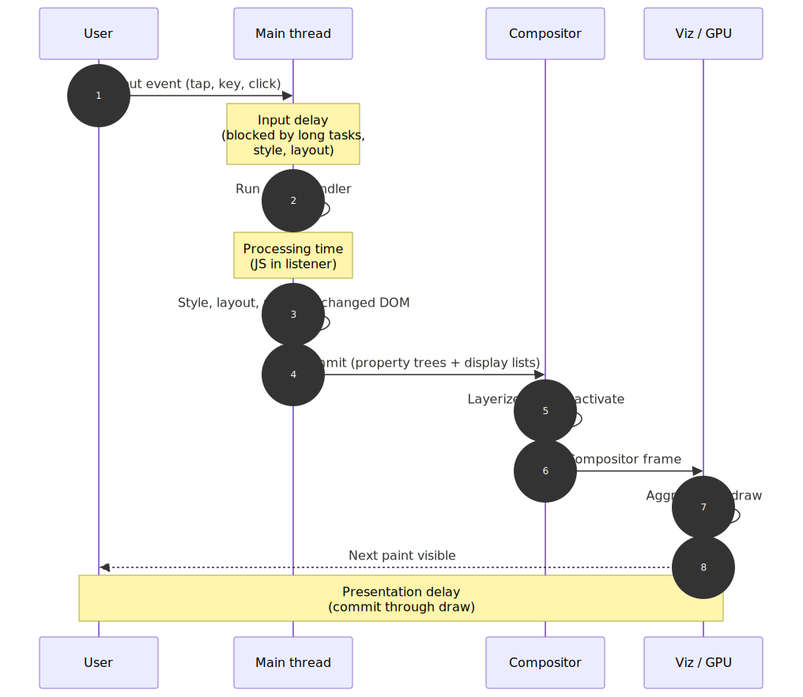
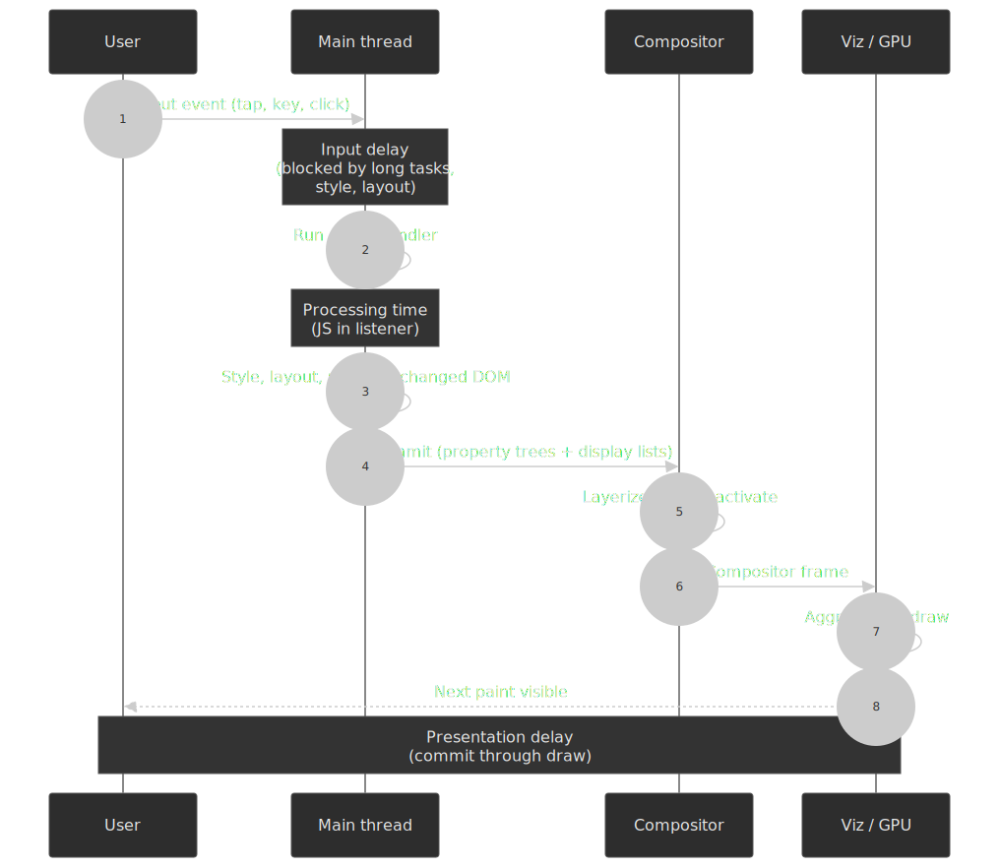

# Critical Rendering Path: Rendering Pipeline Overview

The browser turns HTML, CSS, and JavaScript into pixels through a pipeline of discrete, well-defined stages. Chromium's modern implementation, [**RenderingNG**](https://developer.chrome.com/docs/chromium/renderingng), splits that pipeline across the renderer's main thread, the renderer's compositor thread, and a separate Viz process so that scrolling and compositor-driven animation can stay at 60 fps even when the main thread is busy. This article is the entry point for the Critical Rendering Path series: it sketches the whole pipeline and then hands off to per-stage deep dives — [DOM construction](../crp-dom-construction/README.md), [CSSOM construction](../crp-cssom-construction/README.md), [style recalc](../crp-style-recalculation/README.md), [layout](../crp-layout/README.md), [pre-paint](../crp-prepaint/README.md), [paint](../crp-paint/README.md), [commit](../crp-commit/README.md), [layerize](../crp-layerize/README.md), [raster](../crp-raster/README.md), [composite](../crp-composit/README.md), and [draw](../crp-draw/README.md).

 change.")


## Thesis

The rendering pipeline is a **producer–consumer system across threads and processes**:

- **Main thread** (renderer): produces structured, immutable artifacts — DOM, CSSOM, computed styles, the [**fragment tree**](https://developer.chrome.com/docs/chromium/blinkng), the four [**property trees**](https://developer.chrome.com/docs/chromium/renderingng-data-structures#property-trees), and **display lists**.
- **Compositor thread** (renderer): consumes those artifacts to layerize, raster on worker threads, and assemble compositor frames. It also handles scroll and transform/opacity animation without going back to the main thread.
- **Viz process**: aggregates compositor frames from every renderer plus the browser UI and issues GPU commands to the screen.

The architectural lever is the [**property trees**](https://developer.chrome.com/docs/chromium/renderingng-data-structures#property-trees) — separate trees for transform, clip, effect, and scroll, each referenced by node ID from composited layers. They replace the legacy monolithic layer tree and let the compositor update an element's transform or opacity without re-running style, layout, or paint. This is why a transform animation can stay at 60 fps even while the main thread is stuck in a long task.

[**Interaction to Next Paint (INP)**](https://web.dev/articles/inp) — the responsiveness Core Web Vital — measures the latency from a user input to the next visual update. Every main-thread stage in the pipeline contributes to either input delay (work running before the handler) or processing time (work the handler triggers); the compositor and Viz stages contribute to presentation delay.

## Mental model: the 12 stages of RenderingNG

Chromium's [RenderingNG architecture page](https://developer.chrome.com/docs/chromium/renderingng-architecture) defines the rendering pipeline as **12 stages** in a fixed order. DOM and CSSOM construction are upstream parsing steps that feed Stage 2 (Style); they aren't pipeline stages themselves but they gate everything that follows.

| #   | Stage          | Primary thread        | Output                                                                | Notes                                                  |
| --- | -------------- | --------------------- | --------------------------------------------------------------------- | ------------------------------------------------------ |
| 1   | **Animate**    | Main and/or compositor | Updated computed styles + property-tree mutations from declarative animations | Skipped when no animations are running.                |
| 2   | **Style**      | Main                  | `ComputedStyle` per element + the **LayoutObject tree**               | Driven by the dirty-bit system.                        |
| 3   | **Layout**     | Main                  | Immutable **fragment tree** with physical geometry                    | Reads also force this stage if dirty (layout thrash).  |
| 4   | **Pre-paint**  | Main                  | Four **property trees** (transform, clip, effect, scroll) + invalidations | Walks the LayoutObject tree, not the fragment tree.    |
| 5   | **Scroll**     | Main and/or compositor | Updated scroll offsets in property trees                              | Compositor-only when no JS scroll listener intercepts. |
| 6   | **Paint**      | Main                  | **Display lists** (drawing commands, not pixels)                      | Layerization decisions originate here.                 |
| 7   | **Commit**     | Main → compositor     | Property trees + display lists copied to cc                           | Synchronous handoff between threads.                   |
| 8   | **Layerize**   | Compositor            | Composited layer list from display lists                              | Heuristics depend on memory and overlap analysis.      |
| 9   | **Raster + decode** | Compositor (worker threads / Viz) | GPU texture tiles                                                     | Image decode is the most expensive sub-step.           |
| 10  | **Activate**   | Compositor            | Pending tree → active tree (atomic flip)                              | The active tree stays drawable while pending rasters.  |
| 11  | **Aggregate**  | Viz (display compositor) | One global compositor frame from all renderers + browser UI           | One Viz process per Chromium instance.                 |
| 12  | **Draw**       | Viz (GPU main thread) | Pixels on screen                                                      | Synchronized to the display VSync.                     |

The "skip" property is what makes the architecture fast: **Animate** and **Scroll** can run end-to-end on the compositor thread when they don't trigger layout or paint, bypassing stages 2–4 and 6 entirely. This is the architectural reason `transform` and `opacity` animations are cheap and `top`/`left`/`width`/`height` animations are not.

> [!IMPORTANT]
> RenderingNG is the umbrella architecture across the whole pipeline. **BlinkNG** is the sub-project that re-architected the Blink main-thread part (stages 1–7) into a structured, single-pass document lifecycle with cleaner stage boundaries — see [BlinkNG deep-dive](https://developer.chrome.com/docs/chromium/blinkng).

## DOM and CSSOM construction (parsing prerequisites)

These two parsing steps feed the pipeline; they're not in the 12-stage list but render-blocking behavior originates here.

### DOM construction

The HTML parser builds the [DOM tree](https://dom.spec.whatwg.org/) incrementally as bytes arrive. Two blocking properties matter:

- **Synchronous `<script>` is parser-blocking.** A `<script>` without `async` or `defer` halts the parser because the script can call `document.write()` and mutate the input stream — this is normative behavior in [HTML §13.2.6 "tree construction"](https://html.spec.whatwg.org/multipage/parsing.html#tree-construction). `defer` and `async` are the escape hatches for scripts that don't need synchronous document access.
- **The preload scanner** runs ahead of the main parser to discover external resources (CSS, JS, fonts, images) and start fetches early. It is one of the highest-leverage optimizations in modern browsers because it converts parser-blocking serial fetches into parallel ones.

See the dedicated [DOM Construction](../crp-dom-construction/README.md) deep dive for the streaming parser, speculative tokenization, and document.write fallout in detail.

### CSSOM construction

The CSS parser produces the [CSSOM](https://drafts.csswg.org/cssom/), and unlike the DOM the CSSOM must be **fully built** before the next stage can run.

- **CSS is render-blocking** because partial CSSOM would render the wrong styles — the cascade can override anything earlier. The browser trades initial latency for visual correctness.
- **CSS blocks scripts that touch computed style** (`getComputedStyle`, layout-dependent reads). The browser pauses script execution until any pending stylesheet finishes loading.

Detail in [CSSOM Construction](../crp-cssom-construction/README.md).

## Stages 1–7: the main-thread pipeline

### 1. Animate

The Animate stage advances [declarative animations](https://drafts.csswg.org/web-animations-1/) — CSS transitions, CSS animations, and the Web Animations API — by mutating computed styles and property-tree nodes. When an animation only touches transform or opacity it can run entirely on the compositor; otherwise it dirties Style and the rest of the main-thread pipeline runs.

### 2. Style

Style applies CSS to the DOM and produces two artifacts:

1. **`ComputedStyle`** for each element — the resolved CSS property values after cascade, inheritance, and `calc()` resolution.
2. **The LayoutObject tree** — the structural skeleton that orders subsequent layout work.

> Older browser docs describe a single **render tree** combining DOM and styles, with non-rendered nodes filtered out. RenderingNG decouples these: computed styles live on a side map keyed by the DOM node, the LayoutObject tree carries layout-relevant structure, and visibility filtering happens during layout.

Two mechanics keep Style fast:

- **Dirty bits**: only nodes whose style invalidation rules matched are recalculated, so the cost is O(dirty nodes) instead of O(all nodes).
- **CSS Containment**: `contain: style` and `contain: layout` cut invalidation propagation. This matters because some property changes have surprisingly broad blast radius — a `font-size` change on a parent invalidates every descendant that uses `em` or `%`, and [container queries](https://drafts.csswg.org/css-contain-3/) introduced an additional dependency where a container's size change triggers descendant style work.

See [Style Recalculation](../crp-style-recalculation/README.md) for the invalidator, the bloom-filter selector matcher, and the rule index.

### 3. Layout

Layout takes the LayoutObject tree and resolves geometry, producing the immutable **fragment tree** (`PhysicalFragment` objects with final positions, sizes, and physical coordinates). Per the [BlinkNG documentation](https://developer.chrome.com/docs/chromium/blinkng), this is the "primary, read-only output of layout."

Layout also distinguishes **needs layout** from **needs full layout** so it can do the smallest viable subtree pass.

> [!WARNING]
> **Forced synchronous layout (layout thrashing).** Reading a layout-dependent property (`offsetWidth`, `getBoundingClientRect`, etc.) while layout is dirty forces an immediate layout pass. Mixing reads and writes in a loop turns one layout into N.
>
> ```js title="layout-thrashing.js"
> // Bad: every iteration reads then writes, forcing layout each time.
> for (const el of elements) {
>   el.style.width = container.offsetWidth + "px";
> }
>
> // Good: hoist the read, then batch the writes.
> const width = container.offsetWidth;
> for (const el of elements) {
>   el.style.width = width + "px";
> }
> ```

Properties that force layout include `offsetLeft/Top/Width/Height`, `clientLeft/Top/Width/Height`, `scrollLeft/Top/Width/Height`, `getBoundingClientRect()`, `getClientRects()`, `getComputedStyle()` for layout-dependent properties, `innerText`, `focus()`, and `scrollIntoView()`. [Paul Irish maintains the canonical list](https://gist.github.com/paulirish/5d52fb081b3570c81e3a). Deep dive: [Layout](../crp-layout/README.md).

### 4. Pre-paint

Pre-paint walks the LayoutObject tree (in DOM order — important for parent-containing-block resolution) and builds the four **property trees**:

- **Transform tree** — translation, rotation, scale, perspective.
- **Clip tree** — overflow clips, `clip-path`.
- **Effect tree** — opacity, filters, masks, blend modes.
- **Scroll tree** — scroll offsets and scroll relationships.




This is the structural change that makes compositor-only animation possible. In the legacy monolithic layer tree, updating any visual property required walking the layer hierarchy — O(layers). With property trees, the compositor mutates a single node and the existing layer-list references pick it up — close to O(1) for the common case. See [Pre-paint](../crp-prepaint/README.md).

### 5. Scroll

Scroll updates the scroll-tree offsets. When no JavaScript scroll listener intercepts the event (or only listeners marked `passive: true` are present), Scroll runs on the compositor thread without involving the main thread. A non-passive `wheel` or `touchstart` listener forces every scroll input through the main thread to give scripts a chance to call `preventDefault`.

### 6. Paint

Paint walks the LayoutObject tree and produces **display lists** — recorded drawing commands like "draw rect at (0,0) with blue fill", not pixels. The `PaintController` caches display items so unchanged subtrees skip painting entirely; subsequence recording groups related items so common subtrees can be reused across frames.

Paint also makes the **layerization decision**: which elements need their own composited layer based on properties like `will-change: transform`, `transform`, `opacity` < 1, `position: fixed`, and 3D-context-creating properties.

> [!CAUTION]
> Promoting too many elements to their own layer (e.g. blanket `will-change: transform`) consumes GPU memory and can degrade the very animations it was meant to accelerate. Use it surgically.

Detail in [Paint](../crp-paint/README.md).

### 7. Commit

Commit synchronously copies the property trees and display lists to the compositor thread.

- **Synchronous handoff**: the main thread blocks while cc copies the data. In debug builds, the `ProxyImpl` class enforces this with `DCHECK`s — it only touches main-thread-owned data while the main thread is paused.
- **Atomic per-frame**: all changes in one frame commit together so the compositor never sees a partially updated state.
- **Frame boundary**: after Commit the main thread can start work on the next frame while cc processes the current one — the natural pipelining boundary.

Deep dive: [Commit](../crp-commit/README.md).

## Stages 8–10: the compositor

### 8. Layerize

The compositor breaks display lists into a composited layer list, ready for independent rasterization and animation. Why on the compositor and not on the main thread? Because the right layer split depends on runtime factors — current memory pressure, GPU capabilities, overlap analysis — and the main thread shouldn't wait for that. See [Layerize](../crp-layerize/README.md).

### 9. Raster, decode, and paint worklets

Raster turns display lists into bitmapped GPU texture tiles. Image decode and paint worklets run alongside.

- **Tiling**: the viewport is split into tiles. Per [How cc Works](https://chromium.googlesource.com/chromium/src/+/lkgr/docs/how_cc_works.md#picture-layer), software-raster tiles are roughly 256×256 px while GPU-raster tiles are roughly viewport-width × ¼ viewport-height — so GPU tiles are large rectangles, not little squares. Heuristics adjust by device.
- **Tile prioritization**: visible > soon-visible > prefetch. Under memory pressure, low-priority tiles are evicted first.
- **GPU vs software raster**: most modern Chromium installs use GPU raster via Skia. There are three buffer providers — `ZeroCopyRasterBufferProvider` (direct GPU memory), `OneCopyRasterBufferProvider` (CPU upload), and `GpuRasterBufferProvider` (GPU command buffer) — chosen by capability.
- **Image decode** is the most expensive raster sub-step. It runs on dedicated decode threads with separate caches for software and GPU paths (`SoftwareImageDecodeCache`, `GpuImageDecodeCache`).

> [!NOTE]
> GPU raster is single-threaded per GPU context because of GPU context locks. Decode parallelizes across worker threads, but pixel generation per tile is sequential. This is one of the motivations for [Vulkan](https://www.vulkan.org/) adoption in newer code paths.

Detail in [Raster](../crp-raster/README.md).

### 10. Activate

The compositor maintains **three trees** in service of multi-buffering:

| Tree    | Role                                                       |
| ------- | ---------------------------------------------------------- |
| Main    | cc's mirror of the main-thread state, updated each Commit. |
| Pending | Staging area while raster work is in flight; not drawable. |
| Active  | Currently drawable; survives until the next pending tree activates. |




Activation flips the pending tree to active in one atomic step once raster finishes. The active tree stays drawable throughout, which is why scrolling and compositor animations can run smoothly while a complex commit is being processed.

## Stages 11–12: Viz and the GPU

### 11. Aggregate

Viz's [display compositor thread](https://developer.chrome.com/docs/chromium/renderingng-architecture#viz_process) takes the per-renderer compositor frames — every tab, every cross-origin iframe (each in its own renderer process under [site isolation](https://www.chromium.org/Home/chromium-security/site-isolation/)), plus the browser UI — and aggregates them into one global compositor frame using `SurfaceAggregator`. This is also where DrawQuads are ordered back-to-front and intermediate render passes are set up for masks, filters, and clips on rotated content.

### 12. Draw

The Viz GPU main thread issues the actual GL/Vulkan/Metal commands via `DirectRenderer`. Drawing is synchronized to the display refresh rate (60 Hz, 90 Hz, 120 Hz, 144 Hz) via VSync to avoid tearing. Viz runs in a dedicated process so a GPU driver crash doesn't take down the whole browser. See [Draw](../crp-draw/README.md).

## Frame scheduling: how the 12 stages get sequenced

The 12 stages don't run as one monolithic call — they're driven by `cc::Scheduler`, which converts VSync-aligned `BeginFrame` messages from Viz into a small state machine. Per [How cc Works — Scheduling](https://chromium.googlesource.com/chromium/src/+/lkgr/docs/how_cc_works.md#scheduling), the canonical low-latency flow is:

```text
BeginImplFrame -> BeginMainFrame -> Commit -> ReadyToActivate -> Activate -> ReadyToDraw -> Draw
```


Three properties of this state machine drive how engineers should reason about a frame budget:

- **Pipelining at the Commit boundary.** Once the main thread releases the commit mutex, it can start work on the next frame's `BeginMainFrame` while the compositor is still rasterizing and drawing the current one. Commit is the architectural seam that makes that pipelining possible.
- **High-latency mode.** If the main thread misses the scheduler's deadline, `cc::Scheduler` will draw the existing active tree without waiting for a new commit and switch into a "high latency" mode that increases pipelining at the cost of input-to-pixel latency. When subsequent frames recover, the scheduler can drop a `BeginMainFrame` to catch back up.
- **Slow raster gating activation, not commit.** If raster is the bottleneck, `ActivateSyncTree` is held back but a second `BeginMainFrame` and `Commit` can still run; the active tree remains drawable throughout, which is what keeps the page interactive when raster is heavy.

> [!IMPORTANT]
> The scheduler's "skip" rules are stage-local. If invalidations don't extend past the boundary of a stage, that stage's *output* is reused unchanged. Compositor-driven scrolling and `transform`/`opacity` animations are the headline case (Animate and Scroll skip stages 2-4 and 6 entirely), but smaller skips also exist: `PaintController` short-circuits Paint for unchanged subsequences, BlinkNG skips Layout subtrees that aren't dirty, and `ActivateSyncTree` is a no-op when no tiles have changed. The architecture is "do the smallest valid amount of work for this frame", not "always run all 12 stages".

## INP: how pipeline cost shows up in the responsiveness metric

[Interaction to Next Paint (INP)](https://web.dev/articles/inp) measures the latency from user input to the next visual update at the page's worst (or 98th-percentile) interaction. It decomposes into three phases that map directly to pipeline stages:




| Phase                  | What it captures                              | Pipeline mapping                                              |
| ---------------------- | --------------------------------------------- | ------------------------------------------------------------- |
| **Input delay**        | Time until the event handler starts executing | Main-thread work in flight (long tasks, style, layout, paint) |
| **Processing time**    | Time spent in event listeners                 | JavaScript inside the handler                                 |
| **Presentation delay** | Time from handler end to the next visible frame | Commit → Layerize → Raster → Activate → Aggregate → Draw      |

INP thresholds (75th percentile across page interactions, per [web.dev](https://web.dev/articles/inp#what-is-a-good-inp-score)):

- **Good**: ≤ 200 ms
- **Needs improvement**: 201–500 ms
- **Poor**: > 500 ms

The architectural payoff of RenderingNG is that compositor-only work — passive scrolling, transform/opacity animation — never lands in input delay or processing time. The compositor handles those visual updates while the main thread stays free for event handling. That's the mechanism behind every "use `transform` instead of `top`" recommendation.

### Pipeline-aware optimization heuristics

1. **Cap main-thread work below 50 ms.** Long tasks (>50 ms by the [Long Tasks API definition](https://w3c.github.io/longtasks/)) extend input delay and break up rendering.
2. **Animate transform and opacity, not layout properties.** These skip stages 2–4 and 6.
3. **Batch DOM reads, then batch writes.** Avoids forced sync layout (see Stage 3).
4. **Use [`content-visibility: auto`](https://drafts.csswg.org/css-contain-2/#content-visibility)** on off-screen content to defer style and layout for elements that aren't near the viewport.
5. **Mark scroll/touch listeners `{ passive: true }`** when you don't need `preventDefault`. Keeps the Scroll stage on the compositor.

## Architecture and process model

### Process boundaries

| Process      | Responsibility                          | Count                                              |
| ------------ | --------------------------------------- | -------------------------------------------------- |
| **Browser**  | UI chrome, navigation, input routing    | 1 per Chromium instance                            |
| **Renderer** | Page rendering, JS execution            | Roughly 1 per site (process-per-site-instance under site isolation; mobile may share under memory pressure) |
| **Viz**      | Aggregate + draw on GPU                 | 1 per Chromium instance                            |

Renderers are sandboxed with minimal OS access. Viz isolates GPU-driver instability from the rest of the browser. See [Chromium's RenderingNG architecture page](https://developer.chrome.com/docs/chromium/renderingng-architecture#cpu_processes) for the precise rules and the WebView caveats.

### Thread structure inside a renderer

Per [Chromium's RenderingNG threads doc](https://developer.chrome.com/docs/chromium/renderingng-architecture#threads):

- **Main thread**: scripts, the rendering event loop, document lifecycle, hit testing, parsing.
- **Compositor thread**: input events, scroll, animation ticks, layerize coordination, raster scheduling.
- **Compositor worker threads**: actual raster / decode / paint-worklet execution.
- **Media / demux / audio**: video decode and A/V sync, in parallel with the rendering pipeline.

Exactly **one** main thread and **one** compositor thread per renderer process. The number of compositor worker threads scales with device capability.

### Memory and tile management

- **Tiling** keeps GPU memory bounded — only visible tiles consume textures.
- **Tile priority** evicts low-priority (offscreen) tiles first under pressure.
- **Layer squashing** merges layers that don't need independence to reduce overhead.

### Scheduler ordering (broadly)

The Blink scheduler runs main-thread tasks under a priority order that, broadly, places **discrete input events** (click, keydown) above **continuous input** (scroll, mousemove), above **rendering updates** (rAF, style, layout, paint), above **background work** (timers, idle callbacks). Exact policy is more nuanced — see the [Blink scheduler design docs](https://chromium.googlesource.com/chromium/src/+/refs/heads/main/third_party/blink/renderer/platform/scheduler/) — but this ordering captures the intent: keep input responsive even when the page is busy.

## Where to go next

The Critical Rendering Path series unpacks each stage as its own article. Read in pipeline order:

1. [DOM Construction](../crp-dom-construction/README.md)
2. [CSSOM Construction](../crp-cssom-construction/README.md)
3. [Style Recalculation](../crp-style-recalculation/README.md)
4. [Layout](../crp-layout/README.md)
5. [Pre-paint](../crp-prepaint/README.md)
6. [Paint](../crp-paint/README.md)
7. [Commit](../crp-commit/README.md)
8. [Layerize](../crp-layerize/README.md)
9. [Raster](../crp-raster/README.md)
10. [Composite](../crp-composit/README.md)
11. [Draw](../crp-draw/README.md)

---

## Appendix

### Prerequisites

- Single-threaded event-loop model of JavaScript and the difference between tasks and microtasks
- GPU vs CPU execution and basic memory-model intuition
- CSS cascade, specificity, and inheritance

### Practical takeaways

- RenderingNG's 12 stages are an **ordered, skip-friendly** pipeline: animation and scroll skip layout/paint when they only touch transform, opacity, or scroll offset.
- Property trees decouple visual properties from layer hierarchy and enable compositor-only animation.
- The main thread produces immutable artifacts (DOM, computed styles, fragment tree, property trees, display lists); the compositor consumes them independently.
- Forced synchronous layout collapses pipelining — it interleaves reads and writes on the same frame and turns 1 layout into N.
- INP measures the full interaction-to-pixel latency. Architecture choices (passive listeners, `transform` animations, `content-visibility: auto`) move work off the main thread and out of input delay.

### References

- [Chromium: RenderingNG overview](https://developer.chrome.com/docs/chromium/renderingng) — Goals, history, and the umbrella architecture.
- [Chromium: RenderingNG architecture](https://developer.chrome.com/docs/chromium/renderingng-architecture) — The 12-stage pipeline, processes, threads.
- [Chromium: RenderingNG data structures](https://developer.chrome.com/docs/chromium/renderingng-data-structures) — Fragment tree, property trees, display lists, layer list.
- [Chromium: BlinkNG deep-dive](https://developer.chrome.com/docs/chromium/blinkng) — Main-thread document lifecycle.
- [Chromium: How cc Works](https://chromium.googlesource.com/chromium/src/+/lkgr/docs/how_cc_works.md) — Compositor internals, tile sizes, image decode.
- [Chromium: Blink Paint README](https://chromium.googlesource.com/chromium/src/+/refs/heads/main/third_party/blink/renderer/core/paint/README.md) — `PaintController`, display items, subsequence recording.
- [WHATWG HTML — Tree construction](https://html.spec.whatwg.org/multipage/parsing.html#tree-construction) — Parser-blocking semantics for `<script>`.
- [WHATWG DOM Living Standard](https://dom.spec.whatwg.org/) — DOM tree shape and mutation semantics.
- [W3C CSSOM](https://drafts.csswg.org/cssom/) — CSSOM data model.
- [W3C CSS Containment 2 — `content-visibility`](https://drafts.csswg.org/css-contain-2/#content-visibility) — Off-screen render skipping.
- [W3C Long Tasks API](https://w3c.github.io/longtasks/) — The 50 ms long-task definition.
- [web.dev: Interaction to Next Paint](https://web.dev/articles/inp) — INP definition, phases, thresholds.
- [Paul Irish: What forces layout/reflow](https://gist.github.com/paulirish/5d52fb081b3570c81e3a) — Canonical forced-layout list.

### Terminology

- **CRP (Critical Rendering Path)** — the sequence from HTML/CSS/JS to pixels.
- **DOM** — tree representation of HTML structure ([WHATWG DOM](https://dom.spec.whatwg.org/)).
- **CSSOM** — tree representation of parsed CSS rules.
- **ComputedStyle** — resolved CSS property values per element after cascade and inheritance.
- **LayoutObject tree** — mutable tree built during Style; carries layout-relevant structure.
- **Fragment tree** — immutable tree of `PhysicalFragment` objects with final geometry; output of Layout.
- **Property trees** — four trees (transform, clip, effect, scroll) referenced by composited layers.
- **Display list** — recorded drawing commands; not pixels.
- **cc** — Chromium's compositor module.
- **Viz** — Chromium's GPU process; aggregates compositor frames and draws.
- **VSync** — display refresh signal; draw is synchronized to it to avoid tearing.
- **FOUC** — Flash of Unstyled Content; visible artifact when content renders before CSS arrives.
- **INP** — Interaction to Next Paint; Core Web Vital for responsiveness.
- **Long task** — main-thread task running > 50 ms ([Long Tasks API](https://w3c.github.io/longtasks/)).
- **Site isolation** — Chromium's policy of placing different sites in different renderer processes.
