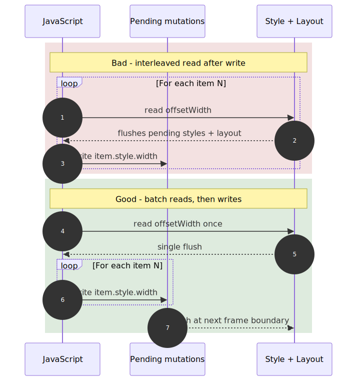
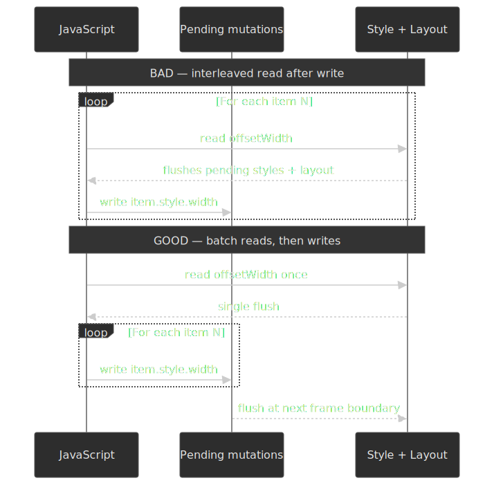

# Critical Rendering Path: Style Recalculation

Style Recalculation is the fourth phase of the [Critical Rendering Path](../crp-rendering-pipeline-overview/README.md), running after the [DOM](../crp-dom-construction/README.md) and [CSSOM](../crp-cssom-construction/README.md) trees are available and before [Layout](../crp-layout/README.md) consumes the result.

Style Recalculation transforms the DOM and CSSOM into computed styles for every element. The browser engine matches CSS selectors against DOM nodes, resolves cascade conflicts, and computes absolute values—producing the `ComputedStyle` objects that the Layout stage consumes. In Chromium's Blink engine, this phase is handled by the `StyleResolver`, which uses indexed rule sets, Bloom filters, and invalidation sets to minimize work on each frame.




## Abstract

Style Recalculation answers one question for every DOM element: **what is the final value of each CSS property?** The mental model:

1. **Index rules by rightmost selector** — Engines partition stylesheets into hash maps keyed by ID, class, and tag. This lets the matcher skip irrelevant rules entirely.
2. **Match selectors right-to-left** — Starting from the key selector (rightmost) and walking ancestors. Bloom filters enable fast rejection of impossible ancestor chains.
3. **Resolve conflicts via the Cascade** — Origin, encapsulation context, `!important`, layers, specificity, then source order. CSS Cascade Level 5 added `@layer` for explicit precedence control.
4. **Compute absolute values** — Convert relative units (`rem`, `%`, `vh`) and keywords (`inherit`, `initial`) to concrete pixel values or constants.

The cost scales with: (number of elements needing recalc) × (number of rules to consider per element) × (cascade complexity). Minimizing each factor is the optimization target.

## From Render Tree to Style Recalculation

Older browser documentation merged style computation with layout under the term **Render Tree construction**. Modern Chromium ([RenderingNG/BlinkNG](https://developer.chrome.com/docs/chromium/blinkng)) treats Style Recalculation as a discrete pipeline phase with strict lifecycle invariants. Under BlinkNG the `ComputedStyle` for an element reaches its final value during the style phase and is immutable thereafter — code paths that previously mutated it during layout were systematically refactored out.[^blinkng]

> **Why it matters:** before BlinkNG, mutating `ComputedStyle` after the style phase made it hard to reason about when style data was finalized and blocked features that depend on a strict style → layout → paint ordering, including [container queries](https://developer.chrome.com/blog/has-with-cq-m105) and [`@scope`](https://developer.chrome.com/docs/css-ui/at-scope).

Blink enforces the invariant through [`DocumentLifecycle`](https://chromium.googlesource.com/chromium/src/+/HEAD/third_party/blink/renderer/core/dom/document_lifecycle.h): modifying a `ComputedStyle` property is only legal while the lifecycle state is `kInStyleRecalc`. Once the engine advances to `kStyleClean`, any further write is a contract violation that is caught in DCHECK builds.

[^blinkng]: Chrome for Developers, [RenderingNG deep-dive: BlinkNG](https://developer.chrome.com/docs/chromium/blinkng), section "Immutable computed style".

## The Process

### 1. Rule Indexing

Before any matching occurs, the engine compiles and indexes all active stylesheets. In Blink, the `RuleSet` object partitions rules by their **rightmost compound selector** (the "key selector"):

- Rules ending in `#header` go into the `IdRules` map under key `"header"`
- Rules ending in `.nav-link` go into the `ClassRules` map under key `"nav-link"`
- Rules ending in `div` go into the `TagRules` map

This indexing happens via `FindBestRuleSetAndAdd()` during stylesheet parsing. When matching an element, the engine only considers rules from the relevant buckets—not the entire stylesheet.

**Design rationale:** Examining every rule for every element is O(elements × rules). Indexing reduces this to O(elements × relevant-rules), where relevant-rules is typically orders of magnitude smaller for well-structured CSS.

### 2. Selector Matching

The engine evaluates selectors **right to left**, starting from the key selector and walking up the ancestor chain.

> "The selector represents a particular pattern of element(s) in a tree structure." — [W3C Selectors Level 4](https://www.w3.org/TR/selectors-4/)

**Why right-to-left?** Consider `.container .nav .item`:

- **Left-to-right:** Find all `.container` elements, then check if any descendant is `.nav`, then `.item`. Requires traversing down potentially huge subtrees.
- **Right-to-left:** Find all `.item` elements (the key selector), then verify ancestors include `.nav` and `.container`. Most elements fail the key selector immediately—no ancestor traversal needed.

The rightmost selector acts as a filter. Since most rules don't match most elements, failing fast on the key selector avoids expensive ancestor walks.

#### Bloom Filters for Ancestor Matching

When a selector does require ancestor verification (descendant or child combinators), Blink consults a **counting Bloom filter** to fast-reject impossible matches before any ancestor walk. The implementation lives in [`SelectorFilter`](https://chromium.googlesource.com/chromium/src/+/HEAD/third_party/blink/renderer/core/css/selector_filter.h), which wraps the generic [`WTF::BloomFilter`](https://chromium.googlesource.com/chromium/src/+/HEAD/third_party/blink/renderer/platform/wtf/bloom_filter.h).

The Bloom filter is a probabilistic membership structure:

- **False positives are possible** — it may say "could be present" when it isn't.
- **False negatives are impossible** — if it says "not present," that is definitive.

The counting variant tracks per-bucket counts so the engine can both add an ancestor's identifiers when it descends into a subtree and remove them on backtrack, keeping the filter tight against the current ancestor chain instead of accumulating noise from siblings.

**Mechanism.** As the engine traverses the DOM, it pushes each ancestor's IDs, classes, and tag name into the filter. For a selector like `.container .nav .item`, when matching an `.item` element the engine first probes the filter for `.nav` and `.container`. If either probe returns "not present," the rule is rejected immediately — no parent-pointer walk required.




> "WebKit saw a 25% improvement overall with a 2X improvement for descendant and child selectors." — Antti Koivisto on the original WebKit Bloom-filter rollout, recapped in [CSS Selector Performance has changed (for the better)](https://calendar.perfplanet.com/2011/css-selector-performance-has-changed-for-the-better/).

**Trade-off:** larger stylesheets and deeper trees both increase the false-positive rate. The filter accelerates rejection but every "maybe" still costs an exact ancestor traversal, so simpler key selectors and shorter combinator chains keep the win.

### 3. The Cascade Algorithm

When multiple declarations target the same property on the same element, the [CSS Cascade Level 5](https://www.w3.org/TR/css-cascade-5/#cascade-sort) algorithm picks a single winner by walking these criteria in descending priority. Each step is total-order; ties drop to the next step.

| Priority | Criterion                   | Resolution                                                                                              |
| -------- | --------------------------- | ------------------------------------------------------------------------------------------------------- |
| 1        | **Origin & Importance**     | Transition > `!important` UA > `!important` user > `!important` author > Animation > author > user > UA |
| 2        | **Encapsulation Context**   | For normal rules, outer (less encapsulated) context wins. For `!important`, inner context wins.         |
| 3        | **Element-Attached Styles** | Inline `style="..."` beats rule-based declarations of the same origin                                   |
| 4        | **Cascade Layers**          | For normal rules, later layers (and unlayered) win. For `!important`, earlier layers win.               |
| 5        | **Specificity**             | ID count → class/attribute/pseudo-class count → type/pseudo-element count                               |
| 6        | **Source Order**            | Last declaration in tree order wins                                                                     |

#### Cascade Layers (`@layer`)

CSS Cascade Level 5 introduced `@layer` for explicit precedence control independent of specificity. Layers are ordered by first declaration:

```css collapse={1-2}
/* Layer order: reset < base < components < utilities */
/* Unlayered styles form an implicit final layer with highest normal priority */
@layer reset, base, components, utilities;

@layer reset {
  * {
    margin: 0;
    box-sizing: border-box;
  }
}

@layer components {
  .btn {
    padding: 8px 16px;
  } /* Lower precedence than unlayered */
}

/* Unlayered: wins over all layers for normal declarations */
.btn-override {
  padding: 12px 24px;
}
```

**Key inversion for `!important`:** For normal declarations, later layers win. For `!important` declarations, **earlier layers win**. This lets foundational layers (resets) use `!important` to enforce invariants without being overridden by component layers.

### 4. Value Computation

After cascade resolution, the engine computes absolute values. This involves:

- **Resolving relative units:** `2rem` → `32px` (if root font-size is 16px)
- **Resolving percentages:** `width: 50%` → computed value remains `50%`; the used value (after layout) becomes pixels
- **Applying keywords:** `inherit` copies parent's computed value; `initial` uses the property's initial value
- **Handling `currentcolor`:** Resolves to the element's computed `color` value

**Computed vs. Used vs. Resolved Values:**

| Value Type   | When Determined                   | Example                                                           |
| ------------ | --------------------------------- | ----------------------------------------------------------------- |
| **Computed** | After cascade, before layout      | `width: 50%` stays `50%`                                          |
| **Used**     | After layout                      | `width: 50%` becomes `400px`                                      |
| **Resolved** | What `getComputedStyle()` returns | Returns used value for dimensions if rendered; computed otherwise |

The CSSOM spec notes: "The concept of 'computed value' changed between revisions of CSS while the implementation of `getComputedStyle()` had to remain the same for compatibility." This is why `getComputedStyle()` returns **resolved values**, not strictly computed values.

## Performance Optimization

### Understanding Invalidation

When DOM changes (element added/removed, class toggled, attribute modified), the engine must determine which elements need style recalculation. Blink uses **InvalidationSets** to minimise this scope, as documented in [CSS Style Invalidation in Blink](https://chromium.googlesource.com/chromium/src/+/HEAD/third_party/blink/renderer/core/css/style-invalidation.md).[^style-invalidation]

**How InvalidationSets work:**

1. During stylesheet compilation, every selector is analysed and recorded in a `RuleFeatureSet`. The rule `.c1 div.c2 { color: red }` produces a descendant invalidation set: "if `.c1` is added or removed on an ancestor, invalidate descendants matching `div.c2`."
2. DOM changes call into `StyleEngine::*ChangedForElement` (e.g. `ClassChangedForElement`), which routes to `PendingInvalidations::ScheduleInvalidationSetsForNode`. That call either marks the node with `SetNeedsStyleRecalc(kLocalStyleChange | kSubtreeStyleChange)` for an immediate hit, or appends pending sets to `PendingInvalidationsMap`.
3. When style is about to be read (typically `Document::UpdateStyleAndLayoutTree` ahead of the next frame), `StyleInvalidator::Invalidate` walks the tree depth-first and applies the pending sets to descendants whose IDs / classes / tags match.
4. Only nodes that end up dirty re-enter style recalculation; everything else reuses the cached `ComputedStyle`.

**Sibling and `:has()` propagation are separate paths.** Sibling invalidation (for `+`/`~` combinators) is documented in a separate Blink design doc and operates forward along the sibling chain; for `:has()`, Blink instead stores per-element bits in [`HasInvalidationFlags`](https://chromium.googlesource.com/chromium/src/+/HEAD/third_party/blink/renderer/core/dom/has_invalidation_flags.h) so it can decide whether a descendant mutation needs to bubble up to an ancestor at all (covered below).[^has-invalidation]

 sets, then applied depth-first before the next style read.")


**Design rationale:** Invalidating everything on every change is correct but expensive. InvalidationSets accept some over-invalidation (marking elements that didn't actually change) to avoid the cost of precise dependency tracking — the doc is explicit that they "err on the side of correctness."

[^style-invalidation]: Chromium, [`third_party/blink/renderer/core/css/style-invalidation.md`](https://chromium.googlesource.com/chromium/src/+/HEAD/third_party/blink/renderer/core/css/style-invalidation.md). The companion [`style-calculation.md`](https://chromium.googlesource.com/chromium/src/+/HEAD/third_party/blink/renderer/core/css/style-calculation.md) explains how `ScopedStyleResolver` and `RuleSet` compile and index the rules that invalidation sets are derived from.
[^has-invalidation]: Byungwoo Lee (Igalia, Blink team), [How Blink invalidates styles when `:has()` in use?](https://blogs.igalia.com/blee/posts/2023/05/31/how-blink-invalidates-styles-when-has-in-use.html), 2023-05-31.

### The Matched Properties Cache

Blink's `MatchedPropertiesCache` (MPC) enables style sharing between elements with identical matching rules. When element B would resolve to the same `ComputedStyle` as element A (same matched rules, same inherited values), the cache returns A's style directly.

**When MPC hits:** Sibling elements with identical classes and no style-affecting attributes often share styles. Lists, tables, and repeated components benefit significantly.

**When MPC misses:** Elements with CSS custom properties, animations, or pseudo-class states (`:hover`, `:focus`) may not share styles.

### Selector Complexity and Cost

> "Roughly half of the time used in Blink (the rendering engine used in Chromium and derived browsers) to calculate the computed style for an element is used to match selectors, and the other half is used to construct the computed style representation from the matched rules." — Rune Lillesveen, Blink engineer, quoted in [web.dev: Reduce the scope and complexity of style calculations](https://web.dev/articles/reduce-the-scope-and-complexity-of-style-calculations).

Selector cost depends on:

| Factor                       | Impact                                                          | Example                 |
| ---------------------------- | --------------------------------------------------------------- | ----------------------- |
| **Key selector specificity** | Classes/IDs are O(1) lookup; universal/tag are broader          | `.nav-link` vs `a`      |
| **Combinator chain length**  | Each combinator requires ancestor/sibling traversal             | `.a .b .c .d`           |
| **Attribute selectors**      | `[attr]` is fast; `[attr*="value"]` requires string scanning    | `[class*="icon-"]`      |
| **Pseudo-classes**           | `:nth-child()` requires sibling counting; `:has()` is expensive | `:nth-last-child(-n+1)` |

**Production measurement:** Edge DevTools (109+) includes **Selector Stats** showing elapsed time, match attempts, and match count per selector. Use this to identify expensive selectors rather than guessing.

#### `:has()` Invalidation Cost

`:has()` (CSS [Selectors Level 4 §6.2](https://www.w3.org/TR/selectors-4/#has-pseudo)) inverts the usual matching direction — a descendant change can affect an ancestor's style — which would naively force the engine to walk every mutation up the DOM. Blink avoids that with two pieces of pre-computed metadata, set when stylesheets are compiled:

- **`HasInvalidationFlags` bits** stored on every `Element` (e.g. `AffectedBySubjectHas`, `AncestorsOrAncestorSiblingsAffectedByHas`, `SiblingsAffectedByHas`). If no relevant bit is set in a mutated element's subtree, no upward walk happens at all.
- **Per-class / per-attribute filters** derived from the `:has()` argument: a mutation only triggers `:has()` re-evaluation if the changed identifier appears inside some `:has(...)` selector that the document actually uses.

The combined effect: on a page that does not use `:has()`, the cost is zero; on a page that does, only mutations that touch identifiers referenced inside a `:has()` argument bubble up, and only along ancestor chains whose flags say a `:has()` subject sits above them.[^has-invalidation]

> [!WARNING]
> The cost still scales with the **size of the `:has()` argument**. Web Platform Tests' [`has-complexity.html`](https://github.com/web-platform-tests/wpt/blob/master/css/selectors/invalidation/has-complexity.html) explicitly stress-tests deep `:has(...)` arguments. Prefer `:has(.flag)` over `:has(.parent .child + .other)`, and prefer narrow class arguments over broad attribute selectors.

#### Container Queries Scoping Cost

Container queries (originally drafted in [CSS Containment Level 3](https://www.w3.org/TR/css-contain-3/), now folded into [CSS Conditional Rules Module Level 5](https://drafts.csswg.org/css-conditional-5/)) introduce a second axis the engine must evaluate during recalc: `@container` rules whose match depends on an ancestor's resolved size or style. The `container-type` property is the explicit opt-in and pulls in **layout / size / style containment** from the `contain` family — without it, a child changing size could resize its parent and trigger an infinite query/layout loop, so containment is a correctness requirement, not just a hint.[^container-queries]

Two concrete cost implications:

- **Scoped recalc.** Chromium evaluates `@container` rules against the nearest matching ancestor with a compatible `container-type`. Once resolved, the result is cached per query container; a size change that does not cross a query threshold does **not** re-trigger style recalc for the subtree — the query feature filter rejects it first.
- **Forced style/layout interleaving.** Because container size depends on layout but feeds back into style, Chromium runs an interleaved style → layout pass for any subtree whose container size has changed. Deep `container-type: size` chains amplify that cost; `container-type: inline-size` is cheaper because only the inline axis participates.

> [!TIP]
> Prefer `container-type: inline-size` and a single `container-name` per logical component. Putting `container-type: size` on a generic wrapper forces the engine into block-axis containment for every descendant query, which is rarely what you want.

### Parallel Style Recalc — Stylo / Quantum CSS

Style recalc is "embarrassingly parallel" within the constraint that a node's computed style depends on its parent's. Servo's Stylo, shipped as Firefox's CSS engine in 2017 (project name *Quantum CSS*), exploits that with three reinforcing optimizations described in [Inside a super fast CSS engine: Quantum CSS](https://hacks.mozilla.org/2017/08/inside-a-super-fast-css-engine-quantum-css-aka-stylo/):

- **Parallel pre-order traversal.** The DOM tree is split into work units and dispatched onto a [`rayon`](https://docs.rs/rayon) work-stealing thread pool — idle cores steal subtrees from busy cores' queues, so uneven trees don't serialize on a single hot branch.
- **Rule tree.** Selector match results for an element are recorded as a path in a shared trie keyed on (rule, specificity). On restyle, an element whose ancestor changed in a way that cannot affect rule matching keeps its existing path and skips selector matching entirely.
- **Style sharing cache.** Sibling-like elements with the same id/class/inline-style and the same parent computed-style pointer reuse one another's `ComputedStyle`. Stylo's variant additionally records a bit-vector of "weird selector" probes (e.g. `:nth-child`) so it does not have to give up the way Blink/WebKit historically did.

Blink does not parallelize the recalc traversal itself, but it does maintain conceptually similar caches — the `MatchedPropertiesCache` (style sharing) and shared `ComputedStyle` pointers between elements that resolve to the same value.




[^container-queries]: Miriam Suzanne et al., [CSS Conditional Rules Module Level 5](https://drafts.csswg.org/css-conditional-5/) (Editor's Draft) and [CSS Containment Module Level 3](https://www.w3.org/TR/css-contain-3/). Chrome for Developers, [Container queries are stable across browsers](https://developer.chrome.com/blog/cq-polyfill), describes the `container-type` opt-in and its containment requirements.

### Style Thrashing

Style Thrashing (also called *layout thrashing* or *forced synchronous layout*) occurs when JavaScript interleaves style reads (`getComputedStyle()`, `offsetWidth`, `getBoundingClientRect()`) with style writes (`element.style.width = ...`, class toggles), forcing the engine to synchronously flush pending style and layout each time a value is read:




```javascript title="style-thrashing.js" collapse={1-2, 14-20}
// Assume container and items exist
const container = document.getElementById("container")
const items = document.querySelectorAll(".item")

// BAD: Interleaved Read/Write — forces recalc on every iteration
items.forEach((item) => {
  const width = container.offsetWidth // READ → Triggers Sync Recalc
  item.style.width = `${width}px` // WRITE → Invalidates styles
})

// GOOD: Batch Reads, then Batch Writes
const width = container.offsetWidth // Single READ
items.forEach((item) => {
  item.style.width = `${width}px` // WRITE (batched)
})

// Helper functions omitted for brevity
function measureAll() {
  /* ... */
}
function applyAll() {
  /* ... */
}
```

**Why it's expensive:** Each read after a write forces the engine to flush pending style changes to return accurate values. With N items, the bad pattern causes N recalculations; the good pattern causes 1.

### Measuring Style Recalculation

**Chrome/Edge DevTools:**

1. Open the **Performance** panel and click the **Capture settings** (gear) icon.
2. Tick **Enable CSS selector stats (slow)** — available in [Microsoft Edge 109+](https://learn.microsoft.com/en-us/microsoft-edge/devtools/performance/selector-stats) and Chrome DevTools.[^selector-stats-chrome]
3. Record an interaction; the purple **Recalculate Style** events now expose a **Selector Stats** tab in the bottom pane with elapsed time, match attempts, fast-reject count, and match count per selector.

[^selector-stats-chrome]: Chrome DevTools, [Analyze CSS selector performance during Recalculate Style events](https://developer.chrome.com/docs/devtools/performance/selector-stats). The Chrome implementation is upstreamed from Microsoft's original Edge work.

**Long Animation Frames (LoAF) API:** For production monitoring, the [`PerformanceLongAnimationFrameTiming`](https://developer.mozilla.org/en-US/docs/Web/API/PerformanceLongAnimationFrameTiming) entry exposes `styleAndLayoutStart` (when the engine began the end-of-frame style + layout pass) and per-script `forcedStyleAndLayoutDuration` (time a script spent forcing synchronous style/layout from `getBoundingClientRect`, `offsetWidth`, etc.). The [`web-vitals`](https://github.com/GoogleChrome/web-vitals) library exposes these on its INP attribution entries (`longAnimationFrameEntries`, `totalStyleAndLayoutDuration`), so you can attribute slow interactions to either end-of-frame recalc or specific script-induced thrashing in the field.

**Benchmark example:** The Edge DevTools team's [photo gallery demo](https://microsoftedge.github.io/Demos/photo-gallery/) is the canonical worked example for Selector Stats; recordings published by the team show the long-running `Recalculate Style` task on that demo dropping from roughly hundreds of milliseconds to tens once the slowest selectors (long descendant chains and `[class*="…"]` substring matches) are simplified. Reproduce the trace yourself before quoting numbers — the absolute values depend on hardware, viewport, and Chromium version.

## Conclusion

Style Recalculation sits at the intersection of CSS language semantics and engine implementation. The cascade algorithm (origin → layer → specificity → order) is specified by W3C; the optimisation strategies (rule indexing, counting Bloom filters, invalidation sets, `HasInvalidationFlags`, the matched properties cache, Stylo's rule tree and work-stealing scheduler) are engine implementation details.

For production applications, focus on:

1. **Simple selectors with class-based key selectors** — enables efficient indexing and fast rejection.
2. **Tight `:has()` arguments and explicit `container-type`** — keeps invalidation walks short and prevents accidental block-axis containment.
3. **Avoiding style thrashing** — batch reads before writes; LoAF tells you which scripts are still doing it in the field.
4. **Measuring before optimising** — use Selector Stats to find actual bottlenecks, not theoretical ones.

The rendering pipeline continues to evolve. BlinkNG's strict phase separation now enables features like container queries that require precise style-layout boundaries — a constraint that would have been impossible under the older, leakier architecture.

---

## Appendix

### Prerequisites

- [DOM construction](../crp-dom-construction/README.md) and [CSSOM construction](../crp-cssom-construction/README.md) (earlier CRP articles)
- [CSS Specificity](https://www.w3.org/TR/selectors-4/#specificity-rules) calculation basics
- Basic algorithmic complexity (O-notation)

### Where this fits in the series

- Previous: [CSSOM Construction](../crp-cssom-construction/README.md) — how the CSS rule set is parsed and normalised before recalc starts.
- Next: [Layout](../crp-layout/README.md) — how the immutable `ComputedStyle` produced here flows into box-tree generation and geometry.

### Terminology

| Term                         | Definition                                                                                                   |
| ---------------------------- | ------------------------------------------------------------------------------------------------------------ |
| **UA Stylesheet**            | User-Agent stylesheet; browser's default styles (e.g., `display: block` for `<div>`)                         |
| **Computed Value**           | Value after cascade resolution and inheritance, before layout                                                |
| **Used Value**               | Final value after layout calculations (e.g., percentages resolved to pixels)                                 |
| **Resolved Value**           | What `getComputedStyle()` returns; may be computed or used depending on property and render state            |
| **Key Selector**             | Rightmost compound selector; determines which rule bucket an element checks                                  |
| **InvalidationSet**          | Blink data structure tracking which elements need recalculation when specific classes/attributes change      |
| **Bloom Filter**             | Probabilistic data structure for fast set membership testing; allows false positives but not false negatives |
| **Matched Properties Cache** | Blink optimization enabling style sharing between elements with identical matching rules                     |

### Summary

- Style Recalculation produces a `ComputedStyle` for every DOM element by matching rules, resolving cascade conflicts, and computing absolute values.
- Engines index rules by rightmost selector and match right-to-left; counting Bloom filters fast-reject impossible ancestor chains.
- The CSS Cascade (Level 5) resolves conflicts via: origin → encapsulation → element-attached → layer → specificity → order, and **inverts** layer order for `!important`.
- InvalidationSets minimise recalc scope; sibling combinators and `:has()` use separate paths (`HasInvalidationFlags` keeps `:has()` opt-in cheap).
- Container queries scope recalc per query container but force interleaved style → layout passes when the container's size changes.
- Stylo / Quantum CSS parallelises recalc with `rayon` work stealing, a shared rule tree, and a style sharing cache; Blink does not parallelise the traversal but uses the `MatchedPropertiesCache` for sharing.
- Style thrashing forces synchronous recalc — always batch reads before writes.
- Measure with DevTools Selector Stats; LoAF (`forcedStyleAndLayoutDuration`) attributes field thrashing to specific scripts.

### References

- [W3C CSS Cascading and Inheritance Level 5](https://www.w3.org/TR/css-cascade-5/) — authoritative cascade algorithm and `@layer` semantics.
- [W3C Selectors Level 4](https://www.w3.org/TR/selectors-4/) — selector syntax, specificity, `:has()` definition.
- [W3C CSSOM](https://www.w3.org/TR/cssom-1/) — resolved / computed / used value definitions.
- [W3C CSS Containment Module Level 3](https://www.w3.org/TR/css-contain-3/) and [CSS Conditional Rules Module Level 5 (Editor's Draft)](https://drafts.csswg.org/css-conditional-5/) — container queries and `container-type`.
- [Chromium: CSS Style Calculation in Blink](https://chromium.googlesource.com/chromium/src/+/HEAD/third_party/blink/renderer/core/css/style-calculation.md) — `RuleSet`, `ScopedStyleResolver`, `SelectorChecker`.
- [Chromium: CSS Style Invalidation in Blink](https://chromium.googlesource.com/chromium/src/+/HEAD/third_party/blink/renderer/core/css/style-invalidation.md) — `RuleFeatureSet`, `PendingInvalidationsMap`, `StyleInvalidator`.
- [Chrome for Developers: BlinkNG](https://developer.chrome.com/docs/chromium/blinkng) — rendering pipeline architecture and immutable `ComputedStyle`.
- [Mozilla Hacks: Inside a super fast CSS engine — Quantum CSS (Stylo)](https://hacks.mozilla.org/2017/08/inside-a-super-fast-css-engine-quantum-css-aka-stylo/) — parallel pre-order traversal, rule tree, style sharing cache.
- [Servo Book: Style*](https://book.servo.org/design-documentation/style.html) and [Servo wiki: Layout Overview](https://github.com/servo/servo/wiki/Layout-Overview) — Stylo design notes.
- [Igalia / Byungwoo Lee: How Blink invalidates styles when `:has()` in use?](https://blogs.igalia.com/blee/posts/2023/05/31/how-blink-invalidates-styles-when-has-in-use.html) — `HasInvalidationFlags` mechanics.
- [Microsoft Edge Blog: The Truth About CSS Selector Performance](https://blogs.windows.com/msedgedev/2023/01/17/the-truth-about-css-selector-performance/) — modern selector benchmarks and Selector Stats.
- [Chrome DevTools: Analyze CSS selector performance during Recalculate Style events](https://developer.chrome.com/docs/devtools/performance/selector-stats) — Selector Stats workflow.
- [web.dev: Reduce the scope and complexity of style calculations](https://web.dev/articles/reduce-the-scope-and-complexity-of-style-calculations) — practical optimisation guidance.
- [Performance Calendar: CSS Selector Performance Has Changed](https://calendar.perfplanet.com/2011/css-selector-performance-has-changed-for-the-better/) — historical Bloom filter impact.
