# CSP Violation Reporting Pipeline at Scale

Browser-generated [Content Security Policy](https://www.w3.org/TR/CSP3/) violation reports are high-volume, bursty, low-value-per-event telemetry — the wrong shape for a transactional logging service, and the wrong shape for a generic error tracker once traffic gets serious. This article is two articles welded together: the **browser-side** half explains exactly what the user agent emits, over which transport, with which spec-defined edge cases (sampling, `'report-sample'`, the `Reporting-Endpoints` migration, Trusted Types) and what false-positive noise rides along; the **server-side** half walks through *CSP-Sentinel*, a reference pipeline that treats those reports as a streaming-analytics problem — a fire-and-forget WebFlux endpoint, Kafka as a shock absorber, a short Valkey deduplication window, and Snowpipe Streaming into a clustered Snowflake table. The same shape sustains a 50k RPS baseline and absorbs 500k+ RPS bursts during incidents without backpressure reaching the browser.


## Mental model

Five conceptual stages, in order, decide every other choice in the design:


Three principles fall out of this shape:

| Decision                          | Optimizes for             | Sacrifices                                           |
| :-------------------------------- | :------------------------ | :--------------------------------------------------- |
| `acks=1` on the producer          | Lower ingest latency      | Durability — rare loss on a leader-only failure      |
| 10-minute dedup window            | Storage cost, query noise | Per-event fidelity — identical violations collapse   |
| 24-hour Kafka retention           | Cost                      | Replay capability beyond 24 hours                    |
| Stateless API                     | Horizontal scaling        | Per-session rate limiting (push to a WAF)            |

> [!IMPORTANT]
> This design fits high-volume telemetry where individual events are expendable and aggregate trends drive action. It does **not** fit audit logs, real-time alerting on individual violations, or compliance scenarios that require guaranteed delivery — for those, switch the producer to `acks=all`, extend Kafka retention, and add client-side retry with idempotency keys.

## 1. Why CSP reports need a different shape than ordinary logs

Modern browsers emit a JSON document every time a page violates one of its [Content Security Policy directives](https://www.w3.org/TR/CSP3/#csp-directives) — a blocked script, an inline style, a forbidden frame ancestor, a mixed-content image. Aggregating those reports lets a security team:

- Spot misconfigured policies and false positives before they trigger a customer report.
- Detect XSS and supply-chain attempts in production.
- Track the rollout health of a new policy across many properties.

The traffic shape is the wedge. A page that breaks a policy on every navigation will issue hundreds of reports per session per browser. A misconfigured policy rolled out to a high-traffic property can produce a 10× burst within minutes. The data is high-volume and low-value per individual event — most reports duplicate one another within seconds.

Treating those reports as transactional logs forces every spike through a synchronous database, throws latency back at the browser (which then queues retries through the [Reporting API](https://www.w3.org/TR/reporting-1/)), and pays a per-event cost on storage that swamps the actionable signal. The streaming-analytics framing flips both: ingestion responds in microseconds, and only the deduplicated tail reaches storage.

## 2. Browser-side reporting

CSP violations show up to your code in two places — in the **page itself** as a DOM event, and **out-of-band** as a POST from the user agent. Most production pipelines only consume the second; the first is still useful for client-side telemetry, debugging, and Trusted Types rollouts where you want sub-second feedback.

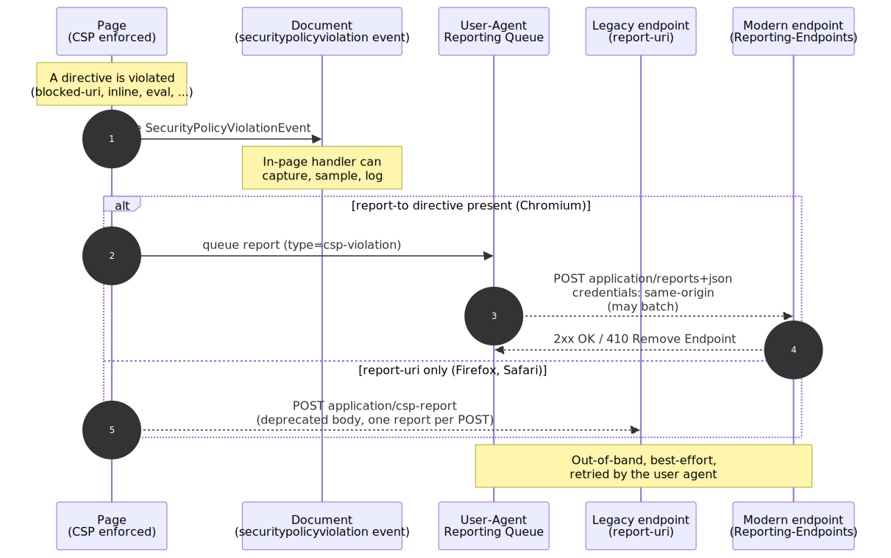
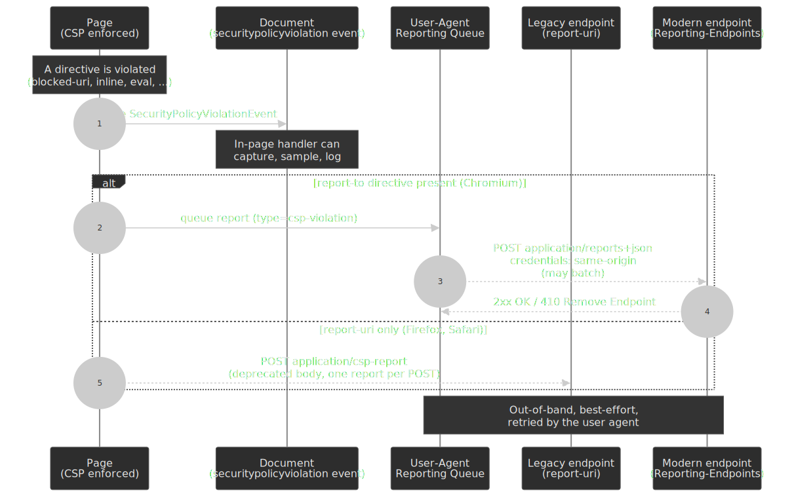

### 2.1 In-page: `SecurityPolicyViolationEvent`

When a directive is violated, the user agent fires a [`securitypolicyviolation`](https://www.w3.org/TR/CSP3/#report-violation) event at the relevant target (a `Document`, an `Element`, or a `WorkerGlobalScope`). The dispatched object is a `SecurityPolicyViolationEvent` with the [IDL defined in CSP3 §5.1](https://www.w3.org/TR/CSP3/#cspviolationreport-and-securitypolicyviolationevent). It is `Baseline Widely available` — supported across Chromium, Firefox, and Safari since 2018 ([MDN](https://developer.mozilla.org/en-US/docs/Web/API/SecurityPolicyViolationEvent#browser_compatibility)).

```js title="in-page-reporter.js"
document.addEventListener("securitypolicyviolation", (e) => {
  navigator.sendBeacon("/csp/in-page", JSON.stringify({
    documentURI: e.documentURI,
    effectiveDirective: e.effectiveDirective,
    blockedURI: e.blockedURI,
    sample: e.sample,
    disposition: e.disposition,
    sourceFile: e.sourceFile,
    lineNumber: e.lineNumber,
  }));
});
```

Two reasons to wire this up even when the out-of-band path exists:

1. **Latency.** The Reporting API delivers reports on the user-agent's own schedule — the spec only says the agent "SHOULD make an effort to deliver reports as soon as possible after queuing" ([Reporting §3.5](https://www.w3.org/TR/reporting-1/#send-reports)). The in-page event fires synchronously inside the violating context, which is what you want for dev-tools overlays or for correlating against the click handler that triggered it.
2. **Coverage.** Worker contexts can observe their own violations. So can `iframe` documents under your control.

The same handler is the cleanest place to **down-sample at the source** before ever hitting the network — see [§2.6](#26-sampling-and-rate-limiting-at-the-browser).

### 2.2 Out-of-band: the Reporting API

The Reporting API is the framework that owns out-of-band browser-emitted reports — CSP, [Network Error Logging](https://w3c.github.io/network-error-logging/), deprecation reports, intervention reports, crash reports. Its W3C draft (Working Draft, 2025-06-11) defines the wire contract that matters here:

- The endpoint receives a POST whose `Content-Type` is `application/reports+json` ([Reporting §3.5.2](https://www.w3.org/TR/reporting-1/#try-delivery)).
- The body is a JSON array — each element is `{ "type": "csp-violation", "age": <ms>, "url": <stripped page URL>, "user_agent": <UA>, "body": { ... } }`.
- The request is sent with [credentials mode `same-origin`](https://www.w3.org/TR/reporting-1/#try-delivery), meaning cross-origin endpoints get **no cookies**. Plan auth around that — query-string keys (Sentry) or a service token in the body, never a session cookie.
- A `2xx` response is treated as `Success`. A `410 Gone` returns `Remove Endpoint` and the user agent stops sending — cheap kill-switch when an endpoint is being decommissioned.
- The user agent is allowed to **batch** multiple reports in one POST and to **defer** delivery — the spec does not promise prompt delivery, only best-effort.

The endpoint URL itself **must be `Potentially Trustworthy`** — i.e. HTTPS or `localhost` ([Reporting §3.2](https://www.w3.org/TR/reporting-1/#header)). Plain-HTTP endpoints are silently ignored.

### 2.3 `report-uri` vs `report-to` vs `Reporting-Endpoints`

Three transports coexist in the field. Each is named differently, has a different body, and is supported by a different subset of browsers — pick wrong and you are blind in half your traffic.

| Mechanism                      | Header / directive                     | Body `Content-Type`        | Spec status (Apr 2026)                                                                                                                                                                                | Browser support (Apr 2026)                                       |
| :----------------------------- | :------------------------------------- | :------------------------- | :---------------------------------------------------------------------------------------------------------------------------------------------------------------------------------------------------- | :--------------------------------------------------------------- |
| Legacy `report-uri`            | CSP directive `report-uri <url>`       | `application/csp-report`   | **Deprecated** but still normative ([CSP3 §6.5.1](https://www.w3.org/TR/CSP3/#directive-report-uri)); body defined in [CSP3 §5.3 — Obtain the deprecated serialization of violation](https://www.w3.org/TR/CSP3/#deprecated-serialize-violation) | Chromium, Firefox, Safari                                        |
| Modern `report-to` directive   | CSP directive `report-to <name>`       | `application/reports+json` | Current path ([CSP3 §6.5.2](https://www.w3.org/TR/CSP3/#directive-report-to)); routes via the [Reporting endpoint](https://www.w3.org/TR/reporting-1/#endpoint) named in `Reporting-Endpoints`        | Chromium only (Firefox / Safari ignore for CSP)                  |
| `Reporting-Endpoints` header   | HTTP response header                   | `application/reports+json` | Current path ([Reporting §3.2](https://www.w3.org/TR/reporting-1/#header)); structured-fields dictionary, HTTPS only                                                                                  | Chromium only                                                    |
| Deprecated `Report-To` header  | HTTP response header                   | `application/reports+json` | Superseded by `Reporting-Endpoints` (per [MDN `Report-To`](https://developer.mozilla.org/en-US/docs/Web/HTTP/Reference/Headers/Report-To)); never reached cross-browser baseline                       | Removed / never shipped widely; do not use in new sites          |

The selection rule inside the user agent is unambiguous: when a single policy contains both `report-uri` **and** `report-to`, the modern directive wins and the legacy POST is **suppressed** ([CSP3 §5.5 — Report a violation](https://www.w3.org/TR/CSP3/#report-violation), step "If violation's policy's directive set contains a directive named `report-to`, skip the remaining substeps"). Concretely, in April 2026:

- **Chromium** sees `report-to`, ignores `report-uri`, POSTs `application/reports+json` to the URL named by `Reporting-Endpoints`.
- **Firefox** and **Safari** do not implement the CSP `report-to` directive, so they fall back to `report-uri` and POST the deprecated `application/csp-report` body.

Until Firefox and Safari implement `Reporting-Endpoints`, the only durable production posture is **both directives on the same policy**, served behind the same backend, with the parser dispatching on `Content-Type`:

```http title="csp-headers.http"
Reporting-Endpoints: csp-endpoint="https://csp.example.com/r"
Content-Security-Policy:
  default-src 'self';
  script-src 'self' 'nonce-r4nd0m';
  report-to csp-endpoint;
  report-uri https://csp.example.com/r
```

> [!CAUTION]
> Vendors that authenticate via query parameters in the legacy URL (Sentry's `?sentry_key=…`, [report-uri.com](https://report-uri.com/)) **do not survive the migration cleanly** — the modern path takes a single base URL from `Reporting-Endpoints` and provides no per-report query string. Sentry's own migration thread tracks the issue ([getsentry/sentry#52794](https://github.com/getsentry/sentry/issues/52794)). Today, ship both directives and accept that the modern path may need a different URL with the key embedded in the path segment.

### 2.4 `Content-Security-Policy-Report-Only` for staged rollout

Every policy change should ship behind [`Content-Security-Policy-Report-Only`](https://www.w3.org/TR/CSP3/#header-content-security-policy-report-only) first. The header is parsed identically to `Content-Security-Policy` but its [disposition](https://www.w3.org/TR/CSP3/#policy-disposition) is `"report"` instead of `"enforce"` — every violation is reported, **nothing is blocked**.

```http title="staged-rollout.http"
Content-Security-Policy: default-src 'self'; script-src 'self' 'nonce-r4nd0m'
Content-Security-Policy-Report-Only:
  default-src 'self';
  script-src 'self' 'nonce-r4nd0m' 'strict-dynamic';
  report-to csp-endpoint
```

Both headers can ride the same response — the user agent treats them as independent policies. The standard rollout loop is:

1. Ship the candidate policy in `-Report-Only` for 1–2 weeks.
2. Drain false positives (extensions, inline analytics, vendor scripts) — see [§6](#6-analysis-and-response).
3. Promote the candidate to `Content-Security-Policy` once the noise floor is stable.

Two spec-level constraints to remember:

- `Content-Security-Policy-Report-Only` is **not** honored inside a `<meta>` element — neither are `report-uri`, `frame-ancestors`, or `sandbox` ([CSP3 §3.2](https://www.w3.org/TR/CSP3/#cspro-header)).
- A report-only policy without a `report-uri`/`report-to` directive is silent — the violation is computed but never delivered. Easy mistake to make when copy-pasting from a meta-tag policy.

### 2.5 Trusted Types interplay

[Trusted Types](https://www.w3.org/TR/trusted-types/) ride on the same CSP delivery and the same reporting transport. Two new directives:

- [`require-trusted-types-for 'script'`](https://www.w3.org/TR/trusted-types/#require-trusted-types-for-csp-directive) — turns DOM XSS injection sinks (`innerHTML`, `eval`, `Element.setAttribute("on*", …)`, etc.) into errors when called with a raw string.
- [`trusted-types <policy-list>`](https://www.w3.org/TR/trusted-types/#trusted-types-csp-directive) — restricts which `TrustedTypePolicy` names can be created.

Both directives report violations through the **same** machinery as a normal CSP violation — the `effectiveDirective` is `require-trusted-types-for` or `trusted-types`, the `blockedURI` is `trusted-types-policy` or `trusted-types-sink`, and the `sample` carries the offending string (subject to `'report-sample'`). Two practical implications:

1. **Trusted Types rollouts are exactly the same shape as a CSP rollout** — start in `Content-Security-Policy-Report-Only`, drive the report stream to zero on the candidate directive, then promote ([Trusted Types §1.5](https://www.w3.org/TR/trusted-types/#examples) walks through this loop).
2. The `default` policy is special: when a sink is passed a string and a policy named `"default"` exists, the user agent calls it implicitly. In **report-only** mode, if the default policy throws or returns `null`/`undefined`, the original string is still used and a violation is reported — useful to instrument what would have been blocked without breaking the page ([Trusted Types §2.3](https://www.w3.org/TR/trusted-types/#default-policy-hdr)).

Your ingestion pipeline does not need a separate code path for Trusted Types reports — they are just CSP violations with new directive names. Make sure your dashboards bucket on `effective-directive` not on `blocked-uri`, otherwise Trusted Types signal will be invisible.

### 2.6 Sampling and rate-limiting at the browser

The browser has no built-in sampling for CSP reports — once a directive is violated, the user agent will queue a report. There are two practical knobs:

- **`'report-sample'` source-list keyword.** When present in a directive's value, the violation includes the first 40 characters of the offending inline content as a `sample` ([CSP3 §5.3 step 13](https://www.w3.org/TR/CSP3/#deprecated-serialize-violation), [CSP3 §6.6.1.2](https://www.w3.org/TR/CSP3/#match-element-to-source-list)). Without it, the `sample` field is the empty string — and you lose the only field that distinguishes one inline-script violation from another. Always include it.
- **In-page coalescing.** The cheapest way to prevent a single broken page from emitting hundreds of reports per session is to install a `securitypolicyviolation` listener that drops obvious duplicates client-side before they ever hit `sendBeacon`. The user agent will still queue the out-of-band POST, but you can reduce the in-page-telemetry volume substantially.

For everything else — per-IP, per-property, per-directive throttling — the work belongs at the edge (WAF, load balancer, or the ingestion service itself). Browsers will keep firing.

## 3. Wire formats

### 3.1 Legacy body (`application/csp-report`)

```json title="legacy-csp-report.json" collapse={1, 11-12}
{
  "csp-report": {
    "document-uri": "https://example.com/page",
    "blocked-uri": "https://evil.com/script.js",
    "violated-directive": "script-src 'self'",
    "effective-directive": "script-src",
    "original-policy": "script-src 'self'; report-uri /csp",
    "disposition": "enforce",
    "status-code": 200
  }
}
```

The body is defined verbatim in [CSP3 §5.3 — Obtain the deprecated serialization of violation](https://www.w3.org/TR/CSP3/#deprecated-serialize-violation). Field names are kebab-case (carried over from the original CSP1 spec); the `script-sample` field — yes, named that even when the violation is a stylesheet — carries the 40-character sample when `'report-sample'` is set.

### 3.2 Modern body (`application/reports+json`)

```json title="modern-reporting-api.json" collapse={1, 16-18}
[
  {
    "type": "csp-violation",
    "age": 53531,
    "url": "https://example.com/page",
    "user_agent": "Mozilla/5.0 ...",
    "body": {
      "documentURL": "https://example.com/page",
      "blockedURL": "https://evil.com/script.js",
      "effectiveDirective": "script-src-elem",
      "originalPolicy": "script-src 'self'; report-to csp-endpoint",
      "disposition": "enforce",
      "statusCode": 200,
      "sample": "console.log(\"ma"
    }
  }
]
```

The `body` member matches the IDL of [`SecurityPolicyViolationEventInit`](https://www.w3.org/TR/CSP3/#dom-securitypolicyviolationeventinit) — `camelCase`, `effectiveDirective` instead of `violated-directive`, `blockedURL` instead of `blocked-uri`, `sample` (no `script-` prefix). The outer envelope (`type`, `age`, `url`, `user_agent`) is the generic Reporting API frame from [Reporting §2.2](https://www.w3.org/TR/reporting-1/#concept-reports).

| Aspect          | Legacy (`report-uri`)  | Modern (Reporting API)                                                                                                                                            |
| :-------------- | :--------------------- | :---------------------------------------------------------------------------------------------------------------------------------------------------------------- |
| Wrapper         | `csp-report` object    | Array of report objects                                                                                                                                           |
| Field naming    | `kebab-case`           | `camelCase` inside `body`                                                                                                                                         |
| Directive field | `violated-directive`   | `effectiveDirective`                                                                                                                                              |
| Code sample     | `script-sample`        | `sample` — first 40 chars; only populated when the directive includes [`'report-sample'`](https://developer.mozilla.org/en-US/docs/Web/API/CSPViolationReport/sample) |
| Batching        | Single report per POST | May batch multiple reports in one POST                                                                                                                            |
| Credentials     | Browser default        | `same-origin` only (cross-origin endpoint gets no cookies)                                                                                                        |

The consumer normalises both formats to the schema below before hashing — keep the parsing logic in one place; it gets edited every time a browser ships a new field.

## 4. Server pipeline shape

Once a report arrives, every production CSP pipeline — whether it terminates at Sentry, Datadog, Cloudflare Page Shield, or a self-hosted Kafka stack — passes through the same six logical stages. The reference design in [§5](#5-reference-architecture) is one mapping; substitute any of the components without changing the shape.


| Stage              | Responsibility                                                                                                                          | Where it must NOT live              |
| :----------------- | :-------------------------------------------------------------------------------------------------------------------------------------- | :---------------------------------- |
| 1. Ingest          | Accept the POST, return `204` immediately, hand the bytes to a buffer.                                                                  | Anywhere with a synchronous DB.     |
| 2. Schema validate | Parse both `application/csp-report` and `application/reports+json`; route malformed payloads to a dead-letter sink.                     | The ingest hot path (do it async).  |
| 3. Enrich          | UA parse, extract `blocked-host`, geo-IP if useful, correlate with current deploy / policy version.                                     | The browser (it has none of this).  |
| 4. Route + dedup   | Per-property routing, optional per-team subscription, short dedup window over a stable hash of the normalised fields.                   | Storage (do it before the write).   |
| 5. Store           | Append-only OLAP — clustered or partitioned by date and directive to match the dominant query pattern.                                  | An OLTP database.                   |
| 6. Alert           | Spike detection, deploy-correlated regression, drop-rate / dedup-ratio alerts, top-offender dashboards.                                 | The ingest path.                    |

The single most important property of this shape is that **stage 1 is decoupled from stages 2–6 by a buffer**. A Snowflake outage, a Valkey degradation, or a slow enrichment rollout never reaches the browser — and the browser would not retry usefully if it did, because the Reporting API only retries on the user agent's own schedule.

## 5. Reference architecture

The defaults below target Q1 2026 LTS releases. Substitute equivalents — Pulsar for Kafka, KeyDB for Valkey, BigQuery for Snowflake — without breaking the shape.

### 5.1 Functional requirements

- **Ingestion API** — `POST /csp/report` accepting both wire formats from [§3](#3-wire-formats).
- **Immediate response** — always reply `204 No Content` without waiting for downstream work.
- **Deduplication** — collapse identical violations from the same browser within a short window (10 minutes) using Valkey.
- **Storage** — persist the canonical violation record (timestamp, directive, blocked URI, sample, etc.) for analytics queries.
- **Analytics** — query by directive, blocked host, and full-text search over resource URLs.
- **Visualisation** — Grafana dashboards for trends, top offenders, alerts.
- **Retention** — 90 days of production data.

### 5.2 Non-functional requirements

- **Scalability** — horizontal scale from 50k RPS to 1M+ RPS without architectural change.
- **Reliability** — at-least-once delivery once a report enters Kafka; the API itself is fire-and-forget.
- **Flexibility** — pluggable storage layer (Snowflake in production, Postgres in dev/test).
- **Security** — stateless API, TLS terminated at the load balancer, dashboards behind SSO.

### 5.3 Technology stack

| Component          | Choice         | Version target       | Why                                                                                                                                                                                                                                                                          |
| :----------------- | :------------- | :------------------- | :--------------------------------------------------------------------------------------------------------------------------------------------------------------------------------------------------------------------------------------------------------------------------- |
| Language           | Java           | **25 LTS**           | [Latest LTS, GA 2025-09-16](https://www.oracle.com/news/announcement/oracle-releases-java-25-2025-09-16/); Generational ZGC is the only ZGC mode now ([JEP 490](https://openjdk.org/jeps/490)).                                                                              |
| Framework          | Spring Boot    | **4.0**              | [GA 2025-11-20](https://spring.io/blog/2025/11/20/spring-boot-4-0-0-available-now/) on top of [Spring Framework 7.0 (2025-11-13)](https://spring.io/blog/2025/11/13/spring-framework-7-0-general-availability/); first-class support for Java 25, virtual threads, WebFlux. |
| HTTP API           | Spring WebFlux | —                    | Non-blocking I/O on Reactor Netty; right pick when the response body is empty and there is no synchronous downstream work.                                                                                                                                                   |
| Messaging          | Apache Kafka   | **4.0+** (AWS MSK)   | [Kafka 4.0 GA 2025-03-18](https://kafka.apache.org/blog/2025/03/18/apache-kafka-4.0.0-release-announcement/); [supported on AWS MSK from 2025-05](https://aws.amazon.com/about-aws/whats-new/2025/05/amazon-msk-apache-kafka-version-4-0/). KRaft is now the default.        |
| Caching            | Valkey         | **8.x** (ElastiCache)| Redis-compatible fork; [ElastiCache supports Valkey 8.0 since Nov 2024](https://aws.amazon.com/about-aws/whats-new/2024/11/elasticache-version-8-0-for-valkey-scaling-memory-efficiency/) and [Valkey 8.1 since Jul 2025](https://aws.amazon.com/about-aws/whats-new/2025/07/amazon-elasticache-valkey-8-1/). |
| Primary storage    | Snowflake      | SaaS                 | Cloud-native OLAP, separates storage from compute, handles the ~10 TB/year that 50k RPS produces after dedup.                                                                                                                                                                |
| Dev storage        | PostgreSQL     | **18.x**             | [Released 2025-09-25](https://www.postgresql.org/about/news/postgresql-18-released-3142/). Local-first, sufficient for unit/integration coverage.                                                                                                                            |
| Visualisation      | Grafana        | **12.x**             | Mature Snowflake plugin; good histogram/heatmap support for directive trends.                                                                                                                                                                                                |

> [!TIP]
> Spring Boot 4 ships virtual threads via `spring.threads.virtual.enabled=true`, but they are *not* the right fit for this endpoint. Fire-and-forget against a non-blocking Kafka producer is already CPU-bound on JSON parsing — Reactor Netty's event-loop model wins by a comfortable margin. Reach for virtual threads on the consumer side only if you swap Reactor Kafka for an imperative client.

### 5.4 End-to-end request sequence

The API never blocks on Kafka. It hands the produce future off and returns the `204` immediately, so client-perceived latency is bounded by JSON parsing and a small validation step:

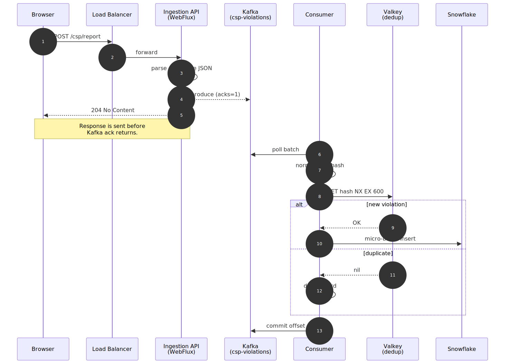
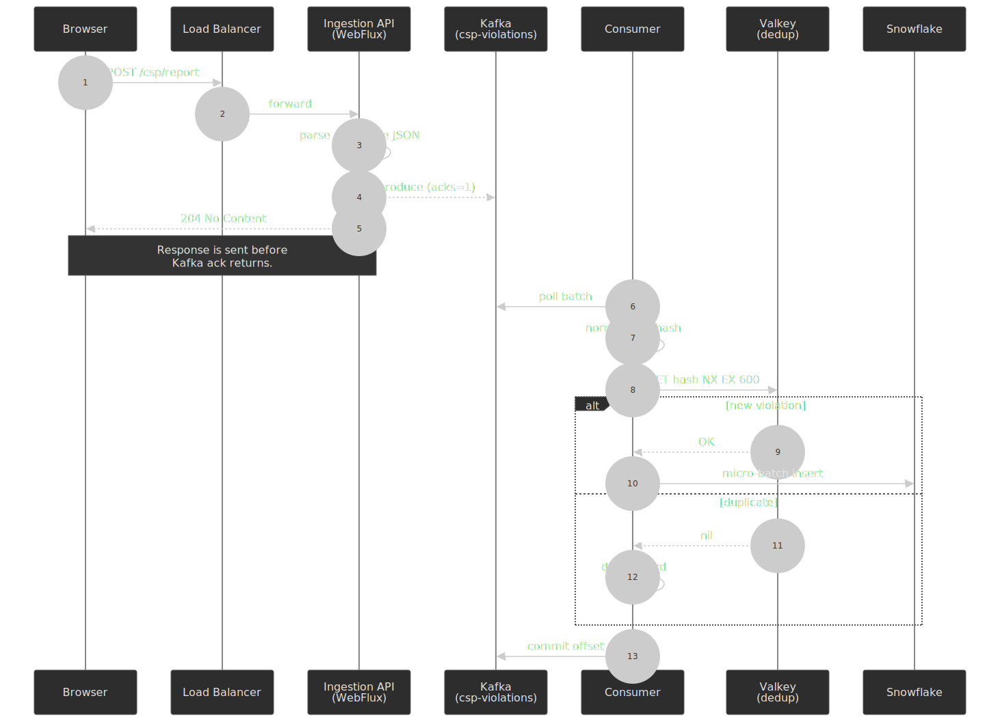

### 5.5 Component breakdown

#### 5.5.1 Ingestion service (API)

- **Implementation:** Spring WebFlux on Reactor Netty.
- **Responsibility:** validate JSON, dispatch to Kafka, return `204`. No database connection in scope.
- **SLO:** p99 latency under 5 ms inside the service mesh; the network path to the browser dominates everything else.

#### 5.5.2 Kafka layer

- **Topic:** `csp-violations`, replication factor 3, `min.insync.replicas=2`.
- **Partitions:** sized to the slower of producer or consumer throughput (see [§7.1](#71-sizing-formulas)).
- **Retention:** 24 hours — enough to ride out a half-day Snowflake outage; longer retention turns Kafka into a ledger, which is not its job here.

#### 5.5.3 Consumer service

- **Implementation:** Spring Boot with Reactor Kafka.
- **Loop:**
  1. Poll a batch from Kafka.
  2. Normalise both legacy and modern formats to a single internal record.
  3. Compute `dedup_hash = SHA256(document_uri || effective_directive || blocked_uri || user_agent)`.
  4. `SET hash NX EX 600` against Valkey; if the key already exists, drop the record.
  5. Buffer surviving records into a 100–250 MB micro-batch and write via Snowpipe Streaming.
  6. Commit the Kafka offset.

> [!CAUTION]
> Compute the hash against the *normalised* fields, not the raw JSON, otherwise the legacy and modern formats produce different hashes for the same physical violation and dedup collapses by half.

#### 5.5.4 Data storage

- **Production (Snowflake):** clustered by `(EVENT_DATE, EFFECTIVE_DIRECTIVE)` to match the dominant query pattern (per-day, per-directive aggregations).
- **Development (Postgres):** a single table with a GIN trigram index on `blocked_uri` to simulate Snowflake's full-text behaviour for local testing.

### 5.6 Internal schema (normalised)

| Field                | Type      | Description                                |
| :------------------- | :-------- | :----------------------------------------- |
| `EVENT_ID`           | UUID      | Synthesised at consume time                |
| `EVENT_TS`           | TIMESTAMP | Time of violation (browser `age` corrected)|
| `DOCUMENT_URI`       | STRING    | Page where the violation occurred          |
| `EFFECTIVE_DIRECTIVE`| STRING    | e.g. `script-src-elem`                     |
| `BLOCKED_URI`        | STRING    | The resource that was blocked              |
| `BLOCKED_HOST`       | STRING    | Derived from `BLOCKED_URI`                 |
| `USER_AGENT`         | STRING    | Browser UA (truncated)                     |
| `ORIGINAL_POLICY`    | STRING    | Full CSP header at violation time          |
| `SAMPLE`             | STRING    | Optional 40-char sample (when `'report-sample'` is set) |
| `VIOLATION_HASH`     | STRING    | Dedup key (SHA-256 over normalised fields) |
| `POLICY_VERSION`     | STRING    | Deploy / policy version for regression correlation |

### 5.7 Snowflake DDL (production)

```sql title="snowflake/csp_violations.sql" collapse={5-9}
CREATE TABLE CSP_VIOLATIONS (
  EVENT_ID             STRING DEFAULT UUID_STRING(),
  EVENT_TS             TIMESTAMP_LTZ NOT NULL,
  EVENT_DATE           DATE AS (CAST(EVENT_TS AS DATE)) STORED,
  DOCUMENT_URI         STRING,
  EFFECTIVE_DIRECTIVE  STRING,
  BLOCKED_URI          STRING,
  BLOCKED_HOST         STRING,
  USER_AGENT           STRING,
  ORIGINAL_POLICY      STRING,
  SAMPLE               STRING,
  VIOLATION_HASH       STRING,
  POLICY_VERSION       STRING
)
CLUSTER BY (EVENT_DATE, EFFECTIVE_DIRECTIVE);
```

### 5.8 Postgres DDL (development)

```sql title="postgres/csp_violations.sql" collapse={3-7}
CREATE TABLE csp_violations (
  event_id UUID PRIMARY KEY,
  event_ts TIMESTAMPTZ NOT NULL,
  document_uri TEXT,
  effective_directive TEXT,
  blocked_uri TEXT,
  blocked_host TEXT,
  user_agent TEXT,
  original_policy TEXT,
  sample TEXT,
  violation_hash TEXT,
  policy_version TEXT
);

CREATE INDEX idx_blocked_uri_trgm
  ON csp_violations USING gin (blocked_uri gin_trgm_ops);
```

## 6. Analysis and response

The pipeline's job is not to store reports — it is to drive **action**. The biggest hazard is that 60–95% of incoming reports are noise from sources that have nothing to do with your application, and a naive dashboard will bury the actionable signal under that noise.

### 6.1 False-positive triage

Every CSP team eventually arrives at the same triage tree. Apply it as code at stage 4 of [§4](#4-server-pipeline-shape) so that downstream dashboards never see the obvious noise:


| Source                                  | Signature                                                                                          | Action                          |
| :-------------------------------------- | :------------------------------------------------------------------------------------------------- | :------------------------------ |
| Browser extensions                      | `blocked-uri` or `source-file` starts with `chrome-extension://`, `moz-extension://`, `safari-web-extension://`, `ms-browser-extension://` | Drop at stage 4.                |
| Speculative / preload parser            | `blocked-uri` is `inline` with no `source-file` or `line-number`                                   | Drop at stage 4.                |
| Bookmarklets / userscripts              | `blocked-uri` is `eval` or `inline`, `referrer` empty, no `source-file`                            | Drop or quarantine for review.  |
| Antivirus / corporate proxy injection   | `blocked-uri` from known AV CDN domains, often inline analytics scripts                            | Drop at stage 4.                |
| ISP injection (HTTP only)               | `blocked-uri` from unfamiliar ad domains; impossible if the page itself is HTTPS                   | Surface — root cause is HTTP.   |
| `'unsafe-inline'` silent bypass         | Reports stop arriving for an extension that injects via background fetch + inline                  | Compensate with nonces + hashes.|

> [!WARNING]
> A CSP that allows `'unsafe-inline'` will **silently** miss extension-injected scripts that are fetched in the background and inserted as inline elements ([csp-bypass-verifier](https://github.com/patrick204nqh/csp-bypass-verifier) demonstrates the path on real traffic). The reporting pipeline can only ever surface what CSP actually blocks — keep the policy strict (nonces, hashes, `'strict-dynamic'`) so the report stream is an honest signal.

### 6.2 Surface what matters

Once the noise is out:

- **Top offenders.** Group surviving reports by `(blocked_host, effective_directive, policy_version)`. The first three rows are nearly always the next thing your team should fix.
- **Deploy-correlated regressions.** Tag every report with the `policy_version` (or build SHA) in scope when the report was emitted; surface any directive whose violation rate steps up after a deploy.
- **Trusted Types funnel.** Track `effective-directive = require-trusted-types-for` and `trusted-types` separately — they are the rollout signal for the next layer of XSS hardening.
- **Drop-rate alarms.** A sudden *fall* in dedup ratio, or a sudden *fall* in incoming RPS, is usually a regressed `report-uri` URL or a missing `Reporting-Endpoints` header — treat both as outage signals.

### 6.3 Alerting

| Alert                       | Trigger                                                                  | Why                                                                |
| :-------------------------- | :----------------------------------------------------------------------- | :----------------------------------------------------------------- |
| Spike                       | > 50% increase in violations over a 5-minute moving average              | Misconfigured policy or active exploitation attempt.                |
| Lag                         | Consumer lag > 1M messages                                               | Buffer is filling faster than the consumer can drain.               |
| Dedup-ratio drop            | Sudden fall below the historical band                                    | Valkey degraded — storage cost will spike.                          |
| Novel directive             | First time a `(blocked_host, effective_directive)` pair appears          | New third-party script — review before next deploy.                 |
| Trusted Types regression    | `require-trusted-types-for` violations > 0 on a previously clean policy  | Refactor introduced an unsafe DOM XSS sink.                         |

## 7. Scaling and capacity planning

### 7.1 Sizing formulas

Confluent's [partition-sizing heuristic](https://www.confluent.io/blog/how-choose-number-topics-partitions-kafka-cluster/) is the practical default: choose partition count $P$ from the slower of producer ($T_p$) and consumer ($T_c$) throughput per partition, with headroom for growth.

$$
P = \max \left( \frac{T_{target}}{T_p}, \frac{T_{target}}{T_c} \right) \times \text{GrowthFactor}
$$

For a 50k RPS baseline at ~1 KB per message:

- $T_{target}$ ≈ 50 MB/s
- $T_p$ ≈ 10 MB/s (commodity broker, `acks=1`, `lz4`)
- $T_c$ ≈ 5 MB/s (deserialisation + dedup lookup + buffer)
- Growth factor 1.5×

$$ P = \max(5, 10) \times 1.5 = 15 \text{ partitions (minimum)} $$

Provision 48 partitions instead — that is enough headroom for a ~5× burst without resharding, and aligns with the consumer pod parallelism in [§7.1 (Consumer pod count)](#consumer-pod-count).

#### Consumer pod count

$$
N_{pods} = \left\lceil \frac{RPS_{target}}{RPS_{per\_pod}} \times \text{Headroom} \right\rceil
$$

For 50k RPS with each pod sustaining 5k RPS and 30% headroom: $\lceil 50{,}000 / 5{,}000 \times 1.3 \rceil = 13$ pods.

### 7.2 Throughput tiers

| Tier       | RPS  | Throughput | API pods | Consumer pods | Kafka partitions |
| :--------- | :--- | :--------- | :------- | :------------ | :--------------- |
| Baseline   | 50k  | ~50 MB/s   | 4        | 12–14         | 48               |
| Growth     | 100k | ~100 MB/s  | 8        | 24–28         | 96               |
| High scale | 500k | ~500 MB/s  | 36       | 130+          | 512              |

Numbers above assume an average payload of ~1 KB and a dedup hit ratio of 70–90% (typical when bursts come from a small set of pages and browsers). Validate both assumptions on your traffic before sizing.

### 7.3 Scaling strategies

- **API:** scale on CPU (target 60%) — JSON parsing dominates; the network path is non-blocking.
- **Consumers:** scale on **Kafka consumer lag**, not CPU — processing depth is the real bottleneck and CPU stays low while the consumer waits on the storage write.
- **Storage:** prefer Snowpipe Streaming for continuous ingest; fall back to file-based Snowpipe when batching latency tolerance is generous.

## 8. Operations

### 8.1 Observability

- **Dashboards (Grafana):**
  - Overview — violations per minute, breakdown by directive.
  - Top offenders — top blocked hosts, top violating pages, top user-agent buckets.
  - System health — Kafka lag, API 5xx rate, end-to-end latency, dedup hit ratio.
- **Alerts:** see [§6.3](#63-alerting).

### 8.2 Kafka (AWS MSK)

| Setting                 | Recommended            | Rationale                                                                                                  |
| :---------------------- | :--------------------- | :--------------------------------------------------------------------------------------------------------- |
| `replication.factor`    | 3                      | Survives two broker failures.                                                                              |
| `min.insync.replicas`   | 2                      | Pair with `acks=all` if you ever toggle durability; with `acks=1` it is documentation more than guarantee. |
| `acks`                  | `1` (telemetry default), `all` (audit-grade override) | `acks=1` favours lower latency and higher throughput; `acks=all` favours durability — pick per workload, not per cluster. |
| `compression.type`      | `lz4` or `zstd`        | Compresses JSON well; CPU overhead is small enough at this payload size to be invisible.                   |
| `retention.ms`          | 24 hours               | Cost-bound buffer, not a ledger.                                                                           |

> [!NOTE]
> Specific latency numbers for `acks=1` versus `acks=all` are workload-dependent. The directional rule holds: `acks=1` returns as soon as the leader has appended; `acks=all` waits for the in-sync replica set. Measure on your cluster before committing the SLO.

### 8.3 Spring WebFlux on Netty (Java 25)

- **Allocator:** prefer pooled direct buffers — `-Dio.netty.allocator.type=pooled` reduces GC pressure on the request path. `-Dio.netty.leakDetection.level=DISABLED` is acceptable in production once the integration tests cover allocator paths.
- **Event-loop threads:** cap at the CPU core count to avoid context-switch overhead under bursty load.
- **Garbage collector:** ZGC. From JDK 24+, generational ZGC is the only mode and `-XX:+ZGenerational` is obsolete (warned and ignored, per [JEP 490](https://openjdk.org/jeps/490)) — just enable ZGC:

  ```bash title="jvm-args.sh"
  -XX:+UseZGC \
    -Xmx4g -Xms4g
  ```

  ZGC's design target is sub-millisecond max pauses; observed p99 pauses on this workload tend to fall comfortably under 1 ms when the heap is sized so the allocation rate stays inside ZGC's concurrent-marking budget — measure on your traffic before treating that as a guarantee.

### 8.4 Snowflake ingestion

- **Snowpipe Streaming** is the preferred path for Kafka-driven ingest. The [Snowflake Kafka Connector with Snowpipe Streaming](https://docs.snowflake.com/en/user-guide/snowpipe-streaming/snowpipe-streaming-classic-kafka) writes row-by-row through long-lived channels, avoiding the S3-stage round trip and giving sub-five-second visibility.
  - Snowflake has [announced](https://docs.snowflake.com/en/user-guide/snowpipe-streaming/snowpipe-streaming-classic-deprecation) that the Classic Streaming architecture will be deprecated mid-2026 with an 18-month sunset; new pipelines should target the High-Performance architecture.
- **File-based Snowpipe** still works for bulk replays and back-fills. Stage [100–250 MB compressed files](https://docs.snowflake.com/en/user-guide/data-load-considerations-prepare) — smaller files spend more time on per-file overhead, larger files lose parallelism inside the warehouse.
- **Direct `COPY INTO`** is fine below ~10k RPS; above that, the warehouse spends more time on micro-batches than on actual loading.

## 9. Failure modes

### 9.1 Report-format variations

| Variation                | Source                                                              | Handling                                          |
| :----------------------- | :------------------------------------------------------------------ | :------------------------------------------------ |
| Missing `blocked-uri`    | Inline-script violations                                            | Substitute the literal `"inline"`                  |
| Truncated `sample`       | Reporting API limit                                                 | Accept the spec maximum (40 chars) verbatim       |
| Extension-origin reports | `moz-extension://`, `chrome-extension://`, `safari-web-extension://` | Drop at the consumer — never user-actionable      |
| Empty `referrer`         | Privacy settings                                                    | Normalise to `null`                               |
| Query strings in URIs    | Standard browser behaviour                                          | Strip for hashing, preserve in storage            |
| Mixed legacy + modern    | Pages with both `report-uri` and `report-to`                        | The hash dedupes them (normalise first, then hash)|

### 9.2 Failure scenarios

The pipeline is built so that each downstream component can fail without dragging the others down:


- **Kafka unavailable.** WebFlux still returns `204` and the report is dropped. Acceptable for telemetry; for stricter guarantees, wrap the producer in a circuit breaker and spill to a local buffer. Track the producer-failure rate as an SLI.
- **Valkey unavailable.** The consumer continues without dedup, all reports flow to storage. Storage cost spikes; alert on Valkey error rate so the on-call can drain the storm.
- **Snowflake ingest lag.** Kafka acts as a 24-hour buffer. If lag exceeds retention, the oldest messages are truncated. Consumer lag is the primary SLI — page on it before the buffer is half full.
- **Dedup hash collisions.** SHA-256 collisions are negligible at any throughput we will ever see; SHA-1 is acceptable for this purpose but offers no upside, and the 256-bit hash trims downstream by removing one source of low-grade risk.

### 9.3 Deduplication window — state model

The 10-minute window is a single Valkey key per `VIOLATION_HASH` with `EX 600`. Three things to keep in mind:


- The window is per `(document, directive, blocked URI, UA)` — a different page or a different directive will not collapse.
- TTL is the only way back to `Unseen`. If you need to surface "this violation is still happening hours later", aggregate downstream in Snowflake; do not extend the dedup TTL.
- A Valkey failover loses the in-flight window. The consumer will write what would otherwise have been dropped; this is intentional and self-correcting.

### 9.4 Known limitations

- **No per-user rate limiting.** Push abusive clients to a WAF or upstream rate-limit at the load balancer.
- **No replay capability.** Once Kafka retention expires, data cannot be reprocessed from source. Snowflake is the system of record after that point.
- **Per-POST batching is opportunistic.** The Reporting API does *not* guarantee that a browser batches reports — expect single-report POSTs in many cases ([Reporting §3.5.2](https://www.w3.org/TR/reporting-1/#try-delivery)).
- **Cross-origin endpoints get no cookies.** [Reporting §3.5.2](https://www.w3.org/TR/reporting-1/#try-delivery) sets credentials to `same-origin`; cross-origin endpoints will receive no cookies, must be served over HTTPS, and must respond to the browser's preflight `OPTIONS` with appropriate `Access-Control-Allow-*` headers.

## Conclusion

Three decisions carry the design:

1. **Fire-and-forget ingestion.** WebFlux returns `204` before Kafka acknowledges, isolating browser-perceived latency from every downstream failure mode.
2. **Kafka as a buffer, not a ledger.** A 24-hour retention window absorbs ~10× spikes and lets Snowflake be slow when it needs to be — without backpressure leaking back to the API.
3. **Short Valkey deduplication.** Cuts 70–90% of duplicate volume before it ever touches storage, which is what makes the Snowflake bill tractable at this throughput.

On the browser side, the only sustainable posture in April 2026 is to ship `report-uri` and `report-to` (with `Reporting-Endpoints`) on every CSP, treat the in-page `securitypolicyviolation` event as an additional signal rather than the primary one, and stage every policy change behind `Content-Security-Policy-Report-Only` first.

The design explicitly trades durability for latency — the right call for telemetry, the wrong call for audit logs. To turn it into an audit-grade pipeline, raise the producer to `acks=all`, extend Kafka retention, and add browser-side retry with idempotency keys.

## Appendix

### Prerequisites

- Familiarity with streaming pipelines (Kafka producer/consumer model, partitioning, consumer groups).
- Working understanding of CSP headers, directives, and the difference between `report-uri` and the Reporting API.
- Comfort with OLAP vs OLTP trade-offs (clustering, micro-partitions, file-size sensitivity).
- Operational experience with Kubernetes HPA driven by external metrics (Kafka lag).

### Terminology

| Term                      | Definition                                                                                            |
| :------------------------ | :---------------------------------------------------------------------------------------------------- |
| **CSP**                   | Content Security Policy — browser security mechanism that restricts resource loading                  |
| **Reporting API**         | W3C-spec'd report-delivery infrastructure used by `report-to` (replaces the deprecated `Report-To` header) |
| **`Reporting-Endpoints`** | Modern HTTP response header that names the endpoints `report-to` directives can route to              |
| **Trusted Types**         | W3C spec layered on CSP that locks DOM XSS sinks to non-spoofable typed values                        |
| **Fire-and-forget**       | Pattern where the sender does not wait for acknowledgement                                            |
| **HPA**                   | Horizontal Pod Autoscaler — Kubernetes component for scaling on metrics                               |
| **OLAP**                  | Online Analytical Processing — optimised for aggregate queries over large datasets                    |
| **Snowpipe Streaming**    | Snowflake's row-level continuous ingestion mode (high-performance architecture)                       |
| **ZGC**                   | Z Garbage Collector — low-latency JVM GC; generational-only since JDK 24                              |

### Summary

- CSP violations show up both **in-page** (`SecurityPolicyViolationEvent`) and **out-of-band** (Reporting API POST). Production pipelines consume the second; the first is useful for instrumentation and Trusted Types rollouts.
- `Reporting-Endpoints` + `report-to` is the modern path but is **Chromium-only** in April 2026 — keep `report-uri` alongside for Firefox and Safari coverage.
- Always stage policy changes behind `Content-Security-Policy-Report-Only` first; the same pattern applies to Trusted Types via `require-trusted-types-for` and `trusted-types`.
- Server pipelines pass through the same six logical stages — ingest, validate, enrich, route+dedup, store, alert — regardless of which streaming or storage tech sits underneath.
- Treat 60–95% of incoming reports as noise; apply false-positive triage at the routing stage before anything reaches a dashboard.
- Fire-and-forget ingestion (`204` immediate response) keeps browser-perceived latency independent of backend health.
- Kafka buffers absorb traffic spikes and decouple ingestion from processing; retention is a cost-bound buffer, not a ledger.
- A short Valkey dedup window collapses 70–90% of duplicate volume before it reaches storage.
- Snowflake clustering by date and directive matches the dominant query pattern; Snowpipe Streaming is the preferred ingest path for Kafka.
- Scale consumers on Kafka lag, not on CPU — processing depth is the real bottleneck.

### References

#### Specifications

- [W3C Content Security Policy Level 3](https://www.w3.org/TR/CSP3/) — authoritative CSP spec.
  - [§3.2 `Content-Security-Policy-Report-Only`](https://www.w3.org/TR/CSP3/#cspro-header)
  - [§5.1 `SecurityPolicyViolationEvent` IDL](https://www.w3.org/TR/CSP3/#cspviolationreport-and-securitypolicyviolationevent)
  - [§5.3 Obtain the deprecated serialization of violation](https://www.w3.org/TR/CSP3/#deprecated-serialize-violation)
  - [§5.5 Report a violation](https://www.w3.org/TR/CSP3/#report-violation)
  - [§6.5.1 `report-uri`](https://www.w3.org/TR/CSP3/#directive-report-uri) and [§6.5.2 `report-to`](https://www.w3.org/TR/CSP3/#directive-report-to)
- [W3C Reporting API (WD 2025-06-11)](https://www.w3.org/TR/reporting-1/) — modern reporting infrastructure used by `report-to`.
  - [§3.2 The `Reporting-Endpoints` HTTP Response Header Field](https://www.w3.org/TR/reporting-1/#header)
  - [§3.5.2 Attempt to deliver reports to endpoint](https://www.w3.org/TR/reporting-1/#try-delivery)
- [W3C Trusted Types](https://www.w3.org/TR/trusted-types/) — DOM XSS sink hardening on top of CSP.
  - [`require-trusted-types-for` directive](https://www.w3.org/TR/trusted-types/#require-trusted-types-for-csp-directive)
  - [`trusted-types` directive](https://www.w3.org/TR/trusted-types/#trusted-types-csp-directive)
- [W3C Network Error Logging](https://w3c.github.io/network-error-logging/) — sibling Reporting API consumer; useful contrast.

#### CSP implementation

- [MDN: `SecurityPolicyViolationEvent`](https://developer.mozilla.org/en-US/docs/Web/API/SecurityPolicyViolationEvent) — Baseline Widely available since 2018.
- [MDN: `Content-Security-Policy: report-uri`](https://developer.mozilla.org/en-US/docs/Web/HTTP/Reference/Headers/Content-Security-Policy/report-uri) — legacy `application/csp-report` body.
- [MDN: `Content-Security-Policy: report-to`](https://developer.mozilla.org/en-US/docs/Web/HTTP/Reference/Headers/Content-Security-Policy/report-to) — directive that names a `Reporting-Endpoints` entry.
- [MDN: `Reporting-Endpoints` header](https://developer.mozilla.org/en-US/docs/Web/HTTP/Reference/Headers/Reporting-Endpoints) — modern endpoint configuration; replaces `Report-To`.
- [MDN: `Report-To` header](https://developer.mozilla.org/en-US/docs/Web/HTTP/Reference/Headers/Report-To) — deprecated; use `Reporting-Endpoints`.
- [Chrome for Developers: Monitor your web application with the Reporting API](https://developer.chrome.com/docs/capabilities/web-apis/reporting-api).

#### Vendor ingest reality

- [Sentry: Set Up Security Policy Reporting](https://docs.sentry.io/platforms/javascript/guides/solid/security-policy-reporting/) — query-string-based key in the legacy URL; modern path tracked in [getsentry/sentry#52794](https://github.com/getsentry/sentry/issues/52794).
- [Datadog: Monitor Content Security Policy violations](https://www.datadoghq.com/blog/content-security-policy-reporting-with-datadog/) — `report-uri` ingest with a client token in the query string.
- [Cloudflare Page Shield: Connection Monitor](https://blog.cloudflare.com/page-shield-connection-monitor/) — sampled `Content-Security-Policy-Report-Only` injected at the edge.

#### Triage and policy hardening

- [Troy Hunt — Add-ons, Extensions and CSP Violations](https://www.troyhunt.com/add-ons-extensions-and-csp-violations-playing-nice-with-content-security-policies/).
- [DebugBear — CSP Error Noise Caused by Chrome Extensions](https://www.debugbear.com/blog/chrome-extension-csp-error-noise).
- [csp-bypass-verifier](https://github.com/patrick204nqh/csp-bypass-verifier) — demonstrates the `'unsafe-inline'` background-fetch silent bypass.
- [Google CSP Evaluator](https://csp-evaluator.withgoogle.com/) — static analysis for common policy weaknesses; pair with the report stream.

#### Technology stack

- [Oracle Java 25 announcement](https://www.oracle.com/news/announcement/oracle-releases-java-25-2025-09-16/) — released 2025-09-16.
- [Spring Boot 4.0.0 GA](https://spring.io/blog/2025/11/20/spring-boot-4-0-0-available-now/) — released 2025-11-20.
- [Spring Framework 7.0 GA](https://spring.io/blog/2025/11/13/spring-framework-7-0-general-availability/) — released 2025-11-13.
- [Apache Kafka 4.0 release announcement](https://kafka.apache.org/blog/2025/03/18/apache-kafka-4.0.0-release-announcement/) — released 2025-03-18; KRaft default.
- [AWS MSK adds Kafka 4.0 support](https://aws.amazon.com/about-aws/whats-new/2025/05/amazon-msk-apache-kafka-version-4-0/) — May 2025.
- [AWS ElastiCache: Valkey 8.0](https://aws.amazon.com/about-aws/whats-new/2024/11/elasticache-version-8-0-for-valkey-scaling-memory-efficiency/) and [Valkey 8.1](https://aws.amazon.com/about-aws/whats-new/2025/07/amazon-elasticache-valkey-8-1/).
- [PostgreSQL 18 release](https://www.postgresql.org/about/news/postgresql-18-released-3142/) — released 2025-09-25.

#### Performance and scaling

- [Confluent: How to choose Kafka partition count](https://www.confluent.io/blog/how-choose-number-topics-partitions-kafka-cluster/) — `max(t/p, t/c)` heuristic.
- [Snowflake: preparing data files](https://docs.snowflake.com/en/user-guide/data-load-considerations-prepare) — 100–250 MB compressed sweet spot.
- [Snowflake Kafka Connector with Snowpipe Streaming](https://docs.snowflake.com/en/user-guide/snowpipe-streaming/snowpipe-streaming-classic-kafka).
- [Snowpipe Streaming Classic deprecation notice](https://docs.snowflake.com/en/user-guide/snowpipe-streaming/snowpipe-streaming-classic-deprecation) — High-Performance architecture is the successor.
- [JEP 439: Generational ZGC](https://openjdk.org/jeps/439) and [JEP 490: Remove the non-generational mode of ZGC](https://openjdk.org/jeps/490).
