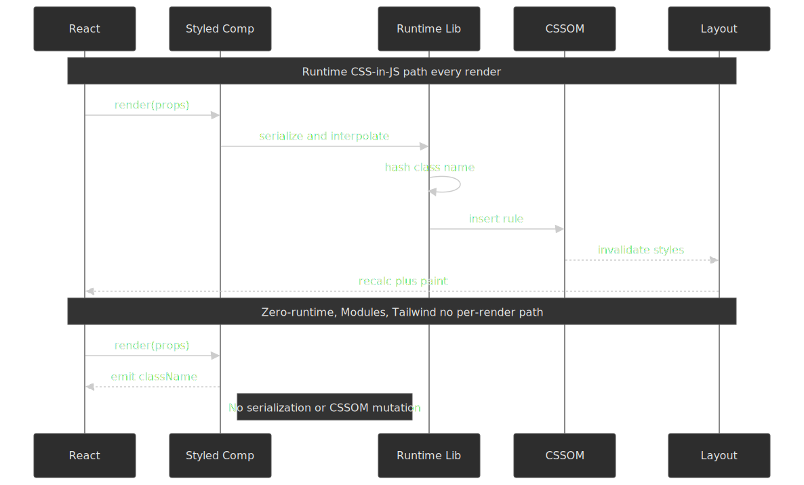

# CSS Architecture Strategies: BEM, Utility-First, and CSS-in-JS

Every CSS architecture answers the same question: how do you organize styles so that a growing team can ship changes without breaking existing UI? The answer involves trade-offs between naming discipline, tooling overhead, runtime cost, and the dependency direction between markup and styles. This article dissects the three dominant paradigms — naming conventions (BEM and descendants), utility-first systems (Tailwind CSS, UnoCSS), and CSS-in-JS (runtime and zero-runtime variants) — then maps the modern CSS platform features that are collapsing the gaps between them.

) are absorbing problems each strategy was invented to solve.")


## Mental Model: Dependency Direction

CSS architecture is fundamentally about **dependency direction**: does CSS depend on HTML structure (semantic class names that mirror content), or does HTML depend on CSS (utility classes that compose pre-built style primitives)? This single axis — popularized by Adam Wathan in his 2017 essay [*CSS Utility Classes and Separation of Concerns*](https://adamwathan.me/css-utility-classes-and-separation-of-concerns/) and implicit in OOCSS a decade earlier — determines your specificity strategy, dead code story, refactoring cost, and team onboarding friction.

 hash both sides together so neither needs to know the other's name.")


The three paradigms form a spectrum:

| Strategy                       | Dependency direction       | Scope mechanism                | Dead code story         | Runtime cost              |
| ------------------------------ | -------------------------- | ------------------------------ | ----------------------- | ------------------------- |
| **BEM / naming conventions**   | CSS mirrors HTML structure | Convention (human discipline)  | Manual auditing         | None                      |
| **Utility-first**              | HTML composes CSS classes  | Constraint (fixed token set)   | Build-time tree-shaking | None                      |
| **CSS-in-JS (runtime)**        | Co-located, JS emits CSS   | Automatic (hashed classes)     | Bundler tree-shaking    | CSSOM injection per render |
| **CSS-in-JS (zero-runtime)**   | Co-located, build emits CSS | Automatic (hashed classes)    | Bundler tree-shaking    | None                      |
| **CSS Modules**                | Co-located, build hashes names | Automatic (hashed classes) | Bundler tree-shaking    | None                      |

Modern CSS features — Cascade Layers (`@layer`), native nesting, `@scope`, and `:has()` — do not replace these paradigms but shift where their boundaries fall. `@layer` solves specificity wars that BEM was invented to avoid. Native nesting reduces the preprocessor dependency that naming conventions relied on. Zero-runtime CSS-in-JS converges with utility-first at the output level: both produce static atomic CSS.

## The CSS Scaling Problem

Before comparing strategies, it helps to name the four problems every CSS architecture must solve at scale.

### Specificity Conflicts

The CSS cascade resolves conflicts by [origin, importance, layer order, specificity, and source order](https://www.w3.org/TR/css-cascade-5/#cascade) — in that order. In a large codebase, uncoordinated selectors accumulate specificity that becomes unpredictable. The classic failure mode: developers reach for `!important` to win a local fight, which escalates the arms race. Every team that has scaled global CSS has ended up writing some flavour of "we adopted utility classes to escape `!important` debt" — Diana Mounter [tells exactly that story for GitHub's Primer](https://broccolini.net/2018/design-systems-at-github), describing how introducing utility classes was the way to "tame legacy CSS" without a full rewrite.

The W3C [CSS Cascading and Inheritance Level 5](https://www.w3.org/TR/css-cascade-5/#layering) specification introduced Cascade Layers (`@layer`) specifically to address this. Layers are evaluated **before** specificity in the cascade algorithm, giving authors deterministic ordering without specificity hacks.




### Naming Collisions

Global CSS means every class name shares a single namespace. Two developers writing `.card` in different files will collide. BEM solves this through convention (`.block__element--modifier`). CSS Modules and CSS-in-JS solve it through tooling (hashed class names). Utility-first sidesteps it entirely — there is nothing to name because you compose existing classes.

### Dead Code Accumulation

CSS is append-only in practice. Removing a class requires proving no template references it — a whole-codebase search that most teams skip. Over years, stylesheets accumulate unused rules. The [HTTP Archive Web Almanac 2024 CSS chapter](https://almanac.httparchive.org/en/2024/css) reports the median page now ships ~70 KB of CSS, with Lighthouse audits routinely surfacing 30–60% unused on first load. Utility-first and CSS-in-JS both tie style generation to template usage, making dead code elimination automatic.

### Coupling Between Markup and Styles

Semantic CSS couples styles to content structure: `.author-bio` only makes sense in one context. Refactoring the markup means refactoring the CSS. Utility classes invert this — styles are content-agnostic. CSS-in-JS co-locates them, making the coupling explicit and local rather than implicit and distant.

## Naming Conventions: BEM and Its Descendants

The naming-convention family did not arrive in one piece. OOCSS, BEM and SMACSS each addressed a different scaling pain point in the late 2000s; ITCSS, Atomic CSS, CUBE, and the modern utility engines build on top of them. The lattice below is the lineage every team eventually has to reason about — even if their stack is "just Tailwind".

; the modern utility engines (Tailwind, UnoCSS, CUBE) and the tooling-enforced systems (CSS Modules, runtime and zero-runtime CSS-in-JS) inherit from those roots and converge on the same output: small, scoped, statically extractable class atoms.")


### BEM (Block Element Modifier)

[BEM (Block Element Modifier)](https://en.bem.info/methodology/), created by Yandex in 2005 and open-sourced in 2010, is a naming convention that encodes component structure into class names. The format `block__element--modifier` creates a flat specificity profile (single class selectors only) while communicating relationships.

```css title="BEM naming pattern"
/* Block: standalone component */
.search-form { }

/* Element: part of the block (double underscore) */
.search-form__input { }
.search-form__button { }

/* Modifier: variant or state (double hyphen) */
.search-form--dark { }
.search-form__button--disabled { }
```

**Design rationale.** BEM enforces single-class selectors, keeping specificity uniformly at `(0,1,0)`. No nesting, no combinators, no IDs. This means source order is the only tiebreaker — and since BEM components are self-contained, source order rarely matters within a component.

**Where BEM breaks down:**

- **Cross-component styling.** When a `.card` inside a `.sidebar` needs different spacing, BEM offers no clean mechanism. Teams resort to context-dependent modifiers (`.card--in-sidebar`) that violate the component isolation principle.
- **State management.** Interactive states like `.is-active` or `.is-open` require a separate convention that BEM does not prescribe, leading to inconsistent patterns across teams.
- **Verbose naming.** Deep component trees produce names like `.dashboard__sidebar__nav-item--active`, which is unwieldy. Harry Roberts (creator of ITCSS, prominent BEM advocate) recommends flattening: avoid nesting elements more than one level.
- **No enforcement.** BEM is pure convention. Nothing prevents a developer from writing `.search-form .input` — a nested selector that defeats the entire purpose. Linting rules (e.g. [`stylelint-selector-bem-pattern`](https://github.com/postcss/postcss-bem-linter)) help but require explicit adoption.

### OOCSS (Object-Oriented CSS)

[Nicole Sullivan introduced OOCSS](https://github.com/stubbornella/oocss/wiki) at Web Directions North in 2009 with two principles: **separate structure from skin** (layout vs. visual decoration) and **separate container from content** (a component should look the same regardless of where it appears).

OOCSS anticipated the utility-first movement. The `.media` object — a floated image beside text — was one of the first reusable CSS abstractions, appearing in Bootstrap's media component and countless design systems.

### SMACSS and ITCSS: Layered Organization

[SMACSS (Scalable and Modular Architecture for CSS)](http://smacss.com/), created by Jonathan Snook in 2011, categorizes rules into five types: Base, Layout, Module, State, and Theme. [ITCSS (Inverted Triangle CSS)](https://csswizardry.com/2018/11/itcss-and-skillshare/), created by Harry Roberts, orders CSS from generic to specific: Settings, Tools, Generic, Elements, Objects, Components, Utilities — a specificity pyramid where each layer has higher specificity than the one before it.

Both are organizational frameworks, not naming conventions. They prescribe *file structure and import order* to manage the cascade. ITCSS's insight is particularly relevant: by ordering imports from low to high specificity, later rules naturally override earlier ones without `!important`.

> [!NOTE]
> **Modern equivalent.** Tailwind CSS v4 uses native CSS `@layer` directives (`theme`, `base`, `components`, `utilities`) to achieve the same specificity ordering that ITCSS prescribed through file conventions. The platform now provides what ITCSS simulated — see [the v4 architecture notes](https://tailwindcss.com/blog/tailwindcss-v4#designed-for-the-modern-web).

### CUBE CSS: Convention Meets Utility

Andy Bell's [CUBE CSS (Composition Utility Block Exception)](https://cube.fyi/) is a hybrid methodology that embraces utility classes for the common case and reserves BEM-style blocks for exceptions — specific overrides that break the general pattern. The "Composition" layer handles layout using flow and spacing primitives rather than component-specific positioning.

CUBE represents the philosophical middle ground: use utilities where they suffice, fall back to named classes for genuinely unique styling.

### When Naming Conventions Still Make Sense

Naming conventions remain relevant when:

- **No build step is available** (static sites, CMS templates, email HTML).
- **Team has established BEM fluency** and the codebase is stable.
- **Third-party CSS integration** requires predictable class names for overrides.
- **Server-rendered content** where markup is generated by backend templates (Rails, Django, PHP) and component extraction is impractical.

The cost is perpetual vigilance: no tool enforces the convention, dead code accumulates, and specificity discipline depends entirely on code review.

## Utility-First CSS

### The Dependency Direction Insight

Adam Wathan's 2017 essay [*CSS Utility Classes and Separation of Concerns*](https://adamwathan.me/css-utility-classes-and-separation-of-concerns/) reframed the architecture debate. The traditional model — semantic class names that describe content — creates CSS that depends on HTML structure. Renaming a component means renaming its CSS. Wathan inverted this: utility classes are content-agnostic primitives that HTML composes, making the CSS reusable across any context.

The practical observation: "For the project you're working on, what would be more valuable: restyleable HTML, or reusable CSS?" For most component-driven applications, the answer is reusable CSS.

### Tailwind CSS v4 Architecture

Tailwind CSS v4.0 [shipped on January 22, 2025](https://tailwindcss.com/blog/tailwindcss-v4) and underwent a foundational rewrite:

**Oxide engine.** The core was rewritten from JavaScript to Rust, integrating [Lightning CSS](https://lightningcss.dev/) for vendor prefixing and syntax transforms. The launch announcement reports full builds completing ~5× faster than v3.4 (378 ms → 100 ms median), incremental rebuilds with new CSS ~9× faster (44 ms → 5 ms), and incremental rebuilds with no new CSS over 100× faster — measured in microseconds (192 µs).

**CSS-first configuration.** The JavaScript `tailwind.config.js` is replaced by CSS-native [`@theme` directives](https://tailwindcss.com/docs/theme):

```css title="tailwind-v4-config.css" collapse={1-2}
@import "tailwindcss";

@theme {
  --color-primary: #2563eb;
  --color-surface: #fefefe;
  --font-sans: "Inter", system-ui, sans-serif;
  --breakpoint-lg: 1024px;
}
```

Tokens declared in `@theme` serve dual purpose: they generate utility classes (`bg-primary`, `text-surface`) **and** are available as CSS custom properties at runtime, eliminating the dual-maintenance problem of v3.

**Native Cascade Layers.** v4 uses real CSS `@layer` for `theme`, `base`, `components`, and `utilities`. This gives deterministic specificity ordering: utilities always override components regardless of source order — the exact problem ITCSS solved through file conventions.

**Automatic content detection.** No `content` paths configuration. The Oxide engine scans the project automatically, eliminating a common source of "missing class" bugs.

> [!NOTE]
> **Prior to v4:** Tailwind v3 used a JavaScript-based JIT compiler, required explicit `content` path configuration, and relied on PostCSS as its build pipeline. Configuration lived in `tailwind.config.js`, and design tokens had to be duplicated as CSS custom properties if runtime access was needed.

### Bundle Size and Tree-Shaking

Tailwind's Just-In-Time compiler ([on-demand mode introduced in v2.1](https://tailwindcss.com/blog/tailwindcss-v2-1) and the default since v3.0) generates CSS only for classes found in templates. Production output is typically under 10 KB compressed. Per Tailwind's own [optimisation docs](https://tailwindcss.com/docs/optimizing-for-production), Netflix's *Top 10* site ships 6.5 KB of CSS using Tailwind.

A critical constraint: class names must be **statically extractable**. The JIT compiler scans files as strings — it does not evaluate JavaScript. Dynamic class construction like `` `text-${color}-500` `` breaks extraction. Complete class names must appear in source:

```ts title="dynamic-classes.ts"
// Breaks tree-shaking — class name is not statically extractable
const cls = `text-${color}-500`

// Works — complete class names are scannable
const colorMap = { red: "text-red-500", blue: "text-blue-500" }
const cls = colorMap[color]
```

### The @apply Tension

Tailwind provides `@apply` to extract utility patterns into named classes. The Tailwind team explicitly discourages heavy use. Wathan's position, repeated across [GitHub discussions](https://github.com/tailwindlabs/tailwindcss/discussions/3905) and the docs, is that using `@apply` for everything means you "are basically just writing CSS again and throwing away all of the workflow and maintainability advantages Tailwind gives you."

Valid `@apply` use cases are narrow:

- **CMS/WYSIWYG content** where you cannot control markup classes.
- **Third-party library overrides** where you must target specific selectors.
- **Template languages** (ERB, Twig, Jinja) where component extraction is impractical.

For component frameworks (React, Vue, Svelte, Astro), the component itself is the abstraction. A `<Button>` component encapsulates its utility classes; there is no duplication to extract.

### UnoCSS: The Extensible Alternative

Anthony Fu's [UnoCSS](https://unocss.dev/) (Vue/Vite core team) takes a different approach: an "instant atomic CSS engine" with a fully extensible preset system. It ships Tailwind-compatible, WindiCSS-compatible, and Attributify presets (utilities as HTML attributes like `<div text="lg" p="4">`).

Performance claims [in Anthony Fu's *Reimagine Atomic CSS* essay](https://antfu.me/posts/reimagine-atomic-css) are dramatic — up to 200× faster than Tailwind's v3 JIT — though the practical difference is negligible since both produce sub-second builds. The real differentiator is extensibility: UnoCSS lets teams define entirely custom utility systems, while Tailwind provides a fixed vocabulary with escape hatches.

### Utility-First Limitations

**HTML readability.** Utility-heavy markup is visually dense. A styled button can accumulate 10–15 classes. This is the most common criticism and the primary source of team resistance.

**Learning curve.** Developers must learn the utility vocabulary (Tailwind has ~500 core utilities). The payoff is speed after the learning curve — but the curve is real.

**Design drift without tokens.** Arbitrary value syntax (`w-[137px]`) bypasses the design token system. Without team discipline or linting, arbitrary values proliferate and consistency degrades. The [`eslint-plugin-tailwindcss`](https://github.com/francoismassart/eslint-plugin-tailwindcss) plugin and Tailwind's strict-mode tooling help enforce token usage.

**Responsive and state complexity.** Variants stack: `sm:hover:dark:focus-visible:ring-2` is valid but difficult to parse visually. This compounds the readability issue for complex responsive designs.

## CSS-in-JS: Co-location with Trade-offs

CSS-in-JS (CSS-in-JavaScript) emerged from the React ecosystem's desire to co-locate styles with component logic. The approach eliminates naming collisions through generated class names and enables dynamic styling through JavaScript expressions.

### Runtime CSS-in-JS: styled-components and Emotion

[styled-components](https://styled-components.com/) (released 2016 by Max Stoiber and Glen Maddern) and [Emotion](https://emotion.sh/docs/introduction) (released 2017 by Kye Hohenberger) dominate the runtime category. Both generate CSS at render time and inject it into the document via `<style>` tags or CSSOM (CSS Object Model) APIs.

```tsx title="styled-components-example.tsx" collapse={1-3}
import styled from "styled-components"

// CSS is generated at runtime and injected into <style> tags
const Button = styled.button<{ $primary?: boolean }>`
  padding: 0.5rem 1rem;
  border-radius: 0.375rem;
  background: ${(props) => (props.$primary ? "#2563eb" : "transparent")};
  color: ${(props) => (props.$primary ? "white" : "#2563eb")};
  border: 1px solid #2563eb;
`
```

**The runtime cost is real.** Every render that touches styled components walks a serialise → hash → inject → invalidate pipeline that build-time strategies skip entirely:

 skip this loop entirely — components emit pre-computed class names from a build-time map.")


Sam Magura's widely-cited 2022 analysis [*Why We're Breaking Up with CSS-in-JS*](https://dev.to/srmagura/why-were-breaking-up-wiht-css-in-js-4g9b) (written as an Emotion maintainer) measured the overhead directly: profiling Spot's "Member Browser" component on an M1 Max, Emotion rendered in 54.3 ms median versus 27.7 ms with Sass Modules — a 48% reduction (≈2× speed-up). The team migrated to CSS Modules with Sass.

Airbnb ran a similar migration from `react-with-styles` to Linaria and [published the A/B test results](https://medium.com/airbnb-engineering/airbnbs-trip-to-linaria-dc169230bd12): converting roughly 10% of homepage components delivered a +1.6% Total Blocking Time improvement (mean 1200 ms), a +0.54% First Contentful Paint improvement, and a +0.26% Page Performance Score improvement. Assuming linear scaling, full migration projected ≈+16% TBT, ≈+5.4% FCP, and ≈+2.6% Page Performance Score.

**Bundle size overhead.** Runtime libraries add non-trivial weight to the JavaScript bundle:

| Library                                  | Gzipped size | Runtime cost                                |
| ---------------------------------------- | ------------ | ------------------------------------------- |
| styled-components                        | ~15–20 KB    | Style serialization + injection per render  |
| Emotion (`@emotion/react` + `styled`)    | ~11–13 KB    | Style serialization + injection per render  |
| Linaria                                  | < 1 KB       | Class name utility only                     |
| vanilla-extract                          | 0 KB         | Build-time extraction, no runtime           |
| CSS Modules                              | 0 KB         | Build-time extraction, no runtime           |

**Server-Side Rendering (SSR) complications.** Runtime CSS-in-JS requires collecting generated styles during server rendering and injecting them into the HTML response to avoid a Flash of Unstyled Content (FOUC). styled-components' [`ServerStyleSheet`](https://styled-components.com/docs/advanced#server-side-rendering) and Emotion's [`extractCritical`](https://emotion.sh/docs/ssr) add complexity to the SSR pipeline. React 18's streaming SSR (`renderToPipeableStream`) compounds this: HTML is sent chunk by chunk, but runtime CSS-in-JS needs all styles resolved before the `<head>` is sent.

React 18 introduced [`useInsertionEffect`](https://react.dev/reference/react/useInsertionEffect) specifically for CSS-in-JS style injection, but styled-components never adopted it — Sanity's drop-in fork [`@sanity/styled-components`](https://www.sanity.io/blog/cut-styled-components-into-pieces-this-is-our-last-resort) measured ≈40% faster renders after wiring it in.

**React Server Components (RSC) and the styling boundary.** [RSC](https://react.dev/reference/rsc/server-components) forbids client-side JavaScript, Context, and hooks inside server components. Runtime CSS-in-JS depends on all three: JavaScript for style serialization, Context for theming (`<ThemeProvider>`), and `useInsertionEffect` for injection. styled-components 6.3+ ships an [App Router-compatible inline-injection mode](https://styled-components.com/docs/advanced#nextjs), but `ThemeProvider` is a no-op outside the `"use client"` tree — the docs themselves recommend CSS custom properties for theming and warn about `:nth-child()` collisions with the injected `<style>` tags. Emotion has no equivalent first-class story. In practice, runtime CSS-in-JS pushes most styled UI into the client tree, which defeats much of the RSC payload-shrinking benefit. Zero-runtime systems (StyleX, vanilla-extract, Pigment CSS, CSS Modules, Tailwind) emit static `.css` files at build time and cross the boundary freely.

 render server-side. Runtime CSS-in-JS works only inside a `\"use client\"` subtree because it needs JavaScript, hooks, and Context. CSS custom properties set on the layout root bridge both sides — they are the recommended theming bus for any RSC-heavy app.")


> [!IMPORTANT]
> **The ecosystem is rotating away from runtime CSS-in-JS.** styled-components [entered maintenance mode on March 17, 2025](https://github.com/orgs/styled-components/discussions/5568); no new features will be developed (security and bug-fix support only). MUI [previewed Pigment CSS in May 2024](https://mui.com/blog/introducing-pigment-css/) and made it the [opt-in zero-runtime engine for Material UI v6](https://mui.com/material-ui/migration/migrating-to-pigment-css/), positioning it as the future-proof replacement for both Emotion and styled-components and the supported path to RSC. New projects in 2026 should treat runtime CSS-in-JS as a legacy choice.

### Zero-Runtime CSS-in-JS: Build-Time Extraction

The "CSS-in-JS backlash" drove a new generation of tools that preserve co-location but eliminate runtime cost by extracting static CSS at build time.

**[vanilla-extract](https://vanilla-extract.style/)** (Mark Dalgleish, co-creator of CSS Modules) uses TypeScript files (`.css.ts`) that compile to static CSS. Styles are type-safe, locally scoped, and produce zero runtime JavaScript:

```ts title="button.css.ts" collapse={1-2}
import { style } from "@vanilla-extract/css"

export const button = style({
  padding: "0.5rem 1rem",
  borderRadius: "0.375rem",
  background: "#2563eb",
  color: "white",
  ":hover": { background: "#1d4ed8" },
})
```

The build step compiles this to a `.css` file with hashed class names. The exported `button` is just a string containing the generated class name. Zero runtime, full type safety.

**[StyleX](https://stylexjs.com/)** (Meta, [open-sourced 2023](https://stylexjs.com/blog/introducing-stylex)) takes co-location further with atomic CSS generation. Styles defined in JavaScript compile to single-property atomic classes, identical in output to what Tailwind produces:

```tsx title="stylex-example.tsx" collapse={1-2}
import * as stylex from "@stylexjs/stylex"

const styles = stylex.create({
  button: {
    padding: "0.5rem 1rem",
    borderRadius: "0.375rem",
    backgroundColor: "#2563eb",
    color: "white",
  },
})

// Usage: <button {...stylex.props(styles.button)} />
```

Meta reports that StyleX [reduced their CSS bundle size by ~80%](https://engineering.fb.com/2025/11/11/web/stylex-a-styling-library-for-css-at-scale/) across Facebook, Instagram, WhatsApp, and Threads. The key insight: atomic CSS growth is sub-linear. As the codebase grows, new components increasingly reuse existing atomic classes rather than generating new ones — total CSS size plateaus.

**[Panda CSS](https://panda-css.com/)** (Segun Adebayo, creator of Chakra UI) bridges the styled-components API with build-time extraction. It supports both the object syntax and a `styled` API but compiles to static atomic CSS. Panda also generates a type-safe token system from its configuration.

### CSS Modules: The Middle Ground

[CSS Modules](https://github.com/css-modules/css-modules) (Glen Maddern and Mark Dalgleish, 2015) provide local scoping through build-time class name hashing without requiring styles to be written in JavaScript. Styles stay in `.module.css` files; imports return an object mapping original class names to hashed versions.

```css title="button.module.css"
.primary {
  padding: 0.5rem 1rem;
  border-radius: 0.375rem;
  background: #2563eb;
  color: white;
}

.primary:hover {
  background: #1d4ed8;
}
```

```tsx title="button.tsx" collapse={1-2}
import styles from "./button.module.css"

// styles.primary → "button_primary_x7f2a" (hashed, unique)
export const Button = () => <button className={styles.primary}>Click</button>
```

**Why CSS Modules endure.** They solve scoping and dead code elimination without changing how you write CSS. No new syntax, no runtime, no framework lock-in. Vite, webpack, Next.js, and Astro all support them natively. When the Spot team [migrated away from Emotion](https://www.spotvirtual.com/blog/why-were-breaking-up-with-css-in-js), they chose CSS Modules — not because it was the most innovative option, but because it had the lowest adoption cost.

**Limitations.** CSS Modules do not support dynamic styles based on props (you need conditional `className` logic or CSS custom properties). They do not produce atomic CSS by default, so bundle size scales linearly with the number of unique style declarations.

## Modern CSS Platform Features

Several CSS specifications, now supported across all major browsers, are changing the architecture calculus.

### Cascade Layers (@layer)

The [CSS Cascading and Inheritance Level 5 specification](https://www.w3.org/TR/css-cascade-5/#layering) introduced `@layer`, [supported in all major browsers since March 2022](https://caniuse.com/css-cascade-layers) (Chrome 99, Firefox 97, Safari 15.4).

Cascade Layers are evaluated **before** specificity in the cascade algorithm. A rule in a later-declared layer overrides a rule in an earlier layer, regardless of selector specificity:

```css title="cascade-layers.css"
@layer base, components, utilities;

@layer base {
  button { color: gray; }       /* specificity: 0,0,1 */
}

@layer utilities {
  .text-blue { color: blue; }   /* specificity: 0,1,0 — but layer order wins */
}

/* .text-blue overrides button's color, even though
   element selectors and class selectors have different specificity,
   because 'utilities' is declared after 'base'. */
```

This eliminates the specificity wars that BEM and ITCSS were invented to manage. Tailwind CSS v4 uses `@layer` natively. Teams can now define explicit layer ordering for their CSS architecture without relying on file import order or naming discipline.

### Native CSS Nesting

[CSS Nesting](https://www.w3.org/TR/css-nesting-1/) reached cross-browser parity in late 2023 — [Chrome 120, Firefox 117, Safari 17.2](https://caniuse.com/css-nesting), with Chrome 120 enabling the [relaxed syntax that allows bare element selectors](https://developer.chrome.com/blog/css-nesting-relaxed-syntax-update) without a leading `&`. This brings Sass-style nesting to the platform:

```css title="native-nesting.css"
.card {
  padding: 1rem;
  border: 1px solid var(--color-border);

  & .title {
    font-weight: 600;
  }

  &:hover {
    border-color: var(--color-accent);
  }

  @media (width >= 768px) {
    padding: 1.5rem;
  }
}
```

Native nesting removes the primary reason most teams adopted Sass or Less. Combined with CSS custom properties for variables and `@layer` for organization, the preprocessor value proposition narrows to mixins and loops.

### @scope

The [`@scope` rule](https://www.w3.org/TR/css-cascade-6/#scoped-styles), defined in [CSS Cascading and Inheritance Level 6](https://www.w3.org/TR/css-cascade-6/), provides proximity-based scoping — styles apply based on DOM proximity to a scope root, not just selector matching:

```css title="css-scope.css"
@scope (.card) to (.card-footer) {
  /* Styles apply inside .card but stop at .card-footer */
  p { color: var(--color-text); }
}
```

This is different from Shadow DOM encapsulation (which creates a hard boundary) and CSS Modules (which hashes names). `@scope` provides soft, proximity-based containment that respects the cascade. It is particularly useful for component libraries that need scoped defaults without blocking overrides. Browser support: [Chrome 118+ and Edge 118+ since October 2023, Safari 17.4+ since March 2024, and Firefox 146+ in early 2026 — making `@scope` Baseline 2026](https://caniuse.com/css-cascade-scope).

### :has() — The Parent Selector

The [`:has()` relational pseudo-class](https://www.w3.org/TR/selectors-4/#relational) — Safari 15.4 (March 2022), Chrome 105 (September 2022), [Firefox 121 (December 2023)](https://developer.mozilla.org/en-US/docs/Mozilla/Firefox/Releases/121) — enables selection based on descendants, effectively the "parent selector" CSS lacked for decades:

```css title="has-selector.css"
/* Style the form when it contains an invalid input */
.form:has(:invalid) {
  border-color: var(--color-error);
}

/* Style a card differently when it contains an image */
.card:has(img) {
  grid-template-rows: auto 1fr;
}
```

`:has()` reduces the need for JavaScript-driven state classes and eliminates patterns like adding `.has-image` via JS during rendering.

### Impact on Architecture Choices

These platform features do not make existing strategies obsolete, but they shift the cost-benefit analysis:

| Problem                  | Old solution                          | Platform solution                                 |
| ------------------------ | ------------------------------------- | ------------------------------------------------- |
| Specificity conflicts    | BEM flat selectors, ITCSS import order | `@layer` (deterministic cascade ordering)         |
| Preprocessor dependency  | Sass nesting, variables, imports      | Native nesting, CSS custom properties, `@import`  |
| Component scoping        | CSS Modules, Shadow DOM, CSS-in-JS    | `@scope` (proximity-based, cascade-aware)         |
| Parent selection         | JS class toggling, data attributes    | `:has()` pseudo-class                             |
| Design tokens            | Sass variables, JS config             | CSS custom properties (runtime-accessible)        |

Teams starting new projects in 2026 can rely on platform features that previously required tooling. The "no build step" option is more viable than it has been in a decade.

### CSS Containment and `content-visibility`

Most architecture writing ignores the [CSS Containment Module Level 2](https://www.w3.org/TR/css-contain-2/), but `contain` and `content-visibility: auto` are the platform's answer to render-cost isolation that no methodology can solve. A scoped component still triggers full-page layout if it changes geometry; `contain: layout style paint` forbids those side effects from escaping a subtree, and `content-visibility: auto` lets the browser skip rendering entirely until the element is near the viewport. Both are orthogonal to BEM/Tailwind/CSS-in-JS — a healthy architecture treats them as the perf escape hatch for design-system primitives (cards, list items, virtualised feeds) rather than a global default.

> [!NOTE]
> **Spec drift.** Container queries were originally drafted in CSS Containment Level 3, but the CSS Working Group [migrated them into the CSS Conditional Rules Module Level 5](https://drafts.csswg.org/css-contain-3/). When you cite "container queries", cite Conditional Rules L5; when you cite `contain` and `content-visibility`, cite Containment L2.

## Design Tokens as the System Spine

The W3C Design Tokens Community Group's [Design Tokens Format Module](https://www.designtokens.org/tr/drafts/format/) [reached its first stable version (2025.10) on 28 October 2025](https://www.w3.org/community/design-tokens/2025/10/28/design-tokens-specification-reaches-first-stable-version/). It is the missing layer in most CSS architecture debates: a vendor-neutral JSON format for the `color`, `dimension`, `typography`, `gradient`, `transition`, and composite values that every system reinvents on its own. Every architecture in this article eventually grows a token layer; standardising it lets the same source of truth feed Tailwind's `@theme`, StyleX's `defineVars`, vanilla-extract's `createThemeContract`, plain CSS custom properties, and the iOS/Android side of the product.

 resolves aliases, themes, and composite tokens into platform-specific outputs — CSS custom properties for runtime theming, Tailwind v4 @theme tokens that auto-generate utility classes, StyleX/vanilla-extract typed token contracts, and native iOS/Android equivalents.")


Three architectural consequences:

1. **Tokens belong on CSS custom properties, not in the tool.** Whether you write Tailwind utilities, StyleX, or BEM, the runtime values should resolve through `var(--color-brand-primary)` rather than being baked into class names. This is what makes runtime theme switching (light/dark, multi-brand, density) a one-line change instead of a rebuild.
2. **The DTCG file is the contract between design and engineering.** Tools like [Tokens Studio for Figma](https://docs.tokens.studio/manage-settings/token-format) export DTCG; tools like [Style Dictionary v4](https://styledictionary.com/info/dtcg/) consume it. Treating the JSON as the API removes the perennial "Figma says 16px, code says 14px" drift.
3. **Atomic CSS is a token-emitter, not a token-source.** Tailwind v4 generates a utility class per token value; StyleX hashes one atom per declaration. Both compress beautifully when the token vocabulary is finite. They both bloat catastrophically when arbitrary values (`w-[137px]`, inline pixel values) bypass the token system — which is the strongest practical argument for governance rules around the token layer.

## Governance and Failure Modes

CSS architectures fail in predictable ways. The failure mode is rarely the framework choice; it is the absence of a governance layer that prevents the strategy's escape hatches from becoming the default path.

| Strategy                | Most common failure mode                                                                       | Governance lever                                                                                                                |
| :---------------------- | :--------------------------------------------------------------------------------------------- | :------------------------------------------------------------------------------------------------------------------------------ |
| **BEM / ITCSS**         | Drift to nested selectors and `!important`; unbounded modifier explosion                       | `stylelint-selector-bem-pattern`, banned-selector lints, code-review checklist, hard cap on modifier count                      |
| **Utility-first**       | Arbitrary values (`w-[137px]`) bypass tokens; class-soup unreadable; dynamic class composition | `eslint-plugin-tailwindcss`, `tailwindcss/no-arbitrary-value`, component extraction policy, complete-class-name lint            |
| **CSS Modules**         | Linear bundle growth; duplicated declarations across modules                                   | Bundle-size budgets in CI, periodic dedup audits, shared token layer via CSS custom properties                                  |
| **Runtime CSS-in-JS**   | Render-tax invisible until profiled; SSR/hydration mismatches; RSC `"use client"` creep        | RUM TBT/INP budgets, zero-runtime adoption for new components, prefer CSS custom properties over prop interpolation             |
| **Zero-runtime CSS-in-JS** | Atomic explosion when token discipline slips; type-system overhead; build-time slowdown     | Token contracts (`createThemeContract`, `defineVars`), CI checks on emitted CSS size, build-time perf budget                    |

The non-obvious lesson: every viable strategy requires a *lint or budget* to stay in shape. BEM with no lint is a slow-motion `!important` archive; Tailwind without arbitrary-value rules ends up with a custom design system smuggled through `[]` syntax; CSS-in-JS without a render-cost budget regresses Time to Interactive (TTI) without anyone noticing. Pick the strategy you can govern, not the one with the prettiest demo.

## Migration Strategies

### BEM to Utility-First

The most common migration path. Teams typically adopt an incremental approach:

1. **Introduce utilities alongside BEM.** Use `@layer` to ensure utilities override BEM styles. New components use utilities; existing components keep BEM until touched.
2. **Extract design tokens.** Map BEM variable values to CSS custom properties (or Tailwind `@theme` tokens). This ensures visual consistency during the transition.
3. **Convert on touch.** When a BEM component is modified for a feature or bug fix, convert it to utilities. This amortizes migration cost across feature work.
4. **Lint for convergence.** Add stylelint rules that warn on new BEM-style selectors in files outside a legacy directory. This prevents regression.

The risk: partial migration means two mental models coexist. Define a clear boundary (e.g. "all files in `src/components/` use utilities; legacy pages keep BEM") and enforce it.

### Runtime CSS-in-JS to Zero-Runtime or CSS Modules

This migration is driven by performance concerns, RSC compatibility, or both. The pattern that worked for [Spot](https://www.spotvirtual.com/blog/why-were-breaking-up-with-css-in-js) and [Airbnb](https://medium.com/airbnb-engineering/airbnbs-trip-to-linaria-dc169230bd12):

1. **Audit dynamic style usage.** Categorize styled-component instances as static (no prop interpolation) or dynamic. Static components are straightforward to convert; dynamic ones require CSS custom properties or conditional class names.
2. **Introduce CSS Modules (or vanilla-extract / StyleX) alongside the existing CSS-in-JS layer.** Both can coexist in the same project. New components use the new system; existing ones migrate on touch.
3. **Replace dynamic styles with CSS custom properties.** Instead of `` background: ${props => props.color} ``, use `style={{ '--btn-color': props.color }}` and `background: var(--btn-color)` in CSS. This preserves dynamic behaviour without runtime CSS generation.
4. **Remove the runtime.** Once all components are migrated, remove styled-components or Emotion from dependencies. Verify SSR/hydration behaviour — removing runtime CSS-in-JS often simplifies the SSR pipeline significantly.

### The Migration Anti-Pattern

Avoid "big bang" rewrites. CSS migrations that attempt to convert the entire codebase in one pass invariably introduce visual regressions that are difficult to catch without comprehensive visual regression testing (e.g. [Chromatic](https://www.chromatic.com/), [Percy](https://percy.io/), [BackstopJS](https://github.com/garris/BackstopJS), or Airbnb's open-sourced [Happo](https://happo.io/)). Incremental migration with clear boundaries is always safer.

## Decision Framework

No CSS architecture is universally superior. The right choice depends on project constraints.




### Primary Decision Factors

**Team composition and scale.** Naming conventions (BEM) have the lowest tooling barrier but the highest coordination cost — they depend on every developer following the convention. Utility-first has a learning curve (~1–2 weeks for the Tailwind vocabulary) but enforces consistency through constrained choices. CSS-in-JS has the highest tooling complexity but the lowest coordination cost — scoping is automatic.

**Build pipeline tolerance.** If you cannot add build tooling (static HTML, email templates, CMS embeds), naming conventions are the only option. If you have a modern bundler (Vite, webpack, Turbopack, esbuild), all options are available.

**Dynamic styling requirements.** If components need styles driven by runtime data (user-configurable themes, data-driven visualizations, drag-and-drop positioning), CSS custom properties or CSS-in-JS are necessary. Utility classes handle responsive and state variants well but struggle with truly arbitrary runtime values.

**Framework alignment.** React projects align well with CSS-in-JS (co-location) or CSS Modules. Tailwind works across all frameworks but pairs especially well with component frameworks where the component is the deduplication mechanism. Server-first frameworks (Astro, 11ty) favor utility-first or CSS Modules since they avoid client-side runtime.

**Performance budget.** Runtime CSS-in-JS adds measurable overhead — Spot measured ≈48% slower component renders versus Sass Modules; Airbnb measured ~1.6% TBT improvement on a 10% migration. If your performance budget is tight — especially on mobile — zero-runtime solutions (CSS Modules, vanilla-extract, Tailwind, StyleX) are preferable.

### Decision Matrix

| Factor                  | BEM / Convention | Utility-First | CSS Modules | CSS-in-JS (Zero-RT)  | CSS-in-JS (Runtime) |
| ----------------------- | ---------------- | ------------- | ----------- | -------------------- | ------------------- |
| **Build step required** | No               | Yes           | Yes         | Yes                  | Yes                 |
| **Scoping mechanism**   | Convention       | N/A (no names) | Automatic   | Automatic            | Automatic           |
| **Dead code elimination** | Manual         | Automatic     | Automatic   | Automatic            | Bundler-dependent   |
| **Dynamic styles**      | CSS variables    | CSS variables | CSS variables | CSS variables       | Native (JS)         |
| **Type safety**         | No               | No            | Partial     | Full (vanilla-extract / StyleX) | Partial   |
| **Runtime cost**        | None             | None          | None        | None                 | Moderate            |
| **RSC compatible**      | Yes              | Yes           | Yes         | Yes                  | No (client only)    |
| **Team onboarding**     | Low              | Medium        | Low         | High                 | Medium              |
| **Design system fit**   | Good             | Excellent     | Good        | Excellent            | Good                |

### The Convergence Trend

The boundaries between paradigms are blurring. StyleX generates atomic CSS from JavaScript — the same output as Tailwind, from a CSS-in-JS authoring model. Tailwind v4 uses CSS-native configuration — closer to "just CSS" than any previous version. CSS Modules with CSS custom properties handle most dynamic styling needs that once required CSS-in-JS. And `@layer` provides the cascade ordering that BEM and ITCSS achieved through convention.

The direction is clear: **static CSS extraction with build-time optimization**. Whether you write `bg-blue-500` in a template, `style({ background: 'blue' })` in TypeScript, or `.button { background: blue }` in a CSS Module, the compiled output converges toward small, scoped, cacheable CSS. The authoring model is a team preference; the output is increasingly the same.

## Conclusion

CSS architecture choices are ultimately about where you want to pay complexity costs. BEM pays at the convention layer — human discipline maintains order. Utility-first pays at the learning layer — developers internalize a vocabulary of constraints. CSS-in-JS pays at the tooling layer — build pipelines generate scoped, optimized output.

Modern CSS platform features (`@layer`, nesting, `@scope`, `:has()`, custom properties) are steadily reducing the problems that drove the adoption of each paradigm. The long-term trajectory favors approaches that produce static, atomic CSS — whether authored as utility classes, TypeScript style objects, or CSS Modules. Runtime style generation is the strategy under the most pressure, squeezed between zero-runtime alternatives that match its ergonomics and platform features that close its capability gaps.

For teams choosing today: start with your constraints (build step? framework? dynamic requirements?), filter the decision matrix, and optimize for the authoring model your team can sustain. The compiled CSS matters less than the development velocity and consistency your team achieves with the chosen approach.

## Appendix

### Prerequisites

- CSS specificity model (how the cascade resolves conflicts)
- CSS selectors (class, element, combinator, pseudo-class syntax)
- Component-based UI architecture (React, Vue, Svelte, or Astro components)
- Build tooling fundamentals (bundlers, PostCSS, or CSS preprocessors)

### Terminology

- **BEM** — Block Element Modifier; a CSS naming convention encoding component structure into class names
- **OOCSS** — Object-Oriented CSS; methodology separating structure from skin and container from content
- **SMACSS** — Scalable and Modular Architecture for CSS; categorizes rules into Base, Layout, Module, State, Theme
- **ITCSS** — Inverted Triangle CSS; orders CSS from generic to specific in a specificity pyramid
- **CUBE CSS** — Composition Utility Block Exception; hybrid methodology combining utilities with named blocks for exceptions
- **CSS-in-JS** — Authoring CSS within JavaScript files; styles are co-located with component logic
- **Atomic CSS** — Single-purpose utility classes mapping one class to one CSS property-value pair
- **Cascade Layers** — CSS `@layer` mechanism for deterministic cascade ordering independent of specificity
- **CSSOM** — CSS Object Model; browser API for programmatic style manipulation
- **RSC** — React Server Components; server-rendered components that forbid client-side JavaScript
- **JIT** — Just-In-Time compilation; generates CSS only for classes found in templates at build time
- **FOUC** — Flash of Unstyled Content; visible rendering before styles are applied
- **DTCG** — W3C Design Tokens Community Group; authors the Design Tokens Format Module JSON spec
- **TBT / INP** — Total Blocking Time / Interaction to Next Paint; Core Web Vitals sensitive to CSS-in-JS render cost

### Summary

- CSS architecture is fundamentally about dependency direction: does CSS mirror HTML structure, or does HTML compose CSS primitives?
- BEM and naming conventions solve specificity and naming through human discipline — effective when enforced, fragile when not.
- Utility-first CSS (Tailwind v4, UnoCSS) inverts the dependency: HTML composes a fixed-vocabulary class set, enabling automatic dead code elimination and design consistency.
- Runtime CSS-in-JS (styled-components, Emotion) co-locates styles with components but adds measurable render overhead, is incompatible with React Server Components, and as of 2025 is in maintenance mode for styled-components.
- Zero-runtime CSS-in-JS (vanilla-extract, StyleX, Panda CSS, Pigment CSS) preserves co-location while compiling to static CSS — converging with utility-first at the output level and crossing the React Server Components boundary cleanly.
- Modern CSS features (`@layer`, nesting, `@scope`, `:has()`, `contain`, `content-visibility`) are reducing the problems that drove adoption of each paradigm, making "platform CSS" increasingly viable for new projects.
- The W3C DTCG Design Tokens Format Module (stable 2025.10) is becoming the system spine: a single JSON file feeds Tailwind `@theme`, StyleX `defineVars`, vanilla-extract contracts, plain CSS custom properties, and native iOS/Android tokens.
- Every viable architecture needs a governance layer (lints, budgets) — the failure mode is rarely the framework choice, it is the absence of guardrails around its escape hatches.

### References

- [W3C CSS Cascading and Inheritance Level 5](https://www.w3.org/TR/css-cascade-5/) — `@layer` specification
- [W3C CSS Nesting Module](https://www.w3.org/TR/css-nesting-1/) — Native nesting specification
- [W3C CSS Cascading and Inheritance Level 6](https://www.w3.org/TR/css-cascade-6/) — `@scope` specification
- [W3C Selectors Level 4](https://www.w3.org/TR/selectors-4/#relational) — `:has()` pseudo-class specification
- [W3C CSS Containment Module Level 2](https://www.w3.org/TR/css-contain-2/) — `contain` property and `content-visibility`
- [W3C CSS Custom Properties for Cascading Variables Module Level 1](https://www.w3.org/TR/css-variables-1/) — CSS custom properties spec
- [W3C DTCG Design Tokens Format Module 2025.10](https://www.designtokens.org/tr/drafts/format/) — first stable design-token JSON spec
- [Pigment CSS — MUI introduction (May 2024)](https://mui.com/blog/introducing-pigment-css/) — MUI's zero-runtime engine and RSC rationale
- [styled-components advanced usage — RSC mode](https://styled-components.com/docs/advanced) — App Router compatibility caveats
- [Adam Wathan — CSS Utility Classes and Separation of Concerns (2017)](https://adamwathan.me/css-utility-classes-and-separation-of-concerns/) — Original utility-first argument
- [Tailwind CSS v4.0 Blog Post](https://tailwindcss.com/blog/tailwindcss-v4) — Oxide engine and CSS-first config
- [Tailwind CSS Documentation — Theme Configuration](https://tailwindcss.com/docs/theme) — `@theme` directive and design tokens
- [Tailwind CSS — Optimizing for Production](https://tailwindcss.com/docs/optimizing-for-production) — Netflix Top 10 case figure (6.5 KB CSS)
- [Sam Magura — Why We're Breaking Up with CSS-in-JS (2022)](https://dev.to/srmagura/why-were-breaking-up-wiht-css-in-js-4g9b) — Emotion maintainer's performance analysis
- [Airbnb Engineering — Airbnb's Trip to Linaria (2022)](https://medium.com/airbnb-engineering/airbnbs-trip-to-linaria-dc169230bd12) — Runtime to zero-runtime migration with A/B test data
- [Meta Engineering — StyleX: A Styling Library for CSS at Scale (2025)](https://engineering.fb.com/2025/11/11/web/stylex-a-styling-library-for-css-at-scale/) — Atomic CSS-in-JS at Meta scale
- [Sanity — styled-components maintenance mode: A 40% faster fork (2025)](https://www.sanity.io/blog/cut-styled-components-into-pieces-this-is-our-last-resort) — `useInsertionEffect` adoption analysis
- [styled-components Discussion #5568](https://github.com/orgs/styled-components/discussions/5568) — Maintenance-mode announcement (March 2025)
- [MUI — Migrating to Pigment CSS](https://mui.com/material-ui/migration/migrating-to-pigment-css/) — MUI's zero-runtime engine for RSC
- [vanilla-extract Documentation](https://vanilla-extract.style/) — Type-safe zero-runtime CSS-in-JS
- [CSS Modules](https://github.com/css-modules/css-modules) — Original CSS Modules specification
- [Andy Bell — CUBE CSS](https://cube.fyi/) — Composition Utility Block Exception methodology
- [Harry Roberts — ITCSS and Skillshare](https://csswizardry.com/2018/11/itcss-and-skillshare/) — Inverted Triangle CSS in production
- [Nicole Sullivan — OOCSS Wiki](https://github.com/stubbornella/oocss/wiki) — OOCSS principles
- [Anthony Fu — Reimagine Atomic CSS](https://antfu.me/posts/reimagine-atomic-css) — UnoCSS design rationale
- [HTTP Archive Web Almanac — CSS chapter](https://almanac.httparchive.org/en/2024/css) — Annual CSS-on-the-web statistics
- [React — useInsertionEffect API reference](https://react.dev/reference/react/useInsertionEffect) — CSS-in-JS injection hook
