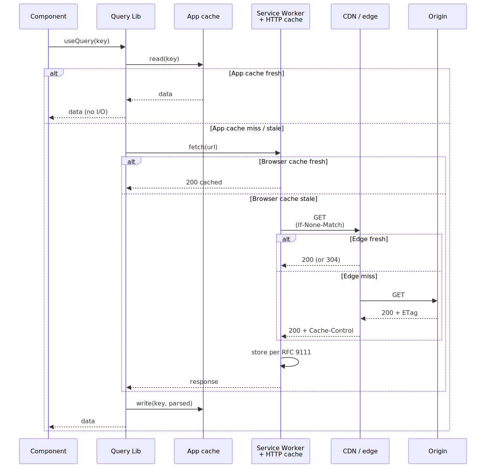
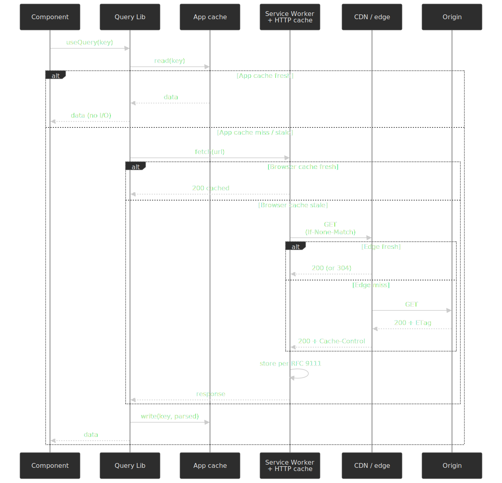
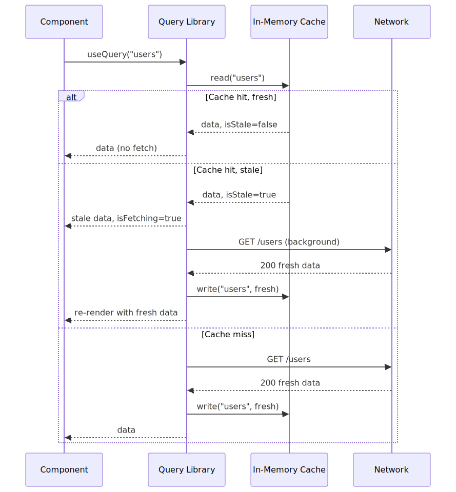
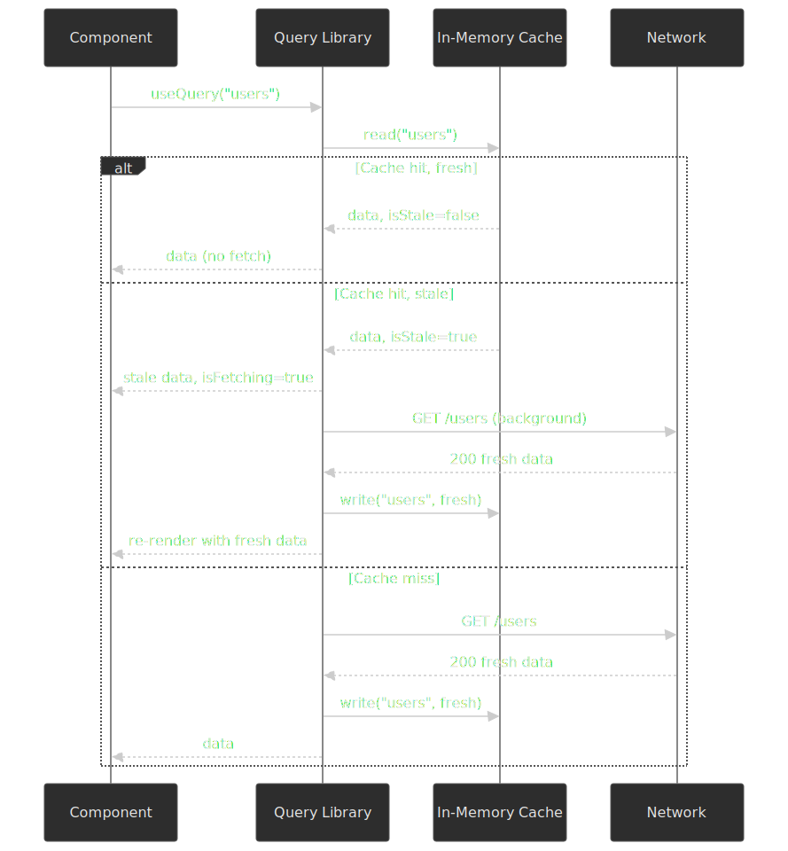
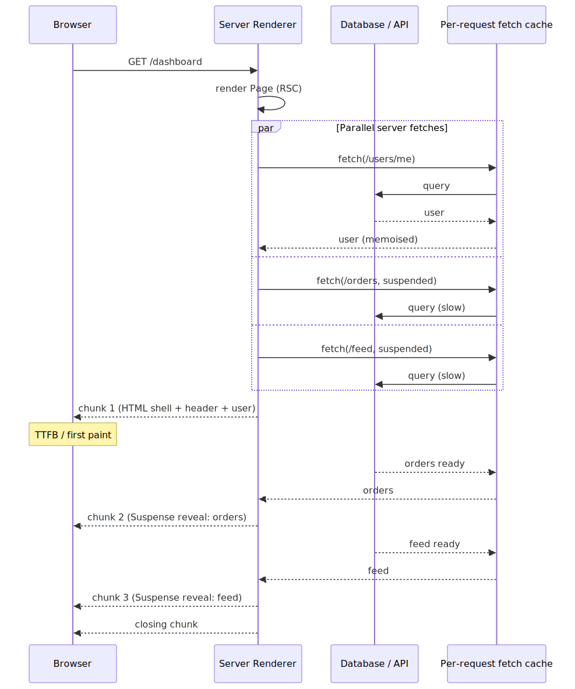
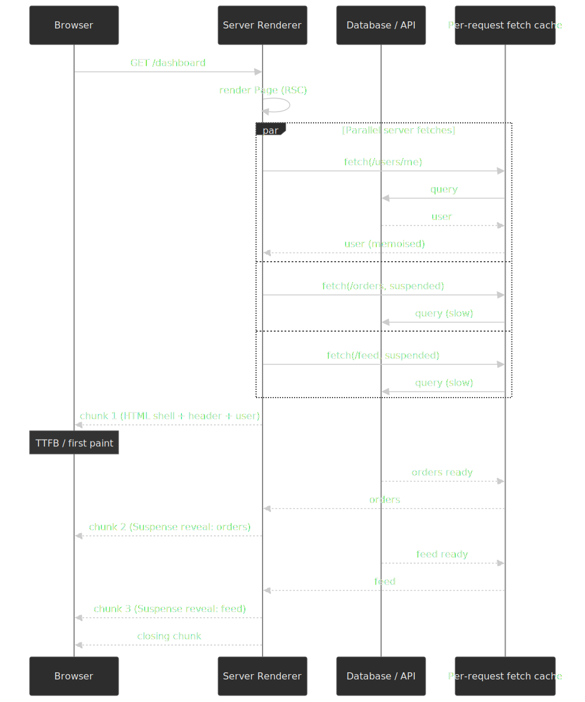
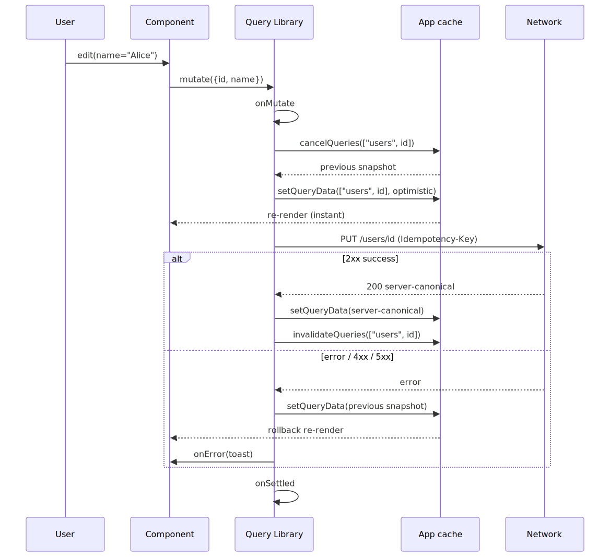
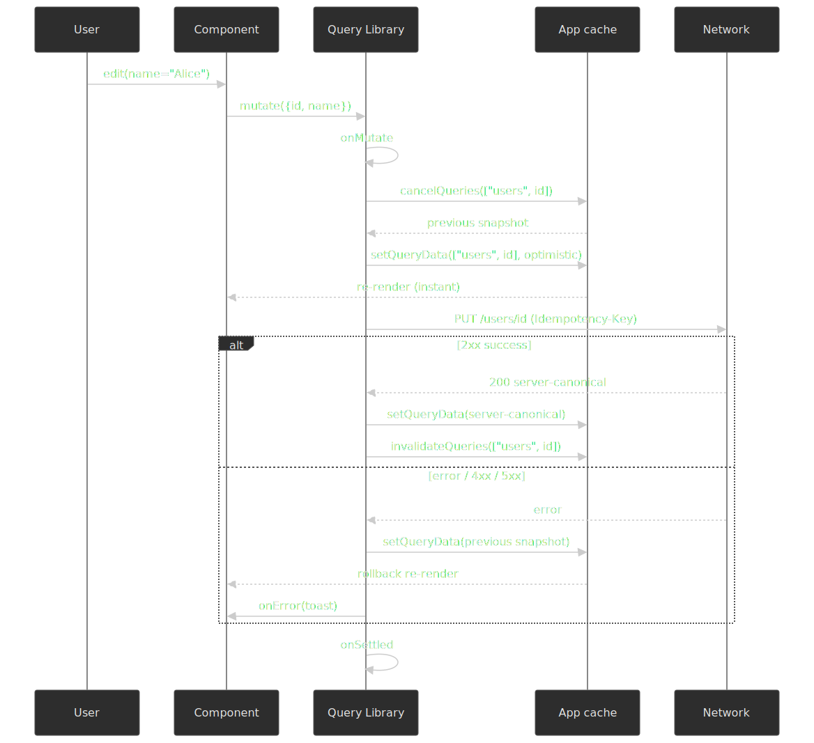

# Frontend Data Fetching Patterns and Caching

Server state is not application state. It lives elsewhere, can become stale at any time, and arrives over a lossy channel. The browser stack now offers half a dozen transports (REST, GraphQL, Connect, gRPC-Web, tRPC, JSON-RPC, SSE, WebSocket, WebTransport), two cache layers (the HTTP cache the browser already runs and the application cache a library puts on top), and a fast-evolving rendering model (Suspense, the `use()` hook, React Server Components, streamed responses). The standard data-fetching libraries — TanStack Query, SWR, Apollo Client, Relay, RTK Query — converge on the same small set of patterns to bridge those layers. This article walks the stack from the wire up: choosing a transport, what the browser cache already does for free, how request deduplication and stale-while-revalidate actually work, when to reach for a normalized cache, how Suspense and RSC change the fetch model, when streaming pays off, how to push from the server, how to prefetch without waterfalls, and how retries differ for idempotent vs side-effecting calls — with the citations and library defaults you need to defend a choice in code review.




## Mental model

Frontend data fetching is the management of three tensions:

- **Freshness vs latency.** Serve cached data immediately or wait for the network?
- **Correctness vs complexity.** Normalize entities for consistency, or store one copy per query and accept duplication?
- **Memory vs liveness.** Keep cache entries alive for instant revisits, or evict aggressively to bound footprint?

Five patterns recur across every mature library:

- **Request deduplication.** Multiple subscribers to the same key share one in-flight promise, so a render that calls `useUser(123)` from five components produces one network call.
- **Stale-while-revalidate.** Serve the cached value, then refresh in the background if it is past its freshness window.
- **Cache shape.** Either store one entry per query (per-query cache) or one entry per entity ID with queries holding references (normalized cache).
- **Invalidation.** Time-based, mutation-based, or tag-based — invalidation is the hardest part of caching, and most libraries solve it by refetching, not by patching.
- **Garbage collection.** When no component subscribes to a key, evict it after a configurable timeout so the cache does not grow unbounded.

The library defaults you will run into in 2026 (verified against current docs):

| Library                                                                                             | `staleTime` (default) | Dedup default                               | Default retries                                                       | Cache shape          |
| --------------------------------------------------------------------------------------------------- | --------------------- | ------------------------------------------- | --------------------------------------------------------------------- | -------------------- |
| [TanStack Query v5][tq-defaults]                                                                    | `0` (always stale)    | per-key, in-flight                          | `3`, exponential `min(1000 · 2^i, 30_000)` ms                         | per-query            |
| [SWR (Vercel)][swr-api]                                                                             | n/a (uses dedup window) | `dedupingInterval` defaults to **2000 ms** | `shouldRetryOnError: true` (no default `errorRetryCount`, ~5 s base) | per-query            |
| [Apollo Client][apollo-config]                                                                      | n/a (cache-first)     | `queryDeduplication: true`                  | `0` (configure via `RetryLink`)                                       | normalized by `__typename:id` |
| [RTK Query][rtk-cache]                                                                              | n/a (subscriber-driven) | per endpoint + serialized arg              | `0` (opt-in via `retry()` wrapper, default 5 attempts when used)      | per-query, tag-based |

[tq-defaults]: https://tanstack.com/query/v5/docs/framework/react/guides/important-defaults
[swr-api]: https://swr.vercel.app/docs/api
[apollo-config]: https://www.apollographql.com/docs/react/caching/cache-configuration
[rtk-cache]: https://redux-toolkit.js.org/rtk-query/usage/cache-behavior

The rest of this article walks each pattern from first principles, then surfaces where the libraries disagree and why.

## Choosing a transport

Before talking about caches, pick the wire format. The browser side now has five viable families, and they push different amounts of work onto the cache layer above them.

 when the server initiates.")


### REST over `fetch`

The default. Resource-oriented URLs, HTTP verbs with the semantics defined in [RFC 9110 §9][rfc9110-methods], a body shape negotiated per endpoint, and the entire HTTP cache surface (RFC 9111) for free. The [WHATWG Fetch standard][whatwg-fetch] specifies the request/response model the browser exposes — `cache`, `credentials`, `mode`, `redirect`, `referrerPolicy`, and `signal` are the knobs that matter for any client.

[rfc9110-methods]: https://www.rfc-editor.org/rfc/rfc9110.html#section-9
[whatwg-fetch]: https://fetch.spec.whatwg.org/

REST's strengths are exactly that the network already understands it: CDNs cache `GET` responses, conditional requests collapse them to `304`s, `If-None-Match` does not need a single line of application code. Its weakness is that the response shape is fixed per endpoint, so non-trivial UIs either over-fetch or fan out into N round trips.

### GraphQL and persisted queries

GraphQL collapses the round-trip count by letting the client describe the exact subset of the graph it needs, with the server resolving the union per request. The [GraphQL specification][graphql-spec] (current October 2021 edition) defines the type system, query language, and execution semantics; later working drafts add `@defer` and `@stream` for incremental delivery.

[graphql-spec]: https://spec.graphql.org/

The two operational footguns are payload size (queries can be large, and they ride on every request) and HTTP cacheability (every operation is a `POST` to `/graphql` by default, so neither browser nor CDN can cache it). **Persisted queries** solve both. With Apollo's Automatic Persisted Queries (APQ), the client first sends only a SHA-256 hash in `extensions.persistedQuery.sha256Hash`; on cache miss the server returns `PersistedQueryNotFound`, the client retries with the full query, and the mapping is stored for next time[^apollo-apq]. Because the hash is short and stable, hashed queries can ride a `GET` request and become CDN-cacheable[^apollo-apq-get]. Relay, by contrast, persists at compile time: the [Relay compiler][relay-persisted] writes an `<id, query>` map at build, the runtime sends only the `doc_id`, and the server uses a static safelist — which doubles as the security model.

[^apollo-apq]: [Apollo Server — Automatic Persisted Queries](https://www.apollographql.com/docs/apollo-server/performance/apq). Defines the SHA-256 hash flow, `PersistedQueryNotFound` retry, and the `extensions.persistedQuery` envelope.
[^apollo-apq-get]: [`apollo-link-persisted-queries`](https://github.com/apollographql/apollo-link-persisted-queries). `useGETForHashedQueries: true` flips hashed operations to `GET` so a CDN can cache them.

[relay-persisted]: https://relay.dev/docs/guides/persisted-queries/

### gRPC-Web and Connect

Native gRPC needs HTTP/2 trailers and streaming framing the browser does not expose, so [`grpc-web`][grpc-web] runs through a translating proxy (Envoy, the gRPC-Web Go proxy, or a sidecar) that re-frames trailers into the body. It supports unary and server-streaming, but **client-streaming and bidirectional-streaming are not supported in browsers** because the Fetch API cannot write a request body incrementally on every browser[^grpc-web-state].

[grpc-web]: https://grpc.io/blog/state-of-grpc-web/
[^grpc-web-state]: [The state of gRPC in the browser — gRPC blog](https://grpc.io/blog/state-of-grpc-web/). Documents the proxy model, the unary/server-stream support matrix, and the missing client/bidi streaming support.

[Connect][connect] (Buf) is the protocol that drops the proxy: it speaks plain HTTP/1.1, HTTP/2, or HTTP/3 with `Content-Type: application/proto` or `application/json`, and the same `connect-web` client can also speak gRPC and gRPC-Web by config. Errors come back as HTTP statuses with a JSON body, so they are debuggable in the network panel; bidirectional streams need `duplex: 'half'` (or `full` once standardized) on the underlying `Request`.

[connect]: https://connectrpc.com/

### tRPC

[tRPC][trpc] is the typed-RPC option for full-stack TypeScript. There is no IDL and no codegen step — the server router's types are imported by the client over the type system, so `appRouter.user.byId.query({ id: 1 })` is type-checked end-to-end. Under the hood it batches over `POST /trpc/<path>?batch=1`. Trade-off: fastest to ship in a TS monorepo, but no polyglot story, no schema-anchored contract for non-TS consumers, and (by default) no HTTP caching because everything is `POST`.

[trpc]: https://trpc.io/

### JSON-RPC 2.0

[JSON-RPC 2.0][jsonrpc] is the bare-bones option: a single `POST` with `{ jsonrpc: "2.0", method, params, id }` and a corresponding response. It is the lingua franca of Ethereum nodes, language-server protocols, and many internal tools, but on the browser side it is a strict downgrade from REST or Connect — the spec does not define HTTP-level errors, batching is optional, and no caching falls out for free.

[jsonrpc]: https://www.jsonrpc.org/specification

### Quick comparison

| Transport       | Codegen / IDL        | Browser cache friendly | Streaming                   | Best fit                                          |
| --------------- | -------------------- | ---------------------- | --------------------------- | ------------------------------------------------- |
| REST            | OpenAPI optional     | Yes (RFC 9111)         | Body via Streams API only   | Resource-oriented, public, CDN-fronted APIs       |
| GraphQL + APQ   | SDL + codegen        | Yes (with persisted GET) | `@defer` / `@stream` (incr.) | Graph-shaped UIs, normalized client cache         |
| gRPC-Web        | `.proto` + codegen   | No                     | Server-stream only in browser | Internal services already on Protobuf            |
| Connect         | `.proto` + codegen   | Partial (JSON GET)     | Server + bidi (with `duplex`) | Polyglot RPC without a translating proxy         |
| tRPC            | None (TS inference)  | No (POST batch)        | Subscriptions over WS       | TS-only monorepos                                 |
| JSON-RPC 2.0    | None (informal)      | No (single POST)       | Out of scope                 | Existing JSON-RPC ecosystems (nodes, LSP, etc.)  |

> [!TIP]
> Transport choice and cache shape are linked: GraphQL's response shape is what makes Apollo and Relay's normalized caches possible at all, while REST's resource URL is what the browser HTTP cache keys on. Picking a transport that fights the cache layer above it is how you end up reinventing both.

## HTTP caching: the layer underneath

The browser has its own cache, governed by [RFC 9111 (HTTP Caching, June 2022)][rfc9111], which obsoleted RFC 7234 with clarifications and no breaking semantics[^rfc9111-history]. Application caches sit on top of (or, more often, route around) it. Knowing what the browser already does is the difference between layering caches usefully and double-caching by accident.




Two transport-level details shape what the upper layers can do. First, both [HTTP/2 (RFC 9113)][rfc9113] and [HTTP/3 (RFC 9114)][rfc9114] multiplex many requests over one connection, so the old "make endpoints chunky to avoid round-trip cost" advice no longer pays off — many small `GET`s on one connection are competitive with one fat `POST`, and they cache better. Second, HTTP/2 still suffers TCP head-of-line blocking when one stream stalls; HTTP/3 over QUIC removes it per-stream, which is why a slow image no longer freezes a JSON fetch on the same connection.

[rfc9113]: https://www.rfc-editor.org/rfc/rfc9113.html
[rfc9114]: https://www.rfc-editor.org/rfc/rfc9114.html

[rfc9111]: https://www.rfc-editor.org/rfc/rfc9111.html
[^rfc9111-history]: [RFC 9111 history](https://datatracker.ietf.org/doc/rfc9111/history/) — published 2022-06, obsoletes RFC 7234.

### Cache-Control directives that matter

| Directive                  | Meaning                                                       | Use case                                          |
| -------------------------- | ------------------------------------------------------------- | ------------------------------------------------- |
| `max-age=N`                | Response is fresh for N seconds                               | Static assets, API responses with a known TTL     |
| `no-cache`                 | Cache may store, but must revalidate on every reuse           | HTML shells, dashboards that must reflect changes |
| `no-store`                 | Do not store at all                                           | Authenticated, user-specific responses            |
| `private`                  | Only the user-agent cache may store                           | User-specific data, not CDN-cacheable             |
| `public`                   | Any shared cache may store                                    | Static assets, public read-only APIs              |
| `s-maxage=N`               | Freshness for shared caches; overrides `max-age` for them     | Edge TTL distinct from browser TTL                |
| `stale-while-revalidate=N` | Serve stale up to N seconds while revalidating in background  | RFC 5861 extension for async refresh[^rfc5861]    |

[^rfc5861]: [RFC 5861 — HTTP Cache-Control Extensions for Stale Content](https://www.rfc-editor.org/rfc/rfc5861.html). Defines `stale-while-revalidate` and `stale-if-error`.

> [!NOTE]
> `no-cache` does not mean "do not cache". It means "store, but revalidate before reuse". The directive that prevents storage is `no-store`. RFC 9111 §5.2.2.4 spells this out explicitly.

### Conditional requests and validators

When a cached response is stale, browsers issue a conditional request to learn whether the cached representation is still valid:

```http title="conditional-request.http"
GET /api/users/123 HTTP/1.1
If-None-Match: "abc123"
```

The server answers either `304 Not Modified` (use the cached body) or `200 OK` with a fresh body and a new validator. RFC 9110 §13 defines the validator semantics[^rfc9110-validators]:

- **Strong ETag** (`"abc123"`) — byte-for-byte identical representation. Required for range requests.
- **Weak ETag** (`W/"abc123"`) — semantically equivalent, allowing minor variations such as whitespace.
- **Last-Modified** — second-resolution timestamp. Strictly weaker than ETag because changes within the same second collide.

[^rfc9110-validators]: [RFC 9110 §8.8 — Validator fields](https://www.rfc-editor.org/rfc/rfc9110.html#section-8.8) and [§13 Conditional Requests](https://www.rfc-editor.org/rfc/rfc9110.html#section-13).

The reason you see ETags everywhere despite Last-Modified being simpler is that one-second resolution is too coarse for systems that mutate frequently — two writes in the same second look identical to a Last-Modified-only validator.

### Browser-level stale-while-revalidate

`Cache-Control: max-age=600, stale-while-revalidate=30` instructs intermediaries to:

1. Treat the response as fresh for 600 s.
2. From 600 s to 630 s, return the cached response immediately and revalidate in the background.
3. After 630 s, block on revalidation.

This works without any JavaScript — but it lives at the HTTP layer, with no signal back to the application about which subscribers are waiting on what. Library-level SWR (the pattern, not the package) layers a per-key state machine on top, with knobs for "refetch on window focus" or "refetch on reconnect" that the HTTP cache cannot express. See [the dedicated SWR section](#stale-while-revalidate-the-application-pattern) below.

## Request deduplication

Without deduplication, a page that mounts five components calling `useUser(123)` issues five identical requests. Deduplication promises that, while a request is in flight, all subscribers share the same promise — the network sees one request and the cache sees one write.

### The promise-memoization pattern

The mechanism is straightforward: store the in-flight promise keyed by request identity, and return it to all callers until it settles.

```ts title="deduplicate.ts" showLineNumbers
const inflight = new Map<string, Promise<unknown>>()

export async function deduplicated<T>(
  key: string,
  fetcher: () => Promise<T>,
): Promise<T> {
  const existing = inflight.get(key)
  if (existing) return existing as Promise<T>

  const promise = fetcher().finally(() => {
    inflight.delete(key)
  })

  inflight.set(key, promise)
  return promise
}
```

The cached value is the **promise**, not the response. All callers `await` the same promise, so success and failure both fan out to every subscriber. That is usually what you want: if the API is down, every consumer should observe the failure together.

### How each library does it

- **TanStack Query** deduplicates by the serialized query key while a fetch is in flight. There is no time window; once the fetch settles, the next subscriber drives whatever policy the key is configured with[^tq-dedup].
- **SWR** uses a time-based window. `dedupingInterval` defaults to **2000 ms**[^swr-defaults]; subscribers within that window share the same promise even after it settles, which makes SWR feel "eventually consistent" rather than strictly deduplicated.
- **Apollo Client** deduplicates by query document + variables. The behaviour is controlled by the top-level `queryDeduplication` option (default `true`)[^apollo-dedup]; an in-flight `watchQuery` will satisfy any other identical `watchQuery` issued before it resolves, before the request hits the link chain.
- **RTK Query** deduplicates per endpoint + serialized argument. The cache entry is created by the first subscription and reference-counted — the entry stays alive while at least one subscriber exists, then enters a `keepUnusedDataFor` countdown that defaults to 60 s[^rtk-keepunused].

[^tq-dedup]: [TanStack Query — Important defaults](https://tanstack.com/query/v5/docs/framework/react/guides/important-defaults).
[^swr-defaults]: [SWR API options](https://swr.vercel.app/docs/api). `dedupingInterval` is `2000` and `revalidateOnFocus` / `revalidateOnReconnect` are `true` by default.
[^apollo-dedup]: [Apollo Client — `ApolloClient` options](https://www.apollographql.com/docs/react/api/core/ApolloClient). `queryDeduplication` defaults to `true` and is set on the client, not on `HttpLink`.
[^rtk-keepunused]: [RTK Query — Cache behavior](https://redux-toolkit.js.org/rtk-query/usage/cache-behavior).

### Edge cases

- **Mutations racing in-flight queries.** TanStack Query's `invalidateQueries` waits for in-flight queries on the same key to settle before refetching. SWR's `mutate(key)` cancels in-flight requests for that key. Apollo's mutation `update` callback runs after the mutation completes, before any refetch, so cache writes happen in a deterministic order.
- **Shared error fan-out.** Because all subscribers await the same promise, a single 500 propagates to every subscriber's error boundary. This usually matches intent, but it does mean that a single component's `<ErrorBoundary>` decision affects components it does not own.
- **SSR and per-request scope.** Server-rendered apps must construct a new query client per request — otherwise one user's cached `User:1` leaks into the next user's request. TanStack Query's [SSR guide][tq-ssr] and Apollo's per-request cache pattern both make this explicit.

[tq-ssr]: https://tanstack.com/query/latest/docs/framework/react/guides/ssr

## Application-level caching

Application caches store fetched data in JavaScript memory, separate from the browser's HTTP cache. They power instant UI updates, optimistic mutations, and fine-grained per-key control. The first design decision is **shape**.

### Per-query vs normalized




**Per-query cache** (TanStack Query, SWR, RTK Query). Each query key maps to one entry containing the response payload. The same `User { id: 123 }` may exist in five entries — list, detail, two relationship lists, one search result — and each is its own copy.

```ts title="per-query-shape.ts"
const cache = new Map([
  ['users', { data: [user1, user2], updatedAt: 1739999990 }],
  ['users/1', { data: user1, updatedAt: 1739999991 }],
  ['posts?author=1', { data: [post1, post2], updatedAt: 1739999992 }],
])
```

Trade-off: simple mental model, no schema required, easy to reason about. But updating a single user requires invalidating every key that contains that user — which the cache doesn't know about, so you do it explicitly via tags or key patterns.

**Normalized cache** (Apollo Client, Relay). Entities are stored once, keyed by `__typename:id` (Apollo's default[^apollo-keys]) or a custom `keyFields` policy. Queries store references, not values. Mutations that update `User:123` immediately update every query that references it.

[^apollo-keys]: [Apollo — Configuring the cache](https://www.apollographql.com/docs/react/caching/cache-configuration). The default identifier is `__typename:id` (or `_id`); customize via the per-type `keyFields` policy. The legacy `dataIdFromObject` is deprecated in favour of `keyFields`.

```ts title="normalized-shape.ts"
const cache = {
  'User:1': { __typename: 'User', id: 1, name: 'Alice' },
  'User:2': { __typename: 'User', id: 2, name: 'Bob' },
  'Post:11': { __typename: 'Post', id: 11, author: { __ref: 'User:1' } },
  ROOT_QUERY: {
    'users': [{ __ref: 'User:1' }, { __ref: 'User:2' }],
    'posts({"authorId":1})': [{ __ref: 'Post:11' }],
  },
}
```

Trade-off: automatic consistency, smaller in-memory footprint at scale, near-zero invalidation work after well-formed mutations. Cost: every entity needs a stable identity, paginated lists need an explicit `merge` policy, and cache-write debugging is harder because the cache is a graph, not a tree.

| Decision factor                          | Per-query cache               | Normalized cache              |
| ---------------------------------------- | ----------------------------- | ----------------------------- |
| Same entity in many queries              | Duplicated, manual invalidation | Single source of truth        |
| Schema discipline required               | Low                           | High (stable IDs everywhere)  |
| Pagination / list merging                | Built-in helpers              | Custom `merge` per field      |
| Mutation → many UI updates               | Refetch / setQueryData fan-out | Automatic via reference graph |
| Debugging cache writes                   | Read one entry                | Walk the reference graph      |
| Sweet spot                               | REST + clean query keys       | GraphQL with disciplined IDs  |

> [!TIP]
> Reach for normalization when (a) you have GraphQL (the schema gives you the IDs for free), or (b) the same entity appears in many places and mutation fan-out is expensive to wire by hand. For most REST apps, the per-query cache plus tag-based invalidation is the cheaper default.

### Cache invalidation

The cache cannot know that the server changed unless something tells it. Three families of solutions exist:

**Time-based.** Mark data stale after N seconds. TanStack Query's `staleTime` defaults to `0` — every read is considered stale and triggers a background refetch on the next configured trigger[^tq-defaults]. SWR's `refreshInterval` polls. Time-based invalidation is simple but imprecise: data may be obsolete instantly or stable for hours.

[^tq-defaults]: [TanStack Query — Important defaults](https://tanstack.com/query/v5/docs/framework/react/guides/important-defaults). `staleTime` defaults to `0`, `gcTime` to 5 minutes (300_000 ms), and the client-side `retry` defaults to `3` with the exponential `retryDelay`. On the server (`isRestoring` paths) `retry` defaults to `0`.

**Mutation-based.** After a mutation succeeds, mark related queries stale or refetch them.

```ts title="mutation-invalidate.ts" collapse={1-3}
const queryClient = useQueryClient()

const updateUser = useMutation({
  mutationFn: api.updateUser,
  onSuccess: (_, variables) => {
    queryClient.invalidateQueries({ queryKey: ['users'] })
    queryClient.invalidateQueries({ queryKey: ['users', variables.id] })
  },
})
```

**Tag-based.** Queries declare what they `provide`, mutations declare what they `invalidate`, and the framework wires the dependency graph for you. This is RTK Query's primary mechanism[^rtk-tags].

[^rtk-tags]: [RTK Query — Automated Re-fetching](https://redux-toolkit.js.org/rtk-query/usage/automated-refetching). Tag-based invalidation is the documented alternative to a normalized cache.

```ts title="rtk-tags.ts" collapse={1-4, 19-25}
const api = createApi({
  baseQuery: fetchBaseQuery({ baseUrl: '/api' }),
  tagTypes: ['User'],
  endpoints: (builder) => ({
    getUsers: builder.query({
      query: () => 'users',
      providesTags: (result) =>
        result
          ? [...result.map(({ id }) => ({ type: 'User' as const, id })), { type: 'User', id: 'LIST' }]
          : [{ type: 'User', id: 'LIST' }],
    }),
    updateUser: builder.mutation({
      query: ({ id, ...body }) => ({ url: `users/${id}`, method: 'PUT', body }),
      invalidatesTags: (_result, _error, { id }) => [{ type: 'User', id }],
    }),
  }),
})
```

Tags are explicit and predictable. They are also a place to make subtle mistakes: if a mutation forgets to invalidate a tag, no warning fires — the UI just stays stale until something else triggers a refetch.

### Garbage collection

Without bounded eviction, caches grow with usage. Each library encodes a different policy:

- **TanStack Query** — `gcTime` (formerly `cacheTime` before v5[^tq-rename]) defaults to **5 minutes**. A query becomes inactive when it has zero subscribers; after `gcTime` of inactivity the entry is removed. `staleTime` and `gcTime` are independent — long `staleTime` does not extend `gcTime`.
- **SWR** — no explicit GC. Cache entries persist for the lifetime of the cache provider; `dedupingInterval` controls reuse, not eviction. For long-lived sessions this is something you size by configuring a custom cache provider or scoping the `<SWRConfig>`.
- **Apollo Client** — manual: `cache.evict({ id: 'User:123' })` removes an entry, then `cache.gc()` sweeps unreachable references. There is no automatic time-based GC.
- **RTK Query** — `keepUnusedDataFor` (default **60 s**) starts after the last subscriber unmounts; if a new subscriber arrives before the timer fires, the cache entry survives.

[^tq-rename]: [Migrating to TanStack Query v5](https://tanstack.com/query/v5/docs/framework/react/guides/migrating-to-v5). `cacheTime` was renamed to `gcTime` for clarity.

### Memory ceilings

Browser memory caps are smaller than they appear, especially on mobile, and the limits are not formally specified. Use these as planning estimates, not contracts:

| Surface                                | Practical ceiling                   | Source                                                                                                                         |
| -------------------------------------- | ----------------------------------- | ------------------------------------------------------------------------------------------------------------------------------ |
| Desktop Chrome (64-bit) JS heap        | ~4 GB per renderer process          | [Chromium issue 41133247][chromium-4gb] — design ceiling, not practically reachable                                            |
| Desktop Firefox JS heap                | Similar GB range, version-dependent | [SpiderMonkey GC docs][sm-gc]                                                                                                  |
| Mobile Safari per-page memory          | ~200–400 MB before the tab is killed | iOS Safari does not publish a number; widely reported empirical range, with crashes appearing as silent reloads, not exceptions |
| Per-page measurement                   | `performance.measureUserAgentSpecificMemory()` (Chromium-only) | [MDN][mdn-mua-memory] — Cross-Origin Isolation required; Safari does not implement it as of 2026 |

[chromium-4gb]: https://issues.chromium.org/issues/41133247
[sm-gc]: https://firefox-source-docs.mozilla.org/js/gc.html
[mdn-mua-memory]: https://developer.mozilla.org/en-US/docs/Web/API/Performance/measureUserAgentSpecificMemory

> [!CAUTION]
> Mobile Safari does not throw a JavaScript error when it hits the limit — the page is killed and reloaded. Plan for an LRU eviction policy in any app that holds large normalized caches on mobile.

## Stale-while-revalidate: the application pattern

The HTTP-level `stale-while-revalidate` directive (RFC 5861) is one mechanism. The application-level SWR pattern — a state machine per query key with revalidation triggers and isFetching state — is a different, finer-grained mechanism implemented inside the library.




### Implementation in TanStack Query

```ts title="stale-time.ts" collapse={1-2}
const { data, isStale, isFetching } = useQuery({
  queryKey: ['users'],
  queryFn: fetchUsers,
  staleTime: 60_000,
  refetchOnWindowFocus: true,
  refetchOnMount: true,
})
```

`data` is always the cached value (stale or fresh). `isStale` reflects whether the entry is past its `staleTime`. `isFetching` is `true` while a background fetch is in flight. There is no "loading" state for a stale read — by design, the user sees content first.

### Revalidation triggers across libraries

| Trigger              | TanStack Query             | SWR                         | Apollo                  |
| -------------------- | -------------------------- | --------------------------- | ----------------------- |
| Component mount      | `refetchOnMount`           | `revalidateOnMount` / `revalidateIfStale` | `fetchPolicy`           |
| Window focus         | `refetchOnWindowFocus`     | `revalidateOnFocus` (default `true`) | manual                  |
| Network reconnect    | `refetchOnReconnect`       | `revalidateOnReconnect` (default `true`) | manual                  |
| Polling interval     | `refetchInterval`          | `refreshInterval`           | `pollInterval`          |

Window-focus revalidation is the trigger most teams forget. Users frequently switch tabs; when they come back, the data they see was last fetched minutes ago. Focus-triggered revalidation is the difference between "stale until refresh" and "current within seconds" with no user action.

## Suspense, transitions, and the `use()` hook

React 19 collapsed the long-running "Suspense for data fetching" experiment into a stable model: components throw promises, the nearest [`<Suspense>`][react-suspense] boundary catches them and shows a fallback, and the [`use()`][react-use] hook is the single API that reads a promise (or a context) inside render.

[react-suspense]: https://react.dev/reference/react/Suspense
[react-use]: https://react.dev/reference/react/use

The mental shift is small but consequential: the *component* no longer owns "loading state" — the boundary does. Three rules fall out:

1. **`use()` may be called conditionally**, unlike the rules-of-hooks pre-19 hooks. It is meant to read a promise that the parent has already kicked off, not to start one inside render[^react-use-rules].
2. **Promises must be cached.** A new promise on every render re-suspends forever. Either pass a stable promise from a parent (an RSC, a router loader, or a query library) or memoise via TanStack Query's `useSuspenseQuery`, which dedupes by key.
3. **Errors propagate to the nearest Error Boundary.** `use()` does not surface a `try/catch` path; you wrap with an Error Boundary or attach `.catch` to the underlying promise[^react-use-rules].

[^react-use-rules]: [`use` — React reference](https://react.dev/reference/react/use). Defines the conditional-call exception, the Suspense and Error Boundary contracts, and the "promise must be created by a Suspense-aware framework" guidance.

```tsx title="suspense-data.tsx"
function UserCard({ id }: { id: string }) {
  const user = useSuspenseQuery({ queryKey: ['user', id], queryFn: () => api.user(id) }).data
  return <article>{user.name}</article>
}

export default function Page({ params }: { params: { id: string } }) {
  return (
    <ErrorBoundary fallback={<Failure />}>
      <Suspense fallback={<Skeleton />}>
        <UserCard id={params.id} />
      </Suspense>
    </ErrorBoundary>
  )
}
```

### Transitions: keep the current screen interactive

`useTransition` and `useDeferredValue` mark state updates as non-urgent so React keeps the previous UI interactive while the new tree suspends. Without a transition, switching tabs in a Suspense-driven UI hard-replaces the screen with the fallback. Inside `startTransition`, React keeps the old tree visible until the new one's data resolves[^react-transitions].

[^react-transitions]: [`useTransition` — React reference](https://react.dev/reference/react/useTransition). The current React docs spell out the "old UI stays interactive while the new tree suspends" guarantee and how `isPending` reflects the in-flight transition.

```tsx title="transition.tsx"
const [isPending, startTransition] = useTransition()

function selectTab(next: Tab) {
  startTransition(() => setTab(next))
}
```

### Boundary granularity is a performance lever

One Suspense boundary at the page root means the whole page blocks on the slowest fetch. Many small boundaries means parts stream in independently. The right grain is "one boundary per independent skeleton" — a sidebar, a detail panel, a chart — not "one per query".

> [!IMPORTANT]
> `useSuspenseQuery` (TanStack Query) and `useReadQuery` / `usePreloadedQuery` (Relay) are the wrappers that play correctly with Suspense — they treat the cache as the promise source. Don't hand-roll a `useState(promise)` and pass it to `use()`; you will spend the next week chasing render loops.

## React Server Components and server-side fetching

React Server Components (RSC) push data fetching into the same async render pass that produces the HTML, so the network round-trips happen on the server (next to the data) and only serialised UI lands in the browser. Three things change for the data-fetching layer:

### Per-request automatic deduplication

In an RSC tree, [React memoises identical `fetch` calls within the same request][react-fetch-memo] — five components calling `fetch('/api/me')` issue one request, regardless of which `Suspense` boundary they sit under. Memoisation is per render, not across users, and it is unaffected by `cache: 'no-store'`. This is the server analogue of TanStack Query's request dedup, and it is why you can mostly stop passing data through props in an RSC app.

[react-fetch-memo]: https://react.dev/reference/react/cache

### Cache vs memoisation are different layers

Next.js 15 (and Next.js 16) made the two layers explicit and **changed the default of `fetch` from `force-cache` to `no-store`**, so server-side `fetch` is uncached unless you opt in[^next15-defaults]. Per-request memoisation still applies; the on-disk Data Cache does not. Opt back in with `fetch(url, { cache: 'force-cache', next: { revalidate: 60, tags: ['user'] } })`, then invalidate with `revalidateTag('user')` after a server action mutates state.

[^next15-defaults]: [Next.js 15 release notes](https://nextjs.org/blog/next-15) and the [caching guide](https://nextjs.org/docs/app/guides/caching-without-cache-components). `fetch` is uncached by default; `GET` route handlers are uncached by default; client router cache `staleTime` defaults to `0`.

### Tag-based invalidation across the boundary

Server-side tag invalidation (`revalidateTag`, `revalidatePath`) is the missing half of optimistic updates: a server action mutates the database, calls `revalidateTag('orders')`, and any RSC tree referencing that tag re-renders on the next navigation or refresh. The client-side cache (TanStack Query, RTK Query) still has to invalidate its own keys; the two graphs are independent and have to be wired together — usually via the Server Action's return value triggering `queryClient.invalidateQueries`.

> [!CAUTION]
> Do not put per-user data into a `force-cache` server fetch unless you scope the cache key. RSC's data cache is per-route + per-input; if the input is "the current user's auth header", you must include that in the cache key explicitly or the cache will leak between users.

## Streaming responses

Streaming overlaps the network round-trip with the parse and render: bytes arrive incrementally, the parser produces partial trees, and the user sees content before the whole response is in. Two layers cooperate.

### The Streams API

The [WHATWG Streams standard][whatwg-streams] gives `fetch` a `.body` of type `ReadableStream<Uint8Array>`, which can be transformed (`pipeThrough(TextDecoderStream())`) and consumed asynchronously:

[whatwg-streams]: https://streams.spec.whatwg.org/

```ts title="streamed-json.ts"
const res = await fetch('/api/feed/stream')
const reader = res.body!.pipeThrough(new TextDecoderStream()).getReader()
for (;;) {
  const { value, done } = await reader.read()
  if (done) break
  emit(value)
}
```

Anything that can produce bytes incrementally on the server — NDJSON, JSON Lines, SSE-without-an-EventSource, custom binary frames — flows through the same API. `AbortSignal` cancels the body stream cleanly, so a navigation away closes the underlying socket.

### RSC streaming and progressive Suspense flush




When an RSC tree contains multiple `Suspense` boundaries, the server sends the shell first, then a chunk per boundary as its data resolves. The browser parses each chunk, the React runtime swaps the fallback for the resolved subtree, and TTFB stays decoupled from the slowest fetch. The trade-off is honest: streamed responses cannot set `Content-Length`, cannot be cached as a single byte range, and intermediaries that buffer (some old proxies, some logging middleware) defeat the benefit.

GraphQL has the equivalent at the field level: the `@defer` and `@stream` directives let the server flush part of a response now and the rest later, on a single `multipart/mixed` HTTP response. Apollo Client and Relay both implement the directives end-to-end.

## Optimistic updates with rollback

SWR addresses **read** latency. Optimistic updates address **write** latency. They compose, but they solve different problems — and an optimistic update is the one place where the cache becomes a partially-correct mirror of the server, so the rollback path matters as much as the happy path.




```ts title="optimistic-update.ts" collapse={1-3, 28-32}
const queryClient = useQueryClient()

const updateUser = useMutation({
  mutationFn: api.updateUser,
  onMutate: async (newUser) => {
    await queryClient.cancelQueries({ queryKey: ['users', newUser.id] })

    const previous = queryClient.getQueryData(['users', newUser.id])
    queryClient.setQueryData(['users', newUser.id], newUser)

    return { previous }
  },
  onError: (_err, newUser, context) => {
    queryClient.setQueryData(['users', newUser.id], context?.previous)
  },
  onSettled: (_data, _err, newUser) => {
    queryClient.invalidateQueries({ queryKey: ['users', newUser.id] })
  },
})
```

Three operational notes the docs underplay:

- **Always cancel in-flight reads first.** Without `cancelQueries`, a refetch that resolves *after* `onMutate` writes will overwrite the optimistic value with stale server data — the UI flickers, then "corrects" to the wrong number.
- **Snapshot is per-key.** If a mutation writes to several keys, snapshot each one in `onMutate`, restore each one in `onError`. A single `previous` is the most common rollback bug.
- **Always send an `Idempotency-Key`.** Optimistic mutations have a higher retry rate (offline → reconnect, navigation cancellation, transient 5xx) and the rollback path will not save you from a duplicate side effect at the server. See the idempotency section below.

For mutations with low success-rate variance, the simpler "show a spinner, write through, then refetch" path is often the right default; reach for optimistic only when latency-to-paint actually drives the metric you are moving.

## Pagination

Pagination affects both API design and cache structure. The choice between cursor and offset has performance implications you cannot retrofit later.

### Cursor (keyset) vs offset

**Offset** — `GET /api/posts?offset=100&limit=20`. The database scans through the first 100 rows and discards them. Time grows linearly with offset depth, and any insertions or deletions between page reads cause duplicates or gaps.

**Cursor** (also called *keyset* or *seek* pagination) — `GET /api/posts?cursor=eyJpZCI6MTIzfQ&limit=20`. The cursor encodes a position in an indexed sort, so the database seeks directly to the row and reads forward. Performance is constant in the page depth, and concurrent inserts/deletes do not skip or duplicate items[^pg-keyset]. The trade-off is no random "jump to page 50" — pagination becomes strictly forward/backward.

[^pg-keyset]: [Markus Winand — Use The Index, Luke! Paging Through Results](https://use-the-index-luke.com/no-offset). The canonical write-up of why keyset/seek wins at depth.

The performance gap is order-of-magnitude, not marginal. The exact numbers depend on the index, table width, and storage, but the shape is consistent across implementations:

| Offset depth | Offset query (illustrative) | Cursor query |
| ------------ | --------------------------- | ------------ |
| 0            | a few ms                    | a few ms     |
| 10 000       | tens of ms                  | a few ms     |
| 100 000      | hundreds of ms              | a few ms     |
| 1 000 000    | seconds                     | a few ms     |

Use offset for small admin tables where users genuinely jump pages; use cursor for everything that scales.

### Infinite scroll with TanStack Query

```ts title="infinite-posts.ts" collapse={1-2}
import { useInfiniteQuery } from '@tanstack/react-query'

export function useInfinitePosts() {
  return useInfiniteQuery({
    queryKey: ['posts'],
    queryFn: ({ pageParam }) => fetchPosts({ cursor: pageParam }),
    initialPageParam: undefined as string | undefined,
    getNextPageParam: (lastPage) => lastPage.nextCursor,
    getPreviousPageParam: (firstPage) => firstPage.prevCursor,
  })
}
```

Pages are stored as an array in a single cache entry, not as separate keys. That keeps cursor lineage local to one query and avoids the orphaned-page problem you get when individual pages live under separate keys.

### Apollo: list merging needs an explicit policy

A normalized cache cannot guess how to merge two paginated responses — appending vs interleaving vs replacing are all valid. Apollo requires an explicit `merge` per paginated field:

```ts title="apollo-pagination.ts" collapse={1-4, 18-22}
const cache = new InMemoryCache({
  typePolicies: {
    Query: {
      fields: {
        posts: {
          keyArgs: ['authorId'],
          merge(existing = { edges: [] }, incoming) {
            return {
              ...incoming,
              edges: [...existing.edges, ...incoming.edges],
            }
          },
        },
      },
    },
  },
})
```

Without `merge`, Apollo replaces the whole list per response and you lose pagination accumulation entirely. The Apollo team intentionally chose explicitness here: a silent default would hide list semantics that vary per use case.

## Real-time channels

Three browser-native push channels coexist in 2026, and they are not interchangeable. Pick by *direction* and *delivery semantics*, not by perceived modernness.




### Server-Sent Events

[`EventSource`][whatwg-eventsource] is defined in the HTML living standard. The wire format is `text/event-stream`: line-oriented `data:` / `event:` / `id:` records terminated by a blank line. It is **server-to-client only**, automatically reconnects on transport failure, and replays from `Last-Event-ID` if the server honours the header. It rides ordinary HTTP/1.1 or HTTP/2, so corporate proxies, load balancers, and CDNs handle it without special configuration. The cost is binary content — text only — and the historical six-connection-per-origin cap on HTTP/1.1, which HTTP/2 multiplexing solves.

[whatwg-eventsource]: https://html.spec.whatwg.org/multipage/server-sent-events.html

```ts title="sse-client.ts"
const es = new EventSource('/api/notifications')
es.onmessage = (e) => render(JSON.parse(e.data))
es.addEventListener('order', (e) => updateOrder(JSON.parse(e.data)))
```

### WebSocket

[RFC 6455][rfc6455] defines the protocol: HTTP `Upgrade` to a single TCP connection, then framed binary or text messages in either direction. WebSockets are bidirectional, ordered, and reliable, with no application-level reconnect, no message replay, and no built-in heartbeat — every production deployment ends up reinventing those, usually badly. Use WebSocket when you need **low-ceremony bidirectional messaging** (chat, presence, collaborative editing) and have a server-side framework that already solved the hard parts (Phoenix Channels, Socket.IO, Ably, Liveblocks).

[rfc6455]: https://www.rfc-editor.org/rfc/rfc6455.html

### WebTransport

[WebTransport][w3c-webtransport] is the new option, layered on HTTP/3 over QUIC. As of 2026 it is a W3C Working Draft (current charter targets a stable spec in Q2 2026)[^webtransport-charter] with shipping support in Chrome (since 97), Firefox, and Safari (from 26.4). The API exposes both **reliable bidirectional streams** (similar to WebSocket but multiple in parallel, with no shared head-of-line blocking) and **unreliable datagrams** (similar to UDP, ideal for input streams in games or low-latency telemetry). Use it when packet loss is realistic and one stalled stream cannot be allowed to freeze the channel.

[w3c-webtransport]: https://www.w3.org/TR/webtransport/
[^webtransport-charter]: [W3C WebTransport Working Group charter, 2026](https://w3c.github.io/charter-drafts/2026/webtransport-wg-charter.html). Tracks the editor's draft and the move toward Recommendation.

### Selection matrix

| Need                                                  | SSE | WebSocket | WebTransport |
| ----------------------------------------------------- | --- | --------- | ------------ |
| Server → client only, simple                          | Yes | Overkill  | Overkill     |
| Bidirectional chat / presence                         | No  | Yes       | Yes          |
| Many parallel streams, no head-of-line blocking       | No  | No (one TCP) | Yes (QUIC) |
| Best-effort datagrams (input, telemetry)              | No  | No        | Yes          |
| Resume after disconnect with replay                   | Built-in (`Last-Event-ID`) | DIY | DIY |
| Behind every corporate proxy in the world             | Yes | Mostly    | Newer; varies |

> [!NOTE]
> WebSocket is not the default just because the others are less familiar. SSE is strictly simpler, replays on reconnect for free, and is the better answer to "I need to push notifications and it's all server-to-client". Reach for WebSocket only when you actually need the client-to-server channel.

## Prefetch and preload

Latency you do not pay is the cheapest latency. Five strategies, applied at different stages.

### Resource hints: `preload` and `prefetch`

A `<link rel="preload">` tag tells the browser to fetch a resource needed *for the current navigation* with high priority and store it in the HTTP cache for the page. A `<link rel="prefetch">` tag tells the browser to fetch a resource needed for a *probable future navigation* with idle priority. They are blunt — they live in HTML, do not understand application cache keys — but for your largest hero image, font, or data file they remove a serial round-trip with one tag.

### Library-level prefetching

TanStack Query's `queryClient.prefetchQuery({ queryKey, queryFn })` fills the cache without subscribing a component to it; SWR's `mutate(key, fetcher, false)` does the same. Pair with router events to prefetch the next page's queries on link hover or focus:

```ts title="hover-prefetch.tsx"
function NavLink({ to, queryKey, queryFn }: Props) {
  const qc = useQueryClient()
  return (
    <Link
      to={to}
      onMouseEnter={() => qc.prefetchQuery({ queryKey, queryFn, staleTime: 30_000 })}
      onFocus={() => qc.prefetchQuery({ queryKey, queryFn, staleTime: 30_000 })}
    />
  )
}
```

### Compiler-driven prefetching: Relay

Relay turns prefetching into a build-time guarantee. With `@preloadable` queries, the compiler generates a small `PreloadableConcreteRequest` reference that lets a router call `loadQuery(env, ConcreteRef, vars)` *before* the component mounts; the component then reads via `usePreloadedQuery`, never seeing a loading state in the happy path. Combined with persisted IDs, the prefetch request is a tiny `GET` with a stable URL — caches see it, CDNs serve it, and the runtime never falls into a `loading` branch[^relay-preload].

[^relay-preload]: [Relay — Persisted Queries](https://relay.dev/docs/guides/persisted-queries/) and the `@preloadable` directive. The compiler emits the concrete request reference; the runtime uses `loadQuery` / `usePreloadedQuery`.

### Router-driven prefetching

Next.js, TanStack Router, Remix, and React Router all support prefetching the data for a route on link hover, viewport entry, or eager (immediately). Next.js's `<Link prefetch>` runs the loader RSC, which warms both the per-request `fetch` cache and the client router cache. TanStack Router exposes per-route `loader` functions that the router prefetches by policy.

### Server push and `103 Early Hints`

[103 Early Hints][rfc8297] lets an origin send `Link: <url>; rel=preload` headers before the final response is ready, so the browser can start fetching critical sub-resources during the server-think time. It does not require HTTP/2 push (which is being [phased out][http2-push-deprecation]) and is the canonical replacement.

[rfc8297]: https://www.rfc-editor.org/rfc/rfc8297.html
[http2-push-deprecation]: https://developer.chrome.com/blog/removing-push

> [!WARNING]
> Aggressive prefetching costs the user's data plan. Always gate prefetch on `connection.saveData`, `connection.effectiveType !== '2g'`, and similar Network Information API hints; on metered networks, hover-prefetch is a regression, not an optimisation.

## Errors, retries, and idempotency

Network requests fail. The question is which failures to retry, with what schedule, and which mutations are safe to retry at all.




### Exponential backoff with jitter

The canonical backoff schedule is exponential delay capped at a ceiling, with random jitter to spread retries across clients. Without jitter, every client retries on the same beat after an outage, recreating the load spike that took the system down[^aws-backoff].

[^aws-backoff]: [AWS Builders' Library — Timeouts, retries, and backoff with jitter](https://aws.amazon.com/builders-library/timeouts-retries-and-backoff-with-jitter/). The thundering-herd argument for jitter, with measurements.

```ts title="backoff.ts"
function backoff(attempt: number, baseMs = 1_000, capMs = 30_000): number {
  const exp = Math.min(baseMs * 2 ** attempt, capMs)
  return Math.random() * exp
}
```

The "full jitter" variant above (uniform random across `[0, exp]`) is what AWS recommends for most workloads; it spreads retries broadest at the cost of slightly higher mean latency.

### Which statuses to retry

| Status                | Retry?                  | Why                                                                       |
| --------------------- | ----------------------- | ------------------------------------------------------------------------- |
| Network / timeout     | Yes (with backoff)      | Likely transient                                                          |
| `408 Request Timeout` | Yes                     | Server says it gave up waiting; resend                                    |
| `425 Too Early`       | Yes                     | Server cannot process replayed early data; retry without 0-RTT           |
| `429 Too Many`        | Yes, **honour Retry-After** | Without honouring the hint, retries make rate-limit recovery slower      |
| `500–504`             | Yes                     | Server-side transient failure                                             |
| `400 / 422`           | No                      | Request is malformed or semantically invalid; retry will keep failing     |
| `401 / 403`           | No (refresh token first) | Auth is the problem; retry the request only after refreshing credentials |
| `404`                 | No                      | Resource does not exist                                                   |

```ts title="retry-policy.ts" collapse={1-3}
const { data } = useQuery({
  queryKey: ['users'],
  queryFn: fetchUsers,
  retry: (failureCount, error: { status?: number }) => {
    if (error.status && error.status >= 400 && error.status < 500 && error.status !== 408 && error.status !== 429) {
      return false
    }
    return failureCount < 3
  },
  retryDelay: (i) => Math.min(1000 * 2 ** i, 30_000),
})
```

### Library defaults at a glance

| Library        | Default retries on error                                | Default backoff                                          |
| -------------- | ------------------------------------------------------- | -------------------------------------------------------- |
| TanStack Query | `3` (client) / `0` (server)                             | Exponential, `min(1000 · 2^i, 30_000)` ms[^tq-defaults]   |
| SWR            | unlimited unless `errorRetryCount` is set, on by default | Exponential around `errorRetryInterval` (5 s baseline)[^swr-defaults]   |
| Apollo Client  | `0` unless `RetryLink` is added                         | Configurable via `RetryLink`                              |
| RTK Query      | `0` unless `retry()` wraps the base query (then 5)[^rtk-retry] | Constant interval; configurable                          |

[^rtk-retry]: [RTK Query — Customizing queries: Retrying on Error](https://redux-toolkit.js.org/rtk-query/usage/customizing-queries#retrying-on-error). The `retry` utility wraps a base query and defaults `maxRetries` to 5; bail out per response with `retry.fail()`.

> [!WARNING]
> SWR's default error-retry behaviour is **on**, not off. If you do not want infinite retries on a hard failure (e.g. a permanent 500 on a backend you control), set `shouldRetryOnError: false` or `errorRetryCount` explicitly.

### Idempotency for safe retries

Retrying a non-idempotent request risks duplicate side effects: two charges, two orders, two emails. The IETF `Idempotency-Key` header — currently `draft-ietf-httpapi-idempotency-key-header-07` (October 2025), an active Working Group draft, not yet an RFC[^idem-draft] — standardizes the contract that Stripe and Adyen have used for years.

[^idem-draft]: [draft-ietf-httpapi-idempotency-key-header-07](https://datatracker.ietf.org/doc/draft-ietf-httpapi-idempotency-key-header/). Standards Track, expires 2026-04-18; check the IETF datatracker for newer revisions.

```ts title="idempotency.ts"
export async function createPayment(amount: number) {
  const idempotencyKey = crypto.randomUUID()
  const res = await fetch('/api/payments', {
    method: 'POST',
    headers: {
      'Content-Type': 'application/json',
      'Idempotency-Key': idempotencyKey,
    },
    body: JSON.stringify({ amount }),
  })
  return res.json()
}
```

The contract: client generates a unique key per logical operation, server stores key → response, retries with the same key return the stored response without re-executing the side effect. Stripe[^stripe-idem] and Adyen[^adyen-idem] both implement this; PayPal, Square, and most modern payments APIs do too.

[^stripe-idem]: [Stripe API — Idempotent requests](https://docs.stripe.com/api/idempotent_requests).
[^adyen-idem]: [Adyen — API idempotency](https://docs.adyen.com/development-resources/api-idempotency/).

### Circuit breaker

When a dependency is failing, retries amplify the problem. A circuit breaker fails fast for a cooldown window once failure rate crosses a threshold, then sends a single trial request to test recovery.

, half-open after cooldown to allow a single trial.")


```ts title="circuit-breaker.ts" collapse={1-2, 35-40}
type State = 'closed' | 'open' | 'half-open'

export class CircuitBreaker {
  private failures = 0
  private openedAt: number | null = null
  private state: State = 'closed'

  constructor(private threshold = 5, private cooldownMs = 30_000) {}

  async execute<T>(fn: () => Promise<T>): Promise<T> {
    if (this.state === 'open') {
      if (Date.now() - (this.openedAt ?? 0) > this.cooldownMs) {
        this.state = 'half-open'
      } else {
        throw new Error('circuit breaker open')
      }
    }
    try {
      const result = await fn()
      this.onSuccess()
      return result
    } catch (err) {
      this.onFailure()
      throw err
    }
  }

  private onSuccess() {
    this.failures = 0
    this.state = 'closed'
  }

  private onFailure() {
    this.failures++
    if (this.failures >= this.threshold) {
      this.state = 'open'
      this.openedAt = Date.now()
    }
  }
}
```

A real implementation tracks a sliding-window failure rate (Hystrix[^hystrix], resilience4j[^resilience4j]) rather than a raw count, so brief blips do not trip the circuit, and a single late-arriving error does not keep it open. On the client, breakers are most useful guarding non-critical optional features (recommendations, presence) where degrading silently is preferable to a stalled UI.

[^hystrix]: [Netflix Hystrix — How it Works](https://github.com/Netflix/Hystrix/wiki/How-it-Works). Hystrix is in maintenance mode but the design notes are still the canonical reference for client-side circuit breakers.
[^resilience4j]: [resilience4j CircuitBreaker docs](https://resilience4j.readme.io/docs/circuitbreaker). The current JVM-world reference implementation.

## Library comparison

### TanStack Query (v5)

Per-query cache with subscriber-driven garbage collection, no schema requirements, and a small core API.

- `staleTime` defaults to `0`, `gcTime` to `5 minutes`, `retry` to `3` on the client; `retryDelay` is exponential capped at `30_000` ms[^tq-defaults].
- `cacheTime` was renamed to `gcTime` in v5 (2023); this is the most common v4→v5 migration trip-wire[^tq-rename].
- Framework-agnostic core with bindings for React, Vue, Solid, and Svelte[^tq-react].
- Devtools and SSR/hydration paths are first-class.

[^tq-react]: [TanStack Query — React adapter](https://tanstack.com/query/latest/docs/framework/react/overview). The same core powers the Vue, Solid, and Svelte adapters.

Strength: best-in-class for REST and mixed REST/GraphQL applications, great defaults for the majority of cases. Limitation: no normalized cache, so cross-query consistency requires explicit invalidation.

### SWR (Vercel)

Minimal API focused on the stale-while-revalidate primitive.

- `dedupingInterval` defaults to **2000 ms**; `revalidateOnFocus` and `revalidateOnReconnect` default to `true`[^swr-defaults].
- `shouldRetryOnError` defaults to `true` with exponential backoff around `errorRetryInterval` (~5 s base). There is no default cap on retries; set `errorRetryCount` to bound them.
- ~4 KB gzipped (current 2.x), one of the smallest serious data-fetching libraries.

Strength: low surface area, low bundle cost, sensible defaults for typical client apps. Limitation: thinner than TanStack Query for complex coordination (mutation hooks, cancellation semantics, granular cache control).

### Apollo Client

Normalized cache + GraphQL client.

- `InMemoryCache` keys entities by `__typename:id` (or `_id`) by default; per-type overrides via `keyFields` in `typePolicies`[^apollo-keys].
- `queryDeduplication` defaults to `true` and is set on the `ApolloClient`, not on `HttpLink`[^apollo-dedup].
- `RetryLink` is the official path for retries; it is opt-in and configurable per-link.
- `cache.evict` + `cache.gc()` are the manual GC pair; there is no automatic time-based eviction.

Strength: automatic consistency through normalization, deep GraphQL feature support (subscriptions, defer/stream, `@client` directives). Limitation: GraphQL-shaped, larger bundle (~47 KB gzipped current), and the cache becomes hard to reason about once `merge` policies and field reads stack up.

### RTK Query

Built on Redux Toolkit; tag-based invalidation; per-endpoint cache configuration.

- `keepUnusedDataFor` defaults to **60 s**[^rtk-keepunused].
- Retries are opt-in via the `retry()` wrapper; default `maxRetries` is 5 when used; bail per-response with `retry.fail()`[^rtk-retry].
- Per-endpoint config keeps endpoint behaviour explicit and easily code-split.

Strength: cleanest fit for apps already on Redux; explicit invalidation graph; very predictable behaviour. Limitation: Redux dependency adds boilerplate for non-Redux apps; no normalized cache, so the tag graph has to be designed carefully.

### Relay

Compiler-first, normalized GraphQL client. Different shape from the others — schema-anchored at build time.

- Records are normalized in a flat store keyed by Data ID; objects implementing the `Node` interface use their `id` field, others get a path-derived "client ID"[^relay-runtime].
- Persisted queries via the Relay compiler (`--persist-output`); the runtime sends only the `doc_id`, the server safelist is the security model[^relay-persisted].
- `@preloadable` queries plus `loadQuery` / `usePreloadedQuery` give compiler-driven prefetching with no loading state in the happy path.
- First-class fragments and connections (`@connection`, list pagination contracts) — the cache understands lists at the schema level.

[^relay-runtime]: [Relay — Runtime architecture](https://relay.dev/docs/principles-and-architecture/runtime-architecture/). Documents the normalized record store, Data IDs, and `publish`/`lookup`/`notify`.

Strength: best-in-class consistency, compiler-checked queries, and cache layout that scales to Facebook-class graphs. Limitation: schema and codegen discipline are non-negotiable; the learning curve is the steepest of the bunch.

### Decision matrix

| Factor                | TanStack Query                  | SWR                | Apollo Client                | Relay                       | RTK Query                     |
| --------------------- | ------------------------------- | ------------------ | ---------------------------- | --------------------------- | ----------------------------- |
| Bundle (gzipped)      | ~13 KB                          | ~4 KB              | ~47 KB                       | ~30 KB                      | ~13 KB + Redux deps           |
| Cache shape           | per-query                       | per-query          | normalized (`__typename:id`) | normalized (`Node.id`)      | per-query, tag-driven         |
| Default retries       | `3` client, `0` server          | on (no cap)        | `0` (RetryLink opt-in)       | `0` (per-network-layer)     | `0` (5 with `retry()` wrap)   |
| Mutation invalidation | `invalidateQueries` / setQueryData | `mutate(key)`   | normalized + `update`        | declarative + store updaters | tag graph                    |
| GraphQL               | via plugin                      | via plugin         | native                       | native (compiler-bound)     | via plugin                    |
| Compiler              | none                            | none               | optional codegen             | required (`relay-compiler`) | none                          |
| Best fit              | most REST + GraphQL apps        | small-surface apps | GraphQL-heavy apps           | large GraphQL apps with strict schemas | Redux apps          |

## Practical defaults

The shortest answer to "which library should I use" is rarely interesting; the shortest answer to "which defaults should I change today" usually is.

- **Pick the transport before the library.** REST + browser cache for public, resource-shaped data; GraphQL with persisted queries when the UI is graph-shaped; Connect when you want typed RPC without a translating proxy; SSE for one-way push; WebSocket only when you need bidirectional, low-ceremony messaging; WebTransport when packet-level latency matters.
- **Set `staleTime` deliberately.** TanStack Query's `0` default is correct for many surfaces, but anything above `60_000` for read-heavy data dramatically reduces background traffic with no visible impact.
- **Bound SWR retries.** SWR retries forever by default. Set `errorRetryCount` (or `shouldRetryOnError: false` for known-permanent failures) before shipping to production.
- **Pick one cache shape per app.** Mixing per-query and normalized caches in the same app — say, RTK Query plus Apollo — multiplies cognitive load with no real upside. Choose based on whether the data model is graph-shaped.
- **Treat the RSC fetch cache and the client cache as two graphs.** Server actions invalidate one with `revalidateTag`; client mutations invalidate the other with `invalidateQueries`. Wire both, or one will lie.
- **One Suspense boundary per independent skeleton.** Page-level boundaries undo the streaming win; per-component boundaries fragment the loading UI. Match boundaries to the chunks your designer drew on the wireframe.
- **Always cache the promise you pass to `use()`.** A new promise per render re-suspends forever. Use `useSuspenseQuery`, `usePreloadedQuery`, or pass a promise from a stable parent.
- **Use cursor pagination by default.** Use offset only when product requires "jump to page N".
- **Always use Idempotency-Key for non-idempotent retries.** Generate it client-side (a `crypto.randomUUID()` per logical operation), keep it stable across retries, and never reuse one across operations.
- **Honour `Retry-After` on 429.** Most retry libraries ignore it unless you wire it up.
- **Gate prefetch on Network Information.** `connection.saveData` and `connection.effectiveType` exist for a reason; ignoring them turns an optimisation into a regression on metered links.
- **Scope SSR caches per request.** Fresh client per request is the only safe default; sharing one across requests is how you leak `User:1` from one user to the next.

## Appendix

### Glossary

- **Stale data** — cached data past its configured freshness window, still usable but eligible for revalidation.
- **GC (Garbage Collection)** — automatic removal of unused cache entries.
- **Normalized cache** — cache structure where entities are stored once by ID and queries hold references.
- **Deduplication** — collapsing multiple identical in-flight requests into a single network call.
- **Idempotent** — operation that produces the same observable effect regardless of how many times it is executed.
- **Circuit breaker** — failure-isolation pattern that fails fast for a cooldown window once a failure rate threshold is crossed.
- **Persisted query** — GraphQL operation registered ahead of time so the client sends only an ID; APQ derives the ID dynamically (Apollo), Relay persists it at compile time.
- **RSC (React Server Components)** — components that execute on the server, fetch data inline with their render, and stream serialised UI to the browser.
- **Suspense boundary** — the React component that catches a thrown promise and renders a fallback until the promise resolves.
- **SSE / EventSource** — HTML living standard for one-way, line-delimited push from server to browser, with built-in reconnect.
- **HoL blocking** — head-of-line blocking; one stalled stream stops everything behind it. Removed per-stream in HTTP/3 / QUIC.
- **Prefetch** — fetching a resource in advance of the navigation that will need it.

### Further reading

**Specifications**

- [RFC 9110 — HTTP Semantics](https://www.rfc-editor.org/rfc/rfc9110.html) (idempotent method definitions, validators, conditional requests at §13)
- [RFC 9111 — HTTP Caching](https://www.rfc-editor.org/rfc/rfc9111.html) (obsoletes RFC 7234)
- [RFC 9112 — HTTP/1.1](https://www.rfc-editor.org/rfc/rfc9112.html), [RFC 9113 — HTTP/2](https://www.rfc-editor.org/rfc/rfc9113.html), [RFC 9114 — HTTP/3](https://www.rfc-editor.org/rfc/rfc9114.html)
- [RFC 5861 — Cache-Control extensions for stale content](https://www.rfc-editor.org/rfc/rfc5861.html)
- [RFC 8297 — 103 Early Hints](https://www.rfc-editor.org/rfc/rfc8297.html)
- [RFC 6455 — The WebSocket Protocol](https://www.rfc-editor.org/rfc/rfc6455.html)
- [WHATWG Fetch standard](https://fetch.spec.whatwg.org/)
- [WHATWG Streams standard](https://streams.spec.whatwg.org/)
- [HTML Living Standard — Server-Sent Events](https://html.spec.whatwg.org/multipage/server-sent-events.html)
- [W3C WebTransport](https://www.w3.org/TR/webtransport/)
- [GraphQL specification](https://spec.graphql.org/)
- [JSON-RPC 2.0](https://www.jsonrpc.org/specification)
- [draft-ietf-httpapi-idempotency-key-header](https://datatracker.ietf.org/doc/draft-ietf-httpapi-idempotency-key-header/) (Working Group draft)

**Framework and React docs**

- [React — `Suspense`](https://react.dev/reference/react/Suspense), [`use`](https://react.dev/reference/react/use), [`useTransition`](https://react.dev/reference/react/useTransition), [`cache`](https://react.dev/reference/react/cache)
- [Next.js 15 — Caching guide](https://nextjs.org/docs/app/guides/caching-without-cache-components) and [Next.js 15 release notes](https://nextjs.org/blog/next-15)

**Library documentation**

- [TanStack Query — Important defaults](https://tanstack.com/query/v5/docs/framework/react/guides/important-defaults) and [SSR guide](https://tanstack.com/query/latest/docs/framework/react/guides/ssr)
- [SWR — API options](https://swr.vercel.app/docs/api)
- [Apollo Client — Cache configuration](https://www.apollographql.com/docs/react/caching/cache-configuration), [APQ](https://www.apollographql.com/docs/apollo-server/performance/apq), [Persisted queries](https://www.apollographql.com/docs/react/data/persisted-queries)
- [Relay — Persisted Queries](https://relay.dev/docs/guides/persisted-queries/) and [Runtime architecture](https://relay.dev/docs/principles-and-architecture/runtime-architecture/)
- [RTK Query — Cache behavior](https://redux-toolkit.js.org/rtk-query/usage/cache-behavior) and [Customizing queries](https://redux-toolkit.js.org/rtk-query/usage/customizing-queries)
- [tRPC docs](https://trpc.io/docs), [Connect protocol](https://connectrpc.com/), [`grpc-web` design](https://grpc.io/blog/state-of-grpc-web/)

**Engineering references**

- [AWS Builders' Library — Timeouts, retries, and backoff with jitter](https://aws.amazon.com/builders-library/timeouts-retries-and-backoff-with-jitter/)
- [Markus Winand — Use The Index, Luke! Paging Through Results](https://use-the-index-luke.com/no-offset)
- [MDN — HTTP Caching](https://developer.mozilla.org/en-US/docs/Web/HTTP/Caching)
- [MDN — HTTP Conditional Requests](https://developer.mozilla.org/en-US/docs/Web/HTTP/Conditional_requests)
- [Netflix Hystrix — How it Works](https://github.com/Netflix/Hystrix/wiki/How-it-Works) (canonical client-side circuit-breaker design)
