# Zero-Downtime Data Migrations: Backfills, Dual Writes, and Safe Cutovers

Schema migrations answer “what does the DDL look like next?” **Data migrations** answer “how do we move rows, blobs, or derived documents from system A to system B while production keeps accepting traffic, and how do we *prove* we can roll back?” This article stays on that second problem: **backfills**, **dual writes or log-driven fan-out**, **reconciliation**, **cutover**, **rollback**, and **decommissioning**—the parts that usually decide whether an outage becomes a story or a footnote.

## What “zero downtime” actually promises

**Zero downtime** means users keep making progress on their work while you change storage layout, vendor, or region. It does **not** mean zero risk, zero cost, or zero observable behavior change. You are trading a short hard outage for a **longer soft window** where two representations of truth coexist. The engineering problem is to keep that window **bounded**, **measurable**, and **reversible**.

PostgreSQL documents logical replication as a publisher/subscriber stream that can copy existing data and then apply ongoing changes; operators still must reason about conflicts, schema mapping, and monitoring lag ([PostgreSQL documentation: Logical replication](https://www.postgresql.org/docs/current/logical-replication.html)). MySQL’s replication model is likewise built around a durable log consumed by replicas, with operational guidance around lag and binlog retention ([MySQL Reference Manual: Replication](https://dev.mysql.com/doc/refman/8.0/en/replication.html)). Managed movers such as AWS DMS expose the same primitive at product level: initial load plus **ongoing change data capture** until you cut over ([AWS DMS documentation: CDC](https://docs.aws.amazon.com/dms/latest/userguide/CHAP_Task.CDC.html)). The pattern generalizes: **capture → apply → verify → switch → retire**.

At the architectural scale, the same shape is Martin Fowler's **Strangler Fig**: route a slice of traffic through a façade and grow the new system around the old until the old can be removed safely ([Fowler: Strangler Fig Application](https://martinfowler.com/bliki/StranglerFigApplication.html)). At the schema scale, it is **Parallel Change** — also called expand/contract — where any breaking change is decomposed into an additive expand, a migration window, and a final contract ([Fowler: Parallel Change](https://martinfowler.com/bliki/ParallelChange.html)). Most production data migrations are an instance of one of these two patterns, executed at the row, table, or service level.

## Invariants before you touch traffic

Pick **one authoritative source of truth** per entity for each phase. Common choices:

- **Old primary during overlap.** New store is a follower; reads still come from the old path unless you have proven otherwise.
- **Split authority (dangerous).** Different services write different fields; only use when your reconciliation story is airtight.

Write explicit invariants, for example:

1. **Ordering:** For a given key, visible history matches a total order you can replay (commit order, monotonic version column, or log sequence).
2. **Completeness:** Every successful user-visible mutation eventually appears in the capture stream ([Debezium](https://debezium.io/documentation/reference/stable/index.html) and similar CDC connectors read the transaction log precisely to avoid missed application paths).
3. **Idempotency:** Replaying the same event or batch twice does not corrupt final state (see [RFC 9110: safe and idempotent methods](https://www.rfc-editor.org/rfc/rfc9110.html#name-common-method-properties) for the HTTP analogy; the same discipline applies to consumers).
4. **Rollback boundary:** You can revert reads to the old store without data loss **or** you accept forward-only loss and document it.

> **NOTE:** If you cannot state rollback in one sentence, you are not ready for a production cutover—only for a rehearsal.

## Schema evolution: expand and contract

Most "data migration" work that engineers actually ship is a column rename, a type change, a normalization split, or a new index added under load — Parallel Change applied to a relational schema. The discipline is to **never** combine a write-shape change with a read-shape change in the same deploy. Expand the schema additively, migrate readers and writers across the additive surface, then contract the old shape after a burn-in.

For large tables, the **expand** step is the one that breaks naive `ALTER TABLE`. Two production-grade lock-free DDL tools dominate the MySQL world:

- **gh-ost** (GitHub Online Schema Transmogrifier) reads the binary log to capture writes against the original table while it copy-builds a "ghost" table out of band, then atomically swaps. Because it is **triggerless**, it does not amplify write contention on the source the way trigger-based tools do, and it can be paused, throttled by replication lag, or aborted ([github/gh-ost](https://github.com/github/gh-ost)). GitHub uses it as the default schema-change mechanism for its 1,200+ host MySQL fleet, including continuous test migrations on production replicas ([GitHub: Upgrading GitHub.com to MySQL 8.0](https://github.blog/engineering/infrastructure/upgrading-github-com-to-mysql-8-0/)).
- **pt-online-schema-change** (Percona Toolkit) takes the older, **trigger-based** approach: a shadow table plus AFTER INSERT/UPDATE/DELETE triggers keep it in sync during the copy ([Percona: pt-online-schema-change](https://docs.percona.com/percona-toolkit/pt-online-schema-change.html)). Triggers add per-write overhead and interact awkwardly with foreign keys; gh-ost is usually the safer default in 2026, but pt-osc is still the only option in some restricted environments.

Postgres does not need an external tool for most schema changes — recent versions ship transactional DDL, `CREATE INDEX CONCURRENTLY`, and lock-light `ALTER TABLE` variants — but the same expand/contract sequencing applies, especially across logical replication boundaries where the publisher and subscriber must agree on the wire schema ([PostgreSQL documentation: Logical replication](https://www.postgresql.org/docs/current/logical-replication.html)).

> **TIP:** Expand-only DDL is the only kind of DDL safe to ship under a flag-gated rollout. If a deploy contains a `DROP COLUMN`, `RENAME`, or `NOT NULL` tightening, it is by definition not a rollout — it is a cutover, with all the gates that implies.

## Dual writes versus single commit plus fan-out

There are two families of write path, each with different failure physics.

**Application dual write** updates the legacy store and the new store inside one request. It is easy to reason about locally, but **partial failure** is the default case: one side commits, the other times out. You need retries, deduplication keys, and often a repair queue—conceptually the same work as a stream consumer, only less uniform across services.

**Single commit + durable fan-out** keeps the database as the choke point: after commit, changes appear in the WAL/binlog or an [outbox table](https://microservices.io/patterns/data/transactional-outbox.html) that a relay publishes—Chris Richardson's canonical write-up calls this the **Transactional outbox** and pairs it with two relay variants ([log tailing](https://microservices.io/patterns/data/transaction-log-tailing.html) and [polling publisher](https://microservices.io/patterns/data/polling-publisher.html)). This is how large online migrations avoid asking every engineer to remember the second write ([Stripe engineering: Online migrations](https://stripe.com/blog/online-migrations)). The operational cost shifts to connectors, ordering, retention, and consumer lag.

Neither removes reconciliation. Both need **continuous proof** that the follower store matches the contract you will read after cutover.

## Backfills, lag, and throughput

A **backfill** is a batched historical copy; **streaming** (or dual writes) covers the tail. Production systems almost always run under **rate limits**: IOPS, replication bandwidth, page cache churn, and lock duration on hot rows all matter. AWS explicitly positions ongoing replication as continuing until lag is acceptable for cutover ([AWS DMS documentation: CDC](https://docs.aws.amazon.com/dms/latest/userguide/CHAP_Task.CDC.html)).

Operational tactics that survive audits:

- **Watermarks and checkpoints** per partition so workers restart without scanning from epoch zero.
- **Idempotent upserts** keyed by stable natural or surrogate keys; store `source_updated_at` or `source_lsn` on the target row for last-write-wins decisions you can defend.
- **Adaptive throttling** when replica lag, consumer lag, or p99 write latency crosses SLO-driven ceilings—your backfill should be the first workload you shed, not user traffic.
- **Hot key isolation** so one viral entity cannot stall the entire job; shuffle partitions and cap batch sizes.

### Checkpoint discipline (concrete shape)

Most backfill incidents are “we restarted the job and duplicated work” or “we advanced the watermark past an uncommitted transaction.” A boring, safe worker loop looks like this in responsibilities (not a mandate on language or framework):

1. **Lease a partition** (hash range, tenant id, table slice) so two pods do not double-apply the same keys concurrently unless your writes are strictly commutative.
2. **Read a batch** ordered by a stable cursor (`updated_at`, `(shard, id)`, or log position).
3. **Transform and upsert** into the target with a deterministic payload version.
4. **Commit the checkpoint only after** the target batch commit succeeds—same spirit as transactional outbox relays, where downstream delivery is tied to durable progress ([Microservices.io: Transactional outbox](https://microservices.io/patterns/data/transactional-outbox.html)).

If the source is a relational log, prefer **log sequence** over wall clock when you have it: clocks lie; LSNs and binlog positions reflect commit order the database already agreed on ([PostgreSQL documentation: Logical replication](https://www.postgresql.org/docs/current/logical-replication.html)).

### Lag is a product decision

Treat replication or consumer lag like any other SLO: define **who suffers** when lag grows (reads from follower? analytics? risk checks) and what **mitigation** is allowed (disable non-critical consumers, widen read-your-writes exceptions, temporarily route hot tenants to the old path). MySQL’s replication docs are explicit that replicas apply events asynchronously—design for **eventual** visibility unless you buy stronger guarantees with topology and routing ([MySQL Reference Manual: Replication](https://dev.mysql.com/doc/refman/8.0/en/replication.html)).

## Validation and reconciliation

Validation is more than row counts. Counts can match while **semantic drift** (wrong currency scale, missing soft deletes, truncated strings) slips through.

Layer checks:

| Layer | What it catches | Cost |
| ----- | ----------------- | ---- |
| Aggregate | Missing shards, wildly wrong totals | Cheap nightly |
| Sampled deep compare | Field-level bugs, encoding issues | Moderate |
| Shadow reads | Read-path incompatibility (indexes, nullability) | Higher—do before trusting new path |

Stripe ran shadow reads with [GitHub's Scientist](https://github.com/github/scientist) library: the production code path executes the legacy query while a control path queries the new store, results are diffed, and mismatches alert engineers without affecting users ([Stripe engineering: Online migrations](https://stripe.com/blog/online-migrations)). The exact tool matters less than the property: **never let cutover be the first time the new read path sees production query shapes**.

Run reconciliation continuously during overlap, not as a single pre-cutover script. Quarantine mismatches with enough context (key, versions, payload hashes) for a human to classify **data bug vs. expected divergence**.

### What to diff when schemas differ

During **expand/contract** style moves, the target table often carries extra columns, different indexes, or normalized joins. Reconciliation should compare **business projections**, not raw storage:

- Map both sides through the same **read model** code path used in production, or through a SQL view that mirrors post-cutover joins.
- Freeze **default expressions** and **time zones** for the migration window; subtle `NOW()` vs. source `updated_at` differences create ghosts that pass row counts.
- For deletes, decide whether tombstones, `deleted_at`, or hard deletes are canonical, and assert the same rule on both sides—CDC connectors often emit delete events you must not drop on the floor ([Debezium documentation](https://debezium.io/documentation/reference/stable/index.html)).

## Cutover criteria and gates

Cutover is a **risk management event**, not a merge request. Treat it like a launch: explicit owner, time box, and pre-declared abort conditions. The checklist below is the same information as the diagram—use whichever format your team actually runs in a war room.

Concrete **go** conditions often include:

- Consumer or replication **lag below a percentile budget** for a sustained window, not a single lucky minute ([PostgreSQL logical replication monitoring](https://www.postgresql.org/docs/current/logical-replication-monitoring.html) lists lag views operators rely on).
- Reconciliation **error rate near zero** with all known exceptions ticketed and classified.
- Shadow reads (or canary traffic) show **parity** on correctness metrics you defined up front.
- **Rollback rehearsal** completed on production-like data: restore flags, DNS or connection strings, and cache invalidation paths.

### Expand reads before expand writes (when reshaping tables)

Stripe’s public write-up on large online migrations describes a practical sequencing: **dual-write**, then **move reads**, then **move writes**, then **delete old data** ([Stripe engineering: Online migrations](https://stripe.com/blog/online-migrations)). The lesson generalizes: reads fail loudly on wrong indexes and nullability; writes fail loudly on constraint and trigger mismatch. Ordering work so **read paths exercise the new store under production query shapes** before you make the new store authoritative for writes reduces the chance that cutover day is the first time your ORM touches real cardinality.

Feature flags should default **off**, roll out **per tenant or shard**, and log **which code path served each request** so post-incident forensics does not devolve into guessing.

## Rollback: when to pull the cord

Rollback is not “re-deploy yesterday’s binary.” It is returning the **read path** (and possibly write path) to a known-good authority **without** silently discarding user work.

Trigger examples:

- **Sustained drift** between stores after cutover, especially growing drift (suggests a logic bug, not noise).
- **Correctness regressions** on golden workflows or payment-adjacent flows.
- **Latency or error budget** violations tied to the new path that cannot be mitigated within the change window.

If the new store has accepted writes that the old store never learned, **rollback may be lossy** unless you also replay forward—state this explicitly in the runbook. Many teams keep a short **forward sync** path from new → old only for emergency rollback windows, then delete it after confidence hardens.

## Decommissioning and organizational cleanup

Decommissioning is where migrations die of neglect: old tables linger, cron jobs keep writing “just in case,” and costs creep. A clean finish includes:

1. **Traffic proof:** No production reads or writes hit the legacy path for a full billing or release cycle—whichever is stricter for your business.
2. **Credential and network isolation:** Revoke DB users, firewall rules, and object-store prefixes so accidental writes fail loudly.
3. **Code deletion:** Remove feature flags, compatibility mappers, and temporary dual-write branches; static analysis or coverage gaps here have caused reintroduction bugs months later.
4. **Retention and compliance:** Export archives if policy requires, then drop with auditable tickets.

### Prove “zero traffic” with data, not grep

Before dropping the old cluster, collect **connection counts**, **query fingerprints**, and **egress bytes** tagged by application role. Dashboards beat assertions in Slack. After code deletion, run the same checks for a week—**surprise traffic** almost always means a forgotten reporting job or a vendor integration still pointed at the legacy DSN.

For long-running pipelines that *replace* rather than *move* data, Google’s SRE workbook chapter on data processing emphasizes monitoring, idempotent stages, and failure design ([Google SRE Workbook: Data processing](https://sre.google/workbook/data-processing/))—the same muscles you use for backfill workers at scale.

### Cost and toil

Dual clusters and double-written rows are not free. Make the **decommission date** a tracked milestone with an owner the same way the cutover date is; otherwise finance will notice the migration months before engineering considers it “done.”

## Production case studies

The same five-phase shape — capture, apply, verify, switch, retire — survives at very different scales. Three public engineering postmortems are worth reading in full because they make the trade-offs concrete.

**Stripe: online migrations on a single primary.** Stripe's now-canonical write-up describes the four-step recipe their teams use for any large schema or storage move: dual-write, backfill, then move reads, then move writes, then delete the old data. Shadow reads use [GitHub's Scientist](https://github.com/github/scientist) to run the legacy and candidate paths side by side and diff the result without affecting users. The lesson generalizes well outside Stripe: the read path almost always exposes mismatches earlier and cheaper than the write path ([Stripe engineering: Online migrations](https://stripe.com/blog/online-migrations)).

**Shopify: tenant moves between MySQL pods with Ghostferry.** Shopify's pod architecture pins each shop to a MySQL shard, and growth eventually concentrates load on a few shards. Their open-source mover, **Ghostferry**, batch-copies rows for the target `shop_id` while tailing the source binlog, enters a brief cutover guarded by an application-level **multi-reader / single-writer (MRSW) lock** on the shop, updates the routing table, and prunes stale data on the old shard afterward. The central algorithm is modeled in **TLA+** so correctness arguments are mechanical, not anecdotal ([Shopify: Shard Balancing with Ghostferry](https://shopify.engineering/mysql-database-shard-balancing-terabyte-scale); [Shopify/ghostferry](https://github.com/Shopify/ghostferry)). When the unit you are moving is a tenant, not a table, this is the reference design.

**GitHub: rolling MySQL 5.7 → 8.0 across 1,200 hosts.** GitHub's year-long upgrade is a master class in **mixed-version operation and rollback discipline**. Replicas were upgraded a data center at a time while 5.7 replicas stayed online to absorb traffic if the 8.0 path misbehaved. The primary was promoted via [orchestrator](https://github.com/openark/orchestrator) failover rather than in-place upgrade, with a parallel 5.7 replication chain kept as a rollback target. They had to engineer **backward replication** from 8.0 → 5.7 — unsupported by upstream MySQL — by pinning client character sets via the Trilogy library and temporarily simplifying role-based privileges; this only held because client behavior was uniform across the Rails monolith ([GitHub: Upgrading GitHub.com to MySQL 8.0](https://github.blog/engineering/infrastructure/upgrading-github-com-to-mysql-8-0/)). For horizontally sharded keyspaces they upgraded one Vitess shard at a time and updated the VTGate-advertised version per keyspace.

**Vitess: sharding moves as first-class workflows.** When the migration unit is "this table belongs in a different keyspace," Vitess's `MoveTables` workflow — built on VReplication — handles the copy, ongoing CDC, traffic mirroring, and cutover as named lifecycle states (`Create`, `MirrorTraffic`, `SwitchTraffic`, `Complete`), with explicit reverse workflows for rollback ([Vitess: MoveTables](https://vitess.io/docs/22.0/reference/vreplication/movetables/)). The interesting design point is that **traffic mirroring is a separate gate** from traffic switching — a productized version of "shadow reads before real reads."

**Cross-service consistency during the overlap.** When a single user action would have committed in one transaction on the legacy store but now spans the legacy store and a new service, Saga-style **compensating transactions** are the fallback for atomicity that distributed transactions can't provide ([microservices.io: Saga](https://microservices.io/patterns/data/saga.html)). Treat compensations as production code, not as cleanup scripts: they will run during the migration, and they will run again if you need to rewind.

## Common failure modes (short catalog)

| Failure mode | Early signal | Mitigation |
| ------------ | ------------ | ---------- |
| Missed writes outside the capture path | Reconciliation gaps clustered by service | Move capture to the log or outbox; block cutover until coverage proven |
| Backfill starving the tail | Growing lag while historical percent climbs | Throttle backfill; raise resources; partition hot keys |
| Non-idempotent consumers | Duplicate events corrupt state | Deterministic upserts; unique constraints; poison-message quarantine |
| Cutover under schema skew | Shadow read mismatches on defaults/encoding | Freeze DDL; align serializers; add contract tests |
| “Rollback” without a writer path | User-visible flapping reads | Rehearse two-way plan or accept forward-only |

## Closing heuristic

If you remember only three questions before flipping traffic:

1. **Where is truth right now, for reads and writes?**
2. **What metric proves the follower is equivalent, not just “caught up”?**
3. **What is the smallest reversible step if the metric lies?**

Answer those on paper, not only in Terraform, and the long overlap window becomes boring—which is the point.

## References

- [PostgreSQL documentation: Logical replication](https://www.postgresql.org/docs/current/logical-replication.html)
- [MySQL Reference Manual: Replication](https://dev.mysql.com/doc/refman/8.0/en/replication.html)
- [AWS DMS documentation: CDC](https://docs.aws.amazon.com/dms/latest/userguide/CHAP_Task.CDC.html)
- [Debezium documentation](https://debezium.io/documentation/reference/stable/index.html)
- [Microservices.io: Transactional outbox pattern](https://microservices.io/patterns/data/transactional-outbox.html)
- [Microservices.io: Saga pattern](https://microservices.io/patterns/data/saga.html)
- [Stripe engineering: Online migrations](https://stripe.com/blog/online-migrations)
- [Shopify engineering: Shard Balancing with Ghostferry](https://shopify.engineering/mysql-database-shard-balancing-terabyte-scale)
- [Shopify/ghostferry on GitHub](https://github.com/Shopify/ghostferry)
- [GitHub engineering: Upgrading GitHub.com to MySQL 8.0](https://github.blog/engineering/infrastructure/upgrading-github-com-to-mysql-8-0/)
- [github/gh-ost — GitHub's online schema migration tool for MySQL](https://github.com/github/gh-ost)
- [Percona Toolkit: pt-online-schema-change](https://docs.percona.com/percona-toolkit/pt-online-schema-change.html)
- [Vitess: MoveTables (VReplication)](https://vitess.io/docs/22.0/reference/vreplication/movetables/)
- [Martin Fowler: Strangler Fig Application](https://martinfowler.com/bliki/StranglerFigApplication.html)
- [Martin Fowler: Parallel Change (expand and contract)](https://martinfowler.com/bliki/ParallelChange.html)
- [RFC 9110: Safe and idempotent request methods](https://www.rfc-editor.org/rfc/rfc9110.html#name-common-method-properties)
- [Google SRE Workbook: Data processing](https://sre.google/workbook/data-processing/)
- Martin Kleppmann, *Designing Data-Intensive Applications* — stream processing, exactly-once semantics, and log-based integration trade-offs ([author site](https://dataintensive.net/))
