# Database Migrations at Scale

Changing relational schemas in production systems without downtime requires coordinating schema changes, data transformations, and application code across replicas and services. The schema change itself takes milliseconds, but a naive `ALTER TABLE` on a 500 GB table that requires a table copy can run for hours and queue every conflicting query behind it. This article covers the design paths, tool mechanisms, and production patterns that enable zero-downtime migrations on MySQL and PostgreSQL.

 keep a copy in sync via triggers or binlog and atomically swap it in.")

## Mental model

Online schema change boils down to three building blocks that get composed into every production migration:

1. **Shadow table swap.** Build a copy of the table with the new schema, keep it synchronized with live writes via triggers ([pt-osc](https://docs.percona.com/percona-toolkit/pt-online-schema-change.html)) or binlog tailing ([gh-ost](https://github.com/github/gh-ost), [Spirit](https://github.com/block/spirit)), then atomically `RENAME` the copy in place. This lets DDL run for hours while production traffic only ever sees a sub-second cut-over.
2. **Expand-contract** (also called "[parallel change](https://martinfowler.com/bliki/ParallelChange.html)" by Martin Fowler). Add new columns or tables alongside the old ones, dual-write, backfill, dual-read, then remove the legacy structures. Every step is independently reversible and independently deployable, so application teams can roll out at their own pace.
3. **Native instant DDL.** Metadata-only changes that avoid copying data entirely. MySQL's `ALGORITHM=INSTANT` (introduced in [8.0.12](https://dev.mysql.com/blog-archive/mysql-8-0-instant-add-and-drop-columns/) and broadened in 8.0.29) and PostgreSQL's [`ADD COLUMN ... DEFAULT`](https://www.postgresql.org/docs/current/sql-altertable.html) optimization (lazy fill since Postgres 11) turn many hour-long migrations into milliseconds.

In practice almost every non-trivial migration combines all three — for example, a column type change might use gh-ost for the schema change, expand-contract for the application rollout, and a throttled backfill job for the data transformation, with each stage independently rolled back.

## Why the naive approaches fail

### Direct `ALTER TABLE`

MySQL has had online DDL since 5.6 — many `ALTER TABLE` operations support `ALGORITHM=INPLACE, LOCK=NONE` and allow concurrent DML during the rebuild ([MySQL reference, online DDL operations](https://dev.mysql.com/doc/refman/8.4/en/innodb-online-ddl-operations.html)). The trap is that "online" still means:

- A brief exclusive metadata lock at the start (to upgrade the schema definition) and again at commit ([MySQL reference, online DDL performance](https://dev.mysql.com/doc/refman/8.4/en/innodb-online-ddl-performance.html)). Any long-running transaction holding an MDL on the table blocks the DDL, and once the DDL is queued for its exclusive lock, every subsequent query queues behind it. On a busy table this looks indistinguishable from an outage.
- A table rebuild for unsupported operations (e.g., changing a column's type, dropping a primary key on older versions) silently falls back to `ALGORITHM=COPY`, which blocks DML for the duration of the copy.
- Replication impact — the DDL runs again on replicas. For non-instant operations on a 200 GB table, replicas can lag for hours.

```sql title="Blocks all conflicting DML on older MySQL versions"
ALTER TABLE orders ADD COLUMN shipping_estimate DATETIME;
```

### Manual blue-green table swap

```sql title="Race window between INSERT and RENAME"
CREATE TABLE orders_new LIKE orders;
ALTER TABLE orders_new ADD COLUMN shipping_estimate DATETIME;
INSERT INTO orders_new SELECT *, NULL FROM orders;
RENAME TABLE orders TO orders_old, orders_new TO orders;
```

The `RENAME` is atomic, but every write between the end of the `INSERT` and the start of the `RENAME` is lost. Even a 100 ms gap on a table doing 1 000 writes/sec drops 100 records.

### Application-level dual write without shadow sync

```python title="Two non-atomic writes can diverge"
def create_order(order_data):
    db.execute("INSERT INTO orders ...", order_data)
    db.execute("INSERT INTO orders_new ...", order_data)
```

Without distributed transactions, a crash between the two writes leaves the tables inconsistent; concurrent transactions can also observe different states. Dual-write only works as part of an end-to-end **expand-contract** plan with a backfill and a verification step — never on its own.

> [!IMPORTANT]
> The fundamental tension in every online migration: **schema changes need exclusive access; production needs continuous availability**. Online schema change (OSC) tools square this by maintaining a shadow copy that stays in sync with the original until a brief, sub-second cut-over.

## Design paths

### Path 1: Trigger-based — pt-online-schema-change

Percona's [pt-online-schema-change](https://docs.percona.com/percona-toolkit/pt-online-schema-change.html) (pt-osc) uses MySQL triggers to synchronously mirror DML into a shadow table.

**Mechanism**

1. Create the shadow table `_orders_new` with the new schema.
2. Install `AFTER INSERT`, `AFTER UPDATE`, `AFTER DELETE` triggers on `orders`.
3. Copy rows in batches (default chunk size 1 000 rows, auto-tuned by `--chunk-time`).
4. Triggers mirror every DML to `_orders_new` inside the same transaction.
5. Atomic swap: `RENAME TABLE orders TO _orders_old, _orders_new TO orders`.

```sql title="Trigger pt-osc installs (simplified)"
CREATE TRIGGER pt_osc_ins_orders AFTER INSERT ON orders
FOR EACH ROW
  REPLACE INTO _orders_new (id, ..., shipping_estimate)
  VALUES (NEW.id, ..., NULL);
```

The trigger uses `REPLACE INTO` (not plain `INSERT`) so that re-applying an event already copied during the chunked backfill is idempotent.

**Trade-offs**

| Aspect               | Behaviour                                                                          |
| -------------------- | ---------------------------------------------------------------------------------- |
| Consistency          | Strong — trigger and original write commit together                                |
| Performance overhead | ~12 % peak throughput drop in [Percona benchmarks](https://www.percona.com/blog/gh-ost-benchmark-against-pt-online-schema-change-performance/), workload dependent |
| Replication format   | Works with statement-, row-, or mixed-based replication                            |
| Foreign keys         | Supported via `--alter-foreign-keys-method` (`auto`, `rebuild_constraints`, `drop_swap`) |
| Cut-over             | Atomic `RENAME`; brief MDL needed to install/drop triggers                         |
| Required privileges  | `ALTER`, `CREATE`, `DROP`, `LOCK TABLES`, `TRIGGER` (and a unique key on the table) |

**When to choose**

- Tables with foreign-key relationships (`gh-ost` cannot follow them).
- Statement- or mixed-based replication environments where switching to RBR is not an option.
- Lower write throughput where 10–15 % overhead is acceptable.
- Operations that need the simplest possible toolchain (single binary, no replica required).

### Path 2: Binlog-based — gh-ost and Spirit

[gh-ost](https://github.com/github/gh-ost) (GitHub) and its modern reimplementation [Spirit](https://github.com/block/spirit) (Block) avoid triggers entirely by tailing the MySQL binary log.

**Mechanism**

1. Create the shadow table `_orders_gho` with the new schema.
2. Connect to a replica (or the primary) and pretend to be a replica itself, reading row-image events from the binlog.
3. Copy rows in batches from the original table.
4. Apply binlog events for `orders` to `_orders_gho` asynchronously, with a single-threaded applier so ordering is preserved.
5. Cut over via a [lock-and-rename coordination protocol](https://github.com/github/gh-ost/blob/master/doc/cut-over.md) using a sentry table.

**Why binlog over triggers?** Triggers compete with application queries for row locks and add parsing overhead to every DML statement. On high-throughput tables (10 000+ writes/sec), trigger contention drives deadlocks and latency spikes. Binlog consumption is asynchronous — it does not block application queries, and it can be paused at any time without leaving stale state behind.

**The cut-over challenge.** Historically MySQL did not let a single connection both hold a write lock on a table and `RENAME` it; MySQL 8.0.13 added support for `RENAME TABLES` under `LOCK TABLES` specifically for gh-ost, but gh-ost's maintainers concluded the new primitive complicated the logic rather than simplifying it and kept the original two-connection scheme ([gh-ost issue #82, comment by shlomi-noach, 2021](https://github.com/github/gh-ost/issues/82)).

The algorithm uses two connections (`C10` the holder, `C20` the renamer) and a sentry table whose only job is to fail the cut-over safely if anything goes wrong:

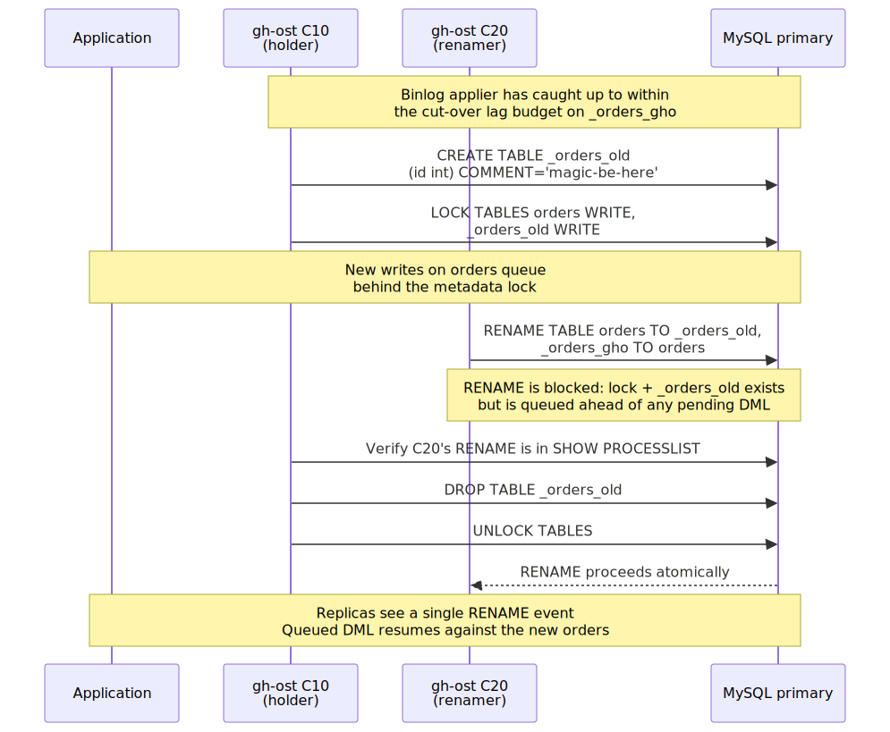
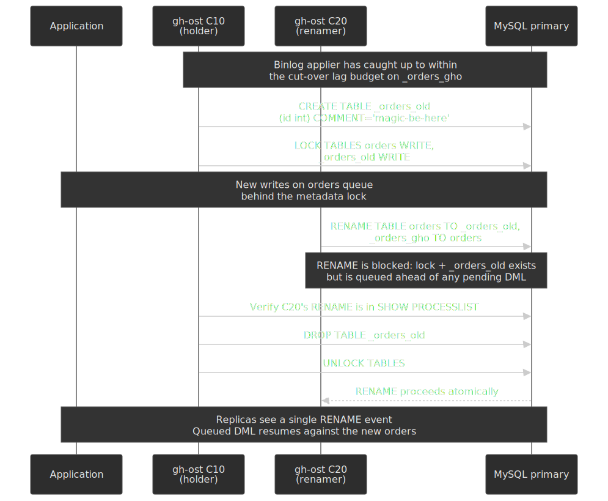

`C20`'s `RENAME` is blocked by `C10`'s lock **and** by the existence of `_orders_old`; MySQL prioritises a queued `RENAME` ahead of pending DML, so once `C10` drops the sentry and unlocks, the `RENAME` runs atomically before any waiting writes. The dual-block is also the safety net: if `C10` dies before dropping the sentry, the lock auto-releases but the `RENAME` still fails because `_orders_old` exists, and gh-ost simply retries the cut-over against the still-intact original table. Replicas only ever observe the single `RENAME` event in the binary log, which is why the swap appears instantaneous downstream.

**Trade-offs**

| Aspect               | Behaviour                                                                                   |
| -------------------- | ------------------------------------------------------------------------------------------- |
| Consistency          | Eventually consistent during migration (binlog applier lag)                                 |
| Performance overhead | Network and parsing for the binlog stream; no trigger overhead                              |
| Replication format   | Requires row-based replication (`binlog_format=ROW`) ([requirements](https://github.com/github/gh-ost/blob/master/doc/requirements-and-limitations.md)) |
| Foreign keys         | Not supported — binlog row events do not carry FK action information                        |
| Cut-over             | Coordinated lock-and-rename, typically a few hundred ms to a few seconds                    |
| Pause / resume       | True pause — stop binlog read and the migration consumes zero database resources            |
| Lag detection        | Heartbeat written into a control table at sub-second cadence ([subsecond-lag](https://github.com/github/gh-ost/blob/master/doc/subsecond-lag.md), default 100 ms) |

**When to choose**

- High write throughput where trigger overhead is unacceptable.
- Long-running migrations that need throttling, true pause, or `--postpone-cut-over` to schedule the swap during a maintenance window.
- MySQL 5.7+ / 8.0+ with row-based replication enabled.
- Tables with no foreign-key dependencies (parent or child).

> [!NOTE]
> Spirit ([block/spirit](https://github.com/block/spirit)) is gh-ost's modern reimplementation by Block (Cash App) — MySQL 8.0+ only, with multi-threaded row copy **and** multi-threaded binlog application, dynamic chunking (target a chunk-time budget instead of a fixed row count), checksum-on-cutover, and resume-from-checkpoint. The trade-off, called out by Spirit's own README, is that it is unsuitable when read replicas must stay within ~10 s of the writer; the optimisations that let it migrate a 10 TiB table in five days assume the migration may push replicas farther behind than gh-ost would.

### Path 3: Native instant DDL — MySQL 8.0+ and PostgreSQL 11+

#### MySQL `ALGORITHM=INSTANT`

MySQL 8.0.12 introduced `ALGORITHM=INSTANT` for adding columns at the end of a row; 8.0.29 generalised this to add or drop columns at any position ([release notes](https://dev.mysql.com/blog-archive/mysql-8-0-instant-add-and-drop-columns/)). Currently supported instant operations include:

- `ADD COLUMN` / `DROP COLUMN` (any position, since 8.0.29).
- `RENAME COLUMN`.
- `SET DEFAULT` / `DROP DEFAULT`.
- Modify `ENUM` / `SET` definitions when the new definition is a strict superset.
- `ALTER INDEX … VISIBLE/INVISIBLE`.

Instead of copying the table, MySQL stores the new column definition in metadata and tags each existing row with a row-version number; existing rows return `NULL` (or the default) for the new column until they are updated and physically rewritten in the new format.

```sql title="Instant DDL completes in milliseconds regardless of table size"
ALTER TABLE orders ADD COLUMN shipping_estimate DATETIME, ALGORITHM=INSTANT;
```

**The 64-version limit.** Each instant `ADD COLUMN` / `DROP COLUMN` increments the table's `TOTAL_ROW_VERSIONS` counter (visible in `INFORMATION_SCHEMA.INNODB_TABLES`). MySQL caps this at **64** to bound the complexity of decoding row formats during reads ([8.4 reference](https://dev.mysql.com/doc/refman/8.4/en/innodb-online-ddl-operations.html)). Beyond 64, the next instant operation fails with `ERROR 4092 (HY000)` and you must rebuild the table (`OPTIMIZE TABLE` or any table-rebuilding `ALTER`) to reset the counter. MySQL 9.1.0 raises the limit to 255.

| Aspect              | Behaviour                                                            |
| ------------------- | -------------------------------------------------------------------- |
| Speed               | Milliseconds for any table size                                      |
| Limitations         | 64 instant operations per table rebuild (255 in 9.1.0)               |
| Row format          | Compressed tables not supported                                      |
| Combined operations | An `ALTER` clause that mixes instant + non-instant runs as non-instant |
| Replication         | Replicas re-execute the DDL, which is also instant                   |

> [!WARNING]
> "Instant" only refers to the primary's metadata change. Replicas run the same DDL: instant operations stay instant; non-instant ones (a fallback `COPY`) re-block the replica's apply thread for the full table rebuild.

#### PostgreSQL `ADD COLUMN ... DEFAULT`

PostgreSQL has supported `ADD COLUMN` without rewriting the table since 9.x for nullable columns, and since [Postgres 11](https://www.postgresql.org/docs/release/11.0/) for columns with non-volatile defaults — the default is stored as table metadata and materialised lazily as rows are updated. `ADD COLUMN ... DEFAULT volatile_function()`, `ALTER COLUMN TYPE` (to a non-binary-compatible type), and changes that require a constraint check still trigger a full table rewrite under `AccessExclusiveLock`. For everything else, prefer expand-contract or [pgroll](https://github.com/xataio/pgroll).

> [!TIP]
> When the goal is to reorganise a bloated table or rebuild an index without an `ACCESS EXCLUSIVE` lock, [pg_repack](https://reorg.github.io/pg_repack/) is Postgres's equivalent of pt-osc / gh-ost: it builds a copy via triggers and `INSERT INTO ... SELECT`, replays accumulated changes from a log table, then briefly takes an `ACCESS EXCLUSIVE` lock to swap. Unlike `VACUUM FULL` or `CLUSTER`, the original table stays readable and writable throughout. It does **not** perform schema changes — pair it with expand-contract for column-level work.

### Path 4: Expand-Contract for data transformations

When the change is not just a schema change but also a data transformation (combining columns, splitting a column, populating a new computed value), the [expand-contract / parallel-change](https://martinfowler.com/bliki/ParallelChange.html) pattern decouples it into independently deployable stages.


**Stage 1 — Expand (backward compatible).** Add the new structure; keep the old one intact. Application v2 dual-writes to both columns.

```sql
ALTER TABLE users ADD COLUMN full_name VARCHAR(255);
```

```python title="Application v2 — dual write"
def update_user_name(user_id, first, last):
    db.execute("""
        UPDATE users
        SET first_name = %s, last_name = %s, full_name = %s
        WHERE id = %s
    """, (first, last, f"{first} {last}", user_id))
```

**Stage 2 — Migrate (transition).** Backfill old rows in throttled batches, then deploy app v3 to read from the new column.

```sql title="Throttled, primary-key-ordered backfill"
UPDATE users
SET full_name = CONCAT(first_name, ' ', last_name)
WHERE full_name IS NULL
ORDER BY id
LIMIT 10000;
```

```python title="Application v3 — read new column"
def get_display_name(user_id):
    return db.query("SELECT full_name FROM users WHERE id = %s", user_id)
```

**Stage 3 — Contract (remove legacy).** Once nothing reads or writes the old columns, drop them.

```python title="Application v4 — write only new column"
def update_user_name(user_id, full_name):
    db.execute("UPDATE users SET full_name = %s WHERE id = %s", (full_name, user_id))
```

```sql
ALTER TABLE users DROP COLUMN first_name, DROP COLUMN last_name;
```

| Aspect                 | Behaviour                                                          |
| ---------------------- | ------------------------------------------------------------------ |
| Rollback capability    | Each stage is independently reversible                             |
| Deployment flexibility | Different services can be at different stages simultaneously       |
| Complexity             | Multiple deployments and temporary increase in storage             |
| Duration               | Days to weeks for full migration                                   |

Stripe describes a four-phase variant of this in [Online migrations at scale](https://stripe.com/blog/online-migrations) — dual-write → change reads → change writes → drop legacy — and explicitly emphasises keeping each rollout small ("we never attempt to change more than a few hundred lines of code at one time").

[pgroll](https://github.com/xataio/pgroll) is a productised expand-contract for Postgres 14+: it materialises every migration as a versioned view so applications can read and write through either schema until the contract phase deletes the old one.

## Production implementations

### GitHub: gh-ost on `commits` and `pull_requests`

GitHub serves millions of repositories from MySQL clusters with hundreds of thousands of writes per second. Schema changes on the `commits` and `pull_requests` tables (billions of rows) became impractical with trigger-based tools because trigger contention serialised writes; GitHub built [gh-ost](https://github.blog/news-insights/company-news/gh-ost-github-s-online-migration-tool-for-mysql/) to remove triggers from the hot path.

Implementation choices that matter in production:

- **Read binlog from a replica**, not the primary, to keep migration overhead off the write path.
- `--postpone-cut-over` to defer the final swap until an operator approves it, allowing the binlog applier to "catch up" indefinitely until off-peak hours.
- Dynamic configuration via Unix socket (`echo throttle | nc -U /tmp/gh-ost.sock`) for runtime throttling and pause without restarting the migration.
- Heartbeat injection at sub-second cadence ([default 100 ms](https://github.com/github/gh-ost/blob/master/doc/subsecond-lag.md)) for accurate replica-lag throttling.
- Test-on-replica mode — run the migration against a replica that is detached from production traffic, using the binlog stream from production, to validate the new schema with real data without ever touching the primary.

The hard parts:

- Single-threaded binlog application can fall behind sustained high write loads — gh-ost will lag indefinitely if writes exceed binlog applier throughput, and you have to either accept a longer migration or temporarily reduce write traffic.
- Network bandwidth becomes the bottleneck when copying both the data and the binlog stream off a replica.
- The cut-over has had several historical bug classes (deadlocks when the sentry table is dropped before the lock is released, MDL escalation surprises) — Block's Spirit was partly a response to that.

### Slack: Vitess at 2.3 M QPS

Slack's messaging infrastructure scaled from a single MySQL shard to a fleet of [Vitess](https://vitess.io/) keyspaces between 2017 and 2020. By December 2020 Vitess served ~2.3 M QPS at peak (~2 M reads, ~300 k writes), with median query latency around 2 ms ([Slack engineering: Scaling Datastores at Slack with Vitess](https://slack.engineering/scaling-datastores-at-slack-with-vitess/)).


Pattern variant — VReplication-based cloning. For each table moving into Vitess, Slack:

- Used Vitess's [VReplication](https://vitess.io/docs/22.0/reference/vreplication/) to backfill from the source MySQL cluster.
- Double-wrote from the application to both the legacy table and the Vitess keyspace, gated behind feature flags.
- Ran a parallel double-read diffing system that compared every read result from both stores in production and alerted on mismatches before traffic was cut over.
- Co-located all data for a Slack workspace on the same shard, so workspace-scoped queries do not need cross-shard joins.

What worked: Vitess's built-in consistency guarantees (atomic cut-over via `MoveTables`, `Reshard`) replaced custom verification code. Declarative schema migrations through Vitess (`vtctldclient ApplySchema`) computed the diff and ran the OSC tool of choice on each shard.

What was hard: a 3-year migration timeline forces backward compatibility for the entire window. Double-read diffing caught real bugs that would have caused data loss — and slowed the migration by months while teams chased every mismatch.

### Figma: horizontal sharding on Postgres with DBProxy

Figma had a single PostgreSQL primary on AWS's largest RDS instance and saw it approaching CPU and IOPS limits as the document graph grew. After vertical partitioning by use case ([growing pains, 2023](https://www.figma.com/blog/how-figma-scaled-to-multiple-databases/)) bought time but did not buy headroom, the team built horizontal sharding directly on Postgres ([how Figma's databases team lived to tell the scale, 2024](https://www.figma.com/blog/how-figmas-databases-team-lived-to-tell-the-scale/)).


Implementation choices:

- **DBProxy** — a Go service between the application and PgBouncer that parses SQL into an AST, runs a logical planner to determine the shard key, and a physical planner to route to the right Postgres shard.
- **Logical vs physical sharding split** — define logical shards in the application layer first (one Postgres still hosting many "logical shards"), then move logical shards to physical Postgres instances later. This decoupled the high-risk routing change from the high-risk physical migration.
- **Shadow traffic / readiness testing** — replay live read traffic through the candidate routing before any real cut-over, comparing results.
- **Failover with ~10 s of partial availability** on primaries during a physical shard split, and **no impact on replicas**. (For comparison, the earlier vertical-partitioning project was tuned for ~30 s of partial availability with ~2 % requests dropped.)

What worked: keeping rollback paths open at every stage; never doing a "one-way door" migration. Choosing custom-on-Postgres over CockroachDB / TiDB / Spanner / Vitess avoided cross-engine risk for the migration window, at the cost of carrying more long-term operational surface area.

What was hard: every cross-shard query becomes either a fan-out, a denormalised copy, or a forbidden pattern enforced at the proxy. Schema design has to anticipate sharding from the start — backfilling shard keys onto an unsharded table is itself a multi-month migration.

### Stripe: Scientist for verification during expand-contract

Stripe migrates millions of active payment objects under strict consistency requirements ([Online migrations at scale](https://stripe.com/blog/online-migrations)). The signature pattern is expand-contract plus runtime comparison via the [Scientist](https://github.com/github/scientist) Ruby library, originally written at GitHub for refactoring critical paths.

```ruby title="Scientist runs old and new in parallel and compares results"
experiment = Scientist::Experiment.new("order-migration")
experiment.use { legacy_order_lookup(id) }     # control: returned to caller
experiment.try { new_order_lookup(id) }        # candidate: compared, never returned
experiment.run
```

Operational rules Stripe applies:

- Scientist is **only ever used on reads**; running side-effecting code through both branches would execute writes twice.
- Mismatches are logged with full payload context (using domain-specific comparator hooks) and trigger alerts so engineers can fix the new path before changing the read source.
- Heavy reconciliation runs offline (Hadoop / Scalding) instead of as production queries, so the verification step does not amplify load on the database being migrated.
- Each rollout step is kept small enough to revert with a single deploy ("we never attempt to change more than a few hundred lines of code at one time").

What was hard: Scientist runs control and candidate sequentially, so data can change between executions, producing false-positive mismatches; the comparator has to be aware of the tolerated diff window. Comparing every request also adds CPU and RPC overhead, so high-volume code paths sample a percentage rather than running 100 % of requests through both branches.

### Implementation comparison

| Aspect       | GitHub (gh-ost)  | Slack (Vitess)             | Figma (custom)             | Stripe (expand-contract)             |
| ------------ | ---------------- | -------------------------- | -------------------------- | ----------------------------------- |
| Approach     | Binlog-based OSC | VReplication + double-read | DBProxy + horizontal shard | Expand-contract + Scientist verify  |
| Scale        | Billions of rows | ~2.3 M QPS at peak (2020)  | Largest RDS → sharded fleet | Millions of payment objects        |
| Cut-over     | 1–3 s, sentry-table swap | Vitess `MoveTables` cut-over | ~10 s partial availability per shard split | Zero (per-stage app deploys) |
| Verification | Test-on-replica  | Parallel double-read diff  | Shadow traffic / readiness | Scientist runtime comparison        |
| Rollback     | Re-run migration | VReplication reverse       | Maintained per stage       | Per-stage app revert                |

## Implementation guide

### Picking the tool


| Tool / approach | Best for                                                | Avoid when                                                |
| --------------- | ------------------------------------------------------- | --------------------------------------------------------- |
| **Direct ALTER (INPLACE/INSTANT)** | Supported operations on small-to-medium tables; INSTANT works at any size | Operations that fall back to `COPY`; tables near the 64-version limit |
| **pt-osc**      | Tables with foreign keys; SBR/mixed replication; lower throughput | Sustained high write load (trigger overhead)              |
| **gh-ost**      | High write throughput, true pause, test-on-replica needs | Tables with FK relationships; SBR-only environments       |
| **Spirit**      | MySQL 8.0+, want a maintained gh-ost successor          | MySQL 5.7 or earlier; need foreign-key support            |
| **Vitess (incl. Online DDL)** | Already on Vitess; want declarative cut-over          | Single-keyspace deployments where the operator overhead is not justified |
| **pgroll**      | PostgreSQL 14+, reversible expand-contract              | Older Postgres; cases where view-based abstraction breaks ORM tooling |
| **pg_repack**   | Postgres bloat / index reorganisation without `ACCESS EXCLUSIVE` | Schema changes (does not run `ALTER`); tables without a primary key or unique not-null constraint |

### Backfill rules

Backfill jobs are where almost every "we have a plan" migration falls over in production. The [Stripe blog](https://stripe.com/blog/online-migrations) and [GitHub gh-ost docs](https://github.com/github/gh-ost/blob/master/doc/throttle.md) converge on the same four invariants:

```python title="A safe backfill loop"
def backfill_column(batch_size=10000, sleep_between=0.5):
    last_id = load_checkpoint()
    while True:
        result = db.execute("""
            UPDATE users
            SET full_name = CONCAT(first_name, ' ', last_name)
            WHERE id > %s AND full_name IS NULL
            ORDER BY id
            LIMIT %s
        """, (last_id, batch_size))

        if result.rowcount == 0:
            break

        last_id = result.last_id
        save_checkpoint(last_id)

        if replica_lag_ms() > 1000:
            sleep_between = min(sleep_between * 2, 30)
        time.sleep(sleep_between)
```

- **Idempotent.** Re-running on the same range must be safe (use `WHERE … IS NULL` predicates or `INSERT ... ON CONFLICT DO NOTHING`).
- **Resumable.** Persist a checkpoint per batch — never rely on memory.
- **Throttled.** Watch replica lag (and primary CPU); back off exponentially when it exceeds threshold.
- **Primary-key ordered.** Avoid full table scans; never `OFFSET / LIMIT` on a moving target.

### Cut-over checklist

Before:

- [ ] Shadow table row count matches original within the replication-lag window.
- [ ] Checksum verification passes (`pt-table-checksum`, Spirit's `--checksum`, or VReplication's `VDiff`).
- [ ] Replica lag is within the budget you set for the swap.
- [ ] No long-running queries on the table — `SHOW PROCESSLIST` and `performance_schema.metadata_locks` are clean.
- [ ] Rollback procedure documented and rehearsed.

During:

- [ ] Cut-over scheduled in a low-traffic window.
- [ ] Latency, error rate, and replica-lag dashboards visible.
- [ ] On-call engineer has the abort command in shell history.
- [ ] Pre-defined rollback trigger (e.g., p99 latency > 500 ms or 5xx rate > 1 %).

After:

- [ ] Application metrics stable for at least one full traffic cycle.
- [ ] Old table preserved for 24–48 h for emergency rollback.
- [ ] Cleanup scheduled to drop the old table after the validation window.

## Common pitfalls

### 1. Long-running queries block the cut-over

**Failure mode.** The shadow tools need a brief metadata lock to perform the final `RENAME`. A long-running `SELECT` (analytics, reporting, a forgotten cron) holds an MDL that blocks the cut-over; new queries queue behind that, and the application sees a stall.

**Mitigation.** Kill long-running queries in the cut-over window, schedule `--postpone-cut-over` for low-traffic, and set `lock_wait_timeout` low enough that the migration aborts fast rather than queueing the world behind it.

### 2. Foreign keys with gh-ost / Spirit

**Failure mode.** gh-ost creates the shadow without FK relationships, then tries to swap. Inserts to child tables that reference the parent fail because the FK still points to the old name; or, worse, the swap leaves dangling FKs.

**Mitigation.** Use pt-osc with `--alter-foreign-keys-method=auto`. If you must use a binlog tool, drop the FK before, run the migration, and recreate the FK after — accepting that referential integrity is application-enforced for the duration.

### 3. Underestimating backfill duration

**Failure mode.** Staging finishes the backfill in 2 h; production takes 2 days because of higher concurrency, larger transactions, replica lag, and throttling. The contract phase blocks behind it; engineers panic-rush it and break.

**Mitigation.** Estimate using production write rate × table size, not staging timing. Run the first 1 % of the backfill in production and extrapolate. Parallelise across partitions when the table is partitioned. Always keep aggressive throttling — better slow than blocking traffic.

### 4. Missing rollback plan

**Failure mode.** Migration completes; application deployed; data corruption discovered an hour later. The old schema is gone; the old data is gone; there is no clean path back.

**Mitigation.** Keep old columns/tables for 24–48 h after cut-over. Design for bidirectional compatibility during the expand phase (the dual-write should be reversible). Rehearse the rollback in staging before starting the real migration.

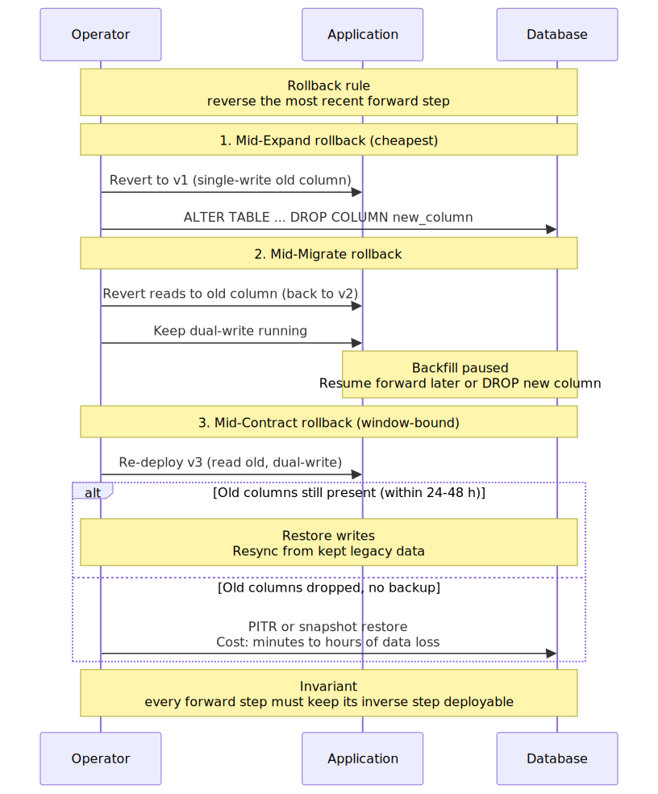
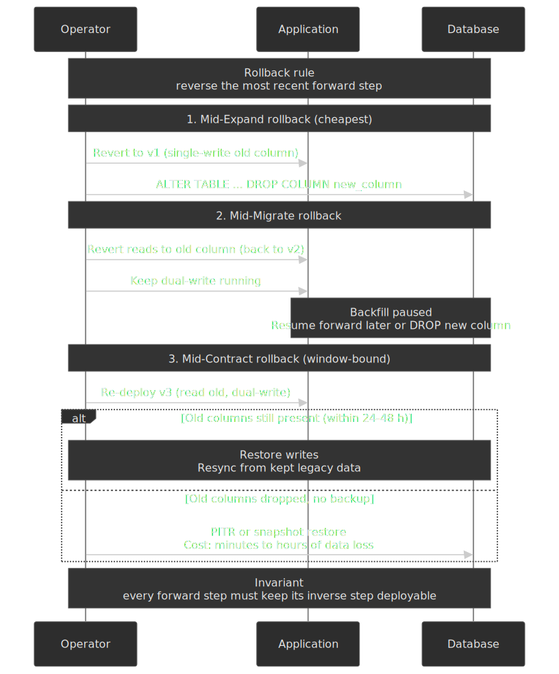

### 5. The 64-version INSTANT DDL limit

**Failure mode.** Several routine `ADD COLUMN`/`DROP COLUMN` operations have happened over a year. The next instant operation fails with `ERROR 4092`, and an engineer running a normal-looking `ALTER … ALGORITHM=INSTANT` instead gets a multi-hour `COPY` rebuild.

**Mitigation.** Track `TOTAL_ROW_VERSIONS` per table:

```sql
SELECT NAME, TOTAL_ROW_VERSIONS
FROM INFORMATION_SCHEMA.INNODB_TABLES
WHERE TOTAL_ROW_VERSIONS >= 50;
```

Schedule an `OPTIMIZE TABLE` (or any table-rebuilding ALTER) during a maintenance window when you cross ~50 versions.

### 6. Dual-write without verification

**Failure mode.** Application writes to both old and new tables, but no read path exercises the new one until cut-over day. Every bug in the dual-write has been silently building inconsistency.

**Mitigation.** Add a dual-read step (Scientist-style or Slack's diffing) before the cut-over. Run a pre-cut-over checksum/diff job (`pt-table-checksum`, VReplication `VDiff`, or a custom row-by-row hash) and only proceed when it converges.

## Conclusion

Database migrations at scale reduce to one principle: **isolate change from production traffic through incremental, reversible steps.** The shadow-table approach (trigger-based pt-osc, binlog-based gh-ost / Spirit) lets schema changes happen without downtime. Expand-contract lets data transformations happen without big-bang deploys. Native instant DDL lets metadata changes happen without copying.

The production patterns — verification via Scientist-style comparison, throttled backfills, careful cut-over coordination — exist because migrations fail. GitHub built gh-ost after trigger-based tools caused deadlocks. Slack built double-read diffing because dual-write alone caught fewer bugs than expected. Figma built custom sharding after concluding that NewSQL migrations carried more risk than incremental sharding on Postgres. Stripe built Scientist usage into every migration after subtle code-path bugs slipped through reviews.

The common thread: plan for rollback at every stage, verify before trusting, and never assume the happy path.

## Appendix

### Prerequisites

- Familiarity with relational replication (binary log / WAL, replica lag).
- ACID transactions, isolation levels, and metadata locking.
- Blue-green deployment patterns at the application layer.

### Summary

- **Shadow-table tools** — pt-osc (triggers, supports FK) vs. gh-ost / Spirit (binlog, higher throughput, no FK).
- **Expand-contract** — for any change that requires data transformation; decouple into independently deployable stages.
- **Instant DDL** — use for supported ops on MySQL 8.0+ and Postgres 11+; track the 64-version limit on MySQL.
- **Verification matters** — Scientist-style runtime comparison, double-read diffing, or pre-cut-over checksums; pick at least one.
- **Plan for failure** — keep old structures for 24–48 h, rehearse rollback before starting.

### References

- [gh-ost — GitHub's online schema migration tool](https://github.com/github/gh-ost) — design docs, [cut-over algorithm](https://github.com/github/gh-ost/blob/master/doc/cut-over.md), [requirements & limitations](https://github.com/github/gh-ost/blob/master/doc/requirements-and-limitations.md), [sub-second lag](https://github.com/github/gh-ost/blob/master/doc/subsecond-lag.md), [throttling](https://github.com/github/gh-ost/blob/master/doc/throttle.md).
- [Spirit — block/spirit](https://github.com/block/spirit) — modern reimplementation of gh-ost, MySQL 8.0+.
- [pt-online-schema-change](https://docs.percona.com/percona-toolkit/pt-online-schema-change.html) — Percona Toolkit documentation.
- [MySQL 8.4 reference: online DDL operations](https://dev.mysql.com/doc/refman/8.4/en/innodb-online-ddl-operations.html) and [performance & concurrency](https://dev.mysql.com/doc/refman/8.4/en/innodb-online-ddl-performance.html).
- [MySQL 8.0 INSTANT ADD and DROP Column(s)](https://dev.mysql.com/blog-archive/mysql-8-0-instant-add-and-drop-columns/) — release notes for the 8.0.29 generalisation.
- [PostgreSQL `ALTER TABLE` documentation](https://www.postgresql.org/docs/current/sql-altertable.html).
- [pgroll — zero-downtime migrations for PostgreSQL](https://github.com/xataio/pgroll).
- [pg_repack — reorganize Postgres tables without `ACCESS EXCLUSIVE` locks](https://reorg.github.io/pg_repack/).
- [Vitess Online DDL](https://vitess.io/docs/22.0/user-guides/schema-changes/managed-online-ddl/) and [VReplication reference](https://vitess.io/docs/22.0/reference/vreplication/).
- [Stripe engineering — Online migrations at scale](https://stripe.com/blog/online-migrations).
- [GitHub Scientist](https://github.com/github/scientist).
- [Slack engineering — Scaling Datastores at Slack with Vitess](https://slack.engineering/scaling-datastores-at-slack-with-vitess/).
- [Figma — How Figma's databases team lived to tell the scale](https://www.figma.com/blog/how-figmas-databases-team-lived-to-tell-the-scale/) and [The growing pains of database architecture](https://www.figma.com/blog/how-figma-scaled-to-multiple-databases/).
- [Martin Fowler — ParallelChange](https://martinfowler.com/bliki/ParallelChange.html).
