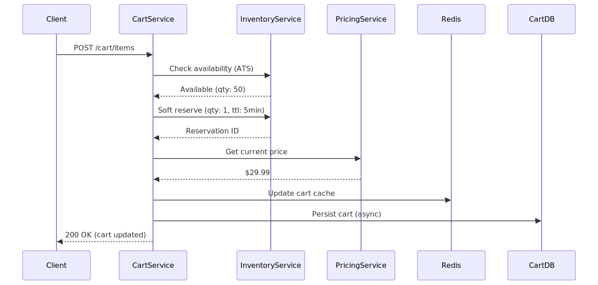
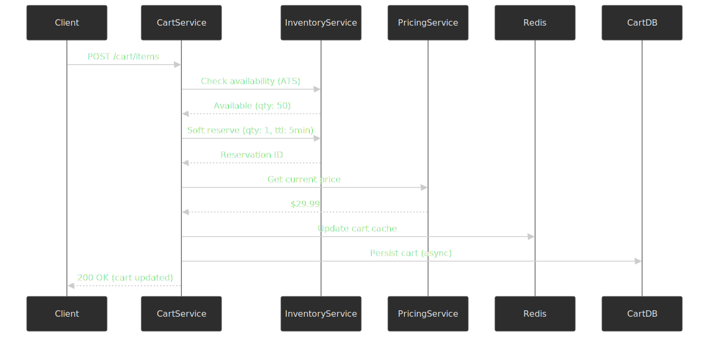

# Design Amazon Shopping Cart

A system design for an e-commerce shopping cart that survives flash sales: millions of concurrent shoppers, real-time inventory, dynamic pricing, and a distributed checkout that must be atomic without distributed locks. The thesis: the cart is the canonical "always writeable" workload from the Dynamo paper[^dynamo] — solve write availability with replication and **semantic conflict resolution** at read time, solve inventory contention with **soft reservations**, and solve checkout atomicity with an **idempotent saga** and per-step compensations. Accept eventual consistency everywhere except checkout.




## Abstract

Shopping cart systems sit between three loosely-coupled but easily-conflicting concerns: **cart state persistence** (guest vs authenticated, cross-device, merge on login), **inventory accuracy** (avoid overselling without tanking availability), and **checkout atomicity** (payment + inventory deduction + order creation across independent services).

Five architectural decisions drive the rest of the design:

1. **Always-writeable cart** — Dynamo's foundational design choice (SOSP 2007 §4.4–§6.1) was to never reject a cart write; conflicts are reconciled by the application at read time via semantic merge[^dynamo]. We adopt the same primitive even on a relational backing store: idempotent line-level `(cart_id, sku, variant)` upserts, monotonic line versions, and a deterministic merge function.
2. **Two-tier cart storage** — Redis for sub-millisecond reads on the hot browse/edit path; a relational store (PostgreSQL) for durability, merge queries, and multi-device sync. A pure Dynamo-style KV (DynamoDB, Cassandra, Riak, ScyllaDB) is the alternative — see [Storage Model](#storage-model-dynamo-style-kv-vs-two-tier-rdbms) for when to flip the default.
3. **Soft reservations with TTL** — reserve units on add-to-cart with a short expiry (typically 5–15 min, per [Microsoft Dynamics 365 inventory guidance](https://learn.microsoft.com/en-us/dynamics365/supply-chain/inventory/inventory-visibility-reservations)); convert to a hard reservation only after payment is authorized. Reservation is the seam between the loosely-consistent cart and the strongly-consistent ledger.
4. **Saga for checkout** — orchestrated sequence of validate → authorize → reserve → create order → capture, with explicit compensating transactions on each failure. The saga concept is from Garcia-Molina & Salem's 1987 SIGMOD paper on long-lived transactions[^sagas].
5. **Eventually consistent display, strongly consistent checkout** — accept stale stock counts on product pages and recover at checkout. This is exactly Vogels' "eventually consistent" trade-off applied per operation type[^vogels-ec].

| Dimension              | Optimizes for              | Sacrifices                                |
| ---------------------- | -------------------------- | ----------------------------------------- |
| Redis cart cache       | Read latency (<1 ms)       | Durability (requires DB persistence)      |
| Soft reservations      | Inventory turnover         | Checkout may fail if reservation expired  |
| Saga orchestration     | Reliability, debuggability | Latency (sequential steps + compensation) |
| Hash-shard by `cart_id`| Even load distribution     | Cross-user analytics queries              |

[^sagas]: Hector Garcia-Molina and Kenneth Salem, *Sagas*, ACM SIGMOD 1987 — [PDF](https://www.cs.cornell.edu/andru/cs711/2002fa/reading/sagas.pdf).

[^vogels-ec]: Werner Vogels, *Eventually Consistent*, ACM Queue 6(6), Dec 2008; reprinted CACM 52(1), Jan 2009 — [queue.acm.org/detail.cfm?id=1466448](https://queue.acm.org/detail.cfm?id=1466448), [DOI 10.1145/1435417.1435432](https://doi.org/10.1145/1435417.1435432). The article uses the Amazon shopping cart as the worked example for the always-writeable / merge-on-read pattern.

## Requirements

### Functional Requirements

| Feature                      | Scope    | Notes                                                  |
| ---------------------------- | -------- | ------------------------------------------------------ |
| Add/remove/update cart items | Core     | Real-time quantity validation against inventory        |
| Guest cart with persistence  | Core     | Survives browser close, 30-day expiry                  |
| Cart merge on login          | Core     | Combine guest + user cart, resolve quantity conflicts  |
| Real-time price updates      | Core     | Price at checkout reflects current price, not add-time |
| Inventory soft reservation   | Core     | Prevent checkout failures from out-of-stock            |
| Coupon/promotion application | Core     | Stackable rules, exclusivity handling                  |
| Multi-step checkout          | Core     | Address → Payment → Review → Confirm                   |
| Abandoned cart recovery      | Extended | Email/push notifications with cart link                |
| Wishlist / Save for Later    | Extended | Move items between cart and wishlist                   |

### Non-Functional Requirements

| Requirement        | Target                                | Rationale                                                  |
| ------------------ | ------------------------------------- | ---------------------------------------------------------- |
| Availability       | 99.99% (4 nines)                      | Revenue-critical — every minute of downtime is direct loss |
| Cart read latency  | p99 < 50 ms                           | Instant feedback on cart interactions                      |
| Cart write latency | p99 < 200 ms                          | Acceptable for add/remove operations                       |
| Checkout latency   | p99 < 3 s                             | End-to-end including payment authorization                 |
| Peak throughput    | 100K cart ops/sec                     | Flash sale scenarios                                       |
| Data durability    | 99.999999999% (11 nines)              | Cart loss is a customer-trust event                        |
| Consistency        | Eventual (display), Strong (checkout) | Hybrid model per operation type                            |

### Scale Estimation

These are illustrative back-of-envelope numbers calibrated against published Shopify and Amazon scale points; they are not Amazon's real numbers (which Amazon does not publish for cart subsystems). For anchoring: Shopify reported peak BFCM 2024 sales of ~$4.6M/min and ~80M app-server requests/min, with internal scale tests reaching 80,000+ checkouts/min[^bfcm]. AWS reports DynamoDB peaked at **126M req/s** during Prime Day 2023 and **146M req/s** during Prime Day 2024 across Amazon retail's many DynamoDB tables, while sustaining single-digit millisecond reads[^primeday]. Cart is one of *many* tables that contributes to that envelope, not the whole of it.

**Users**

- DAU: 50M
- Peak concurrent users: 5M (10% of DAU during a flash sale)
- Active carts per user: 1

**Traffic**

- Cart views: 50M DAU × 10 views/day = 500M/day ≈ 6K RPS average
- Cart modifications: 50M DAU × 3 ops/day = 150M/day ≈ 1.7K RPS average
- Peak multiplier (flash sale): 50× → 300K cart views/sec, 85K modifications/sec
- Checkouts: 5M/day ≈ 60/sec average, 3K/sec peak

**Storage**

- Cart record: ~2 KB (metadata + 10 items average)
- Active carts: 50M × 2 KB ≈ 100 GB
- Historical (90-day retention): ~300 GB
- With 3× replication: ~1 TB total

**Inventory**

- SKUs: 100M products
- Inventory checks: 500M/day (1 per cart view)
- Reservation writes: 150M/day

[^bfcm]: Shopify, *New achievement unlocked: $11.5B in BFCM 2024 sales* — [shopify.com/news/bfcm-data-2024](https://www.shopify.com/news/bfcm-data-2024); Shopify Engineering, *How we prepare Shopify for BFCM (2025)* — [shopify.engineering/bfcm-readiness-2025](https://shopify.engineering/bfcm-readiness-2025).

[^primeday]: AWS News Blog — *Prime Day 2023 powered by AWS — all the numbers* ([aws.amazon.com/blogs/aws/prime-day-2023-powered-by-aws-all-the-numbers](https://aws.amazon.com/blogs/aws/prime-day-2023-powered-by-aws-all-the-numbers/)) and *How AWS powered Prime Day 2024 for record-breaking sales* ([aws.amazon.com/blogs/aws/how-aws-powered-prime-day-2024-for-record-breaking-sales](https://aws.amazon.com/blogs/aws/how-aws-powered-prime-day-2024-for-record-breaking-sales/)).

## Design Paths

A "shopping cart" can mean very different systems depending on inventory criticality. Two archetypes bracket the space.

### Path A: Consistency-First (financial / scarce inventory)

**Best when:**

- High-value items where overselling has material cost (electronics, luxury goods).
- Strictly limited inventory (concert tickets, limited drops).
- Regulatory or contractual inventory accuracy requirements.

**Architecture:**

- Strong consistency for every inventory operation (single-leader writes, synchronous replication).
- Synchronous inventory checks before cart-add succeeds.
- Pessimistic locking (or serializable isolation) during checkout.

**Trade-offs:**

- ✅ Zero overselling.
- ✅ Inventory counts are accurate everywhere.
- ❌ Higher latency from lock contention.
- ❌ Lower throughput under burst load.
- ❌ Checkout-failure rate climbs during traffic spikes (lock timeouts).

**Real-world example:** Ticketing platforms commonly serialize seat selection through a virtual waiting room when demand exceeds inventory, precisely to enforce strong consistency on a tiny pool of reserved seats — see [Queue-it: overselling prevention](https://queue-it.com/blog/overselling/) for the operational pattern.

### Path B: Availability-First (high-volume retail)

**Best when:**

- Inventory buffers are large enough that overselling is rare.
- Customer-perceived speed matters more than perfect accuracy.
- The business can afford to compensate the rare oversold customer (refund + apology + alternative).

**Architecture:**

- Eventually consistent inventory reads (replicas, caches).
- Optimistic updates; conflict resolution at checkout.
- Tolerate occasional overselling, recover via backorder or compensation flow.

**Trade-offs:**

- ✅ Sub-millisecond cart operations.
- ✅ Graceful behavior under extreme bursts.
- ✅ Fewer abandoned carts from latency stalls.
- ❌ Occasional overselling (low-single-digit-percent worst case on flash sales).
- ❌ Requires a robust customer-recovery workflow (refund, apology, restock alert).

**Real-world example:** Amazon's foundational *Dynamo* paper (SOSP 2007) explicitly chose this side of the trade-off: shopping cart was the motivating use case, the system was designed to be "always writeable", and conflicts (e.g. concurrent "add to cart" from different replicas) were resolved later via semantic merging — never by rejecting the write[^dynamo].

[^dynamo]: G. DeCandia et al., *Dynamo: Amazon's Highly Available Key-value Store*, SOSP 2007 — [PDF](https://www.allthingsdistributed.com/files/amazon-dynamo-sosp2007.pdf). Modern AWS provides this pattern as DynamoDB Global Tables — see [Global tables docs](https://docs.aws.amazon.com/amazondynamodb/latest/developerguide/GlobalTables.html).

### Path Comparison

| Factor                 | Path A: Consistency-First | Path B: Availability-First  |
| ---------------------- | ------------------------- | --------------------------- |
| Inventory accuracy     | 100%                      | 99.9%+                      |
| Cart-add latency       | 50–200 ms                 | < 10 ms                     |
| Peak throughput        | ~10K ops/sec              | 100K+ ops/sec               |
| Checkout failure rate  | Higher (lock timeouts)    | Lower (optimistic)          |
| Operational complexity | Lower                     | Higher (compensation flows) |
| Best for               | Tickets, luxury, limited  | General retail, commodities |

### This article's focus

The rest of this article designs **Path B (Availability-First)** because that's the regime Amazon, Shopify, Walmart, and most large retailers actually run. Path-A patterns are called out where the inventory criticality flips.

## Storage Model: Dynamo-Style KV vs Two-Tier RDBMS

The cart write path is the design's center of gravity. Two storage philosophies bracket what's reasonable, and the choice changes how every other component (merge, multi-device sync, idempotency, failure modes) is implemented.

### The Dynamo thesis: never reject a cart write

The original *Dynamo: Amazon's Highly Available Key-value Store* paper (SOSP 2007) was motivated explicitly by the shopping cart[^dynamo]. The hard requirement was that an `add to cart` must succeed under network partitions, replica failures, and even data-center outages — "always writeable" is the literal phrase used in §1[^dynamo]. To get that, Dynamo gives up linearizability:

- **Replication.** Every key is replicated to N nodes on a consistent-hash ring, with tunable read/write quorums (`R`, `W`). The cart used `N=3, R=2, W=2` historically, but `W=1` with sloppy quorum and hinted handoff is the regime that makes the system "always writeable" during partitions[^dynamo §4.5].
- **Object versioning.** Every write produces a new immutable version stamped with a **vector clock** of `(node, counter)` pairs (§4.4). Concurrent versions are not collapsed.
- **Reconciliation on read.** When a read sees versions whose vector clocks are *concurrent* (neither descends from the other), Dynamo returns **all** of them as **siblings** and lets the application merge them (§4.4 + §6.1). The merged version is written back with a vector clock that descends from all siblings.
- **Cart-specific merge.** The shopping cart's reconciliation function is a **set union of items, with `max` over per-SKU quantity** (§6.1). The paper is explicit that this can resurrect items the user just removed — that is the trade Amazon accepted to never lose an `add` (§6.1, "the only side effect").

> [!IMPORTANT]
> Vogels' 2008/2009 *Eventually Consistent* article makes the same point in plain English: Amazon's cart is built so that adds keep succeeding through a network partition even when the original cart sits on an unreachable partition; the application reconciles divergent versions once the partition heals[^vogels-ec]. Reach for this article whenever you need to convince a reviewer that consistency is an SLA per operation, not a property of the system.


### Why Cassandra LWW is the wrong shape for a cart

Cassandra is the most common Dynamo-inspired store engineers reach for, but its conflict-resolution model differs in a way that is fatal for cart correctness if you ignore it:

| Property                       | Dynamo / Riak / DynamoDB         | Cassandra                                                       |
| :----------------------------- | :------------------------------- | :-------------------------------------------------------------- |
| Causality tracking             | Vector clocks (per object)       | None at the value level                                         |
| Conflict resolution            | Application-level sibling merge  | Last-Write-Wins by client/coordinator timestamp                 |
| Granularity                    | Whole object                     | Per column                                                      |
| Behavior on concurrent updates | Both versions preserved as siblings | One version silently overwrites the other (highest µs wins)  |
| Clock dependency               | Tolerant (causality, not time)   | Hard — NTP skew can cause silent data loss                      |

Cassandra's per-column LWW is well documented in its data-model docs and is the dominant cause of "we lost an item from the cart" bugs in cart implementations on Cassandra-family stores[^cassandra-lww]. The mitigations are real but unergonomic: encode the cart as a `set<frozen<line>>` so each item is its own column (LWW resolves per line, not per cart), or carry a CRDT (e.g. an OR-Set) on top. Either way you are reinventing siblings.

DynamoDB by default also resolves at the item level with LWW on the *write* — it doesn't expose vector clocks. To recover Dynamo's sibling semantics on DynamoDB you do one of:

1. **Per-line items.** Model each cart line as its own item (`PK = cart_id, SK = sku#variant`), use idempotent `UpdateItem` with conditional expressions on a monotonic version, and run an application-side merge over the full collection. This is what most production carts on DynamoDB look like in 2026.
2. **CRDT layer.** Store a serialized OR-Set (observed-remove set) per cart and reconcile in the client. CRDTs avoid the "deletion resurrection" problem of the original Dynamo cart at the cost of metadata size.
3. **Multi-region strong consistency.** DynamoDB Global Tables shipped a multi-region strong-consistency mode that gives linearizable cross-region reads at the cost of write latency — useful for the *checkout ledger*, not the *cart hot path*[^global-tables].

### Why this article picks two-tier RDBMS

The reference design here uses **PostgreSQL + Redis** rather than a Dynamo-family KV. The trade-offs:

| Criterion                       | Dynamo-style KV (DynamoDB / Cassandra)              | Two-tier RDBMS (PostgreSQL + Redis)                  |
| :------------------------------ | :-------------------------------------------------- | :--------------------------------------------------- |
| Always-writeable under partition | Native (sloppy quorum, hinted handoff)              | Achieved via async DB write + Redis primary          |
| Multi-region multi-active       | Native (Global Tables)                              | Bolt-on (logical replication, conflict CDC)          |
| Cart merge implementation       | App-level sibling reconciliation                    | Idempotent line upserts on `(cart_id, sku, variant)` |
| Coupon / promotion joins        | Awkward (denormalize or move out of KV)             | Native SQL joins                                     |
| Operational familiarity         | Specialized                                         | Mainstream                                           |
| Storage cost at 100M+ carts     | Lower (no joins, predictable per-item)              | Higher                                               |
| Right answer when               | Multi-region active-active is mandatory; team owns the merge function | Single-region or active-passive; cart is one slice of a richer relational model |

We pick the two-tier RDBMS variant because it minimizes cognitive load for the rest of the article — but **every API and data-flow primitive below (idempotency keys, line versioning, deterministic merge) is the one you need on Dynamo-style storage too**. Where the choice changes a section materially, it's called out inline.

## High-Level Design

### Service Architecture


### Cart Service

Manages cart lifecycle: creation, item management, persistence, and merge.

**Responsibilities:**

- CRUD on cart items.
- Guest cart token generation and lookup.
- Cart merge on user authentication.
- Coordinating price + availability validation.
- Scheduling cart expiration.

**Add-to-cart flow:**




> [!NOTE]
> Persisting the cart to the relational store *asynchronously* is what gets the write latency under 200 ms. The trade-off: a Redis-only window of a few hundred milliseconds where a cart write can be lost. Acceptable for cart deltas; **not** acceptable for the order itself, which is written synchronously inside the saga.

### Inventory Service

Manages stock levels, reservations, and per-warehouse allocation.

**Key concepts:**

- **Available-to-Sell (ATS):** physical on-hand inventory minus hard reservations (and any safety-stock buffer). This is what the storefront should advertise as "in stock" — see [Fluent OMS: ATS vs ATP](https://docs.fluentcommerce.com/essential-knowledge/available-to-sell-atp-and-available-to-promise-atp).
- **Available-to-Promise (ATP):** ATS adjusted for incoming supply and existing commitments — used for "ships in N days" promises.
- **Available-for-Reservation (AFR, project-internal):** ATS minus *soft* reservations — the number that determines whether `add to cart` succeeds.
- **Soft reservation:** temporary hold with TTL, auto-expires, never debits physical stock.
- **Hard reservation:** committed allocation after payment authorization, triggers fulfillment.

**Reservation state machine:**




### Checkout Orchestrator

Coordinates the multi-step checkout using the saga pattern[^sagas]. The orchestrator owns the workflow state and drives each downstream service explicitly — choreography (each service emitting events that others react to) is harder to reason about for a payment-handling flow with mandatory compensations[^richardson].

**Saga steps:**

1. **Validate cart** — items still in stock, prices unchanged within tolerance.
2. **Authorize payment** — place a hold on the payment method.
3. **Convert reservations** — soft → hard for every cart line.
4. **Create order** — generate the order record (PostgreSQL, ACID).
5. **Capture payment** — settle the authorized amount.
6. **Trigger fulfillment** — publish to warehouse.

**Compensating actions (run in reverse on failure):**

| Failed step          | Compensation                                              |
| -------------------- | --------------------------------------------------------- |
| Reservation conversion failed | Void payment authorization                       |
| Order creation failed         | Release hard reservations, void authorization    |
| Payment capture failed        | Mark order `payment_failed`, release reservations |

[^richardson]: Chris Richardson, *Pattern: Saga* — [microservices.io/patterns/data/saga.html](https://microservices.io/patterns/data/saga.html).

[^cassandra-lww]: Apache Cassandra documentation, *Data modeling — How is data updated?* — [cassandra.apache.org/doc/latest/cassandra/data_modeling/index.html](https://cassandra.apache.org/doc/latest/cassandra/data_modeling/index.html); see also Apache Cassandra docs, *Read repair and consistency* — [cassandra.apache.org/doc/latest/cassandra/managing/operating/read_repair.html](https://cassandra.apache.org/doc/latest/cassandra/managing/operating/read_repair.html). Cassandra resolves conflicts by client-supplied microsecond timestamps; concurrent writes silently overwrite rather than producing siblings, which is why a naive `cart_id → JSON` schema on Cassandra loses items under concurrency.

### Pricing Service

Evaluates price rules, promotions, and coupons in real time.

**Rule evaluation order:**

1. Base price (catalog).
2. Sale price (time-based overrides).
3. Quantity discounts (`buy 3, get 10% off`).
4. Coupon codes (user-applied).
5. Cart-level promotions (free shipping over $50).
6. Loyalty / member pricing.

**Conflict resolution:**

- Each promotion declares an `exclusive` flag and a `priority` integer.
- Default mode evaluates in priority order, dropping promotions blocked by an active exclusive.
- An optional **best-for-customer** mode tries combinations and returns the maximum total discount; this is more expensive (combinatorial within a small N) and should only run when the catalog explicitly enables it on the SKU.

> [!WARNING]
> "Best for customer" is tempting marketing copy but a debugging nightmare in production. It makes promotion stacking non-deterministic from the customer's perspective ("why did I get 15% but my colleague got 20% on the same cart yesterday?"). Default to deterministic priority ordering.

## API Design

### Cart Endpoints

#### Get Cart

```http
GET /api/v1/cart
Authorization: Bearer {token} | X-Guest-Token: {guest_token}
```

**Response (200 OK):**

```json collapse={16-45}
{
  "cart_id": "cart_abc123",
  "user_id": "user_xyz789",
  "items": [
    {
      "item_id": "item_001",
      "product_id": "prod_12345",
      "product_name": "Wireless Headphones",
      "variant_id": "var_black_medium",
      "quantity": 2,
      "unit_price": 79.99,
      "line_total": 159.98,
      "image_url": "https://cdn.example.com/headphones.jpg",
      "availability": {
        "status": "in_stock",
        "quantity_available": 45,
        "reservation_expires_at": "2024-01-15T10:35:00Z"
      },
      "applied_promotions": [
        {
          "promotion_id": "promo_winter_sale",
          "name": "Winter Sale 20% Off",
          "discount_amount": 31.99
        }
      ]
    }
  ],
  "summary": {
    "subtotal": 159.98,
    "discount_total": 31.99,
    "shipping_estimate": 0.0,
    "tax_estimate": 10.24,
    "total": 138.23
  },
  "applied_coupons": [],
  "created_at": "2024-01-15T09:00:00Z",
  "updated_at": "2024-01-15T10:30:00Z",
  "expires_at": "2024-02-14T09:00:00Z"
}
```

**Design decisions:**

- `availability` embedded per item — the frontend can show stock warnings without a second round-trip.
- `reservation_expires_at` exposed — the client can render a countdown to encourage checkout.
- `summary` server-calculated — avoids client-side rounding drift between display and final charge.
- No pagination — a real cart rarely exceeds 50 items; the full payload is < 10 KB.

#### Add Item to Cart

```http
POST /api/v1/cart/items
Authorization: Bearer {token} | X-Guest-Token: {guest_token}
Content-Type: application/json
Idempotency-Key: {uuid}
```

**Request:**

```json
{
  "product_id": "prod_12345",
  "variant_id": "var_black_medium",
  "quantity": 2
}
```

**Response (201 Created):**

```json collapse={5-30}
{
  "item_id": "item_001",
  "product_id": "prod_12345",
  "quantity": 2,
  "unit_price": 79.99,
  "line_total": 159.98,
  "reservation": {
    "reservation_id": "res_abc123",
    "expires_at": "2024-01-15T10:35:00Z"
  },
  "cart_summary": {
    "item_count": 2,
    "subtotal": 159.98,
    "total": 138.23
  }
}
```

**Error responses:**

| Status | Condition                   | Body                                                              |
| ------ | --------------------------- | ----------------------------------------------------------------- |
| 400    | Invalid product/variant ID  | `{"error": "INVALID_PRODUCT", "message": "Product not found"}`    |
| 409    | Insufficient inventory      | `{"error": "INSUFFICIENT_STOCK", "available": 1, "requested": 2}` |
| 409    | Duplicate add (idempotency) | Returns the original cached response                              |
| 429    | Rate-limit exceeded         | `{"error": "RATE_LIMITED", "retry_after": 60}`                    |

**Rate limit:** 60 req/min per user — defends against cart-bombing and inventory-probing scrapers.

#### Update Item Quantity

```http
PATCH /api/v1/cart/items/{item_id}
```

```json
{
  "quantity": 3
}
```

Behavior:

- `quantity: 0` removes the item.
- Validates against current ATS - reservations.
- Adjusts the soft reservation: extends TTL on increase, releases the delta on decrease.

#### Apply Coupon

```http
POST /api/v1/cart/coupons
```

```json
{
  "code": "SAVE20"
}
```

**Response (200 OK):**

```json
{
  "coupon": {
    "code": "SAVE20",
    "description": "20% off your order",
    "discount_type": "percentage",
    "discount_value": 20,
    "applied_discount": 27.99
  },
  "cart_summary": {
    "subtotal": 159.98,
    "discount_total": 59.98,
    "total": 110.24
  }
}
```

**Error responses:**

| Status | Condition                                      |
| ------ | ---------------------------------------------- |
| 400    | Invalid / expired coupon                       |
| 409    | Coupon not combinable with existing promotions |
| 409    | Minimum order value not met                    |

### Checkout Endpoints

#### Initialize Checkout

```http
POST /api/v1/checkout
Authorization: Bearer {token}
```

```json
{
  "cart_id": "cart_abc123"
}
```

**Response (201 Created):**

```json collapse={7-35}
{
  "checkout_id": "checkout_xyz789",
  "status": "pending",
  "cart_snapshot": {
    "items": [],
    "summary": {}
  },
  "required_steps": ["address", "payment", "review"],
  "completed_steps": [],
  "expires_at": "2024-01-15T11:00:00Z"
}
```

**Design decisions:**

- `cart_snapshot` is captured at init — prices and quantities are locked for the checkout duration.
- `expires_at` is enforced — a 30-minute checkout session prevents indefinite holding of hard reservations.
- `required_steps` is server-driven — enables A/B testing the checkout flow without a client release.

#### Submit Shipping Address

```http
PUT /api/v1/checkout/{checkout_id}/address
```

```json
{
  "shipping_address": {
    "name": "John Doe",
    "line1": "123 Main St",
    "line2": "Apt 4B",
    "city": "Seattle",
    "state": "WA",
    "postal_code": "98101",
    "country": "US",
    "phone": "+1-206-555-0123"
  },
  "billing_same_as_shipping": true
}
```

**Response includes:** validated/normalized address, updated shipping options with real costs, destination-based tax.

#### Submit Payment and Complete

```http
POST /api/v1/checkout/{checkout_id}/complete
Idempotency-Key: {uuid}
```

```json
{
  "payment_method_id": "pm_card_visa_4242",
  "accept_terms": true
}
```

**Response (201 Created):**

```json collapse={8-25}
{
  "order_id": "order_abc123",
  "status": "confirmed",
  "confirmation_number": "AMZ-2024-ABC123",
  "estimated_delivery": "2024-01-18",
  "total_charged": 138.23,
  "payment": {
    "method": "Visa ending in 4242",
    "transaction_id": "txn_xyz789"
  }
}
```

> [!IMPORTANT]
> The `Idempotency-Key` is the single most important header on this endpoint. The same key within the retention window must return the same response — *and* the original request body must match. Stripe's API has been the canonical reference for this pattern: it stores keys for 24 hours, and a key reused with a different payload returns an `idempotency_error` rather than silently overwriting. See [Stripe — Idempotent requests](https://docs.stripe.com/api/idempotent_requests) and [Brandur Leach's Stripe blog post on idempotent APIs](https://stripe.com/blog/idempotency).

## Data Modeling

### Cart Schema

**Primary store:** PostgreSQL (ACID for the merge transaction, relational joins for analytics).

```sql collapse={1-5, 25-40}
-- Cart table
CREATE TABLE carts (
    id UUID PRIMARY KEY DEFAULT gen_random_uuid(),
    user_id UUID REFERENCES users(id),
    guest_token VARCHAR(64) UNIQUE,
    status VARCHAR(20) DEFAULT 'active',
    created_at TIMESTAMPTZ DEFAULT NOW(),
    updated_at TIMESTAMPTZ DEFAULT NOW(),
    expires_at TIMESTAMPTZ,
    merged_into_cart_id UUID REFERENCES carts(id),

    CONSTRAINT user_or_guest CHECK (
        (user_id IS NOT NULL AND guest_token IS NULL) OR
        (user_id IS NULL AND guest_token IS NOT NULL)
    )
);

-- Cart items table
CREATE TABLE cart_items (
    id UUID PRIMARY KEY DEFAULT gen_random_uuid(),
    cart_id UUID NOT NULL REFERENCES carts(id) ON DELETE CASCADE,
    product_id UUID NOT NULL,
    variant_id UUID NOT NULL,
    quantity INT NOT NULL CHECK (quantity > 0),
    unit_price_at_add DECIMAL(10,2) NOT NULL,
    reservation_id UUID,
    added_at TIMESTAMPTZ DEFAULT NOW(),
    updated_at TIMESTAMPTZ DEFAULT NOW(),

    UNIQUE (cart_id, product_id, variant_id)
);

-- Indexes for common access patterns
CREATE INDEX idx_carts_user ON carts(user_id) WHERE user_id IS NOT NULL;
CREATE INDEX idx_carts_guest ON carts(guest_token) WHERE guest_token IS NOT NULL;
CREATE INDEX idx_carts_expires ON carts(expires_at) WHERE status = 'active';
CREATE INDEX idx_cart_items_cart ON cart_items(cart_id);
CREATE INDEX idx_cart_items_reservation ON cart_items(reservation_id)
    WHERE reservation_id IS NOT NULL;
```

**Design decisions:**

- `user_id` vs `guest_token` mutual exclusion — clean separation of authenticated vs guest carts; merge sets `merged_into_cart_id` instead of deleting.
- `unit_price_at_add` — audit trail for the price at the moment of add, useful for legal/regulatory display ("price changed since you added") and for analytics.
- `reservation_id` is nullable — digital goods, gift cards, and pre-orders don't reserve inventory.
- Soft delete via `merged_into_cart_id` — preserves guest cart history for analytics and lets support trace a "where did my items go" question.

### Cart Cache Structure (Redis)

```redis
# Cart metadata (Hash)
HSET cart:{cart_id}
    user_id "user_xyz789"
    item_count 3
    subtotal 259.97
    updated_at 1705312200

# Cart items (Hash - one per item)
HSET cart:{cart_id}:item:{item_id}
    product_id "prod_12345"
    variant_id "var_black_medium"
    quantity 2
    unit_price 79.99
    reservation_id "res_abc123"
    reservation_expires 1705312500

# Guest token to cart mapping
SET guest:{guest_token} cart_abc123 EX 2592000  # 30 days

# Cart expiration sorted set (for cleanup workers)
ZADD cart_expirations 1705312500 cart_abc123
```

**TTL strategy:**

- Cart metadata: 30 days (matches business retention).
- Reservation entries: 5 minutes (aligned with the soft-reservation TTL).
- Guest token mapping: 30 days.

### Inventory Schema

**Primary store:** PostgreSQL with read replicas.

```sql collapse={1-3, 20-35}
-- Inventory by location
CREATE TABLE inventory_entries (
    id UUID PRIMARY KEY DEFAULT gen_random_uuid(),
    product_id UUID NOT NULL,
    variant_id UUID NOT NULL,
    location_id UUID NOT NULL,
    quantity_on_hand INT NOT NULL DEFAULT 0,
    quantity_reserved INT NOT NULL DEFAULT 0,
    quantity_available INT GENERATED ALWAYS AS
        (quantity_on_hand - quantity_reserved) STORED,
    updated_at TIMESTAMPTZ DEFAULT NOW(),

    UNIQUE (product_id, variant_id, location_id),
    CHECK (quantity_reserved <= quantity_on_hand)
);

-- Reservations table
CREATE TABLE inventory_reservations (
    id UUID PRIMARY KEY DEFAULT gen_random_uuid(),
    inventory_entry_id UUID NOT NULL REFERENCES inventory_entries(id),
    cart_id UUID NOT NULL,
    quantity INT NOT NULL,
    type VARCHAR(10) NOT NULL CHECK (type IN ('soft', 'hard')),
    created_at TIMESTAMPTZ DEFAULT NOW(),
    expires_at TIMESTAMPTZ,  -- NULL for hard reservations
    order_id UUID            -- set when converted to hard reservation
);

CREATE INDEX idx_reservations_entry ON inventory_reservations (inventory_entry_id);
CREATE INDEX idx_reservations_cart ON inventory_reservations (cart_id);
CREATE INDEX idx_reservations_expires ON inventory_reservations (expires_at)
    WHERE type = 'soft';
```

**Consistency approach:**

- `quantity_available` as a generated column — always consistent with the underlying values, no application-side drift.
- Reservation updates take a `SELECT ... FOR UPDATE` row lock on `inventory_entries` — see PostgreSQL's [explicit locking docs](https://www.postgresql.org/docs/current/explicit-locking.html#LOCKING-ROWS) for the exact semantics.
- Read replicas serve the storefront availability display where eventual consistency is acceptable.

### Reservation Cache (Redis)

```redis
# Soft reservation with automatic expiry
SET reservation:{res_id}
    '{"inventory_entry_id":"inv_123","cart_id":"cart_abc","quantity":2}'
    EX 300  # 5 minutes

# Fast lookup: cart -> reservations
SADD cart_reservations:{cart_id} res_001 res_002
EXPIRE cart_reservations:{cart_id} 300

# Fast lookup: inventory -> reservations (for availability calc)
SADD inventory_reservations:{inventory_entry_id} res_001 res_002
EXPIRE inventory_reservations:{inventory_entry_id} 300
```

**Why Redis for reservations:**

- Native key TTL handles cleanup without a background job — see the [`SET ... EX` semantics](https://redis.io/commands/set/).
- Sub-millisecond lookups for the hot availability check.
- `SADD` is atomic, which is enough for reservation tracking inside a single Redis shard.

> [!CAUTION]
> The Redis-side reservation is an **optimization**, not the source of truth. Redis evictions, failovers, or split-brain partitions can drop entries silently; the relational `inventory_reservations` table is the durable record and the saga reconciles against it on commit.

### Database Selection Summary

| Data Type         | Store                 | Rationale                                  |
| ----------------- | --------------------- | ------------------------------------------ |
| Cart (persistent) | PostgreSQL            | ACID for merge operations, complex queries |
| Cart (cache)      | Redis Cluster         | Sub-ms reads, native TTL                   |
| Inventory         | PostgreSQL + replicas | Strong-consistency writes, scaled reads    |
| Reservations      | Redis + PostgreSQL    | Redis for speed, PG for durability         |
| Orders            | PostgreSQL            | ACID required for financial records        |
| Price rules       | PostgreSQL + cache    | Complex queries, Redis for hot paths       |

## Low-Level Design: Cart Merge

Cart merge fires when an authenticated user has a guest cart cookie. The system must combine items from both carts while resolving conflicts in a way the user finds predictable.

### Merge Algorithm


### Merge Implementation

```typescript collapse={1-15, 45-65} title="merge.ts"
interface CartItem {
  productId: string
  variantId: string
  quantity: number
  reservationId?: string
}

interface MergeResult {
  mergedCart: Cart
  addedItems: CartItem[]
  updatedItems: Array<{ item: CartItem; previousQty: number }>
  conflicts: Array<{ guestItem: CartItem; reason: string }>
}

async function mergeGuestCart(
  userId: string,
  guestToken: string,
  strategy: "sum" | "max" | "keep_user" = "sum",
): Promise<MergeResult> {
  return await db.transaction(async (tx) => {
    const [userCart, guestCart] = await Promise.all([
      tx.query("SELECT * FROM carts WHERE user_id = $1 FOR UPDATE", [userId]),
      tx.query("SELECT * FROM carts WHERE guest_token = $1 FOR UPDATE", [guestToken]),
    ])

    if (!guestCart) {
      return { mergedCart: userCart, addedItems: [], updatedItems: [], conflicts: [] }
    }

    const result: MergeResult = {
      mergedCart: userCart || (await createUserCart(tx, userId)),
      addedItems: [],
      updatedItems: [],
      conflicts: [],
    }

    for (const guestItem of guestCart.items) {
      const existingItem = result.mergedCart.items.find(
        (i) => i.productId === guestItem.productId && i.variantId === guestItem.variantId,
      )

      if (!existingItem) {
        await transferItem(tx, guestItem, result.mergedCart.id)
        result.addedItems.push(guestItem)
      } else {
        const newQty = resolveQuantity(existingItem.quantity, guestItem.quantity, strategy)
        const maxAllowed = await getMaxQuantity(guestItem.productId, guestItem.variantId)

        if (newQty > maxAllowed) {
          result.conflicts.push({
            guestItem,
            reason: `Quantity capped at ${maxAllowed} (max per order)`,
          })
        }

        if (newQty !== existingItem.quantity) {
          await updateItemQuantity(tx, existingItem.id, Math.min(newQty, maxAllowed))
          result.updatedItems.push({ item: existingItem, previousQty: existingItem.quantity })
        }

        if (guestItem.reservationId) {
          await releaseReservation(guestItem.reservationId)
        }
      }
    }

    await tx.query("UPDATE carts SET status = $1, merged_into_cart_id = $2 WHERE id = $3", [
      "merged",
      result.mergedCart.id,
      guestCart.id,
    ])

    return result
  })
}

function resolveQuantity(userQty: number, guestQty: number, strategy: string): number {
  switch (strategy) {
    case "sum":
      return userQty + guestQty
    case "max":
      return Math.max(userQty, guestQty)
    case "keep_user":
      return userQty
  }
}
```

### Merge Edge Cases

| Scenario                        | Handling                                                           |
| ------------------------------- | ------------------------------------------------------------------ |
| Guest item now out of stock     | Add to cart with `unavailable` flag; notify user                   |
| Price changed since guest add   | Use current price; show price-change notice                        |
| Guest item discontinued         | Move to "Saved for later" instead of cart; notify user             |
| Combined quantity exceeds limit | Cap at limit; surface as a `MergeResult.conflicts` entry           |
| Guest cart has applied coupon   | Re-validate coupon for the user; user-specific coupons may not transfer |

### Multi-Device Concurrent Edits

Login-time merge is the *one-shot* case. The harder, continuous case is the **same authenticated user** editing the cart from a phone and a laptop within the same minute. Two design primitives keep this correct without locks:

1. **Idempotent line operations on `(cart_id, sku, variant)`.** Add and update are upserts keyed on the cart line, not appends. A duplicate `add` for the same line is collapsed to a no-op; a quantity update is `SET qty = $new`, never `qty = qty + $delta`. This is the same shape as Dynamo's per-key writes and survives client retries that the network turned into duplicates.
2. **Optimistic concurrency on a per-line version.** Each line carries a monotonic `version` integer. Updates send `If-Match: version=N` (or its body equivalent), and the server returns `409 Conflict` with the current line if the precondition fails. The client refetches and retries with the new version. This is the per-line analogue of the cart-level vector clock.

The transport for "the other device just changed your cart" is a per-cart WebSocket / SSE topic that fans out `line_changed` events as a side effect of every cart write. Devices reconcile against the new version and re-render. If the WebSocket is unavailable, the next cart `GET` carries the truth — eventual consistency on the *display*, point-in-time consistency on the *write*.


> [!NOTE]
> This is a deliberately weaker guarantee than Dynamo's sibling reconciliation. We do not preserve the *intent* of two truly-concurrent writes from different devices on the *same line* — the late writer either wins (LWW behavior) or fails the precondition and is asked to retry. The trade is justified because (a) same-user, same-line concurrency is rare in practice (humans don't edit the same line on two devices in the same 200 ms window), and (b) the user can see the conflict resolved on screen via the WebSocket fan-out. If you need true sibling preservation per line, swap the backing store for a Dynamo-family KV and apply the cart's union+max merge function from §6.1.

## Low-Level Design: Checkout Saga

The checkout process spans multiple services with independent databases and must coordinate atomically without distributed locks. This is the textbook saga case[^sagas].

### Saga Orchestration


### Saga State Machine

```typescript collapse={1-10, 40-60} title="saga.ts"
enum CheckoutState {
  INITIATED = "initiated",
  CART_VALIDATED = "cart_validated",
  PAYMENT_AUTHORIZED = "payment_authorized",
  INVENTORY_RESERVED = "inventory_reserved",
  ORDER_CREATED = "order_created",
  PAYMENT_CAPTURED = "payment_captured",
  COMPLETED = "completed",
  COMPENSATION_REQUIRED = "compensation_required",
  FAILED = "failed",
}

interface CheckoutSaga {
  id: string
  cartId: string
  state: CheckoutState
  authorizationId?: string
  orderId?: string
  failedStep?: string
  compensationSteps: string[]
  createdAt: Date
  updatedAt: Date
}

async function executeCheckoutSaga(checkoutId: string): Promise<Order> {
  const saga = await loadSaga(checkoutId)

  try {
    if (saga.state === CheckoutState.INITIATED) {
      await validateCart(saga)
      await transitionState(saga, CheckoutState.CART_VALIDATED)
    }

    if (saga.state === CheckoutState.CART_VALIDATED) {
      saga.authorizationId = await authorizePayment(saga)
      await transitionState(saga, CheckoutState.PAYMENT_AUTHORIZED)
    }

    if (saga.state === CheckoutState.PAYMENT_AUTHORIZED) {
      await convertReservations(saga)
      await transitionState(saga, CheckoutState.INVENTORY_RESERVED)
    }

    if (saga.state === CheckoutState.INVENTORY_RESERVED) {
      saga.orderId = await createOrder(saga)
      await transitionState(saga, CheckoutState.ORDER_CREATED)
    }

    if (saga.state === CheckoutState.ORDER_CREATED) {
      await capturePayment(saga)
      await transitionState(saga, CheckoutState.PAYMENT_CAPTURED)
    }

    if (saga.state === CheckoutState.PAYMENT_CAPTURED) {
      await clearCart(saga)
      await transitionState(saga, CheckoutState.COMPLETED)
    }

    return await loadOrder(saga.orderId)
  } catch (error) {
    saga.failedStep = saga.state
    await transitionState(saga, CheckoutState.COMPENSATION_REQUIRED)
    await executeCompensation(saga)
    throw error
  }
}

async function executeCompensation(saga: CheckoutSaga): Promise<void> {
  if (saga.orderId && saga.state !== CheckoutState.PAYMENT_CAPTURED) {
    await markOrderFailed(saga.orderId)
  }

  if (saga.state >= CheckoutState.INVENTORY_RESERVED) {
    await releaseHardReservations(saga.cartId)
  }

  if (saga.authorizationId) {
    await voidAuthorization(saga.authorizationId)
  }

  await transitionState(saga, CheckoutState.FAILED)
}
```

> [!NOTE]
> Each step is **idempotent** and starts by inspecting the current state — so a retried saga (worker crash, message redelivery) re-enters at the right point rather than double-charging the customer or double-reserving stock.

### Idempotency Implementation

The idempotency contract has two halves: same key + same payload returns the cached response; same key + different payload is an error. This is the same shape Stripe ships in their public API[^stripe-idem].

```typescript collapse={1-8, 30-45} title="idempotency.ts"
interface IdempotencyRecord {
  key: string
  requestHash: string
  response: any
  statusCode: number
  createdAt: Date
  expiresAt: Date
}

async function withIdempotency<T>(
  key: string,
  request: any,
  handler: () => Promise<T>,
): Promise<{ result: T; statusCode: number; cached: boolean }> {
  const requestHash = hashRequest(request)

  const existing = await redis.get(`idempotency:${key}`)
  if (existing) {
    const record: IdempotencyRecord = JSON.parse(existing)
    if (record.requestHash === requestHash) {
      return { result: record.response, statusCode: record.statusCode, cached: true }
    }
    throw new ConflictError("Idempotency key reused with different request")
  }

  const lockAcquired = await redis.set(
    `idempotency:${key}`,
    JSON.stringify({ requestHash, status: "processing" }),
    "NX",
    "EX",
    300,
  )

  if (!lockAcquired) {
    throw new ConflictError("Request already in progress")
  }

  try {
    const result = await handler()
    const record: IdempotencyRecord = {
      key,
      requestHash,
      response: result,
      statusCode: 201,
      createdAt: new Date(),
      expiresAt: new Date(Date.now() + 24 * 60 * 60 * 1000),
    }

    await redis.set(`idempotency:${key}`, JSON.stringify(record), "EX", 86400)
    return { result, statusCode: 201, cached: false }
  } catch (error) {
    await redis.del(`idempotency:${key}`)
    throw error
  }
}
```

[^stripe-idem]: Stripe — *Idempotent requests* — [docs.stripe.com/api/idempotent_requests](https://docs.stripe.com/api/idempotent_requests). Modern Treasury offers an equivalent contract — see [Modern Treasury — Idempotent requests](https://docs.moderntreasury.com/platform/reference/idempotent-requests).

## Frontend Considerations

### Cart Data Structure

**Naive approach:**

```typescript
interface Cart {
  items: CartItem[]
}
```

**Optimized approach:**

```typescript
interface CartState {
  items: Record<string, CartItem>
  itemOrder: string[]
  summary: CartSummary
  appliedCoupons: Coupon[]
  reservationTimers: Record<string, number>
}
```

**Why normalized:**

- Quantity update — single object write, no array scan.
- Remove item — delete from `items`, filter `itemOrder`.
- Reorder — modify `itemOrder` only, items untouched.
- React rendering — reference equality holds for unchanged items, so memoized rows skip re-render.

### Optimistic Updates with Rollback

The standard React Query / TanStack Query optimistic-update pattern: snapshot, mutate, roll back on error, refetch on settle. See [TanStack Query — Optimistic updates](https://tanstack.com/query/latest/docs/framework/react/guides/optimistic-updates).

```typescript collapse={1-10, 40-60} title="useAddToCart.ts"
import { useMutation, useQueryClient } from "@tanstack/react-query"

function useAddToCart() {
  const queryClient = useQueryClient()

  return useMutation({
    mutationFn: addItemToCart,

    onMutate: async (newItem) => {
      await queryClient.cancelQueries({ queryKey: ["cart"] })
      const previousCart = queryClient.getQueryData(["cart"])

      queryClient.setQueryData(["cart"], (old: CartState) => ({
        ...old,
        items: {
          ...old.items,
          [newItem.itemId]: {
            ...newItem,
            status: "pending",
          },
        },
        itemOrder: [...old.itemOrder, newItem.itemId],
        summary: recalculateSummary(old, newItem),
      }))

      return { previousCart }
    },

    onError: (err, newItem, context) => {
      queryClient.setQueryData(["cart"], context.previousCart)
      showToast({
        type: "error",
        message: err.code === "INSUFFICIENT_STOCK" ? `Only ${err.available} available` : "Failed to add item",
      })
    },

    onSuccess: (data, newItem) => {
      queryClient.setQueryData(["cart"], (old: CartState) => ({
        ...old,
        items: {
          ...old.items,
          [newItem.itemId]: {
            ...data.item,
            status: "confirmed",
          },
        },
        summary: data.cartSummary,
      }))
    },

    onSettled: () => {
      queryClient.invalidateQueries({ queryKey: ["cart"] })
    },
  })
}
```

### Reservation Countdown Timer

```typescript collapse={1-5, 25-35} title="useReservationTimer.ts"
function useReservationTimer(expiresAt: string | null) {
  const [timeLeft, setTimeLeft] = useState<number | null>(null);
  const [isExpired, setIsExpired] = useState(false);

  useEffect(() => {
    if (!expiresAt) return;

    const updateTimer = () => {
      const remaining = new Date(expiresAt).getTime() - Date.now();
      if (remaining <= 0) {
        setIsExpired(true);
        setTimeLeft(0);
      } else {
        setTimeLeft(Math.ceil(remaining / 1000));
      }
    };

    updateTimer();
    const interval = setInterval(updateTimer, 1000);
    return () => clearInterval(interval);
  }, [expiresAt]);

  return { timeLeft, isExpired };
}

function CartItem({ item }: { item: CartItemData }) {
  const { timeLeft, isExpired } = useReservationTimer(item.reservationExpiresAt);

  return (
    <div className={isExpired ? 'item-expired' : ''}>
      {timeLeft !== null && timeLeft < 300 && (
        <div className="reservation-warning">
          Reserved for {formatTime(timeLeft)} - complete checkout soon
        </div>
      )}
      {isExpired && (
        <div className="reservation-expired">
          Reservation expired - item may become unavailable
        </div>
      )}
    </div>
  );
}
```

### Real-Time Price Updates

```typescript collapse={1-10, 30-45} title="useCartPriceSync.ts"
function useCartPriceSync(cartId: string) {
  const queryClient = useQueryClient()

  useEffect(() => {
    const ws = new WebSocket(`wss://api.example.com/cart/${cartId}/updates`)

    ws.onmessage = (event) => {
      const update = JSON.parse(event.data)

      switch (update.type) {
        case "price_change":
          queryClient.setQueryData(["cart"], (old: CartState) => {
            const item = old.items[update.itemId]
            if (!item) return old

            const priceDiff = update.newPrice - item.unitPrice
            return {
              ...old,
              items: {
                ...old.items,
                [update.itemId]: {
                  ...item,
                  unitPrice: update.newPrice,
                  lineTotal: update.newPrice * item.quantity,
                  priceChanged: priceDiff !== 0,
                  priceDiff,
                },
              },
              summary: recalculateSummary(old, update),
            }
          })
          break

        case "item_unavailable":
          queryClient.setQueryData(["cart"], (old: CartState) => ({
            ...old,
            items: {
              ...old.items,
              [update.itemId]: {
                ...old.items[update.itemId],
                available: false,
                availableQuantity: update.availableQuantity,
              },
            },
          }))
          break

        case "reservation_expired":
          queryClient.invalidateQueries({ queryKey: ["cart"] })
          break
      }
    }

    return () => ws.close()
  }, [cartId, queryClient])
}
```

> [!TIP]
> The Baymard Institute's long-running checkout-usability research consistently finds checkout abandonment around 70%, and the top recoverable causes are extra costs at the last step, forced account creation, and complicated checkout — see [Baymard's checkout abandonment statistics](https://baymard.com/lists/cart-abandonment-rate). The reservation timer and live price/availability updates above target exactly the "surprise at the last step" failure mode.

## Infrastructure Design

### Cloud-Agnostic Architecture

#### Compute

| Component             | Concept                  | Requirements                        |
| --------------------- | ------------------------ | ----------------------------------- |
| Cart Service          | Stateless API servers    | Auto-scaling, health checks         |
| Checkout Orchestrator | Stateful workflow engine | Durable execution, retry support    |
| Background Workers    | Job processors           | At-least-once delivery, idempotency |

#### Data Stores

| Data              | Concept           | Requirements                          |
| ----------------- | ----------------- | ------------------------------------- |
| Cart (hot)        | In-memory cache   | Sub-ms reads, TTL support, clustering |
| Cart (persistent) | Relational DB     | ACID, complex queries, replication    |
| Inventory         | Relational DB     | Strong consistency, row-level locking |
| Reservations      | KV store with TTL | Automatic expiration, high throughput |
| Orders            | Relational DB     | ACID, audit trail                     |

#### Messaging

| Use Case          | Concept       | Requirements                     |
| ----------------- | ------------- | -------------------------------- |
| Cart events       | Message queue | At-least-once, ordering per cart |
| Inventory updates | Event stream  | Fan-out to multiple consumers    |
| Abandoned cart    | Delayed queue | Scheduled delivery               |

### AWS Reference Architecture


### AWS Service Mapping

| Component          | AWS Service       | Configuration                            |
| ------------------ | ----------------- | ---------------------------------------- |
| Cart API           | ECS Fargate       | 2–50 tasks, auto-scaling on CPU          |
| Cart cache         | ElastiCache Redis | r6g.large, cluster mode, 3 shards        |
| Cart DB            | RDS PostgreSQL    | db.r6g.xlarge, Multi-AZ, 2 read replicas |
| Reservations       | DynamoDB          | On-demand, TTL enabled                   |
| Checkout saga      | Step Functions    | **Standard** workflow (Express tops out at 5 min and is the wrong tool here) |
| Event bus          | SQS + EventBridge | Standard queue, 14-day retention         |
| Background workers | Lambda            | 1024 MB, 15-min timeout                  |
| CDN                | CloudFront        | Price class 100 (US/EU)                  |
| WAF                | AWS WAF           | Rate limiting, SQL injection protection  |

> [!IMPORTANT]
> Step Functions has two workflow types and they are not interchangeable here. **Standard** workflows can run for up to a year and emit full execution history; **Express** workflows run only up to **5 minutes** and have a slimmer history model — see [AWS — choosing workflow type](https://docs.aws.amazon.com/step-functions/latest/dg/choosing-workflow-type.html). A checkout that includes 3DS challenges, PSP timeouts, and human input on address verification can easily exceed the Express ceiling, so the saga belongs on Standard. Reference architecture: [AWS — architecting a highly available serverless e-commerce site](https://aws.amazon.com/blogs/architecture/architecting-a-highly-available-serverless-microservices-based-ecommerce-site/).

### Multi-Region Deployment

For survivability during peak events:


**Failover strategy:**

- Route 53 health checks detect primary failure — see [Route 53 — DNS failover](https://docs.aws.amazon.com/Route53/latest/DeveloperGuide/dns-failover.html).
- Global Accelerator reroutes anycast traffic to the secondary edge.
- The RDS read replica is promoted (RPO ~seconds for cross-region replicas, RTO minutes for promotion).
- Redis cache is rebuilt from the database — acceptable for carts because the relational store is the source of truth.

For multi-active reads/writes (active-active) on the cart store, **DynamoDB Global Tables** is the AWS-native option; it uses last-writer-wins by default and a newer multi-region strong-consistency mode for use cases that need zero RPO[^global-tables].

[^global-tables]: AWS — *DynamoDB Global tables: multi-active, multi-Region replication* — [docs.aws.amazon.com/.../GlobalTables.html](https://docs.aws.amazon.com/amazondynamodb/latest/developerguide/GlobalTables.html).

### Self-Hosted Alternatives

| Managed Service | Self-Hosted Option       | When to Self-Host                        |
| --------------- | ------------------------ | ---------------------------------------- |
| ElastiCache     | Redis Cluster on EC2     | Specific modules (RedisGraph, RedisJSON) |
| RDS PostgreSQL  | PostgreSQL on EC2        | Cost at scale, specific extensions       |
| DynamoDB        | ScyllaDB / Cassandra     | Multi-cloud, cost optimization           |
| Step Functions  | Temporal.io              | Complex workflows, long-running sagas    |
| SQS             | RabbitMQ / Redis Streams | Specific routing needs                   |

> [!NOTE]
> Shopify's published flash-sale architecture takes a different shape: a *pod-based* layout where each pod has its own MySQL, Redis, and Memcached, and stateless web/job workers scale horizontally across pods. A request router (`Sorting Hat`) maps each shop to its pod, and a `Pod Mover` migrates pods between regions for failover. See [Shopify Engineering — A pods architecture to allow Shopify to scale](https://shopify.engineering/a-pods-architecture-to-allow-shopify-to-scale) and the [InfoQ talk on flash-sale architecture](https://www.infoq.com/presentations/shopify-architecture-flash-sale/) for the operational details.

## Failure Modes and Operational Implications

| Failure                                | Detection                                | Mitigation                                                                                          |
| -------------------------------------- | ---------------------------------------- | --------------------------------------------------------------------------------------------------- |
| Redis cluster failover                 | Cart latency spike, Redis pings          | Auto-replicas, async DB persistence absorbs the gap; client retries idempotent on `Idempotency-Key` |
| Cache cold start after region failover | Read-through latency, DB CPU spike       | Pre-warm with a background sweep; cap fan-out per key — see [AWS Builders' Library, *Caching challenges and strategies*](https://aws.amazon.com/builders-library/caching-challenges-and-strategies/) on cache addiction and cold-start mitigation. |
| Flash-sale overload                    | Goodput drops while p99 climbs           | Shed load at the gateway with bounded queues and fail-fast — see [AWS Builders' Library, *Using load shedding to avoid overload*](https://aws.amazon.com/builders-library/using-load-shedding-to-avoid-overload/). Prefer LIFO + age-based dropping so freshly-arrived shoppers see a real response. |
| Inventory DB lock contention           | p99 latency on reservation writes        | Backoff + jitter; route hot SKUs through a dedicated shard or a queue-serialized writer             |
| Stuck soft reservation                 | Reservation TTL approaching, ZSET grows  | Two redundant cleaners (Redis TTL + a worker reading the PG `WHERE expires_at < now()` index)       |
| Soft reservation expires mid-checkout  | Saga `convert reservations` returns 409  | Surface to user with the actual remaining stock; offer to adjust quantity                           |
| Payment authorization timeout          | PSP returns timeout / 5xx                | Retry with same `Idempotency-Key` (PSPs all support this); escalate to compensation if persistent   |
| Saga orchestrator leader flap          | Multiple replicas claim the same saga    | Lease the saga ID through a leader-election primitive — see [AWS Builders' Library, *Leader election in distributed systems*](https://aws.amazon.com/builders-library/leader-election-in-distributed-systems/). DynamoDB conditional writes or ZooKeeper are battle-tested options; rolling your own usually loses to a corner case. |
| Step Functions execution stuck         | Workflow age + state                     | Standard workflows expose execution history — replay or re-drive from the failed step              |
| Abandoned cart cleanup falls behind    | Sorted-set length, queue depth           | Scale workers; never leave it to "DB cleanup" alone — TTL+worker is two redundant safety nets       |
| Coupon code abuse (cart bombing)       | Rate-limit metrics, coupon-redeem ratio  | Per-user + per-coupon rate limits; CAPTCHA on suspicious sessions                                   |
| Sibling explosion (Dynamo variant)     | Read returns >K versions persistently    | Cap K (Dynamo §4.4 reports 99.94% of cart reads see ≤1 version); alert when the long tail grows; force a merge-and-write from a background reaper. |

### Observability that catches these early

A cart system without these four signals is invisible during the only events that matter:

| Signal                                | What it tells you                                                                                            |
| :------------------------------------ | :----------------------------------------------------------------------------------------------------------- |
| Add-to-cart success rate by region    | Detects a partial outage before customers tweet about it.                                                    |
| Reservation hit rate at checkout      | Drops when soft TTLs are too short; rises when inventory is over-promised.                                   |
| Saga step latency + failure histogram | Surfaces which compensating action is firing most; informs whether to widen idempotency windows.             |
| Idempotency cache hit rate            | A sudden spike means clients are retrying — usually a transient backend symptom worth investigating upstream.|

These align with the operational stance in the AWS Builders' Library articles cited above: measure goodput (successful operations) rather than raw throughput, and instrument the queue depths and timeouts that drive load-shedding decisions.

## Conclusion

This shopping cart design prioritizes **availability and customer experience** over perfect consistency, and accepts the resulting trade-offs:

1. **Eventual consistency for display**, **strong consistency for checkout** — the only consistency that has to be perfect is the one customers pay for.
2. **Soft reservations with TTL** prevent abandoned carts from locking inventory, while still giving the active shopper a real assurance of stock.
3. **Idempotent saga orchestration** turns "distributed atomic transaction" into "explicit forward steps + compensations" — and it survives retries.
4. **Two-tier caching** delivers sub-millisecond cart reads while keeping the relational store as the durable record.

**Trade-offs accepted:**

- Occasional checkout failure when reservations expire (mitigated by countdown UX and automatic re-reservation).
- Rare overselling on extreme flash sales (handled by backorder / compensation flow).
- Higher operational complexity from a distributed architecture (justified by the scale targets).

**What this design intentionally does not address:**

- Multi-currency pricing (requires an FX-aware pricing service).
- Subscription / recurring purchases (different cart lifecycle).
- B2B bulk ordering (different quantity / pricing rules, contracts).
- Marketplace multi-seller carts (checkout splits across sellers, separate fulfillment).

## Appendix

### Prerequisites

- Distributed-systems fundamentals (CAP, eventual vs strong consistency, quorum reads/writes).
- Database concepts (ACID, sharding, replication, row-level locking).
- API design (REST, idempotency, error semantics).
- Basic understanding of payment processing (authorize/capture, 3DS, refunds).

### Terminology

| Term                                 | Definition                                                             |
| ------------------------------------ | ---------------------------------------------------------------------- |
| **ATS (Available-to-Sell)**          | Physical on-hand inventory minus hard reservations                     |
| **ATP (Available-to-Promise)**       | ATS adjusted for incoming supply and existing commitments              |
| **AFR (Available-for-Reservation)**  | ATS minus *soft* reservations (project-internal term)                  |
| **Soft Reservation**                 | Temporary inventory hold with automatic TTL (typically 5–15 minutes)   |
| **Hard Reservation**                 | Committed inventory allocation after payment confirmation              |
| **Saga**                             | Pattern for distributed transactions using compensating actions        |
| **Idempotency Key**                  | Client-generated UUID ensuring duplicate requests return same response |
| **Cart Merge**                       | Process of combining a guest cart with an authenticated user's cart    |

### Summary

- **Two-tier storage** (Redis + PostgreSQL) balances latency and durability for the cart hot path.
- **Soft / hard reservation model** prevents inventory lock-up while providing checkout assurance.
- **Saga orchestration with compensation** ensures reliable multi-service checkout despite independent databases.
- **Eventually consistent inventory reads, strongly consistent checkout** unlocks the throughput needed for flash sales.
- **Normalized frontend state with optimistic updates** delivers responsive UX without sacrificing correctness on the wire.
- **Multi-region deployment with failover** targets the 99.99% availability requirement.

### References

- Garcia-Molina & Salem, *Sagas* — [Cornell PDF](https://www.cs.cornell.edu/andru/cs711/2002fa/reading/sagas.pdf) (SIGMOD 1987).
- DeCandia et al., *Dynamo: Amazon's Highly Available Key-value Store* — [allthingsdistributed.com PDF](https://www.allthingsdistributed.com/files/amazon-dynamo-sosp2007.pdf) (SOSP 2007). §4.4 vector clocks; §6.1 cart-specific reconciliation.
- Werner Vogels, *Eventually Consistent* — [ACM Queue 6(6), 2008](https://queue.acm.org/detail.cfm?id=1466448) / [CACM 52(1), 2009](https://doi.org/10.1145/1435417.1435432).
- AWS Builders' Library — [*Caching challenges and strategies*](https://aws.amazon.com/builders-library/caching-challenges-and-strategies/), [*Using load shedding to avoid overload*](https://aws.amazon.com/builders-library/using-load-shedding-to-avoid-overload/), [*Leader election in distributed systems*](https://aws.amazon.com/builders-library/leader-election-in-distributed-systems/).
- AWS News Blog — [*Prime Day 2023: all the numbers*](https://aws.amazon.com/blogs/aws/prime-day-2023-powered-by-aws-all-the-numbers/), [*How AWS powered Prime Day 2024*](https://aws.amazon.com/blogs/aws/how-aws-powered-prime-day-2024-for-record-breaking-sales/).
- Apache Cassandra docs — [Data modeling](https://cassandra.apache.org/doc/latest/cassandra/data_modeling/index.html), [Read repair](https://cassandra.apache.org/doc/latest/cassandra/managing/operating/read_repair.html). LWW semantics and lack of sibling reconciliation.
- Chris Richardson, *Pattern: Saga* — [microservices.io](https://microservices.io/patterns/data/saga.html).
- Stripe — *Idempotent requests* — [docs.stripe.com](https://docs.stripe.com/api/idempotent_requests).
- Modern Treasury — *Why idempotency matters in payments* — [moderntreasury.com](https://www.moderntreasury.com/journal/why-idempotency-matters-in-payments).
- Microsoft Learn — *Inventory Visibility reservations (Dynamics 365)* — [learn.microsoft.com](https://learn.microsoft.com/en-us/dynamics365/supply-chain/inventory/inventory-visibility-reservations).
- Shopify — *BFCM 2024 data* — [shopify.com/news/bfcm-data-2024](https://www.shopify.com/news/bfcm-data-2024).
- Shopify Engineering — *How we prepare Shopify for BFCM (2025)* — [shopify.engineering/bfcm-readiness-2025](https://shopify.engineering/bfcm-readiness-2025).
- Shopify Engineering — *A pods architecture to allow Shopify to scale* — [shopify.engineering](https://shopify.engineering/a-pods-architecture-to-allow-shopify-to-scale).
- AWS — *Architecting a highly available serverless e-commerce site* — [aws.amazon.com](https://aws.amazon.com/blogs/architecture/architecting-a-highly-available-serverless-microservices-based-ecommerce-site/).
- AWS — *Step Functions: choosing workflow type* — [docs.aws.amazon.com](https://docs.aws.amazon.com/step-functions/latest/dg/choosing-workflow-type.html).
- AWS — *DynamoDB Global tables* — [docs.aws.amazon.com](https://docs.aws.amazon.com/amazondynamodb/latest/developerguide/GlobalTables.html).
- PostgreSQL — *Explicit locking (row-level locks)* — [postgresql.org](https://www.postgresql.org/docs/current/explicit-locking.html#LOCKING-ROWS).
- Redis — *SET command (NX, EX semantics)* — [redis.io](https://redis.io/commands/set/).
- Baymard Institute — *Cart abandonment rate statistics* — [baymard.com](https://baymard.com/lists/cart-abandonment-rate).
- Queue-it — *Overselling prevention* — [queue-it.com](https://queue-it.com/blog/overselling/).
- TanStack Query — *Optimistic updates* — [tanstack.com](https://tanstack.com/query/latest/docs/framework/react/guides/optimistic-updates).
- Fluent Commerce — *Available-to-Sell vs Available-to-Promise* — [docs.fluentcommerce.com](https://docs.fluentcommerce.com/essential-knowledge/available-to-sell-atp-and-available-to-promise-atp).
