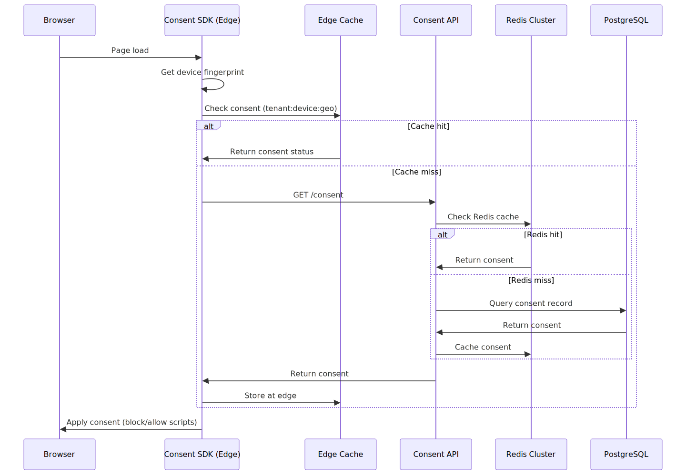
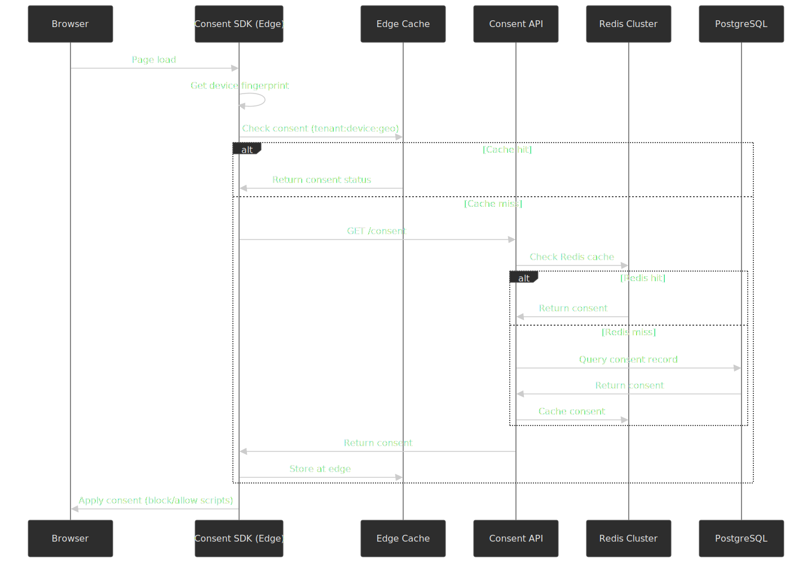
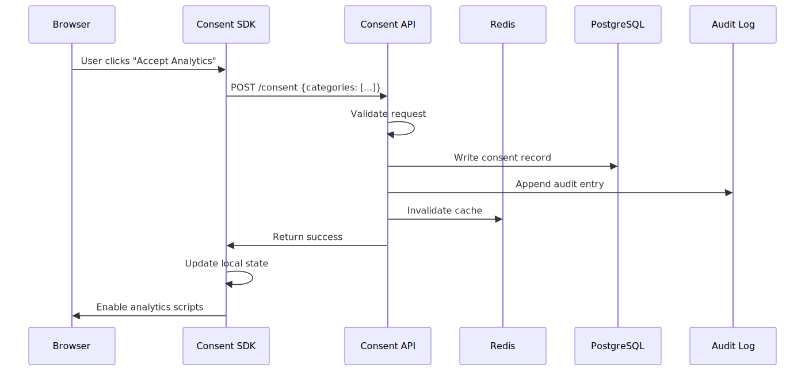
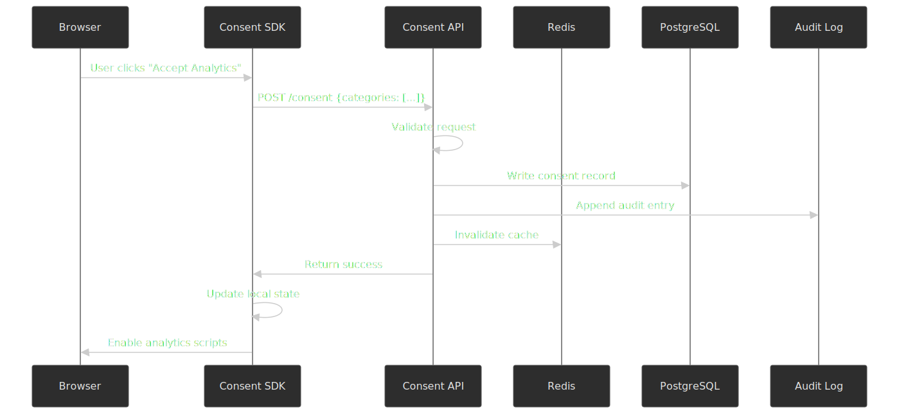
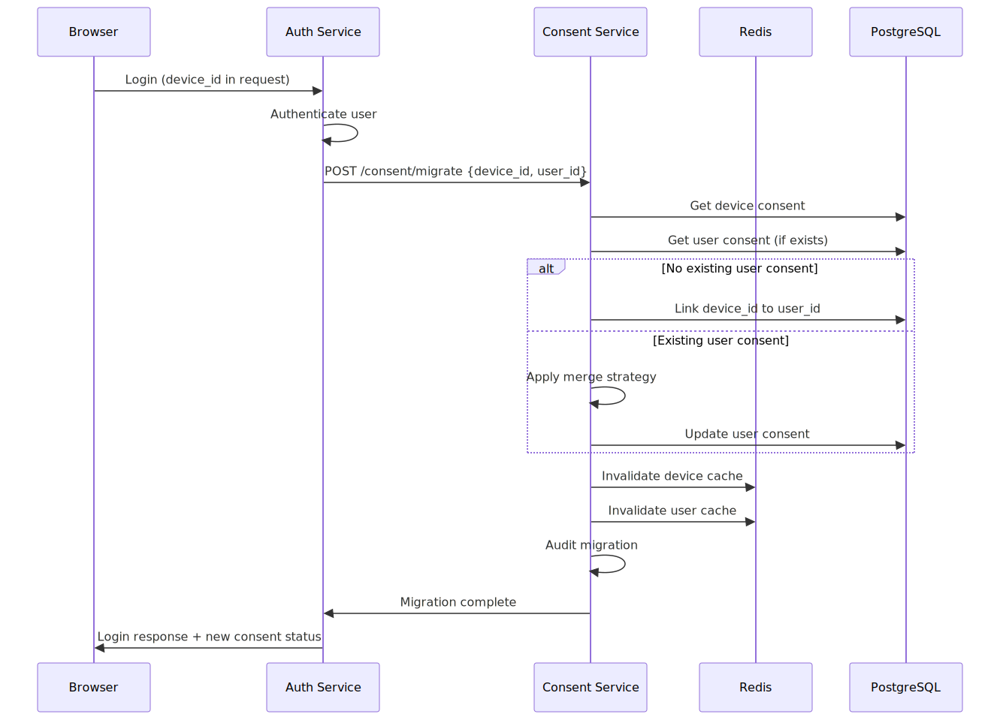
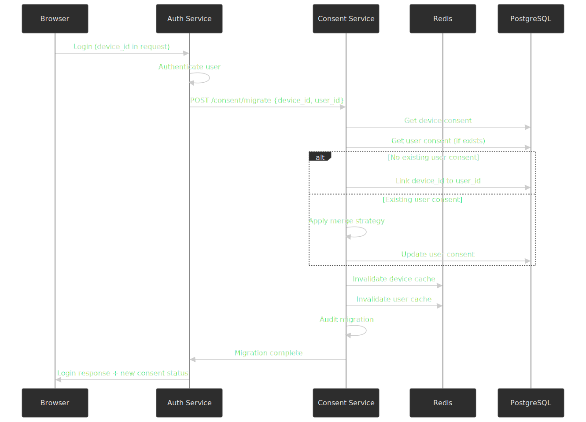

# Design a Cookie Consent Service

A consent management platform (CMP) sits between every tracking script on the open
web and a regulator who can fine you in the hundreds of millions of euros for
getting it wrong. The architecture is interesting because the constraints
collide: every page load reads consent and blocks rendering on the answer, yet
every read is a record that has to survive audit; every write is a user choice
that you must respect within seconds across the world; and every product
decision in the banner UI is a legal one. This article designs a multi-tenant
CMP for a SaaS provider serving thousands of websites, with sub-50 ms consent
checks at the edge, an immutable audit trail, and an identity-migration path
that does not silently overwrite user choice.




## Abstract

Cookie consent design balances three competing forces:

1. **Latency vs. compliance.** Consent checks happen on every page load and gate
   tracking scripts. Sub-50 ms response times require edge caching, but
   regulations demand a per-user, time-stamped, audit-grade record of every
   choice.
2. **Multi-tenancy vs. isolation.** Thousands of websites share infrastructure,
   but each has its own privacy policy, cookie categories, and applicable
   regulation. Tenant configuration must be cacheable yet propagate quickly.
3. **Anonymous vs. authenticated.** Users browse before they log in. Tracking
   them across that boundary is the design's central tension — legally because
   most "anonymous" identifiers are themselves regulated, and operationally
   because two consent records have to merge without overwriting either user's
   explicit choice.

The mental model: **edge-cached SDK → regional read replica → primary write
path → immutable audit log**. Reads are served from the closest edge; writes
serialize through a single region so the audit trail is unambiguous.

> [!NOTE]
> **What "consent" legally is.** The CMP enforces two overlapping regimes:
> the GDPR's general lawful-basis rules under Article 6 — where consent
> (Art. 6(1)(a)) must be freely given, specific, informed, unambiguous, and
> demonstrable per Art. 7(1) — and the ePrivacy Directive's *lex specialis*
> rule for terminal-equipment access in Article 5(3), which requires prior
> consent for any non-strictly-necessary cookie or equivalent storage
> regardless of whether personal data is processed[^edpb-fp]. When the
> processed data is a special category under Art. 9 (health, biometrics,
> political opinions, …), explicit consent or another Art. 9 condition is
> required *in addition* to a valid Art. 6 basis. The **ePrivacy
> Regulation** that was meant to replace the 2002 Directive was withdrawn
> by the European Commission in 2025; the Directive — and its 27 national
> transpositions — therefore remains the operative law through 2026[^eprivacy-withdrawal].

| Design decision                   | Trade-off                                                          |
| --------------------------------- | ------------------------------------------------------------------ |
| Edge-cached consent SDK           | Sub-50 ms reads; stale consent possible for the cache TTL window   |
| Anonymous identifier strategy     | Cross-page consent before login; treated as tracking by EU law[^edpb-fp] |
| Read replicas per region          | Low latency globally; eventual consistency (acceptable for consent) |
| Immutable audit log               | Regulatory proof; storage cost and partition complexity            |
| Tenant-specific cookie categories | Flexible compliance; configuration explosion                       |

## Requirements

### Functional Requirements

| Feature                              | Scope    | Notes                                                                                 |
| ------------------------------------ | -------- | ------------------------------------------------------------------------------------- |
| Consent banner rendering             | Core     | Customizable per tenant, geo-aware                                                    |
| Consent collection                   | Core     | Granular per category (essential, functional, analytics, marketing)                   |
| Consent storage                      | Core     | Persisted with audit trail                                                            |
| Consent check API                    | Core     | Called on every page load, must be fast                                               |
| Regulation detection                 | Core     | Auto-detect GDPR, CCPA/CPRA, LGPD based on user location                              |
| Multi-tenant configuration           | Core     | Each website has unique settings                                                      |
| Cross-page consent before login      | Core     | First-party cookie or signed token; subject to consent itself in the EU[^edpb-fp]     |
| Anonymous-to-authenticated migration | Core     | Merge consent on user login                                                           |
| Consent withdrawal                   | Core     | "It shall be as easy to withdraw as to give consent" — GDPR Art. 7(3)[^gdpr-art7]     |
| Honour browser opt-out signals       | Core     | Global Privacy Control (GPC) is a valid CCPA opt-out request[^gpc-oag]                |
| Consent proof / audit                | Core     | Immutable record for regulatory audits                                                |
| A/B testing for banners              | Extended | Test banner designs subject to dark-pattern constraints[^cnil-dark-patterns]          |
| TCF 2.2 support                      | Extended | IAB Europe Transparency & Consent Framework[^tcf22]                                   |
| Google Consent Mode v2               | Extended | Required for advertisers using Google services in EEA/UK/Switzerland[^gcm-v2]         |

### Non-Functional Requirements

| Requirement            | Target           | Rationale                                                  |
| ---------------------- | ---------------- | ---------------------------------------------------------- |
| Availability           | 99.99%           | Consent gates page functionality; downtime = broken sites  |
| Consent check latency  | p99 < 50 ms      | Consent check is render-blocking                           |
| Consent update latency | p99 < 200 ms     | User-triggered, less time-sensitive                        |
| Read/write ratio       | ~100:1           | Every page load reads; only banner interactions write      |
| Tenant count           | 100 K+ websites  | Multi-tenant SaaS model                                    |
| Daily transactions     | ~500 M           | OneTrust reports 450 M+/day, 3 B+/week as a real benchmark[^onetrust-scale] |
| Data retention         | Purpose-bound    | GDPR has no fixed period — keep evidence as long as the underlying processing[^gdpr-storage] |
| Consent accuracy       | 100% on read     | Stale-window must be bounded and disclosed                 |

> [!IMPORTANT]
> The "7-year retention" number cited in some industry write-ups is not a GDPR
> requirement. The European Commission's storage-limitation guidance is
> purpose-bound: retain consent records as long as you rely on the underlying
> processing, plus whatever sector-specific or limitation-period horizon
> applies (typically 3–6 years for civil claims defence)[^gdpr-storage].

### Scale Estimation

**Traffic profile:**

| Metric                            | Value     | Calculation                            |
| --------------------------------- | --------- | -------------------------------------- |
| Websites served                   | 100,000   | Multi-tenant SaaS                      |
| Average daily page views per site | 10,000    | Mix of small and large sites           |
| Total daily page views            | 1 B       | 100 K × 10 K                           |
| Consent checks/day                | 1 B       | 1:1 with page views                    |
| Consent updates/day               | 10 M      | ~1% of visitors interact with banner   |
| Peak RPS (reads)                  | ~50 K     | 1 B / 86,400 × 4 (peak multiplier)     |
| Peak RPS (writes)                 | ~500      | 10 M / 86,400 × 4                      |

**Storage:**

```text title="capacity (back-of-envelope)"
Consent records: 1B unique visitors x 500 bytes = 500 GB
Audit logs:      10M updates/day x 1 KB x 365 days x 5 years = ~18 TB
Tenant configs:  100K x 50 KB = 5 GB
SDK assets:      100K variants x 100 KB = 10 GB on CDN
```

**Bandwidth:**

```text title="steady-state bandwidth"
Consent checks: 50K RPS x 200 bytes = ~10 MB/s
SDK delivery:   10K RPS x 50 KB    = ~500 MB/s (CDN absorbs most)
```

These numbers are well within reach for a single CMP. OneTrust publicly
reports 450 M+ consent transactions per day and 64 B+ Cloudflare hits per
week running on Cloudflare Workers, with 50% latency reduction and ~90% cost
reduction after migrating from a traditional origin model[^onetrust-cf].

## Design Paths

### Path A: Edge-First Architecture (latency-optimized)

**Best when:**

- Consent check latency is critical (advertising, analytics-heavy sites).
- Global audience with low tolerance for slow consent.
- High page-view volume per session.

**Architecture:**




**Key characteristics:**

- Consent SDK served from CDN edge.
- Consent status cached at edge with short TTL (e.g. 30–60 s).
- Cache key: `{tenant_id}:{visitor_id}:{regulation}`.
- Edge worker computes regulation from request geo before hitting origin.

**Trade-offs:**

- :white_check_mark: Sub-20 ms consent checks from edge cache.
- :white_check_mark: Scales horizontally at the edge.
- :white_check_mark: Origin protected from read traffic.
- :x: Stale consent for up to the cache TTL after an update.
- :x: Per-key purge complexity on consent change.
- :x: Edge-compute pricing for SDK execution.

**Real-world example.** OneTrust serves 450 M+ consent transactions per day on
Cloudflare Workers; the Cloudflare case study reports ~50% latency reduction
and ~90% lower bandwidth/compute cost versus the previous origin-heavy
deployment[^onetrust-cf].

### Path B: Server-Side Rendering (compliance-first)

**Best when:**

- Regulatory compliance is paramount (financial services, healthcare,
  consumer-facing public sector).
- Real-time consent accuracy required; no stale-window tolerated.
- Lower traffic volume, higher value per interaction.

**Architecture:**




**Key characteristics:**

- Consent fetched server-side before page render.
- Consent status embedded in the initial HTML.
- No client-side consent gate needed.
- Server controls which scripts ever reach the wire.

**Trade-offs:**

- :white_check_mark: Always accurate consent (no stale cache).
- :white_check_mark: Full control over script loading.
- :white_check_mark: Simpler client-side implementation.
- :x: Consent fetch is on the critical render path.
- :x: Server has to handle every consent check.
- :x: Page-level caching becomes per-user.

**Real-world example.** Banking applications under strict tracking-control
requirements (PCI-DSS scope, EBA RTS expectations) often inline consent
server-side so unauthorised vendor scripts cannot load even momentarily.

### Path Comparison

| Factor                | Path A (edge-first)            | Path B (server-side) |
| --------------------- | ------------------------------ | -------------------- |
| Consent check latency | 10–50 ms                       | 50–200 ms            |
| Consent accuracy      | Eventual (cache-TTL window)    | Real-time            |
| Infrastructure cost   | Higher (edge compute)          | Lower (centralized)  |
| Client complexity     | Higher (SDK logic)             | Lower                |
| Server load           | Lower                          | Higher               |
| Best for              | High-traffic media/e-commerce  | Regulated industries |

### This Article's Focus

This article implements **Path A (edge-first)** because:

1. Most websites prioritise user experience (fast consent checks).
2. A bounded staleness window (sub-minute) is acceptable for most consent
   use cases.
3. The 100:1 read/write ratio rewards edge caching disproportionately.
4. A multi-tenant SaaS needs the infrastructure efficiency.

Path B details are covered in the [Variations](#variations) section.

## High-Level Design

### Component Overview

| Component          | Responsibility                       | Technology                   |
| ------------------ | ------------------------------------ | ---------------------------- |
| Consent SDK        | Client-side consent management       | JavaScript, edge-cached      |
| Consent Service    | Read/write consent operations        | Node.js / Go + Redis         |
| Regulation Service | Geo-based regulation detection       | MaxMind GeoIP + rules engine |
| Tenant Service     | Multi-tenant configuration           | PostgreSQL + Redis cache     |
| Audit Service      | Immutable consent logging            | Append-only log + S3         |
| Identity Service   | Anonymous-to-authenticated migration | Redis + PostgreSQL           |
| Banner Service     | A/B testing and rendering            | Static CDN + configuration   |

### Request Flow: Consent Check




### Request Flow: Consent Update




## API Design

### Consent Check API

```http
GET /api/v1/consent
X-Tenant-ID: tenant_abc123
X-Visitor-ID: vis_xyz789
X-Geo-Country: DE
```

**Response (200 OK):**

```json
{
  "consent_id": "con_abc123xyz",
  "visitor_id": "vis_xyz789",
  "user_id": null,
  "regulation": "gdpr",
  "status": "partial",
  "categories": {
    "essential":  { "consented": true,  "required": true  },
    "functional": { "consented": true,  "required": false },
    "analytics":  { "consented": false, "required": false },
    "marketing":  { "consented": false, "required": false }
  },
  "consent_timestamp": "2026-03-15T10:30:00Z",
  "policy_version": "v2.3",
  "expires_at": "2026-09-15T10:30:00Z",
  "banner_config": {
    "show_banner": false,
    "banner_version": "v1.2"
  }
}
```

**Cache headers:**

```http
Cache-Control: private, max-age=60
ETag: "abc123"
Vary: X-Visitor-ID, X-Geo-Country
```

**Error responses:**

- `400 Bad Request` — missing tenant id or visitor id.
- `404 Not Found` — tenant not configured.
- `429 Too Many Requests` — rate limit exceeded.

### Consent Update API

```http
POST /api/v1/consent
X-Tenant-ID: tenant_abc123
X-Visitor-ID: vis_xyz789
X-Idempotency-Key: idem_123456

{
  "categories": {
    "functional": true,
    "analytics":  true,
    "marketing":  false
  },
  "policy_version": "v2.3",
  "user_agent": "Mozilla/5.0...",
  "consent_method": "banner_button",
  "banner_version": "v1.2"
}
```

**Response (201 Created):**

```json
{
  "consent_id": "con_abc123xyz",
  "status": "updated",
  "categories": {
    "essential":  { "consented": true  },
    "functional": { "consented": true  },
    "analytics":  { "consented": true  },
    "marketing":  { "consented": false }
  },
  "audit_id": "aud_789xyz",
  "next_renewal": "2026-09-15T10:30:00Z"
}
```

**Idempotency.** Duplicate requests with the same idempotency key return the
cached response.

### Consent Withdrawal API

```http
DELETE /api/v1/consent/categories/marketing
X-Tenant-ID: tenant_abc123
X-Visitor-ID: vis_xyz789
```

**Response (200 OK):**

```json
{
  "consent_id": "con_abc123xyz",
  "withdrawn_category": "marketing",
  "withdrawn_at": "2026-03-15T11:00:00Z",
  "audit_id": "aud_790xyz"
}
```

GDPR Article 7(3) requires withdrawal to be as easy as giving consent[^gdpr-art7].
A single API call per category is the minimum bar; the banner UI must expose
the same affordance.

### Identity Migration API

```http
POST /api/v1/consent/migrate
X-Tenant-ID: tenant_abc123

{
  "visitor_id": "vis_xyz789",
  "user_id":    "user_456",
  "migration_strategy": "most_restrictive"
}
```

**Response (200 OK):**

```json
{
  "migration_id": "mig_123abc",
  "source": {
    "visitor_id": "vis_xyz789",
    "consent_timestamp": "2026-03-15T10:30:00Z"
  },
  "target": {
    "user_id": "user_456",
    "consent_timestamp": "2026-03-10T08:00:00Z"
  },
  "result": {
    "strategy_applied": "most_restrictive",
    "merged_categories": {
      "functional": true,
      "analytics": false,
      "marketing": false
    },
    "conflicts_resolved": [
      {
        "category": "analytics",
        "visitor_value": true,
        "user_value": false,
        "resolved_value": false,
        "reason": "most_restrictive — user previously denied"
      }
    ]
  },
  "audit_id": "aud_791xyz"
}
```

**Migration strategies:**

- `most_restrictive` (default) — privacy-preserving choice wins. Safest under
  GDPR/LGPD because it never silently relaxes a previously denied permission.
- `most_recent` — the freshest signal wins. Lower friction, higher legal risk
  if the freshest signal happens to be the anonymous one.
- `user_wins` — authenticated user record always wins.
- `prompt_user` — return conflicts to the client for explicit resolution.

> [!WARNING]
> Defaulting to "most-recent wins" can silently flip a logged-in user's earlier
> "no analytics" choice to "yes" because they clicked accept on a different
> device while signed out. The defensible defaults are `most_restrictive` or
> `prompt_user`. Anything else needs a documented reason and an audit entry.

### Tenant Configuration API

```http
GET /api/v1/tenants/{tenant_id}/config
```

**Response (200 OK):**

```json
{
  "tenant_id": "tenant_abc123",
  "domain": "example.com",
  "subdomains": ["shop.example.com", "blog.example.com"],
  "categories": [
    {
      "id": "essential",
      "name": "Essential Cookies",
      "description": "Required for basic website functionality",
      "required": true,
      "cookies": ["session_id", "csrf_token"]
    },
    {
      "id": "analytics",
      "name": "Analytics Cookies",
      "description": "Help us understand how visitors use our site",
      "required": false,
      "cookies": ["_ga", "_gid", "_gat"],
      "vendors": ["Google Analytics"]
    }
  ],
  "regulations": {
    "default": "gdpr",
    "overrides": {
      "US-CA": "ccpa",
      "BR": "lgpd"
    }
  },
  "banner": {
    "position": "bottom",
    "theme": "light",
    "show_reject_all": true,
    "consent_renewal_days": 180
  },
  "tcf_enabled": true,
  "google_consent_mode": true
}
```

The `consent_renewal_days: 180` default tracks the CNIL recommendation that
operators retain a user's consent decision for around six months before
re-prompting, to avoid consent fatigue while keeping the choice fresh[^cnil-renewal].

## Data Modeling

### Consent Record (PostgreSQL)

```sql
CREATE TABLE consent_records (
    id UUID PRIMARY KEY DEFAULT gen_random_uuid(),
    tenant_id  VARCHAR(50)  NOT NULL,
    visitor_id VARCHAR(100) NOT NULL,
    user_id    VARCHAR(100),  -- NULL for anonymous

    -- Consent state
    regulation     VARCHAR(20) NOT NULL,  -- gdpr, ccpa, lgpd
    policy_version VARCHAR(20) NOT NULL,
    categories     JSONB       NOT NULL,
    status         VARCHAR(20) DEFAULT 'partial',  -- none, partial, full

    -- Metadata
    ip_country     VARCHAR(2),
    user_agent     TEXT,
    consent_method VARCHAR(50),  -- banner_accept, banner_reject, api, gpc

    -- Timestamps
    created_at TIMESTAMPTZ DEFAULT NOW(),
    updated_at TIMESTAMPTZ DEFAULT NOW(),
    expires_at TIMESTAMPTZ,

    -- Constraints
    UNIQUE (tenant_id, visitor_id),
    UNIQUE (tenant_id, user_id) WHERE user_id IS NOT NULL
);

CREATE INDEX idx_consent_tenant_visitor ON consent_records(tenant_id, visitor_id);
CREATE INDEX idx_consent_tenant_user    ON consent_records(tenant_id, user_id)
    WHERE user_id IS NOT NULL;
CREATE INDEX idx_consent_expires        ON consent_records(expires_at)
    WHERE expires_at IS NOT NULL;
```

**Sharding strategy.** Shard by `tenant_id` to co-locate all consent for a
given website. High-volume tenants may need dedicated shards; tenant onboarding
should pre-allocate based on expected MAU.

### Audit Log (Append-Only)

```sql
CREATE TABLE consent_audit (
    id BIGSERIAL PRIMARY KEY,
    consent_id UUID         NOT NULL REFERENCES consent_records(id),
    tenant_id  VARCHAR(50)  NOT NULL,

    -- What changed
    action         VARCHAR(20) NOT NULL,  -- create, update, withdraw, migrate
    old_categories JSONB,
    new_categories JSONB,

    -- Context
    policy_version  VARCHAR(20),
    ip_address      INET,
    user_agent      TEXT,
    consent_method  VARCHAR(50),
    idempotency_key VARCHAR(100),

    -- Immutable timestamp
    created_at TIMESTAMPTZ DEFAULT NOW()
);

-- Partition by month for efficient archival
CREATE TABLE consent_audit_2026_03 PARTITION OF consent_audit
    FOR VALUES FROM ('2026-03-01') TO ('2026-04-01');

-- Indexes for regulatory queries
CREATE INDEX idx_audit_consent     ON consent_audit(consent_id, created_at DESC);
CREATE INDEX idx_audit_tenant_time ON consent_audit(tenant_id, created_at DESC);
```

**Retention policy.** The European Commission's storage-limitation guidance
keeps consent evidence purpose-bound: retain it as long as you continue to
rely on the consent, plus the relevant statute-of-limitations buffer for
defending the lawfulness of past processing[^gdpr-storage]. A common
operational shape is hot storage (PostgreSQL) for 12 months, S3 Glacier for
3–5 years, then deletion — calibrated per tenant per jurisdiction. There is
no single GDPR-mandated number; the previous "7 years" figure is industry
convention, not law.




> [!IMPORTANT]
> The audit row must capture enough context to reconstruct the *exact*
> banner the user saw: the rendered policy version, the banner template
> version, the legal basis claimed per category, the timestamp, the IP /
> country at decision time, and the consent method (banner, GPC, API,
> migration). Anything less and you cannot answer "demonstrate consent"
> under GDPR Art. 7(1) two years later. Records of refusal must avoid
> persistent identifiers — the EDPB recommends a generic flag rather than
> an identifier you would not otherwise have a basis to retain.

### Tenant Configuration (PostgreSQL + Redis)

```sql
CREATE TABLE tenants (
    id      VARCHAR(50)  PRIMARY KEY,
    domain  VARCHAR(255) NOT NULL UNIQUE,
    subdomains TEXT[],

    -- Configuration
    config        JSONB NOT NULL,
    banner_config JSONB,

    -- SDK versioning
    sdk_version    VARCHAR(20) DEFAULT 'latest',
    custom_sdk_url TEXT,

    -- Status
    status     VARCHAR(20)  DEFAULT 'active',
    created_at TIMESTAMPTZ  DEFAULT NOW(),
    updated_at TIMESTAMPTZ  DEFAULT NOW()
);

CREATE INDEX idx_tenants_domain     ON tenants(domain);
CREATE INDEX idx_tenants_subdomains ON tenants USING GIN(subdomains);
```

**Redis cache structure:**

```redis title="cache layout"
# Tenant config (cached for 5 minutes)
SETEX tenant:config:tenant_abc123 300 "{...json config...}"

# Consent record (cached for 60 seconds)
SETEX consent:tenant_abc123:vis_xyz789 60 "{...consent...}"

# Invalidation on update
DEL consent:tenant_abc123:vis_xyz789
```

### Database Selection Matrix

| Data                 | Store                       | Rationale                                    |
| -------------------- | --------------------------- | -------------------------------------------- |
| Consent records      | PostgreSQL + read replicas  | ACID, complex queries, regional distribution |
| Consent cache        | Redis Cluster               | Sub-ms reads, TTL support                    |
| Audit log            | PostgreSQL (partitioned)    | Immutable, time-series queries               |
| Audit archive        | S3 Glacier                  | Cost-effective long-term storage             |
| Tenant config        | PostgreSQL + Redis          | Infrequent updates, high read frequency      |
| SDK assets           | S3 + CloudFront             | Global distribution, versioning              |
| Visitor IDs          | First-party cookie + Redis  | Stable across pages without device probing   |

## Low-Level Design

### Identifier Strategy: First-Party Cookie, Not Browser Fingerprint

The first design instinct is to fingerprint the browser so consent persists
even if cookies are blocked. Don't. The European Data Protection Board's
Guidelines 2/2023 on the technical scope of Article 5(3) of the ePrivacy
Directive are explicit that "device fingerprinting techniques" fall under
the same prior-consent requirement as cookies — the moment you read non-
strictly-necessary information from a user's terminal, you need consent[^edpb-fp].
Fingerprinting *for* consent storage is also a circular act: you're profiling
the user before they've agreed to be profiled.

The defensible pattern is a **first-party HTTP cookie**, scoped to the tenant
domain, with an opaque random `visitor_id`. The CNIL classifies cookies that
store a user's consent choice as strictly necessary and exempts them from the
prior-consent requirement[^cnil-renewal] — so the consent cookie itself does
not need consent. If cookies are blocked, the banner re-prompts; that is the
honest answer.

```typescript collapse={1-15, 55-70} title="consent-sdk.ts"
interface ConsentConfig {
  tenantId: string
  apiEndpoint: string
  categories: CategoryConfig[]
  regulation?: "auto" | "gdpr" | "ccpa" | "lgpd"
  onConsentChange?: (consent: ConsentStatus) => void
}

interface ConsentStatus {
  categories: Record<string, boolean>
  regulation: string
  timestamp: string
  showBanner: boolean
}

class ConsentSDK {
  private config!: ConsentConfig
  private visitorId!: string
  private consent: ConsentStatus | null = null

  async init(config: ConsentConfig): Promise<void> {
    this.config = config
    this.visitorId = this.getOrCreateVisitorId()

    this.consent = await this.fetchConsent()
    this.applyConsent(this.consent)

    if (this.consent.showBanner) {
      this.renderBanner()
    }
  }

  // Strictly-necessary cookie: stores only the visitor ID for consent persistence.
  // No device probing, no fingerprinting — the consent storage cookie itself is
  // exempt from the ePrivacy prior-consent requirement.
  private getOrCreateVisitorId(): string {
    const existing = readCookie("__consent_vid")
    if (existing) return existing

    const visitorId = "vis_" + cryptoRandomHex(16)
    writeCookie("__consent_vid", visitorId, {
      sameSite: "Lax",
      secure: true,
      maxAge: 60 * 60 * 24 * 180, // 6 months — aligns with CNIL renewal
      path: "/",
      httpOnly: false, // SDK is JavaScript; httpOnly would make it unreadable
    })
    return visitorId
  }
}
```

### Script Blocking

The SDK has two jobs after `init`: gate scripts that already exist on the
page, and intercept scripts that get added later.

```typescript collapse={1-10, 45-60} title="script-blocker.ts"
interface BlockedScript {
  src: string
  category: string
  type: "script" | "iframe" | "img"
}

const blockedScripts: BlockedScript[] = []

function applyConsent(consent: ConsentStatus): void {
  const scripts = document.querySelectorAll<HTMLScriptElement>(
    "script[data-consent-category]"
  )

  scripts.forEach((script) => {
    const category = script.getAttribute("data-consent-category")!
    const consented = consent.categories[category]

    if (consented) {
      const dataSrc = script.getAttribute("data-src")
      if (dataSrc) {
        script.setAttribute("src", dataSrc)
        script.removeAttribute("data-src")
      }
      script.removeAttribute("type") // remove text/plain blocker
    } else {
      const src = script.getAttribute("src")
      if (src) {
        script.setAttribute("data-src", src)
        script.removeAttribute("src")
        script.setAttribute("type", "text/plain")
      }
    }
  })

  observeNewScripts(consent)
}

function observeNewScripts(consent: ConsentStatus): void {
  const observer = new MutationObserver((mutations) => {
    mutations.forEach((mutation) => {
      mutation.addedNodes.forEach((node) => {
        if (node.nodeName !== "SCRIPT") return
        const script = node as HTMLScriptElement
        const category = script.getAttribute("data-consent-category")
        if (category && !consent.categories[category]) {
          script.setAttribute("data-src", script.src)
          script.removeAttribute("src")
          script.type = "text/plain"
        }
      })
    })
  })

  observer.observe(document.documentElement, { childList: true, subtree: true })
}
```

| Decision                             | Rationale                                          |
| ------------------------------------ | -------------------------------------------------- |
| First-party cookie for `visitor_id`  | Stable across pages without device probing         |
| `MutationObserver` for new scripts   | Catches dynamically-injected tracking scripts      |
| `type="text/plain"` blocking         | Browser ignores script content without removing it |
| No canvas/font/audio fingerprinting  | Avoids ePrivacy Art. 5(3) consent trap[^edpb-fp]  |

### Anonymous-to-Authenticated Migration

When a user logs in, the device's anonymous consent record has to merge with
any existing authenticated record. The merge has to be auditable and must not
silently overwrite an earlier explicit choice.

```typescript collapse={1-15, 70-85} title="identity-migration.ts"
interface MigrationRequest {
  tenantId: string
  visitorId: string
  userId: string
  strategy: "most_restrictive" | "most_recent" | "user_wins" | "prompt_user"
}

interface ConsentRecord {
  categories: Record<string, boolean>
  timestamp: Date
  source: "visitor" | "user"
}

async function migrateConsent(req: MigrationRequest): Promise<MigrationResult> {
  const { tenantId, visitorId, userId, strategy } = req

  const [visitorConsent, userConsent] = await Promise.all([
    getConsentByVisitor(tenantId, visitorId),
    getConsentByUser(tenantId, userId),
  ])

  if (!userConsent) {
    await linkVisitorToUser(tenantId, visitorId, userId)
    return { migrated: true, conflicts: [] }
  }
  if (!visitorConsent) {
    return { migrated: false, reason: "no_visitor_consent" }
  }

  const merged = mergeConsent(visitorConsent, userConsent, strategy)

  await updateUserConsent(tenantId, userId, merged.categories)
  await auditMigration(tenantId, visitorId, userId, visitorConsent, userConsent, merged)
  await invalidateConsentCache(tenantId, visitorId)
  await invalidateConsentCache(tenantId, userId)

  return merged
}

function mergeConsent(
  visitor: ConsentRecord,
  user: ConsentRecord,
  strategy: string,
): MergeResult {
  const categories = new Set([
    ...Object.keys(visitor.categories),
    ...Object.keys(user.categories),
  ])

  const merged: Record<string, boolean> = {}
  const conflicts: Conflict[] = []

  for (const category of categories) {
    const visitorValue = visitor.categories[category]
    const userValue = user.categories[category]

    if (visitorValue === userValue) {
      merged[category] = visitorValue
      continue
    }

    switch (strategy) {
      case "most_restrictive":
        // false wins; never silently relaxes a denied permission
        merged[category] = visitorValue === false || userValue === false
          ? false
          : true
        break
      case "most_recent":
        merged[category] = visitor.timestamp > user.timestamp
          ? visitorValue
          : userValue
        break
      case "user_wins":
        merged[category] = userValue ?? visitorValue
        break
      case "prompt_user":
        conflicts.push({ category, visitorValue, userValue })
        break
    }
  }

  return { categories: merged, conflicts }
}
```

**Migration flow:**




**Edge cases:**

| Scenario                       | Handling                                            |
| ------------------------------ | --------------------------------------------------- |
| User has multiple devices      | Each device's consent migrates independently        |
| User logs out and back in      | Visitor consent may have changed; re-merge          |
| User clears cookies            | New `visitor_id` issued; banner re-prompts          |
| Conflict with `prompt_user`    | Return conflicts to client; user resolves in UI     |
| GPC signal present at login    | Treat as a "deny sale/share" overlay before merge   |

### Regulation Detection Service

Auto-detect the applicable regulation from request geo, then let tenant
overrides reshape the answer. A browser-supplied opt-out signal (GPC) is
applied *before* regulation routing so that, for example, an authenticated
California visitor with `Sec-GPC: 1` is treated as having opted out of
sale and sharing on first contact[^gpc-oag].




```typescript collapse={1-12, 50-65} title="regulation-service.ts"
import maxmind from "maxmind"

interface RegulationResult {
  regulation: "gdpr" | "ccpa" | "lgpd" | "none"
  country: string
  region?: string
  confidence: "high" | "medium" | "low"
}

const geoDb = await maxmind.open("/data/GeoLite2-City.mmdb")

function detectRegulation(ipAddress: string): RegulationResult {
  const geo = geoDb.get(ipAddress)

  if (!geo || !geo.country) {
    // Default to the strictest regime when geo is unknown
    return { regulation: "gdpr", country: "unknown", confidence: "low" }
  }

  const country = geo.country.iso_code
  const region = geo.subdivisions?.[0]?.iso_code

  // GDPR: EU/EEA + UK applies UK-GDPR (functionally equivalent for cookies)
  const gdprCountries = [
    "AT","BE","BG","HR","CY","CZ","DK","EE","FI","FR","DE","GR","HU",
    "IE","IT","LV","LT","LU","MT","NL","PL","PT","RO","SK","SI","ES","SE",
    "IS","LI","NO", // EEA
    "GB",           // UK-GDPR
  ]
  if (gdprCountries.includes(country)) {
    return { regulation: "gdpr", country, confidence: "high" }
  }

  // CCPA/CPRA: California (and increasingly other US states with similar laws)
  if (country === "US" && region === "CA") {
    return { regulation: "ccpa", country, region, confidence: "high" }
  }

  // LGPD: Brazil
  if (country === "BR") {
    return { regulation: "lgpd", country, confidence: "high" }
  }

  return { regulation: "none", country, confidence: "high" }
}

function applyTenantOverrides(
  detected: RegulationResult,
  tenantConfig: TenantConfig,
): RegulationResult {
  const override =
    tenantConfig.regulations.overrides?.[`${detected.country}-${detected.region}`] ||
    tenantConfig.regulations.overrides?.[detected.country]
  return override ? { ...detected, regulation: override } : detected
}
```

**Regulation behaviour matrix:**

| Regulation | Consent model | Default for non-essential | Withdrawal       | Notes                                                                 |
| ---------- | ------------- | ------------------------- | ---------------- | --------------------------------------------------------------------- |
| GDPR       | Opt-in        | Blocked                   | Required (Art 7(3))[^gdpr-art7] | Reject must be as easy as accept[^cnil-dark-patterns]      |
| CCPA/CPRA  | Opt-out       | Allowed until opt-out     | Required         | Honour GPC signal as opt-out[^gpc-oag]; "Do Not Sell or Share" link[^ccpa-oag] |
| LGPD       | Opt-in        | Blocked                   | Required, easy   | ANPD-aligned with GDPR posture                                        |
| None       | Opt-out       | Allowed                   | Best practice    | Some emerging US-state laws default toward GDPR-like opt-in           |

### Multi-Tenant Configuration Engine

**Configuration hierarchy:**




```typescript collapse={1-10, 45-60} title="tenant-config.ts"
interface ResolvedConfig {
  tenantId: string
  domain: string
  categories: CategoryConfig[]
  banner: BannerConfig
  regulations: RegulationConfig
  sdk: SDKConfig
}

async function resolveConfig(tenantId: string, domain: string): Promise<ResolvedConfig> {
  const cacheKey = `tenant:config:${tenantId}:${domain}`
  const cached = await redis.get(cacheKey)
  if (cached) return JSON.parse(cached)

  const tenant = await db.tenants.findById(tenantId)
  if (!tenant) throw new Error("Tenant not found")

  let config = tenant.config
  if (tenant.domainOverrides?.[domain]) {
    config = deepMerge(config, tenant.domainOverrides[domain])
  }

  const resolved = deepMerge(GLOBAL_DEFAULTS, config)

  await redis.setex(cacheKey, 300, JSON.stringify(resolved))
  return resolved
}

async function updateTenantConfig(
  tenantId: string,
  updates: Partial<TenantConfig>,
): Promise<void> {
  await db.tenants.update(tenantId, updates)

  const keys = await redis.keys(`tenant:config:${tenantId}:*`)
  if (keys.length > 0) await redis.del(...keys)

  if (updates.categories) {
    await sdkBuildQueue.add({ tenantId, reason: "category_update" })
  }
}
```

### Cache Invalidation Strategy

A consent update has to cross three caches: the per-region Redis copy, the
edge cache, and the local copy in the user's other tabs. The pattern is
write-through PostgreSQL, then a fan-out invalidation.




```typescript collapse={1-8, 35-50} title="cache-invalidation.ts"
interface InvalidationTarget {
  tenantId: string
  identifier: string // visitor_id or user_id
  type: "visitor" | "user"
}

async function invalidateConsentCache(target: InvalidationTarget): Promise<void> {
  const { tenantId, identifier, type } = target

  // 1. Redis cache
  await redis.del(`consent:${tenantId}:${identifier}`)

  // 2. CDN edge cache (per-key purge)
  await cdnPurge(`consent/${tenantId}/${identifier}`)

  // 3. Notify any connected SDK instances (other tabs/devices)
  await pubsub.publish(`consent:invalidate:${tenantId}`, {
    identifier,
    type,
    timestamp: Date.now(),
  })
}

function setupInvalidationListener(tenantId: string): void {
  const eventSource = new EventSource(`/api/v1/consent/events?tenant=${tenantId}`)
  eventSource.onmessage = (event) => {
    const data = JSON.parse(event.data)
    if (data.identifier === currentVisitorId) {
      refreshConsent()
    }
  }
}
```

| Cache layer         | TTL     | Rationale                         |
| ------------------- | ------- | --------------------------------- |
| Edge CDN            | 60 s    | Balance freshness vs origin load  |
| Redis (consent)     | 60 s    | Match edge TTL                    |
| Redis (config)      | 300 s   | Config changes less frequent      |
| Client localStorage | Session | Refresh on page load              |

> [!NOTE]
> The bounded staleness window — typically the cache TTL — must be disclosed
> in the privacy notice. "Consent updates may take up to 60 seconds to
> propagate across our edge network" is acceptable; a silent multi-minute
> window is not.

## Frontend Considerations

### Banner Performance

A consent banner that shifts layout, blocks paint, or arrives after the user
has already started reading is failure twice over: bad UX and a likely dark-
pattern finding because the user "consented" by ignoring it.

```html collapse={1-5, 20-30} title="consent-bootstrap.html"
<!DOCTYPE html>
<html>
  <head>
    <link rel="preconnect" href="https://consent.example.com" />

    <script>
      ;(function () {
        const consent = localStorage.getItem("_consent_status")
        if (consent) window.__CONSENT_STATUS = JSON.parse(consent)
      })()
    </script>

    <script async src="https://cdn.consent.example.com/sdk/v1/consent.js"></script>
  </head>
  <body>
    <!-- Reserve banner space to prevent CLS -->
    <div id="consent-banner-placeholder" style="height: 0; transition: height 0.3s;"></div>
  </body>
</html>
```

```css title="banner-styles.css"
#consent-banner-placeholder {
  position: fixed;
  bottom: 0; left: 0; right: 0;
  height: 0;
  transition: height 0.3s ease-out;
}

#consent-banner-placeholder.visible {
  height: 200px;
}

.consent-banner-overlay {
  position: fixed;
  bottom: 0; left: 0; right: 0;
  z-index: 9999;
}
```

### State Management

```typescript collapse={1-10, 45-60} title="consent-state.ts"
interface ConsentState {
  status: ConsentStatus | null
  loading: boolean
  error: Error | null

  bannerVisible: boolean
  preferencesOpen: boolean

  pendingCategories: Record<string, boolean>
}

const consentStore = createStore<ConsentState>({
  status: null,
  loading: true,
  error: null,
  bannerVisible: false,
  preferencesOpen: false,
  pendingCategories: {},
})

function updateCategory(category: string, value: boolean): void {
  consentStore.update((state) => ({
    ...state,
    pendingCategories: { ...state.pendingCategories, [category]: value },
  }))
}

async function saveConsent(): Promise<void> {
  const { pendingCategories } = consentStore.get()
  consentStore.update((state) => ({ ...state, loading: true }))
  try {
    const result = await api.updateConsent(pendingCategories)
    consentStore.update((state) => ({
      ...state,
      status: result,
      pendingCategories: {},
      bannerVisible: false,
      loading: false,
    }))
    localStorage.setItem("_consent_status", JSON.stringify(result))
    applyConsent(result)
  } catch (error) {
    consentStore.update((state) => ({ ...state, error: error as Error, loading: false }))
  }
}
```

### Google Consent Mode v2

Google Consent Mode v2 (mandatory since March 2024 for advertisers using
Google services to collect EEA, UK, or Switzerland traffic) defines four
signals: `ad_storage`, `ad_user_data`, `ad_personalization`, and
`analytics_storage`[^gcm-v2]. The CMP is responsible for setting the default
to `denied` before any user interaction and updating the signals once the
user has chosen.

```typescript collapse={1-15, 50-65} title="google-consent-mode.ts"
interface GoogleConsentState {
  ad_storage:         "granted" | "denied"
  ad_user_data:       "granted" | "denied"
  ad_personalization: "granted" | "denied"
  analytics_storage:  "granted" | "denied"
}

function mapConsentToGoogle(consent: ConsentStatus): GoogleConsentState {
  return {
    ad_storage:         consent.categories.marketing ? "granted" : "denied",
    ad_user_data:       consent.categories.marketing ? "granted" : "denied",
    ad_personalization: consent.categories.marketing ? "granted" : "denied",
    analytics_storage:  consent.categories.analytics ? "granted" : "denied",
  }
}

function initGoogleConsentMode(consent: ConsentStatus): void {
  window.dataLayer = window.dataLayer || []
  function gtag(...args: any[]) {
    dataLayer.push(args)
  }

  // Default: denied. Required for compliant initialisation.
  gtag("consent", "default", {
    ad_storage:         "denied",
    ad_user_data:       "denied",
    ad_personalization: "denied",
    analytics_storage:  "denied",
    wait_for_update: 500,
  })

  gtag("consent", "update", mapConsentToGoogle(consent))
}

function updateGoogleConsent(consent: ConsentStatus): void {
  gtag("consent", "update", mapConsentToGoogle(consent))
}
```

| Signal               | Maps to           | What it controls                                |
| -------------------- | ----------------- | ----------------------------------------------- |
| `ad_storage`         | Marketing cookies | Storage for advertising                         |
| `ad_user_data`       | Marketing cookies | Sending user data to Google for ads             |
| `ad_personalization` | Marketing cookies | Personalised advertising / remarketing          |
| `analytics_storage`  | Analytics cookies | Storage for analytics (e.g. session duration)   |

## Infrastructure Design

### Cloud-Agnostic Components

| Component       | Purpose                        | Requirements                   |
| --------------- | ------------------------------ | ------------------------------ |
| CDN             | SDK delivery, edge caching     | Global PoPs, cache purge API   |
| Key-value store | Consent cache                  | Sub-ms reads, TTL support      |
| Relational DB   | Consent records, tenant config | ACID, read replicas            |
| Object storage  | Audit archives, SDK assets     | Versioning, lifecycle policies |
| Message queue   | Async processing               | Durability, dead-letter queue  |
| Geo database    | IP to location                 | Low latency, regular updates   |

### AWS Reference Architecture




| Service        | Configuration                          | Rationale                                |
| -------------- | -------------------------------------- | ---------------------------------------- |
| CloudFront     | Global edge network — 700+ PoPs[^cf-pops] | Low-latency SDK and consent-API delivery |
| Lambda@Edge    | Viewer events: 128 MB; origin events up to 10,240 MB and 30 s timeout[^lae-quotas] | Regulation detection at the edge         |
| API Gateway    | 10 K RPS, WAF                          | Rate limiting, DDoS protection           |
| ECS Fargate    | 2 vCPU, 4 GB, auto-scale 2–50          | Consent API servers                      |
| ElastiCache    | Redis Cluster, 3 nodes, r6g.large      | Sub-ms consent cache                     |
| RDS PostgreSQL | Multi-AZ, db.r6g.xlarge                | Primary consent store                    |
| Read replicas  | eu-west-1, ap-south-1                  | Regional read latency                    |
| S3             | Intelligent Tiering                    | Audit logs with lifecycle                |

> [!NOTE]
> Lambda@Edge applies the 128 MB / 5 s ceiling only to viewer-request and
> viewer-response triggers. Origin-request and origin-response triggers
> follow standard Lambda quotas (memory up to 10,240 MB) with a hard 30 s
> timeout per Lambda@Edge invocation[^lae-quotas]. Plan regulation detection
> for the viewer event; plan tenant config look-ups for origin events.

### Multi-Region Deployment




| Decision                | Rationale                                            |
| ----------------------- | ---------------------------------------------------- |
| Single write region     | Simplifies consistency and audit ordering            |
| Regional read replicas  | Sub-50 ms read latency globally                      |
| Local Redis per region  | Sub-ms cache hits, no cross-region calls             |
| Async replication       | Acceptable for consent (eventual consistency window) |

> [!IMPORTANT]
> If the primary write region is outside the EU, EU consent writes still cross
> a border. For EU-resident users this is a Schrems-II-shaped conversation
> with the tenant's DPO; for many CMPs the safer default is an EU primary
> write region with a US replica, not the reverse.

### Self-Hosted Alternatives

| Managed service | Self-hosted option   | Trade-off                            |
| --------------- | -------------------- | ------------------------------------ |
| CloudFront      | Fastly / Cloudflare  | More edge-compute options            |
| ElastiCache     | Redis Cluster on EC2 | More control, higher operational load|
| RDS PostgreSQL  | PostgreSQL on EC2    | Custom extensions, cost at scale     |
| Lambda@Edge     | Cloudflare Workers   | Better cold start, different pricing |

## Variations

### Server-Side Consent (Path B)

For regulated industries that need real-time consent accuracy:

```typescript collapse={1-12, 45-60} title="server-side-consent.tsx"
import { ConsentService } from "./consent-service"

interface ServerRenderContext {
  request: Request
  consent: ConsentStatus
  allowedScripts: string[]
}

async function renderPageWithConsent(
  request: Request,
  pageComponent: Component,
): Promise<Response> {
  const visitorId = request.cookies.get("__consent_vid")

  const consent = await consentService.getConsent(
    TENANT_ID,
    visitorId,
    request.headers.get("cf-ipcountry"),
  )

  const allowedScripts = getScriptsForConsent(consent)

  const html = renderToString(
    <ConsentContext.Provider value={consent}>
      <Page component={pageComponent} scripts={allowedScripts} />
    </ConsentContext.Provider>,
  )

  const response = new Response(html)
  response.headers.set(
    "Set-Cookie",
    `_consent_status=${JSON.stringify(consent)}; Path=/; SameSite=Lax`,
  )
  return response
}

function getScriptsForConsent(consent: ConsentStatus): string[] {
  const scripts = ["essential.js"]
  if (consent.categories.analytics)  scripts.push("analytics.js")
  if (consent.categories.marketing)  scripts.push("marketing.js")
  return scripts
}
```

### IAB TCF 2.2 Support

For publishers in the EU/EEA running programmatic ads, the IAB Europe
Transparency & Consent Framework (TCF) is the de-facto interop layer.
TCF 2.2 — live since 2 May 2023 — made several non-trivial changes versus
2.1 that any CMP claiming TCF support has to handle[^tcf22]:

- **Legitimate Interest is no longer a permitted legal basis for Purposes
  3, 4, 5, and 6** (personalised ads and content). Consent is now the only
  acceptable basis.
- **`getTCData` is deprecated.** Vendors must subscribe via
  `addEventListener` to receive TC string updates.
- **The Global Vendor List moved to v3** at
  `https://vendor-list.consensu.org/v3/vendor-list.json`.
- **The CMP must surface the total vendor count** on the first banner layer
  and offer easy access to withdraw consent at any time.

```typescript collapse={1-15, 55-70} title="tcf-support.ts"
interface TCFConsent {
  tcString: string
  gdprApplies: boolean
  purposeConsents: Record<number, boolean>
  vendorConsents: Record<number, boolean>
  specialFeatureOptins: Record<number, boolean>
}

function generateTCString(consent: ConsentStatus): string {
  const tcData = {
    version: 2,
    created:     consent.timestamp,
    lastUpdated: consent.timestamp,
    cmpId: 123,        // your registered CMP ID
    cmpVersion: 1,
    consentScreen: 1,
    consentLanguage: "EN",
    vendorListVersion: 3, // GVL v3 under TCF 2.2
    tcfPolicyVersion: 4,
    isServiceSpecific: false,
    useNonStandardStacks: false,
    purposeConsents: mapCategoryToTCFPurpose(consent.categories),
    vendorConsents: {}, // populated from GVL
  }
  return encodeTCString(tcData)
}

function mapCategoryToTCFPurpose(
  categories: Record<string, boolean>,
): Record<number, boolean> {
  return {
    1:  categories.essential,  // Store/access information
    2:  categories.functional, // Select basic ads
    3:  categories.marketing,  // Create personalised ads profile (consent-only since 2.2)
    4:  categories.marketing,  // Select personalised ads (consent-only since 2.2)
    5:  categories.marketing,  // Create personalised content profile (consent-only since 2.2)
    6:  categories.functional, // Select personalised content (consent-only since 2.2)
    7:  categories.analytics,  // Measure ad performance
    8:  categories.analytics,  // Measure content performance
    9:  categories.analytics,  // Apply market research
    10: categories.functional, // Develop and improve products
    11: categories.essential,  // Use limited data to select content
  }
}

// Recommended vendor integration: addEventListener (getTCData is deprecated in TCF 2.2)
function setupTCFAPI(initial: TCFConsent): void {
  let listenerId = 0
  const listeners = new Map<number, (tcData: TCFConsent, success: boolean) => void>()

  window.__tcfapi = (command, _version, callback, _parameter) => {
    if (command === "addEventListener") {
      const id = ++listenerId
      listeners.set(id, callback as never)
      ;(callback as (tcData: TCFConsent, success: boolean, listenerId?: number) => void)(
        initial, true, id,
      )
    } else if (command === "removeEventListener") {
      listeners.delete(_parameter as number)
      ;(callback as (success: boolean) => void)(true)
    }
  }
}
```

### A/B Testing Consent Banners

A/B testing the banner is technically straightforward but legally constrained.
The CNIL — and increasingly other DPAs — treats any variant that makes "reject"
less prominent than "accept" as a dark pattern that invalidates consent.
Recent enforcement: CNIL fined Google €150 M in 2022, Facebook €60 M in 2022,
and Google a further €325 M in 2025 in part for cookie-rejection
asymmetry[^cnil-dark-patterns]. CCPA/CPRA explicitly require opt-out symmetry
for California consumers from 2026 onward[^ccpa-oag].

```typescript collapse={1-10, 40-55} title="ab-testing.ts"
interface BannerVariant {
  id: string
  position: "top" | "bottom" | "center"
  layout: "minimal" | "detailed"
  showRejectAll: boolean   // must remain true under CNIL guidance
  primaryColor: string
}

async function getBannerVariant(
  tenantId: string,
  visitorId: string,
): Promise<BannerVariant> {
  const existing = await redis.get(`ab:${tenantId}:${visitorId}`)
  if (existing) return JSON.parse(existing)

  const experiment = await db.experiments.findActive(tenantId)
  if (!experiment) return DEFAULT_BANNER

  const hash = hashVisitorId(visitorId)
  const bucket = hash % 100
  const variant = experiment.variants.find(
    (v) => bucket >= v.startBucket && bucket < v.endBucket,
  )

  await redis.setex(`ab:${tenantId}:${visitorId}`, 86400 * 30, JSON.stringify(variant))
  return variant!
}

async function trackConsentEvent(
  tenantId: string,
  visitorId: string,
  variantId: string,
  action: "accept_all" | "reject_all" | "customize" | "close",
): Promise<void> {
  await analytics.track({
    event: "consent_action",
    properties: { tenantId, variantId, action, timestamp: Date.now() },
  })
}
```

| Metric            | Description                        | Healthy range |
| ----------------- | ---------------------------------- | ------------- |
| Consent rate      | Visitors accepting any non-essential category | 60–80% |
| Full consent rate | Visitors accepting all categories  | 30–50%        |
| Interaction rate  | Visitors engaging with the banner  | 70–90%        |
| Time to decision  | Seconds from banner show to action | < 10 s        |

### Mobile: Apple App Tracking Transparency

Web cookie consent and mobile in-app tracking consent are governed by
different stacks but tend to flow through the same CMP. On iOS 14.5+,
Apple's App Tracking Transparency (ATT) framework requires a system-level
prompt via `ATTrackingManager.requestTrackingAuthorization` before any app
may link user/device data with data from other companies' apps, websites,
or offline properties for advertising or measurement; without explicit
permission, the IDFA is zeroed out and fingerprinting is contractually
prohibited[^att]. ATT is independent of GDPR — for EU users, the lawful-
basis question still has to be answered server-side — so a mobile CMP
typically presents GDPR consent first, then triggers the ATT prompt only
if marketing consent was granted. The result must round-trip back into the
same audit log so a regulator can reconstruct the joint decision.

### Consent or Pay

Several large publishers and platforms have introduced "pay or consent"
banners — accept tracking or pay for an ad-light subscription. The EDPB's
Opinion 08/2024 concluded that, for large online platforms, this binary
choice generally does not yield valid GDPR consent because it fails the
"freely given" test; the Board recommends a third "no behavioural ads, no
fee" option as the defensible pattern[^edpb-pay]. A compliant CMP should
treat "pay or consent" as a tenant-level configuration with explicit
warnings, not a default offering.

## Conclusion

A cookie consent service is a legal artefact dressed as a low-latency
read API. The architectural shape — edge-cached SDK, regional read
replicas, single primary write region, immutable audit log — is the easy
half. The hard half is staying defensible while you do it.

1. **Edge-first architecture.** Serve consent reads from PoPs; serialise
   writes through a single region so the audit trail is unambiguous.
2. **Multi-tenant isolation.** Tenant configuration cached at multiple
   layers; per-tenant categories, regulations, and banner designs live in
   a small JSONB blob.
3. **Anonymous-to-authenticated migration.** Default to the most-restrictive
   merge so no earlier explicit choice is silently relaxed.
4. **Regulatory routing.** Geo-detect to apply GDPR / CCPA-CPRA / LGPD; let
   tenants override per market; honour browser opt-out signals (GPC) as
   first-class CCPA opt-outs and as defensible Art. 21 GDPR objections in
   the EU.
5. **Bounded staleness.** Disclose the propagation window in the privacy
   notice; make it short (sub-minute) so it stays defensible.
6. **Immutable audit trail.** Every change recorded with full context;
   partition by month; archive cold data; retain only as long as the
   underlying processing requires.

**What this design optimises for**

- Read latency (sub-50 ms consent checks).
- Regulatory compliance (audit trail, withdrawal symmetry, GPC honour).
- Multi-tenant efficiency (shared infrastructure, isolated configuration).
- Auditable cross-session continuity without device fingerprinting.

**What it sacrifices**

- Real-time consent accuracy: a sub-minute stale window is acceptable but
  must be disclosed.
- Cross-device persistence without authentication: the user has to log in
  for consent to follow them.
- Single primary region: simpler audit, harder failover.

**Known limitations**

- Cookies-blocked clients re-prompt on every visit (the honest answer).
- Cross-device consent requires the user to be authenticated.
- TCF 2.2 vendor-list management adds operational complexity.
- A/B testing is bounded by dark-pattern guidance — the variant space is
  smaller than it looks.

## Appendix

### Prerequisites

- Distributed-systems fundamentals (caching, replication).
- Working knowledge of GDPR, CCPA/CPRA, LGPD core concepts.
- CDN and edge-compute patterns.
- Database sharding and read replicas.

### Terminology

| Term               | Definition                                                                    |
| ------------------ | ----------------------------------------------------------------------------- |
| CMP                | Consent Management Platform — system that collects and manages user consent   |
| TCF                | Transparency & Consent Framework — IAB Europe standard for consent signalling |
| TC String          | Transparency and Consent String — encoded consent record per the TCF spec     |
| GVL                | Global Vendor List — IAB Europe-maintained list of advertising vendors        |
| GPC                | Global Privacy Control — browser opt-out signal (`Sec-GPC: 1`, `navigator.globalPrivacyControl`); W3C Privacy WG work item since 2024[^gpc-w3c]; legally binding under CCPA/CPRA, defensibly treated as an Art. 21 GDPR objection in the EU |
| DPO                | Data Protection Officer — organisation's privacy-compliance lead              |
| EDPB               | European Data Protection Board — produces binding GDPR guidance               |
| ePrivacy Directive | 2002/58/EC (Article 5(3)) — basis for cookie-consent law in the EU/EEA        |

### Summary

- **Edge-cached SDK** delivers consent checks in sub-50 ms globally; writes
  route to a single primary region.
- **Multi-tenant architecture** isolates configuration per website while
  sharing infrastructure; tenant config is cached at edge and Redis layers.
- **First-party identifiers** (consent cookies) avoid the
  fingerprinting-as-tracking trap that EDPB Guidelines 2/2023 explicitly
  call out.
- **Anonymous consent** maps to authenticated consent with a default of
  "most restrictive" so an earlier explicit denial is never silently relaxed.
- **Regulation detection** uses MaxMind GeoIP to route to GDPR / CCPA-CPRA /
  LGPD; tenant overrides handle edge cases.
- **Immutable audit log** records every consent change with full context;
  partitioned by month and archived to cold storage; retained only as long
  as the underlying processing.
- **Read replicas per region** bring global read latency under 50 ms;
  eventual consistency (sub-minute) is acceptable for consent.

### References

- [GDPR Article 7 — Conditions for consent](https://gdpr-info.eu/art-7-gdpr/) — including Art. 7(3) "as easy to withdraw as to give"
- [GDPR Article 6 — Lawfulness of processing](https://gdpr-info.eu/art-6-gdpr/)
- [European Commission — How long can data be kept?](https://commission.europa.eu/law/law-topic/data-protection/rules-business-and-organisations/principles-gdpr/how-long-can-data-be-kept-and-it-necessary-update-it_en)
- [ePrivacy Directive 2002/58/EC](https://eur-lex.europa.eu/legal-content/EN/ALL/?uri=CELEX%3A32002L0058)
- [European Parliament — e-Privacy Regulation legislative train (withdrawn 2025)](https://www.europarl.europa.eu/legislative-train/theme-connected-digital-single-market/file-jd-e-privacy-reform)
- [W3C — Global Privacy Control specification](https://www.w3.org/TR/gpc/)
- [Apple Developer — App Tracking Transparency framework](https://developer.apple.com/documentation/apptrackingtransparency)
- [EDPB Guidelines 2/2023 on Article 5(3) ePrivacy Directive (fingerprinting)](https://www.edpb.europa.eu/system/files/2024-10/edpb_guidelines_202302_technical_scope_art_53_eprivacydirective_v2_en_0.pdf)
- [EDPB Opinion 08/2024 on "consent or pay" models](https://www.edpb.europa.eu/system/files/2024-04/edpb_opinion_202408_consentorpay_en.pdf)
- [California AG — CCPA / CPRA](https://oag.ca.gov/privacy/ccpa)
- [California AG — Global Privacy Control (GPC)](https://oag.ca.gov/privacy/ccpa/gpc)
- [CNIL — Dark patterns in cookie banners](https://www.cnil.fr/en/dark-patterns-cookie-banners-cnil-issues-formal-notice-website-publishers)
- [CNIL — €325M fine against Google for cookies and Gmail ads (2025)](https://www.cnil.fr/en/cookies-and-advertisements-inserted-between-emails-google-fined-325-million-euros-cnil)
- [IAB Europe — TCF 2.2 launch announcement](https://iabeurope.eu/tcf-2-2-launches-all-you-need-to-know/)
- [Google Consent Mode v2 — set-up guide](https://developers.google.com/tag-platform/security/guides/consent)
- [Google Consent Mode reference (parameters)](https://support.google.com/google-ads/answer/13802165)
- [OneTrust — 450M+ daily consent transactions](https://www.onetrust.com/blog/onetrusts-consent-and-preference-management-platform-captures-millions-of-consent-transactions-daily/)
- [Cloudflare — OneTrust case study (Workers)](https://www.cloudflare.com/case-studies/onetrust/)
- [AWS — CloudFront features (edge locations)](https://aws.amazon.com/cloudfront/features/)
- [AWS — CloudFront / Lambda@Edge quotas](https://docs.aws.amazon.com/AmazonCloudFront/latest/DeveloperGuide/cloudfront-limits.html)

[^gdpr-art7]: [GDPR Article 7(3)](https://gdpr-info.eu/art-7-gdpr/) — "It shall be as easy to withdraw as to give consent."
[^gdpr-storage]: [European Commission — Storage limitation guidance](https://commission.europa.eu/law/law-topic/data-protection/rules-business-and-organisations/principles-gdpr/how-long-can-data-be-kept-and-it-necessary-update-it_en) — GDPR sets no fixed retention period; controllers must justify their schedule.
[^cnil-renewal]: [CNIL guidelines on cookies and other trackers](https://www.afslaw.com/perspectives/alerts/cnil-guidelines-cookies-and-other-trackers) — CNIL recommends ~6 months as a reasonable retention period for the user's consent decision before re-prompting.
[^ccpa-oag]: [California Office of the Attorney General — CCPA](https://oag.ca.gov/privacy/ccpa) — opt-out of sale and sharing; "Do Not Sell or Share My Personal Information" link required.
[^gpc-oag]: [California Office of the Attorney General — Global Privacy Control](https://oag.ca.gov/privacy/ccpa/gpc) — businesses subject to CCPA must treat the GPC signal as a valid opt-out request.
[^cnil-dark-patterns]: [CNIL — Dark patterns in cookie banners](https://www.cnil.fr/en/dark-patterns-cookie-banners-cnil-issues-formal-notice-website-publishers) and [CNIL — €325M Google fine (2025)](https://www.cnil.fr/en/cookies-and-advertisements-inserted-between-emails-google-fined-325-million-euros-cnil).
[^edpb-fp]: [EDPB Guidelines 2/2023 on the technical scope of Article 5(3) ePrivacy Directive](https://www.edpb.europa.eu/system/files/2024-10/edpb_guidelines_202302_technical_scope_art_53_eprivacydirective_v2_en_0.pdf) — fingerprinting falls under the same prior-consent requirement as cookies.
[^edpb-pay]: [EDPB Opinion 08/2024 — Consent or pay](https://www.edpb.europa.eu/system/files/2024-04/edpb_opinion_202408_consentorpay_en.pdf) — large platforms generally cannot obtain valid consent through a binary "consent or pay" choice.
[^tcf22]: [IAB Europe — TCF 2.2 launches](https://iabeurope.eu/tcf-2-2-launches-all-you-need-to-know/) — Legitimate Interest removed for Purposes 3–6, `getTCData` deprecated, GVL v3, vendor-count disclosure required.
[^gcm-v2]: [Google — Set up consent mode on websites](https://developers.google.com/tag-platform/security/guides/consent) and [Consent mode reference](https://support.google.com/google-ads/answer/13802165) — four signals: `ad_storage`, `ad_user_data`, `ad_personalization`, `analytics_storage`.
[^onetrust-scale]: [OneTrust — 450M+ consent transactions per day](https://www.onetrust.com/blog/onetrusts-consent-and-preference-management-platform-captures-millions-of-consent-transactions-daily/).
[^onetrust-cf]: [Cloudflare — OneTrust case study](https://www.cloudflare.com/case-studies/onetrust/) — Workers migration cut latency ~50% and bandwidth/compute cost ~90%.
[^cf-pops]: [AWS — CloudFront features](https://aws.amazon.com/cloudfront/features/) — global edge network of 700+ Points of Presence (figures vary by year; AWS reports 750+ in early 2026).
[^lae-quotas]: [AWS — CloudFront and Lambda@Edge quotas](https://docs.aws.amazon.com/AmazonCloudFront/latest/DeveloperGuide/cloudfront-limits.html) — viewer-event triggers are capped at 128 MB / 5 s; origin-event triggers follow standard Lambda quotas (up to 10,240 MB) with a 30 s Lambda@Edge timeout.
[^eprivacy-withdrawal]: [European Parliament Legislative Train — e-Privacy Regulation](https://www.europarl.europa.eu/legislative-train/theme-connected-digital-single-market/file-jd-e-privacy-reform) — the 2017 ePrivacy Regulation proposal was withdrawn by the European Commission in 2025 (announced 11 February 2025; published in the OJEU on 6 October 2025) for lack of foreseeable agreement; Directive 2002/58/EC and its national transpositions therefore remain in force.
[^gpc-w3c]: [W3C — Global Privacy Control](https://www.w3.org/TR/gpc/) — adopted by the W3C Privacy Working Group as an official work item in November 2024; defines the `Sec-GPC` request header and the `navigator.globalPrivacyControl` DOM property.
[^att]: [Apple Developer — App Tracking Transparency](https://developer.apple.com/documentation/apptrackingtransparency) and [User Privacy and Data Use](https://developer.apple.com/app-store/user-privacy-and-data-use/) — `ATTrackingManager.requestTrackingAuthorization` is required before linking app data with third-party data for ads or measurement; absent permission the IDFA returns all zeros and fingerprinting is prohibited by the Developer Program License Agreement.
