# Design a Data Grid

Production data grids routinely render datasets of tens of thousands to millions of rows while holding 60 fps scroll, sub-second sorting, and Excel-style keyboard navigation. This article reverse-engineers how the four mainstream architectures — headless, full-featured, canvas-based, and React-integrated — get there, where each one breaks, and how to choose.

The forcing function is simple: browsers slow down quickly past a few thousand DOM nodes, and Lighthouse already raises an "excessive DOM" error at ~1,400 body nodes ([web.dev](https://web.dev/articles/dom-size-and-interactivity), [Chrome Lighthouse](https://developer.chrome.com/docs/lighthouse/performance/dom-size)). A naive 100,000-row × 20-column grid would mint 2 million cells; every serious grid library exists to keep the working set far smaller than that without lying to the user about the dataset size.


## Abstract

Data grids are constrained-optimization problems balancing DOM size, memory, render latency, and feature surface:

- **Virtualization is non-negotiable** past a few hundred rows, in both axes once column counts grow. Fixed-height virtualization is O(1) for visible-range math; variable-height needs a height cache, an estimator, anchor-preservation, and a `ResizeObserver`-driven `measureElement` to avoid scroll jumps ([TanStack Virtual `Virtualizer`](https://tanstack.com/virtual/latest/docs/api/virtualizer)).
- **Four architectures dominate.** Headless (TanStack Table — you own the markup), full-featured (AG Grid — batteries included), canvas-based (Google Sheets / Docs — bypass the DOM), and React-integrated (MUI X DataGrid — virtualization built in).
- **Row models cap your scale.** Client-side row models work up to ~100K rows in memory; infinite, server-side, and viewport row models push that to millions by fetching pages, groups, or visible windows on demand.
- **Pinning is two-dimensional.** Frozen columns split the grid into three vertically synced scroll regions; frozen rows (sticky headers, totals footers) extend that into a nine-region layout that has to coordinate selection, focus, and keyboard navigation.
- **Editing is a state machine.** Cells move through view → edit → validating → pending → committed/reverted. Cell, row, and full-row commit modes differ only in *when* the boundary fires.
- **Paint cost is paid in `transform`, `content-visibility`, and CSS containment.** The cheapest scroll uses GPU-composited `translate3d` rows, `content-visibility: auto` with `contain-intrinsic-size` for off-screen sub-trees, and `contain: layout paint` to stop dirty regions from escaping a row ([web.dev `content-visibility`](https://web.dev/articles/content-visibility), [W3C CSS Containment Module](https://www.w3.org/TR/css-contain-3/)).
- **Clipboard, undo, and a11y do not come free.** Excel-style copy/paste, multi-step undo, ARIA grid roles, roving tabindex, and `aria-rowindex` updates are the things teams skip first and regret first.

The right choice falls out of dataset size, feature breadth, and how much rendering control your design system needs.

## The Challenge

### Browser Constraints

Grids stress browsers along axes most UIs never touch:

| Constraint    | Practical limit                                                                                                                                            | Impact on grids                                                          |
| ------------- | ---------------------------------------------------------------------------------------------------------------------------------------------------------- | ------------------------------------------------------------------------ |
| DOM nodes     | Lighthouse warns >800 body nodes; errors >1,400 ([Chrome Lighthouse](https://developer.chrome.com/docs/lighthouse/performance/dom-size))                   | 100 rows × 20 columns already exceeds the warning threshold              |
| Frame budget  | 16.6 ms per frame at 60 Hz ([web.dev RAIL](https://web.dev/articles/rail))                                                                                 | Scroll handlers + layout + paint must fit                                |
| Style + layout| Style/layout work >40 ms or affecting >300 elements degrades INP ([web.dev](https://web.dev/articles/dom-size-and-interactivity))                          | Column resize and sort easily blow this budget on wide grids             |
| Memory        | Mid-range mobile devices comfortably hold 50-300 MB of JS heap                                                                                             | Each row carries data, DOM nodes, and event listeners                    |
| Scroll events | Coalesced to ~one per frame in modern browsers ([Nolan Lawson](https://nolanlawson.com/2019/08/14/browsers-input-events-and-frame-throttling/))            | Per-event handler still has to finish in well under 16 ms                |

The 16 ms budget evaporates fast: a single forced reflow during scroll can blow the frame all by itself, before you have written a single cell.

### Scale Factors

| Factor           | Small scale | Large scale  | Architectural impact            |
| ---------------- | ----------- | ------------ | ------------------------------- |
| Row count        | <1,000      | >100,000     | Client-side vs server-side data |
| Column count     | <10         | >50          | Column virtualization required  |
| Cell complexity  | Text only   | Rich editors | Render cost per cell            |
| Update frequency | Static      | Real-time    | Batch updates, dirty checking   |
| Selection scope  | Single row  | Multi-range  | Selection state management      |

### User Experience Requirements

- **Perceived latency.** Scroll must feel instant. Users notice >100 ms of delay on direct manipulation ([web.dev RAIL](https://web.dev/articles/rail)).
- **Sort/filter responsiveness.** Aim for under 500 ms for in-memory operations; show progressive feedback for server calls.
- **Edit feedback.** Cell changes must reflect immediately; reconcile server sync asynchronously.
- **Keyboard navigation.** Power users expect Excel-style movement without leaving the keyboard, which is also what the [WAI-ARIA Grid pattern](https://www.w3.org/WAI/ARIA/apg/patterns/grid/) prescribes.

## Mental Model

Three layers, in order:

1. **Data layer.** Owns the source of truth (in-memory, fetched, or streamed) and the transforms applied to it (sort, filter, group, aggregate).
2. **Virtualization layer.** Translates scroll position into a small set of "rows that should currently exist in the DOM" and keeps a recycled pool of node instances.
3. **Render layer.** Splits visually into a fixed header, a scrollable body, and 0-2 pinned column regions that share vertical scroll with the body.

Every grid library in this article is some flavor of those three layers wired together. The variation is in **which layer the library owns** and **which layer it hands you**:

- TanStack Table owns the data layer and hands you everything else.
- AG Grid owns all three.
- Canvas-based grids own all three but replace the render layer with a `<canvas>`.
- MUI X DataGrid owns all three but renders DOM nodes for visible cells.

## Design Paths

### Path 1: Headless Library (TanStack Table)

**Architecture.**

TanStack Table v8 (the rewrite formerly known as React Table) ships table logic — state, row models, sorting, filtering, grouping, pagination — without any rendering. The core (`@tanstack/table-core`) is framework-agnostic; thin adapters wrap it for React, Vue, Solid, Svelte, and Qwik ([Migrating to v8](https://tanstack.com/table/v8/docs/guide/migrating)).


**How it works.**

The library exposes hooks (`useReactTable`) that return a table instance. You destructure methods like `getHeaderGroups()`, `getRowModel()`, and `getVisibleCells()` to build your own markup. Sorting, filtering, and pagination are opt-in row models you import and configure.

```ts title="TanStack Table setup" collapse={1-5, 25-35}
import {
  useReactTable,
  getCoreRowModel,
  getSortedRowModel,
  flexRender,
} from "@tanstack/react-table"

const table = useReactTable({
  data,
  columns,
  getCoreRowModel: getCoreRowModel(),
  getSortedRowModel: getSortedRowModel(),
  state: { sorting },
  onSortingChange: setSorting,
})

return (
  <table>
    <tbody>
      {table.getRowModel().rows.map((row) => (
        <tr key={row.id}>
          {row.getVisibleCells().map((cell) => (
            <td key={cell.id}>{flexRender(cell.column.columnDef.cell, cell.getContext())}</td>
          ))}
        </tr>
      ))}
    </tbody>
  </table>
)
```

**Best for.**

- Teams wanting full control over markup and styling.
- Design systems with non-negotiable HTML structure.
- Apps where bundle size is a hard constraint — `@tanstack/react-table` ships at ~14.6 KB minified + gzipped on Bundlephobia ([@tanstack/react-table](https://bundlephobia.com/package/@tanstack/react-table)).
- Projects already using a virtualization library (`react-window`, `@tanstack/react-virtual`).

**Implementation complexity.**

| Aspect             | Effort                                  |
| ------------------ | --------------------------------------- |
| Initial setup      | Medium — you build the UI from scratch  |
| Feature additions  | Low — APIs are composable               |
| Performance tuning | High — virtualization is your problem   |
| Testing            | Medium — test your rendering layer too  |

**Trade-offs vs other paths.**

- Pros: smallest core bundle, full markup control, framework-agnostic engine.
- Cons: no built-in virtualization, more code to write, accessibility lives entirely with you.

---

### Path 2: Full-Featured Framework (AG Grid)

**Architecture.**

AG Grid bundles virtualization, sorting, filtering, grouping, pivoting, Excel export, and an enterprise feature set on top of a vanilla-JS core wrapped per framework.


**How it works.**

AG Grid ships four row models for different scale and update profiles ([AG Grid Row Models](https://www.ag-grid.com/javascript-data-grid/row-models/)):

1. **Client-Side Row Model** (Community, default). All data into memory. Full sort, filter, group, aggregate in the browser. Comfortable up to ~100K rows due to virtualization.
2. **Infinite Row Model** (Community). Lazy-loads blocks of rows as the user scrolls. Best for large flat datasets where loading the whole set into the client is impractical. AG Grid recommends Enterprise users prefer Server-Side instead.
3. **Server-Side Row Model** (Enterprise). Extends infinite scrolling with server-driven grouping and aggregation. Handles millions of rows by fetching grouped data on demand ([Server-Side docs](https://www.ag-grid.com/javascript-data-grid/server-side-model/)).
4. **Viewport Row Model** (Enterprise). The server controls exactly which rows are visible — useful when the data is updated faster than the client could render the full set, e.g. tick-by-tick market data ([Viewport docs](https://www.ag-grid.com/javascript-data-grid/viewport/)).

These map onto three different *delivery* modes — collapsed into one table so you stop conflating them:

| Mode               | Trigger                  | Total count         | Backpressure                         | Best fit                                      |
| ------------------ | ------------------------ | ------------------- | ------------------------------------ | --------------------------------------------- |
| Pagination         | Page click               | Known up-front      | Trivial — one request per page       | Operational lists, exports, audit logs        |
| Infinite scroll    | Scroll near bottom       | Often unknown       | Block cache; cancel stale requests    | Feeds, search, flat catalogues                |
| Streaming / push   | Server WebSocket / SSE   | Open-ended          | rAF coalescing, drop-oldest buffer   | Tick data, telemetry, live dashboards          |

The server-side row model layers grouping and aggregation on top of paged delivery; the viewport row model is push delivery scoped to the visible window.

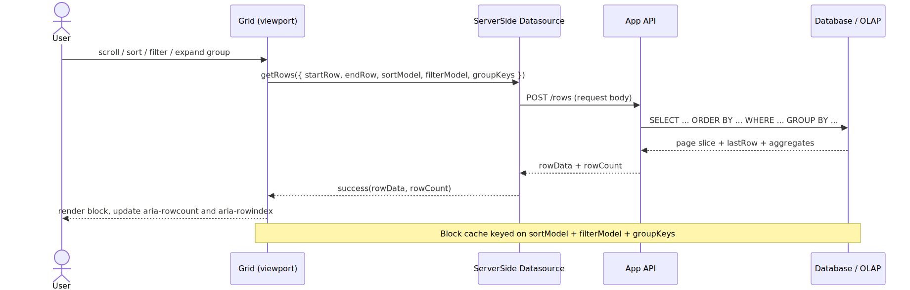
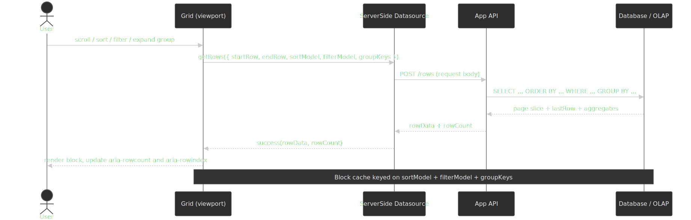

```ts title="AG Grid with the server-side row model" collapse={1-3, 20-30}
import { AgGridReact } from "ag-grid-react"
import "ag-grid-enterprise"
import "ag-grid-community/styles/ag-grid.css"

const gridOptions = {
  rowModelType: "serverSide",
  serverSideDatasource: {
    getRows: (params) => {
      // Server handles sorting, filtering, grouping
      fetch("/api/rows", {
        method: "POST",
        body: JSON.stringify({
          startRow: params.request.startRow,
          endRow: params.request.endRow,
          sortModel: params.request.sortModel,
          filterModel: params.request.filterModel,
          groupKeys: params.request.groupKeys,
        }),
      })
        .then((res) => res.json())
        .then((data) => params.success({ rowData: data.rows, rowCount: data.total }))
    },
  },
}
```

**Best for.**

- Enterprise applications with complex requirements (pivoting, Excel export, range selection).
- Teams that prefer configuration over hand-rolled UI.
- Applications that need server-side data operations out of the box.
- Financial and analytics dashboards with continuous updates.

**Implementation complexity.**

| Aspect             | Effort                                |
| ------------------ | ------------------------------------- |
| Initial setup      | Low — works out of the box            |
| Feature additions  | Low — most features are config flags  |
| Performance tuning | Medium — pick row model + tune caches |
| Testing            | Low — well-documented behavior        |

> [!NOTE]
> Bundle size is the price of "everything in the box". `ag-grid-community` is ~298 KB minified + gzipped on Bundlephobia ([source](https://bundlephobia.com/package/ag-grid-community)); enterprise modules add ~200-500 KB more depending on which features you import ([AG Grid bundle-size guidance](https://blog.ag-grid.com/minimising-bundle-size/)). Module-based imports are how you keep the production bundle under control.

**Trade-offs vs other paths.**

- Pros: comprehensive feature set, excellent docs, battle-tested at scale.
- Cons: large bundle even after tree-shaking, theming requires understanding their architecture, enterprise license cost.

---

### Path 3: Canvas-Based Rendering (Custom or Specialized)

**Architecture.**

Canvas grids draw cells directly to a `<canvas>` 2D context, bypassing the DOM for the cell area. This eliminates per-cell layout cost but means re-implementing text rendering, selection, scrollbars, hit-testing, copy/paste, and find-in-page.


**How it works.**

The render loop runs on `requestAnimationFrame`. On each frame:

1. Calculate which rows and columns are visible from the scroll position.
2. Clear the canvas (or just the dirty regions).
3. Draw cell backgrounds, then text, then borders.
4. Draw selection overlays.
5. Schedule the next frame if scrolling.

Text input requires overlay `<input>` elements positioned over the canvas. Mouse interaction requires hit-testing coordinates against cell boundaries. Accessibility requires a parallel DOM structure that mirrors what the canvas paints.

**Best for.**

- Spreadsheet apps that need 100K+ visible cells simultaneously.
- Apps where DOM performance has been *measured* as the bottleneck.
- Teams with prior graphics-programming experience.
- Custom in-cell visualizations (sparklines, heatmaps, waveforms).

**Implementation complexity.**

| Aspect             | Effort                                  |
| ------------------ | --------------------------------------- |
| Initial setup      | Very high — you build everything        |
| Feature additions  | High — no abstractions to lean on       |
| Performance tuning | Medium — canvas itself is fast          |
| Testing            | High — visual + coordinate-math testing |

**Trade-offs vs other paths.**

- Pros: best raw rendering throughput, full visual control, no DOM-node ceiling.
- Cons: accessibility is hard, every browser feature (find, copy, translate, IME) must be re-implemented, large engineering investment.

---

### Path 4: React-Integrated with Built-In Virtualization (MUI X DataGrid)

**Architecture.**

MUI X DataGrid keeps real DOM elements but renders only those for visible cells, bridging canvas-style throughput and DOM-style accessibility.


**How it works.**

Row virtualization renders only rows in the viewport plus a configurable pixel-buffer overscan. Column virtualization renders columns within a similar pixel buffer. The grid maintains scroll position with a combination of:

- Absolute positioning of the visible rows
- A spacer element sized to the total scrollable height
- Transform translations for smooth updates during scroll

The current API uses **pixel-based** buffer props (`rowBufferPx`, `columnBufferPx`); these replaced the older count-based `rowBuffer` / `columnBuffer` props ([MUI X virtualization docs](https://mui.com/x/react-data-grid/virtualization/)).

```ts title="MUI X DataGrid configuration" collapse={1-4, 18-25}
import { DataGrid } from "@mui/x-data-grid"

// Virtualization is on by default; tune the overscan buffers in pixels.
const dataGridProps = {
  rows,
  columns,
  // Pixel-based buffers above and below / left and right of the viewport.
  rowBufferPx: 200,
  columnBufferPx: 150,
  // Disable only for tests (e.g. jsdom); destroys performance on real data.
  // disableVirtualization: true,
}

// The Community tier caps row virtualization at 100 rows.
// Pro and Premium remove the cap.
```

> [!IMPORTANT]
> The Community (free) tier caps row virtualization at 100 rows; Pro and Premium remove the cap ([MUI X virtualization docs](https://mui.com/x/react-data-grid/virtualization/)). If you are evaluating MUI X for a >100-row dataset, you are evaluating the paid tier.

**Best for.**

- React applications already on Material UI.
- Teams that want virtualization without writing it.
- Medium-scale grids — thousands to tens of thousands of rows.
- Apps that want sane defaults more than maximum customization.

**Implementation complexity.**

| Aspect             | Effort                                |
| ------------------ | ------------------------------------- |
| Initial setup      | Low — install and configure           |
| Feature additions  | Low to medium — props for most things |
| Performance tuning | Low — virtualization is built in      |
| Testing            | Low — documented component API        |

**Trade-offs vs other paths.**

- Pros: balanced features and bundle, virtualization included, React-idiomatic API.
- Cons: tied to the MUI ecosystem, Community tier has hard limits, less customizable than headless.

---

### Decision Matrix

| Factor             | Headless (TanStack)       | Full-Featured (AG Grid)   | Canvas-Based   | React-Integrated (MUI X)            |
| ------------------ | ------------------------- | ------------------------- | -------------- | ----------------------------------- |
| Bundle size        | ~15 KB gz core            | ~300 KB gz + 200-500 KB enterprise | Custom | ~100 KB gz, depending on theme |
| Max rows (client)  | Depends on virtualization | 100K+ (client-side model) | 1M+            | 100K Community / unlimited Pro      |
| Rendering control  | Full                      | Limited                   | Full           | Limited                             |
| Virtualization     | DIY                       | Built in                  | Native         | Built in                            |
| Accessibility      | DIY                       | Good                      | Very difficult | Good                                |
| Learning curve     | Medium                    | Low                       | Very high      | Low                                 |
| Styling freedom    | Full                      | Moderate (themes)         | Full           | Material-themed                     |


## Virtualization Deep Dive

Virtualization is the foundation of grid performance — every architecture above ultimately rests on some form of it. The variants differ in how they translate scroll position to a visible-row range and how they recycle the DOM.

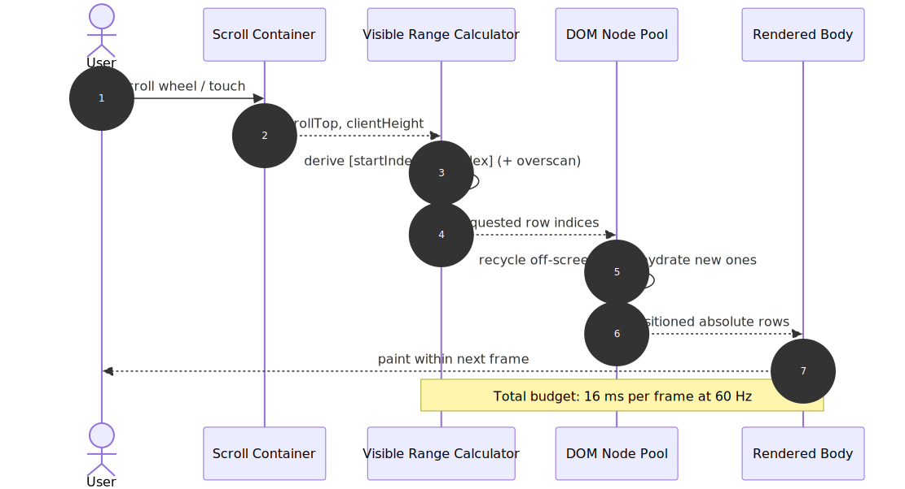
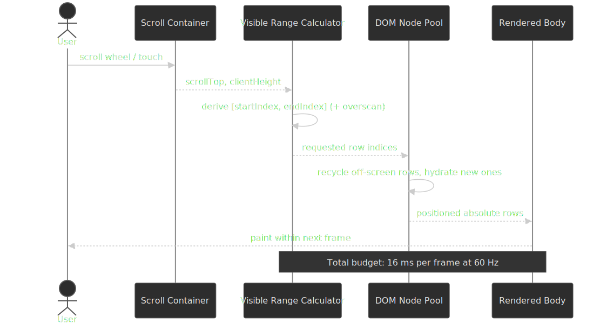

### Fixed-Height Virtualization

When all rows have identical height, the visible-range math is constant time:

```ts title="Fixed-height position calculation"
const itemHeight = 35 // pixels
const scrollTop = 1500
const containerHeight = 500

const startIndex = Math.floor(scrollTop / itemHeight)
const endIndex = Math.min(
  startIndex + Math.ceil(containerHeight / itemHeight) + 1,
  totalRows,
)

const visibleRows = rows.slice(startIndex, endIndex)
const offsetY = startIndex * itemHeight
```

Scroll performance is optimal because:

- No DOM measurement during scroll
- Direct index calculation, no binary search
- A single, stable total-height calculation

**Use when:** log viewers, data tables with uniform content, lists of records of the same shape.

### Variable-Height Virtualization

Real content varies. Social feeds, rich-text editors, expandable rows, and any cell with wrapped text need dynamic-height handling:

```ts title="Variable-height with measurement caching"
const heightCache = new Map<number, number>()
const estimatedHeight = 50

function getRowOffset(index: number): number {
  let offset = 0
  for (let i = 0; i < index; i++) {
    offset += heightCache.get(i) ?? estimatedHeight
  }
  return offset
}

function findStartIndex(scrollTop: number): number {
  let low = 0,
    high = totalRows - 1
  while (low < high) {
    const mid = Math.floor((low + high) / 2)
    if (getRowOffset(mid) < scrollTop) {
      low = mid + 1
    } else {
      high = mid
    }
  }
  return low
}
```

The challenges:

1. **Scroll jump.** When estimates are wrong, the total scrollable height changes as items render, and the scrollbar visibly jumps.
2. **Measurement timing.** You cannot measure until you render, but you need heights to know what to render.
3. **Memory overhead.** The height cache grows with the dataset.

**Mitigations:**

- **Overscan.** Render extra rows above and below the viewport so newly visible rows are already measured.
- **Estimate refinement.** Update the running estimate as you measure more items.
- **Anchor preservation.** When the total height changes, adjust scroll position to keep the visually anchored content stable.
- **`ResizeObserver`-driven re-measurement.** TanStack Virtual exposes `virtualizer.measureElement` (attached to each row's `ref`) which observes the rendered element via `ResizeObserver` and rewrites the height cache without a layout thrash ([TanStack Virtual API](https://tanstack.com/virtual/latest/docs/api/virtualizer)). `react-window` delegates to a user-supplied `itemSize` and offers `VariableSizeList` with explicit `resetAfterIndex` invalidation.

> [!TIP]
> Position virtualized rows with `transform: translate3d(0, ${start}px, 0)` rather than `top`. The transform stays on the compositor thread and avoids a per-frame layout pass; `top` triggers layout for every changed row ([web.dev: Stick to compositor-only properties](https://web.dev/articles/stick-to-compositor-only-properties-and-manage-layer-count)).

### Column Virtualization

Wide grids need horizontal virtualization. MUI X DataGrid renders columns within a configurable pixel buffer (`columnBufferPx`, default ~150 px) of the visible region:

```ts title="Column visibility calculation"
const scrollLeft = container.scrollLeft
const containerWidth = container.clientWidth

const visibleStart = scrollLeft - columnBuffer
const visibleEnd = scrollLeft + containerWidth + columnBuffer

const visibleColumns = columns.filter((col, index) => {
  const colStart = getColumnOffset(index)
  const colEnd = colStart + col.width
  return colEnd >= visibleStart && colStart <= visibleEnd
})
```

Column virtualization composes with pinned columns: pinned columns are always rendered regardless of horizontal scroll position.

### Overscan Strategy

Overscan renders items beyond the visible region to mask blank flashes during fast scrolling:

| Overscan amount | Trade-off                                       |
| --------------- | ----------------------------------------------- |
| 0               | Minimal DOM, visible flashing on fast scroll    |
| 1-3 rows        | Good balance for most use cases                 |
| 5-10 rows       | Smooth scroll, larger initial render            |
| 20+ rows        | Defeats virtualization                          |

`react-window` exposes `overscanCount` (default 1, applied in the scroll direction) ([react-window list props](https://github.com/bvaughn/react-window?tab=readme-ov-file#list)). MUI X exposes `rowBufferPx` and `columnBufferPx` in pixels ([MUI X virtualization](https://mui.com/x/react-data-grid/virtualization/)).

## Column and Row Features

### Sorting Implementation

Client-side sorting is straightforward but blocks the main thread:

```ts title="Synchronous sort blocks the main thread" mark={3-5}
function sortRows(rows: Row[], sortKey: string, direction: "asc" | "desc") {
  return [...rows].sort((a, b) => {
    // 100K comparisons can block tens to hundreds of milliseconds
    const comparison = a[sortKey] > b[sortKey] ? 1 : -1
    return direction === "asc" ? comparison : -comparison
  })
}
```

For large datasets, push the work into a Web Worker:

```ts title="Web Worker sort" collapse={1-8, 22-30}
// worker.ts
self.onmessage = (e) => {
  const { rows, sortKey, direction } = e.data
  const sorted = [...rows].sort((a, b) => {
    const comparison = a[sortKey] > b[sortKey] ? 1 : -1
    return direction === "asc" ? comparison : -comparison
  })
  self.postMessage(sorted)
}

// main.ts
const worker = new Worker("worker.ts")

function sortAsync(rows: Row[], sortKey: string, direction: SortDirection): Promise<Row[]> {
  return new Promise((resolve) => {
    worker.onmessage = (e) => resolve(e.data)
    worker.postMessage({ rows, sortKey, direction })
  })
}

sortAsync(largeDataset, "name", "asc").then(setSortedRows)
```

**Server-side sorting** is required when the data does not fit in memory. The grid sends sort parameters; the server returns sorted pages.

### Frozen Rows and Columns

Pinning is two-dimensional. Pinned (a.k.a. frozen) columns keep identity columns and action columns visible during horizontal scroll; pinned rows keep the header and totals visible during vertical scroll. The fully general layout is a 3 × 3 grid of regions sharing scroll axes:



Implementation requirements:

1. **Scroll sync.** Centre-row regions share `scrollLeft`; middle-column regions share `scrollTop`. The four corner regions are anchored to no scroll axis.
2. **Independent virtualization windows.** Each scrollable region runs its own visible-range calculator; the centre region runs both row and column virtualization.
3. **Shadow indicators.** Visual cues (drop shadows or 1 px borders) showing content beneath the pinned regions.
4. **Selection continuity.** Selection spans all nine regions; range selection has to walk across the seam without losing the anchor cell.
5. **Sticky positioning vs separate panes.** Modern grids prefer `position: sticky` cells inside one scroll container (simpler focus model) when the row count fits; large grids fall back to separate panes with synced scroll for performance and overflow control.

Practical defaults:

- Limit left-pinned width to 200-300 px (identity columns).
- Limit right-pinned width to 100-150 px (action buttons).
- Pin at most one or two top rows (header + filter row) and one bottom row (totals).
- Unpin responsively if pinned columns exceed ~60% of grid width.

### Row Grouping and Tree Structures

Row grouping turns flat data into a hierarchical view:

```ts title="Row grouping data structure"
interface GroupedRow {
  type: "group"
  groupKey: string
  groupValue: unknown
  children: (GroupedRow | DataRow)[]
  aggregates: Record<string, number>
  isExpanded: boolean
}

interface DataRow {
  type: "data"
  data: Record<string, unknown>
}

const grouped: GroupedRow = {
  type: "group",
  groupKey: "department",
  groupValue: "Engineering",
  isExpanded: true,
  aggregates: { salary: 2_500_000, headcount: 50 },
  children: [
    { type: "data", data: { name: "Alice", salary: 150_000 } },
    { type: "data", data: { name: "Bob", salary: 140_000 } },
  ],
}
```

Client-side grouping works for moderate datasets. Server-side row models (e.g. AG Grid Enterprise) fetch grouped data on demand — expanding a group triggers a request for its children.

### Cell Editing

Choose two orthogonal axes: *trigger* and *commit boundary*.

| Trigger        | UX                          | Implementation                       |
| -------------- | --------------------------- | ------------------------------------ |
| Click-to-edit  | Click cell → editor appears | Replace cell renderer with input     |
| Double-click   | Double-click → editor       | Same, different trigger              |
| Always-editing | Cells are always inputs     | Higher memory, keyboard challenges   |
| Modal editing  | Click → popup form          | Separate form-state management       |

| Commit boundary    | When mutation fires                                           | Use when                                          |
| ------------------ | ------------------------------------------------------------- | ------------------------------------------------- |
| Cell-level commit  | Each cell on `Enter` / `Tab` / blur                           | Each field is independently valid; spreadsheets   |
| Row-level commit   | Whole row on row-leave or explicit "Save row"                 | Cross-field validation; ledger entries            |
| Full-form commit   | Whole grid on a save action                                   | Bulk imports, configuration sheets                |

The full lifecycle is a small state machine — getting it wrong is how you lose user edits:


```ts title="Inline cell-edit state" collapse={1-5, 18-25}
interface CellEditState {
  rowId: string
  columnId: string
  originalValue: unknown
  currentValue: unknown
  isValid: boolean
}

function handleCellEdit(rowId: string, colId: string) {
  setEditState({
    rowId,
    columnId: colId,
    originalValue: getCellValue(rowId, colId),
    currentValue: getCellValue(rowId, colId),
    isValid: true,
  })
}

function commitEdit() {
  if (editState.isValid) {
    updateCell(editState.rowId, editState.columnId, editState.currentValue)
  }
  setEditState(null)
}

function cancelEdit() {
  setEditState(null)
}
```

Keyboard conventions follow the [WAI-ARIA Grid pattern](https://www.w3.org/WAI/ARIA/apg/patterns/grid/):

- `Enter` — commit and move to the cell below.
- `Tab` — commit and move to the next cell.
- `Escape` — cancel edit, restore original value.
- `F2` — enter edit mode on the focused cell.

## Accessibility

### ARIA Grid Pattern

The [WAI-ARIA Authoring Practices](https://www.w3.org/WAI/ARIA/apg/patterns/grid/) define the grid pattern for two-dimensional tabular widgets. Required structure:

```html title="ARIA grid structure"
<div role="grid" aria-label="Employee data" aria-rowcount="1000" aria-colcount="10">
  <div role="rowgroup">
    <div role="row" aria-rowindex="1">
      <div role="columnheader" aria-colindex="1" aria-sort="ascending">Name</div>
      <div role="columnheader" aria-colindex="2">Department</div>
    </div>
  </div>
  <div role="rowgroup">
    <div role="row" aria-rowindex="2">
      <div role="gridcell" aria-colindex="1">Alice</div>
      <div role="gridcell" aria-colindex="2">Engineering</div>
    </div>
  </div>
</div>
```

Critical attributes when virtualizing ([Grid and Table Properties](https://www.w3.org/WAI/ARIA/apg/practices/grid-and-table-properties/)):

- `aria-rowcount` / `aria-colcount` — total count for the entire dataset, not just rendered rows. Set to `-1` if unknown.
- `aria-rowindex` / `aria-colindex` — **1-based** position within the dataset; must be updated as virtualized rows scroll into view.
- `aria-sort` — `ascending`, `descending`, or `none` on the active sorted column header.
- `aria-selected` — for selectable cells or rows.

> [!WARNING]
> Missing or stale `aria-rowindex` values silently break screen-reader table navigation — it is one of the most common a11y bugs in virtualized grids ([Grid and Table Properties](https://www.w3.org/WAI/ARIA/apg/practices/grid-and-table-properties/)).

### Keyboard Navigation

The Grid pattern mandates a roving-tabindex strategy: exactly one cell is in the tab sequence; arrow keys move focus inside the grid ([WAI-ARIA Grid pattern](https://www.w3.org/WAI/ARIA/apg/patterns/grid/)).

| Key             | Action                              |
| --------------- | ----------------------------------- |
| Arrow keys      | Move focus one cell in direction    |
| Home / End      | First / last cell in row            |
| Ctrl+Home / End | First / last cell in grid           |
| Page Up / Down  | Move focus by visible page height   |
| Ctrl+Space      | Select column                       |
| Shift+Space     | Select row                          |
| F2              | Enter edit mode                     |
| Escape          | Exit edit mode                      |

```ts title="Keyboard navigation handler" collapse={1-3, 25-35}
function handleKeyDown(e: KeyboardEvent, currentRow: number, currentCol: number) {
  switch (e.key) {
    case "ArrowRight":
      e.preventDefault()
      focusCell(currentRow, Math.min(currentCol + 1, colCount - 1))
      break
    case "ArrowLeft":
      e.preventDefault()
      focusCell(currentRow, Math.max(currentCol - 1, 0))
      break
    case "ArrowDown":
      e.preventDefault()
      focusCell(Math.min(currentRow + 1, rowCount - 1), currentCol)
      break
    case "ArrowUp":
      e.preventDefault()
      focusCell(Math.max(currentRow - 1, 0), currentCol)
      break
    case "Home":
      e.preventDefault()
      if (e.ctrlKey) {
        focusCell(0, 0)
      } else {
        focusCell(currentRow, 0)
      }
      break
    // ...
  }
}
```

### Screen Reader Considerations

Virtualization creates three problems:

1. **Rows that do not exist yet.** Screen readers cannot read a cell that has not been rendered. Maintain accurate `aria-rowcount`, and use `aria-rowindex` so the user knows where they are in the dataset.
2. **Focus management on swap.** When the row pool recycles, focus must move to the newly rendered cell at the same index, not stay attached to a node that is about to disappear.
3. **Live regions for status.** Use a polite `aria-live` region for sort, filter, and pagination announcements.

```html title="Status announcements"
<div aria-live="polite" aria-atomic="true" class="sr-only">
  Sorted by Name, ascending. Showing 1 to 50 of 1,000 rows.
</div>
```

Canvas-based grids are the worst offenders here: by default the canvas is invisible to assistive tech. Google Docs and Sheets work around this by maintaining a parallel DOM mirror that screen readers walk while the canvas renders the visible cells ([Google Docs canvas-based rendering](https://workspaceupdates.googleblog.com/2021/05/Google-Docs-Canvas-Based-Rendering-Update.html)).

## Performance Optimization

### Memoization Strategy

React grids benefit heavily from memoization:

```ts title="Memoizing row components" collapse={1-5, 18-25}
// Without memoization: every row re-renders on any state change
const Row = ({ data, columns }) => (
  <tr>
    {columns.map((col) => (
      <td key={col.id}>{data[col.field]}</td>
    ))}
  </tr>
)

// With memoization: rows only re-render when their data changes
const Row = React.memo(
  ({ data, columns }) => (
    <tr>
      {columns.map((col) => (
        <td key={col.id}>{data[col.field]}</td>
      ))}
    </tr>
  ),
  (prev, next) => prev.data === next.data && prev.columns === next.columns,
)
```

Common memoization defeats:

- New objects in render props (`style={{ margin: 10 }}`) — reference identity changes each render.
- Inline callbacks (`onClick={() => handleClick(id)}`) — defeat `React.memo`.
- Unstable column definitions — define columns outside the component or memoize them.

### Batch Updates

Multiple rapid updates should batch into a single render:

```ts title="Batching cell updates"
// Without batching: N updates = N renders
updates.forEach((update) => {
  setData((prev) => updateCell(prev, update))
})

// With batching: N updates = 1 render
setData((prev) => {
  let next = prev
  updates.forEach((update) => {
    next = updateCell(next, update)
  })
  return next
})
```

For real-time data (WebSocket feeds, market data), buffer updates and flush them on `requestAnimationFrame`. This is the standard rAF-coalescing pattern: callbacks queued during a frame run before the next paint, so flushing once per frame guarantees the work aligns with the display refresh ([web.dev: Jank busting](https://web.dev/articles/speed-rendering)).

```ts title="rAF-batched updates" collapse={1-5, 18-25}
const updateBuffer: Update[] = []
let rafScheduled = false

function queueUpdate(update: Update) {
  updateBuffer.push(update)
  if (!rafScheduled) {
    rafScheduled = true
    requestAnimationFrame(flushUpdates)
  }
}

function flushUpdates() {
  rafScheduled = false
  if (updateBuffer.length > 0) {
    setData((prev) => applyUpdates(prev, updateBuffer.splice(0)))
  }
}
```

### Paint Cost: Transform, Containment, content-visibility

Frame cost is dominated by style, layout, and paint — not script. Three CSS-level levers move the needle:

1. **Composite-only positioning.** Move rows with `transform: translate3d(0, ${y}px, 0)` (and `will-change: transform` while a scroll is in flight). The transform stays on the compositor thread; switching to `top` forces layout for every row that moves ([web.dev: Stick to compositor-only properties](https://web.dev/articles/stick-to-compositor-only-properties-and-manage-layer-count)).
2. **CSS containment per row.** `contain: layout paint` on the row element tells the engine the subtree's layout and paint do not affect the rest of the document, letting it skip large chunks of the render pipeline when a single cell changes ([CSS Containment Module Level 2](https://www.w3.org/TR/css-contain-2/)).
3. **`content-visibility: auto` for off-viewport sub-trees.** Combined with `contain-intrinsic-size`, the browser skips style, layout, and paint for elements outside the viewport while keeping them in the accessibility tree and find-in-page index ([web.dev: `content-visibility`](https://web.dev/articles/content-visibility), Baseline since 2025).

```css title="Per-row containment for a virtualized grid"
.grid-row {
  position: absolute;
  inset-inline: 0;
  height: var(--row-h, 32px);
  transform: translate3d(0, var(--row-y), 0);
  contain: layout paint;
  content-visibility: auto;
  contain-intrinsic-size: auto var(--row-h, 32px);
}
```

> [!CAUTION]
> `content-visibility: auto` skips style and layout for off-screen content. If you depend on `IntersectionObserver` or `getBoundingClientRect` for those rows during scroll, you will read stale or zero values. Pair with `contentvisibilityautostatechange` if you need a callback when a row becomes relevant.

### Memory Management

Large grids consume memory in multiple ways:

| Source           | Mitigation                            |
| ---------------- | ------------------------------------- |
| Row data         | Paginate or virtualize data fetching  |
| Height cache     | Use a `Map` with bounded eviction     |
| Event listeners  | Share handlers via event delegation   |
| Undo history     | Limit depth, compress states          |

For grids with 100K+ rows:

- Push filtering and sorting to the server — do not load all rows.
- Fetch rows lazily as they enter the viewport (cursor-based pagination).
- Treat the client cache as a sliding window, not an indefinite store.

## Clipboard, Copy, and Paste

Excel-style copy/paste inside a custom widget means intercepting the native `copy`, `cut`, and `paste` events while the grid owns focus. The grid serializes its current selection (or active cell) into the clipboard payload and parses incoming text — typically TSV — back into a transactional update.

| Concern              | Implementation                                                                                                         |
| -------------------- | ---------------------------------------------------------------------------------------------------------------------- |
| Wire format          | Tab-separated rows, newline-separated columns — the de-facto Excel interchange format. Add `text/html` for rich paste. |
| Cell coercion        | Run pasted strings through the same value parsers used for editing; reject and surface invalid cells per cell.         |
| Range vs row paste   | Paste either anchors at the active cell (overflow ignored) or fills the current selected range (clamped or repeated).  |
| Permissions          | The async `Clipboard API` requires a user gesture and `clipboard-write` / `clipboard-read` permissions in some browsers ([MDN: Clipboard API](https://developer.mozilla.org/en-US/docs/Web/API/Clipboard_API)). |
| Accessibility        | Always preserve the underlying `copy` / `cut` / `paste` events so screen readers and password managers continue to work. |

AG Grid documents this surface explicitly: `processCellForClipboard` and `processDataFromClipboard` hook the serialization and the inverse parse, while `cellSelection` enables the Excel-compatible TSV copy of a range ([AG Grid Clipboard](https://www.ag-grid.com/javascript-data-grid/clipboard/)). Canvas grids have no native clipboard at all and have to mint a hidden `<textarea>` to receive paste events on each focus change ([Google Workspace Updates: Canvas-based rendering](https://workspaceupdates.googleblog.com/2021/05/Google-Docs-Canvas-Based-Rendering-Update.html)).

## Undo and Redo

Inline editing without undo is a footgun. The minimum viable model is two stacks of *commands*, not snapshots:

```ts title="Command-based undo/redo"
type EditCommand = {
  apply: () => void
  invert: () => void
  label: string
}

const undo: EditCommand[] = []
const redo: EditCommand[] = []

function dispatch(cmd: EditCommand) {
  cmd.apply()
  undo.push(cmd)
  redo.length = 0
}

function undoOnce() {
  const cmd = undo.pop()
  if (!cmd) return
  cmd.invert()
  redo.push(cmd)
}
```

Operational rules learned the hard way:

- **Cap depth.** Production grids cap the stack at 10–50 entries to bound memory; AG Grid defaults `undoRedoCellEditingLimit` to 10 ([AG Grid Undo / Redo Edits](https://www.ag-grid.com/javascript-data-grid/undo-redo-edits/)).
- **Clear on order changes.** Sort, filter, group, and column-reorder operations invalidate row indices and must clear both stacks (or remap them) — AG Grid clears them.
- **Coalesce paste batches.** A single paste of *N* cells should be one undo entry, not *N*. Use a transaction wrapper that records one composite command.
- **Server-side editing.** When mutations go through `cellEditRequest` (read-only data), the grid is *not* the source of truth — the server is. Local undo must trigger a compensating server call, not just flip a local cache.
- **Ctrl+Z bindings only inside the grid.** Capture undo/redo only while focus is inside the grid; release to the browser otherwise so users do not lose form text outside the grid.

## Real-World Implementations

### Google Docs and Sheets: Canvas-First Architecture

Google Docs migrated its document rendering from DOM to canvas in 2021 to improve performance and produce a consistent appearance across platforms ([Workspace Updates](https://workspaceupdates.googleblog.com/2021/05/Google-Docs-Canvas-Based-Rendering-Update.html)). Google Sheets has used canvas-style rendering for the main cell area since well before that.

Canvas rendering enables:

- Hundreds of thousands of visible cells without DOM node-count cost.
- Consistent cell formatting across browsers (borders, conditional formatting, custom selection rendering).
- Single-draw paint per frame instead of per-cell layout.

The trade-offs are real and visible:

- Find-in-page (Ctrl+F) opens a custom dialog because native browser search does not see canvas content.
- Copy/paste must intercept clipboard events and serialize from the data model.
- Accessibility relies on a parallel DOM mirror — Google's announcement explicitly notes that assistive-technology support is preserved through that mechanism.

### Notion: Block-Based Rows

Notion's database views are built on top of its block model — every database row is a page block whose properties are themselves blocks ([Notion data model](https://www.notion.com/blog/data-model-behind-notion)). A 20,000-row database can therefore translate into hundreds of thousands of blocks, with real-time collaboration synchronizing block changes via WebSocket and a client-side `RecordCache` (IndexedDB) holding the working set.

The performance pressure points are:

- Formulas and rollups recalculate per view.
- More visible properties per row inflate the per-row payload.
- Inline databases on busy pages compound loading work.

Notion mitigates this with progressive loading — visible rows hydrate first, off-screen rows hydrate as the user scrolls.

### AG Grid in Financial Applications

Trading desks use AG Grid for real-time market data because the row models map cleanly onto the problem:

- The Viewport row model lets the server know exactly which rows are visible, so it can stream updates only to those rows.
- Custom cell renderers handle conditional formatting (red/green ticks).
- Hundreds of price updates per second batch into single-frame DOM updates via the rAF-coalescing pattern.

The architecture handles 50+ columns of continuous updates because only visible cells receive DOM updates and aggregation lives on the server.

## Conclusion

Data grid architecture choices cascade through the rest of the system. Headless vs full-featured vs canvas vs React-integrated determines bundle size, feature velocity, performance ceiling, and accessibility cost.

Key takeaways:

1. **Virtualize both axes past a few hundred rows.** Lighthouse already complains at ~1,400 body nodes; a wide grid hits that on the first thousand rows. Use `transform: translate3d`, `contain: layout paint`, and `content-visibility: auto` to cap paint cost.
2. **Match row model to scale and delivery mode.** Pagination, infinite scroll, and streaming each have a different backpressure story; client-side fits up to ~100K rows, beyond that you need infinite, server-side, or viewport models.
3. **Pinning is two-dimensional.** Frozen rows + frozen columns produce a nine-region layout; selection, focus, and keyboard navigation must coordinate across all of them.
4. **Editing is a state machine.** Cell vs row vs full-form commit modes change *when* the boundary fires, not the lifecycle. Always design for cancel, validation failure, and server reject.
5. **Accessibility is explicit work.** Virtualization breaks default screen-reader behaviour; budget time for ARIA roles, roving tabindex, F2 edit-mode toggle, and `aria-rowindex` updates.
6. **Clipboard and undo are first-class features.** Excel-style copy/paste and bounded undo/redo are not add-ons; they are how power users trust the grid.
7. **Canvas is a last resort.** The throughput is real; so are the accessibility, find-in-page, copy/paste, and IME costs.

The best data grid is the one that solves your users' problems without becoming a maintenance burden. Start with the simplest architecture that meets requirements; reach for canvas only when measurement, not intuition, says you must.

## Appendix

### Prerequisites

- DOM and browser-rendering fundamentals.
- React hooks and component lifecycle (for the React-based examples).
- Time-complexity basics (O(1), O(log n), O(n)).
- Familiarity with ARIA and keyboard accessibility patterns.

### Terminology

- **Virtualization / windowing** — rendering only visible items plus a buffer; recycling DOM nodes as the user scrolls.
- **Overscan** — extra items rendered beyond the visible region to mask flashes during fast scroll.
- **Row model** — the data-loading strategy: client-side loads everything, server-side / infinite / viewport models load on demand.
- **Pinning / freezing** — keeping columns or rows visible regardless of scroll position.
- **Headless UI** — a library that ships logic without rendering opinions; you supply the markup.

### Summary

- Data grids must virtualize past a few hundred rows to maintain performance — browsers struggle past ~1,400 body DOM nodes.
- Four architectures dominate: headless (TanStack Table — control), full-featured (AG Grid — batteries included), canvas-based (Google Sheets / Docs — throughput), React-integrated (MUI X — balance).
- Row models range from client-side (everything in memory) to server-side (fetch on demand) — pick by dataset size and update profile.
- Column pinning produces three vertically-synced scroll regions and must coordinate selection, focus, and keyboard navigation across them.
- Accessibility requires explicit ARIA roles, roving-tabindex keyboard handlers, and `aria-rowindex` updates as virtualized rows scroll in.
- Profile before optimizing: memoization, rAF-batching, and Web Workers each target a different bottleneck.

### References

- [WAI-ARIA Grid Pattern](https://www.w3.org/WAI/ARIA/apg/patterns/grid/) — definitive accessibility specification for data grids.
- [WAI-ARIA Grid and Table Properties](https://www.w3.org/WAI/ARIA/apg/practices/grid-and-table-properties/) — `aria-rowcount`, `aria-rowindex`, virtualization rules.
- [TanStack Table v8 — Migrating to v8](https://tanstack.com/table/v8/docs/guide/migrating) — headless rewrite rationale and API.
- [TanStack Virtual — `Virtualizer` API](https://tanstack.com/virtual/latest/docs/api/virtualizer) — `measureElement`, `ResizeObserver`-driven dynamic sizing, transform positioning.
- [AG Grid Row Models](https://www.ag-grid.com/javascript-data-grid/row-models/) — client-side, infinite, server-side, and viewport row models.
- [AG Grid Clipboard](https://www.ag-grid.com/javascript-data-grid/clipboard/) — `processCellForClipboard`, `processDataFromClipboard`, range copy.
- [AG Grid Undo / Redo Edits](https://www.ag-grid.com/javascript-data-grid/undo-redo-edits/) — `undoRedoCellEditing`, stack-clear semantics on sort/filter.
- [AG Grid Bundle Size guidance](https://blog.ag-grid.com/minimising-bundle-size/) — module-based imports for production bundles.
- [MUI X DataGrid Virtualization](https://mui.com/x/react-data-grid/virtualization/) — `rowBufferPx`, `columnBufferPx`, Community-tier 100-row cap.
- [react-window](https://github.com/bvaughn/react-window) — lightweight virtualization library by Brian Vaughn.
- [web.dev: Virtualize Long Lists](https://web.dev/articles/virtualize-long-lists-react-window/) — Google's guide to windowing with `react-window`.
- [web.dev: `content-visibility`](https://web.dev/articles/content-visibility) — skip rendering work for off-screen sub-trees.
- [web.dev: Stick to compositor-only properties](https://web.dev/articles/stick-to-compositor-only-properties-and-manage-layer-count) — why `transform` beats `top` for moving rows.
- [W3C CSS Containment Module Level 2](https://www.w3.org/TR/css-contain-2/) — `contain` property semantics; baseline for `content-visibility`.
- [W3C CSS Containment Module Level 3](https://www.w3.org/TR/css-contain-3/) — placeholder for ongoing containment work.
- [web.dev: DOM size and interactivity](https://web.dev/articles/dom-size-and-interactivity) — how DOM size impacts INP.
- [Chrome Lighthouse: Avoid an Excessive DOM Size](https://developer.chrome.com/docs/lighthouse/performance/dom-size) — concrete thresholds (800/1,400 nodes).
- [web.dev: RAIL](https://web.dev/articles/rail) — frame budget and perceived-latency targets.
- [web.dev: Jank busting for better rendering performance](https://web.dev/articles/speed-rendering) — `requestAnimationFrame` and rendering pipeline.
- [MDN: Clipboard API](https://developer.mozilla.org/en-US/docs/Web/API/Clipboard_API) — async clipboard reads/writes, permissions model.
- [Google Workspace Updates: Canvas-based rendering for Docs](https://workspaceupdates.googleblog.com/2021/05/Google-Docs-Canvas-Based-Rendering-Update.html) — official announcement of the DOM → canvas migration.
- [Notion data model](https://www.notion.com/blog/data-model-behind-notion) — block-based architecture behind Notion's database views.
- [MDN: ARIA grid role](https://developer.mozilla.org/en-US/docs/Web/Accessibility/ARIA/Reference/Roles/grid_role) — role reference.
