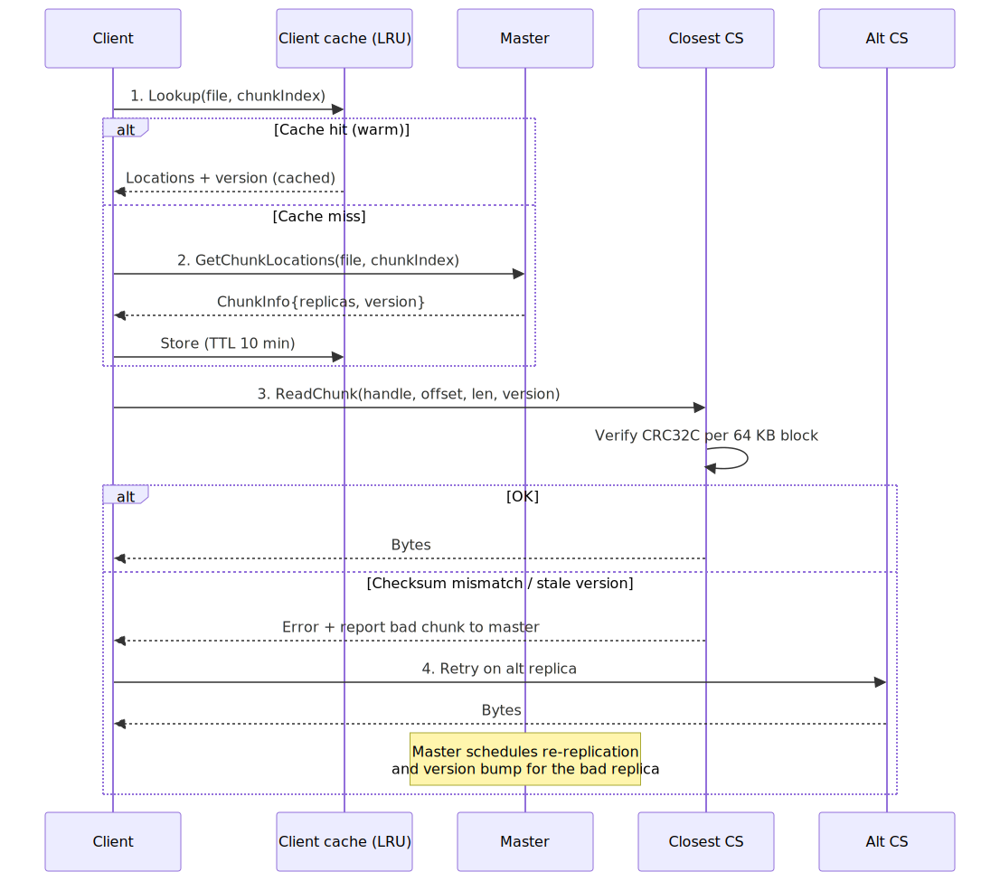
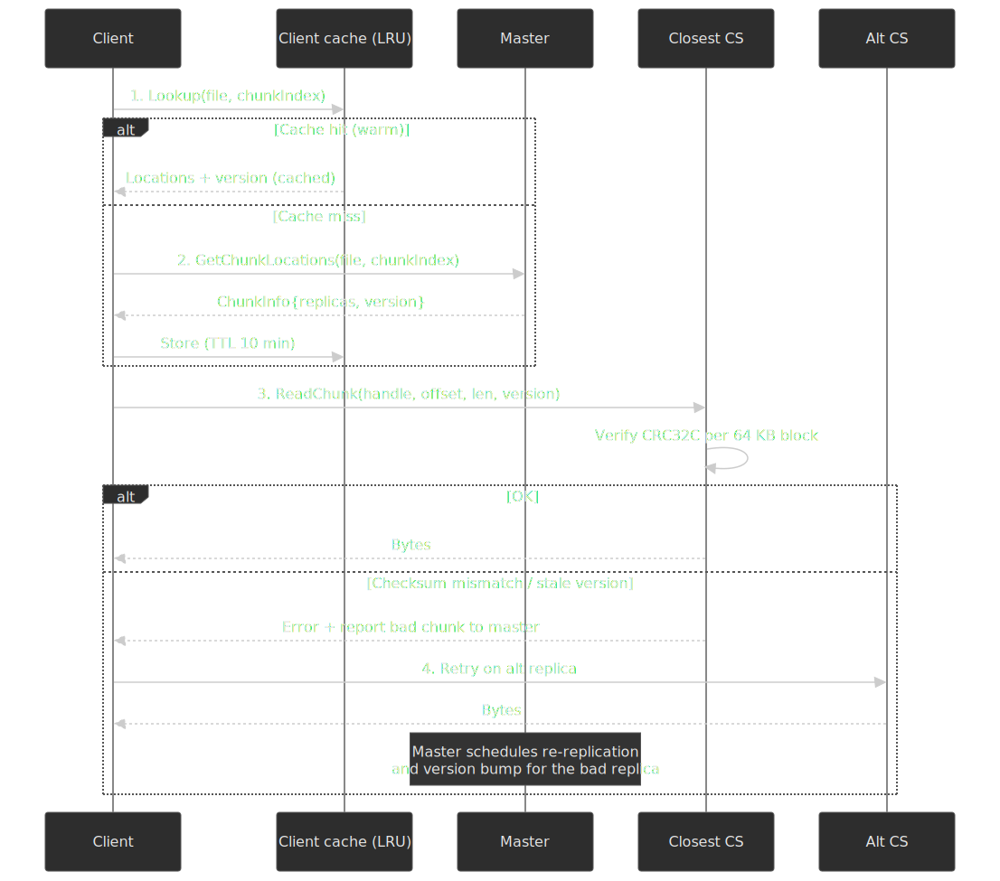
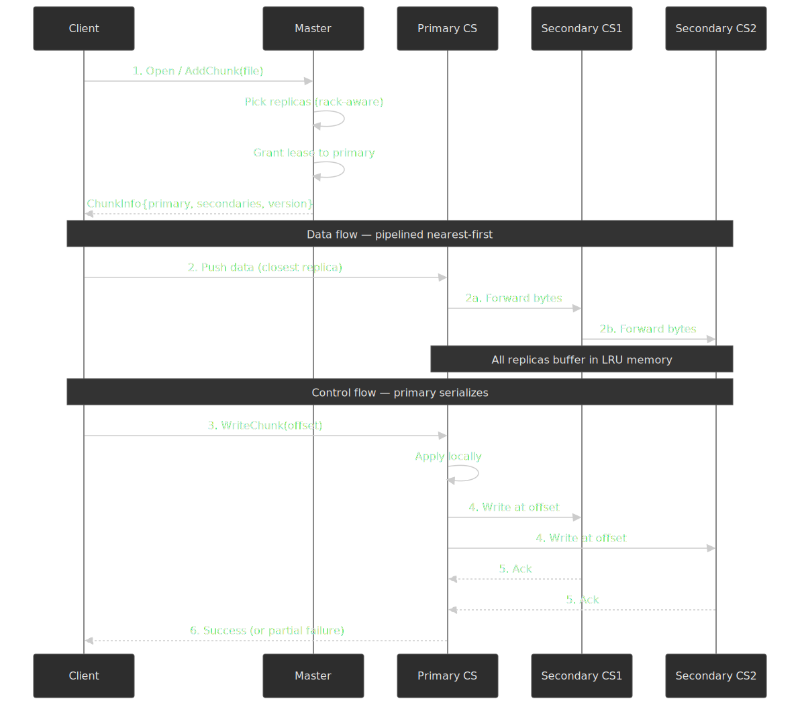
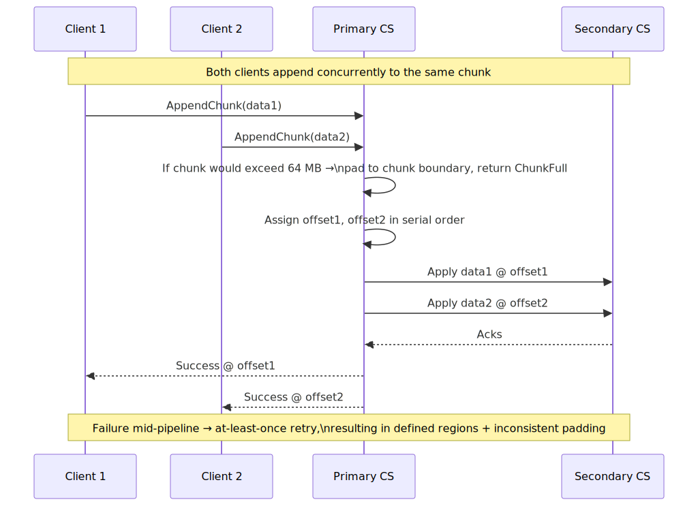
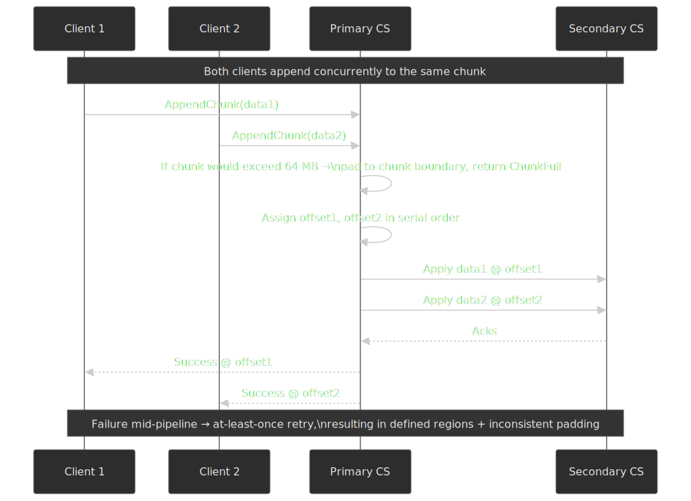

# Design a Distributed File System

A working design for a GFS/HDFS-style distributed file system: how a single master can hold the metadata for a petabyte cluster, how chunk servers serve hundreds of MB/s per client, how rack-aware replication survives correlated failures, and where the relaxed consistency model leaks into application code. The shape we end up with is the one [Google's GFS](https://research.google.com/archive/gfs-sosp2003.pdf) introduced and [HDFS](https://hadoop.apache.org/docs/current/hadoop-project-dist/hadoop-hdfs/HdfsDesign.html) productized, with notes on where Colossus and Tectonic eventually had to break the model.




## Abstract

Distributed file systems solve the problem of storing and accessing files that exceed single-machine capacity while providing fault tolerance and high throughput. The core architectural tension is between **metadata scalability** — how many files and chunks one place can track — and **data throughput** — how fast clients can move bytes once they know where to go.

**Core architectural decisions:**

| Decision            | Choice                    | Rationale                                                  |
| ------------------- | ------------------------- | ---------------------------------------------------------- |
| Metadata management | Single master             | Simplifies placement, enables global optimization          |
| Chunk size          | 64 MB (GFS) / 128 MB (HDFS default) | Amortizes metadata overhead, optimizes for large files |
| Replication         | 3 replicas, rack-aware    | Survives a rack failure with one cross-rack hop            |
| Consistency         | Relaxed (defined regions) | Enables concurrent appends, simplifies implementation      |
| Write model         | Append-mostly             | Eliminates random-write complexity, enables atomic appends |

**Key trade-offs accepted:**

- A single master caps metadata throughput at thousands of ops/sec — fine for batch workloads, painful for many-small-files workloads.[^gfs-paper]
- Large chunks waste space for small files and create read hotspots for popular chunks.
- Relaxed consistency pushes deduplication and validation into application code.

**What this design optimizes:**

- High throughput for large sequential reads/writes (100+ MB/s per client).
- Automatic recovery from disk, server, and rack failures with no operator action.
- Linear storage scaling to petabytes by adding chunk servers.

## Requirements

### Functional Requirements

| Requirement            | Priority | Notes                                   |
| ---------------------- | -------- | --------------------------------------- |
| File creation/deletion | Core     | Hierarchical namespace                  |
| Large file read        | Core     | Multi-GB to TB files, sequential access |
| Large file write       | Core     | Streaming writes, immutable after close |
| Record append          | Core     | Multiple clients appending concurrently |
| Snapshot               | Extended | Point-in-time copy for backups          |
| Namespace operations   | Extended | Rename, move, permissions               |
| Small file support     | Extended | Not optimized, but functional           |

### Non-Functional Requirements

| Requirement      | Target                    | Rationale                                    |
| ---------------- | ------------------------- | -------------------------------------------- |
| Availability     | 99.9% (3 nines)           | Batch processing tolerates brief outages     |
| Read throughput  | 100+ MB/s per client      | Saturate network, not disk                   |
| Write throughput | 50+ MB/s per client       | Pipeline replication caps single-client write speed |
| Append latency   | p99 < 100 ms              | Real-time log ingestion                      |
| Durability       | 99.9999%+                 | Survive multiple simultaneous failures       |
| Recovery time    | < 10 min for node failure | Re-replication must not overwhelm cluster    |

### Scale Estimation

> [!NOTE]
> All numbers below are sized for a "large but ordinary" deployment in the GFS/HDFS lineage — not for hyperscale (Colossus, Tectonic) which use distributed metadata.

**Cluster size:**

- 1,000–5,000 chunk servers.
- 12 × 4 TB disks per server → 48 TB raw per server.
- 5,000 × 48 TB ≈ 240 PB raw, ≈ 80 PB usable at 3× replication.

**Files and chunks (memory budget for the master):**

- 10 million files, average 1 GB → 16 chunks per file at 64 MB → 160 million chunks.
- The GFS master stores **less than 64 bytes of metadata per chunk** and **less than 64 bytes per file** (prefix-compressed namespace),[^gfs-metadata] giving ~10 GB of master memory at this scale and headroom up to ~100 M files on a 64 GB master.

**Traffic:**

- Concurrent clients: 10,000.
- Read-heavy workload: 90% reads, 10% writes.
- Aggregate read throughput: 10,000 × 100 MB/s = 1 TB/s cluster-wide.
- Aggregate write throughput: 1,000 × 50 MB/s = 50 GB/s cluster-wide.

**Metadata operations:**

- File opens per second: 5,000–10,000.
- Chunk-location lookups: 50,000–100,000 per second (clients prefetch consecutive chunks).

## Design Paths

### Path A: Single Master (GFS Model)

**Best when:**

- Metadata operations are not the bottleneck (batch processing).
- Simplicity and operational ease are priorities.
- Global optimization of chunk placement is valuable.
- File count is under 100 million.

**Architecture:**




**Key characteristics:**

- All metadata in the master's memory.
- Chunk locations not persisted — rebuilt from heartbeats on startup.[^gfs-locations]
- Operation log replicated to shadow masters for fast failover.
- Clients cache chunk locations heavily, so the master rarely sees a request per byte.

**Trade-offs:**

- Simple design, easy to reason about.
- Global knowledge enables optimal placement and rebalancing.
- Single coordination point makes lease and ordering decisions trivial.
- Memory footprint of metadata limits practical file count.
- Single CPU on the master limits metadata ops to a few thousand per second.[^gfs-paper]
- The master is a single point of failure (mitigated by shadow + manual or automated promotion).

**Real-world example:** GFS (2003-2010) used this model. Production clusters grew into the hundreds of TB across a few thousand chunk servers before metadata limits became painful; Google eventually replaced it with [Colossus](https://cloud.google.com/blog/products/storage-data-transfer/a-peek-behind-colossus-googles-file-system).

### Path B: Federated Masters (HDFS Federation)

**Best when:**

- Multiple independent workloads share infrastructure.
- File count exceeds single-master memory limits.
- Namespace isolation is desirable.
- Gradual scaling without re-architecture is needed.

**Architecture:**




**Key characteristics:**

- Each NameNode manages an independent namespace.
- Block pools are isolated per NameNode.
- DataNodes serve all NameNodes.
- No coordination between NameNodes, by design.[^hdfs-federation]

**Trade-offs:**

- Scales metadata horizontally by partitioning the namespace.
- Namespace isolation is convenient for multi-tenancy.
- Incremental scaling — add a NameNode without re-balancing data.
- No cross-namespace operations (hardlinks, atomic moves).
- Uneven utilization across namespaces requires manual rebalancing.
- Clients must know which NameNode owns a path (typically via [ViewFs](https://hadoop.apache.org/docs/current/hadoop-project-dist/hadoop-hdfs/ViewFs.html)).

**Real-world example:** HDFS Federation shipped in Hadoop 2.0 (2012); Yahoo deployed clusters with multiple NameNodes managing separate namespaces for different teams.

### Path C: Distributed Metadata (Colossus / Tectonic Model)

**Best when:**

- Exabyte-scale storage is required.
- Billions of files are expected.
- Multi-tenancy with strong isolation is critical.
- The team is comfortable operating a sharded transactional store.

**Architecture:**

 and D servers (storage) horizontally scalable.")


**Key characteristics:**

- Metadata in a sharded transactional store ([BigTable](https://cloud.google.com/blog/products/storage-data-transfer/a-peek-behind-colossus-googles-file-system) for Colossus, a custom layer for Tectonic).
- Curators are stateless and scale horizontally.
- Custodians handle background operations (GC, balance, RAID/RS reconstruction).
- D servers expose disks behind a thin RPC.

**Trade-offs:**

- Exabyte scale, billions of files.
- No single point of failure.
- True horizontal scaling for both metadata and data.
- Multi-layer architecture is harder to operate and debug.
- Higher latency on cold metadata paths (hop through curator → BigTable).
- Requires operational maturity around sharded stores.

**Real-world example:** Google Colossus has been the production successor to GFS since the early 2010s and now stores exabytes of data; according to Google, Colossus scales metadata "more than 100x" past the largest GFS clusters by storing the namespace and chunk index in BigTable behind a tier of stateless **curators**, with **D servers** exposing disks via RPC and **custodians** running background GC, balance, and RAID/RS reconstruction.[^colossus] Facebook's [Tectonic](https://www.usenix.org/system/files/fast21-pan.pdf) (FAST '21) consolidated Haystack, f4, and HDFS into one multi-tenant filesystem — a single reported cluster held ~1.59 EB raw across 4,208 storage nodes managing 10.7 B files and 15 B blocks, with an effective replication factor of ~2.8× via Reed–Solomon encoding (`RS(10,4)` for warm blob storage, `RS(9,6)` for the data warehouse) and "hedged quorum" writes that reserve 19 nodes and commit to the first 15 that respond.[^tectonic]

### Path Comparison

| Factor              | Single Master    | Federation              | Distributed  |
| ------------------- | ---------------- | ----------------------- | ------------ |
| Files               | ~100 M           | ~1 B (sum of namespaces) | Billions+   |
| Metadata ops/sec    | Low thousands   | Low thousands × N namespaces | 100K+   |
| Complexity          | Low              | Medium                  | High         |
| Cross-namespace ops | N/A              | No                      | Yes          |
| Operational burden  | Low              | Medium                  | High         |
| Best for            | Most deployments | Large enterprises       | Hyperscalers |

### This Article's Focus

This article focuses on **Path A (Single Master)** because:

1. It's the foundational model — every later system inherits its mechanics.
2. It is sufficient for the majority of deployments (up to ~100 M files).
3. It is simpler to reason about end-to-end.
4. The concepts (lease, pipeline write, rack placement, GC) transfer almost unchanged to federated and distributed designs.

Path B is touched on in the scaling section. Path C deserves its own article on metadata-at-scale architectures.

## High-Level Design

### Component Overview




### Master Server

The master manages all filesystem metadata and coordinates cluster-wide decisions.

**Responsibilities:**

- Namespace management (directory tree, file metadata).
- File-to-chunk mapping.
- Chunk-replica placement decisions.
- Lease management for write coordination.
- Garbage collection of orphaned chunks.
- Re-replication of under-replicated chunks.

**Design decisions:**

| Decision         | Choice                      | Rationale                                         |
| ---------------- | --------------------------- | ------------------------------------------------- |
| Metadata storage | In-memory                   | Sub-millisecond lookups; metadata is small per item |
| Persistence      | Operation log + checkpoints | Crash-consistent recovery, fast replay            |
| Chunk locations  | Not persisted               | Rebuilt from heartbeats in 30–60 s on startup     |
| Failover         | Manual + shadow masters     | Manual avoids split-brain footguns of auto-failover |

**Memory footprint (GFS-style, ~64 bytes/chunk and ~64 bytes/file):**[^gfs-metadata]

| Metadata                      | Per item            | At 100 M files / 500 M chunks |
| ----------------------------- | ------------------- | ----------------------------- |
| Namespace entries (compressed) | ~64 bytes/file      | ~6 GB                         |
| File → chunk mapping           | ~150 bytes/file (chunk handles) | ~15 GB              |
| Chunk metadata (handle, version, replicas) | ~64 bytes/chunk | ~32 GB                |
| **Total**                     |                     | **~50 GB (fits in 64 GB RAM)** |

> [!NOTE]
> The 64 bytes/chunk number from the GFS paper refers to the master-side metadata only; the actual `ChunkMetadata` struct in a Go-style implementation is larger because it carries replica server IDs and lease state. The 50 GB total budget assumes prefix-compressed paths, not naive per-node strings.

### Chunk Server

A chunk server stores chunks as local files and serves read/write requests.

**Responsibilities:**

- Store chunks as files on local disks (one chunk = one file).
- Serve reads directly to clients.
- Accept writes and forward in the replication pipeline.
- Report chunk inventory via heartbeat.
- Compute and verify checksums.
- Participate in re-replication.

**Design decisions:**

| Decision           | Choice                      | Rationale                             |
| ------------------ | --------------------------- | ------------------------------------- |
| Chunk storage      | Local filesystem (ext4 / XFS) | Leverage OS page cache; nothing to invent |
| Checksumming       | 64 KB blocks, 32-bit CRC    | GFS default; HDFS uses CRC32C with `dfs.bytes-per-checksum=512` so SSE4.2 / `crc32c` instructions can verify in hardware[^checksums] |
| Heartbeat interval | 3 seconds                   | HDFS default; balance failure detection vs. overhead[^hdfs-heartbeat] |
| Block report       | Piggybacked on heartbeat (deltas) + full report every 6 h | Avoid heartbeat bloat[^hdfs-blockreport] |

**Disk layout:**

```text title="chunk server disk layout"
/data/
├── disk1/
│   ├── chunks/
│   │   ├── chunk_abc123.dat    # 64 MB chunk data
│   │   ├── chunk_abc123.crc    # Checksums (4 KB for 64 MB at 64 KB blocks)
│   │   └── chunk_def456.dat
│   └── meta/
│       └── chunk_inventory.db  # Local SQLite for chunk metadata
├── disk2/
│   └── chunks/
└── disk12/
    └── chunks/
```

### Client Library

The client library provides the file-system interface and absorbs most of the distributed complexity.

**Responsibilities:**

- Translate file operations into master and chunk-server RPCs.
- Cache chunk locations (the single biggest reduction in master load).
- Buffer writes for efficiency.
- Handle retries and replica failover.
- Implement record-append semantics.

**Design decisions:**

| Decision              | Choice                         | Rationale                   |
| --------------------- | ------------------------------ | --------------------------- |
| Location cache        | LRU, ~10 K entries, 10-min TTL | Cuts master load by ~100x in practice |
| Write buffer          | 64 MB (one chunk)              | Batch small writes          |
| Retry policy          | Exponential backoff, 3 retries | Handle transient replica or network failures |
| Checksum verification | On read                        | Catch corruption before returning data |

## API Design

### Master Server API

#### File Operations

**Create file:**

```text
CreateFile(path: string, replication: int) → FileHandle
```

- Validates path, creates namespace entry.
- Does not allocate chunks (lazy allocation on first append).
- Returns a handle the client can carry across calls.

**Open file:**

```text
OpenFile(path: string, mode: READ|WRITE|APPEND) → FileHandle
```

- For writes: grants a lease via the chunk's primary, not the file.
- Returns current chunk locations for the working set.

**Delete file:**

```text
DeleteFile(path: string) → void
```

- Renames the file into a hidden, timestamped form.
- Actual chunk deletion is deferred to garbage collection (3-day default in GFS).[^gfs-gc]

#### Chunk Operations

**Get chunk locations:**

```text
GetChunkLocations(file: FileHandle, chunkIndex: int) → ChunkInfo
```

Response:

```json title="ChunkInfo response"
{
  "chunkId": "chunk_abc123",
  "version": 42,
  "replicas": [
    { "server": "cs1.example.com:9000", "rack": "rack1" },
    { "server": "cs4.example.com:9000", "rack": "rack2" },
    { "server": "cs7.example.com:9000", "rack": "rack2" }
  ],
  "primary": "cs4.example.com:9000",
  "leaseExpiry": "2026-04-21T10:05:00Z"
}
```

**Add chunk:**

```text
AddChunk(file: FileHandle) → ChunkInfo
```

- Allocates a new chunk handle.
- Picks replica servers (rack-aware).
- Grants a lease to one replica as primary.

### Chunk Server API

**Read chunk:**

```text
ReadChunk(chunkId: string, offset: int, length: int) → bytes
```

- Verifies checksum before returning data.
- On checksum mismatch, returns an error and reports the bad chunk to the master so the client can retry another replica.

**Write chunk:**

```text
WriteChunk(chunkId: string, offset: int, data: bytes, replicas: []Server) → void
```

- Accepts data (already pushed via the data pipeline), writes to disk.
- Forwards the write command to the next replica in the pipeline.
- Returns success only when all replicas acknowledge.

**Append chunk:**

```text
AppendChunk(chunkId: string, data: bytes) → (offset: int, error)
```

- Primary determines the offset.
- Broadcasts the assigned offset to replicas.
- Returns the offset where data was appended.
- If the chunk does not have space, returns `ChunkFull` and forces the client to retry on a freshly allocated chunk.

### Client API (User-Facing)

```python title="dfs.py"
class DistributedFileSystem:
    def create(path: str, replication: int = 3) -> File: ...
    def open(path: str, mode: str = "r") -> File: ...
    def delete(path: str) -> None: ...
    def rename(src: str, dst: str) -> None: ...
    def list(path: str) -> list["FileInfo"]: ...
    def mkdir(path: str) -> None: ...
    def exists(path: str) -> bool: ...

class File:
    def read(size: int = -1) -> bytes: ...
    def write(data: bytes) -> int: ...
    def append(data: bytes) -> int: ...  # returns offset
    def seek(offset: int) -> None: ...
    def close(self) -> None: ...
```

## Data Modeling

### Master Metadata Structures

**Namespace (in-memory tree):**

```go title="namespace.go"
type NamespaceNode struct {
    Name        string
    IsDirectory bool
    Children    map[string]*NamespaceNode  // For directories
    FileInfo    *FileMetadata               // For files
    Parent      *NamespaceNode

    Owner       string
    Group       string
    Permissions uint16
}

type FileMetadata struct {
    FileID      uint64
    Size        int64
    Replication int
    ChunkSize   int64  // Usually 64 MB (GFS) or 128 MB (HDFS)
    Chunks      []ChunkHandle
    CreatedAt   time.Time
    ModifiedAt  time.Time
}
```

**Chunk mapping (in-memory hash table):**

```go title="chunk_table.go"
type ChunkHandle uint64

type ChunkMetadata struct {
    Handle      ChunkHandle
    Version     uint64           // Bumped on each mutation; stale replicas detected
    Replicas    []ChunkServerID  // Current replica locations
    Primary     ChunkServerID    // Current lease holder
    LeaseExpiry time.Time
}

var chunkTable map[ChunkHandle]*ChunkMetadata
```

### Operation Log Format

A persistent append-only log is the only piece of master state on disk; the in-memory tree is recovered by replaying it from the latest checkpoint.

```text title="operation log entries"
[Timestamp][OpType][OpData]

[1706900000][CREATE_FILE]["/logs/2024/app.log", replication=3]
[1706900001][ADD_CHUNK][fileId=12345, chunkHandle=67890, version=1]
[1706900002][UPDATE_REPLICAS][chunkHandle=67890, replicas=[cs1,cs4,cs7]]
[1706900003][DELETE_FILE]["/tmp/old_file.dat"]
```

**Compaction:**

- Checkpoint: serialize the full in-memory state to disk in a B-tree-like format that can be `mmap`-ed on recovery.
- Truncate log entries before the checkpoint.
- Frequency: every 1 M operations or 1 hour, whichever comes first.

### Chunk Server Local Storage

**Chunk file format:**

```json title="chunk_<handle>.meta"
{
  "handle": 67890,
  "version": 42,
  "size": 67108864,
  "checksums": [
    {"offset": 0,     "crc32c": "a1b2c3d4"},
    {"offset": 65536, "crc32c": "e5f6g7h8"}
  ],
  "createdAt": "2026-04-21T10:00:00Z"
}
```

The data lives in `chunk_<handle>.dat` (≤ 64 MB), and one checksum per 64 KB block is stored alongside it.[^checksums]

### Heartbeat Protocol

**Chunk server → Master (every 3 seconds):**

```json title="heartbeat → master"
{
  "serverId": "cs1.example.com:9000",
  "timestamp": 1706900000,
  "diskUsage": {
    "total": 48000000000000,
    "used": 32000000000000,
    "available": 16000000000000
  },
  "chunkReports": [
    { "handle": 67890, "version": 42, "size": 67108864 },
    { "handle": 67891, "version": 15, "size": 33554432 }
  ],
  "corruptChunks": [67892],
  "load": {
    "readOps": 150,
    "writeOps": 20,
    "networkBytesIn": 1073741824,
    "networkBytesOut": 5368709120
  }
}
```

**Master → Chunk server (response):**

```json title="heartbeat ← master"
{
  "commands": [
    { "type": "DELETE", "chunks": [67893, 67894] },
    { "type": "REPLICATE", "chunk": 67895, "target": "cs5.example.com:9000" },
    { "type": "REPORT_FULL", "reason": "version_mismatch" }
  ]
}
```

> [!NOTE]
> In HDFS, every heartbeat carries the small block delta but a full block report is sent only every 6 hours by default (`dfs.blockreport.intervalMsec`).[^hdfs-blockreport] Without this split, the heartbeat itself becomes the bottleneck on large clusters.

## Low-Level Design

### Read Operation Flow

Reads are the common case (90% of cluster traffic in batch workloads) and are designed to keep the master out of the byte path entirely.




**Why this shape works:**

- The location cache turns the master into a control-plane participant, not a per-byte one — clients prefetch consecutive chunks on first open and hit the cache for the rest of the working set.
- Each replica self-verifies CRC32C against its own checksum file before returning bytes; corruption is detected at the chunk server, not by the master.
- On checksum mismatch or stale chunk version, the client transparently retries another replica and the master is told to re-replicate the bad copy on the next heartbeat (see [Failure Handling](#failure-handling)).
- Reads can target **any** replica — there is no read leader. The client typically picks the network-closest one (rack-local first), which is what makes data locality so valuable for MapReduce / Spark schedulers.

### Write Operation Flow

#### Standard Write

 from control flow (single primary serializing the order) is what lets GFS-style writes saturate cross-rack bandwidth without sacrificing replica consistency.")


**Why separate data push from write command:**

1. Data flows through a chained pipeline (one TCP hop per replica), saturating each NIC fully instead of fan-out from the client.
2. The write command is small and serialized at the primary, which controls ordering for concurrent writers without coordinating with the master.
3. Pushed-but-not-applied data is cheap to discard or retry on failure.

#### Record Append

Atomic record append is the key differentiator from a traditional file system.




**Append semantics:**[^gfs-append]

- **At-least-once guarantee:** if append returns success, the data is durably stored on every replica.
- **Atomicity:** each record is all-or-nothing within its assigned offset.
- **Ordering:** the primary determines the global order on this chunk.
- **Duplicates possible:** if the primary crashes after writing locally but before acking, the client retries → duplicate record.

**Handling append failures:**

```text title="record-append failure handling"
If a replica fails during an append:
1. Primary returns failure to the client.
2. Client retries (may land on a freshly allocated chunk if the current one was padded to ChunkFull).
3. Some replicas may already have the data, some may not.
4. Result: a "defined" region followed by an "inconsistent" padding stretch, then the retry.
```

### Consistency Model

GFS-style file systems use a **relaxed consistency model**:[^gfs-consistency]

| After Operation            | Consistent | Defined              |
| -------------------------- | ---------- | -------------------- |
| Write (single client)      | Yes        | Yes                  |
| Write (concurrent clients) | Yes        | No (interleaved)     |
| Record append (success)    | Yes        | Yes (at some offset) |
| Record append (failure)    | No         | No                   |

**Definitions:**

- **Consistent:** all replicas have identical bytes at this offset.
- **Defined:** the bytes reflect exactly one client's write — i.e., neither torn nor interleaved with another writer.

**Application implications:**

1. Writers should prefer record append over random writes.
2. Readers must handle:
   - Duplicate records — embed a unique ID and dedupe on read.
   - Partial / torn records — wrap each record in its own checksum.
   - Inconsistent padding — validate before processing.

**Example: log file with concurrent appenders:**

```text title="reader-side framing"
[Record 1: app_id=A, seq=1, checksum=valid]   ← Defined
[Record 2: app_id=B, seq=1, checksum=valid]   ← Defined
[Padding:  zeros or garbage]                  ← Inconsistent — skip
[Record 3: app_id=A, seq=2, checksum=valid]   ← Defined
[Record 1: app_id=A, seq=1, checksum=valid]   ← Duplicate — skip
```

### Replica Placement Algorithm

**Goals:**

1. Survive a rack failure.
2. Distribute load across racks.
3. Minimize cross-rack traffic for the bulk write path.

GFS spreads replicas across racks but does not strictly prescribe a "1 + 2" pattern; the master's placement policy considers free space, recent creates, and rack diversity.[^gfs-placement] A common practical layout is one replica on the writer-local rack and the remaining two on a single different rack — this gives one cross-rack hop in the pipeline and survives the loss of either rack.




```python title="placement.py"
def select_replicas(num_replicas: int, client_rack: str) -> list[Server]:
    replicas: list[Server] = []

    # First replica: writer-local rack if the client is a chunk server,
    # otherwise the least-loaded server cluster-wide.
    if client_is_chunk_server and has_capacity(client_rack):
        replicas.append(select_server(client_rack))
    else:
        replicas.append(select_least_loaded_server())

    # Second replica: a different rack.
    rack2 = select_different_rack(replicas[0].rack)
    replicas.append(select_server(rack2))

    # Third replica: same rack as the second to minimize cross-rack writes.
    replicas.append(select_server(rack2, exclude=replicas[1]))
    return replicas


def select_server(rack: str, exclude: Server | None = None) -> Server:
    candidates = [
        s for s in rack.servers
        if s != exclude
        and s.available_space > THRESHOLD
        and s.recent_creates < RATE_LIMIT
    ]
    return weighted_random(candidates, weight="available_space")
```

**Write bandwidth analysis:**

| Replica placement       | Cross-rack transfers per write |
| ----------------------- | ------------------------------ |
| All in one rack         | 0 (but no rack survival)       |
| Spread across 3 racks   | 2                              |
| 1 in rack A + 2 in rack B | 1                            |

The third option is the GFS/HDFS default: one cross-rack hop, full rack survival.

### Replication vs. Erasure Coding

3× replication is the right default for hot data on a GFS-style cluster, but at petabyte/exabyte scale the 200% storage tax on cold data becomes the dominant cost. Modern systems pair replication for hot writes with **Reed–Solomon erasure coding** for cold/sealed data:

- HDFS supports striped erasure coding since Hadoop 3.0 (`RS(6,3)` and `RS(10,4)` are the common policies).[^hdfs-ec]
- Tectonic uses replicated partial-block appends for low latency, then re-encodes sealed blocks into `RS(10,4)` for warm blob storage and `RS(9,6)` for the data warehouse.[^tectonic]
- Colossus's custodians run RAID/Reed–Solomon reconstruction in the background with the same goal — store hot data replicated, sealed/cold data encoded.[^colossus]




**Trade-off summary:**

| Dimension                  | 3× replication            | RS(10,4) erasure coding             |
| -------------------------- | ------------------------- | ----------------------------------- |
| Storage overhead           | 3.0×                      | 1.4×                                |
| Failures tolerated (block) | 2 replicas                | 4 shards                            |
| Single-shard repair I/O    | 1× block                  | 10× block (read all data shards)    |
| Write CPU                  | None                      | Encode in GF(2⁸); ~10–20% CPU       |
| Best fit                   | Hot data, small reads     | Cold/sealed data, large sequential  |

> [!IMPORTANT]
> The 10× read amplification on EC repair is the operationally painful number. A bad disk in an RS(10,4) pool reads 10 surviving shards across the network to reconstruct the lost one — which is why EC clusters need rich placement constraints (locality groups, rack/zone diversity) and why hot data stays replicated.

### Failure Handling

#### Chunk Server Failure




**Re-replication throttling:**

- Limit: ~10 MB/s per source server.
- Reason: prevent recovery traffic from impacting production reads.
- Trade-off: slower full recovery vs. sustained user-facing throughput.

> [!IMPORTANT]
> HDFS's NameNode does not declare a DataNode dead after a single missed heartbeat. The default eviction is `2 × dfs.namenode.heartbeat.recheck-interval (5 min) + 10 × dfs.heartbeat.interval (3 s) ≈ 10 min 30 s`,[^hdfs-heartbeat] which avoids re-replication storms during transient network blips at the cost of slower correctness recovery.

#### Master Failure

**Recovery process:**

1. **Detect**: monitoring detects primary failure.
2. **Promote**: an operator (or automation) promotes a shadow.
3. **Replay**: shadow applies any uncommitted log entries.
4. **Wait for chunk reports**: 30–60 s, depending on heartbeat cadence.
5. **Resume**: master accepts client requests.

**Recovery time breakdown:**

| Phase              | Duration                       |
| ------------------ | ------------------------------ |
| Detection          | 10–30 s                        |
| Promotion decision | Manual: minutes; automated: seconds |
| Log replay         | Seconds (incremental)          |
| Chunk reports      | 30–60 s                        |
| **Total**          | 1–5 min                        |

#### Data Corruption Detection

Each chunk server independently verifies checksums on read; the master never sees the bytes.

```python title="checksum.py"
BLOCK_SIZE = 64 * 1024  # 64 KB — GFS default

def write_chunk(chunk_id: str, data: bytes) -> None:
    checksums = [
        crc32c(data[i:i+BLOCK_SIZE])
        for i in range(0, len(data), BLOCK_SIZE)
    ]
    write_file(f"{chunk_id}.dat", data)
    write_file(f"{chunk_id}.crc", checksums)


def read_chunk(chunk_id: str, offset: int, length: int) -> bytes:
    data = read_file(f"{chunk_id}.dat", offset, length)
    checksums = read_file(f"{chunk_id}.crc")

    first_block = offset // BLOCK_SIZE
    last_block = (offset + length - 1) // BLOCK_SIZE
    for i in range(first_block, last_block + 1):
        block = data[i*BLOCK_SIZE:(i+1)*BLOCK_SIZE]
        if crc32c(block) != checksums[i]:
            raise CorruptionError(chunk_id, i)
    return data
```

**Corruption handling:**

1. Chunk server reports the corrupt chunk to the master via heartbeat.
2. Master marks the replica as bad.
3. Master initiates re-replication from a healthy replica.
4. Chunk server deletes the corrupt copy.

### Garbage Collection

**Lazy deletion design (GFS):**[^gfs-gc]

1. `DELETE /path/file` → file renamed to a hidden, timestamped name (`.deleted_<timestamp>_<filename>`).
2. After ~3 days, the master removes the file metadata.
3. During heartbeat, the master tells chunk servers to delete orphaned chunks.

**Why a multi-day delay:**

- Allows recovery from accidental deletion.
- Batches deletion work, reducing master load.
- Lets the cluster amortize the GC scan over many heartbeats.

**Orphan detection:**

```python title="garbage_collector.py"
def garbage_collect() -> None:
    referenced_chunks: set[ChunkHandle] = set()
    for file in all_files():
        referenced_chunks.update(file.chunks)

    for chunk_id in chunk_server.reported_chunks:
        if chunk_id not in referenced_chunks:
            commands.append(DeleteChunk(chunk_id))
```

## Frontend Considerations

While distributed file systems are backend infrastructure, a few client-facing hooks matter.

### Batch Processing Integration

**MapReduce / Spark data locality:**

```python title="locality.py"
def get_input_splits(file_path: str) -> list[InputSplit]:
    """Return splits with location hints for the scheduler."""
    splits: list[InputSplit] = []
    for chunk in file.chunks:
        locations = master.get_chunk_locations(chunk)
        splits.append(InputSplit(
            chunk_id=chunk.id,
            offset=0,
            length=chunk.size,
            preferred_locations=[loc.host for loc in locations],
        ))
    return splits
```

**Data-locality statistics in healthy clusters:**

| Locality       | Typical rate | Impact                |
| -------------- | ------------ | --------------------- |
| Node-local     | 70–90%       | Zero network for read |
| Rack-local     | 95–99%       | Low network overhead  |
| Off-rack       | 1–5%         | Full network cost     |

### CLI and Admin Tools

```bash title="dfs CLI"
# File operations
dfs put local_file.txt /hdfs/path/file.txt
dfs get /hdfs/path/file.txt local_file.txt
dfs ls /hdfs/path/
dfs rm /hdfs/path/file.txt

# Admin operations
dfs fsck /path              # Filesystem health check
dfs balancer                # Rebalance chunks across servers
dfs report                  # Cluster utilization
dfs safemode enter|leave    # Maintenance mode
```

### Monitoring Dashboard Metrics

| Metric                  | Warning threshold | Critical threshold |
| ----------------------- | ----------------- | ------------------ |
| Under-replicated blocks | > 100             | > 1,000            |
| Corrupt blocks          | > 0               | > 10               |
| Dead nodes              | > 0               | > N × 0.05         |
| Capacity used           | > 70%             | > 85%              |
| Pending replications    | > 10,000          | > 100,000          |
| Master heap usage       | > 70%             | > 85%              |

## Infrastructure

### Cloud-Agnostic Components

| Component      | Purpose                    | Options                             |
| -------------- | -------------------------- | ----------------------------------- |
| Master storage | Operation log, checkpoints | Local SSD, NFS, cloud block storage |
| Chunk storage  | Data storage               | Local HDD/SSD arrays                |
| Network        | Data transfer              | 25–100 Gbps, leaf-spine topology    |
| Monitoring     | Health, metrics            | Prometheus, Grafana, Datadog        |
| Configuration  | Cluster config             | ZooKeeper, etcd, Consul             |

### Hardware Recommendations

**Master server:**

| Component | Specification        | Rationale                         |
| --------- | -------------------- | --------------------------------- |
| CPU       | 32+ cores            | Metadata operations are CPU-bound |
| Memory    | 128–256 GB           | All metadata in RAM               |
| Storage   | 2 × NVMe SSD (RAID 1) | Operation-log durability          |
| Network   | 25 Gbps              | Heartbeat + client metadata RPCs  |

**Chunk server:**

| Component | Specification      | Rationale                   |
| --------- | ------------------ | --------------------------- |
| CPU       | 8–16 cores         | I/O bound, not CPU bound    |
| Memory    | 64–128 GB          | OS page cache               |
| Storage   | 12–24 × 4–16 TB HDD | Cost-effective bulk storage |
| Network   | 25–100 Gbps        | Saturate disk throughput    |

### Capacity Planning

```text title="cluster sizing"
Raw capacity needed = Data size × Replication factor
                    = 100 PB × 3 = 300 PB

Servers needed = Raw capacity / Capacity per server
               = 300 PB / 48 TB = 6,250 servers

Network capacity = Expected throughput × Headroom
                 = 1 TB/s × 2 = 2 TB/s aggregate
                 = ~200 servers at 100 Gbps each (network-limited)
```

### AWS Reference Architecture




**Instance selection (illustrative):**

| Role         | Instance      | vCPUs | Memory | Storage       | Network |
| ------------ | ------------- | ----- | ------ | ------------- | ------- |
| Master       | i3en.12xlarge | 48    | 384 GB | 4 × 7.5 TB NVMe | 50 Gbps |
| Chunk Server | d3en.12xlarge | 48    | 192 GB | 24 × 14 TB HDD  | 75 Gbps |

> [!TIP]
> For sustained workloads, self-hosted on-prem hardware is typically 60–70% cheaper than equivalent cloud capacity. The cloud win is short-burst experiments and the operational simplicity of letting a vendor own the disk-fail blast radius.

## Conclusion

This design provides a distributed file system capable of:

1. **Petabyte-scale storage** across thousands of commodity servers.
2. **100+ MB/s throughput** per client for large sequential operations.
3. **Fault tolerance** surviving simultaneous disk, server, and rack failures.
4. **Atomic record append** enabling concurrent producers without coordination.

**Key architectural decisions to remember:**

- A single master with in-memory metadata enables global optimization but caps practical scale around 100 M files.
- Large chunks (64–128 MB) optimize for batch processing but penalize small-file workloads.
- Relaxed consistency trades simplicity in the system for complexity in the application (deduplication, framing, checksums).
- Append-only design eliminates random-write coordination.

**Known limitations:**

- The master is the metadata bottleneck — addressed by federation or distributed metadata.
- Large chunks waste space for small files — addressed by tiered or object storage.
- No strong consistency for concurrent writes — acceptable for batch workloads, painful for OLTP.

**When to use alternatives:**

| Requirement                          | Better choice                          |
| ------------------------------------ | -------------------------------------- |
| Many small files (millions of < 1 MB) | Object storage (S3, MinIO, Tigris)     |
| POSIX semantics + dynamic metadata partitioning | [CephFS](https://docs.ceph.com/en/reef/architecture) (CRUSH + active-active MDS) |
| HPC parallel I/O at extreme bandwidth | [Lustre](https://wiki.lustre.org/) (single-MDS namespace, OSS/OST data plane) |
| NFS-compatible elastic file storage in the cloud | [Amazon EFS](https://docs.aws.amazon.com/efs/latest/ug/whatisefs.html) |
| Content-addressed, peer-to-peer storage | [IPFS](https://docs.ipfs.tech/) / [Filecoin](https://docs.filecoin.io/) (CIDs, CAR files, retrieval markets) |
| Real-time random reads               | Key-value stores (Cassandra, DynamoDB) |
| Exabyte scale, billions of files     | Colossus / Tectonic-style distributed metadata |

## Appendix

### Prerequisites

- Storage fundamentals (RAID, replication, erasure coding).
- Distributed-systems basics (consensus, failure detection).
- Networking (TCP, datacenter topology).

### Terminology

| Term               | Definition                                                       |
| ------------------ | ---------------------------------------------------------------- |
| **Chunk**          | Fixed-size unit of file data (64–128 MB), called "block" in HDFS |
| **Master**         | Server managing metadata, called "NameNode" in HDFS              |
| **Chunk server**   | Server storing chunk data, called "DataNode" in HDFS             |
| **Lease**          | Time-limited grant for a primary chunk server to coordinate writes |
| **Operation log**  | Append-only journal of metadata changes for recovery             |
| **Checkpoint**     | Snapshot of in-memory metadata state                             |
| **Rack-aware**     | Placement strategy considering physical rack topology            |
| **Re-replication** | Process of copying chunks to restore replication factor          |

### Summary

- **Architecture**: a single master manages metadata in memory; chunk servers store data as ordinary local files.
- **Chunk size**: 64–128 MB balances metadata overhead against small-file efficiency.
- **Replication**: 3 replicas across 2 racks survive rack failure with one cross-rack write hop; cold/sealed data is re-encoded with Reed–Solomon (`RS(6,3)` / `RS(10,4)`) to cut storage overhead from 3.0× to ~1.4× at the cost of repair-time read amplification.
- **Consistency**: relaxed model with atomic record append; applications handle duplicates and framing.
- **Write flow**: data pushed in a chained pipeline, write command serialized at the primary.
- **Read flow**: client cache + direct chunk-server reads keep the master out of the byte path.
- **Failure handling**: heartbeat detection, re-replication throttled to preserve production traffic.

### References

**Original Papers:**

- [The Google File System (SOSP 2003)](https://research.google.com/archive/gfs-sosp2003.pdf) — Ghemawat, Gobioff, Leung.
- [HDFS Architecture Guide](https://hadoop.apache.org/docs/current/hadoop-project-dist/hadoop-hdfs/HdfsDesign.html) — Apache Hadoop.

**Production Systems:**

- [A Peek Behind Colossus, Google's File System](https://cloud.google.com/blog/products/storage-data-transfer/a-peek-behind-colossus-googles-file-system) — Google Cloud Blog (2021).
- [How Colossus optimizes data placement for performance](https://cloud.google.com/blog/products/storage-data-transfer/how-colossus-optimizes-data-placement-for-performance) — Google Cloud Blog.
- [Facebook's Tectonic Filesystem: Efficiency from Exascale (FAST '21)](https://www.usenix.org/system/files/fast21-pan.pdf) — Pan et al.
- [Tectonic file system: Consolidating storage infra](https://engineering.fb.com/2021/06/21/data-infrastructure/tectonic-file-system/) — Meta Engineering (2021).
- [HDFS Federation](https://hadoop.apache.org/docs/current/hadoop-project-dist/hadoop-hdfs/Federation.html).
- [HDFS High Availability with QJM](https://hadoop.apache.org/docs/stable/hadoop-project-dist/hadoop-hdfs/HDFSHighAvailabilityWithQJM.html).
- [HDFS Erasure Coding](https://hadoop.apache.org/docs/stable/hadoop-project-dist/hadoop-hdfs/HDFSErasureCoding.html).
- [Ceph: A Scalable, High-Performance Distributed File System (OSDI '06)](https://ceph.io/assets/pdfs/weil-ceph-osdi06.pdf) — Weil et al.; CRUSH + dynamic subtree partitioning.
- [Lustre Object Storage Service](https://wiki.lustre.org/Lustre_Object_Storage_Service_(OSS)) — striping, OSS/OST data plane.
- [Amazon EFS — How it works](https://docs.aws.amazon.com/efs/latest/ug/how-it-works.html) — managed NFSv4 in the cloud.
- [Tigris: A globally distributed S3-compatible object storage service](https://www.tigrisdata.com/docs/) — modern object-storage take.

**Architecture Analysis:**

- [MIT 6.824: GFS Lecture Notes](https://pdos.csail.mit.edu/6.824/notes/l-gfs.txt).
- [GFS FAQ](https://pdos.csail.mit.edu/6.824/papers/gfs-faq.txt) — MIT PDOS.

[^gfs-paper]: Ghemawat, Gobioff, Leung. *The Google File System*, SOSP 2003. [research.google.com/archive/gfs-sosp2003.pdf](https://research.google.com/archive/gfs-sosp2003.pdf), §2.6 (operation log) and §6 (measurements). The paper itself reports a single GFS master sustaining hundreds of operations per second; thousands per second are achievable with later master implementations and faster hardware, but a single master remains the metadata throughput bottleneck.
[^gfs-metadata]: GFS, §2.6.1: "the master maintains less than 64 bytes of metadata for each 64 MB chunk… file namespace data also typically requires less than 64 bytes per file because it stores file names compactly using prefix compression."
[^gfs-locations]: GFS, §2.6.2: "the master does not keep a persistent record of which chunkservers have a replica of a given chunk. It simply polls chunkservers for that information at startup."
[^gfs-append]: GFS, §3.3 — record append. GFS guarantees the data is written *at least once* atomically as a contiguous sequence of bytes at an offset chosen by GFS itself.
[^gfs-consistency]: GFS, §2.7 — consistency model.
[^gfs-placement]: GFS, §4.2 — chunk creation, re-replication, and rebalancing.
[^gfs-gc]: GFS, §4.4 — garbage collection. The hidden file is removed three days after the rename by default; the timeout is configurable.
[^checksums]: GFS, §5.2: "a chunk is broken up into 64 KB blocks. Each has a corresponding 32-bit checksum." HDFS uses CRC32C as the default `dfs.checksum.type` over a much smaller `dfs.bytes-per-checksum` of 512 bytes (see [`hdfs-default.xml`](https://hadoop.apache.org/docs/current/hadoop-project-dist/hadoop-hdfs/hdfs-default.xml)), so the verification path can use SSE4.2 / ARM `CRC32C` instructions on every read.
[^hdfs-heartbeat]: Apache Hadoop, [`hdfs-default.xml`](https://hadoop.apache.org/docs/current/hadoop-project-dist/hadoop-hdfs/hdfs-default.xml): `dfs.heartbeat.interval` defaults to `3` (seconds); DataNode death is declared after `2 × dfs.namenode.heartbeat.recheck-interval (5 min) + 10 × dfs.heartbeat.interval (3 s)`.
[^hdfs-blockreport]: Apache Hadoop, [`hdfs-default.xml`](https://hadoop.apache.org/docs/current/hadoop-project-dist/hadoop-hdfs/hdfs-default.xml): `dfs.blockreport.intervalMsec` defaults to `21,600,000` ms (6 hours).
[^hdfs-federation]: Apache Hadoop, [HDFS Federation](https://hadoop.apache.org/docs/current/hadoop-project-dist/hadoop-hdfs/Federation.html). Introduced in Hadoop 2.0 (2012).
[^hdfs-ec]: Apache Hadoop, [HDFS Erasure Coding](https://hadoop.apache.org/docs/stable/hadoop-project-dist/hadoop-hdfs/HDFSErasureCoding.html). Striped Reed–Solomon erasure coding for HDFS shipped in Hadoop 3.0; built-in policies include `RS-6-3-1024k` and `RS-10-4-1024k`.
[^colossus]: Dean Hildebrand, Denis Serenyi. *A peek behind Colossus, Google's file system*, Google Cloud Blog (2021). [cloud.google.com/blog/.../a-peek-behind-colossus-googles-file-system](https://cloud.google.com/blog/products/storage-data-transfer/a-peek-behind-colossus-googles-file-system) — Colossus stores metadata in BigTable and "scales metadata more than 100x past the largest GFS clusters."
[^tectonic]: Pan et al. *Facebook's Tectonic Filesystem: Efficiency from Exascale*, FAST '21. [usenix.org/system/files/fast21-pan.pdf](https://www.usenix.org/system/files/fast21-pan.pdf), Tables 2–3 — a single multi-tenant Tectonic cluster held ~1.59 EB raw across 4,208 storage nodes managing 10.7 B files and 15 B blocks; effective replication factor for blob storage is ~2.8x via Reed–Solomon encoding.
