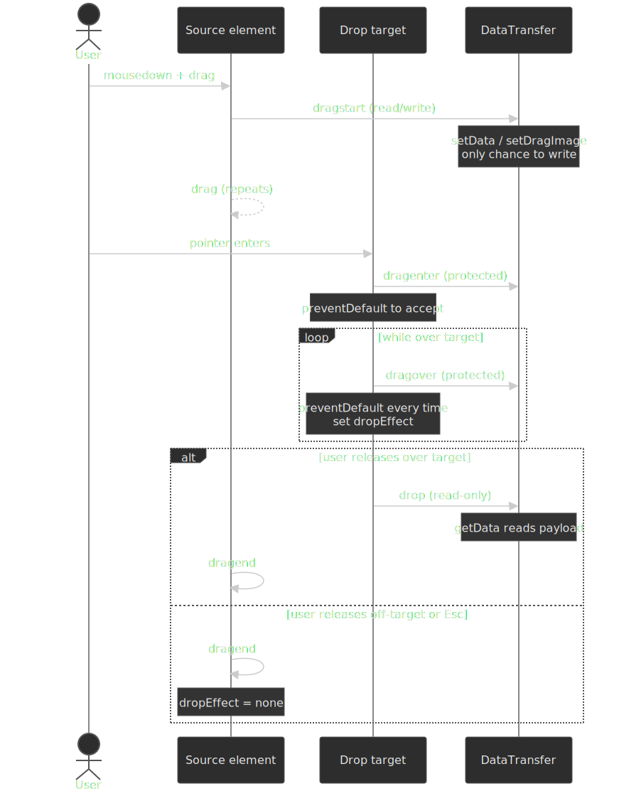
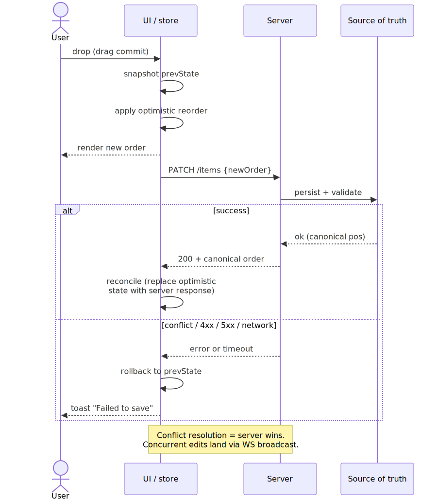
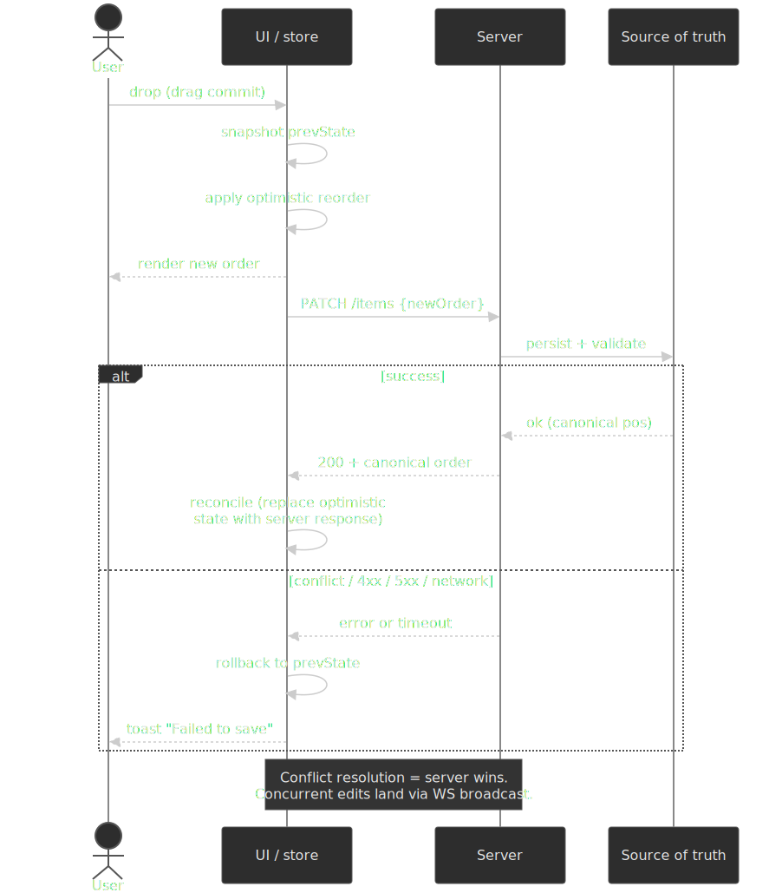

# Design a Drag and Drop System

Building drag and drop interactions that work across input devices, handle complex reordering scenarios, and maintain accessibility—the browser APIs, architectural patterns, and trade-offs that power production implementations in Trello, Notion, and Figma.

Drag and drop appears simple: grab an element, move it, release it. In practice, it requires handling three incompatible input APIs (mouse, touch, pointer), working around significant browser inconsistencies in the HTML5 Drag and Drop API, providing keyboard alternatives for accessibility, and managing visual feedback during the operation. This article covers the underlying browser APIs, the design decisions that differentiate library approaches, and how production applications solve these problems at scale.

 feed a sensor layer that manages drag state, drop-target hit-testing, and visual feedback.")


## Abstract

Drag and drop systems must unify three input models while providing an accessible non-drag alternative. The core mental model:

- **Native HTML5 DnD has critical limitations**: The [WHATWG Drag and Drop API](https://html.spec.whatwg.org/multipage/dnd.html) works for mouse and pen input but does not fire drag events for touch on Chrome, Firefox, or Safari[^touch-dnd]. The `DataTransfer` object is governed by a strict three-mode lifecycle (read/write during `dragstart`, protected during intermediate events, read-only during `drop`)[^datastore], and historic browser drift around drag-image handling and event ordering makes raw API usage impractical for production.

- **Pointer Events unify input devices**: The [W3C Pointer Events Level 2 Recommendation](https://www.w3.org/TR/pointerevents/) (with [Level 3 Candidate Recommendation](https://www.w3.org/TR/pointerevents3/) in flight) gives a single hardware-agnostic event stream for mouse, touch, and pen. Pointer-Events-based libraries (dnd-kit, React Aria) sidestep HTML5 DnD entirely; the trade-off is losing OS-level features like cross-window drag.

- **The two camps split on the API question, not the framework**: HTML5 DnD wrappers (react-dnd, Sortable.js, Pragmatic Drag and Drop) inherit native cross-window drag and file drops but inherit native quirks too. Pointer Events implementations (dnd-kit, React Aria) get touch and keyboard for free but cannot accept files dragged from the OS without a separate native code path.

- **Accessibility means a single-pointer alternative, not just keyboard**: [WCAG 2.5.7 Dragging Movements](https://www.w3.org/WAI/WCAG22/Understanding/dragging-movements.html) (Level AA, added in WCAG 2.2) specifically requires a non-drag mechanism operable by a single pointer. Keyboard support is required by [WCAG 2.1.1](https://www.w3.org/WAI/WCAG22/Understanding/keyboard.html) but does not satisfy 2.5.7 on its own — you must also expose a click/tap path (move buttons, context menu, etc.).

| Approach                      | Browser API foundation         | Touch          | OS-level features (cross-window, files) | Built-in keyboard a11y | Notes                                     |
| ----------------------------- | ------------------------------ | -------------- | --------------------------------------- | ---------------------- | ----------------------------------------- |
| Native HTML5 DnD wrapper      | HTML5 DnD                      | Needs polyfill | Yes                                     | Manual                 | react-dnd, Sortable.js, Pragmatic         |
| Pointer Events implementation | Pointer Events                 | Built-in       | No                                      | Usually built-in       | dnd-kit, React Aria, custom               |
| Hybrid                        | HTML5 DnD + Pointer/Touch glue | Yes            | Yes                                     | Manual                 | Older Sortable.js + custom touch backends |

## The Challenge

### Browser API Fragmentation

The web has three overlapping APIs for pointer input, each with different capabilities and browser support.

**HTML5 Drag and Drop API** (WHATWG spec): Designed for mouse-based desktop interaction. Events: `dragstart`, `drag`, `dragenter`, `dragover`, `dragleave`, `drop`, `dragend`. The `DataTransfer` object carries data between drag source and drop target.

**Touch Events API** (W3C spec, now considered legacy): Designed for touchscreens. Events: `touchstart`, `touchmove`, `touchend`, `touchcancel`. Provides multi-touch support via `TouchList` collections.

**Pointer Events API** (W3C spec): Unified model for all pointing devices. Events mirror mouse events with `pointer` prefix. The `pointerType` property indicates device: `"mouse"`, `"touch"`, or `"pen"`.

**The fundamental problem**: HTML5 Drag and Drop events do not fire for touch input on Chrome, Firefox, or Safari[^touch-dnd]. Native drag is mouse- and pen-only; touch users get nothing without an explicit second code path or a polyfill such as [drag-drop-touch-js/dragdroptouch](https://github.com/drag-drop-touch-js/dragdroptouch).

### HTML5 DnD API Quirks

The native API has behavior differences that break naive cross-browser implementations.

**DataTransfer is governed by a three-mode lifecycle.** The [WHATWG drag data store mode](https://html.spec.whatwg.org/multipage/dnd.html#concept-dnd-rw) is, in order:

| Mode             | Active during                           | What you can do                                                                              |
| ---------------- | --------------------------------------- | -------------------------------------------------------------------------------------------- |
| **read/write**   | `dragstart`                             | Add data with `setData()`, set drag image, configure `effectAllowed`                         |
| **protected**    | `drag`, `dragenter`, `dragover`, `dragleave`, `dragend` | Read `dataTransfer.types` (format names) but **not** payloads; calls to `setData`/`getData` are silently ignored |
| **read-only**    | `drop`                                  | Call `getData()` to read payloads; `setData()` is ignored                                    |

Practically, this means: set everything you need in `dragstart`, gate drop targets in `dragover` by inspecting `dataTransfer.types`, and read payloads in `drop`. The protected mode exists to stop a malicious page from spying on data the user is dragging in from another origin or another application[^datastore].




**The spec pins `drop` before `dragend`, but engines historically drifted.** Step 2 of the [WHATWG drag-and-drop processing model](https://html.spec.whatwg.org/multipage/dnd.html#drag-and-drop-processing-model) fires `drop` at the target; step 3 fires `dragend` at the source. Older Chrome/Safari builds fired `dragend` before `drop`[^drop-order], and the order can still surface bugs across long-tail user-agents. Treat them as a commit/cleanup *pair*, not a sequence — write idempotent handlers, and never gate `drop`'s persistence on state mutated in `dragend` (or vice versa).

**Drag image requirements differ by engine**:

- Firefox accepts any DOM element for `setDragImage()`.
- Chromium requires the element to be in the DOM and have layout when `setDragImage` is called[^chrome-dragimage].
- Safari has historically required the source to be visible enough to snapshot.

```typescript collapse={1-3, 20-25}
// Setting up native drag with workarounds
interface DragSourceOptions {
  element: HTMLElement
  data: Record<string, string>
  dragImage?: HTMLElement
}

function setupNativeDrag({ element, data, dragImage }: DragSourceOptions): void {
  element.draggable = true

  element.addEventListener("dragstart", (e) => {
    // Must set data in dragstart - only chance
    Object.entries(data).forEach(([type, value]) => {
      e.dataTransfer?.setData(type, value)
    })

    // Chrome requires element in DOM for custom drag image
    if (dragImage) {
      document.body.appendChild(dragImage)
      dragImage.style.position = "absolute"
      dragImage.style.left = "-9999px"
      e.dataTransfer?.setDragImage(dragImage, 0, 0)
      // Clean up after browser captures image
      requestAnimationFrame(() => dragImage.remove())
    }
  })
}
```

**Drop target acceptance**: Drop targets must call `preventDefault()` in both `dragenter` and `dragover` to signal they accept drops. Missing either causes the browser to reject the drop.

### Touch Challenges

Touch interaction differs fundamentally from mouse:

**No hover state**: Touch has no equivalent to `mouseover`. Drag preview must follow the finger, not appear on hover.

**Scroll conflicts**: Touch movement is overloaded—it scrolls by default. Drag operations must prevent scrolling while allowing intentional scrolls.

**Gesture disambiguation**: Is this touch a tap, a scroll, or a drag? Activation delays or distance thresholds help distinguish intent.

**Multi-touch complexity**: What happens when a second finger touches during a drag? Most implementations ignore additional touches; some support multi-select.

### Accessibility Requirements

[WCAG 2.5.7 Dragging Movements](https://www.w3.org/WAI/WCAG22/Understanding/dragging-movements.html) (Level AA, added in WCAG 2.2) is the normative bar:

> "All functionality that uses a dragging movement for operation can be achieved by a single pointer without dragging, unless dragging is essential, or the functionality is determined by the user agent and not modified by the author."

**Why dragging is problematic**:

- Users with motor impairments may not be able to hold and move simultaneously.
- Head pointers, eye-gaze systems, and trackballs make sustained drags difficult or impossible.
- Screen reader users cannot perceive spatial relationships through visual feedback.

> [!IMPORTANT]
> Read 2.5.7 narrowly: it specifically requires a **single-pointer (click/tap)** alternative. Keyboard support is required by [WCAG 2.1.1 Keyboard](https://www.w3.org/WAI/WCAG22/Understanding/keyboard.html), but a keyboard-only alternative does **not** satisfy 2.5.7 on its own[^wcag-257-test]. You need both.

**Acceptable single-pointer (2.5.7) alternatives**:

- Click-based "move": click item, then click destination slot.
- Move menu invoked by right-click or long-press, with a list of valid destinations.
- Up/down arrow buttons next to each item for list reordering.
- Numeric position field where users type the new position.

**Keyboard (2.1.1) alternative** — required in addition to the above:

- Tab to focus the item, Enter or Space to grab, Arrow keys to move, Enter or Space to drop, Escape to cancel.

### Scale Factors

The right drag-drop approach depends on use case complexity:

| Factor      | Simple          | Complex                  |
| ----------- | --------------- | ------------------------ |
| Items       | < 20 sortable   | 1000+ virtualized        |
| Containers  | Single list     | Multiple connected lists |
| Drop zones  | Item positions  | Nested hierarchies       |
| Constraints | Any position    | Rules-based acceptance   |
| Feedback    | Basic indicator | Rich preview, animations |

## Browser APIs Deep Dive

### HTML5 Drag and Drop

The native API provides drag operations with OS-level integration—dragging files from desktop, cross-tab dragging, and native drag previews.

**Event sequence for a successful drop** (per the [WHATWG drag-and-drop processing model](https://html.spec.whatwg.org/multipage/dnd.html#drag-and-drop-processing-model)):

```
dragstart (source) → drag (source, repeating) →
dragenter (target) → dragover (target, repeating) →
drop (target) → dragend (source)
```

The spec pins `drop` (step 2) before `dragend` (step 3) inside the processing model, but historic browser drift around the pair is real (see [HTML5 DnD API Quirks](#html5-dnd-api-quirks)). Treat them as a commit/cleanup *pair* and write idempotent handlers.




**DataTransfer security model**: The protected mode described above exists so that a malicious page cannot read data the user is dragging from another origin or another application during `dragover`. Scripts can still enumerate the available formats (`dataTransfer.types`), which is exactly what drop targets need to decide whether to accept the drop.

```typescript collapse={1-5, 35-45}
// Complete native drag implementation
function createDragSource(element: HTMLElement, itemId: string): void {
  element.draggable = true

  element.addEventListener("dragstart", (e) => {
    e.dataTransfer!.effectAllowed = "move"
    e.dataTransfer!.setData("application/x-item-id", itemId)
    e.dataTransfer!.setData("text/plain", itemId) // Fallback for external drops

    element.classList.add("dragging")
  })

  element.addEventListener("dragend", () => {
    element.classList.remove("dragging")
  })
}

function createDropTarget(element: HTMLElement, onDrop: (itemId: string, position: "before" | "after") => void): void {
  element.addEventListener("dragenter", (e) => {
    e.preventDefault() // Required to allow drop
    element.classList.add("drop-target")
  })

  element.addEventListener("dragover", (e) => {
    e.preventDefault() // Required for every dragover
    e.dataTransfer!.dropEffect = "move"
  })

  element.addEventListener("dragleave", () => {
    element.classList.remove("drop-target")
  })

  element.addEventListener("drop", (e) => {
    e.preventDefault()
    const itemId = e.dataTransfer!.getData("application/x-item-id")
    const rect = element.getBoundingClientRect()
    const position = e.clientY < rect.top + rect.height / 2 ? "before" : "after"
    onDrop(itemId, position)
    element.classList.remove("drop-target")
  })
}
```

**Effect feedback**: `effectAllowed` (source) and `dropEffect` (target) communicate what operations are valid:

| effectAllowed | dropEffect | Result           |
| ------------- | ---------- | ---------------- |
| `move`        | `move`     | Move icon cursor |
| `copy`        | `copy`     | Plus icon cursor |
| `link`        | `link`     | Link icon cursor |
| `all`         | any        | Target chooses   |
| `none`        | -          | No drop allowed  |

### Pointer Events

[Pointer Events Level 2](https://www.w3.org/TR/pointerevents/) is a W3C Recommendation; [Level 3](https://www.w3.org/TR/pointerevents3/) is currently a Candidate Recommendation. The spec defines a pointer as "a hardware-agnostic representation of input devices that can target a specific coordinate (or set of coordinates) on a screen". One unified API covers mouse, touch, and pen, with multi-pointer tracking via `pointerId`.

**Key properties beyond mouse events**:

| Property          | Type    | Description                              |
| ----------------- | ------- | ---------------------------------------- |
| `pointerId`       | number  | Unique ID for multi-pointer tracking     |
| `pointerType`     | string  | `"mouse"`, `"pen"`, `"touch"`, or empty  |
| `isPrimary`       | boolean | Is this the primary pointer of its type? |
| `pressure`        | number  | 0-1, normalized pressure                 |
| `width`, `height` | number  | Contact geometry in CSS pixels           |
| `tiltX`, `tiltY`  | number  | Pen angle, -90 to 90 degrees             |

**Pointer capture**: Redirect all pointer events to a specific element, even when pointer moves outside. Critical for drag operations.

```typescript collapse={1-5, 40-50}
// Pointer Events drag implementation
interface PointerDragState {
  pointerId: number
  startX: number
  startY: number
  currentX: number
  currentY: number
  element: HTMLElement
}

let dragState: PointerDragState | null = null

function setupPointerDrag(element: HTMLElement): void {
  element.addEventListener("pointerdown", (e) => {
    // Only handle primary pointer
    if (!e.isPrimary) return

    // Capture pointer to receive events even outside element
    element.setPointerCapture(e.pointerId)

    dragState = {
      pointerId: e.pointerId,
      startX: e.clientX,
      startY: e.clientY,
      currentX: e.clientX,
      currentY: e.clientY,
      element,
    }

    element.classList.add("dragging")
  })

  element.addEventListener("pointermove", (e) => {
    if (!dragState || e.pointerId !== dragState.pointerId) return

    dragState.currentX = e.clientX
    dragState.currentY = e.clientY

    // Update visual position
    const deltaX = dragState.currentX - dragState.startX
    const deltaY = dragState.currentY - dragState.startY
    element.style.transform = `translate(${deltaX}px, ${deltaY}px)`
  })

  element.addEventListener("pointerup", (e) => {
    if (!dragState || e.pointerId !== dragState.pointerId) return

    element.releasePointerCapture(e.pointerId)
    element.classList.remove("dragging")
    element.style.transform = ""

    // Determine drop target at final position
    const dropTarget = document.elementFromPoint(e.clientX, e.clientY)
    // Handle drop logic...

    dragState = null
  })

  // Cancel on pointer lost (e.g., touch cancelled by palm rejection)
  element.addEventListener("pointercancel", (e) => {
    if (!dragState || e.pointerId !== dragState.pointerId) return

    element.releasePointerCapture(e.pointerId)
    element.classList.remove("dragging")
    element.style.transform = ""
    dragState = null
  })
}
```

**Touch-action CSS**: Control which touch gestures the browser handles vs. your code.

```css
.draggable {
  /* Disable browser touch handling - we'll manage it */
  touch-action: none;
}

.scrollable-container {
  /* Allow vertical scroll, we handle horizontal drag */
  touch-action: pan-y;
}
```

### Touch Events (Legacy)

[Touch Events Level 2](https://www.w3.org/community/reports/touchevents/CG-FINAL-touch-events-20240704/) was published as a W3C Community Group Final Report in 2024 and is explicitly designated a legacy API by the W3C Touch Events Community Group, which "strongly encourages adoption of Pointer Events". They remain relevant only for multi-touch scenarios that genuinely need direct touch list semantics, or for code that still has to support older non-Pointer-Events browsers.

**TouchList collections**:

- `touches`: All current touch points on screen
- `targetTouches`: Touch points on the event target element
- `changedTouches`: Touch points that changed in this event

```typescript collapse={1-3, 30-40}
// Touch-based drag with scroll prevention
function setupTouchDrag(element: HTMLElement): void {
  let startTouch: Touch | null = null

  element.addEventListener(
    "touchstart",
    (e) => {
      // Use first touch only
      if (e.touches.length !== 1) return
      startTouch = e.touches[0]

      element.classList.add("dragging")
    },
    { passive: false },
  )

  element.addEventListener(
    "touchmove",
    (e) => {
      if (!startTouch) return

      // Prevent scrolling during drag
      e.preventDefault()

      const touch = e.touches[0]
      const deltaX = touch.clientX - startTouch.clientX
      const deltaY = touch.clientY - startTouch.clientY

      element.style.transform = `translate(${deltaX}px, ${deltaY}px)`
    },
    { passive: false },
  ) // Must be non-passive to preventDefault

  element.addEventListener("touchend", (e) => {
    if (!startTouch) return

    const touch = e.changedTouches[0]
    element.classList.remove("dragging")
    element.style.transform = ""

    // Find drop target
    const dropTarget = document.elementFromPoint(touch.clientX, touch.clientY)
    // Handle drop...

    startTouch = null
  })

  element.addEventListener("touchcancel", () => {
    element.classList.remove("dragging")
    element.style.transform = ""
    startTouch = null
  })
}
```

**Passive event listener caveat**: Touch event listeners are passive by default in modern browsers for scroll performance. To `preventDefault()` (required to prevent scrolling during drag), explicitly set `{ passive: false }`.

## Design Paths

### Path 1: Native HTML5 DnD with Touch Backend

**Architecture**: Use HTML5 Drag and Drop API for desktop, add separate touch event handling for mobile.

```
Desktop: element → dragstart/dragover/drop → DataTransfer → drop handler
Mobile:  element → touchstart/touchmove/touchend → custom state → drop handler
```

**How it works**:

1. Set `draggable="true"` on elements
2. Handle native drag events for mouse interaction
3. Detect touch devices and add touch event listeners
4. Maintain unified drop target registry for both paths

**Best for**:

- Cross-tab or cross-window dragging (only native DnD supports this)
- File drops from desktop
- Simple list reordering with existing touch library

**Implementation complexity**:

| Aspect                 | Effort                    |
| ---------------------- | ------------------------- |
| Initial setup          | Medium                    |
| Touch support          | High (separate code path) |
| Keyboard accessibility | High (manual)             |
| Cross-browser testing  | High                      |

**Device/network profile**:

- Works well on: Desktop browsers, modern mobile with touch backend
- Struggles on: Complex nested drag targets, virtualized lists

**Trade-offs**:

- Pro: Native OS integration (cross-window drag, file drops)
- Pro: Browser-managed drag preview
- Con: Two code paths to maintain
- Con: DataTransfer quirks across browsers
- Con: No touch support without additional library

**Real-world example**: [**Sortable.js**](https://github.com/SortableJS/Sortable) uses this approach — native DnD on desktop with a touch adapter. ~14.7 kB gzipped (v1.15.6, per [Bundlephobia](https://bundlephobia.com/package/sortablejs)), no framework dependency.

### Path 2: Custom Pointer Events Implementation

**Architecture**: Bypass native DnD entirely. Build drag system on Pointer Events for consistent cross-device behavior.

```
pointerdown → capture → pointermove (throttled) → hit test drop targets → pointerup → commit
```

**How it works**:

1. Listen for `pointerdown` on draggable elements
2. Capture pointer to receive events outside element bounds
3. Track position via `pointermove`, update preview position
4. Hit-test drop targets using `document.elementFromPoint()`
5. Commit changes on `pointerup`

**Best for**:

- Consistent behavior across all input types
- Complex drag interactions (nested lists, kanban boards)
- Applications requiring fine-grained control

**Implementation complexity**:

| Aspect                 | Effort                                |
| ---------------------- | ------------------------------------- |
| Initial setup          | High                                  |
| Touch support          | Built-in (same code path)             |
| Keyboard accessibility | Medium (framework typically provides) |
| Cross-browser testing  | Low (consistent API)                  |

**Trade-offs**:

- Pro: Single code path for all devices
- Pro: Full control over drag preview and feedback
- Pro: No DataTransfer timing issues
- Con: No cross-window drag support
- Con: Must implement file drop separately
- Con: More code to write/maintain

**Real-world example**: [**dnd-kit**](https://dndkit.com/) uses this architecture. Its [sensor system](https://dndkit.com/extend/sensors/pointer-sensor) abstracts input types — `PointerSensor`, `MouseSensor`, `TouchSensor`, `KeyboardSensor` — and the `PointerSensor` explicitly avoids the HTML5 Drag and Drop API in favor of native `PointerEvent`s. Built-in accessibility with keyboard navigation and screen reader announcements. `@dnd-kit/core` is ~14.2 kB gzipped per [Bundlephobia](https://bundlephobia.com/package/@dnd-kit/core); a sortable setup with `@dnd-kit/sortable` and `@dnd-kit/modifiers` runs closer to ~25 kB.

### Path 3: Hybrid with Library Abstraction

**Architecture**: Use library that abstracts backend differences. Declarative API, implementation details hidden.

```
<Draggable> → Library internals → Backend (HTML5/Touch/Keyboard) → <Droppable>
```

**How it works**:

1. Wrap draggable elements with library component/hook
2. Register drop targets with acceptance criteria
3. Library handles input detection and routes to appropriate backend
4. Render functions receive drag state for visual feedback

**Best for**:

- Teams wanting production-ready solution quickly
- Applications needing all features (keyboard, touch, mouse)
- Complex interactions without low-level concerns

**Implementation complexity**:

| Aspect                 | Effort                   |
| ---------------------- | ------------------------ |
| Initial setup          | Low                      |
| Touch support          | Built-in                 |
| Keyboard accessibility | Built-in or configurable |
| Cross-browser testing  | Low (library handles)    |

**Trade-offs**:

- Pro: Fastest time to production
- Pro: Maintained by community/company
- Pro: Accessibility often built-in
- Con: Bundle size overhead
- Con: Less control over edge cases
- Con: Learning library-specific patterns

**Library comparison** (sizes are gzipped, sourced from [Bundlephobia](https://bundlephobia.com) and library docs as of 2026-Q1; treat them as orders of magnitude — your effective size depends on which sub-packages you import):

| Library                                                                                    | Browser API               | Approach                              | Bundled size                                  | Accessibility                                                                                          | Framework |
| ------------------------------------------------------------------------------------------ | ------------------------- | ------------------------------------- | --------------------------------------------- | ------------------------------------------------------------------------------------------------------ | --------- |
| [react-dnd](https://react-dnd.github.io/react-dnd/)                                        | HTML5 DnD (default)       | Backend abstraction (HTML5 / Touch)   | ~25 kB with `react-dnd-html5-backend`         | Manual                                                                                                 | React     |
| [dnd-kit](https://dndkit.com/)                                                             | Pointer Events            | Sensor abstraction                    | ~14 kB core, ~25 kB with sortable & modifiers | [Built-in keyboard sensor + announcements](https://docs.dndkit.com/api-documentation/sensors/keyboard) | React     |
| [Sortable.js](https://github.com/SortableJS/Sortable)                                      | HTML5 DnD + touch adapter | DOM mutation                          | ~14.7 kB                                      | Manual                                                                                                 | Vanilla   |
| [@atlaskit/pragmatic-drag-and-drop](https://atlassian.design/components/pragmatic-drag-and-drop) | HTML5 DnD                 | Thin native wrappers + adapters       | ~4.7 kB core, optional packages on top        | Optional [accessibility add-on](https://atlassian.design/components/pragmatic-drag-and-drop/optional-packages/accessibility/about) | Any       |
| [react-aria/dnd](https://react-aria.adobe.com/dnd)                                         | HTML5 DnD + bespoke a11y  | Hooks over native DnD with parity for keyboard/screen reader | Comparable to dnd-kit in real apps            | Built-in (designed accessibility-first)                                                                | React     |

> [!NOTE]
> Two common misreadings: (1) Pragmatic Drag and Drop is *built on the native HTML5 Drag and Drop API* — that is the whole point of "pragmatic", which is why it gets cross-window drag and file drops for free. It is not a Pointer-Events implementation. (2) React Aria's drag and drop also uses native HTML DnD under the hood for pointer/touch and only owns the keyboard/screen reader path itself — see Adobe's ["Taming the dragon" write-up](https://react-aria.adobe.com/blog/drag-and-drop).

> [!WARNING]
> [`react-beautiful-dnd` was archived on 2025-08-18](https://github.com/atlassian/react-beautiful-dnd/issues/2672) and now logs a deprecation warning at install. Atlassian routes new work to Pragmatic Drag and Drop; the community-maintained fork [`@hello-pangea/dnd`](https://github.com/hello-pangea/dnd) is the drop-in option for code that genuinely cannot migrate. Do not start a new project on `react-beautiful-dnd`.

### Decision Framework




## Implementing Core Patterns

### List Reordering

The most common drag-drop pattern: reorder items within a single list.

**State management**: Track source index, current hover index, and compute final order on drop.

```typescript collapse={1-8, 45-55}
interface SortableListState<T> {
  items: T[]
  dragIndex: number | null
  hoverIndex: number | null
}

function useSortableList<T extends { id: string }>(
  initialItems: T[],
): {
  items: T[]
  dragHandlers: (index: number) => DragHandlers
  dropHandlers: (index: number) => DropHandlers
} {
  const [state, setState] = useState<SortableListState<T>>({
    items: initialItems,
    dragIndex: null,
    hoverIndex: null,
  })

  const dragHandlers = (index: number) => ({
    onDragStart: () => {
      setState((s) => ({ ...s, dragIndex: index }))
    },
    onDragEnd: () => {
      setState((s) => {
        if (s.dragIndex === null || s.hoverIndex === null) {
          return { ...s, dragIndex: null, hoverIndex: null }
        }

        // Reorder items
        const newItems = [...s.items]
        const [removed] = newItems.splice(s.dragIndex, 1)
        newItems.splice(s.hoverIndex, 0, removed)

        return { items: newItems, dragIndex: null, hoverIndex: null }
      })
    },
  })

  const dropHandlers = (index: number) => ({
    onDragEnter: () => {
      setState((s) => ({ ...s, hoverIndex: index }))
    },
  })

  return { items: state.items, dragHandlers, dropHandlers }
}
```

**Visual indicator placement**: Show drop indicator between items, not on items.

```typescript
function getDropIndicatorPosition(e: PointerEvent, element: HTMLElement): "before" | "after" {
  const rect = element.getBoundingClientRect()
  const midpoint = rect.top + rect.height / 2
  return e.clientY < midpoint ? "before" : "after"
}
```

### Drop-Target Hit Testing

Once you leave HTML5 DnD (where the browser does its own hit-testing for you), the library has to decide which droppable the active drag is "over". There are three workable strategies, with very different cost/precision profiles.




| Strategy                              | Cost per move                                  | Precision                            | Notes                                                                                                                       |
| ------------------------------------- | ---------------------------------------------- | ------------------------------------ | --------------------------------------------------------------------------------------------------------------------------- |
| `document.elementFromPoint(x, y)`     | O(1) — one browser hit-test                    | Top-most element only                | Cheap and accurate, but you have to walk up to the nearest droppable and you cannot resolve overlapping or `pointer-events: none` previews. `elementsFromPoint` (note the plural) returns the full stack and is well-supported in modern engines. |
| Cached `getBoundingClientRect()` intersection | O(N) over N droppables, but rects are cached on `dragstart` | Full control — supports `rectIntersection`, `closestCenter`, `closestCorners`, area-overlap | What [dnd-kit's collision detection](https://docs.dndkit.com/api-documentation/context-provider/collision-detection-algorithms) ships by default. The cost knob is *cache invalidation*: scroll, resize, and layout shift during a drag invalidate cached rects. |
| `IntersectionObserver`                | Async, off-main-thread                         | Only viewport / ancestor intersection| Designed for visibility, not collision between two moving elements. Workarounds (probe elements per droppable) tend to be brittle — avoid for the active drag, but useful for *registering* what is currently in-viewport before you cache rects. |

> [!TIP]
> Cache `getBoundingClientRect()` for every registered droppable on `pointerdown`/`dragstart`, then re-cache on `scroll` or `resize` events you intercept yourself. The dominant cost in production drag systems is not collision math — it is forgetting to invalidate the cache when an item being dragged shifts the layout of items it has not yet passed.

### Cross-Container Dragging

Moving items between multiple lists (Kanban boards, multi-column layouts).

**Key challenge**: Tracking which container an item is over, handling container-level acceptance rules.

```typescript collapse={1-15, 50-60}
interface Container {
  id: string
  accepts: (item: DragItem) => boolean
}

interface DragItem {
  id: string
  type: string
  sourceContainerId: string
}

interface CrossContainerState {
  containers: Map<string, Container>
  activeItem: DragItem | null
  overContainerId: string | null
  overIndex: number | null
}

function handleCrossContainerDrop(
  state: CrossContainerState,
  sourceItems: Map<string, unknown[]>,
  setItems: (containerId: string, items: unknown[]) => void,
): void {
  const { activeItem, overContainerId, overIndex } = state
  if (!activeItem || !overContainerId || overIndex === null) return

  const targetContainer = state.containers.get(overContainerId)
  if (!targetContainer?.accepts(activeItem)) return

  // Remove from source
  const sourceList = [...(sourceItems.get(activeItem.sourceContainerId) ?? [])]
  const sourceIndex = sourceList.findIndex((item: any) => item.id === activeItem.id)
  const [removed] = sourceList.splice(sourceIndex, 1)
  setItems(activeItem.sourceContainerId, sourceList)

  // Add to target
  const targetList = [...(sourceItems.get(overContainerId) ?? [])]
  targetList.splice(overIndex, 0, removed)
  setItems(overContainerId, targetList)
}
```

**Acceptance rules**: Containers can restrict what items they accept.

```typescript
const containers: Container[] = [
  {
    id: "todo",
    accepts: (item) => item.type === "task",
  },
  {
    id: "done",
    accepts: (item) => item.type === "task" && item.status !== "blocked",
  },
  {
    id: "archive",
    accepts: () => true, // Accepts anything
  },
]
```

### Tree Reordering

Hierarchical structures with nesting (file trees, nested lists).

**Complexity factors**:

- Drop zones: before sibling, after sibling, as child
- Depth detection from pointer position
- Preventing invalid drops (item into its own descendants)

```typescript collapse={1-10, 55-65}
interface TreeNode {
  id: string
  children: TreeNode[]
  parentId: string | null
}

type TreeDropPosition =
  | { type: "before"; targetId: string }
  | { type: "after"; targetId: string }
  | { type: "child"; parentId: string }

function getTreeDropPosition(e: PointerEvent, element: HTMLElement, depthIndicatorWidth: number): TreeDropPosition {
  const rect = element.getBoundingClientRect()
  const relativeY = e.clientY - rect.top
  const relativeX = e.clientX - rect.left

  const nodeId = element.dataset.nodeId!
  const currentDepth = parseInt(element.dataset.depth ?? "0")

  // Top quarter: drop before
  if (relativeY < rect.height * 0.25) {
    return { type: "before", targetId: nodeId }
  }

  // Bottom quarter: drop after
  if (relativeY > rect.height * 0.75) {
    return { type: "after", targetId: nodeId }
  }

  // Middle: check horizontal position for nesting
  const hoverDepth = Math.floor(relativeX / depthIndicatorWidth)
  if (hoverDepth > currentDepth) {
    return { type: "child", parentId: nodeId }
  }

  return { type: "after", targetId: nodeId }
}

function isDescendant(tree: TreeNode[], nodeId: string, potentialAncestorId: string): boolean {
  const findNode = (nodes: TreeNode[], id: string): TreeNode | null => {
    for (const node of nodes) {
      if (node.id === id) return node
      const found = findNode(node.children, id)
      if (found) return found
    }
    return null
  }

  const ancestor = findNode(tree, potentialAncestorId)
  if (!ancestor) return false

  return findNode(ancestor.children, nodeId) !== null
}
```

### Virtualized List Dragging

Large lists with windowing present unique challenges: elements outside viewport don't exist in DOM.

**Problem**: Standard hit-testing fails when potential drop targets aren't rendered.

**Solutions**:

1. **Overscan**: Render extra items beyond viewport. Simple but memory overhead.
2. **Position-based hit testing**: Calculate target from scroll position, not DOM.
3. **Scroll-on-drag**: Auto-scroll when dragging near edges.

```typescript collapse={1-10, 45-55}
interface VirtualListDragConfig {
  itemHeight: number
  totalItems: number
  viewportHeight: number
  scrollTop: number
  scrollContainerRef: React.RefObject<HTMLElement>
}

function getVirtualDropIndex(clientY: number, config: VirtualListDragConfig): number {
  const { itemHeight, totalItems, scrollTop, scrollContainerRef } = config
  const container = scrollContainerRef.current
  if (!container) return 0

  const containerRect = container.getBoundingClientRect()
  const relativeY = clientY - containerRect.top + scrollTop
  const index = Math.floor(relativeY / itemHeight)

  return Math.max(0, Math.min(totalItems - 1, index))
}

function handleAutoScroll(clientY: number, config: VirtualListDragConfig): void {
  const container = config.scrollContainerRef.current
  if (!container) return

  const rect = container.getBoundingClientRect()
  const edgeThreshold = 50 // pixels
  const scrollSpeed = 10

  if (clientY < rect.top + edgeThreshold) {
    // Near top edge - scroll up
    container.scrollTop -= scrollSpeed
  } else if (clientY > rect.bottom - edgeThreshold) {
    // Near bottom edge - scroll down
    container.scrollTop += scrollSpeed
  }
}
```

## Drag Preview and Visual Feedback

### Native vs Custom Drag Images

**Native drag image** (HTML5 DnD): Browser captures element snapshot at `dragstart`. Limited customization.

```typescript
// Basic custom drag image
element.addEventListener("dragstart", (e) => {
  const preview = createCustomPreview()
  document.body.appendChild(preview)
  preview.style.position = "absolute"
  preview.style.left = "-9999px"

  // Offset positions the cursor relative to the image
  e.dataTransfer?.setDragImage(preview, 20, 20)

  requestAnimationFrame(() => preview.remove())
})
```

**Custom drag layer** (Pointer Events approach): Render preview element that follows pointer.

```typescript collapse={1-8, 35-45}
interface DragPreviewState {
  isDragging: boolean;
  item: unknown;
  x: number;
  y: number;
}

function DragPreview({ state }: { state: DragPreviewState }) {
  if (!state.isDragging) return null;

  return (
    <div
      style={{
        position: 'fixed',
        left: state.x,
        top: state.y,
        pointerEvents: 'none', // Don't block hit testing
        transform: 'translate(-50%, -50%) rotate(3deg)', // Slight rotation
        opacity: 0.9,
        zIndex: 9999
      }}
    >
      <ItemCard item={state.item} />
    </div>
  );
}
```

**Performance consideration**: Moving a DOM element every `pointermove` (60+ times/second) can cause jank. Use `transform` instead of `left/top`—it's GPU-accelerated and doesn't trigger layout.

### Drop Indicators

Visual feedback showing where the item will land.

**Line indicator**: Horizontal line between items.

```css
.drop-indicator {
  position: absolute;
  left: 0;
  right: 0;
  height: 2px;
  background: var(--color-accent);
  pointer-events: none;
}

.drop-indicator--before {
  top: -1px;
}

.drop-indicator--after {
  bottom: -1px;
}
```

**Placeholder gap**: Reserve space where item will drop.

```typescript
function renderItems(items: Item[], dragIndex: number | null, hoverIndex: number | null) {
  return items.map((item, index) => {
    const isDragging = index === dragIndex;
    const showGapBefore = hoverIndex === index && dragIndex !== null && dragIndex > index;
    const showGapAfter = hoverIndex === index && dragIndex !== null && dragIndex < index;

    return (
      <>
        {showGapBefore && <div className="drop-gap" />}
        <ItemCard
          key={item.id}
          item={item}
          style={{ opacity: isDragging ? 0.5 : 1 }}
        />
        {showGapAfter && <div className="drop-gap" />}
      </>
    );
  });
}
```

### Animation Patterns

**Layout shift animation**: Animate other items moving out of the way.

```css
.sortable-item {
  transition: transform 200ms ease;
}

.sortable-item--shifted-down {
  transform: translateY(var(--item-height));
}

.sortable-item--shifted-up {
  transform: translateY(calc(-1 * var(--item-height)));
}
```

**Drop animation**: Animate item settling into final position.

```typescript
async function animateDrop(
  element: HTMLElement,
  from: { x: number; y: number },
  to: { x: number; y: number },
): Promise<void> {
  const deltaX = to.x - from.x
  const deltaY = to.y - from.y

  // Start at drag position
  element.style.transform = `translate(${-deltaX}px, ${-deltaY}px)`
  element.style.transition = "none"

  // Force reflow
  element.offsetHeight

  // Animate to final position
  element.style.transition = "transform 200ms ease-out"
  element.style.transform = ""

  return new Promise((resolve) => {
    element.addEventListener("transitionend", () => resolve(), { once: true })
  })
}
```

## Accessibility Implementation

### Keyboard Navigation

WCAG-compliant drag-drop requires full keyboard support.

**Interaction pattern**:

1. Focus item with Tab
2. Press Enter/Space to "pick up" item
3. Arrow keys or Tab to move between positions
4. Enter/Space to "drop" or Escape to cancel

, Grabbed → Grabbed (arrow keys), Grabbed → Dropped (Enter) or → Idle (Escape).")


```typescript collapse={1-15, 60-75}
interface KeyboardDragState {
  isActive: boolean
  activeItemId: string | null
  targetIndex: number | null
}

function useKeyboardDrag(items: Item[], onReorder: (fromIndex: number, toIndex: number) => void) {
  const [state, setState] = useState<KeyboardDragState>({
    isActive: false,
    activeItemId: null,
    targetIndex: null,
  })

  const handleKeyDown = (e: KeyboardEvent, itemId: string, currentIndex: number) => {
    if (!state.isActive) {
      // Not dragging - Enter starts drag
      if (e.key === "Enter" || e.key === " ") {
        e.preventDefault()
        setState({
          isActive: true,
          activeItemId: itemId,
          targetIndex: currentIndex,
        })
        announceToScreenReader(`Grabbed ${items[currentIndex].name}. Use arrow keys to move.`)
      }
      return
    }

    // Currently dragging
    switch (e.key) {
      case "ArrowUp":
      case "ArrowLeft":
        e.preventDefault()
        if (state.targetIndex! > 0) {
          const newIndex = state.targetIndex! - 1
          setState((s) => ({ ...s, targetIndex: newIndex }))
          announceToScreenReader(`Position ${newIndex + 1} of ${items.length}`)
        }
        break

      case "ArrowDown":
      case "ArrowRight":
        e.preventDefault()
        if (state.targetIndex! < items.length - 1) {
          const newIndex = state.targetIndex! + 1
          setState((s) => ({ ...s, targetIndex: newIndex }))
          announceToScreenReader(`Position ${newIndex + 1} of ${items.length}`)
        }
        break

      case "Enter":
      case " ":
        e.preventDefault()
        const fromIndex = items.findIndex((i) => i.id === state.activeItemId)
        onReorder(fromIndex, state.targetIndex!)
        setState({ isActive: false, activeItemId: null, targetIndex: null })
        announceToScreenReader(`Dropped at position ${state.targetIndex! + 1}`)
        break

      case "Escape":
        e.preventDefault()
        setState({ isActive: false, activeItemId: null, targetIndex: null })
        announceToScreenReader("Drag cancelled")
        break
    }
  }

  return { state, handleKeyDown }
}
```

### Screen Reader Announcements

Use ARIA live regions to announce drag state changes.

```typescript
function announceToScreenReader(message: string): void {
  let announcer = document.getElementById("drag-announcer")

  if (!announcer) {
    announcer = document.createElement("div")
    announcer.id = "drag-announcer"
    announcer.setAttribute("aria-live", "assertive")
    announcer.setAttribute("aria-atomic", "true")
    announcer.style.cssText = `
      position: absolute;
      width: 1px;
      height: 1px;
      padding: 0;
      margin: -1px;
      overflow: hidden;
      clip: rect(0, 0, 0, 0);
      white-space: nowrap;
      border: 0;
    `
    document.body.appendChild(announcer)
  }

  // Clear and set to ensure announcement
  announcer.textContent = ""
  requestAnimationFrame(() => {
    announcer!.textContent = message
  })
}
```

**Announcement timing**:

| Event           | Announcement                                                                    |
| --------------- | ------------------------------------------------------------------------------- |
| Drag start      | "Grabbed [item name]. Use arrow keys to move, Enter to drop, Escape to cancel." |
| Position change | "Position [n] of [total]" or "[item name] moved before [other item]"            |
| Drop            | "Dropped [item name] at position [n]"                                           |
| Cancel          | "Drag cancelled. [item name] returned to position [n]"                          |
| Invalid drop    | "[target] does not accept [item type]"                                          |

### ARIA Attributes

```html
<!-- Draggable item -->
<div role="listitem" tabindex="0" aria-grabbed="false" aria-describedby="drag-instructions">Item content</div>

<!-- When being dragged -->
<div role="listitem" tabindex="0" aria-grabbed="true" aria-describedby="drag-instructions">Item content</div>

<!-- Drop target -->
<div role="list" aria-dropeffect="move">
  <!-- items -->
</div>

<!-- Instructions (hidden visually) -->
<div id="drag-instructions" class="sr-only">
  Press Enter to grab. Use arrow keys to move. Press Enter to drop or Escape to cancel.
</div>
```

> [!WARNING]
> [`aria-grabbed`](https://developer.mozilla.org/en-US/docs/Web/Accessibility/ARIA/Reference/Attributes/aria-grabbed) and [`aria-dropeffect`](https://developer.mozilla.org/en-US/docs/Web/Accessibility/ARIA/Reference/Attributes/aria-dropeffect) were [deprecated in WAI-ARIA 1.1](https://www.w3.org/WAI/ARIA/track/actions/1672) and are [under active discussion for removal in ARIA 1.3](https://github.com/w3c/aria/issues/1447). Assistive technology support has always been poor. Use them only for legacy compatibility — the load-bearing accessibility comes from focus management and ARIA live region announcements.

## Real-World Implementations

### Trello: Kanban Board

**Challenge**: Drag cards between multiple lists with smooth animations and real-time sync.

**Approach** (observable behavior; Trello has rotated through several internal libraries over the years):

- Drop zones on each card and at list bottom.
- Visual feedback: card tilts slightly during drag (the well-known "jaunty angle").
- Optimistic updates with server reconciliation; failures roll the card back.

**Technical details**:

- Each card has a [`pos` attribute exposed by the public Trello API](https://developer.atlassian.com/cloud/trello/rest/api-group-cards/#api-cards-id-put), stored as a 64-bit floating-point number ([HN discussion of the format](https://news.ycombinator.com/item?id=10957165)).
- Inserting between two cards averages the neighbors' `pos` values, so reorders are an `O(1)` API call instead of an `O(n)` re-index.
- When `pos` gaps shrink below the float-precision threshold, a background job rebalances the affected list ([Hacker News thread](https://news.ycombinator.com/item?id=10957165)).
- Updates broadcast to other clients via WebSocket so collaborators see moves in real time.

**Key insight**: Floating-point `pos` with rebalancing trades per-write cost for occasional bulk maintenance — a classic "fractional indexing" pattern that decouples drag UX from server load.

### Notion: Block Reordering

**Challenge**: Every piece of content is a draggable, nestable block. Blocks can be text, images, databases, or embedded content.

**Observable behavior**:

- Drag handle (six dots) appears on hover.
- Multi-block selection with Shift+click; Alt/Option+drag creates a duplicate.
- Horizontal drag position determines nesting depth in toggles and lists.
- Drag preview shows a block outline, not the full content; drop indicator style changes by nesting level.

**Architecture** (from [Notion's "data model behind Notion" post](https://www.notion.com/blog/data-model-behind-notion)):

- Every piece of content is a *block* with a UUID, a `parent` pointer, and an ordered list of `content` (child block IDs). Blocks form a render tree.
- User actions are encoded as discrete operations against that tree, batched into transactions, persisted in an append-only log on the server, and pushed to other clients over WebSockets.
- Concurrent edits are merged with a hybrid strategy: tree-structure operations lean on operation-based sync with the server as serialization point, while character-level text edits use CRDT-style merging for offline tolerance[^notion-collab].

**Key insight**: Notion's drag operates on block identity, not DOM nodes. Reparenting is just a server operation that updates `parent` and rewrites the source and destination `content` arrays, which is why drags survive page reloads and collaborator edits without bespoke client code.

### Figma: Canvas Objects

**Challenge**: Drag objects on infinite canvas with zoom, precision positioning, and multi-select.

**Architecture** (from Figma's engineering blog and the [Pragmatic Engineer interview with the Figma Slides team](https://newsletter.pragmaticengineer.com/p/building-figma-slides-with-noah-finer)):

- Core editor is a C++ engine compiled to WebAssembly that draws to an HTML `<canvas>` via WebGL — and now [WebGPU where supported](https://www.figma.com/blog/figma-rendering-powered-by-webgpu/).
- Surrounding UI (layer list, properties panel, modals) is React + TypeScript talking to the engine through a bindings layer.
- Custom hit-testing against the scene graph rather than `elementFromPoint`; the canvas knows nothing about DOM.

**Implementation details**:

- Drag threshold (a few pixels) prevents accidental moves on click.
- Snap-to-grid and smart guides are computed every frame against neighbors.
- Undo stack captures a drag as a single operation.

**Key insight**: For canvas-style apps, no off-the-shelf drag library covers the load-bearing path. The renderer owns coordinates, the engine owns hit-testing, and you reach for a library only on the chrome.

### VS Code: File Tree and Tabs

**Challenge**: Drag files between explorer, editors, and terminals; also accept files dragged in from the OS.

**Approach** (visible in [`src/vs/workbench/browser/dnd.ts`](https://github.com/microsoft/vscode/blob/main/src/vs/workbench/browser/dnd.ts)):

- Custom implementation built on a `LocalSelectionTransfer` singleton for same-window drags.
- Native HTML5 DnD for external file drops, which is the only way to receive OS file drops.
- Typed drag identifiers — `DraggedEditorIdentifier` for a single editor, `DraggedEditorGroupIdentifier` for a tab group.

**Technical details**:

- `LocalSelectionTransfer` is a singleton keyed by drag-payload type; it lets the source set typed payload data and the target read it back without going through `DataTransfer` (which is locked down outside `dragstart`/`drop`).
- `EditorDropTarget` components register as drop zones.
- The file tree supports dragging into and out of folders; tabs support reordering across editor groups.
- For extensions, the public surface area is the `TreeDragAndDropController` and `DocumentDropEditProvider` APIs, which wrap a smaller `vscode.DataTransfer` abstraction.

**Key insight**: VS Code uses two drag mechanisms in parallel — a process-local typed channel for in-app drags (avoids `DataTransfer` quirks) and native `DataTransfer` for OS interop (the only way to accept files). This is the same pattern most desktop-class web apps converge on.

## Browser Constraints

### Main Thread Budget

Drag operations run on main thread. Heavy operations cause jank.

**Budget**: 16ms per frame for 60fps. Drag handlers should complete in <8ms to leave room for rendering.

**Optimization strategies**:

1. **Throttle pointermove**: Don't process every event
2. **Debounce drop target calculations**: Especially for complex hit-testing
3. **RAF for visual updates**: Batch position updates to animation frame
4. **Avoid layout thrashing**: Read dimensions before starting drag, cache them

```typescript
// Throttled drag handler
let lastMoveTime = 0
const THROTTLE_MS = 16 // One frame

function handlePointerMove(e: PointerEvent): void {
  const now = performance.now()
  if (now - lastMoveTime < THROTTLE_MS) return
  lastMoveTime = now

  // Actual move handling
  updateDragPosition(e.clientX, e.clientY)
}
```

### Touch Delay and Gesture Conflicts

The classic 300ms tap delay is essentially gone on modern mobile browsers as long as you ship a proper viewport meta tag (`<meta name="viewport" content="width=device-width">`) or apply `touch-action: manipulation` to interactive elements. Chrome documented the change in ["300ms tap delay, gone away"](https://developer.chrome.com/blog/300ms-tap-delay-gone-away); legacy polyfills like FastClick are no longer needed and may even hurt. Touch gestures (pan, pinch, double-tap-to-zoom) still conflict with drag, so you still need `touch-action` and activation constraints.

**Activation constraints prevent accidental drags**:

```typescript
interface ActivationConstraint {
  delay?: number // ms to hold before drag starts
  distance?: number // px to move before drag starts
  tolerance?: number // px of movement allowed during delay
}

// dnd-kit sensor configuration
const pointerSensor = useSensor(PointerSensor, {
  activationConstraint: {
    delay: 250, // Hold 250ms before drag activates
    tolerance: 5, // Allow 5px movement during delay
  },
})
```

### Memory Considerations

Long drag operations with many drop targets can accumulate state.

**Cleanup patterns**:

- Clear highlight states on `pointercancel`
- Remove event listeners when drag ends
- Reset animations to avoid stale transforms
- Clear cached dimensions if window resizes during drag

```typescript
function cleanupDragState(): void {
  // Reset all visual states
  document.querySelectorAll(".drop-target-active").forEach((el) => {
    el.classList.remove("drop-target-active")
  })

  // Clear cached data
  dropTargetRects.clear()

  // Remove global listeners
  document.removeEventListener("pointermove", handleGlobalMove)
  document.removeEventListener("pointerup", handleGlobalUp)
}
```

## Common Pitfalls

### 1. Missing preventDefault in dragover

**The mistake**: Only calling `preventDefault()` in `drop` handler.

```typescript
// Broken - drop never fires
element.addEventListener("drop", (e) => {
  e.preventDefault()
  handleDrop(e)
})
```

**Why it fails**: Browser requires `preventDefault()` in `dragenter` AND `dragover` to mark element as valid drop target. Without it, `drop` event never fires.

**The fix**:

```typescript
element.addEventListener("dragenter", (e) => e.preventDefault())
element.addEventListener("dragover", (e) => e.preventDefault())
element.addEventListener("drop", (e) => {
  e.preventDefault()
  handleDrop(e)
})
```

### 2. Drag Image Not Visible

**The mistake**: Creating drag image dynamically without adding to DOM.

```typescript
// Broken in Chrome
element.addEventListener("dragstart", (e) => {
  const img = document.createElement("div")
  img.textContent = "Dragging"
  e.dataTransfer?.setDragImage(img, 0, 0) // Invisible
})
```

**Why it fails**: Chrome requires the drag image element to be in the DOM and have layout. Firefox doesn't.

**The fix**:

```typescript
element.addEventListener("dragstart", (e) => {
  const img = document.createElement("div")
  img.textContent = "Dragging"
  img.style.position = "absolute"
  img.style.left = "-9999px"
  document.body.appendChild(img)

  e.dataTransfer?.setDragImage(img, 0, 0)

  requestAnimationFrame(() => img.remove())
})
```

### 3. Touch Events Not Firing

**The mistake**: Assuming HTML5 DnD works on touch devices.

```typescript
// Only works with mouse
element.draggable = true
element.addEventListener("dragstart", handleDragStart)
// Touch users see nothing
```

**Why it fails**: HTML5 Drag and Drop API is mouse-only. Touch events don't trigger drag events.

**The fix**: Use Pointer Events or add explicit touch handling:

```typescript
element.addEventListener("pointerdown", handlePointerDown)
// OR
element.addEventListener("touchstart", handleTouchStart, { passive: false })
```

### 4. Passive Event Listener Blocking preventDefault

**The mistake**: Touch events added without `{ passive: false }`.

```typescript
// preventDefault has no effect
element.addEventListener("touchmove", (e) => {
  e.preventDefault() // Ignored! Scrolls anyway
  handleDrag(e)
})
```

**Why it fails**: Modern browsers make touch listeners passive by default for scroll performance. Passive listeners cannot `preventDefault()`.

**The fix**:

```typescript
element.addEventListener(
  "touchmove",
  (e) => {
    e.preventDefault()
    handleDrag(e)
  },
  { passive: false },
)
```

### 5. State Desync with Optimistic Updates

**The mistake**: Updating UI before server confirms, then not handling failures.

```typescript
// Optimistic update without rollback
function handleDrop(fromIndex: number, toIndex: number): void {
  setItems(reorder(items, fromIndex, toIndex))
  api.updateOrder(items.map((i) => i.id)) // Fire and forget
}
```

**Why it fails**: Server rejection leaves UI in wrong state. Network failure loses the change.

**The fix**:

```typescript
function handleDrop(fromIndex: number, toIndex: number): void {
  const previousItems = items
  const newItems = reorder(items, fromIndex, toIndex)

  setItems(newItems) // Optimistic

  api
    .updateOrder(newItems.map((i) => i.id))
    .then((serverOrder) => setItems(serverOrder)) // Reconcile against canonical state
    .catch(() => {
      setItems(previousItems) // Rollback
      showError("Failed to save order")
    })
}
```




> [!IMPORTANT]
> "Reconcile" is not "no-op on success". The server's response is the canonical order — for fractional-position schemes (Trello, Notion, Figma), the server may return a position different from the one you optimistically computed (rebalance, conflict, concurrent edit). Always replace the optimistic state with the server response on success, otherwise drift accumulates silently across drags.

## Conclusion

Drag and drop systems require unifying disparate browser APIs while maintaining accessibility. The fundamental tension: native HTML5 DnD provides OS-level integration (cross-window drag, file drops) but lacks touch support and carries real cross-browser quirks. Pointer-Events implementations provide consistent behavior across input devices but cannot accept files dragged from the OS without falling back to native DnD anyway.

**Architectural decisions**:

**API layer**: Native HTML5 DnD when you need file drops or cross-window/cross-tab drag. Pointer Events when you need consistent multi-device behavior and don't need OS integration. Many applications want both, isolated behind a small adapter.

**Library vs custom**: Libraries (dnd-kit, Pragmatic Drag and Drop, react-dnd, Sortable.js, React Aria) all encode hard-won workarounds for the underlying APIs and are the right default. Custom implementation only when you have unusual requirements — canvas-based rendering, multi-pointer gestures, or extreme bundle-size constraints.

**Accessibility**: Not optional. [WCAG 2.5.7](https://www.w3.org/WAI/WCAG22/Understanding/dragging-movements.html) requires a single-pointer alternative; [WCAG 2.1.1](https://www.w3.org/WAI/WCAG22/Understanding/keyboard.html) requires a keyboard path. Build both in from the start — retrofitting is harder, and at least one (the single-pointer one) is easy to forget.

**Visual feedback**: Users need constant feedback during drag — drag preview follows the cursor, drop indicators show destination, animations smooth transitions. Without feedback, drag operations feel broken even when they're working correctly.

The current production split is roughly: dnd-kit and React Aria for Pointer-Events-first React stacks; Pragmatic Drag and Drop for framework-agnostic native-DnD work; Sortable.js for tiny vanilla apps; react-dnd in legacy code that nobody is rewriting. Pick by *which API you need underneath*, not by feature checklist alone — that decision flows backwards into everything else, including how much accessibility code you'll have to write yourself.

## Appendix

### Prerequisites

- **DOM events**: Event propagation, delegation, preventDefault
- **CSS transforms**: translate, transform-origin, GPU acceleration
- **Browser input APIs**: Basic familiarity with mouse, touch, or pointer events
- **React hooks** (if using React-based libraries)

### Terminology

- **DataTransfer**: HTML5 DnD object carrying data between drag source and drop target
- **Drag handle**: UI element that initiates drag (often a grip icon)
- **Drop indicator**: Visual marker showing where dragged item will land
- **Hit testing**: Determining which element is under the pointer
- **Pointer capture**: API to receive all pointer events for a specific pointer ID
- **Sensor**: dnd-kit abstraction for input type (pointer, touch, keyboard)

### Summary

- **HTML5 DnD limitations**: Mouse and pen only, three-mode `DataTransfer` lifecycle, no touch support without separate implementation, OS-level features (cross-window, file drop) only available here.
- **Pointer Events advantage**: Single API for mouse, touch, and pen; pointer capture for reliable drag tracking when the cursor leaves the element.
- **Accessibility requirement**: [WCAG 2.5.7](https://www.w3.org/WAI/WCAG22/Understanding/dragging-movements.html) mandates a single-pointer (click/tap) alternative; [WCAG 2.1.1](https://www.w3.org/WAI/WCAG22/Understanding/keyboard.html) requires a keyboard path. Both are required.
- **Library API split**: HTML5 DnD wrappers (react-dnd, Sortable.js, Pragmatic Drag and Drop) vs Pointer-Events implementations (dnd-kit, React Aria-managed pointer/touch is HTML5 underneath).
- **Visual feedback**: Drag preview, drop indicators, and layout-shift animations are essential for usable drag-drop.
- **Real-world patterns**: Trello uses fractional `pos` indexing with rebalancing, Notion operates on block IDs with hybrid OT/CRDT sync, Figma renders the canvas in a custom WebAssembly engine and only uses libraries on the chrome.

### References

- [WHATWG HTML Standard — Drag and Drop](https://html.spec.whatwg.org/multipage/dnd.html) — normative HTML5 DnD spec, including the three-mode `DataTransfer` lifecycle.
- [W3C Pointer Events Level 2](https://www.w3.org/TR/pointerevents/) and [Pointer Events Level 3 (CR)](https://www.w3.org/TR/pointerevents3/) — unified pointer input specs.
- [W3C Touch Events Level 2 — Community Group Final Report](https://www.w3.org/community/reports/touchevents/CG-FINAL-touch-events-20240704/) — Touch Events, now legacy.
- [WCAG 2.5.7 Dragging Movements (WCAG 2.2, AA)](https://www.w3.org/WAI/WCAG22/Understanding/dragging-movements.html) and [WCAG 2.1.1 Keyboard (A)](https://www.w3.org/WAI/WCAG22/Understanding/keyboard.html).
- [MDN — HTML Drag and Drop API](https://developer.mozilla.org/en-US/docs/Web/API/HTML_Drag_and_Drop_API) and [MDN — Pointer Events](https://developer.mozilla.org/en-US/docs/Web/API/Pointer_events).
- [dnd-kit documentation](https://docs.dndkit.com/) and the [pointer sensor reference](https://dndkit.com/extend/sensors/pointer-sensor).
- [react-dnd documentation](https://react-dnd.github.io/react-dnd/docs/overview).
- [Pragmatic Drag and Drop — Atlassian Design System](https://atlassian.design/components/pragmatic-drag-and-drop) and [Atlassian's "Designed for delight, built for performance" write-up](https://www.atlassian.com/blog/design/designed-for-delight-built-for-performance).
- [React Aria — Drag and Drop](https://react-aria.adobe.com/dnd) and ["Taming the dragon" architecture post](https://react-aria.adobe.com/blog/drag-and-drop).
- [Notion — The data model behind Notion's flexibility](https://www.notion.com/blog/data-model-behind-notion).
- [Figma — Rendering powered by WebGPU](https://www.figma.com/blog/figma-rendering-powered-by-webgpu/) and [Pragmatic Engineer interview on the Figma renderer](https://newsletter.pragmaticengineer.com/p/building-figma-slides-with-noah-finer).

[^touch-dnd]: HTML5 Drag and Drop events are not fired in response to touch on Chrome, Firefox, or Safari. The spec is silent on touch behavior, but cross-browser testing has shown this consistently for years; see ["HTML5 Drag & Drop — Not the API You're Looking For" (sam.today)](https://www.sam.today/blog/html5-dnd-the-api-that-is-gaslighting-you) and the [`drag-drop-touch` polyfill README](https://github.com/drag-drop-touch-js/dragdroptouch) for representative test results.

[^datastore]: See ["Working with the drag data store" — MDN](https://developer.mozilla.org/en-US/docs/Web/API/HTML_Drag_and_Drop_API/Drag_data_store) for the user-facing summary and the [WHATWG drag data store mode definition](https://html.spec.whatwg.org/multipage/dnd.html#concept-dnd-rw) for the normative description of read/write, protected, and read-only modes.

[^drop-order]: The relative order of `drop` and `dragend` is not normatively pinned by [the WHATWG drag-and-drop processing model](https://html.spec.whatwg.org/multipage/dnd.html#drag-and-drop-processing-model). Historic browser drift was discussed in ["Cross Browser HTML5 Drag and Drop"](https://www.useragentman.com/blog/2010/01/10/cross-browser-html5-drag-and-drop/) (2010) and is still raised in current bug trackers; do not depend on a specific order.

[^chrome-dragimage]: The Chromium constraint that the drag-image element must be in the DOM and have layout is documented across implementer notes; see [MDN's `setDragImage()` reference](https://developer.mozilla.org/en-US/docs/Web/API/DataTransfer/setDragImage) for the cross-browser caveats.

[^wcag-257-test]: See [Vispero's "How to test 2.5.7 Dragging Movements"](https://vispero.com/resources/how-to-test-2-5-7-dragging-movements/) and the [W3C Understanding 2.5.7 document](https://www.w3.org/WAI/WCAG22/Understanding/dragging-movements.html), both of which explicitly state that providing a keyboard alternative does not by itself satisfy 2.5.7 — the criterion requires a single-pointer alternative.

[^notion-collab]: Notion has not published a definitive paper on its concurrency model, but the [data model post](https://www.notion.com/blog/data-model-behind-notion) describes the operation-based sync model and tree structure. Third-party syntheses such as [Educative's "Notion System Design Explained"](https://www.educative.io/blog/notion-system-design) describe the hybrid OT-for-tree, CRDT-for-text approach; treat the specifics as informed inference rather than first-party documentation.
