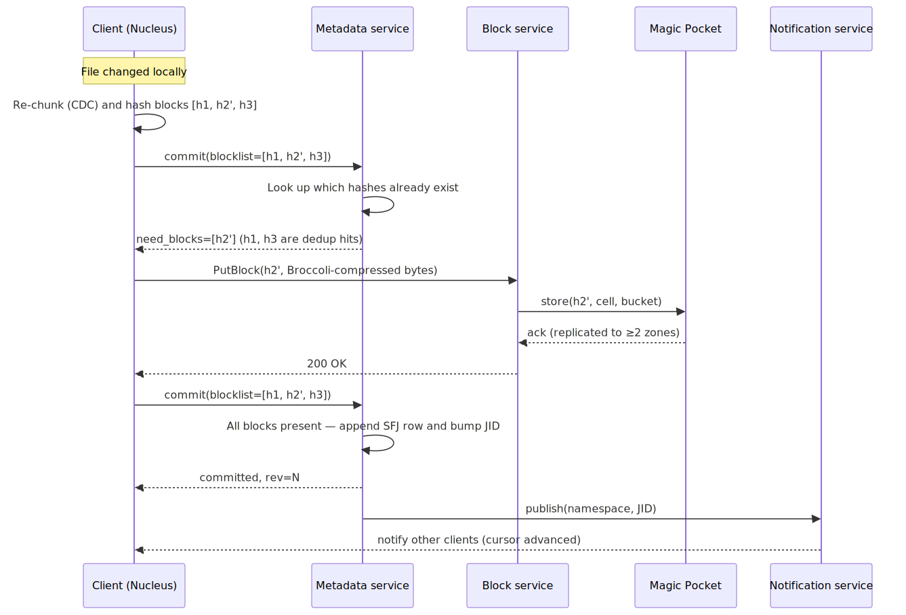
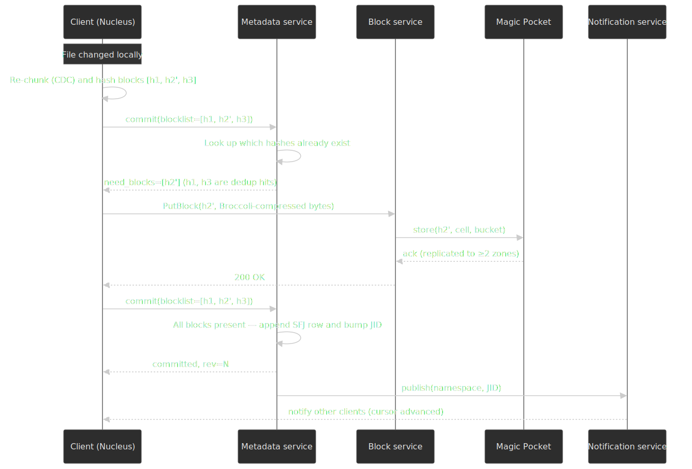
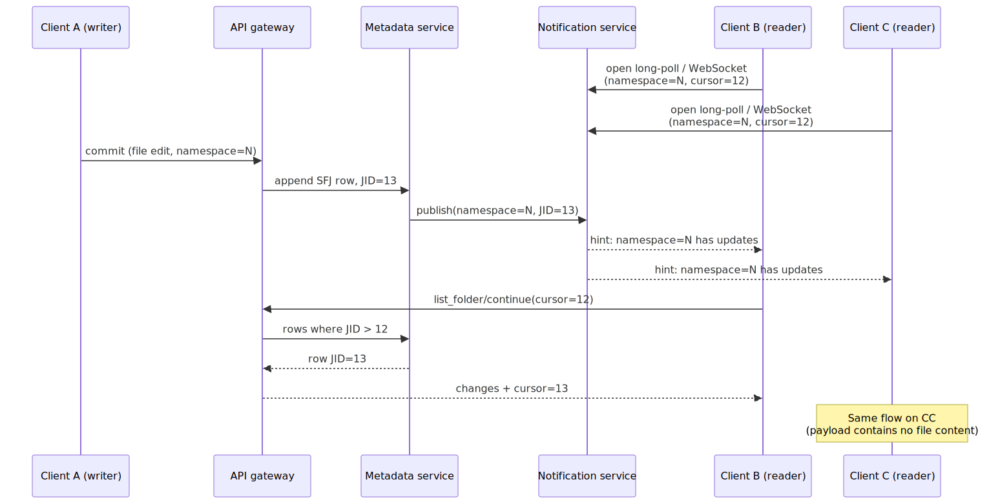
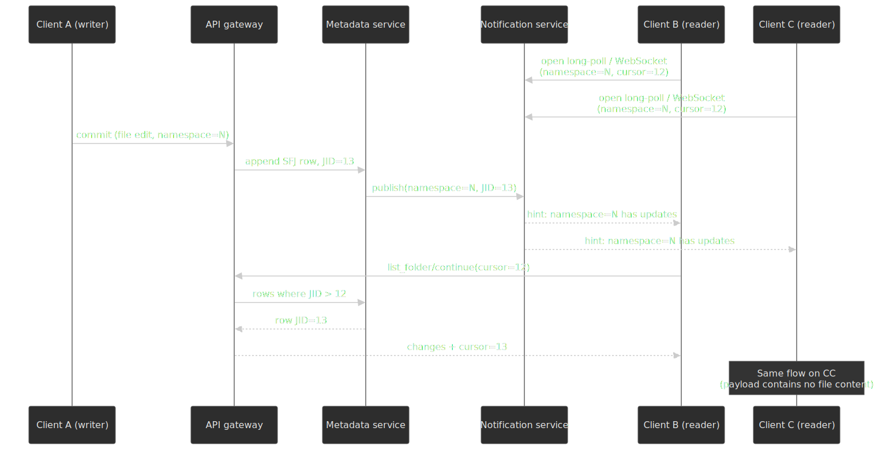
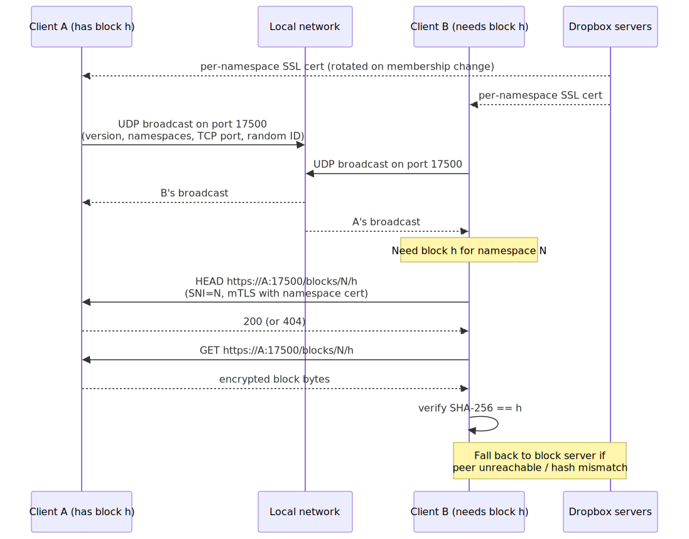
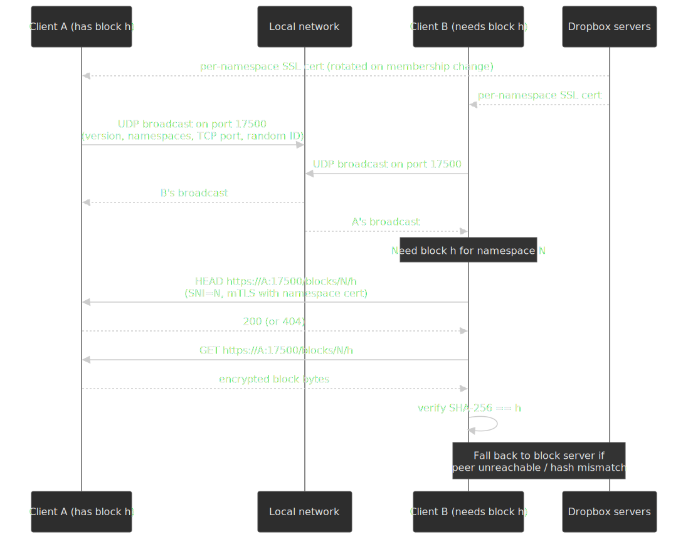

# Design Dropbox File Sync

Cross-device file sync looks deceptively simple — keep a folder identical on every device — but the design hides three hard distributed-systems problems: detecting *which* side changed without a coordinator, transferring the smallest possible delta over a flaky network, and storing exabytes of immutable content cheaply enough to make $10/month plans viable. This article reconstructs the design Dropbox actually shipped, with citations to their engineering write-ups, and uses it to ground the canonical "design Dropbox" interview answer in real engineering trade-offs.

The Dropbox numbers it has to support, as of fiscal year 2025: more than 700 million registered accounts, 18.08 million paying users, and roughly 5 exabytes of customer storage[^stats].

[^stats]: [Dropbox Q4 / FY2025 results](https://investors.dropbox.com/news-releases/news-release-details/dropbox-announces-fourth-quarter-and-fiscal-2025-results) and [Dropbox Q3 2025 investor slides (storage figure)](https://www.investing.com/news/company-news/dropbox-q3-2025-slides-margin-expansion-offsets-user-decline-as-ai-strategy-unfolds-93CH-4340993).




## Thesis

File sync is a **distributed-state reconciliation** problem with three load-bearing ideas:

1. **Content-defined chunking** (CDC) makes block boundaries depend on content, not byte offsets, so an insertion in the middle of a file shifts only one chunk instead of every subsequent one. This is what unlocks delta sync and cross-user dedup at scale.
2. **The three-tree planner** persists *observations* (Local, Remote, Synced) instead of *outstanding work*. The Synced tree acts as a merge base — exactly like a git merge base — so the engine can derive change direction without asking either side what it intended.
3. **Content-addressed blocks** (block ID = SHA-256 of bytes) make uploads idempotent, deduplication trivial, and the data plane oblivious to users, paths, and namespaces. The metadata plane owns identity; the data plane owns bytes.

The trade-off Dropbox accepted: **eventual consistency with conflict preservation**. When two clients edit the same file before they see each other, the engine never tries to merge bytes — it keeps the remote version at the original path and renames the local copy `… (conflicted copy YYYY-MM-DD).ext`. Predictable, no data loss, no domain-specific merge code.

## Requirements

### Functional

| Capability             | Priority | Notes                                                        |
| ---------------------- | -------- | ------------------------------------------------------------ |
| Upload / download      | Core     | Block-based, resumable                                        |
| Cross-device sync      | Core     | Bidirectional, eventually consistent                          |
| File versioning        | Core     | 30-day history (Basic / Plus / Family); 180-day (Professional / Business) |
| Conflict handling      | Core     | Conflicted-copy strategy, never silent data loss              |
| Selective / Smart Sync | Core     | Some folders local, others on-demand placeholders              |
| Shared folders         | High     | Namespaces with their own permission set                      |
| Link sharing           | High     | Read-only and edit links, expiry, password                    |
| LAN sync               | Medium   | Peer-to-peer block fetch on the same network                  |
| Offline access         | Medium   | Read and write while disconnected, reconcile on reconnect     |

### Non-functional

| Requirement              | Target                  | Why                                                         |
| ------------------------ | ----------------------- | ----------------------------------------------------------- |
| Annual data durability   | ≥ 99.9999999999% (12 nines)[^durability] | Loss of user data is the only unrecoverable failure         |
| Service availability     | ≥ 99.99%[^durability]    | Sync should resume on reconnect, never require user retry   |
| Sync latency (intra-region) | p50 < 2 s for small files | Below the perceptual "did it work?" threshold              |
| Upload throughput        | Saturate the client uplink | Compression and chunking must not become the bottleneck    |
| Cross-user dedup ratio   | > 2:1                   | Dominant lever on storage cost at exabyte scale             |

[^durability]: [Extending Magic Pocket Innovation with the first petabyte-scale SMR drive deployment (Dropbox)](https://dropbox.tech/infrastructure/extending-magic-pocket-innovation-with-the-first-petabyte-scale-smr-drive-deployment) — Dropbox publicly cites "annual data durability of over 99.9999999999%, and availability of over 99.99%". As Magic Pocket designer James Cowling has [pointed out](https://medium.com/@jamesacowling/how-many-nines-is-my-storage-system-7d16e852d56d), these "nines" are upper-bound Markov-model numbers; competent providers actually lose data to bugs and operator error, not disk failure rates. Treat the published figure as a *lower bound on the engineering investment*, not a meaningful operational SLA.

> [!NOTE]
> The numbers below are sized for a "design Dropbox" interview answer, not lifted from internal Dropbox dashboards. They're the right order of magnitude for the published user count and storage footprint.

### Back-of-the-envelope

- **Users:** 700 M registered, ~70 M DAU, ~7 M peak concurrent.
- **Files:** ~5 000 files / user → ~3.5 trillion files. Average file ~150 KB.
- **Storage:** ~5 EB total customer data; ~180 TB ingress / day (1.2 B new file revisions × 150 KB).
- **Traffic:** Metadata reads dominate (~10 M RPS). Block puts ~500 K RPS. Block gets ~2 M RPS. ~7 M concurrent push connections at peak.

The single most useful thing to internalise here is the **read:write ratio on metadata is ~20:1** and **metadata RPS dwarfs block RPS by an order of magnitude**. That asymmetry drives most of the architectural choices below.

## Mental model: two planes, one journal, three trees

Five concepts carry the rest of the article:

- **Block.** An immutable, content-addressed chunk of a file. Up to 4 MiB, keyed by `SHA-256(bytes)`[^block].
- **Blocklist.** The ordered list of block hashes that reconstructs a file. The file's identity on the wire and in storage.
- **Namespace.** The unit of access control. Every account has a root namespace; every shared folder is its own namespace mounted into one or more roots[^namespaces].
- **Server File Journal (SFJ).** Append-only metadata log, one row per file revision in a namespace. Each row carries a monotonically increasing `journal_id` (JID). Clients sync by tracking a cursor in this log[^streaming].
- **Three trees.** The Nucleus sync engine persists three filesystem snapshots — Local (last observed disk), Remote (last observed server), Synced (last fully-synced state) — and a Planner derives operations to converge them[^nucleus-test].

[^block]: [Streaming File Synchronization (Dropbox tech blog)](https://dropbox.tech/infrastructure/streaming-file-synchronization) — "Every file in Dropbox is partitioned into 4MB blocks… These blocks are hashed with SHA-256 and stored." Confirmed in [Inside the Magic Pocket](https://dropbox.tech/infrastructure/inside-the-magic-pocket).
[^namespaces]: [Streaming File Synchronization](https://dropbox.tech/infrastructure/streaming-file-synchronization) and [Inside LAN Sync](https://dropbox.tech/infrastructure/inside-lan-sync).
[^streaming]: [Streaming File Synchronization](https://dropbox.tech/infrastructure/streaming-file-synchronization) — defines the SFJ schema and the JID cursor.
[^nucleus-test]: [Testing sync at Dropbox](https://dropbox.tech/infrastructure/-testing-our-new-sync-engine) — the canonical description of the three-tree model and the Planner.

The key separation of concerns: **the metadata plane owns identity (namespaces, paths, file IDs, blocklists) and consistency. The data plane owns bytes (immutable, content-addressed, oblivious to users).** Block servers don't know whose file a block belongs to; they only know the hash.

## Chunking and content-addressed dedup

The first design decision is how to cut files into blocks. With **fixed-size chunking**, a one-byte insertion at the start of a file shifts every byte of every subsequent block, so every block hash changes, and the entire file has to be re-uploaded. With **content-defined chunking** (CDC), boundaries are placed where a rolling hash over a sliding window matches a target pattern; an insertion shifts boundaries only locally, so most blocks stay identical.




> [!IMPORTANT]
> Dropbox's actual production design uses **fixed 4 MiB blocks**, not CDC[^block][^content-hash]. The section below covers CDC because it is the canonical "design Dropbox" interview answer and the right starting point for any *general* delta-sync system (rsync, restic, borg, ZFS dedup). The trade-off Dropbox accepted — the cost of *managing* a block (an SFJ row, a Block Index entry, a Magic Pocket put) is much higher than the bytes saved by a finer cut — is itself a useful design lesson. The cross-user dedup ratio at 4 MiB granularity is meaningfully lower than what CDC at 8 KiB would deliver, but the metadata cost would be ~500× higher.

[^content-hash]: [Dropbox content_hash reference](https://www.dropbox.com/developers/reference/content-hash) — defines the canonical hash as the SHA-256 of the concatenation of per-4 MiB-block SHA-256s, confirming the fixed 4 MiB block boundary at the public-API level.

### Picking a rolling hash: from Rabin to Gear

The original CDC design (LBFS, SOSP 2001) used **Rabin fingerprints** over a sliding window[^lbfs]. Rabin gives a strong rolling hash but costs roughly 2 XORs, 2 shifts, and 2 table lookups per byte — a real bottleneck on commodity client CPUs.

[^lbfs]: [LBFS: A Low-bandwidth Network File System (SOSP '01)](https://pdos.csail.mit.edu/papers/lbfs:sosp01/lbfs.pdf) — introduces Rabin-fingerprint CDC for network file systems.

**Gear hash** simplifies this dramatically. The fingerprint update is a single shift, an addition, and one array lookup per byte:

```ts title="gear.ts"
const GEAR: Uint32Array = new Uint32Array(256) // one random 32-bit constant per byte value

function findChunkBoundary(
  data: Uint8Array,
  minSize: number,
  maxSize: number,
  mask: number, // e.g. 0x1FFF for ~8 KiB average chunks
): number {
  let fp = 0
  // Cut-point skipping: don't even look for boundaries inside the minimum-size region.
  for (let i = 0; i < Math.min(minSize, data.length); i++) {
    fp = ((fp << 1) + GEAR[data[i]]) >>> 0
  }
  for (let i = minSize; i < Math.min(maxSize, data.length); i++) {
    fp = ((fp << 1) + GEAR[data[i]]) >>> 0
    if ((fp & mask) === 0) return i + 1
  }
  return Math.min(maxSize, data.length) // force a boundary at maxSize
}
```

The full **FastCDC** algorithm (USENIX ATC 2016) layers two more tricks on top of plain Gear: a normalised chunk-size distribution that recovers the deduplication ratio Gear loses to its smaller effective window, and the cut-point skipping shown above. The headline result: ≈ **10× faster than Rabin-based CDC** at a comparable deduplication ratio, and ≈ **3× faster than vanilla Gear / AE-based CDC**[^fastcdc].

[^fastcdc]: [FastCDC: A Fast and Efficient Content-Defined Chunking Approach for Data Deduplication (USENIX ATC '16)](https://www.usenix.org/system/files/conference/atc16/atc16-paper-xia.pdf) — see Table 1 (throughput) and §5 (dedup ratio).

### How content-addressed dedup actually flows

Whether the cut is fixed or content-defined, the system effect is the same: each block is named by `SHA-256(bytes)`, and the metadata service keeps a global `hash → (cell, bucket)` index. The client computes hashes locally, asks the server "which of these are missing?", and only uploads the ones the index has never seen — across every user, not just this one.




## Three-tree planner: deriving sync from observations

The legacy "Sync Engine Classic" persisted *outstanding work* — "upload this file", "delete that one". Nucleus, the Rust rewrite that replaced it in 2020, persists *observations*: three filesystem trees that each represent a single consistent state, and a planner that derives operations to converge them[^nucleus][^nucleus-test].

[^nucleus]: [Rewriting the heart of our sync engine (Dropbox)](https://dropbox.tech/infrastructure/rewriting-the-heart-of-our-sync-engine) — the rewrite story; covers Rust, the Control thread, and the redesigned client-server protocol.




The Synced tree is the load-bearing innovation — and the parallel to git is intentional. With only Local and Remote, the engine cannot distinguish "user deleted this file locally" from "this file was added on the server while the client was offline". Both look the same: present on one side, missing on the other. The Synced tree records the last state both sides agreed on, which lets the planner derive the *direction* of every change[^nucleus-test].

The other Nucleus invariant worth absorbing: **nodes are keyed by a stable unique identifier, not by path**. In Sync Engine Classic, a directory rename was a delete + add for every descendant — O(n) operations, observable by any application reading the folder mid-sync. In Nucleus, a rename is a single attribute update on one node[^nucleus-test].

### What the planner actually emits

The planner output is a set of operations safe to execute concurrently, batched so dependencies (parent must exist before child) are respected. It also enforces an ordering invariant: a child node can never appear before its parent, even transiently. That single invariant — "no orphans, ever, even mid-sync" — was impossible to assert in Sync Engine Classic because the legacy protocol *could* send a metadata row for `/baz/cat` before `/baz`[^nucleus-test].

### Convergence and termination

The Planner runs in a loop: pick a batch of safe operations, apply, observe new tree state, repeat until all three trees match. This loop can fail in two ways: it never converges (livelock) or it converges to the wrong state. Both are checked by **CanopyCheck**, a randomised testing framework that generates the three trees randomly, drives the planner to fixpoint, and asserts that (a) it terminates in ≤ 200 iterations, (b) the trees are equal at the end, and (c) global invariants hold (e.g. "any unsynced server-side file is present in all three trees at the end")[^nucleus-test].

## Conflict resolution: keep both, merge nothing

When the planner sees Local *and* Remote both diverged from Synced and the changes aren't identical, it has a conflict. The decision tree is small enough to fit on one diagram:




```python title="planner_conflict.py"
def resolve(local: Node, remote: Node, synced: Node) -> Action:
    local_changed = local != synced
    remote_changed = remote != synced

    if not local_changed: return Action.PULL          # apply remote
    if not remote_changed: return Action.PUSH         # apply local
    if local == remote: return Action.NOOP            # idempotent
    if local.is_delete and remote.is_delete: return Action.NOOP
    if local.is_delete or remote.is_delete: return Action.RESTORE_EDIT
    return Action.CONFLICTED_COPY                     # edit + edit
```

The "conflicted copy" name is exactly what Dropbox surfaces to users: `report (Sujay's conflicted copy 2026-04-21).pdf`[^conflict-help]. There is deliberately no algorithmic merge attempt because the file format is opaque to the sync engine — any byte-level merge of a `.docx`, a `.psd`, or a SQLite database is corruption.

[^conflict-help]: [Why am I seeing "conflicted copy" in the name of a file? (Dropbox help)](https://help.dropbox.com/sync/conflicted-copy) — the user-facing description of the same policy described above.

| Strategy                | Pros                              | Cons                                                | Used by                                |
| :---------------------- | :-------------------------------- | :-------------------------------------------------- | :------------------------------------- |
| Conflicted copy         | No data loss, no domain knowledge | User has to merge manually                          | Dropbox, OneDrive, iCloud Drive        |
| Last-write-wins         | Trivial, no metadata              | Silent data loss; flaky-clock dependent             | Internal logs, append-only stores      |
| Vector clocks           | Causal correctness                | Per-file vector grows; doesn't fix opaque-merge     | Riak, Voldemort                         |
| CRDTs                   | Automatic convergence              | Only works for specific data types (sets, counters) | Collaborative whiteboards, presence   |
| Operational Transform   | Real-time concurrent edits        | Per-document complexity is brutal                   | Google Docs, Etherpad                  |

The right reading of this table for an interview: "we're not merging bytes — we don't even own the file format — so we deliberately punt to the user with a no-data-loss strategy." Avoid the trap of "let's use CRDTs"; CRDTs solve a different problem (merging *semantically structured* state).

### Edge cases worth knowing

- **Edit / delete.** Remote deleted, local edited → restore the file with the local edit. Local deleted, remote edited → keep the remote (a remote edit "wins" against a local delete because losing a remote edit is silent data loss).
- **Move + edit.** Apply the move, then sync the content to the new location. The stable file ID makes this unambiguous.
- **Move + move.** Two clients move the same file to different parents. The engine picks an arbitrary winner by lexicographic comparison of the originating client's ID and surfaces the loser as a conflicted copy.
- **Rename cycles.** Alberto moves `/Archives` into `/January`, Beatrice simultaneously moves `/January` into `/Archives`. The legacy engine produced duplicate directories; Nucleus picks an order based on which client's commit reaches the SFJ first[^nucleus].

## The block sync protocol

The wire protocol mirrors the data model: metadata first, blocks second.




Two design properties to highlight:

1. **Commit-then-upload-then-recommit.** Sending the blocklist *first* lets the server tell the client which blocks it already has — across the entire system, not just this user's namespace. A user uploading the latest VS Code release pays for one or two new bytes. This is also where cross-user dedup happens: the server doesn't care *who* uploaded the block before, only that its hash is in the Block Index.
2. **Block puts are idempotent.** The block server stores by hash; a duplicate `PutBlock` is a no-op. The metadata commit is the only thing that has to be transactional. If a client crashes mid-upload, it just re-runs the protocol; the partial uploads it already did still count.

### Resumable upload state machine

Idempotency at the wire level is what gives the client a clean, restartable state machine. The Nucleus engine treats each pending file as a tiny finite-state machine whose transitions are either client-driven (hash, upload, commit) or recovery edges back to a prior state on a crash, network partition, or server-reported missing-block list. The same diagram covers fresh uploads, resumes after a crash, and recoveries from a half-applied commit.




Three properties make the machine safe under arbitrary client/server crashes:

- **Hashes are deterministic.** The client can always recompute `SHA-256` over the on-disk bytes, so the `Chunked → Hashed` edge is repeatable. There is no need to durably store the blocklist before commit.
- **`PutBlock` is idempotent.** Re-uploading a block already in Magic Pocket costs one round-trip and zero storage.
- **Commit is atomic and last.** The SFJ row is the single source of truth for "this revision exists". Until it is appended, no other client sees the new revision; after it is appended, the new state is durable. There is no in-between visible to the rest of the system.

### Streaming sync: prefetch before commit

For large files, the simple protocol leaves throughput on the table: clients downloading the file can't start until the upload commit succeeds, even though most blocks are already in Magic Pocket. **Streaming Sync** lets the metadata service speculatively notify downloaders about a not-yet-committed blocklist (kept in memcache, not the SFJ), so they can prefetch blocks while the writer is still pushing. In Dropbox's published benchmark on a typical asymmetric link (~1.2 MB/s up, ~5 MB/s down), this cut multi-client sync time by ~25 % on a 100 MB file, with the theoretical headroom approaching 2× as files get larger and the upload/download bandwidth approaches parity[^streaming].

### Cursor-based delta API

Clients sync by tracking an opaque cursor encoded with `(namespace_id, journal_id)`. On reconnect they call `list_folder/continue(cursor)` and get back every change since that JID — O(changes), not O(files). Cursors are stable under concurrent writes (the SFJ is append-only, JIDs are monotonic) and let a client disconnect for hours and resume exactly where it left off.

```http title="API surface"
POST /2/files/list_folder/continue
{ "cursor": "AAGvR5..." }

200 OK
{
  "entries": [
    { "tag": "file", "id": "id:abc", "rev": "015a3e", "content_hash": "e3b0..." },
    { "tag": "deleted", "id": "id:def" }
  ],
  "cursor": "AAGvR6...",
  "has_more": false
}
```

The cursor is the *only* thing the client persists for sync state. Lose it, and you fall back to a full `list_folder` scan; corrupt it, and you risk missing changes — which is why the server signs / opaquely encodes it instead of letting the client mint one.

## Notification fan-out: WebSocket plus journal

Polling for changes at 1-second granularity over 7 M concurrent clients is wasteful (most calls return nothing). Long-poll was Dropbox's original mechanism, and modern clients use a persistent WebSocket connection that the notification service uses to push hints when the user's namespace gets a new SFJ row[^streaming].




Two things keep this affordable:

- **The push payload is a hint, not data.** It carries `(namespace_id, latest_jid)` and nothing else. Clients fetch the actual delta over the regular cursor API. This means notification servers don't need to fan out file content, only short events, and they survive the writer-side burstiness of "user dropped a 2 GB folder".
- **Connection affinity by namespace.** Clients for the same namespace are routed (via consistent hashing on `namespace_id`) to the same notification node, so the metadata service only fans out one event per namespace, not one per client.

A WebSocket connection in steady state is cheap (~10 KB of kernel + userspace state), so 7 M concurrent connections is ~70 GB of memory across the notification fleet. The harder constraints are file descriptor limits per host (`ulimit -n`) and load-balancer connection capacity, both of which push the design toward many small notification nodes rather than few large ones.

> [!TIP]
> The `(opaque cursor, hint-only push, idempotent delta fetch)` pattern is the same one used by Slack's RTM, Notion's sync, GitHub's webhook redelivery, and most CRM "real-time" feeds. The mechanics are interchangeable; what differs is the *granularity* of what a "namespace" means.

## Metadata service and the journal

The metadata service is, in practice, a big sharded SQL deployment storing two tables that matter:

```sql title="metadata-schema.sql"
-- Files: current state, sharded by namespace_id
CREATE TABLE files (
    namespace_id    BIGINT       NOT NULL,
    file_id         UUID         NOT NULL,           -- stable, survives moves
    path            TEXT         NOT NULL,           -- mutable
    blocklist       UUID[]       NOT NULL,           -- ordered SHA-256s
    size            BIGINT       NOT NULL,
    content_hash    BYTEA        NOT NULL,           -- hash-of-blocklist
    revision        BIGINT       NOT NULL,           -- monotonic per file
    is_deleted      BOOLEAN      NOT NULL DEFAULT FALSE,
    modified_at     TIMESTAMPTZ  NOT NULL,
    PRIMARY KEY (namespace_id, file_id)
);

-- Server File Journal: append-only change log per namespace
CREATE TABLE journal (
    namespace_id    BIGINT       NOT NULL,
    journal_id      BIGINT       NOT NULL,           -- monotonic per namespace
    file_id         UUID         NOT NULL,
    operation       VARCHAR(10)  NOT NULL,           -- create | modify | delete | move
    timestamp       TIMESTAMPTZ  NOT NULL,
    PRIMARY KEY (namespace_id, journal_id)
);
```

Sharding key is `namespace_id`. This keeps a user's entire root and their joined shared folders on the same shard, so the common operation — "give me everything in namespace N since cursor C" — is a single-shard range scan. It also means a busy team's folder all lives on one shard, which is fine because the journal is append-only and the read load is dominated by deltas, not full scans.

### Caching policy

Three caching layers, each with a distinct invalidation story:

| Layer        | Lives on        | Holds                             | TTL    | Invalidation                           |
| ------------ | --------------- | --------------------------------- | ------ | -------------------------------------- |
| Client       | Disk (SQLite)   | Full local subtree state, block cache | None  | Reconciled via journal cursor on every poll |
| Edge / regional | Memory (regional) | Hot path metadata for a namespace | Seconds | TTL — short because clients self-correct via cursor |
| Origin       | Memory (per-shard) | Frequently-accessed `(namespace, file_id)` | Tens of seconds | Write-through on metadata mutation     |

The reason short TTLs are *acceptable* here is the same reason cursors are: clients reconcile via the journal anyway, so a stale read is corrected on the next poll. The cache is an optimisation for read latency, not a source of truth.

## Magic Pocket: the data plane

The block service is a thin shim. The thing behind it — Dropbox's content-addressable storage system, **Magic Pocket** — is the part worth designing carefully. It's an immutable block store: blocks go in, never change, eventually get garbage-collected when no SFJ row references them. Capacity is multi-exabyte, durability is 12 nines on paper[^durability], and Dropbox claims the migration off S3 saved roughly **$75 M in operating costs** over the first two years[^smr].

[^smr]: [Extending Magic Pocket Innovation with the first petabyte-scale SMR drive deployment (Dropbox)](https://dropbox.tech/infrastructure/extending-magic-pocket-innovation-with-the-first-petabyte-scale-smr-drive-deployment) — also covers SMR drive adoption and the $75 M figure (as of 2018).




### The hierarchy

| Level    | Size                     | Purpose                                                  |
| -------- | ------------------------ | -------------------------------------------------------- |
| Block    | ≤ 4 MiB                  | Unit of upload / download, content-addressed              |
| Bucket   | 1 GiB                    | Aggregate of blocks; unit of placement and erasure coding |
| Volume   | one or more buckets, replicated across OSDs | Unit of repair                          |
| Cell     | ~50 PB (cap ~100 PB)     | Independent failure domain, single Master                |
| Zone     | many cells               | Geographic region; independent admin / network domain    |

Each block is placed in **at least two zones**, with cross-zone replication completing within ~1 second of the local write[^magic-pocket]. Within a zone, recently-uploaded data is replicated; older, colder data is rolled into erasure-coded volumes (Reed–Solomon, with Local Reconstruction Codes for read-cost optimisation) for storage efficiency.

[^magic-pocket]: [Inside the Magic Pocket (Dropbox)](https://dropbox.tech/infrastructure/inside-the-magic-pocket) — defines blocks, buckets, volumes, cells, zones, the Block Index, and the per-cell Master.

### Design choices worth understanding

- **Sharded MySQL is the Block Index.** Hash → `(cell, bucket, checksum)`. Magic Pocket's authors deliberately *avoided* a custom KV store: MySQL gave them an expressive schema, mature operational tooling, and a team that already knew how to run it at scale[^magic-pocket]. This is a recurring lesson — "boring tech the team already runs" beats "the perfect data store the team has to learn."
- **Master per cell, soft state.** Each cell has one Master, which coordinates repair, garbage collection, and bucket creation. It's *not* on the data path — reads survive a Master outage; only the rate of new bucket creation slows. This bounds cell size to ~100 PB before the Master itself becomes a bottleneck, which is precisely *why* the system is decomposed into many cells.
- **Open-vs-closed volumes.** A volume is either open (accepts writes, pinned to its OSDs) or closed (immutable, can be moved around for repair / erasure coding). This single bit removes most of the concurrency between the data path and the repair path: live traffic never collides with background work because they touch disjoint volume sets.
- **Frontends are stateless.** They look up the cell from the Block Index, the OSDs from the cell's Replication Table, and write directly. Failures retry on a different volume, possibly a different cell.
- **No quorum protocol.** Frontends write to all replica OSDs and wait for fsync; quorum-based protocols would have lower tail latency at the cost of much more code. Dropbox's authors chose the simpler approach explicitly[^magic-pocket].

> [!IMPORTANT]
> The fact that Magic Pocket is **immutable** is what lets every other simplification stand. The legacy Sync Engine "rev = pair of (delete, add)" ambiguities, the conflicted-copy strategy that never byte-merges, the Broccoli compression that pre-compresses on store, the SMR drive adoption — all of them depend on blocks never changing once written.

## Bandwidth optimisation

CDC + delta sync is necessary but not sufficient. Three further layers, in order of impact:

### Broccoli — the Brotli variant Dropbox actually uses

Dropbox compresses blocks with **Broccoli**, a modified Brotli encoder that produces concatenateable chunks (so multiple cores can compress different parts of a file in parallel and the results glue together at the byte level). The published numbers from the rollout[^broccoli]:

| Path     | Median bandwidth saving | p50 latency improvement | Notes                                            |
| -------- | ----------------------- | ----------------------- | ------------------------------------------------ |
| Upload   | ~30 %                   | ~35 % faster            | Quality level lowered from 5 → tuned for client CPU |
| Download | ~15 % (avg daily, all requests) | ~50 % faster | Higher-quality codings precomputed in Magic Pocket |

[^broccoli]: [Broccoli: Syncing faster by syncing less (Dropbox)](https://dropbox.tech/infrastructure/-broccoli--syncing-faster-by-syncing-less) — covers the Brotli protocol modifications, Rust implementation, and rollout metrics.

Two non-obvious lessons from the rollout:

- **Compression became the bottleneck on fat client uplinks.** At quality level 5, Broccoli couldn't keep up with 100+ Mbps connections, so Dropbox lowered the quality at the cost of slightly larger payloads. The principle: prefer *throughput* over *bytes saved* whenever bytes saved aren't actually saving wall-clock time.
- **End-to-end hash check is non-negotiable.** Broccoli is in safe Rust, but client RAM mostly isn't ECC. Dropbox sends the hash of the *uncompressed* block alongside the compressed payload and re-checks on the server, because they observed real-world memory corruption rates that would silently corrupt files otherwise.

### LAN sync — peer-to-peer block fetch

If two clients on the same network both want a block, fetching it from each other is faster and cheaper than going to Magic Pocket. LAN sync is mostly a *security* design problem, because the obvious design (broadcast "who has block X?") leaks information about what files exist. Dropbox's solution[^lan-sync]:

[^lan-sync]: [Inside LAN Sync (Dropbox)](https://dropbox.tech/infrastructure/inside-lan-sync) — UDP discovery, per-namespace SSL, mTLS / SNI, key rotation on membership change.




- **Discovery** is a UDP broadcast on port 17500 (IANA-assigned to Dropbox as `db-lsp`)[^iana]. Each broadcast advertises the protocol version, the namespaces the client has access to, the TCP port the LAN sync server is listening on, and a random ID (so clients can detect their own broadcasts and de-duplicate peers seen via multiple interfaces).
- **Transfer** is HTTPS with the path `/blocks/{namespace_id}/{block_hash}`, supporting `HEAD` (do you have it?) and `GET`. Both ends authenticate to the same per-namespace certificate, indicated via SNI. If you're not on the namespace, you can't even open the connection.
- **Cert rotation on membership change.** When someone leaves a shared folder, that namespace's certificate is rotated by Dropbox servers, so the ex-member's client can no longer fetch blocks for it from peers.

[^iana]: [IANA Service Name and Transport Protocol Port Number Registry](https://www.iana.org/assignments/service-names-port-numbers/service-names-port-numbers.xhtml?search=17500) — port 17500 is registered as `db-lsp` ("Dropbox LanSync Protocol").

### Sub-block delta with rsync

For files where the *content* of a block (not just its position) changed slightly — appending to a log, editing a paragraph — rsync's rolling-checksum algorithm finds matching subsequences inside the changed block, so the wire format becomes "copy bytes 0–700 from old block, here are 24 new literal bytes, copy bytes 724–4096 from old block"[^rsync]. The pseudocode below is the textbook rsync algorithm, lightly simplified:

[^rsync]: [The rsync algorithm (Tridgell & Mackerras, 1996)](https://rsync.samba.org/tech_report/) — original technical report. The "weak rolling + strong cryptographic" two-checksum design is the same one used today.

```python title="rsync_delta.py"
def compute_delta(old: bytes, new: bytes, window: int = 700) -> list[Op]:
    weak_index: dict[int, list[tuple[int, bytes]]] = {}
    for i in range(0, len(old) - window, window):
        block = old[i:i + window]
        weak_index.setdefault(adler32(block), []).append((i, sha256(block).digest()))

    delta: list[Op] = []
    i = 0
    rolling = adler32(new[:window])
    while i + window <= len(new):
        if rolling in weak_index:
            for offset, strong in weak_index[rolling]:
                if sha256(new[i:i + window]).digest() == strong:
                    delta.append(Copy(src=offset, length=window))
                    rolling = adler32(new[i + window:i + 2 * window])
                    i += window
                    break
            else:
                delta.append(Literal(new[i]))
                rolling = roll(rolling, new[i], new[i + window], window)
                i += 1
        else:
            delta.append(Literal(new[i]))
            rolling = roll(rolling, new[i], new[i + window], window)
            i += 1
    delta.append(Literal(new[i:]))
    return delta
```

The two-checksum design (cheap rolling Adler-style hash to short-circuit, strong cryptographic hash to confirm) is the classic pattern; it's the same shape Git uses for pack file deltas and `xdelta` uses for binary patches.

## Client architecture

The desktop client is where most of the engineering complexity lives. Three subsystems matter:

- **Filesystem watcher.** macOS uses [FSEvents](https://developer.apple.com/documentation/coreservices/file_system_events) (coalesced, scales to deep trees). Linux uses [inotify](https://man7.org/linux/man-pages/man7/inotify.7.html), which has a per-user watch limit (`fs.inotify.max_user_watches`) historically defaulting to 8 192 on older kernels and 65 536+ on modern ones — large folder trees still benefit from periodic polling fallback. Windows uses [`ReadDirectoryChangesW`](https://learn.microsoft.com/en-us/windows/win32/api/winbase/nf-winbase-readdirectorychangesw).
- **Sync engine (Nucleus).** Written in Rust, runs almost entirely on a single "Control" thread, with futures for concurrency. Network I/O goes to an event loop, hashing to a thread pool, filesystem I/O to a dedicated thread. The single-thread design is what makes the engine deterministic — and therefore testable with seeded randomised testing — at the cost of needing to be careful never to do CPU-heavy work on the Control thread itself[^nucleus].
- **Local SQLite.** Stores the three trees, the block cache index, and the sync cursor. The cursor is the *only* state that can't be reconstructed by re-downloading; everything else can be rebuilt from disk and the server.

### Smart Sync (placeholders)

Large accounts can exceed local disk. Smart Sync — originally announced as "Project Infinite" in 2016[^infinite] — exposes every file in the user's namespace as a placeholder in the local filesystem; opening one triggers an on-demand download.

[^infinite]: [A revolutionary new way to access all your files (Dropbox blog)](https://blog.dropbox.com/topics/company/announcing-project-infinite) — the original Project Infinite announcement.

The interesting part is that this is *not* a custom kernel extension anymore. Dropbox now uses platform-native APIs:

- **macOS** ships [File Provider extensions](https://developer.apple.com/documentation/fileprovider) (the same framework iCloud Drive uses); the Dropbox folder lives at `~/Library/CloudStorage/Dropbox` and the OS owns the placeholder lifecycle[^file-provider].
- **Windows** uses the [Cloud Files API / Cloud Filter API](https://learn.microsoft.com/en-us/windows/win32/cfapi/cloud-files-api-portal), which exposes hydrated / dehydrated states to Explorer.

[^file-provider]: [Dropbox support for macOS on File Provider (Dropbox help)](https://help.dropbox.com/installs/dropbox-for-macos-support) — covers the migration off the Dropbox kernel extension to Apple's File Provider framework.

Both moves were forced by platform vendors deprecating the old kernel-extension / FUSE-style integrations, but the architectural payoff was significant: less platform-specific code, no per-OS-version crash surface, no kext signing dance, and the OS handles things like virus-scanner interactions correctly.

## Operational reality

A few production failure modes worth knowing — these are the ones that will actually page someone:

- **inotify watch exhaustion** on Linux clients with very large trees. The watcher silently stops firing for new directories. Mitigation: detect via `EMFILE`/`ENOSPC` from `inotify_add_watch`, fall back to coarse polling for the affected subtree.
- **Clock skew between client and server** breaks `If-Modified-Since`-style headers. Block protocol avoids this by using content hashes, but file metadata (mtime) is best-effort and shouldn't drive sync decisions; the server's `revision` is authoritative.
- **Shared-folder cert rotation lag.** When a member is removed, in-flight LAN sync connections still hold the old cert. Mitigation: short keep-alive timeout + revocation on next handshake.
- **Notification connection thundering herd** on regional outage / restart. 7 M clients reconnecting simultaneously will saturate any single notification node. Mitigation: jittered reconnect backoff in the client, plus connection-affinity routing so reconnects naturally shard.
- **SFJ shard hot-spot** on a viral shared folder. Solution is to pre-split very large team namespaces across shards using composite keys, even though it costs locality.

## What you'd answer differently in an interview

- **Don't pitch CRDTs for Dropbox.** They solve a different problem (semantic merging of structured state). Conflicted copies are the right answer for opaque files.
- **Don't pitch a custom KV store for the Block Index.** Magic Pocket runs sharded MySQL on purpose. Pick the boring option that the team already operates.
- **Don't conflate the metadata plane and the data plane.** Bring this up explicitly — it's the load-bearing simplification, and it lets you talk about caching, sharding, and dedup on the right plane.
- **Pick one or two depth dives.** Three trees + CDC, or CDC + Magic Pocket, or block protocol + notification fan-out. Trying to cover everything turns into a tour rather than a design.

## Out of scope (deliberately)

- Team admin, audit logging, compliance (SOC 2, HIPAA), data residency.
- Mobile-specific battery and bandwidth scheduling.
- Search, indexing, content previews — these are downstream consumers of the SFJ, not part of the sync engine.
- Dropbox Paper, Dash, and the rest of the application layer.

## References

- [Dropbox: Streaming File Synchronization (2014)](https://dropbox.tech/infrastructure/streaming-file-synchronization) — block protocol, SFJ, blocklist, streaming sync optimisation.
- [Dropbox: Inside the Magic Pocket (2016)](https://dropbox.tech/infrastructure/inside-the-magic-pocket) — exabyte-scale block storage architecture.
- [Dropbox: Inside LAN Sync (2015)](https://dropbox.tech/infrastructure/inside-lan-sync) — peer-to-peer block protocol with per-namespace mTLS.
- [Dropbox: Rewriting the heart of our sync engine (2020)](https://dropbox.tech/infrastructure/rewriting-the-heart-of-our-sync-engine) — Nucleus rewrite, three-tree model, Rust.
- [Dropbox: Testing sync at Dropbox (2020)](https://dropbox.tech/infrastructure/-testing-our-new-sync-engine) — definitive description of the three-tree planner and CanopyCheck / Trinity testing.
- [Dropbox: Broccoli — Syncing faster by syncing less (2020)](https://dropbox.tech/infrastructure/-broccoli--syncing-faster-by-syncing-less) — Brotli variant and rollout metrics.
- [Dropbox: Extending Magic Pocket Innovation with the first petabyte-scale SMR drive deployment (2018)](https://dropbox.tech/infrastructure/extending-magic-pocket-innovation-with-the-first-petabyte-scale-smr-drive-deployment) — durability targets and SMR adoption.
- [Xia et al., FastCDC: A Fast and Efficient Content-Defined Chunking Approach for Data Deduplication, USENIX ATC '16](https://www.usenix.org/system/files/conference/atc16/atc16-paper-xia.pdf) — Gear hash, normalised chunking, ~10× speed-up over Rabin.
- [Muthitacharoen, Chen, Mazières, A Low-bandwidth Network File System, SOSP '01](https://pdos.csail.mit.edu/papers/lbfs:sosp01/lbfs.pdf) — original Rabin-fingerprint CDC for network file systems.
- [Tridgell & Mackerras, The rsync algorithm (1996)](https://rsync.samba.org/tech_report/) — rolling-checksum delta sync.
- [IANA Service Name and Transport Protocol Port Number Registry](https://www.iana.org/assignments/service-names-port-numbers/service-names-port-numbers.xhtml?search=17500) — port 17500 = `db-lsp`.
