# Design a File Uploader

A production file uploader is a small distributed system. It has to keep memory bounded on a phone, recover from a flaky LTE connection mid-transfer, give the user trustworthy progress feedback, and hand a verified blob to the storage layer without trusting the filename or `Content-Type` it was given. A naive form post or a single `XMLHttpRequest` only works for the easy cases — once files cross ~10 MB or networks get unreliable, the design has to switch to chunked, resumable, and (often) direct-to-storage transfers. This article walks through the constraints that force those choices, the protocols that solve them, and how Dropbox, Google Drive, S3, and Slack actually wire it together.


## Mental model

Four coupled decisions drive every other choice in an uploader:

1. **Transfer unit.** Single request (one `FormData` body) or many chunks (`Blob.slice` + `PATCH`/`PUT`). Single is simpler and works for small files; chunked is the only path that bounds memory and enables resume.
2. **Concurrency.** Within a chunked transfer, parts can flow sequentially (one in flight at a time, simplest backpressure) or in a bounded pool of parallel `PUT`s (S3 multipart, R2 multipart, Uppy `@uppy/aws-s3`). Parallelism multiplies throughput on high-BDP links but also multiplies the failure surface and the request budget.
3. **Resume protocol.** None, in-session only (offset stored client-side), or cross-session (server-stored upload resource that survives reloads, network swaps, and app crashes). [tus 1.0.x](https://tus.io/protocols/resumable-upload/1-0-x) is the open spec; AWS S3, Google Drive, and Dropbox each ship proprietary equivalents.
4. **Data plane.** Bytes through the API server (simple, but the server now eats the bandwidth) or directly to object storage via presigned URL (Slack, S3, GCS, R2). The latter requires a two-phase handshake but bypasses the API for the actual transfer.

Four browser invariants constrain those decisions, all rooted in the [W3C File API](https://www.w3.org/TR/FileAPI/):

- **`Blob.slice()` is O(1)**: it returns a new `Blob` that references the same underlying bytes with new start/end positions[^slice]. Slicing a 10 GiB file does not copy 10 GiB.
- **`URL.createObjectURL()` leaks until you call `revokeObjectURL()`**[^revoke]. Long-running SPAs that re-create previews accumulate memory until reload.
- **`file.type` is a hint, never evidence.** It comes from the registered extension, not content sniffing[^filetype]. Server-side validation must read magic bytes.
- **Fetch has no upload-progress event.** Even with [Chrome 105's streaming-request bodies](https://developer.chrome.com/docs/capabilities/web-apis/fetch-streaming-requests) (`ReadableStream` + `duplex: 'half'`, HTTP/2 only), the bytes a stream has *enqueued* are not the bytes the network has *acked*; treating them as progress is misleading[^archibald]. `XMLHttpRequest`'s [`upload.progress`](https://xhr.spec.whatwg.org/#event-xhr-progress) is still the only first-party signal that tracks actual bytes-on-the-wire.

These four facts dictate everything below: chunking exists because of (1) and (3), revoke discipline exists because of (2), and the entire design defaults back to XHR because of (4).

> [!NOTE]
> One more invariant worth surfacing early: [`SubtleCrypto.digest`](https://developer.mozilla.org/en-US/docs/Web/API/SubtleCrypto/digest) is a **one-shot** API — there is no `update()`/`finalize()` pair, so a standards-conformant SHA-256 of a multi-GiB file requires either materializing the whole buffer (don't) or a WASM hasher with a streaming API[^subtle]. Per-chunk digests are fine for *integrity-of-this-chunk* checks but are not the same as a SHA-256 of the whole file.

## The constraint surface

### Browser-side constraints

| Constraint | Source of truth | Consequence for design |
| --- | --- | --- |
| `FileReader.readAsArrayBuffer` materializes the whole file in memory | [W3C File API §6](https://www.w3.org/TR/FileAPI/#FileReader-interface) | Avoid for files larger than tens of MB; use `Blob.slice()` + per-chunk `arrayBuffer()` instead |
| Mobile tabs typically OOM well before desktop | Empirical (varies by device / OS) | Chunked transfer is the default once files cross ~10–20 MB on mobile |
| Main-thread image decode blocks the event loop | [WHATWG HTML §canvas](https://html.spec.whatwg.org/multipage/canvas.html) | Push thumbnail generation to a worker via `createImageBitmap` + `OffscreenCanvas` |
| Blob URLs persist until document unload or explicit revoke | [File API §11.1](https://www.w3.org/TR/FileAPI/#dfn-createObjectURL) | Wrap preview lifetime in an explicit cleanup contract |
| `accept="image/*"` is advisory; users can pick anything | [WHATWG HTML — `accept`](https://html.spec.whatwg.org/multipage/input.html#attr-input-accept) | Validate type both client- and server-side |

### Transfer mechanism trade-offs

| Mechanism | Progress events | Streaming body | Memory | Notes |
| --- | --- | --- | --- | --- |
| `<form>` POST | None | No | Low (browser-managed) | No client control over progress, retries, or chunking |
| `XMLHttpRequest` + `FormData` | `upload.progress` (lengthComputable) | No | Whole body buffered | The default for sub-10 MB single uploads |
| `fetch` + `FormData` / Blob body | None | No | Whole body buffered | Simpler ergonomics than XHR but no progress |
| `fetch` + `ReadableStream` body | None reliably[^archibald] | Yes (Chrome 105+, HTTP/2 only, `duplex: 'half'`) | O(chunk) | Useful when you want a streaming source; *not* useful for progress |

Two practical takeaways from this table:

1. **Use XHR per chunk** when you want both bounded memory (chunking) and a real progress signal. The chunked-upload code samples below all do this.
2. **Use streaming `fetch` only when the source itself is a stream** (e.g. piping from a `MediaStreamTrack` or a `TransformStream`), and report progress from the application layer (chunks acknowledged), not from the request body.

### Scale factors

| Factor | Sub-10 MB happy-path uploader | Production uploader |
| --- | --- | --- |
| File size | Up to ~10 MB | Unbounded; tens of GB are routine |
| Network | Stable Wi-Fi / Ethernet | Mobile, captive portals, NAT timeouts |
| Concurrency | One file at a time | Multiple files, bounded parallelism, per-chunk parallelism |
| Failure recovery | Restart from byte 0 | Resume from last acknowledged byte, often across sessions |
| Memory | O(file size) | O(chunk size) |
| Backend coupling | API server eats the bandwidth | Direct-to-storage via presigned URLs |

## Choosing a strategy

 and cross-session resume (tus vs in-session vs none). Direct-to-storage is an orthogonal axis you can layer onto any of them.")

### Path 1: Single-request upload (XHR + FormData)

The entire file is sent in one HTTP request. `FormData` builds a `multipart/form-data` body whose boundary is auto-generated and matched against the `Content-Type` header by [the XHR spec](https://xhr.spec.whatwg.org/#dom-formdata) — that's the main reason to prefer it over hand-rolling the body.

```typescript title="single-upload.ts" collapse={1-3,30-40}
interface UploadOptions {
  file: File
  url: string
  onProgress?: (loaded: number, total: number) => void
  onComplete?: (response: unknown) => void
  onError?: (error: Error) => void
}

function uploadFile({ file, url, onProgress, onComplete, onError }: UploadOptions): () => void {
  const xhr = new XMLHttpRequest()

  xhr.upload.addEventListener("progress", (e) => {
    if (e.lengthComputable) {
      onProgress?.(e.loaded, e.total)
    }
  })

  xhr.addEventListener("load", () => {
    if (xhr.status >= 200 && xhr.status < 300) {
      onComplete?.(JSON.parse(xhr.responseText))
    } else {
      onError?.(new Error(`Upload failed: ${xhr.status}`))
    }
  })

  xhr.addEventListener("error", () => onError?.(new Error("Network error")))

  const formData = new FormData()
  formData.append("file", file)

  xhr.open("POST", url)
  xhr.send(formData)

  return () => xhr.abort()
}
```

| Property | Value |
| --- | --- |
| Memory | O(file size) |
| Progress | Native, ~50 ms granularity |
| Resume | None |
| Implementation | Lowest |

Use this when files are small, the network is friendly, and re-upload on failure is cheap. The moment any of those is false, switch to chunked.

### Path 2: Chunked upload with same-session resume

Slice the file with `Blob.slice()`, send chunks sequentially via XHR, and have the server return the next expected offset. On failure, the client `HEAD`s the upload URL, reads the offset, and resumes from there — but only within the lifetime of the page (hence "same session").

```typescript title="chunked-upload.ts" collapse={1-5,65-85}
interface ChunkedUploadOptions {
  file: File
  uploadUrl: string
  chunkSize?: number // Default 5 MiB
  onProgress?: (uploaded: number, total: number) => void
  onComplete?: () => void
  onError?: (error: Error) => void
}

async function chunkedUpload({
  file,
  uploadUrl,
  chunkSize = 5 * 1024 * 1024,
  onProgress,
  onComplete,
  onError,
}: ChunkedUploadOptions): Promise<void> {
  let offset = 0

  // Ask the server where it left off (resume support)
  try {
    const headResponse = await fetch(uploadUrl, { method: "HEAD" })
    const serverOffset = headResponse.headers.get("Upload-Offset")
    if (serverOffset) {
      offset = parseInt(serverOffset, 10)
    }
  } catch {
    // No existing upload, start from 0
  }

  while (offset < file.size) {
    const chunk = file.slice(offset, offset + chunkSize)

    await new Promise<void>((resolve, reject) => {
      const xhr = new XMLHttpRequest()

      xhr.upload.addEventListener("progress", (e) => {
        if (e.lengthComputable) {
          onProgress?.(offset + e.loaded, file.size)
        }
      })

      xhr.addEventListener("load", () => {
        if (xhr.status >= 200 && xhr.status < 300) {
          resolve()
        } else {
          reject(new Error(`Chunk upload failed: ${xhr.status}`))
        }
      })

      xhr.addEventListener("error", () => reject(new Error("Network error")))

      xhr.open("PATCH", uploadUrl)
      xhr.setRequestHeader("Content-Type", "application/offset+octet-stream")
      xhr.setRequestHeader("Upload-Offset", String(offset))
      xhr.send(chunk)
    })

    offset += chunk.size
  }

  onComplete?.()
}
```

#### Sizing chunks

There is no universally right chunk size. The trade-off is per-chunk overhead (TCP/TLS handshake amortization, request bookkeeping) versus per-chunk recovery cost (a failed chunk re-sends *that* chunk's bytes and nothing else). Production minimums are protocol-defined:

| Backend | Minimum chunk | Source |
| --- | --- | --- |
| AWS S3 multipart | 5 MiB (except the last part) | [S3 multipart upload limits](https://docs.aws.amazon.com/AmazonS3/latest/userguide/qfacts.html) |
| Google Drive resumable | Multiple of 256 KiB (except the last) | [Drive Upload API](https://developers.google.com/workspace/drive/api/guides/manage-uploads) |
| tus 1.0.x | No protocol minimum; servers commonly enforce one | [tus protocol](https://tus.io/protocols/resumable-upload/1-0-x) |

A practical default rubric for client-driven sizing:

| Network profile | Recommended chunk | Reasoning |
| --- | --- | --- |
| Fiber / fixed broadband | 25–100 MiB | Amortize handshake cost; recovery cost is low because failures are rare |
| 4G/5G mobile | 5–10 MiB | Balance recovery cost against radio churn |
| Captive portal / unreliable | 1–5 MiB | Bound the size of any single retry |

> [!IMPORTANT]
> If you're targeting S3 multipart, the 5 MiB minimum and 10,000-part maximum together cap your object size at 50 GiB unless you raise the chunk size. For 5 TiB objects you need ~512 MiB parts.

#### Trade-offs

- ✅ Constant memory regardless of file size
- ✅ Resume from the last successful offset within the page session
- ✅ Per-chunk progress plus intra-chunk progress from XHR
- ❌ More HTTP requests; per-chunk handshake overhead
- ❌ Server must track upload state
- ❌ Reload, refresh, or app background loses the in-memory `File` reference unless you re-attach it from the file picker (or persisted a `FileSystemHandle` — see [File System Access API](#file-system-access-api-and-persistent-handles))

#### Parallel parts (S3-style multipart)

Pure tus and naive `PATCH` loops upload chunks one at a time — easy to reason about, but a single chunk's RTT becomes the throughput cap on long-fat networks. The S3 multipart family inverts this: parts are independent objects keyed by `(UploadId, PartNumber)`, the server accepts them in **any order**, and the client is expected to dispatch several in parallel[^s3mpu]. Uppy's `@uppy/aws-s3` defaults to multipart for files larger than ~100 MiB and pumps parts through a bounded pool[^uppys3].

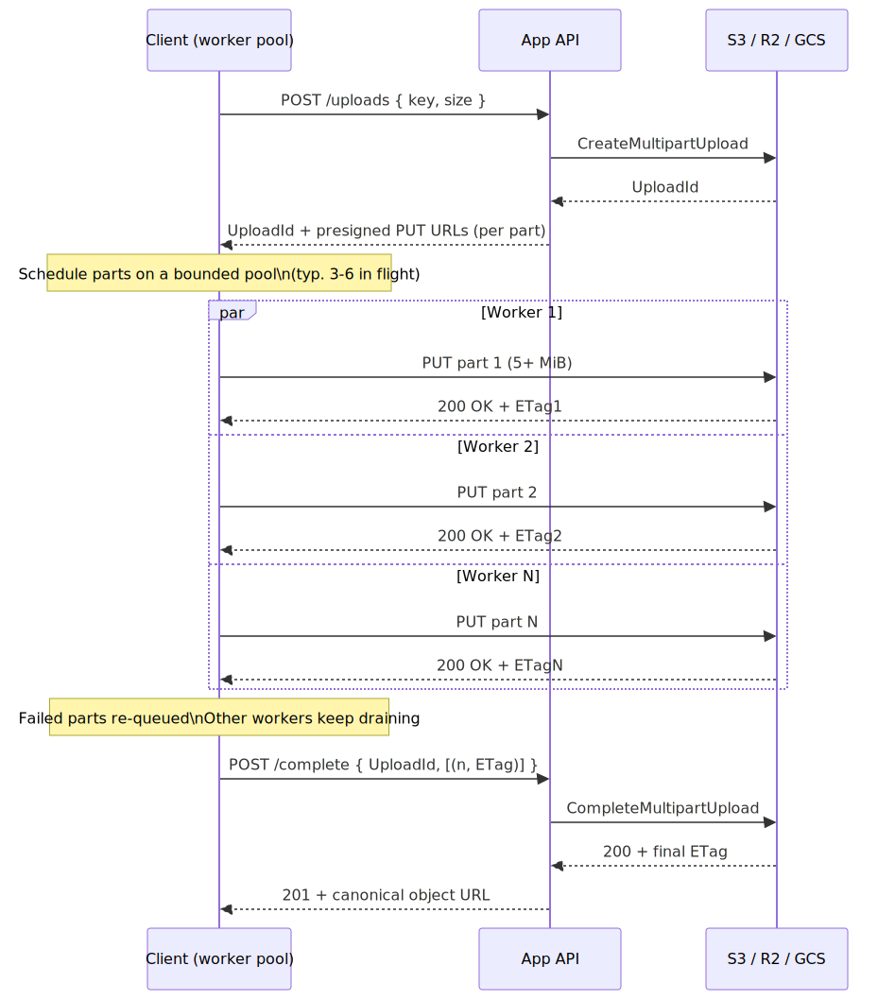
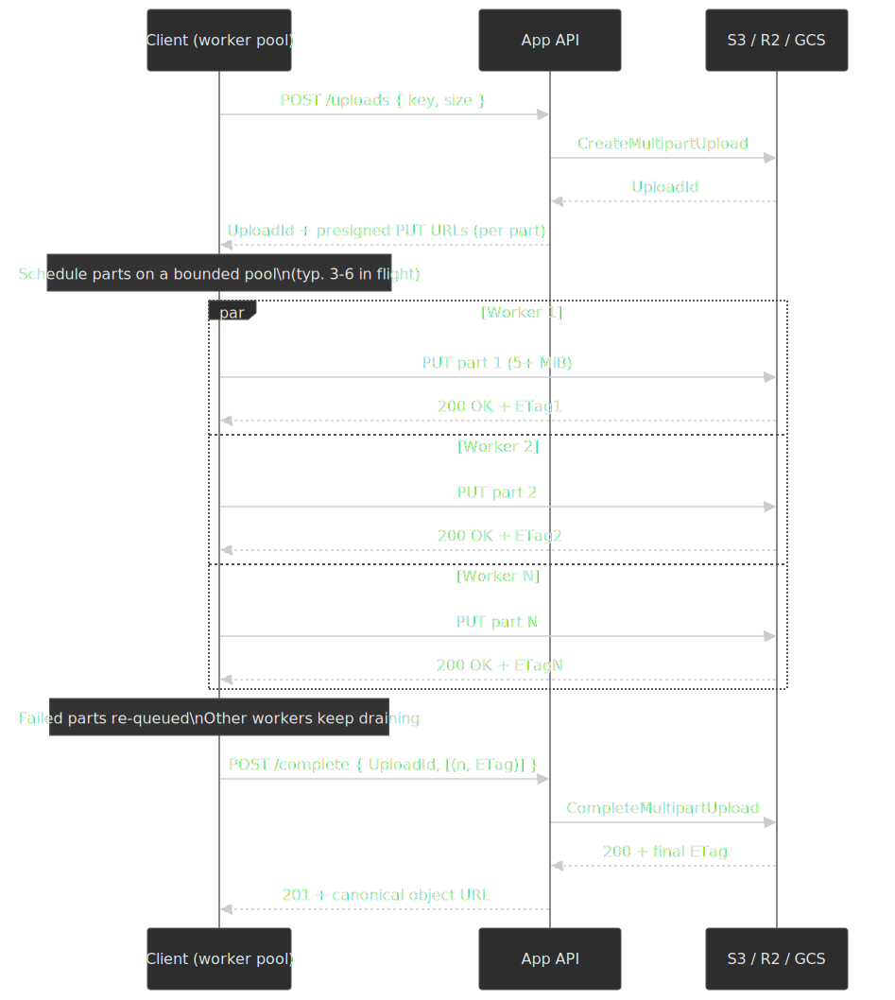

Practical guard-rails:

- **Bound the pool.** 3–6 concurrent parts saturates most home and mobile links without thrashing. More than that wastes battery, congests TCP slow-start, and risks 503s from the storage edge.
- **Watch the protocol limits.** S3 caps every multipart upload at 10,000 parts and 5 TiB; parts must be 5 MiB–5 GiB except the last[^s3limits]. R2 enforces the same envelope **plus** an extra rule that all parts must be exactly the same size except the last — uneven sizes get rejected at `CompleteMultipartUpload`[^r2parts].
- **Track `(PartNumber, ETag)` client-side.** Don't `ListParts` to reconstruct it; the canonical S3 advice is to keep your own map and feed it to `CompleteMultipartUpload`[^s3mpu].
- **Apply backpressure to the file reader, not just the network.** With a parallel pool, your `Blob.slice` rate is now driven by how fast the slowest worker drains. A naive "queue all parts upfront" design materializes too many chunks at once and blows the memory budget you went chunked to avoid.

### Path 3: tus protocol (cross-session resumable)

The [tus 1.0.x resumable upload protocol](https://tus.io/protocols/resumable-upload/1-0-x) standardizes the chunked-upload contract: a `POST` creates an upload resource with a server-assigned URL, `HEAD` returns the current offset, `PATCH` appends bytes, and the upload URL persists across sessions until the server expires it. Because the URL is server-side state, an upload can survive page reloads, OS restarts, and network changes — provided the client persists the URL (typically in IndexedDB) along with enough metadata to re-attach the original `File`.

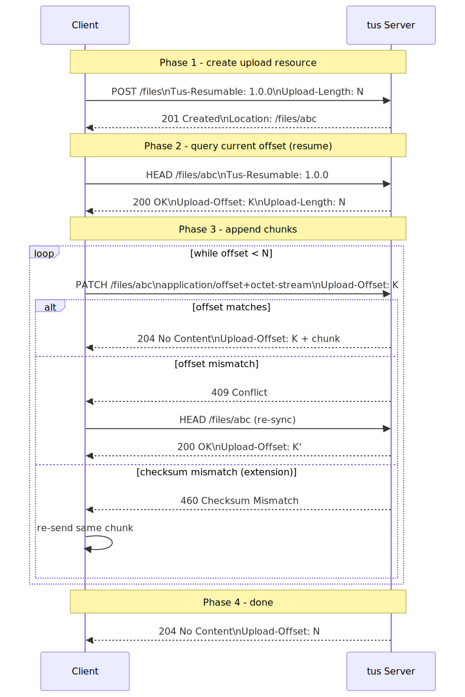
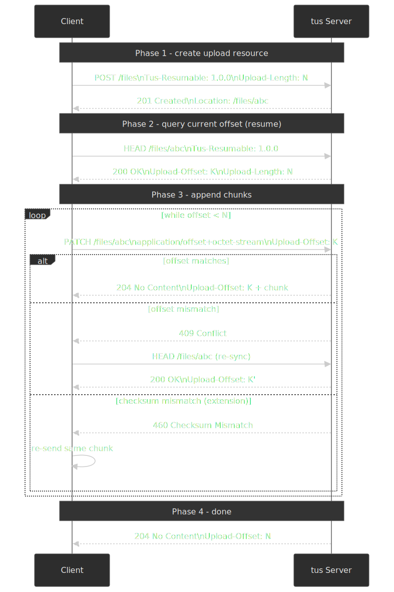

```typescript title="tus-client.ts" collapse={1-8,90-110}
interface TusUploadOptions {
  file: File
  endpoint: string // Server endpoint for creating uploads
  chunkSize?: number
  metadata?: Record<string, string>
  onProgress?: (uploaded: number, total: number) => void
  onComplete?: (uploadUrl: string) => void
  onError?: (error: Error) => void
}

class TusUpload {
  private uploadUrl: string | null = null
  private offset = 0
  private aborted = false

  constructor(private options: TusUploadOptions) {}

  async start(): Promise<void> {
    const { file, endpoint, metadata, chunkSize = 5 * 1024 * 1024 } = this.options

    if (!this.uploadUrl) {
      const encodedMetadata = metadata
        ? Object.entries(metadata)
            .map(([k, v]) => `${k} ${btoa(v)}`)
            .join(",")
        : undefined

      const createResponse = await fetch(endpoint, {
        method: "POST",
        headers: {
          "Tus-Resumable": "1.0.0",
          "Upload-Length": String(file.size),
          ...(encodedMetadata && { "Upload-Metadata": encodedMetadata }),
        },
      })

      if (createResponse.status !== 201) {
        throw new Error(`Failed to create upload: ${createResponse.status}`)
      }

      this.uploadUrl = createResponse.headers.get("Location")
      if (!this.uploadUrl) {
        throw new Error("Server did not return upload URL")
      }
    }

    const headResponse = await fetch(this.uploadUrl, {
      method: "HEAD",
      headers: { "Tus-Resumable": "1.0.0" },
    })

    const serverOffset = headResponse.headers.get("Upload-Offset")
    this.offset = serverOffset ? parseInt(serverOffset, 10) : 0

    while (this.offset < file.size && !this.aborted) {
      const chunk = file.slice(this.offset, this.offset + chunkSize)

      const patchResponse = await fetch(this.uploadUrl, {
        method: "PATCH",
        headers: {
          "Tus-Resumable": "1.0.0",
          "Upload-Offset": String(this.offset),
          "Content-Type": "application/offset+octet-stream",
        },
        body: chunk,
      })

      if (patchResponse.status !== 204) {
        throw new Error(`Chunk upload failed: ${patchResponse.status}`)
      }

      const newOffset = patchResponse.headers.get("Upload-Offset")
      this.offset = newOffset ? parseInt(newOffset, 10) : this.offset + chunk.size

      this.options.onProgress?.(this.offset, file.size)
    }

    if (!this.aborted) {
      this.options.onComplete?.(this.uploadUrl)
    }
  }

  abort(): void {
    this.aborted = true
  }

  getUploadUrl(): string | null {
    return this.uploadUrl
  }
}
```

#### Headers and status codes that matter

| Header | Required on | Purpose |
| --- | --- | --- |
| `Tus-Resumable` | every request except `OPTIONS` | Protocol version handshake (`1.0.0`) |
| `Upload-Length` | `POST` (creation) | Total file size in bytes |
| `Upload-Offset` | `PATCH`, `HEAD` response | Current acknowledged byte position |
| `Upload-Metadata` | `POST` (optional) | Comma-separated `key base64(value)` pairs |
| `Upload-Expires` | server response | When the partial upload will be reaped |

| Status | Meaning |
| --- | --- |
| `201 Created` | Upload resource created (response to `POST`) |
| `204 No Content` | Chunk accepted (response to `PATCH`) |
| `409 Conflict` | `Upload-Offset` does not match the server's offset — re-`HEAD` to recover |
| `412 Precondition Failed` | Unsupported `Tus-Resumable` version |
| `460 Checksum Mismatch` | Optional `tus-checksum` extension rejected the chunk |

All of those status semantics come straight from the [tus 1.0.x spec](https://tus.io/protocols/resumable-upload/1-0-x). Production adopters include Cloudflare Stream, Vimeo, Supabase Storage, and Transloadit.

#### State machine

The protocol is small, but the *state* the client has to track across the protocol is what makes implementations subtle. Pause, visibility-change, server expiry, and checksum failure are all real states with their own transitions:


For parallel-parts variants (S3 multipart, tus *Concatenation* extension), the loop in `Uploading` is a worker pool rather than a single PATCH; the rest of the machine is unchanged.

#### Trade-offs

- ✅ Open standard with multiple server implementations (`tusd`, Spring, Phoenix, Rails, etc.)
- ✅ Cross-session resume — the upload URL outlives the page
- ✅ Optional checksum extension catches in-flight corruption
- ✅ *Concatenation* extension lets the client upload independent partial uploads in parallel and stitch them server-side (closest tus equivalent to S3 multipart parallelism)
- ❌ Built around `fetch` semantics; no intra-chunk progress (use chunk-completion events instead)
- ❌ The server must implement the protocol (or you proxy to a tus server)
- ❌ More round-trips than a custom protocol that batches metadata into the chunk request

### Decision matrix

| Factor | Single XHR | Chunked (in-session) | tus / cross-session |
| --- | --- | --- | --- |
| Practical file ceiling | ~100 MB | Unbounded | Unbounded |
| Resume scope | None | Same page lifetime | Across sessions, devices, restarts |
| Progress | Native XHR | Per chunk + intra-chunk | Per chunk |
| Server complexity | Minimal | Moderate (offset bookkeeping) | tus implementation or proxy |
| Standardization | n/a | Custom | Open standard |
| Direct-to-storage friendly | Via `PUT` | Via S3 multipart | Via tus servers in front of object storage |

## Direct-to-storage uploads

Whether you choose single, chunked, or tus, an orthogonal question is: do bytes flow through your API server, or directly to object storage? Routing them through the API is simple but means your servers eat the bandwidth, the request timeout budget, and the OOM blast radius. Direct-to-storage flips that: the API issues a short-lived presigned URL (S3, GCS, Slack's `files.getUploadURLExternal`) and the client `PUT`s bytes straight to the storage edge, then comes back to "complete" the upload.

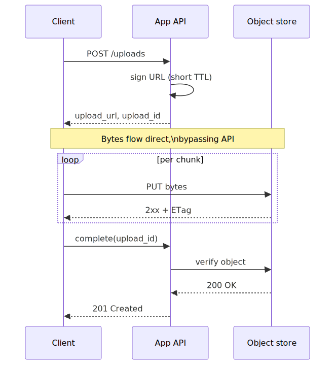
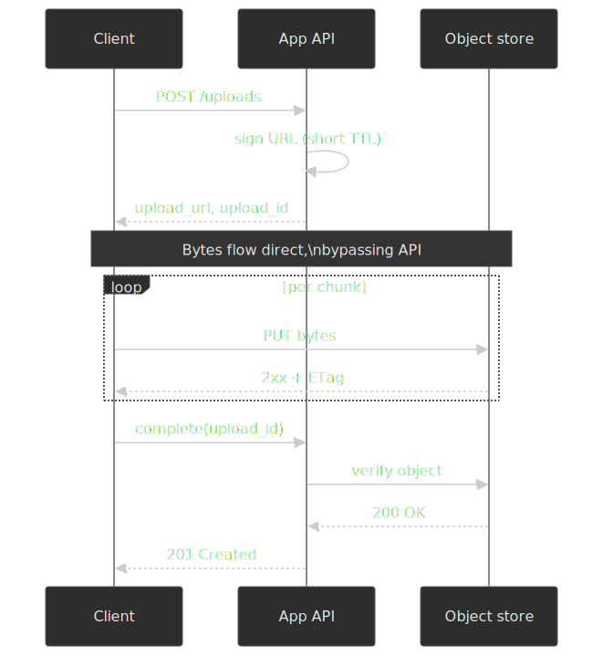

The pattern shows up under different names: **S3 presigned `PUT`** for single-shot uploads, **S3 presigned `CreateMultipartUpload`** for chunked, **GCS resumable session URI**, and Slack's two-step [`files.getUploadURLExternal`](https://docs.slack.dev/reference/methods/files.getUploadURLExternal) → `files.completeUploadExternal` flow. They all share the same skeleton: authorize once, transfer once (or many times), then finalize.

> [!TIP]
> A presigned URL is a credential. Treat its TTL like a session token — keep it short (minutes for single-shot, hours for chunked sessions), scope it to a specific object key, and never log it.

## File selection and validation

### Pickers and drops

The standard input handles both single and multiple selection, plus directory selection via the non-standard but widely supported [`webkitdirectory`](https://developer.mozilla.org/en-US/docs/Web/API/HTMLInputElement/webkitdirectory):

```html title="file-input.html"
<input type="file" accept="image/*,.pdf" multiple />
<input type="file" webkitdirectory />
```

`webkitdirectory` is supported on Chrome, Firefox, Safari, and Edge desktop, but not on mobile browsers[^webkitdirectory]. When it works, each `File` object carries a `webkitRelativePath` so you can reconstruct the directory tree.

For drag-and-drop, prefer `DataTransferItem.webkitGetAsEntry()` (or its standards-track successor [`getAsFileSystemHandle()`](https://developer.mozilla.org/en-US/docs/Web/API/DataTransferItem/getAsFileSystemHandle)) over `dataTransfer.files`, because only the entry-based API gives you directory contents instead of just the dropped folder name[^dndentry]:

```typescript title="drop-zone.ts" collapse={1-3,40-55}
function createDropZone(element: HTMLElement, onFiles: (files: File[]) => void): () => void {
  const handleDragOver = (e: DragEvent) => {
    e.preventDefault()
    e.dataTransfer!.dropEffect = "copy"
    element.classList.add("drag-over")
  }

  const handleDragLeave = () => {
    element.classList.remove("drag-over")
  }

  const handleDrop = (e: DragEvent) => {
    e.preventDefault()
    element.classList.remove("drag-over")

    const files: File[] = []

    if (e.dataTransfer?.items) {
      for (const item of e.dataTransfer.items) {
        if (item.kind === "file") {
          const file = item.getAsFile()
          if (file) files.push(file)
        }
      }
    } else if (e.dataTransfer?.files) {
      files.push(...Array.from(e.dataTransfer.files))
    }

    onFiles(files)
  }

  element.addEventListener("dragover", handleDragOver)
  element.addEventListener("dragleave", handleDragLeave)
  element.addEventListener("drop", handleDrop)

  return () => {
    element.removeEventListener("dragover", handleDragOver)
    element.removeEventListener("dragleave", handleDragLeave)
    element.removeEventListener("drop", handleDrop)
  }
}
```

> [!NOTE]
> Per the [WHATWG drag-and-drop spec](https://html.spec.whatwg.org/multipage/dnd.html#drag-data-store-mode), the drag data store is in *protected mode* during `dragover`. You can read `dataTransfer.types` to detect that files are being dragged, but `dataTransfer.files` is empty until `drop` fires.

### Magic-byte validation

`file.type` derives from the OS-registered extension, not the actual content[^filetype]. For any security-sensitive surface, sniff the file header instead. The [WebP spec](https://www.ietf.org/archive/id/draft-zern-webp-05.html) is a good example of why a single check isn't enough: it's a RIFF container whose `WEBP` four-CC sits at byte offset 8, so naïve "first 4 bytes" matchers will misfire.

```typescript title="magic-bytes-validation.ts" collapse={1-2,35-50}
const MAGIC_SIGNATURES: Record<string, number[]> = {
  "image/jpeg": [0xff, 0xd8, 0xff],
  "image/png": [0x89, 0x50, 0x4e, 0x47, 0x0d, 0x0a, 0x1a, 0x0a],
  "image/gif": [0x47, 0x49, 0x46, 0x38], // "GIF8" — covers GIF87a and GIF89a
  "image/webp": [0x52, 0x49, 0x46, 0x46], // "RIFF" — verify "WEBP" at offset 8
  "application/pdf": [0x25, 0x50, 0x44, 0x46], // "%PDF"
}

async function detectFileType(file: File): Promise<string | null> {
  const slice = file.slice(0, 12)
  const buffer = await slice.arrayBuffer()
  const bytes = new Uint8Array(buffer)

  for (const [mimeType, signature] of Object.entries(MAGIC_SIGNATURES)) {
    if (signature.every((byte, i) => bytes[i] === byte)) {
      if (mimeType === "image/webp") {
        const webpMarker = new TextDecoder().decode(bytes.slice(8, 12))
        if (webpMarker !== "WEBP") continue
      }
      return mimeType
    }
  }

  return file.type || null
}
```

Treat client-side detection as a UX optimization — the authoritative check belongs on the server, with both magic-byte sniffing and a deeper validator (e.g., libmagic, Apache Tika) for high-risk types.

### Image dimension validation

```typescript title="dimension-validation.ts"
async function validateImageDimensions(
  file: File,
  maxWidth: number,
  maxHeight: number,
): Promise<{ width: number; height: number }> {
  const url = URL.createObjectURL(file)

  try {
    const img = await new Promise<HTMLImageElement>((resolve, reject) => {
      const image = new Image()
      image.onload = () => resolve(image)
      image.onerror = () => reject(new Error("Failed to load image"))
      image.src = url
    })

    if (img.width > maxWidth || img.height > maxHeight) {
      throw new Error(`Image ${img.width}x${img.height} exceeds max ${maxWidth}x${maxHeight}`)
    }

    return { width: img.width, height: img.height }
  } finally {
    URL.revokeObjectURL(url)
  }
}
```

### Security

The [OWASP File Upload Cheat Sheet](https://cheatsheetseries.owasp.org/cheatsheets/File_Upload_Cheat_Sheet.html) is the source of truth here. The threats that catch most teams off guard:

**SVGs are documents that can run JavaScript.** A `<script>` tag, an `onload="…"` attribute, or a `<foreignObject>` carrying HTML are all valid SVG and all execute in the rendering origin if the file is served as `image/svg+xml` from a same-origin path:

```xml title="malicious.svg"
<svg xmlns="http://www.w3.org/2000/svg">
  <script>fetch('/api/me').then(r=>r.json()).then(send)</script>
</svg>
```

OWASP's recommended mitigations: serve user uploads from a *separate, sandboxed origin* (so any XSS doesn't run with your app's cookies), force `Content-Disposition: attachment`, sanitize SVG server-side with a known-good library (DOMPurify for SVG profiles, `svg-sanitizer`, etc.), or convert to a raster format on ingest.

**Filename attacks.** The cheat sheet's hard recommendation is to ignore the user filename entirely: assign a server-generated UUID, store the original name as metadata only. If you must keep user names, OWASP requires an allowlist (alphanumerics, hyphen, single dot), explicit blocking of leading dots, double dots, and null bytes, and validation of the extension *after* decoding any URL/percent escapes.

**Content-Type spoofing.** The browser sets `Content-Type` from the file extension; a `.jpg` can be a PHP script with the right magic bytes. Validate the content, not the header.

**Size and rate limits.** Without per-request size caps, a single large multipart body can exhaust server memory. Without per-IP/per-user rate limits, a presigned-URL endpoint can be abused to issue unbounded scratch storage. Enforce both.

## Preview generation

### `URL.createObjectURL` vs `FileReader.readAsDataURL`

| Property | `createObjectURL` | `readAsDataURL` |
| --- | --- | --- |
| Speed | Synchronous, instant | Asynchronous, slower |
| Memory | URL reference only | Full base64 in memory |
| Output | `blob:origin/uuid` | `data:mime;base64,…` |
| Cleanup | Manual `revokeObjectURL()` | Automatic on GC |
| Large files | Better | Memory intensive |

`createObjectURL` is the right default for previews; the only meaningful gotcha is the manual revoke.

```typescript title="image-preview.ts"
function createImagePreview(file: File, imgElement: HTMLImageElement): () => void {
  const url = URL.createObjectURL(file)
  imgElement.src = url

  return () => URL.revokeObjectURL(url)
}

const cleanup = createImagePreview(file, previewImg)
cleanup()
```

### Thumbnails off the main thread

For large images, decode in a worker. [`createImageBitmap`](https://developer.mozilla.org/en-US/docs/Web/API/WorkerGlobalScope/createImageBitmap) accepts a `Blob` and is available on `WorkerGlobalScope`; [`OffscreenCanvas`](https://developer.mozilla.org/en-US/docs/Web/API/OffscreenCanvas) lets the worker rasterize without touching the DOM.

```typescript title="thumbnail-worker.ts" collapse={1-2,30-40}
self.addEventListener("message", async (e: MessageEvent<File>) => {
  const file = e.data
  const maxSize = 200

  const bitmap = await createImageBitmap(file)

  let { width, height } = bitmap
  if (width > height) {
    if (width > maxSize) {
      height = (height * maxSize) / width
      width = maxSize
    }
  } else {
    if (height > maxSize) {
      width = (width * maxSize) / height
      height = maxSize
    }
  }

  const canvas = new OffscreenCanvas(width, height)
  const ctx = canvas.getContext("2d")!
  ctx.drawImage(bitmap, 0, 0, width, height)

  const blob = await canvas.convertToBlob({ type: "image/jpeg", quality: 0.8 })

  self.postMessage(blob)
})
```

```typescript title="main-thread.ts"
const worker = new Worker("thumbnail-worker.ts", { type: "module" })

function generateThumbnail(file: File): Promise<Blob> {
  return new Promise((resolve) => {
    worker.onmessage = (e) => resolve(e.data)
    worker.postMessage(file)
  })
}
```

A 20 MP JPEG decode on a mid-tier mobile CPU is on the order of 100–200 ms — easily enough to drop frames if it lands on the main thread. The worker version takes the same wall time but the main thread keeps animating.

### Non-image previews

Map MIME prefixes to icons; fall back to a generic file glyph:

```typescript title="file-icon.ts"
const FILE_ICONS: Record<string, string> = {
  "application/pdf": "pdf-icon.svg",
  "application/zip": "archive-icon.svg",
  "application/x-zip-compressed": "archive-icon.svg",
  "text/plain": "text-icon.svg",
  "video/": "video-icon.svg",
  "audio/": "audio-icon.svg",
}

function getFileIcon(file: File): string {
  if (FILE_ICONS[file.type]) {
    return FILE_ICONS[file.type]
  }

  for (const [prefix, icon] of Object.entries(FILE_ICONS)) {
    if (prefix.endsWith("/") && file.type.startsWith(prefix)) {
      return icon
    }
  }

  return "generic-file-icon.svg"
}
```

## Progress, queueing, and retries

### Smoothed progress with ETA

A single instantaneous speed sample is jumpy because chunked transfers naturally pulse. Use a rolling window — five seconds is a good default — to compute a smoothed bytes-per-second and turn that into a remaining-time estimate.

```typescript title="progress-tracking.ts" collapse={1-5,45-55}
interface UploadProgress {
  file: File
  loaded: number
  total: number
  percent: number
  speed: number
  remaining: number
}

class ProgressTracker {
  private startTime = Date.now()
  private samples: Array<{ time: number; loaded: number }> = []

  constructor(private total: number) {}

  update(loaded: number): UploadProgress {
    const now = Date.now()
    this.samples.push({ time: now, loaded })

    const cutoff = now - 5000
    this.samples = this.samples.filter((s) => s.time > cutoff)

    let speed = 0
    if (this.samples.length >= 2) {
      const oldest = this.samples[0]
      const elapsed = (now - oldest.time) / 1000
      const bytesTransferred = loaded - oldest.loaded
      speed = elapsed > 0 ? bytesTransferred / elapsed : 0
    }

    const remaining = speed > 0 ? (this.total - loaded) / speed : Infinity

    return {
      loaded,
      total: this.total,
      percent: (loaded / this.total) * 100,
      speed,
      remaining,
    }
  }
}
```

### Multi-file queue with bounded concurrency

A single-file uploader is a special case of a queue with concurrency 1. Production uploaders usually settle around three concurrent transfers — enough to overlap latency, not enough to thrash the network — and surface per-item state for the UI.

```typescript title="upload-queue.ts" collapse={1-8,70-90}
type UploadStatus = "pending" | "uploading" | "completed" | "failed"

interface QueuedUpload {
  id: string
  file: File
  status: UploadStatus
  progress: number
  error?: Error
}

class UploadQueue {
  private queue: QueuedUpload[] = []
  private concurrency: number
  private activeCount = 0
  private onUpdate?: (queue: QueuedUpload[]) => void

  constructor(options: { concurrency?: number; onUpdate?: (queue: QueuedUpload[]) => void }) {
    this.concurrency = options.concurrency ?? 3
    this.onUpdate = options.onUpdate
  }

  add(files: File[]): void {
    const newItems = files.map((file) => ({
      id: crypto.randomUUID(),
      file,
      status: "pending" as UploadStatus,
      progress: 0,
    }))

    this.queue.push(...newItems)
    this.notify()
    this.processNext()
  }

  private async processNext(): Promise<void> {
    if (this.activeCount >= this.concurrency) return

    const next = this.queue.find((item) => item.status === "pending")
    if (!next) return

    this.activeCount++
    next.status = "uploading"
    this.notify()

    try {
      await this.uploadFile(next)
      next.status = "completed"
      next.progress = 100
    } catch (error) {
      next.status = "failed"
      next.error = error as Error
    }

    this.activeCount--
    this.notify()
    this.processNext()
  }

  private async uploadFile(item: QueuedUpload): Promise<void> {
    // Implementation calls the real upload function and updates item.progress
  }

  private notify(): void {
    this.onUpdate?.(this.queue)
  }

  cancel(id: string): void {
    const item = this.queue.find((q) => q.id === id)
    if (item && item.status === "pending") {
      this.queue = this.queue.filter((q) => q.id !== id)
      this.notify()
    }
  }

  retry(id: string): void {
    const item = this.queue.find((q) => q.id === id)
    if (item && item.status === "failed") {
      item.status = "pending"
      item.progress = 0
      item.error = undefined
      this.notify()
      this.processNext()
    }
  }
}
```

### Retry with exponential backoff and jittering

Network and 5xx errors are transient; 4xx errors are not. The retry policy has to know the difference, and it has to add jitter so a herd of clients doesn't synchronize on the next attempt. For tus, a `409` is not a transient error in the usual sense — it means your offset is wrong, so the recovery is a `HEAD` to re-sync, not a fixed-delay retry of the same `PATCH`.

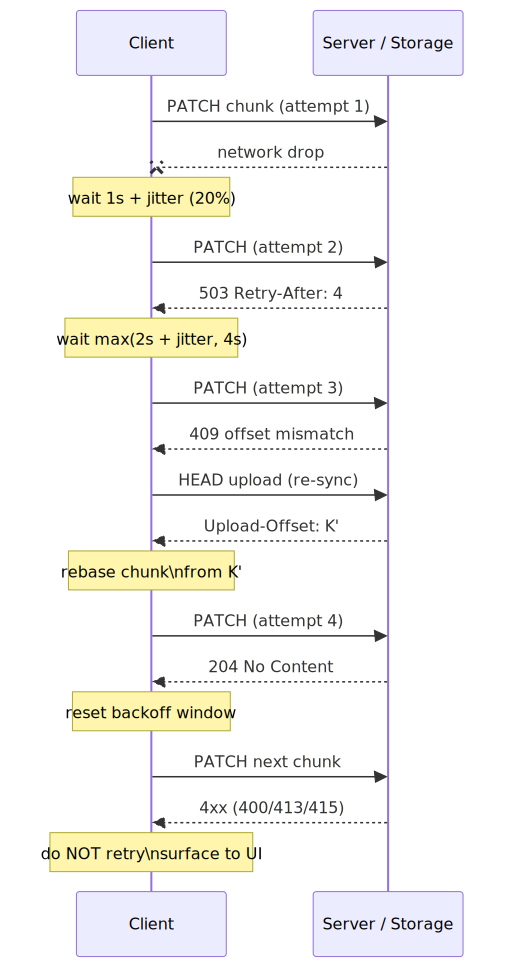
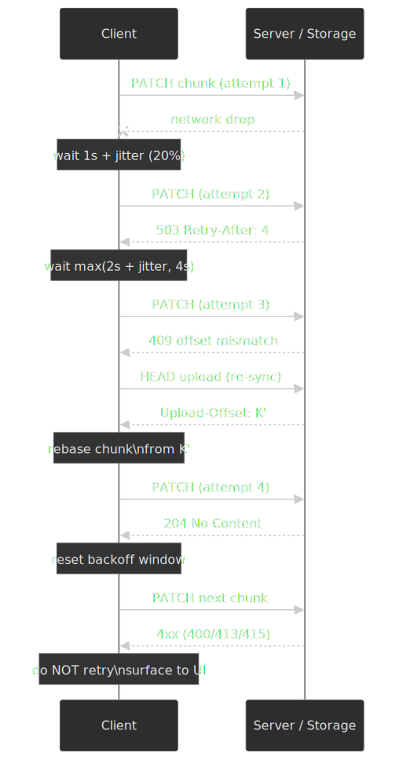

```typescript title="retry-logic.ts" collapse={1-3}
async function uploadWithRetry<T>(
  uploadFn: () => Promise<T>,
  options: { maxRetries?: number; baseDelay?: number } = {},
): Promise<T> {
  const { maxRetries = 3, baseDelay = 1000 } = options
  let lastError: Error

  for (let attempt = 0; attempt <= maxRetries; attempt++) {
    try {
      return await uploadFn()
    } catch (error) {
      lastError = error as Error

      if (error instanceof Response && error.status >= 400 && error.status < 500) {
        throw error
      }

      if (attempt < maxRetries) {
        const delay = baseDelay * Math.pow(2, attempt)
        const jitter = delay * 0.2 * Math.random()
        await new Promise((r) => setTimeout(r, delay + jitter))
      }
    }
  }

  throw lastError!
}
```

| Error class | Retry? | User-facing message |
| --- | --- | --- |
| Network error / disconnect | Yes | "Connection lost. Retrying…" |
| `408`, `429`, `500`, `502`, `503`, `504` | Yes (respect `Retry-After`) | "Server busy. Retrying…" |
| `400` Bad Request | No | "Invalid file" |
| `401` / `403` | No | "Permission denied" |
| `409` (tus offset mismatch) | Re-`HEAD` then resume | (silent) |
| `413` Payload Too Large | No | "File too large" |
| `415` Unsupported Media Type | No | "File type not allowed" |
| `460` (tus checksum) | Re-send same chunk | (silent) |

## Surviving navigation: Service Workers and Background Fetch

Everything above assumes the page that started the upload is still alive when the upload finishes. On mobile that assumption breaks every time the user switches tabs, takes a call, or accidentally swipes the app away. Two browser primitives narrow that gap.

### Service Worker as a proxy

Routing the chunk `PATCH`/`PUT` through a registered service worker via `event.respondWith(fetch(event.request))` lets the SW cache part state, queue retries from `sync` events ([Background Sync](https://developer.mozilla.org/en-US/docs/Web/API/Background_Synchronization_API)), and re-attempt a part the moment connectivity returns. The page can disappear, but only between events — once the SW itself is terminated, in-flight `fetch` calls are abandoned.

### Background Fetch

[Background Fetch](https://developer.mozilla.org/en-US/docs/Web/API/Background_Fetch_API) is the only browser API that lets a transfer survive the page being closed entirely. The page hands a list of `Request` objects (with bodies) to `registration.backgroundFetch.fetch(id, requests, options)`; the browser owns the transfer from that point, exposes OS-level progress UI, pauses across network changes, and wakes the service worker with `backgroundfetchsuccess` (or `…fail` / `…abort`) when it's done[^bgfetch].

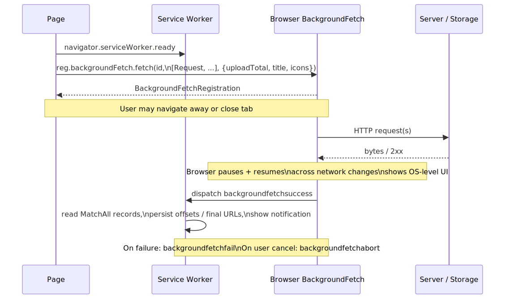
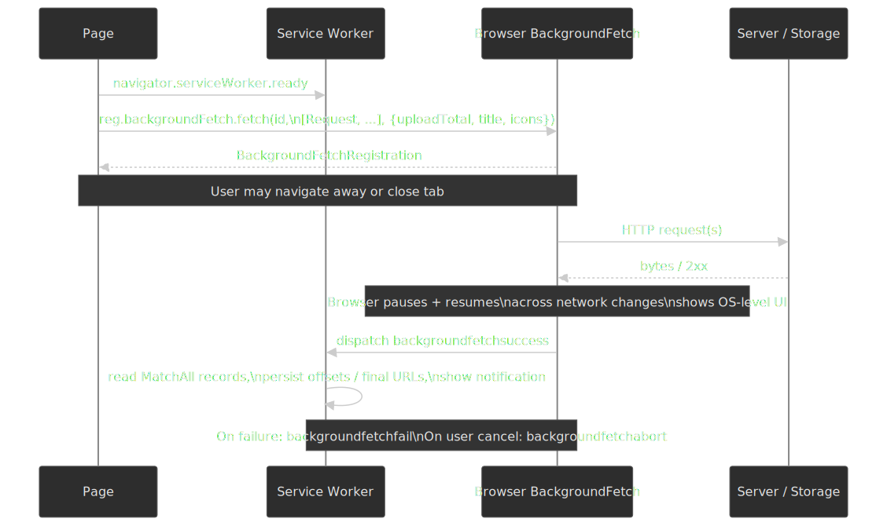

> [!CAUTION]
> Background Fetch is still a [WICG Community Group draft](https://wicg.github.io/background-fetch/) and, as of 2026, ships only in Chromium-based browsers — Firefox and Safari have it on hold[^bgfetchsupport]. Treat it as a progressive enhancement layered on top of a chunked/tus path that already works without it, never as a hard dependency.

### File System Access API and persistent handles

The "you have to re-attach the file from the picker on next visit" problem has one major loophole on Chromium: a [`FileSystemHandle`](https://fs.spec.whatwg.org/#api-filesystemhandle) returned by `showOpenFilePicker()` is *cloneable* — you can store it in IndexedDB and `getFile()` against it on a later visit to recover a live `File` reference, subject to permission re-prompt[^fsahandle]. That turns "user has to find the file again" into a one-tap permission grant on supported browsers.

```typescript title="persist-handle.ts"
const [handle] = await window.showOpenFilePicker({ multiple: false })
await idbPut("uploads", { id: uploadId, handle })

const stored = await idbGet<{ handle: FileSystemFileHandle }>("uploads", uploadId)
if ((await stored.handle.queryPermission({ mode: "read" })) !== "granted") {
  if ((await stored.handle.requestPermission({ mode: "read" })) !== "granted") return
}
const file = await stored.handle.getFile()
```

Browser support: Chrome / Edge / Opera fully implement it; Safari ships only the [Origin Private File System (OPFS)](https://developer.mozilla.org/en-US/docs/Web/API/File_System_API/Origin_private_file_system) subset; Firefox does the same and rejects the picker methods entirely[^fsasupport]. For Safari and Firefox, fall back to the file picker on next visit.

## Cross-session resume state

For uploads that need to survive page reloads or device restarts, persist the upload metadata in IndexedDB. A plain `File` object isn't persistable across reloads on its own (the user has to re-attach it via the file picker or a drag-and-drop), but the upload URL, offset, content hash, and (where supported) the `FileSystemHandle` are.

```typescript title="upload-state-store.ts" collapse={1-5,50-70}
interface StoredUploadState {
  id: string
  fileName: string
  fileSize: number
  uploadUrl: string
  offset: number
  createdAt: number
  file?: File // Only present in same session
}

class UploadStateStore {
  private db: IDBDatabase | null = null

  async init(): Promise<void> {
    return new Promise((resolve, reject) => {
      const request = indexedDB.open("upload-state", 1)

      request.onupgradeneeded = (e) => {
        const db = (e.target as IDBOpenDBRequest).result
        db.createObjectStore("uploads", { keyPath: "id" })
      }

      request.onsuccess = (e) => {
        this.db = (e.target as IDBOpenDBRequest).result
        resolve()
      }

      request.onerror = () => reject(request.error)
    })
  }

  async save(state: StoredUploadState): Promise<void> {
    if (!this.db) throw new Error("DB not initialized")

    return new Promise((resolve, reject) => {
      const tx = this.db!.transaction("uploads", "readwrite")
      const store = tx.objectStore("uploads")
      const request = store.put(state)
      request.onsuccess = () => resolve()
      request.onerror = () => reject(request.error)
    })
  }

  async getAll(): Promise<StoredUploadState[]> {
    if (!this.db) throw new Error("DB not initialized")

    return new Promise((resolve, reject) => {
      const tx = this.db!.transaction("uploads", "readonly")
      const store = tx.objectStore("uploads")
      const request = store.getAll()
      request.onsuccess = () => resolve(request.result)
      request.onerror = () => reject(request.error)
    })
  }

  async delete(id: string): Promise<void> {
    if (!this.db) throw new Error("DB not initialized")

    return new Promise((resolve, reject) => {
      const tx = this.db!.transaction("uploads", "readwrite")
      const store = tx.objectStore("uploads")
      const request = store.delete(id)
      request.onsuccess = () => resolve()
      request.onerror = () => reject(request.error)
    })
  }
}
```

### Storage quotas in 2026

Browsers cap per-origin storage as a fraction of the device disk. The numbers below come from the [MDN Storage quotas reference](https://developer.mozilla.org/en-US/docs/Web/API/Storage_API/Storage_quotas_and_eviction_criteria); they're the de-facto floor you should design around.

| Browser | Best-effort limit | Persistent limit |
| --- | --- | --- |
| Chrome / Edge | ~60% of disk per origin | Same; persistence opts you out of LRU eviction |
| Firefox | min(10% of disk, 10 GiB) per *group* (eTLD+1) | Up to 50% of disk, capped at 8 TiB |
| Safari (browser) | ~60% of disk per origin (overall cap 80%) | Same |
| Safari (WebView) | ~15% of disk per origin (overall cap 20%) | Same |

> [!CAUTION]
> When the device gets low on space, Chrome and Safari evict whole origins LRU-style. If your uploader's resume metadata gets evicted, the upload effectively restarts. Call `navigator.storage.persist()` for any state you can't afford to lose.

### Memory hygiene

```typescript title="memory-anti-pattern.ts"
// Loads the entire file into memory — fails on large mobile uploads.
const data = await file.arrayBuffer()
upload(data)
```

```typescript title="memory-good-pattern.ts"
// Constant memory regardless of file size.
for (let offset = 0; offset < file.size; offset += chunkSize) {
  const chunk = file.slice(offset, offset + chunkSize)
  await uploadChunk(chunk)
}
```

A simple wrapper makes blob-URL revocation impossible to forget on a per-component basis:

```typescript title="tracked-object-urls.ts"
const activeUrls = new Set<string>()

function createTrackedUrl(blob: Blob): string {
  const url = URL.createObjectURL(blob)
  activeUrls.add(url)
  return url
}

function revokeUrl(url: string): void {
  URL.revokeObjectURL(url)
  activeUrls.delete(url)
}

function revokeAll(): void {
  activeUrls.forEach((url) => URL.revokeObjectURL(url))
  activeUrls.clear()
}
```

## Workers, streams, hashing, and encryption

The browser's main thread is shared with rendering and input handling; anything CPU-bound on a large file should not run on it. The toolbox:

- **`Worker` / `OffscreenCanvas`** — already shown for thumbnail decode. The same pattern carries hashing, compression, and encryption.
- **[Streams API](https://streams.spec.whatwg.org/)** — `ReadableStream` from `Blob.stream()`, `TransformStream` for incremental work, `WritableStream` to push to the network. Streams compose in a worker the same way they do on the main thread.
- **[`CompressionStream` / `DecompressionStream`](https://wicg.github.io/compression/)** — gzip / deflate / deflate-raw on a stream without pulling the whole blob into memory. Useful for log uploads or large textual payloads where the bandwidth saving is worth the CPU.
- **`SubtleCrypto`** — AES-GCM encrypt/decrypt is streaming-friendly per chunk because GCM is a counter-mode cipher; SHA-256 hashing is **not**, because `digest()` is one-shot[^subtle]. For file-level SHA-256 you need a streaming WASM hasher (`hash-wasm`, `noble-hashes`, or a custom WASM module). Per-chunk SHA-256 (Merkle-style) is fine for chunk integrity but is not the same digest as the whole file.

A typical pipeline for client-side encryption + chunked upload composes those primitives:

```typescript title="encrypt-and-upload-worker.ts"
const key = await crypto.subtle.importKey(
  "raw",
  rawKeyBytes,
  { name: "AES-GCM" },
  false,
  ["encrypt"],
)

async function encryptChunk(plain: Uint8Array, partNumber: number): Promise<Uint8Array> {
  const iv = new Uint8Array(12)
  new DataView(iv.buffer).setUint32(8, partNumber, false)
  const ct = await crypto.subtle.encrypt({ name: "AES-GCM", iv }, key, plain)
  return new Uint8Array(ct)
}

for (let part = 0, offset = 0; offset < file.size; part++, offset += CHUNK) {
  const slice = file.slice(offset, offset + CHUNK)
  const plain = new Uint8Array(await slice.arrayBuffer())
  const cipher = await encryptChunk(plain, part)
  await uploadPart(part, cipher)
}
```

> [!IMPORTANT]
> Per-part IVs must be **unique per `(key, part)` pair** for AES-GCM. Deriving the IV from the part number — as above — is safe because each multipart upload uses a fresh content key. Reusing an IV with the same key catastrophically breaks GCM's authenticity guarantee.

## Server-side post-processing

The server's job doesn't end at "bytes received". Three pieces of work belong on the server, not the client, and none of them should block the upload-complete response:

- **Authoritative content validation.** Re-run magic-byte sniffing with a real library (libmagic, Apache Tika), enforce a per-tenant size cap, and reject anything the client claimed but didn't deliver. The client's check is a UX optimization — the server's is policy.
- **Antivirus / malware scanning.** ClamAV is the OSS baseline; AWS S3 has ready-made [GuardDuty Malware Protection for S3](https://docs.aws.amazon.com/guardduty/latest/ug/malware-protection-s3.html) and a Lambda-on-`s3:ObjectCreated` pattern. SVGs need an additional sanitization pass (DOMPurify SVG profile, `svg-sanitizer`, or rasterization on ingest); they will pass an AV scan and still execute script in the browser.
- **Metadata extraction and derivative generation.** EXIF strip for privacy, `ffprobe` for video duration / codec, ImageMagick / libvips for thumbnails and AVIF/WebP variants. Run these in a workflow (Step Functions, Temporal, Argo) keyed off the `s3:ObjectCreated` event so the upload-complete response stays cheap and the user doesn't wait on a 30-second video transcode.

> [!NOTE]
> Treat the upload bucket as an untrusted holding area. Move objects to a "validated" bucket only after the AV + content checks pass, serve user content from a separate, sandboxed origin with restrictive `Content-Security-Policy` and `Content-Disposition: attachment` defaults.

## How real systems do it

### Dropbox: content-defined blocks in Magic Pocket

Dropbox splits every file into immutable content-addressed blocks of up to 4 MiB and stores them in [Magic Pocket](https://dropbox.tech/infrastructure/inside-the-magic-pocket), its in-house exabyte-scale blob store. Each block is identified by its hash, so two users uploading the same content store one copy. Blocks are aggregated into ~1 GiB *buckets* before erasure coding for storage efficiency[^magicpocket]. The client side rsyncs against block hashes before upload, so editing a paragraph in a 100 MiB document only ships the changed blocks.

### Google Drive: session-URI resumable

Drive's [resumable upload](https://developers.google.com/workspace/drive/api/guides/manage-uploads) flow is a presigned chunked upload with explicit byte-range semantics. Initiate with a `POST` to get a `Location` URI, which is valid for one week. Upload chunks as `PUT` requests with `Content-Range: bytes <start>-<end>/<total>`. A `308 Resume Incomplete` response carries a `Range` header advertising the bytes the server has actually persisted; the client resumes from the byte after `Range`'s end. Chunks must be a multiple of 256 KiB (except the final one).

### S3 multipart upload

[S3 multipart](https://docs.aws.amazon.com/AmazonS3/latest/userguide/qfacts.html) is a three-call protocol: `CreateMultipartUpload` returns an upload ID, `UploadPart` uploads each part and returns an ETag, `CompleteMultipartUpload` lists the parts in order. Limits worth memorizing: 5 MiB minimum per part (except the last), 10,000 parts maximum, 5 TiB maximum object size, 5 GiB maximum part. An abandoned upload sits as billable storage until you set a lifecycle rule to abort incomplete multipart uploads, which is usually mistake #1 in production.

### Slack: presigned + completion handshake

Slack deprecated the legacy `files.upload` in favour of a two-phase API: [`files.getUploadURLExternal`](https://docs.slack.dev/reference/methods/files.getUploadURLExternal) returns a short-lived `upload_url` and a `file_id`; the client `POST`s the bytes directly to that URL; `files.completeUploadExternal` finalizes the file and shares it into the requested channel. The shape — sign, transfer direct, complete — is the same one S3, GCS, and Cloudflare Stream all expose.

## Accessibility

A drop zone is just a button if you're a keyboard user. Wire `Enter`/`Space` to the underlying `<input type="file">`, give the visible affordance a meaningful `aria-label`, and announce upload state via a polite live region:

```tsx title="accessible-dropzone.tsx"
function AccessibleDropzone({ onFiles }: { onFiles: (files: File[]) => void }) {
  const inputRef = useRef<HTMLInputElement>(null);

  const handleKeyDown = (e: KeyboardEvent) => {
    if (e.key === 'Enter' || e.key === ' ') {
      e.preventDefault();
      inputRef.current?.click();
    }
  };

  return (
    <div
      role="button"
      tabIndex={0}
      onKeyDown={handleKeyDown}
      aria-label="Upload files. Press Enter or Space to open file picker, or drag and drop files here."
    >
      <input
        ref={inputRef}
        type="file"
        multiple
        className="visually-hidden"
        onChange={(e) => onFiles(Array.from(e.target.files || []))}
      />
      <span aria-hidden="true">Drag files here or click to upload</span>
    </div>
  );
}
```

```tsx title="progress-announcements.tsx"
function useProgressAnnouncement() {
  const [announcement, setAnnouncement] = useState('');

  const announce = useCallback((progress: number, fileName: string) => {
    if (progress === 0) {
      setAnnouncement(`Starting upload of ${fileName}`);
    } else if (progress === 100) {
      setAnnouncement(`${fileName} upload complete`);
    } else if (progress % 25 === 0) {
      setAnnouncement(`${fileName}: ${progress}% uploaded`);
    }
  }, []);

  return {
    announce,
    AriaLive: () => (
      <div aria-live="polite" aria-atomic="true" className="visually-hidden">
        {announcement}
      </div>
    )
  };
}
```

Errors get an `aria-live="assertive"` region with a focusable retry control:

```tsx title="error-state.tsx"
function UploadError({ error, onRetry }: { error: Error; onRetry: () => void }) {
  return (
    <div role="alert" aria-live="assertive">
      <span>Upload failed: {error.message}</span>
      <button onClick={onRetry} aria-label="Retry failed upload">
        Retry
      </button>
    </div>
  );
}
```

## Practical takeaways

- Pick the smallest mechanism that fits the file-size distribution and network reliability profile. Single XHR + `FormData` for small files on stable networks; chunked + XHR-per-chunk for large or mobile; tus or a custom resumable protocol for cross-session resume.
- Default to direct-to-storage with presigned URLs the moment your API would otherwise eat the bandwidth. The two-phase handshake is cheap; the bytes-through-API tax is not.
- For S3 / R2 multipart, parallelise parts through a bounded pool (3–6) and apply backpressure to the file reader as well as the network — otherwise you reintroduce the memory bound you went chunked to avoid. Remember the R2 equal-part-size quirk.
- `XMLHttpRequest` is the only API that gives you trustworthy upload progress in 2026. Streaming `fetch` exists for streaming sources, not for progress.
- Validate file types by content, not by header or extension, on both client and server. SVGs are documents and need explicit sanitization. The authoritative AV/scan/transcode pipeline lives on the server, off the user's critical path.
- Decode preview thumbnails in a worker; never on the main thread for anything larger than a chat avatar. Hash and encrypt off the main thread too — and remember `SubtleCrypto.digest` is one-shot.
- Persist upload state (URL, offset, hash) in IndexedDB; on Chromium, persist the `FileSystemHandle` too so the user doesn't re-pick on resume. Call `navigator.storage.persist()` for anything whose loss would force a restart.
- Use Service Worker proxying / Background Sync for retry resilience, and Background Fetch (where supported) when the upload must outlive the page.
- Always set an S3 lifecycle rule that aborts incomplete multipart uploads. Always.

## Appendix

### Prerequisites

- The browser File API (`File`, `Blob`, `FileReader`)
- `XMLHttpRequest` and `fetch` semantics
- HTTP `multipart/form-data` encoding

### Terminology

| Term | Definition |
| --- | --- |
| Chunk | A `Blob` slice uploaded as a single HTTP request |
| Offset | Current byte position acknowledged by the server |
| Resume | Continuing an upload from the last acknowledged offset |
| tus | Open resumable-upload protocol ([tus.io](https://tus.io)) |
| Magic bytes | File-format signature in the first few bytes of a file |
| Blob URL | `blob:` URL referencing in-memory or on-disk content |
| Presigned URL | Short-TTL URL that authorizes direct-to-storage transfer |
| Two-phase upload | Sign → transfer direct → finalize handshake |

### References

- [W3C File API Specification](https://www.w3.org/TR/FileAPI/) — authoritative `File`, `Blob`, `FileReader`, and `URL.createObjectURL` semantics
- [WHATWG XMLHttpRequest Standard](https://xhr.spec.whatwg.org/) — `FormData`, upload progress events
- [WHATWG HTML — Drag and Drop](https://html.spec.whatwg.org/multipage/dnd.html) — drag-data-store modes, `dataTransfer`
- [tus 1.0.x Resumable Upload Protocol](https://tus.io/protocols/resumable-upload/1-0-x) — open standard for resumable uploads
- [MDN: File API](https://developer.mozilla.org/en-US/docs/Web/API/File_API) — implementation guide and browser support
- [MDN: HTMLInputElement.webkitdirectory](https://developer.mozilla.org/en-US/docs/Web/API/HTMLInputElement/webkitdirectory) — directory selection support
- [MDN: DataTransferItem.webkitGetAsEntry](https://developer.mozilla.org/en-US/docs/Web/API/DataTransferItem/webkitGetAsEntry) — directory drops
- [MDN: Storage quotas and eviction criteria](https://developer.mozilla.org/en-US/docs/Web/API/Storage_API/Storage_quotas_and_eviction_criteria) — per-browser quota math
- [MDN: OffscreenCanvas](https://developer.mozilla.org/en-US/docs/Web/API/OffscreenCanvas) — off-thread canvas
- [Chrome for Developers: Streaming requests with the fetch API](https://developer.chrome.com/docs/capabilities/web-apis/fetch-streaming-requests) — Chrome 105 streaming uploads
- [Jake Archibald: Fetch streams aren't for progress](https://jakearchibald.com/2025/fetch-streams-not-for-progress/) — why streaming fetch progress is unreliable
- [OWASP File Upload Cheat Sheet](https://cheatsheetseries.owasp.org/cheatsheets/File_Upload_Cheat_Sheet.html) — security baseline
- [AWS S3 Multipart Upload Overview](https://docs.aws.amazon.com/AmazonS3/latest/userguide/mpuoverview.html) — parallel parts, ETag tracking, completion contract
- [AWS S3 Multipart Upload Limits](https://docs.aws.amazon.com/AmazonS3/latest/userguide/qfacts.html) — protocol minimums and maximums
- [Cloudflare R2: Upload objects](https://developers.cloudflare.com/r2/objects/upload-objects/) — R2 multipart uniform-part-size requirement
- [Google Drive Upload API](https://developers.google.com/workspace/drive/api/guides/manage-uploads) — resumable upload semantics
- [Slack `files.getUploadURLExternal`](https://docs.slack.dev/reference/methods/files.getUploadURLExternal) — two-phase upload reference
- [Uppy `@uppy/aws-s3`](https://uppy.io/docs/aws-s3/) — production multipart client with companion server
- [Background Fetch API (MDN)](https://developer.mozilla.org/en-US/docs/Web/API/Background_Fetch_API) and [WICG draft](https://wicg.github.io/background-fetch/) — survival across navigation
- [WHATWG File System Standard](https://fs.spec.whatwg.org/) — `FileSystemHandle`, OPFS, writable streams
- [SubtleCrypto.digest (MDN)](https://developer.mozilla.org/en-US/docs/Web/API/SubtleCrypto/digest) — one-shot digest API and its consequences
- [Streams Living Standard (WHATWG)](https://streams.spec.whatwg.org/) — `ReadableStream`, `TransformStream`, `WritableStream`
- [Dropbox: Inside the Magic Pocket](https://dropbox.tech/infrastructure/inside-the-magic-pocket) — block-storage architecture

[^slice]: [W3C File API §6, `Blob.slice()`](https://www.w3.org/TR/FileAPI/#slice-method-algo) — defines `slice()` as returning a new `Blob` over the same underlying byte sequence, not a copy.
[^revoke]: [W3C File API §11.1, `URL.createObjectURL`](https://www.w3.org/TR/FileAPI/#dfn-createObjectURL) — entries persist until the document is unloaded or `URL.revokeObjectURL` is called.
[^filetype]: [W3C File API §3, `Blob.type`](https://www.w3.org/TR/FileAPI/#dfn-type) — the `type` attribute reflects the parsed media type of the blob, which user agents typically derive from the file's registered extension, not its bytes.
[^archibald]: [Jake Archibald, "Fetch streams aren't for progress" (2025)](https://jakearchibald.com/2025/fetch-streams-not-for-progress/) — the bytes a `ReadableStream` body has enqueued are not the bytes the network has acknowledged, so streaming fetch progress is misleading.
[^webkitdirectory]: [MDN: `HTMLInputElement.webkitdirectory`](https://developer.mozilla.org/en-US/docs/Web/API/HTMLInputElement/webkitdirectory) — supported on Chrome, Firefox, Safari, and Edge desktop; unsupported on mobile.
[^dndentry]: [MDN: `DataTransferItem.webkitGetAsEntry`](https://developer.mozilla.org/en-US/docs/Web/API/DataTransferItem/webkitGetAsEntry) — only the entry-based API exposes directory contents; `dataTransfer.files` only sees the dropped folder name.
[^magicpocket]: [Dropbox: Inside the Magic Pocket](https://dropbox.tech/infrastructure/inside-the-magic-pocket) and [Optimizing Magic Pocket for cold storage](https://dropbox.tech/infrastructure/how-we-optimized-magic-pocket-for-cold-storage) — 4 MiB immutable blocks aggregated into ~1 GiB buckets for erasure coding.
[^subtle]: [MDN: `SubtleCrypto.digest`](https://developer.mozilla.org/en-US/docs/Web/API/SubtleCrypto/digest) — `digest()` consumes a single `BufferSource`; there is no `update()`/`finalize()` pair, so streaming SHA-256 of a multi-GiB file requires a WASM hasher or a custom Merkle scheme.
[^s3mpu]: [AWS S3: Uploading and copying objects using multipart upload](https://docs.aws.amazon.com/AmazonS3/latest/userguide/mpuoverview.html) — parts can be uploaded in any order and in parallel; the client tracks `(PartNumber, ETag)` pairs and feeds them to `CompleteMultipartUpload`.
[^s3limits]: [AWS S3: Multipart upload limits](https://docs.aws.amazon.com/AmazonS3/latest/userguide/qfacts.html) — 5 MiB minimum (except last), 5 GiB maximum part, 10,000 parts maximum, 5 TiB maximum object.
[^r2parts]: [Cloudflare R2: Upload objects — multipart](https://developers.cloudflare.com/r2/objects/upload-objects/) — R2 enforces equal-sized parts within a multipart upload (last part excepted), unlike S3 which permits per-part size variation above the 5 MiB floor.
[^uppys3]: [Uppy: AWS S3 plugin](https://uppy.io/docs/aws-s3/) — `@uppy/aws-s3` defaults to multipart for files larger than ~100 MiB and parallelises part uploads through a bounded pool with retry.
[^bgfetch]: [MDN: Background Fetch API](https://developer.mozilla.org/en-US/docs/Web/API/Background_Fetch_API) and [WICG: background-fetch explainer](https://github.com/WICG/background-fetch) — the browser owns the transfer once registered and wakes the service worker via `backgroundfetchsuccess` / `backgroundfetchfail` / `backgroundfetchabort`.
[^bgfetchsupport]: [Can I Use: Background Fetch](https://caniuse.com/?search=Background%20Fetch) — Chromium-only as of 2026; Mozilla and WebKit have not signalled implementation intent.
[^fsahandle]: [WHATWG File System Standard — `FileSystemHandle`](https://fs.spec.whatwg.org/#api-filesystemhandle) — handles are serializable and may be stored in IndexedDB; permission may need to be re-requested on subsequent visits.
[^fsasupport]: [MDN: `Window.showOpenFilePicker`](https://developer.mozilla.org/en-US/docs/Web/API/Window/showOpenFilePicker) — supported in Chromium browsers; Firefox and Safari implement only the OPFS subset and reject the picker methods.
