# Design a Form Builder

A form builder is a schema-driven UI compiler: a declarative description of fields, types, validation, and conditional logic is consumed at runtime by a renderer that mounts components, manages state, validates input, and persists drafts. This article is for senior frontend and platform engineers shipping form-heavy products — internal tools, low-code platforms, application flows, surveys — where forms grow into the hundreds of fields, span multiple steps, depend on each other, and have to stay usable on flaky networks and assistive tech. It covers the schema, runtime, validation, persistence, and accessibility layers, the trade-offs between the dominant stacks, and the patterns Typeform, [Form.io][formio-os], [JSON Forms][jsonforms-arch], and the React Hook Form + Zod ecosystem use under the hood.


## Mental model

A form builder cleanly separates **what** (the schema) from **how** (the renderer):

1. **Schema layer.** A declarative description of fields, types, validation rules, and inter-field logic. The two dominant shapes are [JSON Schema][json-schema-spec] (data-portable, language-agnostic) and TypeScript-first schemas like [Zod][zod-api], [TypeBox][typebox-repo], or Valibot (type-inferring, JS-only).
2. **Runtime layer.** A component registry maps field types to UI components; a renderer walks the schema and mounts them; a state manager holds values, dirty state, and errors; a validation engine runs sync, async, and cross-field rules.
3. **Persistence layer.** Drafts auto-save into client-side storage (typically [IndexedDB][mdn-storage-quotas]); on submit, the validated payload goes to the backend and the draft is cleared.

The architectural decisions you make at each layer compound:

| Decision          | Options                                | Trade-off                                            |
| ----------------- | -------------------------------------- | ---------------------------------------------------- |
| Schema format     | JSON Schema vs Zod/TypeBox vs custom DSL | Cross-platform portability vs type-inference ergonomics |
| State approach    | Controlled vs uncontrolled             | Re-render granularity vs direct DOM ergonomics       |
| Validation timing | onChange vs onBlur vs onSubmit         | Responsiveness vs main-thread cost                   |
| Field rendering   | Eager vs section-lazy vs virtualized   | Implementation simplicity vs scale                   |

The rest of this article is the reasoning behind each axis.

## Designer and runtime: two halves of the same system

A "form builder" is two cooperating apps that share one contract — the schema document. The **designer** is an authoring app (drag-and-drop palette, canvas, field inspector, live preview) used by form authors; the **runtime** is the renderer end-users actually fill in. Both Form.io and JotForm ship this split commercially, and JSON Forms ships only the runtime half on the assumption you bring your own designer.


Three rules keep this split honest:

1. **The same renderer powers preview and runtime.** If the designer's preview uses a different code path than the live form, authors will ship forms that look fine in preview and break in production.
2. **The schema is versioned and the version travels with submissions and drafts.** A form referenced by id alone drifts between authoring sessions; a form referenced by `(id, version)` is reproducible.
3. **The schema is the contract.** Anything the designer can express must be representable in the schema document, and anything the runtime can render must be present there — no implicit per-field code paths.

> [!IMPORTANT]
> The designer is the easy half to under-design. Treat the schema document as a public API: every change is a versioned migration, and the designer's "advanced" panel must round-trip cleanly to JSON or else authors will lose work.

## Why forms are non-trivial

Forms look like a thin UI problem and turn out to be a state-machine problem with strong UX, a11y, and persistence requirements layered on top. The non-obvious parts are the ones that decide whether a 200-field application form ships:

- **Field visibility is a function of other fields.** Conditional rendering and cascading dropdowns mean the form's shape changes mid-edit; stale dependent values silently corrupt submissions.
- **Validation rules cross field boundaries.** Cross-field constraints (`endDate > startDate`, "venue required if in-person") cannot live inside a single field's validator.
- **The performance budget is harsh.** A 60 Hz frame is a [16.67 ms wall][web-dev-rail], and the [RAIL model][web-dev-rail] reserves only ~50 ms of that for input handling. A naive controlled form re-rendering 100 components per keystroke will miss it on a mid-tier mobile device.
- **Users expect autosave.** Losing a half-filled application is a worse failure than rejecting the submission. Production forms persist drafts behind the scenes.
- **Assistive tech matters.** Validation errors that are visually obvious are invisible to a screen reader without [ARIA live regions][mdn-live-regions], and dynamically appearing fields disrupt focus order.

### Browser constraints to budget against

| Constraint                              | Impact on a form                                | Mitigation                                          |
| --------------------------------------- | ----------------------------------------------- | --------------------------------------------------- |
| 16.67 ms frame budget at 60 Hz          | Sync validation on every keystroke can stall input | Debounce, defer to `onBlur`, or use Web Workers[^web-workers] |
| 50 ms long-task threshold[^long-tasks]  | Synchronous re-renders show up as long tasks    | Subscriptions, memoization, virtualization          |
| `localStorage` ~5 MiB per origin[^mdn-quotas] | Limits draft storage for non-trivial forms      | Use IndexedDB (browser-quota-managed)               |
| Re-render cost                          | Sluggish typing on large controlled forms       | Uncontrolled inputs or subscription-based selectors |

### Scale tiers

The right architecture changes by an order of magnitude depending on form size; these are the rough bands I plan against:

| Tier   | Fields | Nested depth | Conditional rules | Update cadence    |
| ------ | ------ | ------------ | ----------------- | ----------------- |
| Small  | < 50   | 1–2 levels   | < 10              | onSubmit / onBlur |
| Medium | 50–200 | 3–4 levels   | 10–50             | onBlur            |
| Large  | > 200  | 5+ levels    | > 50              | per-keystroke     |

Tax software, insurance applications, and enterprise workflow forms sit firmly in the "large" band and need virtualization and isolated field state to stay responsive.

## Schema to mounted form: the rendering pipeline

Independent of the schema flavor, every renderer follows the same compile-then-mount pipeline. Understanding the steps is what lets you debug "why is my field blank on first paint" or "why is my conditional rule one keystroke behind":


The renderer's job is small but precise:

1. **Parse + normalize** — coerce shorthand to canonical form; apply defaults; collect `required`/`enum`/`title` per field.
2. **Resolve `$ref` and inheritance** — JSON Schema `$ref` and Zod composition both produce a flattened tree.
3. **Build the internal field tree** — the runtime walks this, not the original document.
4. **Compile validators** — once at mount, not per keystroke. AJV ships a code generator that compiles a schema to a closed-over function; Zod builds the parser tree at definition time.
5. **Build the conditional dependency graph** — see the [conditional engine section](#conditional-engine).
6. **Walk and mount** — for each node, look up the component in the registry and mount with state subscription and validator wiring.

Knowing this pipeline determines where to do the work: **schema-changing** ops (loading a draft against a new version, hot-swapping a layout) need a re-parse; **value-changing** ops do not — they just need a re-render of the subscribed slices.

## Schema layer: three viable shapes

### Path 1 — JSON Schema + UI Schema


[JSON Schema][json-schema-spec] (Draft 2020-12, plus [`if`/`then`/`else`][json-schema-conditionals] from Draft 7) defines the data shape and constraints in a portable JSON document. A separate **UI Schema** (a JSON Forms / RJSF convention) supplies rendering hints — widgets, layout, field order. The renderer walks both and mounts components from a registry; [AJV][ajv] validates the same schema on the server.

```typescript title="schema-example.ts" collapse={1-2}
import type { JSONSchema7 } from "json-schema"

const schema: JSONSchema7 = {
  type: "object",
  required: ["email", "role"],
  properties: {
    email: { type: "string", format: "email", title: "Email Address" },
    role: { type: "string", enum: ["admin", "user", "guest"], title: "Role" },
    permissions: { type: "array", items: { type: "string" }, title: "Permissions" },
  },
}

const uiSchema = {
  email: { "ui:autofocus": true },
  role: { "ui:widget": "radio" },
  permissions: { "ui:widget": "checkboxes" },
}
```

**Best for**

- Forms whose definition is shared across systems (server, client, mobile, validators).
- Backend-generated forms where the server owns the schema and the client only renders.
- API-driven flows where the form is materialized from an OpenAPI spec.

**Trade-offs**

- ✅ Schema is data — it can be stored, versioned, diffed, and shared with non-JS validators.
- ✅ AJV is one of the fastest validators on Node and the browser; the [JSON Schema test suite][json-schema-tests] gives you confidence the rules behave the same everywhere.
- ❌ The UI Schema adds a parallel structure to maintain.
- ❌ Conditional logic in JSON Schema is verbose: nested `if`/`then`/`else`/`allOf` quickly out-grows what a non-author can read.

In production, [JSON Forms][jsonforms-arch] and [react-jsonschema-form][rjsf] are the two dominant stacks; both compose a JSON Schema + UI Schema with a pluggable renderer set (Material UI, Vuetify, Vanilla, …).

### Path 2 — TypeScript-first schema (Zod, TypeBox, Valibot)


Define the schema in TypeScript with [Zod][zod-api], TypeBox, or Valibot. Types are inferred from the schema (`z.infer<typeof S>`), so write-once gives you both compile-time types and runtime validation, and the same schema can run on the server via [tRPC][trpc] or Remix/Next route handlers.

```typescript title="zod-schema.ts" collapse={1-3}
import { z } from "zod"

const userSchema = z
  .object({
    email: z.string().email("Invalid email format"),
    age: z.number().min(18, "Must be 18 or older"),
    role: z.enum(["admin", "user", "guest"]),
  })
  .refine((data) => data.role !== "admin" || data.age >= 21, {
    message: "Admins must be 21+",
    path: ["age"],
  })

type User = z.infer<typeof userSchema>

const uniqueEmailSchema = z
  .string()
  .email()
  .refine(
    async (email) => {
      const exists = await checkEmailExists(email)
      return !exists
    },
    { message: "Email already registered" },
  )
```

**Best for**

- TypeScript-heavy codebases where the type and the validator should not drift apart.
- Validation logic that is more readable as code than as nested JSON.
- React Hook Form via [`@hookform/resolvers/zod`][zod-resolver].

**Trade-offs**

- ✅ Single source of truth for types and runtime checks; `z.infer` removes the chance of drift.
- ✅ Async refinements, transforms, and coercion read naturally as TypeScript.
- ❌ Not portable to non-JS backends. If your Java or Go server has to validate the same payload, you either re-encode the rules or convert via a library like `zod-to-json-schema`.
- ❌ The schema is code, so it cannot be edited by non-developers in a database row the way JSON Schema can.

### Path 3 — Form state machine (XState)


For multi-step wizards with branching, conditional skip-logic, and async submissions, model the form itself as a finite state machine with [XState][xstate]. Each step is a state, transitions are gated by guards, and the machine's context accumulates form data.

```typescript title="form-machine.ts" collapse={1-5, 45-60}
import { createMachine, assign } from "xstate"

type FormContext = {
  step1Data: { name: string } | null
  step2Data: { email: string } | null
  errors: Record<string, string>
}

const formMachine = createMachine({
  id: "formWizard",
  initial: "step1",
  context: {
    step1Data: null,
    step2Data: null,
    errors: {},
  } as FormContext,
  states: {
    step1: {
      on: {
        NEXT: {
          target: "step2",
          guard: "isStep1Valid",
          actions: assign({ step1Data: (_, event) => event.data }),
        },
      },
    },
    step2: {
      on: {
        NEXT: { target: "submitting", guard: "isStep2Valid" },
        BACK: "step1",
      },
    },
    submitting: {
      invoke: {
        src: "submitForm",
        onDone: "success",
        onError: { target: "error", actions: "setError" },
      },
    },
    success: { type: "final" },
    error: { on: { RETRY: "submitting" } },
  },
})
```

**Best for**

- Multi-step wizards with non-linear branching (insurance quotes, KYC flows, checkouts).
- Forms with strict ordering rules ("you cannot reach review without completing step 3").
- Audit trails — the state graph is the spec.

**Trade-offs**

- ✅ Impossible transitions are statically prevented by guards.
- ✅ Async work (submission, I/O) sits inside `invoke` blocks with explicit `onDone`/`onError`.
- ❌ Two systems to maintain — the state machine and a per-step form library.
- ❌ Overkill for single-page forms.

### Decision matrix

| Factor             | JSON Schema                  | Zod / TypeBox / Valibot | XState              |
| ------------------ | ---------------------------- | ----------------------- | ------------------- |
| Type safety        | Medium (with inference libs) | Native                  | Medium              |
| Portability        | High (cross-platform)        | Low (JS/TS only)        | Low                 |
| Complex validation | Verbose (nested `if`/`then`) | Natural in code         | Via guards/services |
| Multi-step flows   | Manual                       | Manual                  | Built-in            |
| Learning curve     | Low                          | Low                     | Medium              |
| Best for           | API-driven / cross-language  | TS-first product apps   | Wizards / workflows |

In practice, the two patterns I see most often in 2026 codebases are **JSON Schema + JSON Forms / RJSF** for low-code or backend-generated forms, and **React Hook Form + Zod** for product-feature forms. XState is the right answer when the wizard graph itself is the product surface.

## State management

### Controlled vs uncontrolled

Every form-state library lives somewhere on the controlled–uncontrolled axis. The decision affects every render:

```typescript title="controlled.tsx"
const [value, setValue] = useState("");
<input value={value} onChange={(e) => setValue(e.target.value)} />;
```

- ✅ React owns the source of truth; derived values are easy.
- ❌ Every keystroke is a state update and a render. With naive composition, that render fans out to siblings.

```typescript title="uncontrolled.tsx" collapse={1-2}
import { useForm } from "react-hook-form";

const { register, handleSubmit } = useForm();
<input {...register("email")} />;
```

- ✅ The DOM holds the value; React reads on demand. Re-renders only happen on subscribed state.
- ✅ Better default scaling for large forms.
- ❌ Less direct control of intermediate values; integrating fully-controlled UI components requires `Controller` or `useController`[^rhf-controller].

The exact numbers below are illustrative — they depend heavily on the component tree, memoization, and React concurrent features — but the relative ordering is consistent across benchmarks I have run:

| Approach               | Re-renders per keystroke | Order of magnitude |
| ---------------------- | ------------------------ | ------------------ |
| Controlled (naive)     | All field components     | Slowest            |
| Controlled (memoized + selector) | One subscriber          | Fast              |
| Uncontrolled (RHF `register`)    | Zero (DOM holds value)  | Fastest            |

> [!TIP]
> Profile before optimizing. On a small form, the controlled path is often fast enough and easier to reason about; reach for uncontrolled state when a real-user-monitoring report or React Profiler shows the cost.

### Subscription-based updates

React Hook Form and React Final Form both wrap form state in a Proxy and let components subscribe only to the slices they read. The mechanism is documented in the [React Hook Form `formState` reference][rhf-formstate]: properties like `isDirty` and `errors` are tracked when you destructure them; never-read properties never re-trigger.

```typescript title="subscriptions.tsx" collapse={1-3}
import { useFormState, useWatch } from "react-hook-form"

const { isDirty, isValid } = useFormState({
  control,
  subscription: { isDirty: true, isValid: true },
})

const email = useWatch({ control, name: "email" })
```

This is structurally similar to selectors in Zustand or GraphQL field selection: the consumer declares what it cares about, and the framework only signals when that slice changes. It is the single biggest reason React Hook Form scales better than Formik on large forms — Formik's render-on-every-state-change default puts a controlled re-render on every keystroke unless you reach for `<FastField>`.

### Field-level vs form-level state

| Approach    | State lives in                   | Re-render scope | Use case        |
| ----------- | -------------------------------- | --------------- | --------------- |
| Form-level  | Single store / context           | Entire form     | Small forms     |
| Field-level | Per-field hook                   | One field       | Large forms     |
| Hybrid      | Form-level state + subscriptions | Subscribed only | Production apps |

Default to form-level state because it is the simplest mental model. Move to subscriptions or field-level state when profiling shows render cascades — typically past 50 fields or when you start computing values from the entire form on every keystroke.

### State dimensions every form library tracks

Form state is not just `{ values, errors }`. The libraries that scale all expose the same handful of orthogonal flags so the UI can answer "should I show the error yet?" without lying. The names are React Hook Form's[^rhf-formstate]; Final Form, Formik, and TanStack Form expose the same concepts under different spellings:

| Flag           | Becomes true when                              | Used to drive                            |
| -------------- | ---------------------------------------------- | ---------------------------------------- |
| `dirty`        | Value differs from the initial value           | Disable submit for unchanged forms; "unsaved changes" warnings |
| `touched`      | Field has lost focus at least once             | Suppress error display until first blur  |
| `visited`      | Field has received focus at least once         | Show contextual help only after engagement |
| `isSubmitting` | Submit handler is in flight                    | Disable inputs and the submit button     |
| `submitCount`  | Number of submit attempts                      | Switch to immediate `onChange` validation after first submit |
| `isValidating` | An async validator is running                  | Show inline spinners                     |

The classic UX guideline — *don't show field errors until the user has had a chance to finish typing* — is exactly "show errors only when `touched` or `submitCount > 0`". Designing the form library around these flags is what lets the UI stay quiet while the user is still typing and become assertive after they ask for the form to be checked.

## Validation architecture

Validation is not a single check on submit — it is a sequence of events spread across focus, typing, blur, submit, and the server response. The form library's job is to decide when each kind of validator runs, when its result becomes visible, and how server-side rejections re-enter the same flow:

 → blur (touched) → submit (validate-all + Idempotency-Key) → server 422 maps pointers back to fields.")


### Validation timing

| Timing             | UX                         | Performance                 | Use case          |
| ------------------ | -------------------------- | --------------------------- | ----------------- |
| `onChange`         | Immediate feedback         | High (every keystroke)      | Critical fields   |
| `onBlur`           | Feedback on commit         | Low                         | Default choice    |
| `onSubmit`         | Batch validation           | Lowest                      | Simple forms      |
| Debounced `onChange` | Balanced                  | Medium                      | Async / network   |

A practical default: validate `onBlur`, plus debounced `onChange` for fields that talk to a network (username uniqueness, address lookup, gift-card balance). Reserve `onChange` validation for fields where the user has no useful next action without it (password strength meter).

```typescript title="debounced-validation.ts" collapse={1-5}
import { z } from "zod"
import debounce from "lodash.debounce"

const checkUsername = debounce(async (username: string) => {
  const response = await fetch(`/api/check-username?q=${username}`)
  return response.json()
}, 300)

const usernameSchema = z
  .string()
  .min(3, "Username too short")
  .refine(
    async (username) => {
      const { available } = await checkUsername(username)
      return available
    },
    { message: "Username taken" },
  )
```

### Cross-field validation

Fields that depend on other fields cannot be validated in isolation. In Zod, [`superRefine`][zod-superrefine] is the right tool because it lets you emit multiple issues with explicit paths and codes, where `refine` always emits a single `custom` issue:

```typescript title="cross-field.ts" collapse={1-2}
import { z } from "zod"

const passwordSchema = z
  .object({
    password: z.string().min(8),
    confirmPassword: z.string(),
  })
  .superRefine((data, ctx) => {
    if (data.password !== data.confirmPassword) {
      ctx.addIssue({
        code: z.ZodIssueCode.custom,
        message: "Passwords don't match",
        path: ["confirmPassword"],
      })
    }
  })

const eventSchema = z
  .object({
    eventType: z.enum(["online", "in-person"]),
    venue: z.string().optional(),
    meetingUrl: z.string().url().optional(),
  })
  .superRefine((data, ctx) => {
    if (data.eventType === "in-person" && !data.venue) {
      ctx.addIssue({
        code: z.ZodIssueCode.custom,
        message: "Venue required for in-person events",
        path: ["venue"],
      })
    }
    if (data.eventType === "online" && !data.meetingUrl) {
      ctx.addIssue({
        code: z.ZodIssueCode.custom,
        message: "Meeting URL required for online events",
        path: ["meetingUrl"],
      })
    }
  })
```

### Validation execution order — and why object refinements can vanish

Zod (and similar libraries) execute validation in declaration order: parse / coerce, then per-field validators, then refinements. Refinements only run **after** every field has parsed successfully — so a missing or wrong-typed required field will silently prevent your cross-field check from ever firing. This is documented in the Zod API reference and surfaces regularly in [issue threads][zod-short-circuit].

```typescript title="execution-order.ts"
z.object({
  email: z.string().email(),
  confirmEmail: z.string(),
}).refine((data) => data.email === data.confirmEmail, { message: "Emails must match" })
```

> [!CAUTION]
> If `email` fails its `.email()` check, the cross-field `refine` does not execute — the user only sees "invalid email", and "emails must match" never appears. For password-confirm fields and similar, design your error UI assuming the cross-field message may surface only after the per-field errors are cleared, or use `superRefine` and inspect the input shape yourself.

### Validation precedence: client is suggestive, server is authoritative

Client-side validation is a UX optimization; the server is the authority. Skipping the client costs nothing but a round-trip; skipping the server costs you data integrity. Design for both:

1. **Client validators run for fast feedback.** They never reject a submission on their own; they only short-circuit obviously invalid input before the network call.
2. **The server runs the same rules** — ideally the literal same schema, via JSON Schema or `zod-to-json-schema` — and is the only place that decides whether a submission is accepted.
3. **Server errors come back per field.** The standard envelope is [RFC 9457 Problem Details][rfc-9457] (which obsoletes RFC 7807) with an `errors[]` extension whose entries carry a JSON Pointer[^rfc-6901] into the payload and a human-readable `detail`.

```typescript title="server-error-mapping.ts"
type ProblemErrors = { errors?: Array<{ pointer: string; detail: string }> }

async function submitWithFieldErrors(
  payload: unknown,
  setError: (path: string, error: { message: string }) => void,
) {
  const res = await fetch("/submit", {
    method: "POST",
    headers: { "Content-Type": "application/json", "Idempotency-Key": crypto.randomUUID() },
    body: JSON.stringify(payload),
  })
  if (res.ok) return res.json()
  if (res.status === 422) {
    const body = (await res.json()) as ProblemErrors
    for (const { pointer, detail } of body.errors ?? []) {
      const path = pointer.replace(/^#?\//, "").split("/").join(".")
      setError(path, { message: detail })
    }
  }
  throw new Error(`submit failed: ${res.status}`)
}
```

> [!WARNING]
> Server-only checks (uniqueness, payment authorization, business-rule guardrails) cannot be replicated on the client without leaking data or going stale. Treat the client as best-effort and always be prepared to surface a 422 by mapping its pointers back to fields and moving focus to the first one.

## Dynamic rendering

### Conditional engine

Conditional rules ("show `venue` when `eventType === 'in-person'`", "options for `city` depend on `state`") are not just `if (...) return null` sprinkled in JSX. They are a reactive subsystem with three responsibilities — and silently violating any one of them produces data-integrity bugs that survive validation.


1. **Build a dependency graph from the rules.** Walk the schema once; for each predicate, record `field B depends on field A`. Without this, every keystroke evaluates every rule.
2. **On value change, notify only the dependents.** The graph turns the cost from "rules × keystrokes" into "dependents-of-this-field × keystrokes".
3. **When a field becomes hidden, reset its stored value.** A "city" left over from the previously selected state passes validation (it is still a non-empty string) but breaks downstream geocoding. JSON Forms exposes this as `hideRequired`/`removeOnHide`; RJSF leaves it to the host app, which is a footgun.

A minimal predicate-evaluator is small enough to ship in two dozen lines:

```typescript title="conditional-engine.ts"
type Predicate = (values: Record<string, unknown>) => boolean
type Rule = { field: string; visible: Predicate; deps: string[] }

function buildEngine(rules: Rule[]) {
  const dependents = new Map<string, Rule[]>()
  for (const rule of rules) {
    for (const dep of rule.deps) {
      const list = dependents.get(dep) ?? []
      list.push(rule)
      dependents.set(dep, list)
    }
  }
  return function onChange(field: string, values: Record<string, unknown>) {
    const affected = dependents.get(field) ?? []
    return affected.map((rule) => ({
      field: rule.field,
      visible: rule.visible(values),
    }))
  }
}
```

In the JSON Schema world, the same idea is encoded with `if`/`then`/`else` (Draft 7+) and `dependentRequired`/`dependentSchemas` (Draft 2019-09+); the engine still has to walk the schema to discover the dependency edges. In code-first stacks (Zod + RHF), the dependency graph is implicit in `useWatch` calls — a fact that becomes a problem when a non-trivial form has dozens of `useWatch` subscribers and you cannot reason about why the form re-rendered.

### Component registry pattern

Map field types to UI components so the schema can stay implementation-agnostic:

```typescript title="registry.ts" collapse={1-8}
import type { ComponentType } from "react";

interface FieldProps {
  name: string;
  label: string;
  error?: string;
}

type FieldRegistry = Record<string, ComponentType<FieldProps>>;

const fieldRegistry: FieldRegistry = {
  text: TextInput,
  email: EmailInput,
  select: SelectField,
  checkbox: CheckboxField,
  date: DatePicker,
  file: FileUpload,
  address: AddressAutocomplete,
  phone: PhoneInput,
};

function renderField(field: SchemaField) {
  const Component = fieldRegistry[field.type];
  if (!Component) {
    console.warn(`Unknown field type: ${field.type}`);
    return null;
  }
  return <Component key={field.name} {...field} />;
}
```

The registry is what decouples a schema (`{ type: "date" }`) from a specific implementation (a native `<input type="date">` vs. a third-party date picker vs. a custom popover). Both [JSON Forms renderer sets][jsonforms-arch] and Form.io's `Formio.Components` registry follow this pattern.

### Conditional field rendering

```typescript title="conditional-fields.tsx" collapse={1-10}
import { useWatch } from "react-hook-form";

interface ConditionalFieldProps {
  watchField: string;
  condition: (value: unknown) => boolean;
  children: React.ReactNode;
}

function ConditionalField({
  watchField,
  condition,
  children,
}: ConditionalFieldProps) {
  const value = useWatch({ name: watchField });

  if (!condition(value)) {
    return null;
  }

  return <>{children}</>;
}

<SelectField name="employmentType" options={["employed", "self-employed", "unemployed"]} />

<ConditionalField
  watchField="employmentType"
  condition={(v) => v === "employed"}
>
  <TextInput name="employerName" label="Employer Name" />
  <TextInput name="jobTitle" label="Job Title" />
</ConditionalField>

<ConditionalField
  watchField="employmentType"
  condition={(v) => v === "self-employed"}
>
  <TextInput name="businessName" label="Business Name" />
</ConditionalField>
```

### Cascading dependencies

Dropdowns whose options come from previous selections need both fresh data and a reset on parent change:

```typescript title="cascading.tsx" collapse={1-15}
import { useWatch, useFormContext } from "react-hook-form";
import { useQuery } from "@tanstack/react-query";

function CitySelect() {
  const { setValue } = useFormContext();
  const country = useWatch({ name: "country" });
  const state = useWatch({ name: "state" });

  useEffect(() => {
    setValue("city", "");
  }, [state, setValue]);

  const { data: cities, isLoading } = useQuery({
    queryKey: ["cities", country, state],
    queryFn: () => fetchCities(country, state),
    enabled: Boolean(country && state),
  });

  if (!state) return null;

  return (
    <SelectField
      name="city"
      options={cities ?? []}
      disabled={isLoading}
      placeholder={isLoading ? "Loading cities..." : "Select city"}
    />
  );
}
```

> [!IMPORTANT]
> Always reset dependent fields when their parent changes. A "city" left over from the previously selected state is a silent data-integrity bug that survives validation (the value is a non-empty string) but breaks downstream geocoding.

## Nested and array fields

### Array operations

Repeatable sections (multiple phone numbers, line items, beneficiaries) need stable identity across reorders and removals — RHF's `useFieldArray` issues a stable `id` separate from the index for exactly this reason:

```typescript title="array-fields.tsx" collapse={1-6}
import { useFieldArray, useFormContext } from "react-hook-form";

interface PhoneEntry {
  type: "home" | "work" | "mobile";
  number: string;
}

function PhoneNumbers() {
  const { control } = useFormContext();
  const { fields, append, remove, move } = useFieldArray({
    control,
    name: "phones",
  });

  return (
    <div>
      {fields.map((field, index) => (
        <div key={field.id}>
          <SelectField
            name={`phones.${index}.type`}
            options={["home", "work", "mobile"]}
          />
          <TextInput name={`phones.${index}.number`} />
          <button type="button" onClick={() => remove(index)}>
            Remove
          </button>
        </div>
      ))}
      <button
        type="button"
        onClick={() => append({ type: "mobile", number: "" })}
      >
        Add Phone
      </button>
    </div>
  );
}
```

Using array index as the React `key` causes incorrect field associations whenever an item is reordered or removed — values bleed into the wrong row. Use the library-provided id.

### Nested validation

Deep validation falls naturally out of Zod's compositional API:

```typescript title="nested-validation.ts" collapse={1-2}
import { z } from "zod"

const orderSchema = z
  .object({
    customer: z.object({
      name: z.string().min(1),
      email: z.string().email(),
    }),
    items: z
      .array(
        z.object({
          productId: z.string(),
          quantity: z.number().min(1),
          options: z
            .array(
              z.object({
                name: z.string(),
                value: z.string(),
              }),
            )
            .optional(),
        }),
      )
      .min(1, "Order must have at least one item"),
  })
  .refine((order) => order.items.reduce((sum, item) => sum + item.quantity, 0) <= 100, {
    message: "Maximum 100 items per order",
    path: ["items"],
  })
```

### Performance with large arrays

Arrays of more than ~100 items need help:

| Technique         | What it does                                | Impact |
| ----------------- | ------------------------------------------- | ------ |
| Virtualization    | Render only visible rows                    | High   |
| Memoized rows     | `React.memo` on a per-row component         | Medium |
| Batch operations  | `replace()` instead of repeated `append()`  | Medium |
| Isolated state    | Per-row component reads only its own slice  | High   |

```typescript title="optimized-array.tsx" collapse={1-10}
import { memo } from "react";
import { useFormContext } from "react-hook-form";

interface ItemRowProps {
  index: number;
  onRemove: () => void;
}

const ItemRow = memo(function ItemRow({ index, onRemove }: ItemRowProps) {
  const { register } = useFormContext();

  return (
    <div>
      <input {...register(`items.${index}.name`)} />
      <input {...register(`items.${index}.quantity`)} type="number" />
      <button type="button" onClick={onRemove}>Remove</button>
    </div>
  );
});

{fields.map((field, index) => (
  <ItemRow
    key={field.id}
    index={index}
    onRemove={() => remove(index)}
  />
))}
```

## Persistence and draft recovery

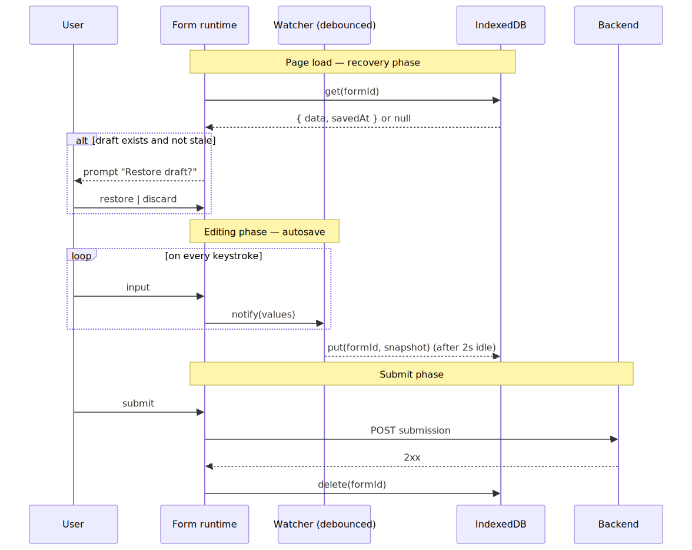
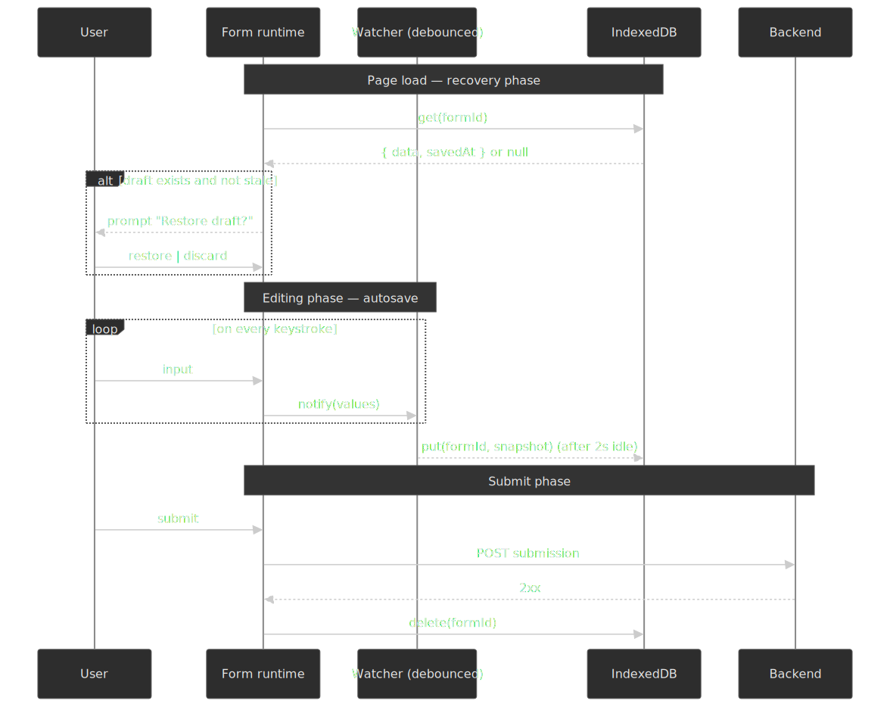

### Autosave strategy

The goal is "user never loses input", not "every keystroke hits storage". Debounce writes to a couple of seconds of inactivity:

```typescript title="autosave.ts" collapse={1-8}
import { useEffect, useCallback } from "react"
import { useWatch } from "react-hook-form"
import debounce from "lodash.debounce"
import { openDB } from "idb"

const DRAFT_DB = "form-drafts"
const DRAFT_STORE = "drafts"

async function saveDraft(formId: string, data: unknown) {
  const db = await openDB(DRAFT_DB, 1, {
    upgrade(db) {
      db.createObjectStore(DRAFT_STORE)
    },
  })
  await db.put(
    DRAFT_STORE,
    {
      data,
      savedAt: Date.now(),
    },
    formId,
  )
}

function useAutosave(formId: string, control: Control) {
  const formData = useWatch({ control })

  const debouncedSave = useCallback(
    debounce((data: unknown) => {
      saveDraft(formId, data)
    }, 2000),
    [formId],
  )

  useEffect(() => {
    debouncedSave(formData)
    return () => debouncedSave.cancel()
  }, [formData, debouncedSave])
}
```

### Why IndexedDB for drafts

| Feature       | `localStorage`              | IndexedDB                                                 |
| ------------- | --------------------------- | --------------------------------------------------------- |
| Storage limit | ~5 MiB per origin[^mdn-quotas] | Browser-managed quota (typically a sizeable fraction of free disk)[^web-dev-storage] |
| API           | Synchronous (blocks the main thread) | Asynchronous                                              |
| Data shape    | Strings only                | Structured (objects, blobs, files)                        |
| Indexing      | Key–value                   | Object stores with secondary indexes                      |

The actual IndexedDB quota varies by browser — Chrome lets an origin use a substantial fraction of total disk, Firefox caps each eTLD+1 group at ~10% of disk (capped at 10 GiB), and Safari historically allowed about 1 GiB per origin[^web-dev-storage]. Use [`navigator.storage.estimate()`][mdn-storage-quotas] at runtime to read the real numbers, and call [`navigator.storage.persist()`][mdn-storage-quotas] when you need the browser to resist auto-eviction. For forms with file uploads or large datasets, IndexedDB is the only reasonable option.

### Draft recovery

Restore drafts on page load — but stale drafts are usually worse than none, so age-check them:

```typescript title="draft-recovery.ts" collapse={1-10}
import { useEffect, useState } from "react"
import { openDB } from "idb"

interface DraftData {
  data: unknown
  savedAt: number
}

const STALE_THRESHOLD = 24 * 60 * 60 * 1000

async function loadDraft(formId: string): Promise<DraftData | null> {
  const db = await openDB(DRAFT_DB, 1)
  const draft = await db.get(DRAFT_STORE, formId)

  if (!draft) return null

  const age = Date.now() - draft.savedAt
  if (age > STALE_THRESHOLD) {
    await db.delete(DRAFT_STORE, formId)
    return null
  }

  return draft
}

function useDraftRecovery(formId: string, reset: UseFormReset) {
  const [hasDraft, setHasDraft] = useState(false)
  const [draftAge, setDraftAge] = useState<string>("")

  useEffect(() => {
    loadDraft(formId).then((draft) => {
      if (draft) {
        setHasDraft(true)
        setDraftAge(formatRelativeTime(draft.savedAt))
      }
    })
  }, [formId])

  const restoreDraft = async () => {
    const draft = await loadDraft(formId)
    if (draft) {
      reset(draft.data)
      setHasDraft(false)
    }
  }

  const discardDraft = async () => {
    const db = await openDB(DRAFT_DB, 1)
    await db.delete(DRAFT_STORE, formId)
    setHasDraft(false)
  }

  return { hasDraft, draftAge, restoreDraft, discardDraft }
}
```

### Clear the draft on successful submit

```typescript title="clear-on-submit.ts"
async function onSubmit(data: FormData) {
  await submitToServer(data)

  const db = await openDB(DRAFT_DB, 1)
  await db.delete(DRAFT_STORE, formId)
}
```

### Schema versioning and draft migration

Saved drafts outlive the schema they were authored against. A user starts a 50-field application on Monday, the schema gains three new required fields on Wednesday, and they return on Friday. Without a migration story, the draft either crashes the renderer or silently submits a payload the server now rejects.

The pattern that scales is the same one MongoDB documents as the [Schema Versioning Pattern][mongo-versioning] and that Confluent's Schema Registry encodes as `BACKWARD_TRANSITIVE` compatibility[^schema-evolution]:

1. **Tag every saved draft with the `schemaVersion`** it was authored against.
2. **Define migration functions per version step**, each transforming `vN → vN+1` (drop removed fields, default new required fields, coerce changed types).
3. **On load, apply the migrations in order** until the draft matches the current schema.
4. **Tell the user when a migration changes the meaning of their input** (newly required field, dropped data, recoded enum) — silent migrations corrupt audit trails.

```typescript title="draft-migrate.ts" collapse={1-6}
type Draft<T> = { schemaVersion: number; data: T; savedAt: number }
type Migration = (data: any) => any

const migrations: Record<number, Migration> = {
  1: (d) => ({ ...d, region: d.region ?? "unknown" }),
  2: (d) => ({ ...d, phones: d.phones?.filter(Boolean) ?? [] }),
}

function migrateDraft<T>(draft: Draft<T>, currentVersion: number): Draft<T> {
  let data: any = draft.data
  for (let v = draft.schemaVersion + 1; v <= currentVersion; v++) {
    const step = migrations[v]
    if (!step) throw new Error(`No migration to v${v}`)
    data = step(data)
  }
  return { ...draft, data, schemaVersion: currentVersion }
}
```

The companion rule for the schema itself: prefer additive changes (new optional fields, widened enums, looser constraints) over breaking changes (renames, type changes, narrowed enums). When a breaking change is unavoidable, treat the new schema as a distinct id rather than bumping a version, so the renderer can pick a deliberately different code path for old drafts.

## Submission lifecycle


A production submit handler does five things, in order:

1. **Run client validators.** Block on failure; focus the first invalid field.
2. **Generate an idempotency key.** A v4 UUID per submit attempt — the [IETF `Idempotency-Key` draft][idempotency-draft] and [Stripe's API][stripe-idempotency] both define this for `POST` and other non-idempotent methods. Without it, a network blip + user retry double-submits.
3. **POST the payload with the key in the request header.** Set `Content-Type: application/json` and `Idempotency-Key: <uuid>`. The same key must accompany every retry of the same logical attempt.
4. **Branch on the response.** `200`/`201` → success path: clear the draft, navigate or show the receipt. `422` with `application/problem+json` → map each `errors[].pointer` (a [JSON Pointer][rfc-6901]) back to a form field path and call `setError`. `409 Conflict` → another in-flight retry exists; back off and re-send with the same key. Network failure → exponential backoff with jitter, again with the same key. The Stripe convention is to retain the original status code and body for a bounded window (24 hours) so retries are deterministic[^stripe-idempotency].
5. **Update local state to reflect server reality.** On success, transition to a "submitted" state that disables further edits; on validation failure, the form returns to "editable" with server-attached errors.

> [!IMPORTANT]
> The single biggest mistake in submission flows is generating a fresh idempotency key per retry. A new key is not a retry — it is a new submission. The key must be generated once per logical attempt and reused across every network-level retry of that attempt.

### Optimistic vs pessimistic UI

For low-stakes forms (comments, edits to a single record), an optimistic UI — apply the change locally, send in the background, roll back on failure — is the right default. For high-stakes forms (payments, account creation, anything regulated), pessimistic is the right default: the user only sees the success state once the server has acknowledged it. A schema-driven form builder should expose this as a per-form flag, not a per-field one.

### File uploads

File inputs are submission's special case: the binary cannot live in `application/json`, and a 50 MB upload that loses its connection at 49 MB should not restart from zero. The pattern that has won in 2026 is direct-to-storage with presigned URLs: the form posts metadata to your API, the API responds with a short-lived presigned `PUT` URL pointing at S3 / GCS / Azure Blob, and the file bytes go straight from the browser to object storage. For files large enough to want resumable uploads, use the storage provider's multipart upload (S3 multipart, GCS resumable) and either chunk the upload manually or wear the chunking via [`tus`][tus] — both keep the API server out of the request data path.

## Internationalization

A schema-driven form builder lives or dies by how cleanly it separates **structure** (in the schema) from **localized strings** (in i18n catalogs). Two practical patterns:

1. **Store i18n keys in the schema, resolve at render time.** Field `title`, `description`, and validator `message` slots hold translation keys; the renderer calls the host's `t()` to resolve them. Zod's [error-customization API][zod-errors] lets per-rule messages be either strings or keys; the [`zod-i18n-map`][zod-i18n-map] library wires Zod into `i18next`, and Zod 4 ships built-in locales under `zod/locales`. RHF + Zod patterns commonly thread the `t` function into a schema factory so dynamic parts (e.g., `min: 8`) translate too.
2. **Always carry the locale into validators.** Number, date, and currency parsing must use the user's locale via `Intl.NumberFormat` and `Intl.DateTimeFormat` rather than naive `parseFloat` or `new Date()`; Western thousand separators silently parse to `NaN` in many European locales.

For RTL (Arabic, Hebrew, Persian, Urdu): set `dir` on `<html>` from the active locale[^rtl-react], use CSS logical properties (`margin-inline-start`, `padding-inline-end`) instead of `left`/`right`, and verify that focus order, error icon placement, and input groups (e.g., currency-prefixed amounts) mirror correctly. Bidirectional text — an English address inside an Arabic form — needs `dir="auto"` or `unicode-bidi: plaintext` on the input itself, otherwise the cursor jumps unpredictably.

## Performance optimization

### Strategies for large forms

For forms with 100+ fields, three patterns do most of the work:

**1. Virtualization** — render only the rows on screen.

```typescript title="virtualized-form.tsx" collapse={1-5}
import { FixedSizeList } from "react-window";

interface VirtualFieldListProps {
  fields: SchemaField[];
}

function VirtualFieldList({ fields }: VirtualFieldListProps) {
  const Row = ({ index, style }: { index: number; style: React.CSSProperties }) => (
    <div style={style}>
      {renderField(fields[index])}
    </div>
  );

  return (
    <FixedSizeList
      height={600}
      itemCount={fields.length}
      itemSize={80}
      width="100%"
    >
      {Row}
    </FixedSizeList>
  );
}
```

**2. Section-based lazy loading** — split the form into chunks the user wades through one at a time.

```typescript title="lazy-sections.tsx" collapse={1-8}
import { lazy, Suspense } from "react";

const PersonalInfoSection = lazy(() => import("./sections/PersonalInfo"));
const EmploymentSection = lazy(() => import("./sections/Employment"));
const FinancialSection = lazy(() => import("./sections/Financial"));

function MultiSectionForm() {
  const [activeSection, setActiveSection] = useState(0);

  const sections = [
    { Component: PersonalInfoSection, title: "Personal" },
    { Component: EmploymentSection, title: "Employment" },
    { Component: FinancialSection, title: "Financial" },
  ];

  const { Component } = sections[activeSection];

  return (
    <Suspense fallback={<SectionSkeleton />}>
      <Component />
    </Suspense>
  );
}
```

**3. Targeted validation** — only validate the field that changed.

```typescript title="optimized-validation.ts"
const { trigger } = useFormContext();

<input
  {...register("email")}
  onBlur={() => trigger("email")}
/>;

const onSubmit = handleSubmit(async (data) => {
  const isValid = await trigger();
  if (isValid) {
    await submit(data);
  }
});
```

### Profiling form performance

Treat form responsiveness as a first-class metric. Use the [Long Tasks API][long-tasks-w3c] to surface stalls during typing, and ship the data to your RUM:

```typescript title="performance-profiling.ts" collapse={1-4}
const observer = new PerformanceObserver((list) => {
  for (const entry of list.getEntries()) {
    if (entry.entryType === "longtask" && entry.duration > 50) {
      console.warn("Long task during form interaction:", {
        duration: entry.duration,
        attribution: entry.attribution,
      })
    }
  }
})

observer.observe({ entryTypes: ["longtask"] })
```

Targets to anchor against (the harder numbers come from Core Web Vitals[^inp]):

| Metric                | Target                         | Degraded                |
| --------------------- | ------------------------------ | ----------------------- |
| Keystroke response    | < 16 ms (one frame)            | > 50 ms (long task)     |
| Field blur validation | < 50 ms                        | > 200 ms                |
| INP (page-level)      | ≤ 200 ms                       | > 500 ms (poor)         |
| Form submission       | < 100 ms (client work)         | > 500 ms (client work)  |

## Accessibility

### Error announcements

Use ARIA live regions to announce validation errors to assistive tech. The minimum-viable accessible error pattern is documented in [WCAG technique ARIA19][aria19] and the [MDN live regions guide][mdn-live-regions]:

```typescript title="accessible-errors.tsx" collapse={1-5}
interface ErrorMessageProps {
  fieldId: string;
  error?: string;
}

function ErrorMessage({ fieldId, error }: ErrorMessageProps) {
  return (
    <div
      id={`${fieldId}-error`}
      role="alert"
      aria-atomic="true"
    >
      {error && <span className="error-text">{error}</span>}
    </div>
  );
}

function TextField({ name, label, error }: TextFieldProps) {
  return (
    <div>
      <label htmlFor={name}>{label}</label>
      <input
        id={name}
        aria-describedby={error ? `${name}-error` : undefined}
        aria-invalid={Boolean(error)}
      />
      <ErrorMessage fieldId={name} error={error} />
    </div>
  );
}
```

> [!IMPORTANT]
> `role="alert"` is defined to imply both `aria-live="assertive"` and `aria-atomic="true"`[^mdn-alert-role]. Setting `role="alert"` *and* an explicit `aria-live="assertive"` can cause double announcements in iOS VoiceOver — pick one. WCAG ARIA19 specifically calls out `aria-atomic="true"` on the alert region as necessary for VoiceOver on iOS to read repeated error messages reliably.

When you do want a quieter notification (e.g. a "saved" toast), use a `polite` live region instead of `alert`; `polite` waits for a pause in screen-reader output before announcing.

### Focus management

Move focus to the first error on a failed submit so keyboard and screen-reader users do not have to hunt for it:

```typescript title="focus-management.ts" collapse={1-3}
import { useForm } from "react-hook-form"

const {
  handleSubmit,
  setFocus,
  formState: { errors },
} = useForm()

const onSubmit = handleSubmit(
  (data) => submitToServer(data),
  (errors) => {
    const firstErrorField = Object.keys(errors)[0]
    if (firstErrorField) {
      setFocus(firstErrorField)
    }
  },
)
```

### Dynamic field visibility

When a conditional field appears, focus often needs to land inside it for the user to know it exists:

```typescript title="conditional-focus.tsx" collapse={1-8}
import { useEffect, useRef } from "react";

function ConditionalField({ visible, children }: ConditionalFieldProps) {
  const containerRef = useRef<HTMLDivElement>(null);
  const wasVisible = useRef(visible);

  useEffect(() => {
    if (visible && !wasVisible.current) {
      const firstInput = containerRef.current?.querySelector("input, select, textarea");
      if (firstInput instanceof HTMLElement) {
        requestAnimationFrame(() => firstInput.focus());
      }
    }
    wasVisible.current = visible;
  }, [visible]);

  if (!visible) return null;

  return <div ref={containerRef}>{children}</div>;
}
```

### Keyboard navigation

Support the patterns the platform already implies:

| Key        | Action                           |
| ---------- | -------------------------------- |
| Tab        | Move to next field               |
| Shift+Tab  | Move to previous field           |
| Enter      | Submit form (when not in textarea) |
| Escape     | Close dropdowns / modals         |
| Arrow keys | Navigate options in select / radio |

```typescript title="keyboard-submit.tsx"
<form
  onKeyDown={(e) => {
    if (
      e.key === "Enter" &&
      e.target instanceof HTMLInputElement &&
      e.target.type !== "submit"
    ) {
      e.preventDefault();
    }
  }}
>
```

## Real-world implementations

### Typeform — conversational forms

Typeform is built around the principle of a single question on screen at a time, with ["Logic Jumps"][typeform-logic-jumps] that branch the conversation based on answers. The [Create API][typeform-create-api] is the source of truth: forms are JSON documents containing `fields`, `logic`, `welcome_screens`, and `thankyou_screens`, and any client (web, mobile, embed) renders against the same definition. The platform now also exposes "Multi-Question Pages" for the cases where the strict one-at-a-time model gets in the way.

Trade-off: focused UX, but users cannot scan the whole form to understand scope before they start.

### Form.io — schema-driven enterprise builder

[Form.io][formio-os] is a JSON-driven form platform whose drag-and-drop builder produces a JSON schema document. The same schema then powers an embedded [Form Renderer SDK][formio-renderer] (vanilla JS with React, Angular, and Vue wrappers) and an auto-generated REST API for submissions. The architectural commitment is "the schema is the form": store JSON, render anywhere, validate on the server with the same shape.

Trade-off: self-hosting cost and operational complexity in exchange for full data control and a single source of truth.

### JSON Forms — framework-agnostic JSON Schema renderer

[JSON Forms][jsonforms-arch] takes the JSON Schema + UI Schema model and exposes it as a framework-agnostic core (`@jsonforms/core`) with bindings for React, Angular, and Vue and a plug-in renderer-set system (Material UI, Vuetify, Vanilla). It is the closest thing in the open-source world to a "JSON Schema → form" reference implementation.

Trade-off: depends on JSON Schema and a separate UI Schema; if you want one schema for everything, you also need to teach your team the layout DSL.

### React Hook Form + Zod — the modern product-feature stack

When the form lives in a TypeScript app, the dominant 2026 stack is React Hook Form + Zod (or Valibot) wired through the official Zod resolver:

1. **Uncontrolled by default** — minimal re-renders out of the box.
2. **Type inference** — the Zod schema is the type source.
3. **Resolver pattern** — pluggable validation; swap Zod for Yup, Joi, Valibot, or a custom resolver.
4. **Small surface** — RHF is ~8.6 kB gzipped[^rhf-size] with zero dependencies.

```typescript title="rhf-zod-integration.ts" collapse={1-4}
import { useForm } from "react-hook-form";
import { zodResolver } from "@hookform/resolvers/zod";
import { z } from "zod";

const schema = z.object({
  email: z.string().email(),
  password: z.string().min(8),
});

type FormData = z.infer<typeof schema>;

function LoginForm() {
  const {
    register,
    handleSubmit,
    formState: { errors },
  } = useForm<FormData>({
    resolver: zodResolver(schema),
  });

  return (
    <form onSubmit={handleSubmit((data) => login(data))}>
      <input {...register("email")} />
      {errors.email && <span>{errors.email.message}</span>}
    </form>
  );
}
```

## Practical takeaways

Form-builder architecture really comes down to a small set of decisions that compound:

1. **Schema format.** JSON Schema for portability and cross-language servers; Zod / TypeBox / Valibot for TypeScript-first apps; XState when the wizard graph itself is the product.
2. **State approach.** Uncontrolled with subscriptions (React Hook Form) for performance at scale; controlled (Formik) for the simplest mental model on small forms.
3. **Validation timing.** `onBlur` as default, debounced `onChange` for async or network-bound fields, `onSubmit` for the simplest forms. The client is suggestive; the server is authoritative.
4. **Submission as a lifecycle.** Always send an `Idempotency-Key`; always handle `422 application/problem+json` by mapping JSON Pointers back to fields and moving focus.
5. **Designer–runtime contract.** One renderer for preview and live; one versioned schema document; every saved draft tagged with the version it was authored against.

Sized by tier:

- **< 50 fields.** Any of the stacks works. Optimize for developer ergonomics.
- **50–200 fields.** Subscription-based state, section-level lazy loading, and per-field validation triggers; profile before adding virtualization.
- **> 200 fields.** Virtualization is mandatory; isolate field components, memoize aggressively, and treat input latency as an SLI alongside INP.

The schema-driven move — define once, validate on client and server, render against a component registry, version the document, and migrate drafts on load — is what unlocks the holy grail of the same form definition working across web, mobile, server validation, and an internal admin UI.

## Appendix

### Prerequisites

- React or an equivalent component model.
- TypeScript, especially for the schema-first / type-inference paths.
- Familiarity with controlled vs uncontrolled component patterns.

### Summary

- Form builders separate schema (what) from rendering (how) through component registries.
- Designer and runtime share one versioned schema document and one renderer (so preview matches live).
- The conditional engine is a build-time dependency graph + a runtime that mounts, unmounts, and resets dependent values on every relevant value change.
- Uncontrolled inputs with proxy-based subscriptions (React Hook Form) minimize re-renders for large forms.
- Zod's `superRefine` enables multi-issue cross-field validation; refinements only run after per-field parses succeed.
- Client validation is fast feedback; the server is the only authority. Carry `Idempotency-Key` on every submit and map RFC 9457 `errors[]` pointers back to field paths on a 422.
- IndexedDB is the right home for drafts — `localStorage` caps at ~5 MiB per origin and blocks the main thread.
- Tag every draft with `schemaVersion` and migrate on load; prefer additive schema changes over breaking ones.
- Virtualization, section-level lazy loading, and isolated field components are the trio that scale forms past 100 fields.
- `role="alert"` already implies `aria-live="assertive"` and `aria-atomic="true"`; do not stack them.
- Move focus on submit error and on conditional-field reveal so keyboard and screen-reader users keep their place.
- Localize via i18n keys in the schema and `Intl.*` for number/date parsing; use CSS logical properties so RTL works without parallel stylesheets.

### References

- [JSON Schema specification (Draft 2020-12)][json-schema-spec] — data shape and validation constraints.
- [JSON Schema conditional validation][json-schema-conditionals] — `if` / `then` / `else` semantics.
- [Ajv JSON Schema validator][ajv] — fastest mainstream JSON Schema validator.
- [react-jsonschema-form (RJSF)][rjsf] — JSON Schema → React forms.
- [JSON Forms][jsonforms-arch] — framework-agnostic JSON Schema renderer.
- [React Hook Form][rhf] — uncontrolled-first React form library.
- [React Hook Form `formState`][rhf-formstate] — proxy-backed subscriptions.
- [React Hook Form advanced usage][rhf-advanced] — performance patterns.
- [Zod API][zod-api] — TypeScript-first schema validation.
- [Zod `superRefine`][zod-superrefine] — multi-issue cross-field validation.
- [TypeBox][typebox-repo] — JSON-Schema-shaped TypeScript schemas.
- [XState][xstate] — state machines for complex form flows.
- [Formik][formik] — controlled form library.
- [React Final Form subscriptions][rff-subs] — subscription-based state.
- [MDN — ARIA live regions][mdn-live-regions] — dynamic-content announcements.
- [W3C WCAG ARIA19][aria19] — using `role=alert` / live regions for errors.
- [Adrian Roselli — Exposing field errors][adrian-roselli] — accessible error patterns.
- [Smashing — accessible form validation guide][smashing-a11y] — WCAG-compliant validation patterns.
- [MDN — IndexedDB API][mdn-idb] — client-side storage for drafts.
- [MDN — Storage quotas and eviction][mdn-storage-quotas] — quota model and `navigator.storage`.
- [web.dev — Storage for the web][web-dev-storage] — practical quota numbers per browser.
- [web.dev — RAIL model][web-dev-rail] — the 16 ms / 50 ms / 100 ms budgets.
- [web.dev — Interaction to Next Paint][web-dev-inp] — current responsiveness Core Web Vital.
- [W3C — Long Tasks API][long-tasks-w3c] — surfacing tasks ≥ 50 ms.
- [web.dev — Web workers off the main thread][web-dev-workers] — moving validation off the UI thread.
- [`localForage`][localforage] — wrapper over IndexedDB.
- [`react-window`][react-window] — list virtualization.
- [Typeform Developer Platform][typeform-create-api] — Create API and Logic Jumps.
- [Form.io open source][formio-os] — schema-driven enterprise builder.
- [Form.io renderer guide][formio-renderer] — embedded JS SDK that consumes the schema.
- [RFC 9457 — Problem Details for HTTP APIs][rfc-9457] — server error envelope; obsoletes RFC 7807.
- [RFC 6901 — JSON Pointer][rfc-6901] — addressing nested fields in submissions and errors.
- [IETF `Idempotency-Key` header draft][idempotency-draft] — safe retries for `POST` submissions.
- [Stripe — Idempotent requests][stripe-idempotency] — production reference implementation.
- [WAI-ARIA Authoring Practices — Combobox][apg-combobox] — autocomplete, listbox, and search-in-select patterns.
- [Zod — Customizing errors][zod-errors] — per-rule messages, locales, and error maps.
- [zod-i18n-map][zod-i18n-map] — translate Zod's default messages with `i18next`.
- [MongoDB — Schema Versioning Pattern][mongo-versioning] — versioned documents in shared storage.
- [tus — resumable uploads protocol][tus] — open protocol for resumable file uploads.

[json-schema-spec]: https://json-schema.org/specification
[json-schema-conditionals]: https://json-schema.org/understanding-json-schema/reference/conditionals
[json-schema-tests]: https://github.com/json-schema-org/JSON-Schema-Test-Suite
[ajv]: https://ajv.js.org/
[rjsf]: https://github.com/rjsf-team/react-jsonschema-form
[jsonforms-arch]: https://jsonforms.io/docs/architecture
[rhf]: https://react-hook-form.com/
[rhf-formstate]: https://react-hook-form.com/docs/useform/formstate
[rhf-advanced]: https://react-hook-form.com/advanced-usage
[zod-api]: https://zod.dev/api
[zod-superrefine]: https://zod.dev/api?id=superrefine
[zod-short-circuit]: https://github.com/colinhacks/zod/issues/2524
[zod-resolver]: https://github.com/react-hook-form/resolvers
[typebox-repo]: https://github.com/sinclairzx81/typebox
[trpc]: https://trpc.io/
[xstate]: https://xstate.js.org/
[formik]: https://formik.org/
[rff-subs]: https://final-form.org/docs/react-final-form/examples/subscriptions
[mdn-live-regions]: https://developer.mozilla.org/en-US/docs/Web/Accessibility/ARIA/Guides/Live_regions
[aria19]: https://www.w3.org/WAI/WCAG22/Techniques/aria/ARIA19
[adrian-roselli]: https://adrianroselli.com/2023/04/exposing-field-errors.html
[smashing-a11y]: https://www.smashingmagazine.com/2023/02/guide-accessible-form-validation/
[mdn-idb]: https://developer.mozilla.org/en-US/docs/Web/API/IndexedDB_API
[mdn-storage-quotas]: https://developer.mozilla.org/en-US/docs/Web/API/Storage_API/Storage_quotas_and_eviction_criteria
[web-dev-storage]: https://web.dev/articles/storage-for-the-web
[web-dev-rail]: https://web.dev/articles/rail
[web-dev-inp]: https://web.dev/articles/inp
[web-dev-workers]: https://web.dev/articles/off-main-thread
[long-tasks-w3c]: https://www.w3.org/TR/longtasks-1/
[localforage]: https://localforage.github.io/localForage/
[react-window]: https://github.com/bvaughn/react-window
[typeform-create-api]: https://www.typeform.com/developers/create/
[typeform-logic-jumps]: https://help.typeform.com/hc/en-us/articles/360029266971-Branching-and-calculations-with-Logic
[formio-os]: https://form.io/open-source/
[formio-renderer]: https://help.form.io/dev/form-renderer
[rfc-9457]: https://www.rfc-editor.org/rfc/rfc9457.html
[rfc-6901]: https://www.rfc-editor.org/rfc/rfc6901
[idempotency-draft]: https://datatracker.ietf.org/doc/draft-ietf-httpapi-idempotency-key-header/
[stripe-idempotency]: https://docs.stripe.com/api/idempotent_requests
[apg-combobox]: https://www.w3.org/WAI/ARIA/apg/patterns/combobox/
[zod-errors]: https://zod.dev/error-customization
[zod-i18n-map]: https://github.com/aiji42/zod-i18n
[mongo-versioning]: https://www.mongodb.com/docs/manual/data-modeling/design-patterns/data-versioning/schema-versioning/
[tus]: https://tus.io/

[^web-workers]: [web.dev — Use web workers to run JavaScript off the browser's main thread](https://web.dev/articles/off-main-thread). Workers cannot touch the DOM but can run pure validators (Zod, AJV) without stalling input.
[^long-tasks]: [W3C — Long Tasks API Level 1](https://www.w3.org/TR/longtasks-1/). Tasks ≥ 50 ms are reported via `PerformanceObserver` with `entryType: "longtask"`.
[^mdn-quotas]: [MDN — Storage quotas and eviction criteria](https://developer.mozilla.org/en-US/docs/Web/API/Storage_API/Storage_quotas_and_eviction_criteria). `localStorage` is capped at 5 MiB per origin.
[^web-dev-storage]: [web.dev — Storage for the web](https://web.dev/articles/storage-for-the-web). Per-browser quota policies and the `navigator.storage` API.
[^rhf-controller]: [React Hook Form — `Controller`](https://react-hook-form.com/docs/usecontroller/controller). The escape hatch for fully-controlled UI components like MUI inputs and React Select.
[^inp]: [web.dev — Interaction to Next Paint (INP)](https://web.dev/articles/inp). "Good" is ≤ 200 ms, "poor" is > 500 ms; INP replaced FID as a Core Web Vital in March 2024.
[^mdn-alert-role]: [MDN — ARIA `alert` role](https://developer.mozilla.org/en-US/docs/Web/Accessibility/ARIA/Reference/Roles/alert_role). `role="alert"` is equivalent to setting `aria-live="assertive"` and `aria-atomic="true"`.
[^rhf-size]: [Bundlephobia — react-hook-form](https://bundlephobia.com/package/react-hook-form) and [LogRocket — RHF vs React 19 (2025)](https://blog.logrocket.com/react-hook-form-vs-react-19/). RHF reports ~8.6 kB minified+gzipped with zero runtime dependencies.
[^rfc-6901]: [RFC 6901 — JSON Pointer](https://www.rfc-editor.org/rfc/rfc6901). Addresses a node inside a JSON document; the canonical way to point at the offending field in a problem-details payload.
[^stripe-idempotency]: [Stripe — Idempotent requests](https://docs.stripe.com/api/idempotent_requests). Stripe retains the response for an idempotency key for 24 hours; reusing a key with a different payload is treated as an error.
[^schema-evolution]: [Confluent — Schema evolution and compatibility](https://docs.confluent.io/platform/current/schema-registry/fundamentals/schema-evolution.html). `BACKWARD_TRANSITIVE` compatibility ensures a new schema is readable against every prior version, not only the immediate predecessor.
[^rtl-react]: [LeanCode — Right-to-Left in React](https://leancode.co/blog/right-to-left-in-react). Set `dir` on the document root, prefer logical CSS properties, and verify focus order independently of `dir`.
