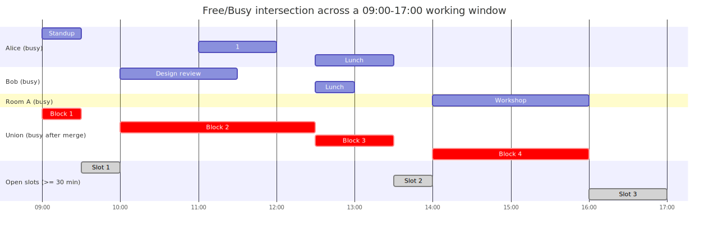
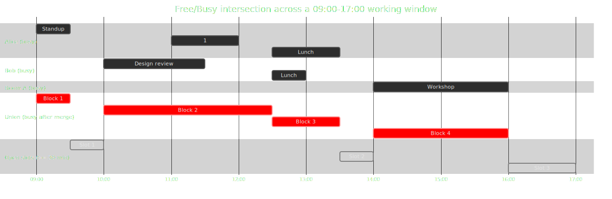

# Design Google Calendar

A planet-scale calendar is three coupled problems wearing one product skin: **temporal data modelling** (events, recurrence rules, exceptions), **timezone arithmetic** (the same event at the right local time across DST boundaries and a moving user base), and **availability computation** (finding meeting slots across many calendars in tens of milliseconds). This article designs a system around those three axes, leaning on the iCalendar family of RFCs ([RFC 5545](https://datatracker.ietf.org/doc/html/rfc5545), [5546](https://datatracker.ietf.org/doc/html/rfc5546), [6047](https://datatracker.ietf.org/doc/html/rfc6047), [4791](https://datatracker.ietf.org/doc/html/rfc4791), [6638](https://datatracker.ietf.org/doc/html/rfc6638), [6578](https://datatracker.ietf.org/doc/html/rfc6578)) and on the publicly documented behaviour of the [Google Calendar API](https://developers.google.com/workspace/calendar/api).




## Mental model

Three concepts carry the rest of the article:

- **Recurrence master vs. instance.** A recurring series is one row carrying an [RRULE](https://datatracker.ietf.org/doc/html/rfc5545#section-3.8.5.3) (e.g. `FREQ=WEEKLY;BYDAY=MO,WE,FR`) plus `DTSTART;TZID=…`. An *instance* is one occurrence of that series at a concrete moment. Instances are usually computed, not stored — except where the user has overridden one (an *exception*), in which case it lives as its own row keyed by the master's id and the original start time. This is exactly how the Google Calendar API exposes recurring events: instances carry `recurringEventId` and `originalStartTime`, and a deleted occurrence appears as `status: "cancelled"` rather than as an `EXDATE` on the master.[^gcal-recurring]
- **Local time + named TZID, not UTC.** A "9 AM daily standup" is a *local-time* recurrence. RFC 5545 §3.3.5 stores `DATE-TIME` values with a `TZID` parameter (a name from the [IANA Time Zone Database](https://www.iana.org/time-zones)) and resolves UTC offset at render time using the `VTIMEZONE` rules. Storing the start as a UTC instant silently breaks every recurring event the moment its DST rule fires.
- **Sync-token, not poll.** CalDAV and the Google Calendar API both expose monotonic sync-tokens ([RFC 6578](https://datatracker.ietf.org/doc/html/rfc6578)) so a client can ask "what changed since state *X*?" instead of refetching the whole calendar. When the server can no longer answer that question — token aged out, ACL changed, calendar reindexed — it returns `410 Gone` and the client must do a full sync.[^gcal-sync]

The rest of the article is a tour of how those three primitives drive the architecture, the API, the storage layout, and the failure modes.

## Requirements

### Functional requirements

| Feature                                          | Priority | Scope        |
| ------------------------------------------------ | -------- | ------------ |
| Single events (CRUD)                             | Core     | Full         |
| Recurring events (RRULE)                         | Core     | Full         |
| Event exceptions (cancel/modify single instance) | Core     | Full         |
| Timezone handling with DST                       | Core     | Full         |
| Meeting invitations (RSVP, iTIP/iMIP)            | Core     | Full         |
| Free/busy queries                                | Core     | Full         |
| Calendar sharing and delegation                  | Core     | Full         |
| Reminders and notifications (VALARM)             | Core     | Full         |
| Multi-client sync (CalDAV)                       | Core     | Full         |
| Calendar search                                  | High     | Full         |
| Meeting room/resource booking                    | High     | Overview     |
| Video conferencing integration                   | Medium   | Brief        |
| Task management (VTODO)                          | Low      | Out of scope |

### Non-functional requirements

| Requirement                    | Target          | Rationale                                                   |
| ------------------------------ | --------------- | ----------------------------------------------------------- |
| Availability                   | 99.99%          | Calendar access is mission-critical for business operations |
| Read latency (calendar view)   | p99 < 200 ms    | Month view may expand hundreds of recurring events          |
| Write latency (event creation) | p99 < 500 ms    | Acceptable for user-initiated actions                       |
| Sync latency                   | < 5 s           | Changes should propagate across devices quickly             |
| Data consistency               | Eventual (< 5s) | Strong consistency not required for calendar data           |
| Data retention                 | 10+ years       | Historical calendar data has legal/compliance value         |

### Scale estimation

These numbers are illustrative — Google does not publish exact Calendar MAU — but they are the right order of magnitude for sizing a planet-scale design.

**Users**

- MAU: 500 M (Workspace + consumer Gmail).
- DAU: 100 M.
- Peak concurrent: ~10 M (10% of DAU).

**Events**

- Average per user: 50 active recurring + 200 single events.
- Total event records: 500 M × 250 ≈ **125 B logical instances** but only ≈ **25 B master rows** because we store recurrence rules, not expansions.

**Traffic**

- Calendar loads: 100 M DAU × 10/day ≈ **12 K RPS**.
- Event writes: 100 M DAU × 2/day ≈ **2.3 K RPS**.
- Free/busy queries: 100 M DAU × 0.5/day ≈ **580 RPS**.
- 3× peak multiplier → ~36 K read RPS, ~7 K write RPS.

**Storage**

- Master row ≈ 2 KB (metadata, description, RRULE, attendees).
- 25 B × 2 KB ≈ 50 TB primary, ~200 TB with indexes, replicas, and history.

## Recurrence storage: RRULE-only, instances-only, or hybrid

There are three defensible strategies. The article picks the third; the trade-off table below is the reason.

### Path A — RRULE-centric (store rules, expand on read)

- Store only the recurrence rule on the master.
- Expand instances dynamically when a query asks for a date range.
- Cache expansion results in Redis for hot calendars.

**Pros**: minimal storage; series updates propagate instantly; supports infinite recurrence naturally.
**Cons**: CPU-heavy for complex RRULEs; slow over long ranges; exception handling adds query complexity.
Open-source CalDAV servers (Radicale, DAViCal) lean here because storage cost dominates for personal calendars.

### Path B — instance-centric (materialize all)

- Pre-expand every instance into a separate table.
- Series modifications fan out to thousands of rows.
- Range queries become a single B-tree scan.

**Pros**: O(1)-shaped range queries, simple free/busy aggregation, exception is just a row with overrides.
**Cons**: storage explosion (a daily event for 10 years = 3,650 rows), expensive series updates, no natural infinite recurrence. Microsoft Exchange historically takes this path because corporate scheduling latency dominates.

### Path C — hybrid (chosen)

- Store recurrence rules on the master.
- Materialize instances for a rolling window (typically 30–90 days).
- Expand dynamically beyond the window.
- Refresh the materialized window with a nightly background job.

**Pros**: fast queries inside the window, bounded storage per series, infinite recurrence still works, series updates only touch the window.
**Cons**: two code paths; staleness possible if the background refresher lags.

### Path comparison

| Factor              | Path A (RRULE)     | Path B (instance)     | Path C (hybrid)    |
| ------------------- | ------------------ | --------------------- | ------------------ |
| Storage             | Minimal            | High                  | Moderate           |
| Read latency        | High (expansion)   | Low                   | Low within window  |
| Write complexity    | Low                | High (batch updates)  | Moderate           |
| Infinite recurrence | Yes                | No                    | Yes                |
| Free/busy speed     | Slow               | Fast                  | Fast within window |
| Best for            | Personal calendars | Enterprise scheduling | General purpose    |




The hybrid model fits the realistic workload mix: most reads are "this week / this month" inside the window, and the long tail of "show me everything in 2031" can absorb the cost of dynamic expansion.

## High-level design

### Service responsibilities

#### Event service

CRUD for event masters and exceptions:

- Create / update / delete single events.
- Create / update / delete recurring series (stores RRULE + EXDATE/RDATE).
- Create exception rows (modified or cancelled occurrences).
- Range queries: hits the materialized window directly; calls the recurrence service for ranges beyond.

#### Recurrence service

Expands RRULE strings into instances per [RFC 5545 §3.8.5.3](https://datatracker.ietf.org/doc/html/rfc5545#section-3.8.5.3):

- Parse the RRULE.
- Generate occurrences in the requested range, in the master's TZID.
- Apply EXDATE (exclusions) and RDATE (additions).
- Merge with exception rows from Postgres.
- Cache expansions in Redis (TTL ≈ 1 h for hot series).

#### Scheduling service

Meeting coordination:

- Aggregate free/busy across attendees and resources.
- Find available slots within a working-hours window.
- Send invitations as iTIP `REQUEST` messages ([RFC 5546 §3.2.2](https://datatracker.ietf.org/doc/html/rfc5546#section-3.2.2)).
- Process RSVPs as iTIP `REPLY` messages.
- Resource booking (rooms, equipment).

#### Sync service

Multi-client synchronisation:

- Implement CalDAV ([RFC 4791](https://datatracker.ietf.org/doc/html/rfc4791)) and the CalDAV scheduling extensions ([RFC 6638](https://datatracker.ietf.org/doc/html/rfc6638)).
- Maintain monotonic sync-tokens per calendar via the WebDAV `DAV:sync-collection` report ([RFC 6578](https://datatracker.ietf.org/doc/html/rfc6578)).
- Push real-time updates over WebSocket / FCM / APNs.
- Detect and surface conflicts.

#### Notification service

Reminder and alert delivery:

- Schedule reminders from `VALARM` properties.
- Deliver via push, email, or SMS.
- Apply timezone-aware fan-out (a 9 AM local reminder for an event hops timezones with the user).
- Batch and deduplicate at delivery time.

### Create a recurring event


### Query a calendar view


## API design

The REST surface mirrors the Google Calendar API closely so clients are familiar; the underlying mechanics map 1:1 to iCalendar primitives.

### Event resource

#### Create event

`POST /api/v1/calendars/{calendarId}/events`

```json title="POST /events request body" collapse={1-3, 29-35}
// Headers
Authorization: Bearer {access_token}
Content-Type: application/json

// Request body
{
  "summary": "Weekly Team Standup",
  "description": "Discuss blockers and priorities",
  "start": {
    "dateTime": "2026-01-15T09:00:00",
    "timeZone": "America/New_York"
  },
  "end": {
    "dateTime": "2026-01-15T09:30:00",
    "timeZone": "America/New_York"
  },
  "recurrence": ["RRULE:FREQ=WEEKLY;BYDAY=MO,WE,FR"],
  "attendees": [
    { "email": "alice@example.com" },
    { "email": "bob@example.com", "optional": true }
  ],
  "reminders": {
    "useDefault": false,
    "overrides": [
      { "method": "popup", "minutes": 10 },
      { "method": "email", "minutes": 60 }
    ]
  },
  "conferenceData": {
    "createRequest": { "requestId": "unique-request-id" }
  },
  // conferenceData maps onto the iCalendar CONFERENCE property
  // standardised in RFC 7986 §5.11 — useful for cross-vendor interop.
  "visibility": "default",
  "transparency": "opaque"
}
```

`201 Created` returns the canonical resource (id, ETag, server-resolved offsets, conference link, etc.). The shape is documented in the [Google Events resource reference](https://developers.google.com/workspace/calendar/api/v3/reference/events).

**Error responses**

- `400 Bad Request` — invalid RRULE syntax, missing required fields.
- `401 Unauthorized` — missing or invalid auth token.
- `403 Forbidden` — no write access to calendar.
- `409 Conflict` — strict-mode collision with an existing event.
- `429 Too Many Requests` — rate limit exceeded.

**Rate limits**: 600 requests / minute / user, 10,000 requests / minute / project (mirroring Google's published quotas).

#### Query events

`GET /api/v1/calendars/{calendarId}/events`

| Parameter      | Type    | Description                                           |
| -------------- | ------- | ----------------------------------------------------- |
| `timeMin`      | ISO8601 | Lower bound (inclusive) for event end time            |
| `timeMax`      | ISO8601 | Upper bound (exclusive) for event start time          |
| `singleEvents` | boolean | If `true`, expand recurring events into instances     |
| `orderBy`      | string  | `startTime` (requires `singleEvents=true`) or `updated` |
| `maxResults`   | integer | Default 250, max 2,500                                |
| `pageToken`    | string  | Pagination cursor                                     |
| `syncToken`    | string  | Token from previous sync for incremental updates      |
| `showDeleted`  | boolean | Include cancelled events (required for sync)          |

**Why cursor-based, not offset-based**: calendar data churns constantly, so offset pagination silently skips or duplicates rows when the underlying set changes between pages. Sync tokens additionally enable incremental sync — the client gets only changes since the previous token.

**Sync flow**

1. Initial full sync: `GET /events?timeMin=…&timeMax=…` → returns `nextSyncToken`.
2. Incremental sync: `GET /events?syncToken={token}&showDeleted=true` → returns changed items + new `nextSyncToken`.
3. If the token is no longer valid (`410 Gone`): wipe local state and re-do the initial full sync. The Google Calendar API does not document a fixed expiration; tokens may also be invalidated by ACL changes or server-side reindexing,[^gcal-sync] so clients must always be ready to recover.

#### Modify a single instance of a recurring event

`PUT /api/v1/calendars/{calendarId}/events/{recurringEventId}/instances/{instanceId}`

This creates an **exception** that overrides one occurrence:

```json title="PUT instance override"
{
  "start": { "dateTime": "2026-01-17T10:00:00", "timeZone": "America/New_York" },
  "end":   { "dateTime": "2026-01-17T10:30:00", "timeZone": "America/New_York" }
}
```

The `instanceId` encodes the original start time (e.g. `abc123_20260117T140000Z`).

**How exceptions are stored.** The exception is a separate row linked to the master via `recurring_event_id` (a.k.a. `recurringEventId`) and pinned to the `original_start_time`. That gives three properties at once:

- the modified instance is queryable by its new time;
- deleting the exception reverts to the original time;
- a deleted occurrence is just an exception with `status = 'cancelled'` — no `EXDATE` mutation on the master.[^gcal-recurring]

### Free/busy query

`POST /api/v1/freeBusy`

```json title="freeBusy request"
{
  "timeMin": "2026-01-15T00:00:00Z",
  "timeMax": "2026-01-22T00:00:00Z",
  "items": [
    { "id": "alice@example.com" },
    { "id": "bob@example.com" },
    { "id": "conference-room-a@resource.example.com" }
  ]
}
```

Response (only the busy intervals — never event details):

```json title="freeBusy response" collapse={1-3, 23-30}
{
  "kind": "calendar#freeBusy",
  "timeMin": "2026-01-15T00:00:00Z",
  "timeMax": "2026-01-22T00:00:00Z",
  "calendars": {
    "alice@example.com": {
      "busy": [
        { "start": "2026-01-15T14:00:00Z", "end": "2026-01-15T15:00:00Z" },
        { "start": "2026-01-16T09:00:00Z", "end": "2026-01-16T10:00:00Z" }
      ]
    },
    "bob@example.com": {
      "busy": [{ "start": "2026-01-15T14:00:00Z", "end": "2026-01-15T14:30:00Z" }]
    },
    "conference-room-a@resource.example.com": {
      "busy": [{ "start": "2026-01-15T10:00:00Z", "end": "2026-01-15T11:00:00Z" }],
      "errors": []
    }
  },
  "groups": {}
}
```

**Privacy.** Free/busy never leaks event content. The `transparency` field on the underlying event controls whether the time even appears as busy: `opaque` (default) blocks the time, `transparent` does not (e.g. an all-day "working from home" marker). This mirrors the CalDAV `CALDAV:free-busy-query` REPORT ([RFC 4791 §7.10](https://datatracker.ietf.org/doc/html/rfc4791#section-7.10)) which returns `VFREEBUSY` components only.

## Data modeling


### Event schema

PostgreSQL is the primary store: ACID writes, range queries, and a rich type system are the ergonomic fit; the recurrence machinery sits in application code, not the database.

```sql title="events.sql" collapse={1-3, 45-55}
-- Users and calendars (simplified)
CREATE TABLE users (
    id UUID PRIMARY KEY DEFAULT gen_random_uuid(),
    email VARCHAR(255) UNIQUE NOT NULL,
    timezone VARCHAR(50) DEFAULT 'UTC',
    created_at TIMESTAMPTZ DEFAULT NOW()
);

CREATE TABLE calendars (
    id UUID PRIMARY KEY DEFAULT gen_random_uuid(),
    owner_id UUID NOT NULL REFERENCES users(id),
    name VARCHAR(255) NOT NULL,
    timezone VARCHAR(50) NOT NULL,
    sync_token BIGINT DEFAULT 0,
    created_at TIMESTAMPTZ DEFAULT NOW()
);

-- Event master table (single + recurring)
CREATE TABLE events (
    id UUID PRIMARY KEY DEFAULT gen_random_uuid(),
    calendar_id UUID NOT NULL REFERENCES calendars(id),
    ical_uid VARCHAR(255) NOT NULL,  -- RFC 5545 UID for iCal interop
    summary VARCHAR(500),
    description TEXT,
    location VARCHAR(500),

    -- Local time + named TZID, per RFC 5545 §3.3.5
    start_datetime TIMESTAMP NOT NULL,
    end_datetime TIMESTAMP NOT NULL,
    start_timezone VARCHAR(50) NOT NULL,
    end_timezone VARCHAR(50) NOT NULL,
    is_all_day BOOLEAN DEFAULT FALSE,

    -- Recurrence (NULL for single events)
    recurrence_rule TEXT,            -- RRULE string
    recurrence_exceptions TEXT[],    -- EXDATE
    recurrence_additions TEXT[],     -- RDATE

    -- Metadata
    status VARCHAR(20) DEFAULT 'confirmed',
    visibility VARCHAR(20) DEFAULT 'default',
    transparency VARCHAR(20) DEFAULT 'opaque',
    sequence INTEGER DEFAULT 0,      -- iCal SEQUENCE (incremented on update)

    organizer_email VARCHAR(255),
    creator_email VARCHAR(255),

    created_at TIMESTAMPTZ DEFAULT NOW(),
    updated_at TIMESTAMPTZ DEFAULT NOW(),
    deleted_at TIMESTAMPTZ,          -- soft delete

    UNIQUE(calendar_id, ical_uid)
);

CREATE INDEX idx_events_calendar_time ON events(calendar_id, start_datetime, end_datetime)
    WHERE deleted_at IS NULL;
CREATE INDEX idx_events_updated ON events(calendar_id, updated_at)
    WHERE deleted_at IS NULL;
CREATE INDEX idx_events_recurring ON events(calendar_id)
    WHERE recurrence_rule IS NOT NULL AND deleted_at IS NULL;
```

**Why local time + TZID instead of UTC**

1. **DST correctness.** A "9 AM daily standup" must stay at 9 AM local time; storing UTC silently shifts it by an hour twice a year.
2. **RRULE semantics.** `BYDAY=MO` means Monday in the event's timezone, not UTC Monday — which differs in the western Pacific.
3. **Display simplicity.** No round-trip conversion when rendering in the organizer's zone.

The trade-off is that cross-timezone range queries need conversion. The materialized instances table stores computed UTC times so range scans can use a B-tree index without per-row conversion.

### Materialized instances

```sql title="event_instances.sql" collapse={1-3, 30-35}
-- Materialized instances inside the rolling 90-day window
CREATE TABLE event_instances (
    id UUID PRIMARY KEY DEFAULT gen_random_uuid(),
    event_id UUID NOT NULL REFERENCES events(id) ON DELETE CASCADE,
    calendar_id UUID NOT NULL REFERENCES calendars(id),

    instance_start_utc TIMESTAMPTZ NOT NULL,
    instance_end_utc   TIMESTAMPTZ NOT NULL,

    -- Original occurrence date — used to match exceptions to the master
    original_start_utc TIMESTAMPTZ NOT NULL,

    -- NULL fields inherit from the master
    summary_override     VARCHAR(500),
    description_override TEXT,
    location_override    VARCHAR(500),
    start_override       TIMESTAMP,
    end_override         TIMESTAMP,
    timezone_override    VARCHAR(50),

    status        VARCHAR(20) NOT NULL DEFAULT 'confirmed',  -- confirmed | cancelled
    is_exception  BOOLEAN     DEFAULT FALSE,

    created_at TIMESTAMPTZ DEFAULT NOW()
);

CREATE INDEX idx_instances_calendar_range
    ON event_instances(calendar_id, instance_start_utc, instance_end_utc)
    WHERE status != 'cancelled';

CREATE INDEX idx_instances_freebusy
    ON event_instances(calendar_id, instance_start_utc, instance_end_utc)
    WHERE status = 'confirmed';

CREATE INDEX idx_instances_exception
    ON event_instances(event_id, original_start_utc)
    WHERE is_exception = TRUE;
```

### Attendees and RSVPs

```sql title="event_attendees.sql" collapse={1-3, 25-30}
CREATE TABLE event_attendees (
    id UUID PRIMARY KEY DEFAULT gen_random_uuid(),
    event_id UUID NOT NULL REFERENCES events(id) ON DELETE CASCADE,
    email VARCHAR(255) NOT NULL,
    display_name VARCHAR(255),

    -- RFC 5545 PARTSTAT
    response_status VARCHAR(20) DEFAULT 'needsAction',
    -- needsAction | declined | tentative | accepted

    is_organizer BOOLEAN DEFAULT FALSE,
    is_optional  BOOLEAN DEFAULT FALSE,
    is_resource  BOOLEAN DEFAULT FALSE,  -- conference room, equipment

    response_comment TEXT,
    responded_at     TIMESTAMPTZ,

    UNIQUE(event_id, email)
);

CREATE INDEX idx_attendees_email ON event_attendees(email, event_id);
CREATE INDEX idx_attendees_event ON event_attendees(event_id);
```

### Database selection matrix

| Data type            | Store                 | Why                                               |
| -------------------- | --------------------- | ------------------------------------------------- |
| Events and instances | PostgreSQL            | ACID, range queries, rich type system             |
| Free/busy cache      | Redis sorted sets     | Sub-ms latency, TTL, range queries                |
| Full-text search     | Elasticsearch         | Event content + attendee search                   |
| Attachments          | Object storage (S3)   | Large files, CDN delivery                         |
| Notification queue   | Redis Streams / Kafka | High throughput, at-least-once delivery           |
| Sync tokens          | PostgreSQL            | Transactional consistency with the events table   |

### Sharding

**Shard key**: `calendar_id`.

- Co-locates all events for a calendar — most queries filter by calendar.
- Calendar view queries hit a single shard.
- Cross-calendar queries (free/busy) become scatter-gather, but they are an order of magnitude rarer than per-calendar reads.

Hash-based sharding with 256 logical shards distributed across physical nodes; consistent hashing for rebalancing.

## Low-level design

### Recurrence expansion

The recurrence service expands RRULE strings into concrete instances per [RFC 5545 §3.8.5.3](https://datatracker.ietf.org/doc/html/rfc5545#section-3.8.5.3). The algorithm itself is well-specified; the cost lives in the edge cases (DST, leap day, byday-with-monthday). The pipeline below shows how the master's RRULE, its EXDATE / RDATE properties, and any exception rows collapse into the rendered series for a query.




```typescript title="expand-recurrence.ts" collapse={1-10, 45-60}
import { RRule, RRuleSet } from "rrule"

interface RecurrenceExpansionRequest {
  rruleString: string  // e.g. "FREQ=WEEKLY;BYDAY=MO,WE,FR"
  dtstart: Date        // series start in local time
  timezone: string     // IANA TZID
  rangeStart: Date     // query range start (UTC)
  rangeEnd: Date       // query range end (UTC)
  exdates?: Date[]
  rdates?: Date[]
}

function expandRecurrence(req: RecurrenceExpansionRequest): Date[] {
  const rule = RRule.fromString(req.rruleString)
  const set = new RRuleSet()
  set.rrule(rule)

  for (const exdate of req.exdates ?? []) set.exdate(exdate)
  for (const rdate of req.rdates ?? []) set.rdate(rdate)

  // CRITICAL: between() expands in the rule's timezone for DST correctness.
  return set.between(req.rangeStart, req.rangeEnd, true)
}

const instances = expandRecurrence({
  rruleString: "FREQ=WEEKLY;BYDAY=MO,WE,FR",
  dtstart: new Date("2026-01-15T09:00:00"),
  timezone: "America/New_York",
  rangeStart: new Date("2026-01-01T00:00:00Z"),
  rangeEnd: new Date("2026-03-31T23:59:59Z"),
  exdates: [new Date("2026-01-17T09:00:00")],
})
// → [Jan 15, Jan 19, Jan 22, Jan 24, Jan 26, ...]
```

#### DST edge cases

> [!IMPORTANT]
> The behaviour below is normative in [RFC 5545 §3.3.5](https://datatracker.ietf.org/doc/html/rfc5545#section-3.3.5) and was clarified by [Errata ID 4271](https://www.rfc-editor.org/errata/rfc5545). A library that does not implement it (or a database that stores UTC instead of local + TZID) will silently produce wrong instance times during DST transitions.

**Spring forward (the missing hour, e.g. 02:30 on the second Sunday in March in `America/New_York`)**

Per the spec, a `DATE-TIME` whose local representation falls in the gap is interpreted using the UTC offset that was in effect *immediately before* the gap. So `TZID=America/New_York:20260308T023000` is interpreted at -05:00 (EST), which is `07:30 UTC` — the same UTC instant as `03:30` -04:00 (EDT). The visible local time the user sees post-transition is 03:30, not 02:30.

```typescript title="adjust-for-dst.ts" collapse={1-5}
function adjustForDST(localTime: Date, timezone: string): Date {
  const { DateTime } = require("luxon")
  const dt = DateTime.fromJSDate(localTime, { zone: timezone })

  if (!dt.isValid && dt.invalidReason === "time zone offset transition") {
    // RFC 5545 §3.3.5: interpret as if the pre-transition offset still applied.
    return dt.plus({ hours: 1 }).toJSDate()
  }
  return localTime
}
```

**Fall back (the duplicated hour, e.g. 01:30 occurs twice in November)**

RFC 5545 §3.3.5 prescribes that an ambiguous local time refers to the **first** occurrence — the pre-transition one (DST, -04:00 in `America/New_York`).

**Operational consequence.** Always carry both `DATE-TIME` and `TZID` through the system. A `VTIMEZONE` reference points at the IANA database, which encodes the full historical and future DST rule set. Libraries — Luxon, date-fns-tz, moment-timezone, python-dateutil — implement these rules correctly only because they consume `tzdata`. Keep `tzdata` upgrades in your release pipeline; a stale tzdata is the most common reason a calendar drifts after a country changes its DST rules ([recent example: Egypt restoring DST in 2023](https://mm.icann.org/pipermail/tz-announce/2023-April/000079.html)).

### Free/busy aggregation

Free/busy aggregation is the hot path of meeting scheduling. The latency target — under 100 ms for 10 attendees over a week — rules out per-request expansion of every attendee's calendar. Pre-computed busy intervals in Redis sorted sets, scored by start timestamp, give the right shape: range scans are O(log N + M).

```typescript title="freebusy.ts" collapse={1-8, 40-50}
import { Redis } from "ioredis"

interface BusyInterval {
  start: number  // unix seconds
  end: number
  eventId?: string  // only for the calendar owner
}

// Storage: ZSET freebusy:{calendarId}, score = start, member = JSON({ start, end, eventId })

async function updateFreeBusy(redis: Redis, calendarId: string, instances: EventInstance[]): Promise<void> {
  const key = `freebusy:${calendarId}`
  const pipeline = redis.pipeline()

  const rangeStart = Math.min(...instances.map((i) => i.startUtc.getTime() / 1000))
  const rangeEnd   = Math.max(...instances.map((i) => i.endUtc.getTime() / 1000))
  pipeline.zremrangebyscore(key, rangeStart, rangeEnd)

  for (const instance of instances) {
    if (instance.status === "confirmed" && instance.transparency === "opaque") {
      const interval: BusyInterval = {
        start: instance.startUtc.getTime() / 1000,
        end:   instance.endUtc.getTime() / 1000,
        eventId: instance.eventId,
      }
      pipeline.zadd(key, interval.start, JSON.stringify(interval))
    }
  }

  pipeline.expire(key, 7 * 24 * 60 * 60)
  await pipeline.exec()
}

async function queryFreeBusy(
  redis: Redis,
  calendarId: string,
  rangeStart: Date,
  rangeEnd: Date,
): Promise<BusyInterval[]> {
  const key = `freebusy:${calendarId}`
  const start = rangeStart.getTime() / 1000
  const end   = rangeEnd.getTime() / 1000

  const members = await redis.zrangebyscore(key, start, end)
  return members
    .map((m) => JSON.parse(m) as BusyInterval)
    .filter((i) => i.end > start)  // exclude intervals that ended before the range
}
```

#### Finding available slots

A standard interval-merge then gap-scan: union every attendee's busy intervals, sort by start, fold overlaps, and emit the gaps that are at least the requested duration. The diagram below shows the same algorithm visually for three calendars over a working window.




```typescript title="find-slots.ts" collapse={1-5, 50-60}
interface TimeSlot { start: Date; end: Date }

function findAvailableSlots(
  busyByAttendee: Map<string, BusyInterval[]>,
  rangeStart: Date,
  rangeEnd: Date,
  durationMinutes: number,
  workingHours?: { start: number; end: number },
): TimeSlot[] {
  const all: BusyInterval[] = []
  for (const intervals of busyByAttendee.values()) all.push(...intervals)

  all.sort((a, b) => a.start - b.start)

  // Merge overlapping intervals
  const merged: BusyInterval[] = []
  for (const iv of all) {
    const last = merged[merged.length - 1]
    if (!last || last.end < iv.start) merged.push({ ...iv })
    else last.end = Math.max(last.end, iv.end)
  }

  const durationSec = durationMinutes * 60
  const free: TimeSlot[] = []
  let cursor = rangeStart.getTime() / 1000

  for (const busy of merged) {
    if (busy.start - cursor >= durationSec) {
      free.push({ start: new Date(cursor * 1000), end: new Date(busy.start * 1000) })
    }
    cursor = Math.max(cursor, busy.end)
  }

  const endSec = rangeEnd.getTime() / 1000
  if (endSec - cursor >= durationSec) {
    free.push({ start: new Date(cursor * 1000), end: rangeEnd })
  }

  if (workingHours) {
    return free.filter((slot) => {
      const h = slot.start.getHours()
      return h >= workingHours.start && h < workingHours.end
    })
  }
  return free
}
```

**Complexity**: `O(N log N)` for the sort, `O(N)` for the merge, where `N` is the total busy interval count across all attendees.

### Sync token implementation

CalDAV's incremental sync is built on the WebDAV `DAV:sync-collection` REPORT ([RFC 6578 §3](https://datatracker.ietf.org/doc/html/rfc6578#section-3)): the client sends its last sync-token, the server returns the changed members plus a fresh token. The semantics of the token are deliberately opaque — the server is free to use a monotonic integer, an LSN, or any other state identifier the implementation can resolve back to a change set.

```sql title="calendar_changes.sql" collapse={1-5}
CREATE TABLE calendar_changes (
    id BIGSERIAL PRIMARY KEY,
    calendar_id UUID NOT NULL REFERENCES calendars(id),
    event_id UUID NOT NULL,
    change_type VARCHAR(10) NOT NULL,   -- 'created' | 'updated' | 'deleted'
    changed_at TIMESTAMPTZ DEFAULT NOW(),
    sync_token BIGINT NOT NULL          -- matches calendars.sync_token at change time
);

CREATE INDEX idx_changes_sync ON calendar_changes(calendar_id, sync_token);

CREATE OR REPLACE FUNCTION record_event_change()
RETURNS TRIGGER AS $$
BEGIN
  UPDATE calendars SET sync_token = sync_token + 1 WHERE id = NEW.calendar_id;
  INSERT INTO calendar_changes (calendar_id, event_id, change_type, sync_token)
  SELECT NEW.calendar_id, NEW.id, TG_OP, sync_token
  FROM calendars WHERE id = NEW.calendar_id;
  RETURN NEW;
END;
$$ LANGUAGE plpgsql;
```

**Sync flow**

1. **Initial sync**: client gets all events + current `syncToken` (e.g. `15`).
2. **Incremental sync**: client sends `syncToken=15`, server returns rows where `sync_token > 15` plus the new token (e.g. `23`).
3. **Token invalidation** (`410 Gone`): the change-log entry has been compacted, the calendar ACL changed, or the server simply chose to invalidate. Client wipes its local state and does step 1 again. Google's documentation does not promise a fixed token lifetime — clients must always handle `410`.[^gcal-sync]

For server-to-server consumers (a CalDAV-style integration, a downstream automation), the Google Calendar API also exposes a **watch + webhook** model: a `POST .../events/watch` registers a notification channel with an HTTPS callback URL; when a change occurs, Google sends a signal-only `POST` carrying `X-Goog-Resource-State` and `X-Goog-Resource-URI` headers but **no event body**, and the consumer is expected to immediately call `events.list?syncToken=…` to fetch the actual delta.[^gcal-watch] Channels expire (default 1 week) and must be renewed; reliability is best-effort, so a low-frequency periodic full sync remains the safety net.

### Notification fan-out

A single change must reach many surfaces — open browser tabs, iOS / Android apps in background, third-party watch channels, and (for invitations) external mailboxes — without each one polling. The pattern is the same one used for any large fan-out write: commit, publish to a durable change topic, and let a fan-out worker resolve the per-attendee subscription set against a registry of live channels.


Two design choices fall out of this shape:

- **Signal, don't ship payloads.** The push carries enough metadata for the client to ask "what changed?" but never the event body. That keeps payloads tiny, sidesteps end-to-end encryption concerns on third-party push infrastructure, and keeps the source of truth on the server (one sync-token-driven path, not two divergent representations).
- **Idempotent reconcile, at-least-once delivery.** WebSockets reconnect, FCM/APNs retry, watch channels duplicate. The reconciliation path is a `GET /events?syncToken=…` whose result is purely a function of the server-side change log, so duplicate signals collapse to a single no-op fetch.

### Invitation workflow (iTIP / iMIP)

When the organiser invites attendees, the system emits an iTIP `REQUEST` ([RFC 5546 §3.2.2](https://datatracker.ietf.org/doc/html/rfc5546#section-3.2.2)) wrapped in an iMIP-formatted email ([RFC 6047](https://datatracker.ietf.org/doc/html/rfc6047)).


The iMIP wire format is a multipart MIME message with a `text/calendar; method=REQUEST` part:

```text title="invite.eml"
Content-Type: multipart/alternative; boundary="boundary"

--boundary
Content-Type: text/plain

You've been invited to: Weekly Team Standup
When: Monday, January 15, 2026 9:00 AM - 9:30 AM (EST)

--boundary
Content-Type: text/calendar; method=REQUEST

BEGIN:VCALENDAR
VERSION:2.0
METHOD:REQUEST
BEGIN:VEVENT
UID:abc123xyz@calendar.example.com
DTSTART;TZID=America/New_York:20260115T090000
DTEND;TZID=America/New_York:20260115T093000
SUMMARY:Weekly Team Standup
ORGANIZER:mailto:organizer@example.com
ATTENDEE;PARTSTAT=NEEDS-ACTION:mailto:attendee@example.com
END:VEVENT
END:VCALENDAR

--boundary--
```

A native CalDAV client takes a different path — the CalDAV scheduling extensions ([RFC 6638](https://datatracker.ietf.org/doc/html/rfc6638)) deliver `REQUEST` and `REPLY` server-side via inboxes/outboxes on each user's calendar home, avoiding the email round-trip entirely.

## Frontend considerations

### Calendar view performance

A month view with recurring events can show hundreds of instances. The win is virtualization plus range-buffered loading.

```typescript title="useCalendarEvents.ts" collapse={1-10, 35-45}
interface CalendarViewState {
  visibleRange: { start: Date; end: Date }
  loadedRanges: Array<{ start: Date; end: Date }>
  events: Map<string, CalendarEvent>
}

function useCalendarEvents(calendarId: string) {
  const [state, setState] = useState<CalendarViewState>({
    visibleRange: getCurrentWeek(),
    loadedRanges: [],
    events: new Map(),
  })

  useEffect(() => {
    const rangeToLoad = expandRange(state.visibleRange, { days: 7 })  // ±1 week buffer

    if (!isRangeCovered(rangeToLoad, state.loadedRanges)) {
      fetchEvents(calendarId, rangeToLoad).then((newEvents) => {
        setState((prev) => ({
          ...prev,
          loadedRanges: mergeRanges([...prev.loadedRanges, rangeToLoad]),
          events: new Map([...prev.events, ...newEvents.map((e) => [e.id, e])]),
        }))
      })
    }
  }, [state.visibleRange, calendarId])

  return state.events
}
```

Plus the usual list of cheap wins:

- Pass `singleEvents=true` so the server returns pre-expanded instances.
- Cache by date range — events inside a past range almost never change.
- Use `ETag` / `If-None-Match` for conditional refetches.
- Virtualize day cells in month view (render only visible weeks).

### Real-time updates

WebSocket for active browser tabs, push (FCM/APNs) for backgrounded clients. Both deliver the same change envelope: `{ type, eventId, ... }` plus a fresh sync-token so the client can reconcile.

```typescript title="useCalendarSync.ts" collapse={1-5, 25-35}
const useCalendarSync = (calendarId: string) => {
  const queryClient = useQueryClient()

  useEffect(() => {
    const ws = new WebSocket(`wss://api.calendar.com/sync/${calendarId}`)

    ws.onmessage = (event) => {
      const change = JSON.parse(event.data)
      switch (change.type) {
        case "event.created":
        case "event.updated":
          queryClient.setQueryData(["events", calendarId], (old: CalendarEvent[]) =>
            upsertEvent(old, change.event),
          )
          break
        case "event.deleted":
          queryClient.setQueryData(["events", calendarId], (old: CalendarEvent[]) =>
            old.filter((e) => e.id !== change.eventId),
          )
          break
      }
    }

    return () => ws.close()
  }, [calendarId, queryClient])
}
```

### Timezone display

User expectations:

- Event times shown in the user's local timezone by default.
- Optional view in the event's original timezone.
- All-day events span the full day in any timezone — no conversion.

```typescript title="format-event-time.ts" collapse={1-5}
function formatEventTime(event: CalendarEvent, userTimezone: string): string {
  const { DateTime } = require("luxon")

  if (event.isAllDay) {
    return DateTime.fromISO(event.start.date).toLocaleString(DateTime.DATE_MED)
  }

  const start = DateTime.fromISO(event.start.dateTime, { zone: event.start.timeZone })
  const userStart = start.setZone(userTimezone)

  if (event.start.timeZone !== userTimezone) {
    return `${userStart.toLocaleString(DateTime.TIME_SIMPLE)} (${userStart.toFormat("ZZZZ")})`
  }

  return userStart.toLocaleString(DateTime.TIME_SIMPLE)
}
```

### Drag-and-drop rescheduling

Optimistic update with rollback for single events; for recurring events, *always* prompt for scope before issuing the mutation — "this event only", "this and following", or "all events".

```typescript title="handle-event-drop.ts" collapse={1-5, 30-40}
async function handleEventDrop(eventId: string, newStart: Date, newEnd: Date) {
  const previous = queryClient.getQueryData(["event", eventId])

  queryClient.setQueryData(["event", eventId], (old: CalendarEvent) => ({
    ...old,
    start: { dateTime: newStart.toISOString(), timeZone: old.start.timeZone },
    end:   { dateTime: newEnd.toISOString(),   timeZone: old.end.timeZone },
  }))

  try {
    await updateEvent(eventId, { start: newStart, end: newEnd })
  } catch (error) {
    queryClient.setQueryData(["event", eventId], previous)
    toast.error("Failed to reschedule event")
  }
}

function handleRecurringEventDrop(eventId: string, instanceDate: Date, newTime: Date) {
  showDialog({
    title: "Edit recurring event",
    options: [
      { label: "This event only",         action: () => updateInstance(eventId, instanceDate, newTime) },
      { label: "This and future events",  action: () => splitSeries(eventId, instanceDate, newTime) },
      { label: "All events",              action: () => updateSeries(eventId, newTime) },
    ],
  })
}
```

## Infrastructure design

### Cloud-agnostic shopping list

| Component        | Requirement              | Concrete options               |
| ---------------- | ------------------------ | ------------------------------ |
| Primary database | ACID, complex queries    | PostgreSQL, MySQL              |
| Cache            | Sub-ms reads, TTL        | Redis, Memcached               |
| Search           | Full-text, aggregations  | Elasticsearch, OpenSearch      |
| Message queue    | At-least-once, ordering  | Kafka, RabbitMQ, Redis Streams |
| Object storage   | Attachments, large files | S3-compatible (MinIO)          |
| Job scheduler    | Cron, delayed jobs       | Temporal, Celery, pg-boss      |

### AWS reference architecture


| Component          | AWS service       | Sizing                                    |
| ------------------ | ----------------- | ----------------------------------------- |
| API service        | ECS Fargate       | 2–50 tasks, 1 vCPU / 2 GB each            |
| Background workers | ECS Fargate Spot  | 5–20 tasks, Spot for cost                 |
| Primary database   | RDS PostgreSQL    | `db.r6g.xlarge`, Multi-AZ, 1 TB gp3       |
| Read replicas      | RDS read replicas | 2 replicas across AZs                     |
| Cache              | ElastiCache Redis | `cache.r6g.large`, 3-node cluster         |
| Search             | OpenSearch        | `m6g.large.search`, 3-node                |
| Message queue      | Amazon SQS / MSK  | SQS for simplicity, MSK for ordering      |
| Object storage     | S3 + CloudFront   | Intelligent-Tiering, CDN for attachments  |
| Notifications      | Lambda + SNS      | Push via FCM / APNs                       |

### Self-hosted alternatives

| Managed         | Self-hosted          | Trigger                                      |
| --------------- | -------------------- | -------------------------------------------- |
| RDS PostgreSQL  | PostgreSQL on EC2    | Cost at scale, specific extensions (pg_cron) |
| ElastiCache     | Redis on EC2         | Redis modules (RedisJSON, RediSearch)        |
| OpenSearch      | Elasticsearch on EC2 | Cost, specific plugins                       |
| MSK             | Kafka on EC2         | Cost at scale, Kafka Streams                 |

## Failure modes worth designing for

- **Sync-token invalidation storm.** A wide ACL change or a calendar reindex invalidates every active client at once. The recovery (full sync) is N× more expensive than incremental sync; protect the API tier with per-client backoff and cap concurrent full syncs per backend.
- **Hot recurring series.** A 5-minute standup with 200,000 attendees is one master row whose expansion is read by every attendee's calendar view. Cache the expansion at the recurrence service, not just at the event service.
- **Time-bomb RRULE.** A user can create `RRULE:FREQ=SECONDLY` (technically valid). Reject server-side if the resulting expansion in any window exceeds a hard cap (e.g. 10,000 instances).
- **Stale tzdata.** A country changes its DST rule; until your tzdata package is upgraded and your services restarted, recurring events drift. Bake tzdata refreshes into the release pipeline and add a startup-time assertion against the expected version.
- **Last-write-wins amnesia.** Two clients edit the same event offline; on reconnect, the later write silently overwrites the earlier one. Surface the conflict to the user (using the `SEQUENCE` and `LAST-MODIFIED` properties from RFC 5545) instead of swallowing it.

## Conclusion

The hybrid recurrence model — store rules, materialize a window, expand beyond it on read — keeps query latency bounded for the common case (this week / this month) while supporting infinite series cleanly. Three other choices carry their weight throughout the design:

1. **Local time + TZID storage** — events keep meaning across DST and time-zone-shifting users; UTC alone silently breaks recurring events.
2. **Sync tokens** — incremental sync is mandatory for CalDAV / mobile; clients must always handle `410 Gone` and full-sync recovery.
3. **Pre-computed free/busy in Redis** — sub-100 ms scheduling queries fall out of an interval-merge over sorted sets, not out of an on-demand expansion at query time.

What this design deliberately does *not* solve, and where the next iteration should go:

- **Real collaborative editing.** Last-write-wins with surfaced conflicts is the practical floor; CRDT-based collaborative editing of event properties is a real next step but a larger commitment.
- **Federated free/busy.** Cross-organisation availability needs the iSchedule extensions and additional privacy controls.
- **Smart scheduling.** Suggesting good meeting slots from attendee patterns is a separable ML/analytics problem layered on top of the data model.

## Appendix

### Prerequisites

- Distributed-systems fundamentals (CAP, eventual consistency).
- Database design (indexing, sharding, replication).
- REST API design.
- Basic understanding of timezone concepts (UTC, offsets, DST).

### Terminology

- **RRULE** — recurrence rule (RFC 5545 §3.8.5.3), e.g. `FREQ=WEEKLY;BYDAY=MO`.
- **EXDATE / RDATE** — exception / addition dates on a recurring series.
- **RECURRENCE-ID** — identifies which occurrence of a series an exception modifies.
- **iTIP** — iCalendar Transport-Independent Interoperability Protocol (RFC 5546): scheduling methods (`REQUEST`, `REPLY`, `CANCEL`).
- **iMIP** — iTIP over email (RFC 6047).
- **CalDAV** — calendar access on top of WebDAV (RFC 4791); scheduling extensions in RFC 6638.
- **Sync token** — opaque server state identifier for incremental sync (RFC 6578).
- **TZID** — IANA timezone name (e.g. `America/New_York`).

### Summary

- Recurring events live as RRULE-bearing master rows; instances are materialized for a rolling 30–90-day window and expanded on demand beyond it.
- Time is stored as local-time + named TZID per RFC 5545 §3.3.5; never raw UTC, or DST silently breaks every recurring event.
- Free/busy is a Redis sorted-set workload; an interval-merge over the union answers "find me a slot" in `O(N log N)`.
- Sync tokens (RFC 6578) make incremental sync cheap; clients must always handle `410 Gone` and re-do a full sync.
- iTIP / iMIP (RFC 5546 / 6047) deliver invitations interoperably across vendors; CalDAV scheduling (RFC 6638) is the server-side alternative.
- Sharding by `calendar_id` co-locates the per-calendar working set and keeps view queries on a single shard.

### References

- [RFC 5545 — iCalendar core object specification](https://datatracker.ietf.org/doc/html/rfc5545)
- [RFC 5545 errata (incl. ID 4271 — DST-gap clarification)](https://www.rfc-editor.org/errata/rfc5545)
- [RFC 5546 — iTIP](https://datatracker.ietf.org/doc/html/rfc5546)
- [RFC 6047 — iMIP](https://datatracker.ietf.org/doc/html/rfc6047)
- [RFC 4791 — CalDAV](https://datatracker.ietf.org/doc/html/rfc4791)
- [RFC 6638 — Scheduling extensions to CalDAV](https://datatracker.ietf.org/doc/html/rfc6638)
- [RFC 6578 — WebDAV collection synchronization](https://datatracker.ietf.org/doc/html/rfc6578)
- [RFC 7809 — CalDAV time zones by reference](https://datatracker.ietf.org/doc/html/rfc7809)
- [RFC 7986 — New properties for iCalendar (NAME, COLOR, IMAGE, REFRESH-INTERVAL, SOURCE, CONFERENCE)](https://datatracker.ietf.org/doc/html/rfc7986)
- [IANA Time Zone Database](https://www.iana.org/time-zones)
- [Google Calendar API — Synchronize resources efficiently](https://developers.google.com/workspace/calendar/api/guides/sync)
- [Google Calendar API — Push notifications (watch channels)](https://developers.google.com/workspace/calendar/api/guides/push)
- [Google Calendar API — Recurring events](https://developers.google.com/workspace/calendar/api/guides/recurringevents)
- [Google Calendar API — Events resource reference](https://developers.google.com/workspace/calendar/api/v3/reference/events)
- [rrule.js](https://github.com/jakubroztocil/rrule)

[^gcal-recurring]: Google Calendar API — [Recurring events](https://developers.google.com/workspace/calendar/api/guides/recurringevents). Cancelled occurrences are represented as instance rows with `status: "cancelled"` carrying `id`, `recurringEventId`, and `originalStartTime`, not as `EXDATE` entries on the master.
[^gcal-sync]: Google Calendar API — [Synchronize resources efficiently](https://developers.google.com/workspace/calendar/api/guides/sync). Sync tokens may be invalidated for several reasons including age and ACL changes; the API does not document a fixed lifetime, so clients must always be ready to handle `410 Gone` and re-do a full sync.
[^gcal-watch]: Google Calendar API — [Push notifications](https://developers.google.com/workspace/calendar/api/guides/push) and the [`Events: watch`](https://developers.google.com/workspace/calendar/api/v3/reference/events/watch) reference. Webhook deliveries carry `X-Goog-Resource-State` / `X-Goog-Resource-URI` but no event body; channels expire (default 1 week) and must be renewed.
