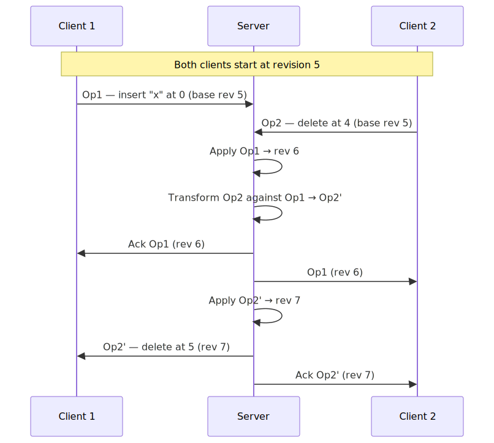
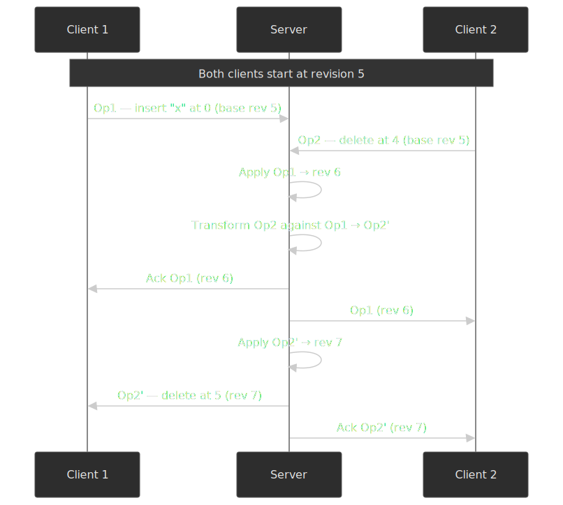
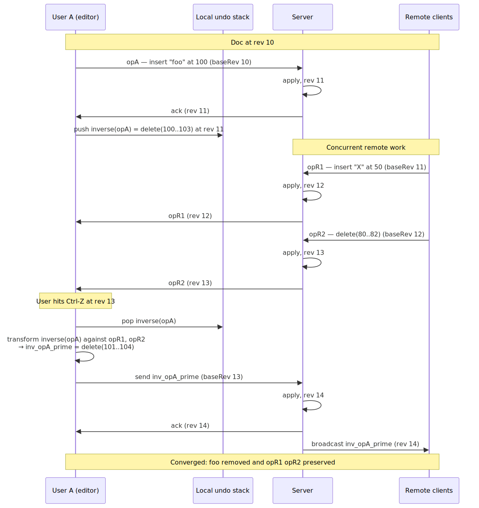
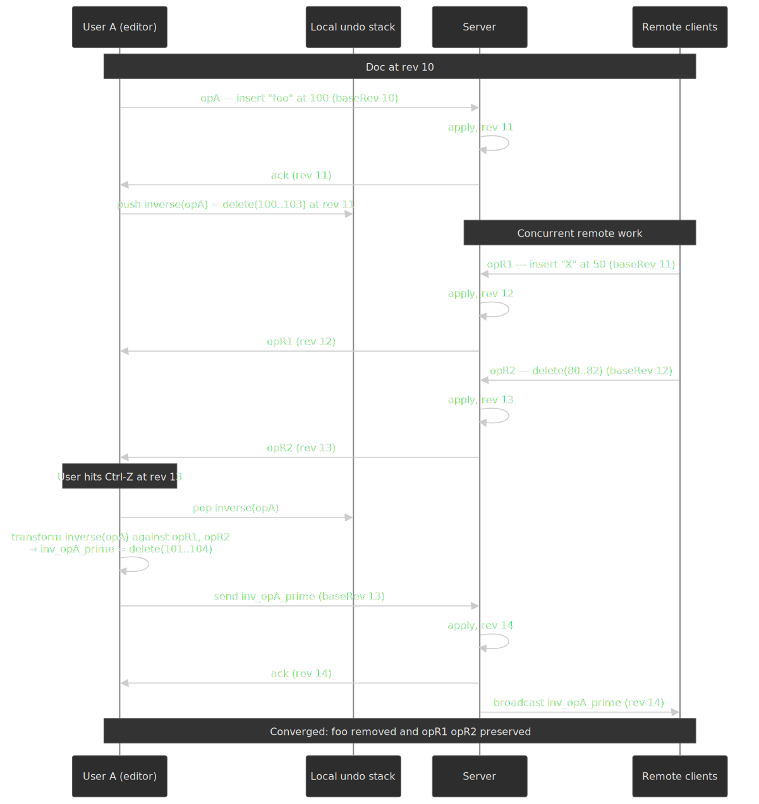

# Design Collaborative Document Editing (Google Docs)

A system design for real-time collaborative document editing covering synchronization algorithms, presence broadcasting, conflict resolution, storage patterns, and offline support. The target is sub-second convergence for concurrent edits while maintaining a full revision history and supporting tens of simultaneous editors per document — the regime Google Docs, Sheets, and Slides operate in today, where each file caps at 100 open tabs or devices editing the same file.[^docs-cap]




## Abstract

Collaborative document editing has to solve three interlocking problems at once: **real-time synchronization** (every active client sees every edit within hundreds of milliseconds), **conflict resolution** (concurrent edits never corrupt the document), and **durability** (no committed edit is ever lost).

**Core architectural decisions:**

| Decision       | Choice                              | Rationale                                                  |
| -------------- | ----------------------------------- | ---------------------------------------------------------- |
| Sync algorithm | OT with server ordering             | Single source of truth eliminates the TP2 obligation       |
| Transport      | WebSocket                           | Full-duplex, 2-14-byte frame headers after the handshake[^ws-frame] |
| Persistence    | Event-sourced operation log         | Enables revision history, undo, and conflict replay        |
| Presence       | Ephemeral broadcast                 | Cursors don't need durability; memory-only with TTL        |
| Offline        | Operation queue with reconciliation | Local-first editing, transform-and-replay on reconnect     |

**Key trade-offs accepted:**

- A central server orders operations (no true peer-to-peer) in exchange for correctness guarantees.
- The operation log grows without bound and has to be compacted with periodic snapshots.
- Per-document affinity drives memory pressure on collaboration servers (one process effectively owns each active document).

**What this design optimizes for:**

- Sub-100 ms operation propagation between connected clients on the same edge.
- Convergence guaranteed regardless of network jitter or partial partitions.
- A full, addressable revision history without inflating every cold read.

## Requirements

### Functional Requirements

| Requirement                   | Priority | Notes                               |
| ----------------------------- | -------- | ----------------------------------- |
| Real-time text editing        | Core     | Character-level granularity         |
| Concurrent multi-user editing | Core     | Tens of simultaneous editors        |
| Live cursor / selection       | Core     | See where others are editing        |
| Revision history              | Core     | View / restore any previous version |
| Rich text formatting          | Core     | Bold, italic, headings, lists       |
| Comments and suggestions      | Extended | Anchored to text ranges             |
| Offline editing               | Extended | Queue operations, sync on reconnect |
| Tables, images, embeds        | Extended | Block-level elements                |

### Non-Functional Requirements

| Requirement              | Target                  | Rationale                                                                                            |
| ------------------------ | ----------------------- | ---------------------------------------------------------------------------------------------------- |
| Availability             | 99.9% (3 nines)         | User-facing, but brief outages acceptable                                                            |
| Edit propagation latency | p99 < 200 ms            | Real-time feel requires sub-second                                                                   |
| Document load time       | p99 < 2 s               | Cold start with full history                                                                         |
| Concurrent editors       | 100 per document        | Matches the published Google Workspace limit; Docs / Sheets / Slides cap at 100 open tabs or devices per file[^docs-cap] |
| Operation durability     | 99.999%                 | No edit should ever be lost                                                                          |
| Revision retention       | Indefinite              | Full history for compliance                                                                          |

### Scale Estimation

> [!NOTE]
> The numbers below are first-cut order-of-magnitude estimates for sizing exercises, not measured production figures. Use them to reason about hot-path arithmetic, not as quotable benchmarks.

**Users:**

- Monthly active users (MAU): 500M (Google Docs scale).
- Daily active users (DAU): 100M (≈ 20% of MAU).
- Peak concurrent users: 10M.

**Documents:**

- Total documents: 5B.
- Active documents (edited in last 30 days): 500M (≈ 10%).
- Documents open concurrently at peak: 50M.

**Traffic:**

- Operations per active editor: 1-5 per second while typing.
- Average editing session: 15 minutes.
- Peak concurrent editing sessions: 50M documents × 3 editors avg ≈ 150M.
- Operations per second at peak: 150M × 2 ops/sec ≈ 300M ops/sec globally.

**Storage:**

- Average operation size: ~100 bytes (insert / delete + metadata).
- Operations per active document per day: ~10,000.
- Daily operation volume: 500M docs × 10K ops × 100B ≈ 500 TB/day before compaction.
- With daily snapshots: 500M × 50KB ≈ 25 TB/day of snapshot footprint.

## Design Paths

### Path A: Operational Transformation (Server-Ordered)

**Best when:**

- Always-online with reliable connectivity.
- Central infrastructure already exists.
- Correctness is paramount (financial, legal documents).
- Team has OT implementation experience or uses an existing library.

**Architecture:**

 OT: a single authoritative server transforms incoming ops against everything since their baseRev, appends to the log, then fans the transformed op out.")


The Jupiter[^jupiter] paper formalised this shape in 1995: every client speaks two-party OT to one authoritative server, which serialises everything and rebroadcasts. Google Wave[^wave-ot] and Google Docs both adopted Jupiter, and Wave added the restriction that a client can have at most one unacknowledged operation in flight — a constraint that keeps the per-client transformation history linear.




**Key characteristics:**

- The server assigns canonical operation order.
- Clients transform incoming ops against their own pending local ops.
- A single source of truth eliminates the TP2 (transformation property 2) requirement — the property that two transformation paths through three concurrent ops must agree, originally formalised by the OT community after Ellis and Gibbs's 1989 dOPT algorithm[^ellis-gibbs] was shown to mishandle three-way concurrency. Avoiding TP2 is what makes Jupiter-style OT tractable.

**Trade-offs:**

- Proven correct in long-running production systems (Google Docs, CKEditor, the Wave / ShareDB lineage).
- Only TP1 needs to hold, which makes the transformation functions tractable.
- Wire format is small (operations stay close to "delta" sized).
- Every operation batch needs a server round-trip.
- Offline capability is limited to a local buffer; reconciliation still depends on the server.
- The owning server is a single point of failure per document until ownership transfers.

**Real-world example:** Google Docs uses Jupiter-style server-ordered OT — every character change is appended as an event in a per-document log, and the document renders by replaying that log from a periodic checkpoint, an architecture Google described publicly in the 2010 "What's different about the new Google Docs" post.[^new-docs]

### Path B: CRDT-Based (Decentralized)

**Best when:**

- Offline-first is a hard requirement.
- Peer-to-peer scenarios where no authoritative server is available.
- Multi-device sync over unreliable networks.
- You want a mathematical convergence proof rather than relying on transformation correctness.

**Architecture:**




**Key characteristics:**

- Operations commute by construction; no server arbitration needed.
- Each replica carries the full CRDT state (or enough metadata to reconstruct it).
- Convergence is guaranteed by the CRDT's algebraic properties, independent of delivery order.

**Trade-offs:**

- Native offline support, including arbitrarily long disconnects.
- P2P synchronization is possible.
- No authoritative server bottleneck.
- Higher memory and storage overhead for tombstones, vector clocks, and identity metadata.
- Initial document load can be slower because the replica may have to replay a lot of history.
- Intent preservation for rich text is harder; pure CRDTs need careful work to model formatting boundaries (Peritext, Yjs's rich-text types, etc.).

**Real-world example:** Yjs and Automerge are widely used pure-CRDT libraries; on top of them, products like JupyterLab Real-Time Collaboration, Tldraw, and many block-based editors get offline-first behavior without standing up a transformation engine. Notion, often cited here, is in fact closer to last-write-wins per block today, with CRDTs an explicitly stated future direction.[^notion-lww]

### Path C: Hybrid (Server-Ordered with CRDT Properties)

**Best when:**

- You need real offline support but you also have server infrastructure you want to keep using.
- You want CRDT-style merge guarantees with OT-style steady-state efficiency.
- You're willing to build on newer algorithms such as Eg-walker or Fugue.

**Architecture:**

- Store an append-only operation DAG (CRDT-style provenance).
- Use the server for canonical ordering and persistence (OT-style).
- Merge divergent branches with a CRDT-style algorithm only when the DAG actually forks.
- Free the merge state when there is no active divergence.

**Trade-offs:**

- Best of both: efficient steady state, robust merging when clients reconverge from offline edits.
- Substantially better merge complexity than traditional OT in the worst case.
- True offline editing with real branch merging.
- Newest approach in production; tooling and library maturity lag the OT/CRDT ecosystems.
- Implementation complexity is higher than either pure approach.

**Real-world example:** Figma uses Eg-walker as the merge backbone of the multiplayer service that powers its Code Layers feature, launched in June 2025.[^figma-codelayers] The underlying algorithm — Gentle and Kleppmann, EuroSys 2025 — merges two divergent branches of `k` and `m` local events in `O((k + m) log (k + m))` time and uses 1–2 orders of magnitude less steady-state memory than a comparable text CRDT, because the CRDT structure is built on demand for each merge and discarded afterwards.[^egwalker]

### Path Comparison

| Factor              | OT (server-ordered)   | CRDT                          | Hybrid (Eg-walker / Fugue) |
| ------------------- | --------------------- | ----------------------------- | -------------------------- |
| Correctness proof   | Transformation-based  | Algebraic                     | Algebraic                  |
| Offline support     | Buffer only           | Native                        | Native                     |
| Server dependency   | Required              | Optional                      | Optional                   |
| Memory overhead     | Low                   | High                          | Medium                     |
| Implementation      | Moderate              | Complex                       | Complex                    |
| Production examples | Google Docs, CKEditor | Yjs / Automerge, Tldraw, JupyterLab RTC | Figma Code Layers          |

### The OT vs CRDT debate

The choice is not as settled as either camp likes to claim, and senior engineers should know why both sides are right about different things.[^real-differences]

| Claim                                                                | Status (as of 2026-04)                                                                                                                                                                                                  |
| :------------------------------------------------------------------- | :---------------------------------------------------------------------------------------------------------------------------------------------------------------------------------------------------------------------- |
| "CRDTs need no central server."                                      | Verified for sync. **But** every production deployment still uses a server for auth, persistence, presence routing, and access control — see Yjs's `y-websocket` provider and Automerge's relay services.                |
| "OT is simpler."                                                     | Verified for the centralised, single-server case (Jupiter eliminates TP2). **Rejected** for peer-to-peer or multi-server: TP2 has decades of known bugs and only a handful of correct algorithms.                       |
| "CRDTs are slow and bloated."                                        | Verified circa 2018, **rejected** today: Yjs and Automerge 2/3 with columnar binary encoding store a 100 KB editing trace in low-MB on disk and apply ops in the millions/sec range.[^future-crdt][^automerge-binary]   |
| "OT preserves user intent for rich text better than CRDTs."          | Historically true; **partially rejected** since Peritext (Litt, Lim, Kleppmann, van Hardenberg, 2022) and the Fugue family closed most of the gap for inline formatting.[^peritext]                                     |
| "CRDTs are inherently superior because they have a convergence proof." | Inferred only — the 2020 Sun et al. survey shows OT and CRDTs are two presentations of the same underlying transformation framework; the difference is in *where* the transformation happens, not whether it is provable. |

The pragmatic split most teams land on:

- **Centralised, always-online, rich-text-heavy** (Google Docs, Notion-style apps): server-ordered OT or OT-shaped step rebasing (ProseMirror's `prosemirror-collab` is the reference). Mature, fast, integrates cleanly with auth and persistence.
- **Local-first, offline-first, multi-device, federated** (Linear, Tldraw, JupyterLab RTC, anything that needs to merge weeks of offline work): pure CRDT with awareness for presence. Yjs and Automerge are the production-grade choices.
- **Centralised today, offline-first tomorrow**: hybrid algorithms (Eg-walker, Fugue) keep the server-ordered steady state but unlock real branch merging when needed.

> [!IMPORTANT]
> The interesting axis is no longer "which algorithm" but "what's your topology, and what failure modes are you willing to wear?" If you have a server, OT is fewer moving parts. If you genuinely don't, you need a CRDT — and you should pick one whose rich-text story (Peritext, YATA-with-format-attributes, etc.) matches your editor.

### This Article's Focus

This article focuses on **Path A (server-ordered OT)** because:

1. It is the most battle-tested approach — Google Docs has run on this shape since the 2010 rewrite.[^new-docs]
2. Most real workloads have a reliable server-side path; the offline fraction is small.
3. The correctness story is easier to reason about and to test (no TP2 obligation).
4. There is mature library support — ShareDB, ot.js, and the Quill Delta toolchain — to build on instead of writing transformation functions from scratch.

A deep dive into CRDTs, including TP2 and intent preservation, lives in the companion article [CRDTs for Collaborative Systems](../crdt-for-collaborative-systems/README.md).

## High-Level Design

### Component Overview




### WebSocket Gateway

Manages persistent connections between clients and the collaboration tier.

**Responsibilities:**

- Connection lifecycle (connect, heartbeat, graceful disconnect).
- Routing messages to the document processor that owns a given document.
- Broadcasting presence updates.
- Handling reconnection and state recovery without forcing a full document reload.

**Design decisions:**

| Decision         | Choice                  | Rationale                                                                |
| ---------------- | ----------------------- | ------------------------------------------------------------------------ |
| Protocol         | WebSocket (RFC 6455)    | Full-duplex, 2-14-byte frame header vs. per-request HTTP overhead[^ws-frame] |
| Session affinity | Sticky by document      | All editors of a document hit the same server, so transformation state is local |
| Heartbeat        | 30-second interval      | Detect dead connections fast enough to release locks                     |
| Reconnection     | Exponential backoff     | Avoid thundering-herd reconnects on a partial outage                     |

**Scaling approach:**

- Horizontal scaling with consistent hashing by document ID.
- One server "owns" each active document at a time.
- Ownership transfers on server failure via a distributed lock (etcd, ZooKeeper, or a Redis-based primitive).

### Document Processor (OT Engine)

The core synchronization component that transforms and orders operations.

**State per active document:**

```typescript
interface DocumentState {
  documentId: string
  revision: number               // Monotonic operation counter
  content: DocumentContent       // Current document state
  pendingOps: Map<ClientId, Operation[]> // Ops awaiting transform
  clients: Map<ClientId, ClientState>    // Connected clients
}

interface ClientState {
  clientId: string
  lastAckedRevision: number
  cursor: CursorPosition | null
  color: string                  // For presence display
}
```

**Operation flow:**

1. **Receive** — client sends an operation tagged with its base revision.
2. **Validate** — check that the base revision is recent enough that we can still replay missing ops.
3. **Transform** — transform the incoming op against every operation since the base revision.
4. **Apply** — update the in-memory document state.
5. **Persist** — append to the durable operation log.
6. **Broadcast** — fan the transformed op out to every other connected client.

**Memory management:**

- Keep document state in memory while the document is active.
- Evict after 5 minutes of inactivity.
- Rehydrate from the latest snapshot plus the tail of the operation log.

### Presence Service

Handles ephemeral state: cursors, selections, and "user is here" indicators.




**Design decisions:**

- **No persistence.** Presence rebuilds on reconnect; nothing depends on it being durable. Yjs's `awareness` protocol takes the same stance — last-write-wins per `clientID`, marked offline if no update arrives within ~30 seconds.[^yjs-awareness]
- **Throttled broadcast.** Cap at ~20 updates / second per client to keep the fan-out cost predictable.
- **Coalesced updates.** Batch cursor movements before broadcast (50 ms collection window is a good default).
- **Separate channel from operations.** Presence and ops share the same WebSocket but ride different message types so a backed-up op queue never delays cursor updates (this is also how ShareDB's `DocPresence` keeps cursors aligned to the document version they were captured against).

**Data structure:**

```typescript
interface PresenceUpdate {
  clientId: string
  documentId: string
  cursor: {
    anchor: number               // Selection start
    head: number                 // Cursor position
  } | null
  user: {
    id: string
    name: string
    avatar: string
    color: string                // Assigned per-document for stable identity
  }
  timestamp: number
}
```

### Document API

Handles document CRUD, access control, and version retrieval.

**Endpoints:**

| Endpoint                      | Method | Purpose                                     |
| ----------------------------- | ------ | ------------------------------------------- |
| `/documents`                  | POST   | Create document                             |
| `/documents/{id}`             | GET    | Load document (latest or specific revision) |
| `/documents/{id}/operations`  | GET    | Fetch operation range for history / replay  |
| `/documents/{id}/snapshot`    | POST   | Create manual snapshot                      |
| `/documents/{id}/revisions`   | GET    | List revision metadata                      |
| `/documents/{id}/permissions` | PUT    | Update access control                       |

## API Design

### WebSocket Protocol

#### Client → Server Messages

Send operation:

```json title="ws/client/operation.json"
{
  "type": "operation",
  "documentId": "doc_abc123",
  "clientId": "client_xyz",
  "baseRevision": 142,
  "operation": {
    "ops": [{ "retain": 50 }, { "insert": "Hello, " }, { "retain": 100 }, { "delete": 5 }]
  },
  "timestamp": 1706886400000
}
```

Update presence:

```json title="ws/client/presence.json"
{
  "type": "presence",
  "documentId": "doc_abc123",
  "cursor": { "anchor": 150, "head": 150 },
  "selection": null
}
```

#### Server → Client Messages

Operation acknowledgement:

```json title="ws/server/ack.json"
{
  "type": "ack",
  "documentId": "doc_abc123",
  "revision": 143,
  "transformedOp": { "ops": [{ "retain": 50 }, { "insert": "Hello, " }] }
}
```

Broadcast operation (to other clients):

```json title="ws/server/remote-operation.json"
{
  "type": "remote_operation",
  "documentId": "doc_abc123",
  "clientId": "client_other",
  "revision": 143,
  "operation": { "ops": [{ "retain": 50 }, { "insert": "Hello, " }] },
  "user": {
    "id": "user_123",
    "name": "Alice"
  }
}
```

Presence broadcast:

```json title="ws/server/remote-presence.json"
{
  "type": "remote_presence",
  "documentId": "doc_abc123",
  "presences": [
    {
      "clientId": "client_other",
      "cursor": { "anchor": 200, "head": 210 },
      "user": { "id": "user_123", "name": "Alice", "color": "#4285f4" }
    }
  ]
}
```

### REST API

#### Create Document

`POST /api/v1/documents`

Request:

```json title="rest/create-doc.req.json"
{
  "title": "Untitled Document",
  "content": "",
  "folderId": "folder_abc",
  "templateId": "template_xyz"
}
```

Response (`201 Created`):

```json title="rest/create-doc.res.json"
{
  "id": "doc_abc123",
  "title": "Untitled Document",
  "revision": 0,
  "createdAt": "2024-02-03T10:00:00Z",
  "createdBy": {
    "id": "user_123",
    "name": "Alice"
  },
  "permissions": {
    "owner": "user_123",
    "editors": [],
    "viewers": []
  },
  "wsEndpoint": "wss://collab.example.com/ws/doc_abc123"
}
```

#### Load Document

`GET /api/v1/documents/{id}?revision={optional}`

Response (`200 OK`):

```json title="rest/load-doc.res.json"
{
  "id": "doc_abc123",
  "title": "Project Proposal",
  "revision": 1542,
  "content": {
    "type": "doc",
    "content": [
      {
        "type": "heading",
        "attrs": { "level": 1 },
        "content": [{ "type": "text", "text": "Introduction" }]
      },
      {
        "type": "paragraph",
        "content": [{ "type": "text", "text": "..." }]
      }
    ]
  },
  "snapshot": {
    "revision": 1500,
    "createdAt": "2024-02-03T09:00:00Z"
  },
  "pendingOperations": 42,
  "collaborators": [{ "id": "user_456", "name": "Bob", "online": true }]
}
```

#### List Revisions

`GET /api/v1/documents/{id}/revisions?limit=50&before={revision}`

Response (`200 OK`):

```json title="rest/list-revisions.res.json"
{
  "revisions": [
    {
      "revision": 1542,
      "timestamp": "2024-02-03T10:30:00Z",
      "user": { "id": "user_123", "name": "Alice" },
      "summary": "Edited section 3",
      "operationCount": 15
    },
    {
      "revision": 1500,
      "timestamp": "2024-02-03T09:00:00Z",
      "user": { "id": "user_456", "name": "Bob" },
      "summary": "Added introduction",
      "operationCount": 203,
      "isSnapshot": true
    }
  ],
  "hasMore": true,
  "nextCursor": "rev_1499"
}
```

### Error Responses

| Code | Error               | When                        |
| ---- | ------------------- | --------------------------- |
| 400  | `INVALID_OPERATION` | Operation format invalid    |
| 409  | `REVISION_CONFLICT` | Base revision too old       |
| 410  | `DOCUMENT_DELETED`  | Document was deleted        |
| 423  | `DOCUMENT_LOCKED`   | Document temporarily locked |
| 429  | `RATE_LIMITED`      | Too many operations         |

Revision conflict handling:

```json title="errors/revision-conflict.res.json"
{
  "error": "REVISION_CONFLICT",
  "message": "Base revision 100 is too old. Current: 150",
  "currentRevision": 150,
  "missingOperations": "/api/v1/documents/doc_abc/operations?from=100&to=150"
}
```

The client fetches the missing operations, transforms its local pending operations against them, and retries.

## Data Modeling

### Document Metadata (PostgreSQL)

```sql title="schema/documents.sql"
CREATE TABLE documents (
    id UUID PRIMARY KEY DEFAULT gen_random_uuid(),
    title TEXT NOT NULL,
    owner_id UUID NOT NULL REFERENCES users(id),
    folder_id UUID REFERENCES folders(id),
    current_revision BIGINT DEFAULT 0,
    latest_snapshot_revision BIGINT,
    content_type VARCHAR(50) DEFAULT 'rich_text',
    created_at TIMESTAMPTZ DEFAULT NOW(),
    updated_at TIMESTAMPTZ DEFAULT NOW(),
    deleted_at TIMESTAMPTZ,

    -- Denormalized for read performance
    collaborator_count INT DEFAULT 0,
    word_count INT DEFAULT 0,
    last_edited_by UUID REFERENCES users(id),
    last_edited_at TIMESTAMPTZ
);

CREATE TABLE document_permissions (
    document_id UUID REFERENCES documents(id) ON DELETE CASCADE,
    user_id UUID REFERENCES users(id),
    role VARCHAR(20) NOT NULL, -- 'owner', 'editor', 'commenter', 'viewer'
    granted_at TIMESTAMPTZ DEFAULT NOW(),
    granted_by UUID REFERENCES users(id),
    PRIMARY KEY (document_id, user_id)
);

CREATE INDEX idx_documents_owner ON documents(owner_id, updated_at DESC);
CREATE INDEX idx_documents_folder ON documents(folder_id, updated_at DESC);
CREATE INDEX idx_permissions_user ON document_permissions(user_id);
```

### Operation Log (DynamoDB)

Table design for an append-heavy workload:

| Partition Key | Sort Key   | Attributes                                                   |
| ------------- | ---------- | ------------------------------------------------------------ |
| `document_id` | `revision` | `operation`, `client_id`, `user_id`, `timestamp`, `checksum` |

Per-row schema:

```json title="oplog/row.json"
{
  "document_id": "doc_abc123",
  "revision": 1542,
  "operation": {
    "ops": [{ "retain": 50 }, { "insert": "Hello" }]
  },
  "client_id": "client_xyz",
  "user_id": "user_123",
  "timestamp": 1706886400000,
  "checksum": "sha256:abc123...",
  "ttl": null
}
```

**Why DynamoDB:**

- Append-only workload (write-optimized).
- Predictable single-digit-ms latency at scale.
- Built-in TTL for old operations after they roll into a snapshot.
- Range queries by sort key (`revision`) are efficient and cheap.

**Capacity planning:**

- Write capacity: 300M ops/sec globally → naturally partitioned across documents.
- Single document: capped at ~200 ops/sec (100 active editors × 2 ops/sec — matching the published 100-tab Google Docs ceiling).
- Read capacity: bursts on document load, otherwise minimal.

### Snapshots (S3)

Object key:

```text
s3://doc-snapshots/{document_id}/{revision}.json.gz
```

Snapshot payload:

```json title="snapshot/payload.json"
{
  "documentId": "doc_abc123",
  "revision": 1500,
  "createdAt": "2024-02-03T09:00:00Z",
  "content": {
    "type": "doc",
    "content": []
  },
  "metadata": {
    "wordCount": 5420,
    "characterCount": 32150,
    "imageCount": 12
  },
  "checksum": "sha256:..."
}
```

Snapshot policy:

- Create a snapshot every 1000 operations.
- Or every 1 hour of active editing.
- Or on manual request when the user opens revision history.
- Keep all snapshots indefinitely for compliance.

### Active Document Cache (Redis)

```redis title="redis/active-doc.txt"
# Document state (hash)
HSET doc:{id}:state
    revision 1542
    content "{serialized_content}"
    last_updated 1706886400000

# Connected clients (sorted set by last activity)
ZADD doc:{id}:clients {timestamp} {client_id}

# Pending operations queue (list)
RPUSH doc:{id}:pending "{operation_json}"

# Presence (hash with TTL per client)
HSET doc:{id}:presence:{client_id}
    cursor_anchor 150
    cursor_head 150
    user_name "Alice"
    user_color "#4285f4"
EXPIRE doc:{id}:presence:{client_id} 60
```

**Eviction policy:**

- Documents evicted after 5 minutes of no activity.
- Presence entries auto-expire after 60 seconds without a refresh.

## Low-Level Design

### OT Transformation Engine

#### Operation Format

The format below is similar to Quill Delta and Google Wave's wire shape — a flat list of `retain`, `insert`, and `delete` operations:[^quill-delta]

```typescript title="ot/operation.ts"
type Operation = {
  ops: (RetainOp | InsertOp | DeleteOp)[]
}

type RetainOp = {
  retain: number
  attributes?: Record<string, unknown> // For formatting changes
}

type InsertOp = {
  insert: string | { image: string } | { embed: unknown }
  attributes?: Record<string, unknown>
}

type DeleteOp = {
  delete: number
}
```

Examples:

```typescript title="ot/examples.ts"
// Insert "Hello" at position 0
{
  ops: [{ insert: "Hello" }]
}

// Delete 3 characters at position 10
{
  ops: [{ retain: 10 }, { delete: 3 }]
}

// Bold characters 5..10
{
  ops: [{ retain: 5 }, { retain: 5, attributes: { bold: true } }]
}
```

#### Transformation Functions

The transformation function is what makes OT non-trivial. The diagram below works through a concrete two-client convergence on a three-character document; the code beneath generalises it.




```typescript title="ot/transform.ts" collapse={1-10}
function transform(op1: Operation, op2: Operation, priority: "left" | "right"): [Operation, Operation] {
  // op1' = transform(op1, op2) — op1 transformed against op2
  // op2' = transform(op2, op1) — op2 transformed against op1
  // Guarantee: apply(apply(doc, op1), op2') === apply(apply(doc, op2), op1')

  const ops1 = [...op1.ops]
  const ops2 = [...op2.ops]
  const result1: Op[] = []
  const result2: Op[] = []

  let i1 = 0,
    i2 = 0

  while (i1 < ops1.length || i2 < ops2.length) {
    const o1 = ops1[i1]
    const o2 = ops2[i2]

    // Case: insert vs anything — inserts go first
    if (o1 && "insert" in o1) {
      if (priority === "left") {
        result2.push({ retain: insertLength(o1) })
        result1.push(o1)
        i1++
        continue
      }
    }
    if (o2 && "insert" in o2) {
      result1.push({ retain: insertLength(o2) })
      result2.push(o2)
      i2++
      continue
    }

    // Case: retain vs retain
    if (o1 && "retain" in o1 && o2 && "retain" in o2) {
      const len = Math.min(o1.retain, o2.retain)
      result1.push({ retain: len, attributes: o1.attributes })
      result2.push({ retain: len, attributes: o2.attributes })
      consumeLength(ops1, i1, len)
      consumeLength(ops2, i2, len)
      continue
    }

    // Case: delete vs retain
    if (o1 && "delete" in o1 && o2 && "retain" in o2) {
      const len = Math.min(o1.delete, o2.retain)
      result1.push({ delete: len })
      // o2 produces no output — content was deleted
      consumeLength(ops1, i1, len)
      consumeLength(ops2, i2, len)
      continue
    }

    // Case: retain vs delete
    if (o1 && "retain" in o1 && o2 && "delete" in o2) {
      const len = Math.min(o1.retain, o2.delete)
      // o1 produces no output — content was deleted
      result2.push({ delete: len })
      consumeLength(ops1, i1, len)
      consumeLength(ops2, i2, len)
      continue
    }

    // Case: delete vs delete — both delete the same content
    if (o1 && "delete" in o1 && o2 && "delete" in o2) {
      const len = Math.min(o1.delete, o2.delete)
      // Neither produces output — already deleted
      consumeLength(ops1, i1, len)
      consumeLength(ops2, i2, len)
      continue
    }
  }

  return [{ ops: result1 }, { ops: result2 }]
}
```

#### Server-Side Processing

```typescript title="ot/document-processor.ts" collapse={1-15}
class DocumentProcessor {
  private state: DocumentState
  private opLog: OperationLog
  private broadcaster: Broadcaster

  async processOperation(clientId: string, baseRevision: number, operation: Operation): Promise<ProcessResult> {
    if (baseRevision < this.state.revision - MAX_REVISION_LAG) {
      throw new RevisionConflictError(this.state.revision)
    }

    let transformedOp = operation
    for (let rev = baseRevision + 1; rev <= this.state.revision; rev++) {
      const serverOp = await this.opLog.getOperation(this.state.documentId, rev)
      ;[transformedOp] = transform(transformedOp, serverOp, "right")
    }

    const newContent = applyOperation(this.state.content, transformedOp)
    const newRevision = this.state.revision + 1

    await this.opLog.append({
      documentId: this.state.documentId,
      revision: newRevision,
      operation: transformedOp,
      clientId,
      timestamp: Date.now(),
    })

    this.state.content = newContent
    this.state.revision = newRevision

    this.broadcaster.broadcastOperation(
      this.state.documentId,
      clientId, // Exclude sender
      newRevision,
      transformedOp,
    )

    return {
      revision: newRevision,
      transformedOp,
    }
  }
}
```

### Client-Side State Machine

The client owns a small, three-state machine that lets the user keep typing without waiting for the server. The diagram below shows the transitions; the code right after it implements them.




```typescript title="ot/client-ot.ts" collapse={1-12}
type ClientOTState =
  | { type: "synchronized"; serverRevision: number }
  | { type: "awaitingAck"; serverRevision: number; pending: Operation }
  | { type: "awaitingWithBuffer"; serverRevision: number; pending: Operation; buffer: Operation }

class ClientOT {
  private state: ClientOTState = { type: "synchronized", serverRevision: 0 }
  private document: DocumentContent

  onLocalEdit(operation: Operation): void {
    switch (this.state.type) {
      case "synchronized":
        this.sendToServer(operation, this.state.serverRevision)
        this.state = {
          type: "awaitingAck",
          serverRevision: this.state.serverRevision,
          pending: operation,
        }
        break

      case "awaitingAck":
        this.state = {
          type: "awaitingWithBuffer",
          serverRevision: this.state.serverRevision,
          pending: this.state.pending,
          buffer: operation,
        }
        break

      case "awaitingWithBuffer":
        this.state = {
          ...this.state,
          buffer: compose(this.state.buffer, operation),
        }
        break
    }

    this.document = applyOperation(this.document, operation)
  }

  onServerAck(revision: number): void {
    switch (this.state.type) {
      case "awaitingAck":
        this.state = { type: "synchronized", serverRevision: revision }
        break

      case "awaitingWithBuffer":
        this.sendToServer(this.state.buffer, revision)
        this.state = {
          type: "awaitingAck",
          serverRevision: revision,
          pending: this.state.buffer,
        }
        break
    }
  }

  onRemoteOperation(revision: number, operation: Operation): void {
    let transformedRemote = operation

    if (this.state.type === "awaitingAck" || this.state.type === "awaitingWithBuffer") {
      ;[, transformedRemote] = transform(this.state.pending, operation, "left")
      const [newPending] = transform(this.state.pending, operation, "left")
      this.state = { ...this.state, pending: newPending }
    }

    if (this.state.type === "awaitingWithBuffer") {
      ;[, transformedRemote] = transform(this.state.buffer, transformedRemote, "left")
      const [newBuffer] = transform(this.state.buffer, operation, "left")
      this.state = { ...this.state, buffer: newBuffer }
    }

    this.document = applyOperation(this.document, transformedRemote)
  }
}
```

### Snapshot and Compaction

Operation logs grow without bound. Bounding the cost of a fresh document load means rolling a snapshot in periodically and letting old operations age out.




#### Snapshot Worker

```typescript title="snapshot/worker.ts" collapse={1-8}
class SnapshotWorker {
  private readonly SNAPSHOT_THRESHOLD = 1000          // Operations since last snapshot
  private readonly SNAPSHOT_INTERVAL_MS = 3_600_000   // 1 hour

  async processDocument(documentId: string): Promise<void> {
    const doc = await this.documentStore.getMetadata(documentId)
    const latestSnapshot = await this.snapshotStore.getLatest(documentId)

    const opsSinceSnapshot = doc.currentRevision - (latestSnapshot?.revision ?? 0)
    const timeSinceSnapshot = Date.now() - (latestSnapshot?.createdAt ?? 0)

    if (opsSinceSnapshot < this.SNAPSHOT_THRESHOLD && timeSinceSnapshot < this.SNAPSHOT_INTERVAL_MS) {
      return
    }

    let content = latestSnapshot?.content ?? emptyDocument()
    const operations = await this.opLog.getRange(
      documentId,
      (latestSnapshot?.revision ?? 0) + 1,
      doc.currentRevision,
    )

    for (const op of operations) {
      content = applyOperation(content, op.operation)
    }

    await this.snapshotStore.create({
      documentId,
      revision: doc.currentRevision,
      content,
      createdAt: Date.now(),
    })

    // Mark old operations for TTL expiry; keep last 100 for fine-grained replay
    await this.opLog.setTTL(documentId, 0, doc.currentRevision - 100, TTL_30_DAYS)
  }
}
```

### Undo and Redo with Concurrent Edits

Undo in a collaborative editor is **not** "pop the last op off the log." That would erase someone else's intervening work. The standard pattern, used by Google Docs and most ProseMirror-based editors, is:

1. Every locally-committed op pushes its **inverse** onto a per-user undo stack at the revision the original op landed.
2. On `Ctrl-Z`, pop the inverse, then **transform it against every server op that has arrived since** the original was applied.
3. Send the transformed inverse as a fresh operation. Redo pushes the inverse-of-the-inverse onto the redo stack and pops it the same way.




> [!CAUTION]
> Per-user undo stacks are not shared. If Alice undoes after Bob has typed inside Alice's earlier paragraph, Alice's undo only removes Alice's text — Bob's characters stay. Surface this in the UX (e.g. show an "undo affects only your changes" hint) instead of trying to make undo globally LIFO, which is what destroys other users' work in naïve implementations.

The same pattern is what makes "selective undo" tractable in OT: any op in the stack can be inverted and rebased forward, not just the most recent one. Production systems still cap the depth (Google Docs' undo history is bounded; once you scroll the doc through enough revisions, older inverses become harder to rebase reliably).

## Frontend Considerations

### Editor Integration

Most teams build on an existing rich-text editor instead of writing one. The shape of the OT integration depends on the editor's own model:

| Editor      | OT / CRDT story          | Notes                                                                 |
| ----------- | ------------------------ | --------------------------------------------------------------------- |
| ProseMirror | "Steps" (OT-like)        | Used by Atlassian; first-party `prosemirror-collab` package handles step rebasing[^prosemirror-collab] |
| Slate       | Plugin-based             | Flexible, needs an OT or CRDT library bolted on                       |
| Quill       | Delta format (OT-shaped) | Native OT support via Quill Delta                                     |
| TipTap      | ProseMirror-based        | Modern API; inherits ProseMirror's collab story                       |

Integration sketch (ProseMirror-style):

```typescript title="editor/collab-editor.ts" collapse={1-15}
class CollaborativeEditor {
  private view: EditorView
  private otClient: ClientOT
  private ws: WebSocket

  constructor(container: HTMLElement, documentId: string) {
    this.otClient = new ClientOT()

    this.ws = new WebSocket(`wss://collab.example.com/ws/${documentId}`)
    this.ws.onmessage = this.handleServerMessage.bind(this)

    this.view = new EditorView(container, {
      state: EditorState.create({
        plugins: [collab({ version: 0 }), this.cursorPlugin(), this.presencePlugin()],
      }),
      dispatchTransaction: this.handleLocalChange.bind(this),
    })
  }

  private handleLocalChange(tr: Transaction): void {
    const newState = this.view.state.apply(tr)
    this.view.updateState(newState)

    if (tr.docChanged) {
      const steps = sendableSteps(newState)
      if (steps) {
        const operation = stepsToOperation(steps.steps)
        this.otClient.onLocalEdit(operation)
        this.ws.send(
          JSON.stringify({
            type: "operation",
            operation,
            baseRevision: this.otClient.serverRevision,
          }),
        )
      }
    }
  }
}
```

### Presence Rendering

Cursor overlay sketch:

```typescript title="presence/cursor-overlay.ts" collapse={1-20}
interface RemoteCursor {
  clientId: string
  user: { name: string; color: string }
  anchor: number
  head: number
}

class CursorOverlay {
  private cursors: Map<string, RemoteCursor> = new Map()

  updateCursor(cursor: RemoteCursor): void {
    this.cursors.set(cursor.clientId, cursor)
    this.render()
  }

  removeCursor(clientId: string): void {
    this.cursors.delete(clientId)
    this.render()
  }

  private render(): void {
    for (const [clientId, cursor] of this.cursors) {
      const coords = this.positionToCoords(cursor.head)

      this.renderCaret(clientId, coords, cursor.user.color)

      if (cursor.anchor !== cursor.head) {
        this.renderSelection(clientId, cursor.anchor, cursor.head, cursor.user.color)
      }

      this.renderNameLabel(clientId, coords, cursor.user)
    }
  }
}
```

Performance optimizations worth defaulting on:

| Technique                 | Purpose                  | Implementation              |
| ------------------------- | ------------------------ | --------------------------- |
| Throttle cursor updates   | Reduce network traffic   | Max 20 updates/sec          |
| Batch presence broadcasts | Reduce message count     | Collect 50 ms, send batch   |
| Use CSS transforms        | Avoid layout thrashing   | `transform: translate()`    |
| Virtual cursor layer      | Don't mutate editor DOM  | Absolute-positioned overlay |

### Offline Support

Offline editing leans on IndexedDB for the queue and the same transformation functions for reconciliation:

```typescript title="offline/queue.ts" collapse={1-10}
class OfflineQueue {
  private db: IDBDatabase
  private queueName = "pendingOperations"

  async enqueue(documentId: string, operation: Operation): Promise<void> {
    const tx = this.db.transaction(this.queueName, "readwrite")
    const store = tx.objectStore(this.queueName)

    await store.add({
      documentId,
      operation,
      timestamp: Date.now(),
      id: crypto.randomUUID(),
    })
  }

  async syncPending(documentId: string): Promise<void> {
    const pending = await this.getPending(documentId)

    for (const item of pending) {
      try {
        await this.sendOperation(item)
        await this.remove(item.id)
      } catch (e) {
        if (e instanceof RevisionConflictError) {
          await this.handleConflict(documentId, item)
        } else {
          throw e
        }
      }
    }
  }
}
```

> [!CAUTION]
> Offline-then-online is the most common source of subtle convergence bugs. Treat the offline → reconnect path as a separate test suite: long disconnects (hours), formatting-only edits, edits to deleted ranges, and edits that cross a snapshot boundary.

## Infrastructure

### Cloud-Agnostic Components

| Component         | Purpose                | Options                       |
| ----------------- | ---------------------- | ----------------------------- |
| WebSocket gateway | Real-time connections  | Nginx, HAProxy, Envoy         |
| Message queue     | Operation streaming    | Kafka, RabbitMQ, NATS         |
| KV store          | Active document state  | Redis, Memcached, KeyDB       |
| Document store    | Operation log          | Cassandra, ScyllaDB, DynamoDB |
| Object store      | Snapshots, media       | MinIO, Ceph, S3-compatible    |
| Relational DB     | Metadata, ACL          | PostgreSQL, CockroachDB       |

### AWS Reference Architecture




Service configurations:

| Service                | Configuration                  | Rationale                        |
| ---------------------- | ------------------------------ | -------------------------------- |
| WebSocket (Fargate)    | 4 vCPU, 8 GB RAM               | Memory for active documents      |
| API (Fargate)          | 2 vCPU, 4 GB RAM               | Stateless, scales on traffic     |
| Workers (Fargate Spot) | 2 vCPU, 4 GB RAM               | Cost optimization for async work |
| ElastiCache            | r6g.xlarge cluster             | Sub-ms latency for hot documents |
| RDS PostgreSQL         | db.r6g.2xlarge Multi-AZ        | Metadata queries, ACL            |
| DynamoDB               | On-demand                      | Predictable per-op pricing       |
| S3                     | Standard + Intelligent-Tiering | Hot snapshots, cold history      |

### Scaling Considerations

**WebSocket connection limits:**

- A single Linux server typically tops out around ~65k connections without aggressive ulimit / port-range tuning.[^ulimit]
- Solution: consistent hashing by document ID across a server pool.
- Active documents per server: ~10k (memory-constrained, not socket-constrained).

**Document processor memory:**

- Average document state: ~100 KB.
- Active document with history buffer: ~500 KB.
- An 8 GB server fits roughly ~16k active documents in steady state.

**Operation log partitioning:**

- DynamoDB partition key is `document_id`.
- Hot partition limit is 3,000 WCU.
- Solution: split a single document across logical sub-streams only when one document genuinely exceeds that ceiling, which is very rare.

## Conclusion

This design delivers real-time collaborative document editing with:

1. **Sub-200 ms operation propagation** via WebSocket and server-ordered OT.
2. **Strong convergence guarantees** without the TP2 obligation pure peer-to-peer OT carries.
3. **Full revision history** through an event-sourced operation log with periodic snapshots.
4. **Offline resilience** via an IndexedDB queue plus transform-and-replay reconciliation.

**Key architectural decisions:**

- Server-ordered OT eliminates the TP2 correctness burden.
- Periodic snapshots bound operation replay cost on cold reads.
- Ephemeral presence avoids persistence overhead for cursors.
- Per-document process affinity simplifies scaling at the cost of memory pressure on hot servers.

**Known limitations:**

- Server dependency for real-time sync (no true peer-to-peer).
- Memory pressure climbs steeply at very high concurrent-editor counts.
- Snapshot creation adds latency on very active documents while it runs.

**Future enhancements:**

- Hybrid OT / CRDT (Eg-walker, Fugue) for stronger offline merging without giving up steady-state efficiency.
- Incremental snapshot deltas to reduce storage churn for very long-lived documents.
- Smarter presence coalescing for large collaborator counts.

## Appendix

### Prerequisites

- Distributed-systems fundamentals (eventual consistency, vector clocks, causal order).
- Real-time communication patterns (WebSocket, SSE).
- Event-sourcing concepts.
- A working understanding of OT or CRDTs (see related articles).

### Terminology

| Term          | Definition                                                                    |
| ------------- | ----------------------------------------------------------------------------- |
| **OT**        | Operational Transformation — algorithm for transforming concurrent operations |
| **TP1 / TP2** | Transformation properties ensuring convergence                                |
| **Revision**  | Monotonic counter representing document state version                         |
| **Operation** | Atomic change to a document (insert, delete, format)                          |
| **Snapshot**  | Full document state at a specific revision                                    |
| **Presence**  | Ephemeral state like cursors and selections                                   |
| **Tombstone** | Marker for deleted content in CRDT systems                                    |

### Summary

- Real-time collaborative editing requires **synchronization algorithms** (OT or CRDT), **presence broadcasting**, and **event-sourced persistence**.
- **Server-ordered OT** dominates production text editors (Google Docs, CKEditor) because it sidesteps TP2.
- **WebSocket** provides full-duplex communication with 2-14-byte frame headers after the handshake — far cheaper than HTTP per message.
- **Operation log + periodic snapshots** enables full revision history while bounding cold-read replay cost.
- **Presence is ephemeral** — cursors and selections live in memory only, reconstructed on reconnect.
- Scale to ~100 concurrent editors per document at the published Google Docs ceiling, with sub-200 ms operation propagation.

### References

**Architecture and implementation:**

- [How Figma's multiplayer technology works](https://www.figma.com/blog/how-figmas-multiplayer-technology-works/) — Figma engineering blog
- [Making multiplayer more reliable](https://www.figma.com/blog/making-multiplayer-more-reliable/) — Figma transaction-journal design
- [Realtime editing of ordered sequences](https://www.figma.com/blog/realtime-editing-of-ordered-sequences/) — fractional indexing at Figma
- [Canvas, meet code: building Figma's code layers](https://www.figma.com/blog/building-figmas-code-layers/) — Eg-walker in production
- [The data model behind Notion](https://www.notion.com/blog/data-model-behind-notion) — block-based architecture
- [Sharding Postgres at Notion](https://www.notion.com/blog/sharding-postgres-at-notion) — database scaling patterns
- [Scaling the Linear sync engine](https://linear.app/now/scaling-the-linear-sync-engine) — local-first sync architecture

**Operational Transformation:**

- [Apache Wave OT whitepaper](https://svn.apache.org/repos/asf/incubator/wave/whitepapers/operational-transform/operational-transform.html) — protocol spec
- [What's different about the new Google Docs](https://drive.googleblog.com/2010/09/whats-different-about-new-google-docs.html) — Google's 2010 architecture overview
- [Lessons learned from CKEditor 5](https://ckeditor.com/blog/lessons-learned-from-creating-a-rich-text-editor-with-real-time-collaboration/) — production OT for rich text
- [Jupiter collaboration system (Nichols et al., UIST '95)](https://dl.acm.org/doi/10.1145/215585.215706) — the central-server OT design Google Docs and Wave inherit
- [Concurrency control in groupware systems (Ellis & Gibbs, SIGMOD '89)](https://dl.acm.org/doi/10.1145/67544.66963) — original OT and dOPT
- [Architectures for Central Server Collaboration — Matthew Weidner](https://mattweidner.com/2024/06/04/server-architectures.html) — modern survey of OT, OT-ish, and CRDT server shapes

**Algorithms and research:**

- [Eg-walker: collaborative text editing](https://arxiv.org/abs/2409.14252) — Gentle & Kleppmann, EuroSys 2025
- [Real differences between OT and CRDT](https://dl.acm.org/doi/10.1145/3375186) — ACM 2020 comparison
- [Peritext: a CRDT for collaborative rich text editing](https://dl.acm.org/doi/10.1145/3555644) — Litt, Lim, Kleppmann, van Hardenberg
- [YATA: near real-time peer-to-peer shared editing](https://www.researchgate.net/publication/310212186_Near_Real-Time_Peer-to-Peer_Shared_Editing_on_Extensible_Data_Types) — the algorithm behind Yjs
- [I was wrong. CRDTs are the future](https://josephg.com/blog/crdts-are-the-future/) — Joseph Gentle (ShareJS) on the OT/CRDT pivot
- [Performance of real-time collaborative editors at large scale](https://inria.hal.science/hal-01351229v1/document) — scaling analysis

**Libraries and protocols:**

- [Yjs `y-protocols/PROTOCOL.md`](https://github.com/yjs/y-protocols/blob/master/PROTOCOL.md) — sync + awareness wire format
- [ShareDB presence docs](https://share.github.io/sharedb/presence) — typed `DocPresence` for cursor alignment
- [ProseMirror collaborative editing guide](https://prosemirror.net/docs/guide/#collab) — step rebasing as OT-ish

**Related articles:**

- [Operational Transformation](../operational-transformation/README.md) — deep dive into OT algorithms
- [CRDTs for Collaborative Systems](../crdt-for-collaborative-systems/README.md) — alternative approach for offline-first

[^docs-cap]: [Share files from Google Drive — Google Docs Editors Help](https://support.google.com/docs/answer/2494822). As of 2026-04, Google's published limit is "Google Docs, Sheets, Slides, or Vids files can be edited on up to 100 open tabs or devices at the same time. After 100 tabs or devices, only the owner and some users with editing permissions can edit the file." The cap is per open tab or device, not per distinct user identity.
[^new-docs]: [What's different about the new Google Docs: Making collaboration fast](https://drive.googleblog.com/2010/09/whats-different-about-new-google-docs.html), Google Drive Blog, 2010-09-23.
[^ws-frame]: [RFC 6455 §5.2 — Base framing protocol](https://www.rfc-editor.org/rfc/rfc6455#section-5.2). The frame header is 2 bytes minimum, plus 0/2/8 bytes of extended payload length, plus 0 or 4 bytes of mask key — 2-14 bytes total.
[^egwalker]: Joseph Gentle and Martin Kleppmann, [Collaborative text editing with Eg-walker: better, faster, smaller](https://arxiv.org/abs/2409.14252), EuroSys '25 ([ACM DOI](https://dl.acm.org/doi/10.1145/3689031.3696076)).
[^figma-codelayers]: [Canvas, meet code: building Figma's code layers](https://www.figma.com/blog/building-figmas-code-layers/), Figma engineering blog. The launch announcement [Make your site interactive with code layers](https://www.figma.com/blog/introducing-code-layers/) is dated 2025-06-17.
[^notion-lww]: Discussion thread with Notion engineers: [You don't need a CRDT to build a collaborative experience — Hacker News](https://news.ycombinator.com/item?id=38289327). At the time, Notion used server-mediated last-write-wins per block and described pure CRDTs as a future direction.
[^quill-delta]: [Quill Delta — quilljs.com](https://quilljs.com/docs/delta/). Delta is the OT-friendly operation format used by Quill and a number of downstream editors.
[^prosemirror-collab]: [ProseMirror collaborative editing guide](https://prosemirror.net/docs/guide/#collab). The first-party `prosemirror-collab` plugin handles step-rebasing in the same shape as classic OT.
[^ulimit]: [`getrlimit(2)` / `setrlimit(2)` — Linux manual page](https://man7.org/linux/man-pages/man2/setrlimit.2.html). The default soft `RLIMIT_NOFILE` is conservative; raising it to ~65k is standard practice for WebSocket gateways, and beyond that you need port-range tuning and additional tweaks.
[^jupiter]: David A. Nichols, Pavel Curtis, Michael Dixon, John Lamping, [High-latency, low-bandwidth windowing in the Jupiter collaboration system](https://dl.acm.org/doi/10.1145/215585.215706), UIST '95. The original two-party server-mediated OT design that Google Wave and Google Docs both adopted; PDF mirror at the [Lively Kernel repository](https://lively-kernel.org/repository/webwerkstatt/projects/Collaboration/paper/Jupiter.pdf).
[^wave-ot]: [Google Wave Operational Transformation whitepaper](https://svn.apache.org/repos/asf/incubator/wave/whitepapers/operational-transform/operational-transform.html), archived under Apache Wave. Documents Wave's "one unacknowledged op per client" extension to Jupiter and the server's role as the canonical orderer.
[^ellis-gibbs]: C. A. Ellis and S. J. Gibbs, [Concurrency control in groupware systems](https://dl.acm.org/doi/10.1145/67544.66963), SIGMOD '89. Introduces dOPT and the convergence / precedence properties; later shown by [Ressel et al. (1995)](https://cs.uwaterloo.ca/research/tr/1995/08/dopt.pdf) to mishandle three-way concurrency, motivating the TP1 / TP2 formalisation.
[^real-differences]: Chengzheng Sun et al., [Real Differences between OT and CRDT under a General Transformation Framework for Consistency Maintenance in Co-Editors](https://dl.acm.org/doi/10.1145/3375186), PACMHCI 2020. The most thorough side-by-side, framing both as instances of the same transformation framework rather than rival paradigms.
[^future-crdt]: Joseph Gentle, [I was wrong. CRDTs are the future](https://josephg.com/blog/crdts-are-the-future/), 2020. The author of ShareJS recanting his long-standing CRDT skepticism after Yjs/Automerge benchmarks closed the speed and size gaps.
[^automerge-binary]: [Automerge binary document format specification](https://automerge.org/automerge-binary-format-spec/) and [Introducing Automerge 2.0](https://automerge.org/blog/automerge-2/). Columnar encoding plus DEFLATE on change chunks gets the on-disk overhead close to the raw text size.
[^peritext]: Geoffrey Litt, Sarah Lim, Martin Kleppmann, Peter van Hardenberg, [Peritext: A CRDT for Collaborative Rich Text Editing](https://dl.acm.org/doi/10.1145/3555644), PACMHCI 2022. Demonstrates that CRDTs can preserve rich-text formatting intent across concurrent edits without falling back to OT.
[^yjs-awareness]: [Yjs `y-protocols` PROTOCOL.md](https://github.com/yjs/y-protocols/blob/master/PROTOCOL.md) and [Awareness API docs](https://docs.yjs.dev/api/about-awareness). Awareness is a separate state-based CRDT layered on top of the document sync protocol; clients are dropped after ~30 seconds without an update.
