# Design Google Maps

A system design for a mapping and navigation platform handling tile-based rendering, real-time routing with traffic awareness, geocoding, and offline maps. The interesting part is not "draw a map and find a path" — it is the gap between a textbook Dijkstra (seconds per query on a continental graph[^bast2015]) and the sub-millisecond response a navigation app actually needs, plus the operational reality of overlaying live traffic on a precomputed hierarchy without rebuilding it.

[^bast2015]: [Route Planning in Transportation Networks](https://arxiv.org/abs/1504.05140) — Bast, Delling, Goldberg, Müller-Hannemann, Pajor, Sanders, Wagner, Werneck (2015). The canonical survey of speedup techniques for shortest-path queries on road networks; numbers below come from this and follow-up benchmarks.



## Abstract

A mapping platform is really three loosely-coupled systems wearing one URL:

1. **Map rendering** — a quadtree tile pyramid built on the [Web Mercator projection (EPSG:3857)](https://epsg.io/3857). Zoom 0 is one 256×256 tile covering the world; each zoom doubles the linear resolution[^osm-zoom]. Tiles are static, cacheable, and overwhelmingly read-heavy, so they belong on a CDN with very high hit ratios.

2. **Routing** — plain Dijkstra is in the seconds per query on a continental graph[^bast2015], which is unusable for navigation. Production engines preprocess the road network into a [Contraction Hierarchies](https://en.wikipedia.org/wiki/Contraction_hierarchies) (CH) graph[^geisberger2008] so that query-time work collapses to a bidirectional "upward-only" search; OSRM reports a 163 µs median query on the 87M-vertex North America graph[^pch2025]. Real-time traffic is overlaid as edge-weight multipliers on top of the static hierarchy, not by rebuilding it.

3. **ETA prediction** — Google Maps reports that ETAs were already accurate within ±10 % on more than 97 % of trips before its 2020 work with DeepMind; a Graph Neural Network operating on "supersegments" (sequences of adjacent road segments) then cut negative ETA outcomes by up to 50 % in cities like Berlin, Jakarta, São Paulo, Sydney, Tokyo, and Washington D.C.[^deepmind2020][^gnn-eta-2021].

The core trade-off everywhere is **preprocessing time vs. query latency**, and the hidden constraint is **how dynamic the inputs are**. CH wins when the road graph is stable and traffic is layered as a multiplier; [Customizable Route Planning (CRP)](https://www.microsoft.com/en-us/research/wp-content/uploads/2013/01/crp_web_130724.pdf) wins when the metric itself changes (driving vs. walking, hourly cost overlays).

[^osm-zoom]: [OpenStreetMap zoom levels](https://wiki.openstreetmap.org/wiki/Zoom_levels) — meters per pixel formula `C / 2^(z+8)` with `C` ≈ 40,075,016 m (Earth circumference); 156,543 m/px at zoom 0 at the equator.
[^geisberger2008]: [Contraction Hierarchies: Faster and Simpler Hierarchical Routing in Road Networks](https://ae.iti.kit.edu/1640.php) — Geisberger, Sanders, Schultes, Delling (2008); the original CH paper, evaluated on the Western Europe road network.
[^pch2025]: [Parallel Contraction Hierarchies Can Be Efficient and Scalable](https://arxiv.org/html/2412.18008v3) — Wang et al., ICS 2025. Table 1 reports OSRM at 307 s preprocessing and 163 µs median query on the 87M-vertex / 113M-edge North America road graph; their own SPoCH implementation reaches 23 s preprocessing and 93 µs queries on the same graph.
[^deepmind2020]: [Traffic prediction with advanced Graph Neural Networks](https://deepmind.google/blog/traffic-prediction-with-advanced-graph-neural-networks/) — Google DeepMind, 2020-09-03. Source for "97 %+ trips with ETA within ±10 %" baseline and the city-by-city accuracy improvement numbers.
[^gnn-eta-2021]: [ETA Prediction with Graph Neural Networks in Google Maps](https://arxiv.org/abs/2108.11482) — Derrow-Pinion et al., CIKM 2021; the peer-reviewed companion to the DeepMind blog. Reports >40 % reduction in negative ETA outcomes in cities like Sydney.

## Requirements

### Functional Requirements

| Feature                                   | Priority | In Scope      |
| ----------------------------------------- | -------- | ------------- |
| Map tile rendering                        | Core     | Yes           |
| Turn-by-turn routing                      | Core     | Yes           |
| Real-time traffic                         | Core     | Yes           |
| ETA prediction                            | Core     | Yes           |
| Geocoding (address → coordinates)         | Core     | Yes           |
| Reverse geocoding (coordinates → address) | Core     | Yes           |
| POI search                                | High     | Yes           |
| Place autocomplete                        | High     | Yes           |
| Offline maps                              | High     | Yes           |
| Street View                               | Medium   | Brief mention |
| Transit routing                           | Medium   | Out of scope  |
| Indoor maps                               | Low      | Out of scope  |

### Non-Functional Requirements

| Requirement              | Target                 | Rationale                                   |
| ------------------------ | ---------------------- | ------------------------------------------- |
| Availability             | 99.99%                 | User-facing, safety-critical for navigation |
| Tile latency             | p99 < 100ms            | Map rendering responsiveness                |
| Routing latency          | p99 < 500ms            | User expectation for route calculation      |
| ETA accuracy             | 97%+ trips within ±10% | User trust in arrival predictions           |
| Offline storage          | < 2GB per region       | Mobile device constraints                   |
| Traffic update frequency | < 2 minutes            | Real-time usefulness                        |

### Scale Estimation

The exact daily numbers are not public; Google has stated that Maps has more than 2 billion monthly active users[^maps-2b]. The estimates below are interview-style back-of-the-envelope, not measured production figures.

**Users (assumed):**

- MAU: ~2 B (publicly stated[^maps-2b]).
- DAU: ~1 B (≈ 50 % of MAU; sensitivity analysis: doubling DAU only doubles RPS, all conclusions hold).
- Peak concurrent: ~100 M (≈ 10 % of DAU).

**Tile traffic (estimate):**

- Average session: 50 tile requests (zoom/pan).
- Daily tile requests: 1 B × 50 = 50 B/day.
- Peak RPS: 50 B / 86,400 × 3 ≈ **1.7 M RPS**, almost all absorbed by the CDN.

**Routing traffic (estimate):**

- ~2 routes per DAU per day → 2 B/day ≈ 23 K RPS average, ~70 K RPS peak.

**Storage (order-of-magnitude):**

- Global road network: ~10⁸–10⁹ edges depending on attributes.
- CH index: tens of bytes per node of overhead on top of the original graph[^geisberger2008]; tens of TB for a global dataset, sharded by region.
- Vector tiles across all zoom levels: tens of PB before compression.
- Traffic observations: 10⁹ segments × 24 h × 4 B/observation per hour ≈ 30+ TB/year of raw probe-aggregated data.

[^maps-2b]: Confirmed publicly in Google Maps press coverage (e.g. CNBC, "Google Maps has 2 billion monthly users", 2024). DAU and concurrency estimates here are inferred for capacity-planning purposes only.

## Design Paths

The shortest-path literature offers three viable production techniques; pick by how much the underlying graph and the metric move.

### Path A: Preprocessing-heavy — Contraction Hierarchies

**Best when** the road network is stable, query latency is the dominant requirement, and live traffic can be applied as a per-edge multiplier on top of a precomputed structure.

- Preprocess offline: order nodes by a "least-important first" heuristic, then iteratively contract them and add shortcut edges that preserve shortest-path distances[^geisberger2008].
- At query time, run bidirectional Dijkstra but only relax edges that go "upward" in the hierarchy. The two searches meet at the highest-importance node on the optimal path.
- Apply traffic as `edge_weight = base_weight × traffic_multiplier`; the topology never changes, so the hierarchy stays valid.

Trade-offs:

- ✅ Median query times in the hundreds of microseconds on continental graphs (OSRM: 163 µs on N. America[^pch2025]).
- ✅ Predictable latency; the search space is tiny compared to plain Dijkstra.
- ❌ Preprocessing is in the minutes-to-hours range and must rerun whenever the topology changes (new road segments, permanent closures).
- ❌ Memory overhead from shortcuts is non-trivial (tens of bytes per node).

**Used in production by**: [OSRM](https://github.com/Project-OSRM/osrm-backend), [GraphHopper](https://github.com/graphhopper/graphhopper), [Valhalla](https://github.com/valhalla/valhalla)-style stacks. Google Maps' exact routing engine is not publicly documented; CH is the default reference architecture in the academic literature[^bast2015].

### Path B: Customizable — CRP / Customizable Contraction Hierarchies

**Best when** the metric changes often (driving vs. walking, time-of-day cost overlays, user preferences), but the topology is still stable.

- Precompute a [multi-level partition](https://www.microsoft.com/en-us/research/wp-content/uploads/2013/01/crp_web_130724.pdf) of the graph once (slow).
- "Customize" the metric in seconds to minutes by recomputing intra-cell shortcuts.
- Query time is competitive with CH (low ms).

Trade-offs vs. CH: cheaper customization for a given network, more bookkeeping, slightly slower queries. Bing Maps documented CRP as the engine behind its routing service[^crp2017]; CCH (Customizable Contraction Hierarchies) is the open-source variant.

### Path C: Dynamic — ALT (A* + Landmarks + Triangle inequality)

**Best when** the topology itself changes frequently (research, construction-heavy regions) and you cannot afford to rebuild the hierarchy.

- Precompute shortest-path distances from a small set of landmarks.
- Use the triangle inequality to derive a tight A* heuristic.

Trade-offs: handles dynamic networks natively, but queries are typically 10-100× slower than CH and quality depends heavily on landmark selection[^bast2015].

### Path comparison

| Factor                  | CH (Path A)              | CRP / CCH (Path B)         | ALT (Path C)                |
| :---------------------- | :----------------------- | :------------------------- | :-------------------------- |
| Median query time       | 100–200 µs               | low ms                     | 1–10 ms                     |
| Preprocessing           | Minutes (continental)    | Hours upfront, sec to recustomize | Seconds to minutes  |
| Metric updates          | Multipliers only         | Re-customize cheaply       | Native                      |
| Topology updates        | Full rebuild             | Full rebuild               | Native                      |
| Memory overhead         | High                     | High                       | Moderate                    |
| Reference users         | OSRM, GraphHopper        | Bing Maps[^crp2017]        | Mostly research / hybrids   |

[^crp2017]: [Customizable Route Planning in Road Networks](https://www.microsoft.com/en-us/research/wp-content/uploads/2013/01/crp_web_130724.pdf) — Delling, Goldberg, Pajor, Werneck (Transportation Science, 2017). Section 1 explicitly states CRP is "the core of the routing engine currently in use by Bing Maps".

### This article's focus

The rest of this design assumes **Path A (CH)** as the routing core because it stresses the most interesting trade-off — sub-millisecond queries on a 10⁸-edge graph by accepting a heavy offline build — and because Path B/C reuse most of the same surrounding services (tiles, traffic ingestion, geocoding, ETA prediction).

## High-Level Design

### Tile Service

Serves pre-rendered or dynamically generated map tiles using a quadtree addressing scheme.

**Tile addressing (Web Mercator, Slippy Map / XYZ scheme):**

```text
/{z}/{x}/{y}.{format}
```

- `z`: zoom level (0–22).
- `x`: column index, `0` (west) to `2^z − 1` (east).
- `y`: row index, `0` (north) to `2^z − 1` (south) under the OSM/Google "Slippy Map" convention. The older [TMS](https://wiki.osgeo.org/wiki/Tile_Map_Service_Specification) scheme inverts the Y axis — `y_tms = 2^z − 1 − y_xyz` — and is still common in some open-source toolchains. Address every URL template with the convention written next to it; silent flips are a routine source of "everything is upside-down" bugs.

**Zoom Level Properties:**

| Zoom | Tile Count    | Meters/Pixel (Equator) | Use Case       |
| ---- | ------------- | ---------------------- | -------------- |
| 0    | 1             | 156,543 m              | World view     |
| 10   | 1,048,576     | 152.87 m               | City-level     |
| 15   | ~1 billion    | 4.78 m                 | Street-level   |
| 18   | ~69 billion   | 0.60 m                 | Building-level |
| 20   | ~1.1 trillion | 0.15 m                 | Maximum detail |

Each zoom level is a quadtree subdivision of the previous one — every tile splits into four children, which is what makes the addressing scheme cache- and CDN-friendly and lets clients prefetch a parent or sibling tile while a finer one is fetching.

. Each zoom level quarters every parent tile; tile count grows as 4^z.")

**Vector tiles vs. raster tiles:**

| Aspect  | Raster tiles          | Vector tiles                              |
| ------- | --------------------- | ----------------------------------------- |
| Format  | Pre-rendered PNG/JPEG | Protocol Buffers ([MVT spec][mvt-spec])   |
| Size    | 100–300 KB            | tens of KB compressed (data-dependent)    |
| Styling | Fixed at render time  | Client-side, dynamic                      |
| Scaling | Pixelates             | Resolution-independent (vector math)      |
| Updates | Full tile replacement | Delta updates possible per layer/feature  |

[mvt-spec]: https://github.com/mapbox/vector-tile-spec/blob/master/2.1/README.md

Vector tiles, as defined by the [Mapbox Vector Tile specification][mvt-spec], encode geometry and attributes as Protocol Buffers. Each tile uses an integer coordinate system with a default `extent` of 4,096 units mapping the tile's square dimensions; geometry commands (`MoveTo`, `LineTo`, `ClosePath`) are encoded as varint-packed integers with zig-zag encoding for deltas. Keys and values are deduplicated per layer for compression. Tiles are typically gzip-encoded on the wire.

The practical consequence: a vector tile is small (commonly tens of KB), can be re-themed entirely on the client (dark mode, traffic overlays, language switches), and can be drawn at any subpixel zoom without resampling artifacts. The cost is a GPU-shaped client (WebGL or native) and a more complex parsing pipeline.

### Routing Service

Computes optimal paths using Contraction Hierarchies with traffic overlays.



**How Contraction Hierarchies Work:**

1. **Node Ordering**: Rank nodes by importance (highways > arterials > local roads). Importance is computed using edge difference, contraction depth, and original edges.

2. **Contraction**: Iteratively remove least-important nodes. For each removed node, add "shortcut" edges between its neighbors if the shortest path went through it.

3. **Query**: Run bidirectional Dijkstra, but only traverse edges going "upward" in the hierarchy. The searches meet at the highest-importance node on the optimal path.

**Performance benchmarks (North America, 87M vertices, 113M edges):**

OSRM numbers from the *Parallel Contraction Hierarchies* (ICS 2025) benchmark[^pch2025]:

| Implementation        | Preprocessing   | Median query  |
| :-------------------- | :-------------- | :------------ |
| OSRM (single-thread)  | 307 s (~5 min)  | 163 µs        |
| RoutingKit            | 2,466 s         | 79 µs         |
| PHAST                 | 1,341 s         | 138 µs        |
| SPoCH (parallel)      | 23 s            | 93 µs         |

For reference, plain Dijkstra on a continental graph is in the **seconds** per query[^bast2015]; even a conservative 4 s baseline against 163 µs is roughly a 25,000× speedup, which is why every production routing engine preprocesses.

**Traffic-Aware Routing:**

Real-time traffic is applied as edge weight multipliers without recomputing the hierarchy:

1. Collect probe data (GPS traces from devices)
2. Map-match probes to road segments
3. Compute segment speeds from probe timestamps
4. Store speed multipliers: `actual_speed / free_flow_speed`
5. At query time: `edge_weight = base_weight × traffic_multiplier`

This hybrid approach preserves sub-millisecond queries while incorporating live traffic.

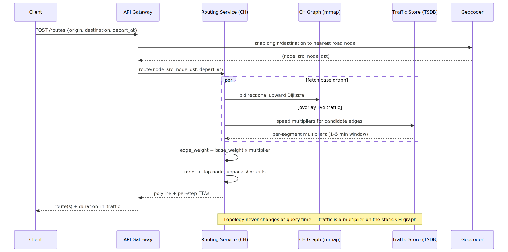
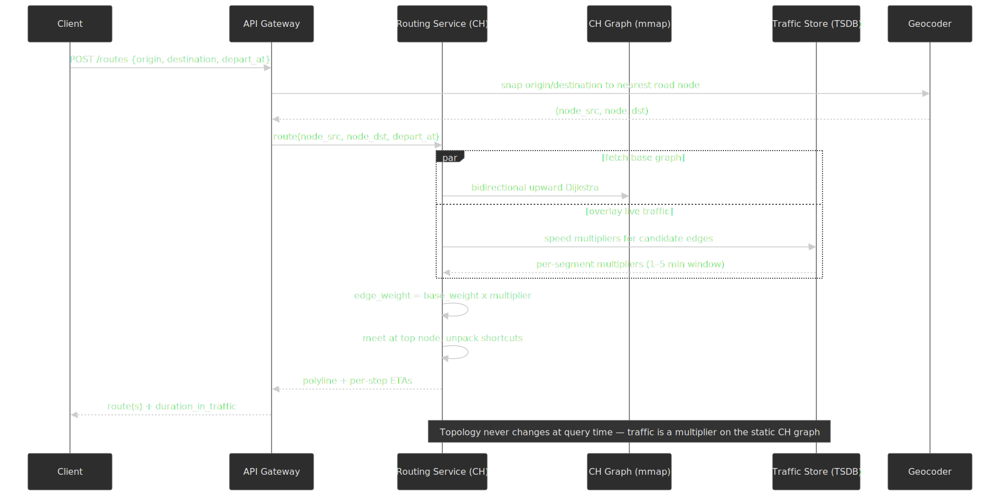

### Traffic Service

Collects, processes, and serves real-time traffic data.

**Data Sources:**

| Source               | Quality  | Latency   | Coverage          |
| -------------------- | -------- | --------- | ----------------- |
| GPS probes (mobile)  | Medium   | Real-time | High (urban)      |
| Connected cars (OEM) | High     | Real-time | Growing           |
| Road sensors         | High     | Real-time | Limited           |
| User reports         | Variable | Real-time | Incident-specific |
| Historical patterns  | N/A      | N/A       | Baseline          |

**Floating Car Data (FCD) Pipeline:**

```text
Probe → Map Matching → Segment Assignment → Speed Aggregation → Traffic State
```

1. **Probe ingestion**: Timestamped (lat, lon, speed) tuples
2. **Map matching**: Hidden Markov Model assigns probes to road segments
3. **Aggregation**: Window-based speed averaging (2-5 minute windows)
4. **Traffic state**: Free flow / Light / Moderate / Heavy / Standstill

**ETA prediction with Graph Neural Networks:**

Google Maps' work with DeepMind, peer-reviewed at CIKM 2021[^gnn-eta-2021] and described in the [DeepMind blog post][deepmind-blog]:

- **Supersegments** are sequences of adjacent road segments that experience correlated traffic — built dynamically by a route analyzer rather than statically per-region.
- **Graph structure**: nodes are road segments, edges are connectivity within a supersegment; a separate GNN runs per supersegment.
- **Features**: real-time speeds, historical speeds bucketed by day-of-week and time-of-day, segment metadata.
- **Output**: predicted travel time per supersegment; the route's ETA is the sum.

[deepmind-blog]: https://deepmind.google/blog/traffic-prediction-with-advanced-graph-neural-networks/

Reported results:

- The Google Maps baseline (before the GNN rollout) was already accurate within ±10 % on **>97 % of trips**[^deepmind2020] — the GNN's job is to attack the long tail of bad ETAs, not the median.
- The GNN model produced **up to ~50 % reduction in "negative ETA outcomes"** (cases where the actual time deviated from the prediction by more than the per-region threshold) in cities including Berlin, Jakarta, São Paulo, Sydney, Tokyo, and Washington D.C.[^deepmind2020]
- The CIKM paper reports a **>40 % reduction in negative ETA outcomes specifically in Sydney**[^gnn-eta-2021]; the "up to 50 %" figure is from the broader DeepMind blog announcement and varies by city.

### Geocoding Service

Converts between addresses and coordinates.

**Forward Geocoding Pipeline:**

```text
Input: "1600 Amphitheatre Parkway, Mountain View, CA"
  ↓
Address Parsing (libpostal): {street: "1600 Amphitheatre Parkway", city: "Mountain View", state: "CA"}
  ↓
Normalization: Expand abbreviations, standardize format
  ↓
Candidate Generation: Query spatial index for matching addresses
  ↓
Scoring: Rank by text similarity, location confidence
  ↓
Output: {lat: 37.4220, lng: -122.0841, confidence: 0.98}
```

**Reverse Geocoding:**

Given (lat, lon), find the nearest address:

1. Query R-tree/S2 index for nearby address points
2. Interpolate street address from road segment data
3. Return formatted address with administrative hierarchy

**Spatial indexing — pick by query shape, not by hype:**

| Index                        | Cell shape       | Hierarchy                  | Encoding                    | Strongest for                                                         |
| :--------------------------- | :--------------- | :------------------------- | :-------------------------- | :-------------------------------------------------------------------- |
| **R-tree** (PostGIS)         | Bounding boxes   | Balanced tree              | Page-sized nodes            | Range / window queries on heterogeneous geometries.                   |
| **Quadtree**                 | Square quadrants | Strict 4-way               | Recursive `(x, y, z)`       | Tile-aligned lookups; the same scheme that backs the rendering tiles. |
| **Geohash**[^geohash]        | Lat/lon rectangles | Strict, prefix-decoded   | Base-32 string, Z-order curve | Cheap prefix queries in plain key/value stores; databases like Redis and Elasticsearch ship native support. |
| **[Google S2][s2-hier]**     | Quadrilateral cells on cube faces | Strict 31 levels (0–30) | 64-bit integer, Hilbert curve | Global-scale point and region indexing where locality and arbitrary polygon coverage matter. |
| **[Uber H3][h3-cmp]**        | Hexagons on icosahedron faces | Approximate (face-specific) | 64-bit integer, no global Hilbert curve | Aggregations / heatmaps where uniform neighbor distance matters more than strict containment. |

[^geohash]: Geohash is a Z-order (Morton) curve over a flat lat/lon grid. It is simple and prefix-friendly but cell area distorts heavily at high latitudes, and two physically adjacent points can land on completely different prefixes when they straddle a cell boundary.

[s2-hier]: https://s2geometry.io/devguide/s2cell_hierarchy.html
[h3-cmp]: https://h3geo.org/docs/comparisons/s2/

Trade-offs that actually drive the choice:

- **Cell-area uniformity.** Hexagons (H3) have a single neighbor distance and the lowest area variance; S2 cells are roughly equal-area thanks to a quadratic projection adjustment[^s2-cells]; geohash rectangles get noticeably skinnier toward the poles.
- **Hierarchy semantics.** S2 and geohash are *strict* hierarchies — every child cell is fully contained in its parent, which makes cell-prefix containment queries trivial. H3's parent/child relationship is *approximate* — a child hexagon can poke outside its parent — so containment queries need a small fudge buffer[^h3-vs-s2].
- **Locality.** S2's Hilbert curve keeps spatially close cells close in the 1-D ID, which makes range scans on a normal B-tree behave like spatial scans[^s2-cells]. H3 has no global space-filling curve.
- **Tooling.** Geohash is supported almost everywhere out of the box. S2 powers Google Maps, Foursquare's place index, MongoDB's `2dsphere`, and CockroachDB's spatial queries[^s2-blog]. H3 is the Uber-internal default and the de-facto standard for ride-hailing-style aggregations.

[^s2-cells]: [S2 cells overview](https://s2geometry.io/devguide/s2cell_hierarchy.html) — six face cells at level 0, recursively subdivided into four children up to level 30 (≈ 0.7 cm² cells); cell IDs are encoded along a single Hilbert curve that spans all six faces for locality.
[^h3-vs-s2]: [S2 vs. H3](https://h3geo.org/docs/comparisons/s2/) — Uber's own comparison: H3 trades strict containment for hexagonal neighbor uniformity and is intentionally not a strict hierarchy.
[^s2-blog]: [Announcing the S2 library: geometry on the sphere](https://opensource.googleblog.com/2017/12/announcing-s2-library-geometry-on-sphere.html) — Google open-source blog, 2017. Lists Maps, Foursquare, MongoDB and CockroachDB as production users.

 vs. H3 hexagonal cells (icosahedron, approximate hierarchy).")

Google Maps standardized on S2 internally — it gives them strict hierarchy + Hilbert-curve locality, which is what makes prefix-bound `BETWEEN` scans behave like spatial range scans on standard storage engines.

, quadtree (tile-aligned), geohash (KV prefix), S2 (strict hierarchy + Hilbert-curve locality), H3 (hex aggregations).")

### Search Service (POI and Autocomplete)

**Place Autocomplete Data Structures:**

| Structure           | Lookup Time | Space  | Best For                |
| ------------------- | ----------- | ------ | ----------------------- |
| Trie                | O(m)        | High   | Exact prefix match      |
| Ternary Search Tree | O(m)        | Medium | Space-efficient prefix  |
| Pruning Radix Trie  | O(m)        | Low    | Production autocomplete |

Where m = query length.

**Ranking Signals:**

- Text relevance (edit distance, prefix match)
- Popularity (visit frequency)
- Recency (user's recent searches)
- Proximity (distance from user's location)
- Category match (restaurants, gas stations)

## API Design

### Tile API

**Endpoint:** `GET /tiles/{z}/{x}/{y}.{format}`

**Path Parameters:**

- `z`: Zoom level (0-22)
- `x`: Tile column
- `y`: Tile row
- `format`: `png`, `mvt` (vector), `pbf`

**Response Headers:**

```http
Content-Type: image/png | application/vnd.mapbox-vector-tile
Cache-Control: public, max-age=86400
ETag: "abc123"
```

**Response:** Binary tile data

**Caching Strategy:**

- CDN cache: 24 hours for zoom < 15, 1 hour for zoom ≥ 15
- Client cache: ETag-based conditional requests
- Cache hit rate target: > 95%

### Routing API

**Endpoint:** `POST /routes`

**Request:**

```json
{
  "origin": { "lat": 37.422, "lng": -122.0841 },
  "destination": { "lat": 37.7749, "lng": -122.4194 },
  "waypoints": [{ "lat": 37.5585, "lng": -122.2711 }],
  "mode": "driving",
  "departure_time": "2024-01-15T08:00:00Z",
  "alternatives": true,
  "traffic_model": "best_guess"
}
```

**Response:**

```json
{
  "routes": [
    {
      "legs": [
        {
          "distance": {"value": 45000, "text": "45 km"},
          "duration": {"value": 2700, "text": "45 min"},
          "duration_in_traffic": {"value": 3300, "text": "55 min"},
          "steps": [
            {
              "instruction": "Head north on Amphitheatre Pkwy",
              "distance": {"value": 500, "text": "500 m"},
              "duration": {"value": 60, "text": "1 min"},
              "polyline": "encoded_polyline_string",
              "maneuver": "turn-right"
            }
          ]
        }
      ],
      "overview_polyline": "encoded_polyline_string",
      "bounds": {"northeast": {...}, "southwest": {...}},
      "warnings": ["Route includes toll roads"]
    }
  ]
}
```

**Error Responses:**

- `400 Bad Request`: Invalid coordinates, missing required fields
- `404 Not Found`: No route found (disconnected points)
- `429 Too Many Requests`: Rate limit exceeded

**Rate Limits:** 1000 requests/minute per API key

### Geocoding API

**Forward Geocoding:**

`GET /geocode?address={address}&bounds={sw_lat,sw_lng,ne_lat,ne_lng}`

**Response:**

```json
{
  "results": [
    {
      "formatted_address": "1600 Amphitheatre Parkway, Mountain View, CA 94043",
      "geometry": {
        "location": {"lat": 37.4220, "lng": -122.0841},
        "location_type": "ROOFTOP",
        "viewport": {...}
      },
      "address_components": [
        {"long_name": "1600", "types": ["street_number"]},
        {"long_name": "Amphitheatre Parkway", "types": ["route"]}
      ],
      "place_id": "ChIJ..."
    }
  ]
}
```

**Reverse Geocoding:**

`GET /geocode?latlng={lat},{lng}`

### Place Autocomplete API

**Endpoint:** `GET /places/autocomplete?input={query}&location={lat},{lng}&radius={meters}`

**Response:**

```json
{
  "predictions": [
    {
      "description": "Googleplex, Mountain View, CA",
      "place_id": "ChIJ...",
      "structured_formatting": {
        "main_text": "Googleplex",
        "secondary_text": "Mountain View, CA"
      },
      "distance_meters": 1200
    }
  ]
}
```

**Debouncing:** Client should debounce requests (300ms) to reduce API calls during typing.

## Data Modeling

### Road Graph Schema

**Primary Store:** Custom binary format for in-memory graph processing

```text
Node:
  - id: uint64
  - lat: float32
  - lon: float32
  - ch_level: uint16  // Contraction hierarchy level

Edge:
  - source: uint64
  - target: uint64
  - distance: uint32  // meters
  - duration: uint32  // seconds (free flow)
  - road_class: uint8 // motorway, primary, secondary, etc.
  - is_shortcut: bool
  - shortcut_middle: uint64  // For path unpacking
```

**Storage:**

- Memory-mapped file for O(1) access
- Compressed with LZ4 for disk storage
- Sharded by geographic region (continent-level)

### Tile Metadata Schema

**Primary Store:** Object storage (S3-compatible) with key-value index

```text
Key: {layer}/{z}/{x}/{y}
Value: {
  tile_data: bytes,
  etag: string,
  generated_at: timestamp,
  source_version: string
}
```

**Tile Generation Pipeline:**

1. Raw map data (OpenStreetMap format)
2. Feature extraction and simplification per zoom level
3. Vector tile encoding (Mapbox Vector Tile spec)
4. Compression (gzip)
5. Upload to object storage

### Traffic Data Schema

**Primary Store:** Time-series database (InfluxDB, TimescaleDB, or custom)

```sql
CREATE TABLE traffic_observations (
  segment_id BIGINT NOT NULL,
  timestamp TIMESTAMPTZ NOT NULL,
  speed_kmh SMALLINT,
  probe_count SMALLINT,
  confidence REAL
);

-- Hypertable for time-series performance
SELECT create_hypertable('traffic_observations', 'timestamp');

-- Index for real-time lookups
CREATE INDEX idx_traffic_segment_time
ON traffic_observations(segment_id, timestamp DESC);
```

**Retention:**

- Raw observations: 7 days
- Hourly aggregates: 1 year
- Daily patterns: 5 years

### POI Schema

**Primary Store:** PostgreSQL with PostGIS extension

```sql
CREATE TABLE places (
  id UUID PRIMARY KEY DEFAULT gen_random_uuid(),
  name TEXT NOT NULL,
  location GEOGRAPHY(POINT, 4326) NOT NULL,
  category VARCHAR(50),
  address_components JSONB,
  popularity_score REAL DEFAULT 0,
  created_at TIMESTAMPTZ DEFAULT NOW(),
  updated_at TIMESTAMPTZ DEFAULT NOW()
);

CREATE INDEX idx_places_location ON places USING GIST(location);
CREATE INDEX idx_places_category ON places(category);
CREATE INDEX idx_places_name_trgm ON places USING GIN(name gin_trgm_ops);
```

### Database Selection Matrix

| Data Type           | Store                | Rationale                                 |
| ------------------- | -------------------- | ----------------------------------------- |
| Road graph          | Memory-mapped file   | O(1) access, no serialization overhead    |
| Tiles               | Object storage + CDN | Static content, high read volume          |
| Traffic (real-time) | Time-series DB       | Time-windowed queries, retention policies |
| Places/POI          | PostgreSQL + PostGIS | Spatial queries, full-text search         |
| User data           | PostgreSQL           | ACID, relational queries                  |
| Search index        | Elasticsearch        | Full-text, autocomplete, facets           |

## Low-Level Design

### Contraction Hierarchies Implementation


**Node Ordering Heuristic:**

```text
priority(v) = edge_difference(v)
            + contract_depth(v)
            + original_edges(v)
```

Where:

- `edge_difference`: Number of shortcuts that would be added minus edges removed
- `contract_depth`: Maximum hierarchy level among neighbors
- `original_edges`: Number of non-shortcut edges (prefer removing shortcuts first)

**Witness Search:**

Before adding a shortcut u→w (through v), check if a shorter path u→w exists without v:

```text
shortcut_needed = (d(u,v) + d(v,w)) < witness_search(u, w, excluding v)
```

Witness search is a bounded Dijkstra; the bound is the proposed shortcut length.

**Query Algorithm:**

```python
def ch_query(source, target):
    # Bidirectional Dijkstra, only "upward" edges
    forward = dijkstra_upward(source)
    backward = dijkstra_upward(target)

    # Find best meeting point
    best_dist = infinity
    meeting_node = None
    for node in forward.visited ∩ backward.visited:
        dist = forward.dist[node] + backward.dist[node]
        if dist < best_dist:
            best_dist = dist
            meeting_node = node

    # Unpack shortcuts recursively
    return unpack_path(source, meeting_node, target)
```

**Why "upward" only works:**

The hierarchy ensures that for any shortest path, there exists a path in the CH graph that only goes up (in CH level) from source, meets at some top node, then only goes up (reversed = down in original) to target. This dramatically prunes the search space.

### Map matching algorithm

Map matching assigns noisy, potentially sparse GPS probes to specific road segments. The reference algorithm is the Hidden Markov Model (HMM) approach by Newson and Krumm[^newson2009]:

- **Hidden states**: candidate road segments near each GPS observation.
- **Observations**: the GPS lat/lon (and sometimes heading and speed) at each timestep.
- **Emission probability**: a Gaussian centered on the candidate segment's projection of the GPS point — `P(z | r) ∝ exp(−d² / (2σ_z²))` where `d` is the perpendicular distance and `σ_z` is the GPS error (Newson uses 4.07 m on the dataset they collected).
- **Transition probability**: an exponential of the difference between great-circle distance and shortest-path routing distance between consecutive candidates — penalises sequences that would require teleportation.


**Algorithm (Viterbi):**

1. For each GPS point, take all road segments within ~200 m (Newson's default — denser radii like 50 m are sometimes used in dense urban networks at the cost of recall in tunnels and GPS-degraded areas).
2. Compute emission probability for each candidate.
3. Compute transition probabilities between consecutive candidates using shortest-path routing distance.
4. Find the maximum-likelihood path with Viterbi; backtrack to recover the matched segment sequence.

**Output**: a stream of `(segment_id, t_enter, t_exit)` tuples — the input the traffic aggregator needs to compute per-segment speeds.

[^newson2009]: [Hidden Markov Map Matching Through Noise and Sparseness](https://www.microsoft.com/en-us/research/wp-content/uploads/2016/12/map-matching-ACM-GIS-camera-ready.pdf) — Newson, Krumm (ACM SIGSPATIAL 2009). The canonical HMM map matching paper.

### Tile Rendering Pipeline

**Vector Tile Generation:**

1. **Feature extraction**: Query PostGIS for features in tile bounding box
2. **Simplification**: Douglas-Peucker algorithm, tolerance based on zoom level
3. **Clipping**: Clip features to tile boundary with buffer
4. **Encoding**: Convert to Mapbox Vector Tile (MVT) format
5. **Compression**: gzip for storage/transfer

**Simplification Tolerance:**

| Zoom Level | Tolerance (meters) | Rationale                            |
| ---------- | ------------------ | ------------------------------------ |
| 0-5        | 1000+              | Only major features visible          |
| 6-10       | 100-1000           | Country/state level                  |
| 11-15      | 10-100             | City level                           |
| 16+        | 1-10               | Street level, minimal simplification |

**MVT Structure:**

```protobuf
message Tile {
  repeated Layer layers = 3;
}

message Layer {
  required string name = 1;
  repeated Feature features = 2;
  repeated string keys = 3;    // Shared key list
  repeated Value values = 4;   // Shared value list
  optional uint32 extent = 5;  // Default 4096
}

message Feature {
  optional uint64 id = 1;
  repeated uint32 tags = 2;    // Indices into keys/values
  optional GeomType type = 3;
  repeated uint32 geometry = 4; // Command-encoded
}
```

Keys and values are deduplicated across features for compression.

## Frontend Considerations

### Tile Loading Strategy

**Viewport-Based Loading:**

```typescript
interface Viewport {
  center: LatLng
  zoom: number
  bounds: LatLngBounds
}

function getTilesForViewport(viewport: Viewport): TileCoord[] {
  const { bounds, zoom } = viewport
  const tiles: TileCoord[] = []

  const minTile = latLngToTile(bounds.southwest, zoom)
  const maxTile = latLngToTile(bounds.northeast, zoom)

  for (let x = minTile.x; x <= maxTile.x; x++) {
    for (let y = minTile.y; y <= maxTile.y; y++) {
      tiles.push({ z: zoom, x, y })
    }
  }

  return tiles
}
```

**Prefetching:**

- Load tiles 1 level above and below current zoom (for smooth zoom transitions)
- Load adjacent tiles outside viewport (buffer for panning)
- Typical: 20-30 tiles per view state

**Tile Cache (Client-Side):**

```typescript
class TileCache {
  private cache: Map<string, ImageBitmap>
  private maxSize: number = 500 // tiles
  private lru: string[] = []

  get(key: string): ImageBitmap | undefined {
    const tile = this.cache.get(key)
    if (tile) {
      // Move to end of LRU
      this.lru = this.lru.filter((k) => k !== key)
      this.lru.push(key)
    }
    return tile
  }

  set(key: string, tile: ImageBitmap): void {
    if (this.cache.size >= this.maxSize) {
      const evict = this.lru.shift()!
      this.cache.delete(evict)
    }
    this.cache.set(key, tile)
    this.lru.push(key)
  }
}
```

### Vector Tile Rendering

**WebGL Rendering Pipeline:**

1. Parse MVT protobuf → geometry arrays
2. Upload vertex buffers to GPU
3. Apply style rules (zoom-dependent line widths, colors)
4. Render with appropriate shaders

**Libraries:**

- Mapbox GL JS / MapLibre GL JS (WebGL-based)
- Leaflet with vector tile plugins (Canvas/SVG fallback)
- deck.gl for data visualization layers

**Performance Considerations:**

- Batch draw calls per layer
- Use instanced rendering for repeated symbols (icons)
- Level-of-detail: reduce vertex count at lower zooms
- Web Workers for MVT parsing (off main thread)

### Route Visualization

**Polyline Rendering:**

```typescript
interface RouteLayer {
  // Decoded polyline as [lat, lng] pairs
  coordinates: [number, number][]

  // Style
  strokeColor: string
  strokeWidth: number

  // Animation state (for traffic coloring)
  trafficSegments: {
    startIndex: number
    endIndex: number
    severity: "free_flow" | "light" | "moderate" | "heavy"
  }[]
}
```

**Traffic Coloring:**

| Severity  | Color            | Speed Ratio |
| --------- | ---------------- | ----------- |
| Free flow | Green (#4CAF50)  | > 0.8       |
| Light     | Yellow (#FFEB3B) | 0.6-0.8     |
| Moderate  | Orange (#FF9800) | 0.4-0.6     |
| Heavy     | Red (#F44336)    | < 0.4       |

**Animation (Navigation Mode):**

- Update position marker at 60fps
- Smooth interpolation between GPS updates
- Re-route detection: compare current position to expected route

### Offline Maps Implementation

**Download Strategy:**

```typescript
interface OfflineRegion {
  bounds: LatLngBounds
  minZoom: number
  maxZoom: number
  includeRouting: boolean
}

function estimateDownloadSize(region: OfflineRegion): number {
  let totalTiles = 0
  for (let z = region.minZoom; z <= region.maxZoom; z++) {
    const tilesAtZoom = countTilesInBounds(region.bounds, z)
    totalTiles += tilesAtZoom
  }
  // Average 30KB per compressed vector tile
  return totalTiles * 30 * 1024
}
```

**Storage Format:**

SQLite database with:

- Tile blobs keyed by (z, x, y)
- Metadata (region bounds, version, expiry)
- Road graph subset for offline routing

**Delta updates:**

1. Server generates a per-region diff between map versions, expressed as a list of changed `(z, x, y)` tile keys.
2. Client downloads only changed tiles, applies them to the local SQLite store, and bumps the version pointer.
3. Checksums per tile guard against partial downloads on flaky networks.

The savings depend entirely on edit density: a routine map data refresh in a stable region touches only a small fraction of tiles, while a major release that changes styling or schema is closer to a full re-download.

## Infrastructure Design

### CDN Architecture

**Tile CDN requirements:**

- Edge locations in 100+ cities for low first-byte time globally.
- High cache hit rate is the design target — public CDN guidance puts well-tuned static-content workloads in the 90–99 % range[^cloud-cdn]; tiles are an unusually friendly workload (immutable per version, addressable by a deterministic key) so the upper end is realistic.
- Origin shield to absorb cache misses and protect tile servers.
- Custom cache keys: `/{layer}/{z}/{x}/{y}` plus a version segment so you can invalidate a generation by changing the prefix.

[^cloud-cdn]: [Cloud CDN best practices](https://cloud.google.com/cdn/docs/best-practices) — Google Cloud documentation. Reference for what "good" cache hit rates look like across content classes.

**Cache Hierarchy:**

```text
User → Edge PoP → Regional Cache → Origin Shield → Tile Server
```

**Cache TTLs:**

| Zoom Level | TTL     | Rationale                              |
| ---------- | ------- | -------------------------------------- |
| 0-10       | 30 days | Rarely changes (coastlines, countries) |
| 11-15      | 7 days  | City infrastructure                    |
| 16-22      | 1 day   | Street details, POIs                   |

### Routing Service Deployment

**Memory Requirements:**

- North America CH graph: ~20 GB RAM
- Europe CH graph: ~15 GB RAM
- Global: ~100 GB RAM (sharded)

**Deployment Strategy:**

1. **Regional sharding**: Each region runs its own CH graph
2. **Cross-region routing**: Stitch at border nodes
3. **Replication**: 3 instances per region for availability
4. **Updates**: Blue-green deployment for new CH builds

### Cloud Architecture (AWS)

| Component          | Service                    | Configuration                               |
| ------------------ | -------------------------- | ------------------------------------------- |
| Tile CDN           | CloudFront                 | Global edge, S3 origin                      |
| Tile Storage       | S3                         | Standard for hot tiles, Glacier for archive |
| Routing Service    | ECS Fargate                | Memory-optimized (r6g.4xlarge equivalent)   |
| Traffic Ingestion  | Kinesis                    | Sharded by region                           |
| Traffic Processing | Lambda + Kinesis Analytics | Real-time aggregation                       |
| Geocoding          | OpenSearch                 | Geo queries, autocomplete                   |
| POI Database       | RDS PostgreSQL             | PostGIS extension                           |
| Graph Storage      | EFS                        | Shared memory-mapped files                  |


### Self-Hosted Alternatives

| Managed Service | Self-Hosted       | When to Self-Host        |
| --------------- | ----------------- | ------------------------ |
| CloudFront      | Nginx + Varnish   | Cost at extreme scale    |
| OpenSearch      | Elasticsearch     | Specific plugins needed  |
| RDS PostgreSQL  | PostgreSQL on EC2 | PostGIS extensions, cost |
| Kinesis         | Apache Kafka      | Higher throughput, cost  |
| Timestream      | InfluxDB          | Open-source flexibility  |

## Monitoring and Observability

### Key Metrics

**Tile Service:**

- Cache hit rate (target: > 95%)
- Tile generation latency (p99 < 200ms)
- Error rate by zoom level

**Routing Service:**

- Query latency (p50, p99)
- Routes not found rate
- Traffic overlay staleness

**Traffic Service:**

- Probe ingestion lag (target: < 30s)
- Segment coverage (% of roads with data)
- ETA accuracy (actual vs. predicted)

### Alerting Thresholds

| Metric              | Warning | Critical |
| ------------------- | ------- | -------- |
| Tile cache hit rate | < 90%   | < 80%    |
| Routing p99 latency | > 500ms | > 1s     |
| Traffic data lag    | > 2 min | > 5 min  |
| ETA accuracy        | < 95%   | < 90%    |

## Conclusion

The hard parts of a mapping platform are the boundaries between subsystems, not any one subsystem in isolation:

1. **Rendering at scale**: a quadtree of vector tiles is overwhelmingly cacheable and client-themable. The system's job at the tile boundary is mostly version management and CDN behavior.

2. **Fast routing**: a CH preprocessing step (minutes for a continent[^pch2025]) buys hundreds-of-microseconds queries; live traffic is layered on as a per-edge multiplier so the static structure stays valid. CRP and CCH are the better fit when the metric itself changes; ALT when the topology is dynamic.

3. **Accurate ETAs**: a Graph Neural Network on supersegments attacks the long tail of bad ETAs that aggregating per-segment averages misses, with 40–50 % reductions in negative outcomes in major cities[^gnn-eta-2021][^deepmind2020].

**Key trade-offs accepted:**

- Preprocessing time for query latency (CH model).
- Storage overhead (tens of bytes per node) for sub-millisecond queries.
- Eventual consistency in traffic data (1–5 minute aggregation windows are typical).

**Limitations:**

- CH rebuilds block on topology changes (new roads, permanent closures); transient closures have to be encoded as edge-weight overrides.
- Probe-based traffic falls off in rural and tunnel coverage; historical models fill the gap with reduced confidence.
- Offline routing requires shipping a regional CH subgraph and accepting that it cannot incorporate real-time traffic.

**Where it goes next:**

- Personalized routing (preferences, vehicle profiles, accessibility).
- Real-time construction and closure detection from probe anomalies.
- Multi-modal stitching (walk → transit → walk → ride-hail) over a unified routing surface.

## Appendix

### Prerequisites

- Graph algorithms (Dijkstra, A\*)
- Spatial indexing concepts (R-tree, quadtree)
- Distributed systems fundamentals
- CDN caching strategies

### Terminology

| Term                             | Definition                                                                 |
| -------------------------------- | -------------------------------------------------------------------------- |
| **CH (Contraction Hierarchies)** | Preprocessing technique that creates shortcuts to speed up routing queries |
| **MVT (Mapbox Vector Tile)**     | Protocol buffer format for encoding map features as vectors                |
| **FCD (Floating Car Data)**      | Anonymized GPS traces from vehicles used for traffic estimation            |
| **Supersegment**                 | Group of adjacent road segments with shared traffic patterns (GNN concept) |
| **Map Matching**                 | Algorithm to assign GPS probes to road network segments                    |
| **Web Mercator**                 | Map projection (EPSG:3857) used by most web maps                           |

### Summary

- **Tiles**: quadtree pyramid of MVT vector tiles, CDN-cached behind a versioned key, ~20–30 tiles loaded per viewport.
- **Routing**: Contraction Hierarchies with ~163 µs median queries on continental graphs (OSRM[^pch2025]); traffic applied as edge-weight multipliers, never as a rebuild.
- **Traffic**: FCD probes mapped to segments via HMM matching[^newson2009], aggregated in 1–5 minute windows, fused with historical patterns.
- **ETA**: per-segment baseline plus a GNN over supersegments to attack the long tail of bad ETAs[^gnn-eta-2021].
- **Geocoding**: address parsing (e.g. libpostal) + spatial index (R-tree / [S2](https://s2geometry.io/)), autocomplete on a pruning radix trie.
- **Offline**: SQLite-packed tiles plus a regional CH subgraph, refreshed via per-tile diffs.
- **Scale (estimated)**: ~1.7 M RPS tiles, ~70 K RPS routing at peak.

### References

- [Route Planning in Transportation Networks](https://arxiv.org/abs/1504.05140) — Bast, Delling, Goldberg, Müller-Hannemann, Pajor, Sanders, Wagner, Werneck (2015). The canonical survey of speedup techniques.
- [Contraction Hierarchies: Faster and Simpler Hierarchical Routing in Road Networks](https://ae.iti.kit.edu/1640.php) — Geisberger, Sanders, Schultes, Delling (2008). The original CH paper.
- [Parallel Contraction Hierarchies Can Be Efficient and Scalable](https://arxiv.org/html/2412.18008v3) — Wang et al., ICS 2025. Source for the OSRM 307 s / 163 µs benchmark on 87M-vertex North America.
- [Customizable Route Planning in Road Networks](https://www.microsoft.com/en-us/research/wp-content/uploads/2013/01/crp_web_130724.pdf) — Delling, Goldberg, Pajor, Werneck (2017). The CRP engine behind Bing Maps.
- [Hidden Markov Map Matching Through Noise and Sparseness](https://www.microsoft.com/en-us/research/wp-content/uploads/2016/12/map-matching-ACM-GIS-camera-ready.pdf) — Newson, Krumm (ACM SIGSPATIAL 2009).
- [ETA Prediction with Graph Neural Networks in Google Maps](https://arxiv.org/abs/2108.11482) — Derrow-Pinion et al. (CIKM 2021).
- [Traffic Prediction with Advanced Graph Neural Networks](https://deepmind.google/blog/traffic-prediction-with-advanced-graph-neural-networks/) — Google DeepMind blog (2020).
- [Mapbox Vector Tile Specification 2.1](https://github.com/mapbox/vector-tile-spec/blob/master/2.1/README.md).
- [OpenStreetMap zoom levels](https://wiki.openstreetmap.org/wiki/Zoom_levels) — meters per pixel formulas.
- [Web Mercator projection (EPSG:3857)](https://epsg.io/3857).
- [Google S2 Geometry Library](https://s2geometry.io/) and [Announcing the S2 Library](https://opensource.googleblog.com/2017/12/announcing-s2-library-geometry-on-sphere.html).
- [OSRM (Open Source Routing Machine)](https://github.com/Project-OSRM/osrm-backend) — production CH implementation.
- [GraphHopper](https://github.com/graphhopper/graphhopper) — alternate open-source CH stack.
- [libpostal](https://github.com/openvenues/libpostal) — address parsing library.
