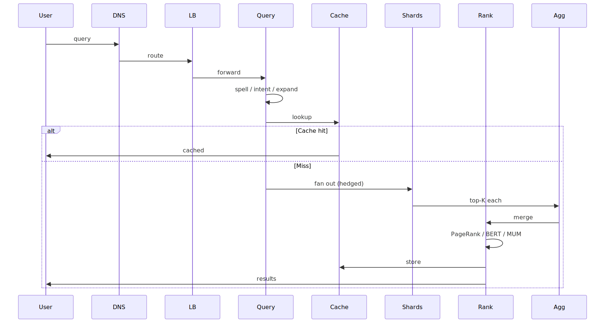
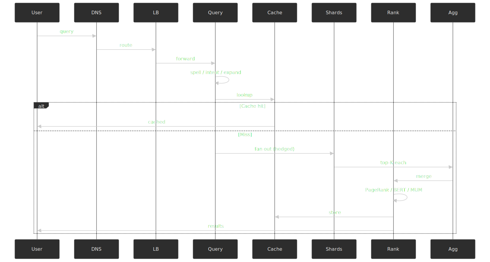

# Design Google Search

Web search is four loosely coupled systems pretending to be one: a **crawler** that pulls the changing web into local storage, an **indexer** that turns documents into queryable posting lists, a **ranker** that scores documents per query against hundreds of signals, and a **serving** layer that fans the query out across thousands of shards and merges the results inside a sub-second budget. This design walks each pillar at the level a senior engineer needs to recognise the trade-offs in a real system: how Google moved from batched MapReduce indexing to incremental indexing on Percolator, why the index is partitioned by document and not by term, how tail latency is mitigated, and where you can credibly substitute commodity components when you build your own.




## Mental model

Pin five concepts in this order — the rest of the article folds onto them:

1. **Inverted index.** A map from term → ordered posting list of documents containing that term. Almost every retrieval question reduces to "how do I store, partition, compress, and intersect posting lists at scale?"
2. **Document-partitioned sharding.** The index is split by document, not by term: each shard holds a complete inverted index for its slice of the corpus. Every query fans out to every shard ([why this beats term-partitioning at web scale](#index-sharding--document-vs-term)).
3. **Caffeine + Percolator.** Indexing is incremental, not batch: a crawl writes a row to Bigtable, [Percolator](https://research.google/pubs/large-scale-incremental-processing-using-distributed-transactions-and-notifications/) observers fire, the inverted index for the affected terms is rewritten in place. The repository is never rebuilt from scratch.
4. **Ranking is a stack, not a function.** Cheap signals (PageRank, BM25, freshness) cut the candidate set; expensive learned models ([BERT](https://blog.google/products-and-platforms/products/search/search-language-understanding-bert/), [MUM](https://blog.google/products-and-platforms/products/search/introducing-mum/), RankBrain) re-rank the survivors. Cost grows with quality; budget is enforced top-down.
5. **Tail latency is the budget.** With thousands of shards per query, the slowest shard sets the wall-clock time. The serving layer is engineered around [hedged and tied requests](https://research.google/pubs/the-tail-at-scale/), early termination, and partial results — not around making any single shard fast.

| Pillar | Scale anchor | Dominant trade-off |
| --- | --- | --- |
| Crawl | Tens of billions of fetches per day; politeness-bound per origin | Freshness vs. coverage |
| Index | Hundreds of billions of pages, > 100 PB of index data[^how-search-works] | Storage cost vs. query speed (compression depth) |
| Rank | Hundreds of signals per query[^ranking-howsearchworks] | Latency vs. ranking quality (model complexity) |
| Serve | 5+ trillion queries/year ≈ ~14 billion/day (March 2025)[^pichai-5t] | Completeness vs. p99 latency (fan-out tail) |

The propagation rule: a freshly crawled page can be served minutes later through the fresh tier and is reflected in the main index within hours, depending on the page's importance and Caffeine's per-row update budget.

## Requirements

### Functional

| Feature | Scope | Notes |
| --- | --- | --- |
| Web search | Core | Ranked results for a free-text query |
| Autocomplete | Core | Suggest queries while typing (separate index) |
| Spell correction | Core | Fix typos and offer "Did you mean" alternatives |
| Image search | Extended | Visual + textual signals |
| News search | Extended | Freshness-dominated ranking |
| Local search | Extended | Geographic re-ranking |
| Knowledge panels | Extended | Direct answers from the knowledge graph |
| Personalization | Core | Locale, language, prior history (within consent boundaries) |
| Safe search | Core | Filter explicit content |
| Pagination | Core | Navigate multiple pages of results |

### Non-functional

| Requirement | Target | Rationale |
| --- | --- | --- |
| Query latency | p50 ≈ 200 ms, p99 ≤ 500 ms | Slow pages bleed engagement and revenue; Google's *Milliseconds Make Millions* found measurable funnel + revenue impact from a 0.1 s site speed delta[^msmm] |
| Autocomplete latency | p99 < 100 ms | Must feel instantaneous between keystrokes |
| Availability | ≥ 99.99 % at the edge | Revenue-critical; billions of queries/day |
| Index freshness | Minutes for QDF news / hours for typical pages | Caffeine + a separate fresh-tier index |
| Index coverage | Hundreds of billions of pages[^how-search-works] | Comprehensive web coverage |
| Crawl politeness | Honor robots.txt ([RFC 9309](https://datatracker.ietf.org/doc/html/rfc9309)) and adaptive rate limiting | Avoid overloading origin servers; standardised since Sep 2022 |
| Result relevance | High precision in top 10 | Users rarely scroll past the first page |

### Scale estimation

Anchored to the most recent Google statement on volume — *"more than 5 trillion searches per year"*, [confirmed by Sundar Pichai in March 2025][pichai-5t-link][^pichai-5t]:

```text
Annual queries:  > 5 × 10^12
Daily queries:   ~14 × 10^9
QPS (avg):       ~160 K
QPS (peak):      ~3× avg → ~500 K (depending on time-zone overlap and event spikes)
Autocomplete:    ~10× search QPS (one request per keystroke after the first)
```

```text
Indexed pages:    hundreds of billions     [Google "How Search Works"]
Index data size:  > 100,000,000 GB ≈ > 100 PB
Per-page storage: ~100 KB compressed HTML
Per-page index:   ~10–20% of raw → posting lists in the hundreds of PB
```

```text
URL discovery:   tens of billions of new URLs/day (sitemaps + outlinks)
Pages crawled:   prioritised subset; politeness-bound per origin
Bandwidth:       petabytes/day across all crawlers
```

```text
Bigtable / Colossus:
  Bigtable clusters    = thousands of machines
  Colossus filesystems = single clusters scale to multiple exabytes;
                          some exceed 10 EB[^colossus]
  Index shards         = thousands per datacenter
  Replication factor   = ≥ 3 for durability + intra-DC failure tolerance
```

> [!NOTE]
> Google does not publish a current page count for the live index; the canonical number remains "hundreds of billions of webpages" in the official "How Search Works" pages[^how-search-works]. Treat the per-pillar numbers above as orders of magnitude, not promises.

## Design paths

The shape of the index dictates the rest of the system. Three reasonable shapes:

### Path A — monolithic single-datacenter index

Useful when:

- The corpus fits in a single cluster.
- Query volume is in the low thousands of QPS.
- Daily batch rebuilds are acceptable.




- Single index copy, simpler consistency.
- Vertical scaling on a few large boxes.
- Batch index rebuild; downtime or a stale read window during the swap.

Trade-offs:

- Simpler architecture and easier debugging; no distributed coordination overhead; strong consistency.
- Bounded by single-datacenter capacity; no geographic redundancy; rebuild windows force staleness.

Real-world example: Elasticsearch single-cluster deployments for enterprise search, comfortable into the billions of documents and thousands of QPS before coordination overhead bites.

### Path B — distributed sharded index (Google's shape)

Useful when:

- The corpus is web-scale.
- A global user base demands low edge latency.
- Continuous updates rule out rebuild windows.




- Index partitioned across thousands of machines.
- Each query fans out to all shards in parallel (this is the source of the tail-latency problem).
- Results are aggregated and re-ranked centrally.
- Shards are replicated across datacenters for redundancy and edge latency.

Trade-offs:

- Effectively unlimited horizontal scaling; geographic distribution; continuous updates; shard-level fault tolerance.
- Distributed coordination complexity; tail latency challenges (the slowest shard wins); cross-shard ranking requires a globally comparable score.

Real-world example: Google Search uses document-partitioned sharding with thousands of shards per datacenter. Index updates flow continuously through Caffeine; each shard handles a slice of the documents independently.

### Path C — tiered index (hot / warm / cold)

Useful when:

- The query distribution is heavy-tailed.
- Storage cost is a meaningful constraint.
- Different latency budgets for popular vs. rare queries are acceptable.




- Most queries served from the hot tier (RAM-resident posting lists).
- Warm tier on SSD covers mid-frequency terms.
- Cold tier on HDD/object storage covers the long tail.
- The split between tiers is a tunable engineering choice, not a fixed law; the typical pattern is "small fraction of terms account for most query volume".

Trade-offs:

- Optimal cost/performance ratio; sub-millisecond latency for popular queries; graceful degradation for rare ones.
- Tiering logic complexity; cache invalidation challenges; cold-start spikes when a previously cold term becomes popular.

Real-world example: Google combines tiered indexing with sharding. Frequently accessed posting lists stay memory-resident; cold terms live on disk. The system promotes/demotes based on access patterns rather than fixed quotas.

### Path comparison

| Factor | Path A (monolithic) | Path B (sharded) | Path C (tiered) |
| --- | --- | --- | --- |
| Scale ceiling | ~Billions of docs | Effectively unlimited | Effectively unlimited |
| Query latency | Low (no fan-out) | Higher (aggregation) | Tier-dependent |
| Index freshness | Batch updates | Continuous | Continuous |
| Complexity | Low | High | Medium |
| Cost efficiency | Low at scale | Medium | High |
| Best for | Enterprise search | Web-scale | Cost-sensitive web-scale |

### What this article assumes

The rest of the article assumes **Path B with Path C optimisations**. Web-scale search needs horizontal scaling beyond a single datacenter, users expect sub-second latency regardless of location, and modern serving layers combine document-partitioned shards with tiered storage for cost efficiency.

## High-level design

### Component overview

| Component | Responsibility | Scale |
| --- | --- | --- |
| URL frontier | Prioritised queue of URLs to crawl | Billions of URLs |
| Distributed crawler | Fetch pages; honour robots.txt + politeness | Millions of fetches/hour |
| Content parser | Extract text, links, metadata; render JS where needed | Per crawled page |
| Deduplication | Detect duplicate / near-duplicate pages via SimHash[^simhash] | Per parsed page |
| Indexer (Caffeine) | Update inverted index incrementally on Bigtable | Continuous; per-doc updates |
| Index shards | Store and serve posting lists | Thousands of shards |
| Query processor | Spell-correct, classify intent, expand, route | 100K+ QPS |
| Ranking engine | Score and re-rank results | Hundreds of signals |
| Result aggregator | Merge per-shard top-K | Sub-100 ms aggregation |
| Cache layer | Frequent query results, hot posting lists | Multi-tier |

### Request flow




### Crawl pipeline




## API design

### Search query

```http
GET /search?q=distributed+systems&num=10&start=0
Authorization: Bearer {api_key}
Accept-Language: en-US
X-Forwarded-For: {client_ip}
```

| Parameter | Type | Description |
| --- | --- | --- |
| `q` | string | Search query (URL-encoded) |
| `num` | int | Results per page (default 10, max 100) |
| `start` | int | Offset for pagination |
| `lr` | string | Language restriction (e.g. `lang_en`) |
| `gl` | string | Geolocation (country code) |
| `safe` | string | Safe search (`off`, `medium`, `strict`) |
| `dateRestrict` | string | Time filter (e.g. `d7`, `m1`, `y1`) |

Response (`200 OK`):

```json
{
  "query": {
    "original": "distribted systems",
    "corrected": "distributed systems",
    "expanded_terms": ["distributed computing", "distributed architecture"]
  },
  "search_info": {
    "total_results": 2340000000,
    "search_time_ms": 187,
    "spelling_correction_applied": true
  },
  "results": [
    {
      "position": 1,
      "url": "https://example.com/distributed-systems-guide",
      "title": "Distributed Systems: A Comprehensive Guide",
      "snippet": "Learn about distributed systems architecture, including consensus algorithms, replication strategies, and fault tolerance...",
      "displayed_url": "example.com › guides › distributed-systems",
      "cached_url": "https://webcache.example.com/...",
      "page_info": {
        "last_crawled": "2026-03-15T10:00:00Z",
        "language": "en",
        "mobile_friendly": true
      }
    }
  ],
  "related_searches": ["distributed systems design patterns", "distributed systems vs microservices"],
  "knowledge_panel": {
    "title": "Distributed system",
    "description": "A distributed system is a system whose components are located on different networked computers...",
    "source": "Wikipedia"
  },
  "pagination": {
    "current_page": 1,
    "next_start": 10,
    "has_more": true
  }
}
```

| Code | Condition | Response |
| --- | --- | --- |
| `400 Bad Request` | Empty query, invalid parameters | `{"error": {"code": "invalid_query"}}` |
| `429 Too Many Requests` | Rate limit exceeded | `{"error": {"code": "rate_limited", "retry_after": 60}}` |
| `503 Service Unavailable` | System overload | `{"error": {"code": "overloaded"}}` |

### Autocomplete

```http
GET /complete?q=distrib&client=web
```

```json
{
  "query": "distrib",
  "suggestions": [
    { "text": "distributed systems", "score": 0.95 },
    { "text": "distributed computing", "score": 0.87 },
    { "text": "distribution center near me", "score": 0.72 },
    { "text": "distributed database", "score": 0.68 }
  ],
  "latency_ms": 8
}
```

Autocomplete must complete in well under 100 ms. Suggestions come from a separately optimised, trie-based index of popular queries — not the main document index.

### Crawl status (internal API)

```http
GET /internal/crawl/status?url=https://example.com/page
Authorization: Internal-Service-Key {key}
```

```json
{
  "url": "https://example.com/page",
  "canonical_url": "https://example.com/page",
  "last_crawl": "2026-03-15T08:30:00Z",
  "next_scheduled_crawl": "2026-03-16T08:30:00Z",
  "crawl_frequency": "daily",
  "index_status": "indexed",
  "robots_txt_status": "allowed",
  "page_quality_score": 0.78
}
```

## Data modelling

### Document storage in Bigtable

Crawled pages live in a Bigtable "webtable" — the canonical example from the [Bigtable paper, OSDI 2006](https://research.google.com/archive/bigtable-osdi06.pdf). Row keys are the page URL with the **hostname components reversed**, so all pages from one host land in contiguous rows.

The paper's own example: `maps.google.com/index.html` is stored under row key `com.google.maps/index.html`. This makes range scans for `com.google.*` cheap, gives the on-disk Bentley–McIlroy compression a long run of common-host boilerplate to deduplicate, and lets host- and domain-level analyses (link graph aggregation, robots.txt cache, per-host quality) run as a contiguous scan rather than a scatter.

Column families:

| Column family | Columns | Description |
| --- | --- | --- |
| `content` | `html`, `text`, `title`, `meta` | Page content |
| `links` | `outlinks`, `inlinks` | Link graph |
| `crawl` | `last_crawl`, `next_crawl`, `status` | Crawl metadata |
| `index` | `indexed_at`, `shard_id` | Index status |
| `quality` | `pagerank`, `spam_score`, `mobile_score` | Quality signals |

Schema (conceptual):

```text
Row: com.example.www/distributed-systems
├── content:html        → "<html>..."
├── content:text        → "Distributed systems are..."
├── content:title       → "Distributed Systems Guide"
├── links:outlinks      → ["com.other.www/page1", "org.wiki.en/dist"]
├── links:inlinks       → ["com.blog.www/article", ...]
├── crawl:last_crawl    → 1742044800 (timestamp)
├── crawl:status        → "success"
├── quality:pagerank    → 0.00042
└── quality:spam_score  → 0.02
```

### Inverted index structure

The inverted index maps terms to **posting lists** — ordered lists of documents containing that term, with positions and frequencies attached.

Posting list (logical):

```text
Term: "distributed"
├── Document IDs: [doc_123, doc_456, doc_789, ...]
├── Positions:    [[5, 23, 107], [12], [3, 45, 89, 201], ...]
├── Frequencies:  [3, 1, 4, ...]
└── Quality hints: [0.9, 0.7, 0.85, ...]   # used for ordering / early termination
```

Compression — three independent layers:

- **Document IDs** — delta encoding (store the delta between consecutive sorted doc IDs, not the absolute value).
  - Original: `[100, 105, 112, 150]` → deltas `[100, 5, 7, 38]`. Smaller integers compress dramatically better with variable-byte / Elias-Fano encoding.
- **Positions** — delta encoded inside each document's position list.
- **Frequencies** — variable-byte encoded.

Index entry (conceptual):

```sql
-- Logical structure (production uses a custom binary format).
term_id:      uint64    -- Hashed term
doc_count:    uint32    -- Number of documents containing the term
posting_list: bytes     -- Compressed posting data
  ├── doc_ids:   varint[]   -- Delta-encoded document IDs
  ├── freqs:     varint[]   -- Term frequencies per doc
  └── positions: bytes      -- Position data for phrase queries
```

### URL frontier schema

```sql
CREATE TABLE url_frontier (
    url_hash         BIGINT PRIMARY KEY,   -- Hash of normalized URL
    url              TEXT NOT NULL,
    domain_hash      BIGINT NOT NULL,      -- For politeness grouping
    priority         FLOAT NOT NULL,       -- Crawl priority (0-1)
    last_crawl_time  TIMESTAMP,
    next_crawl_time  TIMESTAMP NOT NULL,
    crawl_frequency  INTERVAL,
    retry_count      INT DEFAULT 0,
    status           VARCHAR(20) DEFAULT 'pending',

    -- Partitioned by priority for efficient dequeue.
    INDEX idx_priority (priority DESC, next_crawl_time ASC),
    INDEX idx_domain   (domain_hash, next_crawl_time ASC)
);
```

Politeness: at most one outstanding request per host (often per IP) at a time, with a host-specific delay derived from `Crawl-delay` (deprecated but still observed by many engines), adaptive backoff, and HTTP `429` / `503` signals. The `domain_hash` index makes per-host rate-limiting an indexed scan, not a full-table operation.

### Storage selection matrix

| Data | Store | Rationale |
| --- | --- | --- |
| Crawled pages | Bigtable on Colossus | Petabyte scale; row-key range scans; cheap per-row updates |
| Inverted index | Custom sharded stores on Colossus | Optimised for posting list access patterns |
| URL frontier | Distributed queue (Bigtable + in-memory cache) | Priority + per-host fairness |
| Query cache | Distributed cache (Memcached-class) | Sub-ms latency, high hit rate on the head of the distribution |
| PageRank scores | Bigtable | Updated periodically; read during indexing + ranking |
| Query logs | Columnar store (BigQuery-class) | Analytics, ML training |
| robots.txt cache | In-memory cache | Per-host, TTL-based |

## Indexing — Caffeine and Percolator

Until 2010 Google's index was rebuilt by a multi-stage pipeline of roughly 100 MapReduces. Adding a single newly crawled page meant waiting for the next pipeline tick, because reprocessing time scaled with the size of the entire repository, not with the size of the update. **Caffeine**, deployed in 2010, replaced the batch path with **Percolator** — a system of cross-row ACID transactions on Bigtable plus *observers* that fire when watched columns change[^percolator]. The headline numbers from the OSDI 2010 paper: average document age in search results dropped by 50%, and per-document processing latency improved by ~100×[^percolator].




The mental model:

- **Bigtable holds the canonical document** (the webtable row).
- A new write triggers Percolator **observers** — application-defined functions registered against specific columns.
- Each observer runs inside a Percolator **snapshot-isolation transaction** that may touch many rows across many tablets.
- Cascading observer chains converge once nothing further fires; the row is then "indexed" and visible to serving.

This buys two properties classical batch indexing cannot:

- **Cost is proportional to the update size, not the corpus size.** Crawling a few million new pages an hour costs a few million updates, not a 100-PB rescan.
- **A single page can be added without rebuilding adjacent state.** The link graph, the duplicate cluster, and the affected posting lists are updated in lockstep.

Trade-offs Google was explicit about[^percolator]:

- Percolator is roughly **30× more expensive per-byte** than the equivalent MapReduce — the right tool for many small updates, the wrong tool when you actually need to reprocess > ~40 % of the corpus.
- The system depends on Bigtable's per-row + cross-row transaction primitives. You cannot bolt this on top of an arbitrary KV store.

In an interview answer, the right framing is: *Caffeine is what made "incremental" plausible at this scale; the inverted index is still the data structure, but it's now mutated row-by-row instead of rebuilt batch-by-batch.* The MapReduce path still exists for full reprocessing (e.g. a global signal change), but it is the exception, not the steady state.

A schematic of the batched / initial-build path is still useful as a mental anchor:




A conceptual MapReduce sketch — useful for showing the per-shard write path:

```typescript collapse={1-10, 55-70} title="index-builder.ts"
interface Document {
  doc_id: string
  url: string
  content: string
  quality_score: number
}

interface Posting {
  doc_id: number
  frequency: number
  positions: number[]
}

function mapDocument(doc: Document): Map<string, Posting> {
  const terms = new Map<string, Posting>()
  const tokens = tokenize(doc.content)

  for (let pos = 0; pos < tokens.length; pos++) {
    const term = normalize(tokens[pos])

    if (!terms.has(term)) {
      terms.set(term, {
        doc_id: hashDocId(doc.doc_id),
        frequency: 0,
        positions: [],
      })
    }

    const posting = terms.get(term)!
    posting.frequency++
    posting.positions.push(pos)
  }

  return terms
}

function reducePostings(term: string, postings: Posting[]): PostingList {
  postings.sort((a, b) => b.quality_score - a.quality_score)

  return {
    term,
    doc_count: postings.length,
    postings: deltaEncode(postings),
  }
}

function deltaEncode(postings: Posting[]): Buffer {
  const buffer = new CompressedBuffer()
  let prevDocId = 0

  for (const posting of postings) {
    buffer.writeVarint(posting.doc_id - prevDocId)
    buffer.writeVarint(posting.frequency)
    buffer.writePositions(posting.positions)
    prevDocId = posting.doc_id
  }

  return buffer.toBuffer()
}
```

| Approach | Latency | Complexity | Use case |
| --- | --- | --- | --- |
| Full rebuild (MapReduce) | Hours | Low | Bootstrapping; corpus-wide signal change |
| Incremental (Caffeine / Percolator) | Seconds–minutes | High | Steady-state web indexing |
| Real-time append (fresh tier) | Seconds | High | Breaking news, freshness-critical content |

Google runs all three in parallel: the main index is updated incrementally, a separate fresh-tier index handles real-time content, and the batch path stays available for occasional reprocessing.

## Index sharding — document vs term

The "fan out to all shards" decision is a direct consequence of choosing **document partitioning** over term partitioning.




| Property | Document-partitioned | Term-partitioned |
| --- | --- | --- |
| Each shard holds | A full inverted index over its slice of documents | Posting lists for a slice of the vocabulary |
| Query routing | Broadcast to all shards | Routed only to shards holding query terms |
| Write path | Append-only per shard | Cross-shard write per indexed term |
| Load balance | Even (random-hash assignment) | Skewed (Zipfian term frequency makes hot shards) |
| Fault tolerance | Lose one shard → lose 1/N of corpus, partial result | Lose a hot-term shard → broken queries |
| Network during query | Top-K from each shard | Posting lists copied between shards to intersect |

Web-scale engines, including Google, choose document partitioning despite the broadcast cost — the load and failure properties are dramatically better, and the broadcast cost is amortised by per-shard top-K and aggressive aggregation. Manning, Raghavan & Schütze's *Introduction to Information Retrieval* spells out the same conclusion: *"Most large search engines prefer the document-partitioned index"*[^iir-distributed].

> [!IMPORTANT]
> If your interviewer asks "what would happen if you partitioned by term?", the right answer leads with **load skew from the Zipfian term distribution** (a handful of terms dominate query and write volume) and the **fan-out you cannot avoid** for any realistic multi-term query. Term partitioning only earns its keep at small scale, in single-term workloads, or as a secondary index.

## Low-level design

### Query processing pipeline







#### Spell correction

Google's production spell corrector is a deep neural network with **more than 680 million parameters** that runs in **under two milliseconds** per query, described by Pandu Nayak in the *ABCs of spelling in Google Search* blog post[^spell]. It is trained on aggregate query logs — when millions of users follow `javasript` with `javascript`, the model learns the correction. This is also why spell correction works less well on rare technical terms (no signal) and in low-resource languages (smaller log volume).

```typescript collapse={1-8, 40-50} title="spell-correction.ts"
interface SpellResult {
  original: string
  corrected: string
  confidence: number
  alternatives: string[]
}

async function correctSpelling(query: string): Promise<SpellResult> {
  if (await isKnownPhrase(query)) {
    return { original: query, corrected: query, confidence: 1.0, alternatives: [] }
  }

  const modelOutput = await spellModel.predict(query)
  const contextualCorrection = applyContextRules(query, modelOutput)
  const popularMatch = await findPopularMatch(contextualCorrection)

  return {
    original: query,
    corrected: popularMatch || contextualCorrection,
    confidence: modelOutput.confidence,
    alternatives: modelOutput.alternatives.slice(0, 3),
  }
}
```

### Ranking system architecture

Google's ranking is a layered ensemble — official documentation calls out "many factors and signals"[^ranking-howsearchworks]; community lists put the figure in the hundreds. The architectural shape is the important part:




#### PageRank

PageRank measures page authority from the link graph as the stationary distribution of a random web surfer following links with damping factor `d` (the original paper used `d = 0.85`)[^pagerank]:

$$
PR(A) = \frac{1 - d}{N} + d \sum_{T_i \in \text{in}(A)} \frac{PR(T_i)}{C(T_i)}
$$

```typescript collapse={1-12, 50-60} title="pagerank.ts"
interface PageGraph {
  pages: Map<string, string[]>
  inlinks: Map<string, string[]>
}

const DAMPING_FACTOR = 0.85
const CONVERGENCE_THRESHOLD = 0.0001
const MAX_ITERATIONS = 100

function computePageRank(graph: PageGraph): Map<string, number> {
  const numPages = graph.pages.size
  const initialRank = 1.0 / numPages

  let ranks = new Map<string, number>()
  for (const page of graph.pages.keys()) {
    ranks.set(page, initialRank)
  }

  for (let iter = 0; iter < MAX_ITERATIONS; iter++) {
    const newRanks = new Map<string, number>()
    let maxDelta = 0

    for (const page of graph.pages.keys()) {
      let inlinkSum = 0
      const inlinks = graph.inlinks.get(page) || []

      for (const inlink of inlinks) {
        const inlinkRank = ranks.get(inlink) || 0
        const outlinks = graph.pages.get(inlink) || []
        if (outlinks.length > 0) {
          inlinkSum += inlinkRank / outlinks.length
        }
      }

      const newRank = (1 - DAMPING_FACTOR) / numPages + DAMPING_FACTOR * inlinkSum
      newRanks.set(page, newRank)

      maxDelta = Math.max(maxDelta, Math.abs(newRank - (ranks.get(page) || 0)))
    }

    ranks = newRanks

    if (maxDelta < CONVERGENCE_THRESHOLD) {
      break
    }
  }

  return ranks
}
```

PageRank at scale:

- Web graph: hundreds of billions of nodes, trillions of edges.
- Computation: distributed iteration across thousands of machines (originally MapReduce; now incremental updates via Caffeine for affected subgraphs).
- Frequency: refreshed continuously rather than on a fixed monthly cadence.
- Storage: PageRank scores live in the `quality:pagerank` column of the webtable.

#### BERT

[BERT](https://blog.google/products-and-platforms/products/search/search-language-understanding-bert/) (Bidirectional Encoder Representations from Transformers) was launched in Google Search on 25 October 2019 and initially affected ~1 in 10 English US queries; it later rolled out to 70+ languages[^bert]. The point of BERT for search is **understanding the role of small words** ("for", "to", "without") that change query intent:

```text
Query:  "can you get medicine for someone pharmacy"
Pre-BERT: matches pages about "medicine" and "pharmacy" independently
Post-BERT: understands intent as "picking up a prescription for another person"
```

#### RankBrain and MUM

[RankBrain](https://blog.google/products-and-platforms/products/search/how-ai-powers-great-search-results/), launched in 2015, was Google's first ML system in ranking — it embeds queries and candidate documents into a shared vector space and uses cosine similarity as one of many ranking signals.

```text
Query vector: [0.23, -0.45, 0.12, ...]   (hundreds of dimensions)
Doc vector:   [0.21, -0.42, 0.15, ...]
Similarity:   cosine_similarity(query_vec, doc_vec) ≈ 0.94
```

[MUM](https://blog.google/products-and-platforms/products/search/introducing-mum/) (Multitask Unified Model), announced May 2021, is the multimodal, multilingual successor — trained across 75 languages and on text + images simultaneously, framed as "1000× more powerful than BERT" by Google[^mum]. MUM rolls out behind specific features (e.g. expanded coverage on COVID vaccine names, certain visual / language tasks) rather than as a single switchover.

The architectural rule: cheap signals (BM25, PageRank, freshness) retrieve a candidate set per shard, expensive learned models (BERT/MUM/RankBrain) re-rank the survivors. Putting BERT in the retrieval path would blow the latency budget; putting BM25 in the re-ranking path would waste compute.

#### Two-stage retrieval and re-ranking

Modern web-scale ranking is **phased**, not monolithic. Vespa documents the same pattern under the name *phased ranking*: a `first-phase` cheap function over all retrieved hits, a `second-phase` over local top-K on each content node, and a `global-phase` cross-encoder on the merged top-K at the stateless container[^vespa-phased]. Google's serving stack follows the same shape, scaled to thousands of shards.




The cost ratio between stages is what makes this work — a BM25 disjunction over a posting list pruned by [WAND](https://www.cs.princeton.edu/courses/archive/spr03/cs226/papers/wand.pdf) costs microseconds per document; a BERT cross-encoder costs milliseconds. With ~10^3 candidates per shard reduced to the top ~10^3 globally, the cross-encoder budget is bounded regardless of corpus size.

#### Neural matching and hybrid retrieval

Cheap retrieval no longer means *only* lexical. Google's official *How AI powers great search results* page describes **neural matching** (deployed in 2018) as a retrieval-side system that "looks at an entire query or page rather than just keywords" and is explicitly distinct from RankBrain's ranking-side role[^how-ai-search]. Search Engine Journal's reporting of Google's own clarifications puts it bluntly: "Neural matching helps us understand how queries relate to pages … RankBrain helps us rank"[^sej-neural-matching]. In production-engine terms this is **hybrid retrieval** — a sparse inverted index in parallel with a dense ANN index over learned embeddings, fused before re-ranking.




Practical notes:

- The dense path uses a **bi-encoder** (query and document encoded independently, scored by cosine / dot product) so embeddings can be precomputed and served from an ANN index. Cross-encoders are reserved for the re-rank stage where they only see ~10^3 candidates per query.
- ANN structures in production are typically **HNSW** (graph-based, high recall, RAM-resident) or **IVF-PQ** (inverted file with product quantisation, cheaper RAM at the cost of recall). Vespa, Elasticsearch, OpenSearch and Vespa-class engines all expose both.
- Fusion is most often **Reciprocal Rank Fusion** (`score = Σ 1 / (k + rank_i)` across the two lists, `k ≈ 60`) or a learned linear combination — both cheap, both recoverable from per-engine ranks alone.
- Hybrid retrieval is also the retrieval substrate of modern **retrieval-augmented generation** (RAG): the same sparse + dense + rerank pipeline feeds the context window of an LLM instead of an SERP renderer.

### Distributed query execution

Querying a sharded index requires fan-out to all shards, parallel execution, and result aggregation under a strict deadline. With document partitioning the broadcast cost is unavoidable; the engineering work is in **bounding the tail** — every replica is a candidate, the slowest one would otherwise win.




```typescript collapse={1-15, 70-85} title="query-executor.ts"
interface ShardResult {
  shard_id: number
  results: ScoredDocument[]
  latency_ms: number
}

interface QueryPlan {
  query: ParsedQuery
  shards: ShardConnection[]
  timeout_ms: number
  top_k_per_shard: number
}

async function executeQuery(plan: QueryPlan): Promise<SearchResult[]> {
  const { query, shards, timeout_ms, top_k_per_shard } = plan

  const shardPromises = shards.map((shard) =>
    queryShard(shard, query, top_k_per_shard).catch((err) => ({
      shard_id: shard.id,
      results: [],
      latency_ms: timeout_ms,
      error: err,
    })),
  )

  const shardResults = await Promise.race([Promise.all(shardPromises), sleep(timeout_ms).then(() => "timeout")])

  if (shardResults === "timeout") {
    return aggregatePartialResults(shardPromises)
  }

  return mergeAndRank(shardResults as ShardResult[], query)
}

function mergeAndRank(shardResults: ShardResult[], query: ParsedQuery): SearchResult[] {
  const candidates: ScoredDocument[] = []
  for (const result of shardResults) {
    candidates.push(...result.results)
  }

  candidates.sort((a, b) => b.score - a.score)

  const reranked = applyFinalRanking(candidates.slice(0, 1000), query)

  return reranked.slice(0, query.num_results)
}

async function queryShard(shard: ShardConnection, query: ParsedQuery, topK: number): Promise<ShardResult> {
  const start = Date.now()

  const postingLists = await shard.getPostingLists(query.terms)

  const candidates = intersectPostingLists(postingLists)

  const scored = candidates.map((doc) => ({
    doc,
    score: computeLocalScore(doc, query),
  }))

  scored.sort((a, b) => b.score - a.score)

  return {
    shard_id: shard.id,
    results: scored.slice(0, topK),
    latency_ms: Date.now() - start,
  }
}
```

#### Tail latency

The fundamental observation from [Dean & Barroso, *The Tail at Scale* (CACM 2013)](https://research.google/pubs/the-tail-at-scale/): a service that fans out to N replicas is at the mercy of the slowest one, and at N = 1000 even a 99th-percentile shard latency dominates the median user-visible latency[^tail]. The paper documents the techniques the serving layer relies on:

| Technique | Description |
| --- | --- |
| **Hedged requests** | After a short delay (e.g. the 95th-percentile expected latency) send a duplicate request to a replica; use whichever responds first; cancel the loser. |
| **Tied requests** | Send to two replicas effectively simultaneously; each tells the other when it begins work so the other can abort. Better when queueing variance is the dominant cause. |
| **Partial results** | If some shards miss the deadline, return what completed; the missing shards' top-K is unlikely to dominate the global top-10. |
| **Early termination** | Posting lists are ordered by per-document quality so a shard can stop as soon as it has K candidates that no remaining doc could outscore. |
| **Replica imbalance** | Hot shards run on faster machines or with more replicas; the load balancer prefers fast replicas. |

The cost is bounded — hedged requests typically add a small percentage of extra load in exchange for an order-of-magnitude tail-latency improvement[^tail]. They are safe for read-only or idempotent operations and explicitly inappropriate for non-idempotent writes.

### Crawl scheduling and politeness

```typescript collapse={1-12, 60-75} title="crawl-scheduler.ts"
interface CrawlJob {
  url: string
  domain: string
  priority: number
  lastCrawl: Date | null
  estimatedChangeRate: number
}

interface DomainState {
  lastRequestTime: Date
  crawlDelay: number
  concurrentRequests: number
  maxConcurrent: number
}

class CrawlScheduler {
  private domainStates: Map<string, DomainState> = new Map()
  private frontier: PriorityQueue<CrawlJob>

  async scheduleNext(): Promise<CrawlJob | null> {
    while (!this.frontier.isEmpty()) {
      const job = this.frontier.peek()

      const domainState = this.getDomainState(job.domain)

      if (!this.canCrawlNow(domainState)) {
        this.frontier.pop()
        this.frontier.push(job)
        continue
      }

      if (domainState.concurrentRequests >= domainState.maxConcurrent) {
        continue
      }

      domainState.concurrentRequests++
      domainState.lastRequestTime = new Date()

      return this.frontier.pop()
    }

    return null
  }

  private canCrawlNow(state: DomainState): boolean {
    const elapsed = Date.now() - state.lastRequestTime.getTime()
    return elapsed >= state.crawlDelay * 1000
  }

  updateCrawlDelay(domain: string, responseTimeMs: number, statusCode: number): void {
    const state = this.getDomainState(domain)

    if (statusCode === 429 || statusCode === 503) {
      state.crawlDelay = Math.min(state.crawlDelay * 2, 60)
    } else if (responseTimeMs > 2000) {
      state.crawlDelay = Math.min(state.crawlDelay * 1.5, 30)
    } else if (responseTimeMs < 200 && state.crawlDelay > 1) {
      state.crawlDelay = Math.max(state.crawlDelay * 0.9, 1)
    }
  }
}
```

The robots.txt protocol itself — long a de facto standard — was published as [RFC 9309](https://datatracker.ietf.org/doc/html/rfc9309) in September 2022; it formalises the parsing rules that crawlers had been implementing inconsistently for two decades.

Crawl prioritisation factors:

| Factor | Weight | Rationale |
| --- | --- | --- |
| PageRank | High | Important pages should stay fresh |
| Update frequency | High | Pages that change often need frequent crawls |
| User demand | High | Popular query results need freshness |
| Sitemap priority | Medium | Webmaster hint |
| Time since last crawl | Medium | Spread crawl load |
| robots.txt + 429/503 backoff | Mandatory | Politeness floor |

### Near-duplicate detection (SimHash)

Crawled pages overlap heavily — mirrors, syndication, parameter-stuffed URLs, boilerplate. The standard tool is **SimHash**, originally Charikar's locality-sensitive hash, applied to web crawling at Google by Manku, Jain & Das Sarma (WWW 2007)[^simhash]:

- Each document is reduced to a **64-bit fingerprint** that is similar (small Hamming distance) when the documents are similar.
- For a corpus of 8 billion pages, a Hamming distance of `k ≤ 3` was found sufficient to identify near-duplicates with high precision[^simhash].
- The system is online: the crawler computes a fingerprint, looks for any existing fingerprint within Hamming distance `k`, and if found discards the page (and often its outlinks).

Without this step the crawl wastes bandwidth and the index wastes storage on near-identical content.

## Frontend

### Search results page (SERP)

The SERP must render fast despite complex content (rich snippets, knowledge panels, images).

```typescript collapse={1-10, 45-55} title="serp-rendering.ts"
interface SearchResultsPage {
  query: string
  results: SearchResult[]
  knowledgePanel?: KnowledgePanel
  relatedSearches: string[]
}

function renderSERP(data: SearchResultsPage): string {
  const criticalCSS = extractCriticalCSS()

  const initialResults = data.results.slice(0, 3).map(renderResult).join("")

  const deferredContent = `
    <script>
      window.__SERP_DATA__ = ${JSON.stringify(data)};
    </script>
  `

  return `
    <html>
    <head>
      <style>${criticalCSS}</style>
    </head>
    <body>
      <div id="results">${initialResults}</div>
      <div id="deferred"></div>
      ${deferredContent}
      <script src="/serp.js" defer></script>
    </body>
    </html>
  `
}
```

| Technique | Impact | Implementation |
| --- | --- | --- |
| Server-side rendering | Fast FCP | Render first few results on the server |
| Critical CSS inlining | No render-blocking CSS | Extract above-fold styles |
| Lazy loading | Smaller initial payload | Load images / rich snippets on scroll |
| Prefetching | Faster result clicks | Prefetch top result on hover |
| Service worker | Offline + instant repeat | Cache static assets and prior queries |

### Autocomplete

```typescript collapse={1-8, 45-55} title="autocomplete.ts"
class AutocompleteController {
  private debounceMs = 100
  private minChars = 2
  private cache: Map<string, string[]> = new Map()

  async handleInput(query: string): Promise<string[]> {
    if (query.length < this.minChars) {
      return []
    }

    const cached = this.cache.get(query)
    if (cached) {
      return cached
    }

    await this.debounce()

    const suggestions = await this.fetchSuggestions(query)

    this.cache.set(query, suggestions)

    this.prefetchNextCharacter(query)

    return suggestions
  }

  private prefetchNextCharacter(query: string): void {
    const commonNextChars = ["a", "e", "i", "o", "s", "t", " "]
    for (const char of commonNextChars) {
      const nextQuery = query + char
      if (!this.cache.has(nextQuery)) {
        requestIdleCallback(() => this.fetchSuggestions(nextQuery))
      }
    }
  }
}
```

A workable per-keystroke latency budget:

```text
Total: 100 ms target
├── Network RTT:           30 ms (edge servers)
├── Server processing:     20 ms
├── Trie lookup:            5 ms
├── Ranking:               10 ms
├── Response serialization: 5 ms
└── Client rendering:      30 ms
```

### Pagination vs. infinite scroll

Google sticks with pagination on web SERPs:

| Factor | Pagination | Infinite scroll |
| --- | --- | --- |
| User mental model | Clear position in results | Lost context |
| Sharing results | "Page 2" is meaningful | No way to share position |
| Back button | Works as expected | Loses scroll position |
| Performance | Bounded DOM size | Unbounded growth |
| Result evaluation | Users compare before clicking | Scrolled past quickly |

## Infrastructure

### Cloud-agnostic components

| Component | Purpose | Requirements |
| --- | --- | --- |
| Distributed storage | Page content, index | Petabyte scale, strong consistency |
| Distributed compute | Index building, ranking | Horizontal scaling, fault tolerance |
| Message queue | Crawl job distribution | At-least-once, priority queues |
| Cache layer | Query results, posting lists | Sub-ms latency, high throughput |
| CDN | Static assets, edge serving | Global distribution |
| DNS | Geographic routing | Low latency, health checking |

### Google's internal infrastructure

| Component | Google service | Purpose |
| --- | --- | --- |
| Storage | Bigtable + Colossus | Structured data + distributed file system[^colossus] |
| Compute | Borg | Container orchestration |
| Batch | MapReduce / Flume | Batch processing |
| Incremental indexing | Percolator | Cross-row transactions + observers[^percolator] |
| RPC | Stubby (gRPC predecessor) | Service communication |
| Monitoring | Borgmon (Prometheus's ancestor) | Metrics and alerting |
| Consensus | Chubby (ZooKeeper's ancestor) | Distributed locking |

### AWS reference architecture

A workable reference design when you do not own a Bigtable / Colossus / Borg / Percolator stack — you swap each component for the closest commodity equivalent:




Sizing for ~10 K QPS over ~1 B documents (illustrative, not optimised):

| Service | Configuration | Cost (rough) |
| --- | --- | --- |
| OpenSearch | 20 × i3.2xlarge data nodes | ~$50K / month |
| ECS Fargate | 50 × 4 vCPU / 8 GB tasks | ~$15K / month |
| ElastiCache | 10 × r6g.xlarge nodes | ~$5K / month |
| DynamoDB | On-demand, ~100K WCU | ~$10K / month |
| S3 | 100 TB storage | ~$2K / month |

> [!NOTE]
> This is a simplified reference. Google's actual infrastructure is several orders of magnitude larger and uses custom hardware/software unavailable commercially.

### Self-hosted open-source stack

| Component | Technology | Notes |
| --- | --- | --- |
| Search engine | Elasticsearch / OpenSearch / Solr / Vespa | Proven at billion-doc scale |
| Storage | Cassandra / ScyllaDB / HBase | Wide-column store like Bigtable |
| Crawler | Apache Nutch / StormCrawler | Distributed web crawling |
| Queue | Kafka | Crawl job distribution |
| Compute | Kubernetes | Container orchestration |
| Cache | Redis Cluster | Query and posting list cache |

## Variations

### News search (freshness-critical)

News ranking demotes baseline relevance and authority in favour of freshness.

```typescript title="news-ranking.ts"
function computeNewsScore(doc: NewsDocument, query: Query): number {
  const baseRelevance = computeTextRelevance(doc, query)
  const authorityScore = doc.sourceAuthority
  const freshnessScore = computeFreshnessDecay(doc.publishedAt)

  return baseRelevance * 0.3 + authorityScore * 0.2 + freshnessScore * 0.5
}

function computeFreshnessDecay(publishedAt: Date): number {
  const ageHours = (Date.now() - publishedAt.getTime()) / (1000 * 60 * 60)
  return Math.exp(-ageHours / 8)
}
```

News-specific infrastructure:

- Dedicated fresh-tier index updated in (near) real time.
- RSS / Atom feed crawling on the order of minutes.
- Publisher push APIs for instant indexing.
- Separate ranking model trained on news engagement.

### Image search

Image ranking blends visual features with text signals.

```typescript title="image-search.ts"
interface ImageDocument {
  imageUrl: string
  pageUrl: string
  altText: string
  surroundingText: string
  visualFeatures: number[]
  safeSearchScore: number
}

function rankImageResult(image: ImageDocument, query: Query): number {
  const textScore = computeTextRelevance(image.altText + " " + image.surroundingText, query)

  const visualScore = query.hasImage ? cosineSimilarity(image.visualFeatures, query.imageFeatures) : 0

  const pageScore = getPageRank(image.pageUrl)

  return textScore * 0.4 + visualScore * 0.3 + pageScore * 0.3
}
```

### Local search

Location-aware search needs geographic indexing.

```typescript title="local-search.ts"
interface LocalBusiness {
  id: string
  name: string
  category: string
  location: { lat: number; lng: number }
  rating: number
  reviewCount: number
}

function rankLocalResult(business: LocalBusiness, query: Query, userLocation: Location): number {
  const relevanceScore = computeTextRelevance(business.name + " " + business.category, query)

  const distance = haversineDistance(userLocation, business.location)
  const distanceScore = 1 / (1 + distance / 5)

  const qualityScore = business.rating * Math.log(business.reviewCount + 1)

  return relevanceScore * 0.3 + distanceScore * 0.4 + qualityScore * 0.3
}
```

Local search infrastructure:

- Geospatial index (R-tree or geohash-based).
- Business database integration (Google My Business / Maps).
- Real-time hours / availability from APIs.
- User location from GPS, IP, or explicit setting.

## Conclusion

Web search at this scale is the conjunction of four hard problems plus the operational discipline to run them as one system:

- **Crawling.** Discover and fetch content from billions of URLs while honouring per-host politeness ([RFC 9309](https://datatracker.ietf.org/doc/html/rfc9309)). Prioritisation decides which pages stay fresh; SimHash keeps the corpus from drowning in duplicates[^simhash].
- **Indexing.** Posting lists are the data structure; document partitioning is the sharding choice; **Caffeine + Percolator** is the update path. Cost scales with the size of the update, not the size of the corpus[^percolator].
- **Ranking.** PageRank gives baseline authority from the link graph[^pagerank]; **neural matching** runs on the retrieval side[^how-ai-search]; BERT[^bert] and MUM[^mum] cover semantic understanding at re-rank; RankBrain provides query-document embedding similarity in ranking. Cheap signals retrieve (often hybrid sparse + dense), expensive cross-encoders re-rank — the same pattern Vespa formalises as `first-phase` / `second-phase` / `global-phase`[^vespa-phased].
- **Serving.** 100 K+ QPS with sub-second latency means **the tail latency dominates the budget**. Hedged and tied requests, partial results, early termination, and replica imbalance compensate for the slowest shard[^tail].

What this design optimises for:

- **Query latency** — caching, early termination, hedged fan-out.
- **Index freshness** — Caffeine for the bulk corpus, a separate fresh tier for QDF queries.
- **Result relevance** — a stack of complementary ranking systems, no single "the algorithm".
- **Horizontal scale** — document-partitioned shards, replicated globally.

What it sacrifices:

- **Simplicity** — thousands of components, multiple ranking systems, complex coordination.
- **Cost** — only meaningful at the volumes that justify a million-server fleet.
- **Real-time freshness for cold pages** — minutes-to-hours for typical content (news handled separately).

Known limitations:

- Long-tail queries with little training signal under-perform.
- Adversarial SEO requires continuous ranking updates.
- New sites take time to surface even after first crawl.
- Personalisation creates filter bubbles.

## Appendix

### Prerequisites

- Information retrieval fundamentals (TF-IDF, BM25, inverted indexes).
- Distributed systems (sharding, replication, consensus, the tail-at-scale problem).
- Basic ML (embeddings, transformers).
- Graph algorithms (PageRank, link analysis).

### Terminology

- **Inverted index** — Map from term → posting list of documents containing it.
- **Posting list** — Documents (with positions / frequencies) for a single term.
- **Document partitioning** — Each shard owns a full inverted index over a slice of documents.
- **Term partitioning** — Each shard owns posting lists for a slice of terms.
- **PageRank** — Page importance from the link-graph stationary distribution.
- **BERT** — Bidirectional transformer for word-context understanding (Search since 2019).
- **MUM** — Multitask Unified Model; multimodal, multilingual ranking model (announced 2021).
- **RankBrain** — ML system mapping queries + documents into a shared embedding space (since 2015); operates at the **ranking** stage.
- **Neural matching** — Google's retrieval-side neural system (since 2018) that matches "fuzzier" query–page concept representations; distinct from RankBrain.
- **Hybrid retrieval** — Sparse (BM25 over inverted index) + dense (ANN over learned embeddings), fused before re-ranking.
- **Bi-encoder vs cross-encoder** — Bi-encoders score query and document independently (cheap, precomputable, retrieval-stage); cross-encoders score the pair jointly (expensive, re-rank stage).
- **HNSW / IVF-PQ** — Two dominant ANN index structures used to serve dense retrieval at scale.
- **Phased ranking** — Vespa's term for the same architectural pattern: cheap first-phase, mid-cost second-phase, expensive global-phase cross-encoder.
- **WAND / MaxScore** — Dynamic-pruning algorithms for posting-list traversal; let cheap retrieval skip documents that cannot enter the top-K.
- **Caffeine** — Google's incremental indexing system, deployed 2010, built on Percolator.
- **Percolator** — Cross-row ACID transactions on Bigtable + observer-driven cascading updates.
- **SimHash** — 64-bit locality-sensitive fingerprint used for near-duplicate detection.
- **Crawl budget** — Maximum pages a crawler will fetch from a host per time window.
- **robots.txt** — Per-host file specifying crawler access rules; standardised as RFC 9309 in 2022.
- **QDF** — Query Deserves Freshness; freshness-weighting flag for time-sensitive queries.
- **SERP** — Search Engine Results Page.
- **Canonical URL** — Preferred URL when many URLs share content.

### Summary

- Google handles **5+ trillion searches/year** (~14 B/day) over **hundreds of billions of indexed pages**[^pichai-5t][^how-search-works].
- The **inverted index** is **document-partitioned** across thousands of shards; each query fans out to all of them, intersected by Hamming-distance-bounded SimHash near-dup before storage[^simhash].
- **Caffeine + Percolator** replaced batch MapReduce indexing with cross-row transactional incremental updates on Bigtable[^percolator].
- **Ranking** is a stack — cheap retrieval signals (BM25, PageRank[^pagerank]) plus expensive re-rankers (BERT[^bert], MUM[^mum], RankBrain).
- **Tail latency** is the binding budget: hedged requests, tied requests, partial results, early termination[^tail].
- **Spell correction** is a 680-million-parameter DNN running in under 2 ms, trained on aggregate query logs[^spell].

### References

- [The Anatomy of a Large-Scale Hypertextual Web Search Engine](http://infolab.stanford.edu/~backrub/google.html) — Brin & Page (1998), the original Google paper.
- [The PageRank Citation Ranking](http://ilpubs.stanford.edu:8090/422/) — Page, Brin, Motwani, Winograd (Stanford TR 1999-66).
- [Bigtable: A Distributed Storage System for Structured Data](https://research.google/pubs/bigtable-a-distributed-storage-system-for-structured-data/) — Chang et al., OSDI 2006.
- [Large-scale Incremental Processing Using Distributed Transactions and Notifications](https://research.google/pubs/large-scale-incremental-processing-using-distributed-transactions-and-notifications/) — Peng & Dabek, OSDI 2010 (the Percolator paper, foundation of Caffeine).
- [The Tail at Scale](https://research.google/pubs/the-tail-at-scale/) — Dean & Barroso, CACM 2013.
- [Detecting Near-Duplicates for Web Crawling](https://research.google.com/pubs/archive/33026.pdf) — Manku, Jain & Das Sarma, WWW 2007.
- [BERT: Pre-training of Deep Bidirectional Transformers](https://arxiv.org/abs/1810.04805) — Devlin et al.
- [Web Search for a Planet — The Google Cluster Architecture](https://research.google/pubs/web-search-for-a-planet-the-google-cluster-architecture/) — Barroso, Dean, Hölzle, IEEE Micro 2003.
- [How Search Works](https://www.google.com/search/howsearchworks/) — Google official documentation.
- [Google Search Ranking Systems Guide](https://developers.google.com/search/docs/appearance/ranking-systems-guide) — Search Central, official ranking system documentation.
- [The ABCs of spelling in Google Search](https://blog.google/products-and-platforms/products/search/abcs-spelling-google-search/) — Pandu Nayak, March 2021.
- [Understanding searches better than ever before](https://blog.google/products-and-platforms/products/search/search-language-understanding-bert/) — Pandu Nayak, October 2019 (BERT in Search).
- [MUM: A new AI milestone for understanding information](https://blog.google/products-and-platforms/products/search/introducing-mum/) — Prabhakar Raghavan, May 2021.
- [A peek behind Colossus, Google's file system](https://cloud.google.com/blog/products/storage-data-transfer/a-peek-behind-colossus-googles-file-system) — Hildebrand & Serenyi, April 2021.
- [How Colossus optimizes data placement for performance](https://cloud.google.com/blog/products/storage-data-transfer/how-colossus-optimizes-data-placement-for-performance) — Google Cloud Blog, March 2025.
- [RFC 9309 — Robots Exclusion Protocol](https://datatracker.ietf.org/doc/html/rfc9309) — IETF, September 2022.
- [Distributed indexing — Introduction to Information Retrieval](https://nlp.stanford.edu/IR-book/html/htmledition/distributed-indexing-1.html) — Manning, Raghavan, Schütze.
- [How AI powers great search results](https://blog.google/products-and-platforms/products/search/how-ai-powers-great-search-results/) — Pandu Nayak, March 2022; introduces neural matching as the retrieval-side counterpart to RankBrain.
- [Phased ranking — Vespa documentation](https://docs.vespa.ai/en/ranking/phased-ranking.html) — first-phase / second-phase / global-phase, the production-engine analog of two-stage Google ranking.
- [Efficient query evaluation using a two-level retrieval process (WAND)](https://www.cs.princeton.edu/courses/archive/spr03/cs226/papers/wand.pdf) — Broder, Carmel, Herscovici, Soffer, Zien (CIKM 2003).
- [Reciprocal rank fusion outperforms Condorcet and individual rank learning methods](https://plg.uwaterloo.ca/~gvcormac/cormacksigir09-rrf.pdf) — Cormack, Clarke, Büttcher (SIGIR 2009).
- [Approximate Nearest Neighbor Search on High Dimensional Data — HNSW](https://arxiv.org/abs/1603.09320) — Malkov & Yashunin, 2016.

[pichai-5t-link]: https://searchengineland.com/google-5-trillion-searches-per-year-452928

[^pichai-5t]: Sundar Pichai confirmed the *"more than 5 trillion searches per year"* figure publicly in March 2025; the daily figure of ~14 B/day is derived from that. See [Google now sees more than 5 trillion searches per year](https://searchengineland.com/google-5-trillion-searches-per-year-452928).
[^how-search-works]: Google's *Organising Information* page states the index covers *"hundreds of billions of webpages"* and is *"well over 100,000,000 gigabytes in size"* (~100 PB). [How Search Works — Organising information](https://www.google.com/search/howsearchworks/how-search-works/organizing-information/).
[^msmm]: Google's *Milliseconds Make Millions* report quantifies how a 0.1 s site speed delta moves funnel and revenue metrics. [Think with Google PDF](https://www.thinkwithgoogle.com/_qs/documents/9757/Milliseconds_Make_Millions_report_hQYAbZJ.pdf).
[^colossus]: Many Colossus filesystems hold multiple exabytes; at least two specific ones exceed 10 EB. See [How Colossus optimizes data placement for performance](https://cloud.google.com/blog/products/storage-data-transfer/how-colossus-optimizes-data-placement-for-performance) (March 2025) and [A peek behind Colossus](https://cloud.google.com/blog/products/storage-data-transfer/a-peek-behind-colossus-googles-file-system) (April 2021).
[^percolator]: Peng & Dabek, *Large-scale Incremental Processing Using Distributed Transactions and Notifications*, OSDI 2010 — the Percolator paper. Caffeine is the indexing system built on Percolator. The paper reports 50% lower average doc age and ~100× per-doc latency improvement vs the prior MapReduce-based system, with a ~30× per-byte cost premium that makes batch MapReduce still preferable for very large updates. [Google Research](https://research.google/pubs/large-scale-incremental-processing-using-distributed-transactions-and-notifications/).
[^iir-distributed]: Manning, Raghavan & Schütze, *Introduction to Information Retrieval*, ch. 20.2 *Distributed indexing*. [Stanford NLP](https://nlp.stanford.edu/IR-book/html/htmledition/distributed-indexing-1.html).
[^simhash]: Manku, Jain & Das Sarma, *Detecting Near-Duplicates for Web Crawling*, WWW 2007. 64-bit fingerprint, Hamming distance threshold `k ≤ 3` validated for an 8-billion-page corpus. [Google Research PDF](https://research.google.com/pubs/archive/33026.pdf).
[^bert]: Pandu Nayak, *Understanding searches better than ever before*, October 25 2019. Initial impact: ~1 in 10 English US queries; later expanded to 70+ languages. [Google Blog](https://blog.google/products-and-platforms/products/search/search-language-understanding-bert/).
[^mum]: Prabhakar Raghavan, *MUM: A new AI milestone for understanding information*, May 18 2021. MUM ships behind specific features rather than as a single ranking switchover. [Google Blog](https://blog.google/products-and-platforms/products/search/introducing-mum/).
[^pagerank]: Page, Brin, Motwani & Winograd, *The PageRank Citation Ranking: Bringing Order to the Web*, Stanford InfoLab Technical Report 1999-66. Damping factor `d = 0.85`. [Stanford InfoLab](http://ilpubs.stanford.edu:8090/422/).
[^tail]: Jeffrey Dean & Luiz André Barroso, *The Tail at Scale*, Communications of the ACM 56(2), February 2013. Hedged + tied requests as the canonical tail-latency mitigations for large fan-out services. [Google Research](https://research.google/pubs/the-tail-at-scale/).
[^spell]: Pandu Nayak, *The ABCs of spelling in Google Search*, March 29 2021. Deep neural network with > 680 million parameters, executes in under two milliseconds. [Google Blog](https://blog.google/products-and-platforms/products/search/abcs-spelling-google-search/).
[^ranking-howsearchworks]: Google's *Ranking Results* page describes the ranking systems as looking at *"many factors and signals"* across meaning, relevance, quality, usability and context. [How Search Works — Ranking Results](https://www.google.com/intl/en_us/search/howsearchworks/how-search-works/ranking-results/). The Search Central *Ranking Systems Guide* enumerates notable named systems (BERT, deduplication, helpful content, etc.). [Search Central](https://developers.google.com/search/docs/appearance/ranking-systems-guide).
[^vespa-phased]: Vespa documents *phased ranking* — `first-phase` over all retrieved hits on content nodes, `second-phase` over top-K locally, and a stateless `global-phase` over the merged top-K — as the canonical production pattern. [Vespa — Phased Ranking](https://docs.vespa.ai/en/ranking/phased-ranking.html).
[^how-ai-search]: Pandu Nayak, *How AI powers great search results*. Names neural matching (2018) as a retrieval-side neural system distinct from RankBrain. [Google Blog](https://blog.google/products-and-platforms/products/search/how-ai-powers-great-search-results/).
[^sej-neural-matching]: Reporting from Search Engine Journal on Google's clarification: *"Neural matching helps us understand how queries relate to pages … RankBrain helps us rank."* [Google Explains the Difference Between Neural Matching and RankBrain](https://www.searchenginejournal.com/google-explains-the-difference-between-neural-matching-and-rankbrain/299713/).
