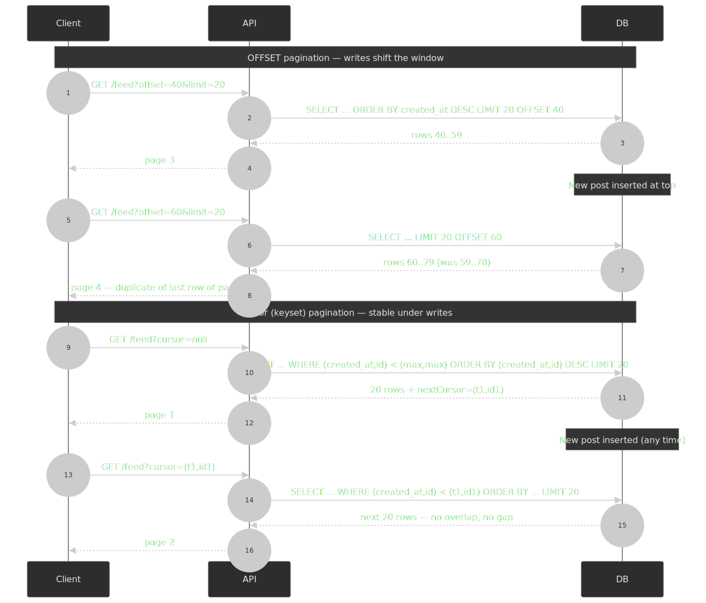
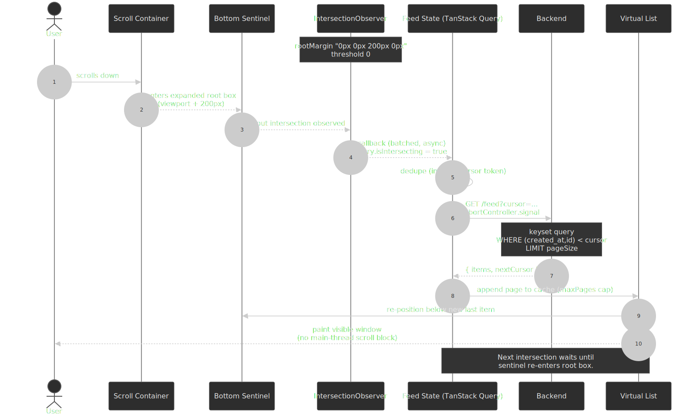
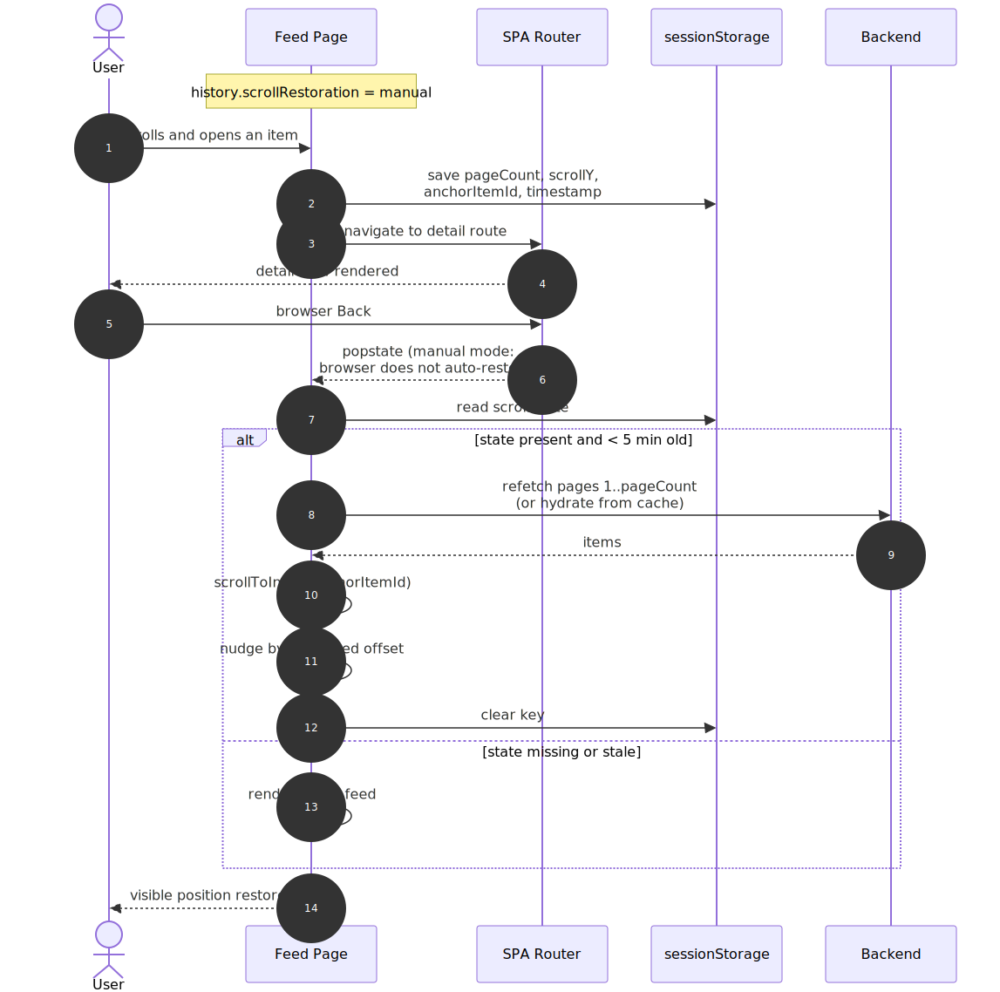
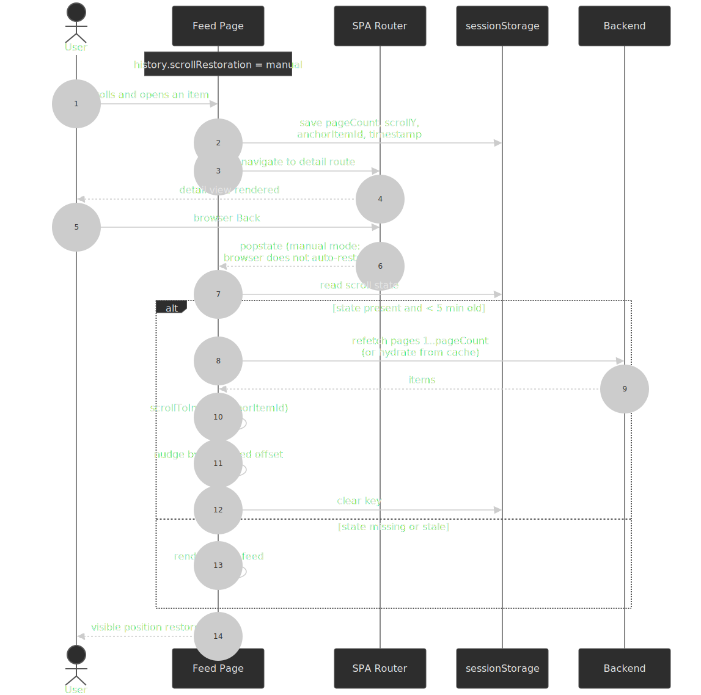

# Design an Infinite Feed

An infinite feed is three problems wearing one UI: stable pagination over a dataset that keeps changing, scroll-edge detection that does not block the main thread, and rendering enough items to feel endless without melting the device. This article gives you the mental model, the source-backed defaults, and the failure modes that matter when the feed grows from hundreds of items to millions.




## Mental model

Three layers, each owned by a different failure mode:

1. **Pagination** — keyset (cursor) traversal so insertions and deletions don't shift the user's position. Compound cursors `(timestamp, id)` break ties deterministically. ([use-the-index-luke / Markus Winand](https://use-the-index-luke.com/no-offset))
2. **Detection** — [`IntersectionObserver`](https://www.w3.org/TR/intersection-observer/) on a sentinel node near the viewport edge. The observer runs off the main thread, so scroll never blocks on JavaScript.
3. **Rendering** — virtualization: render only the items in (or near) the viewport. A 50,000-item feed lives comfortably under the [Lighthouse "excessive DOM"](https://web.dev/articles/dom-size-and-interactivity) thresholds.

The five decisions that matter most:

| Decision | Default | When to deviate |
| --- | --- | --- |
| Cursor encoding | Opaque, signed `(timestamp, id)` Base64 | Public API where consumers want stable, sortable cursors |
| Trigger distance | `rootMargin: "0px 0px 200px 0px"` | Tune up on slow networks, down on tight infinite-scroll UIs |
| Virtualization | Off below ~100 items, on above ~1,000 | Mandatory once items × per-item DOM nodes blow past Lighthouse limits |
| New items | Banner + scroll-on-tap | Chat / live ops UIs may auto-prepend with anchor-based scroll preservation |
| Memory bound | Cap pages in memory (`maxPages: 5–10`) | Long-lived sessions need IndexedDB offload instead |

> [!IMPORTANT]
> "Infinite scroll" is hostile to keyboard users, screen-reader users, and anyone who needs the footer. Always ship a "Load more" alternative or a user-preference toggle — see [Accessibility](#accessibility).

## Why offset pagination breaks

The naive shape — `OFFSET` and `LIMIT` — fails for two independent reasons.

```sql
SELECT * FROM posts ORDER BY created_at DESC LIMIT 20 OFFSET 40;
```

**It is not stable under writes.** A new row inserted at the top shifts every row down by one. The next page (`OFFSET 60`) starts one row earlier than it should, so the user sees a duplicate or skips an item. This is not a race in the strict sense — it happens with any concurrent write, even on a single connection. ([Markus Winand](https://use-the-index-luke.com/no-offset), [PostgreSQL row-wise comparison docs](https://www.postgresql.org/docs/current/functions-comparisons.html#ROW-WISE-COMPARISON))

**It does linear work in the offset.** PostgreSQL (and MySQL) cannot "seek" past `OFFSET` rows. The executor reads and discards every row before the offset, even when an index covers the order. At `OFFSET 1_000_000`, the query reads 1,000,000+ rows before returning anything. ([Markus Winand](https://use-the-index-luke.com/no-offset))

 pagination is stable because each request asks for 'rows strictly after the last one I saw'.")


Offset still has its place: admin tables with stable data, reports with bounded depth, and any UI that genuinely needs "go to page 47". For a live feed, it is the wrong tool.

## Browser constraints

These are the budgets a feed has to live inside:

- **Frame budget.** 60 fps means every frame has ~16.67 ms of main-thread time. Any synchronous work that forces layout (`offsetHeight`, `getBoundingClientRect` after a write) inside a scroll handler eats into that budget. ([web.dev: how large DOMs affect interactivity](https://web.dev/articles/dom-size-and-interactivity))
- **DOM size.** Lighthouse warns at **>800** body nodes and flags an error at **>1,400**, with extra warnings for depth `>32` or `>60` children under one parent. These are heuristics, not hard limits, but they correlate well with Interaction-to-Next-Paint regressions. A naive feed at 50,000 items × 5–20 nodes per item blows past the error threshold immediately. ([web.dev: avoid an excessive DOM](https://web.dev/articles/dom-size-and-interactivity), [Lighthouse audit reference](https://developer.chrome.com/docs/lighthouse/performance/dom-size))
- **Memory pressure.** Large feeds accumulate JS heap (item state, cached pages) and GPU/ tile memory (rendered nodes, images). When the OS runs low, mobile browsers reload tabs without warning. Direct heap visibility from JS is non-standard — see [Memory monitoring](#memory-monitoring).
- **Passive scroll.** Modern browsers default `touchstart`, `touchmove`, and `wheel` listeners on `window`/`document`/`document.body` to `passive: true` so scroll never blocks on JS. Don't fight this — never call `preventDefault()` inside a scroll-relevant handler unless you actually need to (e.g. a custom pull-to-refresh). ([Lighthouse: use passive listeners](https://developer.chrome.com/docs/lighthouse/best-practices/uses-passive-event-listeners))

UX expectations, on top of those budgets:

| Requirement | Constraint |
| --- | --- |
| Scroll smoothness | 60 fps; no jank during fetch or layout |
| Load latency | <200 ms perceived wait |
| Position stability | No unexpected jumps when new content arrives |
| Back navigation | Returns to the previous scroll position and item |
| New content | Discoverable without disrupting the current read |

## Choosing a path

There are three viable shapes for a feed UI. The decision turns on item count, height variance, and accessibility constraints.




### Path 1 — IntersectionObserver + keyset cursor

The default for most feeds under ~1,000 items per session: dense enough to need infinite scroll, small enough that you don't need virtualization yet.

The observer watches a sentinel positioned just below the last rendered item. When the sentinel intersects the (expanded) viewport, the callback fires and the next keyset page is requested. No scroll handlers, no forced layout.

```typescript collapse={1-2}
type FeedItem = { id: string; content: string; createdAt: string }
type PageResponse = { items: FeedItem[]; nextCursor: string | null }

function createFeedObserver(
  onLoadMore: () => void,
  options: { rootMargin?: string; threshold?: number } = {},
) {
  const { rootMargin = "0px 0px 200px 0px", threshold = 0 } = options
  return new IntersectionObserver(
    (entries) => {
      const [entry] = entries
      if (entry.isIntersecting) onLoadMore()
    },
    { rootMargin, threshold },
  )
}

const sentinel = document.getElementById("load-more-sentinel")!
const observer = createFeedObserver(() => fetchNextPage(currentCursor))
observer.observe(sentinel)
```

**Best for** social feeds, comment threads, search results — anything where the dataset is large but the typical session reads a few dozen to a few hundred items.

**Trade-offs:**

- ✅ Off-main-thread detection; battery-friendly.
- ✅ Layered cleanly under virtualization when you outgrow it.
- ❌ No direct page jumping — total count is often unknown.
- ❌ "Find in page" only sees rendered items — see [Accessibility limitations](#accessibility-limitations).

### Path 2 — Virtualized list + keyset cursor

Once you cross ~1,000 items per session, or the per-item DOM is rich enough to push you near Lighthouse limits, you need virtualization. The list maintains a known total height via spacer elements and only renders the items currently inside the viewport plus a small overscan buffer.

 live in the DOM. Spacer elements above and below preserve the scroll height. Top and bottom sentinels feed the IntersectionObserver for bidirectional loading.")


```typescript collapse={1-3, 28-45} title="VirtualizedFeed.tsx"
import { useInfiniteQuery } from "@tanstack/react-query"
import { useVirtualizer } from "@tanstack/react-virtual"
import { useEffect, useRef } from "react"

type FeedItem = { id: string; content: string }
type PageResponse = { items: FeedItem[]; nextCursor: string | null }

function VirtualizedFeed() {
  const parentRef = useRef<HTMLDivElement>(null)

  const { data, fetchNextPage, hasNextPage, isFetchingNextPage } = useInfiniteQuery({
    queryKey: ["feed"],
    queryFn: ({ pageParam }) => fetchFeedPage(pageParam),
    initialPageParam: null as string | null,
    getNextPageParam: (lastPage) => lastPage.nextCursor,
    maxPages: 10,
  })

  const allItems = data?.pages.flatMap((page) => page.items) ?? []

  const virtualizer = useVirtualizer({
    count: hasNextPage ? allItems.length + 1 : allItems.length,
    getScrollElement: () => parentRef.current,
    estimateSize: () => 100,
    overscan: 5,
  })

  useEffect(() => {
    const lastItem = virtualizer.getVirtualItems().at(-1)
    if (!lastItem) return
    if (lastItem.index >= allItems.length - 1 && hasNextPage && !isFetchingNextPage) {
      fetchNextPage()
    }
  }, [virtualizer.getVirtualItems(), hasNextPage, isFetchingNextPage])

  return (
    <div ref={parentRef} style={{ height: "100vh", overflow: "auto" }}>
      <div style={{ height: virtualizer.getTotalSize(), position: "relative" }}>
        {virtualizer.getVirtualItems().map((virtualItem) => (
          <div
            key={virtualItem.key}
            style={{
              position: "absolute",
              top: 0,
              left: 0,
              width: "100%",
              transform: `translateY(${virtualItem.start}px)`,
            }}
          >
            {virtualItem.index < allItems.length ? (
              <FeedItemComponent item={allItems[virtualItem.index]} />
            ) : (
              <LoadingPlaceholder />
            )}
          </div>
        ))}
      </div>
    </div>
  )
}
```

**Trade-offs:**

- ✅ DOM stays at `O(viewport)`, ~20–50 nodes regardless of total item count.
- ✅ Memory grows only with cached pages, capped by `maxPages`.
- ❌ Scroll restoration is harder (no DOM nodes to anchor on — see [Scroll restoration](#scroll-position-restoration)).
- ❌ Variable item heights add complexity; they require measurement and break find-in-page.

### Path 3 — Hybrid with explicit "Load more"

Infinite scroll for the common case, with an explicit "Load more" button (and a user-preference toggle) for accessibility and footer access.

```typescript collapse={1-5}
import { useState } from "react"

type LoadMode = "auto" | "manual"
type FeedItem = { id: string; content: string }

function HybridFeed({ userPreference }: { userPreference: LoadMode }) {
  const [mode, setMode] = useState(userPreference)
  const { data, fetchNextPage, hasNextPage, isFetching } = useInfiniteQuery({
    /* ... */
  })

  return (
    <div>
      <ModeToggle mode={mode} onChange={setMode} />
      <FeedList items={data?.pages.flatMap((p) => p.items) ?? []} />
      {hasNextPage && mode === "manual" && (
        <button onClick={() => fetchNextPage()} disabled={isFetching}>
          Load more
        </button>
      )}
      {hasNextPage && mode === "auto" && (
        <IntersectionSentinel onVisible={() => fetchNextPage()} />
      )}
    </div>
  )
}
```

**Trade-offs:**

- ✅ Footer remains reachable.
- ✅ Lower cognitive load on long sessions.
- ❌ One extra interaction per page.
- ❌ Two code paths to maintain.

### Decision matrix

| Factor | IO + cursor | Virtualized | Hybrid |
| --- | --- | --- | --- |
| Items < 100 | Overkill | ✗ | ✓ |
| Items 100–1k | ✓ | Optional | ✓ |
| Items > 1k | Stretches budget | Required | ✓ |
| Variable heights | Easy | Complex | Easy |
| Scroll restoration | Medium | Hard | Medium |
| Accessibility | Acceptable | Hardest | Best |
| Implementation cost | Low | High | Medium |

## Cursor-based pagination

### Compound cursors

A single-field cursor (timestamp only) is broken the moment two rows share that field — the next request either skips both or returns one of them twice. Use a compound key with a unique tiebreaker, almost always the row ID. PostgreSQL's row-wise comparison expresses this directly:

```sql
SELECT id, created_at, content
FROM posts
WHERE (created_at, id) < ('2026-01-15T12:00:00Z', 'abc123')
ORDER BY created_at DESC, id DESC
LIMIT 20;
```

The tuple comparison `(created_at, id) < (cursor_ts, cursor_id)` gives deterministic ordering and uses a composite index on `(created_at, id)` directly. ([PostgreSQL: Row-Wise Comparison](https://www.postgresql.org/docs/current/functions-comparisons.html#ROW-WISE-COMPARISON))

> [!WARNING]
> MySQL parses the same syntax but its optimizer is less aggressive about using the composite index for row-constructor comparisons. The MySQL Reference Manual recommends rewriting `(c2, c3) > (1, 1)` as `c2 > 1 OR (c2 = 1 AND c3 > 1)` so the optimizer reliably uses the prefix of a composite index. ([MySQL 8.4 Manual §10.2.1.22](https://dev.mysql.com/doc/refman/8.4/en/row-constructor-optimization.html)) Also note that row-wise comparison silently excludes rows where any cursor column is `NULL`; choose tiebreaker columns that are `NOT NULL`.

### Cursor encoding

Two questions: opaque vs transparent, and signed vs unsigned.

**Opaque (Base64 of the payload)** is the safer default. Clients can't depend on the structure, so you can change the underlying schema without breaking them.

```typescript
function encodeCursor(createdAt: Date, id: string): string {
  return Buffer.from(JSON.stringify({ createdAt: createdAt.toISOString(), id })).toString("base64")
}

function decodeCursor(cursor: string): { createdAt: Date; id: string } {
  const { createdAt, id } = JSON.parse(Buffer.from(cursor, "base64").toString())
  return { createdAt: new Date(createdAt), id }
}
```

**Signed cursors** stop clients from forging cursors that point at rows the API would otherwise filter (e.g. peeking at content scheduled for the future). Sign with HMAC-SHA-256 and verify in constant time:

```typescript collapse={1-3}
import crypto from "crypto"

const SECRET = process.env.CURSOR_SECRET!

function signCursor(payload: object): string {
  const data = JSON.stringify(payload)
  const signature = crypto.createHmac("sha256", SECRET).update(data).digest("hex")
  return Buffer.from(`${data}|${signature}`).toString("base64url")
}

function verifyCursor(cursor: string): object | null {
  const decoded = Buffer.from(cursor, "base64url").toString()
  const sep = decoded.lastIndexOf("|")
  if (sep < 0) return null
  const data = decoded.slice(0, sep)
  const signature = decoded.slice(sep + 1)
  const expected = crypto.createHmac("sha256", SECRET).update(data).digest("hex")
  const a = Buffer.from(signature, "hex")
  const b = Buffer.from(expected, "hex")
  if (a.length !== b.length || !crypto.timingSafeEqual(a, b)) return null
  return JSON.parse(data)
}
```

### API response shape

```typescript
interface PaginatedResponse<T> {
  items: T[]
  nextCursor: string | null
  prevCursor?: string | null
  hasMore?: boolean
  totalCount?: number
}
```

`nextCursor: null` is sufficient to signal end-of-stream; the explicit `hasMore` flag is redundant but useful for clients that prefer to branch on a boolean. `totalCount` is expensive — `SELECT COUNT(*)` on a large table can be the slowest part of the request — so emit it only when consumers actually need it.

A standards-aligned alternative — useful for public APIs and hypermedia clients — is to ship pagination links in the HTTP `Link` header per [RFC 8288 (Web Linking)](https://datatracker.ietf.org/doc/html/rfc8288). The body stays as `{ items }`, and the response carries:

```http
Link: <https://api.example.com/feed?cursor=eyJ0Ijo...>; rel="next",
      <https://api.example.com/feed>; rel="first"
```

This is the shape GitHub's REST API uses ([GitHub: pagination](https://docs.github.com/en/rest/using-the-rest-api/using-pagination-in-the-rest-api)). The trade-off: clients must parse the `Link` header (the IANA-registered relation types `next`, `prev`, `first`, `last` are well covered by libraries like `parse-link-header`) and you lose the JSON-shaped `nextCursor` ergonomics. Pick one and stick to it.




### Bidirectional pagination

Required for chat ("scroll up for history"), feeds with "new items above", and deep-linked content in the middle of a list. TanStack Query v5 supports it natively:

```typescript
const { data, fetchNextPage, fetchPreviousPage, hasNextPage, hasPreviousPage } = useInfiniteQuery({
  queryKey: ["feed"],
  queryFn: ({ pageParam }) => fetchPage(pageParam),
  initialPageParam: null as string | null,
  getNextPageParam: (lastPage) => lastPage.nextCursor,
  getPreviousPageParam: (firstPage) => firstPage.prevCursor,
  maxPages: 10,
})
```

The v5 docs make one important rule explicit: if `maxPages > 0`, both `getNextPageParam` and `getPreviousPageParam` must return real cursors (not `undefined`) so the cache can refill in either direction after eviction. ([TanStack Query v5 — Infinite Queries](https://tanstack.com/query/v5/docs/framework/react/guides/infinite-queries))

## Scroll detection

### IntersectionObserver configuration

```typescript
const observer = new IntersectionObserver(callback, {
  root: null,
  rootMargin: "0px 0px 200px 0px",
  threshold: 0,
})
```

Per the [W3C IntersectionObserver spec](https://www.w3.org/TR/intersection-observer/) and [MDN's `rootMargin` reference](https://developer.mozilla.org/en-US/docs/Web/API/IntersectionObserver/rootMargin):

- `rootMargin` accepts pixel or percentage values (1–4 components, CSS-margin shorthand). Positive values **expand** the root box (you trigger early), negative values **shrink** it (you trigger inside the viewport).
- `threshold` is the visible fraction at which the callback runs: `0` for "any pixel intersects", `1.0` for "entirely visible". Pass an array `[0, 0.5, 1]` to fire at multiple points.
- The callback is asynchronous and batched across observed targets, so a fast scroll yields one callback invocation per frame, not one per intersection event.

> [!NOTE]
> [IntersectionObserver v2](https://w3c.github.io/IntersectionObserver/v2/) adds `trackVisibility` and an `isVisible` flag that account for occlusion and CSS effects. As of April 2026, it is implemented in Chromium only and Mozilla [does not plan to ship it](https://github.com/mozilla/standards-positions/issues/672). It is intended for ad-fraud-grade visibility checks (`delay >= 100ms`, expensive to compute), not for feed pagination. Stick to `isIntersecting` for the load-more sentinel.




For bidirectional loading, observe a top sentinel and a bottom sentinel from the same observer:

```typescript collapse={1-2}
type Direction = "forward" | "backward"
type LoadHandler = (direction: Direction) => void

function createBidirectionalObserver(onLoad: LoadHandler) {
  return new IntersectionObserver(
    (entries) => {
      for (const entry of entries) {
        if (!entry.isIntersecting) continue
        const direction = entry.target.id === "top-sentinel" ? "backward" : "forward"
        onLoad(direction)
      }
    },
    { rootMargin: "200px" },
  )
}
```

### Adaptive trigger distance

A fixed `200px` rootMargin is fine for typical conditions. You can do better when you know the scroll velocity and the average fetch latency: trigger when the user is roughly two fetch-latencies away from the end.

```typescript collapse={1-4}
type AdaptiveConfig = {
  avgFetchTimeMs: number
  scrollVelocityPxPerSec: number
}

function calculateRootMargin({ avgFetchTimeMs, scrollVelocityPxPerSec }: AdaptiveConfig): string {
  const pixelsNeeded = scrollVelocityPxPerSec * (avgFetchTimeMs / 1000) * 2
  const margin = Math.max(200, Math.min(800, pixelsNeeded))
  return `0px 0px ${margin}px 0px`
}
```

### Preventing duplicate requests

Fast scrolling can fire the callback multiple times before the first request settles. Coalesce on a single in-flight token and cancel stale requests with [`AbortController`](https://developer.mozilla.org/en-US/docs/Web/API/AbortController):

```typescript collapse={1-3}
let currentController: AbortController | null = null
let isLoading = false

async function fetchNextPageSafe(cursor: string) {
  if (isLoading) return
  currentController?.abort()
  currentController = new AbortController()
  isLoading = true

  try {
    const response = await fetch(`/api/feed?cursor=${encodeURIComponent(cursor)}`, {
      signal: currentController.signal,
    })
    return await response.json()
  } catch (error) {
    if (error instanceof DOMException && error.name === "AbortError") return null
    throw error
  } finally {
    isLoading = false
  }
}
```

TanStack Query handles this for you via the query key — concurrent `fetchNextPage()` calls are deduplicated, and the previous request is aborted when a new one starts.

## Virtualization

### Fixed-height

When every item has the same height, position math is `O(1)`:

```typescript
const startIndex = Math.floor(scrollTop / itemHeight)
const visibleCount = Math.ceil(viewportHeight / itemHeight)
const endIndex = Math.min(startIndex + visibleCount + overscan, totalItems)
const offsetY = startIndex * itemHeight
```

`react-window`'s `FixedSizeList` is the smallest, simplest implementation:

```typescript collapse={1-4}
import { FixedSizeList } from "react-window"

type ItemData = { items: Array<{ id: string; content: string }> }

function FeedList({ items }: { items: ItemData["items"] }) {
  return (
    <FixedSizeList
      height={600}
      itemCount={items.length}
      itemSize={80}
      width="100%"
      itemData={{ items }}
    >
      {({ index, style, data }) => (
        <div style={style}>
          <FeedItem item={data.items[index]} />
        </div>
      )}
    </FixedSizeList>
  )
}
```

Best fit: log viewers, simple message lists, dense uniform tables.

### Variable-height

Real feeds have heterogeneous content — images, embeds, different text lengths. Three problems compound:

1. Heights are unknown until the item renders.
2. When estimates are corrected, scroll position can jump.
3. Bidirectional scrolling makes the layout shift problem worse.

`react-virtuoso` handles these end-to-end with a measurement step on first render and an anchor-based layout:

```typescript collapse={1-3}
import { Virtuoso } from "react-virtuoso"

type FeedItem = { id: string; content: string; hasImage: boolean }

function VariableFeed({ items }: { items: FeedItem[] }) {
  return (
    <Virtuoso
      data={items}
      itemContent={(_, item) => <FeedItem item={item} />}
      endReached={() => fetchNextPage()}
      increaseViewportBy={{ top: 200, bottom: 200 }}
    />
  )
}
```

To keep variable-height feeds calm:

- Increase overscan above the viewport so re-measurements don't push current items off-screen.
- Use a `defaultItemHeight` close to the median content type.
- Maintain a stable anchor item across layout shifts.

Browser-native `content-visibility: auto` with `contain-intrinsic-size` is a complementary tactic for less interactive lists — it keeps DOM nodes alive but skips painting and most layout for off-screen content. ([web.dev: content-visibility](https://web.dev/articles/content-visibility))

### Library comparison

| Library | Bundle (approx) | Variable heights | Built-in infinite | Framework |
| --- | --- | --- | --- | --- |
| `react-window` | ~6 KB | Manual | Companion (`react-window-infinite-loader`) | React |
| `react-virtuoso` | ~15 KB | Automatic | Built-in (`endReached`) | React |
| `@tanstack/react-virtual` | ~5 KB | Manual | Pattern in docs | React (engine is FW-agnostic) |
| `vue-virtual-scroller` | ~12 KB | Automatic | Built-in | Vue |

**`react-window`** has the smallest footprint and the simplest mental model. Pair with `react-window-infinite-loader` for pagination.

**`react-virtuoso`** is the pragmatic default for variable-height feeds. The extra bytes pay for measurement, scroll-to accuracy, and good defaults.

**`@tanstack/react-virtual`** is headless. You wire the rendering loop yourself, but you keep full control over markup and styling.

## State management

### Normalized vs denormalized

Denormalized (raw page envelopes):

```typescript
{
  pages: [
    { items: [{ id: "1", author: { id: "a", name: "Alice" } }] },
    { items: [{ id: "2", author: { id: "a", name: "Alice" } }] },
  ]
}
```

Normalized (entities by id, references by id):

```typescript
{
  items: {
    byId: {
      "1": { id: "1", authorId: "a" },
      "2": { id: "2", authorId: "a" },
    },
    allIds: ["1", "2"],
  },
  authors: {
    byId: { a: { id: "a", name: "Alice" } },
  },
  feed: { itemIds: ["1", "2"], nextCursor: "xyz" },
}
```

Normalize when entities recur (authors, tags, replied-to posts) or update independently. The wins are well-trodden: no duplicate data, `O(1)` lookups by id, single source of truth for mutations, shallow equality for memoization. ([Redux: Normalizing State Shape](https://redux.js.org/usage/structuring-reducers/normalizing-state-shape))

### Memory bounding

Long feed sessions accumulate. There are three practical bounds, in increasing order of complexity.

**Cap pages in cache** — TanStack Query's `maxPages` evicts the oldest page once the limit is reached, refetching on demand if the user scrolls back:

```typescript
useInfiniteQuery({
  queryKey: ["feed"],
  queryFn: fetchPage,
  initialPageParam: null as string | null,
  maxPages: 5,
  getNextPageParam: (last) => last.nextCursor,
  getPreviousPageParam: (first) => first.prevCursor,
})
```

**Tombstone heavy fields** — keep the item placeholder for layout, drop the heavy parts (images, embeds, parsed bodies) when the item is far off-screen:

```typescript
type Tombstone = { id: string; tombstoned: true }

function maybeEvictItem(item: FeedItem, isVisible: boolean): FeedItem | Tombstone {
  if (!isVisible && item.mediaUrls?.length) return { id: item.id, tombstoned: true }
  return item
}
```

**Offload to IndexedDB** — for sessions that can run for hours (chat, email), persist old pages to IndexedDB and re-hydrate on scroll-back. The trade-off is more code and more failure modes (quota errors, schema migrations).

## Feed refresh

### New item indicators

Auto-prepending new items moves the user's reading position without consent. Use a banner instead, and let the user choose when to scroll:

```typescript collapse={1-5}
import { useCallback, useEffect, useState } from "react"

type FeedItem = { id: string }
type NewItemsBannerProps = { count: number; onShow: () => void }

function Feed() {
  const [newItemIds, setNewItemIds] = useState<string[]>([])

  useEffect(() => {
    const interval = setInterval(async () => {
      const latestId = items[0]?.id
      const newItems = await checkForNewItems(latestId)
      if (newItems.length) {
        setNewItemIds((prev) => [...newItems.map((i) => i.id), ...prev])
      }
    }, 30_000)
    return () => clearInterval(interval)
  }, [items])

  const showNewItems = useCallback(() => {
    prependItems(newItemIds)
    scrollToTop()
    setNewItemIds([])
  }, [newItemIds])

  return (
    <>
      {newItemIds.length > 0 && (
        <button className="new-items-banner" onClick={showNewItems}>
          {newItemIds.length} new posts
        </button>
      )}
      <FeedList items={items} />
    </>
  )
}
```

Chat is a deliberate exception: in a thread the user expects new messages to appear at the bottom. Implement it with an anchor element so the scroll position stays glued to the visible message, not to a pixel offset.

For UIs that **must** insert above the user's reading position (live ops dashboards, comment threads with replies above), lean on the browser's [scroll anchoring](https://www.w3.org/TR/css-scroll-anchoring-1/) instead of computing offsets by hand. The browser picks an anchor inside the viewport and adjusts `scrollTop` in the same frame as the layout change, so the user's eye never tracks a jump:

```css
.feed {
  overflow-anchor: auto;
}
```

`overflow-anchor` is on by default in Chromium and Firefox; setting `auto` is just the explicit form. Safari ships it only in Technology Preview as of April 2026 ([caniuse](https://caniuse.com/css-overflow-anchor)), so on iOS you still need an explicit anchor — capture `scrollHeight` before insert, set `scrollTop += scrollHeight_after - scrollHeight_before`. Set `overflow-anchor: none` selectively on elements (banners, sticky headers) you do not want chosen as anchors.

### Pull-to-refresh

The web has no native pull-to-refresh API. To build one, you need to detect a touch start at scroll position 0, track the pull distance, and prevent the browser's own gesture from interfering:

```typescript collapse={1-4}
import { useRef, useState, type TouchEvent } from "react"

type PullState = "idle" | "pulling" | "refreshing"

function usePullToRefresh(onRefresh: () => Promise<void>) {
  const [state, setState] = useState<PullState>("idle")
  const [pullDistance, setPullDistance] = useState(0)
  const startY = useRef(0)

  const handleTouchStart = (e: TouchEvent) => {
    if (window.scrollY === 0) {
      startY.current = e.touches[0].pageY
      setState("pulling")
    }
  }

  const handleTouchMove = (e: TouchEvent) => {
    if (state !== "pulling") return
    const distance = e.touches[0].pageY - startY.current
    setPullDistance(Math.max(0, Math.min(distance, 150)))
  }

  const handleTouchEnd = async () => {
    if (pullDistance > 100) {
      setState("refreshing")
      await onRefresh()
    }
    setState("idle")
    setPullDistance(0)
  }

  return { state, pullDistance, handleTouchStart, handleTouchMove, handleTouchEnd }
}
```

Disable the browser's own pull-to-refresh and overscroll chaining:

```css
html,
body {
  overscroll-behavior-y: contain;
}
```

`contain` blocks scroll chaining and (on Chrome Android) suppresses the native pull-to-refresh while keeping the overscroll glow; `none` additionally suppresses the glow. Apply on both `html` and `body` to get consistent behavior across engines. ([Chrome for Developers: take control of your scroll](https://developer.chrome.com/blog/overscroll-behavior), [MDN: overscroll-behavior](https://developer.mozilla.org/en-US/docs/Web/CSS/Reference/Properties/overscroll-behavior))

> [!CAUTION]
> If you ship a custom pull-to-refresh and the browser pull-to-refresh, both will fire. Always disable the native gesture or your refresh request runs twice.

### Gap detection

The user paused at page 5. New items arrived while they were idle. Pages 2–4 now have unknown rows between them — gaps. Detect by comparing each page's `endCursor` to the next page's `startCursor`:

```typescript
function detectGap(pages: Page[]): { gapAfterPage: number; cursor: string } | null {
  for (let i = 1; i < pages.length; i++) {
    const prevEnd = pages[i - 1].endCursor
    const currStart = pages[i].startCursor
    if (prevEnd !== currStart) {
      return { gapAfterPage: i - 1, cursor: prevEnd }
    }
  }
  return null
}
```

Three viable strategies, in increasing complexity:

- **Lazy fill** — wait until the user scrolls into the gap, then fetch with the gap cursor.
- **Background fill** — fetch on `requestIdleCallback` (or a `setTimeout(0)` fallback in browsers that don't ship it).
- **Invalidate** — drop the cache and refetch from the top. Simplest, but loses the user's place.

## Error handling

### Retry with exponential backoff and jitter

```typescript
function calculateDelay(attempt: number): number {
  const baseDelay = 100
  const maxDelay = 30_000
  const exponential = baseDelay * Math.pow(2, attempt)
  const jitter = Math.random() * 1000
  return Math.min(exponential + jitter, maxDelay)
}
```

Jitter is non-negotiable: without it, every client retries at the same instant after a transient outage and re-DDoSes the recovering service. ([AWS Architecture Blog: exponential backoff and jitter](https://aws.amazon.com/blogs/architecture/exponential-backoff-and-jitter/))

What to retry, by status:

| Status | Retry |
| --- | --- |
| 408 Request Timeout | ✅ |
| 429 Too Many Requests | ✅ (respect `Retry-After`) |
| 500 / 502 / 503 / 504 | ✅ |
| Network failure | ✅ |
| 400 Bad Request | ❌ |
| 401 / 403 | ❌ (handle auth, then maybe) |
| 404 Not Found | ❌ |

### Inline recovery

Don't unmount the feed on a fetch failure — the user has been scrolling for a while and losing position is worse than seeing an inline error. Surface the error next to the affected page boundary, and let the user retry without reloading:

```typescript collapse={1-5} title="FeedWithErrorBoundary.tsx"
type FeedState =
  | { status: "loading" }
  | { status: "error"; error: Error; retryCount: number }
  | { status: "success" }

function FeedWithErrorBoundary() {
  const { data, error, refetch, isError, failureCount } = useInfiniteQuery({
    queryKey: ["feed"],
    queryFn: fetchPage,
    initialPageParam: null as string | null,
    retry: 3,
    retryDelay: (attempt) => calculateDelay(attempt),
  })

  if (isError) {
    return (
      <div role="alert">
        <p>Failed to load feed: {error.message}</p>
        <button onClick={() => refetch()}>
          Retry ({failureCount}/3 attempts)
        </button>
      </div>
    )
  }

  return <FeedList pages={data?.pages ?? []} />
}
```

### Stale-while-revalidate

Show cached content immediately, fetch fresh in the background, and swap once the new data arrives. The pattern is standardized as an HTTP cache-control extension in [RFC 5861](https://datatracker.ietf.org/doc/html/rfc5861) and explained for the client side on [web.dev](https://web.dev/articles/stale-while-revalidate):

```typescript
const { data, isStale, isFetching } = useInfiniteQuery({
  queryKey: ["feed"],
  queryFn: fetchPage,
  initialPageParam: null as string | null,
  staleTime: 60 * 1000,
  gcTime: 5 * 60 * 1000,
  refetchOnWindowFocus: true,
  refetchOnReconnect: true,
})
```

## Scroll position restoration

### History scroll restoration

Per the [HTML Living Standard](https://html.spec.whatwg.org/multipage/nav-history-apis.html#dom-history-scrollrestoration), `history.scrollRestoration` lets a SPA opt out of the browser's automatic (and often wrong-for-SPAs) scroll restore:

```typescript
if ("scrollRestoration" in history) {
  history.scrollRestoration = "manual"
}
```

The browsers don't agree on the order of `popstate` and the auto-restore: Chrome restores after `popstate`, Firefox before. Once you opt into manual mode, this stops mattering — you do the restore yourself.




Framework routers wire most of this for you, but the defaults vary and they all leave the cache-rehydrate step to you:

- **Next.js (App Router)** restores scroll on back/forward by default for client transitions; full reloads use the browser's native restore. The router sets `history.scrollRestoration = "manual"` itself, so do not flip it back. ([Next.js docs](https://nextjs.org/docs/app/api-reference/components/link#scroll))
- **TanStack Router** ships an opt-in `ScrollRestoration` component that persists position by route key and integrates with virtualization (`useElementScrollRestoration`). ([TanStack Router scroll restoration](https://tanstack.com/router/latest/docs/framework/react/guide/scroll-restoration))
- **React Router v6+** ships `<ScrollRestoration />`. It restores by location key by default and accepts a `getKey` callback to share scroll across query-string variations.

### Session storage

Store enough to rebuild the view: the page count, the scroll position, and an anchor item ID so re-fetching a page that arrived in different positions still lands the user on the same item:

```typescript collapse={1-5}
type ScrollState = {
  pageCount: number
  scrollY: number
  anchorItemId: string
  timestamp: number
}

function saveScrollState(key: string, state: ScrollState) {
  sessionStorage.setItem(key, JSON.stringify(state))
}

function restoreScrollState(key: string): ScrollState | null {
  const saved = sessionStorage.getItem(key)
  if (!saved) return null
  const state: ScrollState = JSON.parse(saved)
  if (Date.now() - state.timestamp > 300_000) {
    sessionStorage.removeItem(key)
    return null
  }
  return state
}

function useScrollRestoration(feedKey: string, setSize: (size: number) => void) {
  useEffect(() => {
    const state = restoreScrollState(feedKey)
    if (!state) return
    setSize(state.pageCount)
    requestAnimationFrame(() => {
      window.scrollTo(0, state.scrollY)
      sessionStorage.removeItem(feedKey)
    })
  }, [feedKey, setSize])
}
```

### Virtualization complications

Virtualized lists don't keep a DOM node per item, so pixel-based restoration is fragile — when re-measurement corrects an estimate, your saved `scrollY` is suddenly wrong. Three strategies, from simplest to most accurate:

1. **Index-based.** Store the index of the first visible item and call `scrollToIndex` on restore. Works when items are roughly the same height.
2. **Anchor-based.** Store the item ID, `scrollToIndex` after restore, then nudge by the measured anchor offset. Accurate even with variable heights.
3. **Time-limited.** Only restore for navigations within ~30 seconds; fall back to "top of feed" otherwise. Avoids restoring to a stale anchor that has since been evicted.

```typescript
const virtualizer = useVirtualizer({
  count: items.length,
  getScrollElement: () => parentRef.current,
  estimateSize: () => 100,
})

useEffect(() => {
  const savedIndex = sessionStorage.getItem("lastVisibleIndex")
  if (savedIndex) {
    virtualizer.scrollToIndex(parseInt(savedIndex, 10), { align: "start", behavior: "auto" })
  }
}, [])
```

## Accessibility

### ARIA feed pattern

The [W3C ARIA Authoring Practices Guide — Feed Pattern](https://www.w3.org/WAI/ARIA/apg/patterns/feed/) and the matching [MDN feed role reference](https://developer.mozilla.org/en-US/docs/Web/Accessibility/ARIA/Reference/Roles/feed_role) define an interoperability contract between the feed and assistive technologies.

```html
<div role="feed" aria-busy="false" aria-label="News feed">
  <article
    role="article"
    aria-labelledby="post-1-title"
    aria-posinset="1"
    aria-setsize="-1"
    tabindex="0"
  >
    <h2 id="post-1-title">Post Title</h2>
    <p>Post content...</p>
  </article>
  <!-- More articles -->
</div>
```

Required attributes per APG:

- `aria-busy="true"` on the feed during DOM updates; `"false"` when the update completes.
- `aria-posinset` on each article (1-indexed position).
- `aria-setsize` on each article — `-1` when the total is unknown or unbounded (the typical infinite-feed case).
- `aria-labelledby` on each article, pointing at a label inside the article.
- Each article must be focusable (`tabindex="0"` or `-1`), and the application must scroll an article into view when it or one of its descendants takes focus.

### Keyboard navigation

The APG specifies arrow keys for moving between articles, plus `Home`/`End` for jumping to the first or last loaded article. The `j`/`k` shortcuts are conventional in many feed apps but not part of the spec:

```typescript
function handleFeedKeyDown(event: KeyboardEvent) {
  const current = (document.activeElement as HTMLElement | null)?.closest('[role="article"]')
  if (!current) return

  switch (event.key) {
    case "ArrowDown":
    case "j":
      focusNextArticle(current)
      event.preventDefault()
      break
    case "ArrowUp":
    case "k":
      focusPreviousArticle(current)
      event.preventDefault()
      break
    case "Home":
      focusFirstArticle()
      event.preventDefault()
      break
    case "End":
      focusLastArticle()
      event.preventDefault()
      break
  }
}
```

### Accessibility limitations

Infinite scroll is hostile to several user populations regardless of how cleanly you implement the ARIA contract:

- **Keyboard users** can't reach the footer without tabbing through every loaded article.
- **Screen-reader users** find dynamic content insertion disorienting, especially when items appear above the current focus.
- **Users with motor disabilities** experience scroll fatigue on long sessions.
- **Browser find-in-page** only sees rendered DOM. With virtualization, items outside the viewport are invisible to `Cmd/Ctrl+F`.

Practical mitigations, in priority order:

- A skip link to the footer (`<a href="#footer" class="skip-link">Skip to footer</a>`) at the top of the page, plus `scroll-margin-top` on the footer landmark so the link target isn't covered by a sticky header.
- A "Load more" alternative or a user-preference toggle (Path 3). Nielsen Norman Group's [Infinite Scrolling: When to Use It, When to Avoid It](https://www.nngroup.com/articles/infinite-scrolling-tips/) treats this as a baseline a11y requirement, not a nicety.
- A **page-chunking** alternative: load N items per "page", show a numbered or "Load page 4 of 12" affordance, and make each page a heading (`<h2>Page 4</h2>` with a stable anchor) so screen-reader rotor users can jump between chunks. This is the most accessible of the three patterns when item count is bounded and known.
- A live region announcing loading state (`<div role="status" aria-live="polite">Loading more posts…</div>`).
- A visible "End of feed" marker — silence is ambiguous.

## Browser performance

### Avoid layout thrashing in scroll handlers

Even if you use IntersectionObserver for pagination, you may still have scroll handlers (analytics, sticky headers). The classic footgun is interleaved reads and writes that force the browser to recompute layout twice:

```typescript
element.style.width = "100px"
const height = element.offsetHeight

const cachedHeight = element.offsetHeight
element.style.width = "100px"
```

Always opt scroll-relevant listeners into passive mode so the browser can scroll without waiting for the JS callback to finish. Modern browsers default `touchstart`, `touchmove`, and `wheel` to `passive: true` on document-level targets, but it's safer to be explicit:

```typescript
element.addEventListener("scroll", handler, { passive: true })
```

### Background work with requestIdleCallback

`requestIdleCallback` lets you push non-critical work — analytics, image pre-decoding, prefetching — into the gaps between frames:

```typescript
function processInBackground(items: Item[]) {
  let index = 0

  function processChunk(deadline: IdleDeadline) {
    while (deadline.timeRemaining() > 0 && index < items.length) {
      processItem(items[index++])
    }
    if (index < items.length) requestIdleCallback(processChunk)
  }

  requestIdleCallback(processChunk, { timeout: 2000 })
}
```

> [!WARNING]
> As of April 2026, `requestIdleCallback` is not enabled by default in stable Safari — it ships in Safari Technology Preview behind an experimental flag and has known reliability bugs. ([caniuse: requestIdleCallback](https://caniuse.com/requestidlecallback)) Always feature-detect and ship a `setTimeout` fallback.

```typescript
const ric: typeof window.requestIdleCallback =
  window.requestIdleCallback?.bind(window) ??
  ((cb) => setTimeout(() => cb({ didTimeout: false, timeRemaining: () => 0 }), 1))
```

### Memory monitoring

Direct heap visibility from JavaScript is non-standard and Chromium-only. The legacy `performance.memory` is [non-standard, deprecated, and reports only the JS heap](https://developer.mozilla.org/en-US/docs/Web/API/Performance/memory). The proposed standard replacement is [`performance.measureUserAgentSpecificMemory()`](https://developer.mozilla.org/en-US/docs/Web/API/Performance/measureUserAgentSpecificMemory), which reports a more complete picture but only works in cross-origin-isolated pages and is also Chromium-only at present.

```typescript
type LegacyPerf = Performance & {
  memory?: { usedJSHeapSize: number; jsHeapSizeLimit: number }
}

function checkMemoryPressure(): boolean {
  const perf = performance as LegacyPerf
  if (!perf.memory) return false
  const { usedJSHeapSize, jsHeapSizeLimit } = perf.memory
  return usedJSHeapSize / jsHeapSizeLimit > 0.8
}

if (checkMemoryPressure()) trimOldPages()
```

Treat any reading from these APIs as advisory. Make memory bounding (page caps, tombstoning) the default — don't rely on knowing when memory is "tight".

## Real-world implementations

The detail here is sketchy on purpose. Public posts from these companies are years apart and they each rewrite their feed stack continuously; treat the named systems as illustrative architecture rather than current production reality.

**Twitter / X.** Cursor-based pagination over the timeline, with opaque tokens encoding position. The product surfaces "Show N new posts" rather than auto-prepending, and shows "Show N posts" inline to fill gaps detected on return-from-background. Numbers like "Twitter renders ~140 DOM nodes regardless of scroll depth" circulate in the community but are not confirmed by primary engineering posts; the right take-away is "production feeds use aggressive virtualization and aim for an `O(viewport)` DOM".

**Instagram.** Multi-tier caching — in-memory LRU for the immediate window, on-device storage (SQLite/IndexedDB) for offline scroll, network on miss. Items outside the viewport are unmounted, not just hidden, to keep DOM size flat.

**LinkedIn.** The 2016 [FollowFeed](https://www.linkedin.com/blog/engineering/feed/followfeed-linkedin-s-feed-made-faster-and-smarter) post documents the two-pass ranking model: a cheap First-Pass Ranker reduces a large candidate pool to a small short-list, and a more expensive Second-Pass Ranker scores the short-list to produce final order. The architecture has continued to evolve — recent posts describe transformer-based sequential recommenders ([Feed SR](https://www.linkedin.com/blog/engineering/feed/community-focused-feed-optimization)) replacing earlier DCNv2 rankers — but the two-pass shape (candidate generation → re-ranking under a strict latency budget) is still the operating pattern.

## Conclusion

Three layers, three defaults, four leverage points.

The defaults: **keyset cursors with compound `(timestamp, id)`** for pagination, **IntersectionObserver on a sentinel** for detection, **virtualization above ~1,000 items** for rendering. For most product feeds, [TanStack Query's `useInfiniteQuery`](https://tanstack.com/query/v5/docs/framework/react/guides/infinite-queries) plus `react-virtuoso` covers all three, and you should reach for that combination before building anything custom.

The four leverage points where most production bugs hide:

1. **Cursor design.** Compound, opaque, signed. Verify the row-tuple comparison actually uses your composite index — especially on MySQL.
2. **Memory bounding.** Decide your `maxPages` (or equivalent) before you ship; long sessions will find your bug if you don't.
3. **New-item handling.** Banner pattern by default; never auto-scroll a reading user.
4. **Accessibility fallback.** A user-preference toggle and a "Load more" path are not optional. Without them you've shipped a feed that some of your users can't navigate.

## Appendix

### Prerequisites

- [`IntersectionObserver`](https://developer.mozilla.org/en-US/docs/Web/API/Intersection_Observer_API), [`AbortController`](https://developer.mozilla.org/en-US/docs/Web/API/AbortController), `requestIdleCallback` (with fallback).
- Component model with effect / lifecycle hooks (React, Vue 3, Svelte 5, etc.).
- HTTP caching basics, including [`stale-while-revalidate`](https://datatracker.ietf.org/doc/html/rfc5861).
- The [ARIA feed pattern](https://www.w3.org/WAI/ARIA/apg/patterns/feed/) and the broader cost of dynamic content for assistive tech.

### Terminology

- **Cursor** — opaque token encoding a position in a paginated dataset.
- **Keyset pagination** — cursor implementation that uses row-value comparisons against an indexed key.
- **Sentinel** — a DOM element observed to trigger pagination (or any other "you've scrolled here" event).
- **Virtualization** — rendering only viewport-adjacent items while preserving total scroll height.
- **Overscan** — extra items rendered above and below the viewport for smooth scrolling.
- **Tombstone** — placeholder that preserves layout but drops heavy fields of an evicted item.
- **SWR** — stale-while-revalidate, a caching pattern (RFC 5861) and a popular React library that implements it.

### Summary

- Keyset (cursor) pagination is stable under writes and runs in time independent of the offset; OFFSET pagination is neither.
- IntersectionObserver detects scroll-edge crossings without blocking the main thread; pair with `AbortController` to cancel stale fetches.
- Virtualization keeps DOM nodes bounded at `O(viewport)`; `react-virtuoso` is the pragmatic default for variable-height feeds.
- Memory bounding (page caps, tombstoning, IndexedDB offload) is mandatory for long sessions.
- Banner-on-new-content respects user attention; reserve auto-scroll for chat-style anchored layouts.
- Scroll restoration in a SPA needs `history.scrollRestoration = "manual"` plus an anchor item, not just a pixel offset.
- The ARIA feed pattern is a contract, not a hint — `aria-busy`, `aria-setsize`, `aria-posinset`, focusable articles. Always provide a non-infinite alternative.

### References

- W3C — [IntersectionObserver](https://www.w3.org/TR/intersection-observer/)
- W3C — [ARIA Authoring Practices: Feed Pattern](https://www.w3.org/WAI/ARIA/apg/patterns/feed/)
- WHATWG — [HTML Living Standard: `history.scrollRestoration`](https://html.spec.whatwg.org/multipage/nav-history-apis.html#dom-history-scrollrestoration)
- IETF — [RFC 5861: HTTP Cache-Control extensions for stale content](https://datatracker.ietf.org/doc/html/rfc5861)
- PostgreSQL — [Row-wise comparison](https://www.postgresql.org/docs/current/functions-comparisons.html#ROW-WISE-COMPARISON)
- MySQL — [Row Constructor Expression Optimization (8.4 Manual §10.2.1.22)](https://dev.mysql.com/doc/refman/8.4/en/row-constructor-optimization.html)
- MDN — [`IntersectionObserver`](https://developer.mozilla.org/en-US/docs/Web/API/Intersection_Observer_API), [`feed` role](https://developer.mozilla.org/en-US/docs/Web/Accessibility/ARIA/Reference/Roles/feed_role), [`overscroll-behavior`](https://developer.mozilla.org/en-US/docs/Web/CSS/Reference/Properties/overscroll-behavior), [`Performance.memory`](https://developer.mozilla.org/en-US/docs/Web/API/Performance/memory)
- web.dev — [Avoid an excessive DOM size](https://web.dev/articles/dom-size-and-interactivity), [Stale-while-revalidate](https://web.dev/articles/stale-while-revalidate), [`content-visibility`](https://web.dev/articles/content-visibility)
- Chrome for Developers — [Take control of your scroll](https://developer.chrome.com/blog/overscroll-behavior), [Lighthouse: passive listeners](https://developer.chrome.com/docs/lighthouse/best-practices/uses-passive-event-listeners)
- TanStack Query — [Infinite Queries (v5)](https://tanstack.com/query/v5/docs/framework/react/guides/infinite-queries)
- Markus Winand — [We need tool support for keyset pagination](https://use-the-index-luke.com/no-offset)
- LinkedIn Engineering — [FollowFeed (2016)](https://www.linkedin.com/blog/engineering/feed/followfeed-linkedin-s-feed-made-faster-and-smarter), [Community-focused Feed optimization](https://www.linkedin.com/blog/engineering/feed/community-focused-feed-optimization)
- Redux — [Normalizing State Shape](https://redux.js.org/usage/structuring-reducers/normalizing-state-shape)
- AWS Architecture Blog — [Exponential backoff and jitter](https://aws.amazon.com/blogs/architecture/exponential-backoff-and-jitter/)
- caniuse — [`requestIdleCallback`](https://caniuse.com/requestidlecallback)
